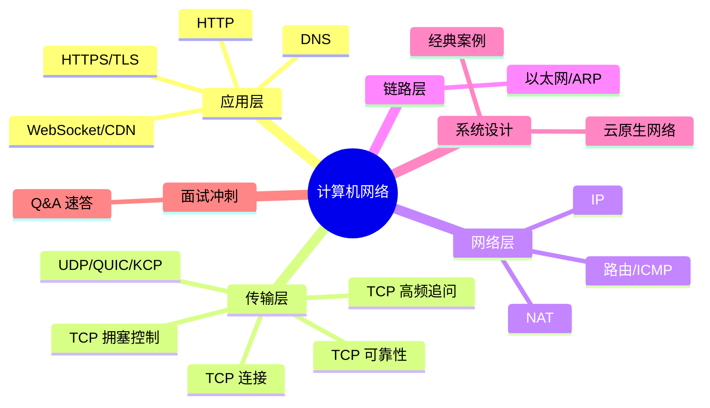

# 计算机网络面试知识体系 Implementation Plan

> **For agentic workers:** REQUIRED SUB-SKILL: Use superpowers:subagent-driven-development (recommended) or superpowers:executing-plans to implement this plan task-by-task. Steps use checkbox (`- [ ]`) syntax for tracking.

**Goal:** 在 `ops/network/` 下新建 17 份按 OSI/TCP-IP 分层组织的计算机网络面试知识 Markdown 文档，并同步更新 ops 与根 README。

**Architecture:** 4 个分层目录（应用层/传输层/网络层/链路层）+ 1 个系统设计目录 + 1 个跨主题 Q&A 文件 + 1 个入口 README。每份主题文档遵循五段式结构（概念定义 → 原理与流程 → 高频追问与面试题 → 实战与 Java 生态关联 → 系统设计案例）。纯 Markdown，无构建工具。

**Tech Stack:** Markdown（GitHub Flavored），Mermaid 图表，ASCII 图

## Global Constraints

- 语言：全中文（含注释、文档、提交说明）
- 编码：UTF-8，文件末尾保留空行
- 标题层级：`#` 文档名，`##` 大段落，`###` 知识点或 Q&A
- 图示：优先 Mermaid（GitHub 原生渲染），其次 ASCII 图
- 导航：每份文档顶部含 `> 返回 [网络知识图谱](../README.md)` 链接
- 五段式结构：每份主题文档遵循"概念定义 → 原理与流程 → 高频追问 → 实战关联 → 系统设计案例"
- 交叉引用：用相对链接（如 `./02-transport/tcp-connection.md`）
- 仓库规则：每次新增/修改模块必须同步更新对应 README 和根 README（AGENTS.md 要求）
- 验收方式：文档无代码测试，"测试"环节适配为格式校验 + 内容自检 + 交叉引用检查

## 文件清单

| 文件 | 类型 | 职责 |
|------|------|------|
| `ops/network/README.md` | 入口 | 知识图谱(Mermaid) + 导航表 + 学习路径 |
| `ops/network/01-application/http.md` | 主题 | HTTP/1.1、HTTP/2、HTTP/3、状态码、缓存、Cookie/Session/Token |
| `ops/network/01-application/https-tls.md` | 主题 | TLS 1.2/1.3 握手、证书链、密钥协商、前向保密 |
| `ops/network/01-application/dns.md` | 主题 | DNS 解析流程、层级缓存、DNSSEC、HTTPDNS |
| `ops/network/01-application/application-protocols.md` | 主题 | WebSocket、CDN、FTP/SMTP/IMAP |
| `ops/network/02-transport/tcp-connection.md` | 主题 | 三次握手/四次挥手/状态机/半关闭 |
| `ops/network/02-transport/tcp-reliability.md` | 主题 | 确认重传、滑动窗口、流量控制、粘包拆包 |
| `ops/network/02-transport/tcp-congestion.md` | 主题 | 慢启动/拥塞避免/快重传/快恢复、CUBIC vs BBR |
| `ops/network/02-transport/tcp-high-frequency.md` | 主题 | TIME_WAIT/KeepAlive/SYN Flood/连接队列 |
| `ops/network/02-transport/udp-quic.md` | 主题 | UDP、QUIC、KCP、TCP vs UDP 选型 |
| `ops/network/03-network/ip.md` | 主题 | IPv4/IPv6、CIDR、子网划分、分片、DHCP |
| `ops/network/03-network/nat.md` | 主题 | NAT 类型、NAPT、STUN/TURN/ICE、内网穿透 |
| `ops/network/03-network/routing.md` | 主题 | 静态/动态路由、OSPF、BGP、ICMP |
| `ops/network/04-link/ethernet.md` | 主题 | ARP/MAC/VLAN/STP、交换机 vs 路由器 |
| `ops/network/05-system-design/classic-cases.md` | 主题 | 短链/IM/弹幕/文件上传/限流/负载均衡 |
| `ops/network/05-system-design/cloud-native.md` | 主题 | Service Mesh/K8s CNI/零信任/eBPF |
| `ops/network/06-interview-qa.md` | 汇总 | 50+ 题速答 + 思维导图 |

**修改文件：**
- `ops/README.md` — 升级为结构化入口
- `README.md`（根）— 同步 ops 段落

---

## Task 1: 入口 README + 目录骨架

**Files:**
- Create: `ops/network/README.md`
- Create: `ops/network/01-application/`（目录）
- Create: `ops/network/02-transport/`（目录）
- Create: `ops/network/03-network/`（目录）
- Create: `ops/network/04-link/`（目录）
- Create: `ops/network/05-system-design/`（目录）

**Interfaces:**
- Produces: `ops/network/README.md` 含知识图谱与导航表，后续所有文档引用此文件作为返回链接 `> 返回 [网络知识图谱](../README.md)`

- [ ] **Step 1: 创建目录骨架**

```bash
mkdir -p ops/network/01-application ops/network/02-transport ops/network/03-network ops/network/04-link ops/network/05-system-design
```

- [ ] **Step 2: 编写 `ops/network/README.md`**

内容包含五个部分：
1. **模块简介** — 一句话定位 + 适用对象（Java 后端面试）
2. **知识图谱** — Mermaid mindmap，按分层展示全貌
3. **导航表** — 表格列出所有 17 份文档路径及核心考点
4. **推荐学习路径** — 自顶向下路线 vs 面试冲刺路线
5. **与 java-core/framework 模块的关联** — Netty、Socket 等

Mermaid mindmap 骨架（实际写入时填充）：



导航表骨架：

```markdown
| 分层 | 文档 | 核心考点 |
|------|------|---------|
| 应用层 | [HTTP](./01-application/http.md) | HTTP/1.1-3 演进、状态码、缓存、Cookie/Session/Token |
| 应用层 | [HTTPS/TLS](./01-application/https-tls.md) | TLS 1.2/1.3 握手、证书链、前向保密 |
| 应用层 | [DNS](./01-application/dns.md) | 解析流程、缓存层次、DNSSEC、HTTPDNS |
| 应用层 | [其他协议](./01-application/application-protocols.md) | WebSocket、CDN、FTP/SMTP |
| 传输层 | [TCP 连接](./02-transport/tcp-connection.md) | 三次握手/四次挥手/状态机 |
| 传输层 | [TCP 可靠性](./02-transport/tcp-reliability.md) | 重传、滑动窗口、粘包拆包 |
| 传输层 | [TCP 拥塞控制](./02-transport/tcp-congestion.md) | 慢启动/快重传/CUBIC/BBR |
| 传输层 | [TCP 高频追问](./02-transport/tcp-high-frequency.md) | TIME_WAIT/KeepAlive/SYN Flood |
| 传输层 | [UDP/QUIC](./02-transport/udp-quic.md) | UDP、QUIC、KCP、选型决策 |
| 网络层 | [IP](./03-network/ip.md) | IPv4/IPv6、CIDR、子网、DHCP |
| 网络层 | [NAT](./03-network/nat.md) | NAT 类型、NAPT、穿透方案 |
| 网络层 | [路由/ICMP](./03-network/routing.md) | OSPF、BGP、ICMP、Traceroute |
| 链路层 | [以太网/ARP](./04-link/ethernet.md) | ARP、VLAN、STP |
| 系统设计 | [经典案例](./05-system-design/classic-cases.md) | 短链/IM/弹幕/限流/负载均衡 |
| 系统设计 | [云原生](./05-system-design/cloud-native.md) | Service Mesh、K8s CNI、eBPF |
| 面试冲刺 | [Q&A 速答](./06-interview-qa.md) | 50+ 高频题速答 |
```

- [ ] **Step 3: 格式校验**

检查：
- Mermaid 语法正确（`mindmap` 关键字、缩进）
- 所有导航链接路径与目录结构一致
- 全中文、UTF-8 编码

- [ ] **Step 4: 提交**

```bash
git add ops/network/
git commit -m "docs(network): 新建 network 模块入口 README 与目录骨架

- 建立 5 个分层目录（应用层/传输层/网络层/链路层/系统设计）
- 入口 README 含 Mermaid 知识图谱 + 17 份文档导航表
- 含推荐学习路径与 java-core/framework 模块关联说明"
```

---

## Task 2: HTTP 协议全解

**Files:**
- Create: `ops/network/01-application/http.md`

**Interfaces:**
- Consumes: `ops/network/README.md`（返回链接）
- Produces: HTTP 演进、状态码、缓存、Cookie/Session/Token 知识点

- [ ] **Step 1: 编写 http.md 五段式内容**

文档头部：
```markdown
# HTTP 协议全解

> **一句话定位**：HTTP 是 Java 后端面试最高频的应用层协议，演进/缓存/认证几乎必考。
> **面试热度**：⭐⭐⭐⭐⭐
> **返回**：[网络知识图谱](../README.md)
```

**第一段：概念定义**
- HTTP 报文结构（请求行/首部/体）、方法语义（GET/POST/PUT/DELETE/PATCH/HEAD/OPTIONS）
- 幂等性与安全性定义（哪些方法是幂等的、哪些是安全的）
- HTTP 的无状态性含义

**第二段：原理与流程**
- HTTP/1.0 → 1.1 演进（长连接 Connection: keep-alive、管线化、Host 头、分块传输 Transfer-Encoding: chunked）
- HTTP/2 详解（二进制分帧、多路复用、首部压缩 HPACK、Server Push、队头阻塞解决与遗留）
- HTTP/3 详解（基于 QUIC、0-RTT、连接迁移、彻底解决 TCP 层队头阻塞）
- 状态码全谱（1xx-5xx），重点：101/301/302/304/401/403/408/502/504
- 缓存机制（强缓存 Cache-Control/Expires、协商缓存 ETag/Last-Modified、缓存决策流程图）
- Cookie/Session/Token/JWT 对比（含 CSRF/CORS/XSS 网络层防御）

用 Mermaid sequenceDiagram 画 HTTP/2 多路复用，用表格对比 HTTP/1.1 vs 2.0 vs 3.0。

**第三段：高频追问与面试题**（至少 6 题）
- Q1: HTTP/1.1 的管线化为什么不流行？
- Q2: HTTP/2 解决了 HTTP/1.1 的队头阻塞吗？彻底吗？
- Q3: HTTP/3 为什么弃用 TCP 改用 UDP？
- Q4: 强缓存和协商缓存的优先级？304 怎么触发？
- Q5: GET 和 POST 的本质区别？POST 一定不幂等吗？
- Q6: Cookie/Session/Token/JWT 四者区别？

每题含"参考答案"和"追问"两层。

**第四段：实战与 Java 生态关联**
- JDK HttpClient（Java 11+）使用要点
- okhttp/RestTemplate/WebClient 选型
- Spring Boot 中的缓存控制（Cache-Control 响应头、@Cacheable）
- 抓包：`tcpdump -A -i lo port 8080` / Wireshark HTTP 流

**第五段：系统设计案例**
- 案例：设计一个 RESTful 短链服务的 HTTP 接口（302 vs 301 选择、缓存策略、防刷限流）

- [ ] **Step 2: 格式校验**

检查：
- 五段式结构完整（一~五段标题）
- 所有 Mermaid 语法正确
- 表格含表头分隔行
- 交叉引用链接相对路径正确

- [ ] **Step 3: 提交**

```bash
git add ops/network/01-application/http.md
git commit -m "docs(network): 新增 HTTP 协议全解

- HTTP/1.0-3.0 演进、二进制分帧、多路复用、HPACK、QUIC
- 状态码全谱、缓存机制（强缓存+协商缓存）
- Cookie/Session/Token/JWT 对比、CSRF/CORS/XSS
- 含 Java HttpClient/okhttp/Spring 缓存实战"
```

---

## Task 3: HTTPS 与 TLS

**Files:**
- Create: `ops/network/01-application/https-tls.md`

**Interfaces:**
- Consumes: `http.md`（HTTP 作为 HTTPS 的基础）
- Produces: TLS 1.2/1.3 握手流程、证书链、前向保密

- [ ] **Step 1: 编写 https-tls.md 五段式内容**

文档头部：
```markdown
# HTTPS 与 TLS

> **一句话定位**：TLS 握手与证书链是中高级后端面试的分水岭，能讲清 1.2 vs 1.3 差异加分明显。
> **面试热度**：⭐⭐⭐⭐⭐
> **返回**：[网络知识图谱](../README.md)
```

**第一段：概念定义**
- TLS 在协议栈的位置（应用层与传输层之间）、HTTPS = HTTP + TLS
- 对称加密 vs 非对称加密 vs 哈希、CA 的"为什么"（为什么不能只对称、为什么需要 CA）

**第二段：原理与流程**
- TLS 1.2 握手全流程（ClientHello → ServerHello → Certificate → ServerKeyExchange → ClientKeyExchange → Finished），用 Mermaid sequenceDiagram 绘制
- TLS 1.3 简化（1-RTT/0-RTT、合并握手、移除 RSA 密钥交换、强制 PFS）
- 证书链验证（根 CA → 中间 CA → 终端证书）、吊销机制（CRL/OCSP/OCSP Stapling）
- 密钥交换算法（RSA/DHE/ECDHE）、Session 复用（Session ID/Session Ticket/PSK）
- 前向保密（Forward Secrecy）原理与意义

用表格对比 TLS 1.2 vs 1.3（RTT、密钥交换、加密套件、0-RTT）。

**第三段：高频追问与面试题**（至少 6 题）
- Q1: TLS 1.2 为什么需要 4 个 RTT（含 TCP 3 次握手）？TLS 1.3 怎么优化？
- Q2: 为什么 TLS 1.3 移除了 RSA 密钥交换？
- Q3: 证书链怎么验证？根 CA 从哪来？
- Q4: 前向保密是什么？没有它会有什么后果？
- Q5: HTTPS 会被中间人攻击吗？什么情况下会？
- Q6: Session Ticket 和 Session ID 区别？

**第四段：实战与 Java 生态关联**
- Java keytool 生成证书、PKCS12/JKS
- Spring Boot 配置 HTTPS（server.ssl.*）
- HttpClient 忽略/校验证书
- Let's Encrypt + Certbot 实战

**第五段：系统设计案例**
- 案例：大型电商全站 HTTPS 化的迁移方案（证书获取、Nginx 配置、OCSP Stapling、性能影响、0-RTT 权衡）

- [ ] **Step 2: 格式校验**

检查：五段式结构、Mermaid sequenceDiagram 语法、对比表格、交叉引用。

- [ ] **Step 3: 提交**

```bash
git add ops/network/01-application/https-tls.md
git commit -m "docs(network): 新增 HTTPS 与 TLS

- TLS 1.2 全握手流程（ClientHello→Finished）+ 1.3 简化（1-RTT/0-RTT）
- 证书链验证、CRL/OCSP、密钥交换算法（RSA/DHE/ECDHE）
- 前向保密原理、Session 复用、常见攻击防御
- 含 keytool/Spring Boot HTTPS/Certbot 实战"
```

---

## Task 4: DNS 域名解析

**Files:**
- Create: `ops/network/01-application/dns.md`

- [ ] **Step 1: 编写 dns.md 五段式内容**

头部：
```markdown
# DNS 域名解析

> **一句话定位**：DNS 是应用层基础，解析流程与缓存层次是高频考点，HTTPDNS 常作追问题。
> **面试热度**：⭐⭐⭐⭐
> **返回**：[网络知识图谱](../README.md)
```

**第一段**：DNS 分层架构（根 → TLD → 权威 → 本地递归）、记录类型（A/AAAA/CNAME/MX/TXT/NS/SOA）
**第二段**：解析全流程（浏览器缓存 → OS hosts → 本地 DNS 递归查询），用 Mermaid sequenceDiagram 绘制；缓存层次与 TTL；负载均衡（轮询/智能 DNS）
**第三段**（至少 5 题）：Q1: 一次浏览器输入 URL 到页面显示，DNS 经历了哪些步骤？Q2: 为什么 DNS 用 UDP？Q3: DNS 劫持与污染区别？HTTPDNS 怎么解决？Q4: DNSSEC 原理？Q5: CNAME 和 A 记录区别？
**第四段**：`dig`/`nslookup`/`host` 命令、Java `InetAddress` 解析、本地 hosts 与 DNS 缓存 TTL、HTTPDNS SDK
**第五段**：案例：全球 DNS 调度方案（智能 DNS、CDN 调度、多线路、容灾切换）

- [ ] **Step 2: 格式校验**
- [ ] **Step 3: 提交**

```bash
git add ops/network/01-application/dns.md
git commit -m "docs(network): 新增 DNS 域名解析

- DNS 分层架构、解析全流程（Mermaid 时序图）
- 记录类型、缓存层次与 TTL、负载均衡
- DNSSEC、DNS 劫持/污染、HTTPDNS、DoH/DoT
- 含 dig/nslookup/InetAddress 实战"
```

---

## Task 5: 其他应用层协议

**Files:**
- Create: `ops/network/01-application/application-protocols.md`

- [ ] **Step 1: 编写 application-protocols.md 五段式内容**

头部：
```markdown
# 其他应用层协议（WebSocket / CDN / FTP / SMTP）

> **一句话定位**：WebSocket 与 CDN 是 Java 后端面试中长连接与内容分发的常考题。
> **面试热度**：⭐⭐⭐⭐
> **返回**：[网络知识图谱](../README.md)
```

**第一段**：WebSocket 定位（全双工、基于 TCP）、CDN 定位、FTP/SMTP/IMAP 简述
**第二段**：WebSocket 握手升级（HTTP Upgrade: websocket、Sec-WebSocket-Key/Accept）、帧格式（opcode/mask）、心跳（Ping/Pong）；CDN 原理（回源、缓存策略、调度方式、动态加速）；FTP 主动/被动模式；SMTP/IMAP 流程
**第三段**（至少 5 题）：Q1: WebSocket 和 HTTP/2 Server Push 区别？Q2: WebSocket 怎么做心跳？为什么需要？Q3: CDN 回源策略有哪些？Q4: WebSocket 会断吗？断线重连怎么做？Q5: 长轮询、SSE、WebSocket 怎么选？
**第四段**：Java `javax.websocket`/Spring WebSocket/Netty WebSocket、CDN 配置（缓存头、刷新）、Nginx WebSocket 代理（`proxy_set_header Upgrade`）
**第五段**：案例：IM 系统长连接选型（WebSocket vs MQTT vs 私有协议，心跳间隔设计、断线重连、房间路由）

- [ ] **Step 2: 格式校验**
- [ ] **Step 3: 提交**

```bash
git add ops/network/01-application/application-protocols.md
git commit -m "docs(network): 新增其他应用层协议

- WebSocket 握手升级、帧格式、心跳/Ping-Pong
- CDN 回源/缓存/调度、FTP 主动/被动、SMTP/IMAP
- 含 Spring WebSocket/Netty/Nginx 代理实战"
```

---

## Task 6: TCP 连接管理

**Files:**
- Create: `ops/network/02-transport/tcp-connection.md`

**Interfaces:**
- Produces: TCP 状态机、三次握手/四次挥手，后续 `tcp-reliability.md`/`tcp-congestion.md`/`tcp-high-frequency.md` 引用此文档

- [ ] **Step 1: 编写 tcp-connection.md 五段式内容**

头部：
```markdown
# TCP 连接管理

> **一句话定位**：三次握手/四次挥手是 TCP 面试的起手式，状态机是高频追问核心。
> **面试热度**：⭐⭐⭐⭐⭐
> **返回**：[网络知识图谱](../README.md)
```

**第一段**：TCP 首部格式（序号/确认号/标志位 SYN/ACK/FIN/RST/URG/PSH、窗口、选项 MSS/窗口缩放/SACK/Timestamps）、TCP 的面向连接/可靠/全双工/字节流特性
**第二段**：三次握手详图（SYN/SYN-ACK/ACK、序号变化、ISN 随机化原因、为什么不是两次/四次）；四次挥手详图（FIN/ACK/FIN/ACK、半关闭状态、为什么挥手要四次）；TCP 11 个状态完整状态机图（用 Mermaid stateDiagram 绘制）；同时打开/同时关闭；半连接队列（SYN Queue）与全连接队列（Accept Queue）、`tcp_max_syn_backlog`/`somaxconn`/`tcp_abort_on_overflow`

**第三段**（至少 8 题）：
- Q1: 三次握手为什么不是两次？（防止历史重复连接）
- Q2: 三次握手能不能携带数据？（第三次 ACK 可以）
- Q3: 四次挥手为什么是四次不是三次？（全双工）
- Q4: CLOSE_WAIT 过多是谁的锅？TIME_WAIT 过多呢？
- Q5: 半连接队列和全连接队列满了会怎样？
- Q6: ISN 为什么要随机化？（防止序号回绕、旧连接）
- Q7: 三次握手失败，连接怎么清理？
- Q8: 握手期间 SYN Queue 满了会怎样？

**第四段**：Linux 内核参数（`tcp_max_syn_backlog`/`somaxconn`/`tcp_abort_on_overflow`）、`ss -lnt`/`netstat -s | grep overflowed` 排查、Java `ServerSocket` backlog
**第五段**：案例：高并发短链服务 TCP 连接优化（`somaxconn` 调优、连接队列监控、为什么短链用 301 不用长连接）

- [ ] **Step 2: 格式校验**

检查：Mermaid stateDiagram 语法（`[*]` 表示起止状态、`-->` 转移）。

- [ ] **Step 3: 提交**

```bash
git add ops/network/02-transport/tcp-connection.md
git commit -m "docs(network): 新增 TCP 连接管理

- 三次握手/四次挥手详图 + 11 状态完整状态机（Mermaid）
- 半连接/全连接队列、ISN 随机化、同时打开/关闭
- 含内核参数调优与 ss/netstat 排查实战"
```

---

## Task 7: TCP 可靠性机制

**Files:**
- Create: `ops/network/02-transport/tcp-reliability.md`

**Interfaces:**
- Consumes: `tcp-connection.md`（状态机基础）
- Produces: 滑动窗口、流量控制、粘包拆包

- [ ] **Step 1: 编写 tcp-reliability.md 五段式内容**

头部：
```markdown
# TCP 可靠性机制

> **一句话定位**：重传/滑动窗口/流量控制是 TCP 可靠传输的三大支柱，粘包拆包是 Java 网络编程高频题。
> **面试热度**：⭐⭐⭐⭐⭐
> **返回**：[网络知识图谱](../README.md)
```

**第一段**：TCP 字节流特性、序号与确认号、可靠传输的定义
**第二段**：
- 确认与重传（超时重传 RTT/RTO 计算、快重传、SACK）
- 滑动窗口（发送窗口/接收窗口、窗口字段、窗口移动、用 ASCII 图绘制窗口四区间）
- 流量控制（窗口探测、零窗口、坚持定时器、窗口缩放选项）
- 粘包拆包成因（字节流无边界 + MSS/接收缓冲区/发送速率）+ 三种解法（定长/分隔符/长度字段）
- Nagle 算法 vs Delayed ACK、TCP_Cork

**第三段**（至少 6 题）：
- Q1: 粘包拆包怎么产生的？怎么解决？
- Q2: 滑动窗口四个边界是什么？窗口怎么滑动？
- Q3: 接收窗口为 0 时发送方怎么办？
- Q4: Nagle 算法和 Delayed ACK 一起用会怎样？
- Q5: 超时重传和快重传区别？RTO 怎么算？
- Q6: SACK 解决什么问题？

**第四段**：Java 粘包解法（`DataInputStream`/`ByteBuf`/Netty `LengthFieldBasedFrameDecoder`）、Netty 粘包处理器、`TCP_NODELAY` 关闭 Nagle
**第五段**：案例：设计自定义二进制协议（魔数 + 版本 + 长度 + 类型 + 载荷），基于 Netty 实现，说明如何天然解决粘包

- [ ] **Step 2: 格式校验**
- [ ] **Step 3: 提交**

```bash
git add ops/network/02-transport/tcp-reliability.md
git commit -m "docs(network): 新增 TCP 可靠性机制

- 超时重传/快重传/SACK、滑动窗口四区间（ASCII 图）
- 流量控制（窗口探测/零窗口）、粘包拆包三解法
- Nagle vs Delayed ACK、含 Netty LengthFieldBasedFrameDecoder 实战"
```

---

## Task 8: TCP 拥塞控制

**Files:**
- Create: `ops/network/02-transport/tcp-congestion.md`

**Interfaces:**
- Consumes: `tcp-reliability.md`（窗口概念基础）
- Produces: cwnd/ssthresh、CUBIC vs BBR

- [ ] **Step 1: 编写 tcp-congestion.md 五段式内容**

头部：
```markdown
# TCP 拥塞控制

> **一句话定位**：拥塞控制是 TCP 高阶考点，BBR 是近年中高级面试加分项。
> **面试热度**：⭐⭐⭐⭐
> **返回**：[网络知识图谱](../README.md)
```

**第一段**：拥塞控制 vs 流量控制区别（端到端 vs 主机间）、cwnd 与 rwnd 区别、拥塞判定依据（超时/重复 ACK）
**第二段**：
- 四大阶段：慢启动（cwnd 指数增长）、拥塞避免（cwnd 线性增长）、快重传（3 重复 ACK）、快恢复（ssthresh = cwnd/2、cwnd = ssthresh）
- cwnd/ssthresh 状态转移（用 Mermaid 流程图或 ASCII 图）
- CUBIC 算法（基于三次函数的窗口增长）
- BBR 算法（基于瓶颈带宽与最小 RTT 探测，不基于丢包）
- 公平性与收敛、缓冲膨胀（Bufferbloat）
- Linux 内核切换（`net.ipv4.tcp_congestion_control`、`available_congestion_control`）

**第三段**（至少 6 题）：
- Q1: 拥塞控制和流量控制有什么区别？
- Q2: 慢启动为什么叫"慢"？慢在哪？
- Q3: 快重传为什么是 3 次重复 ACK？
- Q4: BBR 和 CUBIC 本质区别？
- Q5: 缓冲膨胀是什么？为什么 BBR 能缓解？
- Q6: 为什么 TCP 要做公平性？

**第四段**：Linux 查看与切换拥塞算法（`ss -i`/`sysctl`）、BBR 启用（`tcp_congestion_control=bbr`）、Java 无法直接控制（系统级）
**第五段**：案例：视频直播/文件下载场景的拥塞控制选型（CUBIC 适合大带宽长 RTT、BBR 适合弱网/移动端）

- [ ] **Step 2: 格式校验**
- [ ] **Step 3: 提交**

```bash
git add ops/network/02-transport/tcp-congestion.md
git commit -m "docs(network): 新增 TCP 拥塞控制

- 四大阶段（慢启动/拥塞避免/快重传/快恢复）+ 状态转移图
- CUBIC vs BBR 算法原理、缓冲膨胀、公平性
- 含 sysctl 切换与 BBR 启用实战"
```

---

## Task 9: TCP 高频面试追问

**Files:**
- Create: `ops/network/02-transport/tcp-high-frequency.md`

**Interfaces:**
- Consumes: `tcp-connection.md`（TIME_WAIT/状态机）、`tcp-reliability.md`（重传）

- [ ] **Step 1: 编写 tcp-high-frequency.md 五段式内容**

头部：
```markdown
# TCP 高频面试追问

> **一句话定位**：TIME_WAIT/SYN Flood/KeepAlive 是社招高频追问，能讲到内核参数加分。
> **面试热度**：⭐⭐⭐⭐⭐
> **返回**：[网络知识图谱](../README.md)
```

**第一段**：TIME_WAIT 定义（主动关闭方进入）、2MSL 定义、KeepAlive 定义、SYN Flood 定义
**第二段**：
- TIME_WAIT 存在原因（防止旧连接的 FIN 丢包、确保被动关闭方能正常关闭）
- 2MSL 来由（MSL = 报文最大生存时间，2 倍是为覆盖两个方向）
- TIME_WAIT 过多怎么办（`tcp_tw_reuse`/`tcp_tw_recycle`/`tcp_max_tw_buckets`，注意 `tcp_tw_recycle` 在 NAT 下有坑，4.12 内核已移除）
- KeepAlive 机制（`tcp_keepalive_time`/`tcp_keepalive_intvl`/`tcp_keepalive_probe`）、为什么应用层心跳更可靠
- SO_REUSEADDR/SO_REUSEPORT、端口耗尽（65535 限制的真相、IP 五元组）
- SYN Flood 攻击与 SYN Cookies、半连接队列保护
- 连接队列溢出排查（`ss -lnt`/`netstat -s | grep -i overflow`/`ss -lnt` Recv-Q/Send-Q）

**第三段**（至少 8 题）：
- Q1: TIME_WAIT 为什么是 2MSL？
- Q2: TIME_WAIT 过多怎么办？`tcp_tw_recycle` 为什么危险？
- Q3: TCP KeepAlive 能替代应用层心跳吗？
- Q4: 服务器端口只有 65535 个，怎么支撑百万连接？
- Q5: SYN Flood 怎么攻击？怎么防？
- Q6: `SO_REUSEADDR` 和 `SO_REUSEPORT` 区别？
- Q7: 连接队列满了会怎样？怎么排查？
- Q8: 为什么 TIME_WAIT 在主动关闭方？

**第四段**：Linux 内核参数全景表（`tcp_tw_reuse`/`tcp_max_tw_buckets`/`tcp_keepalive_*`/`tcp_syncookies`/`somaxconn`）、Java `setKeepAlive`/`setReuseAddress`、Netty IdleHandler 心跳
**第五段**：案例：百万连接 IM 服务器的 TCP 调优（端口/内存/连接队列/心跳间隔/`tcp_tw_reuse`）

- [ ] **Step 2: 格式校验**
- [ ] **Step 3: 提交**

```bash
git add ops/network/02-transport/tcp-high-frequency.md
git commit -m "docs(network): 新增 TCP 高频面试追问

- TIME_WAIT/2MSL、KeepAlive vs 应用层心跳、端口耗尽真相
- SYN Flood/SYN Cookies、连接队列溢出排查
- 内核参数全景表 + Netty IdleHandler 实战"
```

---

## Task 10: UDP、QUIC、KCP

**Files:**
- Create: `ops/network/02-transport/udp-quic.md`

- [ ] **Step 1: 编写 udp-quic.md 五段式内容**

头部：
```markdown
# UDP、QUIC 与 KCP

> **一句话定位**：UDP 与 QUIC 是 HTTP/3 的基础，KCP 在游戏/音视频面试常出现。
> **面试热度**：⭐⭐⭐⭐
> **返回**：[网络知识图谱](../README.md)
```

**第一段**：UDP 特点（无连接/不可靠/面向报文）、UDP 首部（8 字节）、QUIC 定位、KCP 定位
**第二段**：
- UDP 应用场景（DNS/视频流/游戏/IoT）
- QUIC 详解（基于 UDP 实现可靠传输、多路复用无队头阻塞、0-RTT、连接迁移、前向纠错）
- KCP 详解（ARQ + 前向纠错、快速模式 vs 正常模式、牺牲带宽换延迟）
- TCP vs UDP 对比表（连接/可靠性/流量控制/拥塞控制/头部开销/应用场景）
- TCP vs UDP 选型决策树

**第三段**（至少 5 题）：
- Q1: 为什么 DNS 用 UDP？
- Q2: QUIC 为什么基于 UDP 而不是新协议？
- Q3: QUIC 怎么解决 TCP 层队头阻塞？
- Q4: KCP 比 TCP 快在哪？代价是什么？
- Q5: 视频/游戏/IM 分别选 TCP 还是 UDP？

**第四段**：Java DatagramSocket/Netty UDP、HTTP/3 客户端支持现状、KCP Java 实现
**第五段**：案例：实时音视频通信的协议选型（UDP + FEC + ARQ、WebRTC 为什么用 UDP）

- [ ] **Step 2: 格式校验**
- [ ] **Step 3: 提交**

```bash
git add ops/network/02-transport/udp-quic.md
git commit -m "docs(network): 新增 UDP、QUIC 与 KCP

- UDP 首部与场景、QUIC（多路复用/0-RTT/连接迁移）
- KCP（ARQ+FEC/快速模式）、TCP vs UDP 选型决策树
- 含 DatagramSocket/Netty/WebRTC 实战"
```

---

## Task 11: IP 协议

**Files:**
- Create: `ops/network/03-network/ip.md`

- [ ] **Step 1: 编写 ip.md 五段式内容**

头部：
```markdown
# IP 协议

> **一句话定位**：子网划分与 CIDR 是网络层高频考点，IPv6 在云原生面试常出现。
> **面试热度**：⭐⭐⭐⭐
> **返回**：[网络知识图谱](../README.md)
```

**第一段**：IPv4 首部（版本/IHL/TTL/Protocol/源/目的 IP）、无连接/不可靠、IPv4 地址分类（A/B/C/D/E）
**第二段**：
- 子网掩码与 CIDR（`/24` 含义、子网划分计算示例）
- IPv6（地址格式、为什么无 NAT、双栈/隧道过渡）
- 分片与重组（MTU/PMTU Discovery、DF 标志、分片风险）
- DHCP 工作流程（DORA：Discover/Offer/Request/Ack）

**第三段**（至少 5 题）：
- Q1: `192.168.1.0/24` 能容纳多少主机？怎么算？
- Q2: 为什么需要 IPv6？IPv4 耗尽后怎么过渡？
- Q3: IP 分片在什么情况下发生？为什么有风险？
- Q4: TTL 怎么防止路由环路？
- Q5: DHCP 怎么避免 IP 冲突？

**第四段**：Linux `ip`/`ifconfig`/`route`、Java `InetAddress`/`NetworkInterface`、CIDR 计算
**第五段**：案例：K8s Pod 网段规划（/16 vs /12、Service IP段、NodePort 范围、IPv4 耗尽下的策略）

- [ ] **Step 2: 格式校验**
- [ ] **Step 3: 提交**

```bash
git add ops/network/03-network/ip.md
git commit -m "docs(network): 新增 IP 协议

- IPv4 首部、CIDR 与子网划分计算、IPv6 过渡
- 分片重组/MTU、DHCP DORA 流程
- 含 ip/ifconfig/InetAddress 与 K8s 网段规划实战"
```

---

## Task 12: NAT 与穿透

**Files:**
- Create: `ops/network/03-network/nat.md`

- [ ] **Step 1: 编写 nat.md 五段式内容**

头部：
```markdown
# NAT 与内网穿透

> **一句话定位**：NAT 类型与穿透方案是 P2P/WebRTC 面试的门槛题。
> **面试热度**：⭐⭐⭐⭐
> **返回**：[网络知识图谱](../README.md)
```

**第一段**：NAT 定义、为什么需要 NAT（IPv4 耗尽）、NAPT 端口多路复用
**第二段**：
- NAT 四种类型（Full Cone/Restricted Cone/Port-Restricted Cone/Symmetric）
- 各类型对 P2P 的影响（哪些能打洞、哪些不能）
- 内网穿透方案（STUN/TURN/ICE、frp/反向 SOCKS、Ngrok）
- 为什么 P2P 需要 NAT 穿透

**第三段**（至少 5 题）：
- Q1: NAT 四种类型区别？哪种最难穿透？
- Q2: STUN 和 TURN 区别？
- Q3: ICE 是什么？怎么组合 STUN/TURN？
- Q4: 为什么 Symmetric NAT 不能打洞？
- Q5: frp 的原理是什么？

**第四段**：Java `java.net` 在 NAT 环境下的局限、WebRTC Java SDK、frp 配置示例
**第五段**：案例：P2P 文件分享系统（NAT 探测 → 打洞 → 失败回退 TURN relay）

- [ ] **Step 2: 格式校验**
- [ ] **Step 3: 提交**

```bash
git add ops/network/03-network/nat.md
git commit -m "docs(network): 新增 NAT 与内网穿透

- NAT 四类型（Full/Restricted/Port-Restricted/Symmetric）
- NAPT、STUN/TURN/ICE、frp/Ngrok
- 含 WebRTC 与 P2P 打洞实战案例"
```

---

## Task 13: 路由与 ICMP

**Files:**
- Create: `ops/network/03-network/routing.md`

- [ ] **Step 1: 编写 routing.md 五段式内容**

头部：
```markdown
# 路由与 ICMP

> **一句话定位**：OSPF/BGP 是网络工程师考点，Java 后端面试常考 Traceroute 原理。
> **面试热度**：⭐⭐⭐
> **返回**：[网络知识图谱](../README.md)
```

**第一段**：路由表结构、静态 vs 动态路由、ICMP 定义
**第二段**：
- OSPF（链路状态、区域划分、SPF 算法、Hello/LSA）
- BGP（路径向量、AS、互联网骨干、属性选路）
- ICMP（Echo Request/Reply、Time Exceeded、Destination Unreachable）
- Traceroute 原理（TTL 递增 + ICMP 超时）
- 路由环路、TTL 防环

**第三段**（至少 5 题）：
- Q1: Traceroute 怎么工作？为什么用 UDP/ICMP？
- Q2: OSPF 和 BGP 区别？分别用在什么场景？
- Q3: 路由环路怎么产生？怎么防？
- Q4: ping 用什么协议？
- Q5: BGP 为什么用 TCP？

**第四段**：`traceroute`/`mtr`/`ip route`、Java 无法直接控制路由表、Service Mesh 的路由控制
**第五段**：案例：多机房互联路由设计（BGP + OSPF、AS 间/AS 内、容灾切换）

- [ ] **Step 2: 格式校验**
- [ ] **Step 3: 提交**

```bash
git add ops/network/03-network/routing.md
git commit -m "docs(network): 新增路由与 ICMP

- OSPF（链路状态/SPF）、BGP（路径向量/AS）
- ICMP、Traceroute 原理、路由环路防环
- 含 traceroute/mtr 实战"
```

---

## Task 14: 以太网与 ARP

**Files:**
- Create: `ops/network/04-link/ethernet.md`

- [ ] **Step 1: 编写 ethernet.md 五段式内容**

头部：
```markdown
# 以太网与 ARP

> **一句话定位**：链路层在 Java 后端面试占比低，但 ARP 欺骗与 VLAN 是云原生基础。
> **面试热度**：⭐⭐⭐
> **返回**：[网络知识图谱](../README.md)
```

**第一段**：MAC 地址、以太网帧格式、CSMA/CD
**第二段**：ARP 工作原理（请求/应答/缓存）、ARP 欺骗原理、VLAN/Trunk/802.1Q、STP 防环（根桥选举、端口角色）、交换机 vs 路由器（二层 vs 三层）
**第三段**（至少 4 题）：Q1: ARP 怎么工作？能不能跨网段？Q2: ARP 欺骗怎么防？Q3: VLAN 的作用？Q4: 交换机和路由器区别？
**第四段**：`arp`/`ip neigh`、Linux bridge/veth、K8s 网络中的 ARP、arping 排查
**第五段**：案例：数据中心网络架构（Spine-Leaf vs 传统三层、VLAN 隔离、SDN）

- [ ] **Step 2: 格式校验**
- [ ] **Step 3: 提交**

```bash
git add ops/network/04-link/ethernet.md
git commit -m "docs(network): 新增以太网与 ARP

- MAC/帧格式/CSMA-CD、ARP 原理与欺骗
- VLAN/Trunk/802.1Q、STP 防环、交换机 vs 路由器
- 含 Spine-Leaf 数据中心架构案例"
```

---

## Task 15: 经典网络架构案例

**Files:**
- Create: `ops/network/05-system-design/classic-cases.md`

**Interfaces:**
- Consumes: 应用层/传输层各文档知识点（HTTP/WebSocket/TCP/UDP/限流）

- [ ] **Step 1: 编写 classic-cases.md 内容**

本文档偏第五段（案例为主），前四段精简为引言。

头部：
```markdown
# 经典网络架构案例

> **一句话定位**：系统设计题是高级后端面试的核心环节，本篇覆盖 6 个网络相关的经典案例。
> **面试热度**：⭐⭐⭐⭐⭐
> **返回**：[网络知识图谱](../README.md)
```

每个案例统一结构：**需求分析 → 整体架构（Mermaid 图）→ 协议选型 → 容量/带宽估算 → 热点追问**

**案例 1：短链系统**
- 需求：长链转短链、跳转、防刷
- 架构：发号器（雪花/Redis 自增）→ 短码 Base62 → KV 存储 → 301/302 跳转
- 协议：HTTP 301（可缓存）vs 302（可统计）
- 容量：10亿短链、每秒 10万 QPS、缓存层设计
- 追问：发号器怎么选？短码冲突怎么办？怎么防刷？

**案例 2：IM 消息推送系统**
- 铭求：单聊/群聊/消息漫游/已读
- 架构：长连接网关（WebSocket/TCP）→ 消息路由 → 存储 → 推送
- 协议：WebSocket vs 私有 TCP、消息可靠投递（ACK + 重发 + 序号）
- 容量：百万在线、消息扇出
- 追问：怎么保证消息不丢？消息顺序？离线消息？群消息扇出优化？

**案例 3：弹幕系统**
- 需求：实时广播、房间隔离、峰值应对
- 架构：WebSocket/UDP 推送 → 房间路由 → 消息聚合 → 扇出
- 协议：WebSocket（简单）vs UDP（低延迟）
- 容量：10万房间、每房间 1万人、消息聚合策略
- 追问：弹幕怎么排序？历史弹幕回放？怎么削峰？

**案例 4：大文件分片上传/断点续传**
- 需求：大文件、断点续传、秒传
- 架构：前端分片 → 后端合并 → 秒传（MD5 去重）
- 协议：HTTP multipart/分片 PUT
- 容量：5GB 文件、10MB 分片、并发数控制
- 追问：分片大小怎么定？怎么防篡改？秒传怎么实现？

**案例 5：接口限流**
- 需求：单机/分布式限流、多种算法
- 架构：令牌桶/漏桶/滑动窗口 → Redis + Lua → 网关层
- 算法对比表：固定窗口/滑动窗口/令牌桶/漏桶
- 追问：令牌桶和漏桶区别？分布式限流怎么实现？怎么平滑限流？

**案例 6：负载均衡**
- 需求：四层 vs 七层选型、一致性哈希
- 架构：LVS（四层）→ Nginx（七层）→ 应用
- 协议：LVS（DR/NAT/TUN）、Nginx（HTTP 反代）
- 算法：轮询/加权/最少连接/IP Hash/一致性哈希
- 追问：四层和七层区别？一致性哈希怎么解决节点变动？LVS 为什么比 Nginx 快？

- [ ] **Step 2: 格式校验**

检查：每个案例含 5 个子标题、Mermaid 架构图、表格对比。

- [ ] **Step 3: 提交**

```bash
git add ops/network/05-system-design/classic-cases.md
git commit -m "docs(network): 新增经典网络架构案例

- 短链系统/IM 推送/弹幕/文件分片上传/接口限流/负载均衡
- 每个案例含需求→架构→协议选型→容量估算→热点追问
- 含 Mermaid 架构图与算法对比表"
```

---

## Task 16: 云原生网络

**Files:**
- Create: `ops/network/05-system-design/cloud-native.md`

- [ ] **Step 1: 编写 cloud-native.md 内容**

头部：
```markdown
# 云原生网络

> **一句话定位**：Service Mesh/K8s 网络是中高级后端 + 云原生方向的加分项。
> **面试热度**：⭐⭐⭐⭐
> **返回**：[网络知识图谱](../README.md)
```

**第一段**：微服务通信模式（同步 RPC vs 异步 MQ）、Service Mesh 定义、K8s 网络模型
**第二段**：
- 微服务通信（序列化、服务发现、负载均衡、熔断限流）
- Service Mesh（Istio 架构：控制面 Istiod + 数据面 Envoy sidecar、流量治理、mTLS）
- K8s 网络（CNI 规范、Calico BGP vs Flannel VXLAN、Service/Endpoint/kube-proxy iptables vs IPVS、Pod 间通信流程）
- 东西向 vs 南北向流量、零信任网络（mTLS、身份认证、最小权限）
- eBPF 在网络中的应用（XDP、Cilium、数据面加速）

用 Mermaid 绘制 Istio 架构图与 K8s Pod 通信流程。

**第三段**（至少 6 题）：
- Q1: Service Mesh 和 K8s Service 有什么区别？
- Q2: sidecar 模式有什么代价？
- Q3: Calico 和 Flannel 区别？分别用什么场景？
- Q4: kube-proxy iptables 模式为什么在大规模集群性能差？IPVS 好在哪？
- Q5: 东西向和南北向流量是什么？分别怎么治理？
- Q6: eBPF 怎么加速网络？Cilium 为什么能替代 kube-proxy？

**第四段**：Istio 安装与流量治理（VirtualService/DestinationRule）、Cilium eBPF 替代 kube-proxy、Java 微服务在 Mesh 下的变化
**第五段**：案例：大型电商从 Spring Cloud 迁移到 Service Mesh（通信模式变化、mTLS 全链路、灰度发布、性能权衡）

- [ ] **Step 2: 格式校验**
- [ ] **Step 3: 提交**

```bash
git add ops/network/05-system-design/cloud-native.md
git commit -m "docs(network): 新增云原生网络

- Service Mesh（Istio/Envoy）、K8s CNI（Calico/Flannel）
- kube-proxy iptables vs IPVS、东西向/南北向、零信任、eBPF/Cilium
- 含 Spring Cloud→Service Mesh 迁移案例"
```

---

## Task 17: 跨主题高频面试 Q&A

**Files:**
- Create: `ops/network/06-interview-qa.md`

**Interfaces:**
- Consumes: 所有前述主题文档的知识点

- [ ] **Step 1: 编写 06-interview-qa.md 内容**

头部：
```markdown
# 跨主题高频面试 Q&A

> **一句话定位**：面试前冲刺用，50+ 题速答串联各主题，附连环套问思维导图。
> **面试热度**：⭐⭐⭐⭐⭐
> **返回**：[网络知识图谱](../README.md)
```

**内容结构**：
- 按主题分类的 50+ 题速答（每题 3-5 句要点）
  - TCP 篇（15 题）
  - HTTP/HTTPS 篇（12 题）
  - DNS 篇（5 题）
  - IP/NAT 篇（8 题）
  - 系统设计篇（10 题）
- 连环套问思维导图（Mermaid）：标注哪些题是连环追问（如"三次握手→TIME_WAIT→2MSL→`tcp_tw_recycle` 坑"）

每题格式：
```markdown
### Q1: 三次握手为什么不是两次？
**答**：防止历史重复连接。若两次握手，旧 SYN 延迟到达会建立无效连接浪费资源。第三次 ACK 让服务端确认客户端确实活着且想要这个连接。
**关联**：→ [TCP 连接管理](./02-transport/tcp-connection.md#三次握手)
```

- [ ] **Step 2: 格式校验**

检查：50+ 题数量、关联链接路径正确、Mermaid 思维导图语法。

- [ ] **Step 3: 提交**

```bash
git add ops/network/06-interview-qa.md
git commit -m "docs(network): 新增跨主题高频面试 Q&A

- 50+ 题按主题分类速答（TCP/HTTP/DNS/IP/系统设计）
- 每题含关联文档链接、连环套问思维导图（Mermaid）
- 面试冲刺专用"
```

---

## Task 18: 仓库集成与 README 更新

**Files:**
- Modify: `ops/README.md`
- Modify: `README.md`（根）

**Interfaces:**
- Consumes: 所有 17 份文档已创建

- [ ] **Step 1: 升级 `ops/README.md`**

当前内容：
```markdown
个人学习运维记录项目

- linux
- k8s
- docker
- network（计算机网络）
```

替换为结构化入口（参考 `quantitative/README.md` 风格）：
```markdown
# ops — 运维与基础设施

## 模块列表

| 模块 | 说明 |
|------|------|
| linux | Linux 基础与 Shell |
| k8s | Kubernetes 编排 |
| docker | 容器化 |
| [network](./network) | 计算机网络面试知识体系（17 份文档，按分层组织） |

详见 [network/README.md](./network/README.md)
```

- [ ] **Step 2: 更新根 `README.md` 的 ops 段落**

找到根 README 第 117-124 行的 `## ops（运维）` 段落，替换为：
```markdown
## ops（运维）

- Linux
- K8s
- Docker
- 计算机网络（按 OSI 分层的 17 份面试知识文档，含系统设计案例）

详见 [ops/network/README.md](./ops/network/README.md)
```

- [ ] **Step 3: 交叉引用完整性校验**

检查：
- `ops/network/README.md` 导航表链接到所有 17 份文档，路径正确
- 每份文档顶部 `> 返回 [网络知识图谱](../README.md)` 链接正确
- 根 README → ops/network/README.md 链接正确
- ops/README.md → network/README.md 链接正确

运行验证命令：
```bash
# 检查所有文档存在
ls ops/network/README.md ops/network/01-application/*.md ops/network/02-transport/*.md ops/network/03-network/*.md ops/network/04-link/*.md ops/network/05-system-design/*.md ops/network/06-interview-qa.md

# 检查返回链接
grep -r "返回 \[网络知识图谱\]" ops/network/ | wc -l
# 预期：17（每份主题文档都有）

# 检查导航表
grep -c "\.md\]" ops/network/README.md
# 预期：≥17
```

- [ ] **Step 4: 提交**

```bash
git add ops/README.md README.md
git commit -m "docs(network): 集成 network 模块到 ops 与根 README

- ops/README.md 升级为结构化入口，含 network 子模块链接
- 根 README ops 段落同步更新，指向 network/README.md
- 完成交叉引用完整性校验（17 份文档导航+返回链接）"
```

---

## Self-Review 自审记录

**1. Spec coverage（spec 覆盖检查）：**
- ✓ 目录结构：Task 1 覆盖目录骨架 + 入口 README
- ✓ 应用层 4 份：Task 2-5
- ✓ 传输层 5 份：Task 6-10
- ✓ 网络层 3 份：Task 11-13
- ✓ 链路层 1 份：Task 14
- ✓ 系统设计 2 份：Task 15-16
- ✓ Q&A 1 份：Task 17
- ✓ 仓库集成：Task 18
- spec 第二节"入口 README 结构"5 部分全部在 Task 1 Step 2 覆盖
- spec 第三节"五段式模板"在每份文档 Task 中遵循
- spec 第四节"知识点清单"逐项映射到对应 Task
- spec 第五节"仓库集成"在 Task 18 覆盖
- spec 第六节"验收标准"在 Task 18 Step 3 覆盖

**2. Placeholder scan（占位符扫描）：**
- 无 TODO/TBD/FIXME
- 每个 Step 都有具体内容描述或代码骨架
- 五段式的"至少 N 题"是下限要求，不是占位

**3. Type consistency（一致性检查）：**
- 所有文档路径与文件清单表一致
- 返回链接格式统一：`> 返回 [网络知识图谱](../README.md)`
- 交叉引用相对路径统一（`./02-transport/tcp-connection.md`）

**4. Ambiguity check（歧义检查）：**
- 每份文档的核心知识点清单明确（来源于 spec 第四节）
- 提交信息统一格式：`docs(network): 新增 XXX`
- Task 边界清晰：每 Task = 1 份文档 = 1 次独立提交
