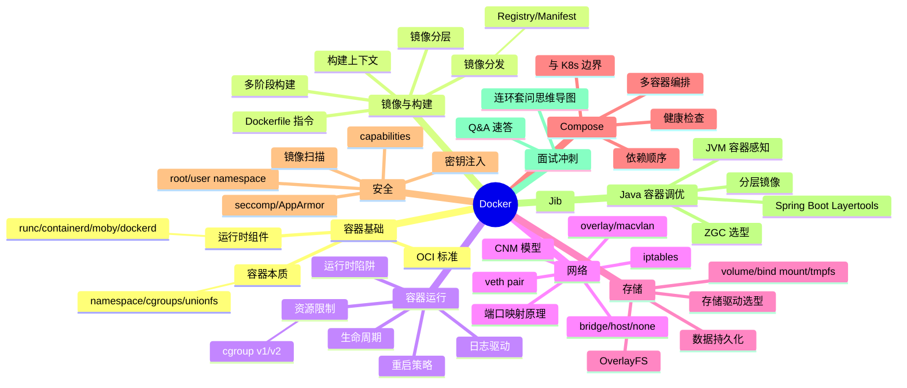
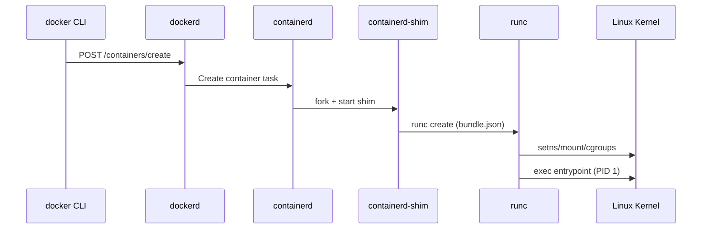
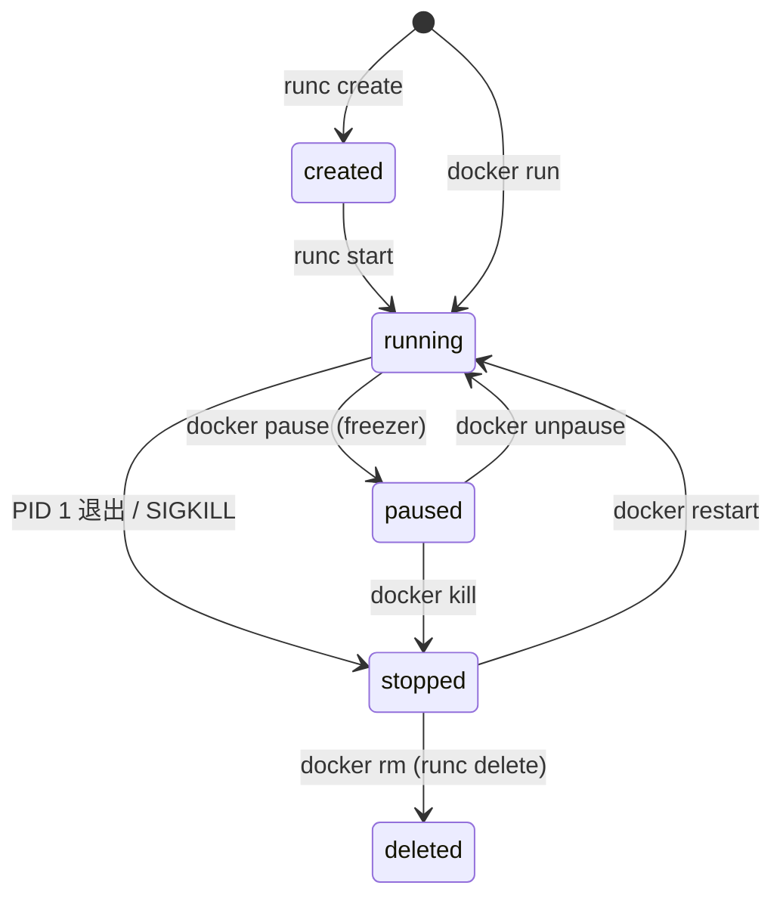
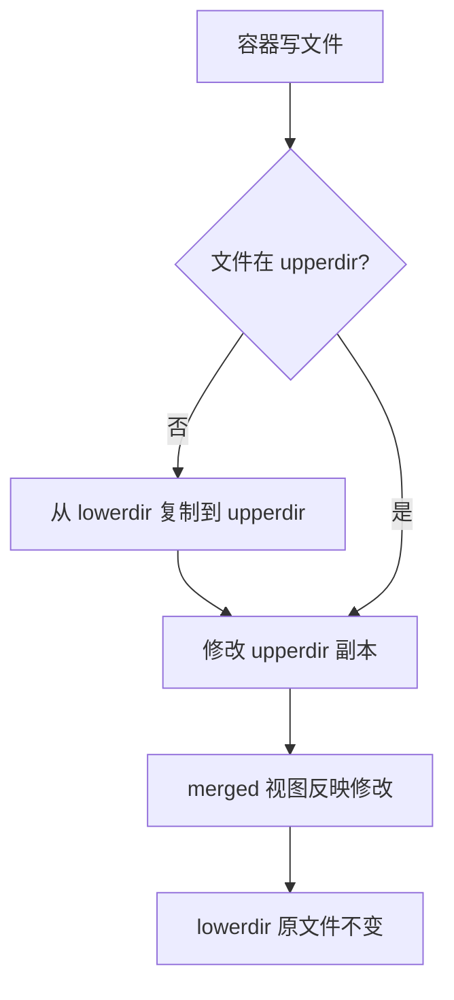
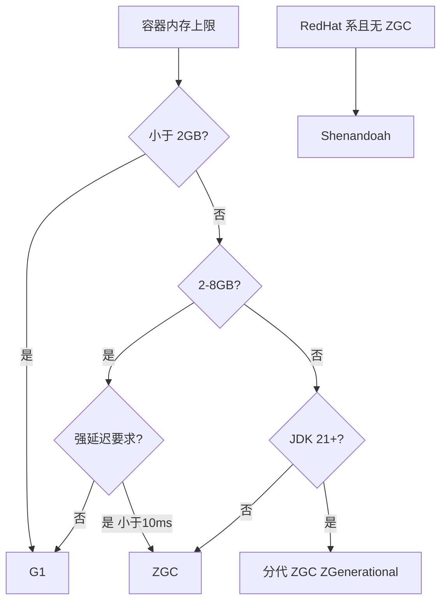
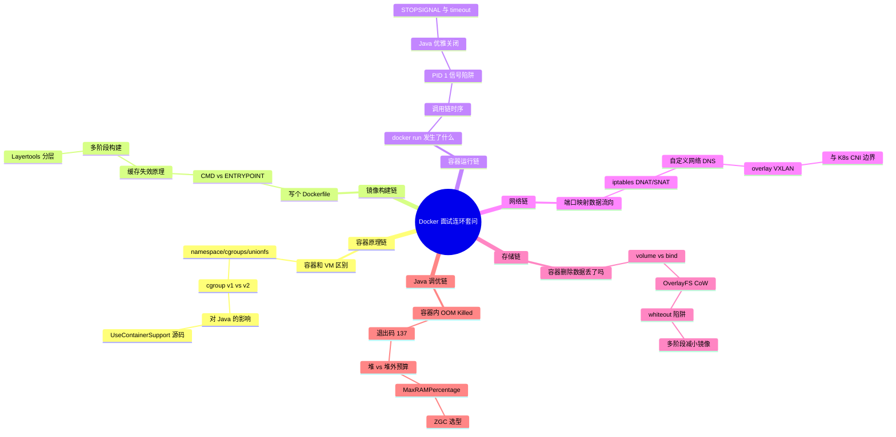

# Docker 面试知识体系 Implementation Plan

> **For agentic workers:** REQUIRED SUB-SKILL: Use superpowers:subagent-driven-development (recommended) or superpowers:executing-plans to implement this plan task-by-task. Steps use checkbox (`- [ ]`) syntax for tracking.

**Goal:** 在 `ops/docker/` 下新建 10 份按 Docker 架构层次组织的 Docker 面试知识 Markdown 文档，并同步更新 ops 与根 README。

**Architecture:** 8 个主题目录（容器基础/镜像构建/容器运行/网络/存储/Compose/安全/Java 调优）+ 1 个 Q&A 文件 + 1 个入口 README。每份主题文档遵循五段式结构（概念定义 → 原理与流程 → 高频追问 → 实战关联 → 面试案例）。纯 Markdown，无构建工具。

**Tech Stack:** Markdown（GitHub Flavored），Mermaid 图表，ASCII 图

## Global Constraints

- 语言：全中文（含注释、文档、提交说明）
- 编码：UTF-8，文件末尾保留空行
- 标题层级：`#` 文档名，`##` 大段落，`###` 知识点或 Q&A
- 图示：优先 Mermaid（GitHub 原生渲染），其次 ASCII 图
- 导航：每份文档顶部含 `> 返回 [Docker 知识图谱](../README.md)` 链接
- 五段式结构：每份主题文档遵循"概念定义 → 原理与流程 → 高频追问 → 实战关联（Java 后端视角） → 面试案例"
- Q&A 篇不套五段式，采用速答列表 + 连环套问思维导图
- 交叉引用：用相对链接（如 `./02-image/dockerfile-and-image.md`）
- 仓库规则：每次新增/修改模块必须同步更新对应 README 和根 README（AGENTS.md 要求）
- 验收方式：文档无代码测试，"测试"环节适配为格式校验 + 内容自检 + 交叉引用检查

## 文件清单

| 文件 | 类型 | 职责 |
|------|------|------|
| `ops/docker/README.md` | 入口 | 知识图谱(Mermaid) + 导航表 + 学习路径 + Java 模块关联 |
| `ops/docker/01-foundation/container-principle.md` | 主题 | 容器本质：namespace/cgroups/unionfs/OCI/runtime 调用链 |
| `ops/docker/02-image/dockerfile-and-image.md` | 主题 | Dockerfile 指令/构建上下文/缓存/多阶段/OCI 格式/Registry |
| `ops/docker/03-container/container-runtime.md` | 主题 | 生命周期/状态机/PID 1/日志驱动/健康检查 |
| `ops/docker/04-network/docker-network.md` | 主题 | bridge/host/overlay/veth/iptables/CNM/DNS 发现 |
| `ops/docker/05-storage/docker-storage.md` | 主题 | OverlayFS/volume/bind/tmpfs/whiteout/驱动选型 |
| `ops/docker/06-compose/docker-compose.md` | 主题 | YAML 结构/depends_on 陷阱/V2 升级/Kompose 边界 |
| `ops/docker/07-security/docker-security.md` | 主题 | capabilities/seccomp/userns-remap/rootless/镜像扫描 |
| `ops/docker/08-performance/java-container-tuning.md` | 主题 | JVM 感知/堆外预算/Layertools/Jib/ZGC 选型 |
| `ops/docker/09-interview-qa.md` | 汇总 | 40 题速答 + 连环套问思维导图 |

**修改文件：**
- `ops/README.md` — docker 行补充链接与文档数
- `README.md`（根）— 同步 ops 段落

---

## Task 1: 入口 README + 目录骨架

**Files:**
- Create: `ops/docker/README.md`
- Create: `ops/docker/01-foundation/`（目录）
- Create: `ops/docker/02-image/`（目录）
- Create: `ops/docker/03-container/`（目录）
- Create: `ops/docker/04-network/`（目录）
- Create: `ops/docker/05-storage/`（目录）
- Create: `ops/docker/06-compose/`（目录）
- Create: `ops/docker/07-security/`（目录）
- Create: `ops/docker/08-performance/`（目录）

**Interfaces:**
- Produces: `ops/docker/README.md` 含知识图谱与导航表，后续所有文档引用此文件作为返回链接 `> 返回 [Docker 知识图谱](../README.md)`

- [ ] **Step 1: 创建目录骨架**

```bash
mkdir -p ops/docker/01-foundation ops/docker/02-image ops/docker/03-container ops/docker/04-network ops/docker/05-storage ops/docker/06-compose ops/docker/07-security ops/docker/08-performance
```

- [ ] **Step 2: 编写 `ops/docker/README.md`**

内容包含五个部分：
1. **模块简介** — 定位（面向 Java 后端面试的 Docker 知识体系）、适用对象（Java 后端面试初中级到高级）、组织方式（8 个主题目录 + 1 个 Q&A 文件）、导航约定（顶部 `> 返回 [Docker 知识图谱](../README.md)` 链接）
2. **知识图谱** — Mermaid mindmap，按 Docker 架构层次展示全貌
3. **导航表** — 表格列出所有 10 份文档路径及核心考点
4. **推荐学习路径** — 系统学习路线 vs 面试冲刺路线
5. **与 java-core/framework 模块的关联** — 仿 network 模块第 5 节

Mermaid mindmap 骨架：



导航表骨架：

```markdown
| 分层 | 文档 | 核心考点 |
|------|------|---------|
| 容器基础 | [容器本质与底层原理](./01-foundation/container-principle.md) | namespace/cgroups/unionfs/OCI/runc·containerd·moby 分工 |
| 镜像与构建 | [镜像构建与分发](./02-image/dockerfile-and-image.md) | Dockerfile 指令/构建上下文/镜像分层/多阶段构建/Registry |
| 容器运行 | [容器运行时与生命周期](./03-container/container-runtime.md) | 生命周期/状态机/PID 1/日志/健康检查 |
| 网络 | [Docker 网络模型](./04-network/docker-network.md) | bridge/host/overlay/veth/iptables/CNM/DNS 发现 |
| 存储 | [Docker 存储模型](./05-storage/docker-storage.md) | OverlayFS/volume/bind/tmpfs/whiteout/驱动选型 |
| Compose | [Docker Compose 多容器编排](./06-compose/docker-compose.md) | YAML 结构/depends_on 陷阱/V2 升级/Kompose 边界 |
| 安全 | [Docker 安全模型](./07-security/docker-security.md) | capabilities/seccomp/userns-remap/rootless/镜像扫描 |
| Java 调优 | [Java 容器调优](./08-performance/java-container-tuning.md) | JVM 感知/堆外预算/Layertools/Jib/ZGC 选型 |
| 面试冲刺 | [Q&A 速答](./09-interview-qa.md) | 40 题速答 + 连环套问思维导图 |
```

学习路径：

```markdown
### 路线一：系统学习（适合有 1-2 周准备期）

按 Docker 架构层次从基础向上深入，先建立全貌再下沉到细节：

01 容器基础 → 02 镜像构建 → 03 容器运行 → 04 网络 → 05 存储 → 06 Compose → 07 安全 → 08 Java 调优 → 09 Q&A

### 路线二：面试冲刺（高频优先，适合 3-5 天突击）

按面试热度排序，先啃必考点，再补体系：

1. 03 容器运行 → 02 镜像构建 → 01 容器基础
2. 04 网络 → 08 Java 调优
3. 05 存储 → 07 安全 → 06 Compose
4. 09 Q&A（40 题，含连环套问思维导图）
```

与 Java 模块关联表骨架（与 spec 5.2 节一致）：

```markdown
## 五、与 java-core / framework 模块的关联

本模块虽为运维文档，但与仓库内 Java 模块存在直接关联，便于在面试中结合源码与实战作答：

| 本模块知识点 | 关联 Java 模块 | 关联要点 |
|-------------|---------------|---------|
| 容器本质 / namespace / cgroups | `java-core/jvm` | JVM 容器内存感知源码路径 |
| 容器本质 / PID 1 与信号 | `framework/spring-framework` | PID 1 与 SIGTERM 优雅关闭 |
| 镜像构建 / Spring Boot 分层 | `framework/spring-framework` | Spring Boot 可执行 jar 结构与分层 |
| 镜像构建 / 配置注入 | `framework/jackson` | 镜像内配置注入优先级 |
| 容器运行 / 优雅关闭 | `framework/spring-framework` | ContextClosedEvent 与 shutdown hook |
| 容器运行 / JVM ShutdownHook | `java-core/jvm` | JVM ShutdownHook 执行时机 |
| Docker 网络 / server.address | `framework/spring-framework` | server.address 与容器网络绑定 |
| Docker 网络 / 健康检查端点 | `framework/valid` | API 网关端口暴露与健康检查端点 |
| Docker 存储 / @Value | `framework/spring-framework` | @Value 与配置优先级在容器化下的行为 |
| Docker 存储 / 日志聚合 | `framework/valid` | 健康检查端点 + 日志聚合 |
| Compose / 多 profile | `framework/spring-framework` | 多 profile 配置与 Compose environment |
| Compose / actuator | `framework/valid` | /actuator/health 作为 healthcheck |
| Docker 安全 / 密钥注入 | `framework/spring-framework` | 密钥注入与 Spring 配置 |
| Docker 安全 / Java agent | `java-core/agent` | Java agent 在容器内的 attach 陷阱 |
| Java 调优 / 堆外预算 | `java-core/jvm` | 堆外内存预算、ZGC 选型、UseContainerSupport 源码 |
| Java 调优 / JarLauncher | `framework/spring-framework` | Spring Boot 3.x JarLauncher、优雅关闭 |
| Java 调优 / probe | `framework/valid` | /actuator/health 作为 probe |

**延伸阅读**：

- `java-core/jvm` —— 对照理解 JVM 容器内存感知与 GC 选型
- `framework/spring-framework` —— Spring Boot 容器化、优雅关闭、配置注入
- `framework/valid` —— API 参数校验与健康检查端点
```

- [ ] **Step 3: 格式校验**

检查：
- Mermaid 语法正确（`mindmap` 关键字、缩进）
- 所有导航链接路径与目录结构一致
- 全中文、UTF-8 编码

- [ ] **Step 4: 提交**

```bash
git add ops/docker/
git commit -m "docs(docker): 新建 docker 模块入口 README 与目录骨架

- 建立 8 个主题目录（容器基础/镜像构建/容器运行/网络/存储/Compose/安全/Java调优）
- 入口 README 含 Mermaid 知识图谱 + 9 份文档导航表
- 含推荐学习路径与 java-core/framework 模块关联说明"
```

---

## Task 2: 容器本质与底层原理

**Files:**
- Create: `ops/docker/01-foundation/container-principle.md`

**Interfaces:**
- Consumes: `ops/docker/README.md`（返回链接）
- Produces: namespace/cgroups/unionfs/OCI/runtime 调用链知识点，被 Task 3（镜像分层）、Task 4（容器运行调用链）、Task 8（JVM 容器感知）引用

- [ ] **Step 1: 编写 container-principle.md 五段式内容**

文档头部：
```markdown
# 容器本质与底层原理

> **一句话定位**：容器本质是受控的进程，namespace/cgroups/unionfs 是三大基石，面试官最爱"讲讲容器原理"的入口题。
> **面试热度**：⭐⭐⭐⭐⭐
> **返回**：[Docker 知识图谱](../README.md)
```

**第一段：概念定义**
- 容器 vs 虚拟机对比表（隔离层级、资源开销、启动时间、安全边界、镜像体积、跨平台能力）
- 容器的本质：受控的进程——通过 Linux 内核机制实现"轻量级隔离"，无 Guest OS
- 三大基石：namespace（隔离视图）、cgroups（限制资源）、unionfs（分层文件系统）

**第二段：原理与流程**
- **Namespace**：6+1 个 namespace 全表（PID/NET/MNT/IPC/UTS/USER/CGROUP），每个标注"隔离什么、典型命令、面试追问点"；重点讲 PID namespace 的"进程 1 与信号"、USER namespace 的 UID 映射陷阱
- **Cgroups**：v1（controller-based，层级挂载）vs v2（统一层级）对比；资源子系统（cpu/cpuacct/memory/blkio/pids）；docker run 参数与 cgroup 文件映射；重点讲 memory cgroup 的 OOM Killer 触发链与 memory.failcnt
- **UnionFS / OverlayFS**：lowerdir/upperdir/workdir/merged 四层结构图；写时复制（CoW）原理；为什么 OverlayFS 替代 AUFS（性能、mainline）
- **OCI 标准**：OCI Image Spec（manifest/config/layer）+ OCI Runtime Spec（config.json/bundle）+ OCI Distribution Spec；runc 作为 reference runtime 的地位
- **Docker 架构与运行时组件**：dockerd / containerd / containerd-shim / runc 四层调用链时序图（mermaid sequenceDiagram），重点讲"为什么需要 shim"（容器父进程不挂靠 dockerd，daemon 重启不影响容器）
- **容器创建全流程**：`docker run` → API 接收 → containerd 创建 task → shim 启动 runc → namespace/cgroups 设置 → entrypoint 执行（mermaid 流程图）

mermaid sequenceDiagram 骨架：


**第三段：高频追问**（至少 5 题）
- Q1: 容器和虚拟机能同时跑吗？（嵌套虚拟化 + 云原生场景）
- Q2: 为什么容器是"进程级"隔离？安全吗？（逃逸案例：dirty COW、runc CVE-2019-5736）
- Q3: Docker 进程死了，容器会死吗？（shim 设计）
- Q4: cgroup v1 和 v2 的区别对 Java 有什么影响？（部分 JDK 老版本读 v2 失败导致内存限制失效）
- Q5: OverlayFS 与 bind mount 的差异？为什么 volume 比 bind mount 更安全？

每题含"参考答案"和"关联"链接。

**第四段：实战关联（Java 后端视角）**
- Spring Boot 应用打包为镜像后，JVM 看到的"CPU 数"和"内存上限"如何被 namespace/cgroups 改写
- 关联 `java-core/jvm`：JVM 在容器内的内存感知（-XX:+UseContainerSupport、cgroup v1/v2 的探测代码路径），引出第 8 章详细推导
- 关联 `framework/spring-framework`：Spring 应用启动时的 PID 1 与 SIGTERM 优雅关闭问题（dumb-init/tini 的作用）

**第五段：面试案例**
- "讲讲你对 Docker 容器原理的理解"——3 分钟标准答法结构（三大机制 → OCI → 调用链 → 与 VM 的差异）
- "Docker daemon 重启，容器会不会死？"——shim 设计的追问链

- [ ] **Step 2: 格式校验**

检查：
- 五段式结构完整（一~五段标题）
- 所有 Mermaid 语法正确（sequenceDiagram、flowchart 关键字、缩进）
- 表格含表头分隔行
- 交叉引用链接相对路径正确

- [ ] **Step 3: 提交**

```bash
git add ops/docker/01-foundation/container-principle.md
git commit -m "docs(docker): 新增容器本质与底层原理

- 容器 vs VM 对比、namespace/cgroups/unionfs 三大基石
- OCI 标准、dockerd/containerd/shim/runc 调用链时序图
- cgroup v1 vs v2、OOM Killer 触发链
- 含 Java JVM 容器感知与 Spring PID 1 优雅关闭关联"
```

---

## Task 3: 镜像构建与分发

**Files:**
- Create: `ops/docker/02-image/dockerfile-and-image.md`

**Interfaces:**
- Consumes: `ops/docker/README.md`（返回链接）、Task 2 的 unionfs/layer 概念
- Produces: Dockerfile 指令、构建缓存、多阶段构建、镜像分层知识点，被 Task 4（容器可写层）、Task 8（Layertools/Jib）引用

- [ ] **Step 1: 编写 dockerfile-and-image.md 五段式内容**

文档头部：
```markdown
# 镜像构建与分发

> **一句话定位**：镜像本质是分层只读文件系统快照，Dockerfile 指令与构建缓存是面试高频起手题。
> **面试热度**：⭐⭐⭐⭐⭐
> **返回**：[Docker 知识图谱](../README.md)
```

**第一段：概念定义**
- 镜像本质：分层只读文件系统的快照，由 UnionFS 叠加而成；镜像不是"文件"，是"层 + 元数据"的组合
- 三大核心概念关系：image（模板）→ container（运行实例）→ registry（分发仓库）
- 镜像内部结构：manifest（清单）+ config（配置）+ layer（层 tar 包），对应 OCI Image Spec
- 层 layer 的本质：每个 layer 是一个 tar.gz，记录相对上层的文件变更（add/modify/delete，通过 whiteout 文件标记删除）

**第二段：原理与流程**
- **Dockerfile 指令全解**（按使用频率分组表格）：
  - 基础类：FROM（多 stage、--platform）、ARG、LABEL
  - 执行类：RUN（shell/exec 两种形式差异）、CMD vs ENTRYPOINT（重点表格对比 + 组合矩阵：都有/只 CMD/只 ENTRYPOINT/都无）
  - 文件类：COPY vs ADD（ADD 自动解压/远程 URL 的坑，推荐 COPY）、WORKDIR、VOLUME
  - 环境类：ENV、EXPOSE、USER、HEALTHCHECK
  - 构建类：ONBUILD（已不推荐）、SHELL、STOPSIGNAL
- **构建上下文 Build Context**：`.dockerignore` 必要性；构建上下文大小对构建速度的影响；远程上下文（git URL、tar URL）
- **构建缓存与分层原理**（深度重点）：
  - 每条指令产生一个 layer；指令顺序决定缓存命中率
  - 缓存失效规则：指令变 / 上下文文件变（校验 tar 摘要）/ 父层变 → 该层及后续全部失效
  - 缓存优化实践：先 COPY pom.xml → 下载依赖 → 再 COPY src（Maven）的原理推导
  - BuildKit 新一代构建器：并行构建多 stage、`--mount=type=cache` 持久化缓存、`--mount=type=secret` 不留痕
- **多阶段构建 Multi-stage Build**：
  - 动机：构建期需要 JDK/Maven，运行期只需 JRE
  - 语法：`FROM ... AS builder` → `COPY --from=builder`
  - 对镜像体积的影响（典型 400MB → 150MB）
  - 与 BuildKit `--target` 的配合
- **镜像分发与 Registry 协议**：
  - Docker Registry HTTP API V2：push/pull 流程（manifest 先传 / layer 并行）
  - manifest list：多架构镜像（amd64/arm64）的分发机制
  - 镜像签名与可信分发（cosign / Notary v2 简介）
  - 镜像 GC 与存储回收（registry garbage-collect）

CMD vs ENTRYPOINT 组合矩阵（表格）：
```markdown
| 形式 | ENTRYPOINT | CMD | 实际执行 |
|------|-----------|-----|---------|
| 都有（exec 形式）| ["ep"] | ["arg"] | ep arg |
| 都有（shell 形式 ENTRYPOINT）| "ep" | ["arg"] | /bin/sh -c "ep" arg 不传 |
| 只 ENTRYPOINT | ["ep"] | 无 | ep |
| 只 CMD | 无 | ["cmd"] | cmd |
| 都无 | 无 | 无 | 报错 |
```

**第三段：高频追问**（至少 7 题）
- Q1: CMD 和 ENTRYPOINT 的区别？都能被 `docker run` 覆盖吗？（覆盖矩阵 + 易错点：ENTRYPOINT 的 JSON 形式 vs shell 形式）
- Q2: COPY 和 ADD 该用哪个？（官方推荐 COPY，ADD 仅在需自动解压时用）
- Q3: 为什么我的 Dockerfile 构建很慢？缓存怎么失效了？（典型踩坑：先 COPY src 再 mvn install）
- Q4: 镜像为什么这么大？怎么瘦小？（dive 工具 / 多阶段 / slim / distroless / alpine 的取舍）
- Q5: `docker build` 和 `docker buildx build` 的区别？BuildKit 带来了什么？
- Q6: 镜像的"层"存在哪？删除文件能减小镜像吗？（whiteout 文件原理，需要在最后一层删才有效，更稳妥用 squash/multi-stage）
- Q7: 同一镜像在不同架构下怎么 pull？（manifest list）

**第四段：实战关联（Java 后端视角）**
- **Spring Boot 应用 Dockerfile 最佳实践**：
  - 反面示例：单 stage 打 fat jar（每改一行代码，依赖层全部失效）
  - 正面示例（多 stage + 分层），含完整 Dockerfile 代码块
  - 进阶：Spring Boot Layertools 分层（dependencies/spring-boot-loader/snapshot-dependencies/application），配合 BuildKit `--mount=type=cache` 把 Maven `~/.m2` 缓存跨构建复用
- 关联 `framework/spring-framework`：Spring Boot 可执行 jar 的内部结构（BOOT-INF/classes vs BOOT-INF/lib）如何对应到分层
- 关联 `framework/jackson`：镜像内的应用配置注入（环境变量 > JSON 配置文件的优先级）
- distroless vs alpine vs temurin 的选型表（体积、调试工具、glibc vs musl、JDK 兼容性陷阱）

Spring Boot Dockerfile 正面示例：
```dockerfile
FROM maven:3.8-eclipse-temurin-17 AS builder
WORKDIR /app
COPY pom.xml .
RUN mvn dependency:go-offline
COPY src ./src
RUN mvn package -DskipTests

FROM eclipse-temurin:17-jre
COPY --from=builder /app/target/*.jar /app/app.jar
ENTRYPOINT ["java","-jar","/app/app.jar"]
```

**第五段：面试案例**
- "写一个 Spring Boot 的 Dockerfile"（白板题，重点考察分层与缓存）
- "镜像 1.2GB，怎么减小到 200MB？"（多阶段 + distroless + slim）
- "Dockerfile 改一行代码，为什么重新下载了所有依赖？"（缓存失效链追问）

- [ ] **Step 2: 格式校验**
- [ ] **Step 3: 提交**

```bash
git add ops/docker/02-image/dockerfile-and-image.md
git commit -m "docs(docker): 新增镜像构建与分发

- Dockerfile 指令全解（CMD vs ENTRYPOINT 组合矩阵）
- 构建缓存原理与失效规则、BuildKit 改进
- 多阶段构建、镜像 OCI 格式、Registry HTTP API V2
- 含 Spring Boot Dockerfile 最佳实践与 Layertools 预告"
```

---

## Task 4: 容器运行时与生命周期

**Files:**
- Create: `ops/docker/03-container/container-runtime.md`

**Interfaces:**
- Consumes: `ops/docker/README.md`（返回链接）、Task 2 的 shim 调用链
- Produces: 生命周期/状态机/PID 1 信号/日志驱动/健康检查知识点，被 Task 8（JVM ShutdownHook、PID 1）引用

- [ ] **Step 1: 编写 container-runtime.md 五段式内容**

文档头部：
```markdown
# 容器运行时与生命周期

> **一句话定位**：docker run 后发生什么是面试连环追问的核心，PID 1 信号陷阱是 Java 容器化的高频踩坑点。
> **面试热度**：⭐⭐⭐⭐⭐
> **返回**：[Docker 知识图谱](../README.md)
```

**第一段：概念定义**
- 容器生命周期状态机：created → running → paused → stopped → deleted（mermaid stateDiagram）
- 容器与镜像的关系：容器 = 镜像 + 可写层（upperdir）+ 运行时配置（cgroup/namespace/网络）
- 容器配置的三层来源：镜像 Dockerfile（CMD/ENV/EXPOSE）→ docker run 参数（覆盖）→ 运行时动态（IP/挂载点）
- 容器与进程的关系：容器是受 namespace/cgroups 约束的进程树，PID 1 的特殊性

mermaid stateDiagram 骨架：


**第二段：原理与流程**
- **`docker run` 完整调用链**（接 Task 2 shim 设计）：CLI → dockerd API → containerd 创建 container task → containerd-shim fork → runc create（设置 namespace/cgroups/根文件系统）→ runc start → entrypoint 作为 PID 1，mermaid sequenceDiagram
- **容器状态转换全解**：created（CRI 的"已创建未启动"）/ running（PID 1 执行）/ paused（cgroup freezer 子系统冻结，不是 SIGSTOP）/ stopped（PID 1 退出或 SIGKILL/SIGTERM，可写层保留）/ deleted（runc delete 清理）
- **重启策略 Restart Policy**（表格）：no（默认）/ on-failure[:max] / always / unless-stopped；退出码语义；always 和 unless-stopped 在 daemon 重启时的区别；重启计数的重置时机
- **PID 1 与信号处理**（深度重点）：
  - PID 1 的特殊性：内核默认不向 PID 1 转发 SIGTERM（除非显式注册 handler）
  - Java 应用的典型坑：`java -jar app.jar` 作为 PID 1，收到 SIGTERM 不响应优雅关闭
  - 解决方案对比表：tini / dumb-init / bash -c "exec java" / Spring Boot 2.4+ 的 `SIGTERM` 优雅关闭
  - STOPSIGNAL 指令与 `docker stop` 默认 10 秒超时后 SIGKILL 的链路
- **日志驱动 Log Driver**：json-file（默认，100MB 单文件、轮转 1 个，会撑爆磁盘）/ journald / syslog / fluentd / gelf / none；`docker logs` 仅对 json-file/journald 生效；生产推荐
- **健康检查 Healthcheck**：HEALTHCHECK 指令与 `--health-cmd`；start-period / interval / timeout / retries；health status；unhealthy 不会自动重启容器
- **容器资源限制入门**（详细推导放 Task 8，这里讲机制）：`-m / --memory`、`--cpus`、`--cpu-shares`；OOM 时的行为

**第三段：高频追问**（至少 8 题）
- Q1: `docker run` 之后到底发生了什么？（完整调用链）
- Q2: `docker stop` 和 `docker kill` 的区别？（SIGTERM+超时 vs SIGKILL）
- Q3: 为什么 Java 应用 `docker stop` 后要等 10 秒才死？（PID 1 信号陷阱）
- Q4: 容器 paused 后还能被访问吗？（freezer 原理 + 网络连接的坑）
- Q5: `docker run -d` 后容器为什么立刻退出了？（CMD 是 shell 形式 / 前台 vs 后台进程）
- Q6: always 和 unless-stopped 在什么场景下不一样？（daemon 重启）
- Q7: `--restart=on-failure:5` 的 5 是什么意思？计数什么时候清零？
- Q8: 容器的日志在哪？怎么轮转？（json-file 默认坑）
- Q9: HEALTHCHECK unhealthy 为什么不会重启容器？怎么解决？

**第四段：实战关联（Java 后端视角）**
- **Spring Boot 容器优雅关闭**：
  - Spring Boot 2.4+ `server.shutdown=graceful` + `spring.lifecycle.timeout-per-shutdown-phase` 的配合
  - Dockerfile 标配：`STOPSIGNAL SIGTERM` + 合理的 `--stop-timeout`
  - PID 1 问题的解决方案对比：用 tini 做 init（`docker run --init`）vs Spring Boot 内建优雅关闭
- 关联 `framework/spring-framework`：Spring 的 ContextClosedEvent 与 Servlet 容器的 shutdown hook 执行顺序
- 关联 `java-core/jvm`：JVM ShutdownHook 在容器里的执行时机与 SIGTERM 丢失的踩坑
- JVM 进程作为 PID 1 的 `XX:+UseContainerSupport` 之外的隐藏坑：Runtime.getRuntime().availableProcessors() 与 cgroup cpu 限制
- 容器内拿到的 CPU 数与 thread pool 配置的陷阱（Tomcat maxThreads 按宿主机 CPU 配）

**第五段：面试案例**
- "docker run 之后发生了什么？"（调用链时序图，3 分钟标准答法）
- "你的 Spring Boot 应用 `docker stop` 后立刻被 SIGKILL，怎么排查？"（PID 1 信号陷阱 + STOPSIGNAL + timeout）
- "容器日志把磁盘写满，怎么排查和处理？"（json-file 默认配置 + 轮转方案）

- [ ] **Step 2: 格式校验**
- [ ] **Step 3: 提交**

```bash
git add ops/docker/03-container/container-runtime.md
git commit -m "docs(docker): 新增容器运行时与生命周期

- 容器状态机（mermaid stateDiagram）、docker run 调用链时序
- 重启策略、PID 1 信号陷阱、日志驱动、健康检查
- 含 Spring Boot 优雅关闭与 JVM ShutdownHook 关联"
```

---

## Task 5: Docker 网络模型

**Files:**
- Create: `ops/docker/04-network/docker-network.md`

**Interfaces:**
- Consumes: `ops/docker/README.md`（返回链接）、`ops/network` 模块的 NAT/TCP/云原生文档（交叉引用）
- Produces: bridge/host/overlay/veth/iptables/CNM/DNS 发现知识点，被 Task 7（Compose 服务发现）引用

- [ ] **Step 1: 编写 docker-network.md 五段式内容**

文档头部：
```markdown
# Docker 网络模型

> **一句话定位**：Docker 网络基于 Linux 虚拟网络设备实现二层隔离，iptables 链路与 DNS 发现是高频追问核心。
> **面试热度**：⭐⭐⭐⭐
> **返回**：[Docker 知识图谱](../README.md)
```

**第一段：概念定义**
- Docker 网络的本质：基于 Linux 虚拟网络设备（veth pair / bridge / iptables）实现的二层隔离
- CNM（Container Network Model）三要素：Sandbox（namespace）→ Endpoint（veth）→ Network（bridge）
- 与 K8s CNI 的边界：CNM 是 Docker 自有模型，CNI 是 CNCF 标准；本章只讲 CNM，K8s 看独立模块
- 五大内置网络驱动一览表：bridge / host / none / overlay / macvlan（作用、适用场景、隔离级别）

**第二段：原理与流程**
- **bridge 网络（默认，深度重点）**：
  - docker0 网桥的本质：Linux bridge，二层转发，无路由能力
  - 容器接入流程：创建 veth pair → 一端入容器 eth0（netns）→ 一端挂到 docker0 → 分配 172.17.0.0/16 子网 IP
  - 容器间通信：同 bridge 直接二层转发；跨 bridge 需要路由（默认不通）
  - NAT 出网链路：容器 → docker0 → iptables MASQUERADE（POSTROUTING）→ eth0 出网
  - 端口映射原理：`-p 8080:80` → iptables DNAT（PREROUTING + OUTPUT）把宿主 8080 转到容器 80
  - iptables 规则完整链路图（mermaid flowchart：PREROUTING → DNAT → docker0 → 容器 → SNAT → POSTROUTING）
- **host 网络**：容器直接使用宿主 netns，无 veth/docker0；性能最好但无隔离；端口冲突陷阱
- **none 网络**：仅有 lo 回环，完全隔离，用于安全基线与自定义网络栈
- **overlay 网络（跨主机通信）**：动机、键值存储（etcd/consul）+ VXLAN 隧道；VXLAN 封装原理（原始 L2 帧封装进 UDP 默认 4789）；容器跨主机通信流程时序图（mermaid sequenceDiagram）；性能代价（MTU 缩小 50 字节）
- **macvlan 网络**：容器直接获得宿主网段 MAC 地址；陷阱：宿主网卡需 promiscuous mode
- **自定义网络与 DNS 发现**：`docker network create` 自定义 bridge 自带内嵌 DNS server（127.0.0.11）；容器名即域名；默认 bridge 不支持 DNS
- **网络与 namespace 的对应**：每个容器一个 netns，docker0 属于宿主 netns，veth 跨 netns 连接

iptables 链路 mermaid 骨架：


**第三段：高频追问**（至少 7 题）
- Q1: `docker run -p 8080:80` 之后网络数据流向是什么？（iptables 链路）
- Q2: 为什么默认 bridge 下容器间不能用容器名通信，自定义 bridge 可以？（内嵌 DNS）
- Q3: 容器访问外网走的是什么？（docker0 → SNAT）
- Q4: 外部如何访问容器内服务？（DNAT 端口映射 / macvlan / host）
- Q5: overlay 网络的 VXLAN 是什么？有什么性能代价？
- Q6: 两个容器互相 ping 不通，怎么排查？（同 bridge？iptables FORWARD 默认 DROP？）
- Q7: docker0 与宿主 eth0 的关系？（docker0 是独立网桥，通过 iptables 与 eth0 联通）
- Q8: 为什么生产环境很少用 Docker 默认 bridge？（无 DNS、固定子网、单点）

**第四段：实战关联（Java 后端视角）**
- **Spring Boot + MySQL 多容器互访**：
  - 反面：用 `--link`（已废弃，靠 /etc/hosts 注入，单向且不可重连）
  - 正面：自定义 bridge 网络，容器名 DNS 解析（`spring.datasource.url=jdbc:mysql://db:3306`）
  - 衔接到 Task 7 Compose 的 depends_on / networks 配置
- 关联 `ops/network` 模块（交叉引用）：
  - [TCP 连接管理](../network/02-transport/tcp-connection.md)：容器内服务端 TIME_WAIT 堆积与端口耗尽
  - [NAT](../network/03-network/nat.md)：docker0 的 SNAT 就是 NAPT，可对照四种 NAT 类型
  - [云原生网络](../network/05-system-design/cloud-native.md)：overlay/VXLAN 与 K8s CNI、Service Mesh 的边界
- 关联 `framework/spring-framework`：Spring Boot 的 `server.address` 与容器网络绑定的坑（默认 0.0.0.0 才能被外部访问）
- 关联 `framework/valid`：API 网关在容器内的端口暴露与健康检查端点设计

**第五段：面试案例**
- "讲讲 Docker 的网络模型"（CNM → bridge 默认 → veth/iptables → DNS 发现，3 分钟答法）
- "`docker run -p 8080:80` 后外部访问，数据流向是什么？"（iptables 完整链路）
- "容器间互相访问怎么做？默认 bridge 行不行？"（DNS 发现 + 默认 bridge 无 DNS）
- "overlay 网络怎么实现的跨主机通信？"（VXLAN 封装 + 键值存储）

- [ ] **Step 2: 格式校验**
- [ ] **Step 3: 提交**

```bash
git add ops/docker/04-network/docker-network.md
git commit -m "docs(docker): 新增 Docker 网络模型

- CNM 三要素、bridge/host/none/overlay/macvlan 五大驱动
- veth/iptables DNAT/SNAT 完整链路（mermaid flowchart）
- VXLAN 封装、自定义网络 DNS 发现
- 含 ops/network 模块交叉引用与 Spring Boot 多容器互访实战"
```

---

## Task 6: Docker 存储模型

**Files:**
- Create: `ops/docker/05-storage/docker-storage.md`

**Interfaces:**
- Consumes: `ops/docker/README.md`（返回链接）、Task 2 的 unionfs/overlayfs 概念
- Produces: OverlayFS/volume/bind/tmpfs/whiteout 知识点，被 Task 8（堆外内存与可写层）引用

- [ ] **Step 1: 编写 docker-storage.md 五段式内容**

文档头部：
```markdown
# Docker 存储模型

> **一句话定位**：容器可写层随删除消失，volume/bind/tmpfs 三种挂载与 whiteout 陷阱是生产事故高频根因。
> **面试热度**：⭐⭐⭐
> **返回**：[Docker 知识图谱](../README.md)
```

**第一段：概念定义**
- 容器存储的两层：只读镜像层（lowerdir）+ 可写容器层（upperdir）= merged 视图
- 存储持久化的本质：可写层随容器删除而消失，需要挂载外部存储绕过 CoW
- Docker 存储驱动一览表：overlay2（默认）/ overlay / aufs / devicemapper / btrfs / zfs / vfs（兼容性、性能、稳定性）
- 三种数据挂载方式对比：volume / bind mount / tmpfs（管理方、生命周期、性能、跨主机、典型场景）

**第二段：原理与流程**
- **OverlayFS 详解**（衔接 Task 2 unionfs，这里讲存储视角）：
  - 四层结构：lowerdir（只读镜像层，可多个）+ upperdir（可写容器层）+ workdir（OverlayFS 内部工作目录）+ merged（挂载点）
  - 写时复制（CoW）流程图：修改文件 → 复制到 upperdir → 修改副本 → lowerdir 原文件不变
  - 删除文件机制：在 upperdir 创建 whiteout 文件（字符设备 0/0），掩盖 lowerdir 同名文件
  - whiteout 陷阱：在中间层删文件不会减小镜像，因为删除动作本身也是一个层
  - overlay2 vs overlay 区别：lowerdir 从单层改为多层，性能与稳定性提升
- **Volume（推荐方式）**：本质（dockerd 管理的命名目录）、生命周期（独立于容器）、第三方驱动（NFS/云盘/Ceph RBD）、named vs anonymous、初始化行为（空 volume 首次挂载自动复制镜像内容）
- **bind mount**：本质（挂载宿主绝对路径）、典型场景、三大陷阱：
  1. 挂载点不存在时 Docker 自动创建**目录**（而非文件），导致挂配置文件踩坑
  2. 宿主文件 owner/uid 与容器内不一致，权限报错
  3. 覆盖镜像内容：挂载点会遮蔽镜像里同名路径，导致容器内该路径内容被"清空"
- **tmpfs mount**：本质（挂载在内存）、典型场景（密钥、临时文件）、限制（仅 Linux、容量受限、容器停止消失）
- **存储驱动选型与生产实践**：overlay2 几乎是唯一推荐；devicemapper 的 loop-lvm 是历史包袱；镜像层与容器层的 GC
- **数据持久化模式**：数据库容器（volume + 备份）、日志收集（bind mount 或 volume + 采集）、配置注入（config/bind/env）

CoW 流程 mermaid 骨架：


**第三段：高频追问**（至少 6 题）
- Q1: 容器删除后数据还在吗？（看是否用了 volume/bind）
- Q2: volume 和 bind mount 该用哪个？（生产用 volume，开发挂源码用 bind）
- Q3: 在容器里删了文件，镜像会变小吗？（whiteout 陷阱，需最后一层删 / squash / 多阶段）
- Q4: `docker volume rm` 删不掉怎么办？（有容器引用 / dangling volume / `docker volume prune`）
- Q5: bind mount 挂载点变空了是什么原因？（路径不存在自动创建目录 / 覆盖镜像内容）
- Q6: overlay2 和 overlay 有什么区别？（多 lowerdir）
- Q7: 怎么备份数据库容器的数据？（volume 快照 / `docker run --volumes-from` / 物理备份）

**第四段：实战关联（Java 后端视角）**
- **Spring Boot 应用的配置注入与数据持久化**：
  - 配置外部化：bind mount `application.yml` vs 环境变量 vs `--env-file`
  - Spring Boot 的 `spring.config.import` 与 `SPRING_APPLICATION_JSON` 在容器内的使用
  - 关联 `framework/spring-framework`：Spring 的 `@Value` 与配置优先级在容器化部署下的行为
- **日志持久化**：Spring Boot 默认 console 输出 → docker json-file driver → 轮转；文件日志 + bind mount 方案的取舍
  - 关联 `framework/valid`：健康检查端点 + 日志聚合的服务质量监控
- **数据库容器化**：MySQL/PostgreSQL 容器的 volume 挂载与初始化脚本（`/docker-entrypoint-initdb.d`）；生产数据库该不该容器化（权衡表）
- 关联 `java-core/jvm`：JVM 堆外内存（DirectBuffer/Metaspace）与容器可写层写入的陷阱

**第五段：面试案例**
- "Docker 的存储模型是什么？"（镜像层 + 容器层 + 三种挂载）
- "容器删除后数据还在吗？怎么保证数据不丢？"（CoW 层消失 / volume / bind）
- "为什么挂载配置文件后容器内变空目录了？"（bind mount 路径不存在自动创建目录）
- "镜像里删了文件，为什么镜像还变大？"（whiteout 层）

- [ ] **Step 2: 格式校验**
- [ ] **Step 3: 提交**

```bash
git add ops/docker/05-storage/docker-storage.md
git commit -m "docs(docker): 新增 Docker 存储模型

- OverlayFS 四层结构、CoW/whiteout 原理、overlay2 vs overlay
- volume/bind mount/tmpfs 三种挂载对比与三大陷阱
- 存储驱动选型、数据持久化模式
- 含 Spring Boot 配置注入与数据库容器化实战"
```

---

## Task 7: Docker Compose 多容器编排

**Files:**
- Create: `ops/docker/06-compose/docker-compose.md`

**Interfaces:**
- Consumes: `ops/docker/README.md`（返回链接）、Task 5 的自定义网络 DNS 发现
- Produces: Compose YAML/depends_on/healthcheck 知识点

- [ ] **Step 1: 编写 docker-compose.md 五段式内容**

文档头部：
```markdown
# Docker Compose 多容器编排

> **一句话定位**：Compose 是单机多容器声明式编排工具，depends_on 陷阱与 healthcheck 配合是实操题考点。
> **面试热度**：⭐⭐⭐
> **返回**：[Docker 知识图谱](../README.md)
```

**第一段：概念定义**
- Compose 的定位：单机多容器声明式编排工具，YAML 描述"应用栈 = 服务 + 网络 + 卷"
- Compose 的适用边界：开发/测试/CI 场景；生产用 Swarm（已退场）/K8s（看独立模块）
- Compose 与 K8s 的本质差异：单机 vs 集群、无调度重排、无自愈、无滚动升级（对比表）
- Compose 规范（Compose Specification）：Docker 官方推出的跨工具 YAML 规范，被 Kompose 转换为 K8s 资源

**第二段：原理与流程**
- **compose.yml 结构全解**（按顶层键组织）：
  - `services`：服务定义（image/build/ports/volumes/environment/depends_on/healthcheck）
  - `networks`：网络定义（driver: bridge/overlay、external 引用已有网络）
  - `volumes`：命名卷定义（driver: local/nfs、external 引用已有卷）
  - `configs` / `secrets`：仅 Swarm 模式生效；Compose 单机版把 `secrets` 当 bind mount 挂载到 `/run/secrets/<name>`，`configs` 当只读 bind mount 挂载到 `/`
- **服务编排核心指令详解**（深度重点）：
  - `depends_on` 与"启动顺序"陷阱：只保证创建顺序，不保证就绪；长链依赖时仍踩坑
  - `depends_on` 的 condition 形式（service_healthy / service_completed_successfully / service_started）
  - `healthcheck` 在 Compose 中的角色：配合 condition 实现真正的就绪等待
  - `environment` vs `.env` 文件 vs `env_file` 的优先级与安全陷阱（密钥不要进 .env）
  - `ports` vs `expose`：端口映射到宿主 vs 仅在 Compose 内部网络暴露
  - `restart` 策略与 `deploy.restart_policy`（Swarm 模式才生效的陷阱）
  - `build` 与 `image` 组合：构建并打标签，配合 `target` 多阶段选择
- **服务发现机制**：Compose 默认创建一个自定义 bridge 网络，服务名即 DNS 名；衔接 Task 5；跨 Compose 项目通信：external networks
- **Compose V2 升级要点**：V1（Python/docker-compose）→ V2（Go/docker compose 子命令）；字段名变化、`version` 字段废弃、命名规则变化；Compose 与 Swarm 的剥离：`deploy` 字段在 `docker compose` 不生效，仅 `docker stack deploy` 才解释

**第三段：高频追问**（至少 6 题）
- Q1: depends_on 能保证 MySQL 就绪吗？（不能，需 condition: service_healthy）
- Q2: 多个服务怎么通信？（服务名 DNS，默认自定义 bridge）
- Q3: `docker compose up` 和 `docker-compose up` 区别？（V1 vs V2）
- Q4: 修改 compose.yml 后 up 会重建容器吗？（配置 hash 变化触发重建）
- Q5: `docker compose down` 和 `stop` 区别？（down 删容器/网络，卷保留需 -v）
- Q6: 同一 compose.yml 跑多份怎么隔离？（project name，-p 参数）
- Q7: 怎么把 compose.yml 转成 K8s YAML？（Kompose 工具 + 局限性）

**第四段：实战关联（Java 后端视角）**
- **Spring Boot + MySQL + Redis 本地开发栈**（关键点注释，非字段级注释），完整 YAML 代码块：
  ```yaml
  services:
    app:
      build: .
      depends_on:
        db:
          condition: service_healthy  # depends_on 的正确姿势，默认只保证创建顺序
        redis:
          condition: service_started
      environment:
        SPRING_DATASOURCE_URL: jdbc:mysql://db:3306/app  # 服务名 DNS 解析
      ports: ["8080:8080"]
    db:
      image: mysql:8.0
      environment:
        MYSQL_ROOT_PASSWORD: ${MYSQL_PASSWORD}  # 从 .env 注入，密钥不入仓
      volumes: ["db_data:/var/lib/mysql"]  # 命名卷持久化
      healthcheck:
        test: ["CMD", "mysqladmin", "ping", "-h", "localhost"]
        interval: 5s
        retries: 10
    redis:
      image: redis:7-alpine
  volumes:
    db_data:
  ```
- 关联 `framework/spring-framework`：多 profile（dev/prod）配置与 Compose `environment` 的映射；Spring 配置优先级（env > application.yml）
- 关联 `framework/valid`：API 服务健康检查端点（`/actuator/health`）作为 Compose healthcheck 的 test
- 关联 `ops/network`：容器间互访的本质就是 Task 5 自定义 bridge + DNS
- **从 Compose 到 K8s 的迁移边界**：Kompose 能转什么（Deployment/Service/ConfigMap）转不了什么（StatefulSet/PVC 调度/HPA）；生产迁移信号（多机部署、滚动升级、自愈、灰度发布）

**第五段：面试案例**
- "写一个 Spring Boot + MySQL + Redis 的 compose.yml"（白板题，重点考察 depends_on condition 与 healthcheck）
- "depends_on 能保证 MySQL 就绪吗？怎么解决？"（condition + healthcheck）
- "Compose 能用于生产吗？什么场景该换 K8s？"（单机局限 + 迁移信号）

- [ ] **Step 2: 格式校验**
- [ ] **Step 3: 提交**

```bash
git add ops/docker/06-compose/docker-compose.md
git commit -m "docs(docker): 新增 Docker Compose 多容器编排

- compose.yml 结构全解、depends_on condition 陷阱
- V1→V2 升级、deploy 字段 Swarm 陷阱
- Spring Boot+MySQL+Redis 完整示例（关键点注释）
- 含 Kompose 迁移边界与 K8s 衔接"
```

---

## Task 8: Docker 安全模型

**Files:**
- Create: `ops/docker/07-security/docker-security.md`

**Interfaces:**
- Consumes: `ops/docker/README.md`（返回链接）、Task 2 的 namespace/cgroups
- Produces: capabilities/seccomp/userns-remap/rootless/镜像扫描知识点

- [ ] **Step 1: 编写 docker-security.md 五段式内容**

文档头部：
```markdown
# Docker 安全模型

> **一句话定位**：容器共享内核隔离不彻底，纵深防御六层与密钥注入方案是高级岗位筛选题。
> **面试热度**：⭐⭐⭐
> **返回**：[Docker 知识图谱](../README.md)
```

**第一段：概念定义**
- 容器安全的本质：共享内核 → 隔离不彻底 → 需多层纵深防御
- 容器 vs VM 的安全边界对比表（内核共享、逃逸难度、攻击面）
- 纵深防御六层模型：内核 namespace/cgroups → Linux capabilities → seccomp → AppArmor/SELinux → user namespace → 镜像扫描与签名
- 容器逃逸（Container Escape）定义：容器内进程突破隔离获取宿主权限

**第二段：原理与流程**
- **Linux Capabilities 机制**（深度重点）：
  - 传统 Unix 的 root / non-root 二分法问题
  - capabilities 细分：37 个（kernel 5.x），分 rootful 与 rootless
  - Docker 默认丢弃的 caps 集合（--cap-drop=ALL 后按需 --cap-add）
  - 常见危险 caps：CAP_SYS_ADMIN（"新 root"）、CAP_NET_ADMIN、CAP_SYS_PTRACE
  - Java 后端场景：一般业务容器只需 NET_BIND_SERVICE（绑定 <1024 端口）
- **seccomp（Secure Computing Mode）**：BPF 过滤器限制系统调用；Docker 默认 seccomp profile 白名单约 300 个 syscall，拦截 ptrace/mount/keyctl 等；`--security-opt seccomp=unconfined` 的危险
- **AppArmor / SELinux**：AppArmor（Ubuntu 默认，基于路径）；SELinux（RHEL/CentOS 默认，基于标签）；Docker 默认 AppArmor profile docker-default
- **User Namespace 重映射（userns-remap）**：容器内 root（uid=0）→ 宿主非特权用户（如 uid=100000）；启用陷阱（文件权限、volume 挂载、已存在镜像兼容）
- **Rootless 模式（Docker 20.10+）**：dockerd 以非 root 运行；限制（无法 --privileged、部分网络驱动受限）
- **镜像安全生命周期**：
  - 构建期：基础镜像来源、最小化镜像（distroless）、不硬编码密钥
  - 扫描：Trivy / Grype / Snyk 扫描 CVE，CI 集成
  - 运行期：read-only 根文件系统（--read-only + tmpfs 挂载可写目录）
  - 分发：镜像签名（cosign / Notary v2）、供应链安全（SLSA）

**第三段：高频追问**（至少 7 题）
- Q1: 容器和虚拟机哪个更安全？（共享内核的固有风险 + 纵深防御）
- Q2: `docker run --privileged` 危险在哪？（禁用所有隔离，接近宿主 root）
- Q3: 容器逃逸怎么发生？（runc CVE-2019-5736、dirty COW、CAP_SYS_ADMIN 滥用）
- Q4: 容器内 root 是真 root 吗？（默认是；userns-remap 后不是）
- Q5: Java 应用需要什么 capabilities？（通常只需 NET_BIND_SERVICE 或无）
- Q6: 镜像怎么扫漏洞？CI 怎么集成？（Trivy + CI 流水线）
- Q7: 怎么防止镜像被篡改？（cosign 签名 + 注册策略）
- Q8: --read-only 怎么用？Spring Boot 能跑吗？（tmpfs 挂 /tmp + 日志走 stdout）

**第四段：实战关联（Java 后端视角）**
- **Spring Boot 容器的最小权限配置**：
  - Dockerfile 用 `USER` 切非 root（如 `USER 1000`），需注意文件权限
  - `EXPOSE 8080` 避开 <1024 端口，无需 CAP_NET_BIND_SERVICE
  - `--read-only` + tmpfs 挂 `/tmp`（Spring Boot multipart 上传、Tomcat work 目录）
- **密钥注入方案对比**（深度重点，关联 `framework/spring-framework`）：
  - 禁止：写进 Dockerfile ENV / 打包进镜像 / 提交到 Git
  - 可选：docker run -e / --env-file（简单但 ps 可见）
  - 推荐：Docker Secrets（Swarm）/ Vault / 云厂商 KMS / K8s Secrets（生产看 K8s 模块）
  - Spring Boot 配合：`SPRING_DATASOURCE_PASSWORD_FILE` 读取文件注入（文件由 secret 挂载）
- 关联 `framework/valid`：API 鉴权 token 在容器化部署下的注入与轮转
- 关联 `java-core/agent`：Java agent 在容器内的 attach 陷阱（CAP_SYS_PTRACE 与 nsenter）
- **镜像供应链安全实践**：基础镜像锁定 digest（`FROM eclipse-temurin:17-jre@sha256:...`）；CI 流水线：Maven 构建 → Trivy 扫描 → cosign 签名 → 推送 Registry

**第五段：面试案例**
- "Docker 容器安全吗？怎么加固？"（纵深防御六层 + Java 视角）
- "容器内 root 和宿主 root 一样吗？"（userns-remap + capabilities）
- "数据库密码怎么传给容器？"（密钥注入方案矩阵）

- [ ] **Step 2: 格式校验**
- [ ] **Step 3: 提交**

```bash
git add ops/docker/07-security/docker-security.md
git commit -m "docs(docker): 新增 Docker 安全模型

- 纵深防御六层：capabilities/seccomp/AppArmor/userns-remap/rootless
- 镜像安全生命周期：构建/扫描/运行/分发
- 密钥注入方案矩阵（禁止/可选/推荐）
- 含 Spring Boot 最小权限与供应链安全实战"
```

---

## Task 9: Java 容器调优

**Files:**
- Create: `ops/docker/08-performance/java-container-tuning.md`

**Interfaces:**
- Consumes: `ops/docker/README.md`（返回链接）、Task 2 的 cgroups、Task 4 的 PID 1、Task 3 的多阶段构建
- Produces: JVM 容器感知/堆外预算/Layertools/Jib/ZGC 选型知识点

- [ ] **Step 1: 编写 java-container-tuning.md 五段式内容**

文档头部：
```markdown
# Java 容器调优

> **一句话定位**：JVM 诞生于独占物理机时代，容器感知与堆外内存预算是 Java 后端面试的高级区分题。
> **面试热度**：⭐⭐⭐⭐⭐
> **返回**：[Docker 知识图谱](../README.md)
```

**第一段：概念定义**
- JVM 容器化的核心矛盾：JVM 诞生于"独占物理机"时代，默认按宿主资源估算堆；容器化后资源被 cgroup 限制，老版本 JVM 感知不到导致 OOM 或 CPU 浪费
- 演进时间线：JDK 8u131（-XX:+UseCGroupLimits）→ 8u191（UseContainerSupport 默认开启）→ 10+（正式支持）→ 11+（cgroup v2 支持）
- 两类问题：内存类（堆超限 OOM Killed）与 CPU 类（线程数与可用 CPU 不匹配）
- 本章与 Task 4 的边界：Task 4 讲"机制与现象"，本章讲"JVM 感知原理与调优方法论"

**第二段：原理与流程**
- **JVM 容器内存感知全链路**（深度重点）：
  - JDK 8u191+ 的 `UseContainerSupport`（默认开启）源码路径：`os::Linux::container`
  - 探测顺序：cgroup v2 `/sys/fs/cgroup/` → cgroup v1 `/sys/fs/cgroup/memory/memory.limit_in_bytes`
  - 关键参数矩阵表：
    | 参数 | 作用 | 默认值 | 注意事项 |
    |------|------|--------|---------|
    | -XX:+UseContainerSupport | 总开关 | true（8u191+） | 一般无需关 |
    | -XX:MaxRAMPercentage=75.0 | 堆占总内存百分比 | 25%（老）/ 自定义 | 替代 -Xms/-Xmx 固定值 |
    | -XX:InitialRAMPercentage | 初始堆占比 | 同上 | 建议等于 Max |
    | -XX:MinRAMPercentage | 小容器（<250MB）特殊处理 | 50 | 小内存容器注意 |
    | -Xmx | 固定堆上限 | - | 与 MaxRAMPercentage 二选一 |
  - 陷阱：堆外内存（DirectBuffer / Metaspace / Thread Stack / JNI）不计入堆，堆设 100% 仍会 OOM Killed
  - 堆内 + 堆外 + JVM 自身的内存预算公式：`容器内存 > 堆 + Metaspace + DirectBuffer + ThreadStack × 线程数 + CodeCache + JVM 自身`
- **JVM 容器 CPU 感知**：`Runtime.availableProcessors()` 与 cgroup cpu 限制的关系；cgroup v1（cpu.cfs_quota_us / cpu.cfs_period_us）、cgroup v2（cpu.max）；JDK 10+ 正确感知，8u191+ 部分感知；陷阱：Tomcat/ForkJoinPool/CompletableFuture 并行度都依赖 availableProcessors()
- **OOM Killed 与 GC 诊断**：容器内 OOM Killer（memory cgroup OOM）vs JVM OOM（堆 OOM）区别；诊断信号（退出码 137 = 128 + SIGKILL）；排查链路（docker inspect → dmesg → 确认堆/堆外）；GC 日志配置
- **启动优化与分层镜像**（衔接 Task 3 多阶段构建）：
  - **Spring Boot Layertools**：原理（解包 fat jar 为四层）、价值（依赖层不变 → 缓存命中）、与多阶段配合、与 CDS 配合
  - **Jib（Google 出品）**：原理（无 Dockerfile/daemon，Maven/Gradle 插件直接构造分层镜像）、优势（CI 无需 Docker-in-Docker）、与 Layertools 对比
  - **启动加速全景表**：分层镜像 / Layertools / Jib / CDS/AppCDS / GraalVM Native Image / CRaC
- **GC 选型在容器化场景的变化**（深度重点）：
  - JDK 8 默认 ParallelGC → JDK 9+ 默认 G1 → JDK 15+ ZGC 转正
  - **容器内 GC 选型对比表**：Serial / Parallel / G1 / ZGC / Shenandoah（引入版本、停顿目标、容器内存上限、适用场景、容器化陷阱）
  - **ZGC 在容器内的深度要点**：
    1. 核心机制：染色指针（Colored Pointer）、读屏障（Load Barrier）、整理阶段并发
    2. 容器化的三个陷阱：堆外内存预算（multi-mapping 约堆的 1/64）、CPU 开销（读屏障 5-10% 吞吐损失）、小堆无收益（<2GB 不如 G1）
    3. 容器内启用与参数（含 ZUncommitDelay、ZGenerational JDK 21+）
    4. 选型决策树（mermaid flowchart）
    5. 关联 `java-core/jvm`：染色指针与读屏障源码、分代 ZGC（JEP 439）、GC 日志监控
  - **与其他调优手段的衔接**：ZGC 解决运行期 GC 停顿，Layertools/CDS/GraalVM 解决启动期 + 镜像构建，互补不冲突

ZGC 选型决策树 mermaid 骨架：


**第三段：高频追问**（至少 10 题）
- Q1: 容器内 JVM 堆怎么配？（MaxRAMPercentage，别用固定 -Xmx）
- Q2: 为什么配了 -Xmx 容器还是 OOM Killed？（堆外内存预算漏了）
- Q3: availableProcessors() 在容器里返回的是几？（8u191+ 感知 cgroup，老版本读宿主）
- Q4: Tomcat 线程数在容器里怎么配？（别按宿主 CPU，按 cgroup 限制）
- Q5: 容器退出码 137 是什么？（OOM Killed 或 docker kill）
- Q6: Spring Boot 启动慢，镜像构建慢，怎么优化？（分层 + Layertools + CDS）
- Q7: Jib 和 Dockerfile 构建有什么区别？（无 daemon、自动分层）
- Q8: GraalVM Native Image 能替代 JVM 容器吗？（AOT 优势 + 兼容性陷阱，权衡表）
- Q9: cgroup v2 和 v1 对 JVM 的影响？（8u131 之前都不支持 v2，升级 JDK）
- Q10: ZGC 在容器内怎么选？（小堆用 G1，大堆用 ZGC，JDK 21+ 用分代 ZGC）
- Q11: ZGC 的染色指针为什么需要额外内存？（multi-mapping 堆外元数据）

**第四段：实战关联（Java 后端视角）**
- **生产 Dockerfile 标准模板**（Spring Boot + Layertools + 非 root + 健康检查），完整代码块：
  ```dockerfile
  FROM eclipse-temurin:17-jre-jammy
  WORKDIR /app
  COPY --from=builder layers/dependencies/ ./
  COPY --from=builder layers/spring-boot-loader/ ./
  COPY --from=builder layers/snapshot-dependencies/ ./
  COPY --from=builder layers/application/ ./
  USER 1000:1000
  ENTRYPOINT ["java", \
    "-XX:MaxRAMPercentage=75.0", \
    "-XX:+HeapDumpOnOutOfMemoryError", \
    "-XX:HeapDumpPath=/tmp/heapdump.hprof", \
    "-Xlog:gc*=info:file=/tmp/gc.log:time,level,tags:filecount=5,filesize=10m", \
    "org.springframework.boot.loader.launch.JarLauncher"]
  ```
  关键点注释：MaxRAMPercentage 替代固定堆；HeapDump 落 /tmp（配合 tmpfs）；GC 日志轮转；非 root；JarLauncher（Spring Boot 3.x）
- 关联 `java-core/jvm`：堆外内存预算与 JVM 内存模型推导；GC 选型在容器化场景的变化；`-XX:+UseContainerSupport` 源码路径与探测逻辑
- 关联 `framework/spring-framework`：Spring Boot 3.x 的 JarLauncher 与 2.x 的 JarLauncher 路径变化；Spring Boot 优雅关闭 `server.shutdown=graceful`（衔接 Task 4 PID 1）
- 关联 `framework/valid`：健康检查端点 `/actuator/health` 作为 K8s/Compose probe（衔接 Task 7 healthcheck）
- **调优决策树**（mermaid flowchart）：
  ```mermaid
  flowchart TD
      A[容器 OOM] --> B{退出码 137?}
      B -- 是 --> C{堆 OOM 还是 cgroup OOM?}
      C -- 堆 OOM --> D[调大 MaxRAMPercentage]
      C -- cgroup OOM --> E[堆外内存预算漏了]
      E --> F[补预算: Metaspace+DirectBuffer+ThreadStack]
      B -- 否 --> G[查 GC 日志与内存泄漏]
  ```

**第五段：面试案例**
- "Java 应用容器化后 OOM Killed，怎么排查？"（退出码 137 → 堆 vs 堆外 → 预算公式 → 调整 MaxRAMPercentage）
- "容器内 JVM 怎么配堆？"（MaxRAMPercentage + 预算公式）
- "Spring Boot 镜像构建太慢，每次改代码都重打依赖层，怎么优化？"（Layertools + 多阶段）
- "Tomcat 在容器里线程数暴涨，为什么？"（availableProcessors 老版本读宿主 CPU）
- "ZGC 在容器内怎么选？"（小堆 G1、大堆 ZGC、JDK 21+ 分代 ZGC）

- [ ] **Step 2: 格式校验**
- [ ] **Step 3: 提交**

```bash
git add ops/docker/08-performance/java-container-tuning.md
git commit -m "docs(docker): 新增 Java 容器调优

- JVM 容器内存/CPU 感知源码路径与参数矩阵
- 堆外内存预算公式、OOM Killed 诊断链路
- Layertools/Jib/CDS/GraalVM 启动加速全景表
- ZGC 容器内选型决策树（分代 ZGC、染色指针堆外预算）
- 含生产 Dockerfile 标准模板与调优决策树"
```

---

## Task 10: 跨主题高频面试 Q&A

**Files:**
- Create: `ops/docker/09-interview-qa.md`

**Interfaces:**
- Consumes: 所有前述主题文档的知识点（Task 2-9）

- [ ] **Step 1: 编写 09-interview-qa.md 内容**

文档头部：
```markdown
# 跨主题高频面试 Q&A

> **一句话定位**：面试前冲刺用，40 题速答串联各主题，附连环套问思维导图。
> **面试热度**：⭐⭐⭐⭐⭐
> **返回**：[Docker 知识图谱](../README.md)
```

**内容结构**（不套五段式）：
- 使用说明：全部 40 题按主题分类，每题 3-5 句要点速答，末尾 **关联** 链接指向对应主题文档；连环追问题在题号后标注 🔗；建议先盖住答案自答

**按主题分类的 40 题**：

一、容器基础篇（6 题）：Q1-Q6
- Q1: 容器和虚拟机的区别？🔗
- Q2: Docker 容器的本质是什么？（受控进程 + namespace/cgroups/unionfs）
- Q3: Docker 进程死了，容器会死吗？（shim 设计）
- Q4: cgroup v1 和 v2 有什么区别？对 Java 有什么影响？🔗
- Q5: OverlayFS 的写时复制原理是什么？
- Q6: runc、containerd、dockerd 之间的调用关系？🔗

二、镜像与构建篇（8 题）：Q7-Q14
- Q7: CMD 和 ENTRYPOINT 的区别？🔗
- Q8: COPY 和 ADD 该用哪个？
- Q9: 为什么 Dockerfile 构建很慢？缓存怎么失效了？🔗
- Q10: 多阶段构建解决了什么问题？
- Q11: 镜像为什么这么大？怎么减小？🔗
- Q12: 删除文件能让镜像变小吗？（whiteout 陷阱）
- Q13: BuildKit 带来了什么改进？
- Q14: 同一镜像怎么支持多架构？（manifest list）

三、容器运行篇（6 题）：Q15-Q20
- Q15: `docker run` 之后发生了什么？🔗
- Q16: `docker stop` 和 `docker kill` 的区别？
- Q17: 为什么 Java 应用 `docker stop` 后要等 10 秒才死？🔗
- Q18: 容器退出码 137 是什么意思？🔗
- Q19: always 和 unless-stopped 区别？
- Q20: 容器日志把磁盘写满怎么办？🔗

四、网络篇（5 题）：Q21-Q25
- Q21: Docker 的网络模型是什么？🔗
- Q22: `docker run -p 8080:80` 后数据流向是什么？🔗
- Q23: 容器间互相访问怎么做？默认 bridge 行不行？🔗
- Q24: overlay 网络怎么实现跨主机通信？（VXLAN）
- Q25: 自定义网络为什么支持容器名 DNS？

五、存储篇（4 题）：Q26-Q29
- Q26: 容器删除后数据还在吗？🔗
- Q27: volume 和 bind mount 该用哪个？
- Q28: bind mount 挂载点变空目录是什么原因？🔗
- Q29: 镜像里删了文件为什么镜像还变大？

六、Compose 编排篇（3 题）：Q30-Q32
- Q30: depends_on 能保证 MySQL 就绪吗？🔗
- Q31: Compose 能用于生产吗？什么场景该换 K8s？
- Q32: `docker compose` 和 `docker-compose` 区别？

七、安全篇（4 题）：Q33-Q36
- Q33: Docker 容器安全吗？怎么加固？🔗
- Q34: `--privileged` 危险在哪？
- Q35: 容器内 root 是真 root 吗？🔗
- Q36: 数据库密码怎么传给容器？（密钥注入方案矩阵）

八、Java 容器调优篇（4 题）：Q37-Q40
- Q37: 容器内 JVM 堆怎么配？🔗
- Q38: 为什么配了 -Xmx 容器还是 OOM Killed？🔗
- Q39: Spring Boot 镜像构建太慢怎么优化？（Layertools + Jib + CDS）🔗
- Q40: ZGC 在容器内怎么选？什么场景用？

每题格式：
```markdown
### Q1: 容器和虚拟机的区别？🔗

**答**：核心差异在隔离层级。VM 通过 Hypervisor 虚拟化硬件，每个 VM 有完整 Guest OS，隔离强但开销大（GB 级、秒级启动）。容器共享宿主内核，通过 namespace 隔离视图、cgroups 限制资源、unionfs 提供分层文件系统，是"受控的进程"，开销小（MB 级、毫秒级启动）但隔离边界是内核级，安全弱于 VM。

**关联**：→ [容器本质与底层原理](./01-foundation/container-principle.md)
```

**连环套问思维导图**（mermaid mindmap）：


每条链都是"入口题 → 原理 → 陷阱 → Java 关联"的递进，面试官常按此路径追问。

- [ ] **Step 2: 格式校验**

检查：40 题数量、关联链接路径正确、Mermaid 思维导图语法。

- [ ] **Step 3: 提交**

```bash
git add ops/docker/09-interview-qa.md
git commit -m "docs(docker): 新增跨主题高频面试 Q&A

- 40 题按主题分类速答（容器基础/镜像/运行/网络/存储/Compose/安全/Java调优）
- 每题含关联文档链接、连环套问思维导图（Mermaid）
- 面试冲刺专用"
```

---

## Task 11: 仓库集成与 README 更新

**Files:**
- Modify: `ops/README.md`
- Modify: `README.md`（根）

**Interfaces:**
- Consumes: 所有 10 份文档已创建（Task 1-10）

- [ ] **Step 1: 升级 `ops/README.md`**

当前内容（第 9 行）：
```markdown
| docker | 容器化 |
```

替换为带链接与文档数：
```markdown
| [docker](./docker) | 容器化面试知识体系（10 份文档，按架构层次组织） |
```

- [ ] **Step 2: 更新根 `README.md` 的 ops 段落**

找到根 README 第 117-124 行的 `## ops（运维）` 段落，当前内容：
```markdown
## ops（运维）

- Linux
- K8s
- Docker
- 计算机网络（按 OSI 分层的 17 份面试知识文档，含系统设计案例）

详见 [ops/network/README.md](./ops/network/README.md)
```

替换为：
```markdown
## ops（运维）

- Linux
- K8s
- Docker（10 份面试知识文档，含 Java 容器调优与 ZGC 选型）
- 计算机网络（按 OSI 分层的 17 份面试知识文档，含系统设计案例）

详见 [ops/docker/README.md](./ops/docker/README.md) 与 [ops/network/README.md](./ops/network/README.md)
```

- [ ] **Step 3: 交叉引用完整性校验**

运行验证命令：
```bash
# 检查所有文档存在
ls ops/docker/README.md ops/docker/01-foundation/*.md ops/docker/02-image/*.md ops/docker/03-container/*.md ops/docker/04-network/*.md ops/docker/05-storage/*.md ops/docker/06-compose/*.md ops/docker/07-security/*.md ops/docker/08-performance/*.md ops/docker/09-interview-qa.md

# 检查返回链接
grep -r "返回 \[Docker 知识图谱\]" ops/docker/ | wc -l
# 预期：9（每份主题/QA文档都有，README 不含）

# 检查导航表
grep -c "\.md\]" ops/docker/README.md
# 预期：≥9

# 检查 ops/network 交叉引用（Task 5）
grep -r "../network/" ops/docker/04-network/docker-network.md | wc -l
# 预期：≥3
```

- [ ] **Step 4: 提交**

```bash
git add ops/README.md README.md
git commit -m "docs(docker): 集成 docker 模块到 ops 与根 README

- ops/README.md docker 行升级为带链接与文档数
- 根 README ops 段落同步更新，指向 docker/README.md
- 完成交叉引用完整性校验（10 份文档导航+返回链接）"
```

---

## Self-Review 自审记录

**1. Spec coverage（spec 覆盖检查）：**
- ✓ 目录结构：Task 1 覆盖目录骨架 + 入口 README
- ✓ 容器基础 1 份：Task 2
- ✓ 镜像构建 1 份：Task 3
- ✓ 容器运行 1 份：Task 4
- ✓ 网络 1 份：Task 5
- ✓ 存储 1 份：Task 6
- ✓ Compose 1 份：Task 7
- ✓ 安全 1 份：Task 8
- ✓ Java 调优 1 份：Task 9
- ✓ Q&A 1 份：Task 10
- ✓ 仓库集成：Task 11
- spec 第二节"目录结构"10 份文档全部在 Task 1-10 覆盖
- spec 第三节"统一风格约定"在每份文档 Task 中遵循
- spec 第四节"各文档内容设计"逐项映射到对应 Task
- spec 第五节"交叉引用与 Java 模块关联"在 Task 1（Java 模块关联表）与 Task 5（network 交叉引用）覆盖
- spec 第六节"README 更新规则"在 Task 11 覆盖
- spec 第七节"验收标准"在 Task 11 Step 3 覆盖

**2. Placeholder scan（占位符扫描）：**
- 无 TODO/TBD/FIXME
- 每个 Step 都有具体内容描述或代码骨架
- 五段式的"至少 N 题"是下限要求，不是占位
- Mermaid 骨架均给出具体节点与连线

**3. Type consistency（一致性检查）：**
- 所有文档路径与文件清单表一致
- 返回链接格式统一：`> 返回 [Docker 知识图谱](../README.md)`
- 交叉引用相对路径统一（`./01-foundation/container-principle.md` 等）
- 提交信息统一格式：`docs(docker): 新增 XXX`

**4. Ambiguity check（歧义检查）：**
- 每份文档的核心知识点清单明确（来源于 spec 第四节）
- Task 边界清晰：每 Task = 1 份文档 = 1 次独立提交
- Task 4 与 Task 9 的边界已在 spec 与 Task 9 第一段明确：Task 4 讲"机制与现象"，Task 9 讲"JVM 感知原理与调优方法论"
- Compose secrets 降级行为已在 spec 自审中明确为"bind mount 挂载到 /run/secrets 与 /"
