# K8s 面试知识体系 Implementation Plan

> **For agentic workers:** REQUIRED SUB-SKILL: Use superpowers:subagent-driven-development (recommended) or superpowers:executing-plans to implement this plan task-by-task. Steps use checkbox (`- [ ]`) syntax for tracking.

**Goal:** 在 `ops/k8s/` 下新建 10 份按 K8s 架构层次组织的 K8s 面试知识 Markdown 文档，并同步更新 ops 与根 README。

**Architecture:** 8 个主题目录（架构基础/工作负载/网络/存储/调度与资源/配置与安全/运维与排障/扩展机制/Java 上 K8s）+ 1 个 Q&A 文件 + 1 个入口 README。每份主题文档遵循六段式结构（概念定义 → 原理与流程 → 高频追问 → 实战关联（Java 后端视角） → 面试案例 → 参考与延伸）。纯 Markdown，无构建工具。严格与 docker/network 模块去重，容器底层和网络分层用相对链接引用。

**Tech Stack:** Markdown（GitHub Flavored），Mermaid 图表，ASCII 图

## Global Constraints

- 语言：全中文（含注释、文档、提交说明）
- 编码：UTF-8，文件末尾保留空行
- 标题层级：`#` 文档名，`##` 大段落（一、二、三…），`###` 知识点或 Q&A
- 图示：优先 Mermaid（GitHub 原生渲染），其次 ASCII 图
- 导航：每份文档顶部含 `> 返回 [K8s 知识图谱](../README.md)` 链接，文档尾部重复一次
- 六段式结构：每份主题文档遵循"概念定义 → 原理与流程 → 高频追问与面试题 → 实战关联（Java 后端视角） → 面试案例 → 参考与延伸"
- Q&A 篇不套六段式，采用速答列表 + 连环套问思维导图
- 交叉引用：用相对链接（如 `./02-workload/pod-and-controllers.md`、`../../docker/01-foundation/container-principle.md`、`../../network/02-transport/tcp-connection.md`）
- 深度边界：机制级——讲清工作流程与数据路径，提到关键源码包与函数名（如 client-go 的 cache、kube-scheduler 的 framework.Plugin）但不贴源码、不逐行解析
- 去重边界：容器底层（namespace/cgroups/unionfs/runc/containerd）不展开，引用 docker 模块；TCP/网络分层不展开，引用 network 模块
- 单份文档体量：400-600 行
- 仓库规则：每次新增/修改模块必须同步更新对应 README 和根 README（AGENTS.md 要求）
- 验收方式：文档无代码测试，"测试"环节适配为格式校验 + 内容自检 + 交叉引用检查
- 每份文档完成即提交，提交信息用 `docs(k8s):` 前缀

## 文件清单

| 文件 | 类型 | 职责 |
|------|------|------|
| `ops/k8s/README.md` | 入口 | 知识图谱(Mermaid) + 导航表 + 学习路径 + Java 模块关联 |
| `ops/k8s/01-foundation/k8s-architecture.md` | 主题 | 架构总览/六大核心组件/CRI·CNI·CSI/声明式 API/reconcile |
| `ops/k8s/02-workload/pod-and-controllers.md` | 主题 | Pod 本质/生命周期/探针/Deployment/StatefulSet/DaemonSet/Job |
| `ops/k8s/03-network/service-and-ingress.md` | 主题 | Service 四类型/kube-proxy iptables·ipvs/Ingress/CoreDNS/CNI |
| `ops/k8s/04-storage/volume-and-pv-pvc.md` | 主题 | Volume 类型/PV-PVC/StorageClass/CSI/StatefulSet 持久化 |
| `ops/k8s/05-scheduling/scheduling-and-resources.md` | 主题 | 调度两阶段/亲和/taint/QoS/requests-limits/驱逐 |
| `ops/k8s/06-config-security/config-and-rbac.md` | 主题 | ConfigMap/Secret/RBAC/ServiceAccount/PodSecurity |
| `ops/k8s/07-operations/operations-and-troubleshooting.md` | 主题 | Helm/发布策略/HPA-VPA/日志/Prometheus/排障方法论 |
| `ops/k8s/08-extensions/crd-and-operator.md` | 主题 | CRD/Operator/Informer-List-Watch/Webhook/自定义调度器 |
| `ops/k8s/09-performance/java-on-k8s.md` | 主题 | JVM 感知/preStop 优雅关闭/actuator 探针/ConfigMap/Layertools |
| `ops/k8s/10-interview-qa.md` | 汇总 | 40+ 题速答 + 连环套问思维导图 |

**修改文件：**
- `ops/README.md` — k8s 行补充链接与文档数
- `README.md`（根）— 同步 ops 段落

---

## Task 1: 入口 README + 目录骨架

**Files:**
- Create: `ops/k8s/README.md`
- Create: `ops/k8s/01-foundation/`（目录）
- Create: `ops/k8s/02-workload/`（目录）
- Create: `ops/k8s/03-network/`（目录）
- Create: `ops/k8s/04-storage/`（目录）
- Create: `ops/k8s/05-scheduling/`（目录）
- Create: `ops/k8s/06-config-security/`（目录）
- Create: `ops/k8s/07-operations/`（目录）
- Create: `ops/k8s/08-extensions/`（目录）
- Create: `ops/k8s/09-performance/`（目录）

**Interfaces:**
- Produces: `ops/k8s/README.md` 含知识图谱与导航表，后续所有文档引用此文件作为返回链接 `> 返回 [K8s 知识图谱](../README.md)`

- [ ] **Step 1: 创建目录骨架**

```bash
mkdir -p ops/k8s/01-foundation ops/k8s/02-workload ops/k8s/03-network ops/k8s/04-storage ops/k8s/05-scheduling ops/k8s/06-config-security ops/k8s/07-operations ops/k8s/08-extensions ops/k8s/09-performance
```

- [ ] **Step 2: 编写 `ops/k8s/README.md`**

内容包含五个部分：
1. **模块简介** — 定位（面向 Java 后端面试的 K8s 知识体系）、适用对象（Java 后端面试初中级到高级）、组织方式（8 个主题目录 + 1 个 Q&A 文件，每份主题文档遵循六段式结构）、导航约定（顶部 `> 返回 [K8s 知识图谱](../README.md)` 链接）
2. **知识图谱** — Mermaid mindmap，按 K8s 架构层次展示全貌
3. **导航表** — 表格列出所有 10 份文档路径及核心考点
4. **推荐学习路径** — 系统学习路线 vs 面试冲刺路线
5. **与 java-core / framework 模块的关联** — 关联表 + 延伸阅读

Mermaid mindmap（完整内容，直接写入文档）：

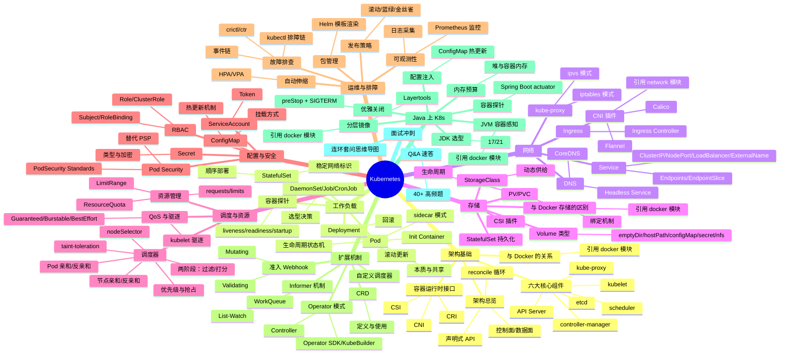

导航表（直接写入文档）：

| 分层 | 文档 | 核心考点 |
|------|------|---------|
| 架构基础 | [架构总览与核心组件](./01-foundation/k8s-architecture.md) | 控制面/数据面、API Server/etcd/scheduler/controller-manager/kubelet/kube-proxy、CRI/CNI/CSI、声明式 API 与 reconcile |
| 工作负载 | [Pod 与控制器](./02-workload/pod-and-controllers.md) | Pod 本质/生命周期/探针、Deployment/StatefulSet/DaemonSet/Job/CronJob |
| 网络 | [Service 与 Ingress](./03-network/service-and-ingress.md) | Service 四类型/kube-proxy iptables·ipvs/Ingress/CoreDNS/CNI |
| 存储 | [Volume 与 PV/PVC](./04-storage/volume-and-pv-pvc.md) | Volume 类型/PV-PVC/StorageClass/CSI/StatefulSet 持久化 |
| 调度与资源 | [调度与资源管理](./05-scheduling/scheduling-and-resources.md) | 两阶段调度/亲和/taint/QoS/requests-limits/驱逐 |
| 配置与安全 | [配置与 RBAC](./06-config-security/config-and-rbac.md) | ConfigMap/Secret/RBAC/ServiceAccount/PodSecurity |
| 运维与排障 | [运维与故障排查](./07-operations/operations-and-troubleshooting.md) | Helm/发布策略/HPA-VPA/日志/Prometheus/排障方法论 |
| 扩展机制 | [CRD 与 Operator](./08-extensions/crd-and-operator.md) | CRD/Operator/Informer-List-Watch/Webhook/自定义调度器 |
| Java 调优 | [Java 应用上 K8s](./09-performance/java-on-k8s.md) | JVM 感知/preStop 优雅关闭/actuator 探针/ConfigMap/Layertools |
| 面试冲刺 | [Q&A 速答](./10-interview-qa.md) | 40+ 题速答 + 连环套问思维导图 |

> 共 **10 份**文档：入口 README（本文档）+ 上表 9 份主题/Q&A 文档。

推荐学习路径部分：

```
路线一（系统学习）：01 架构基础 → 02 工作负载 → 03 网络 → 04 存储 → 05 调度与资源 → 06 配置与安全 → 07 运维与排障 → 08 扩展机制 → 09 Java 上 K8s → 10 Q&A
路线二（面试冲刺）：02 → 03 → 01 → 05 → 06 → 04 → 07 → 09 → 08 → 10
```

与 java-core / framework 模块的关联表（直接写入文档，共 21 行关联，见 spec §5.1）：

| K8s 知识点 | 关联 Java 模块 | 关联要点 |
|-----------|---------------|---------|
| 02 Pod 容器探针 / 健康检查 | `framework/valid` | livenessProbe/readinessProbe 对接 `/actuator/health` 端点 |
| 02 Pod 生命周期 / preStop + SIGTERM | `framework/spring-framework` | Spring Boot graceful shutdown、ContextClosedEvent、@PreDestroy |
| 02 Pod 生命周期 / JVM ShutdownHook | `java-core/jvm` | JVM ShutdownHook 执行时机与 Pod 优雅关闭的协作 |
| 03 Service / Endpoints 负载均衡 | `java-core/rmi`（api/provider/consumer） | 对照 Java 原生 RPC 的服务发现与负载均衡 |
| 03 CNI / CoreDNS / 服务发现 | `java-core/service-provider-framework` | SPI 与服务发现机制是微服务通信基础 |
| 05 调度 / resources requests-limits | `java-core/jvm` | JVM 容器内存感知（cgroup v2）、堆外内存预算、UseContainerSupport |
| 05 调度 / CPU requests 与线程池 | `java-core/forkjoin`、`java-core/stream` | ForkJoinPool 并行度与 CPU limit 的关系、parallelStream 陷阱 |
| 06 ConfigMap / 配置注入 | `framework/spring-framework` | ConfigMap 注入 Spring 配置、@Value 与配置优先级、热更新 |
| 06 ConfigMap / 配置序列化 | `framework/jackson` | ConfigMap 存储的 YAML/JSON 与 Jackson 反序列化 |
| 06 RBAC / ServiceAccount / Token | `framework/spring-framework` | K8s ServiceAccount Token 与 Spring Security 鉴权链对比 |
| 06 Pod Security / 准入控制 | `java-core/annotation`、`java-core/apt` | 准入 Webhook 与 APT 注解处理器的拦截机制对照 |
| 06 Secret / 密钥注入 | `framework/spring-framework` | Secret 挂载与 Spring 配置加密、外部化配置 |
| 07 HPA / 指标采集 | `java-core/jmx` | JMX 指标暴露给 Prometheus Adapter 的路径 |
| 07 故障排查 / Java agent attach | `java-core/agent` | Java agent 在 K8s Pod 内 attach 的 namespace 陷阱 |
| 07 日志采集 / 序列化 | `framework/jackson` | 日志聚合的 JSON 结构化与 Jackson |
| 08 Operator / Controller 模式 | `java-core/annotation`、`java-core/apt` | CRD 定义与注解驱动的模型生成对照 |
| 08 Informer / List-Watch | `java-core/lambda`、`java-core/stream` | 事件回调链与函数式编排 |
| 09 Java 上 K8s / JVM 感知 | `java-core/jvm` | HotspotContainer 源码、cgroup v2 兼容、ZGC 选型 |
| 09 Java 上 K8s / 优雅关闭 | `framework/spring-framework` | Spring Boot 3.x JarLauncher、优雅关闭、actuator 端点 |
| 09 Java 上 K8s / 容器探针 | `framework/valid` | `/actuator/health` 作为 livenessProbe/readinessProbe |
| 09 Java 上 K8s / 分层镜像 | `framework/spring-framework` | Spring Boot Layertools 与 K8s 滚动更新缓存命中 |

延伸阅读：

- `java-core/jvm` —— 对照理解 JVM 容器内存感知、GC 选型、ShutdownHook
- `framework/spring-framework` —— Spring Boot 容器化、优雅关闭、配置注入、Layertools
- `framework/valid` —— 健康检查端点与容器探针对接
- `ops/docker` —— 容器底层原理、运行时调用链、Java 容器调优（K8s 的底层基础）
- `ops/network` —— 网络分层、TCP 连接、云原生网络（K8s Service/CNI 的网络层基础）

- [ ] **Step 3: 格式校验**

检查：
- 五个部分齐全（模块简介/知识图谱/导航表/学习路径/Java 模块关联）
- Mermaid mindmap 语法正确（root、缩进、节点名）
- 导航表 10 行 + 1 行汇总说明
- 关联表 21 行
- 学习路径两条路线

- [ ] **Step 4: 提交**

```bash
git add ops/k8s/README.md
git commit -m "docs(k8s): 新增入口 README 与目录骨架

- 知识图谱 mindmap 覆盖 10 份文档全貌
- 导航表 + 系统学习/面试冲刺两条路线
- 21 行与 java-core/framework 模块关联表"
```

---

## Task 2: 架构总览与核心组件

**Files:**
- Create: `ops/k8s/01-foundation/k8s-architecture.md`

**Interfaces:**
- Consumes: `ops/k8s/README.md`（返回链接）
- Produces: 控制面/数据面架构图、6 大核心组件职责、CRI/CNI/CSI 接口、声明式 API 与 reconcile 概念。被 Task 3（kubelet/kube-proxy）、Task 4（PV/CSI）、Task 7（HPA 指标）、Task 8（Informer/Controller）、Task 9（JVM 感知引用）引用

- [ ] **Step 1: 编写 k8s-architecture.md 六段式内容**

文档头部：
```markdown
# 架构总览与核心组件

> **一句话定位**：K8s 架构是面试"讲讲你对 K8s 的理解"的入口题，控制面/数据面与六大组件职责是必考点。
> **面试热度**：⭐⭐⭐⭐⭐
> **返回**：[K8s 知识图谱](../README.md)
```

**第一段：概念定义**
- K8s 是什么：声明式、面向终态的容器编排系统，核心思想是"期望状态 vs 实际状态"的 reconcile 循环
- 控制面 vs 数据面对比表（职责、组件、是否跑业务 Pod、故障影响）
- 与 Docker 的关系：K8s 是编排层，容器运行时由 CRI 接口接入（containerd/CRI-O），底层容器原理详见 [容器本质与底层原理](../../docker/01-foundation/container-principle.md)
- 声明式 API vs 命令式 API 对比表（Docker run 命令式 vs K8s apply 声明式）

**第二段：原理与流程**
- **六大核心组件全表**：API Server / etcd / kube-scheduler / kube-controller-manager / kubelet / kube-proxy，每个标注"职责、监听对象、是否高可用、典型故障现象"
- **架构图**（mermaid flowchart）：控制面三组件（API Server/etcd/scheduler/controller-manager）+ 数据面两组件（kubelet/kube-proxy）+ Pod + 容器运行时，画出 List-Watch 双向箭头
- **API Server 是唯一与 etcd 通信的组件**——所有组件通过 API Server 的 REST API + List-Watch 机制协作（重点：为什么不让组件直连 etcd，答：单点收敛鉴权/校验/乐观锁版本控制）
- **List-Watch 机制**：初始 List 全量 + 后续 Watch 增量事件（resourceVersion），机制级讲流程不贴 client-go 源码；mermaid sequenceDiagram 展示 controller-manager → API Server → etcd 的 List-Watch 时序
- **reconcile 循环**：controller 持续对比"期望状态（Spec）"与"实际状态（Status）"，差分触发调谐操作；以 Deployment controller 为例画 reconcile 流程图
- **CRI/CNI/CSI 三大接口**：
  - CRI（Container Runtime Interface）：kubelet ↔ containerd/CRI-O，接口为 RuntimeService + ImageService，详见 [容器运行时与生命周期](../../docker/03-container/container-runtime.md)
  - CNI（Container Network Interface）：kubelet ↔ 网络插件（Flannel/Calico），负责 Pod IP 分配与网络连通
  - CSI（Container Storage Interface）：kubelet ↔ 存储插件，负责 PV 的挂载/卸载，详见 [Volume 与 PV/PVC](../04-storage/volume-and-pv-pvc.md)
- **Pod 创建全流程时序图**（mermaid sequenceDiagram）：kubectl apply → API Server 写 etcd → scheduler Watch 调度 → kubelet Watch 绑定 → CRI 创建 sandbox → CNI 配网络 → CSI 挂载卷 → 启动业务容器

mermaid sequenceDiagram 骨架：
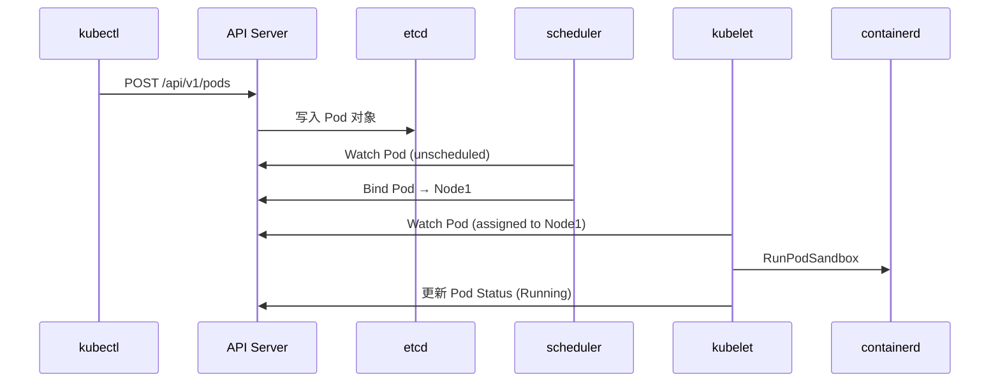

**第三段：高频追问**（至少 8 题）
- Q1: API Server 为什么是唯一访问 etcd 的组件？（鉴权/校验/乐观锁/审计日志收敛点）
- Q2: etcd 挂了集群会怎样？（API Server 无法持久化新变更，但已调度 Pod 仍运行；etcd 是唯一状态库，需定期备份）
- Q3: List-Watch 为什么不只用 List？（Watch 增量事件减少 API Server 压力；resourceVersion 保证事件顺序与一致性）
- Q4: scheduler 和 controller-manager 都是"选主"，有什么区别？（scheduler 选主后只有 leader 调度；controller-manager 选主后所有 controller 协作，leader 处理事件）
- Q5: kubelet 与 API Server 断连，Pod 会死吗？（不会，kubelet 本地维持 Pod 运行，重连后上报状态；但新 Pod 无法调度到该节点）
- Q6: 声明式 API 与命令式 API 的本质区别？（声明式描述"终态"由系统收敛，命令式描述"动作"由人执行；声明式可重入、可自愈、可 diff）
- Q7: reconcile 循环如何保证幂等？（期望状态对比实际状态，操作只做差分；每次循环从 API Server 读最新状态，不依赖本地缓存决策）
- Q8: K8s 与 Docker 的关系？（K8s 是编排层，通过 CRI 调用容器运行时；早期用 dockershim 转 CRI，1.24 移除后直连 containerd）

每题含"参考答案"和"关联"链接（关联指向 §二 对应小节或跨文档）。

**第四段：实战关联（Java 后端视角）**
- Java 应用作为 Deployment 提交到 K8s，API Server 写入 Pod Spec → scheduler 调度 → kubelet 拉镜像启动 JVM
- 关联 `java-core/jvm`：JVM 容器感知的起点是 kubelet 通过 CRI 设置 cgroups，JVM 读 cgroup 文件感知 CPU/内存限制
- 关联 `framework/spring-framework`：Spring Boot 应用通过 actuator 暴露健康端点，kubelet 调用 livenessProbe/readinessProbe 判断 Pod 状态
- 关联 `framework/valid`：actuator/health 端点作为探针接口

**第五段：面试案例**
- "讲讲你对 K8s 架构的理解"——3 分钟标准答法（控制面/数据面 → 六大组件 → List-Watch → reconcile → CRI/CNI/CSI）
- "API Server 挂了集群会怎样？"——故障影响范围排查链（已运行 Pod 不死、新变更无法生效、controller 失去事件源、需恢复 API Server 并校验 etcd 一致性）

**第六段：参考与延伸**
- 官方文档：Kubernetes Components（kubernetes.io）、kube-apiserver reference、etcd ops guide
- 延伸阅读（跨文档）：
  - [Pod 与控制器](../02-workload/pod-and-controllers.md)——Pod 生命周期与 kubelet 协作
  - [Service 与 Ingress](../03-network/service-and-ingress.md)——kube-proxy 与 Service 数据路径
  - [CRD 与 Operator](../08-extensions/crd-and-operator.md)——Informer/Controller 机制
- 仓库内关联：
  - `ops/docker/01-foundation/container-principle.md`——namespace/cgroups/unionfs、runc/containerd 调用链
  - `ops/docker/03-container/container-runtime.md`——CRI 与容器运行时
  - `java-core/jvm`——JVM 容器感知起点
  - `framework/spring-framework`——Spring Boot 容器化与 actuator

- [ ] **Step 2: 格式校验**

检查：
- 六段式结构完整（一~六段标题）
- 所有 Mermaid 语法正确（flowchart/sequenceDiagram 关键字、缩进）
- 表格含表头分隔行
- 交叉引用链接相对路径正确（`../../docker/...`、`../02-workload/...`）
- 文档体量 400-600 行

- [ ] **Step 3: 提交**

```bash
git add ops/k8s/01-foundation/k8s-architecture.md
git commit -m "docs(k8s): 新增架构总览与核心组件

- 控制面/数据面架构图、六大组件职责全表
- List-Watch 机制、reconcile 循环、Pod 创建全流程时序图
- CRI/CNI/CSI 三大接口边界
- 含 Java JVM 容器感知与 Spring actuator 关联"
```

---

## Task 3: Pod 与控制器

**Files:**
- Create: `ops/k8s/02-workload/pod-and-controllers.md`

**Interfaces:**
- Consumes: `ops/k8s/README.md`（返回链接）、Task 2 的 kubelet/kube-proxy 组件职责
- Produces: Pod 本质/生命周期状态机/容器探针、Deployment/StatefulSet/DaemonSet/Job/CronJob 选型。被 Task 4（Service 后端 Pod）、Task 5（PV/StatefulSet 存储）、Task 6（QoS 资源）、Task 9（preStop 优雅关闭/探针对接 actuator）引用

- [ ] **Step 1: 编写 pod-and-controllers.md 六段式内容**

文档头部：
```markdown
# Pod 与控制器

> **一句话定位**：Pod 是 K8s 最小调度单元，Pod 生命周期与 Deployment/StatefulSet 选型是面试必考点。
> **面试热度**：⭐⭐⭐⭐⭐
> **返回**：[K8s 知识图谱](../README.md)
```

**第一段：概念定义**
- Pod 的本质：一组共享网络（同一 IP/端口空间）和存储（volume）的容器，不是"一个容器"
- 为什么 Pod 而非容器：主容器 + sidecar（日志/监控/网络代理）的协作模式需要共享 localhost
- Pod vs 容器对比表（隔离边界、网络共享、生命周期、调度单元）
- 五种控制器选型表：Deployment（无状态/滚动更新）、StatefulSet（有状态/稳定标识）、DaemonSet（每节点一个）、Job（批处理）、CronJob（定时任务）

**第二段：原理与流程**
- **Pod 生命周期状态机**（mermaid stateDiagram-v2）：Pending → Running → Succeeded/Failed → Terminating → Deleted，标注每个状态触发条件
- **Init Container**：在主容器前顺序执行，完成后才启动主容器；用途（等待依赖/初始化配置/安全注入密钥）
- **sidecar 模式**：与主容器共享 Pod 的网络/存储，典型场景（Istio envoy 代理、Filebeat 日志采集、Vault 密钥注入）
- **容器探针三种**（表格：liveness/readiness/startup 的用途、失败后果、HTTP/TCP/Exec 探测方式、推荐场景）
  - liveness：探测失败重启容器（容器死循环/死锁）
  - readiness：探测失败从 Service Endpoints 摘除（不重启，只挡流量）
  - startup：屏蔽 liveness/readiness 直到 startup 成功（慢启动应用如 Java JVM 预热）
- **Deployment 滚动更新**：maxSurge/maxUnavailable 参数、新旧 ReplicaSet 替换流程（mermaid flowchart）、revisionHistoryLimit 与回滚机制（kubectl rollout undo）
- **StatefulSet 稳定标识**：稳定网络标识（pod-name-0/1/2.<svc>.ns.svc.cluster.local）、顺序部署/删除（pod-0 先于 pod-1）、volumeClaimTemplates 每个 Pod 独立 PVC
- **DaemonSet 调度**：每个 Node 一个，新 Node 加入自动调度，典型用途（日志采集/网络插件/监控 Agent）
- **Job/CronJob**：completions/parallelism/backoffLimit、Cron 表达式、concurrencyPolicy

Deployment 滚动更新 mermaid 骨架：
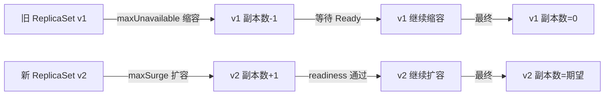

**第三段：高频追问**（至少 8 题）
- Q1: Pod 为什么不是"一个容器"？（sidecar 模式需要共享 localhost 网络；主容器 + 辅助容器协作）
- Q2: Pod 内多容器的端口能冲突吗？（能，共享网络栈所以同端口冲突；设计上每个容器独立端口）
- Q3: liveness 和 readiness 的区别？（liveness 失败重启，readiness 失败摘流量不重启；readiness 用于滚动更新挡流量）
- Q4: Java 应用为什么需要 startup probe？（JVM 预热慢，liveness 默认探测失败会重启，startup 屏蔽 liveness 直到预热完成）
- Q5: Deployment 滚动更新时 maxSurge=0 maxUnavailable=1 是什么策略？（先缩后扩，资源占用不超限，但会有短暂容量下降）
- Q6: StatefulSet 和 Deployment 的本质区别？（稳定网络标识/顺序部署/独立 PVC；无状态用 Deployment，有状态如数据库/消息队列用 StatefulSet）
- Q7: StatefulSet 的 Pod 为什么 pod-0 先启动？（依赖链：pod-1 可能依赖 pod-0 选主完成，顺序保证一致性）
- Q8: DaemonSet 与 Deployment 副本数=Node 数有什么区别？（DaemonSet 新 Node 自动调度、绑 Node 不漂移；Deployment 副本数固定，Node 挂后重新调度到其他 Node）

每题含"参考答案"和"关联"链接。

**第四段：实战关联（Java 后端视角）**
- Spring Boot 应用作为 Deployment 部署，replicas=3，readinessProbe 对接 `/actuator/health/readiness`，livenessProbe 对接 `/actuator/health/liveness`
- JVM 预热慢的 startup probe 配置：initialDelaySeconds=0 + periodSeconds=10 + failureThreshold=30（容忍 5 分钟预热）
- 关联 `framework/spring-framework`：Spring Boot 2.3+ 的 graceful shutdown 与 readinessProbe 摘流量协作
- 关联 `framework/valid`：actuator/health 端点作为探针接口
- 关联 `java-core/jvm`：JVM ShutdownHook 与 Pod terminationGracePeriodSeconds 的协作（详见 [Java 应用上 K8s](../09-performance/java-on-k8s.md)）

**第五段：面试案例**
- "你的 Spring Boot 应用上 K8s，探针怎么配？"——3 分钟标准答法（liveness/readiness/startup 三探针 + actuator 端点 + JVM 预热考量）
- "Deployment 滚动更新时部分请求报 502，怎么排查？"——readinessProbe 未配置/启动慢被摘流量太晚/terminationGracePeriodSeconds 太短导致连接被强杀

**第六段：参考与延伸**
- 官方文档：Pod Lifecycle、Deployments、StatefulSets、Container Probes
- 延伸阅读（跨文档）：
  - [架构总览与核心组件](../01-foundation/k8s-architecture.md)——kubelet 与 Pod 协作
  - [Service 与 Ingress](../03-network/service-and-ingress.md)——Service 通过 Endpoints 发现 Pod
  - [Volume 与 PV/PVC](../04-storage/volume-and-pv-pvc.md)——StatefulSet 持久化
  - [Java 应用上 K8s](../09-performance/java-on-k8s.md)——preStop 优雅关闭与探针对接
- 仓库内关联：
  - `framework/spring-framework`——Spring Boot graceful shutdown、actuator
  - `framework/valid`——健康检查端点
  - `java-core/jvm`——JVM ShutdownHook

- [ ] **Step 2: 格式校验**

检查：
- 六段式结构完整
- Mermaid 语法正确（stateDiagram-v2、flowchart）
- 表格（探针三种/控制器选型）含表头分隔行
- 交叉引用链接正确
- 文档体量 400-600 行

- [ ] **Step 3: 提交**

```bash
git add ops/k8s/02-workload/pod-and-controllers.md
git commit -m "docs(k8s): 新增 Pod 与控制器

- Pod 本质/生命周期状态机/Init Container/sidecar 模式
- 容器探针三种（liveness/readiness/startup）
- Deployment 滚动更新、StatefulSet 稳定标识、DaemonSet/Job/CronJob 选型
- 含 Spring Boot 探针配置与 JVM 预热关联"
```

---

## Task 4: Service 与 Ingress

**Files:**
- Create: `ops/k8s/03-network/service-and-ingress.md`

**Interfaces:**
- Consumes: `ops/k8s/README.md`（返回链接）、Task 2 的 kube-proxy 组件、Task 3 的 Pod readinessProbe
- Produces: Service 四类型/Endpoints/kube-proxy iptables·ipvs 数据路径/Ingress/CoreDNS/CNI。被 Task 7（HPA 指标源）、Task 9（actuator 端点暴露）引用

- [ ] **Step 1: 编写 service-and-ingress.md 六段式内容**

文档头部：
```markdown
# Service 与 Ingress

> **一句话定位**：Service 是 K8s 服务发现的基石，kube-proxy 的 iptables/ipvs 数据路径是面试高频追问重灾区。
> **面试热度**：⭐⭐⭐⭐⭐
> **返回**：[K8s 知识图谱](../README.md)
```

**第一段：概念定义**
- Service 是什么：为一组 Pod（通过 labelSelector）提供稳定的虚拟 IP（ClusterIP）和 DNS 名，负载均衡流量到后端 Pod
- 为什么需要 Service：Pod IP 易变（重建后变），Service 提供稳定入口；解耦"服务发现"与"Pod 生命周期"
- Service 四种类型对比表（ClusterIP/NodePort/LoadBalancer/ExternalName）：用途、暴露方式、端口范围、典型场景
- Endpoints vs EndpointSlice：Endpoints 是 IP:Port 列表，EndpointSlice 分片支持大规模后端（>1000 Pod）

**第二段：原理与流程**
- **kube-proxy 三种模式**（userspace/kernelspace iptables/ipvs）对比表，重点讲 iptables 与 ipvs
- **iptables 模式数据路径**：kube-proxy Watch Service/Endpoints 变更 → 生成 iptables 规则链（KUBE-SERVICES → KUBE-SVC-XXX → KUBE-SEP-XXX random 随机 DNAT）→ 流量到 Pod
  - 随机负载均衡（-m statistic --mode random）
  - 规则数随 Service×Pod 线性增长（O(N)），大规模集群 ipvs 更优
  - 详见网络层基础：[TCP 连接](../../network/02-transport/tcp-connection.md)
- **ipvs 模式数据路径**：kube-proxy 调用 netlink 创建 IPVS 虚拟服务（vs/rrr 轮询/最少连接等调度算法）→ 流量到 Pod
  - 规则数 O(1)（每 Service 一条 ipvs 规则，后端在 IPVS 表内）
  - 支持调度算法（rr/lc/dh/sh/sed/nq）
  - 为什么 ipvs 没有完全替代 iptables（部分场景如 masquerade 仍需 iptables）
- **Service 负载均衡**：客户端 → ClusterIP:Port → iptables DNAT → 后端 Pod（mermaid flowchart 画数据路径）
- **Ingress 与 Ingress Controller**：Ingress 是 L7 路由规则（host/path → Service），Ingress Controller（nginx-ingress/traefik）是实际跑的 Pod + LoadBalancer Service
- **Headless Service**：ClusterIP=null，DNS 直接返回后端 Pod IP 列表（用于 StatefulSet 稳定标识、客户端自负载均衡）
- **CoreDNS 架构**：kube-dns 服务 → CoreDNS Pod → 监听 Service/Endpoints 生成 DNS 记录；`<svc>.<ns>.svc.cluster.local` 解析为 ClusterIP
- **CNI 插件原理**（简述，引用 network 模块）：
  - Flannel：Overlay（VXLAN/UDP）简单易用，详见 [云原生网络](../../network/05-system-design/cloud-native.md)
  - Calico：BGP 路由，无 Overlay 性能好，支持网络策略
  - CNI 负责为 Pod 分配 IP、配置 veth pair、打通跨节点网络

iptables 模式数据路径 mermaid 骨架：
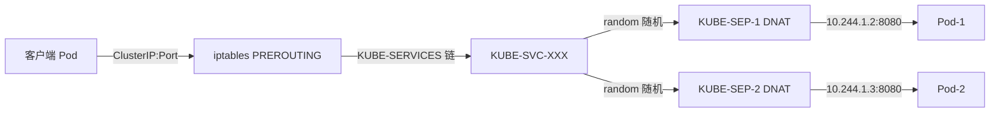

**第三段：高频追问**（至少 8 题）
- Q1: Service 和 Endpoints 的关系？（Service 定义 selector 和端口，Endpoints controller 自动维护匹配 Pod 的 IP:Port 列表）
- Q2: kube-proxy iptables 和 ipvs 怎么选？（小规模 iptables 够用，大规模（Service×Pod > 1万）ipvs 规则数 O(1) 更优，且支持更多调度算法）
- Q3: ClusterIP 是虚拟 IP，流量怎么到 Pod？（iptables/ipvs 在 PREROUTING 钩子 DNAT 到后端 Pod IP，ClusterIP 本身不响应 ARP）
- Q4: NodePort 的端口范围和默认值？（30000-32767，默认随机分配或 nodePort 指定；暴露到每个 Node 的该端口）
- Q5: Headless Service 为什么没有 ClusterIP？（ClusterIP=null 时 DNS 直接返回 Pod IP 列表，用于 StatefulSet 稳定标识或客户端自负载均衡）
- Q6: Ingress 和 Service 的本质区别？（Service 是 L4 负载均衡，Ingress 是 L7 路由规则按 host/path 转发到 Service；Ingress Controller 才是实际负载均衡器）
- Q7: CoreDNS 如何发现 Service？（CoreDNS 监听 API Server 的 Service/Endpoints 变更，动态生成 DNS 记录，TTL 默认 5s）
- Q8: Flannel VXLAN 和 Calico BGP 怎么选？（Flannel 简单易用适合小集群；Calico 无 Overlay 性能好、支持网络策略，适合大规模生产）

每题含"参考答案"和"关联"链接。

**第四段：实战关联（Java 后端视角）**
- Spring Boot 应用通过 Service 暴露：Deployment + Service (ClusterIP) → 上层 Ingress 路由到 Service
- readinessProbe 失败时 Endpoints controller 摘除 Pod IP，Service 不再转发流量
- 关联 `java-core/rmi`：对照 Java 原生 RPC 的服务发现（Stub 绑定固定 IP）vs K8s Service 的动态 Endpoints
- 关联 `java-core/service-provider-framework`：SPI 服务发现与 K8s DNS 发现的对照

**第五段：面试案例**
- "你的微服务有 3 个 Pod，外部怎么访问？"——3 分钟标准答法（Deployment + Service NodePort/LoadBalancer → Ingress L7 路由 → CoreDNS 解析）
- "Service 流量到 Pod 偶尔超时，怎么排查？"——kube-proxy 模式（iptables 规则数过多？）/ Pod readinessProbe 未配/Endpoints 未就绪/NodePort 范围冲突

**第六段：参考与延伸**
- 官方文档：Service、Ingress、kube-proxy、CoreDNS、Cluster Network
- 延伸阅读（跨文档）：
  - [架构总览与核心组件](../01-foundation/k8s-architecture.md)——kube-proxy 组件职责
  - [Pod 与控制器](../02-workload/pod-and-controllers.md)——readinessProbe 与 Endpoints 协作
  - [运维与故障排查](../07-operations/operations-and-troubleshooting.md)——Service 排障
- 仓库内关联：
  - `ops/network/02-transport/tcp-connection.md`——TCP 连接管理与 Service 负载均衡
  - `ops/network/05-system-design/cloud-native.md`——Service Mesh、CNI、eBPF
  - `ops/docker/04-network/docker-network.md`——bridge/veth/iptables 基础
  - `java-core/rmi`——Java 原生 RPC 服务发现对照
  - `java-core/service-provider-framework`——SPI 服务发现对照

- [ ] **Step 2: 格式校验**

检查：
- 六段式结构完整
- Mermaid 语法正确（flowchart 数据路径）
- 表格（Service 四类型/kube-proxy 三模式/CNI 对比）含表头分隔行
- 交叉引用链接正确（`../../network/...`、`../../docker/...`）
- 文档体量 400-600 行

- [ ] **Step 3: 提交**

```bash
git add ops/k8s/03-network/service-and-ingress.md
git commit -m "docs(k8s): 新增 Service 与 Ingress

- Service 四类型/Endpoints/EndpointSlice
- kube-proxy iptables vs ipvs 数据路径
- Ingress/Ingress Controller、Headless Service、CoreDNS、CNI 插件
- 含 Java RMI/SPI 服务发现对照"
```

---

## Task 5: Volume 与 PV/PVC

**Files:**
- Create: `ops/k8s/04-storage/volume-and-pv-pvc.md`

**Interfaces:**
- Consumes: `ops/k8s/README.md`（返回链接）、Task 2 的 CSI 接口、Task 3 的 StatefulSet
- Produces: Volume 类型/PV-PVC 生命周期/StorageClass/CSI/StatefulSet 持久化。被 Task 9（Java 应用日志卷/配置卷）引用

- [ ] **Step 1: 编写 volume-and-pv-pvc.md 六段式内容**

文档头部：
```markdown
# Volume 与 PV/PVC

> **一句话定位**：PV/PVC 与 StorageClass 动态供给是 K8s 存储体系的核心，与 Docker 存储驱动的边界是面试区分点。
> **面试热度**：⭐⭐⭐⭐
> **返回**：[K8s 知识图谱](../README.md)
```

**第一段：概念定义**
- K8s Volume 是什么：Pod 级别的存储卷，生命周期同 Pod，与 Docker volume 的本质区别（详见 [Docker 存储模型](../../docker/05-storage/docker-storage.md)）
- Volume 类型全表（emptyDir/hostPath/configMap/secret/nfs/PVC/CSI）：用途、生命周期、是否持久、典型场景
- PV/PVC/StorageClass 三者关系图（mermaid flowchart）：PVC 申领 → PV 绑定（静态）或 StorageClass 动态供给 → Pod 挂载
- 与 Docker 存储的区别对比表（volume 生命周期/绑定机制/跨节点能力/动态供给）

**第二段：原理与流程**
- **PV/PVC 生命周期**（mermaid stateDiagram-v2）：Available → Bound（PVC 申领）→ Released（PVC 删除）→ Available（回收策略 Recycle）/Failed
- **PV 回收策略**（表格：Retain/Recycle/Delete）：Retain 保留数据人工清理、Delete 直接删后端存储、Recycle（已弃用）
- **StorageClass 动态供给流程**：PVC 申领 StorageClass → provisioner 调用后端 API（如 Ceph/EBS/NFS）创建 PV → 自动绑定 PVC（mermaid sequenceDiagram）
- **PV 绑定机制**：PVC selector 匹配 PV（capacity/accessModes/storageClassName），无 selector 时按容量与 accessModes 匹配
- **CSI 插件机制**：kubelet 通过 CSI gRPC 接口调用外部存储驱动（如 ceph-csi/ebs-csi），接口分 Identity/Controller/Node 三组服务
  - CreateVolume/DeleteVolume（Controller 服务）
  - NodeStage/NodePublish/NodeUnstage/NodeUnpublish（Node 服务，kubelet 调用挂载到 Pod）
- **StatefulSet 持久化**：volumeClaimTemplates 为每个 Pod 自动创建独立 PVC，Pod 重建后 PVC 与数据保留，稳定标识（my-pvc-pod-0/my-pvc-pod-1）
- **emptyDir 用途**：同 Pod 内多容器共享临时数据（如 main 容器写日志 + sidecar 读日志上传），生命周期同 Pod，Pod 删除即清空

StorageClass 动态供给 mermaid 骨架：
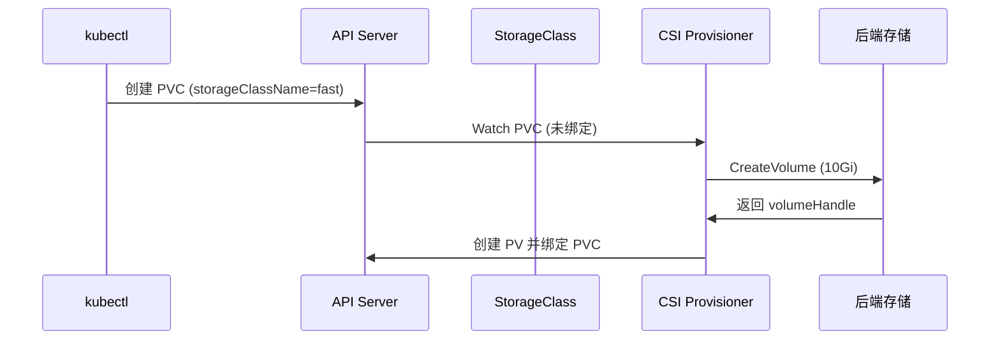

**第三段：高频追问**（至少 8 题）
- Q1: PV 和 PVC 的关系？（PV 是集群资源（管理员创建），PVC 是用户申领，绑定后 PVC 独占 PV）
- Q2: StorageClass 动态供给和静态 PV 的区别？（静态需管理员预创建 PV；动态按 PVC 申领自动创建 PV，按 StorageClass 配置选择后端）
- Q3: Pod 删除后 PVC 和数据会消失吗？（不会，PVC 独立于 Pod 生命周期；除非回收策略是 Delete 且 PVC 被显式删除才删后端存储）
- Q4: StatefulSet 的 volumeClaimTemplates 有什么用？（每个 Pod 自动创建独立 PVC，Pod 重建后 PVC 与数据保留，保证有状态应用的数据持久化）
- Q5: emptyDir 和 hostPath 怎么选？（emptyDir 同 Pod 共享且 Pod 删即清，适合临时数据；hostPath 挂载 Node 路径，Pod 漂移后数据不跟随，慎用）
- Q6: CSI 和 FlexVolume 的区别？（CSI 是标准 gRPC 接口、外部驱动进程；FlexVolume 是 exec 二进制脚本、已弃用；CSI 是未来方向）
- Q7: PV 的 accessModes 有哪些？（ReadWriteOnce 单节点读写/ReadOnlyMany 多节点只读/ReadWriteMany 多节点读写，取决于后端存储能力）
- Q8: K8s Volume 和 Docker volume 有什么本质区别？（K8s Volume 生命周期同 Pod 且跨节点；Docker volume 生命周期独立于容器但绑定单机；K8s 通过 PV/PVC 解耦存储与 Pod，Docker 用 named volume）

每题含"参考答案"和"关联"链接。

**第四段：实战关联（Java 后端视角）**
- Java 应用日志卷：emptyDir + sidecar（Filebeat）挂载共享日志目录，主容器写日志、sidecar 读日志上传
- Java 应用配置卷：ConfigMap 作为 Volume 挂载到 `/app/config`，Spring Boot 读取 application.yaml
- 关联 `framework/spring-framework`：Spring Boot 的外部化配置与 ConfigMap Volume 挂载协作
- 关联 `framework/jackson`：ConfigMap 存储 YAML/JSON 配置，Jackson 反序列化

**第五段：面试案例**
- "你的 Java 应用日志怎么持久化？"——3 分钟标准答法（emptyDir + sidecar Filebeat 方案 vs 直接写 stdout + 日志采集 Agent 方案对比）
- "StatefulSet 部署 MySQL，数据怎么保证不丢？"——volumeClaimTemplates + StorageClass 动态供给 + PV 回收策略 Retain + 定期备份

**第六段：参考与延伸**
- 官方文档：Volumes、Persistent Volumes、Storage Classes、CSI
- 延伸阅读（跨文档）：
  - [架构总览与核心组件](../01-foundation/k8s-architecture.md)——CSI 接口边界
  - [Pod 与控制器](../02-workload/pod-and-controllers.md)——StatefulSet 稳定标识
  - [配置与 RBAC](../06-config-security/config-and-rbac.md)——ConfigMap 作为 Volume
  - [Java 应用上 K8s](../09-performance/java-on-k8s.md)——日志卷与配置卷
- 仓库内关联：
  - `ops/docker/05-storage/docker-storage.md`——OverlayFS/volume/bind mount/tmpfs 基础
  - `framework/spring-framework`——Spring Boot 外部化配置
  - `framework/jackson`——YAML/JSON 配置反序列化

- [ ] **Step 2: 格式校验**

检查：
- 六段式结构完整
- Mermaid 语法正确（stateDiagram-v2、sequenceDiagram）
- 表格（Volume 类型/PV 回收策略/accessModes/K8s vs Docker 存储对比）含表头分隔行
- 交叉引用链接正确（`../../docker/05-storage/...`）
- 文档体量 400-600 行

- [ ] **Step 3: 提交**

```bash
git add ops/k8s/04-storage/volume-and-pv-pvc.md
git commit -m "docs(k8s): 新增 Volume 与 PV/PVC

- Volume 类型/PV-PVC 生命周期/StorageClass 动态供给
- CSI 插件机制（Controller/Node 服务）
- StatefulSet 持久化与 volumeClaimTemplates
- 含 K8s vs Docker 存储对比、Java 日志卷/配置卷实战"
```

---

## Task 6: 调度与资源管理

**Files:**
- Create: `ops/k8s/05-scheduling/scheduling-and-resources.md`

**Interfaces:**
- Consumes: `ops/k8s/README.md`（返回链接）、Task 2 的 scheduler 组件、Task 3 的 Pod
- Produces: 调度两阶段/亲和/taint/QoS/requests-limits/驱逐。被 Task 7（HPA 资源指标）、Task 9（JVM 资源感知）引用

- [ ] **Step 1: 编写 scheduling-and-resources.md 六段式内容**

文档头部：
```markdown
# 调度与资源管理

> **一句话定位**：调度器两阶段与 QoS 三级是中高级面试的分水岭，requests/limits 与 JVM 资源感知是 Java 上 K8s 的高频追问。
> **面试热度**：⭐⭐⭐⭐⭐
> **返回**：[K8s 知识图谱](../README.md)
```

**第一段：概念定义**
- 调度是什么：把未调度的 Pod（nodeName 为空）分配到合适的 Node
- 调度器两阶段：Filter（过滤不满足条件的 Node）+ Score（对候选 Node 打分排序）
- requests vs limits 对比表：requests 用于调度与 HPA、limits 用于 cgroups 限制上限、超限触发 OOM/throttle
- QoS 三级对比表（Guaranteed/Burstable/BestEffort）：判定条件、调度优先级、被驱逐顺序

**第二段：原理与流程**
- **调度两阶段流程图**（mermaid flowchart）：Filter 阶段（nodeSelector/节点亲和/taint-toleration/Pod 亲和/资源充足）→ Score 阶段（LeastRequestedPolicy/BalancedResourceAllocation/节点亲和权重）
- **nodeSelector**：简单标签匹配，已逐渐被 nodeAffinity 替代
- **节点亲和/反亲和**：requiredDuringScheduling（硬约束必须满足）/preferredDuringScheduling（软约束打分），语法比 nodeSelector 灵活
- **taint-toleration**：Node 打 taint（key=value:Effect），Pod 需 toleration 容忍才能调度；Effect 三种（NoSchedule/PreferNoSchedule/NoExecute）
  - NoExecute 会驱逐已有不容忍的 Pod
- **Pod 亲和/反亲和**：基于已运行 Pod 的 label 决定调度（如反亲和让同一 Deployment 的 Pod 分散到不同 Node）
- **优先级与抢占**：PriorityClass 定义优先级，高优先级 Pod 调度失败时抢占低优先级 Pod 的资源（mermaid 流程图展示抢占流程）
- **resources requests/limits**：requests 影响调度与 HPA（CPU 利用率 = 实际/request）、limits 写入 cgroups（CPU CFS quota/memory limit）
- **LimitRange**：限制 Pod/Container 的资源范围（默认 requests/limits、最大/最小值），防止单 Pod 抢占过多
- **ResourceQuota**：限制 Namespace 级别的资源总量（CPU/memory/Pod 数/PVC 数）
- **QoS 三级判定与驱逐**：
  - Guaranteed：requests=limits（CPU 和 memory 都等），调度优先级最高，最后被 kubelet 驱逐
  - Burstable：requests<limits 或部分设置，中等优先级
  - BestEffort：不设 requests/limits，最低优先级，内存压力时最先被驱逐
  - kubelet 驱逐机制：节点内存压力（memory.available<eviction-hard）时按 QoS 顺序驱逐 Pod

调度两阶段 mermaid 骨架：
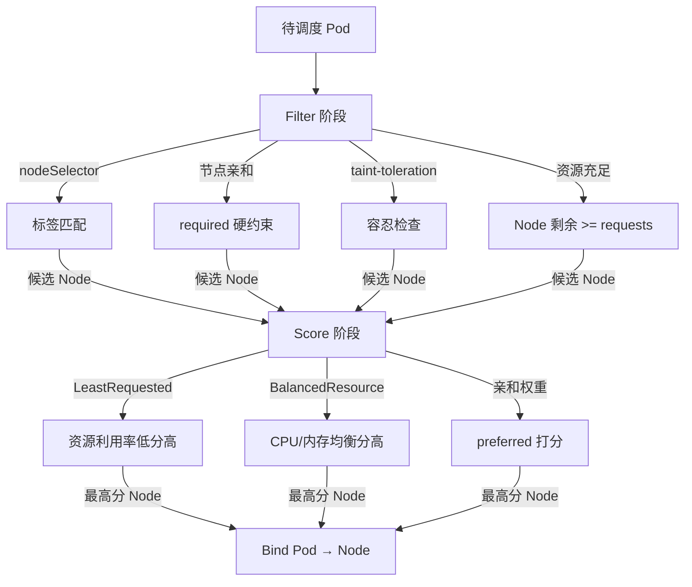

**第三段：高频追问**（至少 8 题）
- Q1: requests 和 limits 的区别？（requests 用于调度决策与 HPA 指标，limits 写 cgroups 上限；requests 不设则 Pod 可用节点全部资源）
- Q2: QoS 三级怎么判定？（Guaranteed=requests=limits 且 CPU/内存都设；BestEffort=都不设；其余 Burstable）
- Q3: 节点内存压力时按什么顺序驱逐 Pod？（BestEffort → Burstable（按超出 requests 比例排序）→ Guaranteed）
- Q4: taint 的 NoExecute 和 NoSchedule 区别？（NoSchedule 不调度新 Pod 但保留旧 Pod；NoExecute 驱逐已有不容忍的 Pod）
- Q5: Pod 反亲和怎么实现高可用？（topologyKey=node label，同 Deployment 的 Pod 反亲和分散到不同 Node/Zone）
- Q6: 优先级抢占会不会影响生产 Pod？（会，高优先级 Pod 调度失败时抢占低优先级 Pod，需谨慎设置 PriorityClass）
- Q7: HPA 的 CPU 利用率分母是 requests 还是 limits？（requests，所以不设 requests 时 HPA 无法基于 CPU 扩缩）
- Q8: CPU limits 过低会导致什么？（CFS throttle，CPU 被周期性限流，应用响应延迟抖动；Java 应用 GC 线程被限流导致 STT 抖动）

每题含"参考答案"和"关联"链接。

**第四段：实战关联（Java 后端视角）**
- Java 应用 resources 配置：requests.cpu=1 core、limits.cpu=2 core、requests.memory=2Gi、limits.memory=2Gi（Guaranteed QoS）
- JVM 堆内存与容器 memory limits 关系：-XX:MaxRAMPercentage=75.0 让 JVM 堆 = limits.memory × 75%，留 25% 给堆外（metaspace/线程栈/直接内存）
- CPU limit 与 ForkJoinPool/parallelStream 并行度陷阱：parallelStream 默认用 CPU 核数 fork，但 cgroup CPU limit 可能是 0.5 core，导致并行度过高争抢
- 关联 `java-core/jvm`：JVM 容器感知（cgroup v2 兼容）、堆外内存预算、UseContainerSupport
- 关联 `java-core/forkjoin`、`java-core/stream`：ForkJoinPool 并行度与 CPU limit 的关系

**第五段：面试案例**
- "你的 Java 应用上 K8s，resources 怎么配？"——3 分钟标准答法（requests=limits 保 Guaranteed QoS + MaxRAMPercentage 75% + CPU limit 2 倍 requests）
- "Java 应用响应延迟抖动，怎么排查？"——CPU limits 过低导致 CFS throttle？/ memory limits 过低导致 OOM？/ GC 频繁？排查链

**第六段：参考与延伸**
- 官方文档：Scheduler、Assigning Pods to Nodes、Resource Quality of Service、Compute Resources
- 延伸阅读（跨文档）：
  - [架构总览与核心组件](../01-foundation/k8s-architecture.md)——scheduler 组件职责
  - [Pod 与控制器](../02-workload/pod-and-controllers.md)——Pod 调度到 Node
  - [运维与故障排查](../07-operations/operations-and-troubleshooting.md)——HPA 资源指标源
  - [Java 应用上 K8s](../09-performance/java-on-k8s.md)——JVM 资源感知与 MaxRAMPercentage
- 仓库内关联：
  - `java-core/jvm`——JVM 容器内存感知、cgroup v2、ZGC 选型
  - `java-core/forkjoin`、`java-core/stream`——并行度与 CPU limit 陷阱
  - `ops/docker/08-performance/java-container-tuning.md`——JVM 容器感知基础

- [ ] **Step 2: 格式校验**

检查：
- 六段式结构完整
- Mermaid 语法正确（flowchart 调度流程）
- 表格（requests vs limits/QoS 三级/taint Effect/PriorityClass）含表头分隔行
- 交叉引用链接正确
- 文档体量 400-600 行

- [ ] **Step 3: 提交**

```bash
git add ops/k8s/05-scheduling/scheduling-and-resources.md
git commit -m "docs(k8s): 新增调度与资源管理

- 调度两阶段（Filter/Score）、节点亲和/taint/Pod 亲和
- 优先级与抢占、requests-limits、LimitRange/ResourceQuota
- QoS 三级与 kubelet 驱逐机制
- 含 Java MaxRAMPercentage 与 CPU limit ForkJoinPool 陷阱"
```

---

## Task 7: 配置与 RBAC

**Files:**
- Create: `ops/k8s/06-config-security/config-and-rbac.md`

**Interfaces:**
- Consumes: `ops/k8s/README.md`（返回链接）、Task 2 的 API Server 鉴权
- Produces: ConfigMap 热更新/Secret/RBAC/ServiceAccount/PodSecurity。被 Task 8（Operator CRD 鉴权）、Task 9（ConfigMap 注入 Spring 配置）引用

- [ ] **Step 1: 编写 config-and-rbac.md 六段式内容**

文档头部：
```markdown
# 配置与 RBAC

> **一句话定位**：ConfigMap 热更新与 RBAC 鉴权是面试必考，PodSecurity 替代 PSP 是新版追问点。
> **面试热度**：⭐⭐⭐⭐⭐
> **返回**：[K8s 知识图谱](../README.md)
```

**第一段：概念定义**
- ConfigMap 是什么：存储非敏感配置的 K8s 资源，Key-Value 结构，可挂载为 Volume 或注入为环境变量
- Secret 是什么：存储敏感信息（base64 编码，非加密），类型（Opaque/dockerconfigjson/tls/SA Token）
- RBAC 三要素：Role/ClusterRole（权限定义）+ Subject（用户/组/ServiceAccount）+ RoleBinding/ClusterRoleBinding（绑定）
- ServiceAccount：Pod 在集群内的身份，自动挂载 Token（1.24+ 改为按需挂载）
- PodSecurity Standards 三级（privileged/baseline/restricted）：替代已废弃的 PodSecurityPolicy

**第二段：原理与流程**
- **ConfigMap 两种挂载方式**：
  - 环境变量注入：envFrom/configMapRef，Pod 启动时读取，**ConfigMap 更新后环境变量不更新**（需重启 Pod）
  - Volume 挂载：挂载为文件，ConfigMap 更新后 Volume 内容更新（kubelet 周期同步，默认 60-90s）
- **ConfigMap 热更新陷阱**（mermaid flowchart）：
  - 环境变量方式：不热更新，需滚动重启 Pod
  - Volume 方式：热更新但有同步延迟；subPath 挂载不热更新（subPath 挂的是符号链接而非目录）
- **Secret 类型与加密**：
  - Opaque：通用敏感数据
  - dockerconfigjson：镜像拉取凭证（imagePullSecrets）
  - tls：TLS 证书
  - etcd 仅 base64 编码非加密，生产需配 EncryptionConfiguration 静态加密 + 外部 KMS
- **RBAC 鉴权链流程**（mermaid sequenceDiagram）：Pod（带 ServiceAccount Token）→ API Server → 认证（Token）→ 鉴权（RBAC：检查 Role/ClusterRole 是否允许该操作）→ 准入控制（Mutating/Validating Webhook）→ 写 etcd
- **Role vs ClusterRole**：Role 命名空间级（只能授权同 namespace 资源），ClusterRole 集群级（可授权跨 namespace 资源或集群级资源如 Node/PV）
- **ServiceAccount Token 演进**：
  - 1.24 前：自动创建 Secret 挂载 Token，永久有效
  - 1.24+：改用 TokenRequest API 生成短期 Token（默认 1 小时），Pod 通过 projected volume 挂载，到期自动续期
- **PodSecurity Standards 替代 PSP**：
  - PSP（PodSecurityPolicy）1.21 弃用、1.25 移除
  - PodSecurity 准入控制器：namespace 打 label（pod-security.kubernetes.io/enforce=restricted）强制安全策略
  - 三级：privileged（无限制）、baseline（防最危险提权）、restricted（严格最佳实践，要求 runAsNonRoot、drop ALL capabilities 等）

RBAC 鉴权链 mermaid 骨架：
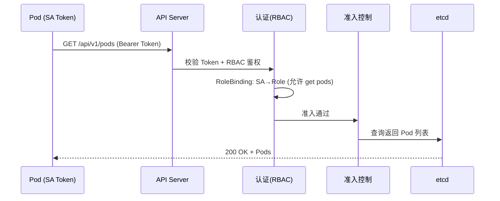

**第三段：高频追问**（至少 8 题）
- Q1: ConfigMap 挂载为环境变量和 Volume 有什么区别？（环境变量不热更新需重启，Volume 热更新有延迟；subPath 挂载不热更新）
- Q2: Secret 在 etcd 里是加密的吗？（默认只 base64 编码非加密，需配 EncryptionConfiguration 静态加密或外部 KMS）
- Q3: Role 和 ClusterRole 的区别？（Role 命名空间级，ClusterRole 集群级可跨 namespace；通常先建 ClusterRole 再用 RoleBinding 引用限定到某 namespace）
- Q4: ServiceAccount Token 1.24 前后有什么变化？（1.24 前永久 Secret Token；1.24+ 改 TokenRequest API 短期 Token projected volume，到期自动续期）
- Q5: PSP 为什么被废弃？（配置复杂、冲突难调试、授权模型不直观；PodSecurity 用 namespace label 简化）
- Q6: PodSecurity 的 restricted 级别有什么要求？（runAsNonRoot、allowPrivilegeEscalation=false、drop ALL capabilities、seccompProfile=RuntimeDefault）
- Q7: RBAC 的 deny by default 是什么意思？（未显式授权的操作默认拒绝，遵循最小权限原则）
- Q8: Pod 怎么访问 API Server？（通过自动注入的 ServiceAccount Token + CA 证书，访问 https://kubernetes.default.svc）

每题含"参考答案"和"关联"链接。

**第四段：实战关联（Java 后端视角）**
- Spring Boot 配置注入：ConfigMap 挂载为 Volume 到 `/app/config`，Spring Boot 读取 application.yaml + 环境变量覆盖
- ConfigMap 热更新与 Spring Cloud Kubernetes：Spring Cloud Kubernetes Config 能监听 ConfigMap 变更动态刷新 @Value
- 关联 `framework/spring-framework`：Spring Boot 外部化配置、@Value 与 ConfigMap 注入优先级
- 关联 `framework/jackson`：ConfigMap 的 YAML/JSON 配置与 Jackson 反序列化
- 关联 `java-core/annotation`、`java-core/apt`：准入 Webhook 与 APT 注解处理器的拦截机制对照
- Secret 注入数据库密码：Secret 作为环境变量注入，Spring Boot 读取 DataSource 密码

**第五段：面试案例**
- "你的 Spring Boot 配置怎么管理？"——3 分钟标准答法（ConfigMap + Secret 区分敏感 + 挂载方式 + 热更新 + Spring Cloud Kubernetes 动态刷新）
- "Pod 无法访问 API Server，怎么排查？"——ServiceAccount Token 过期？/ RBAC 未授权？/ 网络策略阻断？排查链

**第六段：参考与延伸**
- 官方文档：ConfigMap、Secret、Using RBAC、Pod Security Standards、Service Accounts
- 延伸阅读（跨文档）：
  - [架构总览与核心组件](../01-foundation/k8s-architecture.md)——API Server 鉴权链
  - [CRD 与 Operator](../08-extensions/crd-and-operator.md)——准入 Webhook
  - [Java 应用上 K8s](../09-performance/java-on-k8s.md)——ConfigMap 注入 Spring 配置
- 仓库内关联：
  - `framework/spring-framework`——Spring Boot 外部化配置、@Value、ConfigMap 注入
  - `framework/jackson`——YAML/JSON 配置反序列化
  - `java-core/annotation`、`java-core/apt`——注解处理器与准入 Webhook 对照

- [ ] **Step 2: 格式校验**

检查：
- 六段式结构完整
- Mermaid 语法正确（flowchart/sequenceDiagram）
- 表格（ConfigMap 挂载方式/Secret 类型/PodSecurity 三级）含表头分隔行
- 交叉引用链接正确
- 文档体量 400-600 行

- [ ] **Step 3: 提交**

```bash
git add ops/k8s/06-config-security/config-and-rbac.md
git commit -m "docs(k8s): 新增配置与 RBAC

- ConfigMap 两种挂载与热更新陷阱
- Secret 类型与加密、RBAC 鉴权链
- ServiceAccount Token 1.24+ 演进、PodSecurity 替代 PSP
- 含 Spring Boot ConfigMap 注入与 Jackson 配置反序列化关联"
```

---

## Task 8: 运维与故障排查

**Files:**
- Create: `ops/k8s/07-operations/operations-and-troubleshooting.md`

**Interfaces:**
- Consumes: `ops/k8s/README.md`（返回链接）、Task 2-6 的全部组件与资源
- Produces: Helm/发布策略/HPA-VPA/日志采集/Prometheus 监控/排障方法论。被 Task 10（Q&A 排障篇）引用

- [ ] **Step 1: 编写 operations-and-troubleshooting.md 六段式内容**

文档头部：
```markdown
# 运维与故障排查

> **一句话定位**：故障排查方法论与 HPA/日志/Prometheus 是面试高频实战题，kubectl 排障命令链是必考。
> **面试热度**：⭐⭐⭐⭐⭐
> **返回**：[K8s 知识图谱](../README.md)
```

**第一段：概念定义**
- Helm 是什么：K8s 包管理器，Chart（模板 + values.yaml）→ release（一次部署实例）
- 三种发布策略对比表（滚动更新/蓝绿部署/金丝雀发布）：原理、流量切换方式、回滚速度、资源占用
- HPA（HorizontalPodAutoscaler）vs VPA（VerticalPodAutoscaler）对比表：扩缩维度（副本数 vs resources）、指标源、是否需要重启 Pod
- 日志采集两种架构（DaemonSet vs Sidecar）对比表：资源开销、适用场景、独立性
- Prometheus 监控指标体系（mermaid flowchart）：Node Exporter / cAdvisor / kube-state-metrics → Prometheus → Alertmanager / Grafana

**第二段：原理与流程**
- **Helm 模板渲染**：`helm template`/`helm install` 把 values.yaml + Chart 模板（Go template）渲染为最终 K8s 资源 YAML，提交到 API Server；Chart 仓库（OCI Registry/Helm Hub）
- **滚动更新**：Deployment 控制新旧 ReplicaSet 替换，详见 [Pod 与控制器](../02-workload/pod-and-controllers.md)
- **蓝绿部署**：两套 Deployment（blue 旧/green 新）+ Service label 切换，瞬时切流量，回滚只需改 selector
- **金丝雀发布**：Ingress 按权重路由（nginx-ingress canary-weight）或多 Deployment 副本数比例控制，灰度比例可控
- **HPA 工作流程**（mermaid sequenceDiagram）：
  - HPA controller 周期拉取指标（Pods 指标源 metrics-server/自定义指标 Prometheus Adapter）
  - 计算目标副本数 = ceil(当前副本数 × (当前指标值 / 目标指标值))
  - 调整 Deployment replicas
  - 指标源：CPU 利用率（requests 为分母）、内存利用率、自定义指标（QPS/队列长度）
- **VPA 工作流程**：观察 Pod 资源使用 → 推荐 requests/limits → 自动更新（需重启 Pod，所以生产慎用）
- **日志采集 DaemonSet 架构**：每 Node 一个 Fluentd/Filebeat DaemonSet，挂载 `/var/log/containers` 读取容器 stdout 日志，发送到 ES/Loki
- **日志采集 Sidecar 架构**：Pod 内 sidecar 容器读主容器日志文件（emptyDir 共享），适合不写 stdout 的应用
- **Prometheus 监控指标**：
  - Node Exporter：节点 CPU/内存/磁盘/网络
  - cAdvisor：容器指标（CPU/内存/网络）
  - kube-state-metrics：K8s 资源状态（Deployment/Pod/Service 的状态与计数）
  - Prometheus pull 模式：Prometheus 主动抓取各 Exporter 的 /metrics 端点
- **故障排查方法论**（kubectl 命令链）：
  ```
  kubectl get pods -n <ns>                    # 查 Pod 状态
  kubectl describe pod <pod> -n <ns>          # 查事件与调度信息
  kubectl logs <pod> -n <ns> -c <container>   # 查日志
  kubectl logs <pod> --previous               # 查上一个容器实例日志
  kubectl get events -n <ns> --sort-by=.lastTimestamp  # 查事件链
  kubectl exec <pod> -n <ns> -- sh            # 进容器排查
  crictl ps / crictl logs <container-id>      # 节点层面排查容器
  ```

HPA 工作流程 mermaid 骨架：
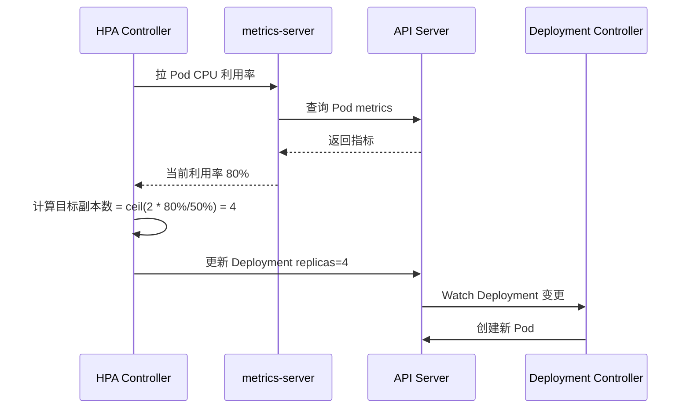

**第三段：高频追问**（至少 8 题）
- Q1: 滚动更新和蓝绿部署的本质区别？（滚动更新新旧共存逐步替换，资源占用小但过渡期混合版本；蓝绿两套独立切换，瞬时但资源翻倍）
- Q2: 金丝雀发布怎么控制流量比例？（nginx-ingress canary-weight 按权重路由到 canary Deployment；或多个 Deployment 用副本数比例近似）
- Q3: HPA 的 CPU 利用率分母是 limits 还是 requests？（requests，所以不设 requests 则 HPA 无法基于 CPU 扩缩）
- Q4: HPA 扩容有延迟吗？（有，默认 30s 拉指标 + cooldown 扩容 0s/缩容 5min，可通过 behavior 字段调）
- Q5: VPA 为什么生产慎用？（VPA 自动调 resources 需重启 Pod，影响可用性；通常只开 recommend 模式做参考）
- Q6: 日志采集用 DaemonSet 还是 Sidecar？（标准 stdout 日志用 DaemonSet 资源开销小；应用写文件不上 stdout 才用 Sidecar）
- Q7: Pod CrashLoopBackOff 怎么排查？（describe 查事件 → logs --previous 查上次崩溃日志 → 多为启动失败/配置错误/依赖不可用）
- Q8: Prometheus 为什么用 pull 不用 push？（pull 模式主动抓取便于服务发现、控制抓取频率、目标健康检查；push 模式需各应用埋点上报，客户端故障可能丢数据）

每题含"参考答案"和"关联"链接。

**第四段：实战关联（Java 后端视角）**
- Spring Boot 应用日志写 stdout 被 DaemonSet 采集，写文件用 Sidecar + emptyDir 共享
- Spring Boot actuator/metrics 端点暴露 JVM/HTTP 指标给 Prometheus 抓取
- 关联 `framework/spring-framework`：Spring Boot actuator/metrics、日志配置
- 关联 `framework/valid`：actuator/health 端点
- 关联 `framework/jackson`：日志 JSON 结构化与 Jackson
- 关联 `java-core/jmx`：JMX 指标暴露给 Prometheus JMX Exporter，再被 Prometheus Adapter 转为自定义指标供 HPA 使用
- 关联 `java-core/agent`：Java agent 在 Pod 内 attach 的 namespace 陷阱（故障排查 attach 失败的常见原因）

**第五段：面试案例**
- "你的 Spring Boot 应用上 K8s，监控告警怎么搭？"——3 分钟标准答法（actuator/metrics + Prometheus + Grafana + HPA 基于 QPS 扩缩）
- "Pod CrashLoopBackOff，怎么排查？"——3 分钟标准答法（describe → logs --previous → 常见原因：启动失败/依赖不可用/OOM/配置错误 → 针对性修复）

**第六段：参考与延伸**
- 官方文档：Helm、HPA、VPA、Logging Architecture、Prometheus
- 延伸阅读（跨文档）：
  - [Pod 与控制器](../02-workload/pod-and-controllers.md)——Deployment 滚动更新
  - [调度与资源管理](../05-scheduling/scheduling-and-resources.md)——HPA 指标源 requests
  - [Java 应用上 K8s](../09-performance/java-on-k8s.md)——actuator 探针与 metrics
- 仓库内关联：
  - `framework/spring-framework`——actuator/metrics、日志
  - `framework/valid`——actuator/health 端点
  - `framework/jackson`——日志 JSON 结构化
  - `java-core/jmx`——JMX 指标暴露
  - `java-core/agent`——Java agent attach 陷阱

- [ ] **Step 2: 格式校验**

检查：
- 六段式结构完整
- Mermaid 语法正确（flowchart/sequenceDiagram）
- 表格（三种发布策略/HPA vs VPA/日志采集两种架构）含表头分隔行
- 交叉引用链接正确
- 文档体量 400-600 行

- [ ] **Step 3: 提交**

```bash
git add ops/k8s/07-operations/operations-and-troubleshooting.md
git commit -m "docs(k8s): 新增运维与故障排查

- Helm 包管理、滚动/蓝绿/金丝雀发布策略
- HPA/VPA 自动伸缩原理与指标源
- 日志采集（DaemonSet/Sidecar）+ Prometheus 监控指标体系
- kubectl 排障命令链 + CrashLoopBackOff 排查方法论"
```

---

## Task 9: CRD 与 Operator

**Files:**
- Create: `ops/k8s/08-extensions/crd-and-operator.md`

**Interfaces:**
- Consumes: `ops/k8s/README.md`（返回链接）、Task 2 的 reconcile 循环与 List-Watch、Task 7 的 RBAC/准入 Webhook
- Produces: CRD/Operator/Informer-List-Watch/Webhook/自定义调度器。是高级面试加分项

- [ ] **Step 1: 编写 crd-and-operator.md 六段式内容**

文档头部：
```markdown
# CRD 与 Operator

> **一句话定位**：CRD/Operator/Informer 是高级面试的加分项，自定义调度器与准入 Webhook 是架构级追问点。
> **面试热度**：⭐⭐⭐⭐
> **返回**：[K8s 知识图谱](../README.md)
```

**第一段：概念定义**
- CRD（CustomResourceDefinition）是什么：用户自定义的 K8s 资源类型，让 API Server 像处理 Pod/Service 一样处理自定义资源
- Operator 模式是什么：CRD + Controller，把人类运维知识编码为自动化 Controller（如 Prometheus Operator/MySQL Operator）
- Controller vs Operator：Controller 是通用 reconcile 循环，Operator 是面向特定应用的 Controller（领域知识 + CRD + Controller）
- 准入 Webhook 两种：Mutating（修改对象，如注入 sidecar）、Validating（校验对象，如禁止特权容器）
- 自定义调度器：通过调度框架（Scheduling Framework）的 Plugin 扩展 Filter/Score 阶段

**第二段：原理与流程**
- **CRD 定义与使用**：CRD 定义 schema（OpenAPI v3）+ API Server 自动生成 REST 路径（/apis/<group>/<version>/namespaces/<ns>/<resource>），kubectl 直接操作自定义资源
- **Controller/Operator 工作模式**（基于 reconcile 循环，详见 [架构总览与核心组件](../01-foundation/k8s-architecture.md)）：
  - Watch CR 变更 → 对比期望状态 vs 实际状态 → 调谐（创建/更新/删除下属资源如 Deployment/Service/PVC）
  - 以 Prometheus Operator 为例：用户创建 Prometheus CR → Operator Watch 到 → 创建 StatefulSet + Service + ConfigMap
- **Informer/List-Watch/WorkQueue 机制**（机制级，不贴 client-go 源码，但提到关键组件名）：
  - client-go 的 cache 包提供 Reflector（List-Watch API Server）→ Delta FIFO 队列 → Informer（分发事件）→ Indexer（本地缓存）
  - WorkQueue：Controller 从 Informer 收事件 → 入队 key（namespace/name）→ worker 协程消费 key 触发 reconcile
  - 关键源码包：client-go/tools/cache（Reflector/Informer/Indexer）、client-go/util/workqueue（RateLimitingQueue）
  - mermaid flowchart 展示数据流：API Server → Reflector → Delta FIFO → Informer → WorkQueue → Controller reconcile
- **自定义调度器**：
  - 调度框架（Scheduling Framework）把调度流程拆为多个扩展点（PreFilter/Filter/PostFilter/PreScore/Score/Permit/Bind 等）
  - 自定义 Plugin 实现特定扩展点接口，编译为二进制部署
  - 关键源码包：k8s.io/kubernetes/pkg/scheduler/framework（Plugin 接口）
- **准入 Webhook 流程**（mermaid sequenceDiagram）：
  - API Server 收到请求 → 认证鉴权 → Mutating Webhook（可多次修改）→ 对象 schema 校验 → Validating Webhook（可多次校验）→ 写 etcd
  - Mutating 典型：Istio 注入 envoy sidecar
  - Validating 典型：禁止某些 namespace 创建特权 Pod
- **Operator SDK vs KubeBuilder**：
  - Operator SDK：RedHat 出品，支持 Go/Ansible/Helm，封装 client-go
  - KubeBuilder：SIG 出品，Go 专用，更贴近 controller-runtime 原生 API
  - 两者都生成 CRD + Controller 脚手架，选型看团队栈

Informer 数据流 mermaid 骨架：
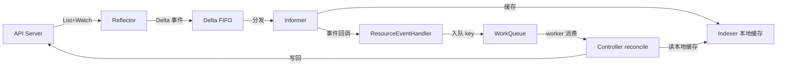

**第三段：高频追问**（至少 8 题）
- Q1: CRD 和 ConfigMap 的区别？（CRD 是新资源类型有 schema 校验和 API Server 原生支持；ConfigMap 是通用 K-V 存储无 schema）
- Q2: Operator 解决了什么问题？（把运维知识（如 MySQL 主从切换/备份恢复）编码为自动化 Controller，替代人工运维）
- Q3: Informer 为什么要本地缓存 Indexer？（减少 API Server 压力，reconcile 读缓存不直连 API Server；List 全量 + Watch 增量保证最终一致）
- Q4: WorkQueue 为什么要 RateLimiting？（reconcile 失败可重试，指数退避防雪崩；RateLimitingQueue 区分错误率）
- Q5: Mutating 和 Validating Webhook 的执行顺序？（Mutating 先执行可修改对象，再 Validating 校验；都可能有多个按 webhook 配置顺序）
- Q6: 自定义调度器的 Plugin 怎么扩展？（实现 Scheduling Framework 的 Plugin 接口，注册到 Filter/Score 等扩展点，编译为独立调度器或扩展默认调度器）
- Q7: Operator SDK 和 KubeBuilder 怎么选？（Go 用哪个都行，Operator SDK 支持 Ansible/Helm 适合非 Go 团队；KubeBuilder 更贴近 controller-runtime 原生 API）
- Q8: Informer 的 SharedInformer 是什么？（多个 Controller 共享同一资源的 Informer，减少 API Server 连接数与 List 压力）

每题含"参考答案"和"关联"链接。

**第四段：实战关联（Java 后端视角）**
- Operator 在 Java 生态的实践：Fabric8 Kubernetes Client（Java）可开发 Operator，Spring Boot 集成 informer 监听 CR
- 自定义 CRD 示例：定义 AppConfig CR → Operator 监听 → 生成 Deployment + Service + ConfigMap，把"部署一个微服务"声明式化
- 关联 `java-core/annotation`、`java-core/apt`：CRD schema 定义与注解驱动的模型生成对照（KubeBuilder 用 marker 注解生成 CRD）
- 关联 `java-core/lambda`、`java-core/stream`：Informer 事件回调链与函数式编排

**第五段：面试案例**
- "你们团队怎么管理多个微服务的部署？"——3 分钟标准答法（CRD 定义微服务规格 + Operator 监听 CR 自动生成 Deployment/Service/ConfigMap，声明式管理多服务）
- "Istio 注入 sidecar 是怎么实现的？"——3 分钟标准答法（Mutating Webhook 拦截 Pod 创建 → 修改 Pod spec 注入 envoy 容器 + init 容器配置 iptables）

**第六段：参考与延伸**
- 官方文档：Custom Resources、Operator Pattern、Dynamic Admission Control、Scheduling Framework
- 延伸阅读（跨文档）：
  - [架构总览与核心组件](../01-foundation/k8s-architecture.md)——reconcile 循环与 List-Watch 机制
  - [配置与 RBAC](../06-config-security/config-and-rbac.md)——RBAC 与准入 Webhook
- 仓库内关联：
  - `java-core/annotation`、`java-core/apt`——注解处理器与 CRD 模型生成对照
  - `java-core/lambda`、`java-core/stream`——事件回调链与函数式编排

- [ ] **Step 2: 格式校验**

检查：
- 六段式结构完整
- Mermaid 语法正确（flowchart Informer 数据流/sequenceDiagram 准入 Webhook）
- 表格（Controller vs Operator/Mutating vs Validating/Operator SDK vs KubeBuilder）含表头分隔行
- 交叉引用链接正确
- 文档体量 400-600 行

- [ ] **Step 3: 提交**

```bash
git add ops/k8s/08-extensions/crd-and-operator.md
git commit -m "docs(k8s): 新增 CRD 与 Operator

- CRD 定义与使用、Controller/Operator 模式
- Informer/List-Watch/WorkQueue 机制（client-go 架构）
- 自定义调度器 Scheduling Framework、准入 Webhook
- Operator SDK vs KubeBuilder 对比"
```

---

## Task 10: Java 应用上 K8s

**Files:**
- Create: `ops/k8s/09-performance/java-on-k8s.md`

**Interfaces:**
- Consumes: `ops/k8s/README.md`（返回链接）、Task 3 的 Pod 生命周期与探针、Task 6 的 resources requests-limits、Task 7 的 ConfigMap 注入、docker 模块的 `08-performance/java-container-tuning.md`（JVM 容器感知基础）
- Produces: K8s 特有的 Java 应用部署实战（preStop/探针/ConfigMap/HPA/JVM 选型）。是 Java 面试官的高频追问落点

- [ ] **Step 1: 编写 java-on-k8s.md 六段式内容**

文档头部：
```markdown
# Java 应用上 K8s

> **一句话定位**：Java 应用上 K8s 的 preStop 优雅关闭、探针配置、JVM 选型是 Java 面试官的高频追问。
> **面试热度**：⭐⭐⭐⭐⭐
> **返回**：[K8s 知识图谱](../README.md)
```

**第一段：概念定义**
- Java 应用上 K8s 的特化场景：JVM 预热慢、ShutdownHook 与 Pod 优雅关闭协作、堆外内存预算、ConfigMap 注入 Spring 配置、分层镜像缓存
- 与 Docker 容器调优的关系：JVM 容器感知的基础（cgroup v2 兼容、UseContainerSupport）详见 [Java 容器调优](../../docker/08-performance/java-container-tuning.md)，本文聚焦 K8s 特有部分

**第二段：原理与流程**
- **Pod 优雅关闭全流程**（mermaid sequenceDiagram）：
  - API Server 收到 delete Pod → kubelet 触发 preStop Hook → 同时 Service endpoints controller 摘除 Pod（流量不再进入）
  - preStop 执行完 → 发 SIGTERM → JVM 收到 → 执行 ShutdownHook → Spring ContextClosedEvent → 关闭 bean → 等 actuator 健康检查返回 DOWN
  - terminationGracePeriodSeconds（默认 30s）超时 → SIGKILL 强杀
- **preStop Hook 配置**：
  ```yaml
  lifecycle:
    preStop:
      exec:
        command: ["sh", "-c", "sleep 10"]  # 等 endpoints 摘除生效
  ```
  - 为什么需要 sleep 10：endpoints controller 摘除 Pod 与 kubelet 发 SIGTERM 并行，若 SIGTERM 先到则 Service 可能仍路由新请求到正在关闭的 Pod，导致 502
- **容器探针与 Spring Boot actuator 对接**：
  - livenessProbe → `/actuator/health/liveness`（Spring Boot 2.3+ 分组）
  - readinessProbe → `/actuator/health/readiness`
  - startupProbe → `/actuator/health`（任意健康即可，屏蔽 liveness 直到 startup 通过）
  - 探针配置：initialDelaySeconds=0、periodSeconds=10、failureThreshold=30（容忍 5 分钟 JVM 预热）
- **ConfigMap 注入 Spring 配置**：
  - ConfigMap 挂载为 Volume 到 `/app/config` → Spring Boot 读 application.yaml
  - 环境变量注入：envFrom → Spring Boot 环境变量覆盖 application.yaml
  - 热更新：ConfigMap 更新后 Volume 热更新（60-90s 延迟），但 Spring Boot 不自动刷新，需 Spring Cloud Kubernetes Config 或滚动重启
- **JVM 堆与容器内存预算**：
  - limits.memory=2Gi，-XX:MaxRAMPercentage=75.0 → 堆 = 1.5Gi
  - 剩余 25%（500Mi）给堆外：Metaspace（~256Mi）、线程栈（每线程 1Mi × 数百）、直接内存（NIO/Netty）、JIT 代码缓存
  - 关联 [调度与资源管理](../05-scheduling/scheduling-and-resources.md)：requests=limits 保 Guaranteed QoS
- **JDK 17/21 在 K8s 的选型**：
  - JDK 17 LTS：容器感知完整（cgroup v2）、ZGC 可用、records/switch 模式
  - JDK 21 LTS：虚拟线程（轻量级并发，适合 IO 密集）、ZGC 分代、pattern matching
  - Spring Boot 3.x 要求 JDK 17+，配合 K8s 滚动更新与分层镜像
- **Spring Boot Layertools 分层镜像与 K8s 滚动更新缓存**：
  - Spring Boot 分层（dependencies/spring-boot-loader/snapshot-dependencies/application）
  - 镜像分层让依赖层缓存命中，K8s 拉镜像只拉变化层，加快滚动更新
  - 详见 [Java 容器调优](../../docker/08-performance/java-container-tuning.md) 的 Layertools 部分

Pod 优雅关闭 mermaid 骨架：
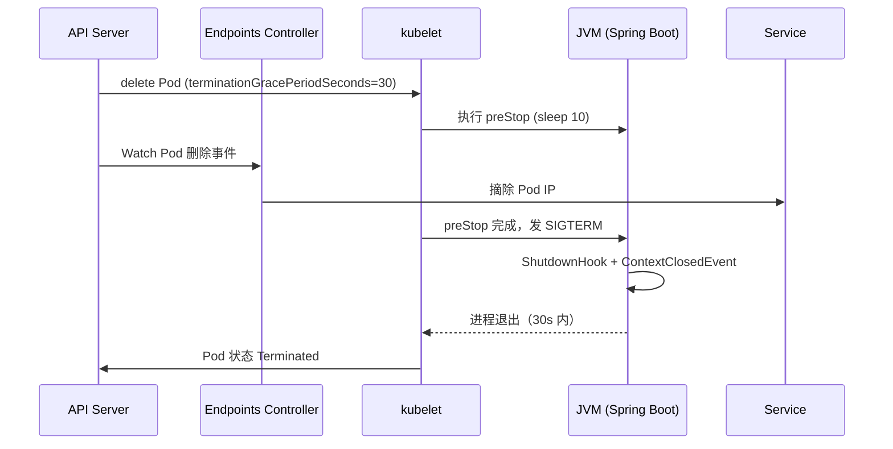

**第三段：高频追问**（至少 8 题）
- Q1: Pod 优雅关闭时为什么需要 preStop sleep？（endpoints 摘除与 SIGTERM 并行，不 sleep 则 SIGTERM 先到导致 Service 仍路由新请求到关闭中 Pod）
- Q2: terminationGracePeriodSeconds 默认多少？超时怎么办？（默认 30s，超时 SIGKILL 强杀，需保证 ShutdownHook + bean 关闭在此时间内完成）
- Q3: Java 应用为什么需要 startup probe？（JVM 预热慢，liveness 默认探测失败会重启 Pod 导致预热循环，startup 屏蔽 liveness 直到预热完成）
- Q4: liveness/readiness/startup 探针对接哪些 actuator 端点？（liveness→/actuator/health/liveness、readiness→/actuator/health/readiness、startup→/actuator/health）
- Q5: ConfigMap 挂载为环境变量和 Volume 哪个能热更新？（环境变量不热更新需重启 Pod；Volume 热更新有延迟；subPath 挂载不热更新）
- Q6: JVM 堆与容器内存 limits 怎么分配？（MaxRAMPercentage=75%，剩余 25% 给堆外：Metaspace/线程栈/直接内存/JIT）
- Q7: JDK 17 和 21 在 K8s 上有什么新特性值得用？（JDK 17 容器感知完整+ZGC；JDK 21 虚拟线程适合 IO 密集、ZGC 分代）
- Q8: Spring Boot 分层镜像对 K8s 滚动更新有什么好处？（依赖层缓存命中，拉镜像只拉变化层，加快滚动更新速度）

每题含"参考答案"和"关联"链接。

**第四段：实战关联（Java 后端视角）**
- Spring Boot 应用 Deployment 完整 YAML（含 resources/liveness/readiness/startup/preStop/ConfigMap 注入），作为实战样板
- Spring Boot 2.3+ 的 graceful shutdown + readinessProbe 摘流量协作
- Spring Cloud Kubernetes Config 监听 ConfigMap 动态刷新 @Value
- 关联 `framework/spring-framework`：Spring Boot 3.x JarLauncher、graceful shutdown、actuator、Layertools
- 关联 `framework/valid`：actuator/health 作为探针接口
- 关联 `java-core/jvm`：JVM ShutdownHook、HotspotContainer 源码、ZGC 选型

**第五段：面试案例**
- "你的 Spring Boot 应用上 K8s，优雅关闭怎么保证不丢请求？"——3 分钟标准答法（preStop sleep 10 + endpoints 摘除 + Spring graceful shutdown + terminationGracePeriodSeconds 30s + JVM ShutdownHook 协作链）
- "Java 应用启动慢，K8s 探针怎么配？"——3 分钟标准答法（startup probe 屏蔽 liveness 直到预热 + failureThreshold=30 容忍 5 分钟 + readinessProbe 摘流量直到健康）

**第六段：参考与延伸**
- 官方文档：Container Lifecycle Hooks、Pod Termination、Probes
- 延伸阅读（跨文档）：
  - [Pod 与控制器](../02-workload/pod-and-controllers.md)——Pod 生命周期与探针
  - [调度与资源管理](../05-scheduling/scheduling-and-resources.md)——resources requests-limits
  - [配置与 RBAC](../06-config-security/config-and-rbac.md)——ConfigMap 注入
  - [运维与故障排查](../07-operations/operations-and-troubleshooting.md)——HPA 与 actuator metrics
- 仓库内关联：
  - `ops/docker/08-performance/java-container-tuning.md`——JVM 容器感知基础、堆外预算、Layertools
  - `java-core/jvm`——JVM ShutdownHook、HotspotContainer 源码、ZGC 选型
  - `framework/spring-framework`——Spring Boot 3.x JarLauncher、graceful shutdown、actuator、Layertools
  - `framework/valid`——actuator/health 作为探针接口

- [ ] **Step 2: 格式校验**

检查：
- 六段式结构完整
- Mermaid 语法正确（sequenceDiagram Pod 优雅关闭）
- 表格（探针对接 actuator/JDK 17 vs 21/JVM 内存预算）含表头分隔行
- 交叉引用链接正确（`../../docker/08-performance/...`、`../02-workload/...`）
- 文档体量 400-600 行

- [ ] **Step 3: 提交**

```bash
git add ops/k8s/09-performance/java-on-k8s.md
git commit -m "docs(k8s): 新增 Java 应用上 K8s

- Pod 优雅关闭全流程（preStop + SIGTERM + JVM ShutdownHook）
- 容器探针与 Spring Boot actuator 对接
- ConfigMap 注入 Spring 配置与热更新
- JVM 堆与容器内存预算、JDK 17/21 选型、Layertools 分层镜像"
```

---

## Task 11: 跨主题高频面试 Q&A

**Files:**
- Create: `ops/k8s/10-interview-qa.md`

**Interfaces:**
- Consumes: 所有 Task 2-10 的主题文档（Q&A 关联链接指向各主题文档对应小节）
- Produces: 40+ 题速答 + 连环套问思维导图，面试前冲刺闭环

- [ ] **Step 1: 编写 10-interview-qa.md 速答内容**

文档头部：
```markdown
# 跨主题高频面试 Q&A

> **一句话定位**：面试前冲刺用，40+ 题速答串联各主题，附连环套问思维导图。
> **面试热度**：⭐⭐⭐⭐⭐
> **返回**：[K8s 知识图谱](../README.md)
```

使用说明（3 条）：
- 全部 40+ 题按主题分类，每题 3-5 句要点速答，末尾 **关联** 链接指向对应主题文档的详细推导。
- 连环追问题在题号后标注 🔗，配合文末「连环套问思维导图」把握面试官的追问路径。
- 建议先盖住答案自答，再对照要点查漏，最后跳转关联文档补全原理。

按主题分 9 篇，每篇 4-6 题，共 40+ 题：

**一、架构基础篇（6 题）**
- Q1: 讲讲你对 K8s 架构的理解？🔗（3 分钟标准答法：控制面/数据面 → 六大组件 → List-Watch → reconcile → CRI/CNI/CSI）
- Q2: API Server 为什么是唯一访问 etcd 的组件？
- Q3: etcd 挂了集群会怎样？
- Q4: List-Watch 为什么不只用 List？
- Q5: 声明式 API 与命令式 API 的本质区别？
- Q6: K8s 与 Docker 的关系？

每题 3-5 句速答 + 关联链接（如 `→ [架构总览与核心组件](./01-foundation/k8s-architecture.md)`）

**二、工作负载篇（5 题）**
- Q7: Pod 为什么不是"一个容器"？🔗
- Q8: liveness 和 readiness 的区别？🔗
- Q9: Java 应用为什么需要 startup probe？
- Q10: StatefulSet 和 Deployment 的本质区别？🔗
- Q11: DaemonSet 与 Deployment 副本数=Node 数有什么区别？

**三、网络篇（5 题）**
- Q12: Service 和 Endpoints 的关系？🔗
- Q13: kube-proxy iptables 和 ipvs 怎么选？🔗
- Q14: Headless Service 为什么没有 ClusterIP？
- Q15: Ingress 和 Service 的本质区别？🔗
- Q16: Flannel VXLAN 和 Calico BGP 怎么选？

**四、存储篇（4 题）**
- Q17: PV 和 PVC 的关系？🔗
- Q18: StorageClass 动态供给和静态 PV 的区别？🔗
- Q19: StatefulSet 的 volumeClaimTemplates 有什么用？
- Q20: K8s Volume 和 Docker volume 有什么本质区别？

**五、调度与资源篇（5 题）**
- Q21: requests 和 limits 的区别？🔗
- Q22: QoS 三级怎么判定？🔗
- Q23: 节点内存压力时按什么顺序驱逐 Pod？
- Q24: taint 的 NoExecute 和 NoSchedule 区别？🔗
- Q25: CPU limits 过低会导致什么？

**六、配置与安全篇（5 题）**
- Q26: ConfigMap 挂载为环境变量和 Volume 有什么区别？🔗
- Q27: Secret 在 etcd 里是加密的吗？
- Q28: Role 和 ClusterRole 的区别？🔗
- Q29: ServiceAccount Token 1.24 前后有什么变化？
- Q30: PodSecurity 的 restricted 级别有什么要求？

**七、运维与排障篇（5 题）**
- Q31: 滚动更新和蓝绿部署的本质区别？🔗
- Q32: 金丝雀发布怎么控制流量比例？
- Q33: HPA 的 CPU 利用率分母是 limits 还是 requests？🔗
- Q34: Pod CrashLoopBackOff 怎么排查？🔗
- Q35: 日志采集用 DaemonSet 还是 Sidecar？

**八、扩展机制篇（4 题）**
- Q36: CRD 和 ConfigMap 的区别？🔗
- Q37: Operator 解决了什么问题？
- Q38: Informer 为什么要本地缓存 Indexer？🔗
- Q39: Mutating 和 Validating Webhook 的执行顺序？

**九、Java 篇（6 题）**
- Q40: Pod 优雅关闭时为什么需要 preStop sleep？🔗
- Q41: liveness/readiness/startup 探针对接哪些 actuator 端点？
- Q42: ConfigMap 挂载为环境变量和 Volume 哪个能热更新？🔗
- Q43: JVM 堆与容器内存 limits 怎么分配？
- Q44: JDK 17 和 21 在 K8s 上有什么新特性值得用？
- Q45: Spring Boot 分层镜像对 K8s 滚动更新有什么好处？

**连环套问思维导图**（mermaid mindmap，放文末）：

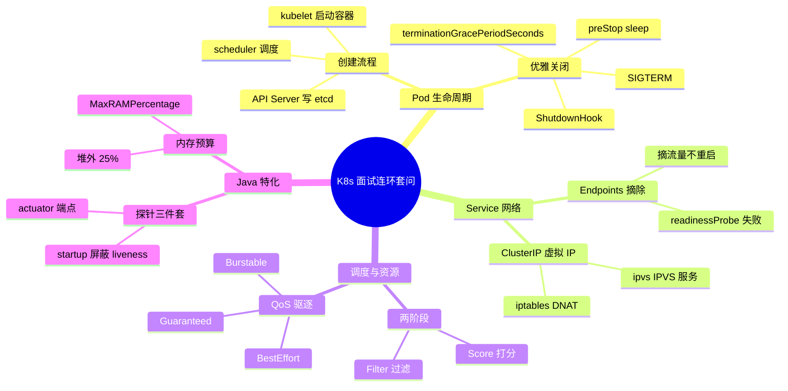

- [ ] **Step 2: 格式校验**

检查：
- 9 篇共 45 题（架构6/工作负载5/网络5/存储4/调度5/配置5/运维5/扩展4/Java6）
- 每题有"参考答案"（3-5 句）+ "关联"链接
- 连环追问标注 🔗 共约 20 题
- 连环套问思维导图 mermaid mindmap 语法正确
- 交叉引用链接正确（`./01-foundation/...` 等相对路径）

- [ ] **Step 3: 提交**

```bash
git add ops/k8s/10-interview-qa.md
git commit -m "docs(k8s): 新增跨主题高频面试 Q&A

- 45 题按 9 篇分类速答（架构/工作负载/网络/存储/调度/配置/运维/扩展/Java）
- 每题 3-5 句要点 + 关联主题文档链接
- 连环追问 🔗 标注约 20 题
- 末尾连环套问思维导图（Pod 生命周期/Service/调度/Java 特化）"
```

---

## Task 12: 仓库集成与 README 更新

**Files:**
- Modify: `ops/README.md`（k8s 行补充链接与文档数）
- Modify: `README.md`（根，同步 ops 段落）

**Interfaces:**
- Consumes: 所有 Task 1-11 的 K8s 文档
- Produces: ops 与根 README 同步 K8s 模块概要

- [ ] **Step 1: 更新 `ops/README.md`**

将 k8s 行从纯文本改为链接，补充文档数说明：

原内容（第 7 行附近）：
```markdown
| k8s | Kubernetes 编排 |
```

改为：
```markdown
| [k8s](./k8s) | Kubernetes 编排面试知识体系（10 份文档，按架构层次组织） |
```

- [ ] **Step 2: 更新根 `README.md`**

查看根 README 的 ops 段落，同步 K8s 模块概要（若根 README 有 ops 模块列表，补充 k8s 模块说明；若无明确段落则按现有风格补充）。

- [ ] **Step 3: 格式校验**

检查：
- ops/README.md 的 k8s 行有链接与文档数说明
- 根 README 的 ops 段落与 ops/README.md 一致
- 链接路径正确（`./k8s`、`./k8s/README.md`）

- [ ] **Step 4: 提交**

```bash
git add ops/README.md README.md
git commit -m "docs(k8s): 集成 k8s 模块到 ops 与根 README

- ops/README.md k8s 行补充链接与文档数
- 根 README 同步 ops 段落"
```

---

## 自审

### 1. Spec 覆盖检查

| Spec 章节 | 对应 Task |
|----------|-----------|
| §1 文件清单 10 份文档 | Task 1-11（README + 9 主题 + Q&A） |
| §1 去重边界（docker/network 引用） | Task 2（01-foundation 引用 docker）、Task 4（03-network 引用 network/docker）、Task 5（04-storage 引用 docker）、Task 10（09-performance 引用 docker） |
| §1 机制级深度（不贴源码） | Task 2/3/8/9 提到关键源码包但不贴代码 |
| §2 六段式结构 | Task 2-10 每份主题文档均遵循六段式（§一概念定义 → §二原理与流程 → §三高频追问 → §四实战关联 → §五面试案例 → §六参考与延伸） |
| §2 Q&A 特殊结构 | Task 11 遵循（使用说明 + 按主题分篇 + 速答 + 关联 + 连环套问思维导图） |
| §2 README 结构 | Task 1 遵循（五节：模块简介/知识图谱/导航表/学习路径/Java 模块关联） |
| §3 知识图谱 mindmap | Task 1 完整写入 README |
| §4 学习路径 | Task 1 写入 README 第四节 |
| §5.1 Java 模块关联表 21 行 | Task 1 写入 README 第五节 |
| §5.2 docker 去重引用 | Task 2/5/10 在文档内引用 |
| §5.3 network 去重引用 | Task 4 在文档内引用 |

### 2. 占位符扫描

无 TBD/TODO，所有步骤含实际内容（mermaid 骨架、表格、Q&A 题目）。

### 3. 一致性检查

- 文件路径一致：所有 Task 的 Files/Interfaces 引用的路径与 §1 文件清单一致
- 交叉引用一致：Task 2-10 的"参考与延伸"链接指向同模块文档，路径为 `../0X-xxx/...`；引用 docker/network 为 `../../docker/...`/`../../network/...`
- 提交信息前缀统一：`docs(k8s):` 前缀
- Q&A 关联链接指向各主题文档，与 Task 2-10 产出一致

自审通过。
