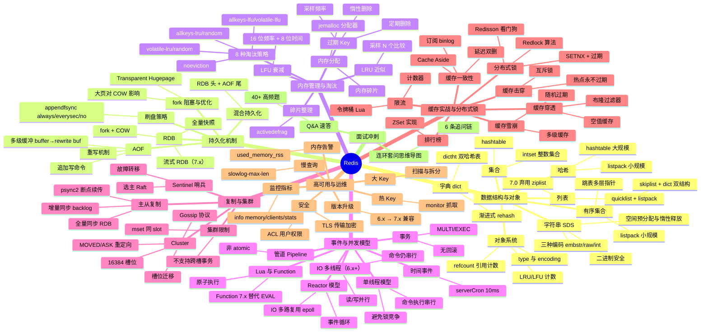

# Redis 面试知识体系实施计划

> **For agentic workers:** REQUIRED SUB-SKILL: Use superpowers:subagent-driven-development (recommended) or superpowers:executing-plans to implement this plan task-by-task. Steps use checkbox (`- [ ]`) syntax for tracking.

**Goal:** 在 `middleware/redis/` 下构建 9 份文档的 Redis 面试知识体系，深度对标 `middleware/mysql` 模块，覆盖 Redis 7.x。

**Architecture:** 纯文档项目，无代码无测试。按 spec 的分阶段交付节奏，每个 Task 完成一份文档并自检（结构校验、链接校验、体量校验）后提交。文档遵循 Redis 专用五段式：概念定义 → 原理与流程 → 高频追问 → 实战关联（Java 后端视角）→ 系统设计案例。

**Tech Stack:** Markdown + Mermaid 图表，中文撰写。

## Global Constraints

- 语言：全部中文（遵循 AGENTS.md 约定）
- 模块路径：`middleware/redis/`（目录骨架在各 Task 中创建）
- 文档结构：Redis 专用五段式（概念定义/原理与流程/高频追问/实战关联/系统设计案例）
- 单份主题文档体量：600-900 行（Redis 知识点密集，与 MySQL 对齐）
- Q&A 文档体量：500-700 行
- README 体量：150-250 行
- 深度：原理级 + 架构级 + 实战级（对标 mysql/linux/docker）
- 版本基线：Redis 7.x，旧版本（5.x/6.x）仅作差异对比
- 每份主题文档头部固定三行：`> **一句话定位**` / `> **面试热度**：⭐⭐⭐⭐⭐` / `> **返回**：[Redis 知识图谱](../README.md)`
- README 自动更新规则：每完成一份主题文档，回填 `middleware/redis/README.md` 导航表与知识图谱进度标记；完成任何模块内容变更同步更新 `middleware/README.md` 与根 `README.md`
- 提交规范：`docs(redis): <描述>`，参照现有 `docs(mysql):` / `docs(linux):` / `docs(docker):` 风格
- 参考样本：`middleware/mysql/01-index/index-and-optimization.md`（主题文档五段式）、`middleware/mysql/08-interview-qa.md`（Q&A）、`middleware/mysql/README.md`（入口）、`middleware/mysql/05-storage/innodb-engine.md`（存储引擎底层深度样本）
- 交叉引用原则：Redis 章只讲"Redis 场景下的实现与选择"，原理推导链回对应模块（ops/linux、middleware/mysql、java-core、framework），不重复展开
- 源码引用约定：Redis 源码用 `src/xxx.c` 格式（如 `src/dict.c` 的 `dictRehash` 函数），与 MySQL 的 `storage/innobase/` 格式对齐
- 进度标记：导航表初始用 `⬜`，完成后回填为 `✅`

## File Structure

```
middleware/redis/
├── README.md                                  # Task 1 创建（入口）
├── 01-data-structure/
│   └── data-structure-and-encoding.md          # Task 2（数据结构与对象编码）
├── 02-persistence/
│   └── persistence-mechanism.md                # Task 3（持久化机制）
├── 03-memory/
│   └── memory-and-eviction.md                  # Task 4（内存管理与淘汰策略）
├── 04-event/
│   └── event-and-concurrency.md                # Task 5（事件与并发模型）
├── 05-replication/
│   └── replication-and-cluster.md              # Task 6（复制与集群）
├── 06-cache-practice/
│   └── cache-and-distributed-lock.md           # Task 7（缓存实战与分布式锁）
├── 07-ops/
│   └── ha-and-ops.md                           # Task 8（高可用与运维）
└── 08-interview-qa.md                          # Task 9（面试 Q&A 速答，含回填）
```

每份主题文档职责：覆盖该专题的底层机制 + 实战关联（Java 后端视角）+ 系统设计案例，独立可读。Q&A 篇不套五段式，采用速答列表 + 连环套问思维导图。

---

## Task 1: 创建 middleware/redis/README.md 入口

**Files:**
- Create: `middleware/redis/README.md`
- Create: `middleware/redis/01-data-structure/`、`02-persistence/`、`03-memory/`、`04-event/`、`05-replication/`、`06-cache-practice/`、`07-ops/`（7 个子目录，用 mkdir -p 创建）
- Modify: `middleware/README.md`（把 `redis` 行从纯文本改为链接）
- Modify: 根 `README.md` middleware 概要（标注 redis 已建文档体系）

**Interfaces:**
- Produces: `middleware/redis/README.md`，作为后续所有主题文档的导航入口；导航表中的链接路径是后续 Task 的产出契约

- [ ] **Step 1: 创建目录骨架**

Run:
```bash
mkdir -p middleware/redis/01-data-structure middleware/redis/02-persistence middleware/redis/03-memory middleware/redis/04-event middleware/redis/05-replication middleware/redis/06-cache-practice middleware/redis/07-ops
```

- [ ] **Step 2: 编写 middleware/redis/README.md**

按 spec 第二节"模块整体结构"与第三节"知识图谱 mindmap"编写，内容要点：

**一、模块简介**：
- 定位：面向 Java 后端高级/资深面试的 Redis 知识体系，深度对标 `middleware/mysql`、`ops/linux`、`ops/docker`
- 适用对象：Java 后端面试（社招高级/资深，5 年+），兼顾架构与系统设计方向
- 组织方式：7 个主题目录 + 1 个 Q&A 文件，每份主题文档遵循「概念定义 → 原理与流程 → 高频追问 → 实战关联 → 系统设计案例」五段式结构
- 导航约定：每份文档顶部含 `> 返回 [Redis 知识图谱](../README.md)` 链接
- 版本基线：Redis 7.x（覆盖 listpack 替代 ziplist、Function、Sharded PubSub、流式 RDB、IO 多线程等特性，5.x/6.x 仅作差异对比）

**二、知识图谱（Mermaid mindmap）**：根节点 `Redis`，8 大分支（完整内容见 spec 第二节）：



**三、导航表**：8 行表格，格式 `| 分层 | 文档 | 核心考点 |`，初始用 `⬜` 标记，引用 spec 第三节：

```
| 分层 | 文档 | 核心考点 |
|------|------|---------|
| 数据结构与对象 | [数据结构与对象编码](./01-data-structure/data-structure-and-encoding.md) ⬜ | SDS/dict 渐进式 rehash/quicklist+listpack/skiplist 跳表/intset/对象 type+encoding/编码转换 |
| 持久化机制 | [持久化机制](./02-persistence/persistence-mechanism.md) ⬜ | RDB fork+COW/流式 RDB/AOF 重写/多级缓冲/混合持久化/appendfsync 策略/大页影响 |
| 内存管理与淘汰 | [内存管理与淘汰策略](./03-memory/memory-and-eviction.md) ⬜ | jemalloc 碎片/惰性+定期删除/8 种淘汰策略/LRU 近似/LFU 衰减/activedefrag |
| 事件与并发模型 | [事件与并发模型](./04-event/event-and-concurrency.md) ⬜ | 单线程/Reactor epoll/IO 多线程/serverCron/Pipeline/MULTI 事务/Lua+Function |
| 复制与集群 | [复制与集群](./05-replication/replication-and-cluster.md) ⬜ | 全量+增量同步/psync2/Sentinel Raft/16384 槽位/Gossip/MOVED·ASK/槽位迁移 |
| 缓存实战与分布式锁 | [缓存实战与分布式锁](./06-cache-practice/cache-and-distributed-lock.md) ⬜ | 穿透·击穿·雪崩/Cache Aside/延迟双删/binlog 订阅/SETNX/Redlock/Redisson/限流/排行榜 |
| 高可用与运维 | [高可用与运维](./07-ops/ha-and-ops.md) ⬜ | 慢查询/大 Key·热 Key 治理/info 监控指标/内存告警/ACL+TLS 安全/版本升级 |
| 面试冲刺 | [Q&A 速答](./08-interview-qa.md) ⬜ | 40+ 题速答 + 连环套问思维导图 |
```

末尾加：`> 共 **9 份**文档：入口 README（本文档）+ 上表 8 份主题/Q&A 文档。`

**四、推荐学习路径**：两条路线（引用 spec 第四节）：
- 路线一（系统学习）：01 数据结构 → 02 持久化 → 03 内存与淘汰 → 04 事件模型 → 05 复制与集群 → 06 缓存实战 → 07 运维 → 08 Q&A
- 路线二（面试冲刺）：01 数据结构 → 06 缓存实战与分布式锁 → 02 持久化 → 03 内存与淘汰 → 05 复制与集群 → 04 事件模型 → 07 运维 → 08 Q&A

**五、与 java-core / framework 模块的关联**：引用 spec 第五节关联表（13 行），列出 Redis 知识点与 java-core/framework 模块的关联要点。

**六、与 ops 模块的交叉引用**：引用 spec 第六节交叉引用表（9 行）。

- [ ] **Step 3: 更新 middleware/README.md**

把 `- redis` 改为：
```
- [redis](./redis) — Redis 面试知识体系（9 份文档，面向 5 年+ 资深面试）
```

其余 mysql/kafka/rocketmq/es/mongodb 保持原样（mysql 已建，其他未建）。

- [ ] **Step 4: 更新根 README.md middleware 概要**

把 middleware 段落改为：
```
## middleware

- [MySQL](./mysql) — 面试知识体系（9 份文档，覆盖索引/事务/锁/查询优化/存储引擎/日志/架构）
- [Redis](./redis) — 面试知识体系（9 份文档，覆盖数据结构/持久化/内存/事件/集群/缓存/运维）
- Kafka / RocketMQ / Elasticsearch / MongoDB（规划中）
```

- [ ] **Step 5: 结构校验**

Run: `ls -la middleware/redis/`，确认 7 个子目录存在。
Run: `grep -c '^##' middleware/redis/README.md`，确认至少 5 节标题。
Run: `grep '返回.*Redis 知识图谱' middleware/redis/README.md`，确认导航链接文本存在。
Run: `grep 'mindmap' middleware/redis/README.md`，确认含知识图谱。
Expected: 目录结构正确，README 含 5+ 节，导航链接文本与 mindmap 存在。

- [ ] **Step 6: 提交**

```bash
git add middleware/redis/ middleware/README.md README.md
git commit -m "docs(redis): 新增 Redis 模块 README 与目录骨架"
```

---

## Task 2: 01-data-structure/data-structure-and-encoding.md（数据结构与对象编码）

**Files:**
- Create: `middleware/redis/01-data-structure/data-structure-and-encoding.md`

**Interfaces:**
- Consumes: `middleware/redis/README.md` 的导航链接路径
- Produces: `./01-data-structure/data-structure-and-encoding.md`，README 导航表第一行的链接可达

**核心考点**（spec 第七章文档 1）：SDS/dict 渐进式 rehash/quicklist+listpack/skiplist 跳表/intset/对象 type+encoding/编码转换/ZSet 双结构

- [ ] **Step 1: 编写文档**

按 Redis 五段式编写，各段内容要点：

**头部**：
```
# 数据结构与对象编码

> **一句话定位**：Redis 数据结构是面试起手题，"讲讲 Redis 有哪些数据类型及底层实现"几乎每场必问，能讲到 SDS 空间预分配、dict 渐进式 rehash、跳表与 listpack 的编码转换才算合格。
> **面试热度**：⭐⭐⭐⭐⭐
> **返回**：[Redis 知识图谱](../README.md)
```

**一、概念定义**（spec 第七章文档 1 第 1 点）：
- Redis 数据类型与底层结构的关系：type 5 种（String/List/Hash/Set/ZSet）+ Stream vs encoding 多种（int/embstr/raw/quicklist/listpack/hashtable/intset/skiplist），解耦"接口"与"实现"——type 对外暴露，encoding 对内优化
- 为什么 Redis 要做编码转换：小数据用紧凑结构省内存（listpack 连续内存无指针开销）、大数据用高效结构保性能（hashtable O(1) 查找），以 listpack→hashtable 为例说明转换阈值
- 对象系统 redisObject 结构：5 字段详解（type 4 位/encoding 4 位/refcount/lru 24 位/ptr 指针），redisObject 头部 16 字节 + ptr 指向真实数据
- 共享对象池：0-9999 的整数对象共享（`server.maxmemory_policy` 不含 LFU 时才启用），为什么字符串不共享——相等判断 O(n) 太贵，整数 O(1) 可判等

**二、原理与流程**（spec 第七章文档 1 第 2 点，含 mermaid 图、源码路径、对比表）：
- **SDS 详解**：结构 `len/alloc/flags/buf`（`sdshdr5/8/16/32/64` 五种子类型按长度选型），空间预分配 `min(len*2, 1MB)`（小于 1MB 翻倍、大于 1MB 固定加 1MB）、惰性释放（不立即缩容，避免后续追加再分配）、二进制安全（`len` 字段使 `\0` 可存在于数据中），与 C 字符串对比表（获取长度 O(1) vs O(n)、二进制安全 vs 不安全、扩容预分配 vs 每次 realloc）
- **dict 字典与渐进式 rehash**：`dictht[2]` 双哈希表、`rehashidx` 控制迁移进度，每次增删改查迁移 1 个桶（`dictRehash(d, 1)`），为什么不能一次性 rehash——单线程会阻塞（10 万元素一次性 rehash 约 10ms 阻塞），负载因子 `used/size` 与 `dict_force_resize_ratio=5` 阈值，为什么 dict 改用 SipHash——防 hash 碰撞 DoS 攻击。用 mermaid flowchart 画渐进式 rehash 过程（ht[0] 与 ht[1] 并存、rehashidx 逐步推进）
- **listpack**：7.0 替代 ziplist，结构 `entry(encode/data/backlen) + num-elements + end`，为什么弃用 ziplist——`prev_entry_length` 字段引发的连锁更新（cascade update）最坏 O(n²)，listpack 用 `backlen` 反向遍历规避连锁更新。对比表（ziiplist vs listpack 的 prev_entry_length/backlen/连锁更新）
- **quicklist**：双向链表 + 节点内 listpack，`fill` 控制单节点大小（-1/-2/-3 对应 4KB/8KB/16KB/32KB/64KB）、`compress` 两端压缩 LZF（0/1/2/3 表示两端不压缩/保留 1 个/2 个/3 个未压缩节点），7.x 默认 `list-max-listpack-size=-2` 即 8KB。用 mermaid flowchart 画 quicklist 节点结构（节点 A ↔ 节点 B ↔ 节点 C，每节点内含 listpack）
- **intset**：整数集合，`encoding` 按 int16/32/64 自动升级（`intsetUpgradeAndAdd`），二分查找 O(log n)，为什么只支持升级不支持降级——降级需全量检查所有元素是否仍 fit 低 encoding，开销大且场景少
- **skiplist 跳表**：多层指针、`ZSKIPLIST_MAXLEVEL=32`、`p=0.25` 期望层高 1.33（`1/(1-p)=1.33`），查询复杂度 O(log n)，为什么不用红黑树——范围查询 O(log n) + 实现简单（200 行 vs 红黑树上千行）+ 内存灵活（每节点按层数分配指针），与 B+树对比——内存数据库无磁盘 IO，跳表无需压缩到页内。用 mermaid flowchart 画跳表多层结构（L0 全链、L1 稀疏、L2 更稀疏、header 节点）
- **各数据类型的编码转换阈值表**：list:listpack→quicklist（`list-max-listpack-entries=128`/`list-max-listpack-size=64`）、hash:listpack→hashtable（`hash-max-listpack-entries=128`/`hash-max-listpack-value=64`）、zset:listpack→skiplist+dict（`zset-max-listpack-entries=128`/`zset-max-listpack-value=64`）、set:intset→hashtable（`set-max-intset-entries=512`），4 列 4 行表
- **ZSet 为什么用 skiplist + dict 双结构**：dict O(1) 查 score（`ZSCORE`）、skiplist O(log n) 范围查询（`ZRANGE`/`ZRANGEBYSCORE`），两者共用元素节点（skiplist node 内含 `ele` 与 `score`，dict 的 key 是 `ele` value 是指向 skiplist node 的指针），互补不可替代
- 关键源码路径：`src/sds.c`（SDS）、`src/dict.c` 的 `dictRehash`（渐进式 rehash）、`src/listpack.c`（listpack）、`src/t_zset.c` 的 `zslCreate`/`zslInsert`（跳表）、`src/object.c` 的 `createObject`（对象系统）

**三、高频追问**（spec 第七章文档 1 第 3 点，6 题，问答体每题 3-5 句要点）：
- Q1: Redis 有几种数据类型？底层数据结构是什么？
- Q2: String 底层 SDS 为什么不直接用 C 字符串？
- Q3: 为什么 Redis 用跳表不用红黑树？
- Q4: 渐进式 rehash 过程中，查询怎么走？增删改怎么走？
- Q5: listpack 为什么替代 ziplist？连锁更新是什么？
- Q6: ZSet 为什么用 skiplist + dict 两个结构？

**四、实战关联（Java 后端视角）**（spec 第七章文档 1 第 4 点）：
- Java 场景：排行榜用 ZSet（`ZADD`/`ZREVRANGE`/`ZINCRBY`）、统计 UV 用 HyperLogLog（`PFADD`/`PFCOUNT`，12KB 误差 0.81%）、消息流用 Stream（`XADD`/`XREAD`/`XGROUP`）、位置服务用 Geo（`GEOADD`/`GEORADIUS` 底层 ZSet）
- 与 Spring Data Redis 的 `RedisTemplate.opsForZSet()` / `opsForHash()` / `opsForList()` API 对应
- 编码转换阈值与业务数据规模的匹配：如 hash 存商品属性（128 字段以内用 listpack 省内存、超过转 hashtable），Set 存用户 ID（512 以内整数用 intset、超过转 hashtable）
- 关联 `framework/jackson`：SDS 二进制安全与 Jackson 序列化字节的对接（`GenericJackson2JsonRedisSerializer` 序列化后的 byte[] 存入 String）

**五、系统设计案例**（spec 第七章文档 1 第 5 点）：
- 案例 1：设计一个支持亿级 UV 的日活统计系统——3 分钟标准答法（HyperLogLog + 按天分 key `uv:20260811` + `PFMERGE` 合并月/周 + 误差 0.81% 可接受 + 内存 12KB/天 vs Set 1GB/天）+ 追问链 3 条（数据精度要求高怎么办→HLL 不行用 Bitmap/Set、实时性要求高怎么办→HLL 不支持去重后查询只能统计基数、跨天合并怎么做→PFMERGE）
- 案例 2：设计一个延迟队列——追问链（ZSet score=到期时间戳 + 定时扫描 `ZRANGEBYSCORE` → 多消费者竞争 `ZPOPMIN` 原子取出 → 宕机丢消息怎么办→AOF 持久化 + ACK 机制 → 消息量大怎么办→分片 key + Stream 替代）

- [ ] **Step 2: 体量与结构校验**

Run: `wc -l middleware/redis/01-data-structure/data-structure-and-encoding.md`
Expected: 600-900 行。

Run: `grep -c '^## ' middleware/redis/01-data-structure/data-structure-and-encoding.md`
Expected: 5（五个二级标题：一~五）。

Run: `grep '一句话定位\|面试热度\|返回.*Redis 知识图谱' middleware/redis/01-data-structure/data-structure-and-encoding.md`
Expected: 头部三行齐全。

Run: `grep -c 'mermaid' middleware/redis/01-data-structure/data-structure-and-encoding.md`
Expected: ≥ 3（渐进式 rehash 图、quicklist 结构图、跳表多层结构图）。

- [ ] **Step 3: 回填 README 进度标记**

把 `middleware/redis/README.md` 导航表第一行末尾的 `⬜` 改为 `✅`。

- [ ] **Step 4: 提交**

```bash
git add middleware/redis/01-data-structure/data-structure-and-encoding.md middleware/redis/README.md
git commit -m "docs(redis): 新增数据结构与对象编码"
```

---

## Task 3: 02-persistence/persistence-mechanism.md（持久化机制）

**Files:**
- Create: `middleware/redis/02-persistence/persistence-mechanism.md`

**Interfaces:**
- Consumes: `middleware/redis/README.md` 导航链接
- Produces: `./02-persistence/persistence-mechanism.md`，README 导航表第二行链接可达

**核心考点**（spec 第七章文档 2）：RDB fork+COW/流式 RDB/AOF 重写/多级缓冲/混合持久化/appendfsync 策略/大页影响

- [ ] **Step 1: 编写文档**

**头部**：一句话定位"持久化是 Redis 与纯内存缓存（如 Memcached）的本质区别，'RDB 和 AOF 怎么选'是高频必问，能讲到 fork COW 与 fsync 阻塞才算合格"

**一、概念定义**（spec 第七章文档 2 第 1 点）：
- 为什么 Redis 需要持久化：内存数据库断电即失，与 MySQL 磁盘数据库的本质区别（MySQL 数据在磁盘，Redis 数据在内存，持久化是"额外"功能）
- RDB vs AOF vs 混合持久化对比表（全量快照 vs 增量命令、体积小 vs 体积大、恢复快 vs 恢复慢、数据丢失窗口 RDB 无/AOF 1s/混合 1s，4 列 3 行）
- 持久化对性能的影响：fork 阻塞（复制页表，与内存成正比）、fsync 阻塞（always 模式每次写 fsync）、AOF 重写 CPU 占用（子进程生成 RDB 格式 + 父进程增量缓冲）

**二、原理与流程**（spec 第七章文档 2 第 2 点，含 mermaid 图与源码路径）：
- **RDB 全量快照**：`bgsave` → fork 子进程 → COW 写时复制 → 遍历所有 db 的 dict 生成二进制 dump.rdb、`save` 与 `bgsave` 的区别（save 阻塞主线程期间不处理任何命令、bgsave 后台子进程）、`save` 触发条件（`save 3600 1`/`save 300 100`/`save 60 10000`）。用 mermaid sequenceDiagram 画 bgsave 流程（主进程 fork → 子进程遍历 → 写 RDB → 通知主进程）
- **fork 与 COW 详解**：`fork()` 系统调用、父子进程共享物理页（只读）、父进程写入触发缺页中断复制页（COW）、为什么 fork 本身很快——只复制页表不复制数据（10GB 实例 fork 约 200ms 复制页表）、页表大小与内存成正比（1GB 内存页表约 2MB、10GB 约 20MB）。用 mermaid flowchart 画 COW 过程（共享页 → 写触发复制 → 父子各有一份）
- **流式 RDB**（7.x）：`repl-diskless-sync yes` + `repl-diskless-sync-delay`，主从全量同步时主库不落盘 RDB，直接通过 socket 流式发送给从库，避免磁盘 IO。适用场景：磁盘 IO 慢（如网络盘）、从库多（并行发送）
- **AOF 追加写命令**：`appendonly yes`，命令协议格式 RESP（如 `*3\r\n$3\r\nSET\r\n$3\r\nkey\r\n$5\r\nvalue\r\n`），`aof_buf` 缓冲区 → write 系统调用（写到 page cache）→ fsync 落盘（真正持久化）
- **AOF 重写**：子进程遍历 db 生成最小命令集（如 `RPUSH list a; RPUSH list b; RPOP list` 重写为 `RPUSH list a b`）、`aof_rewrite_buf` 重写期间增量缓冲（父进程新写入的命令）、重写完成后原子替换（rename(2) 原子操作）、为什么需要重写缓冲——子进程不能访问父进程新写入（fork 后数据隔离）。用 mermaid sequenceDiagram 画 AOF 重写流程（父进程 fork → 子进程遍历写新 AOF → 父进程增量写入 aof_rewrite_buf → 子进程完成 → 父进程追加 aof_rewrite_buf → rename 替换）
- **appendfsync 三种策略**：always（每次写都 fsync，最安全但最慢，单线程下 fsync 阻塞所有命令）、everysec（每秒 fsync 一次，默认，最多丢 1 秒）、no（交给 OS，30 秒 fsync 一次）。数据丢失窗口分析：always 0 丢失、everysec 最多 1s、no 最多 30s。对比表（策略/丢失窗口/性能/适用场景，4 列 3 行）
- **混合持久化**：`aof-use-rdb-preamble yes`（7.x 默认开启），AOF 重写时子进程生成 RDB 格式头 + 增量 AOF 命令尾，恢复时先加载 RDB（快）再回放 AOF（少），兼顾恢复速度与数据完整性
- **Transparent Hugepage 对 COW 的影响**：Linux THP 默认 2MB 大页 vs 标准页 4KB，大页导致 COW 复制粒度放大 512 倍（父进程只改 1 字节也要复制整页 2MB），必须关闭 THP：`echo never > /sys/kernel/mm/transparent_hugepage/enabled`
- 关键源码路径：`src/rdb.c` 的 `rdbSaveBackground`（bgsave）、`src/aof.c` 的 `rewriteAppendOnlyFile`（AOF 重写）、`src/rio.c`（IO 抽象层，differential rewrite）

**三、高频追问**（spec 第七章文档 2 第 3 点，6 题）：
- Q1: RDB 和 AOF 怎么选？生产用哪个？
- Q2: bgsave 时如果有写入怎么办？数据会丢吗？
- Q3: AOF 文件越来越大怎么办？
- Q4: fork 为什么会阻塞？怎么优化？
- Q5: everysec 真的只丢 1 秒吗？有没有例外？
- Q6: 混合持久化怎么恢复？

**四、实战关联（Java 后端视角）**（spec 第七章文档 2 第 4 点）：
- 生产配置模板：`appendonly yes` + `appendfsync everysec` + `aof-use-rdb-preamble yes` + 关闭 THP + `maxmemory` 控制单实例 < 10GB
- 大内存实例 fork 阻塞的优化：控制单实例 < 10GB（fork 时间 < 200ms 可接受）、使用 Cluster 分片（每片 10GB）、使用 `repl-diskless-sync` 避免主从同步落盘
- 与 MySQL binlog 的对比（逻辑日志 vs 物理快照、用途差异：binlog 用于复制与归档、AOF 用于宕机恢复）
- 关联 `ops/linux/05-fs/filesystem-and-vfs.md`：fsync 与文件系统崩溃一致性、`ops/linux/03-memory/memory-management.md`：fork COW 与 Linux 内存管理

**五、系统设计案例**（spec 第七章文档 2 第 5 点）：
- 案例 1：设计一个 50GB Redis 实例的持久化方案——3 分钟答法（Cluster 分片到 5 个 10GB 节点、每节点混合持久化 everysec、fork 阻塞约 200ms 可接受、关闭 THP）+ 追问链 3 条（单实例为什么不超 10GB→fork 阻塞、从库怎么做持久化→从库不开 AOF 只靠主库同步、AOF 重写时主库压力大怎么办→`auto-aof-rewrite-percentage 100` 控制频率）
- 案例 2：主从全量同步时如何避免主库磁盘 IO——追问链（`bgsave` 落盘 → 磁盘 IO 瓶颈 → 流式 RDB `repl-diskless-sync yes` → 网络直接传输不落盘 → 从库多时并行发送 `repl-diskless-sync-delay`）

- [ ] **Step 2: 体量与结构校验**

Run: `wc -l middleware/redis/02-persistence/persistence-mechanism.md`，Expected: 600-900 行。
Run: `grep -c '^## ' middleware/redis/02-persistence/persistence-mechanism.md`，Expected: 5。
Run: `grep '一句话定位\|面试热度\|返回.*Redis 知识图谱' middleware/redis/02-persistence/persistence-mechanism.md`，Expected: 头部三行齐全。
Run: `grep -c 'mermaid' middleware/redis/02-persistence/persistence-mechanism.md`，Expected: ≥ 3（bgsave 时序图、COW 流程图、AOF 重写时序图）。

- [ ] **Step 3: 回填 README 进度标记**

把导航表第二行末尾的 `⬜` 改为 `✅`。

- [ ] **Step 4: 提交**

```bash
git add middleware/redis/02-persistence/persistence-mechanism.md middleware/redis/README.md
git commit -m "docs(redis): 新增持久化机制"
```

---

## Task 4: 03-memory/memory-and-eviction.md（内存管理与淘汰策略）

**Files:**
- Create: `middleware/redis/03-memory/memory-and-eviction.md`

**Interfaces:**
- Consumes: `middleware/redis/README.md` 导航链接
- Produces: `./03-memory/memory-and-eviction.md`，README 导航表第三行链接可达

**核心考点**（spec 第七章文档 3）：jemalloc 碎片/惰性+定期删除/8 种淘汰策略/LRU 近似/LFU 衰减/activedefrag

- [ ] **Step 1: 编写文档**

**头部**：一句话定位"内存是 Redis 的核心资源，'过期 Key 怎么删、内存满了怎么办'是中高级面试分水岭，能讲到 LRU 近似采样与 LFU 对数衰减才算合格"

**一、概念定义**（spec 第七章文档 3 第 1 点）：
- Redis 内存管理本质：所有数据在内存，内存是硬约束（与 MySQL 磁盘扩展的本质区别，MySQL 表可大于内存），`maxmemory` 是硬上限
- `maxmemory` 配置与三个指标区别：`used_memory`（Redis 逻辑分配的内存）、`used_memory_rss`（操作系统视角的物理内存，含碎片）、`used_memory_dataset`（减去 overhead 后的纯数据内存）
- 内存碎片：jemalloc 分配器按 size class 分配（如 8/16/32/48/64/80/96/112/128 字节…），频繁删改导致已分配的 size class 内有空洞，`mem_fragmentation_ratio = used_memory_rss / used_memory`，> 1.5 需关注
- 过期 Key 与淘汰 Key 的区别：过期是时间驱动（TTL 到期），淘汰是空间驱动（`maxmemory` 超限），两者独立触发

**二、原理与流程**（spec 第七章文档 3 第 2 点，含 mermaid 图与源码路径）：
- **过期 Key 删除策略**：
  - 惰性删除：访问时检查 `expireIfNeeded`（`db.c` 的 `expireIfNeeded`），过期则删除返回 nil。优点 CPU 友好（不主动扫描），缺点过期 Key 无人访问则常驻内存（"内存泄漏"）
  - 定期删除：`serverCron` 每 100ms 触发 `activeExpireCycle`，抽样 `ACTIVE_EXPIRE_CYCLE_LOOKUPS_PER_LOOP=20` 个设置了 TTL 的 key，过期比例 > 25% 则继续扫描（自适应），每次最多执行 25ms（`fast` 模式 2ms）
  - 为什么不用定时删除：每个 Key 一个定时器（timerfd 或链表）开销太大，Redis 的 key 可能数千万，定时器维护成本不可接受
- **8 种淘汰策略详解**：noeviction（不淘汰，写入报错）、allkeys-lru（所有 key 近似 LRU）、allkeys-random（随机）、allkeys-lfu（所有 key LFU）、volatile-lru（设了 TTL 的 key 近似 LRU）、volatile-random（设了 TTL 的随机）、volatile-lfu（设了 TTL 的 LFU）、volatile-ttl（设了 TTL 的按 TTL 升序，越快过期越先淘汰）。7.0 前 `volatile-lfu` 和 `allkeys-lfu` 是 4.0 引入。对比表（策略名/作用范围/淘汰依据/适用场景，4 列 8 行）
- **LRU 近似实现**：为什么不用双向链表 LRU——内存开销大（每 key 两个额外指针）、维护成本高（每次访问移动节点到头部）、采样 `maxmemory-samples` 默认 5 个取最久未用淘汰、采样数越大越精确但越慢（N=5 近似 LRU、N=10 接近 LRU）。用 mermaid flowchart 画采样淘汰过程（随机选 5 个 → 取 lru 最小 → 淘汰 → 重复）
- **LFU 实现**：redisObject 24 位 lru 字段拆为 16 位频率（counter）+ 8 位时间衰减（last decrement time），频率用对数计数器 `counter = (counter * lfu_log_factor + 1) / counter` 防止饱和（`lfu_log_factor` 默认 10，counter 最大 255 对应 1000 万次访问），时间衰减 `lfu-decay-time` 默认 1 分钟衰减 1（每 `lfu-decay-time` 分钟未访问 counter 减 1）。为什么 4.0 后推荐 LFU：LRU 可能被"偶尔被访问的冷数据"挤掉热点，LFU 按频率保留热点
- **LRU vs LFU 对比**：LRO 按访问时间（最近未访问）、LFU 按访问频率（访问次数少），LFU 解决"扫描全表把热点挤掉"问题，对比表（策略/依据/优势/劣势/适用场景，5 列 2 行）
- **内存分配器 jemalloc**：size class 分配（按 8/16/32/48/64… 字节对齐）、`je_malloc`/`je_free`、碎片产生原因（删改频繁导致 size class 内空洞）、为什么不用 glibc malloc——jemalloc 碎片率更低（实测 1.1 vs 1.5）
- **activedefrag 主动碎片整理**（7.x）：`activedefrag yes`，在 `serverCron` 中占用少量 CPU（`active-defrag-cycle-min 1` 最小 1% CPU）移动数据整理碎片，`active-defrag-ignore-bytes` 触发阈值（100MB 碎片开始整理）、`active-defrag-threshold-lower 10`（碎片率超 10% 触发）
- 关键源码路径：`src/expire.c` 的 `activeExpireCycle`（定期删除）、`src/evict.c` 的 `freeMemoryIfNeeded`（淘汰）、`src/object.c` 的 `lookupKey`（惰性删除触发点）、`src/lfu.c` 的 `lfuLogIncr`/`lfuDecode`（LFU 计数与衰减）

**三、高频追问**（spec 第七章文档 3 第 3 点，6 题）：
- Q1: Redis 过期 Key 怎么处理？三种策略对比
- Q2: 内存满了怎么办？8 种淘汰策略
- Q3: LRU 怎么实现的？为什么不用双向链表？
- Q4: LRU 和 LFU 区别？哪个好？为什么 4.0 后推荐 LFU？
- Q5: 怎么查内存碎片？怎么清理？
- Q6: 为什么 used_memory_rss 比 used_memory 大？

**四、实战关联（Java 后端视角）**（spec 第七章文档 3 第 4 点）：
- 生产 `maxmemory` 配置建议：物理内存 60-70%（留 fork 复制页表 + 系统开销 + AOF 缓冲），如 32GB 物理机设 `maxmemory 20GB`
- 碎片整理配置：`activedefrag yes` + `active-defrag-cycle-min 1` + `active-defrag-threshold-lower 10`
- 不同业务场景的淘汰策略选择：纯缓存用 `allkeys-lfu`（允许丢失、按频率保留热点）、数据库（如 Redis 存 Session）用 `noeviction` + 容量监控 + 报警（不允许丢失）
- 关联 `java-core/jvm`：Redis refcount 引用计数 vs JVM GC 可达性分析、jemalloc 与 JVM 堆外内存 DirectByteBuffer 的对照

**五、系统设计案例**（spec 第七章文档 3 第 5 点）：
- 案例 1：设计一个 100GB 缓存集群的内存规划——3 分钟答法（5 节点 × 32GB 物理机，maxmemory 20GB/节点，allkeys-lfu，监控 `used_memory_rss` 与 `mem_fragmentation_ratio`，碎片率 > 1.5 触发 activedefrag）+ 追问链 3 条（为什么不全部用 64GB 物理机→fork 阻塞、为什么用 allkeys-lfu→缓存允许丢失按频率保留热点、碎片率为什么高→频繁删改 + jemalloc size class）
- 案例 2：大量 Key 同时过期导致的问题——追问链（定期删除来不及 → 内存抖动 → 业务雪崩 → 随机过期时间 `expire key ttl + random(0, 300)` 打散 → 为什么会同时过期→批量导入未设随机 TTL）

- [ ] **Step 2: 体量与结构校验**

Run: `wc -l middleware/redis/03-memory/memory-and-eviction.md`，Expected: 600-900 行。
Run: `grep -c '^## ' middleware/redis/03-memory/memory-and-eviction.md`，Expected: 5。
Run: `grep '一句话定位\|面试热度\|返回.*Redis 知识图谱' middleware/redis/03-memory/memory-and-eviction.md`，Expected: 头部三行齐全。
Run: `grep -c 'mermaid' middleware/redis/03-memory/memory-and-eviction.md`，Expected: ≥ 2（LRU 采样淘汰流程图、LFU 计数与衰减图）。

- [ ] **Step 3: 回填 README 进度标记**

把导航表第三行末尾的 `⬜` 改为 `✅`。

- [ ] **Step 4: 提交**

```bash
git add middleware/redis/03-memory/memory-and-eviction.md middleware/redis/README.md
git commit -m "docs(redis): 新增内存管理与淘汰策略"
```

---

## Task 5: 04-event/event-and-concurrency.md（事件与并发模型）

**Files:**
- Create: `middleware/redis/04-event/event-and-concurrency.md`

**Interfaces:**
- Consumes: `middleware/redis/README.md` 导航链接
- Produces: `./04-event/event-and-concurrency.md`，README 导航表第四行链接可达

**核心考点**（spec 第七章文档 4）：单线程/Reactor epoll/IO 多线程/serverCron/Pipeline/MULTI 事务/Lua+Function

- [ ] **Step 1: 编写文档**

**头部**：一句话定位"单线程模型是 Redis 最具辨识度的特征，'为什么单线程还这么快'是面试必问，能讲到 IO 多线程与命令串行的边界才算合格"

**一、概念定义**（spec 第七章文档 4 第 1 点）：
- Redis 单线程的含义：命令执行单线程（`processCommand` 串行），IO 在 6.0 后可多线程（`io-threads`），不是"整个 Redis 只有一个线程"——实际上有主线程 + bio 后台线程（AOF fsync、关闭文件、lazyfree）+ IO 线程
- 为什么单线程：避免锁竞争（数据结构无需加锁）、避免上下文切换（单线程无调度开销）、Redis 瓶颈不在 CPU 而在内存与网络（单线程内存操作吞吐 10 万+ QPS）、单线程内存操作极快（ns 级）
- Reactor 模型：IO 多路复用 + 事件分发 + 事件处理器（`aeMain` 循环 → epoll_wait → 处理读事件 → 解析命令 → 执行 → 处理写事件），与 Netty 的对比（Netty 主从 Reactor 多线程，Redis 单 Reactor + IO 多线程）
- Pipeline 与事务的区别：Pipeline 是客户端批量发送（非原子，中间可插入其他客户端命令）、事务是服务端原子执行（`MULTI` 队列 + `EXEC` 原子，但无回滚）。对比表（维度/原子性/网络 RTT/失败处理，4 列 2 行）

**二、原理与流程**（spec 第七章文档 4 第 2 点，含 mermaid 图与源码路径）：
- **事件循环详解**：`aeMain` → `aeProcessEvents` → `aeApiPoll(epoll_wait)` → 处理就绪事件（读/写）→ 处理时间事件（`serverCron`）。为什么用 epoll 不用 select——无 1024 fd 限制、O(1) 返回就绪事件（select O(n) 遍历全部 fd）、ET vs LT——Redis 用 LT 兼容性好（LT 不会漏事件，ET 需一次性读完）。用 mermaid flowchart 画事件循环流程（epoll_wait → 读事件队列 → 命令执行 → 写事件队列 → 时间事件 → 回到 epoll_wait）
- **IO 多路复用 epoll**：`epoll_create` 创建实例、`epoll_ctl` 注册 fd（EPOLLIN/EPOLLOUT）、`epoll_wait` 阻塞等待就绪、红黑树管理所有 fd、就绪链表返回（内核维护就绪列表，`epoll_wait` 只拷贝就绪的）。Redis 封装为 `ae_epoll.c` 的 `aeApiPoll`
- **IO 多线程**（6.0+）：`io-threads 4`（建议不超过 CPU 核数）、7.x `io-threads-do-reads yes`（读也并行）、读/写 socket 并行（`readQueryFromClient` 并行解析、`writeToClient` 并行发送）、命令解析与执行仍单线程（`processCommand` 串行）、为什么不让命令也多线程——破坏原子性（`INCR` 需读-改-写，多线程需加锁违背单线程初衷）、需要锁（数据结构加锁开销大）。用 mermaid sequenceDiagram 画 IO 多线程流程（主线程分发读任务给 IO 线程 → IO 线程解析 → 主线程串行执行命令 → 主线程分发写任务给 IO 线程 → IO 线程发送）
- **时间事件 serverCron**：每 10ms 执行一次（`hz` 默认 10，即 100ms 一次，`dynamic-hz yes` 自适应），做过期清理（`activeExpireCycle`）、淘汰（`freeMemoryIfNeeded`）、统计（更新 `info` 指标）、集群心跳（`clusterCron`）、AOF 重写触发（`backgroundRewriteAppendOnlyFile`）、Sentinel 心跳
- **Pipeline 原理**：客户端连续发送命令不等待响应（Jedis 的 `pipelined()`）、服务端顺序执行并批量返回、节省 RTT（10 个命令从 10 RTT 降为 1 RTT）、非原子——中间可插入其他客户端命令（Pipeline 不加锁不排队）
- **MULTI/EXEC 事务**：`MULTI` 开启命令队列（`multi()` 设置 `CLIENT_MULTI` 标志）、命令入队不立即执行（`queueMultiCommand`）、`EXEC` 原子执行所有入队命令（`execCommand` 一次性执行 + 写 AOF + 同步从库）、`WATCH key` 乐观锁 CAS（`WATCH` 监视 key 的修改版本号，`EXEC` 前检查若有改动则返回 nil）、为什么无回滚——Redis 命令不支持回滚（无 undo log）且语法错误在入队时已检查（`MULTI` 后 `LPUSH string-key 1` 会报错不入队）、运行时错误如对 string 执行 `LPUSH` 不回滚（其他命令仍执行）。用 mermaid sequenceDiagram 画 MULTI/EXEC 事务流程（WATCH → MULTI → 命令入队 → EXEC → 检查 WATCH → 执行或放弃）
- **Lua 与 Function**：`EVAL` 原子执行（脚本在主线程执行期间不切换，天然原子）、7.x Function `FUNCTION LOAD` 替代 EVAL——可缓存可管理（`FUNCTION LIST`/`FUNCTION DELETE`）、为什么 Lua 能原子——单线程执行期间不切换（`evalCommand` 期间 `aeProcessEvents` 不返回）、Lua 脚本不能阻塞——`lua-time-limit` 默认 5s，超时后 `SCRIPT KILL` 或 `SHUTDOWN NOSAVE`
- 关键源码路径：`src/ae.c` 的 `aeMain`/`aeProcessEvents`（事件循环）、`src/networking.c` 的 `readQueryFromClient`/`writeToClient`（IO 读写）、`src/server.c` 的 `main` 与 `serverCron`（主循环与时间事件）、`src/scripting.c` 的 `evalCommand`（Lua 脚本）、`src/functions.c` 的 `fcallCommand`（Function）

**三、高频追问**（spec 第七章文档 4 第 3 点，6 题）：
- Q1: Redis 为什么快？
- Q2: 单线程怎么处理并发请求？
- Q3: IO 多线程后还是单线程吗？为什么命令不并行？
- Q4: Pipeline 和事务区别？
- Q5: Redis 事务能回滚吗？为什么？
- Q6: Lua 脚本为什么能保证原子性？

**四、实战关联（Java 后端视角）**（spec 第七章文档 4 第 4 点）：
- Java 场景：Lettuce 连接池与 Pipeline（`RedisAsyncCommands` 自动 Pipeline）、Spring `@Cacheable` 的批量预加载
- IO 多线程适用场景：高 QPS + 大 value（网络 IO 成为瓶颈时开启，`io-threads 4` 适合 4 核以上机器），纯小 value 场景 IO 多线程提升不明显
- Lua 脚本实现原子扣库存（`DECR` + 判断 + 返回剩余库存）、限流令牌桶（`INCR` + `EXPIRE` + 判断）
- 关联 `java-core/jvm`：Redis 单线程模型 vs JVM 多线程并发的本质差异、`ops/linux/04-io/io-model-and-epoll.md`：Redis Reactor 与 epoll

**五、系统设计案例**（spec 第七章文档 4 第 5 点）：
- 案例 1：设计一个秒杀库存扣减方案——3 分钟答法（Lua 原子脚本 `DECR` + 库存预扣到 Redis + 异步落库 + 限流）+ 追问链 3 条（Redis 宕机怎么办→DB 兜底 + 限流降级、库存超卖怎么办→Lua 原子 + DB 乐观锁兜底、热点商品怎么办→库存分片 `stock:{item}:{shard}` + 汇总）
- 案例 2：设计一个接口限流器——追问链（`INCR` + `EXPIRE` 计数器 → 滑动窗口 ZSet → 令牌桶 Lua 脚本 → 为什么用 Lua→原子性 + 减少 RTT）

- [ ] **Step 2: 体量与结构校验**

Run: `wc -l middleware/redis/04-event/event-and-concurrency.md`，Expected: 600-900 行。
Run: `grep -c '^## ' middleware/redis/04-event/event-and-concurrency.md`，Expected: 5。
Run: `grep '一句话定位\|面试热度\|返回.*Redis 知识图谱' middleware/redis/04-event/event-and-concurrency.md`，Expected: 头部三行齐全。
Run: `grep -c 'mermaid' middleware/redis/04-event/event-and-concurrency.md`，Expected: ≥ 3（事件循环流程图、IO 多线程时序图、MULTI/EXEC 时序图）。

- [ ] **Step 3: 回填 README 进度标记**

把导航表第四行末尾的 `⬜` 改为 `✅`。

- [ ] **Step 4: 提交**

```bash
git add middleware/redis/04-event/event-and-concurrency.md middleware/redis/README.md
git commit -m "docs(redis): 新增事件与并发模型"
```

---

## Task 6: 05-replication/replication-and-cluster.md（复制与集群）

**Files:**
- Create: `middleware/redis/05-replication/replication-and-cluster.md`

**Interfaces:**
- Consumes: `middleware/redis/README.md` 导航链接
- Produces: `./05-replication/replication-and-cluster.md`，README 导航表第五行链接可达

**核心考点**（spec 第七章文档 5）：全量+增量同步/psync2/Sentinel Raft/16384 槽位/Gossip/MOVED·ASK/槽位迁移

- [ ] **Step 1: 编写文档**

**头部**：一句话定位"复制与集群是 Redis 从单机走向分布式的关键，'主从怎么同步、Cluster 怎么分片'是高级面试分水岭，能讲到 psync2 断点续传与 Gossip 协议才算合格"

**一、概念定义**（spec 第七章文档 5 第 1 点）：
- 主从复制：读写分离（主写从读）、数据冗余（从库备份数据）、故障恢复基础（主库宕机从库提升）
- Sentinel 哨兵：监控（`PING` 检测主从存活）+ 自动故障转移（选新主 + 通知客户端）+ 配置中心（通知客户端新主地址），独立进程不存数据
- Cluster 集群：去中心化分片（16384 槽位分片）+ 自动故障转移（节点间 Gossip 检测），每个节点既存数据又参与治理（无中心节点）
- 三者关系：主从是基础、Sentinel 在主从上加自动故障转移、Cluster 在主从上加分片与去中心化治理。对比表（维度/数据分片/故障转移/中心节点/适用规模，5 列 3 行）

**二、原理与流程**（spec 第七章文档 5 第 2 点，含 mermaid 图与源码路径）：
- **全量同步流程**：`SLAVEOF host port` → `PSYNC ? -1`（首次同步）→ 主库 `+FULLRESYNC replid offset` → 主库 `bgsave` 生成 RDB → 发送 RDB 给从库 → 从库加载 RDB → 主库发送缓冲区增量命令。为什么全量同步开销大——fork + 网络传输 + 从库加载阻塞（10GB RDB 传输 + 加载约 5 分钟）。用 mermaid sequenceDiagram 画全量同步流程（从库 PSYNC → 主库 FULLRESYNC → bgsave → 发 RDB → 发增量 → 完成）
- **增量同步与 replication backlog**：`repl_backlog_size` 默认 1MB 环形缓冲区（主库写命令同时写入 backlog 与所有从库的输出缓冲区）、offset 追赶（从库记录自己同步到的 offset、主库记录最新 offset）、断线重连后 offset 在 backlog 内则增量同步（`PSYNC replid offset` → `+CONTINUE` → 主库从 offset 开始补发）
- **psync2 断点续传**（4.0+）：从库记录 `replid` 与 `offset`，主库切换后用 `replid` 匹配旧 backlog 实现跨主续传（新主继承了旧主的 `replid` 与 `replid2`）、为什么需要 psync2——主库故障切换后新主没有旧主的 offset，没有 psync2 只能全量同步
- **Sentinel 故障转移**：主观下线 `SDOWN`（单个 Sentinel 认为下线，`PING` 超时）→ 客观下线 `ODOWN`（多数 Sentinel 认为下线，`quorum` 达成共识）→ 选主 Raft 选举 Leader Sentinel（`is_master_down_by_sentinel` 投票，任期 term 递增）→ Leader 执行故障转移 → 选最优从库（优先级 `slave-priority` → `offset` 最全 → `runid` 最小）→ `SLAVEOF NO ONE` 提升为新主 → 通知其他从库 `SLAVEOF new-host port` → 通知客户端（PubSub `+switch-master`）。用 mermaid flowchart 画故障转移全流程
- **Cluster 槽位设计**：16384 个槽（`CLUSTER_SLOTS=16384`），为什么是 16384 而不是 65536——心跳包压缩每槽 1 bit 共 2KB（65536 槽需 8KB 心跳包太大）、节点数实际不超过 1000（16384/1000=16 槽/节点够用）、CRC16(key) % 16384 计算 key 所属槽。用 mermaid flowchart 画 3 主节点的槽位分配（节点 A 0-5460、节点 B 5461-10922、节点 C 10923-16383）
- **Gossip 协议**：每秒向 5 个随机节点发 `CLUSTERMSG_TYPE_PING`、携带自己已知的节点子集（约 1/10 的集群规模）、PING/PONG 交换集群状态（`clusterNode` 结构含 `ip/port/flags/slaveof/slots`）、`cluster_node_timeout` 默认 15s 判定下线（`PFAIL` 疑似下线 → `FAIL` 确认下线需多数节点共识）
- **MOVED 与 ASK 重定向**：MOVED 是永久迁移（客户端缓存槽映射 `CLUSTER SLOTS` 更新）、ASK 是临时迁移（迁移中 key 在目标节点但客户端不更新缓存，每次请求都 ASK）。为什么 ASK 不更新缓存——迁移未完成，更新缓存会导致后续请求错误。对比表（重定向类型/是否更新缓存/适用阶段/客户端行为，4 列 2 行）
- **槽位迁移流程**：`CLUSTER SETSLOT n MIGRATING target` → `CLUSTER SETSLOT n IMPORTING source` → `MIGRATE` 逐 key 迁移（`MIGRATE host port "" dbid timeout KEYS key1 key2...`）→ 迁移中客户端访问该 key 返回 ASK → 完成 `CLUSTER SETSLOT n NODE target`
- **集群限制**：不支持跨槽事务（`MULTI` 中的命令涉及不同槽报错 `CROSSSLOT`）、`MSET` 必须同 slot 用 `{hashtag}`（`MSET key1:{user} k2 key2:{user} k2` 保证同槽）、`SELECT` 只能用 db0（Cluster 不支持多 db）、PubSub 7.0 前 Sharded PubSub `SPUBLISH`/`SSUBSCRIBE` 解决跨节点广播（`PUBLISH` 会广播到所有节点造成带宽浪费）
- 关键源码路径：`src/replication.c` 的 `syncCommand`/`replicationFeedSlaves`（主从同步）、`src/cluster.c` 的 `clusterProcessPacket`（Gossip）、`src/cluster_legacy.c` 的 `migrateCommand`（槽位迁移）、`src/sentinel.c`（Sentinel）

**三、高频追问**（spec 第七章文档 5 第 3 点，7 题）：
- Q1: 主从同步流程？
- Q2: 断线重连怎么同步？
- Q3: Sentinel 怎么选主？
- Q4: Cluster 为什么是 16384 个槽？
- Q5: MOVED 和 ASK 区别？
- Q6: Cluster 支持事务吗？
- Q7: hashtag 是什么？

**四、实战关联（Java 后端视角）**（spec 第七章文档 5 第 4 点）：
- 生产部署：3 主 3 从 Cluster（每主 1 从，故障转移）、Sentinel + 主从选型对比（数据量小用 Sentinel + 主从、数据量大用 Cluster）
- 主从延迟的对策：读写分离时读从库的延迟容忍（`WAIT numreplicas timeout` 等待 N 个从库同步）、`min-replicas-to-write 1` 强一致保障（主库至少有 1 个从库同步才允许写）
- 与 MySQL 主从复制的对比：异步复制（Redis 主从 + binlog-like replication backlog vs MySQL binlog + relay log）、复制方式 RDB 快照 vs binlog 逻辑日志
- 关联 `framework/spring-framework`：Redis Cluster 槽位与 Spring 多数据源路由的对照、`ops/docker/`：Redis Cluster 容器化部署

**五、系统设计案例**（spec 第七章文档 5 第 5 点）：
- 案例 1：设计一个支撑 100GB 数据 + 10 万 QPS 的 Redis 集群——3 分钟答法（6 节点 Cluster、每节点 20GB、读多写少用读写分离 3 主 6 从、`maxmemory 20GB`、`maxmemory-policy allkeys-lfu`）+ 追问链 3 条（为什么不 3 主 3 从→读 QPS 高加从库、节点宕机怎么办→自动故障转移、扩容怎么做→槽位迁移）
- 案例 2：设计一个高可用缓存集群——追问链（Cluster + 自动故障转移 → 客户端缓存槽映射 + 重试 MOVED → 本地 Caffeine 兜底 → 缓存预热 → 降级策略）

- [ ] **Step 2: 体量与结构校验**

Run: `wc -l middleware/redis/05-replication/replication-and-cluster.md`，Expected: 600-900 行。
Run: `grep -c '^## ' middleware/redis/05-replication/replication-and-cluster.md`，Expected: 5。
Run: `grep '一句话定位\|面试热度\|返回.*Redis 知识图谱' middleware/redis/05-replication/replication-and-cluster.md`，Expected: 头部三行齐全。
Run: `grep -c 'mermaid' middleware/redis/05-replication/replication-and-cluster.md`，Expected: ≥ 3（全量同步时序图、故障转移流程图、槽位分配图）。

- [ ] **Step 3: 回填 README 进度标记**

把导航表第五行末尾的 `⬜` 改为 `✅`。

- [ ] **Step 4: 提交**

```bash
git add middleware/redis/05-replication/replication-and-cluster.md middleware/redis/README.md
git commit -m "docs(redis): 新增复制与集群"
```

---

## Task 7: 06-cache-practice/cache-and-distributed-lock.md（缓存实战与分布式锁）

**Files:**
- Create: `middleware/redis/06-cache-practice/cache-and-distributed-lock.md`

**Interfaces:**
- Consumes: `middleware/redis/README.md` 导航链接
- Produces: `./06-cache-practice/cache-and-distributed-lock.md`，README 导航表第六行链接可达

**核心考点**（spec 第七章文档 6）：穿透·击穿·雪崩/Cache Aside/延迟双删/binlog 订阅/SETNX/Redlock/Redisson/限流/排行榜

- [ ] **Step 1: 编写文档**

**头部**：一句话定位"缓存实战与分布式锁是 Redis 工程化的核心，'缓存三大问题、缓存一致性、分布式锁'是中高级面试必问，能讲到 Redlock 争议与 Redisson 看门狗才算合格"

**一、概念定义**（spec 第七章文档 6 第 1 点）：
- 缓存穿透：查询不存在的数据（如 ID=-1 或恶意攻击），缓存与 DB 都没有，绕过缓存直接打 DB。对比表（穿透 vs 击穿 vs 雪崩，触发原因/发生时机/危害/解决方案，4 列 3 行）
- 缓存击穿：热点 Key 过期瞬间，大量并发请求绕过缓存直接打 DB（如秒杀商品的缓存过期）
- 缓存雪崩：大量 Key 同时过期（如批量导入统一 TTL）或 Redis 宕机，DB 被压垮
- 缓存一致性：DB 与缓存的数据同步问题，先更新 DB 还是先删缓存？延迟双删还是订阅 binlog？
- 分布式锁：跨进程互斥（`SETNX` + 过期时间、Redlock 多节点投票、Redisson 看门狗自动续期），与 JVM 锁的本质区别（跨进程 vs 单进程内）

**二、原理与流程**（spec 第七章文档 6 第 2 点，含 mermaid 图与方案对比表）：
- **缓存穿透方案对比**：
  - 空值缓存：查询不到也缓存 `null`（短 TTL 如 60s），简单但浪费内存（攻击者换不同 ID 则无效）
  - 布隆过滤器：`BF.ADD` 添加元素、`BF.EXISTS` 判断存在，多 bit 数组 + 多 hash 函数（如 10 个 hash 函数映射到 10 个 bit 位，全为 1 才可能存在），误判率公式 `p ≈ (1 - e^{-kn/m})^k`（k 个 hash 函数，m 个 bit，n 个元素），为什么布隆过滤器不能删除——删除一个 bit 会影响其他 key（bit 共享）。对比表（方案/实现/优点/缺点/适用场景，5 列 2 行）
- **缓存击穿方案对比**：
  - 互斥锁：`SETNX lock-key 1 EX 10` 加锁重建缓存，获取不到锁的请求等待重试，为什么互斥锁会降低并发（同一 key 串行化，吞吐降为 1）
  - 热点永不过期：不设 TTL（逻辑过期——value 中存过期时间，访问时判断是否过期，过期则异步重建），为什么"逻辑过期"而非"物理不过期"——物理不过期则缓存永驻内存，逻辑过期可配合异步重建释放内存。对比表（方案/实现/优点/缺点/适用场景，5 列 2 行）
- **缓存雪崩方案**：
  - 随机过期时间 `expire key ttl + random(0, 300)` 打散
  - 多级缓存本地 Caffeine 兜底（Redis 宕机后本地缓存仍能支撑短时间）
  - 熔断降级 Sentinel/Hystrix（DB 压力大时返回降级值）
  - Redis Cluster 高可用（减少宕机概率）
- **缓存一致性方案对比**：
  - Cache Aside 先删缓存再更新 DB：为什么有并发不一致——线程 A 删缓存 → 线程 B 读 DB 旧值写入缓存 → 线程 A 更新 DB → 缓存是旧值。用 mermaid sequenceDiagram 画并发不一致场景
  - 延迟双删：删缓存 → 更新 DB → 延迟 500ms 再删缓存，为什么延迟——等读请求把旧值写入缓存后再删。延迟时间难定（需估算读请求耗时 + 缓存写入耗时）
  - 订阅 binlog：Canal 订阅 MySQL binlog → MQ → 消费者删缓存，最终一致性（异步删，不阻塞业务），为什么不能先更新缓存——并发覆盖问题（线程 A 先更新缓存 → 线程 B 更新 DB + 缓存 → 线程 B 先完成 → 线程 A 后完成缓存被覆盖为旧值）。对比表（方案/一致性/复杂度/延迟/适用场景，5 列 3 行）
- **分布式锁演进**：
  - SETNX + EXPIRE 两步非原子（`SETNX` 成功后 `EXPIRE` 前宕机则锁永不过期）
  - `SET key val NX EX` 原子加锁（2.6.12+，一行命令搞定）
  - 价值判断 UUID 防误删（A 加锁 → 业务超时 → 锁过期 → B 加锁 → A 执行完 `DEL` 误删 B 的锁 → 用 UUID 判断仅删自己的锁，`if get(key) == uuid then del(key)` 需 Lua 保证原子）
  - Redlock 多节点投票（N=5 个独立主节点，半数以上加锁成功即获锁，为什么不用 Cluster——Cluster 故障转移会导致锁丢失，主从切换后新主没有锁信息）
  - Redisson 看门狗自动续期（`lockWatchdogTimeout` 默认 30s，每 10s 续期到 30s，`tryLock(waitTime, leaseTime, unit)` 指定 leaseTime 则不开看门狗）
  - 用 mermaid flowchart 画分布式锁演进时间线
- **Redlock 详解**：N=5 个独立主节点，依次向每个节点 `SET lock val NX PX ttl`，半数以上（N/2+1=3）成功且耗时 < `ttl` 则获锁，释放时向所有节点 `DEL`。争议——Martin Kleppmann 指出 GC 暂停与时钟漂移问题（GC 暂停期间锁已过期但客户端不知、多节点时钟不同步导致锁失效时间不一致），Antirez 回应——时钟漂移可接受（NTP 校准）、GC 暂停概率极低。对比表（Redisson Redlock vs Zookeeper 锁，一致性/性能/可用性/复杂度，4 列 2 行）
- **Redisson 看门狗**：`lockWatchdogTimeout` 默认 30s，加锁成功后启动定时任务每 10s（`lockWatchdogTimeout/3`）续期到 30s，为什么需要续期——业务执行时间不可预测（避免锁提前过期被其他客户端获取），`tryLock(waitTime, leaseTime, unit)` 指定 leaseTime 则不开看门狗（业务确知执行时间时用）
- **限流方案**：
  - 计数器 `INCR` + `EXPIRE`（固定窗口，临界问题——窗口切换瞬间双倍流量）
  - 滑动窗口 ZSet（`ZADD` 请求时间戳、`ZREMRANGEBYSCORE` 清理过期、`ZCARD` 计数）
  - 令牌桶 Lua 脚本（`INCR` 令牌数 + 判断 + `EXPIRE` 补充令牌，Guava RateLimiter 的分布式版）
- **排行榜 ZSet**：`ZADD` 添加成员与分数、`ZREVRANGE` 取 Top N、`ZINCRBY` 增量更新分数、相同 score 按 member 字典序（`ZADD` 相同 score 不覆盖而是按 member 排序）
- 关键源码路径：无源码（纯应用层方案），但可引用 Redisson 源码 `RedissonLock.java` 的 `tryLock`/`renewExpiration`（看门狗）

**三、高频追问**（spec 第七章文档 6 第 3 点，7 题）：
- Q1: 缓存穿透/击穿/雪崩区别和方案？
- Q2: 先删缓存还是先更新 DB？
- Q3: 布隆过滤器为什么不能删除？
- Q4: 分布式锁怎么实现？
- Q5: Redlock 有什么争议？
- Q6: Redisson 看门狗原理？
- Q7: 为什么不用 Zookeeper 做锁？

**四、实战关联（Java 后端视角）**（spec 第七章文档 6 第 4 点）：
- Java 场景：Spring `@Cacheable` + Caffeine 多级缓存（`CompositeCacheManager`）、Redisson `RLock` 集成 Spring（`@RedissonLock` 注解化）
- 布隆过滤器 Redisson `RBloomFilter` 与 RedisBloom 模块的区别（Redisson 客户端实现 vs Redis 服务端模块）
- 分布式锁与 `framework/spring-framework` 的 `@Transactional` 边界协调（锁在事务内还是事务外？锁应在事务外，避免锁释放后事务未提交其他客户端读到旧值）
- 关联 `framework/jackson`：RedisTemplate 序列化器与 Jackson 自定义序列化

**五、系统设计案例**（spec 第七章文档 6 第 5 点）：
- 案例 1：设计一个商品详情页的多级缓存方案——3 分钟答法（本地 Caffeine + Redis + DB、热点预热、缓存预热、降级策略）+ 追问链 3 条（一致性怎么保证→延迟双删 + binlog、热点怎么办→永不过期 + 本地缓存、缓存击穿怎么办→互斥锁）
- 案例 2：设计一个秒杀系统的库存扣减与分布式锁——追问链（Lua 原子扣减 + Redisson 分布式锁 + 异步落库 → 锁什么时候加→事务外 → 锁粒度→商品级 `stock:lock:{item}` → 锁超时→看门狗续期 → Redlock vs Redisson→Redisson 更易用）

- [ ] **Step 2: 体量与结构校验**

Run: `wc -l middleware/redis/06-cache-practice/cache-and-distributed-lock.md`，Expected: 600-900 行。
Run: `grep -c '^## ' middleware/redis/06-cache-practice/cache-and-distributed-lock.md`，Expected: 5。
Run: `grep '一句话定位\|面试热度\|返回.*Redis 知识图谱' middleware/redis/06-cache-practice/cache-and-distributed-lock.md`，Expected: 头部三行齐全。
Run: `grep -c 'mermaid' middleware/redis/06-cache-practice/cache-and-distributed-lock.md`，Expected: ≥ 2（并发不一致时序图、分布式锁演进时间线）。

- [ ] **Step 3: 回填 README 进度标记**

把导航表第六行末尾的 `⬜` 改为 `✅`。

- [ ] **Step 4: 提交**

```bash
git add middleware/redis/06-cache-practice/cache-and-distributed-lock.md middleware/redis/README.md
git commit -m "docs(redis): 新增缓存实战与分布式锁"
```

---

## Task 8: 07-ops/ha-and-ops.md（高可用与运维）

**Files:**
- Create: `middleware/redis/07-ops/ha-and-ops.md`

**Interfaces:**
- Consumes: `middleware/redis/README.md` 导航链接
- Produces: `./07-ops/ha-and-ops.md`，README 导航表第七行链接可达

**核心考点**（spec 第七章文档 7）：慢查询/大 Key·热 Key 治理/info 监控指标/内存告警/ACL+TLS 安全/版本升级

- [ ] **Step 1: 编写文档**

**头部**：一句话定位"运维与高可用是资深面试的加分项，'大 Key 怎么排查、热 Key 怎么处理'区分是否真正有生产经验"

**一、概念定义**（spec 第七章文档 7 第 1 点）：
- Redis 运维核心目标：可用性（故障转移 + 数据不丢）、性能（低延迟高 QPS）、内存可控（碎片与淘汰）、安全（ACL + TLS）
- 大 Key 与热 Key 的区别：大 Key 是单 key 体积大（如 10MB 的 String、10 万元素的 List，单 key 操作阻塞单线程）、热 Key 是单 key 访问量大（QPS 数万，单节点 CPU 瓶颈）。对比表（维度/问题表现/排查方式/处理方式，4 列 2 行）
- 慢查询：单线程下慢命令会阻塞所有请求（一个 `KEYS *` 阻塞 10s 则全库 10s 不可用），`slowlog` 记录慢命令阈值与历史
- 监控指标体系：`info` 的 memory/clients/stats/persistence/replication 五大类，覆盖内存、连接、性能、持久化、主从

**二、原理与流程**（spec 第七章文档 7 第 2 点，含对比表与命令示例）：
- **慢查询排查**：`slowlog-log-slower-than` 默认 10000us（10ms）、`slowlog-max-len` 默认 128（保留最近 128 条慢查询）、`SLOWLOG GET 10` 查看最近 10 条。为什么慢——`KEYS *`（遍历所有 key）、`SMEMBERS` 大集合（10 万元素 100ms）、`SORT`（内存排序 + 临时表）、`FLUSHALL`（清空所有 DB 阻塞）。替代方案：`SCAN` 代替 `KEYS`、`SSCAN` 分页遍历大 Set、`UNLINK` 异步删除代替 `DEL`
- **大 Key 排查与处理**：
  - `redis-cli --bigkeys` 采样（每隔 100 个 key 抽样统计最大 key，快速但不精确）
  - `MEMORY USAGE key` 精确查单 key 内存（返回字节数，含 redisObject 头部）
  - `SCAN 0 COUNT 1000` 遍历不阻塞（游标分页，单次返回少不影响主线程）
  - 大 Key 危害：删除阻塞（`DEL` 10MB String 约 10ms 阻塞、10 万元素 List 约 100ms）、网络传输慢（`GET` 10MB 块住网络）、Cluster 迁移卡顿（`MIGRATE` 传输大 key 超时）
  - 处理：`DEL` 改 `UNLINK`（异步删除，bio 线程后台释放内存）、拆分（hash 分桶 `key:{bucket}`、list 分段、set 分片、大 string 拆分）
- **大 Key 拆分方案**（对比表 4 列 4 行）：
  - hash 分桶：`user:profile:{bucket}` 按 `hash(user_id) % 100` 分桶，每桶 100 字段
  - list 分段：`timeline:{user}:{segment}` 按 1000 元素/段
  - set 分片：`tags:{item}:{shard}` 按 `hash(member) % 10` 分片
  - 大 string 拆分：`content:{id}:part1`/`part2` 分块存储
- **热 Key 排查与处理**：
  - `redis-cli --hotkeys` 配合 LFU（需 `maxmemory-policy = allkeys-lfu`，基于频率统计）
  - `MONITOR` 抓取命令（实时返回所有命令，生产慎用——本身消耗性能）
  - `OBJECT FREQ key` 查访问频率（需 LFU 模式，返回 0-255 对数频率）
  - 热 Key 危害：单节点 CPU 瓶颈（Cluster 中热 Key 所在节点被打满）
  - 处理：本地缓存（Caffeine 缓存热 Key 减少对 Redis 的访问）、多副本打散（写多个 key `hotkey:1`/`hotkey:2` 随机读其中一个）
- **监控指标详解**（表格 5 大类，每类 3-5 个指标）：
  - `info memory`：`used_memory`（逻辑分配）、`used_memory_rss`（物理内存含碎片）、`mem_fragmentation_ratio`（碎片率，>1.5 需关注）、`used_memory_peak`（历史峰值）
  - `info clients`：`connected_clients`（当前连接数）、`blocked_clients`（阻塞命令如 `BLPOP` 等待中的客户端）
  - `info stats`：`total_connections_received`、`total_commands_processed`、`instantaneous_ops_per_sec`（当前 QPS）、`keyspace_hits`/`keyspace_misses`（命中率）
  - `info persistence`：`rdb_bgsave_in_progress`（RDB 是否在进行）、`aof_rewrite_in_progress`（AOF 重写是否在进行）、`aof_current_size`
  - `info replication`：`role`（master/slave）、`connected_slaves`、`master_repl_offset`（主库 offset）、`slave_repl_offset`（从库 offset，差值即延迟）
- **内存告警与处理**：`used_memory_rss` 接近 `maxmemory` → 淘汰策略触发（`evicted_keys` 增长）、`mem_fragmentation_ratio` > 1.5 → `activedefrag`、`used_memory_peak` 接近物理内存 → 扩容
- **ACL 安全**（6.0+）：`ACL SETUSER alice on >password ~cache:* +get +set`（用户 alice，密码 password，只能操作 `cache:*` 的 key，只能用 `get`/`set` 命令），为什么需要 ACL——多租户隔离（不同业务方用不同用户、权限隔离）、`default` 用户默认全权限需收紧（`ACL SETUSER default off` 或改密码）
- **TLS 传输加密**（6.0+）：`tls-port 6379`、`tls-cert-file`/`tls-key-file`/`tls-ca-cert-file` 证书配置、与 ACL 互补（ACL 控制操作权限，TLS 控制传输安全）
- **版本升级注意**（5.x → 6.x → 7.x，对比表 3 列 4 行）：
  - 5.x → 6.x：IO 多线程（`io-threads`）、ACL（多用户权限）、RESP3 协议、TLS 加密
  - 6.x → 7.x：Function 替代 EVAL（`FUNCTION LOAD` 可缓存可管理）、listpack 全面替代 ziplist（`list-max-ziplist-*` 改为 `list-max-listpack-*`）、Sharded PubSub（`SPUBLISH`/`SSUBSCRIBE`）、`config` 命令默认禁用 `CONFIG SET` 需 ACL 授权

**三、高频追问**（spec 第七章文档 7 第 3 点，7 题）：
- Q1: 怎么排查大 Key？
- Q2: 大 Key 怎么处理？为什么用 `UNLINK`？
- Q3: 热 Key 怎么发现和处理？
- Q4: Redis 慢查询怎么查？
- Q5: `KEYS *` 为什么危险？
- Q6: `info` 你关注哪些指标？
- Q7: ACL 是什么？

**四、实战关联（Java 后端视角）**（spec 第七章文档 7 第 4 点）：
- Java 场景：Spring Boot Actuator + Micrometer 集成 Redis 监控（`RedisHealthIndicator` + 自定义 `RedisMetricsBinder`）
- Redisson 的 `RBucket`/`RMap` 与大 Key 拆分的 API 级方案（`RMap` 内部分片 `RMapCache`）
- 与 `ops/docker` 的容器化部署（Redis Cluster 容器编排 + 健康检查）、Prometheus + redis_exporter + Grafana 监控集成
- 关联 `ops/linux/01-process/process-and-thread.md`：Redis 单进程单线程 vs Linux 进程线程模型

**五、系统设计案例**（spec 第七章文档 7 第 5 点）：
- 案例 1：设计一个 Redis 生产集群的监控告警体系——3 分钟答法（Prometheus + redis_exporter + 5 大类指标 + 阈值告警 + 大 Key/热 Key 巡检）+ 追问链 3 条（延迟怎么监控→`info replication` offset 差值、内存怎么监控→`used_memory_rss`/`mem_fragmentation_ratio`、QPS 怎么监控→`instantaneous_ops_per_sec` + 慢查询）
- 案例 2：设计一次从 6.x 到 7.x 的零停机升级方案——追问链（新集群搭建 7.x → 双写 → `MIGRATE` 数据迁移 → 切流 → 下线旧集群 → listpack 配置兼容 → Function 替代 EVAL 脚本迁移）

- [ ] **Step 2: 体量与结构校验**

Run: `wc -l middleware/redis/07-ops/ha-and-ops.md`，Expected: 600-900 行。
Run: `grep -c '^## ' middleware/redis/07-ops/ha-and-ops.md`，Expected: 5。
Run: `grep '一句话定位\|面试热度\|返回.*Redis 知识图谱' middleware/redis/07-ops/ha-and-ops.md`，Expected: 头部三行齐全。
Run: `grep -c 'mermaid' middleware/redis/07-ops/ha-and-ops.md`，Expected: ≥ 1（监控告警体系架构图或升级流程图）。

- [ ] **Step 3: 回填 README 进度标记**

把导航表第七行末尾的 `⬜` 改为 `✅`。

- [ ] **Step 4: 提交**

```bash
git add middleware/redis/07-ops/ha-and-ops.md middleware/redis/README.md
git commit -m "docs(redis): 新增高可用与运维"
```

---

## Task 9: 08-interview-qa.md（跨主题高频面试 Q&A）

**Files:**
- Create: `middleware/redis/08-interview-qa.md`

**Interfaces:**
- Consumes: 所有 7 份主题文档（Task 2-8 的产出），Q&A 每题的 `**关联**` 链接指向对应主题文档
- Produces: `./08-interview-qa.md`，README 导航表第八行链接可达

**核心考点**（spec 第七章文档 8）：41 题速答 + 6 条连环套问思维导图

- [ ] **Step 1: 编写文档**

**头部**：
```
# 跨主题高频面试 Q&A

> **一句话定位**：面试前冲刺用，41 题速答串联各主题，附连环套问思维导图
> **面试热度**：⭐⭐⭐⭐⭐
> **返回**：[Redis 知识图谱](../README.md)
```

**使用说明**（参考 MySQL Q&A 的使用说明）：
- 全部 41 题按主题分类，每题 3-5 句要点速答，末尾 **关联** 链接指向对应主题文档的详细推导
- 连环追问题在题号后标注 🔗，配合文末「连环套问思维导图」把握面试官的追问路径
- 建议先盖住答案自答，再对照要点查漏，最后跳转关联文档补全原理
- 版本基线 Redis 7.x，5.x/6.x 仅作差异对比
- 答案只给「要点 + 关键数字 + 为什么」，不展开推导——推导在关联文档里

**各篇题目数与关联文档表**：

| 篇章 | 题目数 | 关联文档 |
|------|--------|---------|
| 一、数据结构篇 | 8 题（Q1-Q8） | [数据结构与对象编码](./01-data-structure/data-structure-and-encoding.md) |
| 二、持久化篇 | 6 题（Q9-Q14） | [持久化机制](./02-persistence/persistence-mechanism.md) |
| 三、内存与淘汰篇 | 6 题（Q15-Q20） | [内存管理与淘汰策略](./03-memory/memory-and-eviction.md) |
| 四、事件与并发篇 | 5 题（Q21-Q25） | [事件与并发模型](./04-event/event-and-concurrency.md) |
| 五、复制与集群篇 | 6 题（Q26-Q31） | [复制与集群](./05-replication/replication-and-cluster.md) |
| 六、缓存实战与分布式锁篇 | 6 题（Q32-Q37） | [缓存实战与分布式锁](./06-cache-practice/cache-and-distributed-lock.md) |
| 七、高可用与运维篇 | 4 题（Q38-Q41） | [高可用与运维](./07-ops/ha-and-ops.md) |
| 合计 | **41 题** | 7 份主题文档 |

**一、数据结构篇（8 题）**：Q1-Q8
- Q1: Redis 有几种数据类型？底层数据结构是什么？🔗
- Q2: String 底层 SDS 为什么不直接用 C 字符串？🔗
- Q3: 为什么 Redis 用跳表不用红黑树？🔗
- Q4: 渐进式 rehash 过程中，查询怎么走？增删改怎么走？🔗
- Q5: listpack 为什么替代 ziplist？连锁更新是什么？🔗
- Q6: ZSet 为什么用 skiplist + dict 两个结构？🔗
- Q7: Redis 的共享对象池是什么？为什么字符串不共享？🔗
- Q8: 各数据类型的编码转换阈值是什么？🔗

每题格式示例（参考 MySQL Q&A 的 Q1 格式）：
```markdown
### Q1: Redis 有几种数据类型？底层数据结构是什么？🔗

**答**：Redis 有 5 种基础数据类型：String（字符串）、List（列表）、Hash（哈希）、Set（集合）、ZSet（有序集合），加上 5.0 引入的 Stream（流）共 6 种。底层数据结构有多种：String 用 SDS（int/embstr/raw 三种编码）、List 用 quicklist + listpack、Hash 用 listpack 或 hashtable、Set 用 intset 或 hashtable、ZSet 用 listpack 或 skiplist + dict 双结构、Stream 用 radix tree。Redis 通过 redisObject 的 type 与 encoding 字段解耦"接口"与"实现"，小数据用紧凑结构（listpack 连续内存省空间）、大数据用高效结构（hashtable O(1) 查找），编码转换由阈值参数控制（如 `hash-max-listpack-entries=128`）。

**关联**：→ [数据结构与对象编码](./01-data-structure/data-structure-and-encoding.md)
```

**二、持久化篇（6 题）**：Q9-Q14
- Q9: RDB 和 AOF 怎么选？生产用哪个？🔗
- Q10: bgsave 时如果有写入怎么办？数据会丢吗？🔗
- Q11: AOF 文件越来越大怎么办？🔗
- Q12: fork 为什么会阻塞？怎么优化？🔗
- Q13: everysec 真的只丢 1 秒吗？🔗
- Q14: 混合持久化怎么恢复？🔗

**三、内存与淘汰篇（6 题）**：Q15-Q20
- Q15: Redis 过期 Key 怎么处理？🔗
- Q16: 内存满了怎么办？8 种淘汰策略🔗
- Q17: LRU 怎么实现的？为什么不用双向链表？🔗
- Q18: LRU 和 LFU 区别？哪个好？🔗
- Q19: 怎么查内存碎片？怎么清理？🔗
- Q20: 为什么 used_memory_rss 比 used_memory 大？🔗

**四、事件与并发篇（5 题）**：Q21-Q25
- Q21: Redis 为什么快？🔗
- Q22: 单线程怎么处理并发请求？🔗
- Q23: IO 多线程后还是单线程吗？🔗
- Q24: Redis 事务能回滚吗？🔗
- Q25: Lua 脚本为什么能保证原子性？🔗

**五、复制与集群篇（6 题）**：Q26-Q31
- Q26: 主从同步流程？🔗
- Q27: 断线重连怎么同步？🔗
- Q28: Sentinel 怎么选主？🔗
- Q29: Cluster 为什么是 16384 个槽？🔗
- Q30: MOVED 和 ASK 区别？🔗
- Q31: Cluster 支持事务吗？hashtag 是什么？🔗

**六、缓存实战与分布式锁篇（6 题）**：Q32-Q37
- Q32: 缓存穿透/击穿/雪崩区别和方案？🔗
- Q33: 先删缓存还是先更新 DB？🔗
- Q34: 布隆过滤器为什么不能删除？🔗
- Q35: 分布式锁怎么实现？🔗
- Q36: Redlock 有什么争议？🔗
- Q37: Redisson 看门狗原理？🔗

**七、高可用与运维篇（4 题）**：Q38-Q41
- Q38: 怎么排查大 Key？怎么处理？🔗
- Q39: 热 Key 怎么发现和处理？🔗
- Q40: `KEYS *` 为什么危险？用什么替代？🔗
- Q41: `info` 你关注哪些指标？🔗

**连环套问思维导图**（mermaid mindmap，6 条完整追问链，参考 spec 第七章文档 8）：
- 链 1：数据类型 → 底层结构 → 编码转换 → 为什么这样设计（Q1 → Q2 → Q5 → Q8 → Q6 → Q3）
- 链 2：RDB → AOF → 混合持久化 → fork 阻塞 → COW（Q9 → Q11 → Q14 → Q12 → Q10）
- 链 3：过期删除 → 淘汰策略 → LRU 近似 → LFU 衰减（Q15 → Q16 → Q17 → Q18 → Q19）
- 链 4：单线程 → epoll → IO 多线程 → 为什么命令不并行（Q21 → Q22 → Q23 → Q25）
- 链 5：主从 → Sentinel → Cluster → Gossip → 槽位迁移（Q26 → Q27 → Q28 → Q29 → Q30 → Q31）
- 链 6：缓存穿透 → 布隆过滤器 → 缓存一致性 → 分布式锁 → Redlock → Redisson（Q32 → Q34 → Q33 → Q35 → Q36 → Q37）

- [ ] **Step 2: 体量与结构校验**

Run: `wc -l middleware/redis/08-interview-qa.md`，Expected: 500-700 行。
Run: `grep -c '^### Q' middleware/redis/08-interview-qa.md`，Expected: ≥ 41。
Run: `grep -c '关联.*\.md' middleware/redis/08-interview-qa.md`，Expected: ≥ 41（每题都有关联链接）。
Run: `grep '连环套问思维导图\|mindmap' middleware/redis/08-interview-qa.md`，Expected: 末尾含思维导图。

- [ ] **Step 3: 全模块链接可达性校验**

```bash
# 校验 README 导航表所有链接可达
for link in $(grep -oP '\./[^)]+' middleware/redis/README.md); do test -f "middleware/redis/${link#./}" || echo "BROKEN: $link"; done
# 校验 Q&A 文档所有关联链接可达
for link in $(grep -oP '\./[^)]+' middleware/redis/08-interview-qa.md); do test -f "middleware/redis/${link#./}" || echo "BROKEN: $link"; done
```
Expected: 无 BROKEN 输出（所有链接可达）。

- [ ] **Step 4: 回填 README 进度标记**

把导航表第八行末尾的 `⬜` 改为 `✅`。

- [ ] **Step 5: 提交**

```bash
git add middleware/redis/08-interview-qa.md middleware/redis/README.md
git commit -m "docs(redis): 新增跨主题高频面试 Q&A"
```

---

## Task 10: 全模块验收

**Files:**
- Verify: `middleware/redis/` 整个目录

- [ ] **Step 1: 文档清单完整性校验**

```bash
ls middleware/redis/README.md middleware/redis/01-data-structure/data-structure-and-encoding.md middleware/redis/02-persistence/persistence-mechanism.md middleware/redis/03-memory/memory-and-eviction.md middleware/redis/04-event/event-and-concurrency.md middleware/redis/05-replication/replication-and-cluster.md middleware/redis/06-cache-practice/cache-and-distributed-lock.md middleware/redis/07-ops/ha-and-ops.md middleware/redis/08-interview-qa.md
```
Expected: 9 个文件全部存在。

- [ ] **Step 2: 每份主题文档五段式校验**

```bash
for f in middleware/redis/0*/*.md; do
  echo "=== $f ==="
  grep -c '^## ' "$f"  # 应为 5
  grep '一句话定位\|面试热度\|返回.*Redis 知识图谱' "$f"  # 头部三行
  wc -l "$f"  # 600-900 行
done
```
Expected: 7 份主题文档各 5 段、头部三行齐全、600-900 行。

- [ ] **Step 3: 全模块链接可达性校验**

```bash
# 所有文档间的链接都可达
grep -rP '\[.+\]\(\./[^)]+\)' middleware/redis/ --include='*.md' | grep -oP '\./[^)]+' | sort -u | while read link; do
  base=$(dirname "${link}")
  target=$(basename "${link}")
  test -f "middleware/redis/${base}/${target}" || test -f "middleware/redis/${link#./}" || echo "BROKEN: $link"
done
```
Expected: 无 BROKEN 输出。

- [ ] **Step 4: README 知识图谱与导航表完整性校验**

```bash
grep -c '^|' middleware/redis/README.md  # 导航表行数（含表头）
grep 'mindmap' middleware/redis/README.md  # 知识图谱存在
grep -c '✅' middleware/redis/README.md  # 进度标记
```
Expected: 导航表 8+ 行，知识图谱含 mermaid mindmap，8 个 ✅（全部完成）。

- [ ] **Step 5: Q&A 题目数与关联链接校验**

```bash
grep -c '^### Q' middleware/redis/08-interview-qa.md  # 题目数
grep -c '关联.*\.md' middleware/redis/08-interview-qa.md  # 关联链接数
grep 'mindmap' middleware/redis/08-interview-qa.md  # 思维导图
```
Expected: ≥ 41 题，≥ 41 个关联链接，含 mindmap 思维导图。

- [ ] **Step 6: middleware/README.md 与根 README.md 同步校验**

```bash
grep 'redis' middleware/README.md  # redis 行已更新为链接
grep -A3 '## middleware' README.md  # 根 README 已同步标注
```
Expected: middleware/README.md 含 redis 链接行，根 README middleware 段含 Redis 链接。

- [ ] **Step 7: 最终提交（如有修复）**

如有任何修复，提交：
```bash
git add middleware/redis/ middleware/README.md README.md
git commit -m "docs(redis): Redis 模块全文档验收修复"
```

无修复则跳过。

---

## Self-Review

完成计划编写后逐项检查：

1. **Spec 覆盖**：
   - spec 第二节目录结构 9 份文档 → Task 1-9 各对应一份（Task 1 README + Task 2-8 七份主题 + Task 9 Q&A）。✅
   - spec 第三节知识图谱 mindmap → Task 1 Step 2 完整 mindmap。✅
   - spec 第四节导航表与学习路径 → Task 1 Step 2 导航表 + 两条学习路径。✅
   - spec 第五节 java-core/framework 关联 → Task 1 Step 2 关联表 + 各 Task 第四段"实战关联"。✅
   - spec 第六节 ops 交叉引用 → Task 1 Step 2 交叉引用表 + 各 Task 第四段引用 ops。✅
   - spec 第七节各文档内容设计 → 每个 Task 的"核心考点"与"内容要点"段。✅
   - spec 第八节文档统一规范 → Global Constraints + 各 Task Step 1 头部模板。✅
   - spec 第九节实施顺序 → Task 1-10 按批次顺序（README + 01/02 → 03/04 → 05/06 → 07/08 + 验收）。✅
   - spec 第十节设计自检 → Task 10 全模块验收。✅

2. **占位符扫描**：无 TBD/TODO/实现细节缺失。每段内容要点具体到"对比表列数行数/mermaid 图类型/源码路径/案例场景/追问问题清单"。✅

3. **一致性检查**：
   - 文件路径在 Task 间的引用一致（`./01-data-structure/data-structure-and-encoding.md` 在 README、Q&A、各主题"关联"链接中一致）。✅
   - 五段式结构在 Global Constraints、Task 模板、各 Task Step 1 内容要点、Task 10 Step 2 校验中一致。✅
   - 头部三行格式在 Global Constraints、各 Task Step 1 头部、Task 10 Step 2 校验中一致。✅
   - 体量 600-900 行（主题）/ 500-700 行（Q&A）/ 150-250 行（README）在 Global Constraints、各 Task Step 2、Task 10 Step 2 一致。✅
   - 进度标记 `⬜ → ✅` 在 Task 1 创建、Task 2-9 回填、Task 10 校验一致。✅
   - 提交规范 `docs(redis):` 在 Global Constraints 与各 Task Step 4/5 一致。✅
   - 版本基线 Redis 7.x 在 Global Constraints、各 Task 内容要点（如 listpack 替代 ziplist、Function、Sharded PubSub、IO 多线程）一致。✅

无修改需要。
