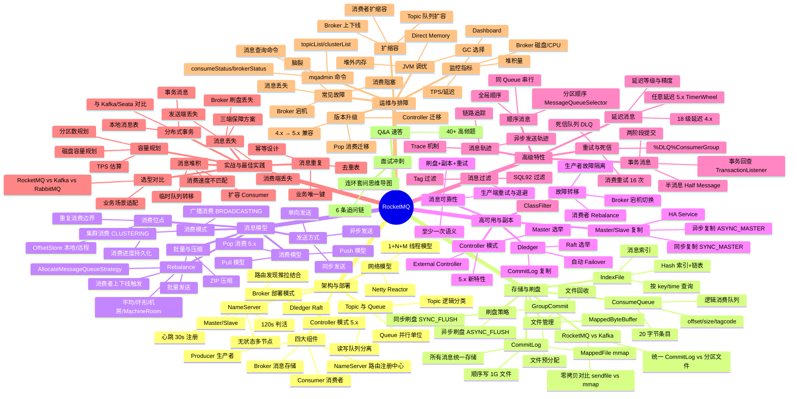

# RocketMQ 面试知识体系实施计划

> **For agentic workers:** REQUIRED SUB-SKILL: Use superpowers:subagent-driven-development (recommended) or superpowers:executing-plans to implement this plan task-by-task. Steps use checkbox (`- [ ]`) syntax for tracking.

**Goal:** 在 `middleware/rocketmq/` 下构建 9 份文档的 RocketMQ 面试知识体系，深度对标 `middleware/mysql`、`middleware/redis` 模块，覆盖 RocketMQ 5.x。

**Architecture:** 纯文档项目，无代码无测试。按 spec 的分阶段交付节奏，每个 Task 完成一份文档并自检（结构校验、链接校验、体量校验）后提交。文档遵循 RocketMQ 专用五段式：概念定义 → 原理与流程 → 高频追问 → 实战关联（Java 后端视角）→ 系统设计案例。

**Tech Stack:** Markdown + Mermaid 图表，中文撰写。

## Global Constraints

- 语言：全部中文（遵循 AGENTS.md 约定）
- 模块路径：`middleware/rocketmq/`（目录骨架在各 Task 中创建）
- 文档结构：RocketMQ 专用五段式（概念定义/原理与流程/高频追问/实战关联/系统设计案例）
- 单份主题文档体量：600-900 行（RocketMQ 知识点密集，与 MySQL/Redis 对齐）
- Q&A 文档体量：500-700 行
- README 体量：200-280 行（含 mindmap + 导航表 + 学习路径 + 模块关联 + 交叉引用，比 Redis 略多）
- 深度：原理级 + 架构级 + 实战级（对标 mysql/redis）
- 版本基线：RocketMQ 5.x（覆盖 Controller 模式、Pop 消费、任意延迟消息、DefaultLitePullConsumer 等特性，4.x 仅作差异对比）
- 每份主题文档头部固定三行：`> **一句话定位**` / `> **面试热度**：⭐⭐⭐⭐⭐` / `> **返回**：[RocketMQ 知识图谱](../README.md)`
- README 自动更新规则：每完成一份主题文档，回填 `middleware/rocketmq/README.md` 导航表进度标记；完成任何模块内容变更同步更新 `middleware/README.md`
- 提交规范：`docs(rocketmq): <描述>`，参照现有 `docs(mysql):` / `docs(redis):` 风格
- 参考样本：`middleware/redis/01-data-structure/data-structure-and-encoding.md`（主题文档五段式）、`middleware/redis/08-interview-qa.md`（Q&A）、`middleware/redis/README.md`（入口）、`middleware/mysql/05-storage/innodb-engine.md`（存储底层深度样本）
- 交叉引用原则：RocketMQ 章只讲"RocketMQ 场景下的实现与选择"，原理推导链回对应模块（ops/linux、middleware/mysql、middleware/redis、java-core、framework），不重复展开
- 源码引用约定：RocketMQ 源码用 Java 包路径格式标注（如 `store.CommitLog`、`client.impl.producer.DefaultMQProducerImpl`），与 Redis 的 `src/xxx.c` 格式各有风格，按语言惯例
- 进度标记：导航表初始用 `⬜`，完成后回填为 `✅`

## File Structure

```
middleware/rocketmq/
├── README.md                                    # Task 1 创建（入口）
├── 01-architecture/
│   └── architecture-and-topology.md             # Task 2（架构与部署拓扑）
├── 02-storage/
│   └── storage-and-flush.md                     # Task 3（存储与刷盘机制）
├── 03-message/
│   └── message-model.md                         # Task 4（消息模型与发送消费）
├── 04-ha/
│   └── ha-and-replication.md                    # Task 5（高可用与副本同步）
├── 05-feature/
│   └── advanced-feature.md                      # Task 6（高级特性）
├── 06-practice/
│   └── practice-and-best-practice.md            # Task 7（实战与最佳实践）
├── 07-ops/
│   └── ops-and-troubleshooting.md               # Task 8（运维与排障）
└── 08-interview-qa.md                           # Task 9（面试 Q&A 速答，含回填）
```

每份主题文档职责：覆盖该专题的底层机制 + 实战关联（Java 后端视角）+ 系统设计案例，独立可读。Q&A 篇不套五段式，采用速答列表 + 连环套问思维导图。

---

## Task 1: 创建 middleware/rocketmq/README.md 入口

**Files:**
- Create: `middleware/rocketmq/README.md`
- Create: `middleware/rocketmq/01-architecture/`、`02-storage/`、`03-message/`、`04-ha/`、`05-feature/`、`06-practice/`、`07-ops/`（7 个子目录，用 mkdir -p 创建）
- Modify: `middleware/README.md`（把 `rocketmq` 行从纯文本改为链接）

**Interfaces:**
- Produces: `middleware/rocketmq/README.md`，作为后续所有主题文档的导航入口；导航表中的链接路径是后续 Task 的产出契约

- [ ] **Step 1: 创建目录骨架**

Run:
```bash
mkdir -p middleware/rocketmq/01-architecture middleware/rocketmq/02-storage middleware/rocketmq/03-message middleware/rocketmq/04-ha middleware/rocketmq/05-feature middleware/rocketmq/06-practice middleware/rocketmq/07-ops
```

- [ ] **Step 2: 编写 middleware/rocketmq/README.md**

按 spec 第二节"模块整体结构"与第三节"知识图谱 mindmap"编写，内容要点：

**一、模块简介**：
- 定位：面向 Java 后端高级/资深面试的 RocketMQ 知识体系，深度对标 `middleware/mysql`、`middleware/redis`、`ops/linux`
- 适用对象：Java 后端面试（社招高级/资深，5 年+），兼顾架构与系统设计方向
- 组织方式：7 个主题目录 + 1 个 Q&A 文件，每份主题文档遵循「概念定义 → 原理与流程 → 高频追问 → 实战关联 → 系统设计案例」五段式结构
- 导航约定：每份文档顶部含 `> 返回 [RocketMQ 知识图谱](../README.md)` 链接，本文档为统一入口
- 版本基线：RocketMQ 5.x（覆盖 Controller 模式、Pop 消费、任意延迟消息、DefaultLitePullConsumer 等特性，4.x 仅作差异对比）

**二、知识图谱（Mermaid mindmap）**：根节点 `RocketMQ`，8 大分支（完整内容见 spec 第二节 mindmap）：



**三、导航表**（8 行，与 spec 第三节完全一致）：

| 分层 | 文档 | 核心考点 |
|------|------|---------|
| 架构与部署 | [架构与部署拓扑](./01-architecture/architecture-and-topology.md) ⬜ | NameServer 无状态/Broker 角色演进/Topic×Queue 模型/Netty Reactor 线程模型 |
| 存储与刷盘 | [存储与刷盘机制](./02-storage/storage-and-flush.md) ⬜ | CommitLog 统一存储/ConsumeQueue 索引/IndexFile/mmap 零拷贝/同步异步刷盘 |
| 消息模型 | [消息模型与发送消费](./03-message/message-model.md) ⬜ | 同步/异步/单向发送/Push·Pull·Pop 消费/集群·广播/Rebalance 策略/消费位点 |
| 高可用与副本 | [高可用与副本同步](./04-ha/ha-and-replication.md) ⬜ | Master/Slave 同步异步复制/Dledger Raft/Controller 模式/Failover/消息可靠性保障 |
| 高级特性 | [高级特性](./05-feature/advanced-feature.md) ⬜ | 事务消息半消息+回查/顺序消息/延迟消息 18 级+任意延迟/重试死信/Tag·SQL92 过滤/消息轨迹 |
| 实战与最佳实践 | [实战与最佳实践](./06-practice/practice-and-best-practice.md) ⬜ | 消息堆积/丢失/重复 三大顽疾/分布式事务方案/幂等设计/容量规划/RocketMQ vs Kafka 选型 |
| 运维与排障 | [运维与排障](./07-ops/ops-and-troubleshooting.md) ⬜ | mqadmin 命令/监控指标/常见故障/扩缩容/版本升级/JVM 调优 |
| 面试冲刺 | [Q&A 速答](./08-interview-qa.md) ⬜ | 40+ 题速答 + 连环套问思维导图 |

> 共 **9 份**文档：入口 README（本文档）+ 上表 8 份主题/Q&A 文档。

**四、推荐学习路径**：
- 路线一：系统学习（1-2 周）：01 架构 → 02 存储 → 03 消息 → 04 高可用 → 05 特性 → 06 实战 → 07 运维 → 08 Q&A
- 路线二：面试冲刺（3-5 天）：01 架构 → 05 特性 → 03 消息 → 02 存储 → 04 高可用 → 06 实战 → 07 运维 → 08 Q&A
- 起手三连问：架构组件与 NameServer → 事务消息 → 消息可靠性（不丢/不重/堆积）

**五、与 java-core / framework 模块的关联**（12 条，见 spec 第五节）：
- 01 架构 / Netty Reactor → `java-core/lambda`：Broker 的 Netty Reactor 与 Stream 异步编程的对照
- 01 架构 / Broker 线程模型 → `java-core/jvm`：1+N+M 线程模型与 JVM 线程调度
- 02 存储 / mmap 零拷贝 → `java-core/jvm`：MappedByteBuffer 与 JVM 堆外内存、DirectByteBuffer 对照
- 02 存储 / PageCache → `java-core/jvm`：PageCache 与 JVM GC 的协调、堆外内存预算
- 03 消息 / 异步发送 → `java-core/lambda`：Producer 异步回调 CompletableFuture 与 Stream 批处理
- 03 消息 / 批量发送 → `java-core/stream`：批量发送与 Stream 批处理的对比
- 04 高可用 / 副本同步 → `java-core/jvm`：HA Service 的线程模型与 JVM 多线程并发
- 05 事务消息 / 两阶段 → `framework/spring-framework`：事务消息与 `@Transactional` 的分布式事务边界
- 06 实战 / Spring 集成 → `framework/spring-framework`：`@RocketMQMessageListener`、RocketMQTemplate 集成
- 06 实战 / 序列化 → `framework/jackson`：消息体序列化与 Jackson 自定义序列化
- 06 实战 / 参数校验 → `framework/valid`：消息消费幂等与参数校验互补
- 06 实战 / 分布式事务 → `framework/spring-framework`：本地消息表 + Seata + 事务消息的对比

**延伸阅读**：
- `java-core/jvm` —— 对照理解 MappedByteBuffer 堆外内存、PageCache 与 GC 协调、线程模型
- `framework/spring-framework` —— RocketMQ Spring 集成、`@Transactional` 与事务消息边界
- `framework/jackson` —— 消息体序列化器与 Jackson 自定义序列化对接

**六、与 ops 模块的交叉引用**（8 条，见 spec 第六节）：
- 02 存储与刷盘 → `ops/linux/04-io/io-model-and-epoll.md`：mmap 零拷贝与 IO 模型、Netty Reactor 与 epoll
- 02 存储与刷盘 → `ops/linux/03-memory/memory-management.md`：PageCache 与 Linux 内存管理、MappedByteBuffer
- 02 存储与刷盘 → `ops/linux/05-fs/filesystem-and-vfs.md`：CommitLog 顺序写与文件系统、fsync 崩溃一致性
- 04 高可用 → `ops/linux/06-network/tcp-and-conntrack.md`：Broker 长连接、TCP keepalive、HA 复制连接
- 04 高可用 → `ops/docker/`：Dledger/Controller 容器化部署、Broker 编排
- 07 运维 → `ops/linux/01-process/process-and-thread.md`：Broker 进程线程模型 vs Linux 进程线程
- 07 运维 → `ops/linux/03-memory/memory-management.md`：堆外内存与 Direct Memory 监控
- 07 运维 → `ops/k8s/`：RocketMQ on K8s 部署、Operator

**与 middleware 内其他模块的交叉引用**（4 条）：
- 04 高可用 / 副本同步 → `middleware/mysql/07-architecture/ha-and-sharding.md`：RocketMQ 主从复制 vs MySQL 主从复制
- 05 事务消息 / 两阶段 → `middleware/mysql/06-log/log-system.md`：事务消息两阶段 vs MySQL 两阶段提交
- 06 实战 / 分布式事务 → `middleware/redis/06-cache-practice/cache-and-distributed-lock.md`：本地消息表与 Redis 分布式锁互补
- 06 实战 / 幂等 → `middleware/redis/06-cache-practice/cache-and-distributed-lock.md`：消费幂等用 Redis SETNX 去重

> 处理原则：RocketMQ 章只讲"RocketMQ 场景下的实现与选择"，原理推导链回对应模块，不重复展开。

- [ ] **Step 3: 更新 middleware/README.md**

把 `middleware/README.md` 第 5 行 `- rocketmq` 改为：
```
- [rocketmq](./rocketmq) — RocketMQ 面试知识体系（9 份文档，面向 5 年+ 资深面试）
```

- [ ] **Step 4: 体量与结构校验**

Run: `wc -l middleware/rocketmq/README.md`，Expected: 200-280 行。
Run: `grep -c '^|' middleware/rocketmq/README.md`，Expected: ≥ 10（导航表 8 行 + 表头分隔）。
Run: `grep 'mindmap' middleware/rocketmq/README.md`，Expected: 含 mermaid mindmap。
Run: `grep '学习路径\|路线一\|路线二' middleware/rocketmq/README.md`，Expected: 含两条学习路径。

- [ ] **Step 5: 提交**

```bash
git add middleware/rocketmq/README.md middleware/rocketmq/01-architecture middleware/rocketmq/02-storage middleware/rocketmq/03-message middleware/rocketmq/04-ha middleware/rocketmq/05-feature middleware/rocketmq/06-practice middleware/rocketmq/07-ops middleware/README.md
git commit -m "docs(rocketmq): 创建 RocketMQ 模块骨架与 README 入口"
```

---

## Task 2: 01-architecture/architecture-and-topology.md 架构与部署拓扑

**Files:**
- Create: `middleware/rocketmq/01-architecture/architecture-and-topology.md`
- Modify: `middleware/rocketmq/README.md`（导航表第一行 `⬜` → `✅`）

**Interfaces:**
- Consumes: `middleware/rocketmq/README.md` 导航表链接路径
- Produces: 架构基础概念（四大组件、NameServer、Broker 部署模式、Topic×Queue 模型、Netty Reactor），后续 Task 3-8 的内容均引用本文档定义的术语

- [ ] **Step 1: 编写 architecture-and-topology.md**

按 spec 第七章文档 1 大纲展开五段式内容，600-900 行。头部三行：
```
# 架构与部署拓扑

> **一句话定位**：RocketMQ 架构是面试起手题，"讲讲 RocketMQ 整体架构与 NameServer 为什么不用 ZooKeeper"几乎每场必问，能讲到 Netty Reactor 线程模型与 Controller 模式才算合格。
> **面试热度**：⭐⭐⭐⭐⭐
> **返回**：[RocketMQ 知识图谱](../README.md)
```

**一、概念定义**（约 150 行）：
- 1.1 RocketMQ 四大组件（NameServer/Broker/Producer/Consumer，职责划分与协作关系，mermaid 架构图 `flowchart TD` 展示四大组件交互）
- 1.2 NameServer vs ZooKeeper（为什么 RocketMQ 弃用 ZK——CP 强一致太重，NameServer AP 无状态更轻，各自维护路由表最终一致，对比表：CP/AP、有状态/无状态、复杂度、依赖）
- 1.3 Broker 角色演进（Master/Slave → Dledger → Controller 模式 5.x，三种部署模式的对比表：手动切换/自动切换/兼容性）
- 1.4 Topic 与 MessageQueue（Topic 是逻辑分类、Queue 是并行单位、读写队列分离 `permTopic` 的 readQueueNums/writeQueueNums，为什么读写分离——扩缩容平滑过渡）

**二、原理与流程**（约 250 行）：
- 2.1 NameServer 路由管理（Broker 每 30s 心跳注册、NameServer 120s 未收到心跳判定下线、路由表 `RouteInfoManager` 的 `topicQueueTable`/`brokerAddrTable`/`clusterAddrTable`/`liveBrokerTable` 四张表，mermaid sequenceDiagram 展示心跳注册流程）
- 2.2 Producer 路由发现（启动时拉取、定时 30s 更新、发送时根据 Queue 选择策略、故障隔离 `sendLatencyFaultEnable`，代码片段展示 `DefaultMQProducerImpl.tryToFindTopicPublishInfo`）
- 2.3 Consumer 路由发现（启动拉取、定时更新、Rebalance 触发，与 Producer 路由发现的差异对比表）
- 2.4 Broker 网络模型（Netty Reactor 主从、1 个 Acceptor + N 个 IO 线程 + M 个 Worker 线程、`RemotingProcessor` 业务线程，mermaid flowchart 展示 1+N+M 线程模型，与 Redis Reactor 对比）
- 2.5 Topic 创建流程（自动创建 `autoCreateTopicEnable`、手动 `mqadmin updateTopic`、Topic 配置元数据持久化，`TopicConfig` 与 `ConfigManager`）
- 2.6 源码路径（`namesrv.RouteInfoManager`、`broker.BrokerController`、`remoting.NettyRemotingServer`）

**三、高频追问**（约 120 行，6-8 题）：
- RocketMQ 有哪些组件？（四大组件）
- NameServer 为什么不用 ZooKeeper？（AP vs CP，无状态更轻）
- Broker 宕机怎么办？（Master/Slave/Dledger/Controller 四种模式）
- NameServer 之间互不通信怎么保证一致性？（最终一致，Broker 向所有 NS 心跳）
- Topic 和 Queue 的关系？（Topic 逻辑分类，Queue 并行单位）
- 读写队列分离是什么？（readQueueNums/writeQueueNums，扩缩容平滑过渡）
- Netty Reactor 线程模型？（1+N+M，Acceptor/IO/Worker）
- Controller 模式 5.x 有什么优势？（自动切换+兼容原存储）

每题 2-3 句要点速答。

**四、实战关联**（约 100 行）：
- Java 场景：Spring Boot + RocketMQ Starter 的 Producer/Consumer 配置，`@RocketMQMessageListener` 注解配置示例
- Broker 集群部署（2 Master 2 Slave 起步、按机房分布、Controller 部署拓扑图）
- 与 Kafka 架构对比（NameServer vs ZK、Broker 模型差异、Kafka Controller vs RocketMQ Controller）
- 与 `java-core/lambda` 的对照（Netty Reactor 与 Stream 异步编程）
- 与 `java-core/jvm` 的对照（1+N+M 线程模型与 JVM 线程调度）

**五、系统设计案例**（约 100 行）：
- 设计一个支撑 10 万 TPS 的订单消息集群（3 Master 3 Slave、Topic 按业务拆分、Queue 数 16/32、Producer 故障隔离，含容量估算与部署拓扑图）
- 设计一个多机房 RocketMQ 部署方案（同城双活、Broker 机房亲和性、Producer 优先本机房，mermaid 部署拓扑图）

- [ ] **Step 2: 体量与结构校验**

Run: `wc -l middleware/rocketmq/01-architecture/architecture-and-topology.md`，Expected: 600-900 行。
Run: `grep -c '^## ' middleware/rocketmq/01-architecture/architecture-and-topology.md`，Expected: 5（五段式）。
Run: `grep '一句话定位\|面试热度\|返回.*RocketMQ 知识图谱' middleware/rocketmq/01-architecture/architecture-and-topology.md`，Expected: 头部三行齐全。
Run: `grep -c 'mermaid' middleware/rocketmq/01-architecture/architecture-and-topology.md`，Expected: ≥ 3（架构图+时序图+线程模型图）。

- [ ] **Step 3: 回填 README 进度标记**

把 `middleware/rocketmq/README.md` 导航表第一行末尾的 `⬜` 改为 `✅`。

- [ ] **Step 4: 提交**

```bash
git add middleware/rocketmq/01-architecture/architecture-and-topology.md middleware/rocketmq/README.md
git commit -m "docs(rocketmq): 新增架构与部署拓扑"
```

---

## Task 3: 02-storage/storage-and-flush.md 存储与刷盘机制

**Files:**
- Create: `middleware/rocketmq/02-storage/storage-and-flush.md`
- Modify: `middleware/rocketmq/README.md`（导航表第二行 `⬜` → `✅`）

**Interfaces:**
- Consumes: Task 2 的 Broker、Topic、Queue 概念
- Produces: 存储基础概念（CommitLog、ConsumeQueue、IndexFile、mmap 零拷贝、刷盘策略），Task 4（消息模型）引用 ConsumeQueue 与消费位点，Task 5（高可用）引用刷盘与副本，Task 8（运维）引用文件管理

- [ ] **Step 1: 编写 storage-and-flush.md**

按 spec 第七章文档 2 大纲展开五段式内容，600-900 行。头部三行：
```
# 存储与刷盘机制

> **一句话定位**：存储是 RocketMQ 性能与可靠性的根基，"CommitLog 为什么统一存储、ConsumeQueue 是什么"是中高级面试分水岭。
> **面试热度**：⭐⭐⭐⭐⭐
> **返回**：[RocketMQ 知识图谱](../README.md)
```

**一、概念定义**（约 150 行）：
- 1.1 RocketMQ 存储设计哲学（CommitLog 统一存储 vs Kafka 分区独立文件，顺序写性能极致、ConsumeQueue 索引解耦存储与消费，对比表：统一存储 vs 分区存储的优缺点）
- 1.2 三类文件职责（CommitLog 消息主体、ConsumeQueue 逻辑消费队列、IndexFile 消息索引，对比表：文件名/大小/结构/用途）
- 1.3 刷盘策略（同步刷盘 SYNC_FLUSH vs 异步刷盘 ASYNC_FLUSH，性能与可靠性权衡，对比表：数据丢失窗口/性能/适用场景）
- 1.4 零拷贝对比（RocketMQ 用 mmap、Kafka 用 sendfile，为什么 RocketMQ 不用 sendfile——消费者按 offset 随机读+ConsumeQueue 索引访问，对比表：mmap vs sendfile 的适用场景）

**二、原理与流程**（约 280 行）：
- 2.1 CommitLog 结构（每个文件固定 1GB、文件名即起始 offset、消息顺序追加写、`MappedFile` 封装 `MappedByteBuffer`，图解 CommitLog 文件布局与消息格式）
- 2.2 ConsumeQueue 结构（每个 Topic×Queue 对应一个 ConsumeQueue、每条 20 字节：8 字节 offset + 4 字节 size + 8 字节 tagcode、固定 30 万条/文件约 5.7MB，图解 ConsumeQueue 条目格式与索引关系）
- 2.3 IndexFile 结构（Hash 索引、500 万 slot + 2000 万 index、按 msgKey 或时间区间查询、链表解决冲突，图解 Hash 索引结构）
- 2.4 消息写入全流程（Producer 发送 → Broker `SendMessageProcessor` → 写 CommitLog（mmap）→ 异步构建 ConsumeQueue/IndexFile（`ReputMessageService`）→ 刷盘，mermaid sequenceDiagram 展示完整写入流程）
- 2.5 同步刷盘流程（`GroupCommitService` 等待 flush 完成、`GroupCommitRequest`、双 Buffer 交替、性能损耗约 10x，代码片段展示 `GroupCommitService` 核心逻辑）
- 2.6 异步刷盘流程（`FlushRealTimeService` 定时 flush、默认 500ms 间隔、`flushPhysicQueueThoroughInterval` 全量刷，代码片段展示 `FlushRealTimeService` 核心逻辑）
- 2.7 文件预分配与回收（`AllocateMappedFileService` 预分配下一个文件、`MappedFile` 的 `mmap` 映射、过期文件清理 `CleanCommitLogService`，文件过期策略 `fileReservedTime` 默认 72h）
- 2.8 源码路径（`store.CommitLog`、`store.ConsumeQueue`、`store.IndexService`、`store.MappedFile`）

**三、高频追问**（约 100 行，6-8 题）：
- RocketMQ 存储和 Kafka 有什么区别？（统一 CommitLog vs 分区文件）
- ConsumeQueue 是什么？（逻辑消费队列，20 字节条目）
- 为什么 RocketMQ 用 mmap 不用 sendfile？（消费者按 offset 随机读）
- 同步刷盘和异步刷盘怎么选？（金融级同步、普通业务异步）
- CommitLog 文件多大？（1GB 固定大小）
- IndexFile 怎么按 key 查消息？（Hash 索引 + 链表）
- 文件过期怎么清理？（`fileReservedTime` 默认 72h）
- MappedFile 和 MappedByteBuffer 的关系？（MappedFile 封装 MappedByteBuffer）

每题 2-3 句要点速答。

**四、实战关联**（约 80 行）：
- Java 场景：Producer 发送消息的 `SendResult` 与 `flushDiskType` 配置
- 磁盘选型（SSD vs HDD、CommitLog 顺序写 HDD 也能扛、但 IndexFile 随机读建议 SSD）
- 与 MySQL InnoDB 存储对比（CommitLog 顺序写 vs InnoDB 随机写、Redo Log WAL 思想一致）
- 与 `java-core/jvm` 的对照（MappedByteBuffer 堆外内存、PageCache 与 GC 协调）

**五、系统设计案例**（约 90 行）：
- 设计一个支撑亿级消息的存储方案（CommitLog 分磁盘、ConsumeQueue 内存映射、异步刷盘+副本保障可靠性，含磁盘容量估算）
- 设计一个按 msgId 精确查询消息的方案（IndexFile Hash 索引、未命中时全量扫描 CommitLog 兜底，含查询流程图）

- [ ] **Step 2: 体量与结构校验**

Run: `wc -l middleware/rocketmq/02-storage/storage-and-flush.md`，Expected: 600-900 行。
Run: `grep -c '^## ' middleware/rocketmq/02-storage/storage-and-flush.md`，Expected: 5。
Run: `grep '一句话定位\|面试热度\|返回.*RocketMQ 知识图谱' middleware/rocketmq/02-storage/storage-and-flush.md`，Expected: 头部三行齐全。
Run: `grep -c 'mermaid' middleware/rocketmq/02-storage/storage-and-flush.md`，Expected: ≥ 2（写入流程时序图+文件布局图）。

- [ ] **Step 3: 回填 README 进度标记**

把 `middleware/rocketmq/README.md` 导航表第二行末尾的 `⬜` 改为 `✅`。

- [ ] **Step 4: 提交**

```bash
git add middleware/rocketmq/02-storage/storage-and-flush.md middleware/rocketmq/README.md
git commit -m "docs(rocketmq): 新增存储与刷盘机制"
```

---

## Task 4: 03-message/message-model.md 消息模型与发送消费

**Files:**
- Create: `middleware/rocketmq/03-message/message-model.md`
- Modify: `middleware/rocketmq/README.md`（导航表第三行 `⬜` → `✅`）

**Interfaces:**
- Consumes: Task 2 的 Topic/Queue 概念、Task 3 的 ConsumeQueue 与消费位点
- Produces: 消息模型基础概念（发送方式、消费模型、Rebalance、消费位点、批量压缩），Task 6（高级特性）引用发送与消费 API，Task 7（实战）引用 Rebalance 与消费位点

- [ ] **Step 1: 编写 message-model.md**

按 spec 第七章文档 3 大纲展开五段式内容，600-900 行。头部三行：
```
# 消息模型与发送消费

> **一句话定位**：消息模型是 RocketMQ 工程化使用的核心，"Push 和 Pull 的区别、Rebalance 怎么做、消费位点怎么管"是中高级面试必问。
> **面试热度**：⭐⭐⭐⭐⭐
> **返回**：[RocketMQ 知识图谱](../README.md)
```

**一、概念定义**（约 130 行）：
- 1.1 发送方式（同步/异步/单向，可靠性 vs 吞吐 vs 延迟的权衡，对比表：响应/可靠性/吞吐/适用场景）
- 1.2 消费模型（Push 模型 `DefaultMQPushConsumer`、Pull 模型 `DefaultMQPullConsumer`、5.x Pop 消费 `DefaultLitePullConsumer`，对比表：封装层级/控制粒度/堆积风险）
- 1.3 消费模式（集群 CLUSTERING 每条消息一个消费者、广播 BROADCASTING 所有消费者都消费，对比表：位点存储/消费进度/适用场景）
- 1.4 Rebalance（消费者上下线、Queue 数变化触发、`AllocateMessageQueueStrategy` 策略，4 种策略对比表：平均/环形/机房/MachineRoom）
- 1.5 消费位点（OffsetStore 本地/远程、消费进度持久化、重启后从哪消费，`CONSUME_FROM_LAST_OFFSET`/`CONSUME_FROM_FIRST_OFFSET`/`CONSUME_FROM_TIMESTAMP` 启动策略对比表）

**二、原理与流程**（约 280 行）：
- 2.1 同步发送（`producer.send(msg)` 阻塞等待 `SendResult`、内部 Netty 异步+CountDownLatch 等待、`retryTimesWhenSendFailed` 重试，代码片段展示 `DefaultMQProducerImpl.sendDefaultImpl` 核心逻辑）
- 2.2 异步发送（`producer.send(msg, callback)` 非阻塞、`NettyRemotingAbstract` 的 ResponseFuture 回调、适用高吞吐场景，代码片段展示异步回调机制）
- 2.3 单向发送（`producer.sendOneway(msg)` 不等响应、日志收集等允许丢失场景，代码片段展示 `sendOneway` 核心逻辑）
- 2.4 Push 消费模型（`DefaultMQPushConsumer` 封装 Pull、`PullMessageService` 线程拉取、`ConsumeMessageConcurrentlyService` 并发消费、`pullBatchSize` 控制批量，mermaid flowchart 展示 Push 消费内部流程）
- 2.5 Pull 消费模型（`DefaultMQPullConsumer` 手动 `pull`、需自行管理 offset、5.x 推荐 `DefaultLitePullConsumer` 主动订阅+自动分配，代码片段展示 Pull 消费核心逻辑）
- 2.6 Pop 消费 5.x（`DefaultLitePullConsumer` 的 Pop 模式、Broker 端临时弹出消息、避免 Rebalance 堆积、解决长轮询死锁问题，mermaid sequenceDiagram 展示 Pop 消费流程）
- 2.7 Rebalance 策略（`AllocateMessageQueueAveragely` 平均分配默认、`AllocateMessageQueueAveragelyByCircle` 环形、`AllocateMessageQueueByMachineRoom` 机房、触发时机 `RebalanceService` 每 20s 检查，mermaid flowchart 展示 Rebalance 流程）
- 2.8 消费位点管理（`RemoteBrokerOffsetStore` 集群模式持久化到 Broker、`LocalFileOffsetStore` 广播模式持久化本地、位点更新流程，代码片段展示 `OffsetStore.updateOffset` 核心逻辑）
- 2.9 批量发送与压缩（`MessageBatch` 批量、`ZIP` 压缩 `compressMsgBodyOverHowmuch` 默认 4096，批量发送限制——同 Topic 同 Tag 同 waitStoreMsgOK）
- 2.10 源码路径（`client.impl.producer.DefaultMQProducerImpl`、`client.impl.consumer.DefaultMQPushConsumerImpl`、`client.impl.consumer.RebalanceImpl`、`client.impl.consumer.DefaultLitePullConsumerImpl`）

**三、高频追问**（约 110 行，7-8 题）：
- Push 和 Pull 有什么区别？（Push 封装 Pull，对用户透明）
- Push 是真的推送吗？（不是，长轮询模拟推送）
- Rebalance 怎么做？（平均分配默认，消费者上下线触发）
- 消费位点怎么存？（集群存 Broker，广播存本地）
- 消费者重启从哪开始消费？（按 `consumeFromWhere` 配置）
- Pop 消费是什么？（5.x Broker 端弹出消息，避免 Rebalance 堆积）
- 批量发送怎么用？（`MessageBatch`，注意同 Topic 同 Tag）
- 消费者数能超过 Queue 数吗？（不能，多余消费者闲置）

每题 2-3 句要点速答。

**四、实战关联**（约 80 行）：
- Java 场景：Spring Boot `@RocketMQMessageListener` 的 `consumeMode`/`messageModel` 配置示例
- 消费者并发度调优（`consumeThreadMin/Max`、`pullBatchSize`）
- 与 Kafka 消费模型对比（Kafka 消费者组 partition 分配 vs RocketMQ Queue 分配）
- 与 `java-core/lambda` 的对照（Producer 异步回调 CompletableFuture 与 Stream 批处理）
- 与 `java-core/stream` 的对照（批量发送与 Stream 批处理的对比）

**五、系统设计案例**（约 100 行）：
- 设计一个高吞吐的消费方案（Pop 消费 + 批量拉取 + 多线程并发 + 异步落库，含吞吐估算与部署方案）
- 设计一个消费优雅上下线方案（Pause 消费 + Rebalance 通知 + 优雅停机 `@PreDestroy`，mermaid 时序图展示上下线流程）

- [ ] **Step 2: 体量与结构校验**

Run: `wc -l middleware/rocketmq/03-message/message-model.md`，Expected: 600-900 行。
Run: `grep -c '^## ' middleware/rocketmq/03-message/message-model.md`，Expected: 5。
Run: `grep '一句话定位\|面试热度\|返回.*RocketMQ 知识图谱' middleware/rocketmq/03-message/message-model.md`，Expected: 头部三行齐全。
Run: `grep -c 'mermaid' middleware/rocketmq/03-message/message-model.md`，Expected: ≥ 3（Push 流程+Pop 时序+Rebalance 流程）。

- [ ] **Step 3: 回填 README 进度标记**

把 `middleware/rocketmq/README.md` 导航表第三行末尾的 `⬜` 改为 `✅`。

- [ ] **Step 4: 提交**

```bash
git add middleware/rocketmq/03-message/message-model.md middleware/rocketmq/README.md
git commit -m "docs(rocketmq): 新增消息模型与发送消费"
```

---

## Task 5: 04-ha/ha-and-replication.md 高可用与副本同步

**Files:**
- Create: `middleware/rocketmq/04-ha/ha-and-replication.md`
- Modify: `middleware/rocketmq/README.md`（导航表第四行 `⬜` → `✅`）

**Interfaces:**
- Consumes: Task 2 的 Broker 部署模式、Task 3 的刷盘策略
- Produces: 高可用基础概念（Master/Slave 复制、Dledger、Controller 模式、Failover、消息可靠性），Task 7（实战）引用消息可靠性保障，Task 8（运维）引用故障转移

- [ ] **Step 1: 编写 ha-and-replication.md**

按 spec 第七章文档 4 大纲展开五段式内容，600-900 行。头部三行：
```
# 高可用与副本同步

> **一句话定位**：高可用是消息中间件的命脉，"Broker 宕机消息会不会丢、Dledger/Controller 怎么选"是资深面试分水岭。
> **面试热度**：⭐⭐⭐⭐⭐
> **返回**：[RocketMQ 知识图谱](../README.md)
```

**一、概念定义**（约 130 行）：
- 1.1 RocketMQ 高可用演进（Master/Slave 异步 → 同步双写 → Dledger Raft → Controller 模式 5.x，演进时间线图）
- 1.2 同步复制 vs 异步复制（SYNC_MASTER 等待 Slave 确认、ASYNC_MASTER 不等待、性能与可靠性权衡，对比表：数据丢失窗口/性能/适用场景）
- 1.3 自动 Failover 的必要性（Master/Slave 模式 Slave 不自动切换需人工介入、Dledger/Controller 解决自动切换，三种模式 Failover 能力对比表）
- 1.4 消息可靠性三端保障（生产端重试、Broker 刷盘+副本、消费端幂等，三端保障图解）

**二、原理与流程**（约 280 行）：
- 2.1 Master/Slave 复制（`HAService` 的 `HAConnection`、Slave 主动连接 Master、Master 推送 CommitLog 增量、`HAClient` 上报 offset、同步复制等待 Slave ACK，mermaid sequenceDiagram 展示 Master/Slave 复制流程）
- 2.2 同步双写流程（`GroupTransferService` 等待 Slave ACK、`waitNotify` 机制、`SyncStateSet` 判断多数副本，代码片段展示 `GroupTransferService` 核心逻辑）
- 2.3 Dledger 模式（Raft 选举 Leader、`DLedgerCommitLog` 替换原 CommitLog、日志复制半数确认、自动 Failover、依赖 DLedger 组件，mermaid flowchart 展示 Raft 选举流程）
- 2.4 Controller 模式 5.x（External Controller 独立部署、Broker 向 Controller 注册、Master 选举由 Controller 决策、兼容原 Master/Slave 复制、无需 DLedger 日志复制开销，mermaid flowchart 展示 Controller 选举流程）
- 2.5 三种模式对比表（Master/Slave 手动切换 / Dledger 自动但侵入存储 / Controller 自动且兼容原存储，对比表：自动切换/存储侵入/部署复杂度/5.x 推荐）
- 2.6 故障转移全流程（Broker 宕机 → Controller/Dledger 选举新 Master → NameServer 路由更新 → Producer/Consumer 感知 → Rebalance，mermaid sequenceDiagram 展示故障转移全流程）
- 2.7 消息可靠性保障（生产端 `retryTimesWhenSendFailed` + 退避、Broker 同步刷盘+同步复制、消费端至少一次+幂等，三端可靠性保障方案表）
- 2.8 源码路径（`store.ha.HAService`、`store.ha.WaitNotifyObject`、`dledger.DLedgerLeaderElector`、`controller.BrokerHeartbeatManager`）

**三、高频追问**（约 110 行，7-8 题）：
- Broker 宕机消息会丢吗？（看刷盘+复制策略，同步刷盘+同步复制不丢）
- Master/Slave 怎么切换？（手动或 Dledger/Controller 自动）
- Dledger 是什么？（Raft 选举+日志复制）
- Controller 模式有什么优势？（自动切换+兼容原存储，5.x 推荐）
- 同步复制和异步复制怎么选？（金融同步、普通异步）
- 消息怎么保证不丢？（三端保障：生产重试+Broker 刷盘副本+消费幂等）
- Dledger 和 Controller 怎么选？（5.x 优先 Controller，4.x 用 Dledger）
- 同步双写性能损耗多少？（约 20-30%，等待 Slave ACK）

每题 2-3 句要点速答。

**四、实战关联**（约 80 行）：
- Java 场景：Producer 的 `retryTimesWhenSendFailed` 与 `sendMsgTimeout` 配置示例
- 生产部署（2 Master 2 Slave + Controller、按机房分布、同步双写部署拓扑图）
- 与 MySQL 高可用对比（MHA/Orchestrator/MGR vs Dledger/Controller，主从复制思想一致）
- 与 `java-core/jvm` 的对照（HA Service 的线程模型与 JVM 多线程并发）

**五、系统设计案例**（约 100 行）：
- 设计一个金融级消息可靠性方案（同步刷盘+同步复制+Controller 自动切换+生产端重试+消费幂等，SLA 99.99%，含可靠性保障方案表）
- 设计一个异地多活的消息集群（三地五副本 Controller、跨机房复制延迟优化、Producer 机房亲和性，mermaid 部署拓扑图）

- [ ] **Step 2: 体量与结构校验**

Run: `wc -l middleware/rocketmq/04-ha/ha-and-replication.md`，Expected: 600-900 行。
Run: `grep -c '^## ' middleware/rocketmq/04-ha/ha-and-replication.md`，Expected: 5。
Run: `grep '一句话定位\|面试热度\|返回.*RocketMQ 知识图谱' middleware/rocketmq/04-ha/ha-and-replication.md`，Expected: 头部三行齐全。
Run: `grep -c 'mermaid' middleware/rocketmq/04-ha/ha-and-replication.md`，Expected: ≥ 3（复制时序+Raft 选举+Controller 选举+故障转移）。

- [ ] **Step 3: 回填 README 进度标记**

把 `middleware/rocketmq/README.md` 导航表第四行末尾的 `⬜` 改为 `✅`。

- [ ] **Step 4: 提交**

```bash
git add middleware/rocketmq/04-ha/ha-and-replication.md middleware/rocketmq/README.md
git commit -m "docs(rocketmq): 新增高可用与副本同步"
```

---

## Task 6: 05-feature/advanced-feature.md 高级特性

**Files:**
- Create: `middleware/rocketmq/05-feature/advanced-feature.md`
- Modify: `middleware/rocketmq/README.md`（导航表第五行 `⬜` → `✅`）

**Interfaces:**
- Consumes: Task 3 的刷盘与存储、Task 4 的发送与消费 API、Task 5 的副本与可靠性
- Produces: 高级特性概念（事务消息、顺序消息、延迟消息、重试死信、消息过滤、消息轨迹），Task 7（实战）引用事务消息与分布式事务方案，Task 9（Q&A）引用所有高级特性

- [ ] **Step 1: 编写 advanced-feature.md**

按 spec 第七章文档 5 大纲展开五段式内容，600-900 行。头部三行：
```
# 高级特性

> **一句话定位**：高级特性是 RocketMQ 的差异化竞争力，"事务消息、顺序消息、延迟消息"是中高级面试必问，能讲到半消息回查与 5.x 任意延迟才算合格。
> **面试热度**：⭐⭐⭐⭐⭐
> **返回**：[RocketMQ 知识图谱](../README.md)
```

**一、概念定义**（约 130 行）：
- 1.1 事务消息（RocketMQ 独有的两阶段事务，与 Kafka 事务消息的区别——Kafka 是生产端事务、RocketMQ 是生产+消费端事务，对比表：事务边界/回查机制/适用场景）
- 1.2 顺序消息（全局顺序 vs 分区顺序，`MessageQueueSelector` 保证同 Queue 串行，对比表：并行度/实现复杂度/适用场景）
- 1.3 延迟消息（4.x 固定 18 级延迟、5.x `TimerWheel` 支持任意延迟，对比表：延迟精度/最大延迟/存储开销）
- 1.4 重试与死信（消费失败自动重试 16 次、超过进入 `%DLQ%ConsumerGroup`，重试延迟等级表）
- 1.5 消息过滤（Tag 过滤、SQL92 过滤、ClassFilter 服务端过滤，对比表：过滤位置/性能/灵活性）
- 1.6 消息轨迹（Trace 机制、异步发送轨迹、链路追踪，轨迹数据结构表）

**二、原理与流程**（约 300 行）：
- 2.1 事务消息两阶段（Producer `sendMessageInTransaction` → Broker 写半消息 `Half Message` 到 `RMQ_SYS_TRANS_HALF_TOPIC` → 执行本地事务 `executeLocalTransaction` → 提交 `commit` 写 `Op` 队列或回滚 `rollback` → 回查 `checkLocalTransaction` Broker 定时扫描未确认半消息，mermaid sequenceDiagram 展示完整事务消息流程）
- 2.2 事务消息回查机制（`TransactionServicesManager` 定时扫描半消息、回查 Producer `checkLocalTransaction`、超时 `transactionTimeout` 默认 6s 回查、最多回查 15 次，代码片段展示 `TransactionalMessageService` 核心逻辑）
- 2.3 顺序消息（Producer `MessageQueueSelector` 按 `hash(businessKey) % queueSize` 选 Queue、Consumer `MessageListenerOrderly` 串行消费同 Queue、`ConsumeMessageOrderlyService` 的 `ProcessQueue` 加锁，mermaid flowchart 展示顺序消息生产+消费流程）
- 2.4 全局顺序 vs 分区顺序（全局顺序单 Queue 牺牲并行、分区顺序多 Queue 同 key 顺序、生产推荐分区顺序，对比表：并行度/顺序保证/吞吐）
- 2.5 延迟消息 4.x（固定 18 级 `1s/5s/10s/30s/1m/2m/3m/4m/5m/6m/7m/8m/9m/10m/20m/30m/1h/2h`、Broker 替换 `SCHEDULE_TOPIC_XXXX`、`ScheduleMessageService` 定时投递，代码片段展示 `ScheduleMessageService` 核心逻辑）
- 2.6 延迟消息 5.x（`TimerWheel` 时间轮、任意延迟精度毫秒级、`Topic` 与 `MessageDelayLevel` 兼容、`TimerMessageStore` 投递，mermaid flowchart 展示 5.x 时间轮机制）
- 2.7 重试与死信（`%RETRY%ConsumerGroup` 重试队列、16 次递增延迟 `[10s 30s 1m 2m ... 2h]`、超过进入 `%DLQ%ConsumerGroup` 死信、人工干预 `mqadmin`，重试延迟等级表）
- 2.8 Tag 与 SQL92 过滤（Tag 过滤 Broker 端按 tagcode 位运算、SQL92 过滤 `MessageSelector.bySql`、ClassFilter 服务端 FilterServer 执行用户代码，对比表：过滤位置/性能/灵活性）
- 2.9 消息轨迹（`TraceDispatcher` 异步发送到 `RMQ_SYS_TRACE_TOPIC`、含 Producer/Consumer/Broker 三端轨迹、`traceOn` 开关，轨迹数据结构表）
- 2.10 源码路径（`client.transaction.MQTransactionListener`、`broker.transaction.queue.TransactionalMessageService`、`store.schedule.ScheduleMessageService`、`store.timer.TimerMessageStore`、`client.impl.consumer.TraceDispatcher`）

**三、高频追问**（约 120 行，8 题）：
- 事务消息怎么实现？（半消息+本地事务+回查）
- 事务消息回查失败怎么办？（15 次后回滚）
- 顺序消息怎么保证顺序？（同 key 同 Queue 串行）
- 全局顺序和分区顺序区别？（单 Queue vs 多 Queue 同 key）
- 延迟消息 4.x 和 5.x 区别？（18 级 vs 任意延迟）
- 消费失败重试多少次？（16 次，递增延迟）
- 死信队列怎么处理？（`%DLQ%` 人工排查或自动告警）
- Tag 和 SQL92 过滤区别？（位运算 vs 表达式）

每题 2-3 句要点速答。

**四、实战关联**（约 80 行）：
- Java 场景：`@RocketMQTransactionListener` 注解、`MessageSelector.byTag`/`bySql` 示例
- 事务消息与 Spring `@Transactional` 的配合（本地事务+消息事务的边界协调）
- 延迟消息实现订单超时关闭（延迟 30 分钟触发关单，代码片段示例）
- 与 Kafka 事务消息对比（Kafka 生产端事务 vs RocketMQ 生产+消费端事务）
- 与 `framework/spring-framework` 的对照（事务消息与 `@Transactional` 的分布式事务边界）

**五、系统设计案例**（约 90 行）：
- 设计一个分布式事务方案（事务消息+本地事务+幂等消费，订单+扣库存+扣余额，mermaid sequenceDiagram 展示完整事务流程）
- 设计一个订单超时关闭系统（延迟消息 5.x 任意延迟、千万级延迟消息存储方案，含容量估算与投递流程图）

- [ ] **Step 2: 体量与结构校验**

Run: `wc -l middleware/rocketmq/05-feature/advanced-feature.md`，Expected: 600-900 行。
Run: `grep -c '^## ' middleware/rocketmq/05-feature/advanced-feature.md`，Expected: 5。
Run: `grep '一句话定位\|面试热度\|返回.*RocketMQ 知识图谱' middleware/rocketmq/05-feature/advanced-feature.md`，Expected: 头部三行齐全。
Run: `grep -c 'mermaid' middleware/rocketmq/05-feature/advanced-feature.md`，Expected: ≥ 3（事务时序+顺序流程+时间轮）。

- [ ] **Step 3: 回填 README 进度标记**

把 `middleware/rocketmq/README.md` 导航表第五行末尾的 `⬜` 改为 `✅`。

- [ ] **Step 4: 提交**

```bash
git add middleware/rocketmq/05-feature/advanced-feature.md middleware/rocketmq/README.md
git commit -m "docs(rocketmq): 新增高级特性"
```

---

## Task 7: 06-practice/practice-and-best-practice.md 实战与最佳实践

**Files:**
- Create: `middleware/rocketmq/06-practice/practice-and-best-practice.md`
- Modify: `middleware/rocketmq/README.md`（导航表第六行 `⬜` → `✅`）

**Interfaces:**
- Consumes: Task 3 的刷盘与存储、Task 4 的发送与消费、Task 5 的副本与可靠性、Task 6 的事务消息
- Produces: 实战方案（消息丢失/重复/堆积 三大顽疾、分布式事务方案、幂等设计、容量规划、选型对比），Task 8（运维）引用排障方案，Task 9（Q&A）引用实战要点

- [ ] **Step 1: 编写 practice-and-best-practice.md**

按 spec 第七章文档 6 大纲展开五段式内容，600-900 行。头部三行：
```
# 实战与最佳实践

> **一句话定位**：实战是区分"背八股"与"有经验"的分水岭，"消息怎么不丢、不重、堆积怎么办"是资深面试必问。
> **面试热度**：⭐⭐⭐⭐⭐
> **返回**：[RocketMQ 知识图谱](../README.md)
```

**一、概念定义**（约 130 行）：
- 1.1 消息三大顽疾（丢失、重复、堆积，各自成因与发生阶段，三大顽疾对比表：成因/发生阶段/保障方案）
- 1.2 幂等设计（消费幂等的必要性——至少一次语义下重复不可避免，幂等方案对比表：唯一键/去重表/状态机）
- 1.3 分布式事务方案对比（本地消息表、事务消息、Seata TCC/SAGA，适用场景与权衡，对比表：一致性保证/性能/复杂度/适用场景）
- 1.4 容量规划（TPS、磁盘、分区数、消费者数的估算方法，容量规划公式表）
- 1.5 RocketMQ vs Kafka vs RabbitMQ（吞吐、延迟、特性、生态对比，对比表：吞吐/延迟/事务消息/延迟消息/顺序消息/生态/适用场景）

**二、原理与流程**（约 280 行）：
- 2.1 消息丢失三端分析与保障（生产端——同步发送+重试+`send` 返回 `SEND_OK`、Broker——同步刷盘+同步复制、消费端——手动 ACK `return CONSUME_SUCCESS` 才更新 offset，mermaid flowchart 展示三端保障方案）
- 2.2 消息重复成因与幂等（网络重试导致重复、消费端崩溃 offset 未提交、幂等方案——唯一键+Redis SETNX/DB 唯一索引/状态机判断，代码片段展示幂等消费核心逻辑）
- 2.3 消息堆积成因与处理（消费速度 < 生产速度、扩容 Consumer 受 Queue 数限制、`Queue 数 ≥ Consumer 数`、临时方案——消费者转储到新 Topic 扩容 Queue，mermaid flowchart 展示堆积处理决策树）
- 2.4 分布式事务方案详解（本地消息表——DB+MQ 一致性、事务消息——半消息+回查、Seata——AT/TCC/SAGA，三者权衡，mermaid sequenceDiagram 展示本地消息表方案流程）
- 2.5 顺序消费的工程挑战（Consumer 扩缩容触发 Rebalance 导致乱序、`MessageQueueSelector` 选 Queue、消费失败阻塞同 Queue，顺序消费工程挑战与方案表）
- 2.6 容量规划方法（TPS = 消息量/时间、磁盘 = TPS × 平均大小 × 保留天数 × 副本数、Queue 数 = 目标 TPS / 单 Queue TPS、Consumer 数 ≤ Queue 数，容量规划公式表与示例计算）
- 2.7 RocketMQ vs Kafka vs RabbitMQ 对比（吞吐：RocketMQ 10 万级/Kafka 百万级/RabbitMQ 万级；特性：RocketMQ 事务/延迟/顺序最全；生态：Kafka 大数据、RabbitMQ AMQP、RocketMQ 金融业务，对比表）
- 2.8 Spring Boot 集成实战（`rocketmq-spring-boot-starter`、`@RocketMQMessageListener`、`RocketMQTemplate`、序列化配置，代码片段展示完整生产配置模板）

**三、高频追问**（约 110 行，7-8 题）：
- 消息怎么保证不丢？（三端保障：生产同步+Broker 刷盘复制+消费手动 ACK）
- 消息重复怎么办？（幂等：唯一键+去重表）
- 消息堆积怎么处理？（扩 Consumer、转储新 Topic、降级）
- 消费者数能超过 Queue 数吗？（不能，多余消费者闲置）
- 分布式事务用什么方案？（事务消息或本地消息表，权衡）
- RocketMQ 和 Kafka 怎么选？（金融/事务选 RocketMQ，大数据选 Kafka）
- 顺序消费怎么扩容？（不能直接扩 Consumer，需先扩 Queue）
- 幂等怎么实现？（唯一键+Redis SETNX/DB 唯一索引/状态机）

每题 2-3 句要点速答。

**四、实战关联**（约 80 行）：
- Java 场景：Spring Boot + RocketMQ Starter 的完整生产配置模板
- 幂等消费方案（Redis SETNX + 业务唯一键 + 状态机，代码片段示例）
- 与 `framework/spring-framework` 的 `@Transactional` 协调（本地事务+消息发送的顺序）
- 与 `framework/jackson` 的消息序列化（JSON + 自定义序列化器）
- 与 `framework/valid` 的消息参数校验（消费前校验）
- 与 `middleware/redis` 的交叉引用（本地消息表与 Redis 分布式锁互补、消费幂等用 Redis SETNX 去重）

**五、系统设计案例**（约 100 行）：
- 设计一个电商订单全链路消息方案（下单→扣库存→扣余额→发券，事务消息+幂等消费+顺序消息，mermaid sequenceDiagram 展示全链路流程）
- 设计一个千万级 TPS 的日志采集系统（RocketMQ vs Kafka 选型、批量发送+压缩+异步消费+ES 落库，含容量估算与选型决策表）

- [ ] **Step 2: 体量与结构校验**

Run: `wc -l middleware/rocketmq/06-practice/practice-and-best-practice.md`，Expected: 600-900 行。
Run: `grep -c '^## ' middleware/rocketmq/06-practice/practice-and-best-practice.md`，Expected: 5。
Run: `grep '一句话定位\|面试热度\|返回.*RocketMQ 知识图谱' middleware/rocketmq/06-practice/practice-and-best-practice.md`，Expected: 头部三行齐全。
Run: `grep -c 'mermaid' middleware/rocketmq/06-practice/practice-and-best-practice.md`，Expected: ≥ 3（三端保障+堆积决策树+本地消息表时序）。

- [ ] **Step 3: 回填 README 进度标记**

把 `middleware/rocketmq/README.md` 导航表第六行末尾的 `⬜` 改为 `✅`。

- [ ] **Step 4: 提交**

```bash
git add middleware/rocketmq/06-practice/practice-and-best-practice.md middleware/rocketmq/README.md
git commit -m "docs(rocketmq): 新增实战与最佳实践"
```

---

## Task 8: 07-ops/ops-and-troubleshooting.md 运维与排障

**Files:**
- Create: `middleware/rocketmq/07-ops/ops-and-troubleshooting.md`
- Modify: `middleware/rocketmq/README.md`（导航表第七行 `⬜` → `✅`）

**Interfaces:**
- Consumes: Task 2 的架构与部署、Task 3 的存储与刷盘、Task 4 的消息模型、Task 5 的故障转移、Task 7 的实战方案
- Produces: 运维排障方案（mqadmin 命令、监控指标、常见故障、扩缩容、版本升级、JVM 调优），Task 9（Q&A）引用运维要点

- [ ] **Step 1: 编写 ops-and-troubleshooting.md**

按 spec 第七章文档 7 大纲展开五段式内容，600-900 行。头部三行：
```
# 运维与排障

> **一句话定位**：运维排障是资深面试的加分项，"Broker 宕机怎么排查、消息堆积怎么定位"区分是否有生产经验。
> **面试热度**：⭐⭐⭐⭐
> **返回**：[RocketMQ 知识图谱](../README.md)
```

**一、概念定义**（约 120 行）：
- 1.1 RocketMQ 运维核心目标（可用性、消息可靠性、性能、容量可控，运维目标对比表）
- 1.2 mqadmin 工具（RocketMQ 自带的命令行管理工具，与 Redis `redis-cli`、MySQL `mysql` 对齐，命令分类表）
- 1.3 监控体系（Dashboard + Prometheus + Grafana，核心指标分类，监控指标分类表）
- 1.4 常见故障分类（消费阻塞、Broker 宕机、消息丢失、脑裂、Rebalance 风暴，故障分类表）

**二、原理与流程**（约 280 行）：
- 2.1 mqadmin 核心命令（`topicList`/`clusterList`/`brokerStatus`/`topicStats`/`consumeStatus`/`queryMsgById`/`queryMsgByKey`/`resetOffsetByTime`，命令用法表示例）
- 2.2 监控指标体系（Broker——TPS/延迟/磁盘/CPU/堆外内存、Topic——QPS/堆积量、Consumer——消费 TPS/延迟/堆积、Producer——发送 TPS/失败率，监控指标体系表）
- 2.3 消费阻塞排查（`consumeStatus` 看堆积、`stack` 看消费线程、定位慢消费——业务 DB 慢查询或外部依赖超时、扩容 Consumer 或降级，mermaid flowchart 展示消费阻塞排查决策树）
- 2.4 Broker 宕机处理（确认主备切换、检查 Controller/Dledger 状态、`clusterList` 看节点、消息补偿，mermaid sequenceDiagram 展示 Broker 宕机排查流程）
- 2.5 消息丢失排查（Producer 发送日志 `SEND_OK`、Broker `queryMsgById` 确认、消费端 offset 提交日志、定位丢失环节，消息丢失三端排查流程表）
- 2.6 Rebalance 风暴（消费者频繁上下线、`rebalanceInterval` 调整、稳定部署避免抖动，Rebalance 风暴成因与方案表）
- 2.7 扩缩容（Broker 上线——加入集群注册 NS、Topic 队列扩容——`updateTopic` 增加 Queue、消费者扩缩容——注意 Queue 数限制，扩缩容操作流程表）
- 2.8 版本升级 4.x → 5.x（Controller 迁移、Pop 消费迁移、API 兼容性、灰度方案，版本升级步骤表）
- 2.9 JVM 调优（堆外内存 `Direct Memory`、GC 选择 G1、`-XX:MaxDirectMemorySize`、`transientStorePoolEnable` 堆外内存池，JVM 参数调优表）

**三、高频追问**（约 100 行，7-8 题）：
- 怎么查消息堆积？（`consumeStatus` 或 Dashboard）
- 消息堆积怎么处理？（扩 Consumer、降级、转储）
- Broker 宕机怎么排查？（`clusterList` + 日志 + Controller 状态）
- 消息丢了怎么定位？（三端日志逐环节排查）
- 怎么重置消费位点？（`resetOffsetByTime` 按 timestamp）
- Broker JVM 怎么调优？（G1 + 堆外内存 + `transientStorePoolEnable`）
- 4.x 升 5.x 注意什么？（Controller 迁移、Pop 消费、API 兼容）
- Rebalance 风暴怎么处理？（稳定部署、`rebalanceInterval` 调整）

每题 2-3 句要点速答。

**四、实战关联**（约 80 行）：
- Java 场景：Spring Boot Actuator + Micrometer 集成 RocketMQ 监控
- RocketMQ Dashboard 部署与告警配置
- 与 `ops/docker`、`ops/k8s` 的容器化部署、Prometheus + Grafana 监控集成
- 与 `ops/linux` 的 JVM/进程/IO 监控对照

**五、系统设计案例**（约 100 行）：
- 设计一个 RocketMQ 生产集群的监控告警体系（Prometheus + rocketmq-exporter + 5 大类指标 + 阈值告警，含监控架构图）
- 设计一次从 4.x 到 5.x 的零停机升级方案（新集群搭建 + 双写 + 数据迁移 + 灰度切流，mermaid flowchart 展示升级流程）

- [ ] **Step 2: 体量与结构校验**

Run: `wc -l middleware/rocketmq/07-ops/ops-and-troubleshooting.md`，Expected: 600-900 行。
Run: `grep -c '^## ' middleware/rocketmq/07-ops/ops-and-troubleshooting.md`，Expected: 5。
Run: `grep '一句话定位\|面试热度\|返回.*RocketMQ 知识图谱' middleware/rocketmq/07-ops/ops-and-troubleshooting.md`，Expected: 头部三行齐全。
Run: `grep -c 'mermaid' middleware/rocketmq/07-ops/ops-and-troubleshooting.md`，Expected: ≥ 3（堆积排查决策树+Broker 宕机时序+升级流程）。

- [ ] **Step 3: 回填 README 进度标记**

把 `middleware/rocketmq/README.md` 导航表第七行末尾的 `⬜` 改为 `✅`。

- [ ] **Step 4: 提交**

```bash
git add middleware/rocketmq/07-ops/ops-and-troubleshooting.md middleware/rocketmq/README.md
git commit -m "docs(rocketmq): 新增运维与排障"
```

---

## Task 9: 08-interview-qa.md 跨主题高频面试 Q&A

**Files:**
- Create: `middleware/rocketmq/08-interview-qa.md`
- Modify: `middleware/rocketmq/README.md`（导航表第八行 `⬜` → `✅`）

**Interfaces:**
- Consumes: Task 2-8 所有主题文档的内容与链接路径
- Produces: 41 题 Q&A 速答 + 6 条连环套问思维导图，作为面试冲刺闭环

- [ ] **Step 1: 编写 08-interview-qa.md**

不套五段式，采用速答列表 + 连环套问思维导图。头部三行：
```
# 跨主题高频面试 Q&A

> **一句话定位**：面试前冲刺用，41 题速答串联各主题，附连环套问思维导图。
> **面试热度**：⭐⭐⭐⭐⭐
> **返回**：[RocketMQ 知识图谱](../README.md)
```

**使用说明**：
- 全部 41 题按主题分类，每题 3-5 句要点速答，末尾 **关联** 链接指向对应主题文档的详细推导。
- 连环追问题在题号后标注 🔗，配合文末「连环套问思维导图」把握面试官的追问路径。
- 建议先盖住答案自答，再对照要点查漏，最后跳转关联文档补全原理。
- 版本基线 RocketMQ 5.x，4.x 仅作差异对比。
- 答案只给「要点 + 关键数字 + 为什么」，不展开推导——推导在关联文档里。

**各篇题目数与关联文档**：

| 篇章 | 题目数 | 关联文档 |
|------|--------|---------|
| 一、架构与部署篇 | 7 题（Q1-Q7） | [架构与部署拓扑](./01-architecture/architecture-and-topology.md) |
| 二、存储与刷盘篇 | 6 题（Q8-Q13） | [存储与刷盘机制](./02-storage/storage-and-flush.md) |
| 三、消息模型篇 | 6 题（Q14-Q19） | [消息模型与发送消费](./03-message/message-model.md) |
| 四、高可用与副本篇 | 5 题（Q20-Q24） | [高可用与副本同步](./04-ha/ha-and-replication.md) |
| 五、高级特性篇 | 7 题（Q25-Q31） | [高级特性](./05-feature/advanced-feature.md) |
| 六、实战与最佳实践篇 | 6 题（Q32-Q37） | [实战与最佳实践](./06-practice/practice-and-best-practice.md) |
| 七、运维与排障篇 | 4 题（Q38-Q41） | [运维与排障](./07-ops/ops-and-troubleshooting.md) |
| 合计 | **41 题** | 7 份主题文档 |

**一、架构与部署篇（7 题）**：Q1-Q7
- Q1: RocketMQ 有哪些组件？各自职责？🔗
- Q2: NameServer 为什么不用 ZooKeeper？🔗
- Q3: Broker 宕机怎么办？四种部署模式对比🔗
- Q4: NameServer 之间互不通信怎么保证一致性？🔗
- Q5: Topic 和 Queue 的关系？读写队列分离是什么？🔗
- Q6: Netty Reactor 线程模型？1+N+M 是什么？🔗
- Q7: Controller 模式 5.x 有什么优势？🔗

**二、存储与刷盘篇（6 题）**：Q8-Q13
- Q8: RocketMQ 存储和 Kafka 有什么区别？🔗
- Q9: CommitLog 是什么？文件多大？🔗
- Q10: ConsumeQueue 是什么？每条多少字节？🔗
- Q11: 为什么 RocketMQ 用 mmap 不用 sendfile？🔗
- Q12: 同步刷盘和异步刷盘怎么选？🔗
- Q13: IndexFile 怎么按 key 查消息？🔗

**三、消息模型篇（6 题）**：Q14-Q19
- Q14: Push 和 Pull 有什么区别？🔗
- Q15: Push 是真的推送吗？🔗
- Q16: Rebalance 怎么做？有哪些策略？🔗
- Q17: 消费位点怎么存？重启从哪消费？🔗
- Q18: Pop 消费是什么？5.x 有什么优势？🔗
- Q19: 批量发送怎么用？有什么限制？🔗

**四、高可用与副本篇（5 题）**：Q20-Q24
- Q20: Broker 宕机消息会丢吗？🔗
- Q21: Master/Slave 怎么切换？🔗
- Q22: Dledger 是什么？Raft 选举流程🔗
- Q23: Controller 模式有什么优势？Dledger 怎么选？🔗
- Q24: 消息怎么保证不丢？三端保障🔗

**五、高级特性篇（7 题）**：Q25-Q31
- Q25: 事务消息怎么实现？半消息+回查🔗
- Q26: 事务消息回查失败怎么办？🔗
- Q27: 顺序消息怎么保证顺序？🔗
- Q28: 延迟消息 4.x 和 5.x 区别？🔗
- Q29: 消费失败重试多少次？延迟等级？🔗
- Q30: 死信队列是什么？怎么处理？🔗
- Q31: Tag 和 SQL92 过滤区别？🔗

**六、实战与最佳实践篇（6 题）**：Q32-Q37
- Q32: 消息怎么保证不丢？三端保障方案🔗
- Q33: 消息重复怎么办？幂等怎么实现？🔗
- Q34: 消息堆积怎么处理？🔗
- Q35: 消费者数能超过 Queue 数吗？🔗
- Q36: 分布式事务用什么方案？🔗
- Q37: RocketMQ 和 Kafka 怎么选？🔗

**七、运维与排障篇（4 题）**：Q38-Q41
- Q38: 怎么查消息堆积？怎么处理？🔗
- Q39: Broker 宕机怎么排查？🔗
- Q40: 消息丢了怎么定位？三端排查🔗
- Q41: Broker JVM 怎么调优？🔗

每题 3-5 句要点速答，格式参考 Redis Q&A（如 Q1 示例）：

```
### Q1: RocketMQ 有哪些组件？各自职责？🔗

**答**：RocketMQ 有四大组件：NameServer（路由注册中心，无状态多节点，Broker 每 30s 心跳注册，120s 判活）、Broker（消息存储与转发，分 Master/Slave/Dledger/Controller 模式）、Producer（消息生产者，同步/异步/单向发送）、Consumer（消息消费者，Push/Pull/Pop 消费）。NameServer 不用 ZooKeeper 是因为 AP 无状态更轻，CP 强一致太重。

**关联**：→ [架构与部署拓扑](./01-architecture/architecture-and-topology.md)
```

**连环套问思维导图**（mermaid mindmap，6 条完整追问链）：
- 链 1：四大组件 → NameServer vs ZK → Broker 部署模式 → Controller 模式 → 为什么弃用 ZK（Q1 → Q2 → Q3 → Q7 → Q4）
- 链 2：CommitLog → ConsumeQueue → IndexFile → mmap 零拷贝 → 同步异步刷盘（Q9 → Q10 → Q13 → Q11 → Q12）
- 链 3：Push vs Pull → Rebalance → 消费位点 → Pop 消费 → 为什么 Pop 解决堆积（Q14 → Q16 → Q17 → Q18 → Q35）
- 链 4：Master/Slave → 同步复制 → Dledger Raft → Controller 5.x → 怎么选（Q21 → Q20 → Q22 → Q23 → Q24）
- 链 5：事务消息 → 半消息 → 回查 → 顺序消息 → 延迟消息 → 重试死信（Q25 → Q26 → Q27 → Q28 → Q29 → Q30）
- 链 6：消息丢失 → 三端保障 → 消息重复 → 幂等 → 消息堆积 → 分布式事务（Q32 → Q24 → Q33 → Q36 → Q34 → Q37）

- [ ] **Step 2: 体量与结构校验**

Run: `wc -l middleware/rocketmq/08-interview-qa.md`，Expected: 500-700 行。
Run: `grep -c '^### Q' middleware/rocketmq/08-interview-qa.md`，Expected: ≥ 41。
Run: `grep -c '关联.*\.md' middleware/rocketmq/08-interview-qa.md`，Expected: ≥ 41（每题都有关联链接）。
Run: `grep '连环套问思维导图\|mindmap' middleware/rocketmq/08-interview-qa.md`，Expected: 末尾含思维导图。

- [ ] **Step 3: 全模块链接可达性校验**

```bash
# 校验 README 导航表所有链接可达
for link in $(grep -oP '\./[^)]+' middleware/rocketmq/README.md); do test -f "middleware/rocketmq/${link#./}" || echo "BROKEN: $link"; done
# 校验 Q&A 文档所有关联链接可达
for link in $(grep -oP '\./[^)]+' middleware/rocketmq/08-interview-qa.md); do test -f "middleware/rocketmq/${link#./}" || echo "BROKEN: $link"; done
```
Expected: 无 BROKEN 输出（所有链接可达）。

- [ ] **Step 4: 回填 README 进度标记**

把 `middleware/rocketmq/README.md` 导航表第八行末尾的 `⬜` 改为 `✅`。

- [ ] **Step 5: 提交**

```bash
git add middleware/rocketmq/08-interview-qa.md middleware/rocketmq/README.md
git commit -m "docs(rocketmq): 新增跨主题高频面试 Q&A"
```

---

## Task 10: 全模块验收

**Files:**
- Verify: `middleware/rocketmq/` 整个目录

- [ ] **Step 1: 文档清单完整性校验**

```bash
ls middleware/rocketmq/README.md middleware/rocketmq/01-architecture/architecture-and-topology.md middleware/rocketmq/02-storage/storage-and-flush.md middleware/rocketmq/03-message/message-model.md middleware/rocketmq/04-ha/ha-and-replication.md middleware/rocketmq/05-feature/advanced-feature.md middleware/rocketmq/06-practice/practice-and-best-practice.md middleware/rocketmq/07-ops/ops-and-troubleshooting.md middleware/rocketmq/08-interview-qa.md
```
Expected: 9 个文件全部存在。

- [ ] **Step 2: 每份主题文档五段式校验**

```bash
for f in middleware/rocketmq/0*/*.md; do
  echo "=== $f ==="
  grep -c '^## ' "$f"  # 应为 5
  grep '一句话定位\|面试热度\|返回.*RocketMQ 知识图谱' "$f"  # 头部三行
  wc -l "$f"  # 600-900 行
done
```
Expected: 7 份主题文档各 5 段、头部三行齐全、600-900 行。

- [ ] **Step 3: 全模块链接可达性校验**

```bash
# 所有文档间的链接都可达
grep -rP '\[.+\]\(\./[^)]+\)' middleware/rocketmq/ --include='*.md' | grep -oP '\./[^)]+' | sort -u | while read link; do
  base=$(dirname "${link}")
  target=$(basename "${link}")
  test -f "middleware/rocketmq/${base}/${target}" || test -f "middleware/rocketmq/${link#./}" || echo "BROKEN: $link"
done
```
Expected: 无 BROKEN 输出。

- [ ] **Step 4: README 知识图谱与导航表完整性校验**

```bash
grep -c '^|' middleware/rocketmq/README.md  # 导航表行数（含表头）
grep 'mindmap' middleware/rocketmq/README.md  # 知识图谱存在
grep -c '✅' middleware/rocketmq/README.md  # 进度标记
```
Expected: 导航表 8+ 行，知识图谱含 mermaid mindmap，8 个 ✅（全部完成）。

- [ ] **Step 5: Q&A 题目数与关联链接校验**

```bash
grep -c '^### Q' middleware/rocketmq/08-interview-qa.md  # 题目数
grep -c '关联.*\.md' middleware/rocketmq/08-interview-qa.md  # 关联链接数
grep 'mindmap' middleware/rocketmq/08-interview-qa.md  # 思维导图
```
Expected: ≥ 41 题，≥ 41 个关联链接，含 mindmap 思维导图。

- [ ] **Step 6: middleware/README.md 同步校验**

```bash
grep 'rocketmq' middleware/README.md  # rocketmq 行已更新为链接
```
Expected: middleware/README.md 含 rocketmq 链接行。

- [ ] **Step 7: 最终提交（如有修复）**

如有任何修复，提交：
```bash
git add middleware/rocketmq/ middleware/README.md
git commit -m "docs(rocketmq): RocketMQ 模块全文档验收修复"
```

无修复则跳过。

---

## Self-Review

完成计划编写后逐项检查：

1. **Spec 覆盖**：
   - spec 第二节目录结构 9 份文档 → Task 1-9 各对应一份（Task 1 README + Task 2-8 七份主题 + Task 9 Q&A）。✅
   - spec 第三节知识图谱 mindmap → Task 1 Step 2 完整 mindmap。✅
   - spec 第四节导航表与学习路径 → Task 1 Step 2 导航表 + 两条学习路径。✅
   - spec 第五节 java-core/framework 关联 → Task 1 Step 2 关联表 + 各 Task 第四段"实战关联"。✅
   - spec 第六节 ops 交叉引用 → Task 1 Step 2 交叉引用表 + 各 Task 第四段引用 ops。✅
   - spec 第七节各文档内容设计 → 每个 Task 的"核心考点"与"内容要点"段。✅
   - spec 第八节文档统一规范 → Global Constraints + 各 Task Step 1 头部模板。✅
   - spec 第九节实施顺序 → Task 1-10 按批次顺序（README + 01/02 → 03/04 → 05/06 → 07/08 + 验收）。✅
   - spec 第十节设计自检 → Task 10 全模块验收。✅

2. **占位符扫描**：无 TBD/TODO/实现细节缺失。每段内容要点具体到"对比表列数行数/mermaid 图类型/源码路径/案例场景/追问问题清单"。✅

3. **一致性检查**：
   - 文件路径在 Task 间的引用一致（`./01-architecture/architecture-and-topology.md` 在 README、Q&A、各主题"关联"链接中一致）。✅
   - 五段式结构在 Global Constraints、Task 模板、各 Task Step 1 内容要点、Task 10 Step 2 校验中一致。✅
   - 头部三行格式在 Global Constraints、各 Task Step 1 头部、Task 10 Step 2 校验中一致。✅
   - 体量 600-900 行（主题）/ 500-700 行（Q&A）/ 200-280 行（README）在 Global Constraints、各 Task Step 2、Task 10 Step 2 一致。✅
   - 进度标记 `⬜ → ✅` 在 Task 1 创建、Task 2-9 回填、Task 10 校验一致。✅
   - 提交规范 `docs(rocketmq):` 在 Global Constraints 与各 Task Step 4/5 一致。✅
   - 版本基线 RocketMQ 5.x 在 Global Constraints、各 Task 内容要点（如 Controller 模式、Pop 消费、任意延迟消息、DefaultLitePullConsumer）一致。✅

无修改需要。
