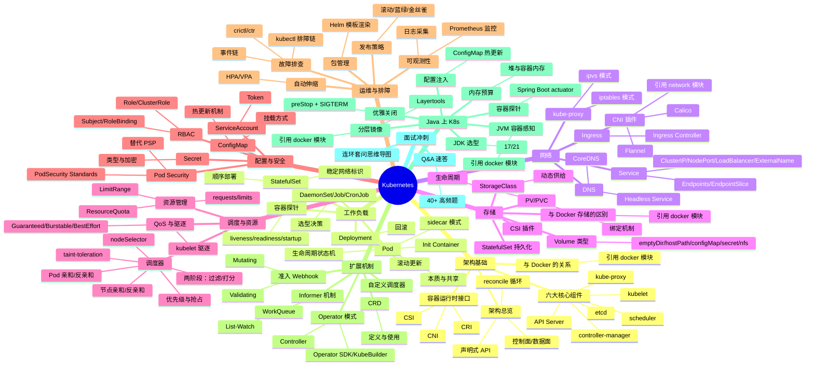

# K8s 面试知识体系设计文档

> **创建日期**：2026-08-09
> **状态**：设计已确认，待写实施计划
> **关联模块**：`ops/k8s`（新建）、`ops/docker`、`ops/network`、`java-core/*`、`framework/*`

---

## 〇、需求背景与设计决策

### 背景

用户为 Java 开发工程师，需要在 `ops/k8s/` 下构建 K8s 面试知识体系，要求"有深度、结构化、系统化"。仓库已有 `ops/docker/`（10 份文档）和 `ops/network/`（17 份文档）两个成熟面试知识体系，K8s 模块需与现有约定对齐。

### 澄清结论

| 维度 | 决策 |
|------|------|
| 面试层级 | 全谱系（初中高级全覆盖），从基础概念到 Operator 开发与机制级源码原理 |
| 与 Docker 模块边界 | 严格去重，互相引用。K8s 不重复容器底层，需引用时用相对路径链接 |
| 与 Network 模块边界 | 严格去重，K8s 网络聚焦 Service/Ingress/CNI，TCP/分层引用 network 模块 |
| 文档组织维度 | 按架构层次组织，与 docker 模块一致 |
| 深度边界 | 机制级——讲清工作流程与数据路径，提到关键源码包与函数名但不贴源码、不逐行解析 |
| Java 特化内容 | 单份 Java 专题文档（`09-performance/java-on-k8s.md`），其余文档只做关联引用 |
| 体量与节奏 | 一次性全部规划，分批产出，每份 400-600 行 |

---

## 一、文件清单与核心考点覆盖

确认方案 A：10 份文档，按架构层次组织。严格遵循"与 docker 模块去重"原则——容器底层（namespace/cgroups/unionfs/runc/containerd）不在 K8s 模块展开，只在 `01-foundation` 引用 docker 模块对应文档。

| 编号 | 目录/文件 | 核心考点 |
|------|-----------|---------|
| 入口 | `README.md` | 模块简介 + 知识图谱 mindmap + 导航表 + 学习路径 + Java 模块关联 |
| 01 | `01-foundation/k8s-architecture.md` | K8s 架构总览（控制面/数据面）、6 大核心组件职责与协作（API Server/etcd/scheduler/controller-manager/kubelet/kube-proxy）、CRI/CNI/CSI 三大接口、声明式 API 与 reconcile 循环、与 Docker 容器运行时的关系（引用 docker 模块） |
| 02 | `02-workload/pod-and-controllers.md` | Pod 本质（一组共享网络/存储的容器）、Pod 生命周期与状态机、Init Container/sidecar 模式、容器探针（liveness/readiness/startup）、Deployment 滚动更新与回滚、StatefulSet 稳定网络标识与顺序部署、DaemonSet/Job/CronJob 选型 |
| 03 | `03-network/service-and-ingress.md` | Service 四种类型（ClusterIP/NodePort/LoadBalancer/ExternalName）、Endpoints 与 EndpointSlice、kube-proxy iptables vs ipvs 数据路径、Service 负载均衡、Ingress 与 Ingress Controller、Headless Service 与 DNS、CoreDNS 架构、CNI 插件（Flannel/Calico）原理（引用 network 模块） |
| 04 | `04-storage/volume-and-pv-pvc.md` | Volume 类型体系（emptyDir/hostPath/configMap/secret/nfs）、PV/PVC 生命周期与绑定机制、StorageClass 动态供给、CSI 插件机制、StatefulSet 持久化、存储卷回收策略、与 docker 存储驱动的区别（引用 docker 模块） |
| 05 | `05-scheduling/scheduling-and-resources.md` | 调度器两阶段（过滤/打分）流程、nodeSelector/节点亲和/反亲和、taint-toleration/污点与容忍、Pod 亲和/反亲和、优先级与抢占、resources requests/limits、LimitRange/ResourceQuota、QoS 三级（Guaranteed/Burstable/BestEffort）与驱逐 |
| 06 | `06-config-security/config-and-rbac.md` | ConfigMap 热更新机制与挂载方式、Secret 类型与加密、RBAC 三要素（Role/ClusterRole/Subject/RoleBinding）、ServiceAccount 与 Token、Pod Security Standards（privileged/baseline/restricted）、PodSecurity 准入（替代 PSP） |
| 07 | `07-operations/operations-and-troubleshooting.md` | Helm 包管理与模板渲染、滚动更新/蓝绿/金丝雀发布、HPA/VPA 自动伸缩原理与指标、日志采集架构（DaemonSet vs Sidecar）、Prometheus 监控指标体系、故障排查方法论（kubectl 排障命令链、crictl/ctr、事件链） |
| 08 | `08-extensions/crd-and-operator.md` | CRD 定义与使用、Controller/Operator 模式、Informer/List-Watch/WorkQueue 机制（client-go 架构，机制级不贴源码）、自定义调度器扩展、准入 Webhook（Mutating/Validating）、Operator SDK 与 KubeBuilder 对比 |
| 09 | `09-performance/java-on-k8s.md` | JVM 容器感知（cgroup v2 兼容、引用 docker 模块）、Pod 优雅关闭与 preStop + SIGTERM、容器探针与 Spring Boot actuator、ConfigMap 注入 Spring 配置与热更新、JVM 堆与容器内存预算、JDK 17/21 在 K8s 的选型、Spring Boot Layertools 分层镜像（引用 docker 模块） |
| 10 | `10-interview-qa.md` | 40+ 跨主题高频 Q&A 速答 + 连环套问思维导图 |

### 关键设计决策

- **去重边界**：`01-foundation` 只讲 K8s 组件与 CRI/CNI/CSI 接口，不展开容器底层；`04-storage` 不重复 docker 的 OverlayFS/volume/bind mount，只讲 K8s 特有的 PV/PVC/CSI 体系
- **网络引用**：`03-network` 不重复 TCP/网络分层，引用 network 模块；聚焦 K8s Service/Ingress/CNI
- **Java 专题**：`09-performance` 不重复 docker 的 `08-performance/java-container-tuning.md`，聚焦 K8s 特有的探针/preStop/ConfigMap/HPA 与 Java 应用的结合
- **机制级深度**：`08-extensions` 讲 Informer/List-Watch 工作流程但不贴 client-go 源码；`05-scheduling` 讲两阶段调度流程但不贴调度器 Plugin 代码

---

## 二、六段式结构 + 导航约定

与 docker 模块实际文档结构完全对齐（docker README 称"五段式"是概称，实际文档为六段）。

### 文档头部（每份主题文档统一）

```
# <主题标题>

> **一句话定位**：<1-2 句，点明该文档在面试中的定位与价值>
> **面试热度**：⭐⭐⭐⭐⭐（或对应热度）
> **返回**：[K8s 知识图谱](../README.md)

---
```

### 六段式正文结构

| 段 | 标题 | 作用 | 内容形态 |
|----|------|------|---------|
| 一 | **概念定义** | 把"是什么"讲透 | 表格对比、本质阐述、关键术语定义、mermaid 状态机/架构图 |
| 二 | **原理与流程** | 把"怎么工作"讲透 | 完整调用链、时序图、数据路径、工作流程分步骤、ASCII/mermaid 流程图，机制级深度不贴源码 |
| 三 | **高频追问与面试题** | 面试官连环追问的落点 | Q&A 形式，每题"参考答案 + 关联"（关联指向 §二 对应小节或跨文档），8-10 题 |
| 四 | **实战关联（Java 后端视角）** | 落到 Java 工程 | Spring Boot/Java 应用在 K8s 的实战配置、关联 `java-core`/`framework` 模块要点 |
| 五 | **面试案例** | 系统设计/排查场景 | 2-3 个"3 分钟标准答法"案例，含时序图/排查链/决策表 |
| 六 | **参考与延伸** | 闭环 | 官方文档、延伸阅读（跨文档链接）、仓库内关联（java-core/framework/docker/network） |

### 文档尾部

```
> **返回**：[K8s 知识图谱](../README.md)
```

### Q&A 文档（`10-interview-qa.md`）特殊结构

与 docker 的 `09-interview-qa.md` 对齐：
- 使用说明（3 条）
- 按主题分篇（架构基础篇/工作负载篇/网络篇/存储篇/调度篇/配置安全篇/运维篇/扩展篇/Java 篇）
- 每题：**3-5 句要点速答 + 关联链接**（🔗 标注连环追问）
- 末尾「连环套问思维导图」（mermaid mindmap）

### README.md 结构

与 docker/network 的 README 完全对齐，五节：
1. **模块简介**（定位/适用对象/组织方式/导航约定）
2. **知识图谱**（mermaid mindmap，见下节）
3. **导航表**（分层/文档/核心考点三列）
4. **推荐学习路径**（路线一系统学习 + 路线二面试冲刺）
5. **与 java-core / framework 模块的关联**（关联表 + 延伸阅读）

### 导航与去重约定

- 每份主题文档头部 `> 返回 [K8s 知识图谱](../README.md)`
- 引用 docker 模块时用相对路径：`详见 [容器本质与底层原理](../../docker/01-foundation/container-principle.md)`
- 引用 network 模块同理：`详见 [TCP 连接](../../network/02-transport/tcp-connection.md)`
- 跨文档小节引用：`§2.1` 或 `§三 Q3`
- 六段式中"参考与延伸"的"延伸阅读"链接到同模块其他主题文档，"仓库内关联"链接到 java-core/framework/docker/network

---

## 三、知识图谱 mermaid mindmap

放入 `README.md` 的"二、知识图谱"小节。10 个一级分支精确对应 10 份文档，导航表与 mindmap 一一映射。



**设计要点**：
- **一级分支 = 文档**：10 个一级分支精确对应 §1 的 10 份文档，导航表与 mindmap 一一映射
- **去重锚点**：在"架构基础""网络""存储""Java 上 K8s"四个分支下显式标注"引用 docker 模块""引用 network 模块"，mindmap 本身不展开这些叶子
- **叶子 = 面试落点**：每个二级/三级节点都是可独立追问的面试题，与 §1 核心考点对应
- **全谱系覆盖**：从"架构基础"（初中级）到"扩展机制"（高级），再到"面试冲刺"闭环

---

## 四、推荐学习路径

与 docker/network 模块对齐，两套路线殊途同归，最终回到 Q&A 闭环。

### 路线一：系统学习（适合有 1-2 周准备期）

按 K8s 架构层次从基础向上深入，先建立全貌再下沉到细节：

```
01 架构基础 → 02 工作负载 → 03 网络 → 04 存储 → 05 调度与资源 → 06 配置与安全 → 07 运维与排障 → 08 扩展机制 → 09 Java 上 K8s → 10 Q&A
```

**特点**：先见森林后见树木，符合 K8s 架构层次——先懂组件职责（01），再懂工作负载如何承载（02），再懂网络/存储/调度如何支撑（03-05），再懂配置/安全/运维（06-07），最后进阶扩展与 Java 特化（08-09），Q&A 闭环（10）。适合建立完整体系。

### 路线二：面试冲刺（高频优先，适合 3-5 天突击）

按面试热度排序，先啃必考点，再补体系：

1. **必考三件套**：02 工作负载 → 03 网络 → 01 架构基础
2. **高频追问**：05 调度与资源 → 06 配置与安全 → 04 存储
3. **运维实战**：07 运维与排障 → 09 Java 上 K8s
4. **高级进阶**：08 扩展机制
5. **考前速过**：10 Q&A（40+ 题，含连环套问思维导图）

**特点**：投入产出比最高，覆盖 80% 高频考点。02 工作负载（Pod/Deployment）是面试绝对必考；03 网络（Service/kube-proxy）是高频追问重灾区；01 架构基础提供体系框架。05-06 是中高级区分点。08 扩展机制是高级面试加分项。

> 两套路线殊途同归，最终都应回到 [Q&A 速答](./10-interview-qa.md) 做闭环检验。

**与 docker 模块的学习路径衔接建议**：若 K8s 面试涉及容器底层追问，回查 docker 模块的 01 容器基础 → 03 容器运行，形成"容器底层 → K8s 编排"的双向映射。

---

## 五、与 java-core / framework 模块的关联

与 docker README 的关联表风格对齐，三列：K8s 知识点 / 关联 Java 模块 / 关联要点。同时补充与 docker/network 模块的去重引用关系。

### 5.1 与 java-core / framework 模块关联

| K8s 知识点 | 关联 Java 模块 | 关联要点 |
|-----------|---------------|---------|
| 02 Pod 容器探针 / 健康检查 | `framework/valid` | livenessProbe/readinessProbe 对接 `/actuator/health` 端点 |
| 02 Pod 生命周期 / preStop + SIGTERM | `framework/spring-framework` | Spring Boot graceful shutdown、ContextClosedEvent、@PreDestroy |
| 02 Pod 生命周期 / JVM ShutdownHook | `java-core/jvm` | JVM ShutdownHook 执行时机与 Pod 优雅关闭的协作 |
| 03 Service / Endpoints 负载均衡 | `java-core/rmi`（api/provider/consumer） | 对照 Java 原生 RPC 的服务发现与负载均衡 |
| 03 CNI / CoreDNS / 服务发现 | `java-core/service-provider-framework` | SPI 与服务发现机制是微服务通信基础 |
| 05 调度 / resources requests-limits | `java-core/jvm` | JVM 容器内存感知（cgroup v2）、堆外内存预算、UseContainerSupport |
| 05 调度 / CPU requests 与线程池 | `java-core/forkjoin`、`java-core/stream` | ForkJoinPool 并行度与 CPU limit 的关系、parallelStream 陷阱 |
| 06 ConfigMap / 配置注入 | `framework/spring-framework` | ConfigMap 注入 Spring 配置、@Value 与配置优先级、热更新 |
| 06 ConfigMap / 配置序列化 | `framework/jackson` | ConfigMap 存储的 YAML/JSON 与 Jackson 反序列化 |
| 06 RBAC / ServiceAccount / Token | `framework/spring-framework` | K8s ServiceAccount Token 与 Spring Security 鉴权链对比 |
| 06 Pod Security / 准入控制 | `java-core/annotation`、`java-core/apt` | 准入 Webhook 与 APT 注解处理器的拦截机制对照 |
| 06 Secret / 密钥注入 | `framework/spring-framework` | Secret 挂载与 Spring 配置加密、外部化配置 |
| 07 HPA / 指标采集 | `java-core/jmx` | JMX 指标暴露给 Prometheus Adapter 的路径 |
| 07 故障排查 / Java agent attach | `java-core/agent` | Java agent 在 K8s Pod 内 attach 的 namespace 陷阱 |
| 07 日志采集 / 序列化 | `framework/jackson` | 日志聚合的 JSON 结构化与 Jackson |
| 08 Operator / Controller 模式 | `java-core/annotation`、`java-core/apt` | CRD 定义与注解驱动的模型生成对照 |
| 08 Informer / List-Watch | `java-core/lambda`、`java-core/stream` | 事件回调链与函数式编排 |
| 09 Java 上 K8s / JVM 感知 | `java-core/jvm` | HotspotContainer 源码、cgroup v2 兼容、ZGC 选型 |
| 09 Java 上 K8s / 优雅关闭 | `framework/spring-framework` | Spring Boot 3.x JarLauncher、优雅关闭、actuator 端点 |
| 09 Java 上 K8s / 容器探针 | `framework/valid` | `/actuator/health` 作为 livenessProbe/readinessProbe |
| 09 Java 上 K8s / 分层镜像 | `framework/spring-framework` | Spring Boot Layertools 与 K8s 滚动更新缓存命中 |

### 5.2 与 docker 模块的去重引用

| K8s 文档 | 引用 docker 文档 | 引用边界（只引用不展开） |
|---------|-----------------|------------------------|
| 01 架构基础 | `docker/01-foundation/container-principle.md` | namespace/cgroups/unionfs 三大基石、runc/containerd/dockerd 调用链 |
| 01 架构基础 | `docker/03-container/container-runtime.md` | 容器运行时与 CRI 的关系、容器状态机 |
| 04 存储 | `docker/05-storage/docker-storage.md` | OverlayFS/volume/bind mount/tmpfs 基础（K8s 只讲 PV/PVC/CSI 体系） |
| 09 Java 上 K8s | `docker/08-performance/java-container-tuning.md` | JVM 容器感知、堆外预算、Layertools（K8s 只讲探针/preStop/ConfigMap/HPA 特化部分） |

### 5.3 与 network 模块的去重引用

| K8s 文档 | 引用 network 文档 | 引用边界 |
|---------|-----------------|---------|
| 03 网络 | `network/02-transport/tcp-connection.md` | Service 负载均衡与 TCP 连接管理 |
| 03 网络 | `network/05-system-design/cloud-native.md` | Service Mesh、CNI、eBPF 的网络层基础 |

### 延伸阅读

- `java-core/jvm` —— 对照理解 JVM 容器内存感知、GC 选型、ShutdownHook
- `framework/spring-framework` —— Spring Boot 容器化、优雅关闭、配置注入、Layertools
- `framework/valid` —— 健康检查端点与容器探针对接
- `ops/docker` —— 容器底层原理、运行时调用链、Java 容器调优（K8s 的底层基础）
- `ops/network` —— 网络分层、TCP 连接、云原生网络（K8s Service/CNI 的网络层基础）

> 建议在阅读 K8s 工作负载与 Java 上 K8s 文档时，对照 `java-core`/`framework` 模块的源码实例，加深「面试八股 → 工程实战」的双向映射。

---

## 六、产出节奏

一次性全部规划，分批产出。建议批次划分：

| 批次 | 文档 | 依赖 |
|------|------|------|
| 第 1 批 | `README.md` + `01-foundation/k8s-architecture.md` | 无依赖，作为骨架与首份样板 |
| 第 2 批 | `02-workload/pod-and-controllers.md` + `03-network/service-and-ingress.md` | 依赖 01 的组件职责 |
| 第 3 批 | `04-storage/volume-and-pv-pvc.md` + `05-scheduling/scheduling-and-resources.md` | 依赖 02 的 Pod/StatefulSet |
| 第 4 批 | `06-config-security/config-and-rbac.md` + `07-operations/operations-and-troubleshooting.md` | 依赖 02/03 |
| 第 5 批 | `08-extensions/crd-and-operator.md` + `09-performance/java-on-k8s.md` | 依赖 01-07 全部 |
| 第 6 批 | `10-interview-qa.md` | 依赖 01-09 全部，闭环 |
| 收尾 | 更新 `ops/README.md` 同步 K8s 模块概要 | 依赖所有文档完成 |

每份文档 400-600 行，遵循 §2 六段式结构。
