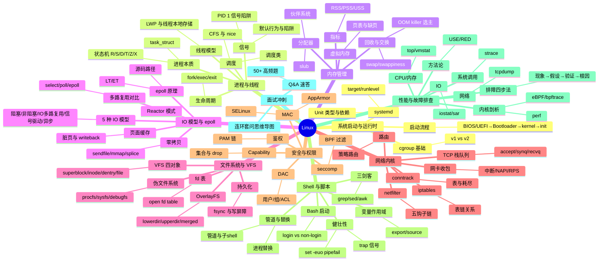

# Linux 面试知识体系 — 设计文档

> 创建日期：2026-08-09
> 状态：设计已与用户逐节确认，待用户最终审阅本 spec
> 模块路径：`ops/linux/`

---

## 一、背景与目标

`ops/` 目录下 `docker`、`k8s`、`network` 三模块已建立成熟的"分层目录 + 入口 README + 主题文档 + Q&A 速答"模式，唯独 `linux` 模块在 README 中列出但尚未建目录。本设计补齐这一缺口。

**目标**：构建面向 Java 后端面试的 Linux 知识体系，深度对标 `ops/docker`、`ops/k8s`，把 Linux 当作"容器与 JVM 的底层"来讲，每个专题都落到 Java/容器关联。

**核心约束**：
- 深度：对标 docker/k8s（讲到内核机制、源码路径、数据结构，但不到极致源码级）
- 覆盖：内核机制 + Shell + 性能排障 + 安全运维 + 底层原理
- 规模：11 份左右文档（README + 9 主题 + 1 Q&A）
- 全量 Java/容器关联
- 输出节奏：先骨架后充实（分阶段交付）
- 语言：全部中文（遵循 AGENTS.md 约定）

---

## 二、目录结构

```
ops/linux/
├── README.md                                  # 入口：模块简介/知识图谱/导航表/学习路径/Java 关联
├── 01-foundation/
│   └── system-boot-and-runtime.md             # 系统启动与运行时
├── 02-process/
│   └── process-and-thread.md                  # 进程与线程
├── 03-memory/
│   └── memory-management.md                   # 内存管理
├── 04-io/
│   └── io-model-and-epoll.md                  # IO 模型与 epoll
├── 05-fs/
│   └── filesystem-and-vfs.md                  # 文件系统与 VFS
├── 06-network/
│   └── network-kernel.md                      # 网络内核
├── 07-security/
│   └── security-and-permission.md             # 安全与权限
├── 08-shell/
│   └── shell-and-scripting.md                 # Shell 与脚本
├── 09-ops/
│   └── performance-and-troubleshooting.md     # 性能与故障排查
└── 10-interview-qa.md                        # 面试 Q&A 速答
```

**共 11 份文档**：入口 README + 9 份主题文档 + 1 份 Q&A，与 docker/k8s 规模对齐。

**组织原则**：按抽象层级自顶向下，叙事动线与 docker/k8s 一致——从系统启动（基础）→ 核心机制（进程/内存/IO/FS/网络）→ 运维层（安全/Shell/排障）→ Java/容器关联 → Q&A 闭环。

---

## 三、单份主题文档结构模板（Linux 专用六段式）

每份主题文档统一采用以下结构：

```markdown
# <主题名>

> **一句话定位**：<用一句话点题，对接面试官的入口问法>
> **面试热度**：⭐⭐⭐⭐⭐
> **返回**：[Linux 知识图谱](../README.md)

---

## 一、概述
- 该主题解决什么问题、在 Linux 内核/运维体系中的位置
- 与其他主题的边界与交叉（用"参见"链接）
- 关键术语速览表（术语 → 一句话定义）

## 二、核心机制
- 内核数据结构/源码路径（如 task_struct、cgroup 层级、epoll_event）
- 原理图（mermaid 流程图/状态机）
- 机制对比表（如 cgroup v1 vs v2、select vs poll vs epoll）

## 三、命令与示例
- 命令族速查表（命令 → 用途 → 关键参数）
- 实战 one-liner（管道组合、awk/sed 处理）
- 命令输出解读（top 各字段、/proc 各文件含义）

## 四、高频追问
- 面试官常追问的 8-12 个问题，问答体
- 含陷阱题（如 SIGTERM 默认不杀 PID 1、OOM killer 选主策略）

## 五、Java/容器关联
- 该主题与 JVM/容器的关系（对应 java-core/framework 模块）
- 实战映射表（Linux 机制 → Java/容器行为）

## 六、故障排查案例
- 1-2 个真实排障故事（现象 → 排查链 → 根因 → 修复）
- 体现"方法论"而非零散命令（如先用 top 定位方向，再下沉到 perf/strace）
```

**设计要点**：
1. "概述"段建立全貌定位，避免读者一上来就陷细节
2. "核心机制"段对标 docker 的"原理与流程"，给深度（源码路径、数据结构）
3. "命令与示例"独立成段，是 Linux 区别于 docker/k8s 的核心差异——命令是知识载体
4. "高频追问"放在"Java 关联"前，保证纯 Linux 知识的完整性
5. "故障排查案例"独立收尾，与 docker 的"系统设计案例"对应但更贴合 Linux 排障场景

**目标体量**：每份主题文档 500-800 行，与 docker/k8s 主题文档一致。

---

## 四、各主题文档核心考点

| # | 文档 | 核心考点 |
|---|------|---------|
| 01 | 系统启动与运行时 | BIOS/UEFI→Bootloader→kernel→init、runlevel/target、systemd Unit 类型与依赖、cgroup v1/v2 基础、主机名与时区 |
| 02 | 进程与线程 | task_struct、进程状态机（R/S/D/T/Z/X）、fork/exec/exit、CFS 调度类与 nice、线程 vs 进程、信号机制与默认行为、PID 1 陷阱 |
| 03 | 内存管理 | 虚拟内存与页表、缺页中断、swap 与 swappiness、OOM killer 选主、伙伴系统与 slub、RSS/PSS/USS、mmap |
| 04 | IO 模型与 epoll | 5 种 IO 模型、select/poll/epoll 对比、epoll 源码路径与 LT/ET、Reactor 模式、sendfile/mmap/splice 零拷贝、页面缓存与脏页 |
| 05 | 文件系统与 VFS | VFS 四对象、inode/dentry/open fd table、OverlayFS 原理、procfs/sysfs/debugfs、硬软链接、fsync 与写屏障 |
| 06 | 网络内核 | netfilter 五钩子、iptables 表链、conntrack 表与耗尽、TCP 栈各队列（accept/synq/recvq）、路由与策略路由、网卡中断与 NAPI/RPS |
| 07 | 安全与权限 | 用户/组/ACL、Capability 集合、SELinux MAC vs DAC、seccomp BPF、AppArmor、PAM 鉴权链、sudoers 配置陷阱 |
| 08 | Shell 与脚本 | Bash 启动文件层级、三剑客（grep/sed/awk）、进程替换与管道、环境变量作用域、信号与 trap、here doc 与子 shell、set -euo pipefail |
| 09 | 性能与故障排查 | USE/RED 方法论、top/vmstat/iostat/sar、perf top/record/report、strace/-e trace、tcpdump/wireshark、eBPF/bpftrace、排障四步法 |
| 10 | 面试 Q&A 速答 | 50+ 高频题速答 + 连环套问思维导图（按主题串联，如"epoll→Reactor→Netty→线程模型"） |

---

## 五、Java/容器关联映射

每份主题文档的"Java/容器关联"段都会落实以下映射，最终汇总进 README 关联表：

| Linux 文档 | 关联 Java/容器模块 | 关联要点示例 |
|-----------|-------------------|-------------|
| 01 启动与运行时 | `java-core/jvm` | JVM 启动参数与 systemd Unit 协作 |
| 02 进程与线程 | `java-core/jvm`、`java-core/forkjoin` | Java 线程 = LWP、ForkJoinPool 与 CPU 亲和、JVM ShutdownHook 与信号 |
| 03 内存管理 | `java-core/jvm` | 堆外内存、OOM killer 杀 JVM、cgroup memory 与 JVM 堆感知 |
| 04 IO 模型 | `java-core/lambda`、`java-core/stream` | NIO/Netty 的 epoll、parallelStream 阻塞线程池 |
| 05 文件系统 | `framework/spring-framework` | Spring Boot Layertools 分层 = OverlayFS、配置文件加载顺序 |
| 06 网络内核 | `ops/network` | TCP 栈参数与网络模块对照、conntrack 与高并发服务 |
| 07 安全与权限 | `ops/docker`、`ops/k8s` | Docker seccomp/Capability、K8s PodSecurity |
| 08 Shell 与脚本 | `ops/docker`、`ops/k8s` | 镜像构建 ENTRYPOINT、kubectl 排障 one-liner |
| 09 性能与排障 | `java-core/jmx`、`java-core/agent` | JMX 指标采集、Java agent attach 排障、Arthas 原理 |

---

## 六、README 结构

README 采用与 docker/k8s 完全一致的五节结构：

1. **模块简介**：定位、适用对象、组织方式、导航约定
2. **知识图谱**：mermaid mindmap，按 9 大主题组织，层级展开到核心考点
3. **导航表**：11 行表格（分层 | 文档链接 | 核心考点）
4. **推荐学习路径**：
   - 路线一：系统学习（1-2 周准备期）—— 01→02→...→10
   - 路线二：面试冲刺（3-5 天突击）—— 按热度排序
5. **与 java-core / framework 模块的关联**：汇总关联表 + 延伸阅读

### 知识图谱（mermaid mindmap）



---

## 七、输出节奏（分阶段交付）

按用户确认的"先骨架后充实"节奏推进：

### 阶段一：骨架与示范（本轮交付）
- `ops/linux/README.md`（完整内容）
- `ops/linux/01-foundation/system-boot-and-runtime.md`（完整内容，作为首份示范）
- `ops/linux/10-interview-qa.md`（完整内容，与 README 同步交付，作为冲刺闭环）
- 更新 `ops/README.md`，把 linux 行从纯文字改为链接

> 阶段一交付后，用户审阅风格，确认无误后进入阶段二。

### 阶段二：核心机制文档（4 份）
- `02-process/process-and-thread.md`
- `03-memory/memory-management.md`
- `04-io/io-model-and-epoll.md`
- `05-fs/filesystem-and-vfs.md`

### 阶段三：运维与排障文档（3 份）
- `06-network/network-kernel.md`
- `07-security/security-and-permission.md`
- `08-shell/shell-and-scripting.md`

### 阶段四：收尾文档（1 份）
- `09-ops/performance-and-troubleshooting.md`
- 根据各主题文档实际内容，回填更新 `10-interview-qa.md` 的连环套问思维导图

---

## 八、与 AGENTS.md 规则的对齐

- **README 自动更新规则**：阶段一交付时同步更新 `ops/linux/README.md` 与根目录 `ops/README.md`；后续每完成一份主题文档，回填 README 导航表与知识图谱的进度标记。
- **语言要求**：所有文档中文撰写，与用户交流用中文。
- **构建与测试**：本模块为纯文档，无 Maven 构建，无需测试。

---

## 九、验收标准

1. **结构一致性**：README 五节结构、主题文档六段式结构与本设计一致
2. **深度对标**：主题文档体量 500-800 行，含内核数据结构/源码路径/对比表/命令族/追问答疑/Java 关联/排障案例
3. **Java 关联完整**：每份主题文档含"Java/容器关联"段，README 关联表覆盖 9 份文档
4. **Q&A 闭环**：`10-interview-qa.md` 含 50+ 高频题与连环套问思维导图
5. **导航自洽**：所有文档间"参见"链接、README 导航表链接均可达
