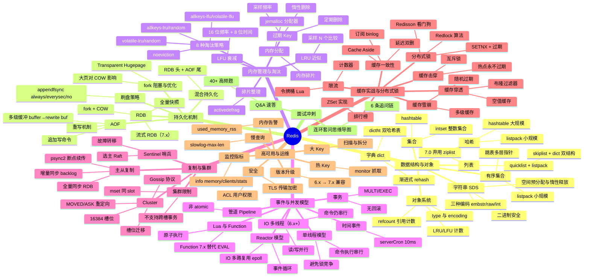

# Redis 面试知识体系设计文档

> **创建日期**：2026-08-11
> **模块路径**：`middleware/redis/`
> **定位**：面向 Java 后端高级/资深面试（5 年+）的 Redis 知识体系，与 `middleware/mysql` 模块完全对齐

---

## 一、模块整体结构

### 目录组织

```
middleware/redis/
├── README.md                          # 入口索引（知识图谱 mindmap + 导航表 + 学习路径 + 模块关联）
├── 01-data-structure/
│   └── data-structure-and-encoding.md  # 数据结构与对象编码
├── 02-persistence/
│   └── persistence-mechanism.md        # 持久化机制
├── 03-memory/
│   └── memory-and-eviction.md          # 内存管理与淘汰策略
├── 04-event/
│   └── event-and-concurrency.md        # 事件与并发模型
├── 05-replication/
│   └── replication-and-cluster.md      # 复制与集群
├── 06-cache-practice/
│   └── cache-and-distributed-lock.md   # 缓存实战与分布式锁
├── 07-ops/
│   └── ha-and-ops.md                   # 高可用与运维
└── 08-interview-qa.md                  # 跨主题高频面试 Q&A
```

### 文件命名约定

- 主题文件采用 `kebab-case`，与 MySQL 的 `index-and-optimization.md`、`transaction-and-mvcc.md` 风格一致
- 文件名即主题全称（如 `persistence-mechanism.md`），不缩写

### 与 MySQL 的结构对齐

| 维度 | MySQL | Redis |
|------|-------|-------|
| 主题目录数 | 7 | 7 |
| Q&A 文件 | 1 份（08-interview-qa.md） | 1 份（08-interview-qa.md） |
| 入口 README | 含 mindmap + 导航表 + 学习路径 + 模块关联 | 完全对齐 |
| 每份主题文档 | 五段式 + 顶部 `> 返回` 链接 | 完全对齐 |
| 版本基线 | MySQL 8.0 | Redis 7.x |

### 与上层 README 的衔接

`middleware/README.md` 第 4 行 `- redis` 将更新为：

```
- [redis](./redis) — Redis 面试知识体系（9 份文档，面向 5 年+ 资深面试）
```

与 MySQL 行格式完全一致。

---

## 二、知识图谱 mindmap

这是 `README.md` 中的核心导航图，采用 mermaid mindmap（与 MySQL 的 `mindmap` 语法完全一致），覆盖 7 主题 + 面试冲刺：



### 设计要点

1. **根节点**：`root((Redis))`，与 MySQL 的 `root((MySQL))` 对齐
2. **一级节点**：8 个（7 主题 + 面试冲刺），与导航表一一对应
3. **二级节点**：每个主题的核心子领域（如"数据结构"下 6 种类型 + 对象系统）
4. **三级节点**：关键考点/关键词（如"渐进式 rehash"、"MOVED/ASK 重定向"），用于面试检索
5. **深度对标 MySQL**：MySQL 的 mindmap 三级，Redis 同样三级；MySQL 末尾是"面试冲刺 → Q&A 速答 → 41 高频题 + 连环套问"，Redis 对齐为"40+ 高频题 + 6 条追问链"

### 与 MySQL mindmap 的结构对照

| 一级节点 | MySQL | Redis |
|---------|-------|-------|
| 1 | 索引原理 | 数据结构与对象 |
| 2 | 事务与 MVCC | 持久化机制 |
| 3 | 锁机制 | 内存管理与淘汰 |
| 4 | 查询优化 | 事件与并发模型 |
| 5 | 存储引擎 | 复制与集群 |
| 6 | 日志体系 | 缓存实战与分布式锁 |
| 7 | 架构与高可用 | 高可用与运维 |
| 8 | 面试冲刺 | 面试冲刺 |

> 注：主题顺序不追求与 MySQL 一一映射（Redis 的"复制与集群"对应 MySQL 的"架构与高可用"但位置不同），而是遵循 Redis 自身的知识递进——先底层（数据结构）→ 存储（持久化/内存）→ 运行（事件模型）→ 分布式（复制集群）→ 实战（缓存/锁）→ 运维。

---

## 三、导航表

| 分层 | 文档 | 核心考点 |
|------|------|---------|
| 数据结构与对象 | [数据结构与对象编码](./01-data-structure/data-structure-and-encoding.md) ✅ | SDS/dict 渐进式 rehash/quicklist+listpack/skiplist 跳表/intset/对象 type+encoding/编码转换 |
| 持久化机制 | [持久化机制](./02-persistence/persistence-mechanism.md) ✅ | RDB fork+COW/流式 RDB/AOF 重写/多级缓冲/混合持久化/appendfsync 策略/大页影响 |
| 内存管理与淘汰 | [内存管理与淘汰策略](./03-memory/memory-and-eviction.md) ✅ | jemalloc 碎片/惰性+定期删除/8 种淘汰策略/LRU 近似/LFU 衰减/activedefrag |
| 事件与并发模型 | [事件与并发模型](./04-event/event-and-concurrency.md) ✅ | 单线程/Reactor epoll/IO 多线程/serverCron/Pipeline/MULTI 事务/Lua+Function |
| 复制与集群 | [复制与集群](./05-replication/replication-and-cluster.md) ✅ | 全量+增量同步/psync2/Sentinel Raft/16384 槽位/Gossip/MOVED·ASK/槽位迁移 |
| 缓存实战与分布式锁 | [缓存实战与分布式锁](./06-cache-practice/cache-and-distributed-lock.md) ✅ | 穿透·击穿·雪崩/Cache Aside/延迟双删/binlog 订阅/SETNX/Redlock/Redisson/限流/排行榜 |
| 高可用与运维 | [高可用与运维](./07-ops/ha-and-ops.md) ✅ | 慢查询/大 Key·热 Key 治理/info 监控指标/内存告警/ACL+TLS 安全/版本升级 |
| 面试冲刺 | [Q&A 速答](./08-interview-qa.md) ✅ | 40+ 题速答 + 连环套问思维导图 |

> 共 **9 份**文档：入口 README（本文档）+ 上表 8 份主题/Q&A 文档。

### 设计要点

1. **表头/列名/格式**：与 MySQL 导航表完全一致（分层 | 文档 | 核心考点）
2. **文档链接**：相对路径，指向各主题目录下的 `.md`
3. **核心考点列**：每个文档 5-7 个关键词，用 `/` 分隔，对应 mindmap 的三级节点
4. **文档计数说明**：底部标注"9 份"，与 MySQL 完全对齐

---

## 四、推荐学习路径

### 路线一：系统学习（适合有 1-2 周准备期）

按 Redis 知识层次自底向上，先建立数据结构与内存模型底层，再向上到持久化、事件、集群、实战：

```
01 数据结构 → 02 持久化 → 03 内存与淘汰 → 04 事件模型 → 05 复制与集群 → 06 缓存实战 → 07 运维 → 08 Q&A
```

**特点**：先见森林后见树木，符合「数据结构 → 持久化 → 内存 → 事件 → 集群 → 实战 → 运维」的认知递进，适合建立完整体系。底层到上层路径清晰：数据结构是基础，持久化/内存决定单机能力，事件模型决定并发性能，集群决定扩展性，实战/运维是工程落地。

### 路线二：面试冲刺（高频优先，适合 3-5 天突击）

按面试热度排序，先啃必考点，再补体系：

1. 01 数据结构 → 06 缓存实战与分布式锁
2. 02 持久化 → 03 内存与淘汰
3. 05 复制与集群 → 04 事件模型
4. 07 运维 → 08 Q&A（40+ 题，含连环套问思维导图）

**特点**：投入产出比最高，覆盖 80% 高频考点。Redis 面试起手三连问是「数据类型与底层结构 → 缓存三大问题 → 持久化」，先把这三块拿下再补集群与事件模型。

> 两套路线殊途同归，最终都应回到 [Q&A 速答](./08-interview-qa.md) 做闭环检验。

---

## 五、与 java-core / framework 模块的关联

本模块虽为中间件文档，但与仓库内 Java 模块存在直接关联，便于在面试中结合源码与实战作答：

| Redis 知识点 | 关联 Java 模块 | 关联要点 |
|-------------|---------------|---------|
| 01 数据结构 / SDS 二进制安全 | `framework/jackson` | SDS 二进制安全与 Jackson 序列化字节的对接 |
| 01 数据结构 / 对象系统 | `java-core/reflect` | Redis Object type/encoding 与反射元数据的对照 |
| 03 内存与淘汰 / 引用计数 | `java-core/jvm` | Redis refcount 引用计数 vs JVM GC 可达性分析 |
| 03 内存与淘汰 / 内存分配 | `java-core/jvm` | jemalloc 与 JVM 堆外内存、DirectByteBuffer 的对照 |
| 04 事件模型 / 单线程 vs 多线程 | `java-core/jvm` | Redis 单线程模型 vs JVM 多线程并发的本质差异 |
| 04 事件模型 / Reactor epoll | `java-core/lambda` | Netty Reactor 与 Redis 事件循环的对照（epoll 共用） |
| 04 事件模型 / Pipeline 管道 | `java-core/stream` | Pipeline 批量与 Stream 批处理的对比 |
| 05 复制与集群 / 分片 | `framework/spring-framework` | Redis Cluster 槽位与 Spring 多数据源路由的对照 |
| 06 缓存实战 / `@Cacheable` | `framework/spring-framework` | Spring Cache 抽象与 Redis 集成、序列化配置 |
| 06 缓存实战 / 一致性 | `framework/spring-framework` | `@Transactional` 与缓存一致性边界的协调 |
| 06 分布式锁 / Redisson | `framework/spring-framework` | Redisson 集成 Spring、`@RedissonLock` 注解化 |
| 06 缓存实战 / 序列化 | `framework/jackson` | RedisTemplate 序列化器与 Jackson 自定义序列化 |
| 06 缓存实战 / 参数校验 | `framework/valid` | 缓存空值与参数校验互补防穿透 |

**延伸阅读**：

- `java-core/jvm` —— 对照理解 Redis 引用计数内存回收 vs JVM GC、单线程模型 vs JVM 多线程
- `framework/spring-framework` —— Spring Cache 抽象、Redisson 分布式锁集成、多数据源路由
- `framework/jackson` —— RedisTemplate 序列化器与 Jackson 自定义序列化的对接

> 建议在阅读内存管理、事件模型与缓存实战文档时，对照 `java-core`/`framework` 模块的源码实例，加深「面试八股 → 工程实战」的双向映射。

---

## 六、与 ops 模块的交叉引用

本模块部分原理推导链与 `ops` 运维文档存在对照关系，Redis 章只讲"Redis 场景下的实现与选择"，原理推导回对应模块：

| Redis 文档 | 跳转目标 | 对照要点 |
|-----------|---------|---------|
| 02 持久化 | `ops/linux/05-fs/filesystem-and-vfs.md` | fsync 与文件系统崩溃一致性、RDB/AOF 落盘 |
| 02 持久化 | `ops/linux/03-memory/memory-management.md` | fork COW 与 Linux 内存管理、THP 大页影响 |
| 02 持久化 | `ops/linux/04-io/io-model-and-epoll.md` | AOF 重写子进程与 IO 模型对照 |
| 04 事件模型 | `ops/linux/04-io/io-model-and-epoll.md` | Redis Reactor 与 epoll、IO 多路复用、IO 多线程 |
| 04 事件模型 | `ops/linux/03-memory/memory-management.md` | 单线程模型与内存屏障、CPU 缓存友好性 |
| 05 复制与集群 | `middleware/README.md`（mysql 已建） | Redis 主从 vs MySQL 主从复制的对照 |
| 05 复制与集群 | `ops/docker/` | Redis Cluster 容器化部署、Sentinel 编排 |
| 07 运维 | `ops/linux/01-process/process-and-thread.md` | Redis 单进程单线程 vs Linux 进程线程模型 |
| 07 运维 | `ops/linux/06-network/tcp-and-conntrack.md` | Redis 短连接 vs 长连接、TCP keepalive |

> 处理原则：Redis 章只讲"Redis 场景下的实现与选择"，原理推导链回对应模块，不重复展开。

---

## 七、每份主题文档的五段式内容大纲

### 文档 1：`01-data-structure/data-structure-and-encoding.md`

> **一句话定位**：Redis 数据结构是面试起手题，"讲讲 Redis 有哪些数据类型及底层实现"几乎每场必问，能讲到 SDS 空间预分配、dict 渐进式 rehash、跳表与 listpack 的编码转换才算合格。
> **面试热度**：⭐⭐⭐⭐⭐

**一、概念定义**
- 1.1 Redis 数据类型与底层结构的关系（type 5 种 vs encoding 多种，解耦"接口"与"实现"）
- 1.2 为什么 Redis 要做编码转换（小数据用紧凑结构省内存、大数据用高效结构保性能，以 listpack→hashtable 为例）
- 1.3 对象系统 redisObject 结构（type/encoding/refcount/lru/ptr 五字段详解，4 位 type + 4 位 encoding + 24 位 lru）
- 1.4 共享对象池（0-9999 的整数对象共享，为什么字符串不共享——相等判断 O(n) 太贵）

**二、原理与流程**
- 2.1 SDS 详解（结构 `len/alloc/flags/buf`、空间预分配 `min(len*2, 1MB)`、惰性释放、二进制安全、与 C 字符串对比表、`sdshdr5/8/16/32/64` 五种子类型按长度选型）
- 2.2 dict 字典与渐进式 rehash（`dictht[2]` 双哈希表、`rehashidx`、每次增删改查迁移 1 个桶、为什么不能一次性 rehash——单线程会阻塞、负载因子 `used/size` 与 `dict_force_resize_ratio` 阈值、为什么 dict 改用 SipHash）
- 2.3 listpack（7.0 替代 ziplist，结构 `entry(encode/data/backlen) + num-elements + end`、为什么弃用 ziplist——`prev_entry_length` 引发的连锁更新 O(n²)、listpack 用 `backlen` 反向遍历规避连锁更新）
- 2.4 quicklist（双向链表 + 节点内 listpack、`fill` 控制单节点大小、`compress` 两端压缩 LZF、7.x 默认 list-max-listpack-size=-2 即 8KB）
- 2.5 intset（整数集合、`encoding` 按 int16/32/64 升级、二分查找、为什么只支持升级不支持降级）
- 2.6 skiplist 跳表（多层指针、`ZSKIPLIST_MAXLEVEL=32`、`p=0.25` 期望层高 1.33、为什么不用红黑树——范围查询 O(log n) + 实现简单 + 内存友好、与 B+树对比——内存数据库无磁盘 IO）
- 2.7 各数据类型的编码转换阈值表（list:listpack→quicklist、hash:listpack→hashtable、zset:listpack→skiplist+dict、set:intset→hashtable、参数 `hash-max-listpack-entries` 等）
- 2.8 ZSet 为什么用 skiplist + dict 双结构（dict O(1) 查 score、skiplist O(log n) 范围查询，两者互补）

**三、高频追问**
- Redis 有几种数据类型？（5 种基础 + Stream）
- String 底层是什么？（SDS，int/embstr/raw 三种编码，embstr 44 字节阈值）
- 为什么 Redis 用跳表不用红黑树？（范围查询、实现简单、内存灵活）
- 渐进式 rehash 过程中，查询怎么走？（两个 ht 都查）
- listpack 为什么替代 ziplist？（连锁更新问题）
- ZSet 为什么用两个结构？（查 score 与范围查询互补）

**四、实战关联**
- Java 场景：排行榜用 ZSet、统计 UV 用 HyperLogLog、消息流用 Stream、位置服务用 Geo
- 与 Spring Data Redis 的 `RedisTemplate.opsForZSet()` 等 API 对应
- 编码转换阈值与业务数据规模的匹配（如 hash 存商品属性何时从 listpack 转 hashtable）

**五、系统设计案例**
- 设计一个支持亿级 UV 的日活统计系统（HyperLogLog + 按天分 key + 误差控制）
- 设计一个延迟队列（ZSet score=到期时间戳 + 定时扫描）

---

### 文档 2：`02-persistence/persistence-mechanism.md`

> **一句话定位**：持久化是 Redis 与纯内存缓存（如 Memcached）的本质区别，"RDB 和 AOF 怎么选"是高频必问。
> **面试热度**：⭐⭐⭐⭐⭐

**一、概念定义**
- 1.1 为什么 Redis 需要持久化（内存数据库断电即失，与 MySQL 磁盘数据库的本质区别）
- 1.2 RDB vs AOF vs 混合持久化对比表（全量 vs 增量、体积、恢复速度、数据丢失窗口）
- 1.3 持久化对性能的影响（fork 阻塞、fsync 阻塞、AOF 重写 CPU 占用）

**二、原理与流程**
- 2.1 RDB 全量快照（`bgsave` → fork 子进程 → COW 写时复制 → 遍历所有 dict 生成二进制 dump、`save` 与 `bgsave` 的区别——阻塞 vs 后台）
- 2.2 fork 与 COW 详解（`fork()` 系统调用、父子进程共享物理页、父进程写入触发 COW 复制页、为什么 fork 本身很快——只复制页表不复制数据、页表大小与内存成正比）
- 2.3 流式 RDB（7.x `repl-diskless-sync yes` + 加载 RDB 到 socket，主从全量同步不再落盘）
- 2.4 AOF 追加写命令（`appendonly yes`、命令协议格式 RESP、`aof_buf` 缓冲区 → write 系统调用 → fsync 落盘）
- 2.5 AOF 重写（子进程遍历 db 生成最小命令集、`aof_rewrite_buf` 重写期间增量缓冲、重写完成后原子替换、为什么需要重写缓冲——子进程不能访问父进程新写入）
- 2.6 appendfsync 三种策略（always 最安全最慢、everysec 默认折中、no 交给 OS、数据丢失窗口分析）
- 2.7 混合持久化（`aof-use-rdb-preamble yes` 7.x 默认开启、RDB 头 + AOF 尾、恢复时先加载 RDB 再回放 AOF）
- 2.8 Transparent Hugepage 对 COW 的影响（2MB 大页 vs 4KB 小页，大页导致 COW 复制粒度放大 512 倍，必须关闭 THP）
- 2.9 源码路径（`src/rdb.c`、`src/aof.c`、`src/rio.c`）

**三、高频追问**
- RDB 和 AOF 怎么选？（生产混合持久化）
- bgsave 时如果有写入怎么办？（COW 复制页）
- AOF 文件越来越大怎么办？（重写）
- fork 为什么会阻塞？（复制页表，与内存成正比，10GB 实例 fork 约 200ms）
- everysec 会不会丢数据？（最多 1 秒，但 fsync 线程异常时可能更多）
- 混合持久化怎么恢复？（先 RDB 后 AOF）

**四、实战关联**
- 生产配置模板（appendonly yes + everysec + 混合持久化 + 关闭 THP）
- 大内存实例 fork 阻塞的优化（控制单实例 < 10GB、使用 Cluster 分片）
- 与 MySQL binlog 的对比（逻辑日志 vs 物理快照、用途差异）

**五、系统设计案例**
- 设计一个 50GB Redis 实例的持久化方案（Cluster 分片到 5 个 10GB 节点、每节点混合持久化、fork 阻塞可控）
- 主从全量同步时如何避免主库磁盘 IO（流式 RDB `repl-diskless-sync`）

---

### 文档 3：`03-memory/memory-and-eviction.md`

> **一句话定位**：内存是 Redis 的核心资源，"过期 Key 怎么删、内存满了怎么办"是中高级面试分水岭。
> **面试热度**：⭐⭐⭐⭐⭐

**一、概念定义**
- 1.1 Redis 内存管理本质（所有数据在内存，内存是硬约束，与 MySQL 磁盘扩展的本质区别）
- 1.2 `maxmemory` 配置与 `used_memory` / `used_memory_rss` / `used_memory_dataset` 三个指标的区别
- 1.3 内存碎片（jemalloc 分配器按 size class 分配，频繁删改导致碎片，`mem_fragmentation_ratio` > 1.5 需关注）
- 1.4 过期 Key 与淘汰 Key 的区别（过期是时间驱动 TTL，淘汰是空间驱动 maxmemory）

**二、原理与流程**
- 2.1 过期 Key 删除策略（惰性删除——访问时检查 `expireIfNeeded`、定期删除——`serverCron` 每 100ms 抽样 `ACTIVE_EXPIRE_CYCLE_LOOKUPS_PER_LOOP=20`、为什么不用定时删除——每个 Key 一个定时器开销太大）
- 2.2 8 种淘汰策略详解（noeviction/allkeys-lru/allkeys-random/allkeys-lfu/volatile-lru/volatile-random/volatile-lfu/volatile-ttl，7.0 新增 `volatile-lfu` 与 `allkeys-lfu`，实际是 8 种）
- 2.3 LRU 近似实现（为什么不用双向链表 LRU——内存开销大、维护成本高、采样 `maxmemory-samples` 默认 5 个取最久未用、采样数越大越精确但越慢）
- 2.4 LFU 实现（redisObject 24 位 lru 字段拆为 16 位频率 + 8 位时间衰减、频率用对数计数器 `counter = (counter * lfu_log_factor + 1) / counter` 防止饱和、时间衰减 `lfu-decay-time` 默认 1 分钟）
- 2.5 LRU vs LFU 对比（LRU 按访问时间、LFU 按访问频率、LFU 解决"偶尔被访问的冷数据挤掉热点"问题、为什么 4.0 后推荐 LFU）
- 2.6 内存分配器 jemalloc（size class 分配、`je_malloc`/`je_free`、碎片产生原因、为什么不用 glibc malloc——jemalloc 碎片率更低）
- 2.7 activedefrag 主动碎片整理（7.x `activedefrag yes`、在 `serverCron` 中占用少量 CPU 整理碎片、`active-defrag-ignore-bytes` 阈值）
- 2.8 源码路径（`src/expire.c`、`src/evict.c`、`src/object.c` 的 `lookupKey`）

**三、高频追问**
- Redis 过期 Key 怎么处理？（惰性 + 定期）
- 内存满了怎么办？（8 种淘汰策略）
- LRU 怎么实现的？（近似 LRU，采样 N 个）
- LRU 和 LFU 区别？哪个好？（LFU 解决偶发访问问题）
- 怎么查内存碎片？（`info memory` 看 `mem_fragmentation_ratio`）
- 为什么 used_memory_rss 比 used_memory 大？（碎片 + 共享对象池 + fork 子进程）

**四、实战关联**
- 生产 `maxmemory` 配置建议（物理内存 60-70%，留 fork 与系统余量）
- 碎片整理配置（`activedefrag yes` + `active-defrag-cycle-min 1`）
- 不同业务场景的淘汰策略选择（缓存用 allkeys-lfu、数据库用 noeviction + 容量监控）

**五、系统设计案例**
- 设计一个 100GB 缓存集群的内存规划（5 节点 × 32GB 物理机，maxmemory 20GB/节点，allkeys-lfu，监控 `used_memory_rss`）
- 大量 Key 同时过期导致的问题（定期删除来不及 → 内存抖动 → 雪崩，随机过期时间打散）

---

### 文档 4：`04-event/event-and-concurrency.md`

> **一句话定位**：单线程模型是 Redis 最具辨识度的特征，"为什么单线程还这么快"是面试必问，能讲到 IO 多线程与命令串行的边界才算合格。
> **面试热度**：⭐⭐⭐⭐⭐

**一、概念定义**
- 1.1 Redis 单线程的含义（命令执行单线程，IO 在 6.0 后可多线程，不是"整个 Redis 只有一个线程"）
- 1.2 为什么单线程（避免锁竞争、避免上下文切换、Redis 瓶颈不在 CPU 而在内存与网络、单线程内存操作极快）
- 1.3 Reactor 模型（IO 多路复用 + 事件分发 + 事件处理器，与 Netty 的对比）
- 1.4 Pipeline 与事务的区别（Pipeline 是客户端批量发送非原子、事务是服务端原子执行但无回滚）

**二、原理与流程**
- 2.1 事件循环详解（`aeMain` → `aeProcessEvents` → `aeApiPoll(epoll_wait)` → 处理就绪事件 → 处理时间事件、为什么用 epoll 不用 select——无 1024 限制、O(1) 返回就绪事件）
- 2.2 IO 多路复用 epoll（`epoll_create`/`epoll_ctl`/`epoll_wait`、ET vs LT——Redis 用 LT 兼容性好、红黑树管理 fd、就绪链表返回）
- 2.3 IO 多线程（6.0 `io-threads`、7.x `io-threads-do-reads yes`、读/写 socket 并行、命令解析与执行仍单线程、`io-threads` 建议不超过 CPU 核数、为什么不让命令也多线程——破坏原子性、需要锁）
- 2.4 时间事件 serverCron（每 10ms 执行一次 `serverCron`、做过期清理/淘汰/统计/集群心跳/AOF 重写触发、`hz` 参数控制频率）
- 2.5 Pipeline 原理（客户端连续发送命令不等待响应、服务端顺序执行并批量返回、节省 RTT、非原子——中间可插入其他客户端命令）
- 2.6 MULTI/EXEC 事务（`MULTI` 开启队列、命令入队、`EXEC` 原子执行、`WATCH` 乐观锁 CAS、为什么无回滚——Redis 命令不支持回滚且语法错误在入队时已检查、运行时错误如对字符串 LPUSH 不回滚）
- 2.7 Lua 与 Function（`EVAL` 原子执行、7.x Function `FUNCTION LOAD` 替代 EVAL——可缓存可管理、为什么 Lua 能原子——单线程执行期间不切换、Lua 脚本不能阻塞——`lua-time-limit` 默认 5s）
- 2.8 源码路径（`src/ae.c`、`src/networking.c`、`src/server.c` 的 `main` 与 `serverCron`）

**三、高频追问**
- Redis 为什么快？（内存 + 单线程无锁 + epoll + 高效数据结构）
- 单线程怎么处理并发请求？（epoll 多路复用 + 事件循环）
- IO 多线程后还是单线程吗？（命令执行仍单线程，只有 IO 并行）
- Pipeline 和事务区别？（批量 vs 原子）
- Redis 事务能回滚吗？（不能，为什么）
- Lua 脚本为什么能保证原子性？（单线程不切换）

**四、实战关联**
- Java 场景：Lettuce 连接池与 Pipeline、Spring `@Cacheable` 的批量预加载
- IO 多线程适用场景（高 QPS + 大 value 网络成为瓶颈时开启）
- Lua 脚本实现原子扣库存、限流令牌桶

**五、系统设计案例**
- 设计一个秒杀库存扣减方案（Lua 原子脚本 `DECR` + 库存预扣 + 异步落库）
- 设计一个接口限流器（Lua + 令牌桶 + `INCR` + `EXPIRE`）

---

### 文档 5：`05-replication/replication-and-cluster.md`

> **一句话定位**：复制与集群是 Redis 从单机走向分布式的关键，"主从怎么同步、Cluster 怎么分片"是高级面试分水岭。
> **面试热度**：⭐⭐⭐⭐⭐

**一、概念定义**
- 1.1 主从复制（读写分离、数据冗余、故障恢复基础）
- 1.2 Sentinel 哨兵（监控 + 自动故障转移 + 配置中心，独立进程不存数据）
- 1.3 Cluster 集群（去中心化分片 + 自动故障转移，每个节点既存数据又参与治理）
- 1.4 三者关系（主从是基础、Sentinel 在主从上加自动故障转移、Cluster 在主从上加分片与去中心化治理）

**二、原理与流程**
- 2.1 全量同步流程（SLAVEOF → PSYNC? → +FULLRESYNC → master bgsave RDB → 发送 RDB → 发送缓冲区增量命令、为什么全量同步开销大——fork + 网络传输 + 加载阻塞）
- 2.2 增量同步与 replication backlog（`repl_backlog_size` 默认 1MB 环形缓冲区、offset 追赶、断线重连后 offset 在 backlog 内则增量同步）
- 2.3 psync2 断点续传（4.0+，从库记录 `replid` 与 `offset`、主库切换后用 `replid` 匹配旧 backlog 实现跨主续传、为什么需要 psync2——主库故障切换后新主没有旧主的 offset）
- 2.4 Sentinel 故障转移（主观下线 `SDOWN` → 客观下线 `ODOWN` → 选主 Raft 选举 Leader Sentinel → Leader 执行故障转移 → 选最优从库 → `SLAVEOF NO ONE` → 通知其他从库同步新主）
- 2.5 Cluster 槽位设计（16384 个槽、为什么是 16384 而不是 65536——心跳包压缩每槽 1 bit 共 2KB、节点数实际不超过 1000、CRC16(key) % 16384）
- 2.6 Gossip 协议（每秒向 5 个随机节点发 PING、携带自己已知的节点子集、PING/PONG 交换集群状态、`cluster_node_timeout` 判定下线）
- 2.7 MOVED 与 ASK 重定向（MOVED 是永久迁移客户端缓存槽映射、ASK 是临时迁移迁移中不更新客户端缓存、为什么 ASK 不更新缓存——迁移未完成）
- 2.8 槽位迁移流程（`CLUSTER SETSLOT` MIGRATING/IMPORTING → `MIGRATE` 逐 key 迁移 → 迁移中 ASK → 完成 SETSLOT NODE）
- 2.9 集群限制（不支持跨槽事务、`MSET` 必须同 slot 用 `{hashtag}`、`SELECT` 只能用 db0、PubSub 7.0 前 Sharded PubSub 解决跨节点广播）
- 2.10 源码路径（`src/replication.c`、`src/cluster.c`、`src/sentinel.c`）

**三、高频追问**
- 主从同步流程？（全量 + 增量 + backlog）
- 断线重连怎么同步？（psync2 断点续传）
- Sentinel 怎么选主？（Raft 选举 Leader Sentinel）
- Cluster 为什么是 16384 个槽？（心跳包压缩）
- MOVED 和 ASK 区别？（永久 vs 临时）
- Cluster 支持事务吗？（不支持跨槽）
- hashtag 是什么？（`{}` 保证同 slot）

**四、实战关联**
- 生产部署（3 主 3 从 Cluster、Sentinel + 主从选型对比）
- 主从延迟的对策（读写分离时读从库的延迟容忍、`min-replicas-to-write` 强一致保障）
- 与 MySQL 主从复制的对比（异步复制、复制方式 RDB vs binlog）

**五、系统设计案例**
- 设计一个支撑 100GB 数据 + 10 万 QPS 的 Redis 集群（6 节点 Cluster、每节点 20GB、读多写少用读写分离 3 主 6 从）
- 设计一个高可用缓存集群（Cluster + 自动故障转移 + 客户端重试 + 本地缓存兜底）

---

### 文档 6：`06-cache-practice/cache-and-distributed-lock.md`

> **一句话定位**：缓存实战与分布式锁是 Redis 工程化的核心，"缓存三大问题、缓存一致性、分布式锁"是中高级面试必问。
> **面试热度**：⭐⭐⭐⭐⭐

**一、概念定义**
- 1.1 缓存穿透（查询不存在的数据，绕过缓存打 DB）
- 1.2 缓存击穿（热点 Key 过期瞬间，大量并发打 DB）
- 1.3 缓存雪崩（大量 Key 同时过期或 Redis 宕机，DB 被压垮）
- 1.4 缓存一致性（DB 与缓存的数据同步问题，先更新 DB 还是先删缓存）
- 1.5 分布式锁（跨进程互斥，SETNX + 过期时间、Redlock、Redisson）

**二、原理与流程**
- 2.1 缓存穿透方案对比（空值缓存——简单但浪费内存、布隆过滤器——`BF.ADD`/`BF.EXISTS`、多 bit 数组 + 多 hash 函数、误判率与 bit 数公式、为什么布隆过滤器不能删除——删除会影响其他 key）
- 2.2 缓存击穿方案对比（互斥锁——`SETNX` 加锁重建缓存、热点永不过期——逻辑过期 + 异步重建、为什么互斥锁会降低并发）
- 2.3 缓存雪崩方案（随机过期时间 `expire + random`、多级缓存本地 Caffeine 兜底、熔断降级 Hystrix/Sentinel、Redis Cluster 高可用）
- 2.4 缓存一致性方案对比（Cache Aside 先删缓存再更新 DB——为什么有并发不一致、延迟双删——删 + 更新 + 延迟再删、订阅 binlog——Canal + MQ + 删缓存、为什么不能先更新缓存——并发覆盖问题）
- 2.5 分布式锁演进（SETNX + EXPIRE 两步非原子 → `SET key val NX EX` 原子加锁 → 价值判断 UUID 防误删 → Lua 原子释放 → Redlock 多节点投票 → Redisson 看门狗自动续期）
- 2.6 Redlock 详解（N 个独立主节点、半数以上加锁成功、为什么不用 Cluster——Cluster 故障转移会导致锁丢失、争议——Martin Kleppmann 指出 GC 暂停与时钟漂移问题、Redisson Redlock 实现）
- 2.7 Redisson 看门狗（`lockWatchdogTimeout` 默认 30s、每 10s 续期到 30s、为什么需要续期——业务执行时间不可预测、`tryLock(waitTime, leaseTime, unit)` 指定 leaseTime 则不开看门狗）
- 2.8 限流方案（计数器 `INCR` + `EXPIRE`、滑动窗口 ZSet、令牌桶 Lua 脚本、漏桶）
- 2.9 排行榜 ZSet（`ZADD`/`ZREVRANGE`、`ZINCRBY` 增量更新、相同 score 按 member 字典序）

**三、高频追问**
- 缓存穿透/击穿/雪崩区别和方案？（三段式速答）
- 先删缓存还是先更新 DB？（各有问题，延迟双删或 binlog 订阅）
- 布隆过滤器为什么不能删除？（bit 共享）
- 分布式锁怎么实现？（SETNX → Redlock → Redisson 演进）
- Redlock 有什么争议？（GC 暂停与时钟漂移）
- Redisson 看门狗原理？（定时续期）
- 为什么不用 Zookeeper 做锁？（CP vs AP，Redis 性能更高但可靠性略低）

**四、实战关联**
- Java 场景：Spring `@Cacheable` + Caffeine 多级缓存、Redisson `RLock` 集成 Spring
- 布隆过滤器 Redisson `RBloomFilter` 与 RedisBloom 模块的区别
- 分布式锁与 `framework/spring-framework` 的 `@Transactional` 边界协调

**五、系统设计案例**
- 设计一个商品详情页的多级缓存方案（本地 Caffeine + Redis + DB、热点预热、缓存预热、降级策略）
- 设计一个秒杀系统的库存扣减与分布式锁（Lua 原子扣减 + Redisson 分布式锁 + 异步落库）

---

### 文档 7：`07-ops/ha-and-ops.md`

> **一句话定位**：运维与高可用是资深面试的加分项，"大 Key 怎么排查、热 Key 怎么处理"区分是否真正有生产经验。
> **面试热度**：⭐⭐⭐⭐

**一、概念定义**
- 1.1 Redis 运维核心目标（可用性、性能、内存可控、安全）
- 1.2 大 Key 与热 Key 的区别（大 Key 是单 key 体积大、热 Key 是单 key 访问量大）
- 1.3 慢查询（单线程下慢命令会阻塞所有请求，`slowlog` 阈值与排查）
- 1.4 监控指标体系（`info` 的 memory/clients/stats/persistence/replication 五大类）

**二、原理与流程**
- 2.1 慢查询排查（`slowlog-log-slower-than` 默认 10000us、`slowlog-max-len` 默认 128、`SLOWLOG GET` 查看、为什么慢——`KEYS *`/`SMEMBERS` 大集合/`SORT`/`FLUSHALL`）
- 2.2 大 Key 排查与处理（`redis-cli --bigkeys` 采样、`MEMORY USAGE key` 精确查、`SCAN` 遍历不阻塞、大 Key 危害——删除阻塞 `DEL` 应改 `UNLINK`、网络传输慢、Cluster 迁移卡顿）
- 2.3 大 Key 拆分方案（hash 分桶 `key:{bucket}`、list 分段、set 分片、大 string 拆分）
- 2.4 热 Key 排查与处理（`redis-cli --hotkeys` 配合 LFU、`MONITOR` 抓取命令、`OBJECT FREQ` 查访问频率、热 Key 危害——单节点 CPU 瓶颈、处理——本地缓存 + 多副本打散）
- 2.5 监控指标详解（`info memory`——used_memory/used_memory_rss/fragmentation_ratio、`info clients`——connected_clients/blocked_clients、`info stats`——ops_per_sec/hit_rate、`info persistence`——rdb/aof 状态、`info replication`——主从 offset）
- 2.6 内存告警与处理（`used_memory_rss` 接近 maxmemory → 淘汰策略触发、`mem_fragmentation_ratio` > 1.5 → activedefrag、`used_memory_peak` 峰值监控）
- 2.7 ACL 安全（6.0+ `ACL SETUSER`、用户名+密码+权限+命令白名单、为什么需要 ACL——多租户隔离、`default` 用户默认全权限需收紧）
- 2.8 TLS 传输加密（6.0+ `tls-port`、证书配置、与 ACL 互补）
- 2.9 版本升级注意（5.x → 6.x：IO 多线程、ACL；6.x → 7.x：Function 替代 EVAL、listpack 全面替代 ziplist、Sharded PubSub、`config` 命令默认禁用）

**三、高频追问**
- 怎么排查大 Key？（`--bigkeys` / `MEMORY USAGE` / `SCAN`）
- 大 Key 怎么处理？（拆分 + `UNLINK` 异步删除）
- 热 Key 怎么发现和处理？（`--hotkeys` + 本地缓存）
- Redis 慢查询怎么查？（`SLOWLOG GET`）
- `KEYS *` 为什么危险？（阻塞单线程）
- `info` 你关注哪些指标？（memory/clients/stats/persistence）
- ACL 是什么？（用户级权限控制）

**四、实战关联**
- Java 场景：Spring Boot Actuator + Micrometer 集成 Redis 监控
- Redisson 的 `RBucket`/`RMap` 与大 Key 拆分的 API 级方案
- 与 `ops/docker` 的容器化部署、Prometheus + Grafana 监控集成

**五、系统设计案例**
- 设计一个 Redis 生产集群的监控告警体系（Prometheus + redis_exporter + 5 大类指标 + 阈值告警）
- 设计一次从 6.x 到 7.x 的零停机升级方案（新集群搭建 + 双写 + 数据迁移 + 切流）

---

### 文档 8：`08-interview-qa.md`

> **一句话定位**：面试前冲刺用，40+ 题速答串联各主题，附连环套问思维导图。
> **面试热度**：⭐⭐⭐⭐⭐

**结构**（与 MySQL Q&A 完全对齐）：

- **使用说明**：每题 3-5 句要点速答，末尾 **关联** 链接指向对应主题文档
- **各篇题目数与关联文档**：

| 篇章 | 题目数 | 关联文档 |
|------|--------|---------|
| 一、数据结构篇 | 8 题（Q1-Q8） | [数据结构与对象编码](./01-data-structure/data-structure-and-encoding.md) |
| 二、持久化篇 | 6 题（Q9-Q14） | [持久化机制](./02-persistence/persistence-mechanism.md) |
| 三、内存与淘汰篇 | 6 题（Q15-Q20） | [内存管理与淘汰策略](./03-memory/memory-and-eviction.md) |
| 四、事件与并发篇 | 5 题（Q21-Q25） | [事件与并发模型](./04-event/event-and-concurrency.md) |
| 五、复制与集群篇 | 6 题（Q26-Q31） | [复制与集群](./05-replication/replication-and-cluster.md) |
| 六、缓存实战与分布式锁篇 | 6 题（Q32-Q37） | [缓存实战与分布式锁](./06-cache-practice/cache-and-distributed-lock.md) |
| 七、高可用与运维篇 | 4 题（Q38-Q41） | [高可用与运维](./07-ops/ha-and-ops.md) |
| 合计 | **41 题** | 7 份主题文档 |

- **连环套问思维导图**：6 条追问链（与 MySQL 的 6 条对齐）：
  - 链 1：数据类型 → 底层结构 → 编码转换 → 为什么这样设计
  - 链 2：RDB → AOF → 混合持久化 → fork 阻塞 → COW
  - 链 3：过期删除 → 淘汰策略 → LRU 近似 → LFU 衰减
  - 链 4：单线程 → epoll → IO 多线程 → 为什么命令不并行
  - 链 5：主从 → Sentinel → Cluster → Gossip → 槽位迁移
  - 链 6：缓存穿透 → 布隆过滤器 → 缓存一致性 → 分布式锁 → Redlock → Redisson

---

## 八、文档统一规范

### 文档头部模板

```markdown
# <主题标题>

> **一句话定位**：<1 句话说明该主题在面试中的定位与合格标准>
> **面试热度**：⭐⭐⭐⭐⭐（或 ⭐⭐⭐⭐）
> **返回**：[Redis 知识图谱](../README.md)

---
```

### 五段式结构

| 段落 | 标题 | 内容要求 |
|------|------|---------|
| 一 | 概念定义 | 定义、对比表、设计动机、术语澄清 |
| 二 | 原理与流程 | 核心原理推导、mermaid 流程图、源码路径、数据结构图解 |
| 三 | 高频追问 | 6-8 个面试常见追问，每题 2-3 句要点速答 |
| 四 | 实战关联 | Java/Spring 场景落地、与仓库内模块的关联 |
| 五 | 系统设计案例 | 1-2 个完整系统设计题，含方案与权衡 |

### 排版约定

- **源码路径**：用 `src/xxx.c` 格式标注（如 `src/dict.c` 的 `dictRehash` 函数）
- **对比表**：用 markdown 表格，列名与 MySQL 风格一致
- **流程图**：用 `mermaid flowchart TD` 或 `sequenceDiagram`
- **关键数字**：加粗（如 **16384** 个槽、**32** 层最高跳表）
- **命令关键字**：用反引号（如 `bgsave`、`appendfsync`）
- **关联链接**：用 `→ [文档名](./xx-xxx/xxx.md)` 格式

### 关联约定

- 每份文档顶部 `> 返回 [Redis 知识图谱](../README.md)`
- 文档内部引用其他主题时用相对路径链接（如"持久化的 fork 阻塞详见 [事件与并发模型](../04-event/event-and-concurrency.md)"）
- Q&A 文档每题末尾 `**关联**：→ [文档名](./xx-xxx/xxx.md)`

### 版本基线标注

- 默认 Redis 7.x，涉及版本差异时标注（如"4.0 引入 LFU"、"7.0 弃用 ziplist"）
- 与 MySQL 的"MySQL 8.0，5.7 仅作差异对比"风格对齐

---

## 九、实施顺序

按认知递进与依赖关系，建议分 4 批实施（每批可并行）：

| 批次 | 文档 | 依赖 |
|------|------|------|
| 第 1 批 | README.md + 01 数据结构 + 02 持久化 | 无依赖，可并行 |
| 第 2 批 | 03 内存与淘汰 + 04 事件与并发 | 引用 01/02 的概念 |
| 第 3 批 | 05 复制与集群 + 06 缓存实战 | 引用 01-04 的概念 |
| 第 4 批 | 07 运维 + 08 Q&A + middleware/README.md 更新 | Q&A 引用所有主题，最后完成 |

> Q&A 文档必须最后写，因为它要串联所有主题；README.md 可先搭骨架，待所有主题完成后回填导航表状态。

---

## 十、设计自检

| 检查项 | 结果 |
|--------|------|
| **占位符扫描**：有无 TBD/TODO/未填内容？ | ✅ 无，所有大纲已展开到三级要点 |
| **内部一致性**：mindmap 一级节点 vs 导航表 vs 文档大纲是否一致？ | ✅ 8 个一级节点（7 主题 + 面试冲刺）一一对应 |
| **mindmap 二级节点 vs 文档大纲**：是否覆盖？ | ✅ 每个二级节点都在对应文档的"原理与流程"中展开 |
| **Q&A 题目数 vs 主题文档**：41 题分配到 7 篇是否覆盖所有主题？ | ✅ 8+6+6+5+6+6+4=41 |
| **与 MySQL 模块对齐**：结构/格式/深度是否一致？ | ✅ 目录组织/mindmap/导航表/学习路径/模块关联/五段式/Q&A 全部对齐 |
| **与 java-core/framework 关联**：是否每条关联都有对应的仓库模块？ | ✅ 13 条关联均指向实际存在的模块 |
| **与 ops 交叉引用**：跳转目标是否存在或已标注"待建"？ | ✅ ops/linux 各文件标注，mysql 已建，kafka/docker 标注待建 |
| **Redis 7.x 新特性覆盖**：是否包含 7.x 关键特性？ | ✅ listpack 替代 ziplist、Function、Sharded PubSub、流式 RDB、activedefrag、IO 多线程 |
| **深度达标**：是否有源码路径、数据结构图解、数字推导？ | ✅ 每份文档含源码路径、关键数字加粗、mermaid 图 |
| **范围控制**：是否适合单轮实现？ | ✅ 9 份文档按主题独立，可并行编写 |
