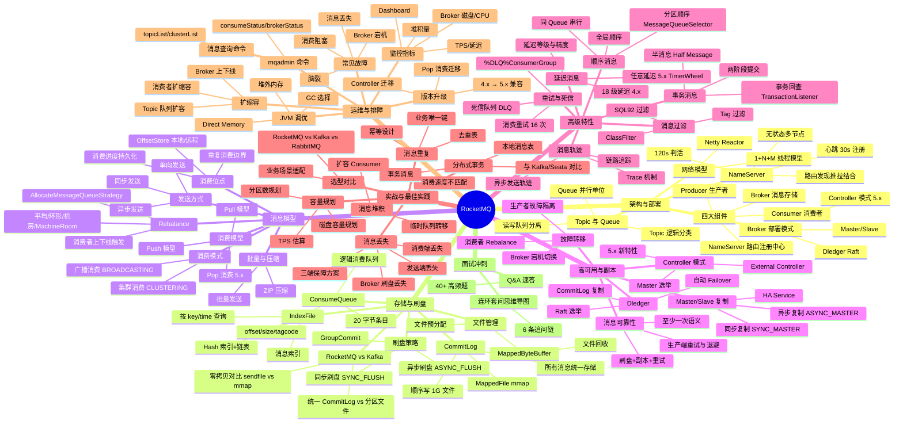

# RocketMQ 面试知识体系设计文档

> **创建日期**：2026-08-12
> **模块路径**：`middleware/rocketmq/`
> **定位**：面向 Java 后端高级/资深面试（5 年+）的 RocketMQ 知识体系，与 `middleware/mysql`、`middleware/redis` 模块完全对齐

---

## 一、模块整体结构

### 目录组织

```
middleware/rocketmq/
├── README.md                                    # 入口索引（知识图谱 mindmap + 导航表 + 学习路径 + 模块关联）
├── 01-architecture/
│   └── architecture-and-topology.md             # 架构与部署拓扑
├── 02-storage/
│   └── storage-and-flush.md                     # 存储与刷盘机制
├── 03-message/
│   └── message-model.md                         # 消息模型与发送消费
├── 04-ha/
│   └── ha-and-replication.md                    # 高可用与副本同步
├── 05-feature/
│   └── advanced-feature.md                      # 高级特性（事务/顺序/延迟/重试/死信）
├── 06-practice/
│   └── practice-and-best-practice.md            # 实战与最佳实践
├── 07-ops/
│   └── ops-and-troubleshooting.md               # 运维与排障
└── 08-interview-qa.md                           # 跨主题高频面试 Q&A
```

### 文件命名约定

- 主题文件采用 `kebab-case`，与 MySQL 的 `index-and-optimization.md`、Redis 的 `data-structure-and-encoding.md` 风格一致
- 文件名即主题全称（如 `advanced-feature.md`），不缩写

### 与 MySQL / Redis 的结构对齐

| 维度 | MySQL | Redis | RocketMQ |
|------|-------|-------|----------|
| 主题目录数 | 7 | 7 | 7 |
| Q&A 文件 | 1 份（08-interview-qa.md） | 1 份（08-interview-qa.md） | 1 份（08-interview-qa.md） |
| 入口 README | 含 mindmap + 导航表 + 学习路径 + 模块关联 | 完全对齐 | 完全对齐 |
| 每份主题文档 | 五段式 + 顶部 `> 返回` 链接 | 完全对齐 | 完全对齐 |
| 版本基线 | MySQL 8.0 | Redis 7.x | RocketMQ 5.x |

### 与上层 README 的衔接

`middleware/README.md` 第 5 行 `- rocketmq` 将更新为：

```
- [rocketmq](./rocketmq) — RocketMQ 面试知识体系（9 份文档，面向 5 年+ 资深面试）
```

与 MySQL、Redis 行格式完全一致。

---

## 二、知识图谱 mindmap

这是 `README.md` 中的核心导航图，采用 mermaid mindmap（与 MySQL、Redis 的 `mindmap` 语法完全一致），覆盖 7 主题 + 面试冲刺：



### 设计要点

1. **根节点**：`root((RocketMQ))`，与 MySQL 的 `root((MySQL))`、Redis 的 `root((Redis))` 对齐
2. **一级节点**：8 个（7 主题 + 面试冲刺），与导航表一一对应
3. **二级节点**：每个主题的核心子领域（如"架构与部署"下 5 个子领域）
4. **三级节点**：关键考点/关键词（如"NameServer 无状态多节点"、"Controller 模式 5.x"），用于面试检索
5. **深度对标 MySQL/Redis**：同为三级 mindmap，末尾为"面试冲刺 → Q&A 速答 → 40+ 高频题 + 连环套问"

### 与 MySQL / Redis mindmap 的结构对照

| 一级节点 | MySQL | Redis | RocketMQ |
|---------|-------|-------|----------|
| 1 | 索引原理 | 数据结构与对象 | 架构与部署 |
| 2 | 事务与 MVCC | 持久化机制 | 存储与刷盘 |
| 3 | 锁机制 | 内存管理与淘汰 | 消息模型 |
| 4 | 查询优化 | 事件与并发模型 | 高可用与副本 |
| 5 | 存储引擎 | 复制与集群 | 高级特性 |
| 6 | 日志体系 | 缓存实战与分布式锁 | 实战与最佳实践 |
| 7 | 架构与高可用 | 高可用与运维 | 运维与排障 |
| 8 | 面试冲刺 | 面试冲刺 | 面试冲刺 |

> 注：主题顺序遵循 RocketMQ 自身的知识递进——先架构（整体认识）→ 存储（底层落盘）→ 消息模型（发送消费）→ 高可用（副本同步）→ 高级特性（事务/顺序/延迟）→ 实战（工程落地）→ 运维（排障）。

---

## 三、导航表

| 分层 | 文档 | 核心考点 |
|------|------|---------|
| 架构与部署 | [架构与部署拓扑](./01-architecture/architecture-and-topology.md) ✅ | NameServer 无状态/Broker 角色演进/Topic×Queue 模型/Netty Reactor 线程模型 |
| 存储与刷盘 | [存储与刷盘机制](./02-storage/storage-and-flush.md) ✅ | CommitLog 统一存储/ConsumeQueue 索引/IndexFile/mmap 零拷贝/同步异步刷盘 |
| 消息模型 | [消息模型与发送消费](./03-message/message-model.md) ✅ | 同步/异步/单向发送/Push·Pull·Pop 消费/集群·广播/Rebalance 策略/消费位点 |
| 高可用与副本 | [高可用与副本同步](./04-ha/ha-and-replication.md) ✅ | Master/Slave 同步异步复制/Dledger Raft/Controller 模式/Failover/消息可靠性保障 |
| 高级特性 | [高级特性](./05-feature/advanced-feature.md) ✅ | 事务消息半消息+回查/顺序消息/延迟消息 18 级+任意延迟/重试死信/Tag·SQL92 过滤/消息轨迹 |
| 实战与最佳实践 | [实战与最佳实践](./06-practice/practice-and-best-practice.md) ✅ | 消息堆积/丢失/重复 三大顽疾/分布式事务方案/幂等设计/容量规划/RocketMQ vs Kafka 选型 |
| 运维与排障 | [运维与排障](./07-ops/ops-and-troubleshooting.md) ✅ | mqadmin 命令/监控指标/常见故障/扩缩容/版本升级/JVM 调优 |
| 面试冲刺 | [Q&A 速答](./08-interview-qa.md) ✅ | 40+ 题速答 + 连环套问思维导图 |

> 共 **9 份**文档：入口 README（本文档）+ 上表 8 份主题/Q&A 文档。

### 设计要点

1. **表头/列名/格式**：与 MySQL、Redis 导航表完全一致（分层 | 文档 | 核心考点）
2. **文档链接**：相对路径，指向各主题目录下的 `.md`
3. **核心考点列**：每个文档 5-7 个关键词，用 `/` 分隔，对应 mindmap 的三级节点
4. **文档计数说明**：底部标注"9 份"，与 MySQL、Redis 完全对齐

---

## 四、推荐学习路径

### 路线一：系统学习（适合有 1-2 周准备期）

按 RocketMQ 知识层次自顶向下，先建立整体架构认识，再深入存储底层、消息流转、高可用，最后到高级特性与实战：

```
01 架构与部署 → 02 存储与刷盘 → 03 消息模型 → 04 高可用 → 05 高级特性 → 06 实战 → 07 运维 → 08 Q&A
```

**特点**：先见森林后见树木，符合「架构总览 → 存储底层 → 消息流转 → 高可用保障 → 高级特性 → 工程实战 → 运维排障」的认知递进。架构是入口，存储决定性能上限，消息模型决定使用方式，高可用决定可靠性，高级特性是 RocketMQ 的差异化竞争力，实战/运维是工程落地。

### 路线二：面试冲刺（高频优先，适合 3-5 天突击）

按面试热度排序，先啃必考点，再补体系：

1. 01 架构与部署 → 05 高级特性（事务/顺序/延迟消息）
2. 02 存储与刷盘 → 04 高可用
3. 03 消息模型 → 06 实战与最佳实践
4. 07 运维 → 08 Q&A（40+ 题，含连环套问思维导图）

**特点**：投入产出比最高，覆盖 80% 高频考点。RocketMQ 面试起手三连问是「架构组件与 NameServer → 事务消息 → 消息可靠性（不丢/不重/堆积）」，先把这三块拿下再补存储与高可用。

> 两套路线殊途同归，最终都应回到 [Q&A 速答](./08-interview-qa.md) 做闭环检验。

---

## 五、与 java-core / framework 模块的关联

本模块虽为中间件文档，但与仓库内 Java 模块存在直接关联，便于在面试中结合源码与实战作答：

| RocketMQ 知识点 | 关联 Java 模块 | 关联要点 |
|-----------------|---------------|---------|
| 01 架构 / Netty Reactor | `java-core/lambda` | Broker 的 Netty Reactor 与 Stream 异步编程的对照 |
| 01 架构 / Broker 线程模型 | `java-core/jvm` | 1+N+M 线程模型与 JVM 线程调度 |
| 02 存储 / mmap 零拷贝 | `java-core/jvm` | MappedByteBuffer 与 JVM 堆外内存、DirectByteBuffer 对照 |
| 02 存储 / PageCache | `java-core/jvm` | PageCache 与 JVM GC 的协调、堆外内存预算 |
| 03 消息 / 异步发送 | `java-core/lambda` | Producer 异步回调 CompletableFuture 与 Stream 批处理 |
| 03 消息 / 批量发送 | `java-core/stream` | 批量发送与 Stream 批处理的对比 |
| 04 高可用 / 副本同步 | `java-core/jvm` | HA Service 的线程模型与 JVM 多线程并发 |
| 05 事务消息 / 两阶段 | `framework/spring-framework` | 事务消息与 `@Transactional` 的分布式事务边界 |
| 06 实战 / Spring 集成 | `framework/spring-framework` | `@RocketMQMessageListener`、RocketMQTemplate 集成 |
| 06 实战 / 序列化 | `framework/jackson` | 消息体序列化与 Jackson 自定义序列化 |
| 06 实战 / 参数校验 | `framework/valid` | 消息消费幂等与参数校验互补 |
| 06 实战 / 分布式事务 | `framework/spring-framework` | 本地消息表 + Seata + 事务消息的对比 |

**延伸阅读**：

- `java-core/jvm` —— 对照理解 MappedByteBuffer 堆外内存、PageCache 与 GC 协调、线程模型
- `framework/spring-framework` —— RocketMQ Spring 集成、`@Transactional` 与事务消息边界
- `framework/jackson` —— 消息体序列化器与 Jackson 自定义序列化对接

> 建议在阅读存储与刷盘、事务消息与实战文档时，对照 `java-core`/`framework` 模块源码，加深「面试八股 → 工程实战」双向映射。

---

## 六、与 ops 模块的交叉引用

本模块部分原理推导链与 `ops` 运维文档存在对照关系，RocketMQ 章只讲"RocketMQ 场景下的实现与选择"，原理推导回对应模块：

| RocketMQ 文档 | 跳转目标 | 对照要点 |
|---------------|---------|---------|
| 02 存储与刷盘 | `ops/linux/04-io/io-model-and-epoll.md` | mmap 零拷贝与 IO 模型、Netty Reactor 与 epoll |
| 02 存储与刷盘 | `ops/linux/03-memory/memory-management.md` | PageCache 与 Linux 内存管理、MappedByteBuffer |
| 02 存储与刷盘 | `ops/linux/05-fs/filesystem-and-vfs.md` | CommitLog 顺序写与文件系统、fsync 崩溃一致性 |
| 04 高可用 | `ops/linux/06-network/tcp-and-conntrack.md` | Broker 长连接、TCP keepalive、HA 复制连接 |
| 04 高可用 | `ops/docker/` | Dledger/Controller 容器化部署、Broker 编排 |
| 07 运维 | `ops/linux/01-process/process-and-thread.md` | Broker 进程线程模型 vs Linux 进程线程 |
| 07 运维 | `ops/linux/03-memory/memory-management.md` | 堆外内存与 Direct Memory 监控 |
| 07 运维 | `ops/k8s/` | RocketMQ on K8s 部署、Operator |

### 与 middleware 内其他模块的交叉引用

| RocketMQ 文档 | 跳转目标 | 对照要点 |
|---------------|---------|---------|
| 04 高可用 / 副本同步 | `middleware/mysql/07-architecture/ha-and-sharding.md` | RocketMQ 主从复制 vs MySQL 主从复制 |
| 05 事务消息 / 两阶段 | `middleware/mysql/06-log/log-system.md` | 事务消息两阶段 vs MySQL 两阶段提交 |
| 06 实战 / 分布式事务 | `middleware/redis/06-cache-practice/cache-and-distributed-lock.md` | 本地消息表与 Redis 分布式锁互补 |
| 06 实战 / 幂等 | `middleware/redis/06-cache-practice/cache-and-distributed-lock.md` | 消费幂等用 Redis SETNX 去重 |

> 处理原则：RocketMQ 章只讲"RocketMQ 场景下的实现与选择"，原理推导链回对应模块，不重复展开。

---

## 七、每份主题文档的五段式内容大纲

### 文档 1：`01-architecture/architecture-and-topology.md`

> **一句话定位**：RocketMQ 架构是面试起手题，"讲讲 RocketMQ 整体架构与 NameServer 为什么不用 ZooKeeper"几乎每场必问，能讲到 Netty Reactor 线程模型与 Controller 模式才算合格。
> **面试热度**：⭐⭐⭐⭐⭐

**一、概念定义**
- 1.1 RocketMQ 四大组件（NameServer/Broker/Producer/Consumer，职责划分与协作关系）
- 1.2 NameServer vs ZooKeeper（为什么 RocketMQ 弃用 ZK——CP 强一致太重，NameServer AP 无状态更轻，各自维护路由表最终一致）
- 1.3 Broker 角色演进（Master/Slave → Dledger → Controller 模式 5.x，三种部署模式的对比）
- 1.4 Topic 与 MessageQueue（Topic 是逻辑分类、Queue 是并行单位、读写队列分离 `permTopic` 的 readQueueNums/writeQueueNums）

**二、原理与流程**
- 2.1 NameServer 路由管理（Broker 每 30s 心跳注册、NameServer 120s 未收到心跳判定下线、路由表 `RouteInfoManager` 的 `topicQueueTable`/`brokerAddrTable`/`clusterAddrTable`/`liveBrokerTable` 四张表）
- 2.2 Producer 路由发现（启动时拉取、定时 30s 更新、发送时根据 Queue 选择策略、故障隔离 `sendLatencyFaultEnable`）
- 2.3 Consumer 路由发现（启动拉取、定时更新、Rebalance 触发）
- 2.4 Broker 网络模型（Netty Reactor 主从、1 个 Acceptor + N 个 IO 线程 + M 个 Worker 线程、`RemotingProcessor` 业务线程）
- 2.5 Topic 创建流程（自动创建 `autoCreateTopicEnable`、手动 `mqadmin updateTopic`、Topic 配置元数据持久化）
- 2.6 源码路径（`namesrv/RouteInfoManager`、`broker.BrokerController`、`remoting.NettyRemotingServer`）

**三、高频追问**
- RocketMQ 有哪些组件？（四大组件）
- NameServer 为什么不用 ZooKeeper？（AP vs CP，无状态更轻）
- Broker 宕机怎么办？（Master/Slave/Dledger/Controller 四种模式）
- NameServer 之间互不通信怎么保证一致性？（最终一致，Broker 向所有 NS 心跳）
- Topic 和 Queue 的关系？（Topic 逻辑分类，Queue 并行单位）
- 读写队列分离是什么？（readQueueNums/writeQueueNums，扩缩容平滑过渡）

**四、实战关联**
- Java 场景：Spring Boot + RocketMQ Starter 的 Producer/Consumer 配置
- Broker 集群部署（2 Master 2 Slave 起步、按机房分布）
- 与 Kafka 架构对比（NameServer vs ZK、Broker 模型差异）

**五、系统设计案例**
- 设计一个支撑 10 万 TPS 的订单消息集群（3 Master 3 Slave、Topic 按业务拆分、Queue 数 16/32、Producer 故障隔离）
- 设计一个多机房 RocketMQ 部署方案（同城双活、Broker 机房亲和性、Producer 优先本机房）

---

### 文档 2：`02-storage/storage-and-flush.md`

> **一句话定位**：存储是 RocketMQ 性能与可靠性的根基，"CommitLog 为什么统一存储、ConsumeQueue 是什么"是中高级面试分水岭。
> **面试热度**：⭐⭐⭐⭐⭐

**一、概念定义**
- 1.1 RocketMQ 存储设计哲学（CommitLog 统一存储 vs Kafka 分区独立文件，顺序写性能极致、ConsumeQueue 索引解耦存储与消费）
- 1.2 三类文件职责（CommitLog 消息主体、ConsumeQueue 逻辑消费队列、IndexFile 消息索引）
- 1.3 刷盘策略（同步刷盘 SYNC_FLUSH vs 异步刷盘 ASYNC_FLUSH，性能与可靠性权衡）
- 1.4 零拷贝对比（RocketMQ 用 mmap、Kafka 用 sendfile，为什么 RocketMQ 不用 sendfile——消费者按 offset 随机读+ConsumeQueue 索引访问）

**二、原理与流程**
- 2.1 CommitLog 结构（每个文件固定 1GB、文件名即起始 offset、消息顺序追加写、`MappedFile` 封装 `MappedByteBuffer`）
- 2.2 ConsumeQueue 结构（每个 Topic×Queue 对应一个 ConsumeQueue、每条 20 字节：8 字节 offset + 4 字节 size + 8 字节 tagcode、固定 30 万条/文件约 5.7MB）
- 2.3 IndexFile 结构（Hash 索引、500 万 slot + 2000 万 index、按 msgKey 或时间区间查询、链表解决冲突）
- 2.4 消息写入全流程（Producer 发送 → Broker `SendMessageProcessor` → 写 CommitLog（mmap）→ 异步构建 ConsumeQueue/IndexFile（ReputMessageService）→ 刷盘）
- 2.5 同步刷盘流程（`GroupCommitService` 等待 flush 完成、`GroupCommitRequest`、双 Buffer 交替、性能损耗约 10x）
- 2.6 异步刷盘流程（`FlushRealTimeService` 定时 flush、默认 500ms 间隔、`flushPhysicQueueThoroughInterval` 全量刷）
- 2.7 文件预分配与回收（`AllocateMappedFileService` 预分配下一个文件、`MappedFile` 的 `mmap` 映射、过期文件清理 `CleanCommitLogService`）
- 2.8 源码路径（`store.CommitLog`、`store.ConsumeQueue`、`store.IndexService`、`store.MappedFile`）

**三、高频追问**
- RocketMQ 存储和 Kafka 有什么区别？（统一 CommitLog vs 分区文件）
- ConsumeQueue 是什么？（逻辑消费队列，20 字节条目）
- 为什么 RocketMQ 用 mmap 不用 sendfile？（消费者按 offset 随机读）
- 同步刷盘和异步刷盘怎么选？（金融级同步、普通业务异步）
- CommitLog 文件多大？（1GB 固定大小）
- IndexFile 怎么按 key 查消息？（Hash 索引 + 链表）

**四、实战关联**
- Java 场景：Producer 发送消息的 `SendResult` 与 `flushDiskType` 配置
- 磁盘选型（SSD vs HDD、CommitLog 顺序写 HDD 也能扛、但 IndexFile 随机读建议 SSD）
- 与 MySQL InnoDB 存储对比（CommitLog 顺序写 vs InnoDB 随机写、Redo Log WAL 思想一致）

**五、系统设计案例**
- 设计一个支撑亿级消息的存储方案（CommitLog 分磁盘、ConsumeQueue 内存映射、异步刷盘+副本保障可靠性）
- 设计一个按 msgId 精确查询消息的方案（IndexFile Hash 索引、未命中时全量扫描 CommitLog 兜底）

---

### 文档 3：`03-message/message-model.md`

> **一句话定位**：消息模型是 RocketMQ 工程化使用的核心，"Push 和 Pull 的区别、Rebalance 怎么做、消费位点怎么管"是中高级面试必问。
> **面试热度**：⭐⭐⭐⭐⭐

**一、概念定义**
- 1.1 发送方式（同步/异步/单向，可靠性 vs 吞吐 vs 延迟的权衡）
- 1.2 消费模型（Push 模型 `DefaultMQPushConsumer`、Pull 模型 `DefaultMQPullConsumer`、5.x Pop 消费 `DefaultLitePullConsumer`）
- 1.3 消费模式（集群 CLUSTERING 每条消息一个消费者、广播 BROADCASTING 所有消费者都消费）
- 1.4 Rebalance（消费者上下线、Queue 数变化触发、`AllocateMessageQueueStrategy` 策略）
- 1.5 消费位点（OffsetStore 本地/远程、消费进度持久化、重启后从哪消费）

**二、原理与流程**
- 2.1 同步发送（`producer.send(msg)` 阻塞等待 `SendResult`、内部 Netty 异步+CountDownLatch 等待、`retryTimesWhenSendFailed` 重试）
- 2.2 异步发送（`producer.send(msg, callback)` 非阻塞、`NettyRemotingAbstract` 的 ResponseFuture 回调、适用高吞吐场景）
- 2.3 单向发送（`producer.sendOneway(msg)` 不等响应、日志收集等允许丢失场景）
- 2.4 Push 消费模型（`DefaultMQPushConsumer` 封装 Pull、`PullMessageService` 线程拉取、`ConsumeMessageConcurrentlyService` 并发消费、`pullBatchSize` 控制批量）
- 2.5 Pull 消费模型（`DefaultMQPullConsumer` 手动 `pull`、需自行管理 offset、5.x 推荐 `DefaultLitePullConsumer` 主动订阅+自动分配）
- 2.6 Pop 消费 5.x（`DefaultLitePullConsumer` 的 Pop 模式、Broker 端临时弹出消息、避免 Rebalance 堆积、解决长轮询死锁问题）
- 2.7 Rebalance 策略（`AllocateMessageQueueAveragely` 平均分配默认、`AllocateMessageQueueAveragelyByCircle` 环形、`AllocateMessageQueueByMachineRoom` 机房、触发时机 `RebalanceService` 每 20s 检查）
- 2.8 消费位点管理（`RemoteBrokerOffsetStore` 集群模式持久化到 Broker、`LocalFileOffsetStore` 广播模式持久化本地、`CONSUME_FROM_LAST_OFFSET`/`CONSUME_FROM_FIRST_OFFSET`/`CONSUME_FROM_TIMESTAMP` 启动策略）
- 2.9 批量发送与压缩（`MessageBatch` 批量、`ZIP` 压缩 `compressMsgBodyOverHowmuch` 默认 4096）
- 2.10 源码路径（`client.impl.producer.DefaultMQProducerImpl`、`client.impl.consumer.DefaultMQPushConsumerImpl`、`client.impl.consumer.RebalanceImpl`）

**三、高频追问**
- Push 和 Pull 有什么区别？（Push 封装 Pull，对用户透明）
- Push 是真的推送吗？（不是，长轮询模拟推送）
- Rebalance 怎么做？（平均分配默认，消费者上下线触发）
- 消费位点怎么存？（集群存 Broker，广播存本地）
- 消费者重启从哪开始消费？（按 `consumeFromWhere` 配置）
- Pop 消费是什么？（5.x Broker 端弹出消息，避免 Rebalance 堆积）
- 批量发送怎么用？（`MessageBatch`，注意同 Topic 同 Tag）

**四、实战关联**
- Java 场景：Spring Boot `@RocketMQMessageListener` 的 `consumeMode`/`messageModel` 配置
- 消费者并发度调优（`consumeThreadMin/Max`、`pullBatchSize`）
- 与 Kafka 消费模型对比（Kafka 消费者组 partition 分配 vs RocketMQ Queue 分配）

**五、系统设计案例**
- 设计一个高吞吐的消费方案（Pop 消费 + 批量拉取 + 多线程并发 + 异步落库）
- 设计一个消费优雅上下线方案（Pause 消费 + Rebalance 通知 + 优雅停机 `@PreDestroy`）

---

### 文档 4：`04-ha/ha-and-replication.md`

> **一句话定位**：高可用是消息中间件的命脉，"Broker 宕机消息会不会丢、Dledger/Controller 怎么选"是资深面试分水岭。
> **面试热度**：⭐⭐⭐⭐⭐

**一、概念定义**
- 1.1 RocketMQ 高可用演进（Master/Slave 异步 → 同步双写 → Dledger Raft → Controller 模式 5.x）
- 1.2 同步复制 vs 异步复制（SYNC_MASTER 等待 Slave 确认、ASYNC_MASTER 不等待、性能与可靠性权衡）
- 1.3 自动 Failover 的必要性（Master/Slave 模式 Slave 不自动切换需人工介入、Dledger/Controller 解决自动切换）
- 1.4 消息可靠性三端保障（生产端重试、Broker 刷盘+副本、消费端幂等）

**二、原理与流程**
- 2.1 Master/Slave 复制（`HAService` 的 `HAConnection`、Slave 主动连接 Master、Master 推送 CommitLog 增量、`HAClient` 上报 offset、同步复制等待 Slave ACK）
- 2.2 同步双写流程（`GroupTransferService` 等待 Slave ACK、`waitNotify` 机制、`SyncStateSet` 判断多数副本）
- 2.3 Dledger 模式（Raft 选举 Leader、`DLedgerCommitLog` 替换原 CommitLog、日志复制半数确认、自动 Failover、依赖 DLedger 组件）
- 2.4 Controller 模式 5.x（External Controller 独立部署、Broker 向 Controller 注册、Master 选举由 Controller 决策、兼容原 Master/Slave 复制、无需 DLedger 日志复制开销）
- 2.5 三种模式对比表（Master/Slave 手动切换 / Dledger 自动但侵入存储 / Controller 自动且兼容原存储）
- 2.6 故障转移全流程（Broker 宕机 → Controller/Dledger 选举新 Master → NameServer 路由更新 → Producer/Consumer 感知 → Rebalance）
- 2.7 消息可靠性保障（生产端 `retryTimesWhenSendFailed` + 退避、Broker 同步刷盘+同步复制、消费端至少一次+幂等）
- 2.8 源码路径（`store.ha.HAService`、`store.ha.WaitNotifyObject`、`dledger.DLedgerLeaderElector`、`controller.BrokerHeartbeatManager`）

**三、高频追问**
- Broker 宕机消息会丢吗？（看刷盘+复制策略，同步刷盘+同步复制不丢）
- Master/Slave 怎么切换？（手动或 Dledger/Controller 自动）
- Dledger 是什么？（Raft 选举+日志复制）
- Controller 模式有什么优势？（自动切换+兼容原存储，5.x 推荐）
- 同步复制和异步复制怎么选？（金融同步、普通异步）
- 消息怎么保证不丢？（三端保障：生产重试+Broker 刷盘副本+消费幂等）
- Dledger 和 Controller 怎么选？（5.x 优先 Controller，4.x 用 Dledger）

**四、实战关联**
- Java 场景：Producer 的 `retryTimesWhenSendFailed` 与 `sendMsgTimeout` 配置
- 生产部署（2 Master 2 Slave + Controller、按机房分布、同步双写）
- 与 MySQL 高可用对比（MHA/Orchestrator/MGR vs Dledger/Controller，主从复制思想一致）

**五、系统设计案例**
- 设计一个金融级消息可靠性方案（同步刷盘+同步复制+Controller 自动切换+生产端重试+消费幂等，SLA 99.99%）
- 设计一个异地多活的消息集群（三地五副本 Controller、跨机房复制延迟优化、Producer 机房亲和）

---

### 文档 5：`05-feature/advanced-feature.md`

> **一句话定位**：高级特性是 RocketMQ 的差异化竞争力，"事务消息、顺序消息、延迟消息"是中高级面试必问，能讲到半消息回查与 5.x 任意延迟才算合格。
> **面试热度**：⭐⭐⭐⭐⭐

**一、概念定义**
- 1.1 事务消息（RocketMQ 独有的两阶段事务，与 Kafka 事务消息的区别——Kafka 是生产端事务、RocketMQ 是生产+消费端事务）
- 1.2 顺序消息（全局顺序 vs 分区顺序，`MessageQueueSelector` 保证同 Queue 串行）
- 1.3 延迟消息（4.x 固定 18 级延迟、5.x `TimerWheel` 支持任意延迟）
- 1.4 重试与死信（消费失败自动重试 16 次、超过进入 `%DLQ%ConsumerGroup`）
- 1.5 消息过滤（Tag 过滤、SQL92 过滤、ClassFilter 服务端过滤）
- 1.6 消息轨迹（Trace 机制、异步发送轨迹、链路追踪）

**二、原理与流程**
- 2.1 事务消息两阶段（Producer `sendMessageInTransaction` → Broker 写半消息 `Half Message` 到 `RMQ_SYS_TRANS_HALF_TOPIC` → 执行本地事务 `executeLocalTransaction` → 提交 `commit` 写 `Op` 队列或回滚 `rollback` → 回查 `checkLocalTransaction` Broker 定时扫描未确认半消息）
- 2.2 事务消息回查机制（`TransactionServicesManager` 定时扫描半消息、回查 Producer `checkLocalTransaction`、超时 `transactionTimeout` 默认 6s 回查、最多回查 15 次）
- 2.3 顺序消息（Producer `MessageQueueSelector` 按 `hash(businessKey) % queueSize` 选 Queue、Consumer `MessageListenerOrderly` 串行消费同 Queue、`ConsumeMessageOrderlyService` 的 `ProcessQueue` 加锁）
- 2.4 全局顺序 vs 分区顺序（全局顺序单 Queue 牺牲并行、分区顺序多 Queue 同 key 顺序、生产推荐分区顺序）
- 2.5 延迟消息 4.x（固定 18 级 `1s/5s/10s/30s/1m/2m/3m/4m/5m/6m/7m/8m/9m/10m/20m/30m/1h/2h`、Broker 替换 `SCHEDULE_TOPIC_XXXX`、`ScheduleMessageService` 定时投递）
- 2.6 延迟消息 5.x（`TimerWheel` 时间轮、任意延迟精度毫秒级、`Topic` 与 `MessageDelayLevel` 兼容、`TimerMessageStore` 投递）
- 2.7 重试与死信（`%RETRY%ConsumerGroup` 重试队列、16 次递增延迟 `[10s 30s 1m 2m ... 2h]`、超过进入 `%DLQ%ConsumerGroup` 死信、人工干预 `mqadmin`）
- 2.8 Tag 与 SQL92 过滤（Tag 过滤 Broker 端按 tagcode 位运算、SQL92 过滤 `MessageSelector.bySql`、ClassFilter 服务端 FilterServer 执行用户代码）
- 2.9 消息轨迹（`TraceDispatcher` 异步发送到 `RMQ_SYS_TRACE_TOPIC`、含 Producer/Consumer/Broker 三端轨迹、`traceOn` 开关）
- 2.10 源码路径（`client.transaction.MQTransactionListener`、`broker.transaction.queue.TransactionalMessageService`、`store.schedule.ScheduleMessageService`、`store.timer.TimerMessageStore`）

**三、高频追问**
- 事务消息怎么实现？（半消息+本地事务+回查）
- 事务消息回查失败怎么办？（15 次后回滚）
- 顺序消息怎么保证顺序？（同 key 同 Queue 串行）
- 全局顺序和分区顺序区别？（单 Queue vs 多 Queue 同 key）
- 延迟消息 4.x 和 5.x 区别？（18 级 vs 任意延迟）
- 消费失败重试多少次？（16 次，递增延迟）
- 死信队列怎么处理？（`%DLQ%` 人工排查或自动告警）
- Tag 和 SQL92 过滤区别？（位运算 vs 表达式）

**四、实战关联**
- Java 场景：`@RocketMQTransactionListener` 注解、`MessageSelector.byTag`/`bySql`
- 事务消息与 Spring `@Transactional` 的配合（本地事务+消息事务的边界协调）
- 延迟消息实现订单超时关闭（延迟 30 分钟触发关单）
- 与 Kafka 事务消息对比（Kafka 生产端事务 vs RocketMQ 生产+消费端事务）

**五、系统设计案例**
- 设计一个分布式事务方案（事务消息+本地事务+幂等消费，订单+扣库存+扣余额）
- 设计一个订单超时关闭系统（延迟消息 5.x 任意延迟、千万级延迟消息存储方案）

---

### 文档 6：`06-practice/practice-and-best-practice.md`

> **一句话定位**：实战是区分"背八股"与"有经验"的分水岭，"消息怎么不丢、不重、堆积怎么办"是资深面试必问。
> **面试热度**：⭐⭐⭐⭐⭐

**一、概念定义**
- 1.1 消息三大顽疾（丢失、重复、堆积，各自成因与发生阶段）
- 1.2 幂等设计（消费幂等的必要性——至少一次语义下重复不可避免）
- 1.3 分布式事务方案对比（本地消息表、事务消息、Seata TCC/SAGA，适用场景与权衡）
- 1.4 容量规划（TPS、磁盘、分区数、消费者数的估算方法）
- 1.5 RocketMQ vs Kafka vs RabbitMQ（吞吐、延迟、特性、生态对比）

**二、原理与流程**
- 2.1 消息丢失三端分析与保障（生产端——同步发送+重试+`send` 返回 `SEND_OK`、Broker——同步刷盘+同步复制、消费端——手动 ACK `return CONSUME_SUCCESS` 才更新 offset）
- 2.2 消息重复成因与幂等（网络重试导致重复、消费端崩溃 offset 未提交、幂等方案——唯一键+Redis SETNX/DB 唯一索引/状态机判断）
- 2.3 消息堆积成因与处理（消费速度 < 生产速度、扩容 Consumer 受 Queue 数限制、`Queue 数 ≥ Consumer 数`、临时方案——消费者转储到新 Topic 扩容 Queue）
- 2.4 分布式事务方案详解（本地消息表——DB+MQ 一致性、事务消息——半消息+回查、Seata——AT/TCC/SAGA，三者权衡）
- 2.5 顺序消费的工程挑战（Consumer 扩缩容触发 Rebalance 导致乱序、`MessageQueueSelector` 选 Queue、消费失败阻塞同 Queue）
- 2.6 容量规划方法（TPS = 消息量/时间、磁盘 = TPS × 平均大小 × 保留天数 × 副本数、Queue 数 = 目标 TPS / 单 Queue TPS、Consumer 数 ≤ Queue 数）
- 2.7 RocketMQ vs Kafka vs RabbitMQ 对比（吞吐：RocketMQ 10 万级/Kafka 百万级/RabbitMQ 万级；特性：RocketMQ 事务/延迟/顺序最全；生态：Kafka 大数据、RabbitMQ AMQP、RocketMQ 金融业务）
- 2.8 Spring Boot 集成实战（`rocketmq-spring-boot-starter`、`@RocketMQMessageListener`、`RocketMQTemplate`、序列化配置）

**三、高频追问**
- 消息怎么保证不丢？（三端保障：生产同步+Broker 刷盘复制+消费手动 ACK）
- 消息重复怎么办？（幂等：唯一键+去重表）
- 消息堆积怎么处理？（扩 Consumer、转储新 Topic、降级）
- 消费者数能超过 Queue 数吗？（不能，多余消费者闲置）
- 分布式事务用什么方案？（事务消息或本地消息表，权衡）
- RocketMQ 和 Kafka 怎么选？（金融/事务选 RocketMQ，大数据选 Kafka）
- 顺序消费怎么扩容？（不能直接扩 Consumer，需先扩 Queue）

**四、实战关联**
- Java 场景：Spring Boot + RocketMQ Starter 的完整生产配置模板
- 幂等消费方案（Redis SETNX + 业务唯一键 + 状态机）
- 与 `framework/spring-framework` 的 `@Transactional` 协调（本地事务+消息发送的顺序）
- 与 `framework/jackson` 的消息序列化（JSON + 自定义序列化器）
- 与 `framework/valid` 的消息参数校验（消费前校验）

**五、系统设计案例**
- 设计一个电商订单全链路消息方案（下单→扣库存→扣余额→发券，事务消息+幂等消费+顺序消息）
- 设计一个千万级 TPS 的日志采集系统（RocketMQ vs Kafka 选型、批量发送+压缩+异步消费+ES 落库）

---

### 文档 7：`07-ops/ops-and-troubleshooting.md`

> **一句话定位**：运维排障是资深面试的加分项，"Broker 宕机怎么排查、消息堆积怎么定位"区分是否有生产经验。
> **面试热度**：⭐⭐⭐⭐

**一、概念定义**
- 1.1 RocketMQ 运维核心目标（可用性、消息可靠性、性能、容量可控）
- 1.2 mqadmin 工具（RocketMQ 自带的命令行管理工具，与 Redis `redis-cli`、MySQL `mysql` 对齐）
- 1.3 监控体系（Dashboard + Prometheus + Grafana，核心指标分类）
- 1.4 常见故障分类（消费阻塞、Broker 宕机、消息丢失、脑裂、Rebalance 风暴）

**二、原理与流程**
- 2.1 mqadmin 核心命令（`topicList`/`clusterList`/`brokerStatus`/`topicStats`/`consumeStatus`/`queryMsgById`/`queryMsgByKey`/`resetOffsetByTime`）
- 2.2 监控指标体系（Broker——TPS/延迟/磁盘/CPU/堆外内存、Topic——QPS/堆积量、Consumer——消费 TPS/延迟/堆积、Producer——发送 TPS/失败率）
- 2.3 消费阻塞排查（`consumeStatus` 看堆积、`stack` 看消费线程、定位慢消费——业务 DB 慢查询或外部依赖超时、扩容 Consumer 或降级）
- 2.4 Broker 宕机处理（确认主备切换、检查 Controller/Dledger 状态、`clusterList` 看节点、消息补偿）
- 2.5 消息丢失排查（Producer 发送日志 `SEND_OK`、Broker `queryMsgById` 确认、消费端 offset 提交日志、定位丢失环节）
- 2.6 Rebalance 风暴（消费者频繁上下线、`rebalanceInterval` 调整、稳定部署避免抖动）
- 2.7 扩缩容（Broker 上线——加入集群注册 NS、Topic 队列扩容——`updateTopic` 增加 Queue、消费者扩缩容——注意 Queue 数限制）
- 2.8 版本升级 4.x → 5.x（Controller 迁移、Pop 消费迁移、API 兼容性、灰度方案）
- 2.9 JVM 调优（堆外内存 `Direct Memory`、GC 选择 G1、`-XX:MaxDirectMemorySize`、`transientStorePoolEnable` 堆外内存池）

**三、高频追问**
- 怎么查消息堆积？（`consumeStatus` 或 Dashboard）
- 消息堆积怎么处理？（扩 Consumer、降级、转储）
- Broker 宕机怎么排查？（`clusterList` + 日志 + Controller 状态）
- 消息丢了怎么定位？（三端日志逐环节排查）
- 怎么重置消费位点？（`resetOffsetByTime` 按 timestamp）
- Broker JVM 怎么调优？（G1 + 堆外内存 + `transientStorePoolEnable`）
- 4.x 升 5.x 注意什么？（Controller 迁移、Pop 消费、API 兼容）

**四、实战关联**
- Java 场景：Spring Boot Actuator + Micrometer 集成 RocketMQ 监控
- RocketMQ Dashboard 部署与告警配置
- 与 `ops/docker`、`ops/k8s` 的容器化部署、Prometheus + Grafana 监控集成
- 与 `ops/linux` 的 JVM/进程/IO 监控对照

**五、系统设计案例**
- 设计一个 RocketMQ 生产集群的监控告警体系（Prometheus + rocketmq-exporter + 5 大类指标 + 阈值告警）
- 设计一次从 4.x 到 5.x 的零停机升级方案（新集群搭建 + 双写 + 数据迁移 + 灰度切流）

---

### 文档 8：`08-interview-qa.md`

> **一句话定位**：面试前冲刺用，40+ 题速答串联各主题，附连环套问思维导图。
> **面试热度**：⭐⭐⭐⭐⭐

**结构**（与 MySQL、Redis Q&A 完全对齐）：

- **使用说明**：每题 3-5 句要点速答，末尾 **关联** 链接指向对应主题文档
- **各篇题目数与关联文档**：

| 篇章 | 题目数 | 关联文档 |
|------|--------|---------|
| 一、架构与部署篇 | 7 题（Q1-Q7） | [架构与部署拓扑](./01-architecture/architecture-and-topology.md) |
| 二、存储与刷盘篇 | 6 题（Q8-Q13） | [存储与刷盘机制](./02-storage/storage-and-flush.md) |
| 三、消息模型篇 | 6 题（Q14-Q19） | [消息模型与发送消费](./03-message/message-model.md) |
| 四、高可用与副本篇 | 5 题（Q20-Q24） | [高可用与副本同步](./04-ha/ha-and-replication.md) |
| 五、高级特性篇 | 7 题（Q25-Q31） | [高级特性](./05-feature/advanced-feature.md) |
| 六、实战与最佳实践篇 | 6 题（Q32-Q37） | [实战与最佳实践](./06-practice/practice-and-best-practice.md) |
| 七、运维与排障篇 | 4 题（Q38-Q41） | [运维与排障](./07-ops/ops-and-troubleshooting.md) |
| 合计 | **41 题** | 7 份主题文档 |

- **连环套问思维导图**：6 条追问链（与 MySQL、Redis 的 6 条对齐）：
  - 链 1：四大组件 → NameServer vs ZK → Broker 部署模式 → Controller 模式 → 为什么弃用 ZK
  - 链 2：CommitLog → ConsumeQueue → IndexFile → mmap 零拷贝 → 同步异步刷盘
  - 链 3：Push vs Pull → Rebalance → 消费位点 → Pop 消费 → 为什么 Pop 解决堆积
  - 链 4：Master/Slave → 同步复制 → Dledger Raft → Controller 5.x → 怎么选
  - 链 5：事务消息 → 半消息 → 回查 → 顺序消息 → 延迟消息 → 重试死信
  - 链 6：消息丢失 → 三端保障 → 消息重复 → 幂等 → 消息堆积 → 分布式事务

---

## 八、文档统一规范

### 文档头部模板

```markdown
# <主题标题>

> **一句话定位**：<1 句话说明该主题在面试中的定位与合格标准>
> **面试热度**：⭐⭐⭐⭐⭐（或 ⭐⭐⭐⭐）
> **返回**：[RocketMQ 知识图谱](../README.md)

---
```

### 五段式结构

| 段落 | 标题 | 内容要求 |
|------|------|---------|
| 一 | 概念定义 | 定义、对比表、设计动机、术语澄清 |
| 二 | 原理与流程 | 核心原理推导、mermaid 流程图、源码路径、数据结构图解 |
| 三 | 高频追问 | 6-8 个面试常见追问，每题 2-3 句要点速答 |
| 四 | 实战关联 | Java/Spring 场景落地、与仓库内模块的关联 |
| 五 | 系统设计案例 | 1-2 个完整系统设计题，含方案与权衡 |

### 排版约定

- **源码路径**：用 Java 包路径格式标注（如 `store.CommitLog`、`client.impl.producer.DefaultMQProducerImpl`）
- **对比表**：用 markdown 表格，列名与 MySQL、Redis 风格一致
- **流程图**：用 `mermaid flowchart TD` 或 `sequenceDiagram`
- **关键数字**：加粗（如 **1GB** CommitLog 文件、**20 字节** ConsumeQueue 条目、**18 级** 延迟）
- **命令关键字**：用反引号（如 `mqadmin clusterList`、`sendMessageInTransaction`）
- **关联链接**：用 `→ [文档名](./xx-xxx/xxx.md)` 格式

### 关联约定

- 每份文档顶部 `> 返回 [RocketMQ 知识图谱](../README.md)`
- 文档内部引用其他主题时用相对路径链接（如"刷盘策略详见 [存储与刷盘机制](../02-storage/storage-and-flush.md)"）
- Q&A 文档每题末尾 `**关联**：→ [文档名](./xx-xxx/xxx.md)`

### 版本基线标注

- 默认 RocketMQ 5.x，涉及版本差异时标注（如"4.x 固定 18 级延迟"、"5.x 引入 Controller 模式"）
- 与 MySQL 的"MySQL 8.0，5.7 仅作差异对比"、Redis 的"Redis 7.x，5.x/6.x 仅作差异对比"风格对齐

---

## 九、实施顺序

按认知递进与依赖关系，建议分 4 批实施（每批可并行）：

| 批次 | 文档 | 依赖 |
|------|------|------|
| 第 1 批 | README.md + 01 架构与部署 + 02 存储与刷盘 | 无依赖，可并行 |
| 第 2 批 | 03 消息模型 + 04 高可用与副本 | 引用 01/02 的概念 |
| 第 3 批 | 05 高级特性 + 06 实战与最佳实践 | 引用 01-04 的概念 |
| 第 4 批 | 07 运维与排障 + 08 Q&A + middleware/README.md 更新 | Q&A 引用所有主题，最后完成 |

> Q&A 文档必须最后写，因为它要串联所有主题；README.md 可先搭骨架，待所有主题完成后回填导航表状态。

---

## 十、设计自检

| 检查项 | 结果 |
|--------|------|
| **占位符扫描**：有无 TBD/TODO/未填内容？ | ✅ 无，所有大纲已展开到三级要点 |
| **内部一致性**：mindmap 一级节点 vs 导航表 vs 文档大纲是否一致？ | ✅ 8 个一级节点（7 主题 + 面试冲刺）一一对应 |
| **mindmap 二级节点 vs 文档大纲**：是否覆盖？ | ✅ 每个二级节点都在对应文档的"原理与流程"中展开 |
| **Q&A 题目数 vs 主题文档**：41 题分配到 7 篇是否覆盖所有主题？ | ✅ 7+6+6+5+7+6+4=41 |
| **与 MySQL/Redis 模块对齐**：结构/格式/深度是否一致？ | ✅ 目录组织/mindmap/导航表/学习路径/模块关联/五段式/Q&A 全部对齐 |
| **与 java-core/framework 关联**：是否每条关联都有对应的仓库模块？ | ✅ 12 条关联均指向实际存在的模块 |
| **与 ops 交叉引用**：跳转目标是否存在或已标注？ | ✅ ops/linux 各文件标注，docker/k8s 标注 |
| **与 middleware 内交叉引用**：mysql/redis 跳转是否合理？ | ✅ 主从复制、两阶段提交、分布式锁、幂等均有对照 |
| **RocketMQ 5.x 新特性覆盖**：是否包含 5.x 关键特性？ | ✅ Controller 模式、Pop 消费、任意延迟消息、DefaultLitePullConsumer |
| **深度达标**：是否有源码路径、数据结构图解、数字推导？ | ✅ 每份文档含 Java 源码路径、关键数字加粗、mermaid 图 |
| **范围控制**：是否适合单轮实现？ | ✅ 9 份文档按主题独立，可并行编写 |
