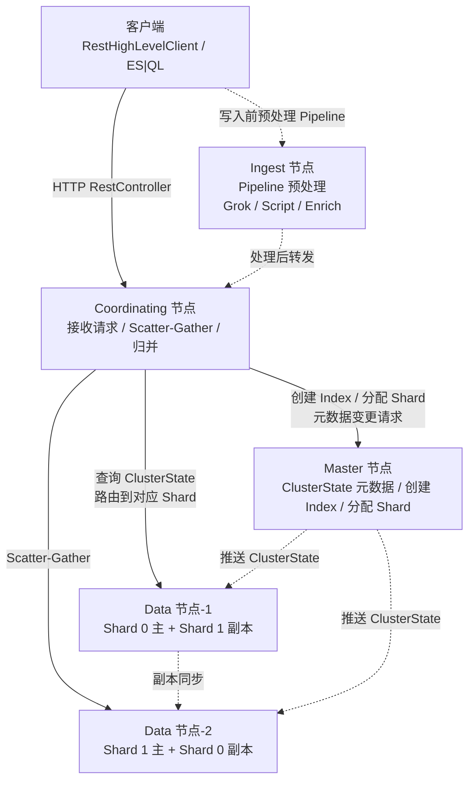
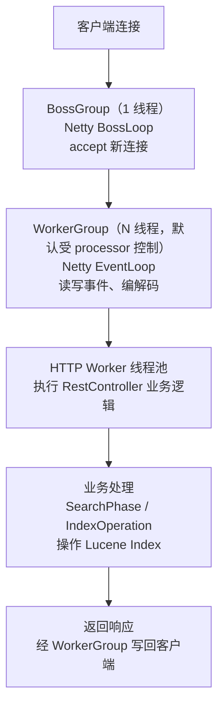
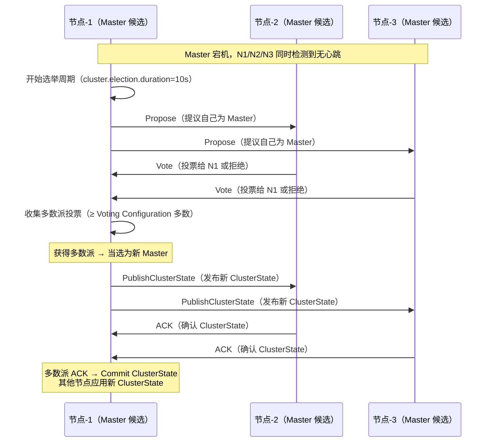
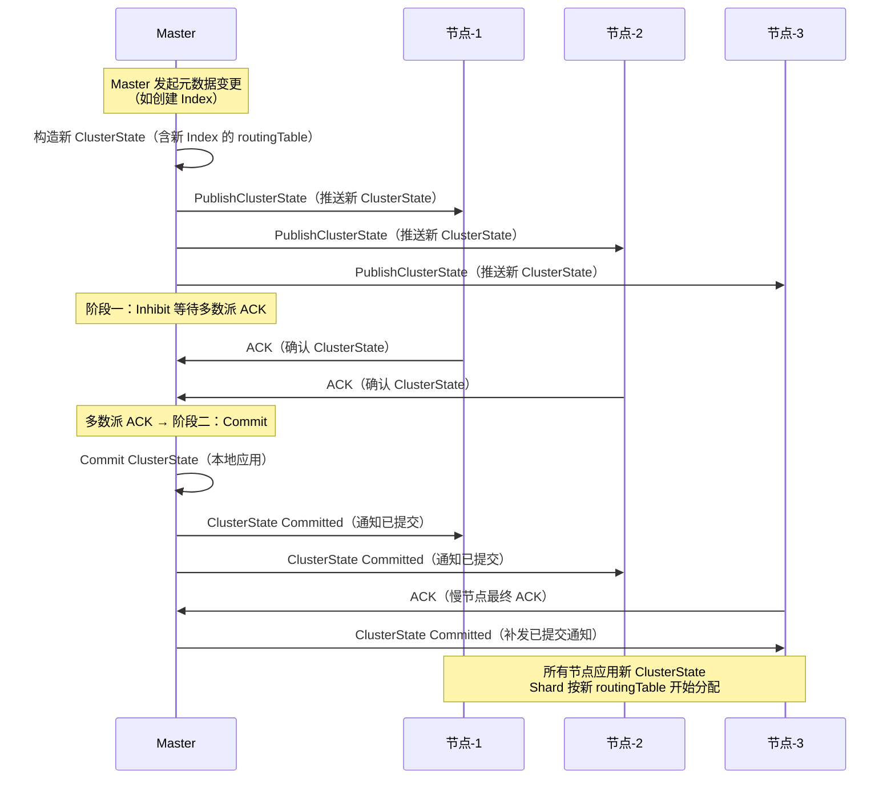
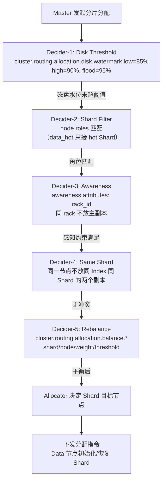
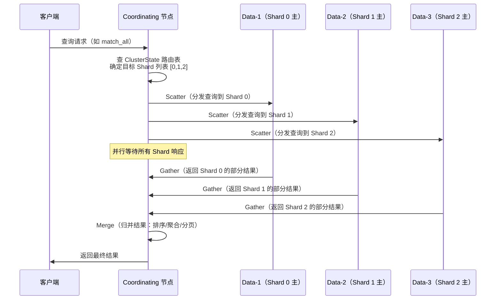
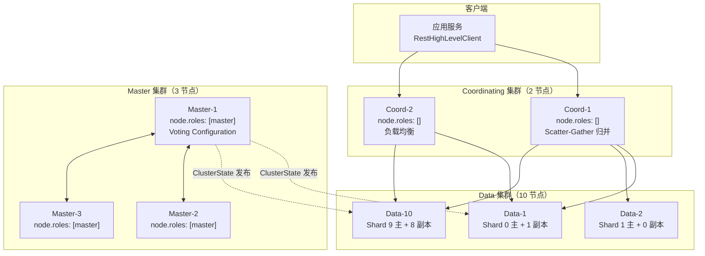
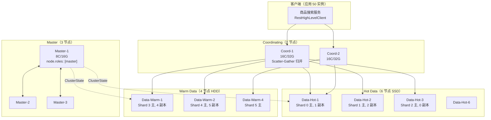
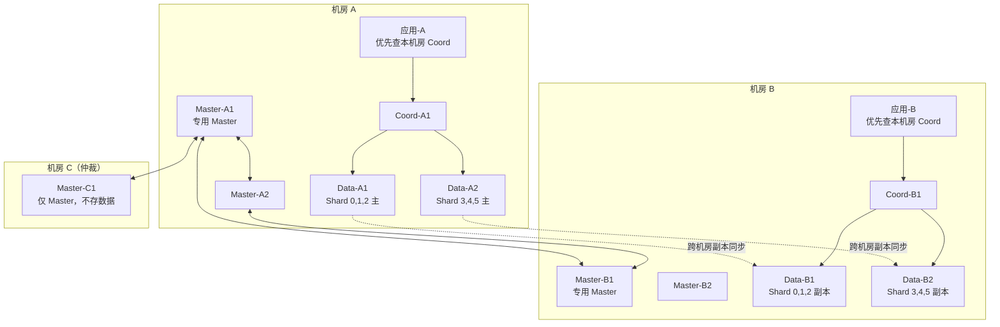

# 架构与部署拓扑

> **一句话定位**：ES 架构是面试起手题，"讲讲 ES 节点角色与 Master 选举"几乎每场必问，能讲到 Zen2 与 Voting Configuration 才算合格。
> **面试热度**：⭐⭐⭐⭐⭐
> **返回**：[ES 知识图谱](../README.md)

---

## 一、概念定义

### 1.1 ES 节点角色：职责划分与协作关系

Elasticsearch 集群在拓扑上由多种角色的**节点（Node）**构成——一个节点就是一个 JVM 进程，通过 `node.roles` 配置决定它在集群中承担的职责。理解"谁管元数据、谁存数据、谁路由请求、谁预处理文档"这条职责链，是讲清任何 ES 架构问题的前提。

| 节点角色 | `node.roles` 取值 | 职责 | 有无状态 | 集群形态 |
|----------|-------------------|------|---------|---------|
| Master | `master`（专用）/ `master,data`（混部） | 维护 ClusterState、选举主节点、元数据变更（创建/删除 Index、分配 Shard）、集群健康监控 | **有状态**（ClusterState 元数据） | 生产推荐 3 个专用 Master |
| Data | `data`（或细分 `data_hot/data_warm/data_cold`） | 存储分片 Shard（Lucene Index）、执行读写请求、执行聚合计算 | **有状态**（Shard 数据） | 按数据量水平扩展，N 个 Data 节点 |
| Coordinating | `""`（空字符串，去掉所有角色） | 接收客户端请求、按分片路由 Scatter-Gather、结果归并 merge、聚合归并 | 无状态（仅路由与缓冲） | 高 CPU/内存，独立部署避免读写争抢 |
| Ingest | `ingest` | 消费前预处理：字段抽取、格式转换、Grok/Script 转换、Enrich 关联 | 无状态（仅处理 pipeline） | 与 Data 分离，避免预处理拖慢写入 |
| Machine Learning | `ml`（需 Platinum 许可证） | 运行异常检测、预测分析等 ML Job，调度任务与模型推理 | 有状态（模型状态） | 仅在使用 X-Pack ML 时部署 |

**8.x 角色分离配置的关键变化**：ES 7.x 及之前用 `node.master`/`node.data`/`node.ingest` 三个布尔开关组合角色，8.x 起统一改为 `node.roles` 列表——`node.roles: [master, data_hot]` 表示该节点同时是专用 Master 和 Hot Data。**默认值**是 `node.roles: [data, master, ingest]`（三位一体），即默认每个节点都承担三种角色，适合开发测试；**生产必须做角色分离**——专用 Master（`node.roles: [master]`）+ 专用 Data（`node.roles: [data]` 或按分层 `data_hot`/`data_warm`/`data_cold`）+ 专用 Coordinating（`node.roles: []` 空列表），避免 Master 角色被读写负载拖累导致集群抖动。

四大核心角色的协作链是面试的"30 秒讲完架构"标准答法：



**关键要点**：①Master 是唯一能修改 ClusterState 的节点，其他节点只能接收 Master 推送的 ClusterState 快照；②Coordinating 节点不存数据，只做请求路由与归并，任何 Data 节点也都可以充当 Coordinating（默认混部时），但生产建议独立部署；③Data 节点之间通过副本同步保证高可用，主分片写完再写副本，主分片故障时副本被提升为新主；④Ingest 节点是 5.x 引入的轻量预处理层，类似 Logstash 但在 ES 进程内，避免外部依赖。

### 1.2 Cluster 与 Discovery：Zen2 自研发现与选举

ES 集群的多节点协调依赖**Zen2 发现协议**（7.x 起替代旧版 Zen，8.x 继续沿用），这是面试高频追问"为什么不用 ZooKeeper"的核心论点。

| 维度 | ZooKeeper（外部协调） | ES Zen2（自研） |
|------|----------------------|-----------------|
| 一致性模型 | CP（ZAB 强一致写） | CP（Voting Configuration 多数派） |
| 节点关系 | 集群互连，Leader/Follower | Master 候选节点互连，Raft-like |
| 状态 | 有状态（事务日志 + 快照） | 有状态（ClusterState 内存 + 磁盘持久化） |
| 复杂度 | 重（ZAB 协议 + Leader 选举 + 事务日志 + JVM 进程） | 轻（自研 Raft 变种，无外部依赖） |
| 依赖 | 额外引入 ZK 集群（3/5 节点 JVM 进程） | 无外部依赖，ES 自带 |
| 故障感知 | Session 超时 + Watch 通知 | `cluster.election.duration`（默认 10s）+ 心跳 |
| 写入 | 每次元数据变更走 ZAB 多数派写 | Master 提议 ClusterState，多数派确认 |

**为什么 ES 不用 ZooKeeper？** 核心论点是"自研更轻量且无外部依赖"。ES 的元数据（ClusterState）本质是"有哪些 Index、每个 Index 有哪些 Shard、Shard 在哪些节点"这类**变更频率极低**的信息——Index 创建删除、节点上下线都是低频事件。ZK 的 CP 强一致 + Watch 通知机制在这种低频写场景是过度设计——为了 99.999% 的强一致付出 ZAB 协议、Leader 选举、跨节点同步的复杂度代价，还要额外运维一个 ZK 集群。ES 团队的取舍是：**用"Zen2 自研 Raft 变种 + 内嵌发现协议"换"极简架构 + 无外部依赖"**——元数据中心与数据节点同进程，部署只需一套 JVM，运维成本低。

**Zen2 的 Raft-like 选举**：Zen2 不是标准 Raft，而是借鉴 Raft 思想的 ES 自研变种。核心机制是 **Voting Configuration（投票配置）**——一个动态的"有投票权节点集合"，Master 选举需要获得该集合中**多数派（majority）**的投票。Voting Configuration 的成员由 Master 动态调整：节点加入时 Master 把它加入 Voting Configuration（前提是当前 Voting Configuration 多数派同意），节点退出时移除。这种"动态多数派"机制比固定 `discovery.zen.minimum_master_nodes`（7.x 之前）更智能——7.x 之前要人工配置最小 Master 数，配置不当易脑裂；Zen2 自动维护多数派，脑裂风险更低。

**与 RocketMQ NameServer 的对比**：RocketMQ 的 NameServer 选 AP（无状态、互不通信、最终一致），ES 的 Zen2 选 CP（有状态、多数派强一致）。差异源于场景——NameServer 存的是路由表（短暂不一致客户端可重试兜底），ES Master 存的是 ClusterState（创建 Index 时若多数派未达成一致，可能出现两个 Master 各自分配不同的 Shard，导致数据分裂）。所以 ES 元数据必须强一致，而 MQ 路由可容忍短暂不一致。

### 1.3 Index/Shard/Replica：逻辑命名空间与并行单位

ES 的数据组织模型是 **Index（逻辑命名空间）× Shard（并行单位）× Replica（副本）**，理解分片与副本的关系是讲清扩展性与高可用的前提。

| 概念 | 定义 | 类比 | 并行单位 | 数据来源 |
|------|------|------|---------|---------|
| Index | 逻辑命名空间，类似"数据库" | MySQL 的 database / Kafka 的 topic | 无（逻辑抽象） | 客户端写入文档 |
| Shard | Index 的物理分片，每个是一个 Lucene Index | MySQL 分库分表的分片 / Kafka 的 partition | **并行读写单位** | 按 `hash(routing) % num_primary_shards` 路由 |
| Primary Shard | 主分片，接收写入的首选 | MySQL 的主库（分片级） | 写入首选 | 客户端写 Primary |
| Replica Shard | 副本分片，Primary 的复制 | MySQL 的从库（分片级） | 读负载均衡 + 故障转移 | Primary 同步复制 |
| Lucene Index | Shard 的底层实现，由多个 Segment 组成 | 无直接类比（Shard 即 Lucene 实例） | 段级合并 | refresh/flush 生成 |

**为什么 ES 要分片？** 两个动机：①**水平扩展**——单机磁盘容量有限，把 Index 拆成 N 个 Shard 分布到 N 个 Data 节点，单 Index 容量 = N × 单节点容量；②**并行读写**——N 个 Shard 可以并行处理读写请求，吞吐 = N × 单 Shard 吞吐。这是分布式存储的通用思想，与 MySQL 分库分表、Redis Cluster 16384 槽位、Kafka partition 同构。

**分片数规划的关键约束**：①**主分片数创建后不可变**（除非 Reindex 重建），所以建 Index 前要规划好；②**单 Shard 大小建议 30-50GB**——过小导致 over-sharding（元数据开销大、集群状态膨胀），过大导致单 Shard 故障恢复慢、合并耗时；③**副本数可动态调整**——`number_of_replicas` 可随时改，不影响主分片写入，只是新增副本需要同步数据。

**与 MySQL 分库分表 vs Redis Cluster 槽位的对比**：

| 维度 | ES 分片 | MySQL 分库分表 | Redis Cluster 16384 槽位 |
|------|---------|---------------|--------------------------|
| 路由公式 | `hash(routing) % num_primary_shards` | ShardingSphere 规则 / 一致性 hash | `CRC16(key) % 16384` |
| 分片数可变性 | 主分片不可变（需 Reindex） | 分库分表不可变（需迁移） | 16384 固定，节点增减只是槽位重分配 |
| 副本机制 | Replica 同步复制，分片级故障转移 | 主从复制（MHA/MGR），库级故障转移 | 主从复制，槽位级故障转移 |
| 路由 key | `routing` 参数（默认 `_id`） | 分片键（如 user_id） | key 本身 |
| 分片粒度 | 粗（单 Shard 30-50GB） | 中（单表 GB 级） | 细（单槽位 KB-MB 级） |

**关键差异**：Redis Cluster 用 16384 固定槽位实现"节点增减只需重分配槽位不需重 hash"——这是 Redis 的精巧设计；ES 选择更朴素的 `hash % N`——N 固定不可变，节点增减不改变分片数，只是 Shard 在节点间迁移（rebalance）。ES 的设计权衡是"分片数不可变但实现极简"，Redis 的设计权衡是"槽位固定但支持动态扩缩容"。

### 1.4 网络模型：Transport 层与 HTTP 层双协议栈

ES 的网络层基于 Netty 4 实现**双层协议栈**——Transport 层（节点间 TCP 通信）和 HTTP 层（客户端 REST 接口），这是面试讲清 ES 线程模型的基础。

| 协议层 | 用途 | 端口（默认） | 实现 | 线程模型 |
|--------|------|-------------|------|---------|
| Transport 层 | 节点间 TCP 通信（选举、状态发布、副本同步、Scatter-Gather） | 9300 | `Netty4Transport` | Boss + Worker + Transport Worker |
| HTTP 层 | 客户端 REST 接口（查询、写入、管理 API） | 9200 | `Netty4HttpServerTransport` | Boss + Worker + HTTP Worker |

**双层分离的原因**：①**协议差异**——节点间通信用 ES 内部二进制协议（紧凑高效，支持长连接复用），客户端用 HTTP/JSON（通用易调试）；②**隔离故障**——节点间通信故障不应影响客户端请求，反之亦然；③**线程池隔离**——Transport Worker 和 HTTP Worker 各自独立，避免互相拖累。

**Netty 4 线程模型**（以 HTTP 层为例）：



| 线程层 | 线程数 | 职责 | 阻塞容忍 |
|--------|-------|------|---------|
| BossGroup | 1 | 接受新连接，注册到 Worker | 不阻塞 |
| WorkerGroup（Netty EventLoop） | N（默认 `processor * 2`） | 读写事件、编解码、SSL、心跳 | 不阻塞（纯 IO） |
| HTTP Worker（业务线程池） | M（默认 `processor * 2`） | 执行 `RestController`，路由到 `Action`，操作 Lucene | 可阻塞（业务慢不影响 IO） |

**与 RocketMQ 1+N+M Reactor 的对照**：RocketMQ Broker 也是 Netty Reactor 三层（Acceptor + IO + 业务线程池），ES 与其同构——都是"IO 与业务解耦"思想。差异在于：①ES 的 WorkerGroup 和 HTTP Worker 线程数都基于 CPU 核数自适应（`processor`），RocketMQ 用固定值（8/32）；②ES 有双层协议栈（Transport + HTTP），RocketMQ 只有单层（Broker 同时服务客户端和内部通信）；③ES 的业务线程池更细分——`write`/`search`/`get`/`bulk` 等多个独立线程池，避免慢查询拖累写入，RocketMQ 是单一业务线程池。

**与 Redis 6.0 IO 多线程的对照**：Redis 6.0 引入 IO 多线程但命令执行仍单线程（因为 Redis 命令纯内存，单线程够用）；ES 的业务逻辑涉及磁盘 IO 和复杂查询，必须多线程。两者都遵循"IO 与业务解耦"，但线程数差异是场景决定的。

---

## 二、原理与流程

### 2.1 Master 选举流程：Zen2 的 Voting Configuration 多数派

Master 选举是 ES 高可用的核心，面试时画出 Zen2 选举流程是加分项。

**选举触发时机**：①集群启动时（所有 Master 嵌套角色节点同时启动，进入选举）；②Master 节点故障（`cluster.election.duration` 默认 10s 无心跳则判定 Master 下线）；③Master 主动卸任（`_cluster/nodes/_local/shutdown` 或节点优雅关闭）；④Voting Configuration 成员变更（Master 主动调整）。

**选举流程**（`org.elasticsearch.discovery.zen2.ZenDiscovery`）：



**Voting Configuration 多数派机制**：Voting Configuration 是一个动态的"有投票权节点集合"，存储在 ClusterState 中。选举时需要获得该集合中**多数派（majority）**的投票——例如 Voting Configuration 有 3 个节点，需要 ≥ 2 个节点投票。**关键设计**：①Voting Configuration 的成员由 Master 动态调整，节点加入时 Master 提议加入，多数派同意后才生效；②Voting Configuration 只包含 Master 候选节点（`node.roles` 含 `master`），Data/Coordinating 节点无投票权；③Voting Configuration 的多数派公式是 `floor(N/2) + 1`，N 是成员数。

**避免脑裂的原理**：脑裂（split-brain）是指网络分区后两个分区各自选举出 Master，导致 ClusterState 分裂。Zen2 通过"Voting Configuration 多数派"天然防脑裂——3 节点集群网络分区成 1+2，只有 2 节点分区能获得多数派（≥2），1 节点分区无法获得多数派，不会选举出 Master，只能等待分区恢复。**7.x 之前**用 `discovery.zen.minimum_master_nodes`（人工配置最小 Master 数）防脑裂，配置不当（如配成 1）易脑裂；7.x 起 Zen2 自动维护 Voting Configuration，无需人工配置，更安全。

**`cluster.election.duration` 参数**：选举超时时间，默认 10s。某 Master 候选节点发起选举后，若 10s 内未获得多数派投票，则重新发起。这个参数平衡了"快速故障恢复"与"避免选举抖动"——过短导致网络抖动频繁触发选举，过长导致 Master 故障后集群不可用窗口长。

> **源码路径**：`org.elasticsearch.discovery.zen2.ZenDiscovery`（选举主流程）、`org.elasticsearch.cluster.coordination.Coordinator`（协调选举状态机）、`org.elasticsearch.cluster.coordination.VotingConfiguration`（投票配置维护）、`org.elasticsearch.cluster.coordination.ElectionScheduler`（选举调度）。

### 2.2 集群状态发布：二阶段提交 Publish/Commit

Master 选举完成后，新 Master 需要把最新 ClusterState 发布到所有节点，这是 Zen2 的二阶段提交流程。

**ClusterState 的内容**：ClusterState 是集群的全局元数据快照，包含：①`metadata`（Index 设置、Mapping、Alias、Template 等元数据）；②`routingTable`（每个 Index 的 Shard 分布——哪个 Shard 在哪个节点，Primary 还是 Replica）；③`nodes`（集群节点列表与角色）；④`customs`（自定义元数据，如 ILM 状态）。ClusterState 由 Master 唯一维护，其他节点接收 Master 推送的快照。

**二阶段提交流程**（`org.elasticsearch.cluster.service.ClusterService` + `ClusterStatePublisher`）：



**二阶段提交的意义**：①**Inhibit 阶段**——Master 推送 ClusterState 后等待多数派 ACK，未达多数派则回滚（不提交），避免少数节点有新状态而多数节点无新状态的不一致；②**Commit 阶段**——多数派 ACK 后 Master 提交（本地应用 ClusterState）并通知所有节点提交，此时新 ClusterState 生效。这种两阶段提交与数据库 2PC 思想一致，但 ES 的"多数派 ACK"比 2PC 的"全部 ACK"更宽松——允许少数节点慢，不阻塞整体。

**ClusterStatePublisher 的故障处理**：①若某节点长时间不 ACK（如节点宕机），Master 不无限等待——达到 `cluster.publish.timeout`（默认 30s）后视为该节点失联，从 Voting Configuration 中移除（若该节点是 Master 候选）；②若 Master 在发布过程中自身故障，其他节点检测到心跳超时后重新选举，新 Master 基于最新已提交的 ClusterState 继续工作。

**与 RocketMQ Controller Raft 的对比**：RocketMQ 5.x 的 Controller 也是 Raft 集群，元数据发布走 Raft Log 复制（Leader 写 Log，多数派复制后 Commit）。ES Zen2 的 ClusterState 发布是"整体快照推送 + 多数派 ACK"，不是 Raft Log 的"逐条复制"。差异源于元数据特性——ES 的 ClusterState 是大对象（含完整 routingTable），适合整体快照；Raft Log 是小条目（每次一个变更），适合流式复制。

> **源码路径**：`org.elasticsearch.cluster.service.ClusterService`（Master 节点的 ClusterState 应用与发布入口）、`org.elasticsearch.cluster.coordination.ClusterStatePublisher`（二阶段发布协调）、`org.elasticsearch.cluster.coordination.ClusterStatePublisher.AckListener`（ACK 监听与 Commit 判定）。

### 2.3 分片分配：Allocator 的决策链

Master 在 ClusterState 发布后，需要决定每个 Shard 应该分配到哪个 Data 节点，这是 `Allocator` 的职责。

**分片分配的触发时机**：①新 Index 创建——Master 为每个 Primary Shard 选定 Data 节点，再为每个 Replica Shard 选定；②节点上下线——节点下线后其上的 Shard 需要 reassign 到其他节点；节点上线后触发 rebalance 把部分 Shard 迁移过来；③副本数调整——`number_of_replicas` 增加时新增 Replica 需要分配；④磁盘水位变化——某 Data 节点磁盘水位超阈值，Master 把新 Shard 分配到其他节点。

**Allocator 的决策链**（`org.elasticsearch.cluster.routing.allocation.Allocator` + `AllocationService`）：



**关键 Decider（决策器）**：

| Decider | 类 | 作用 | 关键参数 |
|---------|----|------|---------|
| Disk Threshold | `DiskThresholdDecider` | 磁盘水位超阈值则不再分配新 Shard 到该节点 | `cluster.routing.allocation.disk.watermark.low/high/flood` |
| Shard Filter | `FilterAllocationDecider` | 按 `node.roles` 匹配（如 hot Shard 只到 data_hot 节点） | `index.routing.allocation.require.*` |
| Awareness | `AwarenessAllocationDecider` | 按感知属性（如 rack_id）分布主副本，避免同 rack 同时故障 | `cluster.routing.allocation.awareness.attributes` |
| Same Shard | `SameShardAllocationDecider` | 同一节点不放同 Index 同 Shard 的两个副本（防止单节点故障丢双副本） | 无参数，硬约束 |
| Rebalance | `BalanceStrategy`（`ShardsAllocator`） | 按 shard/node/weight/threshold 平衡各节点 Shard 数 | `cluster.routing.allocation.balance.*` |

**磁盘水位机制详解**：ES 8.x 默认磁盘水位——`low=85%`（超过则该节点不再分配新 Shard，但已分配的保留）、`high=90%`（超过则触发 Shard 迁移，把部分 Shard 搬到其他节点）、`flood=95%`（超过则该节点所有 Shard 标记为只读，保护磁盘不被写满）。这个三档水位是 ES 防止磁盘写满导致集群不可用的核心机制——生产必须监控磁盘水位，超 `low` 告警，超 `high` 紧急扩容。

**与 MySQL 分片分配的对比**：MySQL 分库分表的分片分配是静态的（建表时指定分片规则，运行时不自动迁移），ES 的分片分配是动态的（Master 实时监控节点状态，自动 rebalance）。差异源于架构——MySQL 是"应用层分片"（ShardingSphere），ES 是"集群内分片"（Master 统一调度）。

> **源码路径**：`org.elasticsearch.cluster.routing.allocation.Allocator`（分片分配器接口）、`org.elasticsearch.cluster.routing.allocation.AllocationService`（分配服务入口）、`org.elasticsearch.cluster.routing.allocation.decider.DiskThresholdDecider`（磁盘水位决策）、`org.elasticsearch.cluster.routing.allocation.decider.AwarenessAllocationDecider`（感知决策）、`org.elasticsearch.cluster.routing.allocation.BalanceStrategy`（平衡策略）。

### 2.4 协调节点路由：Scatter-Gather 模型

Coordinating 节点接收客户端请求后，需要把请求按分片路由——这就是 Scatter-Gather（分散-归并）模型。

**Scatter-Gather 流程**：



**Scatter 阶段的关键决策**：①**目标 Shard 选择**——查询请求需要分发到所有 Primary Shard（或所有 Replica，做读负载均衡）；写入请求只需分发到目标 Shard（按 `hash(routing) % num_primary_shards` 定位）；②**Primary vs Replica 选择**——读请求可读 Primary 或 Replica（默认随机选，平衡负载），写请求必须先写 Primary 再复制到 Replica；③**失败重试**——某 Shard 请求失败，Coordinating 节点可重试到该 Shard 的 Replica（若有）。

**Gather 阶段的归并策略**：

| 请求类型 | Gather 策略 | 复杂度 |
|---------|------------|--------|
| 普通查询（match_all） | 各 Shard 返回 `from + size` 条，Coordinating 节点排序后取 top `size` | O(N × (from+size)) |
| 聚合（terms） | 各 Shard 返回本地 Top Term，Coordinating 节点归并 Top Term 再求和 | O(N × shard_size) |
| 分页（from/size） | `from` 越大 Gather 开销越大（每个 Shard 要返回 `from+size` 条），所以 `from + size ≤ 10000` | O(N × (from+size)) |
| search_after | 各 Shard 返回 `search_after` 之后的 `size` 条，无需 `from` | O(N × size) |

**为什么 `from + size` 有 10000 限制？** 因为 Coordinating 节点要从每个 Shard 收集 `from + size` 条结果归并——`from=9999, size=1` 时每个 Shard 返回 10000 条，N 个 Shard 就是 N×10000 条内存归并，开销极大。所以 ES 默认 `index.max_result_window=10000`，超过报错。深度分页用 `search_after`（基于游标，每 Shard 只返回 `size` 条）或 `PIT + search_after`（8.x 增强）。

**与 Redis Cluster 的对比**：Redis Cluster 的 Scatter-Gather 在客户端（Smart Client 直接路由到目标节点），ES 的 Scatter-Gather 在服务端（Coordinating 节点）。差异源于架构——Redis Cluster 无中心节点（每个节点平等），ES 有 Coordinating 节点（中心化路由）。Redis 的设计更轻量（无中心节点开销），ES 的设计更灵活（Coordinating 可做复杂归并和聚合）。

> **源码路径**：`org.elasticsearch.action.search.SearchService`（协调查询入口）、`org.elasticsearch.action.search.TransportSearchAction`（Scatter-Gather 主流程）、`org.elasticsearch.action.ActionListener`（Gather 异步回调）、`org.elasticsearch.action.search.SearchPhaseController`（归并结果）。

### 2.5 Netty 4 线程模型：Transport 与 HTTP 双层

ES 的网络层基于 Netty 4 实现，面试时画出双层线程模型是加分项。

**Transport 层线程模型**（`Netty4Transport`）：

| 线程层 | 线程数 | 职责 | 配置参数 |
|--------|-------|------|---------|
| BossGroup | 1 | accept 节点间 TCP 新连接 | `transport.netty.boss_count`（默认 1） |
| WorkerGroup（EventLoop） | `processor * 2` | 节点间通信读写、编解码 | `transport.netty.worker_count` |
| Transport Worker 线程池 | `processor * 2` | 处理节点间请求（ClusterState 发布、副本同步、Scatter-Gather 内部请求） | `transport_tcp` 线程池 |

**HTTP 层线程模型**（`Netty4HttpServerTransport`）：

| 线程层 | 线程数 | 职责 | 配置参数 |
|--------|-------|------|---------|
| BossGroup | 1 | accept 客户端 HTTP 新连接 | `http.netty.boss_count`（默认 1） |
| WorkerGroup（EventLoop） | `processor * 2` | HTTP 读写、编解码、SSL | `http.netty.worker_count` |
| HTTP Worker 线程池 | `processor * 2` | 执行 `RestController` 路由到 `Action` | `http_worker` 线程池 |

**业务线程池细分**（ES 的特色设计）：HTTP Worker 解析请求后，根据请求类型路由到不同业务线程池执行——这是 ES 比 RocketMQ 更细的线程隔离：

| 线程池 | 用途 | 大小（默认） | 队列 |
|--------|------|-------------|------|
| `write` | 单条索引写入 | `processor` | 10000 |
| `bulk` | 批量写入 | `processor * 2` | 10000 |
| `search` | 查询（分片级） | `processor * 2`（search min + max 可配） | 1000 |
| `get` | 单条 get（高吞吐低延迟） | `processor` | 1000 |
| `analyze` | 分词 | `processor` | 256 |
| `management` | 管理 API（创建 Index 等） | 5 | 无 |
| `refresh` | refresh 操作 | `processor / 2 + 1` | 无 |
| `flush` | flush 操作 | `processor / 2 + 1` | 无 |

**线程池隔离的意义**：①慢查询不会拖累写入——`search` 线程池满了不影响 `write` 线程池；②批量写入不抢占单条写入资源——`bulk` 和 `write` 分开；③管理操作不被业务阻塞——`management` 线程池小但独立，保证集群管理 API 可用。这是 ES 在高负载下保持稳定的关键设计。

**线程池满的拒绝策略**：ES 用 `EsAbortPolicy`（自定义 AbortPolicy）——线程池满且队列满时直接拒绝请求返回 429（Too Many Requests），不阻塞调用方。这与 RocketMQ 的 Semaphore 限流思想一致——"快速失败 + 调用方重试"比"排队等待 + 超时"更稳定。

**与 Redis 6.0 IO 多线程 / RocketMQ 1+N+M 的对比表**：

| 维度 | ES Netty 4 | Redis 6.0 | RocketMQ 1+N+M |
|------|-----------|-----------|----------------|
| IO 线程 | WorkerGroup（N=processor*2） | IO 多线程（可配） | IO 线程（N=8） |
| 业务线程 | 多池细分（write/search/bulk/...） | 单线程（命令执行） | 单一业务线程池（M=32） |
| 双层协议 | Transport + HTTP | 单层（Redis 协议） | 单层（RocketMQ 协议） |
| 阻塞容忍 | 业务线程可阻塞，IO 不阻塞 | 命令执行不阻塞（纯内存） | 业务线程可阻塞 |
| 拒绝策略 | 429 Too Many Requests | 慢查询日志 + 客户端超时 | Semaphore 排队 |

**关键差异**：ES 的业务线程池细分到 8+ 个，是三者中最细的——因为 ES 的业务类型差异大（写、查、聚合、管理），细分避免互相拖累。Redis 业务都是纯内存命令，单线程够用。RocketMQ 业务是消息收发，单一池够用。

> **源码路径**：`org.elasticsearch.http.netty4.Netty4HttpServerTransport`（HTTP 层 Netty 4 实现）、`org.elasticsearch.transport.Netty4Transport`（Transport 层 Netty 4 实现）、`org.elasticsearch.threadpool.ThreadPool`（业务线程池管理与路由）、`org.elasticsearch.http.netty4.Netty4HttpRequestHandler`（HTTP 请求处理）。

### 2.6 源码路径汇总

| 类 | 路径 | 作用 |
|----|------|------|
| `ZenDiscovery` | `org.elasticsearch.discovery.zen2.ZenDiscovery` | Zen2 发现与选举主流程 |
| `Coordinator` | `org.elasticsearch.cluster.coordination.Coordinator` | 选举状态机协调 |
| `VotingConfiguration` | `org.elasticsearch.cluster.coordination.VotingConfiguration` | 投票配置维护（多数派判定） |
| `ClusterService` | `org.elasticsearch.cluster.service.ClusterService` | Master 节点的 ClusterState 应用与发布 |
| `ClusterStatePublisher` | `org.elasticsearch.cluster.coordination.ClusterStatePublisher` | 二阶段发布协调 |
| `AllocationService` | `org.elasticsearch.cluster.routing.allocation.AllocationService` | 分片分配服务入口 |
| `DiskThresholdDecider` | `org.elasticsearch.cluster.routing.allocation.decider.DiskThresholdDecider` | 磁盘水位决策 |
| `TransportSearchAction` | `org.elasticsearch.action.search.TransportSearchAction` | Scatter-Gather 主流程 |
| `Netty4HttpServerTransport` | `org.elasticsearch.http.netty4.Netty4HttpServerTransport` | HTTP 层 Netty 4 实现 |
| `Netty4Transport` | `org.elasticsearch.transport.Netty4Transport` | Transport 层 Netty 4 实现 |
| `ThreadPool` | `org.elasticsearch.threadpool.ThreadPool` | 业务线程池管理与路由 |

---

## 三、高频追问

### Q1：ES 有哪些节点角色？

**五大角色**：Master（维护 ClusterState 元数据）、Data（存储 Shard 执行读写）、Coordinating（路由请求 Scatter-Gather 归并结果）、Ingest（写入前 Pipeline 预处理）、Machine Learning（X-Pack ML 任务）。8.x 用 `node.roles` 列表配置，默认 `[data, master, ingest]`（三位一体）。生产推荐角色分离——专用 Master（3 个）+ 专用 Data（按数据量扩展）+ 专用 Coordinating（高负载场景独立部署）。ML 节点仅在用 X-Pack ML 时部署。

### Q2：Master 怎么选出来的？

**Zen2 多数派选举**。Master 候选节点（`node.roles` 含 `master`）检测到无 Master 心跳（`cluster.election.duration` 默认 10s）后发起选举，向 Voting Configuration 中所有节点请求投票，获得多数派（`floor(N/2)+1`）投票则当选。Zen2 是 Raft-like 变种——不是标准 Raft，但借鉴了 Raft 的多数派思想。关键设计是 Voting Configuration 动态维护——节点加入时 Master 提议加入，多数派同意后生效，无需人工配 `minimum_master_nodes`。

### Q3：为什么不用 ZooKeeper？

**自研更轻量，无外部依赖**。ES 的 ClusterState 是低频写的元数据（Index 创建、节点上下线），ZK 的 CP 强一致 + ZAB 协议是过度设计。ES 团队取舍是"Zen2 自研 Raft 变种 + 内嵌发现协议"换"极简架构 + 无外部依赖"——元数据中心与数据节点同进程，部署只需一套 JVM，运维成本低。对比 RocketMQ NameServer 选 AP（路由可短暂不一致），ES Master 必须选 CP（ClusterState 分裂会导致数据分裂）。

### Q4：脑裂怎么避免？

**Voting Configuration 多数派天然防脑裂**。3 节点集群网络分区成 1+2，只有 2 节点分区能获得多数派（≥2）选举 Master，1 节点分区无法获得多数派不会选举。7.x 之前用 `discovery.zen.minimum_master_nodes`（人工配置）防脑裂，配置不当易脑裂；7.x 起 Zen2 自动维护 Voting Configuration，无需人工配置。关键原理是"多数派"——只要 Voting Configuration 成员数是奇数（3/5/7），就能容忍 `floor(N/2)` 个节点故障。

### Q5：Coordinating 节点做什么？

**接收客户端请求、按分片路由 Scatter-Gather、归并结果**。查询请求时 Coordinating 节点查 ClusterState 路由表确定目标 Shard，并行分发到各 Shard 所在 Data 节点，收集各 Shard 部分结果后归并（排序、聚合、分页）。写入请求时按 `hash(routing) % num_primary_shards` 定位目标 Shard 直接转发。生产高负载场景建议独立部署 Coordinating 节点（`node.roles: []` 空列表），避免读写争抢 Master 角色资源。

### Q6：Data 节点能当 Master 吗？

**默认能，生产建议角色分离**。默认 `node.roles: [data, master, ingest]`（三位一体），Data 节点同时承担 Master 角色。但生产不建议混部——Master 角色负责 ClusterState 维护，一旦被 Data 角色的读写负载拖累（GC 停顿、磁盘 IO 阻塞），会导致心跳超时误判 Master 下线，触发频繁选举。生产推荐 3 个专用 Master（`node.roles: [master]`）+ N 个专用 Data（`node.roles: [data]` 或按分层 `data_hot/data_warm/data_cold`），专用 Master 负载低稳定性高。

### Q7：Index/Shard/Replica 关系是什么？

**Index 是逻辑命名空间，Shard 是并行单位，Replica 是副本**。Index 类似 MySQL 的 database，是逻辑分类；Shard 是 Index 的物理分片，每个是一个 Lucene Index，是并行读写单位；Primary Shard 是主分片接收写入首选，Replica Shard 是 Primary 的副本用于读负载均衡和故障转移。**主分片数创建后不可变**（需 Reindex 重建），副本数可动态调整。生产规划——单 Shard 30-50GB，主分片数按 `总数据量 / 50GB` 估算，副本数 1-2（高可用 1 副本，高读吞吐 2 副本）。

### Q8：Netty 4 线程模型？

**Transport + HTTP 双层，业务线程池细分**。①Transport 层（节点间 TCP，9300）—— BossGroup 1 线程接连接，WorkerGroup N 线程做 IO，Transport Worker 线程池处理节点间请求；②HTTP 层（客户端 REST，9200）—— BossGroup 1 线程，WorkerGroup N 线程，HTTP Worker 线程池处理客户端请求；③业务线程池细分 8+ 个（write/bulk/search/get/analyze/management/refresh/flush），避免慢查询拖累写入。线程池满返回 429，快速失败不阻塞。

---

## 四、实战关联（Java 后端视角）

### 4.1 Spring Data ES + RestHighLevelClient 配置

生产 Java 后端常用 `spring-boot-starter-data-elasticsearch`，典型配置如下：

```yaml
# application.yml
spring:
  elasticsearch:
    uris:
      - https://10.0.0.1:9200  # 8.x 默认 HTTPS + 安全开启
      - https://10.0.0.2:9200
      - https://10.0.0.3:9200
    username: elastic
    password: ${ES_PASSWORD}
    connection-timeout: 5s
    socket-timeout: 30s
    path-prefix: /elasticsearch  # 若前置有 Nginx 代理
```

**RestHighLevelClient 连接 Coordinating 节点**（8.x 推荐，RestHighLevelClient 在 8.x 标记 deprecated 但仍可用，新项目用 `ElasticsearchClient` Java API Client）：

```java
@Configuration
public class EsClientConfig {

    @Bean
    public RestHighLevelClient restHighLevelClient() {
        HttpHost[] hosts = new HttpHost[]{
            new HttpHost("10.0.0.1", 9200, "https"),
            new HttpHost("10.0.0.2", 9200, "https"),
            new HttpHost("10.0.0.3", 9200, "https")
        };
        // 连接 Coordinating 节点（不是 Data 节点），避免读写争抢
        return new RestHighLevelClientBuilder(RestClient.builder(hosts))
            .setApiKey(new SecureString(("elastic:password").toCharArray()))
            .build();
    }

    @Bean
    public ElasticsearchClient javaClient(RestHighLevelClient rhlClient) {
        // 8.x 推荐 Java API Client
        Transport transport = new RestClientTransport(
            rhlClient.getLowLevelClient(), new JacksonJsonpMapper());
        return new ElasticsearchClient(transport);
    }
}
```

**Spring Data ES 注解驱动**（`@Document`）：

```java
@Document(indexName = "order-2026-08",  // 按月分 Index，配合 ILM
         routing = "#{#order.userId}",  // 按 userId routing，同用户同分片
         replicas = 1, shards = 5)
@Setting(settingPath = "es-settings.json")  // 自定义 settings
public class Order {
    @Id
    private String orderId;

    @Field(type = FieldType.Keyword)
    private String userId;

    @Field(type = FieldType.Text, analyzer = "ik_max_word")
    private String description;

    @Field(type = FieldType.Date, format = DateFormat.date_hour_minute_second)
    private LocalDateTime createTime;

    @Field(type = FieldType.ScaledFloat, scalingFactor = 100)
    private BigDecimal amount;
}
```

**关键参数解读**：①`indexName` 支持 SpEL 表达式按时间分 Index，配合 ILM 自动滚动；②`routing` 指定 routing key，同 key 文档进同分片，查询时也带 routing 直达单分片避免 Scatter-Gather；③`shards`/`replicas` 在 `@Document` 注解或 settings.json 配置，创建后主分片不可变；④8.x 默认 HTTPS + 安全开启，必须配 username/password 或 API Key。

### 4.2 生产部署拓扑（3 Master + N Data + Coordinating）

**生产推荐拓扑（ES 8.x）**：

```
3 Master 专用（低配 8C/16G，JVM heap 8GB，不存数据）
+ 10 Data 专用（高配 32C/128G SSD，JVM heap 31GB，存 Shard）
+ 2 Coordinating 专用（中配 16C/32G，JVM heap 16GB，做路由归并）

角色分离配置：
- Master 节点：node.roles: [master]
- Data 节点：node.roles: [data] 或按分层 [data_hot/data_warm/data_cold]
- Coordinating 节点：node.roles: [] （空列表，纯协调）

JVM heap 规则：
- 31GB 上限（compressed oops 指针压缩阈值，超过退化为 8 字节指针）
- 物理内存 50% 给 JVM heap，50% 给 Lucene mmap file cache
```

**部署拓扑图（3 Master + 10 Data + 2 Coordinating）**：



**JVM heap 31GB 的原因**：JVM 在 heap ≤ 32GB 时启用 compressed oops（指针压缩），对象指针从 8 字节压缩为 4 字节，节省一半指针开销。超过 32GB（实际约 31-32GB 边界）则退化为 8 字节指针，内存占用反而增加。所以 ES 推荐 JVM heap 不超过 31GB，留出 compressed oops 余量。剩余物理内存给 Lucene mmap file cache——Lucene segment 用 mmap 映射到堆外内存，避免 JVM heap 访问磁盘文件的开销。

### 4.3 与 MySQL 高可用对比

| 维度 | ES Zen2 | MySQL MGR |
|------|---------|-----------|
| 选举协议 | Zen2（Raft-like 变种） | MGR Paxos 变种 |
| 选举粒度 | 集群级（选 Master 节点） | 库级（选 Primary 节点） |
| 故障转移 | Master 故障后新 Master 重分配 Shard | Primary 故障后新 Primary 接管 |
| 数据复制 | 分片级（Primary→Replica） | 库级（Primary→Secondary） |
| 多数派 | Voting Configuration | MGR majority |
| 脑裂防护 | Voting Configuration 多数派 | MGR Paxos 多数派 |

**关键差异**：ES 是"分片级选举"——每个 Shard 的 Primary 故障后从 Replica 中选新 Primary，不依赖集群级 Master；MySQL MGR 是"库级选举"——整个库选一个 Primary。ES 的分片级故障转移更细粒度（某 Shard 的 Primary 故障不影响其他 Shard），但集群级 Master 是元数据中心，Master 故障会影响元数据变更（但不影响数据读写）。

**与 MHA 的对比**：MHA 是 MySQL 传统的 Master High Available 方案——监控 Master 故障后从 Slave 中选一个提升为新 Master，需人工或脚本介入。ES 的 Zen2 是全自动选举，无需人工介入。差异源于设计目标——MHA 是"人工 + 脚本"的传统 HA，ES 是"自研协议"的原生分布式。

### 4.4 关联 java-core/lambda：Netty 4 与 Stream 异步编程

ES 的 Netty 4 是**事件驱动异步编程**的典型实现——BossGroup 注册 `OP_ACCEPT`，WorkerGroup 注册 `OP_READ`/`OP_WRITE`，事件触发后回调 ChannelHandler。这与 `java-core/lambda` 的 `CompletableFuture` 异步编排是同一思想：**回调链 + 非阻塞 IO**。

ES 的 Scatter-Gather 用 `ActionListener` 异步回调：

```java
// TransportSearchAction 异步收集各 Shard 埥果
searchShard(actionListener -> {
    // 各 Shard 异步返回
    shardResponseFuture.thenAccept(shardResult -> {
        // Gather 阶段：归并结果
        mergeResults(shardResult);
    }).exceptionally(ex -> {
        log.error("Shard 查询失败", ex);
        return null;
    });
});
```

这与 `java-core/lambda` 里 `CompletableFuture.supplyAsync` 链式编排完全同构——ES 内部把各 Shard 查询用 Netty `ChannelFuture` 包装，Coordinating 节点用 `ActionListener` 接续归并，是 Netty Future 与 JDK CompletableFuture 的桥接。

### 4.5 关联 java-core/jvm：节点角色与 JVM 线程模型

ES 的节点角色对应 JVM 线程调度三层：

| ES 层 | JVM 线程 | 调度特征 |
|-------|---------|---------|
| Netty BossGroup（1） | Netty BossThread | 阻塞在 `select()`，事件极低频，几乎不占 CPU |
| Netty WorkerGroup（N） | Netty EventLoopThread | 阻塞在 `select()`，事件驱动唤醒，CPU 占用低 |
| 业务线程池（write/search/bulk...） | 业务线程 | 频繁 CPU + 磁盘 IO 混合，JVM 线程调度热点 |

**调优关联**：①业务线程数应与 JVM 核数和磁盘 IO 能力匹配——`search` 线程池过大导致线程上下文切换开销，过小导致请求堆积；②ES 用堆外内存（DirectByteBuffer）做 Netty ByteBuf，避免堆内到堆外拷贝，关联 `java-core/jvm` 的 Direct Memory 监控；③GC 选 G1 或 ZGC 避免长停顿——Master 节点 GC 停顿超 `cluster.election.duration`（10s）会被误判下线触发选举，这是 JVM 调优的硬约束；④JVM heap 50% 规则——heap 给 ES 对象，剩 50% 给 Lucene segment mmap file cache，关联 `java-core/jvm` 的堆外内存预算。

---

## 五、系统设计案例

### 案例 1：设计一个支撑亿级文档的搜索集群

**场景**：电商商品搜索，1 亿商品文档（每文档均 1KB），日均查询 QPS 5000，峰值 2 万 QPS，需亚秒级响应，单机房 + 异地灾备。

**3 分钟标准答法**：

1. **容量估算**——1 亿文档 × 1KB = 100GB 原始数据，考虑副本（1 副本）和 Lucene 倒排索引膨胀（约 2-3 倍），总存储约 200-300GB。按单 Shard 50GB 上限，主分片数 = 300GB / 50GB ≈ 6 个主分片，1 副本，共 12 个 Shard。
2. **节点规划**——10 个 Data 节点（32C/128G SSD），每节点承载约 1-2 个 Shard（30-50GB/节点）；3 个专用 Master（8C/16G）；2 个 Coordinating（16C/32G，处理 2 万 QPS 归并）。
3. **分片策略**——`number_of_shards: 6`，`number_of_replicas: 1`；routing key 用 `categoryId`，同类商品同分片，类目内查询可 routing 直达单分片避免 Scatter-Gather。
4. **Hot-Warm 分层**——Hot 节点（SSD，高 CPU）存近期热销商品；Warm 节点（HDD，低 CPU）存长尾商品，配合 ILM 自动迁移。

**部署拓扑图**：



**容量估算细节**：①1 亿文档 × 1KB × 2（主+副本）= 200GB 原始；②Lucene 倒排索引 + doc_values 膨胀约 1.5-2 倍，总存储 300-400GB；③10 Data 节点每节点 40GB 数据，SSD 1TB 余量充足；④JVM heap 31GB（不超 compressed oops 阈值），物理 128GB 剩 97GB 给 mmap file cache；⑤2 万 QPS 查询，Coordinating 2 节点每节点 1 万 QPS，16C CPU 够用。

**核心权衡**：查询吞吐 vs 数据一致性。1 副本保证高可用（单节点故障不丢数据），但读吞吐翻倍（可读 Primary 或 Replica）。若要更高读吞吐可加到 2 副本（3 副本总），但存储成本翻倍。亿级文档用 6 主分片平衡——过少（如 1 分片）单分片 100GB 故障恢复慢，过多（如 20 分片）over-sharding 集群状态膨胀。

**追问链**：

- **追问 1：数据增长到 5 亿怎么办？**——按时间分 Index（如 `goods-2026-08`），配合 ILM 滚动；老 Index 移到 Warm 节点降本；单 Index 不超 50GB，5 亿文档分 10 个 Index（每月 1 个）。
- **追问 2：某 Data 节点故障怎么办？**——Master 检测心跳超时后把该节点上的 Shard 在其他节点重新分配（Recovery），副本被提升为 Primary 保证可用；Recovery 过程消耗网络和磁盘 IO，生产应监控 Recovery 速度。
- **追问 3：查询慢怎么优化？**——①加 Coordinating 节点分担归并压力；②用 routing key 减少 Scatter-Gather 范围；③分页用 search_after 替代 from/size；④热数据加 file cache（8.x 特性）；⑤聚合用 `size` 限制返回桶数。

### 案例 2：设计一个多机房 ES 部署方案

**场景**：同城双活，机房 A 和机房 B 各有搜索服务，要求查询优先本机房、数据跨机房同步、单机房故障另一机房可接管。

**部署拓扑**：



**关键设计**：

1. **3 机房 5 Master**——机房 A 2 Master + 机房 B 2 Master + 机房 C 1 Master（仲裁），Voting Configuration 5 节点容忍 2 故障。机房 C 仅部署 Master 不部署 Data，作为仲裁节点避免脑裂。
2. **跨机房副本同步**——每个 Shard 的 Primary 在机房 A，Replica 在机房 B（跨机房同步复制），保证单机房故障另一机房有完整数据。同步延迟同城 1-3ms 可接受。
3. **查询本机房优先**——应用-A 查 Coord-A1（路由到 Data-A 的 Primary），应用-B 查 Coord-B1（路由到 Data-B 的 Replica，读副本）。读 Replica 可能延迟 1-3ms，但避免跨机房查询。
4. **CCR 跨集群复制（异地多活）**——若要异地（跨城）多活，用 Cross-Cluster Replication（CCR），Leader 集群在机房 A，Follower 集群在机房 B，异步复制。异地延迟 30-100ms，异步可接受。

**核心权衡**：一致性 vs 可用性。跨机房同步复制延迟高（同城 1-3ms，但仍是同机房 0.1ms 的 10-30 倍），所以用"Shard 级机房分布 + 本机房优先查询"减少跨机房流量。若要严格强一致，所有 Primary 集中单机房 + 异步复制到备机房，但单机房故障备机房数据有延迟丢失风险。ES 多机房方案选的是"同步副本 + 本机房优先查询"，与 RocketMQ 多机房思路类似但更原生（ES 的副本机制天然支持跨机房）。

**追问链**：

- **追问 1：跨机房同步复制延迟怎么优化？**——同城双活延迟 1-3ms 可接受；异地用 CCR 异步复制（容忍秒级延迟）；或调 `cluster.routing.allocation.awareness.attributes: rack_id` 把主副本强制分布到不同机房。
- **追问 2：3 机房 5 Master 仲裁节点故障怎么办？**——机房 C 的 Master 故障后剩 4 节点，多数派仍需 3（`floor(5/2)+1=3`），4 节点能达成 3 票多数派，集群正常。但若再故障 1 个则剩 3 节点需 3 票全同意，容忍度降低。
- **追问 3：如何平滑扩到三机房？**——Data 节点按机房分组，Shard 按机房数均分；Master 扩到 7 节点（3 机房分布），容忍 3 故障；CCR 跨集群复制扩展到 3 集群（每机房 1 集群），Leader-Follower 链式复制。

---

> **延伸阅读**：
> - [索引与映射](../02-index-mapping/index-and-mapping.md) —— Index Settings、Mapping 字段类型、Dynamic Mapping、Runtime Field、别名与 ILM 模板
> - [读写流程与 Translog](../04-read-write-translog/read-write-and-translog.md) —— 写流程 primary→replica、translog 刷盘、refresh 1s 可见、flush、版本乐观并发
> - [分片路由与 Reindex](../07-shard-routing/shard-routing-and-reindex.md) —— routing 路由公式、routing key 选型、CCR 跨集群复制、Reindex、分片数规划、Hot-Warm-Cold 架构
