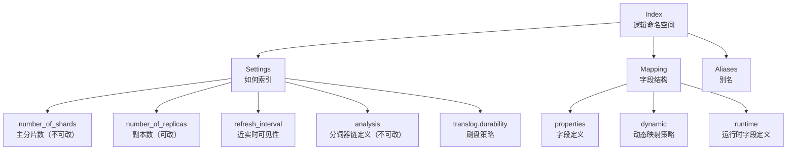
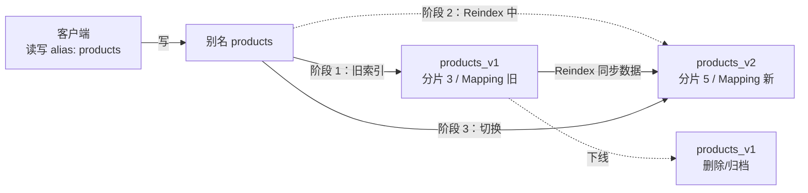

# 索引与映射

> **一句话定位**：索引与映射是 ES 数据建模的核心，"Mapping 怎么设计、Dynamic Mapping 有什么坑"是中高级面试必问。
> **面试热度**：⭐⭐⭐⭐⭐
> **返回**：[ES 知识图谱](../README.md)

---

## 一、概念定义

### 1.1 Index vs MySQL Table：逻辑命名空间 vs 物理表

ES 的 **Index** 与 MySQL 的 **Table** 表面都承载"一类数据"，但本质完全不同——ES Index 是一个**逻辑命名空间**，由一组 Settings（如何索引）和 Mapping（字段结构）描述，**底层并不直接对应一份物理数据**，而是被拆成多个 **Shard（分片）**，每个 Shard 才是一个独立的 Lucene Index 实例（内含多个 Segment）。MySQL 的 Table 是一份**物理文件**（`.ibd` / `.frm`），存储引擎直接读写该文件，分库分表才把它拆开。

| 维度 | ES Index | MySQL Table |
|------|----------|-------------|
| 本质 | 逻辑命名空间 + Settings + Mapping | 物理表文件（.ibd） |
| 物理边界 | 由多个 Shard（Lucene Index）组成，分布在不同节点 | 单文件或分库分表后的多个文件 |
| Schema | Schema-on-write（Mapping 显式） + 可 Schema-on-read（Runtime Field） | Schema-on-write（DDL 显式） |
| 主键 | `_id` 字段，可自动生成 UUID 或业务指定 | `PRIMARY KEY`，业务指定 |
| 扩展方式 | 增加分片数需 Reindex（不可动态改） | 分库分表（ShardingSphere） |
| 路由 | `hash(_id) % num_primary_shards` | 主键直接定位行（B+Tree） |
| 写可见性 | 近实时（refresh_interval 1s） | 实时（提交即见） |

**关键差异 1：分片数不可改**。ES 的分片数 `number_of_shards` 在 Index 创建时确定后**不可修改**——因为路由公式 `hash(routing) % num_primary_shards` 含分片数，改分片数会导致旧数据路由失效。要改分片数只能 Reindex 到新 Index。MySQL 的分库分表一旦定了规则同样难改，但 MySQL 单表的行数没有"分片数"概念，是无界的。

**关键差异 2：Schema 的弹性**。MySQL 是严格 Schema-on-write——DDL 定义列，写入必须匹配列类型，加列要 `ALTER TABLE`。ES 默认是 Schema-on-write + Dynamic Mapping 混合——Mapping 定义已知字段，**未知字段可自动推断类型并写入**（动态映射），生产上推荐用 `dynamic: strict` 拒绝未知字段避免字段爆炸。8.x 还引入 Runtime Field 实现 Schema-on-read——字段不索引，查询时按脚本计算，灵活但查询慢。

> **源码路径**：`org.elasticsearch.cluster.metadata.IndexMetadata`（Index 元数据，含 Settings 与 Mapping）、`org.elasticsearch.index.Index`（Index 标识，含 UUID）。

### 1.2 Mapping 字段类型：keyword/text/数值/向量/对象

Mapping 是 ES 的"Schema 定义"，每个字段声明 `type` 决定如何索引、如何聚合、如何排序。字段类型选错是面试和生产事故的高频根源——把本该用 keyword 的字段误设为 text，导致精确匹配查询变慢且命中错误；把本该用 nested 的对象数组设为 object，导致数组内对象的关联关系丢失。

| 字段类型 | 索引方式 | 聚合支持 | 典型用途 | 备注 |
|---------|---------|---------|---------|------|
| `keyword` | 不分词，整体建倒排 | 支持（doc_values） | 标签、品牌、状态码、ID | 精确匹配、term 查询、聚合 |
| `text` | 分词后建倒排（每个 token 一条倒排） | 不直接支持（需 .keyword 子字段） | 标题、正文、描述 | 全文检索、match 查询 |
| `long`/`integer`/`short`/`byte` | BKD-Tree（数值索引） | 支持 | 计数、ID、枚举 | 整数类型 |
| `double`/`float`/`scaled_float` | BKD-Tree | 支持 | 价格、评分、经纬度 | scaled_float 精度最佳 |
| `date` | BKD-Tree（存毫秒时间戳） | 支持 | 时间戳、日志时间 | 支持 format 自定义 |
| `boolean` | 倒排（true/false） | 支持 | 标志位 | |
| `ip` | 倒排 + Trie | 支持 | IPv4/IPv6 | 支持 CIDR 范围查询 |
| `dense_vector` | 向量索引（HNSW/Lucene 9.x） | 不支持 | 向量检索（KNN） | 8.x 引入，需 dense_vector 类型 |
| `object` | 扁平化（`field.subfield`） | 部分支持 | 单层对象 | 数组内对象关系丢失 |
| `nested` | 每个对象独立文档 | 支持 nested 聚合 | 数组内对象需保持关联 | 额外索引开销 |
| `flattened` | 整对象一个 keyword | 有限支持 | 动态字段多的对象 | 8.x 引入，省字段数 |
| `wildcard` | Wildcard Trie | 有限 | 通配符查询 | 8.x 引入，替代 keyword + wildcard |

**keyword vs text 是面试必问的对子**。keyword 不分词，整个值作为一个 token 建倒排，适合 `term` 精确匹配、聚合、排序；text 分词后每个 token 各建一条倒排，适合 `match` 全文检索，但**不能直接聚合**——聚合要走 text 的子字段 `.keyword`（多字段 multi-fields 设计：`"type": "text", "fields": {"keyword": {"type": "keyword"}}`）。生产惯例：标题、正文用 text + ik 分词 + keyword 子字段兼顾全文检索与聚合；标签、品牌、状态用纯 keyword。

**object vs nested vs flattened 是对象类型的三难选择**。ES 默认对象类型是 `object`——它会**扁平化**：`{"tags": [{"name": "red", "qty": 1}, {"name": "blue", "qty": 2}]}` 被存成 `tags.name: ["red", "blue"]` 和 `tags.qty: [1, 2]` 两个数组，对象间的关联关系丢失——查询 `tags.name=red AND tags.qty=2` 会误命中（red 的 qty 是 1，blue 的 qty 是 2，但扁平化后查询误判）。`nested` 把每个对象作为独立 Lucene 文档索引，保持对象边界，查询精确但写入开销大（N 个对象 = N 个文档）。`flattened`（8.x）把整个对象作为一个 keyword 索引，省字段数但查询能力弱（只能整体查询，不能查子字段）。

> **源码路径**：`org.elasticsearch.index.mapper.KeywordFieldMapper`、`TextFieldMapper`、`ObjectMapper`、`NestedFieldMapper`、`FlattenedFieldMapper`、`DenseVectorFieldMapper`；类型注册在 `org.elasticsearch.index.mapper.MapperRegistry`。

### 1.3 Dynamic Mapping：自动推断的便利与风险

Dynamic Mapping 是 ES 区别于 MySQL 的核心特性之一——写入未知字段时，ES **自动推断 JSON 类型并生成 Mapping**，无需预先 DDL。便利背后是生产事故的高发地。

**推断规则**：JSON 字符串 → `text` + `keyword` 子字段（双索引）；JSON 整数/浮点 → `long`/`float`；JSON 布尔 → `boolean`；JSON 对象 → `object`；符合日期格式的字符串 → `date`（`date_detection` 默认开启）。

**风险 1：字段爆炸**。日志场景下，每条日志的字段名不同（如 `field1`/`field2`/.../`fieldN`），Dynamic Mapping 会为每个字段建 Mapping，集群 Mapping 数爆炸，单个 Index 的字段数可达数万，触发 `_cluster/state` 元数据膨胀、Master 节点 OOM。生产必加 `index.mapping.total_fields.limit`（默认 1000）。

**风险 2：类型冲突**。第一条数据字段 `price` 是整数（推断为 `long`），第二条是带小数的 `12.99`（写入失败，因为已是 `long`）。只能 Reindex 重建。

**风险 3：日期误判**。字符串 `2026-08-12` 被推断为 date，但若业务期望它是 keyword（如订单号 `2026-08-12-001`），类型错配导致查询行为异常。

**`dynamic` 三种模式**：

| `dynamic` 值 | 行为 | 适用场景 |
|-------------|------|---------|
| `true`（默认） | 未知字段自动推断类型并写入 | 探索期、日志初稿 |
| `runtime`（8.x） | 未知字段不索引，自动生成 Runtime Field | 字段不确定但需查询 |
| `strict` | 未知字段写入报错 | 生产强约束，杜绝字段爆炸 |

**生产推荐**：核心业务索引 `dynamic: strict`；日志索引 `dynamic: true` + `total_fields.limit` + Dynamic Template 约束；探索期 `dynamic: runtime` 兜底。

### 1.4 Runtime Field 8.x：Schema-on-read 的回归

Runtime Field 是 8.0 引入的运行时计算字段——**不在索引时计算和存储，而在查询时按 Painless 脚本实时计算**。这是 ES 对 Schema-on-read 模式的正式支持，对应"字段不确定时先用 Runtime Field 探索，稳定后再转 indexed 字段"的工作流。

| 维度 | Runtime Field | Indexed Field |
|------|---------------|---------------|
| 计算时机 | 查询时（Painless 脚本） | 索引时（写入即计算） |
| 存储 | 不占磁盘（仅定义在 Mapping） | 占磁盘（倒排 + doc_values） |
| 查询性能 | 慢（每条文档都要跑脚本） | 快（直接查倒排） |
| 字段变更 | 改脚本即生效，无需 Reindex | 改类型需 Reindex 重建 |
| 适用场景 | 探索期、低频查询、修复历史数据 | 高频查询、聚合、排序 |

**核心权衡**：Runtime Field 用"查询慢"换"字段灵活"——不需要 Reindex 就能新增字段，但每次查询都要跑脚本，数据量大时延迟显著。生产建议：Runtime Field 用于临时探索或低频修复，高频字段稳定后转 indexed 字段（Reindex 或新建索引）。

> **源码路径**：`org.elasticsearch.index.mapper.RuntimeField`（运行时字段基类）、`org.elasticsearch.script.field.DocReaderField`（脚本读取文档字段）；Painless 脚本执行器在 `org.elasticsearch.painless`。

---

## 二、原理与流程

### 2.1 Index Settings 详解：分片数不可改的根因

Index Settings 是 Index 级配置，控制分片、副本、刷新、分析器等行为。核心配置项：

| 配置项 | 默认值 | 说明 | 可否动态改 |
|--------|--------|------|----------|
| `index.number_of_shards` | 1 | 主分片数 | **不可改**（创建后固定） |
| `index.number_of_replicas` | 1 | 副本数 | 可改（`PUT _settings`） |
| `index.refresh_interval` | 1s | refresh 间隔（近实时可见性） | 可改（可设 -1 关闭） |
| `index.analysis.*` | - | 分词器/过滤器/normalizer 定义 | **不可改**（创建后固定） |
| `index.mapping.total_fields.limit` | 1000 | 最大字段数 | 可改 |
| `index.max_doc_values_fields` | 1000 | doc_values 字段上限 | 可改 |
| `index.translog.durability` | request | translog 刷盘策略 | 可改 |
| `index.search.idle.after` | 30s | 空闲多久进入 search idle | 可改（8.x） |

**分片数不可改的根因**：ES 路由公式 `shard = hash(routing) % num_primary_shards` 含分片数。若分片数从 3 改为 5，原本路由到 shard 0 的文档现在可能路由到 shard 2，但文档物理还在 shard 0，查询会找不到。所以改分片数只能 Reindex——新建一个分片数不同的 Index，把旧数据重新写入让路由重新计算。

**Settings 层级**：



**Settings 与 Mapping 的边界**：Settings 是"如何索引"（分片、副本、刷新、分词器链定义），Mapping 是"字段长什么样"（字段类型、是否索引、分词器）。`analysis` 配置（分词器链）在 Settings 里，但字段的 `analyzer` 指定在 Mapping 里——Settings 定义分词器，Mapping 引用分词器。

> **源码路径**：`org.elasticsearch.index.IndexSettings`（Index 级配置抽象，含分片数、副本数、refresh_interval 等）、`org.elasticsearch.indices.IndicesService`（构建 IndexSettings）。

### 2.2 Mapping 结构：properties/type/analyzer/index/doc_values

Mapping 的 JSON 结构：

```json
PUT /products
{
  "mappings": {
    "dynamic": "strict",
    "properties": {
      "title": {
        "type": "text",
        "analyzer": "ik_max_word",
        "search_analyzer": "ik_smart",
        "fields": {
          "keyword": { "type": "keyword", "ignore_above": 256 }
        }
      },
      "price": {
        "type": "scaled_float",
        "scaling_factor": 100
      },
      "tags": { "type": "keyword" },
      "description": {
        "type": "text",
        "index": false
      },
      "create_time": {
        "type": "date",
        "format": "yyyy-MM-dd HH:mm:ss||epoch_millis"
      },
      "sku": {
        "type": "nested",
        "properties": {
          "sku_id": { "type": "keyword" },
          "sku_price": { "type": "scaled_float", "scaling_factor": 100 }
        }
      },
      "brand": {
        "type": "keyword",
        "doc_values": true
      }
    }
  }
}
```

**关键参数**：

| 参数 | 作用 | 默认 |
|------|------|------|
| `type` | 字段类型 | 必填 |
| `analyzer` | 索引时分词器 | standard |
| `search_analyzer` | 查询时分词器（可与索引时不同） | 同 analyzer |
| `index` | 是否建倒排索引 | true |
| `doc_values` | 是否建列存（聚合/排序用） | true（text 默认 false） |
| `norms` | 是否存长度归一化（打分用） | text 默认 true，keyword 默认 false |
| `index_options` | 倒排存储粒度（docs/freqs/positions/offsets） | positions（text） |
| `ignore_above` | keyword 超长不索引 | 256（仅 keyword） |
| `null_value` | 遇 null 时的替代值 | 无 |

**`index: false` vs `doc_values: false`**：`index: false` 不建倒排（不能查询），但仍建 doc_values（可聚合/排序）；`doc_values: false` 不建列存（不能聚合/排序），但仍建倒排（可查询）。text 字段默认 `doc_values: false`（因为全文检索字段一般不聚合），keyword 默认 `doc_values: true`（聚合是主要用途）。

**多字段 multi-fields**：同一字段用不同方式索引——`title` 用 text 分词全文检索 + `title.keyword` 用 keyword 精确匹配 + 聚合。这是 ES 解决"一个字段既要全文检索又要聚合"的标准方案，代价是双份索引开销。

> **源码路径**：`org.elasticsearch.index.mapper.DocumentMapper`（文档到 Lucene 文档的映射）、`org.elasticsearch.index.mapper.RootObjectMapper`、`org.elasticsearch.index.mapper.FieldMapper`（字段映射基类）。

### 2.3 Dynamic Mapping 推断规则：JSON 类型 → ES 类型

Dynamic Mapping 的推断规则是面试必背表：

| JSON 类型 | ES 推断类型 | 备注 |
|----------|-----------|------|
| 整数（`123`） | `long` | 不区分 int/long，统一 long |
| 浮点（`12.34`） | `float` | 注意：默认 float 而非 double，精度损失风险 |
| 布尔（`true`/`false`） | `boolean` | |
| 字符串（符合日期格式） | `date` | `date_detection` 默认 true |
| 字符串（符合数字） | `long` 或 `float` | `numeric_detection` 默认 false |
| 字符串（其他） | `text` + `.keyword` 子字段 | 双索引 |
| 对象（`{"k": "v"}`） | `object` | 递归推断子字段 |
| 数组 | 数组首元素的类型 | 空数组不推断 |

**日期误判的风险**：字符串 `2026-08-12` 默认被推断为 date 类型（`date_detection: true`）。但若这是订单号、批次号等业务标识，应保持 keyword。解决：①关 `date_detection`，改用 Dynamic Template 显式匹配日期格式字段；②字段名加后缀规避（如 `create_time` 才允许推断为 date）。

**`dynamic_date_formats`**：自定义可识别的日期格式列表，默认 `["strict_date_optional_time","yyyy/MM/dd HH:mm:ss Z||yyyy/MM/dd"]`。生产可收紧为 `["yyyy-MM-dd HH:mm:ss"]`，避免误判 `2026/08/12` 等其他格式。

**`numeric_detection`**：默认 false——字符串 `"123"` 不被识别为数字，保持 text+keyword。若开 true，字符串 `"123"` 推断为 long，但风险是带前导零的 ID（如 `"001"`）会被转成 1 丢失前导零，生产一般不开。

**规避策略**：

```json
PUT /logs
{
  "mappings": {
    "dynamic": "strict",
    "dynamic_date_formats": ["yyyy-MM-dd HH:mm:ss"],
    "numeric_detection": false,
    "date_detection": true,
    "properties": {
      "@timestamp": { "type": "date", "format": "yyyy-MM-dd HH:mm:ss||epoch_millis" }
    }
  }
}
```

### 2.4 Dynamic Template：按规则约束动态推断

Dynamic Template 是 Dynamic Mapping 的"约束层"——按字段名或类型匹配规则，把动态推断的结果**改写为预定义的类型**。这是规避字段爆炸和类型冲突的关键工具。

**匹配规则**：

| 匹配器 | 作用 | 示例 |
|--------|------|------|
| `match_mapping_type` | 按 JSON 类型匹配（string/long/object/...） | `"match_mapping_type": "string"` 匹配所有字符串 |
| `match` | 按字段名通配符匹配 | `"match": "long_*"` 匹配 `long_field` |
| `unmatch` | 排除字段名 | `"unmatch": "*_text"` |
| `match_pattern` | `regex`/`contains`/`simple`（默认） | `"match_pattern": "regex"` |
| `path_match` | 按字段路径匹配（含嵌套） | `"path_match": "sku.*"` |

**典型 Dynamic Template 示例**：

```json
PUT /logs
{
  "mappings": {
    "dynamic_templates": [
      {
        "strings_as_keyword": {
          "match_mapping_type": "string",
          "mapping": {
            "type": "keyword",
            "ignore_above": 512
          }
        }
      },
      {
        "long_fields_to_keyword": {
          "match": "id_*",
          "mapping": {
            "type": "keyword"
          }
        }
      },
      {
        "date_fields": {
          "match": "*_time",
          "mapping": {
            "type": "date",
            "format": "yyyy-MM-dd HH:mm:ss||epoch_millis"
          }
        }
      },
      {
        "all_strings_to_runtime": {
          "match_mapping_type": "string",
          "mapping": {
            "type": "keyword",
            "ignore_above": 256
          }
        }
      }
    ]
  }
}
```

**策略**：日志场景把所有字符串默认设为 keyword（不分词，省存储、省字段爆炸风险），仅明确需要全文检索的字段在 Mapping 里单独定义为 text。这样未知字段不会自动建 text+keyword 双索引，磁盘和元数据开销显著降低。

> **源码路径**：`org.elasticsearch.index.mapper.DynamicTemplate`（动态模板解析）、`org.elasticsearch.index.mapper.DocumentParser`（写入时按模板推断字段类型）。

### 2.5 Runtime Field 8.x：运行时计算字段

Runtime Field 在 Mapping 的 `runtime` 段定义，或作为字段属性标记。查询时按 Painless 脚本计算，不占磁盘。

**定义方式 1：Mapping 顶层 `runtime` 段**：

```json
PUT /products
{
  "mappings": {
    "runtime": {
      "price_with_tax": {
        "type": "double",
        "script": {
          "source": "emit(doc['price'].value * 1.13)"
        }
      },
      "day_of_week": {
        "type": "keyword",
        "script": {
          "source": "emit(doc['create_time'].value.dayOfWeekEnum.getDisplayName(TextStyle.SHORT, Locale.ROOT))"
        }
      }
    },
    "properties": {
      "price": { "type": "scaled_float", "scaling_factor": 100 },
      "create_time": { "type": "date" }
    }
  }
}
```

**定义方式 2：查询时临时定义**：

```json
GET /products/_search
{
  "runtime_mappings": {
    "price_with_tax": {
      "type": "double",
      "script": { "source": "emit(doc['price'].value * 1.13)" }
    }
  },
  "query": { "range": { "price_with_tax": { "gte": 100 } } }
}
```

**与 indexed 字段的权衡**：

| 维度 | Runtime Field | Indexed Field |
|------|---------------|---------------|
| 写入开销 | 无（仅定义） | 索引 + doc_values 占磁盘 |
| 查询性能 | 慢（每文档跑脚本） | 快（直接查倒排） |
| 字段变更 | 改脚本即生效 | 改类型需 Reindex |
| 聚合 | 支持（但慢） | 支持（快） |
| 适用 | 探索、低频、修复 | 生产、高频 |

**典型场景**：①日志字段名不固定，先 Runtime Field 探索数据形状，稳定后转 indexed；②历史数据字段类型错误（如 price 原本是 string），用 Runtime Field 临时转换为 double 供查询，同时 Reindex 重建索引修类型。

> **源码路径**：`org.elasticsearch.index.mapper.RuntimeField`（运行时字段抽象）、`org.elasticsearch.script.field.DocReaderField`（脚本读取文档字段）、查询时执行器在 `org.elasticsearch.search.lookup.LeafDocLookup`。

### 2.6 Index Alias 与 Index Template：零停机切换与自动化

**Index Alias（别名）** 是指向一个或多个 Index 的"软链接"——客户端写别名，ES 路由到具体 Index；客户端查别名，ES 在所有关联 Index 上查询并归并。别名的核心价值是**零停机切换**：重建索引时新旧 Index 共享一个别名，切换别名指向即完成迁移，客户端无感。



**别名的两类操作**：

```json
POST /_aliases
{
  "actions": [
    { "add": { "index": "products_v1", "alias": "products" } },
    { "add": { "index": "products_v2", "alias": "products" } }
  ]
}

POST /_aliases
{
  "actions": [
    { "remove": { "index": "products_v1", "alias": "products" } },
    { "add": { "index": "products_v2", "alias": "products", "is_write_index": true } }
  ]
}
```

**`is_write_index`**：一个别名关联多个 Index 时，只能有一个是 write_index（写入路由到它），其他只读。这是日志按天滚动（`logs-2026.08.11`、`logs-2026.08.12` 共享别名 `logs`）的标准模式——今天写今天的 Index，昨天和以前的 Index 只读。

**Index Template（索引模板）** 是新 Index 创建时的"模板"——按 `index_patterns` 匹配 Index 名，匹配则自动应用预定义的 Settings、Mappings、Aliases。日志按天滚动场景必备：新一天的 Index 自动套用模板，无需人工配置。

```json
PUT /_index_template/logs_template
{
  "index_patterns": ["logs-*"],
  "template": {
    "settings": {
      "number_of_shards": 1,
      "number_of_replicas": 1,
      "refresh_interval": "5s"
    },
    "mappings": {
      "dynamic": "strict",
      "dynamic_templates": [
        { "strings_as_keyword": { "match_mapping_type": "string", "mapping": { "type": "keyword", "ignore_above": 512 } } }
      ],
      "properties": {
        "@timestamp": { "type": "date" },
        "level": { "type": "keyword" },
        "message": { "type": "text" }
      }
    },
    "aliases": {
      "logs": {}
    }
  },
  "priority": 100
}
```

**`priority`**：多个模板都匹配同一个 Index 名时，priority 高的覆盖低的（8.x 引入）。旧版用 `order` 字段，8.x 已废弃改 `priority`。

**Composable Template（8.x）**：8.x 引入组件化模板——`_component_template` 定义可复用的 Settings/Mappings 片段，`_index_template` 引用多个 component 组合。如日志模板共享一个 component（通用 Settings）+ 各业务模板特化（业务 Mapping）。

> **源码路径**：`org.elasticsearch.cluster.metadata.AliasMetadata`（别名元数据）、`org.elasticsearch.cluster.metadata.MetadataIndexTemplateService`（模板服务，含 composable template）、`org.elasticsearch.cluster.metadata.ComponentTemplate`（组件模板）。

### 2.7 ILM 索引生命周期：Hot/Warm/Cold/Delete

ILM（Index Lifecycle Management）是 ES 管理"索引生命周期"的自动化机制——按索引年龄或大小触发阶段流转，自动 Rollover、Shrink、Force-merge、Delete。这是日志和时序数据场景的核心运维工具。

**四阶段**：

| 阶段 | 触发条件 | 动作 | 节点角色 |
|------|---------|------|---------|
| Hot | 新索引 | 接受写入、查询 | `data_hot`（SSD，高 CPU） |
| Warm | `age: 1d` | 移到 Warm 节点、可 shrink 缩分片 | `data_warm`（SSD/HDD，中 CPU） |
| Cold | `age: 7d` | 移到 Cold 节点、可 forcemerge 合并段 | `data_cold`（HDD，低 CPU） |
| Delete | `age: 90d` | 删除索引 | - |

**关键动作**：

- **Rollover**：按 `max_age`（如 1d）或 `max_size`（如 50GB）或 `max_docs`（如 1 亿）滚动——当前 Index 达阈值则创建新 Index，别名 `is_write_index` 切到新 Index。这是"按天/按大小滚动索引"的标准实现。
- **Shrink**：把分片数从大（如 5）缩到小（如 1），减少段和元数据开销。Warm 阶段常用——Hot 阶段分片多保写入并行度，Warm 阶段写入已停，缩分片省资源。
- **Force-merge**：合并 Lucene Segment 到指定段数（如 1），减少段数、提升查询性能。Cold 阶段常用——Cold 数据只读，合并段一次性投入换长期查询加速。
- **Searchable Snapshot**：Cold 阶段可把索引转为 searchable snapshot（仅元数据在集群、数据在 snapshot repo 如 S3），大幅省本地磁盘。


**ILM Policy 定义**：

```json
PUT /_ilm/policy/logs_policy
{
  "policy": {
    "phases": {
      "hot": {
        "actions": {
          "rollover": { "max_age": "1d", "max_size": "50gb", "max_docs": 100000000 },
          "set_priority": { "priority": 100 }
        }
      },
      "warm": {
        "min_age": "1d",
        "actions": {
          "shrink": { "number_of_shards": 1 },
          "forcemerge": { "max_num_segments": 1 },
          "set_priority": { "priority": 50 }
        }
      },
      "cold": {
        "min_age": "7d",
        "actions": {
          "searchable_snapshot": { "snapshot_repository": "logs-s3" },
          "set_priority": { "priority": 25 }
        }
      },
      "delete": {
        "min_age": "90d",
        "actions": { "delete": {} }
      }
    }
  }
}
```

**关联 Index Template**：模板里 `index.lifecycle.name` 指定 ILM Policy，`index.lifecycle.rollover_alias` 指定滚动别名，新 Index 创建自动套用 ILM。

> **源码路径**：`org.elasticsearch.xpack.core.ilm.IndexLifecycleService`（ILM 服务）、`RolloverAction`、`ShrinkAction`、`ForceMergeAction`、`SearchableSnapshotAction`（各阶段动作）。

### 2.8 源码路径汇总

| 概念 | 源码路径 |
|------|---------|
| Index 元数据（Settings + Mapping） | `org.elasticsearch.cluster.metadata.IndexMetadata` |
| Index 标识（UUID） | `org.elasticsearch.index.Index` |
| Index 级配置抽象 | `org.elasticsearch.index.IndexSettings` |
| Document → Lucene 文档映射 | `org.elasticsearch.index.mapper.DocumentMapper` |
| 字段映射基类 | `org.elasticsearch.index.mapper.FieldMapper` |
| 各字段类型 Mapper | `KeywordFieldMapper` / `TextFieldMapper` / `ObjectMapper` / `NestedFieldMapper` / `FlattenedFieldMapper` / `DenseVectorFieldMapper` |
| Dynamic Template 解析 | `org.elasticsearch.index.mapper.DynamicTemplate` |
| 写入时字段类型推断 | `org.elasticsearch.index.mapper.DocumentParser` |
| Runtime Field 抽象 | `org.elasticsearch.index.mapper.RuntimeField` |
| 别名元数据 | `org.elasticsearch.cluster.metadata.AliasMetadata` |
| Index Template 服务 | `org.elasticsearch.cluster.metadata.MetadataIndexTemplateService` |
| Component Template | `org.elasticsearch.cluster.metadata.ComponentTemplate` |
| ILM 服务 | `org.elasticsearch.xpack.core.ilm.IndexLifecycleService` |

---

## 三、高频追问

### Q1：ES 有哪些字段类型？

核心分四类：①**字符串**——keyword（不分词精确匹配）、text（分词全文检索）、wildcard（8.x 通配符）；②**数值**——long/integer/short/byte、double/float/scaled_float（scaled_float 用 long 存放大 100 倍的整数，精度最佳）；③**时序**——date（毫秒时间戳）、ip；④**对象**——object（扁平化）、nested（独立文档）、flattened（整对象一个 keyword）；⑤**向量**——dense_vector（8.x KNN 检索）。选型核心：标签/ID 用 keyword，标题/正文用 text+keyword 子字段，价格用 scaled_float，子文档关联用 nested，向量检索用 dense_vector。

### Q2：keyword 和 text 区别？

**keyword 不分词**，整个值作为一个 token 建倒排，适合 `term` 精确匹配、聚合、排序——标签、品牌、状态码用 keyword。**text 分词**后每个 token 各建一条倒排，适合 `match` 全文检索——标题、正文用 text。text 不能直接聚合（聚合要走 `.keyword` 子字段），keyword 不能全文检索。生产惯例：标题/正文用 text + ik 分词 + keyword 子字段兼顾两者；纯精确匹配字段用纯 keyword。代价：text 的倒排索引比 keyword 大（每个 token 一条），且 keyword 子字段是双份索引。

### Q3：Dynamic Mapping 有什么坑？

三大坑：①**字段爆炸**——日志场景每条日志字段名不同，Dynamic Mapping 为每个字段建 Mapping，集群元数据膨胀、Master OOM。必加 `index.mapping.total_fields.limit`。②**类型冲突**——第一条 `price` 是整数推断为 long，第二条带小数写入失败，只能 Reindex 重建。③**日期误判**——字符串 `2026-08-12` 被推断为 date，但若是订单号则类型错配。规避：生产用 `dynamic: strict` 拒绝未知字段，或 `dynamic: runtime` 把未知字段转为 Runtime Field（不索引、不占磁盘）；日志场景用 Dynamic Template 把所有字符串默认设为 keyword，避免自动建 text+keyword 双索引。

### Q4：nested 和 object 区别？

**object 扁平化**——数组内对象的字段被打散成数组，对象间关联关系丢失。如 `[{name: red, qty: 1}, {name: blue, qty: 2}]` 被存成 `name: [red, blue]` + `qty: [1, 2]`，查询 `name=red AND qty=2` 误命中（red 的 qty 实际是 1）。**nested 独立文档**——每个对象作为独立 Lucene 文档索引，保持对象边界，查询精确。代价：N 个对象 = N 个文档，写入和存储开销大，查询要用 `nested` 查询语法。选型：数组内对象需保持关联（如商品 SKU、订单明细）用 nested；单层对象不需关联用 object；动态字段多的对象省字段数用 flattened（8.x）。

### Q5：Runtime Field 是什么？什么时候用？

8.0 引入的**运行时计算字段**——不在索引时计算和存储，查询时按 Painless 脚本实时计算。优势：①新增字段无需 Reindex（改 Mapping 即生效）；②不占磁盘（仅定义在 Mapping）。劣势：查询慢（每条文档都要跑脚本），数据量大时延迟显著。适用：①探索期字段不稳定，先 Runtime Field 试，稳定后转 indexed；②修复历史数据类型错误（如 price 原本是 string），临时用 Runtime Field 转换供查询，同时 Reindex 修类型；③低频查询字段不值得占磁盘。生产原则：Runtime Field 是过渡态，高频字段最终要转 indexed。

### Q6：分片数能改吗？

**不能直接改**。ES 路由公式 `shard = hash(routing) % num_primary_shards` 含分片数，改分片数会导致旧文档路由失效。要改分片数只能 **Reindex**——新建一个分片数不同的 Index，用 `_reindex` API 把旧数据重新写入（重新路由），完成后用别名切换客户端指向。过程可零停机：新旧 Index 共享别名，Reindex 完成后切别名指向新 Index，下线旧 Index。`number_of_replicas` 可以动态改（`PUT _settings`），因为副本数不参与路由公式。

### Q7：别名有什么用？

别名是指向一个或多个 Index 的"软链接"，核心价值：①**零停机切换**——Reindex 重建索引时新旧 Index 共享别名，切别名指向即完成迁移，客户端无感；②**多索引查询**——日志按天滚动（`logs-2026.08.11`、`logs-2026.08.12`）共享别名 `logs`，查别名即查所有天数据并归并；③**写入路由**——`is_write_index: true` 指定别名关联的多个 Index 中哪个接收写入，日志滚动时今天的 Index 是 write_index，其他只读。别名是 ILM Rollover 的基础——Rollover 自动创建新 Index 并切别名 write_index。

### Q8：ILM 是什么？

**Index Lifecycle Management**，索引生命周期管理——按索引年龄或大小自动流转阶段。四阶段：Hot（新索引、写入+高频查询、data_hot 节点）→ Warm（age 1d、shrink 缩分片、forcemerge 合并段、data_warm 节点）→ Cold（age 7d、转 searchable snapshot 仅元数据本地、data_cold 节点）→ Delete（age 90d、删除）。关键动作：**Rollover**（按 max_age/max_size/max_docs 滚动新建索引）、**Shrink**（缩分片数）、**Force-merge**（合并段到指定数）、**Searchable Snapshot**（数据迁 S3 仅元数据本地）。日志场景标配：按天滚动 + Hot 1d→Warm 7d→Cold 30d→Delete 90d，自动省存储和运维。

---

## 四、实战关联

### 4.1 Spring Data ES 注解定义 Mapping

Spring Data Elasticsearch 用注解驱动 Mapping 定义，与 `framework/spring-framework` 的注解驱动配置一脉相承。核心注解：

```java
@Document(indexName = "products", aliases = @Alias("@alias"), createIndex = false)
@Setting(settingPath = "es/settings/products.json")
public class Product {
    @Id
    private String id;

    @MultiField(mainField = @Field(type = FieldType.Text, analyzer = "ik_max_word", searchAnalyzer = "ik_smart"),
                otherFields = @InnerField(suffix = "keyword", type = FieldType.Keyword, ignoreAbove = 256))
    private String title;

    @Field(type = FieldType.ScaledFloat, scalingFactor = 100)
    private Double price;

    @Field(type = FieldType.Keyword)
    private String brand;

    @Field(type = FieldType.Date, format = DateFormat.date_hour_minute_second)
    private LocalDateTime createTime;

    @Field(type = FieldType.Nested)
    private List<Sku> skus;

    @Field(type = FieldType.DenseVector, dims = 768)
    private float[] embedding;

    public static class Sku {
        @Field(type = FieldType.Keyword)
        private String skuId;
        @Field(type = FieldType.ScaledFloat, scalingFactor = 100)
        private Double skuPrice;
    }
}
```

**`@Document` 对应 ES Index**，`indexName` 是索引名（生产用别名），`createIndex: false` 避免启动时自动建索引（生产用 Index Template 统一管理）。`@Field` 对应 Mapping 字段，`type`/`analyzer`/`searchAnalyzer` 直接映射。`@MultiField` 实现多字段——main field 用 text 分词，inner field 用 keyword 子字段。`@Setting` 引用外部 Settings JSON 文件（分词器链定义在 Settings 里）。

### 4.2 字段类型选型速查

| 业务字段 | 选型 | 理由 |
|---------|------|------|
| 标签/分类 | keyword | 精确匹配 + 聚合 |
| 标题/正文 | text + ik_max_word + keyword 子字段 | 全文检索 + 聚合/精确匹配 |
| 价格/金额 | scaled_float（scaling_factor 100） | 精度最佳，long 存放大 100 倍的整数 |
| 计数/ID | long / keyword（看是否需聚合） | long 省存储，keyword 利聚合 |
| 时间戳 | date + format | 时序聚合、范围查询 |
| 经纬度 | geo_point | 地理查询 |
| 商品 SKU 子文档 | nested | 保持对象关联 |
| 向量特征 | dense_vector（dims 对齐模型） | KNN 检索 |
| 日志 message | text + keyword 子字段 | 全文检索 + 聚合 |
| 日志字段名不固定 | dynamic: strict + Dynamic Template | 杜绝字段爆炸 |

### 4.3 与 MySQL 表结构设计对比

| 维度 | ES Mapping | MySQL Table |
|------|-----------|-------------|
| Schema 模式 | Schema-on-write（Mapping）+ 可 Schema-on-read（Runtime Field） | Schema-on-write（DDL） |
| 加列 | Mapping 加字段（已存在文档需 Reindex 才能填充） | `ALTER TABLE ADD COLUMN` |
| 改列类型 | Reindex 重建 | `ALTER TABLE MODIFY COLUMN` |
| 字段数上限 | `total_fields.limit` 默认 1000 | 无硬限（受行大小约束） |
| 索引 | 倒排 + doc_values + BKD-Tree | B+Tree |
| 主键 | `_id`（可自动生成 UUID） | `PRIMARY KEY` |
| 写可见性 | refresh_interval 1s 近实时 | 实时 |

**关键差异**：ES 加列无需像 MySQL 那样扫全表（`ALTER TABLE` 在 MySQL 大表是分钟级阻塞），但已有文档的新列字段是空的，需 Reindex 或 Update By Query 填充。ES 改列类型必须 Reindex（因倒排索引已按旧类型建好），MySQL 改列类型是 `ALTER TABLE`（小表快、大表慢但仍可用）。

### 4.4 关联 framework/spring-framework

`@Document`/`@Field` 注解驱动 Mapping 与 `framework/spring-framework` 的注解驱动配置（`@Configuration`/`@Bean`/`@Component`）一脉相承——都是"声明式配置 + 容器扫描"的模式。Spring Data ES 的 `ElasticsearchRepository` 接口自动生成 CRUD 方法（`save`/`findById`/`findAll`），与 Spring Data JPA 的 `JpaRepository` 接口同构，降低学习成本。

**对照点**：`@Document` 类比 `@Entity`（JPA），`@Id` 类比 `@Id`（JPA），`@Field` 类比 `@Column`（JPA）。差异：ES 注解驱动的是索引结构（倒排/列存），JPA 注解驱动的是表结构（行存 + B+Tree）。

---

## 五、系统设计案例

### 案例 1：电商商品搜索索引方案

**场景**：电商平台商品搜索，支持标题全文检索、品牌/分类精确过滤、价格范围查询、SKU 子文档关联、商品向量检索（以图搜图），单索引 1 亿商品。

**完整 Mapping 设计**：

```json
PUT /products_v1
{
  "settings": {
    "number_of_shards": 5,
    "number_of_replicas": 1,
    "refresh_interval": "1s",
    "analysis": {
      "analyzer": {
        "ik_max_word": { "type": "custom", "tokenizer": "ik_max_word" },
        "ik_smart": { "type": "custom", "tokenizer": "ik_smart" }
      }
    }
  },
  "mappings": {
    "dynamic": "strict",
    "properties": {
      "product_id": { "type": "keyword" },
      "title": {
        "type": "text",
        "analyzer": "ik_max_word",
        "search_analyzer": "ik_smart",
        "fields": {
          "keyword": { "type": "keyword", "ignore_above": 256 }
        }
      },
      "description": {
        "type": "text",
        "analyzer": "ik_max_word",
        "search_analyzer": "ik_smart"
      },
      "brand": { "type": "keyword" },
      "category": { "type": "keyword" },
      "tags": { "type": "keyword" },
      "price": { "type": "scaled_float", "scaling_factor": 100 },
      "sales_count": { "type": "integer" },
      "rating": { "type": "scaled_float", "scaling_factor": 10 },
      "create_time": { "type": "date", "format": "yyyy-MM-dd HH:mm:ss||epoch_millis" },
      "status": { "type": "keyword" },
      "skus": {
        "type": "nested",
        "properties": {
          "sku_id": { "type": "keyword" },
          "sku_price": { "type": "scaled_float", "scaling_factor": 100 },
          "sku_stock": { "type": "integer" },
          "sku_attrs": { "type": "keyword" }
        }
      },
      "embedding": { "type": "dense_vector", "dims": 768, "index": true, "similarity": "cosine" }
    }
  },
  "aliases": { "products": {} }
}
```

**选型要点**：①`title` 用 text + ik 分词 + keyword 子字段——ik_max_word 索引时细粒度分词保召回，ik_smart 查询时粗粒度分词保精度，keyword 子字段支持聚合和精确匹配；②`price` 用 scaled_float（scaling_factor 100）——价格放大 100 倍存为 long，避免浮点精度问题，比 double 省存储；③`skus` 用 nested——商品多 SKU 子文档需保持对象关联（查"红色 SKU 且价格 < 100"不能误命中），nested 保证每个 SKU 独立索引；④`embedding` 用 dense_vector（dims 768 对齐 BERT 模型）——支持以图搜图 KNN 检索，`similarity: cosine` 用余弦相似度；⑤分片数 5（1 亿商品 / 5 = 2000 万/分片，单分片 20-40GB 合理）；⑥`dynamic: strict` 拒绝未知字段，生产强约束。

**别名切换**：客户端写别名 `products`，ES 路由到 `products_v1`。重建索引时 Reindex 到 `products_v2`（新分片数或新 Mapping），完成后切别名指向 `products_v2`，下线 `products_v1`，零停机。

### 案例 2：日志索引 ILM 方案

**场景**：应用日志收集，每日 50GB，需保留 90 天，查询热数据（最近 7 天）快、冷数据（7-90 天）省存储、超 90 天自动删除。

**ILM Policy + Index Template**：

```json
PUT /_ilm/policy/app_logs_policy
{
  "policy": {
    "phases": {
      "hot": {
        "actions": {
          "rollover": { "max_age": "1d", "max_size": "50gb" },
          "set_priority": { "priority": 100 }
        }
      },
      "warm": {
        "min_age": "1d",
        "actions": {
          "shrink": { "number_of_shards": 1 },
          "forcemerge": { "max_num_segments": 1 },
          "set_priority": { "priority": 50 }
        }
      },
      "cold": {
        "min_age": "7d",
        "actions": {
          "searchable_snapshot": { "snapshot_repository": "logs-s3" },
          "set_priority": { "priority": 25 }
        }
      },
      "delete": {
        "min_age": "90d",
        "actions": { "delete": {} }
      }
    }
  }
}

PUT /_index_template/app_logs_template
{
  "index_patterns": ["app-logs-*"],
  "template": {
    "settings": {
      "number_of_shards": 3,
      "number_of_replicas": 1,
      "refresh_interval": "5s",
      "index.lifecycle.name": "app_logs_policy",
      "index.lifecycle.rollover_alias": "app-logs"
    },
    "mappings": {
      "dynamic": "true",
      "dynamic_templates": [
        { "strings_as_keyword": { "match_mapping_type": "string", "mapping": { "type": "keyword", "ignore_above": 512 } } }
      ],
      "properties": {
        "@timestamp": { "type": "date", "format": "yyyy-MM-dd HH:mm:ss.SSS||epoch_millis" },
        "level": { "type": "keyword" },
        "service": { "type": "keyword" },
        "trace_id": { "type": "keyword" },
        "message": { "type": "text", "analyzer": "standard" }
      }
    },
    "aliases": { "app-logs": {} }
  },
  "priority": 100
}

PUT /app-logs-000001
POST /_aliases
{
  "actions": [
    { "add": { "index": "app-logs-000001", "alias": "app-logs", "is_write_index": true } }
  ]
}
```

**阶段流转**：


**存储估算**：Hot 1 天 50GB × 3 分片 × 1 副本 = 300GB（SSD）；Warm 6 天 × 50GB / shrink 后无副本 = 300GB（SSD/HDD）；Cold 83 天 × 50GB 转 searchable snapshot 仅元数据本地 = 83 × 几十 MB 元数据 ≈ 几 GB 本地 + 4.15TB S3；总本地磁盘 < 1TB，相比不分级全本地存储（90 × 50 × 2 副本 = 9TB）省 9 倍。

**关键设计**：①Rollover 按 `max_age: 1d` 或 `max_size: 50gb` 双触发——日志突发时按大小滚动避免单索引过大，平峰时按天滚动保时间对齐；②Warm 阶段 shrink 3→1——Hot 阶段 3 分片保写入并行度，Warm 阶段写入已停缩到 1 分片省元数据和段开销；③Cold 阶段 searchable snapshot——数据迁 S3 仅元数据本地，本地磁盘占用骤降，查询时按需从 S3 拉取并缓存；④Delete 阶段自动清理超 90 天索引，无需人工脚本。

**追问链**（2 条）：

- **追问 1：日志突发流量怎么办？**——Rollover 的 `max_size` 兜底（50GB 即滚动），避免单索引过大；若单天超 50GB 会滚动多个索引，查别名 `app-logs` 自动归并。写入侧用 bulk 批量 + 客户端队列削峰。
- **追问 2：冷数据查询慢怎么办？**——Cold 阶段 searchable snapshot 查询时从 S3 拉取并缓存到本地 file cache，首次查询慢、后续命中缓存快。若冷数据查询频繁，可延迟进入 Cold 阶段（调大 `min_age`）或保持 Warm 不转 Cold。

---

> **延伸阅读**：
> - [架构与部署拓扑](../01-architecture/architecture-and-topology.md) —— Index/Shard/Replica 概念，本文 Index Settings 的分片数不可改根因
> - [倒排索引与分词](../03-inverted-index/inverted-index-and-analysis.md) —— text 字段的分词与倒排结构、analyzer 配置
> - [读写流程与 Translog](../04-read-write-translog/read-write-and-translog.md) —— refresh_interval 与近实时可见性、bulk 批量写
> - [查询 DSL 与打分](../05-query-dsl-scoring/query-dsl-and-scoring.md) —— keyword vs text 的查询语法差异、nested 查询
