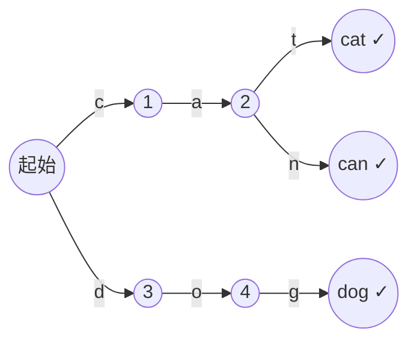
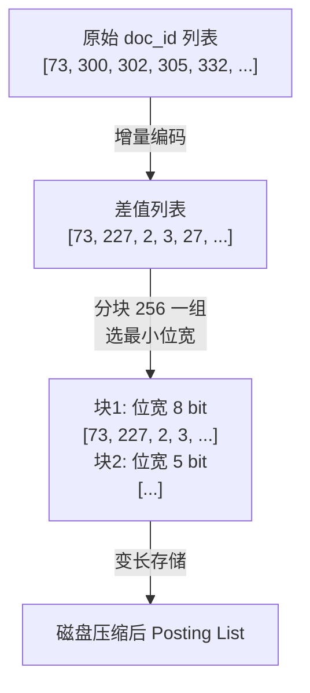
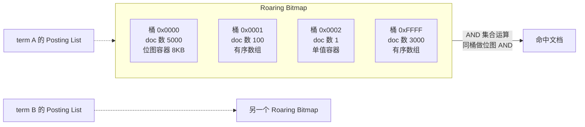
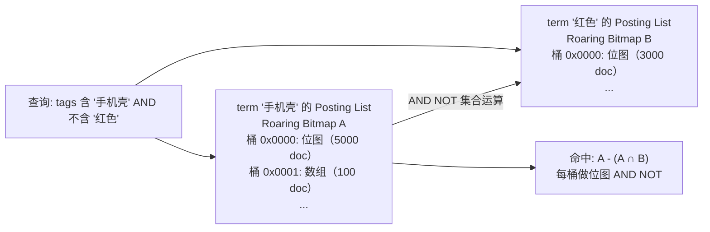

# 倒排索引与分词

> **一句话定位**：倒排索引是 ES 的灵魂，"讲讲倒排索引结构、Analyzer 分词链"是面试起手题，能讲到 FST 与 Roaring Bitmap 才算合格。
> **面试热度**：⭐⭐⭐⭐⭐
> **返回**：[ES 知识图谱](../README.md)

---

## 一、概念定义

### 1.1 倒排索引 vs 正向索引：全文检索 vs 精确查询

Elasticsearch 的检索能力底座是**倒排索引（Inverted Index）**——一种"从词找文档"的数据结构，与 MySQL 的 **B+Tree 正向索引**（从主键找行）在思路上完全相反。理解这个本质差异是讲清任何 ES 检索问题的前提。

| 维度 | ES 倒排索引 | MySQL B+Tree |
|------|------------|--------------|
| 查询方式 | 给定词（term），直接查到包含该词的文档列表 | 给定主键/索引键，沿 B+Tree 叶子链定位行 |
| 适用场景 | 全文检索（match）、多词组合（bool）、模糊/前缀/正则 | 精确等值、范围扫描、JOIN |
| 复杂度 | 查词 O(字符串长) + 取 Posting List O(文档数) | O(log n) 树高，再 O(1) 取行 |
| 数据组织 | 按词切分，每个 token 独立维护一条倒排链 | 按行组织，索引指向行位置 |
| 写入代价 | 分词 + 建多条倒排链，写入较重 | B+Tree 分裂/合并，写入中等 |
| 更新粒度 | Segment 不可变，更新靠新一代 Segment | 行原地更新（页内） |
| 擉索表达 | 自然语言分词后多词 AND/OR/NOT | SQL 等值/范围/JOIN |

**为什么 ES 用倒排而不用 B+Tree？** 全文检索的核心查询是"找出包含某些词的所有文档"——B+Tree 是按 key 排序的有序结构，它擅长"给定一个 key 找行"，却不擅长"给定一个词，找所有包含它的行"（要扫描全表）。倒排索引把"文档包含哪些词"反向建为"词指向哪些文档"，使多词组合查询（如 `match: "分布式 锁"` 拆成两个 term 后做 AND/OR）变成 Posting List 的集合运算，O(文档数) 内完成。MySQL 5.6 起的 InnoDB Fulltext 也是倒排，但功能弱（无分词链、无 BM25、无聚合），生产全文检索仍首选 ES。

**与 `middleware/mysql/01-index/index-and-optimization.md` 的对照**：MySQL B+Tree 按主键有序，叶子节点用双向链表连接，范围查询沿链表扫描；ES 倒排按 term 有序，每个 term 指向一个 Posting List（按 doc_id 排序），多词查询做集合运算。两者本质是"有序结构 + 指针连接"的不同形态——B+Tree 把行串起来，倒排把"词→文档"映射建起来。

### 1.2 倒排结构三部分：Term Dictionary / Term Index / Posting List

ES 的倒排索引（底层是 Lucene）由三部分组成，理解这三部分的职责与协作是讲清倒排原理的标准答法：

| 组成 | 定义 | 作用 | 内存/磁盘 |
|------|------|------|----------|
| **Term Dictionary（词典）** | 所有 term 的有序集合，每个 term 指向其 Posting List | 查词存在性、取倒排链 | 默认磁盘（按段加载） |
| **Term Index（词典索引）** | Term Dictionary 的索引结构，用 **FST（Finite State Transducer）** 前缀压缩 | 快速定位 term 在 Dictionary 中的位置 | 常驻堆内存 |
| **Posting List（倒排列表）** | 每个term 对应的文档列表，含 doc_id、词频、位置、偏移等 | 取命中文档、做打分、做高亮 | 磁盘（按需读取） |

三部分的协作流程：


**关键要点**：①Term Index 是 Term Dictionary 的"目录"，用 FST 把所有 term 的公共前缀压缩为有限状态机，常驻堆内存加速定位；②Term Dictionary 按 term 排序分块存磁盘，Term Index 找到块后再二分查找定位；③Posting List 是倒排真正的"数据"，存的是 doc_id 列表（+ 词频/位置），用 Frame of Reference 和 Roaring Bitmap 压缩。

### 1.3 存储格式：_source / doc_values / _field_data

倒排索引解决"查到哪些文档"，但 ES 还要解决"返回文档原文、做排序聚合"——这两个需求倒排索引做不了（倒排只存词到文档的映射，不存文档原值）。ES 用三种存储格式分工：

| 存储格式 | 用途 | 存储位置 | 性能 | 默认开启 |
|---------|------|---------|------|---------|
| **_source** | 存原始 JSON 文档，查询命中后用于返回 | 磁盘（Segment 内 SourceToXContent） | 读时反序列化 | 默认开启 |
| **doc_values** | 列存，每字段一列存值，用于排序/聚合/脚本 | 磁盘（Segment 内） | mmap 直读，OS page cache | 默认开启（text 字段除外） |
| **_field_data** | 堆内列存，doc_values 不可用时兜底 | JVM 堆内存 | 读快但吃堆 | 默认关闭（text 字段需手动开启） |

**为什么用三种？** 这是"返回 vs 排序聚合"的分工。_source 是行存（整文档），适合返回原文给客户端，但不适合排序聚合（要逐文档反序列化）。doc_values 是列存（每字段独立存储），排序聚合时直接读该列，O(1) 取值。_field_data 是 doc_values 不可用时（text 字段默认不开 doc_values）的堆内存兜底——但堆内存吃紧会触发 OOM，生产几乎不用，text 字段要聚合推荐用 `.keyword` 子字段。

**与 `java-core/jvm` 的对照**：doc_values 是堆外磁盘列存，通过 mmap 映射到进程地址空间，OS page cache 缓存热数据，**不占 JVM 堆**。这与 DirectByteBuffer 堆外内存思想类似——把大块数据放在堆外，避免堆 GC 扫描成本。ES 的"JVM heap 50% 规则"正是为留出另一半物理内存给 mmap file cache，让 doc_values 和 segment 的读取走 OS cache。

### 1.4 Analyzer 分词链：Character Filter → Tokenizer → Token Filter

倒排索引的"词"从哪来？从**分词（Analysis）**来。ES 的 Analyzer 是三段式分词链，索引时和查询时各跑一遍，把一段文本切成一组 token 入倒排或参与查询：

| 阶段 | 职责 | 内置实现 | 自定义扩展 |
|------|------|---------|-----------|
| **Character Filter**（字符过滤器） | 在分词前对原始文本预处理：去 HTML 标签、字符映射替换 | `html_strip`、`mapping` | 实现 CharFilter |
| **Tokenizer**（分词器） | 把文本切成 token（词元），决定切词粒度 | `standard`、`letter`、`whitespace`、`ngram` | 实现 Tokenizer（如 ik） |
| **Token Filter**（词元过滤器） | 对 token 后处理：转小写、去停用词、加同义词、词干提取 | `lowercase`、`stop`、`synonym`、`stemmer`、`word_delimiter` | 实现 TokenFilter |

分词链流程：


**关键要点**：①Analyzer 三段式顺序固定——Character Filter 先做（改原始文本）、Tokenizer 中做（决定切词粒度）、Token Filter 后做（改 token）；②同一条分词链在索引时和查询时各跑一遍，索引时把文档切成 token 入倒排，查询时把查询词切成 token 去倒排里查；③Tokenizer 只能有一个，Token Filter 可以有多个串成链；④analyzer 也可由 builtin 组合（如 `custom` 类型，指定 `tokenizer` + `filter` 列表 + `char_filter` 列表）。

> **源码路径**：`org.apache.lucene.analysis.Analyzer`（分词器抽象基类）、`org.elasticsearch.index.analysis.AnalysisService`（ES 注册与解析 analyzer）、`org.elasticsearch.index.analysis.AnalyzerProvider`（analyzer 实例化）。

---

## 二、原理与流程

### 2.1 Term Dictionary 与 Term Index：FST 前缀压缩加速定位

Term Dictionary 是某 Segment 内所有 term 的有序集合——每个 term 对应一个 Posting List 指针。但 term 数可能极大（百万级甚至更多），如果词典纯按字典序存磁盘，每次查词都要二分扫描整个词典，延迟不可接受。ES 用 **Term Index** 加速——Term Index 是 Term Dictionary 的"目录"，用 **FST（Finite State Transducer，有限状态转换器）** 把所有 term 的公共前缀压缩为一个有限状态机，常驻堆内存。

**FST 是什么？** FST 是一种"把字符串集合压缩为 DAG（有向无环图）"的数据结构——公共前缀共享同一条边、公共后缀共享同一个终点。例如 term 集合 `{cat, can, dog}`，FST 把 `ca` 作为公共前缀共享一条边，`t`/`n` 分叉，`dog` 单独一条路径。FST 的查询是状态机匹配：输入一个字符串，沿状态机的边走，走通就命中、走不通就 miss。



**FST 为什么省内存？** 核心是**前缀共享 + 后缀共享**——所有以 `ca` 开头的 term 共享 `c→a` 两条边，所有以 `g` 结尾的 term 共享终点。百万级 term 的词典经 FST 压缩后，堆内存占用往往只有几 MB 到几十 MB。对比 Redis 的 dict（哈希表，每个 key 独立存储），FST 在大量有公共前缀的字符串集合下内存效率高一个数量级。

**Term Index 的查询流程**：给定查询词 `lucene`，先在 FST 上沿状态机匹配——走通到某个终点，该终点记录"该 term 在 Term Dictionary 的块号"；按块号从磁盘读入该块 Term Dictionary（按字典序排好的 term 数组），块内二分查找精确定位到 `lucene`；拿到其 Posting List 指针，读 Posting List 取命中文档。整体流程是"FST 找块 → 块内二分 → 取 Posting List"，把全词典二分的 O(n) 降为"O(字符串长) 找块 + O(块大小 log) 二分"。

**与 `middleware/redis/01-data-structure/data-structure-and-encoding.md` 的对照**：Redis 的 dict 是开放寻址哈希表，每个 key 独立存 dictEntry（含指针 24 字节开销），O(1) 查找但内存开销大；ES 的 FST 把 term 集合压缩为状态机，O(字符串长) 查找但内存极省。差异源于场景——Redis 单实例内存数据库追求 O(1) 极致延迟，ES 海量 term 集合追求内存可控。

> **源码路径**：`org.apache.lucene.index.TermDictionary`（Term Dictionary 读写）、`org.apache.lucene.util.fst.FST`（FST 实现）、`org.apache.lucene.codecs.lucene94.Lucene94PostingsFormat`（Posting List 编码格式）。

### 2.2 Posting List 结构：doc_id 列表 + 词频 + 位置

Posting List 是倒排索引的"数据本体"——每个 term 对应一个按 doc_id 排序的文档列表。Posting List 不只是 doc_id 数组，还包含打分与高亮所需的多层信息：

| 字段 | 含义 | 用途 |
|------|------|------|
| **doc_id** | 文档在 Segment 内的序号（从 0 开始） | 取文档、做集合运算 |
| **term frequency（TF）** | 该 term 在文档中出现的次数 | BM25 打分（TF 越高分越高） |
| **positions** | 该 term 在文档中出现的位置序列 | 短语查询（phrase）、位置感知匹配 |
| **offsets** | 该 term 在原文中的起止字符偏移 | 高亮（highlight） |
| **payload** | 用户自定义附加数据（如词性、权重） | 自定义打分 |

**Posting List 的组织**：按 doc_id 升序排列，便于顺序读和集合运算。每个字段（`_all` 已废弃、`field` 各自维护）每个 term 一条 Posting List。一篇文档含 N 个 term，就贡献到 N 条 Posting List 中。

**为什么按 doc_id 排序？** 多 term 查询做 AND/OR 时，对多条 Posting List 做归并排序——两条有序列表归并是 O(m+n)，无序则要排序或哈希查找，开销大。doc_id 升序保证集合运算可线性归并，且利于 Frame of Reference 增量压缩（见 2.4）。

### 2.3 _source 与 doc_values：返回 vs 排序聚合

倒排索引回答"哪些文档命中"，但客户端要的是"文档原文"和"按某字段排序后返回前 N"——这两个需求用 _source 和 doc_values 分工。

**_source**：存原始 JSON 文档，查询命中后反序列化返回。每个 Segment 内每个文档的 _source 存一份（压缩 JSON）。_source 的代价是磁盘占用（约原文 1:1，加压缩后约 0.5），收益是返回原文无需重建——若关闭 _source（`"_source": {"enabled": false}`），查询命中后只能拿到 doc_id，要原文得重查或 Reindex，生产基本不开。**关闭 _source 的常见误区**：以为省磁盘，实际省的磁盘远小于倒排与 doc_values，且丧失 reindex、highlight、recovery 能力，得不偿失。

**doc_values**：列存，每个字段独立一列，按 doc_id 排序存值。排序、聚合、脚本访问字段值时直接读该列，无需反序列化 _source。doc_values 是磁盘文件 + mmap 映射到 OS page cache，**不占 JVM 堆**——这是 ES 5.x 起替代 _field_data 的根本原因。

| 维度 | _source | doc_values | _field_data |
|------|---------|-----------|-------------|
| 存储形态 | 行存（整文档 JSON） | 列存（每字段一列） | 列存（堆内） |
| 用途 | 返回原文、reindex、highlight | 排序、聚合、脚本取字段值 | 同 doc_values，兜底场景 |
| 存储位置 | 磁盘（Segment 内） | 磁盘（Segment 内）+ OS cache | JVM 堆 |
| 开启条件 | 默认开启 | 默认开启（text 字段除外） | 默认关闭，text 字段需手动开启 |
| 性能 | 读时反序列化，慢 | mmap 直读，快 | 读快，但吃堆，OOM 风险 |
| 生产建议 | 必开 | 必开（数值/keyword/date 等聚合字段） | 不开，用 keyword 子字段替代 |

**为什么 text 字段默认不开 doc_values？** text 字段分词后入倒排，每个 token 一条倒排链，再建 doc_values 列存成本翻倍且 text 字段几乎不排序聚合（要聚合走 `.keyword`）。所以默认 text 不开 doc_values，强行要聚合只能开 _field_data（堆内存），生产用 keyword 子字段替代。

> **源码路径**：`org.apache.lucene.codecs.DocValuesFormat`（doc_values 编码抽象）、`org.apache.lucene.codecs.lucene94.Lucene94DocValuesFormat`（默认实现）、`org.elasticsearch.index.fieldvisitor.FieldsVisitor`（_source 访问）。

### 2.4 Posting List 压缩：Frame of Reference + Roaring Bitmap

百万级文档的 Posting List 可能很长，裸存 doc_id 数组代价大。Lucene 用两层压缩：

**Frame of Reference（FOR，变长增量编码）**：Posting List 按 doc_id 升序，先做**增量编码**——把 `[73, 300, 302, 305]` 转为 `[73, 227, 2, 3]`（首项不变，后续为前项差值）；再用**变长编码**——小数字用少 bit（如 3 用 3 bit），大数字用多 bit（如 227 用 8 bit），按块（256 个一组）选最小公共位宽。整体压缩比可达 3-5 倍。



**Roaring Bitmap（咆哮位图）**：用于多 term 查询的集合运算加速。把整个 doc_id 空间分为高 16 位桶（2^16 = 65536 个桶），每个桶内根据数量选容器：桶内 doc 数 ≤ 4096 用**有序数组**（省内存，二分查找）；> 4096 用**位图**（2^16 bit = 8KB，O(1) 查找）；桶内只有一个值用**单值容器**。



**为什么 Roaring Bitmap 快？** 多 term 查询（`match: "分布式 锁"` → term `分布式` AND term `锁`）要对两条 Posting List 做集合运算。Roaring Bitmap 把运算分桶——只有两 bitmap 都有的桶才参与运算，同桶内按容器类型选高效算法（位图 AND 用位运算、数组 AND 用归并排序），整体复杂度远低于线性扫描。

**与 `middleware/redis/01-data-structure` 的对照**：Redis 的 SDS/dict 是"通用内存数据结构"，ES 的 Roaring Bitmap 是"专用压缩位图"——前者追求通用与 O(1)，后者追求海量整数集合的压缩与集合运算。Redis 用 dict 存集合元素 O(1) 查找但内存开销大；ES 用 Roaring Bitmap 在百万级 doc_id 集合下既省内存又快运算，是"专用场景定制数据结构"的典型。

### 2.5 Analyzer 分词链详解：Character Filter / Tokenizer / Token Filter

Analyzer 的三段式每段都有多种实现，理解选型是中英文搜索的核心：

**Character Filter（字符过滤器）**：在分词前改原始文本。
- `html_strip`：去 HTML 标签，如 `<p>Hello</p>` → `Hello`。爬虫数据/富文本入库前必用。
- `mapping`：字符映射替换，如把全角字符转半角、错别字纠正。

**Tokenizer（分词器）**：决定切词粒度，**只能选一个**。
- `standard`（默认）：Lucene StandardTokenizer，按 Unicode 文本切分，中文按单字切（`中文分词` → `[中, 文, 分, 词]`），英文按空格和标点切。
- `whitespace`：按空白字符切。
- `letter`：按字母序列切，非字母作分隔。
- `ngram`：按 N-gram 切，适合模糊匹配。
- `ik_smart` / `ik_max_word`（中文）：开源中文分词插件 IK 的两种模式——ik_smart 粗粒度（`中文分词` → `[中文分词]`），ik_max_word 细粒度（`中文分词` → `[中文, 分词, 中文分词]`）。

**Token Filter（词元过滤器）**：对 token 后处理，**可串联多个**。
- `lowercase`：转小写，英文搜索标配（避免 Hello/hello 不命中）。
- `stop`：去停用词（如 `the/a/an/的/是/在`），减少无意义 term。
- `synonym`：加同义词（如 `手机 → 手机, 智能手机`），扩召回。
- `word_delimiter`：拆复合词（如 `iPhone12` → `iPhone, 12`）。
- `stemmer`：词干提取（如 `running → run`），英文搜索常见。
- `length`：按 token 长度过滤（去太短的词）。

**自定义 Analyzer 配置示例**（中英文混合，含 HTML 清洗 + 同义词 + 停用词）：

```json
PUT /articles
{
  "settings": {
    "analysis": {
      "char_filter": {
        "html_strip_filter": { "type": "html_strip" },
        "full_to_half": {
          "type": "mapping",
          "mappings": ["１ => 1", "２ => 2", "３ => 3"]
        }
      },
      "tokenizer": { "ik_tokenizer": { "type": "ik_max_word" } },
      "filter": {
        "lowercase_filter": { "type": "lowercase" },
        "stop_filter": { "type": "stop", "stopwords": ["的", "是", "the", "a"] },
        "synonym_filter": {
          "type": "synonym",
          "synonyms": ["手机, 智能手机, mobile => 手机"]
        }
      },
      "analyzer": {
        "my_analyzer": {
          "type": "custom",
          "char_filter": ["html_strip_filter", "full_to_half"],
          "tokenizer": "ik_tokenizer",
          "filter": ["lowercase_filter", "stop_filter", "synonym_filter"]
        }
      }
    }
  },
  "mappings": {
    "properties": {
      "content": { "type": "text", "analyzer": "my_analyzer", "search_analyzer": "my_analyzer" }
    }
  }
}
```

**选型要点**：①中文用 ik（ik_max_word 索引细粒度保召回，ik_smart 查询粗粒度保精度）；②英文用 standard + lowercase + stop + stemmer；③富文本必加 html_strip；④同义词要索引和查询两侧都加（synonym filter 在两侧都跑），否则查询时不会触发同义扩展。

### 2.6 Normalizer：keyword 字段的归一化

text 字段用 Analyzer 分词，keyword 字段不分词——但 keyword 也有"归一化"需求（如把品牌名统一存小写，查询时无论输入 `Apple` 还是 `apple` 都命中）。ES 用 **Normalizer** 解决——Normalizer 是"轻量 Analyzer"：不分词，只做 Character Filter + Token Filter 的归一化。

| 维度 | Normalizer | Analyzer |
|------|-----------|----------|
| 适用字段 | keyword | text |
| 是否分词 | **不分词**（整体一个 token） | 分词（多个 token） |
| 可用阶段 | Character Filter + Token Filter（无 Tokenizer） | Character Filter + Tokenizer + Token Filter |
| 用途 | keyword 字段大小写归一、字符替换 | text 字段全文检索分词 |
| 配置示例 | `"normalizer": {"lowercase_norm": {"type": "custom", "filter": ["lowercase"]}}` | `"analyzer": {...}` |

**配置示例**：

```json
PUT /products
{
  "settings": {
    "analysis": {
      "normalizer": {
        "lowercase_norm": {
          "type": "custom",
          "char_filter": [],
          "filter": ["lowercase"]
        }
      }
    }
  },
  "mappings": {
    "properties": {
      "brand": {
        "type": "keyword",
        "normalizer": "lowercase_norm"
      }
    }
  }
}
```

写入 `brand: "Apple"` 实际存 `apple`，查询 `term: { brand: "apple" }` 或 `term: { brand: "APPLE" }` 都命中。Normalizer 是 keyword 字段精确匹配场景的"大小写敏感"开关——默认 keyword 大小写敏感（`Apple` 和 `apple` 不互命中），加 lowercase Normalizer 后归一为小写互命中。

### 2.7 索引时分词 vs 查询时分词：search_analyzer 不一致导致"搜不到"

Analyzer 在索引和查询时各跑一遍——索引时用 `analyzer` 配置的分词器把文档切片入倒排；查询时用 `search_analyzer` 配置的分词器把查询词切片去倒排里查。**两者不一致会导致"搜不到"**——这是生产高频事故。

**典型事故**：索引时用 `ik_max_word`（细粒度），查询时也用 `ik_max_word`（细粒度）。索引"中文分词"产出 `[中文, 分词, 中文分词]`，查询"中文分词"也产出 `[中文, 分词, 中文分词]`，三个 token 都命中，OK。但若查询"中"（用户只输一个字），查询分词产出 `[中]`，但倒排里只有 `[中文, 分词, 中文分词]`——`中` 不在倒排里，搜不到。正确做法是查询用 `ik_smart`（粗粒度，`中文分词` → `[中文分词]` 整体匹配），召回率反而更稳。

**推荐配置**：索引时 `analyzer: ik_max_word`（细粒度，召回全），查询时 `search_analyzer: ik_smart`（粗粒度，精度高）。这是中文搜索的标配——倒排里 term 数量多（细粒度），查询 token 数量少（粗粒度），查询 token 在倒排里命中的概率高。

**配置示例**（索引细粒度 + 查询粗粒度）：

```json
PUT /articles
{
  "settings": {
    "analysis": {
      "analyzer": {
        "ik_max": { "type": "custom", "tokenizer": "ik_max_word" },
        "ik_smart": { "type": "custom", "tokenizer": "ik_smart" }
      }
    }
  },
  "mappings": {
    "properties": {
      "title": {
        "type": "text",
        "analyzer": "ik_max",
        "search_analyzer": "ik_smart"
      },
      "content": {
        "type": "text",
        "analyzer": "ik_max",
        "search_analyzer": "ik_smart",
        "fields": {
          "keyword": { "type": "keyword", "ignore_above": 256 }
        }
      }
    }
  }
}
```

**注意**：①改 `analyzer` 必须重建索引（旧数据是旧分词器入的倒排，新分词器查不命中），改 `search_analyzer` 无需重建（查询分词器只影响查询时不影响已索引数据）；②生产事故排查"搜不到"问题第一步：用 `_analyze` API 比较索引和查询的分词结果是否一致。

> **源码路径**：`org.elasticsearch.index.analysis.NamedAnalyzer`（命名的 analyzer 实例）、`org.elasticsearch.index.mapper.TextFieldMapper`（text 字段 `analyzer`/`search_analyzer` 配置解析）。

### 2.8 源码路径汇总

| 概念 | 源码路径 |
|------|---------|
| Term Dictionary | `org.apache.lucene.index.TermDictionary`、`org.apache.lucene.index.Terms` |
| Term Index（FST） | `org.apache.lucene.util.fst.FST`、`org.apache.lucene.util.fst.FSTCompiler` |
| Posting List 编码 | `org.apache.lucene.codecs.lucene94.Lucene94PostingsFormat`、`org.apache.lucene.codecs.PostingsFormat` |
| doc_values | `org.apache.lucene.codecs.lucene94.Lucene94DocValuesFormat`、`org.apache.lucene.codecs.DocValuesFormat` |
| Analyzer | `org.apache.lucene.analysis.Analyzer`、`org.elasticsearch.index.analysis.AnalysisService`、`org.elasticsearch.index.analysis.AnalyzerProvider` |
| Tokenizer | `org.apache.lucene.analysis.Tokenizer`、`org.elasticsearch.index.analysis.TokenizerFactory` |
| Token Filter | `org.apache.lucene.analysis.TokenFilter`、`org.elasticsearch.index.analysis.TokenFilterFactory` |
| Character Filter | `org.apache.lucene.analysis.CharFilter`、`org.elasticsearch.index.analysis.CharFilterFactory` |
| Normalizer | `org.elasticsearch.index.analysis.Normalizer`（ES 层包装，组合 CharFilter + TokenFilter） |
| _source | `org.elasticsearch.index.fieldvisitor.FieldsVisitor`、`org.apache.lucene.document.StoredField` |

---

## 三、高频追问

**Q1：倒排索引是什么？**

倒排索引是"从词找文档"的数据结构，由三部分组成：Term Dictionary（词典，按 term 有序）、Term Index（词典索引，用 FST 前缀压缩加速定位）、Posting List（倒排列表，每个 term 对应的 doc_id 列表 + 词频 + 位置）。查询时先在 FST 上找块，再块内二分定位 term，最后取 Posting List 拿命中文档。ES 倒排底座是 Lucene 的 Segment，每个 Segment 一套倒排。

**Q2：FST 是什么？为什么省内存？**

FST（Finite State Transducer，有限状态转换器）是把字符串集合压缩为 DAG 的数据结构——公共前缀共享边、公共后缀共享终点。百万级 term 经 FST 压缩后堆内存占用从 GB 级降为 MB 级。FST 常驻堆内存作为 Term Index，加速 Term Dictionary 的块定位。对比哈希表（每 key 独立存），FST 在大量公共前缀场景下内存效率高一个数量级。

**Q3：Posting List 怎么压缩？**

两层压缩：①**Frame of Reference**——doc_id 升序后做增量编码（差值），再分块（256 一组）选最小位宽变长存储，压缩比 3-5 倍；②**Roaring Bitmap**——把 doc_id 空间分高 16 位桶，桶内按数量选容器（≤4096 用有序数组，>4096 用 8KB 位图），多 term 查询时按桶做集合运算（AND/OR），复杂度远低于线性扫描。

**Q4：doc_values 是什么？为什么不用 _field_data？**

doc_values 是磁盘列存，每字段独立一列按 doc_id 排序存值，用于排序、聚合、脚本取字段值。通过 mmap 映射到 OS page cache，**不占 JVM 堆**。_field_data 是堆内列存，doc_values 不可用时兜底（如 text 字段聚合），但吃堆易 OOM，ES 5.x 起默认关闭，text 字段要聚合推荐用 `.keyword` 子字段而非开 _field_data。

**Q5：Analyzer 分几步？**

三段式：①**Character Filter**——分词前改原始文本（html_strip 去标签、mapping 字符替换）；②**Tokenizer**——切 token 决定粒度（standard/ik/whitespace），只能选一个；③**Token Filter**——对 token 后处理（lowercase/stop/synonym/word_delimiter/stemmer），可串联多个。索引和查询时各跑一遍，索引产出入倒排，查询产出参与查询。

**Q6：ik 分词器是什么？两种模式区别？**

ik 是开源中文分词插件，两种模式：`ik_smart` 粗粒度（`中文分词` → `[中文分词]` 整体一个 token，分词少但精度高），`ik_max_word` 细粒度（`中文分词` → `[中文, 分词, 中文分词]` 多 token，分词多召回全）。生产标配：索引时 `analyzer: ik_max_word`（召回全），查询时 `search_analyzer: ik_smart`（精度高）。

**Q7：索引时和查询时分词不一致会怎样？**

会"搜不到"——索引用 A 分词器入倒排，查询用 B 分词器产出 token 不在倒排里就 miss。典型是索引用 ik_max_word 细粒度（产出多 token），查询也用 ik_max_word 把用户输入的单字切成单 token，但倒排里只有复合 token，单 token 查不到。排查用 `_analyze` API 比较两侧分词结果。注意：改 `analyzer` 要重建索引，改 `search_analyzer` 不用重建。

**Q8：Normalizer 和 Analyzer 区别？**

Normalizer 是 keyword 字段的轻量 Analyzer——**不分词**只做 Character Filter + Token Filter 归一化（如转小写），整体仍是一个 token 入倒排。Analyzer 用于 text 字段会分词产出多 token。Normalizer 解决 keyword 字段大小写敏感问题（如品牌名 `Apple`/`apple` 统一为小写互命中），不分词保精确匹配语义。

**Q9：为什么 ES 用倒排而不用 B+Tree？**

倒排擅长"给定词，找所有包含它的文档"——多词组合查询变 Posting List 集合运算，O(文档数) 内完成。B+Tree 擅长"给定 key 找行"——等值/范围扫描高效，但全文检索要扫全表。ES 定位全文检索 + 聚合分析，倒排是天然匹配；MySQL 定位 OLTP 事务型精确查询，B+Tree 更合适。MySQL 5.6 起的 InnoDB Fulltext 也是倒排，但功能弱（无分词链、无 BM25、无聚合），生产全文检索仍首选 ES。

---

## 四、实战关联

### 4.1 Java 场景：自定义 Analyzer 插件开发

ES 的 Analyzer 通过插件机制扩展——典型场景是开发自定义 Tokenizer 或 Token Filter（如领域词典分词、业务同义词扩展）。Java 实现需继承 Lucene 的 `Tokenizer`/`TokenFilter` 抽象类，再用 ES 的 `AnalysisPlugin` SPI 注册：

```java
public class MyTokenizerFactory extends AbstractTokenizerFactory {
    public static final String NAME = "my_tokenizer";
    
    @Override
    public Tokenizer create() {
        return new MyTokenizer();
    }
}

public class MyAnalysisPlugin extends AnalysisPlugin {
    @Override
    public Map<String, AnalysisProvider<TokenizerFactory>> getTokenizerFactories() {
        return Collections.singletonMap(MyTokenizerFactory.NAME, 
            (env, name, settings) -> new MyTokenizerFactory(env, name, settings));
    }
}
```

把插件打成 jar 放到 `$ES_HOME/plugins/my-analysis/`，重启 ES 即可在 Mapping 中用 `"tokenizer": "my_tokenizer"`。**注意**：自定义 Analyzer 修改后要重建索引（旧数据是旧分词器入的倒排），生产发布要走灰度——分词器变更影响查询召回率。

### 4.2 Synonym 同义词配置

同义词是 Token Filter，分两种配置方式：①**静态同义词**（写在 settings analysis.filter 里），改要重建索引或 reload search_analyzer；②**动态同义词**（`"synonyms_path": "/path/to/synonyms.txt"`），文件更新后 ES 自动 reload，适合同义词频繁变更的场景。

**关键陷阱**：同义词的扩展方向——`"手机, 智能手机 => 手机"` 表示索引和查询都映射到 `手机`（双向归一），`"手机, 智能手机"` 表示两者互为同义（互扩展）。方向写错会要么召回过爆（一堆近义词都命中），要么召回不足（只单向扩展）。

### 4.3 分词器选型矩阵

| 场景 | 索引分词器 | 查询分词器 | 备注 |
|------|-----------|-----------|------|
| 中文搜索 | ik_max_word | ik_smart | 召回全 + 精度高，标配 |
| 英文搜索 | standard + lowercase + stop + stemmer | 同索引 | 词干提取 + 停用词 |
| 中英混合 | ik_max_word + lowercase | ik_smart + lowercase | ik 对英文也切，加 lowercase 统一 |
| 富文本（含 HTML） | html_strip + ik_max_word | html_strip + ik_smart | Character Filter 前置 |
| 拼音搜索 | ik_max_word + pinyin filter | ik_smart + pinyin filter | 用 elasticsearch-analysis-pinyin 插件 |
| 精确匹配（不分词） | keyword + normalizer | keyword + normalizer | 不走 Analyzer 走 Normalizer |
| 通配符/前缀 | whitespace 或 standard | 同索引 | 配合 wildcard 查询 |

### 4.4 与 MySQL 全文索引对比

MySQL 5.6+ InnoDB Fulltext（`FULLTEXT INDEX` + `MATCH ... AGAINST`）也是倒排，但能力远弱于 ES：

| 维度 | MySQL Fulltext | ES 倒排 |
|------|----------------|---------|
| 分词 | 内置 ngram/空格切分，无 Character Filter / Token Filter 链 | 三段式 Analyzer，可插拔（ik/synonym/stemmer 等） |
| 打分 | 简化 TF-IDF | BM25 + 可调 k1/b + Function Score |
| 同义词 | 不支持 | synonym filter |
| 高亮 | 不支持 | highlight / unified highlight |
| 聚合 | 不支持 | 聚合 + ES\|QL |
| 多语言 | 弱 | 多 analyzer + 多字段 |
| 适用规模 | 百万级文档全文检索 | 亿级文档全文检索 |

生产选型：单库百万级以下、同义词/聚合需求弱、不想引额外组件，用 MySQL Fulltext；亿级规模或要分词链/打分/聚合/高亮，必上 ES。MySQL Fulltext 维护成本低（数据库自己管），ES 维护成本高（集群运维 + JVM 调优 + 分词器插件）。

### 4.5 与 Redis 数据结构对照

| 概念 | ES 实现 | Redis 对照 |
|------|---------|-----------|
| term 集合压缩 | FST 前缀共享 | dict 哈希表（每 key 独立存） |
| 文档列表 | Roaring Bitmap 分桶 | intset（小整数有序数组）或 set（哈希表） |
| 列存 | doc_values 磁盘列存 | 无直接对应（Redis 是行存 KV） |
| 内存数据结构 | Term Index 堆内 + Posting List 堆外 | 全部堆内（dict/sds/skiplist） |
| 定位方式 | FST 状态机匹配 O(字符串长) | dict O(1) 哈希 |

差异源于定位——Redis 是单实例内存数据库追求 O(1) 极致延迟，ES 是搜索引擎追求海量 term 的内存可控与集合运算高效。两者数据结构选型都体现了"场景定制数据结构"的思想。

### 4.6 与 java-core/jvm 对照

- **doc_values 与 DirectByteBuffer**：doc_values 是堆外磁盘列存 + mmap，不占 JVM 堆；DirectByteBuffer 也是堆外内存，避免 GC 扫描。两者思想一致——大数据放堆外，留堆给小对象和控制元数据。
- **Term Index FST 与堆内存**：FST 常驻 JVM 堆，是 ES heap 占用的重要项（百万级 term 的 FST 可达几十 MB-百 MB）。这也是 ES heap 50% 规则的原因——堆给 FST + 查询缓冲 + 元数据，剩 50% 给 mmap file cache。
- **_field_data 与 GC 压力**：_field_data 是堆内列存，吃堆引发 Full GC 甚至 OOM，ES 5.x 起默认关闭转 doc_values，与 JVM "大对象进堆引发 GC 停顿" 的反模式一致。

---

## 五、系统设计案例

### 案例 1：中英文混合搜索分词方案

**场景**：电商商品搜索，商品标题含中英文混合（如"Apple iPhone12 手机壳 红色"），富文本场景含 HTML 标签，要求支持同义词扩展（如"手机" ↔ "智能手机"）、停用词过滤、大小写归一。

**Analyzer 设计**：

```json
PUT /goods
{
  "settings": {
    "analysis": {
      "char_filter": {
        "html_strip_cf": { "type": "html_strip" },
        "full_to_half_cf": {
          "type": "mapping",
          "mappings": ["０ => 0", "１ => 1", "２ => 2", "３ => 3", "４ => 4", "５ => 5", "６ => 6", "７ => 7", "８ => 8", "９ => 9"]
        }
      },
      "tokenizer": {
        "ik_max_tokenizer": { "type": "ik_max_word" },
        "ik_smart_tokenizer": { "type": "ik_smart" }
      },
      "filter": {
        "lowercase_f": { "type": "lowercase" },
        "stop_f": {
          "type": "stop",
          "stopwords": ["的", "是", "在", "the", "a", "an", "is", "are"]
        },
        "synonym_f": {
          "type": "synonym",
          "synonyms": [
            "手机, 智能手机, mobile, mobile phone",
            "笔记本, laptop, notebook",
            "耳机, earphone, headphone"
          ]
        },
        "word_delimiter_f": {
          "type": "word_delimiter",
          "split_on_numerics": true,
          "split_on_case_change": true
        }
      },
      "analyzer": {
        "goods_index_analyzer": {
          "type": "custom",
          "char_filter": ["html_strip_cf", "full_to_half_cf"],
          "tokenizer": "ik_max_tokenizer",
          "filter": ["lowercase_f", "stop_f", "synonym_f", "word_delimiter_f"]
        },
        "goods_search_analyzer": {
          "type": "custom",
          "char_filter": ["html_strip_cf", "full_to_half_cf"],
          "tokenizer": "ik_smart_tokenizer",
          "filter": ["lowercase_f", "stop_f", "synonym_f", "word_delimiter_f"]
        }
      }
    }
  },
  "mappings": {
    "properties": {
      "title": {
        "type": "text",
        "analyzer": "goods_index_analyzer",
        "search_analyzer": "goods_search_analyzer",
        "fields": {
          "keyword": { "type": "keyword", "ignore_above": 256 }
        }
      },
      "description": {
        "type": "text",
        "analyzer": "goods_index_analyzer",
        "search_analyzer": "goods_search_analyzer"
      },
      "brand": { "type": "keyword", "normalizer": "lowercase_norm" }
    }
  }
}
```

**分词链效果**（输入 `<p>Apple iPhone12 智能手机</p>`）：

- **索引时**（goods_index_analyzer）：
  - Character Filter：`html_strip` 去标签 → `Apple iPhone12 智能手机`；`full_to_half` 全角转半角
  - Tokenizer：`ik_max_word` 切词 → `[Apple, iPhone, 12, 智能, 手机, 智能手机]`
  - Token Filter：`lowercase` → `[apple, iphone, 12, 智能, 手机, 智能手机]`；`stop` 无停用词可去；`synonym` 扩展"智能手机" → 加 `[mobile, mobile phone]`；`word_delimiter` 拆 `iphone` → `[iphone]`（已小写不拆）、`iPhone12` 早已切
  - 最终入倒排 token：`{apple, iphone, 12, 智能, 手机, 智能手机, mobile, mobile phone}`
- **查询时**（goods_search_analyzer，输入"手机"）：
  - Character Filter + ik_smart 切词 → `[手机]`
  - lowercase + stop + synonym 扩展 → `[手机, 智能手机, mobile, mobile phone]`
  - 查询 4 个 token 都在倒排里，命中。

**核心权衡**：召回率 vs 精度。索引细粒度（ik_max_word）保证倒排里 token 数量多，查询 token 命中概率高；查询粗粒度（ik_smart）保证查询 token 数量少、不切碎用户原意。同义词扩展增加召回但可能降低精度（如"手机"扩展到"mobile"可能误命中"移动电源"——需精细配置同义词）。

**追问链**：

- **追问 1：同义词怎么动态更新？**——用 `synonyms_path` 指向外部文件，ES 自动 reload search_analyzer；但索引时的同义词扩展要重建索引才能生效（旧数据是旧同义词入的倒排）。生产推荐查询侧扩展同义词（search_analyzer reload 即生效），索引侧不扩展避免重建。
- **追问 2：word_delimiter 拆 iPhone12 会不会误召回？**——拆成 `iphone` + `12` 后，查询 `iphone 13` 也会命中 `iPhone12`（因为 `iphone` 共享）。若要严格区分，关 word_delimiter 或用 `catenate_words` 把拆出的词再拼回。
- **追问 3：brand 用 Normalizer 的好处？**——keyword + lowercase Normalizer 让 `Apple`/`APPLE`/`apple` 互命中精确匹配，无需走 text 分词链（保精确匹配语义，不走全文检索）。

### 案例 2：千万级标签倒排索引设计

**场景**：商品标签系统，每商品平均 5 个标签，总 200 万商品 = 1000 万标签关联。标签字段是 keyword，要求支持"含标签 A 且不含标签 B 的商品"查询、按标签聚合统计、按标签排序。

**倒排结构分析**：

- 标签字段是 keyword（不分词，整个值作为一个 token），每个 tag 对应一条 Posting List
- 单 tag 平均命中 200 万商品 / 100 万 distinct tag ≈ 2 商品/tag（长尾分布，热门 tag 命中百万级）
- 热门 tag 的 Posting List 长度可达百万级，必须高效压缩 + 集合运算

**Posting List 压缩与集合运算**：



**容量估算**：

| 项 | 数值 | 说明 |
|----|------|------|
| 商品数 | 200 万 | 单 Index |
| 标签关联数 | 1000 万 | 200 万 × 5 标签/商品 |
| distinct tag 数 | 100 万 | 长尾分布 |
| 单 tag 平均 Posting List 长度 | 10 doc | 1000 万 / 100 万 |
| 热门 tag（Top 100） Posting List 长度 | 10 万-100 万 doc | 长尾头部 |
| Posting List 总 doc_id 数 | 1000 万 | 每个 tag-商品关联占 4 字节（增量压缩后） |
| 原始 doc_id 占用 | 40 MB | 1000 万 × 4 字节 |
| Frame of Reference 压缩后 | 12-15 MB | 3-5 倍压缩 |
| Roaring Bitmap 索引开销 | 20-30 MB | 桶元数据 + 容器 |
| doc_values（标签列存） | 40-60 MB | 1000 万 × 4 字节 + 列存开销 |
| _source（含标签 JSON） | 100-200 MB | 整商品 JSON |
| 倒排 + doc_values + _source 总计 | 200-300 MB | 单 Index |

**关键设计**：①标签用 keyword 不分词——保精确匹配语义，每个 tag 一个 token 一条倒排链；②Posting List 用 Frame of Reference 增量压缩 + Roaring Bitmap 分桶——热门 tag 百万级 doc_id 集合运算仍高效（位图 AND 用位运算、数组 AND 用归并）；③聚合走 doc_values 列存——按 tag 聚合商品数（terms aggregation）直接读 tags 列，O(n) 内完成；④`tags` 数组字段注意用 keyword 数组而非 nested（标签无对象关联需求，nested 多余）；⑤分片数按商品数定（200 万商品 / 4 分片 = 50 万/分片，单分片 < 100MB 合理）。

**核心权衡**：召回精度 vs 集合运算效率。标签查询本质是集合运算（含 A 且不含 B = A - (A ∩ B)），倒排索引 + Roaring Bitmap 把集合运算降到桶级并行，是千万级标签查询高效的根本。若用 MySQL，"含标签 A 且不含标签 B"要 JOIN 标签表两次或用 `NOT EXISTS`，千万级数据下慢一个数量级。

**追问链**：

- **追问 1：标签数从 100 万涨到 500 万怎么办？**——倒排链数量翻 5 倍，但 Posting List 总 doc_id 数不变（还是 1000 万），压缩后总占用变化不大。瓶颈在 Term Dictionary 与 Term Index——500 万 term 的 FST 占堆内存约 100-200 MB，需调大 ES heap 或按标签域分 Index（如按类目分）。
- **追问 2：标签频繁变更怎么办？**——keyword 字段更新走 Segment 新增 + 旧 Segment 标记删除，频繁更新导致 Segment 数膨胀，需调 `refresh_interval` 降低刷新频率 + 定期 `forcemerge` 合并 Segment。若更新极频繁，考虑把标签存 Redis（标签集合运算在 Redis 做，只把结果 doc_id 列表查 ES 取详情）。
- **追问 3：按标签排序为什么慢？**——排序走 doc_values 读 tags 列，但 tags 是数组字段，按数组元素排序语义复杂（取第一个？最小值？），且需对每文档的 tags 数组反查。生产推荐按标签聚合（terms aggregation）而非按标签排序字段。
