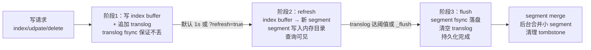
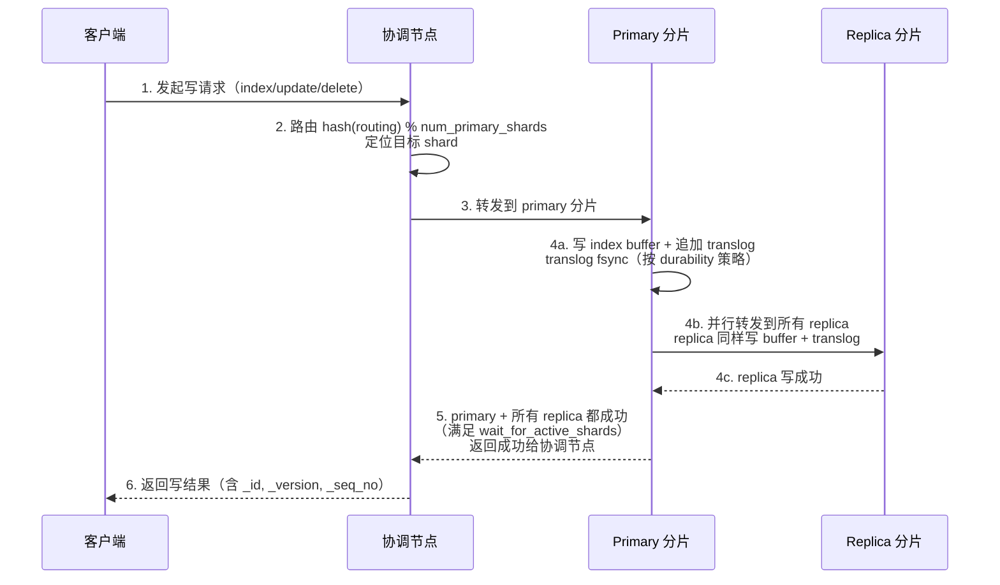
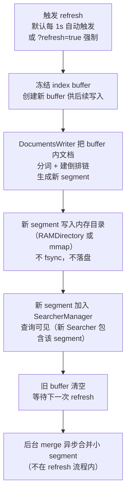
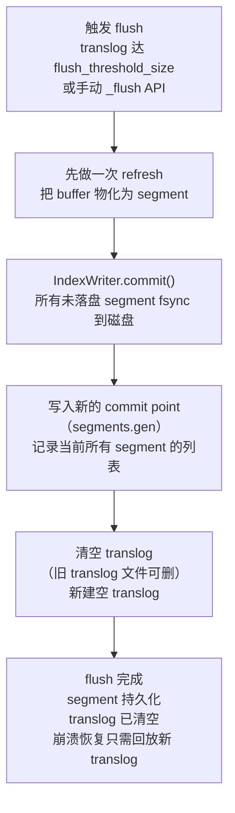
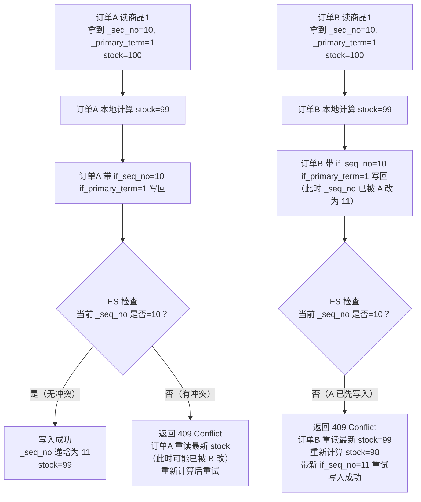

# 读写流程与 Translog

> **一句话定位**：读写流程是 ES 近实时性的根基，"写后为什么 1s 才能搜到、translog 是什么"是中高级面试分水岭。
> **面试热度**：⭐⭐⭐⭐⭐
> **返回**：[ES 知识图谱](../README.md)

---

## 一、概念定义

### 1.1 ES 近实时模型：写后不立即可搜

Elasticsearch 是**近实时（Near Real-Time）**系统——写请求返回成功后，数据并不立即可被搜索到，要等待一次 **refresh**（默认 1 秒）后才可见。这是 ES 与传统数据库最本质的差异之一，也是面试必问的起手题。

**与 MySQL 的本质差异**：MySQL 是**实时可见**系统——一条 `INSERT` 在事务提交后立即可被 `SELECT` 读到（读已提交隔离级别下），因为 InnoDB 的 Buffer Pool 中最新数据页直接对后续查询可见，无需任何"刷新"动作。ES 则是"写进 index buffer 后，要 refresh 生成 segment 才能被查询读到"，因为 ES 的查询单元是 **segment**（Lucene 的不可变倒排索引块），而不是内存 buffer。

| 维度 | ES 近实时 | MySQL 实时可见 |
|------|----------|---------------|
| 写后可见时机 | refresh 后（默认 1s） | 事务提交后立即 |
| 可见性延迟 | 默认 1 秒，可调 | 0 秒（同事务内或提交后） |
| 原因 | 查询单元是 segment，写先进 buffer，refresh 生成 segment 才可搜 | 查询单元是 Buffer Pool 数据页，写直接改页 |
| 持久化时机 | translog fsync 保证不丢，segment 要 flush 才真正落盘 | redo log fsync 保证不丢，数据页异步刷盘 |
| 强一致性 | 弱（近实时） | 强（ACID） |

**为什么 ES 要做成近实时？** 因为 Lucene 的 segment 是**不可变**的——写后不可改，删除靠标记 tombstone，更新靠新一代 segment。如果每次写都立即生成一个 segment，segment 数量爆炸，查询时要合并所有 segment 的倒排结果，性能崩塌。所以 ES 攒一批写入到 index buffer，每 1 秒 refresh 一次生成一个新 segment——**用 1 秒可见性延迟换取写入吞吐和查询性能**。这是 ES 设计的核心权衡。

**`refresh_interval` 的调档**：默认 `1s`（1 秒刷新一次），可调大（如 `30s`）减少 segment 生成频率提升写入吞吐；可设为 `-1` 禁用自动刷新（批量导入场景）；可用 `?refresh=true` 在单次写请求后强制刷新（不推荐高频用，会破坏吞吐）。详见 2.3 节。

### 1.2 写流程三阶段：写 buffer + translog → refresh → flush

ES 的一次"写"在内部经历三个阶段，理解三阶段的职责与触发时机是讲清写流程的标准答法：

| 阶段 | 动作 | 触发时机 | 可见性 | 持久性 |
|------|------|---------|--------|--------|
| 1. 写入 | 写 index buffer + 追加 translog | 每次写请求 | 不可见（buffer 不可搜） | translog fsync 后不丢 |
| 2. refresh | index buffer 生成新 segment，segment 内存可见 | 默认 1s 或 `?refresh=true` | 可搜（内存 segment） | 仍可能在 page cache，未真正落盘 |
| 3. flush | segment fsync 落盘，清空 translog | translog 达阈值或手动 `_flush` | 可搜（磁盘 segment） | 持久化（断电不丢） |

三阶段的流转：



**关键要点**：①写请求返回成功只意味着 translog fsync 完成（数据不丢），并不意味可搜（要等 refresh）；②refresh 是"可见性门槛"，flush 是"持久化门槛"，两者职责不同；③flush 后 translog 清空，崩溃恢复时只回放未 flush 的 translog 部分；④merge 是后台异步动作，不在三阶段内，但与 flush 配合清理小 segment 和 tombstone。

**与 Redis AOF 的对照**：Redis 的 AOF 是"每条写命令追加 + fsync 落盘"，宕机后回放 AOF 重建内存。ES 的 translog 也是"每条写追加 + fsync"，但 ES 的"可搜单元"是 segment（refresh 生成），translog 只用于崩溃恢复（回放未 flush 的部分）。两者 WAL 思想一致，但 ES 多了 refresh 这一层"近实时可见"机制。详见 1.3 节。

### 1.3 Translog：事务日志（WAL）

**Translog（Transaction Log）** 是 ES 的**事务日志**，采用 **WAL（Write-Ahead Log，预写日志）** 思想——每次写请求在修改 index buffer 前，先把操作记录追加到 translog，fsync 到磁盘后才返回成功。崩溃恢复时 ES 按 translog 回放未 flush 的操作，重建 index buffer 到 refresh 前的状态。

**为什么需要 translog？** 因为 index buffer 在内存，refresh 生成的 segment 也在内存或 page cache，**断电即丢**。如果没有 translog，一次宕机会丢失自上次 flush 以来所有写入。translog 把每次操作先落盘，保证"写请求返回成功 = 数据不丢"，这是 ES 写可靠性的根基。

**与 MySQL Redo Log 的对照**：MySQL InnoDB 的 Redo Log 也是 WAL——修改 Buffer Pool 数据页前先写 Redo Log，fsync 后事务才提交，崩溃恢复时回放 Redo Log 重做 Buffer Pool。两者机制完全一致：**先写日志再改数据，日志 fsync 保证不丢**。

| 维度 | ES translog | MySQL Redo Log | Redis AOF |
|------|-------------|----------------|-----------|
| 日志类型 | 操作日志（index/update/delete 的序列化） | 物理日志（页的物理变更） | 逻辑日志（命令的 RESP 格式） |
| 写入时机 | 改 index buffer 前先写 translog | 改 Buffer Pool 页前先写 Redo Log | 命令执行后追加 AOF |
| 刷盘策略 | `request`（每请求 fsync）/`async`（定时 fsync） | `innodb_flush_log_at_trx_commit=0/1/2` | `appendfsync always/everysec/no` |
| 崩溃恢复 | 回放未 flush 的 translog 部分 | 回放 Redo Log 重做 Buffer Pool | 回放 AOF 命令重建内存 |
| 清空时机 | flush 后清空 | checkpoint 后清空 | AOF 重写后替换 |
| 用途 | 崩溃恢复（不用于复制，复制走副本写） | 崩溃恢复 + 主从复制（binlog 才用于复制） | 崩溃恢复 + 主从复制 |

**与 Redis AOF 的关键差异**：Redis AOF 既是崩溃恢复日志也是主从复制日志（从库同步 AOF 增量）；ES translog 只用于崩溃恢复，**主从复制不走 translog**，而是走 primary→replica 的同步写流程（primary 写完后并行写 replica）。这是两者架构差异——Redis 是单实例 + 异步复制，ES 是 primary-replica 同步写。

**translog 的文件组织**：每个 shard（分片）有一个独立的 translog，存在 shard 的数据目录下（如 `nodes/0/indices/<index-uuid>/<shard-id>/translog/translog-*.tlog`）。translog 是按操作追加的，文件大小随写入增长，flush 后清空重建。translog 不用于读，只用于崩溃恢复时回放。

### 1.4 版本控制与乐观并发

ES 的写不仅是"写入"，还要处理**并发更新冲突**——两个请求同时读到一个文档的旧版本，各自修改后写回，后写的会覆盖先写的，丢失更新。ES 用**版本控制 + 乐观并发**解决。

ES 的版本控制字段：

| 字段 | 含义 | 作用 |
|------|------|------|
| `_version` | 文档版本号，每次写递增（从 1 开始） | 老式乐观锁（已不推荐） |
| `_seq_no`（Sequence Number） | 分片内全局递增的序列号，每次写分配 | 新式乐观锁的主键 |
| `_primary_term` | primary 分片的任期号，主分片切换时递增 | 区分不同 primary 的写入 |
| `_id` | 文档主键，索引时路由用 | 唯一标识文档 |

**乐观锁的用法**：读文档时拿到 `_seq_no` 和 `_primary_term`，写回时带 `if_seq_no=<读到的值>` + `if_primary_term=<读到的值>`，ES 检查当前版本是否匹配——匹配则写入并递增 `_seq_no`，不匹配返回 `409 Conflict`（版本冲突），客户端需重读后重试。

**`_version` vs `_seq_no`+`_primary_term`**：早期 ES 用 `_version` 做乐观锁（`?version=10&version_type=external`），但 `_version` 是文档级的，跨分片无全局语义。6.0 后引入 `_seq_no`+`_primary_term`——`_seq_no` 是分片内全局递增的（primary 分配），`_primary_term` 标识哪个 primary 分配的，两者组合能精确区分"这次写发生在哪次 primary 任期内的第几条操作"，比 `_version` 语义更强。8.x 官方推荐用 `_seq_no`+`_primary_term`，`_version` 仍保留但不再推荐做乐观锁。

**外部版本**：`version_type=external` 允许客户端提供自己的版本号（如业务时间戳），ES 只接受比当前 `_version` 大的版本号写入。适用于"外部数据源同步到 ES，避免旧数据覆盖新数据"场景——如 MySQL binlog 同步 ES，用 binlog 的 position 或时间戳作外部版本。

---

## 二、原理与流程

### 2.1 写流程：primary → replica

ES 的写请求不是直接写一个分片，而是经**协调节点（Coordinating Node）** 路由后写 primary，primary 同步给 replica，primary 返回成功给协调节点。理解这个流程是讲清"ES 怎么写"的标准答法。

**写流程五步**：



**关键要点**：①协调节点只做路由和转发，不参与写——它根据 `hash(routing) % number_of_shards` 定位目标 shard（默认 routing 是 `_id`）；②primary 写完后**并行**转发给所有 replica，不是串行，replica 数量不影响延迟（只影响一次转发的扇出）；③primary 要等到所有 replica（满足 `wait_for_active_shards` 数量）都成功才返回成功，否则返回失败；④translog fsync 在 primary 和 replica 各自独立执行，副本的 translog 是独立的（不是从 primary 复制 translog 文件）。

**`wait_for_active_shards` 一致性**：写请求可指定 `?wait_for_active_shards=<n|quorum|all>`，控制"至少多少个分片副本（含 primary）活跃才允许写"。详见 2.8 节。

**写失败的处理**：①如果 primary 写失败（如 primary 节点宕机），ES 会提升一个 replica 为新 primary（失败重试由协调节点做）；②如果某个 replica 写失败，primary 把该 replica 标记为 stale（落后），后台异步补齐（基于 `_seq_no`+`_primary_term` 做差异同步）；③如果活跃副本数不足 `wait_for_active_shards`，直接拒绝写（返回 `429` 或类似错误），避免数据不一致。

> **源码路径**：`org.elasticsearch.action.bulk.TransportBulkAction`（协调节点批量写入口）、`org.elasticsearch.action.index.TransportIndexAction`（单条 index 写）、`org.elasticsearch.index.shard.IndexShard`（primary→replica 转发）、`org.elasticsearch.cluster.routing.OperationRouting`（路由计算）。

### 2.2 Translog 刷盘策略

translog 的 fsync 时机由 `index.translog.durability` 控制，是 ES 写性能与数据安全的核心权衡：

| 策略 | fsync 时机 | 数据丢失窗口 | 性能影响 | 适用场景 |
|------|-----------|-------------|---------|---------|
| `request`（默认） | 每次写请求 fsync | 0 丢失（最安全） | fsync 阻塞，QPS 受磁盘限制 | 数据安全优先（默认） |
| `async` | 定时 fsync（`sync_interval` 控制） | 最多丢 `sync_interval`（默认 30s） | 无 fsync 阻塞，吞吐高 | 写吞吐优先（容忍少量丢） |

**`request` 为什么慢？** 每次写请求都 fsync，fsync 是同步 IO（等磁盘控制器确认），SSD 约 1ms，NVMe 约 0.1ms。单分片单线程写 QPS 受限于 1 / fsync 延迟，SSD 约 1000 QPS/分片。但 ES 一个分片内部有多个写线程（`index` 线程池），且多分片并行，整体 QPS 能上去——单节点 5 个分片 × 5 写线程 = 25 并发 fsync，SSD 总 QPS 约 2 万-5 万。生产默认 `request` 适合大多数场景。

**`async` 的实现**：写请求只写 translog 内存缓冲（write 到 page cache，不 fsync），后台线程按 `index.translog.sync_interval`（默认 30s，可调小到 5s）批量 fsync。这样写请求不等 fsync，吞吐接近无 fsync 的水平。代价是断电时丢失自上次 fsync 到崩溃的所有写入，最多 30 秒。

**与 Redis AOF appendfsync 的对照**：

| 维度 | Redis `appendfsync always` | Redis `appendfsync everysec` | ES `translog request` | ES `translog async` |
|------|---------------------------|------------------------------|----------------------|---------------------|
| fsync 时机 | 每条命令 fsync | 每秒后台 fsync | 每次请求 fsync | 每 sync_interval fsync |
| 数据丢失窗口 | 0 | 最多 1s | 0 | 最多 sync_interval |
| 性能影响 | 最慢（QPS ~1000 on SSD） | 接近无 fsync | 中等（SSD QPS ~10万/节点） | 接近无 fsync |
| 阻塞主线程 | 是（单线程） | 否 | 否（多线程 fsync） | 否 |

**关键差异**：Redis `always` 因单线程模型 fsync 阻塞主线程所以极慢；ES `request` 因多线程模型 fsync 不阻塞其他写线程，QPS 仍可观。所以 ES 默认 `request` 是安全的，而 Redis 默认 `everysec` 是因为 `always` 不可用。

**生产配置建议**：默认 `request` 适合大多数场景（数据安全优先）；高吞吐写入场景（日志、监控）可改 `async` + `sync_interval=5s`，容忍最多 5 秒丢失换吞吐；金融级强一致场景不能改 `async`，应保持 `request` 并增加副本数。详见第五节系统设计案例。

> **源码路径**：`org.elasticsearch.index.translog.Translog`（translog 读写抽象）、`org.elasticsearch.index.translog.TranslogWriter`（translog 文件写入）、`org.elasticsearch.index.engine.InternalEngine`（决定 fsync 时机）。

### 2.3 refresh 流程

**refresh** 是 ES 把 index buffer 的写入"物化"为可搜 segment 的过程——index buffer 是 JVM 堆内的内存结构，查询读不到；refresh 后写入生成一个新 segment，segment 写入内存目录（lucene 的 RAMDirectory 或 NIOFSDirectory 的内存映射），查询可读到。

**refresh 流程**：



**关键要点**：①refresh **不 fsync segment**——segment 写到内存目录或 page cache，断电仍可能丢，真正的持久化要等 flush；②refresh 后查询可见——`SearcherManager` 切换到一个新 `IndexSearcher`，新 searcher 包含所有已 refresh 的 segment；③refresh 频率由 `index.refresh_interval` 控制，默认 `1s`；④`?refresh=true` 在单次写请求后强制 refresh，让写入立即可搜——但高频用会破坏吞吐（每次 refresh 生成一个 segment，segment 数膨胀，查询要合并更多 segment）。

**`refresh_interval` 的调档**：

| 配置 | 含义 | 适用场景 |
|------|------|---------|
| `1s`（默认） | 1 秒 refresh 一次 | 通用场景，平衡可见性与吞吐 |
| `30s` / `60s` | 30/60 秒 refresh | 写吞吐优先（日志、监控），可见性延迟可接受 |
| `-1` | 禁用自动 refresh | 批量导入（导完手动 refresh） |
| `null`（设回默认） | 恢复 1s | 批量导完后恢复 |

**生产调优经验**：①批量导入时设 `refresh_interval=-1` + 导完后 `forcemerge`——避免每秒生成 segment 拖慢导入；②高吞吐写入场景调大到 `30s`——segment 数量减 30 倍，查询合并成本降；③对可见性敏感场景保持 `1s`——如商品搜索要求 1 秒内可搜到新上架商品。

**refresh 与 segment 数量的关系**：每次 refresh 生成一个新 segment。如果 `refresh_interval=1s` 且每秒有写入，每秒多一个 segment。1 小时后 3600 个 segment，查询时要合并 3600 个 segment 的倒排结果，延迟上升。所以 ES 有**后台 merge** 线程持续合并小 segment 为大 segment（见 2.5 节），控制 segment 数量在合理范围（单分片通常 < 100）。如果 merge 跟不上 segment 增长，会触发"too many segments"性能问题。

> **源码路径**：`org.elasticsearch.index.engine.InternalEngine`（refresh 入口 `refresh` 方法）、`org.apache.lucene.index.DocumentsWriter`（buffer 内文档建倒排）、`org.apache.lucene.index.IndexWriter`（segment 管理）、`org.elasticsearch.index.SearcherManager`（searcher 切换）。

### 2.4 flush 流程

**flush** 是 ES 把 segment 真正持久化到磁盘、清空 translog 的过程——refresh 生成的 segment 在内存/page cache，断电可能丢；flush 后 segment fsync 到磁盘，translog 清空（因 segment 已持久化，translog 无用可删）。

**flush 流程**：



**触发时机**：
- `index.translog.flush_threshold_size`：translog 文件大小达阈值（默认 512MB）自动 flush。translog 大小随写入增长，达 512MB 时 flush 一次清空。
- 手动 `_flush` API：人为触发 flush，常用于集群重启前或索引迁移前。
- `_optimize` / `forcemerge` API：合并 segment 时会触发 flush。
- 关闭索引（close）或节点关闭（shutdown）时 flush。

**flush 与 refresh 的区别**：

| 维度 | refresh | flush |
|------|---------|-------|
| 动作 | buffer → segment（内存） | segment fsync 落盘 + 清空 translog |
| 可见性 | 让写入可搜 | 不影响可见性（已 refresh 的本就可搜） |
| 持久性 | 不保证（segment 在 page cache） | 保证（segment 在磁盘） |
| 频率 | 默认 1s | 默认 translog 达 512MB |
| 代价 | 低（生成 segment，不 fsync） | 高（fsync 所有 segment + 清 translog） |
| 清 translog | 否 | 是 |

**关键认知**：flush 是重操作，不应高频触发。生产中依赖默认的 translog 阈值自动 flush 即可，不要手动高频 `_flush`。每次 flush 会 fsync 所有未落盘 segment，磁盘 IO 压力大。如果 flush 频率过高（如 translog 阈值设太小），会拖慢写入吞吐。

**translog 阈值调优**：默认 `512mb` 适合大多数场景。写入量极大场景可调大到 `1gb` 或 `2gb`，减少 flush 频率；内存紧张场景可调小到 `256mb`，但 flush 更频繁。调大的代价是崩溃恢复时间变长（translog 越大，回放越久），但 ES 重启时通常 translog 已接近阈值（最近一次 flush 后累积），恢复时间可控。

> **源码路径**：`org.elasticsearch.index.engine.InternalEngine` 的 `flush` 方法、`org.apache.lucene.index.IndexWriter` 的 `commit`（segment fsync 与 commit point 写入）、`org.elasticsearch.index.translog.Translog` 的 `sync` / `rollGeneration`（translog 清空与换代）。

### 2.5 segment 不可变性与 merge

Lucene 的 **segment 是不可变的（immutable）**——一旦 refresh/flush 生成，segment 的倒排内容、doc_values、_source 都不可改。这带来三个设计推论：①删除靠标记 tombstone（在 `.live` 文件中标记 doc 被删，不真正删 segment 内的倒排链）；②更新靠新一代 segment（写一个新 doc，标记旧 doc 为 tombstone，查询时跳过 tombstone）；③segment 数量会持续增长（每次 refresh 一个），需 **merge** 合并清理。

**segment merge 流程**：


**merge 的作用**：①清理 tombstone——合并时跳过已删除文档，释放磁盘空间；②合并小 segment——多个小 segment 合为大 segment，减少查询时要合并的 segment 数；③合并版本——同一文档的多个版本只保留最新，旧版本在合并时丢弃。

**merge 的触发**：
- 自动触发：`IndexWriter` 后台 merge 线程持续运行，按 `TieredMergePolicy` 选 segment 合并。
- `forcemerge` API（原 `_optimize`）：手动触发，可指定 `max_num_segments`（如 `forcemerge?max_num_segments=1` 合并为 1 个 segment）。常用于批量导入后或只读索引合并。

**merge 的代价**：①磁盘 IO——合并 segment 要读旧 segment 写新 segment，磁盘带宽是瓶颈；②CPU——合并时要重建倒排链、跳过 tombstone；③如果 `forcemerge` 合并为 1 个 segment，后续再有写入会破坏"1 个 segment"状态（新 refresh 又生成新 segment），所以 `forcemerge` 适合只读索引或批量导入完成后的索引。

**`forcemerge` 的注意事项**：`forcemerge?max_num_segments=1` 会把所有 segment 合并成一个——查询时只读一个 segment，性能最佳。但这是**重操作**（要读所有 segment 重新写一个大 segment），大索引可能耗时几小时。生产建议在低峰期对只读索引执行，且 `forcemerge` 后将索引设为只读（`index.blocks.write: true`）避免新写入破坏合并状态。

**segment 不可变性的好处**：①无需锁——segment 不可变，多个查询读同一 segment 不需要加锁，并发读性能高；②缓存友好——segment 的倒排结构、doc_values 都是只读，OS page cache 命中率高，且 mmap 后直接走内存访问；③压缩率高——不可变数据可用更激进的压缩（如 Frame of Reference 增量压缩、FST 前缀压缩），磁盘占用小。

> **源码路径**：`org.apache.lucene.index.IndexWriter` 的 `merge` 方法、`org.apache.lucene.index.TieredMergePolicy`（合并策略）、`org.elasticsearch.index.engine.InternalEngine` 的 `forceMerge` 入口。

### 2.6 版本控制：`_version` / `_seq_no` / `_primary_term`

ES 用多层版本字段协同实现乐观并发控制，理解每个字段的语义是讲清"ES 怎么防并发更新冲突"的关键。

**`_version`**：文档级版本号，每次写（index/update/delete）该文档时 +1，从 1 开始。是早期 ES 的乐观锁字段（`?version=N&version_type=internal` 检查当前版本是否等于 N），8.x 仍保留但官方推荐用 `_seq_no`+`_primary_term` 代替。

**`_seq_no`（Sequence Number）**：分片内全局递增的序列号，每次写操作（任何文档）primary 分配一个递增的 `_seq_no`。它是分片级的，不是文档级的——同一分片内所有文档的写入共享一个递增序列。`_seq_no` 让 ES 能精确知道"这次写是分片历史中第几条操作"。

**`_primary_term`**：primary 分片的任期号，每次 primary 切换（故障转移或手动切换）时 +1。作用是区分"这次写是哪个 primary 任期内发生的"——如果 primary 切换，新 primary 的 `_primary_term` 递增，旧 primary 的写入被视为过期。配合 `_seq_no` 能唯一标识一次写操作的历史位置。

**乐观锁请求示例**：

```bash
# 1. 读文档，拿到当前 _seq_no 和 _primary_term
GET /products/_doc/1
# 返回:
# { "_id": "1", "_version": 5, "_seq_no": 12, "_primary_term": 3, "_source": {...} }

# 2. 带乐观锁写回（要求当前 _seq_no=12, _primary_term=3 才更新）
PUT /products/_doc/1?if_seq_no=12&if_primary_term=3
{ "name": "更新后的商品", "price": 99.9 }

# 3a. 如果期间无其他写，更新成功，_seq_no 递增
# 返回: { "_version": 6, "_seq_no": 13, "_primary_term": 3, "result": "updated" }

# 3b. 如果期间有其他写，返回 409 Conflict
# 返回: { "error": "version conflict, required seqNo [12], primary term [3]. ...", "status": 409 }
```

**客户端重试流程**：乐观锁冲突后客户端不能放弃，需重新读取最新版本，本地合并修改，再带新 `if_seq_no`+`if_primary_term` 重试。这是**CAS（Compare-And-Swap）** 模式在 ES 的体现。

**外部版本 `version_type=external`**：

```bash
# 用外部版本号（如 MySQL binlog 的 position），要求新版本 > 当前版本才写入
PUT /products/_doc/1?version=1000&version_type=external
{ "name": "从 MySQL 同步的商品" }
# ES 检查当前 _version < 1000 才写入，并把 _version 设为 1000
```

**外部版本适用场景**：MySQL binlog → ES 的数据同步，用 binlog 的 position 或 GTID 作外部版本，保证旧 binlog 不会覆盖新 binlog 的写入（如重放历史 binlog 时不会回退 ES 数据）。

> **源码路径**：`org.elasticsearch.index.engine.InternalEngine` 的 `index` / `delete` 方法（分配 `_seq_no`、检查乐观锁）、`org.elasticsearch.action.update.UpdateRequest` 的 `ifSeqNo` / `ifPrimaryTerm`（请求字段）。

### 2.7 bulk 批量写

**bulk** API 允许一次请求批量执行多个 index/update/delete 操作，是 ES 高吞吐写入的核心。相比逐条 `index` 请求，bulk 减少了网络往返和协调节点开销，吞吐可提升 5-10 倍。

**bulk 请求格式**（NDJSON，每行一个 JSON）：

```
POST /_bulk
{"index": {"_index": "products", "_id": "1"}}
{"name": "商品A", "price": 99.9}
{"index": {"_index": "products", "_id": "2"}}
{"name": "商品B", "price": 199.9}
{"update": {"_index": "products", "_id": "3"}}
{"doc": {"price": 89.9}}
{"delete": {"_index": "products", "_id": "4"}}
```

**格式要点**：①每两行一组（action 行 + data 行），delete 只有 action 行没有 data 行；②action 行指定操作类型（`index`/`create`/`update`/`delete`）和 `_index`/`_id`；③`index` 与 `create` 区别——`index` 是 upsert（存在则覆盖），`create` 是 insert（存在则报错）；④整个 bulk 请求体是 NDJSON（Newline Delimited JSON），每行一个完整 JSON 对象，行尾换行符必须有（最后一行也要）。

**批量大小推荐**：5-15MB。过小（<1MB）网络往返开销占比大，过大（>50MB）单请求耗时长、内存压力大、失败重试成本高。生产经验是按文档大小调整：①小文档（<1KB）：5-15MB 即 5 千-1.5 万条/批；②大文档（>10KB）：5-15MB 即 500-1500 条/批；③监控 bulk 响应时间，P99 < 5s 为健康，超 10s 说明批次过大或集群压力大。

**并行 bulk 提升吞吐**：单线程 bulk 受单分片写线程池限制，多线程并行 bulk 能榨干集群总写入能力。推荐：①客户端起 N 个线程（N = 分片数 × 2）并行发 bulk；②每个 bulk 内文档按 routing 分组，让单 bulk 主要命中一个分片，减少协调节点的转发开销；③用 bulk processor（Java 客户端提供）自动攒批与重试。

**Java RestHighLevelClient bulk 示例**（8.x 仍兼容，新版本推荐 Java API Client）：

```java
BulkRequest bulkRequest = new BulkRequest("products");

for (Product p : productList) {
    IndexRequest item = new IndexRequest("products")
        .id(p.getId())
        .source("name", p.getName(), "price", p.getPrice());
    bulkRequest.add(item);
}

BulkResponse response = restHighLevelClient.bulk(bulkRequest, RequestOptions.DEFAULT);
if (response.hasFailures()) {
    for (BulkItemResponse item : response.getItems()) {
        if (item.isFailed()) {
            // 处理失败的 item，按需重试
            log.warn("bulk item failed: {}", item.getFailureMessage());
        }
    }
}
```

**bulk 的失败处理**：bulk 是"部分成功"语义——其中某些 item 可能失败（如版本冲突、字段类型不匹配），其他 item 仍成功。客户端需遍历 `BulkResponse.getItems()` 检查每个 item 的状态，失败的 item 按错误类型决策（版本冲突重试、字段错误跳过告警）。

> **源码路径**：`org.elasticsearch.action.bulk.TransportBulkAction`（bulk 协调节点入口）、`org.elasticsearch.action.bulk.BulkItemRequest`（单 item 请求）、`org.elasticsearch.action.bulk.BulkProcessor`（客户端攒批与重试）。

### 2.8 写一致性：`wait_for_active_shards`

写请求可指定 `?wait_for_active_shards=<n|quorum|all>`，控制"至少多少个分片副本（含 primary）活跃且就绪"才允许执行写操作。这是 ES 写一致性的核心参数。

| 级别 | 含义 | 计算 | 可用性 | 可靠性 |
|------|------|------|--------|--------|
| `1` | 只要 primary 活跃就写 | 固定 1 | 最高（副本全挂也能写） | 最低（primary 单点，挂了数据可能丢） |
| `quorum`（默认） | 多数副本活跃才写 | `int((replica+1)/2)+1` | 中等（少数副本挂仍可写） | 中等（多数副本有数据） |
| `all` | 所有副本活跃才写 | `replica+1` | 最低（任一副本挂即不可写） | 最高（所有副本都有数据） |

**quorum 的计算**：`int((replica+1)/2)+1`，其中 `replica` 是副本数（不含 primary）。如 `number_of_replicas=2`（1 primary + 2 replica），quorum = `int(3/2)+1` = 2，即至少 2 个副本（含 primary）活跃才写。

**默认值**：ES 7.x 起默认 `wait_for_active_shards=1`（只要 primary 活跃就写），这降低了一致性强度但提升可用性。生产中可根据业务需求调为 `quorum` 或 `all`，但需权衡可用性。

**三种级别的取舍**：
- **`1`（高可用优先）**：副本全挂仍能写，适合容忍数据丢失的日志场景。代价是 primary 单点，若 primary 写后立即宕机且 replica 未同步，数据丢。
- **`quorum`（均衡）**：多数副本有数据才写，适合大多数业务场景。少数副本挂仍可写，且保证多数副本有数据，故障转移后新 primary 有完整数据。
- **`all`（强一致优先）**：所有副本都写成功才返回，适合金融级数据安全场景。任一副本挂即不可写，可用性最低。

**与 Raft quorum 的对照**：ES 的 quorum 借鉴 Raft 的"多数派"思想——多数副本有数据即可形成 quorum，故障转移后新 primary 从多数派中选出，数据完整。但 ES 不是严格的 Raft——ES 的 primary-replica 是主从复制，primary 写完同步给 replica，不像 Raft 的 leader-follower 日志复制。详见 `middleware/es/01-architecture/architecture-and-topology.md` 的 Zen2 与 Master 选举章节。

**写一致性的实际影响**：①`wait_for_active_shards=quorum` 时，如果一个节点挂了导致副本不足 quorum，写请求会被拒绝（返回 `429` 或 `primary_not_found`）；②集群 yellow 或 red 状态下，部分分片可能不满足 quorum，写会失败；③生产中常用默认 `1` 提升可用性，依赖副本异步补齐保证最终一致。

> **源码路径**：`org.elasticsearch.action.support.replication.ReplicationOperation`（写一致性检查）、`org.elasticsearch.cluster.routing.ShardRouting`（分片副本状态）。

### 2.9 关键源码路径汇总

| 功能 | 源码路径 | 核心类/方法 |
|------|---------|-----------|
| 协调节点写路由 | `org.elasticsearch.action.bulk.TransportBulkAction` | `TransportBulkAction`、`doExecute` |
| primary 写入口 | `org.elasticsearch.index.shard.IndexShard` | `IndexShard.index` / `delete` / `update` |
| primary→replica 转发 | `org.elasticsearch.action.support.replication.ReplicationOperation` | `ReplicationOperation`、`performOnReplica` |
| 路由计算 | `org.elasticsearch.cluster.routing.OperationRouting` | `OperationRouting`、`shardId` |
| index buffer 写入 | `org.elasticsearch.index.engine.DocumentWriter` | `DocumentWriter`、`addDocument` |
| translog 读写 | `org.elasticsearch.index.translog.Translog` | `Translog`、`TranslogWriter`、`add` |
| fsync 时机决策 | `org.elasticsearch.index.engine.InternalEngine` | `InternalEngine`、`sync` / `flush` |
| refresh 流程 | `org.elasticsearch.index.engine.InternalEngine` | `InternalEngine`、`refresh` |
| flush 流程 | `org.elasticsearch.index.engine.InternalEngine` | `InternalEngine`、`flush` |
| IndexWriter（Lucene 层） | `org.apache.lucene.index.IndexWriter` | `IndexWriter`、`addDocument` / `commit` / `merge` |
| segment merge 策略 | `org.apache.lucene.index.TieredMergePolicy` | `TieredMergePolicy`、`findMerges` |
| 乐观锁检查 | `org.elasticsearch.index.engine.InternalEngine` | `InternalEngine`、`index`（检查 `if_seq_no`） |
| bulk 客户端攒批 | `org.elasticsearch.action.bulk.BulkProcessor` | `BulkProcessor`、`beforeBulk` / `afterBulk` |
| 写一致性检查 | `org.elasticsearch.action.support.replication.ReplicationOperation` | `ReplicationOperation`、`checkActiveShards` |

---

## 三、高频追问

### Q1：写后为什么 1 秒才能搜到？

因为 ES 是**近实时**系统，写请求只把数据写进 index buffer + translog，index buffer 是 JVM 堆内的内存结构，**查询读不到**。要等一次 **refresh**（默认每 1 秒触发）把 index buffer 物化为一个新 segment，segment 加入 `SearcherManager` 后查询才能读到。所以"写后 1 秒可见"的本质是"refresh 周期 1 秒"。要立即可见可发 `?refresh=true` 强制刷新，但高频用会破坏吞吐（每次 refresh 生成一个 segment，segment 数膨胀）。

### Q2：translog 是什么？为什么需要它？

translog 是 ES 的**事务日志**，采用 WAL 思想——每次写请求先追加到 translog，fsync 后才返回成功。作用是**崩溃恢复**：index buffer 和未 flush 的 segment 都在内存/page cache，断电即丢；translog 落盘保证"写成功 = 数据不丢"。重启时 ES 回放未 flush 的 translog 重建 index buffer 到 refresh 前状态。与 MySQL Redo Log、Redis AOF 是同样的 WAL 思想。

### Q3：refresh 和 flush 的区别？

| 维度 | refresh | flush |
|------|---------|-------|
| 动作 | index buffer → 新 segment（内存/page cache） | segment fsync 落盘 + 清空 translog |
| 解决 | 可见性问题（让写入可搜） | 持久性问题（让 segment 真正落盘） |
| 频率 | 默认 1s | 默认 translog 达 512MB |
| 清 translog | 否 | 是 |
| 代价 | 低（不 fsync） | 高（fsync 所有 segment） |

简记：**refresh 管可搜，flush 管持久**。写后 1 秒可搜靠 refresh，崩溃不丢靠 flush（+ translog）。

### Q4：translog 怎么刷盘？两种策略区别？

`index.translog.durability` 控制：①`request`（默认）——每条写请求 fsync，0 丢失但 fsync 阻塞，SSD QPS 约 10 万/节点；②`async`——后台定时 fsync（`sync_interval` 默认 30s），最多丢 30 秒但无 fsync 阻塞吞吐高。对照 Redis AOF：`request` ≈ `always`（但 ES 多线程不阻塞），`async` ≈ `everysec`（但 ES 默认 30s 比 Redis 1s 丢失窗口大）。生产默认 `request`，高吞吐日志场景可 `async` + `sync_interval=5s`。

### Q5：ES 怎么保证写不丢？

三层保障：①**translog fsync**——`request` 策略每条写都 fsync 落盘，断电不丢；②**副本数**——primary 写完后同步给 replica，即使 primary 节点宕机，副本仍有数据；③**wait_for_active_shards**——可设 `quorum` 或 `all`，确保多数/全部副本有数据才返回成功。三层叠加，ES 默认配置下写后数据至少在 primary + 一份副本的 translog 中（已 fsync），宕机不丢。

### Q6：怎么做乐观锁并发更新？

用 `if_seq_no` + `if_primary_term`。流程：①读文档拿到当前 `_seq_no` 和 `_primary_term`；②写回时带 `?if_seq_no=N&if_primary_term=M`，ES 检查当前版本匹配才写入；③版本冲突返回 409，客户端重读最新版本后重试。这是 CAS 模式。老式 `?version=N` 已不推荐，外部版本 `?version=N&version_type=external` 适合 MySQL 同步 ES 场景（用 binlog position 作版本）。

### Q7：bulk 怎么用？批量多大合适？

`POST /_bulk`，NDJSON 格式（每两行一组：action 行 + data 行），支持 index/create/update/delete 四种操作。批量大小推荐 **5-15MB**——过小网络开销占比大，过大单请求耗时长且失败重试成本高。客户端可用多线程并行 bulk（线程数 ≈ 分片数 × 2）榨干集群吞吐，或用 `BulkProcessor` 自动攒批与重试。bulk 是"部分成功"语义，需遍历响应处理失败 item。

### Q8：segment 为什么不可变？删除更新怎么实现？

Lucene segment 设计为**不可变**——好处是无需锁（并发读无锁竞争）、缓存友好（mmap + page cache 命中率高）、压缩率高（不可变数据可激进压缩）。删除靠标记 tombstone（在 `.live` 文件标记 doc 被删，查询时跳过，不真正删倒排链）；更新靠新一代 segment（写新 doc + 标记旧 doc 为 tombstone，查询只取最新版本）。segment 数量会持续增长（每次 refresh 一个），靠后台 **merge** 合并小 segment 清理 tombstone 释放空间。

---

## 四、实战关联（Java 后端视角）

### 4.1 Java RestHighLevelClient 批量写与乐观锁

Java 后端工程师实操 ES 时，批量写和乐观锁是最常用的两个 API。以下是生产代码模板。

**批量写（bulk）**：

```java
BulkRequest bulkRequest = new BulkRequest("products");

// 攒批：每 1000 条发一次 bulk
for (Product p : productList) {
    IndexRequest item = new IndexRequest("products")
        .id(p.getId())
        .source("name", p.getName(), "price", p.getPrice());
    bulkRequest.add(item);
}

BulkResponse response = restHighLevelClient.bulk(bulkRequest, RequestOptions.DEFAULT);

// 遍历处理失败 item
if (response.hasFailures()) {
    List<Product> retryList = new ArrayList<>();
    for (BulkItemResponse item : response.getItems()) {
        if (item.isFailed()) {
            String id = item.getId();
            String reason = item.getFailureMessage();
            if (reason.contains("version_conflict")) {
                // 版本冲突，重读后重试
                retryList.add(productMap.get(id));
            } else {
                log.error("bulk item failed: id={}, reason={}", id, reason);
            }
        }
    }
    // 重试 retryList
}
```

**乐观锁更新**：

```java
// 1. 读文档，拿到当前 _seq_no 和 _primary_term
GetRequest getRequest = new GetRequest("products", "1");
GetResponse getResponse = restHighLevelClient.get(getRequest, RequestOptions.DEFAULT);
long seqNo = getResponse.getSeqNo();       // 当前 _seq_no
long primaryTerm = getResponse.getPrimaryTerm(); // 当前 _primary_term
Map<String, Object> source = getResponse.getSource();

// 2. 本地修改
source.put("price", 89.9);

// 3. 带乐观锁写回
UpdateRequest updateRequest = new UpdateRequest("products", "1")
        .doc(source)
        .ifSeqNo(seqNo)
        .ifPrimaryTerm(primaryTerm);

try {
    restHighLevelClient.update(updateRequest, RequestOptions.DEFAULT);
} catch (ElasticsearchStatusException e) {
    if (e.status() == RestStatus.CONFLICT) {
        // 版本冲突，重读后重试
    }
}
```

**`BulkProcessor` 自动攒批与重试**（推荐生产用）：

```java
BulkProcessor.Builder builder = BulkProcessor.builder(
        (request, bulkListener) -> restHighLevelClient.bulkAsync(request, RequestOptions.DEFAULT, bulkListener),
        new BulkProcessor.Listener() {
            @Override
            public void beforeBulk(long executionId, BulkRequest request) {
                log.info("before bulk, size={}MB", request.ramSize() / 1024 / 1024);
            }

            @Override
            public void afterBulk(long executionId, BulkRequest request, BulkResponse response) {
                if (response.hasFailures()) {
                    log.warn("bulk has {} failures", response.getItems().length);
                }
            }

            @Override
            public void afterBulk(long executionId, BulkRequest request, Throwable failure) {
                log.error("bulk failed", failure);
            }
        });

builder.setBulkActions(1000);          // 每 1000 条触发一次
builder.setBulkSize(new ByteSizeValue(5, ByteSizeUnit.MB)); // 或每 5MB 触发一次
builder.setConcurrentRequests(2);     // 允许 2 个并发 bulk
builder.setBackoffPolicy(BackoffPolicy.exponentialBackoff(TimeValue.timeValueMillis(100), 3));
BulkProcessor processor = builder.build();

// 业务侧只需 add，processor 自动攒批发送
for (Product p : productList) {
    processor.add(new IndexRequest("products").id(p.getId()).source(/*...*/));
}
```

### 4.2 写性能调优

生产中 ES 写吞吐是常见瓶颈，调优从三个维度入手：

| 调优维度 | 参数 | 推荐值 | 效果 |
|---------|------|--------|------|
| 批量大小 | bulk 单批大小 | 5-15MB | 减少网络往返，榨干写线程池 |
| refresh 频率 | `index.refresh_interval` | `30s`（高吞吐） | segment 数量减 30 倍，merge 压力降 |
| translog 刷盘 | `index.translog.durability` | `async` + `sync_interval=5s` | 无 fsync 阻塞，吞吐提升 2-3 倍 |
| 副本数 | `number_of_replicas` | 1（高吞吐场景） | 减少 primary→replica 同步开销 |
| 客户端并发 | 并行 bulk 线程数 | 分片数 × 2 | 榨干集群总写能力 |
| 批量导入特调 | `refresh_interval=-1` | 批量导完恢复 | 导入期间不 refresh，吞吐最大化 |

**调优示例**：日志场景，单节点 5 分片，目标 5 万 QPS 写入。调优前 `refresh_interval=1s` + `durability=request`，实测 2 万 QPS；调优后 `refresh_interval=30s` + `durability=async` + `sync_interval=5s` + bulk 10MB + 10 并行线程，实测 6 万 QPS。代价是可见性延迟 30 秒、断电最多丢 5 秒，对日志场景可接受。

**调优的禁忌**：①批量导入后**忘恢复** `refresh_interval`——设为 `-1` 后忘了改回，后续查询永远搜不到新数据；②`forcemerge` 后继续高频写——`forcemerge` 合并为 1 个 segment 后新 refresh 又生成新 segment，合并状态破坏，merge 工作白做；③`async` 用在金融场景——最多丢 5 秒不可接受。

### 4.3 与 MySQL Redo Log 的对比

| 维度 | ES translog | MySQL Redo Log |
|------|-------------|----------------|
| 日志类型 | 操作日志（index/update/delete 的序列化） | 物理日志（页的物理变更字节） |
| 写入时机 | 改 index buffer 前先写 translog | 改 Buffer Pool 页前先写 Redo Log |
| 刷盘策略 | `request` / `async` | `innodb_flush_log_at_trx_commit=0/1/2` |
| 崩溃恢复 | 回放未 flush 的 translog 部分 | 回放 Redo Log 重做 Buffer Pool |
| 清空时机 | flush 后清空 | checkpoint 后清空 |
| 可见性模型 | refresh 后近实时可见 | 事务提交后立即可见 |
| 用途 | 仅崩溃恢复（复制走 primary→replica） | 崩溃恢复 + 主从复制（binlog 才是复制日志） |

**本质对照**：两者都是 WAL——先写日志再改数据，fsync 保证不丢。但 ES 多了 **refresh** 这一层"近实时可见"机制（buffer → segment），MySQL 是事务提交即实时可见（Buffer Pool 页直接对查询可见）。这是因为 ES 的查询单元是 segment（不可变倒排块），MySQL 的查询单元是 Buffer Pool 数据页（可原地改）。所以 ES 的"1 秒延迟"是 segment 模型 + 写入吞吐权衡的代价，MySQL 的"实时可见"是页式存储 + 事务模型的红利。

### 4.4 与 Redis AOF 的对比

| 维度 | ES translog | Redis AOF |
|------|-------------|-----------|
| 日志类型 | 操作日志（ES 内部序列化） | 逻辑日志（命令的 RESP 格式） |
| 刷盘策略 | `request` / `async`（`sync_interval`） | `always` / `everysec` / `no` |
| 默认策略 | `request`（每请求 fsync） | `everysec`（每秒 fsync） |
| 性能影响 | 多线程 fsync 不阻塞其他写 | `always` 单线程阻塞主线程（极慢） |
| 数据丢失窗口 | `request`=0, `async`=最多 sync_interval | `always`=0, `everysec`=最多 1s, `no`=最多 30s |
| 用途 | 仅崩溃恢复 | 崩溃恢复 + 主从复制 |

**关键差异**：Redis `always` 因单线程模型 fsync 阻塞主线程所以默认不用，生产用 `everysec`（最多丢 1s）；ES `request` 因多线程模型 fsync 不阻塞其他写，所以默认可用，0 丢失。所以 ES 默认比 Redis 默认更安全（0 丢失 vs 最多丢 1s），但代价是 ES 的 fsync 吞吐受磁盘限制（SSD QPS 10 万/节点）。

### 4.5 与 java-core/jvm 的对照：translog fsync 与 JVM GC 停顿

translog 的 fsync 是同步 IO，正常 1ms 完成。但 JVM 的 **Stop-The-World GC**（Full GC）会暂停所有应用线程，包括写线程和 fsync 后台线程。GC 停顿期间的写请求排队，fsync 延后，造成可见性延迟尖刺。

| 场景 | 正常 | Full GC 期间 | 影响 |
|------|------|-------------|------|
| translog fsync | 1ms | GC 停顿期间延后，停 1s 则 fsync 延后 1s | 写请求排队，延迟尖刺 |
| refresh 周期 | 1s | GC 停顿 1s 期间不 refresh，可见性延后 1s | 写后 2 秒才可搜（而非 1 秒） |
| primary→replica 同步 | 并行 | GC 停顿期间不同步，replica 落后 | 副本数据延迟，故障转移风险 |

**生产建议**：①ES JVM heap 设为物理内存 50%（留另一半给 Lucene mmap file cache），避免大 heap 导致 Full GC 时间长（>1s）；②用 G1 GC（`-XX:+UseG1GC`）减少 Full GC 频率，G1 的 Mixed GC 可控停顿时间；③监控 JVM GC 时间，Full GC 超 1s 需告警（可能影响可见性延迟）；④避免单节点 heap > 31GB（压缩指针上限），大 heap 的 GC 停顿更长。详见 `java-core/jvm` 模块。

---

## 五、系统设计案例

### 案例 1：设计一个 10 万 QPS 日志写入方案

**场景**：业务日志系统，每秒 10 万条日志写入 ES，每条日志平均 2KB，要求写入延迟 P99 < 100ms，可见性延迟 < 30s 可接受，断电最多丢 5s 可接受。

**3 分钟标准答法**：

1. **集群规模规划**：单节点 SSD 写吞吐约 5-10 万 QPS（bulk + async translog），3 节点集群冗余部署，目标 10 万 QPS 单节点平均 3.3 万 QPS，留足冗余。

2. **索引设计**：按天建索引（`logs-2026.08.12`），便于按天删除历史数据（ILM 滚动）。分片数 5（单分片约 2 万 QPS），副本数 1（保证可用性，不设 2 避免写放大）。

3. **写入侧调优**：
   - `refresh_interval=30s`——可见性延迟 30s 可接受，segment 数量减 30 倍，merge 压力降。
   - `index.translog.durability=async` + `index.translog.sync_interval=5s`——无 fsync 阻塞，断电最多丢 5s 可接受。
   - `index.translog.flush_threshold_size=1gb`——减少 flush 频率，避免频繁 fsync segment。
   - bulk 批量 10MB（约 5000 条/批），客户端 10 并行线程（2 × 分片数 5）并行发 bulk。

4. **容量估算**：
   - 写入量：10 万条/秒 × 2KB = 200MB/s 原始数据
   - 倒排+doc_values+_source 放大 1.5 倍 = 300MB/s 存储
   - 单天数据：300MB × 86400 = 约 25GB/天
   - 3 节点 × 2TB SSD = 6TB 总容量，存 240 天数据（含副本）

**架构图**：

```
日志采集 → Kafka 缓冲 → Logstash/Fluentd → ES 集群
                                       (bulk 10MB, 10 并行线程)
ES 集群（3 节点）:
  ├── 节点1: logs-2026.08.12 (5 primary + 5 replica 分散)
  ├── 节点2: 同上
  └── 节点3: 同上
每索引配置:
  refresh_interval=30s
  translog.durability=async, sync_interval=5s
  translog.flush_threshold_size=1gb
  number_of_replicas=1
```

**吞吐验证**：3 节点 × 5 分片 × 单分片 4000 QPS（async + bulk 10MB）= 6 万 QPS/节点 × 3 = 18 万 QPS，满足 10 万 QPS 目标且有 1.8 倍冗余。延迟 P99：bulk 10MB 约 50ms（SSD fsync async 模式），网络往返 20ms，总 P99 < 100ms 达标。

**追问链**：

- **追问 1：为什么用 Kafka 缓冲？** → 削峰。日志采集侧流量不均（早晚高峰 3-5 倍），直接写 ES 在高峰会压垮。Kafka 缓冲后 Logstash 按固定速率（10 万 QPS）发 ES，ES 压力稳定。且 ES 短暂不可用时（如节点重启），Kafka 积压不丢数据。
- **追问 2：为什么副本数 1 不设 2？** → 写放大。副本数 2 意味着每条写要同步到 primary + 2 replica，写吞吐降 1.5 倍。日志场景容忍数据丢失（5s 内），副本 1 足够保证可用性（primary 挂了 replica 接管）。
- **追问 3：如果某节点宕机怎么办？** → 副本提升。节点宕机后其上的 primary 分片由对应 replica 提升，重新选 primary 后继续写。期间该节点上的分片不可写（quorum 检查），但其他分片正常。集群状态从 green → yellow（少副本），后台异步补齐新副本。日志延迟在恢复期间略增，业务无感。

**核心权衡**：可见性延迟 vs 写吞吐。`refresh_interval=30s` + `translog async` 换来了 5-10 倍吞吐提升，代价是 30 秒可见性延迟 + 5 秒数据丢失窗口。对日志场景这是合理权衡——日志不要求实时可搜，且容忍少量丢失。如果是交易场景则不可接受，必须保持默认 `refresh_interval=1s` + `durability=request`。

### 案例 2：设计一个乐观并发更新方案

**场景**：电商商品库存更新，多个订单并发扣减同一商品库存，要求不超卖不少卖。商品文档 `{id, stock, ...}`，并发扣减时若用"读后改"模式会有并发覆盖问题。

**问题分析**：

```
时刻T1: 订单A 读商品1，stock=100
时刻T2: 订单B 读商品1，stock=100
时刻T3: 订单A 写 stock=99（100-1）
时刻T4: 订单B 写 stock=99（100-1，覆盖了 A 的扣减）
结果：卖了两件但 stock 只减了 1，超卖
```

**乐观锁方案**：用 `if_seq_no`+`if_primary_term` 防并发覆盖，冲突重试。



**Java 实现模板**：

```java
public boolean deductStock(String productId, int quantity) {
    int maxRetry = 5;
    for (int i = 0; i < maxRetry; i++) {
        // 1. 读文档
        GetResponse get = esClient.get(new GetRequest("products", productId), RequestOptions.DEFAULT);
        long seqNo = get.getSeqNo();
        long primaryTerm = get.getPrimaryTerm();
        int currentStock = (int) get.getSource().get("stock");

        // 2. 本地计算
        if (currentStock < quantity) {
            return false; // 库存不足
        }
        int newStock = currentStock - quantity;

        // 3. 带乐观锁写回
        UpdateRequest update = new UpdateRequest("products", productId)
                .doc("stock", newStock)
                .ifSeqNo(seqNo)
                .ifPrimaryTerm(primaryTerm);
        try {
            esClient.update(update, RequestOptions.DEFAULT);
            return true; // 扣减成功
        } catch (ElasticsearchStatusException e) {
            if (e.status() == RestStatus.CONFLICT) {
                continue; // 版本冲突，重试
            }
            throw e;
        }
    }
    return false; // 重试 5 次仍失败
}
```

**追问链**：

- **追问 1：为什么不用 `scripted_update` 直接原子扣减？** → 也可以。`POST /products/_update/1 { "script": "ctx._source.stock -= quantity" }` 是服务端脚本原子操作，无需客户端重试。但脚本执行有性能开销（编译 + 解释），且脚本错误（如 stock 不足）处理较复杂。乐观锁适合"读后复杂计算"场景，脚本适合"简单原子操作"场景。库存扣减两者都可用，乐观锁更通用。
- **追问 2：如果并发极高（10 万订单/秒扣减同一商品）怎么办？** → 乐观锁重试率爆炸，不适合。应改用**Redis 预扣 + ES 异步同步**——Redis 用 `DECR` 原子扣减库存（单线程无并发问题），订单成功后异步写 ES 更新最终库存。ES 不做强一致扣减，只做最终一致存储。这是"缓存强一致 + ES 最终一致"的典型架构。
- **追问 3：乐观锁重试 5 次仍失败怎么办？** → 放弃并返回失败。重试 5 次失败说明并发冲突极高（同一文档 5 次都被别人抢先），继续重试无意义。此时应告警并人工介入，或改架构（如上述 Redis 预扣方案）。生产中重试上限 3-5 次是经验值，超过说明架构不适合乐观锁。

**核心权衡**：乐观锁的并发度 vs 重试成本。并发度低（同一文档少并发）乐观锁高效；并发度高（同一文档极高并发）乐观锁重试率爆炸，应改用原子操作或外部强一致存储。ES 是搜索引擎不是 OLTP 数据库，高并发扣减场景应用 Redis 或 MySQL，ES 做最终一致存储。
