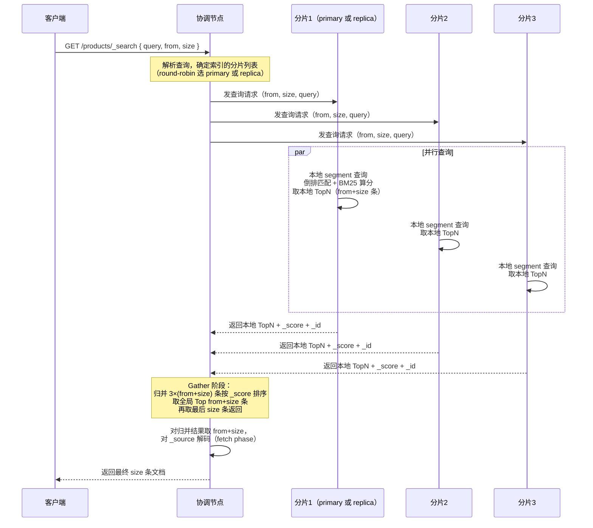
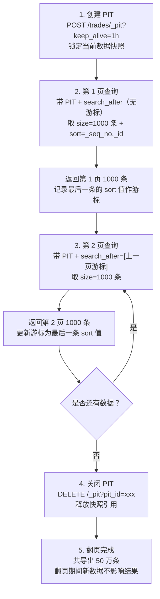

# 查询 DSL 与打分

> **一句话定位**：查询与打分是 ES 检索的核心，"Bool 查询怎么组合、BM25 怎么打分"是中高级面试必问。
> **面试热度**：⭐⭐⭐⭐⭐
> **返回**：[ES 知识图谱](../README.md)

---

## 一、概念定义

### 1.1 Query DSL 概述：用 JSON 表达查询

Elasticsearch 的查询不是 SQL 字符串，而是 **Query DSL（Domain Specific Language，领域专用语言）**——一种基于 JSON 的查询描述语言。所有查询都包在顶层的 `query` 字段里，通过嵌套的 JSON 对象组合出复杂查询逻辑，这是 ES 区别于 MySQL（SQL 字符串）的根本表达方式差异。

**与 SQL 表达式的对照**：

| 维度 | ES Query DSL | SQL 表达式 |
|------|--------------|-----------|
| 语法形态 | JSON 嵌套对象 | 字符串 + 关键字 |
| 组合方式 | `bool` 的 `must`/`should`/`filter`/`must_not` | `AND`/`OR`/`NOT` |
| 全文检索 | `match`/`multi_match`/`match_phrase`（分词后倒排匹配） | `LIKE '%关键词%'`（无分词、字符扫描） |
| 范围查询 | `range` 对象（`gte`/`lte`/`gt`/`lt`） | `BETWEEN ... AND ...` / `>` / `<` |
| 精确匹配 | `term`（keyword）/ `terms`（多值 IN） | `= ` / `IN (...)` |
| 打分参与 | 默认算分，`filter` 上下文不算分 | 无算分概念（靠 `ORDER BY` 排序） |
| 索引方式 | 倒排索引（term → 文档列表） | B+Tree 正向索引（key → 行） |
| 扩展性 | 可嵌套 `function_score`/`rescore`/`aggs` | 需写子查询、JOIN |

**为什么用 JSON 而不是 SQL？** ①JSON 天然嵌套，组合复杂查询比 SQL 的 `AND/OR` 拼接更清晰；②JSON 是 ES 的"母语"——请求体、响应体、Mapping 都是 JSON，Query DSL 与之同构；③JSON 易于程序构造与序列化（Java 侧 `QueryBuilder` 直接序列化为 JSON），SQL 字符串易注入、易拼接错。这是 ES 作为"文档型搜索引擎"的表达选择。

**Query DSL 的基本结构**：一个查询请求的最外层是 `query` 字段，里面是查询体。查询体分两类——**叶子查询（Leaf Query）**（如 `term`/`match`/`range`，直接查一个字段）和**组合查询（Compound Query）**（如 `bool`，把多个叶子查询按逻辑组合）。所有复杂查询都是叶子查询与 `bool` 的层层嵌套。

```json
GET /products/_search
{
  "query": {                    // 顶层 query 字段
    "bool": {                   // 组合查询：bool
      "must": [                 // 叶子查询1：match
        { "match": { "title": "手机" } }
      ],
      "filter": [              // 叶子查询2：term
        { "term": { "brand": "apple" } }
      ]
    }
  },
  "from": 0, "size": 10,       // 分页
  "sort": [                    // 排序（_score 默认倒序）
    { "_score": { "order": "desc" } },
    { "price": { "order": "asc" } }
  ]
}
```

**与 `middleware/mysql/04-query/query-optimization.md` 的对照**：MySQL 的查询是 `SELECT ... WHERE ... ORDER BY ... LIMIT`，ES 的查询是 `query` + `sort` + `from/size`，形态不同但职责对应。本质差异在于——MySQL 是正向索引（B+Tree 找行），ES 是倒排索引（词找文档），所以 ES 的 `match` 天然支持分词与多词组合，而 MySQL 的 `LIKE '%...%'` 只能字符扫描、无分词、无打分。

### 1.2 查询上下文 vs 过滤上下文：算分 vs 不算分

Query DSL 里有一个核心二分——**查询上下文（Query Context）** 与 **过滤上下文（Filter Context）**。前者算分参与排序，后者不算分只判断是否匹配。理解这个区分是讲清 Bool 查询和打分的前提。

- **查询上下文**：在 `bool` 的 `must`/`should` 里、或顶层的 `match` 等叶子查询里——ES 会计算文档与查询的相关性得分（`_score`），按 `_score` 排序。适合全文检索场景（找最相关的文档）。
- **过滤上下文**：在 `bool` 的 `filter`/`must_not` 里、或 `constant_score` 里——ES **不算分**，只判断文档是否匹配（是/否）。适合精确过滤场景（如品牌、价格范围、时间范围）。filter 结果可缓存（bitset 缓存），重复查询极快。

| 维度 | 查询上下文（must/should/match） | 过滤上下文（filter/must_not） |
|------|-------------------------------|------------------------------|
| 是否算分 | 是，计算 `_score` 参与排序 | 否，只判断匹配（0/1） |
| 排序方式 | 按 `_score` 倒序（相关性） | 不影响排序（靠 `sort` 或 `_score`） |
| 结果缓存 | 不缓存（每次算分） | 可缓存（bitset，重复查询命中极快） |
| 性能 | 较慢（算分开销） | 较快（无算分 + 缓存） |
| 适用场景 | 全文检索（match 找最相关文档） | 精确过滤（term/range 过滤条件） |
| 倒排使用 | 查倒排 + 取词频/位置算分 | 查倒排只取 doc_id（不算分） |

**为什么 filter 不算分还能更快？** ①算分要查 Posting List 的词频（TF）和文档长度（dl）等字段，开销不小；filter 只需取 doc_id 判断存在性，无算分开销；②filter 的结果（命中文档的 doc_id 集合）会被 ES 缓存为 **bitset**（位图），下次相同 filter 查询直接命中缓存，跳过倒排查询；③`must` 每次都要重新算分（因为 `_score` 依赖 `must` 里的词频与查询词，查询词变则得分变），无法跨查询缓存。这是 ES 把"算分"和"过滤"分两个上下文的根本动因。

**实战建议**：能用 filter 就别用 must。如电商搜索"品牌=Apple 且价格 1000-5000"——品牌和价格是精确过滤，用 `filter`（不算分、可缓存）；标题"手机"是全文检索，用 `must` + `match`（算分找最相关）。混用 `bool` 组合即可，既保证相关性打分又榨干 filter 缓存。

### 1.3 Bool 查询四子句：must / should / filter / must_not

**Bool 查询**是 Query DSL 里最核心的组合查询——用一个 `bool` 对象把多个叶子查询按四种逻辑子句组合，对应 SQL 的 `AND`/`OR`/`WHERE`/`NOT` 但语义更细。四子句的区别是面试必问的起手题。

| 子句 | 逻辑语义 | 是否算分 | 是否要求匹配 | 缓存 | 对应 SQL |
|------|---------|---------|------------|------|----------|
| `must` | 文档必须匹配，多条件 AND | 是（算分） | 必须匹配 | 否（算分不可缓存） | `WHERE A AND B` |
| `should` | 文档至少匹配 N 个（N 由 `minimum_should_match` 控制，默认 1） | 是（算分） | 至少匹配 `[minimum_should_match, ...]` 个 | 否（算分不可缓存） | `WHERE A OR B`（至少一个） |
| `filter` | 文档必须匹配，多条件 AND | 否（不算分） | 必须匹配 | 是（bitset 缓存） | `WHERE A AND B`（但不算分） |
| `must_not` | 文档必须不匹配，多条件 NOT AND | 否（不算分） | 必须不匹配 | 是（bitset 缓存） | `WHERE NOT A AND NOT B` |

**关键细节**：

1. **must vs filter 的差异只在算分与缓存**：两者都要求"必须匹配"，但 `must` 算分参与排序（适合相关性查询），`filter` 不算分且可缓存（适合精确过滤）。同样的 `term: {brand: "apple"}` 放 `must` 里会算分（但品牌是 keyword，TF=1，得分对所有匹配文档一样，无区分度），放 `filter` 里不算分更快——所以精确匹配的字段应放 `filter`。
2. **should 的 `minimum_should_match`**：`should` 子句默认要求"至少匹配 1 个"，但可通过 `minimum_should_match` 改为更多。如 `minimum_should_match: 2` 表示 `should` 列表里至少要匹配 2 个条件才算命中。当 `bool` 里只有 `should`（无 `must`/`filter`）时，`minimum_should_match` 默认为 1；当 `bool` 里有 `must` 或 `filter` 时，`should` 的 `minimum_should_match` 默认为 0（即 `should` 不再是"必须匹配"的条件，而是"匹配了加分"的加分项）。
3. **must_not 与 filter 的相似**：`must_not` 也是过滤上下文（不算分、可缓存），只是逻辑反向（必须不匹配）。两者都走 bitset 缓存路径。

**Bool 查询的嵌套**：`bool` 子句里还可以再嵌套 `bool`，组合出任意复杂的逻辑。如"(A AND B) OR (C AND NOT D)"可表达为 `{bool: {should: [{bool: {must: [A, B]}}, {bool: {must: [C], must_not: [D]}}]}}`。这是 Query DSL 表达复杂业务规则的基础。

### 1.4 BM25 打分：TF/IDF 的演进

ES 默认打分算法是 **BM25（Best Matching 25，Okapi BM25）**——一种概率检索模型，是经典 TF/IDF 的改进版。5.0 之后 ES 默认打分从 TF/IDF 切换为 BM25，因为 BM25 在文档长度归一化和词频饱和上更合理。

**TF/IDF 的两个问题**：

1. **词频（TF）线性增长**：TF/IDF 里 `_score` 随词频线性增长——一个词在文档里出现 10 次比出现 1 次得分高 10 倍，但语义上"出现 10 次"和"出现 5 次"的相关性差异远没有 10 倍那么大。词频无限增长导致长文档（词频高）得分虚高。
2. **无文档长度归一化**：TF/IDF 不考虑文档长度，长文档天然词频高（同样的"手机"在长文档里出现 10 次比在短文档里出现 2 次得分高），但长文档并不一定更相关——可能是凑字数。缺乏对长文档的惩罚。

**BM25 的两个改进**：

1. **TF 饱和（Saturation）**：BM25 的 TF 项是 `f(k1+1) / (f + k1)`，当词频 `f` 趋于无穷时该项趋于 `k1+1`（饱和值），不再线性增长。即"出现 10 次"和"出现 100 次"得分差异远小于 10 倍，符合语义。
2. **文档长度归一化**：BM25 引入 `1 - b + b × (dl/avgdl)` 项，`dl` 是文档长度、`avgdl` 是平均长度。`b` 控制归一化强度（默认 0.75）——长文档的 TF 项被压低，避免长文档虚高。

| 维度 | TF/IDF | BM25 |
|------|--------|------|
| 词频项 | `TF`（线性增长，无上限） | `f(k1+1)/(f+k1)`（饱和，趋于 `k1+1`） |
| 文档长度归一化 | 无 | `1 - b + b × (dl/avgdl)`（`b` 控制强度） |
| 长文档倾向 | 长文档词频高得分虚高 | 长文档被归一化压低得分 |
| 可调参数 | 无 | `k1`（TF 饱和度，默认 1.2）、`b`（长度归一化，默认 0.75） |
| 适用场景 | 短文本均匀分布 | 长短文档混合、长文档占优 |

**`k1` 和 `b` 的调参**：①`k1` 控制 TF 饱和度——`k1` 越大饱和越慢（词频影响越大），`k1=0` 退化为二元（只看有没有，不看次数）；默认 1.2 是经验值，短文本（如推文）可调小（如 1.0），长文本（如文章）可调大（如 2.0）。②`b` 控制文档长度归一化强度——`b=0` 不做归一化（长文档不惩罚），`b=1` 全归一化（长文档强压低）；默认 0.75 是折中，文档长度分布均匀时可调小（如 0.5），分布不均时调大（如 0.9）。调参靠业务评测集，无通用最优值。

**与 `middleware/mysql/04-query/query-optimization.md` 的对照**：MySQL 的 `ORDER BY` 是用户指定的排序键（如 `ORDER BY price`），无"相关性"概念；ES 的 `_score` 是系统计算的相关性得分，按相关性排序。这是搜索引擎（ES）与数据库（MySQL）的本质差异——搜索引擎的核心价值是"按相关性找最相关的文档"，数据库的核心价值是"按指定键精确取行"。MySQL 全文索引（FULLTEXT）也用 BM25（5.7 起 InnoDB 支持），但功能远弱于 ES（无分词链、无 Bool 组合、无 function_score）。

---

## 二、原理与流程

### 2.1 Query DSL 结构：query → bool → 四子句 → 叶子查询

Query DSL 的核心结构是"`query` → `bool` → 四子句 → 叶子查询"的层层嵌套。理解这个嵌套结构是构造复杂查询的基础。

**结构层次**：

```
query（顶层查询字段）
├── bool（组合查询，最常用）
│   ├── must: [叶子查询...]      // 算分 AND
│   ├── should: [叶子查询...]    // 算分 OR（minimum_should_match 控制）
│   ├── filter: [叶子查询...]    // 不算分 AND（可缓存）
│   └── must_not: [叶子查询...] // 不算分 NOT（可缓存）
├── function_score（函数打分查询）
│   ├── query: 基础查询
│   └── functions: [打分函数...]
├── constant_score（固定分查询）
│   ├── filter: 过滤条件
│   └── boost: 固定分值
└── 叶子查询（直接放 query 里）
    ├── term / terms        // 精确匹配 keyword
    ├── range               // 范围
    ├── match / match_phrase / multi_match  // 全文检索
    ├── exists              // 字段存在
    ├── ids / prefix / wildcard / regexp
    └── nested / has_child / has_parent  // 关系查询
```

**Bool 查询的典型 JSON**：

```json
GET /products/_search
{
  "query": {
    "bool": {
      "must": [
        { "match": { "title": "智能手机" } }
      ],
      "should": [
        { "match": { "description": "高清屏幕" } },
        { "match": { "description": "长续航" } }
      ],
      "minimum_should_match": 1,
      "filter": [
        { "term": { "brand": "apple" } },
        { "range": { "price": { "gte": 3000, "lte": 8000 } } }
      ],
      "must_not": [
        { "term": { "status": "deleted" } }
      ]
    }
  }
}
```

这个查询的语义是：标题必须匹配"智能手机"（算分），描述里至少匹配"高清屏幕"或"长续航"中一个（算分），品牌必须是 Apple 且价格 3000-8000（过滤不算分），状态不能是已删除（过滤不算分）。最终 `_score` 由 `must` 和 `should` 的算分子句决定，`filter` 和 `must_not` 不影响 `_score`。

### 2.2 term 与 match：精确匹配 vs 分词匹配

**term** 和 **match** 是两个最基础的叶子查询，区别在于是否对查询词分词——这是面试必问的起手题。

| 维度 | `term` | `match` | `match_phrase` |
|------|--------|---------|----------------|
| 查询词处理 | 不分词，原样匹配 | 分词后 OR 匹配 | 分词后按顺序且位置相邻匹配 |
| 适用字段 | `keyword`（精确值） | `text`（全文） | `text`（短语） |
| 倒排使用 | 查倒排找完全相等的 term | 分词后每个 token 查倒排，多词 OR | 分词后查倒排 + 校验位置相邻 |
| 算分 | 算分（但 keyword TF=1 对所有匹配文档一样） | 算分（多词 OR，按 BM25 各词加权） | 算分（短语匹配加分） |
| 典型场景 | `term: {brand: "apple"}` 精确品牌 | `match: {title: "智能手机"}` 全文 | `match_phrase: {title: "苹果手机"}` 短语 |

**关键陷阱：term 用在 text 字段上**：

```json
// ❌ 错误用法：term 查 text 字段，查不到
{ "term": { "title": "iPhone 15" } }
// 因为 title 是 text，索引时被分词为 ["iphone", "15"]，倒排里只有 "iphone" 和 "15"，
// 而 term 不分词，原样查 "iPhone 15"（带空格），倒排里没有，查不到。

// ✅ 正确用法：match 查 text 字段
{ "match": { "title": "iPhone 15" } }
// match 先把 "iPhone 15" 分词为 ["iphone", "15"]，再查倒排，能查到。

// ✅ 正确用法：term 查 keyword 字段（如 brand.keyword）
{ "term": { "brand": "Apple" } }
// brand 是 keyword，不分词，倒排里就是 "Apple"，term 原样匹配能查到。
```

**`match` 的分词与 OR 默认**：`match` 默认把查询词分词后做 OR 匹配——"iPhone 15" 分词为 `["iphone", "15"]`，只要文档包含 `iphone` 或 `15` 任一个就算命中（算分按各词加权）。如要 AND 匹配（两词都要包含），用 `"operator": "and"`：`{ "match": { "title": { "query": "iPhone 15", "operator": "and" } } }`。

**`match_phrase` 的顺序与位置**：`match_phrase` 不仅要求两词都出现，还要求**顺序一致且位置相邻**——"苹果手机" 分词为 `["苹果", "手机"]`，文档里必须按此顺序出现且两词相邻（位置差 ≤ `slop`，默认 0）才算命中。适合短语精确匹配（如"分布式锁"作为一个整体概念）。

**与 Task 4 Analyzer 的关联**：`match` 查询用的分词器与索引时一致（默认 standard analyzer），即索引时把 "iPhone 15" 分词为 `["iphone", "15"]` 建倒排，查询时 `match` 用同一 analyzer 把 "iPhone 15" 分词为 `["iphone", "15"]` 查倒排——**索引时分词与查询时分词必须一致**才能匹配。详见 [03 倒排索引与分词](../03-inverted-index/inverted-index-and-analysis.md) 的 Analyzer 分词链。

### 2.3 Bool 查询组合：must 算分 / should minimum_should_match / filter 缓存 / must_not 反向

Bool 查询四子句的组合规则是构造复杂查询的核心，关键细节是 `should` 的 `minimum_should_match` 与 `filter` 的缓存机制。

**复杂 Bool 查询示例**：

```json
GET /articles/_search
{
  "query": {
    "bool": {
      "must": [
        { "match": { "title": "分布式锁" } }
      ],
      "should": [
        { "match": { "content": "Redis" } },
        { "match": { "content": "Zookeeper" } },
        { "term": { "tag": "backend" } }
      ],
      "minimum_should_match": 2,
      "filter": [
        { "range": { "publish_date": { "gte": "2025-01-01" } } },
        { "term": { "status": "published" } }
      ],
      "must_not": [
        { "term": { "category": "advertisement" } }
      ]
    }
  }
}
```

**语义解读**：

- `must`：标题必须匹配"分布式锁"（算分，决定主相关性）
- `should` + `minimum_should_match: 2`：`should` 列表（content 含 Redis / 含 Zookeeper / tag 是 backend）里至少匹配 2 个才算命中（且匹配的子句算分加分）
- `filter`：发布日期 ≥ 2025-01-01 且状态是已发布（过滤不算分，可缓存）
- `must_not`：分类不是广告（过滤不算分，可缓存）

**`minimum_should_match` 的两种场景**：

1. **`bool` 里只有 `should`（无 `must`/`filter`）**：`minimum_should_match` 默认为 1，即至少匹配 1 个。可显式设为 2、3 等提高门槛。
2. **`bool` 里有 `must` 或 `filter`**：`minimum_should_match` 默认为 0，即 `should` 不再是"必须匹配"的条件，而是"匹配了就加分"的加分项。如要 `should` 也参与"必须匹配"，需显式设 `minimum_should_match: 1` 或更高。

**filter 的缓存机制**：`filter` 子句的命中结果（doc_id 集合）会被 ES 缓存为 **bitset**（位图，每位表示一个 doc_id 是否命中）。当相同 `filter` 再次出现（如下次查询还是 `term: {brand: "apple"}`），ES 直接命中 bitset 缓存，跳过倒排查询，极快。缓存在 Node 的 QueryCache 里，按 shard 维度缓存，LRU 淘汰。`must_not` 也是过滤上下文，同样走 bitset 缓存。`must` 和 `should` 因算分依赖查询词无法跨查询缓存。

**filter 可缓存的前提**：查询结果集不能太大（bitset 太大缓存成本高），且查询要稳定重复出现（否则缓存命中率低浪费内存）。典型适合缓存的 filter：枚举值少的 `term`（如 brand、status）、范围固定的 `range`（如日期范围）。不适合缓存的 filter：高基数 `term`（如 user_id）、范围很宽的 `range`（命中几百万文档）。

### 2.4 Function Score：业务加权打分

**Function Score** 是 ES 的"自定义打分"查询——在基础查询的 `_score` 上叠加业务函数得分，实现"相关性打分 + 业务加权"混合排序。电商搜索"标题匹配 + 销量加权 + 新品加权"就是典型 Function Score 场景。

**Function Score 的五种打分函数**：

| 函数 | 作用 | 典型场景 |
|------|------|---------|
| `script_score` | 用 Painless 脚本计算得分 | 复杂业务公式（如 `log(sales) * 1.5 + rating * 2`） |
| `field_value_factor` | 用文档某字段的值做因子乘以/加到 `_score` | 销量加权（`field: sales, factor: 1.2, modifier: log`） |
| `weight` | 简单权重乘以 `_score` | 子句加权（如某 should 加权 2 倍） |
| `random_score` | 生成随机分（种子可复现） | A/B 测试分流、随机推荐 |
| `decay_functions` | 衰减函数（`gauss`/`exp`/`linear`），按字段值离中心点距离衰减 | 时间衰减（新文章加分）、距离衰减（附近商家加分） |

**Function Score 配置示例**：

```json
GET /products/_search
{
  "query": {
    "function_score": {
      "query": {                          // 基础查询（先算相关性 _score）
        "match": { "title": "手机" }
      },
      "functions": [                      // 打分函数列表（按 filter 过滤后应用）
        {
          "filter": { "term": { "brand": "apple" } },
          "weight": 1.5                   // Apple 品牌加权 1.5
        },
        {
          "filter": { "match": { "tag": "新品" } },
          "weight": 1.2                   // 新品标签加权 1.2
        },
        {
          "script_score": {               // 脚本得分：销量对数 × 2
            "script": { "source": "Math.log10(doc['sales'].value) * 2" }
          }
        },
        {
          "field_value_factor": {         // 评分字段因子：rating × 0.5 加到 _score
            "field": "rating",
            "factor": 0.5,
            "modifier": "none",
            "missing": 3.0
          }
        },
        {
          "gauss": {                       // 高斯衰减：发布时间离现在越远得分越低
            "publish_date": { "origin": "now", "scale": "30d", "decay": 0.5 }
          }
        }
      ],
      "score_mode": "sum",                // 多函数得分如何合并：sum/avg/max/first/multiply
      "boost_mode": "sum"                 // 基础 _score 与函数得分如何合并：sum/multiply/avg/max/min/replace
    }
  }
}
```

**`score_mode` 与 `boost_mode` 的区别**：

- `score_mode`：控制**多个 functions 之间**如何合并——`sum`（相加，默认）、`multiply`（相乘）、`avg`（平均）、`max`（取最大）、`first`（取第一个命中的函数得分）。
- `boost_mode`：控制**基础查询 `_score` 与函数得分**如何合并——`sum`（相加，默认）、`multiply`（相乘）、`avg`（平均）、`max`（取大）、`min`（取小）、`replace`（用函数得分替换基础分）。

**实战要点**：①`script_score` 有性能开销（每文档执行脚本），大结果集慎用，可先用 `filter` 缩小范围再 `script_score`；②`field_value_factor` 的 `modifier` 常用 `log`（对数压扁，避免极端值主导）和 `none`（直接用原值）；③`decay_functions` 的 `scale` 是衰减尺度（如 30d 表示 30 天衰减一半），`decay` 是衰减系数（默认 0.5，即 scale 处衰减为一半）；④`random_score` 用 `seed` 参数可复现随机（同一 seed 同一文档得分一致），适合 A/B 测试稳定分流。

### 2.5 BM25 打分公式：TF 饱和 + 文档长度归一化

BM25 的打分公式是面试高频追问点，能写出公式并解释各部分含义才算合格。

**BM25 公式**（简化版，单字段单词）：

```
score(D, Q) = IDF(q) × [ f(q,D) × (k1 + 1) ] / [ f(q,D) + k1 × (1 - b + b × dl/avgdl) ]
```

其中：

| 符号 | 含义 | 取值 |
|------|------|------|
| `IDF(q)` | 词 q 的逆文档频率 | `log(1 + (N - n + 0.5) / (n + 0.5))`，N 文档总数，n 含 q 的文档数 |
| `f(q,D)` | 词 q 在文档 D 中的词频（TF） | 整数，文档里出现几次 |
| `k1` | TF 饱和参数 | 默认 1.2，控制词频影响 |
| `b` | 文档长度归一化参数 | 默认 0.75，控制长度惩罚 |
| `dl` | 文档 D 的字段长度 | 该字段分词后的 token 数 |
| `avgdl` | 所有文档该字段的平均长度 | 全局统计值 |

**公式各部分含义**：

```
score = IDF × TF饱和项 × 文档长度归一化项

IDF：        log((N - n + 0.5) / (n + 0.5))
   词越稀有（n 小），IDF 越大，命中越加分；词越常见（n 大），IDF 越小。

TF饱和项：   f × (k1+1) / (f + k1 × 归一化分母)
   f 是词频，当 f→∞ 时该项趋于 k1+1（饱和值），不再线性增长。
   k1 越大饱和越慢（词频影响越大），k1=0 退化为只看有无词。

长度归一化项：1 - b + b × (dl/avgdl)
   dl 是文档长度，dl/avgdl 是相对长度比。
   长文档 dl/avgdl > 1，该项 > 1，TF 饱和项的分母变大，得分变低（惩罚长文档）。
   短文档 dl/avgdl < 1，该项 < 1，TF 饱和项的分母变小，得分变高（奖励短文档）。
   b=0 时不归一化（长短文档平等），b=1 时全归一化。
```

**图解 BM25 的 TF 饱和**：

```
TF得分
  │                        ────────  TF/IDF（线性，无上限）
  │                    /
  │                 /
  │              /           ────────  BM25（饱和趋于 k1+1）
  │           /          ─────
  │        /       ─────
  │     /    ─────
  │  /─
  │/
  └──────────────────────────────→ 词频 f
       1   2   3   5   10  20  ∞
```

TF/IDF 里词频线性增长（出现 10 次比 1 次高 10 倍），BM25 里词频趋于饱和（出现 10 次和 100 次得分差异远小于 10 倍，趋于 `k1+1=2.2`）。这更符合语义——"出现 10 次"和"出现 100 次"的相关性差异远没有 10 倍那么大。

**多词查询的合并**：`match: {title: "分布式 锁"}` 分词为 `["分布式", "锁"]`，BM25 对每个词单独算分，最后求和（或多词加权求和）。多词查询的 `_score` 是各词 BM25 分之和。

**字段加权**：`multi_match` 查询多字段时，可指定字段权重：`{ "multi_match": { "query": "手机", "fields": ["title^3", "description^1"] } }`，`title` 的得分乘以 3，`description` 乘以 1，让标题匹配比描述匹配更重要。

**源码路径**：BM25 的实现类是 `org.apache.lucene.search.similarities.BM25Similarity`（Lucene 层），ES 的 `similarity` 配置在 Mapping 里按字段指定：`"properties": { "title": { "type": "text", "similarity": "BM25" } }`。可自定义 `k1`/`b`：在 index settings 里定义自定义 similarity：

```json
PUT /products
{
  "settings": {
    "index": {
      "similarity": {
        "custom_bm25": { "type": "BM25", "k1": 1.5, "b": 0.8 }
      }
    }
  },
  "mappings": {
    "properties": { "title": { "type": "text", "similarity": "custom_bm25" } }
  }
}
```

### 2.6 Rescoring：粗筛后精排

**Rescoring（重打分）** 是 ES 的"粗筛 → 精排"两阶段查询机制——先用轻量查询从海量文档中粗筛出 TopN，再用重量级查询在 TopN 窗口内重新算分精排。适合"基础 BM25 粗筛 + 业务精排"或"向量召回 + BM25 精排"场景。

**Rescoring 工作流程**：

1. **粗筛阶段**：用 `query` 字段的查询（如 BM25 match）对所有文档算分，取前 `window_size` 条（如 100 条）。
2. **精排阶段**：在 `window_size` 窗口内，用 `rescore_query` 的查询（如 `script_score` 或更重的 BM25 变体）重新算分。
3. **合并**：粗筛分和精排分按 `query_weight` 和 `rescore_query_weight` 加权合并，最终排序返回 TopN。

**Rescoring 配置示例**：

```json
GET /products/_search
{
  "query": {
    "match": { "title": "手机" }               // 粗筛：BM25 粗筛
  },
  "rescore": [
    {
      "window_size": 100,                      // 重打分窗口：只对前 100 条重打分
      "query": {
        "rescore_query": {                     // 精排：用 field_value_factor 加权销量
          "function_score": {
            "query": { "match": { "title": "手机" } },
            "functions": [
              { "field_value_factor": { "field": "sales", "factor": 0.1, "modifier": "log" } }
            ],
            "boost_mode": "sum"
          }
        },
        "query_weight": 0.8,                  // 粗筛分权重 0.8
        "rescore_query_weight": 0.2            // 精排分权重 0.2
      }
    }
  ],
  "size": 10                                   // 最终返回前 10 条
}
```

**关键参数**：

- `window_size`：重打分窗口大小（默认与 `size` 相同，推荐设为 `size` 的几倍如 100）。窗口越大精排越准但开销越大（精排查询对窗口内每文档执行一次）。
- `query_weight`：粗筛分权重（默认 1.0）。
- `rescore_query_weight`：精排分权重（默认 1.0）。
- `score_mode`：粗筛与精排合并方式（默认 `total` 相加，还可 `multiply`/`avg`/`max`/`min`）。

**Rescoring 的适用场景**：

1. **BM25 粗筛 + 业务精排**：如电商搜索先用 BM25 粗筛 100 条，再用 `script_score` 按销量×评分精排——避免对所有百万文档执行脚本。
2. **向量召回 + BM25 精排**：8.x 的 `kNN` 查询召回 TopK，再用 BM25 精排（向量召回快但语义粗，BM25 精确但词级匹配）。
3. **多模型融合**：多个 `rescore` 数组项依次精排，实现多模型加权融合。

**性能权衡**：Rescoring 把重量级查询限制在 `window_size` 窗口内（如 100 条），避免对全量文档执行——粗筛阶段对所有文档算 BM25（轻量，倒排查询），精排阶段只对 100 条执行 `script_score`（重量，脚本执行）。`window_size` 越大精排越准但开销线性增长，生产推荐 `window_size` 为 `size` 的 5-10 倍。

### 2.7 分页：from/size vs search_after vs PIT

ES 的分页有三种方式，各有适用场景——`from`+`size` 适合浅分页，`search_after` 适合深度分页，`PIT`（Point-in-Time，8.x）保证分页结果一致性。

| 维度 | `from` + `size` | `search_after` | `PIT` + `search_after` |
|------|----------------|----------------|------------------------|
| 原理 | 协调节点取各分片 `from+size` 条归并 | 用上一页最后一条的排序值作游标，各分片取 > 游标值的 size 条 | 先创建 PIT 锁定数据快照，再 `search_after` 翻页 |
| 深度分页性能 | 差（from 越大各分片要取越多条归并） | 好（各分片只取 size 条，无 from 开销） | 好（同 search_after） |
| 一致性 | 弱（翻页期间 refresh 可能插入新数据导致结果跳变） | 弱（同 from/size，翻页期间数据变化导致游标失序） | 强（PIT 锁定快照，翻页期间数据变化不影响） |
| 适用场景 | 浅分页（from < 1000，如首页列表） | 深度分页且不要求数据一致性（如导出历史数据） | 深度分页且要求一致性（如生产报表、合规审计） |
| 限制 | `from+size` ≤ `index.max_result_window`（默认 10000） | 无 from 限制，但要求排序字段唯一且有序 | 需 8.x，PIT 有生命周期（默认 5 分钟，可续期） |

**`from` + `size` 的深度分页问题**：

```
查 from=9990, size=10（第 1000 页）：
  协调节点要向每个分片请求 from+size=10000 条（各分片局部 Top 10000），
  N 个分片共返回 N×10000 条到协调节点，
  协调节点归并后取全局第 9990-9999 条返回 10 条。
  
问题：from 越大各分片要取越多条归并，内存与 CPU 开销线性增长。
  from=0 取 N×10 条归并（轻量）
  from=9990 取 N×10000 条归并（重，且大多被丢弃）
  
限制：from+size 默认上限 10000（index.max_result_window），超过报错。
```

**`search_after` 的游标分页**：

```json
// 第 1 页
GET /products/_search
{ "query": { "match": { "title": "手机" } }, "sort": [ { "price": "asc" }, { "_id": "asc" } ], "size": 10 }
// 返回结果最后一条有 sort 字段：[100, "abc123"]

// 第 2 页：用上一页最后一条的 sort 值作 search_after 游标
GET /products/_search
{
  "query": { "match": { "title": "手机" } },
  "sort": [ { "price": "asc" }, { "_id": "asc" } ],
  "size": 10,
  "search_after": [100, "abc123"]            // 上一页最后一条的 sort 值
}
```

**`search_after` 的要求**：①必须有排序字段（`sort`），且排序字段组合必须**唯一**（推荐用 `_id` 或 `_seq_no` 作 tie-breaker，避免相同排序值的文档翻页丢失）；②游标值是上一页最后一条的 `sort` 数组值；③翻页期间若有新写入或 refresh，游标后的数据可能变化（如新数据插入到游标前），导致翻页结果跳变——这是 `search_after` 的一致性弱点。

**`PIT`（Point-in-Time）8.x**：

```json
// 1. 创建 PIT，锁定当前索引数据快照
POST /products/_pit?keep_alive=5m
// 返回：{ "id": "pit_id_xxx..." }

// 2. 带 PIT 用 search_after 翻页
GET /_search
{
  "pit": { "id": "pit_id_xxx...", "keep_alive": "5m" },
  "query": { "match": { "title": "手机" } },
  "sort": [ { "price": "asc" }, { "_id": "asc" } ],
  "size": 10,
  "search_after": [100, "abc123"]
}

// 3. 用完关闭 PIT 释放资源
DELETE /_pit
{ "pit_id": "pit_id_xxx..." }
```

**PIT 的工作原理**：PIT 锁定创建时刻的索引数据状态（基于 segment 的快照，类似数据库的 MVCC）——翻页期间的新写入不影响 PIT 内的数据视图，保证翻页结果一致性（第 1 页看到的文档在第 2 页还能看到、不会被新数据挤掉）。代价是 PIT 期间对应 segment 不能被 merge 删除（保留快照引用），增加存储与 merge 延迟。`keep_alive` 控制 PIT 生命周期（默认 5 分钟，每次查询可续期）。

**与 Task 5 的关联**：`from`+`size` 的深度分页性能问题源于协调节点归并开销，`search_after` 通过游标避免归并，`PIT` 通过快照保证一致性——这都与 [04 读写流程与 Translog](../04-read-write-translog/read-write-and-translog.md) 讲的 segment 不可变性与 refresh 周期相关。segment 不可变使 PIT 快照成为可能（只读快照不会变），refresh 周期导致 `search_after` 的一致性弱点（翻页期间 refresh 生成新 segment 改变可见数据）。

### 2.8 协调节点 Scatter-Gather：分片并行查询与归并

ES 的查询不是单机查询，而是**协调节点（Coordinating Node）** 路由到各分片的**Scatter-Gather** 流程——Scatter 阶段各分片并行查询返回 TopN，Gather 阶段协调节点归并全局 TopN。理解这个流程是讲清 ES 分布式查询的标准答法。

**Scatter-Gather 流程**：



**关键细节**：

1. **Scatter 阶段**：协调节点把查询请求发到每个分片（primary 或 replica，round-robin 负载均衡）。各分片并行处理（互相独立），每个分片对自己的 segment 做倒排查询 + BM25 算分，取本地 TopN（N = from + size，因为协调节点归并后要跳过 from 取 size，所以每个分片都要多取 from 条）。
2. **Gather 阶段**：各分片返回本地 TopN（含 `_score`、`_id`、排序字段，不含 `_source` 全文），协调节点归并 3×N 条按 `_score` 排序取全局 TopN，再跳过 from 取 size 条。
3. **Fetch 阶段**：协调节点对最终 size 条文档，向对应分片请求 `_source` 全文（fetch phase，第二轮 RPC），返回客户端。

**为什么各分片要取 from+size 条而不是 size 条？** 因为全局 TopN 可能集中在某几个分片——如全局第 1-10 名可能都在分片1，如果各分片只取 size=10 条，分片1 返回 10 条但其中可能有几条是全局 Top10，分片2/3 返回的 10 条可能都不是全局 Top10。为了确保不遗漏全局 TopN，每个分片都要取 from+size 条，协调节点归并后取全局 Top from+size 再跳 from 取 size。这就是深度分页性能差的根源——from 越大各分片要取越多条。

**与 Task 5 的关联**：Scatter-Gather 的"各分片局部 TopN → 协调节点归并全局 TopN"模式，与 [04 读写流程与 Translog](../04-read-write-translog/read-write-and-translog.md) 讲的"写请求 primary → replica 同步"形成对照——写是"协调节点 → primary → replica"，读是"协调节点 → 各分片（primary 或 replica）→ 协调节点归并"。写关心一致性（primary 写完同步 replica），读关心性能（各分片并行查询 + 负载均衡选 replica）。

### 2.9 源码路径

ES 查询 DSL 的核心类在 `org.elasticsearch.index.query` 包下，BM25 在 Lucene 层：

| 类/包 | 职责 |
|-------|------|
| `org.elasticsearch.index.query.QueryBuilders` | 查询构造器入口（`boolQuery`/`matchQuery`/`termQuery` 等静态工厂） |
| `org.elasticsearch.index.query.BoolQueryBuilder` | Bool 查询构造器（`must`/`should`/`filter`/`must_not` 方法 + `minimumShouldMatch`） |
| `org.elasticsearch.index.query.MatchQueryBuilder` | `match` 查询构造器（分词 + operator 控制） |
| `org.elasticsearch.index.query.TermQueryBuilder` | `term` 查询构造器（不分词精确匹配） |
| `org.elasticsearch.index.query.RangeQueryBuilder` | `range` 查询构造器（gte/lte/gt/lt） |
| `org.elasticsearch.index.query.functionscore.FunctionScoreQueryBuilder` | Function Score 查询构造器（script_score / field_value_factor 等） |
| `org.apache.lucene.search.similarities.BM25Similarity` | BM25 打分算法实现（Lucene 层，ES similarity 配置调用） |
| `org.apache.lucene.search.similarities.TFIDFSimilarity` | TF/IDF 打分算法实现（经典版，ES 已默认弃用） |
| `org.elasticsearch.search.SearchService` | 查询执行协调（Scatter-Gather 流程的协调入口） |
| `org.elasticsearch.search.internal.ContextIndexSearcher` | 分片本地查询执行（segment 倒排查询 + 算分） |

**关键源码要点**：①`BoolQueryBuilder` 的 `must`/`should`/`filter`/`must_not` 分别对应 Lucene 的 `BooleanClause.Occur.MUST`/`SHOULD`/`FILTER`/`MUST_NOT`，`filter` 子句的 `Occur.FILTER` 是 Lucene 5.x 引入的"算分禁用"标记，配合 `ConstantScoreScorer` 实现不算分；②`BM25Similarity` 的 `score()` 方法实现上述 BM25 公式，`k1`/`b` 通过构造函数注入；③`MatchQueryBuilder` 的 `operator` 字段控制分词后多词的 AND/OR（默认 OR），底层用 `BooleanQuery` 组合多个 `TermQuery`。

---

## 三、高频追问

### Q1：Bool 查询四子句区别？

- `must`：必须匹配，算分参与排序（适合相关性查询）
- `should`：至少匹配 N 个（`minimum_should_match` 控制，默认 1），算分加分
- `filter`：必须匹配但不算分，结果可缓存（适合精确过滤）
- `must_not`：必须不匹配，不算分可缓存（反向过滤）

**关键点**：`must` vs `filter` 都是"必须匹配"，差异在算分与缓存——精确匹配字段用 `filter`，全文检索用 `must`。

### Q2：查询上下文和过滤上下文区别？

- 查询上下文（`must`/`should`）：算 `_score` 参与排序，适合全文检索找最相关文档
- 过滤上下文（`filter`/`must_not`）：不算分只判断匹配，结果可缓存为 bitset，重复查询极快

**关键点**：能用 filter 就别用 must——精确过滤用 filter 既不算分又能缓存。

### Q3：term 和 match 区别？

- `term`：不分词原样匹配，适合 `keyword` 字段（如 `term: {brand: "apple"}`）
- `match`：分词后 OR 匹配，适合 `text` 字段（如 `match: {title: "智能手机"}`）
- `match_phrase`：分词后按顺序且位置相邻匹配，适合短语（如 `match_phrase: {title: "苹果手机"}`）

**关键陷阱**：`term` 用在 `text` 字段上会查不到（索引时已分词，倒排里是分词后的 token，term 原样查带空格的原词查不到）。

### Q4：BM25 怎么打分？

BM25 是 TF/IDF 的改进——公式 `IDF × TF饱和项 × 长度归一化项`：

- IDF：词越稀有 IDF 越大（与 TF/IDF 一致）
- TF 饱和：词频趋于 `k1+1` 饱和值，不再线性增长（TF/IDF 是线性增长）
- 文档长度归一化：长文档 TF 项被压低，避免长文档虚高（TF/IDF 无此机制）

**关键点**：BM25 解决了 TF/IDF 两个问题——词频无限增长 + 长文档虚高。

### Q5：`k1` 和 `b` 调什么？

- `k1`（默认 1.2）：控制 TF 饱和度。`k1` 越大饱和越慢（词频影响越大），`k1=0` 退化为只看有无词
- `b`（默认 0.75）：控制文档长度归一化强度。`b=0` 不归一化（长短文档平等），`b=1` 全归一化

**调参建议**：短文本（推文）`k1` 调小（1.0）、长文本（文章）`k1` 调大（2.0）；文档长度分布均匀 `b` 调小（0.5）、分布不均 `b` 调大（0.9）。

### Q6：深度分页怎么办？

`from`+`size` 深度分页性能差（协调节点要归并 `from+size`×分片数条），且 `from+size` 默认上限 10000。深度分页方案：

- `search_after`：用上一页最后一条的排序值作游标，各分片只取 size 条，无 from 开销——但翻页期间数据变化导致游标失序
- `PIT` + `search_after`（8.x）：先创建 PIT 锁定数据快照，再 `search_after` 翻页——保证翻页期间结果一致性

**关键点**：不要求数据一致性用 `search_after`，要求一致性用 `PIT` + `search_after`。

### Q7：Function Score 怎么用？

Function Score 在基础查询 `_score` 上叠加业务函数得分，五种打分函数：

- `script_score`：Painless 脚本算分（复杂业务公式）
- `field_value_factor`：字段值做因子（销量加权 `modifier: log`）
- `weight`：简单权重（某条件加权倍数）
- `random_score`：随机分（A/B 测试分流）
- `decay_functions`：衰减函数（`gauss`/`exp`/`linear`，时间/距离衰减）

**关键点**：`score_mode` 合并多函数得分，`boost_mode` 合并基础分与函数分——`boost_mode: sum` 常用（相关性分 + 业务分相加）。

### Q8：PIT 是什么？

`PIT`（Point-in-Time，8.x）是 ES 的数据快照机制——创建时刻锁定索引数据状态，翻页期间的新写入不影响 PIT 内数据视图。配合 `search_after` 实现一致性的深度分页。

**工作原理**：基于 segment 不可变（segment 只读快照不会变），PIT 保留对当前 segment 的引用，期间这些 segment 不能被 merge 删除。`keep_alive` 控制生命周期（默认 5 分钟，可续期）。

**适用场景**：合规审计、生产报表、需要翻页一致性的深度分页。

---

## 四、实战关联

### 4.1 Java 场景：RestHighLevelClient 构造查询

ES 的 Java 高层客户端 `RestHighLevelClient` 提供了 `QueryBuilder` 链式 API 构造 Query DSL，避免手写 JSON。

**Java 查询构造示例**：

```java
// 1. 构造 Bool 查询
BoolQueryBuilder boolQuery = QueryBuilders.boolQuery()
    .must(QueryBuilders.matchQuery("title", "智能手机"))         // 算分 must
    .should(QueryBuilders.matchQuery("description", "高清屏幕")) // 算分 should
    .should(QueryBuilders.matchQuery("description", "长续航"))
    .minimumShouldMatch(1)                                       // should 至少匹配 1 个
    .filter(QueryBuilders.termQuery("brand", "apple"))         // 不算分 filter（可缓存）
    .filter(QueryBuilders.rangeQuery("price").gte(3000).lte(8000))
    .mustNot(QueryBuilders.termQuery("status", "deleted"));

// 2. 构造 SearchRequest
SearchRequest searchRequest = new SearchRequest("products");
SearchSourceBuilder sourceBuilder = new SearchSourceBuilder();
sourceBuilder.query(boolQuery);
sourceBuilder.from(0);
sourceBuilder.size(10);
sourceBuilder.sort("_score", SortOrder.DESC);
sourceBuilder.sort("price", SortOrder.ASC);
searchRequest.source(sourceBuilder);

// 3. 执行查询
SearchResponse response = restHighLevelClient.search(searchRequest, RequestOptions.DEFAULT);

// 4. 解析结果
for (SearchHit hit : response.getHits().getHits()) {
    String id = hit.getId();
    float score = hit.getScore();                 // BM25 得分
    Map<String, Object> source = hit.getSourceAsMap();  // _source 反序列化为 Map
    // 业务处理...
}
```

**Function Score 的 Java 构造**：

```java
// 用 field_value_factor 加权销量
FunctionScoreQueryBuilder functionScore = QueryBuilders.functionScoreQuery(
    QueryBuilders.matchQuery("title", "手机"),    // 基础查询
    ScoreFunctionBuilders.fieldValueFactor("sales")
        .factor(0.1)
        .modifier(Modifier.LOG1P)                // log(1 + x)，避免 0 销量报错
        .missing(1)
).boostMode(CombineFunction.SUM);                // 基础分 + 函数分相加
```

### 4.2 打分调优

生产打分调优从三个维度入手：

| 维度 | 调优手段 | 效果 |
|------|---------|------|
| BM25 参数 | 调 `k1`（词频饱和）、`b`（长度归一化） | 优化相关性，按业务评测集调参 |
| Function Score | `field_value_factor` 加权销量/评分、`decay_functions` 时间衰减 | 业务加权，让热门/新品加分 |
| Rescoring | BM25 粗筛 + `script_score` 精排 | 两阶段查询，重量级精排限制在窗口内 |

**调优示例**：电商搜索相关性差——标题匹配的文档销量低的排前面。调优：①BM25 `k1` 从 1.2 调到 1.5（让标题词频影响更大）；②加 `field_value_factor` 销量加权（`modifier: log`，`factor: 0.1`）；③加 `decay_functions` 发布时间衰减（`scale: 30d`，30 天前的商品得分衰减一半）。调后销量高且新的商品排名上升。

**调优的禁忌**：①`script_score` 对全量文档执行（无 rescore 窗口限制）——脚本性能差，应限制在 `window_size` 内；②`k1`/`b` 调到极端值（如 `k1=10` 词频影响过大、`b=1` 长文档强压低）——极端值破坏打分合理性；③`function_score` 用 `boost_mode: multiply` 且函数分有 0——`_score × 0` 导致所有分变 0，应用 `sum` 或 `replace`。

### 4.3 与 MySQL 查询对比

| 维度 | ES Query DSL | MySQL SQL |
|------|--------------|-----------|
| 全文检索 | `match`（分词倒排匹配 + BM25 算分） | `LIKE '%关键词%'`（字符扫描，无分词无算分） |
| 精确匹配 | `term`（keyword 倒排） | `= ` / `IN` |
| 范围查询 | `range`（gte/lte） | `BETWEEN` / `>` / `<` |
| 组合查询 | `bool`（must/should/filter/must_not） | `WHERE AND/OR/NOT` |
| 排序 | `_score`（相关性）+ `sort` | `ORDER BY`（用户指定键） |
| 索引方式 | 倒排索引（词→文档） | B+Tree 正向索引（key→行） |
| 性能 | 全文检索快（倒排），精确匹配中等 | 精确匹配快（B+Tree），全文检索慢（LIKE 慢） |

**本质对照**：ES 是搜索引擎（倒排 + 算分 + 全文检索），MySQL 是数据库（B+Tree + 事务 + 精确查询）。全文检索首选 ES，精确查询首选 MySQL。MySQL 5.7 起的 InnoDB Fulltext 也用倒排但功能远弱（无分词链、无 BM25 可调、无 Bool 组合）。详见 `middleware/mysql/04-query/query-optimization.md`。

### 4.4 与 framework/spring-framework 的对照：Spring Data ES

Spring Data Elasticsearch 提供了 `ElasticsearchRepository` 的注解驱动查询方法，把 Query DSL 封装为 Java 方法名约定：

```java
// 1. 实体类注解
@Document(indexName = "products")
public class Product {
    @Id
    private String id;
    @Field(type = FieldType.Text, analyzer = "ik_max_word")
    private String title;
    @Field(type = FieldType.Keyword)
    private String brand;
    @Field(type = FieldType.Double)
    private Double price;
}

// 2. Repository 接口（方法名约定查询）
public interface ProductRepository extends ElasticsearchRepository<Product, String> {
    // 方法名约定：findBy + 字段 + 关键字
    List<Product> findByBrandAndPriceBetween(String brand, Double min, Double max);
    Page<Product> findByTitle(String title, Pageable pageable);
}

// 3. 复杂查询用 ElasticsearchOperations + Criteria
Criteria criteria = new Criteria("title").matches("手机")
    .and("brand").is("apple")
    .and("price").between(3000, 8000);
SearchHits<Product> hits = operations.search(new CriteriaQuery(criteria), Product.class);
```

**关键点**：Spring Data ES 把 Query DSL 封装为方法名约定（`findBy` + 字段 + `And`/`Or`/`Between`），简单查询零代码（接口方法名即查询）。复杂查询（Bool 组合、Function Score）仍需用 `ElasticsearchOperations` + `Criteria` 或原生 `SearchRequest`。详见 `framework/spring-framework` 模块的注解驱动配置。

### 4.5 与 framework/jackson 的对照：查询结果 JSON 反序列化

ES 查询结果返回 JSON，Java 侧需反序列化为对象——这一层依赖 Jackson：

```java
// ES 返回的 _source 是 JSON 字符串，Jackson 反序列化为 Product 对象
for (SearchHit hit : response.getHits()) {
    String json = hit.getSourceAsString();        // _source 的 JSON 字符串
    Product product = objectMapper.readValue(json, Product.class);  // Jackson 反序列化
    // 业务处理...
}

// 批量反序列化
List<Product> products = response.getHits().getHits().stream()
    .map(hit -> hit.getSourceAsString())
    .map(json -> {
        try { return objectMapper.readValue(json, Product.class); }
        catch (IOException e) { throw new RuntimeException(e); }
    })
    .collect(Collectors.toList());
```

**关键点**：ES 的 `_source` 是 Lucene segment 里存的原始 JSON（[03 倒排索引](../03-inverted-index/inverted-index-and-analysis.md) 讲过），Jackson 把它反序列化为 Java 对象。自定义序列化（如日期格式、枚举映射）在 `framework/jackson` 模块讲过。生产中 ES Java 客户端底层用的就是 Jackson，配置一致即可无缝对接。

---

## 五、系统设计案例

### 案例 1：设计一个电商搜索的查询方案

**场景**：电商商品搜索，要求"标题匹配 + 品牌过滤 + 价格范围 + 销量加权 + BM25 打分"，返回相关性高且销量好的商品。

**3 分钟标准答法**：

1. **索引设计**：`products` 索引，`title` 是 `text`（用 ik 分词器），`brand` 是 `keyword`（精确匹配），`price` 是 `scaled_float`（精度可控），`sales` 是 `integer`，`publish_date` 是 `date`，`status` 是 `keyword`。

2. **查询方案**：Bool 查询组合——`must` 标题 `match`（算分找相关性）、`filter` 品牌 `term` + 价格 `range`（精确过滤不算分可缓存）、`should` 标签匹配加分、`must_not` 排除已下架。Function Score 加权销量 + 时间衰减。

3. **完整 Query DSL**：

```json
GET /products/_search
{
  "query": {
    "function_score": {
      "query": {
        "bool": {
          "must": [
            { "match": { "title": { "query": "智能手机", "operator": "and" } } }
          ],
          "should": [
            { "match": { "description": "高清屏幕" } },
            { "match": { "description": "长续航" } },
            { "match": { "description": "快充" } }
          ],
          "minimum_should_match": 1,
          "filter": [
            { "term": { "brand": "apple" } },
            { "range": { "price": { "gte": 3000, "lte": 8000 } } },
            { "range": { "publish_date": { "gte": "now-365d" } } }
          ],
          "must_not": [
            { "term": { "status": "deleted" } }
          ]
        }
      },
      "functions": [
        {
          "field_value_factor": {
            "field": "sales",
            "factor": 0.1,
            "modifier": "log1p",
            "missing": 1
          }
        },
        {
          "gauss": {
            "publish_date": { "origin": "now", "scale": "90d", "decay": 0.5 }
          }
        }
      ],
      "score_mode": "sum",
      "boost_mode": "sum"
    }
  },
  "from": 0,
  "size": 20,
  "sort": [
    { "_score": { "order": "desc" } }
  ]
}
```

4. **打分流程**：

```
基础分（BM25 title match + should 加分）
  + 销量分（log(1 + sales) × 0.1）
  + 时间衰减分（90 天前的商品衰减一半）
  = 最终 _score
```

5. **性能优化**：①`filter` 子句可缓存（品牌 Apple + 价格范围 + 近 1 年都是稳定条件，bitset 命中极快）；②`function_score` 的 `field_value_factor` 用 `log1p` 避免极端销量主导（如销量 100 万 vs 1 万，log 后差距压扁）；③时间衰减 `scale=90d` 让近 3 个月新品加分，老商品衰减。

6. **追问链**：

- **追问 1：为什么标题用 `match` + `operator: and`？** → 标题"智能手机"分词为 `["智能", "手机"]`，默认 `match` 是 OR（含任一词都命中），但业务要求两词都要包含才算有效匹配，所以用 `and`。
- **追问 2：为什么品牌用 `filter` 不用 `must`？** → 品牌是 `keyword`，TF=1 对所有匹配文档得分一样，用 `must` 算分无区分度还不可缓存；用 `filter` 不算分且可缓存（bitset 命中极快）。
- **追问 3：为什么 `field_value_factor` 用 `log1p` 不用原值？** → 销量分布长尾（少数爆款销量极高），用原值会让爆款主导排序（相关性差但销量高的排前面）；`log1p` 把销量压扁（1000 vs 100 的 log 差距远小于原值差距），让相关性仍是主因素，销量做微调加权。
- **追问 4：为什么不直接按销量排序（`sort: sales desc`）？** → 按销量排序是"业务规则硬排序"，丢失相关性（标题完全匹配但销量低的商品排不到）；Function Score 是"相关性 + 业务加权混合排序"，标题匹配相关性是主分，销量做加权微调，更符合搜索体验。

**核心权衡**：相关性打分 vs 业务加权。纯 BM25 是按文本相关性排序（标题越匹配越前），但生产搜索要兼顾业务（销量高、新品加分）。Function Score 把两者融合——BM25 作基础分，业务函数做加权叠加，相关性是主、业务是辅。调参靠业务评测集（如人工标注的"好结果"列表），无通用最优值。

### 案例 2：设计一个深度分页方案

**场景**：合规审计系统，需要导出近 1 年所有"风险等级=高"的交易记录，预估 50 万条，要求翻页结果一致（翻页期间新数据不影响结果）。

**问题分析**：

```
用 from + size 翻页：
  - from + size 上限 10000（index.max_result_window），50 万条翻不完
  - 即使调大上限，from=400000 时各分片要返回 40 万条归并，内存爆炸
  
用 search_after 翻页（无 PIT）：
  - 无 from 限制，各分片只取 size 条
  - 但翻页期间新数据写入（refresh 生成新 segment）改变可见数据，
    游标后的数据可能跳变（新数据插到游标前，重复出现；或游标前数据被删，游标失序）
  - 合规审计要求数据一致性，翻页跳变不可接受
```

**方案：PIT + search_after**：



**完整查询**：

```json
// 1. 创建 PIT（keep_alive 设为 1 小时，覆盖整个导出预计时长）
POST /trades/_pit?keep_alive=1h
// 返回：{ "id": "pit_id_xxx...", "pit_id": "pit_id_xxx..." }

// 2. 第 1 页
GET /_search
{
  "pit": { "id": "pit_id_xxx...", "keep_alive": "1h" },
  "query": { "term": { "risk_level": "high" } },
  "sort": [
    { "_seq_no": "asc" },      // 用 _seq_no 作主排序（分片内全局递增唯一）
    { "_id": "asc" }            // _id 作 tie-breaker（跨分片唯一）
  ],
  "size": 1000
}
// 返回结果最后一条 sort: [12345, "trade_001"]

// 3. 第 2 页（用上一页最后一条 sort 值作 search_after）
GET /_search
{
  "pit": { "id": "pit_id_xxx...", "keep_alive": "1h" },
  "query": { "term": { "risk_level": "high" } },
  "sort": [ { "_seq_no": "asc" }, { "_id": "asc" } ],
  "size": 1000,
  "search_after": [12345, "trade_001"]
}
// 续期 keep_alive 每次查询都带，PIT 自动续期 1 小时

// 4. 翻页完成后关闭 PIT（释放快照引用，否则 segment 不能被 merge）
DELETE /_pit
{ "pit_id": "pit_id_xxx..." }
```

**关键设计点**：

1. **PIT 锁定快照**：创建 PIT 时锁定当前 segment 状态，翻页期间新写入不影响 PIT 内数据视图（新数据生成新 segment 但 PIT 引用的是老 segment）。`keep_alive=1h` 覆盖整个导出预计时长，每次查询自动续期。
2. **`_seq_no` + `_id` 排序**：`_seq_no` 是分片内全局递增唯一（[04 读写流程](../04-read-write-translog/read-write-and-translog.md) 讲过），`_id` 跨分片唯一——两者组合保证排序唯一性，`search_after` 游标不会因相同排序值而失序。
3. **`size=1000`**：每页 1000 条（而非 10 条），减少翻页次数（50 万条 ÷ 1000 = 500 次翻页 vs ÷ 10 = 5 万次），降低 RPC 开销。
4. **用完关闭 PIT**：PIT 期间引用的 segment 不能被 merge 删除（保留快照），用完必须关闭释放引用，否则 segment 堆积影响 merge 与磁盘。

**追问链**：

- **追问 1：为什么不用 `from` + `size`？** → 50 万条翻页，`from+size` 上限 10000 翻不完；即使调大上限，`from=400000` 时各分片返回 40 万条归并，内存与 CPU 爆炸。`search_after` 各分片只取 size 条无归并开销。
- **追问 2：为什么不用 `search_after` 不带 PIT？** → 合规审计要求数据一致性，翻页期间新数据写入改变可见数据，游标后的数据可能跳变（新数据插到游标前重复出现）。PIT 锁定快照保证翻页期间数据视图不变。
- **追问 3：PIT 的代价是什么？** → PIT 期间引用的 segment 不能被 merge 删除，增加磁盘占用与 merge 延迟。所以 `keep_alive` 要按预计导出时长设（1 小时），用完立即关闭释放引用。长期不关闭的 PIT 会堆积 segment 影响集群健康。
- **追问 4：为什么排序用 `_seq_no` + `_id`？** → `search_after` 要求排序字段组合唯一（避免相同排序值文档翻页丢失）。`_seq_no` 是分片内全局递增唯一，`_id` 跨分片唯一——两者组合保证全局唯一，游标不会因相同排序值失序。如按 `price` 排序会有大量相同价格，必须加 `_id` 作 tie-breaker。

**核心权衡**：一致性 vs 资源占用。PIT 锁定快照保证翻页一致性，代价是期间 segment 不能 merge（磁盘占用增加）。对合规审计场景一致性是硬要求，PIT 代价可接受（1 小时导出，磁盘占用可控）；对不要求数据一致性的场景（如日志导出），用 `search_after` 不带 PIT 更轻量。
