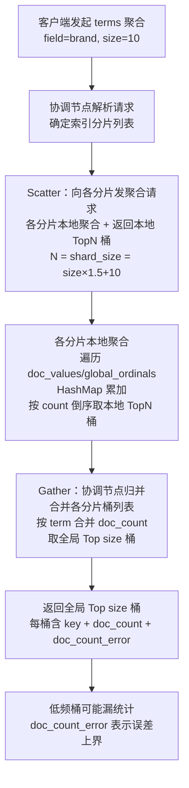
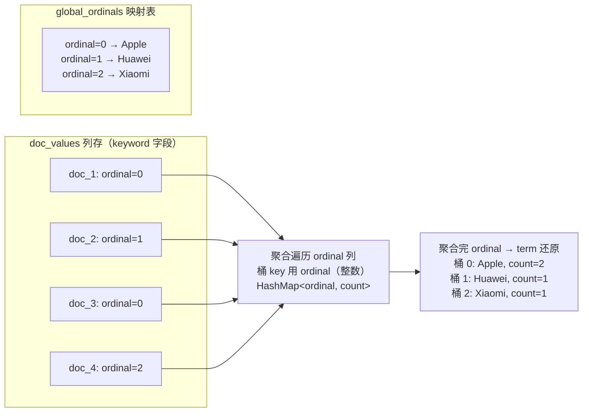
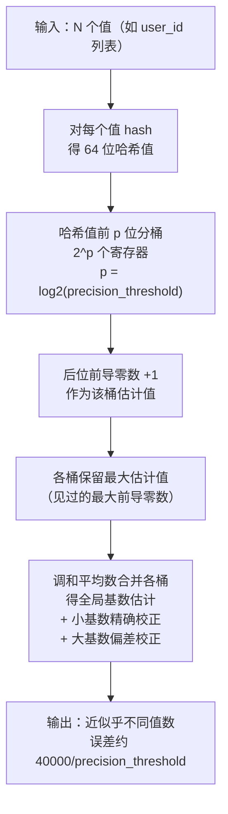
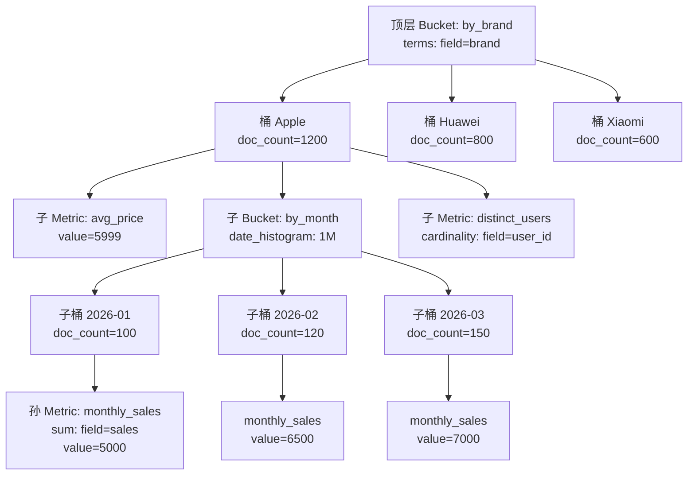

# 聚合与 Pipeline

> **一句话定位**：聚合是 ES 分析能力的核心，"Bucket/Metric/Pipeline 三类聚合、Cardinality 怎么去重"是中高级面试必问。
> **面试热度**：⭐⭐⭐⭐
> **返回**：[ES 知识图谱](../README.md)

---

## 一、概念定义

### 1.1 聚合三类：Bucket / Metric / Pipeline

Elasticsearch 的聚合（Aggregation）是建立在倒排索引与 `doc_values` 列存之上的分析能力——与查询（检索文档）不同，聚合对文档集合做统计分析（分组计数、求和、求均值、求分位数等）。ES 的聚合分三大类：**Bucket（桶聚合）**、**Metric（指标聚合）**、**Pipeline（管道聚合）**，三者的输入输出与职责清晰分层。

**与 SQL 聚合的对照**：ES 聚合对应 SQL 的 `GROUP BY` + 聚合函数（`COUNT`/`SUM`/`AVG`），但 ES 的聚合嵌套能力（Bucket → 子 Bucket → Metric 树形结构）远强于 SQL 的 `GROUP BY ... HAVING`。

| 维度 | Bucket 桶聚合 | Metric 指标聚合 | Pipeline 管道聚合 |
|------|--------------|----------------|-------------------|
| 输入 | 文档集合 | 文档集合或一个桶内的文档 | 其他聚合的输出结果 |
| 输出 | 桶列表（每桶含 `key` + `doc_count`） | 单个指标值（如 `value`） | 基于父聚合结果的派生值 |
| 核心职责 | 按维度分组（分桶） | 计算指标值（统计量） | 对已有聚合结果二次计算 |
| 典型场景 | 按品牌分组、按时间分桶 | 求价格均值、去重计数 | 移动平均、导数、累计和 |
| DSL 关键字 | `terms` / `date_histogram` / `nested` / `filter` | `avg` / `sum` / `cardinality` / `percentile` | `moving_avg` / `derivative` / `cumulative_sum` |
| 对应 SQL | `GROUP BY` | `COUNT`/`SUM`/`AVG` 等聚合函数 | 窗口函数（`OVER`） |

**三类聚合的嵌套关系**：一次聚合请求里，Bucket → 子 Bucket → Metric 是树形嵌套结构——顶层 Bucket 分组后，每个桶内可再嵌套子 Bucket 分组，子桶内再嵌 Metric 计算指标值。Pipeline 不在树形嵌套里，而是基于已有 Bucket 的输出做二次计算（如对 `date_histogram` 的桶做 `derivative` 导数）。

```json
GET /products/_search
{
  "size": 0,                          // 聚合场景常 size=0，只看聚合结果不看文档
  "aggs": {                           // aggs 是 aggregations 的简写
    "by_brand": {                     // 顶层 Bucket：按品牌分桶
      "terms": { "field": "brand" },
      "aggs": {                       // 子聚合：每个品牌桶内再嵌套
        "avg_price": { "avg": { "field": "price" } },     // 子 Metric：品牌内均价
        "by_month": {                 // 子 Bucket：品牌内按月分桶
          "date_histogram": { "field": "publish_date", "calendar_interval": "1M" },
          "aggs": {
            "monthly_sales": { "sum": { "field": "sales" } }  // 孙 Metric：月销量和
          }
        }
      }
    }
  }
}
```

这个 DSL 的语义是：按品牌分桶 → 每个品牌桶内算均价 + 按月再分桶 → 每个月桶内算销量和。聚合结果是树形结构，`by_brand` 的每个桶里有 `avg_price` 值和 `by_month` 子桶列表。

### 1.2 Bucket 聚合：按维度分桶

**Bucket 聚合** 把文档按某个维度分到若干桶里，每桶记录 `key`（桶标识）和 `doc_count`（桶内文档数）。四种常用 Bucket 聚合按分桶方式区分。

| Bucket 聚合 | 分桶方式 | 适用场景 |
|-------------|---------|---------|
| `terms` | 按 `keyword` 字段值分桶（每个不同值一桶） | 枚举维度分组（品牌、分类、状态） |
| `date_histogram` | 按时间区间分桶（固定间隔如 1 天/1 月） | 时间序列分析（日活、月销、小时分布） |
| `nested` | 对 `nested` 类型对象分桶（嵌套对象独立处理） | 嵌套对象聚合（商品的多 SKU 各自聚合） |
| `filter` / `filters` | 自定义过滤条件分桶（每桶对应一个 filter） | 多条件分组（如"已付款"/"已发货"/"已签收"三桶） |

**`terms` 聚合**：最常用的 Bucket 聚合，按 `keyword` 字段值分桶。如 `terms: {field: "brand"}` 把文档按品牌分组，每桶是一个品牌值（Apple、Huawei、Xiaomi ...），桶内 `doc_count` 是该品牌的文档数。`size` 参数控制返回桶数（默认前 10 个桶，按 `doc_count` 倒序）。

**`date_histogram` 聚合**：按时间区间分桶，是日志/时间序列分析的核心。`calendar_interval`（日历间隔，如 `1M` 一个月）或 `fixed_interval`（固定间隔，如 `1h` 一小时）控制桶间隔。如 `date_histogram: {field: "timestamp", calendar_interval: "1d"}` 按天分桶，每桶是一天的文档数。

**`nested` 聚合**：对 `nested` 类型字段分桶（详见 [02 索引与映射](../02-index-mapping/index-and-mapping.md) 的 `nested` 类型）。`nested` 对象在 ES 里独立索引（不展开为扁平字段），聚合时需用 `nested` 聚合先"进入"嵌套对象，再在嵌套对象内做子聚合。如商品有多个 SKU（`skus` 是 `nested`），对 `skus.price` 聚合需先 `nested: {path: "skus"}` 再 `avg: {field: "skus.price"}`。

**`filter` / `filters` 聚合**：按自定义过滤条件分桶。`filters` 是多桶版（每桶一个 `filter`），如"已付款"/"已发货"/"已签收"三桶分别用不同 `filter` 表达。单桶版用 `filter`（只一个过滤条件，相当于把命中文档归到一桶）。

### 1.3 Metric 聚合：计算指标值

**Metric 聚合** 对文档集合（或一个桶内的文档）计算单个指标值。分两类——**基础 Metric**（精确计算，如 `avg`/`sum`）和**近似 Metric**（用算法近似计算，如 `cardinality`/`percentile`，以精度换内存）。

| Metric 聚合 | 算法 | 精度 | 内存占用 | 适用场景 |
|-------------|------|------|---------|---------|
| `avg` / `sum` / `max` / `min` | 直接遍历 `doc_values` 求值 | 精确 | 低（流式累加） | 基础统计（均价、销量和、最高价） |
| `stats` | 一次遍历算 `count`/`min`/`max`/`sum`/`avg` | 精确 | 低 | 多指标合并（一次遍历出五个值） |
| `cardinality` | HyperLogLog++（HLL++）近似去重 | 近似（误差可控） | 中（与 `precision_threshold` 相关） | UV 去重计数（独立访客数） |
| `percentile` / `percentile_rank` | t-digest 近似分位数 | 近似（误差可控） | 中（与 `compression` 相关） | P50/P95/P99 延迟分位数 |
| `top_hits` | 取桶内 TopN 文档 | 精确 | 高（需保留文档） | 桶内 TopN（如每品牌销量前 3 商品） |

**基础 Metric**（`avg`/`sum`/`max`/`min`）：直接遍历 `doc_values` 列存流式累加，精确且内存开销低（只需保留累加值，无需全部加载）。如 `avg: {field: "price"}` 遍历所有文档的 `price` 列累加求均值。`stats` 是基础 Metric 的合并版——一次遍历算出 `count`/`min`/`max`/`sum`/`avg` 五个值，比分别调用五个 Metric 聚合更高效（只遍历一次 `doc_values`）。

**`cardinality` 去重计数**：用 **HyperLogLog++（HLL++）** 算法近似去重——不存储所有不同值，而是用概率算法估算不同值数量。`precision_threshold` 控制精度与内存（默认 3000，阈值内精确，超过阈值用 HLL++ 近似，误差约 `40000/precision`）。如 `cardinality: {field: "user_id", precision_threshold: 40000}` 估算 UV（独立访客数），内存远低于精确去重（精确去重要存储所有不同 user_id）。

**`percentile` 百分位**：用 **t-digest** 算法近似分位数——不排序所有值再取分位，而是用聚类质心近似分位。`compression` 控制精度与内存（默认 100，越大越精确内存越多）。如 `percentile: {field: "latency", percents: [50, 95, 99]}` 算延迟的 P50/P95/P99，适用于监控场景（如接口延迟 P99 是否超标）。

### 1.4 Pipeline 聚合：对聚合结果二次计算

**Pipeline 聚合** 不直接处理文档，而是**基于其他聚合（通常是 Bucket 聚合）的输出结果做二次计算**。典型 Pipeline 聚合对 `date_histogram` 的桶序列做时序分析（移动平均、导数、累计和）。

| Pipeline 聚合 | 作用 | 典型场景 |
|---------------|------|---------|
| `moving_avg` | 滑动窗口内均值（窗口大小可配置） | 7 日移动平均销量（平滑日波动） |
| `derivative` | 相邻桶的差值（导数） | 日销量环比变化率（今天比昨天涨多少） |
| `cumulative_sum` | 累计和（从首桶累加到当前桶） | 月销量累计年度总销量 |
| `max_bucket` / `min_bucket` | 取所有桶中最大/最小桶 | 找销量最高的月份（峰值定位） |
| `bucket_script` | 用 Painless 脚本对多个桶值计算 | 自定义派生指标（如"销量 / 库存"比率） |
| `pipeline`（嵌套 Pipeline） | Pipeline 可基于 Pipeline 结果再计算 | 二阶导数（导数的导数，变化率的变化率） |

**`moving_avg` 移动平均**：对 `date_histogram` 桶序列做滑动窗口均值。如 `moving_avg: {buckets_path: "monthly_sales", window: 3, model: "simple"}` 对月销量桶做 3 月窗口移动平均（当前桶前 3 桶的均值），平滑日波动看趋势。

**`derivative` 导数**：相邻桶的差值。如 `derivative: {buckets_path: "monthly_sales"}` 算月销量的环比变化（本月销量 - 上月销量），正值表示增长。

**`cumulative_sum` 累计和**：从首桶累加到当前桶。如 `cumulative_sum: {buckets_path: "monthly_sales"}` 算月销量的年度累计（1 月销量 + 2 月销量 + ... + 当前月），看年度进度。

**关键约束**：Pipeline 聚合依赖父 Bucket 的桶序列（`buckets_path` 引用父聚合的桶值），所以 Pipeline 必须嵌套在 Bucket 聚合内（作为 Bucket 的子聚合），且 Bucket 聚合通常是 `date_histogram` 或 `histogram`（有序桶序列，适合时序分析）。

```json
GET /orders/_search
{
  "size": 0,
  "aggs": {
    "monthly": {
      "date_histogram": { "field": "order_time", "calendar_interval": "1M" },
      "aggs": {
        "total_sales": { "sum": { "field": "amount" } },
        "sales_ma7": {                          // Pipeline：7 月移动平均
          "moving_avg": { "buckets_path": "total_sales", "window": 7, "model": "simple" }
        },
        "sales_diff": {                         // Pipeline：环比导数
          "derivative": { "buckets_path": "total_sales" }
        },
        "sales_cumsum": {                       // Pipeline：累计和
          "cumulative_sum": { "buckets_path": "total_sales" }
        }
      }
    }
  }
}
```

这个 DSL 的语义是：按月分桶 → 每月算销量和 → 基于月销量序列算 7 月移动平均 + 环比导数 + 累计和。Pipeline 嵌套在 `date_histogram` 内，`buckets_path: "total_sales"` 引用同级的 `total_sales` Metric 值。

---

## 二、原理与流程

### 2.1 Bucket 聚合原理：terms 用 doc_values 或 global_ordinals 收集

`terms` 聚合是 Bucket 聚合的代表——按 `keyword` 字段值分桶。底层有两种数据收集路径：**doc_values 列存扫描** 与 **global_ordinals 全局序数映射**。

**doc_values 列存扫描**：遍历所有文档的 `doc_values` 列存（详见 [03 倒排索引与分词](../03-inverted-index/inverted-index-and-analysis.md) 的 doc_values），对每文档的该字段值在内存里建立"值 → 桶"映射（`HashMap<term, bucket>`），桶内 `doc_count` 累加。优点是无需预处理，缺点是遍历所有文档的 `doc_values` 开销大（每文档一次磁盘/缓存读取）。

**global_ordinals 全局序数映射**：`keyword` 字段的 `doc_values` 里预构建了"term → ordinal（序数）"的全局映射表（ordinal 是 term 的整数编号，如 Apple=0、Huawei=1、Xiaomi=2）。聚合时只遍历 `doc_values` 的 ordinal 列（整数，比 term 字符串紧凑），用 ordinal 作桶 key（`HashMap<ordinal, bucket>`），聚合完再 ordinal → term 还原。优点是 ordinal 整数作 key 比 term 字符串作 key 内存小且比较快，缺点是首次构建 global_ordinals 有开销（懒加载，首次聚合时构建）。

**两种路径的选择**：

| 维度 | doc_values 扫描 | global_ordinals |
|------|----------------|------------------|
| 桶 key | term 字符串（如 "Apple"） | ordinal 整数（如 0） |
| 内存开销 | 高（字符串 key + 哈希） | 低（整数 key + 紧凑映射） |
| 首次开销 | 无 | 需构建 global_ordinals（懒加载） |
| 适用场景 | 偶发聚合、高基数字段 | 频繁聚合、低中基数字段 |

**`size` 与 `doc_count_error`**：`terms` 聚合的 `size` 参数控制返回桶数（默认 10，按 `doc_count` 倒序）。但 ES 是分布式的——各分片先返回本地 TopN 桶（N = `size` × `shard_size`，默认 `shard_size = size × 1.5 + 10`），协调节点归并全局 TopN。问题是低频 term 可能分散在各分片未进入本地 TopN，归并后 `doc_count` 偏小（漏统计），这就是 `doc_count_error`（误差）。

**`show_term_doc_count_error`**：开启后每个桶返回 `doc_count_error` 字段，表示该桶可能漏统计的最大文档数（各分片未进入本地 TopN 的该 term 文档数之和）。低频桶的 `doc_count_error` 较大（可能漏统计多），高频桶的 `doc_count_error` 较小（漏统计少）。调大 `shard_size`（各分片返回更多桶）可降低误差但增加内存。



**关键细节**：①`terms` 聚合是"各分片本地 TopN → 协调节点归并"的 Scatter-Gather 模式（与查询一致）；②各分片返回本地 TopN（N=`shard_size`），协调节点归并后取全局 Top `size`——如果全局第 11 名的 term 在某分片排第 N+1 未进入本地 TopN，归并后就漏了，这是 `doc_count_error` 的来源；③`doc_count_error` 不是精确漏统计值而是上界估计（各分片未进入 TopN 的该 term 最大可能文档数之和）。

### 2.2 global_ordinals 优化：keyword 预构建全局序数映射

`global_ordinals` 是 `keyword` 与 `text`（`.keyword` 子字段）聚合的核心优化——用整数 ordinal 替代字符串 term 作桶 key，降低内存与比较开销。

**global_ordinals 结构**：`keyword` 字段的 `doc_values` 里，每个文档的该字段存储的是 ordinal（整数）而非 term 字符串。另有一个全局映射表（term → ordinal 的双向映射），ordinal 是该字段在所有 segment 的全局唯一编号。聚合时只需遍历 ordinal 列（整数比较快），用 ordinal 作桶 key（`HashMap<Integer, bucket>` 比 `HashMap<String, bucket>` 紧凑），聚合完再 ordinal → term 还原。



**懒加载与 `eager_global_ordinals`**：global_ordinals 默认懒加载——首次聚合请求时才构建映射表（遍历所有 segment 的 term 字典构建全局 ordinal 映射），首次聚合延迟较高。对频繁聚合的字段，可在 Mapping 里设 `"eager_global_ordinals": true` 预加载——segment 生成时（refresh/flush）就构建 global_ordinals，聚合时直接用无需等待。代价是 segment 生成时多一步构建开销（增加 refresh 延迟）。

```json
PUT /products/_mapping
{
  "properties": {
    "brand": {
      "type": "keyword",
      "eager_global_ordinals": true    // 预加载，聚合快但 refresh 慢
    }
  }
}
```

**适用场景**：`eager_global_ordinals` 适合频繁聚合的 `keyword` 字段（如品牌、分类），用 refresh 时的构建开销换聚合时的低延迟。不适合偶尔聚合的字段（懒加载更省资源）。详见 [08 高可用与调优](../08-ha-tuning/ha-and-tuning.md) 的聚合内存调优。

### 2.3 Cardinality：HyperLogLog++ 近似去重

`cardinality` 聚合用 **HyperLogLog++（HLL++）** 算法近似乎不同值的数量（去重计数），以可控的精度损失换大幅内存节省。典型场景是 UV（独立访客数）去重——精确去重要存储所有不同 user_id（百万级），内存爆炸；HLL++ 只用几 KB 内存就能近似估算百万级 UV。

**HLL++ 算法原理**：①对每个值 hash 得到 64 位哈希值；②根据哈希值的前 `p` 位分桶（`2^p` 个寄存器），后位中前导零数 +1 作为该桶的估计值；③各桶保留最大估计值（即该桶见过的最大前导零数）；④用调和平均数合并各桶估计值得到全局基数估计。HLL++ 是 HLL 的改进版（小基数精确、大基数偏差校正）。



**`precision_threshold` 控制精度与内存**：

| `precision_threshold` | 内存（约） | 误差（约） | 适用场景 |
|-----------------------|-----------|-----------|---------|
| 1000 | 1 KB | ± 40% | 低内存场景（粗估 UV） |
| 3000（默认） | 3 KB | ± 13% | 通用场景 |
| 40000 | 40 KB | ± 1% | 高精度场景（监控 UV） |

**误差公式**：误差约 `40000 / precision_threshold`。如 `precision_threshold=40000` 误差约 1%，`precision_threshold=3000` 误差约 13%。`precision_threshold` 是"阈值"——当不同值数 ≤ 阈值时精确（完全存储），超过阈值才用 HLL++ 近似（阈值内精确，超过阈值近似的过渡）。所以 `precision_threshold` 既是精度控制也是内存控制——阈值越高精度越高内存越大。

**与 MySQL `COUNT(DISTINCT)` 的对照**：MySQL `COUNT(DISTINCT user_id)` 是精确去重（存储所有不同值去重计数），百万级 UV 内存大且慢；ES `cardinality` 用 HLL++ 近似去重，几 KB 内存估算百万级 UV，快且省内存。代价是误差（±1% ~ ±13%），对监控场景（UV 趋势）可接受，对精确审计场景（如交易去重）不可接受需用精确方案（如 `terms` + `size: Integer.MAX_VALUE` 但内存爆炸）。

### 2.4 Percentile：t-digest 近似分位数

`percentile` 聚合用 **t-digest** 算法近似乎数的分位数（P50/P95/P99 等），避免排序所有值再取分位的高内存开销。典型场景是延迟监控——P99 延迟是否超标，需对百万级延迟值求分位数。

**t-digest 算法原理**：①把所有值按大小聚类为一组"质心"（centroid），每质心记录均值 + 权重（代表多少个值）；②聚类策略是中间疏、两端密（中间用大质心代表多值，两端用小质心保证精度——因为分位数在两端 P1/P99 比中间 P50 更敏感）；③求分位数时，按质心权重累计找到分位位置，用质心均值近似。t-digest 的"中间疏两端密"特性使它在 P1/P99（极端分位）比 P50（中间分位）更精确。


**`compression` 控制精度与内存**：

| `compression` | 内存（约） | 误差（中间 P50） | 误差（极端 P99） | 适用场景 |
|---------------|-----------|------------------|------------------|---------|
| 10 | 1 KB | 较大 | 较小 | 低内存场景 |
| 100（默认） | 8 KB | 中 | 小 | 通用场景 |
| 1000 | 80 KB | 小 | 极小 | 高精度监控 |

**`compression` 的本质**：控制质心数量上限（质心数 ≈ `compression` × log(N)），`compression` 越大质心越多越精确但内存越大。默认 100 是精度与内存的折中。生产延迟监控推荐 `compression: 200`（P99 精度足够，内存可控）。

**`percentile_rank` 的反向应用**：`percentile` 是"给分位数求值"（P95 的延迟是多少），`percentile_rank` 是反向"给值求分位数"（延迟 100ms 是第几分位）。如 `percentile_rank: {field: "latency", values: [100]}` 算延迟 100ms 是第几分位（如返回 95% 表示 95% 的请求延迟 ≤ 100ms）。

**与 MySQL 排序求分位的对照**：MySQL 求分位数需 `ORDER BY` 排序所有值再取分位（`PERCENTILE_CONT` 窗口函数 8.0+），百万级排序内存大且慢；ES `percentile` 用 t-digest 近似，几 KB 内存估算百万级延迟分位数，快且省内存。代价是误差（中间分位误差较大，极端分位误差较小）。

### 2.5 子聚合：aggs 内嵌套 aggs 的树形结构

ES 聚合的强大在于**子聚合嵌套**——`aggs` 内再嵌套 `aggs`，形成 Bucket → 子 Bucket → Metric 的树形结构。一次聚合请求可同时算出多维度分组的指标值，无需多次查询。

**树形结构示例**：



这个树形结构表示：顶层按品牌分桶 → 每品牌桶内算均价 + 按月子分桶 + UV 去重 → 每月子桶内算月销量和。聚合结果是嵌套 JSON，`by_brand` 的每桶里有 `avg_price` 值、`distinct_users` 值、`by_month` 子桶列表，子桶列表里每桶又有 `monthly_sales` 值。

**子聚合的关键约束**：

1. **Bucket 可嵌套 Bucket**：如 `terms` → `date_histogram` → `terms`（品牌 → 月 → 分类），多层下钻分析。
2. **Metric 不可嵌套**：Metric 是叶子节点（输出单个值），不能再嵌套子聚合（叶子无子）。`top_hits` 例外（返回文档而非值，可视为"伪 Bucket"）。
3. **Pipeline 必须嵌套在 Bucket 内**：Pipeline 依赖父 Bucket 的桶序列（`buckets_path` 引用），所以必须作为 Bucket 的子聚合。
4. **子聚合在父桶内执行**：每个父桶内的文档集独立执行子聚合（如每品牌桶内独立算均价），子聚合的输入是父桶内的文档集。

### 2.6 聚合内存与调优：breadth_first vs depth_first

子聚合嵌套会产生桶爆炸（Bucket 数 = 各层桶数乘积），内存可能爆炸。ES 用 `collect_mode` 控制 Bucket 收集策略——**breadth_first（宽度优先）** 省内存，**depth_first（深度优先）** 精确。

| 维度 | `breadth_first`（宽度优先） | `depth_first`（深度优先） |
|------|------------------------------|---------------------------|
| 策略 | 先收集所有父桶，再对 TopN 父桶执行子聚合 | 对每个父桶立即执行子聚合（深挖到底） |
| 内存 | 省（只对 TopN 父桶保留子聚合结果） | 高（对所有父桶保留子聚合结果） |
| 精确度 | 子聚合可能漏统计（非 TopN 父桶的子聚合未执行） | 精确（所有父桶都执行子聚合） |
| 适用场景 | 高基数父桶 + 子聚合（如品牌 100 个 + 每品牌月销） | 低基数父桶 + 子聚合需精确 |
| 默认 | 高基数父桶（桶数 > 阈值）自动选 breadth_first | 低基数父桶（桶数 ≤ 阈值）自动选 depth_first |

**`breadth_first` 的工作机制**：先收集所有父桶（如 100 个品牌桶），按 `doc_count` 倒序取 TopN（如 Top 10 品牌），只对这 TopN 父桶执行子聚合（算每品牌月销）。非 TopN 父桶（90 个品牌）的子聚合未执行，省了 90 个品牌的子聚合内存。代价是子聚合结果可能漏统计（如果非 TopN 品牌的子聚合本应有高值，但被剪枝掉了）。

**`depth_first` 的工作机制**：对每个父桶立即执行子聚合（100 个品牌都算月销），所有父桶的子聚合结果都保留。精确（无漏统计）但内存高（100 品牌 × 12 月 = 1200 个子桶的内存）。

**手动指定 `collect_mode`**：

```json
GET /products/_search
{
  "size": 0,
  "aggs": {
    "by_brand": {
      "terms": { "field": "brand", "size": 10 },
      "collect_mode": "breadth_first",   // 手动指定宽度优先（省内存）
      "aggs": {
        "by_month": {
          "date_histogram": { "field": "publish_date", "calendar_interval": "1M" }
        }
      }
    }
  }
}
```

**`terminate_after` 限制**：对超大数据集聚合，可用 `terminate_after` 限制每分片最大文档数（如 `terminate_after: 100000` 每分片最多聚合 10 万文档），提前终止聚合避免 OOM。代价是结果不精确（截断后的子集聚合）。

**调优建议**：①高基数父桶 + 子聚合用 `breadth_first`（省内存，子聚合漏统计可接受）；②低基数父桶 + 子聚合需精确用 `depth_first`（精确，内存可控）；③超大数据集用 `terminate_after` 限制（避免 OOM，牺牲精度）；④频繁聚合字段设 `eager_global_ordinals`（预加载降延迟）；⑤`size` 设合理值（不要设过大如 10000，桶爆炸内存高）。

### 2.7 ES|QL 8.x：管道式查询语言

**ES|QL** 是 Elasticsearch 8.x 引入的**管道式查询语言（Piped Query Language）**——用 `|` 管道符把查询、过滤、聚合、计算、排序、分页串联起来，统一了 ES 的表达力（替代 `_search` + `aggs` 的嵌套 JSON 表达力不足）。

**ES|QL 的设计动机**：

| 维度 | `_search` + `aggs` | ES|QL |
|------|--------------------|-------|
| 表达形态 | JSON 嵌套（`query` + `aggs` + `sort`） | 管道式语句（`FROM | WHERE | STATS | SORT | LIMIT`） |
| 聚合表达 | `aggs` 树形嵌套（复杂时 JSON 巨长） | `STATS agg = func(field) BY dim` 简洁 |
| 计算能力 | 需 `runtime_field` 或 `script`（重） | `EVAL`/`KEEP`/`DROP` 内联计算（轻） |
| 学习成本 | JSON DSL 需熟悉 ES 语法 | SQL-like 易上手 |
| 性能 | 走 `_search` 路径（Query DSL → Aggregation） | 走 ES|QL 引擎（新计算框架，8.x 优化） |
| 端点 | `POST /index/_search` | `POST /_query`（或 `POST /index/_query`） |

**ES|QL 语句示例**：

```text
POST /_query
{
  "query": """
    FROM logs
    | WHERE level == "ERROR"
    | STATS error_count = count(*) BY service
    | SORT error_count DESC
    | LIMIT 10
  """
}
```

这个 ES|QL 语句的语义是：从 `logs` 索引取数据 → 过滤 `level == "ERROR"` → 按 `service` 分组算错误数 → 按错误数倒序 → 取前 10。等价的 `_search` + `aggs` 需写嵌套 JSON（`query: {term: {level: "ERROR"}}` + `aggs: {by_service: {terms: {field: "service", size: 10}}}`），ES|QL 更简洁。

**ES|QL 的管道命令**：

| 命令 | 作用 | 示例 |
|------|------|------|
| `FROM` | 指定索引（数据源） | `FROM logs` |
| `WHERE` | 过滤条件（类 SQL） | `WHERE level == "ERROR" AND service == "order"` |
| `STATS` | 聚合（分组 + 聚合函数） | `STATS count = count(*), avg_latency = avg(latency) BY service` |
| `EVAL` | 计算派生字段（类 `EVAL`） | `EVAL latency_ms = latency / 1000.0` |
| `SORT` | 排序 | `SORT latency DESC` |
| `LIMIT` | 分页 | `LIMIT 10` |
| `KEEP` / `DROP` | 保留/丢弃字段 | `KEEP service, latency` |
| `RENAME` | 重命名字段 | `RENAME latency AS response_time` |

**ES|QL 的优势**：①管道式串联清晰（每步用 `|` 衔接，类似 Unix 管道）；②聚合表达简洁（`STATS agg = func BY dim` 一行搞定，无需嵌套 JSON）；③计算能力内联（`EVAL` 在管道里算派生字段，无需 `runtime_field` 预定义）；④统一查询与聚合（一个语句同时做过滤、聚合、计算、排序，替代 `_search` + `aggs` + `runtime_field` 的组合）。

**ES|QL 的限制**：①8.x 新引入，部分高级聚合（如 `top_hits`）尚未完全支持；②性能在简单查询上可能不如 `_search`（新引擎优化中）；③不支持复杂 Bool 组合的灵活度（`WHERE` 是类 SQL，不如 Bool DSL 强大）。生产推荐：简单分析与聚合用 ES|QL（简洁），复杂 Bool 查询 + 打分仍用 `_search` Query DSL（强大）。

### 2.8 源码路径

ES 聚合的核心类在 `org.elasticsearch.search.aggregations` 包下：

| 类/包 | 职责 |
|-------|------|
| `org.elasticsearch.search.aggregations.AggregationPhase` | 聚合执行阶段（在查询流程里负责聚合的协调与归并） |
| `org.elasticsearch.search.aggregations.AggregationBuilders` | 聚合构造器入口（`terms`/`cardinality`/`avg` 等静态工厂） |
| `org.elasticsearch.search.aggregations.bucket.terms.TermsAggregator` | `terms` 桶聚合实现（含 doc_values/global_ordinals 两种收集路径） |
| `org.elasticsearch.search.aggregations.bucket.terms.GlobalOrdinalsStringTermsAggregator` | `terms` 基于 global_ordinals 的优化实现（ordinal 作桶 key） |
| `org.elasticsearch.search.aggregations.metrics.CardinalityAggregator` | `cardinality` 去重聚合实现（HLL++ 算法） |
| `org.elasticsearch.search.aggregations.metrics.PercentileRanksAggregator` | `percentile` 分位数聚合实现（t-digest 算法） |
| `org.elasticsearch.search.aggregations.pipeline.PipelineAggregator` | Pipeline 聚合基类（`moving_avg`/`derivative`/`cumulative_sum` 等继承） |
| `org.elasticsearch.search.aggregations.support.ValuesSource` | 聚合字段值源（封装 doc_values/global_ordinals 访问） |
| `org.apache.lucene.search.DocValuesDocIDSetIterator` | doc_values 列存遍历（Lucene 层，聚合底层访问） |
| `org.elasticsearch.xpack.ql` | ES|QL 引擎（8.x 新查询语言实现） |

**关键源码要点**：①`AggregationPhase` 是查询流程里聚合阶段的入口，负责各分片聚合结果的归并与 Pipeline 二次计算；②`TermsAggregator` 有两个子类——`GlobalOrdinalsStringTermsAggregator`（用 global_ordinals，ordinal 作 key）与 `DirectStringsTermsAggregator`（用 doc_values，term 字符串作 key），按字段配置自动选择；③`CardinalityAggregator` 内部用 Lucene 的 `HyperLogLogPlus` 类（HLL++ 实现），`precision_threshold` 控制寄存器数；④`PercentileRanksAggregator` 内部用 Lucene 的 `TDigestState` 类（t-digest 实现），`compression` 控制质心数。

---

## 三、高频追问

### Q1：聚合有哪几类？

- **Bucket 桶聚合**：按维度分桶（`terms`/`date_histogram`/`nested`/`filter`），输出桶列表
- **Metric 指标聚合**：计算指标值（`avg`/`sum`/`cardinality`/`percentile`），输出单个值
- **Pipeline 管道聚合**：对其他聚合结果二次计算（`moving_avg`/`derivative`/`cumulative_sum`），基于父 Bucket 桶序列

**关键点**：Bucket 分组、Metric 算值、Pipeline 二次计算——三者嵌套形成树形聚合（Bucket → 子 Bucket → Metric），Pipeline 独立做派生计算。

### Q2：Cardinality 怎么去重？

`cardinality` 用 **HyperLogLog++（HLL++）** 近似去重——对值 hash 后按前 `p` 位分桶，后位前导零数作估计值，各桶保留最大估计值，调和平均数合并得全局基数。`precision_threshold` 控制精度与内存（默认 3000，误差约 `40000/precision`）。

**关键点**：HLL++ 用几 KB 内存估算百万级 UV，代价是误差（±1% ~ ±13%），对监控场景可接受，精确审计需用 `terms` + `size: Integer.MAX_VALUE`（但内存爆炸）。

### Q3：`precision_threshold` 是什么？

`precision_threshold` 是 `cardinality` 聚合的参数，控制精度与内存：

- 阈值内精确（不同值数 ≤ 阈值时完全存储精确去重）
- 超过阈值近似的（HLL++ 算法估算）
- 误差约 `40000 / precision_threshold`（如 40000 误差约 1%，3000 误差约 13%）
- 内存约 `precision_threshold` × 1 字节（3000 约 3 KB）

**关键点**：阈值是"精确 → 近似"的过渡点，阈值越高精度越高内存越大。生产 UV 监控推荐 40000（误差 1%，内存 40 KB 可接受）。

### Q4：Percentile 怎么算？

`percentile` 用 **t-digest** 算法近似乎位数——把所有值按大小聚类为质心（每质心 = 均值 + 权重），中间疏（大质心）两端密（小质心），求分位时按质心权重累计找到分位位置用质心均值近似。`compression` 控制质心数（默认 100，越大越精确内存越多）。

**关键点**：t-digest 的"中间疏两端密"使 P1/P99（极端分位）比 P50（中间分位）更精确，适合延迟监控（P99 是 SLA 关键指标）。生产延迟监控推荐 `compression: 200`（P99 精度足够，内存可控）。

### Q5：`global_ordinals` 是什么？

`global_ordinals` 是 `keyword` 字段的**全局序数映射**——`doc_values` 里存储整数 ordinal 而非 term 字符串，另有一个全局映射表（ordinal ↔ term）。聚合时用 ordinal 作桶 key（`HashMap<Integer, bucket>` 比 `HashMap<String, bucket>` 紧凑），聚合完再 ordinal → term 还原。

**关键点**：global_ordinals 降低聚合内存与比较开销，默认懒加载（首次聚合时构建），频繁聚合字段可设 `eager_global_ordinals: true` 预加载（segment 生成时就构建，聚合时直接用）。

### Q6：子聚合怎么嵌套？

`aggs` 内再嵌套 `aggs`，形成 Bucket → 子 Bucket → Metric 的树形结构：

- Bucket 可嵌套 Bucket（如 `terms` → `date_histogram` → `terms` 多层下钻）
- Metric 是叶子不可嵌套（输出单个值）
- Pipeline 必须嵌套在 Bucket 内（依赖父 Bucket 桶序列的 `buckets_path`）
- 子聚合在父桶内执行（每父桶内文档集独立子聚合）

**关键点**：子聚合嵌套产生桶爆炸（Bucket 数 = 各层桶数乘积），用 `collect_mode`（`breadth_first` 省内存 / `depth_first` 精确）控制策略。

### Q7：ES|QL 是什么？

**ES|QL** 是 Elasticsearch 8.x 的**管道式查询语言**——用 `|` 管道符串联 `FROM`/`WHERE`/`STATS`/`EVAL`/`SORT`/`LIMIT`，统一查询、聚合、计算、排序。端点 `POST /_query`。

**关键点**：ES|QL 替代 `_search` + `aggs` 的嵌套 JSON，表达更简洁（`STATS agg = func BY dim` 一行搞定聚合），计算内联（`EVAL` 算派生字段无需 `runtime_field`）。简单分析用 ES|QL，复杂 Bool 查询 + 打分仍用 Query DSL。

### Q8：`terms` 聚合的 `doc_count_error` 怎么来的？

`terms` 聚合是分布式的——各分片先返回本地 TopN 桶（N = `shard_size`，默认 `size × 1.5 + 10`），协调节点归并全局 TopN。低频 term 可能分散在各分片未进入本地 TopN，归并后漏统计，`doc_count_error` 表示该桶可能漏统计的最大文档数。

**关键点**：调大 `shard_size`（各分片返回更多桶）可降低误差但增加内存。`show_term_doc_count_error: true` 开启后每桶返回 `doc_count_error` 字段，低频桶误差大、高频桶误差小。

---

## 四、实战关联

### 4.1 Java 场景：RestHighLevelClient 构造聚合

ES 的 Java 高层客户端 `RestHighLevelClient` 提供 `AggregationBuilders` 链式 API 构造聚合 DSL，避免手写 JSON。

**Java 聚合构造示例**：

```java
// 1. 构造聚合：按品牌分桶 → 每品牌算均价 + UV 去重
AggregationBuilder byBrand = AggregationBuilders.terms("by_brand")
    .field("brand")
    .size(10)                                          // 返回前 10 个品牌桶
    .shardSize(20)                                     // 各分片返回前 20 桶（降低 doc_count_error）
    .subAggregation(AggregationBuilders.avg("avg_price").field("price"))
    .subAggregation(AggregationBuilders.cardinality("distinct_users")
        .field("user_id")
        .precisionThreshold(40000));                   // UV 去重，精度阈值 40000

// 2. 构造 SearchRequest
SearchRequest searchRequest = new SearchRequest("products");
SearchSourceBuilder sourceBuilder = new SearchSourceBuilder();
sourceBuilder.size(0);                                 // 聚合场景常 size=0
sourceBuilder.aggregation(byBrand);
searchRequest.source(sourceBuilder);

// 3. 执行查询
SearchResponse response = restHighLevelClient.search(searchRequest, RequestOptions.DEFAULT);

// 4. 解析聚合结果
Terms byBrandTerms = response.getAggregations().get("by_brand");
for (Terms.Bucket bucket : byBrandTerms.getBuckets()) {
    String brand = bucket.getKeyAsString();            // 桶 key（品牌名）
    long docCount = bucket.getDocCount();               // 桶内文档数
    Avg avgPrice = bucket.getAggregations().get("avg_price");
    double avg = avgPrice.getValue();                   // 品牌均价
    Cardinality distinctUsers = bucket.getAggregations().get("distinct_users");
    long uv = distinctUsers.getValue();                // 品牌内 UV
    // 业务处理...
}
```

**Pipeline 聚合的 Java 构造**：

```java
// 按月分桶 → 月销量 → 7 月移动平均 + 环比导数
AggregationBuilder monthly = AggregationBuilders.dateHistogram("monthly")
    .field("order_time")
    .calendarInterval(DateHistogramInterval.MONTH)
    .subAggregation(AggregationBuilders.sum("total_sales").field("amount"))
    .subAggregation(PipelineAggregatorBuilders.movingAvg("sales_ma7", 
        "total_sales", 7, MovingAvgAggregator.Model.SIMPLE))   // 7 月窗口移动平均
    .subAggregation(PipelineAggregatorBuilders.derivative("sales_diff", "total_sales"));  // 环比导数
```

### 4.2 聚合调优

生产聚合调优从四个维度入手：

| 维度 | 调优手段 | 效果 |
|------|---------|------|
| `global_ordinals` | 频繁聚合字段设 `eager_global_ordinals: true` 预加载 | 降低聚合延迟（省首次构建开销） |
| `collect_mode` | 高基数父桶 + 子聚合用 `breadth_first` | 省内存（只对 TopN 父桶执行子聚合） |
| `shard_size` | 调大各分片返回桶数 | 降低 `doc_count_error`（增加内存） |
| `terminate_after` | 限制每分片最大文档数 | 避免 OOM（牺牲精度） |

**调优示例**：品牌聚合延迟高——①设 `eager_global_ordinals: true` 预加载 global_ordinals（省首次构建开销）；②高基数品牌（100 个）+ 子聚合用 `collect_mode: breadth_first`（只对 Top 10 品牌执行子聚合，省 90 个品牌的子聚合内存）；③调大 `shard_size` 到 `size × 3`（各分片返回更多桶降低 `doc_count_error`）；④超大数据集设 `terminate_after: 100000`（每分片最多 10 万文档，避免 OOM）。

**调优的禁忌**：①`size` 设过大（如 10000 桶）——桶爆炸内存高，应按业务设合理值（如 10/50）；②对高基数字段用 `terms`（如 user_id 百万级不同值）——桶爆炸，应用 `cardinality` 近似去重；③`precision_threshold` 设过低（如 100）——误差过大（±40%），失去分析价值；④`breadth_first` 用在需精确子聚合的场景——子聚合漏统计，应用 `depth_first`。

### 4.3 与 MySQL GROUP BY 对比

| 维度 | ES 聚合 | MySQL GROUP BY |
|------|---------|----------------|
| 分组方式 | `terms`/`date_histogram`（倒排 + doc_values） | `GROUP BY`（B+Tree 扫描） |
| 聚合函数 | `avg`/`sum`/`cardinality`/`percentile` | `COUNT`/`SUM`/`AVG`/`MAX`/`MIN` |
| 去重 | `cardinality`（HLL++ 近似） | `COUNT(DISTINCT)`（精确） |
| 分位数 | `percentile`（t-digest 近似） | `PERCENTILE_CONT`（排序精确，8.0+） |
| 嵌套 | `aggs` 内嵌 `aggs`（树形多层下钻） | `GROUP BY` + `WITH ROLLUP`（有限） |
| 索引方式 | doc_values 列存（流式遍历） | B+Tree 正向索引（顺序扫描） |
| 性能 | 海量数据聚合快（doc_values 列存） | 精确聚合快（B+Tree），海量数据慢 |

**本质对照**：ES 聚合基于 doc_values 列存（流式遍历列存累加），MySQL 聚合基于 B+Tree 正向索引（顺序扫描行）。ES 适合海量数据的近似聚合（HLL++ UV、t-digest P99），MySQL 适合精确聚合（`COUNT(DISTINCT)`、`PERCENTILE_CONT`）。详见 `middleware/mysql/04-query/query-optimization.md`。

### 4.4 与 framework/jackson 的对照：聚合结果 JSON 反序列化

ES 聚合结果返回 JSON，Java 侧需解析嵌套 JSON 为对象——这一层依赖 Jackson：

```java
// ES 聚合结果 _source 是嵌套 JSON，Jackson 反序列化为 Map 或自定义对象
// 顶层聚合结果
Map<String, Object> aggResult = response.getAggregations().getAsMap();
// by_brand 是 Terms 聚合，解析桶列表
Terms byBrand = response.getAggregations().get("by_brand");
for (Terms.Bucket bucket : byBrand.getBuckets()) {
    // 桶内子聚合结果是嵌套 JSON，可用 Jackson 反序列化为自定义对象
    String subAggJson = bucket.getAggregations().toString();
    BrandAggResult subResult = objectMapper.readValue(subAggJson, BrandAggResult.class);
    // 业务处理...
}

// 自定义聚合结果类
public static class BrandAggResult {
    private double avg_price;
    private long distinct_users;
    // getter/setter...
}
```

**关键点**：ES 聚合结果是嵌套 JSON（桶 → 子聚合 → 子桶 ...），Java 侧用 `Aggregation` 接口的子接口（`Terms`/`Cardinality`/`Avg`）解析，复杂嵌套用 Jackson 反序列化为自定义对象。聚合结果的 JSON 反序列化配置（如数值精度、null 处理）在 `framework/jackson` 模块讲过，生产中 ES Java 客户端底层用的就是 Jackson，配置一致即可无缝对接。

---

## 五、系统设计案例

### 案例 1：设计一个电商商品的多维聚合方案

**场景**：电商商品分析，要求"按品牌分组 + 价格分位数 + 销量 UV 去重 + 月销量趋势"，一次聚合同时算出多维度指标。

**3 分钟标准答法**：

1. **索引设计**：`products` 索引，`brand` 是 `keyword`（设 `eager_global_ordinals: true` 预加载），`price` 是 `scaled_float`，`sales` 是 `integer`，`user_id` 是 `keyword`，`publish_date` 是 `date`。

2. **聚合方案**：顶层 `terms` 按品牌分桶 → 每品牌桶内嵌套 `percentile`（价格 P50/P95/P99）+ `cardinality`（UV 去重）+ `date_histogram`（按月子分桶）→ 每月子桶内嵌套 `sum`（月销量和）+ `derivative`（环比导数）。

3. **完整 Aggregation DSL**：

```json
GET /products/_search
{
  "size": 0,
  "aggs": {
    "by_brand": {
      "terms": {
        "field": "brand",
        "size": 10,
        "shard_size": 30
      },
      "collect_mode": "breadth_first",
      "aggs": {
        "price_percentiles": {
          "percentile": {
            "field": "price",
            "percents": [50, 95, 99],
            "compression": 200
          }
        },
        "distinct_buyers": {
          "cardinality": {
            "field": "user_id",
            "precision_threshold": 40000
          }
        },
        "monthly_sales": {
          "date_histogram": {
            "field": "publish_date",
            "calendar_interval": "1M"
          },
          "aggs": {
            "total_sales": { "sum": { "field": "sales" } },
            "sales_diff": {
              "derivative": { "buckets_path": "total_sales" }
            }
          }
        }
      }
    }
  }
}
```

4. **聚合结果结构**：

```
by_brand (terms)
├── 桶 Apple (doc_count=1200)
│   ├── price_percentiles: {P50=3999, P95=8999, P99=12999}
│   ├── distinct_buyers: 8500  (UV 近似去重)
│   └── monthly_sales (date_histogram)
│       ├── 桶 2026-01: total_sales=5000, sales_diff=null (首桶无导数)
│       ├── 桶 2026-02: total_sales=6500, sales_diff=1500 (环比 +1500)
│       └── 桶 2026-03: total_sales=7000, sales_diff=500  (环比 +500)
├── 桶 Huawei (doc_count=800)
│   └── ...
└── 桶 Xiaomi (doc_count=600)
    └── ...
```

5. **性能优化**：①`eager_global_ordinals: true` 预加载 brand 字段的 global_ordinals（省首次聚合构建开销）；②`collect_mode: breadth_first` 只对 Top 10 品牌执行子聚合（省非 TopN 品牌的子聚合内存）；③`shard_size: 30` 各分片返回前 30 桶降低 `doc_count_error`；④`precision_threshold: 40000` UV 误差约 1%（监控可接受）；⑤`compression: 200` 价格分位数 P99 精度足够，内存可控。

6. **追问链**：

- **追问 1：为什么品牌用 `terms` 不用 `cardinality`？** → 品牌是枚举维度（有限值），要分组看每品牌的指标，用 `terms` 分桶；`cardinality` 是去重计数（算一个总数），不分桶。
- **追问 2：为什么价格用 `percentile` 不用 `avg`？** → 均值受极端值影响（少数天价商品拉高均价），分位数（P50 中位数）更稳健反映分布；P95/P99 是高端价格分布，业务关注"95% 的商品价格低于多少"。
- **追问 3：为什么 UV 用 `cardinality` 不用 `terms`？** → user_id 是高基数字段（百万级不同值），`terms` 会桶爆炸（百万桶内存爆炸）；`cardinality` 用 HLL++ 近似去重，几 KB 内存估算百万级 UV。
- **追问 4：为什么用 `breadth_first`？** → 品牌 100 个是高基数父桶，`depth_first` 对所有 100 品牌执行子聚合（100 × 12 月 = 1200 子桶内存高）；`breadth_first` 只对 Top 10 品牌执行子聚合（10 × 12 = 120 子桶，省 90% 内存），代价是非 TopN 品牌子聚合漏统计（可接受）。

**核心权衡**：精度 vs 内存。`breadth_first` 省内存但子聚合漏统计，`depth_first` 精确但内存高。对品牌聚合（只关心 Top 10 品牌的指标），`breadth_first` 的漏统计可接受（非 TopN 品牌本就不关注）；对需精确全量子聚合的场景（如合规审计），用 `depth_first` 保精确。

### 案例 2：设计一个日志分析的 ES|QL 方案

**场景**：日志分析系统，要求"统计各服务的错误数 + 平均延迟 + P99 延迟"，并支持灵活下钻（按时间/服务过滤）。

**问题分析**：

```
用 _search + aggs 方案：
  - query: {term: {level: "ERROR"}} 过滤错误
  - aggs: {by_service: {terms: {field: "service"}, 
           aggs: {count: {value_count: ...}, avg_latency: {avg: ...}, p99: {percentile: ...}}}}
  - 嵌套 JSON 较长，且每次加过滤条件都要改 query
  
用 ES|QL 方案：
  - 管道式语句串联过滤 + 聚合 + 计算，简洁清晰
  - 加过滤条件只需在 WHERE 后加子句，无需重构 JSON
```

**方案：ES|QL 管道查询**：

```text
POST /_query
{
  "query": """
    FROM logs
    | WHERE level == "ERROR" AND timestamp >= NOW() - 24 hours
    | STATS error_count = count(*),
            avg_latency = avg(latency),
            p99_latency = percentile(latency, 99)
      BY service
    | SORT error_count DESC
    | LIMIT 10
    | KEEP service, error_count, avg_latency, p99_latency
  """
}
```

**ES|QL 语句解读**：

1. `FROM logs`：从 `logs` 索引取数据（数据源）
2. `WHERE level == "ERROR" AND timestamp >= NOW() - 24 hours`：过滤近 24 小时的错误日志（过滤条件）
3. `STATS error_count = count(*), avg_latency = avg(latency), p99_latency = percentile(latency, 99) BY service`：按 `service` 分组，算错误数 + 平均延迟 + P99 延迟（聚合 + 分位数）
4. `SORT error_count DESC`：按错误数倒序（错误最多的服务排前）
5. `LIMIT 10`：取前 10 个错误最多的服务
6. `KEEP service, error_count, avg_latency, p99_latency`：保留这四列（丢弃其他列）

**结果结构**：

| service | error_count | avg_latency | p99_latency |
|---------|--------------|-------------|-------------|
| order-service | 1523 | 120.5 | 850.3 |
| payment-service | 892 | 95.2 | 620.1 |
| inventory-service | 456 | 78.4 | 510.7 |
| ... | ... | ... | ... |

**追问链**：

- **追问 1：为什么用 ES|QL 不用 `_search` + `aggs`？** → ES|QL 管道式语句简洁（一行 `STATS` 搞定分组 + 多聚合），加过滤条件只需在 `WHERE` 后加子句无需重构 JSON；`_search` + `aggs` 的嵌套 JSON 较长且改过滤条件要重构 `query`。简单分析场景 ES|QL 更高效。
- **追问 2：ES|QL 的性能比 `_search` 如何？** → ES|QL 走新查询引擎（8.x 优化中），简单查询性能可能略不如 `_search`（新引擎尚未完全优化），复杂查询（多聚合 + 计算）ES|QL 的管道式执行可能更优（按管道顺序流式处理）。生产推荐：简单分析用 ES|QL，复杂 Bool 查询 + 打分用 `_search`。
- **追问 3：ES|QL 的 `percentile` 与 `_search` 的 `percentile` 算法一致吗？** → 一致，都用 t-digest 算法近似乎位数。ES|QL 的 `percentile(field, 99)` 等价于 `_search` 的 `percentile: {field: field, percents: [99]}`，底层复用 `PercentileRanksAggregator`。
- **追问 4：ES|QL 如何支持下钻？** → 下钻只需在 `WHERE` 后加条件。如要下钻"order-service 的小时分布"，改 `WHERE level == "ERROR" AND service == "order-service"` + `STATS count = count(*) BY hour`（按小时分桶），管道式语句灵活拼接无需重构 JSON。

**核心权衡**：简洁性 vs 功能完整度。ES|QL 简洁易用（管道式串联，类 SQL），但部分高级聚合（如 `top_hits` 桶内 TopN）尚未完全支持；`_search` + `aggs` 功能完整（所有聚合类型 + Bool 组合），但 JSON 嵌套复杂。生产推荐：日志/监控等简单分析用 ES|QL（简洁），复杂业务聚合（如电商多维下钻 + TopN）仍用 `_search` + `aggs`（强大）。
