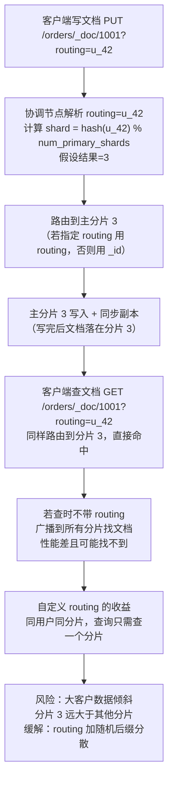
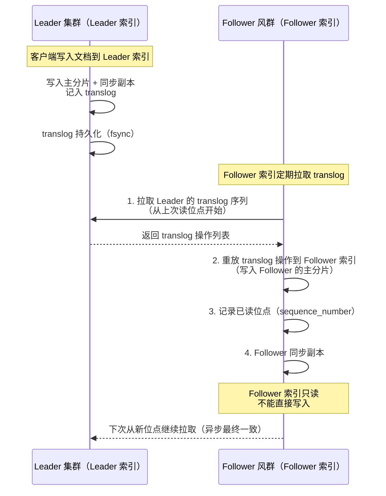
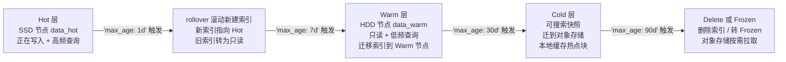
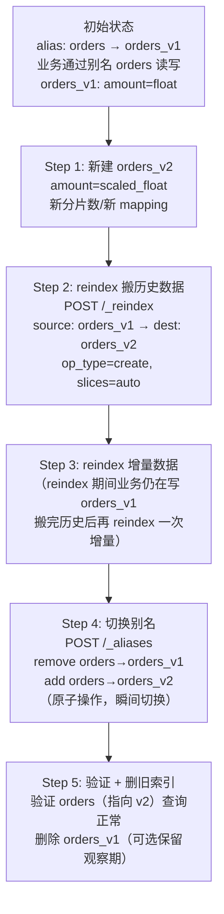

# 分片路由与 Reindex

> **一句话定位**：分片路由是 ES 分布式能力的核心，"分片怎么路由、为什么分片数不可改、reindex 怎么重建"是资深面试分水岭。
> **面试热度**：⭐⭐⭐⭐
> **返回**：[ES 知识图谱](../README.md)

---

## 一、概念定义

### 1.1 分片路由：hash(routing) % num_primary_shards

Elasticsearch 是分布式搜索引擎——一个索引被拆成若干主分片（Primary Shard），每个主分片又有若干副本（Replica Shard），散布在集群各节点上。写入或查询一篇文档时，ES 必须先决定"这篇文档该落到哪个主分片"，这就是**分片路由（Shard Routing）**。

**路由公式**：

```
shard = hash(routing) % num_primary_shards
```

- `routing` 是路由键，默认取文档 `_id`；可在写入/查询时显式传 `?routing=user_id` 自定义。
- `hash` 是 ES 内部的 Murmur3Hash（非 Java 的 `Object.hashCode`，分布更均匀）。
- `num_primary_shards` 是索引的主分片数，建索引时定下，**之后不可改**。

**与 Redis Cluster / MySQL 分库分表的对照**：三者都是"hash 取模路由"思想，但实现细节差异显著。

| 维度 | ES routing | Redis Cluster | MySQL 分库分表（ShardingSphere） |
|------|------------|---------------|--------------------------------|
| 路由公式 | `hash(routing) % num_primary_shards` | `CRC16(key) % 16384` 槽位（slot） | `hash(key) % db_count` 或取模/范围分片 |
| 槽位/分片数 | 主分片数（建索引时定，不可改） | 固定 16384 槽位（集群级定死） | 分库/分表数（应用层定，改需迁移） |
| 路由键 | 默认 `_id`，可自定义 `routing` | 必须指定 key（如 user_id） | 必须指定分片键（如 user_id） |
| 数据迁移 | reindex 重建索引 | 槽位迁移（`CLUSTER SETSLOT`） | 数据迁移脚本（ShardingSphere scaling） |
| 节点扩容 | 新增节点 + 分片再平衡（rebalance） | 槽位重分布到新节点 | 扩容需重新分片或一致性 hash |
| 一致性 hash | 否（固定取模，扩容需 reindex） | 是（16384 槽位映射节点） | 可选一致性 hash 或固定取模 |

**关键差异**：ES 用固定取模（非一致性 hash），所以扩容节点不能像 Redis 那样只迁槽位——ES 扩容靠**分片再平衡（rebalance）**把已有分片搬到新节点，但分片数不变；要改分片数只能 reindex。Redis Cluster 的 16384 槽位是集群级定死的，扩容靠槽位迁移（数据不动，槽位归属变）；ES 的分片数是索引级定的，扩容靠分片搬迁但分片数不变。

### 1.2 分片数不可改：路由公式的刚性约束

**为什么主分片数不可改**？因为路由公式 `hash(routing) % num_primary_shards` 含 `num_primary_shards`——如果建索引后改了分片数，同一篇文档的 `hash(routing)` 不变但模数变了，路由结果就变了，文档会"找不到"（按旧路由写入，按新路由查询查不到）。

| 维度 | 主分片数（`number_of_shards`） | 副本数（`number_of_replicas`） |
|------|--------------------------------|--------------------------------|
| 可改性 | **不可改**（建索引时定死，改了路由错乱） | **可改**（运行时动态 `PUT /_settings`） |
| 路由影响 | 路由公式含它，改了文档找不到 | 不影响路由（副本不参与路由，只做读/备） |
| 扩容方式 | 改分片数只能 reindex 重建索引 | 加副本提升读吞吐与高可用 |
| 改动代价 | reindex 全量数据迁移（耗时长） | 立即生效，新增副本异步同步 |
| 生产建议 | 建索引前按数据量规划好（30-50GB/分片） | 按读吞吐与容灾需求设（常见 1-2） |

**副本数可改的原因**：副本不参与路由（路由只定主分片），副本只是主分片的"备份"，加副本不影响文档定位。所以生产中常动态调副本——如写压力大时临时把副本数设 0 提升写吞吐，写完再恢复 1。

**改分片数的唯一途径：reindex**。新建一个分片数不同的索引，用 `_reindex` API 把旧索引数据搬到新索引，切换别名完成迁移。这就是"分片数不可改，只能 reindex"的本质——路由公式的刚性约束使得只能通过重建索引绕过。

### 1.3 CCR 跨集群复制：Leader/Follower 索引

**CCR（Cross-Cluster Replication）** 是 ES 6.5 引入（ Platinum 许可）、8.x 持续增强的**跨集群复制**特性——一个集群的索引（Leader 索引）把变更实时复制到另一个集群的索引（Follower 索引），实现跨集群灾备与就近读取。

**与 Redis 主从 / RocketMQ 主从的对照**：

| 维度 | ES CCR | Redis 主从复制 | RocketMQ 主从复制 |
|------|--------|---------------|-------------------|
| 复制粒度 | 索引级（Leader 索引 → Follower 索引） | 实例级（一个 Redis 实例的整体数据） | Broker 级（一个 Broker 的所有 topic） |
| 复制方向 | 单向（Leader → Follower，跨集群） | 单向（Master → Slave，同集群） | 单向（Master → Slave，同集群或跨机房） |
| 复制协议 | 基于 translog（写操作日志） | 基于 RDB 快照 + 命令传播 | 基于 CommitLog 异步/同步复制 |
| 自动切换 | 无（Follower 只读，Leader 故障需手动提升） | 哨兵/Cluster 自动故障转移 | Controller 自动切换 Master Broker |
| 一致性 | 最终一致（translog 异步复制） | 最终一致（异步复制）或半同步 | 异步/同步可选（SYNC_MASTER） |
| 典型场景 | 跨集群灾备、就近读取、合规数据隔离 | 同集群高可用读分流 | 同/跨机房消息容灾 |

**关键差异**：CCR 是**跨集群**复制（Leader 和 Follower 在两个独立集群），Redis/RocketMQ 主从通常是**同集群**复制。CCR 的 Follower 索引**只读**（不能直接写），Leader 故障时需手动把 Follower 索引提升为可写（或用 `unfollow` 解除跟随转为独立索引），不像 Redis 哨兵自动切主。

### 1.4 Hot-Warm-Cold 架构：分层存储与 ILM

**Hot-Warm-Cold 架构** 是 ES 日志/时序场景的标配——按数据"热度"（写入频率与查询频率）分层，热数据用 SSD 高性能节点，温数据用 HDD 大容量节点，冷数据用可搜索快照（searchable snapshot）归档到对象存储，靠 **ILM（Index Lifecycle Management）** 自动迁移。

| 层级 | 硬件 | 节点角色 | 索引状态 | 性能 | 成本 | 典型场景 |
|------|------|---------|---------|------|------|---------|
| Hot | SSD（NVMe/SATA SSD） | `data_hot` | 正在写入 + 高频查询 | 高写高读 | 高 | 当天日志、实时订单 |
| Warm | HDD（大容量机械盘） | `data_warm` | 只读 + 低频查询 | 低写高读（已 rollover） | 中 | 近 30 天日志、历史订单 |
| Cold | 对象存储 + 可搜索快照 | `data_cold` | 只读 + 极低频查询 | 低（读需先缓存到本地） | 低 | 30-90 天日志、归档审计 |
| Frozen | 对象存储（不缓存） | `data_frozen` | 只读 + 偶尔查询 | 极低（按需从 S3 拉取） | 极低 | 90+ 天合规归档 |

**ILM 自动迁移**：ILM 策略定义索引从 Hot → Warm → Cold → Delete 的生命周期，索引按时间或大小 rollover（滚动新建）后，自动迁移到对应层级的节点，最终删除或转可搜索快照。详见 [02 索引与映射](../02-index-mapping/index-and-mapping.md) 的 ILM 章节。

**关键权衡**：分层存储用"硬件成本换查询性能"——Hot 层 SSD 贵但写快读快，Warm 层 HDD 便宜但只适合只读查询，Cold 层对象存储极便宜但读延迟高（需先缓存）。日志/时序场景的数据天然有"时间衰减"特性（近期数据热、远期数据冷），分层存储能把存储成本压到最低。

---

## 二、原理与流程

### 2.1 路由公式与自定义 routing

**路由公式详解**：

```
shard = hash(routing) % num_primary_shards
```

- **`routing` 默认 `_id`**：写入文档时若不指定 `routing`，ES 用文档 `_id` 作路由键。如 `PUT /orders/_doc/1001`，`_id=1001`，路由到 `hash("1001") % num_primary_shards` 分片。
- **自定义 `routing`**：写入和查询时传 `?routing=user_id`，让同一用户的文档路由到同一分片。如 `PUT /orders/_doc/1001?routing=u_42`，路由键是 `u_42` 而非 `1001`。

**自定义 routing 的收益**：同一用户的文档聚到同一分片，查询时若也带 `?routing=u_42`，只需查一个分片（而非 scatter-gather 所有分片），降低查询延迟与资源开销。典型场景是"用户维度的订单/日志查询"——同用户的文档同分片，带 routing 查询无需跨分片归并。

**自定义 routing 的风险——数据倾斜**：如果某个用户（如大客户）的文档量远超均值，该用户所在分片会远大于其他分片（"热点分片"），导致该分片写入/查询慢、节点负载不均。缓解手段：①给 routing 加随机后缀（`routing=u_42_0` 到 `u_42_9` 共 10 个分片，分散大客户数据）；②用 `routing` + `size` 控制单用户文档量；③监控分片大小不均（`_cat/shards` 看分片 `store` 大小），倾斜超阈值告警。

**查询时带 routing 的注意点**：查询必须带与写入时相同的 routing，否则路由错乱（按 `u_42` 写入但按 `_id` 查询会查错分片）。GET/UPDATE/DELETE 单文档时若忘了带 routing，ES 会广播到所有分片找文档（性能差且可能找不到）。



**源码路径**：`org.elasticsearch.cluster.routing.OperationRouting` 的 `shardId` / `indexShards` 方法实现路由——先按 routing 计算 hash，再对 `numPrimaryShards` 取模得目标分片。

### 2.2 分片数规划：30-50GB 单分片原则

主分片数建索引时定死且不可改，所以**建索引前必须规划好分片数**。ES 官方推荐**单分片大小 30-50GB**——过小（over-sharding）浪费资源，过大（under-sharding）rebalance 慢且查询慢。

**单分片 30-50GB 的依据**：
- **过小（< 10GB）**：分片多，每分片是一个 Lucene 索引（开销固定：segment 文件句柄、内存占用），分片过多浪费资源（`over-sharding`）。如 100GB 数据建 50 个 2GB 分片，每分片的元数据/segment 开销远大于数据本身。
- **过大（> 50GB）**：分片大，Lucene segment 大，查询时合并 segment 慢；节点故障时 rebalance（搬迁分片）慢（搬运几十 GB 数据耗时长）。
- **30-50GB**：平衡点——资源开销可接受，查询/搬迁性能可接受。

**分片数规划公式**：

```
number_of_shards = ceil(预计数据总量 / 50GB)
```

如预计 1TB 数据，`ceil(1024 / 50) = 21`，取 20 或 24（偶数便于节点均分）。

**不同分片数的性能对比**：

| 分片数（1TB 数据） | 单分片大小 | 资源开销 | 查询性能 | rebalance 性能 | 适用场景 |
|--------------------|-----------|---------|---------|---------------|---------|
| 5（过少） | ~200GB | 低 | 慢（segment 大） | 极慢（搬 200GB） | 不推荐（分片过大） |
| 20（合理） | ~50GB | 中 | 快 | 中（搬 50GB） | 1TB 数据推荐 |
| 50（过多） | ~20GB | 高（50 个 Lucene 索引） | 快 | 快 | 1TB 不推荐（over-sharding） |
| 100（严重 over-sharding） | ~10GB | 极高 | 快但调度开销大 | 快 | 不推荐（浪费资源） |

**`index.number_of_shards` 设定后不可改**：只能通过 reindex 重建索引改变分片数（见 2.3）。生产中常见"前期规划不足，后期数据暴涨导致分片过大"——只能靠 reindex 扩分片数，代价是全量数据迁移。

**8.x 的 `cluster.max_shards_per_node` 保护**：ES 7.x 起默认每节点最多 1000 个分片（`cluster.max_shards_per_node`，8.x 调整为按节点内存动态计算），防 over-sharding 把集群拖垮。建索引前估算总分片数 = `number_of_shards × (1 + number_of_replicas)`，确保不超过集群总分片容量。

### 2.3 Reindex 重建索引：_reindex API

**Reindex** 是 ES 重建索引的标准手段——把旧索引数据搬到新索引（新分片数、新 mapping、新 settings），用于分片数变更、mapping 变更、版本升级等场景。

**`_reindex` API 核心参数**：

```json
POST /_reindex
{
  "source": {                              // 源索引
    "index": "orders_old",                 // 旧索引名
    "size": 1000,                          // 每批 1000 文档（默认 1000）
    "query": { "range": { "create_time": { "lt": "2026-01-01" } } }  // 可选：只迁部分数据
  },
  "dest": {                                // 目标索引
    "index": "orders_new",                 // 新索引名
    "op_type": "create"                    // create 避免覆盖（若 _id 冲突则失败而非覆盖）
  },
  "slices": "auto"                         // 并行分片数（auto 自动按分片数）
}
```

**关键参数**：

| 参数 | 作用 | 建议 |
|------|------|------|
| `source.index` | 源索引名 | 旧索引 |
| `dest.index` | 目标索引名 | 新索引（需提前建好 mapping/settings） |
| `dest.op_type` | 写入方式 | `create`（_id 冲突则失败，不覆盖）/ `index`（覆盖，默认） |
| `slices` | 并行度 | `auto`（自动按源索引分片数并行）或指定数字（如 `10`） |
| `size` | 每批文档数 | 1000-5000（大文档小一点，小文档大一点） |
| `conflicts` | 冲突处理 | `proceed`（继续，记录失败文档）/ `abort`（中止，默认） |

**`slices` 并行加速**：reindex 默认单线程顺序搬，`slices: auto` 让 ES 按源索引分片数自动并行（如源 10 分片，起 10 个子任务并行搬）。也可手动指定 `slices: 20` 超过分片数（用滚动 hash 把单分片再切多份并行），但会增加资源开销。

**`op_type: create` 避免覆盖**：若新旧索引 _id 冲突（如都是 `1001`），`op_type: index` 会用新数据覆盖旧数据（可能丢更新），`op_type: create` 则冲突时报错跳过（保护已有数据不被覆盖）。生产 reindex 常用 `create` 防意外覆盖。

**reindex 是异步任务**：`POST /_reindex` 返回 `task_id`，可用 `GET /_tasks/<task_id>` 查进度（`completed: true` 表示完成，`status.total` / `status.updated` / `status.created` 看进度）。大索引 reindex 可能数小时，必须异步跟踪。

**零停机 reindex 流程**（详见五、系统设计案例 2）：
1. 新建新索引（新分片数、新 mapping）
2. 用 alias 指向旧索引（业务通过别名读写，对物理索引透明）
3. reindex 旧索引数据到新索引（`op_type: create` 避免覆盖增量写入）
4. 切换 alias 从旧索引指向新索引
5. 删除旧索引

### 2.4 Update By Query：批量脚本更新

**`_update_by_query`** API 对匹配查询的文档批量更新——不用逐篇 `UPDATE`，一次请求更新所有匹配文档，常用于字段值变更、mapping 变更后重索引等场景。

**Update By Query 请求**：

```json
POST /orders/_update_by_query
{
  "query": {                               // 匹配查询（只更新命中文档）
    "term": { "status": "pending" }
  },
  "script": {                              // 脚本更新（Painless）
    "source": "ctx._source.status = 'processing'; ctx._source.update_time = params.now;",
    "lang": "painless",
    "params": { "now": "2026-08-12T10:00:00Z" }
  },
  "size": 1000,                            // 每批 1000 文档
  "slices": "auto"                         // 并行
}
```

**`version_type` 乐观锁**：

| `version_type` | 语义 | 适用场景 |
|----------------|------|---------|
| `internal`（默认） | 内部版本，ES 自管版本号，更新时检查版本防并发覆盖 | 普通批量更新 |
| `external` | 外部版本，用业务版本号（如数据库版本号），版本号必须递增 | 与外部系统（如数据库）同步 |
| `external_gt` | 外部版本大于当前才更新 | 同步增量（只更新版本号更大的） |

**Update By Query 与 reindex 的关系**：Update By Query 是"原地更新"（不换索引），reindex 是"搬新索引"。mapping 小改（如加字段、改 `dynamic`）可用 Update By Query 原地重索引（让新 mapping 生效），mapping 大改（如改字段类型）必须 reindex 重建。

**批量更新的风险**：Update By Query 是逐文档 `UPSERT`（读旧值 → 脚本改 → 写新值），并发写压力大时可能与业务写入冲突（版本冲突）。缓解：①`conflicts: proceed` 遇冲突继续而非中止；②低峰期执行；③用 `op_type: update` 时设合理的 `size` 控制批次。

**源码路径**：`org.elasticsearch.index.reindex.UpdateByQueryAction` 是 Update By Query 的 Action，底层复用 reindex 的批量任务框架（`BulkIndexByQueryClient`）。

### 2.5 Delete By Query：批量删除匹配文档

**`_delete_by_query`** API 对匹配查询的文档批量删除——不用逐篇 `DELETE`，一次请求删除所有匹配文档，常用于清理过期数据、删除无效记录。

**Delete By Query 请求**：

```json
POST /orders/_delete_by_query
{
  "query": {
    "range": { "create_time": { "lt": "2025-01-01" } }   // 删除 2025 年前的订单
  },
  "size": 1000,
  "slices": "auto"
}
```

**Java 调用示例**（`DeleteByQueryRequest`）：

```java
DeleteByQueryRequest request = new DeleteByQueryRequest("orders");
request.setQuery(QueryBuilders.rangeQuery("create_time").lt("2025-01-01"));
request.setBatchSize(1000);
request.setSlices(10);
request.setConflicts("proceed");          // 遇冲突继续
BulkByScrollResponse response = restHighLevelClient.deleteByQuery(request, RequestOptions.DEFAULT);
long deleted = response.getDeleted();    // 删除文档数
```

**Delete By Query 的代价**：删除不立即释放磁盘——Lucene 的 segment 不可变，删除只是标记 tombstone，真正释放磁盘要等 segment 合并（`_forcemerge` 触发或自然合并）。大量删除后磁盘占用可能不降，需手动 `_forcemerge` 触发合并。

**与 ILM 的取舍**：时序数据（日志）推荐用 ILM 自动管理生命周期（rollover + delete 老 index），而非 Delete By Query 删单文档——删整个 index 立即释放磁盘（删 index 文件直接删），删单文档需 segment 合并才释放。Delete By Query 适合"非时序数据的条件删除"（如删某用户的所有订单），时序数据用 ILM 按 index 级删除更高效。

### 2.6 CCR 跨集群复制：Leader/Follower 与 translog

**CCR 的核心模型**：

- **Leader 索引**：源集群（Leader Cluster）的可写索引，正常接受写入。
- **Follower 索引**：目标集群（Follower Cluster）的只读索引，自动跟随 Leader 的变更。
- **复制协议**：基于 **translog**（写操作日志）——Leader 索引的写操作记入 translog，Follower 索引按 translog 序列拉取并重放，实现跨集群复制。

**CCR 的两种跟随模式**：

| 模式 | API | 特点 |
|------|-----|------|
| `auto_follow` | `PUT /_ccr/auto_follow/<name>` | 自动跟随匹配模式的 Leader 索引（如 `orders-*` 前缀的新索引自动被 Follower） |
| 手动跟随 | `POST /<follower_index>/_ccr/follow` | 手动指定 Leader 索引建立跟随 |

**CCR 复制流程**（基于 translog）：



**CCR 的一致性**：最终一致——Follower 异步拉取 translog，Leader 写入后 Follower 有延迟（通常秒级到分钟级，取决于网络和负载）。不适合强一致场景（如金融交易），适合容灾备份、就近读取、合规隔离。

**CCR 的 License 要求**：CCR 需要 Platinum 或 Enterprise 许可（8.x 的部分功能开源化，但 CCR 仍需付费许可）。开源版（Basic）不支持 CCR，需升级许可。

**CCR 的 Follower 切主**：Leader 集群故障时，Follower 索引需手动提升为可写：
1. `POST /<follower_index>/_ccr/unfollow` —— 解除跟随（Follower 转为独立索引）
2. Follower 索引变为可写（业务切到 Follower 集群）

**源码路径**：`org.elasticsearch.xpack.ccr.CCRService` 是 CCR 的核心服务类，`org.elasticsearch.xpack.ccr.action.ShardFollowNodeAction` 处理 Follower 分片跟随 Leader 的 Action。

### 2.7 Hot-Warm-Cold 架构：节点角色分层与 ILM 迁移

**节点角色分层**（8.x 用 `node.roles` 配置，替代 7.x 的 `node.data`/`node.master` 等布尔组合）：

```yaml
# elasticsearch.yml
# Hot 节点：承担正在写入的索引
node.roles: [data_hot, data_content, ingest]

# Warm 节点：承担只读的历史索引
node.roles: [data_warm, data_content]

# Cold 节点：承担冷数据（可搜索快照）
node.roles: [data_cold]

# Frozen 节点：承担归档数据（按需从对象存储拉取）
node.roles: [data_frozen]
```

**索引层级路由**：索引通过 `index.routing.allocation.include._tier` 指定应落在哪一层：

```json
PUT /logs-2026-08-12/_settings
{
  "index.routing.allocation.include._tier": "data_hot"    // 该索引只落在 Hot 节点
}
```

**ILM 自动迁移流程**：



**ILM 的 migrate 阶段**：ILM 策略里定义 `migrate` 阶段，触发时自动改 `index.routing.allocation.include._tier` 把索引迁到下一层节点。迁移是异步的——改 allocation 规则后，分片按新规则重新分配到目标层级节点（可能涉及分片搬迁）。

**可搜索快照（Searchable Snapshot）**：Cold/Frozen 层用可搜索快照——索引数据在对象存储（S3/MinIO），本地只缓存热点块（最近访问的 segment），查询时按需从对象存储拉取冷块。好处是存储成本极低（对象存储比本地盘便宜数倍），代价是冷块查询延迟高（从 S3 拉取需秒级）。

### 2.8 源码路径

ES 分片路由与 Reindex 的核心类分布在 `cluster.routing` 和 `index.reindex` 包下：

| 类/包 | 职责 |
|-------|------|
| `org.elasticsearch.cluster.routing.OperationRouting` | 路由核心——`shardId`/`indexShards` 方法按 routing 计算 hash 取模得目标分片 |
| `org.elasticsearch.cluster.routing.RoutingService` | 分片分配与再平衡（rebalance）的协调服务 |
| `org.elasticsearch.cluster.routing.allocation.AllocationService` | 分片分配策略（决定分片落在哪个节点） |
| `org.elasticsearch.index.reindex.ReindexAction` | `_reindex` API 的 Action，处理 source/dest 配置 |
| `org.elasticsearch.index.reindex.ReindexRequest` | reindex 请求封装（source 索引、dest 索引、slices、size 等） |
| `org.elasticsearch.index.reindex.UpdateByQueryAction` | `_update_by_query` API 的 Action，批量脚本更新 |
| `org.elasticsearch.index.reindex.DeleteByQueryAction` | `_delete_by_query` API 的 Action，批量删除 |
| `org.elasticsearch.index.reindex.BulkIndexByQueryClient` | reindex 底层批量写入客户端（reindex/UBQ/DBQ 共用） |
| `org.elasticsearch.xpack.ccr.CCRService` | CCR 跨集群复制核心服务（Leader/Follower 管理） |
| `org.elasticsearch.xpack.ccr.action.ShardFollowNodeAction` | Follower 分片跟随 Leader 的 Action |
| `org.elasticsearch.xpack.ccr.action.AutoFollowAction` | auto_follow 自动跟随模式的 Action |
| `org.elasticsearch.cluster.routing.allocation.decider.AwarenessDecider` | 分片分配感知（如感知 tier 层级、机架感知） |

**关键源码要点**：①`OperationRouting.shardId` 是路由的入口——先按 routing（默认 `_id`）算 Murmur3Hash，再对 `numPrimaryShards` 取模得 `ShardId`；②`ReindexAction` 复用 `BulkIndexByQueryClient` 的批量框架，UBQ/DBQ/reindex 三者底层共用一套批量任务执行逻辑；③`CCRService` 维护 Leader/Follower 索引的跟随关系，`ShardFollowNodeAction` 处理单个 Follower 分片从 Leader 拉 translog 的具体操作。

---

## 三、高频追问

### Q1：分片怎么路由？

ES 用 `hash(routing) % num_primary_shards` 公式路由——`routing` 默认取文档 `_id`，写入/查询时也可传 `?routing=user_id` 自定义。`hash` 是 Murmur3Hash（分布均匀），`num_primary_shards` 是建索引时定的主分片数。结果确定后，文档落到对应主分片，副本不参与路由只做备份/读分流。

**关键点**：路由是确定性的（同一 routing 永远路由到同一分片），所以写入和查询必须用相同 routing（自定义 routing 写入就必须带相同 routing 查询，否则查错分片）。

### Q2：分片数能改吗？

**不能**。主分片数 `number_of_shards` 建索引时定死，之后不可改——因为路由公式 `hash(routing) % num_primary_shards` 含它，改了路由结果变，文档"找不到"（按旧路由写、按新路由查）。改分片数的唯一途径是 reindex 重建索引（新索引用新分片数，搬数据，切别名）。副本数 `number_of_replicas` 可动态改（不影响路由）。

**关键点**：主分片数不可改是路由公式的刚性约束，不是 ES 没实现——逻辑上改了就乱套，只能靠 reindex 绕过。

### Q3：自定义 routing 有什么用？

自定义 `routing=user_id` 让同一用户的文档路由到同一分片，查询时也带 `?routing=user_id`，只需查一个分片而非 scatter-gather 所有分片——降低查询延迟与资源开销。典型场景是"用户维度的订单/日志查询"（同用户文档聚一起，查时只查一个分片）。

**关键点**：自定义 routing 的本质是把"跨分片查询"降为"单分片查询"，省掉协调节点的归并开销，适合有明确分片键的业务场景（如按用户、按租户分片）。

### Q4：自定义 routing 有什么风险？

**数据倾斜**——如果某个 routing 值（如大客户 user_id）的文档量远超均值，该 routing 所在分片会远大于其他分片（"热点分片"），导致该分片写入/查询慢、节点负载不均。缓解手段：①给 routing 加随机后缀（如 `u_42_0` 到 `u_42_9` 把大客户数据分散到 10 个分片）；②监控分片大小不均（`_cat/shards` 看 `store` 大小），倾斜超阈值告警；③大客户单独拆索引。

**关键点**：自定义 routing 的收益是"同 key 同分片省查询"，风险是"大 key 倾斜热点"——用随机后缀把大 key 再分散是标准缓解手段，但会牺牲"同 key 同分片"的查询收益（需权衡）。

### Q5：reindex 怎么用？

用 `_reindex` API：`source` 指定旧索引，`dest` 指定新索引，`slices: auto` 并行加速，`size` 控制批量，`op_type: create` 避免覆盖。reindex 是异步任务，返回 `task_id`，用 `GET /_tasks/<task_id>` 查进度。零停机 reindex 流程：新建新索引 → alias 指向旧索引 → reindex 搬数据 → 切 alias 到新索引 → 删旧索引。

**关键点**：reindex 是改分片数/mapping/版本升级的唯一手段，必须异步跟踪进度（大索引数小时），零停机切换靠 alias 透明化物理索引变更。

### Q6：CCR 是什么？

**CCR（Cross-Cluster Replication）** 是 ES 跨集群复制——Leader 集群的索引实时把变更（基于 translog）复制到 Follower 集群的索引，用于跨集群灾备、就近读取、合规隔离。Follower 索引只读，Leader 故障时需 `unfollow` 解除跟随转为独立可写索引。CCR 需 Platinum/Enterprise 许可，底层用 translog 序列重放，最终一致（秒级到分钟级延迟）。

**关键点**：CCR 是跨集群（非同集群）复制，Follower 只读（非读写对等），最终一致（非强一致），需付费许可——这三点是与 Redis/RocketMQ 主从复制的核心差异。

### Q7：Hot-Warm-Cold 怎么实现？

靠**节点角色分层 + ILM 自动迁移**实现：①节点用 `node.roles` 配置角色（`data_hot`/`data_warm`/`data_cold`/`data_frozen`）；②索引用 `index.routing.allocation.include._tier` 指定落在哪层；③ILM 策略定义索引生命周期（Hot rollover → Warm migrate → Cold searchable snapshot → Delete/Frozen），按时间或大小自动触发迁移。Hot 用 SSD 写快读快，Warm 用 HDD 只读省成本，Cold/Frozen 用可搜索快照归档到对象存储。

**关键点**：分层存储用"硬件成本换查询性能"，适合数据有时间衰减特性的场景（日志/时序数据），ILM 让迁移自动化无需人工干预。

### Q8：Update By Query 怎么用？

用 `_update_by_query` API：`query` 匹配要更新的文档，`script` 用 Painless 脚本改字段值，`size` 控制批量，`slices: auto` 并行。典型场景是批量改字段值（如把所有 `status=pending` 改成 `processing`）或 mapping 变更后重索引。`version_type: internal` 用内部版本号防并发覆盖，`conflicts: proceed` 遇冲突继续而非中止。

**关键点**：Update By Query 是"原地更新"（不换索引），适合小改（加字段、改 `dynamic`）；mapping 大改（改字段类型）必须 reindex 重建索引。

---

## 四、实战关联

### 4.1 Java 场景：ReindexRequest 与 UpdateByQueryRequest

ES 的 Java 高层客户端 `RestHighLevelClient` 提供 `ReindexRequest`/`UpdateByQueryRequest`/`DeleteByQueryRequest` 封装 reindex 与 By Query 操作，避免手写 JSON。

**Reindex 的 Java 调用**：

```java
// 1. 构造 ReindexRequest：把 orders_old 搬到 orders_new
ReindexRequest reindexRequest = new ReindexRequest();
reindexRequest.setSourceIndices("orders_old");
reindexRequest.setSourceQuery(QueryBuilders.matchAllQuery());   // 可选：只搬部分数据
reindexRequest.setDestIndex("orders_new");
reindexRequest.setDestOpType("create");            // create 避免覆盖（_id 冲突则失败）
reindexRequest.setSlices(10);                      // 10 路并行
reindexRequest.setBatchSize(1000);                 // 每批 1000 文档
reindexRequest.setConflicts("proceed");            // 遇冲突继续

// 2. 执行 reindex（同步阻塞，大索引用 submitReindexTask 异步）
BulkByScrollResponse response = restHighLevelClient.reindex(reindexRequest, RequestOptions.DEFAULT);
long created = response.getCreated();             // 新建文档数
long updated = response.getUpdated();             // 更新文档数
long failures = response.getBulkFailures().size(); // 失败数

// 3. 异步方式（大索引数小时，必须异步跟踪）
// reindexRequest.setShouldStoreResult(true);     // 任务结果持久化（便于查进度）
// TaskResponse task = restHighLevelClient.submitReindexTask(reindexRequest, RequestOptions.DEFAULT);
// String taskId = task.getTaskId().toString();
// 用 GET /_tasks/<taskId> 查进度
```

**Update By Query 的 Java 调用**：

```java
// 把所有 status=pending 的订单改为 processing
UpdateByQueryRequest updateRequest = new UpdateByQueryRequest("orders");
updateRequest.setQuery(QueryBuilders.termQuery("status", "pending"));
updateRequest.setScript(new Script(
    ScriptType.INLINE, "painless",
    "ctx._source.status = 'processing'; ctx._source.update_time = params.now;",
    Collections.singletonMap("now", "2026-08-12T10:00:00Z")
));
updateRequest.setBatchSize(1000);
updateRequest.setSlices(10);
updateRequest.setConflicts("proceed");

BulkByScrollResponse response = restHighLevelClient.updateByQuery(updateRequest, RequestOptions.DEFAULT);
long updated = response.getUpdated();              // 更新文档数
```

**Delete By Query 的 Java 调用**：

```java
// 删除 2025 年前的订单
DeleteByQueryRequest deleteRequest = new DeleteByQueryRequest("orders");
deleteRequest.setQuery(QueryBuilders.rangeQuery("create_time").lt("2025-01-01"));
deleteRequest.setBatchSize(1000);
deleteRequest.setSlices(10);
deleteRequest.setConflicts("proceed");

BulkByScrollResponse response = restHighLevelClient.deleteByQuery(deleteRequest, RequestOptions.DEFAULT);
long deleted = response.getDeleted();              // 删除文档数
```

**关键点**：reindex/UBQ/DBQ 三者 Java API 风格一致（都继承 `BulkRequest` 类似接口），都用 `slices` 并行、`batchSize` 控批、`conflicts: proceed` 容错。大索引 reindex 必须异步（`submitReindexTask`），同步会超时阻塞。

### 4.2 分片数规划实战

**按数据量估算 `number_of_shards`**：

| 预计数据总量 | 单分片 50GB | 推荐分片数 | 副本数 | 总分片数（含副本） |
|-------------|------------|-----------|--------|-------------------|
| 100GB | 2GB/分片（过小） | 5-10（取 5，单分片 20GB） | 1 | 10 |
| 500GB | 50GB/分片 | 10 | 1 | 20 |
| 1TB | 50GB/分片 | 20 | 1 | 40 |
| 5TB | 50GB/分片 | 100 | 1 | 200 |
| 10TB | 50GB/分片（或拆多索引） | 200 或拆时间滚动索引 | 1 | 400 |

**时间滚动索引策略**（数据量大时不用单索引，按时间拆多索引）：

```json
PUT /logs-2026-08-12
{
  "settings": {
    "number_of_shards": 10,          // 每日索引 10 分片（当日数据量决定）
    "number_of_replicas": 1
  }
}
// 次日新建 logs-2026-08-13，用 ILM 自动 rollover
// 查询时用 logs-* 通配或 alias: logs 查所有日志
```

**分片数规划的禁忌**：①过度分片（100GB 数据建 100 分片，单分片 1GB，over-sharding 浪费资源）；②分片数不均（建 7 分片但集群 3 节点，分片分配不均，某节点扛 3 分片其他 2 分片）；③不考虑副本（只算主分片，忘了副本也占资源，总分片数 = 主 × (1+副本)）。

### 4.3 与 MySQL 分库分表对比

| 维度 | ES 分片路由 | MySQL 分库分表（ShardingSphere） |
|------|------------|--------------------------------|
| 路由公式 | `hash(routing) % num_primary_shards` | `hash(sharding_key) % db_count` 或取模/范围分片 |
| 路由层 | ES 内部（协调节点算路由） | 应用层（ShardingSphere JDBC 在应用侧路由） |
| 分片数 | 建索引时定死，不可改（只能 reindex） | 建表时定，改需数据迁移（ShardingSphere scaling） |
| 路由键 | 默认 `_id`，可自定义 `routing` | 必须指定分片键（如 user_id） |
| 跨分片查询 | scatter-gather 所有分片归并 | ShardingSphere 广播查询归并 |
| 数据迁移 | reindex 重建索引 | ShardingSphere scaling 或手动迁移 |
| 扩容 | 分片再平衡（搬已有分片，分片数不变） | 一致性 hash 重分布或重新分片 |
| 一致性 hash | 否（固定取模） | 可选一致性 hash 或固定取模 |

**本质对照**：ES 与 MySQL 分库分表都是"hash 取模路由"思想，差异在路由层——ES 路由在 ES 内部（协调节点算），MySQL 分库分表路由在应用层（ShardingSphere JDBC/Proxy）。ES 路由对业务透明（业务只发请求到集群），ShardingSphere 路由对业务半透明（业务用逻辑表名，ShardingSphere 算物理表）。详见 `middleware/mysql/07-architecture/ha-and-sharding.md`。

### 4.4 与 Redis Cluster 对比

| 维度 | ES 分片路由 | Redis Cluster |
|------|------------|---------------|
| 路由公式 | `hash(routing) % num_primary_shards` | `CRC16(key) % 16384` 槽位 |
| 槽位/分片数 | 主分片数（建索引定，不可改） | 固定 16384 槽位（集群级定死） |
| 一致性 hash | 否（固定取模，扩容需 reindex） | 是（16384 槽位映射节点，扩容只迁槽位） |
| 路由键 | 默认 `_id`，可自定义 `routing` | 必须指定 key |
| 扩容方式 | 分片搬迁（分片数不变） | 槽位重分布（数据不动，槽位归属变） |
| 数据迁移 | reindex 重建索引 | `CLUSTER SETSLOT` 槽位迁移 |
| 路由层 | ES 内部（协调节点） | 客户端（Smart Client）或服务端（MOVED 重定向） |

**本质对照**：ES 与 Redis Cluster 都是"hash 取模"路由，差异在槽位模型——ES 的分片数是索引级定的（每个索引独立定分片数），Redis 的 16384 槽位是集群级定死的（所有 key 共享槽位）。ES 扩容靠分片搬迁（分片是物理数据单元），Redis 扩容靠槽位重分布（槽位是逻辑映射单元，数据不动）。详见 `middleware/redis/05-replication/replication-and-cluster.md`。

### 4.5 与 framework/spring-framework 的对照：routing 与多数据源路由

ES 的分片 routing 与 Spring 的多数据源路由思想一致——都是"按 key 路由到对应数据源"：

| 维度 | ES routing | Spring 多数据源路由 |
|------|------------|-------------------|
| 路由目标 | 分片（主分片） | 数据源（DataSource） |
| 路由公式 | `hash(routing) % num_primary_shards` | 通常按 key 取模或一致性 hash |
| 路由层 | ES 内部 | Spring AOP（`AbstractRoutingDataSource`） |
| 路由键 | 默认 `_id`，可自定义 | 业务指定（如 user_id） |
| 切换方式 | ES 自动算路由 | AOP 拦截 + `ThreadLocal` 传路由键 |

**关键对照**：ES 的 routing 是"按 key 把数据聚到同一分片"，Spring 多数据源路由是"按 key 把请求路由到同一数据源"——本质都是"按 key 分流"，差异在分流目标（分片 vs 数据源）。详见 `framework/spring-framework` 的多数据源路由实现。

---

## 五、系统设计案例

### 案例 1：设计一个亿级文档的分片方案

**场景**：电商订单系统，预计 1 亿订单文档（每文档含订单 ID、用户 ID、商品 ID、金额、时间等，单文档约 1KB），总数据量约 100GB（含 _source + doc_values + 倒排索引膨胀 1.5 倍）。要求支持按时间滚动、按用户查询、写入量日均 100 万。

**3 分钟标准答法**：

1. **分片数估算**：总数据 100GB，按单分片 40GB（留余量不卡 50GB 上限），`ceil(100 / 40) = 3`，但 3 分片太少（查询并发度低，且扩容不灵活）。取 **20 分片**（单分片约 5GB，偏小但查询并发度高，且预留数据增长空间——数据涨到 1TB 时单分片 50GB 仍合理）。

2. **时间滚动索引**：不用单索引（1 亿文档放一个索引分片太大），按**日滚动**建索引——每日 `orders-2026-08-12`，每索引 10 分片（当日 100 万 × 1KB = 1GB，10 分片单分片 100MB，偏小但便于 ILM 管理），副本 1。

3. **ILM 生命周期**：
   - Hot（当日）：`orders-2026-08-12` 在 Hot 节点（SSD），正在写入 + 高频查询
   - rollover：次日新建 `orders-2026-08-13`，旧索引转只读
   - Warm（7 天后）：迁到 Warm 节点（HDD），只读 + 低频查询
   - Cold（30 天后）：转可搜索快照归档到对象存储
   - Delete（90 天后）：删除（或合规要求保留更久则转 Frozen）

4. **分片与副本配置**：

```json
PUT /orders-2026-08-12
{
  "settings": {
    "number_of_shards": 10,           // 每日索引 10 分片（单分片约 100MB）
    "number_of_replicas": 1,          // 1 副本（读分流 + 容灾）
    "index.routing.allocation.include._tier": "data_hot",  // 落在 Hot 节点
    "index.lifecycle.name": "orders-ilm",  // 绑定 ILM 策略
    "index.refresh_interval": "1s"     // Hot 层 1s 可见（写入频繁）
  },
  "mappings": {
    "properties": {
      "order_id": { "type": "keyword" },
      "user_id": { "type": "keyword" },
      "amount": { "type": "scaled_float", "scaling_factor": 100 },
      "create_time": { "type": "date" },
      "status": { "type": "keyword" }
    }
  }
}
```

5. **容量估算**：

| 维度 | 估算 |
|------|------|
| 日写入量 | 100 万文档 × 1KB = 1GB/天 |
| 日索引分片数 | 10 主 + 10 副本 = 20 分片/天 |
| 单分片大小 | 1GB / 10 = 100MB/分片/天（偏小，但便于 ILM 管理） |
| 月数据量 | 30GB/月 |
| Hot 层存储（7 天） | 7GB × 2（副本）= 14GB |
| Warm 层存储（30 天） | 30GB × 2 = 60GB（HDD） |
| Cold 层（90 天，可搜索快照） | 90GB（对象存储，本地缓存热点块） |

6. **查询优化**：
   - 按用户查询用 `?routing=user_id`（同用户订单同分片，省跨分片归并）
   - 按时间查询用 alias `orders` 通配所有日期索引（`orders-*`）
   - 历史查询走 Warm 节点（只读），实时查询走 Hot 节点（SSD 快）

7. **追问链**：
   - **追问 1：为什么每日 10 分片？单分片 100MB 偏小不是 over-sharding 吗？** → 单日 1GB 数据建 1 分片更合理，但考虑①查询并发度（1 分片查询无并发，10 分片可 10 路并行）；②扩容灵活（10 分片便于搬迁到不同节点）；③ ILM 管理（10 分片的索引迁 Warm/Cold 时可并行迁移）。单分片 100MB 偏小但可接受（不是 1MB 级别的严重 over-sharding）。
   - **追问 2：为什么不用单索引 20 分片承载 1 亿文档？** → 单索引 100GB 数据 20 分片单分片 5GB，但①时间滚动更便于 ILM 按 index 级删除老数据（删整个 index 立即释放磁盘，删单文档需 segment 合并）；②单索引 1 亿文档的 segment 大，查询合并慢；③时间滚动便于按时间分区查询（查近 7 天只扫 7 个小索引，不扫历史大索引）。
   - **追问 3：数据涨到 10 亿文档（1TB）怎么办？** → ①每日索引分片数提到 20（单分片 500MB/天，10 亿 × 1KB = 1TB，10 天 100GB，20 分片单分片 5GB）；②Warm/Cold 层扩容节点；③历史数据转可搜索快照压存储成本。
   - **追问 4：副本 1 够吗？** → 订单数据关键，副本 1 提供读分流 + 容灾（单节点故障副本顶上）。要求更高可用可设副本 2（但多一份存储与写放大）。副本数可动态调，写压力大时临时设 0 提升写吞吐，写完恢复 1。

**核心权衡**：分片数 vs 查询并发度 vs 资源开销。分片多查询并发度高但资源开销大（over-sharding），分片少资源省但查询慢（单分片大）。时间滚动索引把"大索引拆分片"转为"按时间拆小索引"，既控制单索引大小又便于 ILM 按 index 级管理生命周期，是大数据量场景的标配。

### 案例 2：设计一个零停机的 Mapping 变更方案

**场景**：订单索引 `orders` 上线后发现 `amount` 字段类型定错了——建成 `float`，业务要求数字精度（金额不能丢小数），需改成 `scaled_float`（scaling_factor=100，精确到分）。但 ES 的 mapping 字段类型**不可改**（建索引时定死），只能 reindex 重建索引。要求零停机（业务不中断）。

**问题分析**：

```
mapping 字段类型不可改：
  - ES 的 segment 不可变，已写入的字段类型固化在 segment 里
  - 改字段类型会导致新写入与旧数据的类型不一致（查询/聚合出错）
  - 只能 reindex：新建新索引（新 mapping）→ 搬数据 → 切别名

零停机挑战：
  - reindex 需数小时（大索引），期间业务仍在写旧索引
  - 切换时旧索引的增量写入不能丢（reindex 期间的新写入）
  - 切换瞬间不能有请求失败（业务无感）
```

**方案：新索引 + alias + reindex + 切换别名**：



**详细步骤**：

1. **新建 orders_v2（新 mapping）**：

```json
PUT /orders_v2
{
  "settings": {
    "number_of_shards": 10,           // 与 v1 一致（或按需调整）
    "number_of_replicas": 1,
    "refresh_interval": "1s"
  },
  "mappings": {
    "properties": {
      "order_id": { "type": "keyword" },
      "user_id": { "type": "keyword" },
      "amount": { "type": "scaled_float", "scaling_factor": 100 },  // 改为 scaled_float
      "create_time": { "type": "date" },
      "status": { "type": "keyword" }
    }
  }
}
```

2. **reindex 历史数据**（异步，大索引数小时）：

```json
POST /_reindex?wait_for_completion=false
{
  "source": { "index": "orders_v1" },
  "dest": { "index": "orders_v2", "op_type": "create" },
  "slices": "auto"
}
// 返回 task_id，用 GET /_tasks/<task_id> 查进度
```

3. **reindex 增量数据**（reindex 期间业务写 orders_v1 的增量）：

```json
POST /_reindex?wait_for_completion=false
{
  "source": {
    "index": "orders_v1",
    "query": { "range": { "create_time": { "gte": "2026-08-12T10:00:00Z" } } }  // 只搬 reindex 期间的新写入
  },
  "dest": { "index": "orders_v2", "op_type": "create" },
  "slices": "auto"
}
```

> 增量 reindex 可多次执行（每次只搬上次 reindex 后的新写入），直到增量很小（秒级延迟）时快速切换别名。

4. **原子切换别名**（`_aliases` API 是原子操作，瞬间切换）：

```json
POST /_aliases
{
  "actions": [
    { "remove": { "index": "orders_v1", "alias": "orders" } },
    { "add": { "index": "orders_v2", "alias": "orders" } }
  ]
}
```

> `POST /_aliases` 是原子操作——remove 和 add 在一个请求里，ES 保证原子性（要么都成功要么都回滚），切换瞬间业务无感（请求经别名 orders 路由，从 v1 切到 v2 只是底层索引变了）。

5. **验证 + 删旧索引**：

```json
# 验证 orders（指向 v2）查询正常
GET /orders/_search?pretty

# 确认无问题后删旧索引（可选保留观察期）
DELETE /orders_v1
```

**追问链**：

- **追问 1：reindex 期间的增量写入怎么不丢？** → ①reindex 历史数据时业务仍写 orders_v1（别名还指向 v1）；②搬完历史后再 reindex 一次增量（只搬 reindex 期间的新写入，用 `create_time` 过滤）；③增量 reindex 可多次执行直到增量很小（秒级延迟）时快速切别名——切别名后新写入都走 v2，v1 的最后秒级增量可忽略或手动补。
- **追问 2：切换瞬间有请求失败吗？** → 不会。`POST /_aliases` 是原子操作（remove + add 在一个事务里），ES 保证原子性，切换瞬间请求经别名路由从 v1 切到 v2，对业务透明（业务只认别名 orders，不认物理索引 v1/v2）。唯一风险是切别名时有正在执行的请求——但这些请求要么在 v1 完成（切之前发的），要么在 v2 执行（切之后发的），不会失败。
- **追问 3：为什么不直接改 orders_v1 的 mapping？** → ES 的 mapping 字段类型不可改——segment 不可变，已写入的字段类型固化在 segment 里，改类型会导致新写入与旧数据类型不一致。只能 reindex 重建（新索引新 mapping，搬数据）。新建字段（非改类型）可原地加（`PUT /orders_v1/_mapping` 加新字段），但改字段类型必须 reindex。
- **追问 4：reindex 要多久？** → 取决于数据量与并行度。1TB 数据 `slices: 10` 并行，大约 1-2 小时（瓶颈在网络与磁盘 IO）。生产建议①低峰期执行（减少与业务写入的资源争抢）；②`slices: auto` 充分并行；③监控 task 进度（`GET /_tasks/<task_id>` 看 `status.total` / `status.created`）。

**核心权衡**：停机时间 vs 复杂度。直接停机改 mapping（停业务 → reindex → 切换）简单但停机数小时；零停机方案（alias + 多次 reindex + 原子切别名）复杂但业务无感。生产订单系统不能停机，必须用零停机方案——alias 透明化物理索引变更是零停机的关键。
