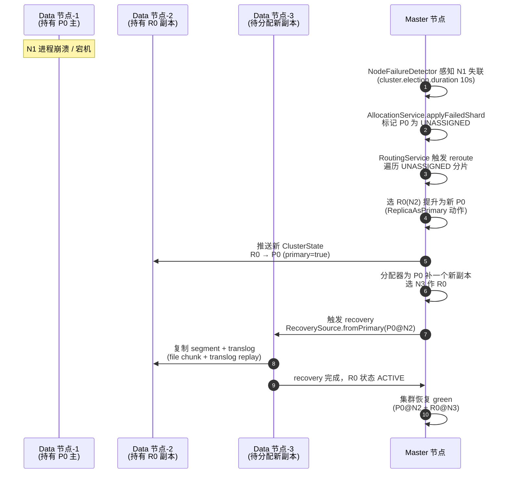
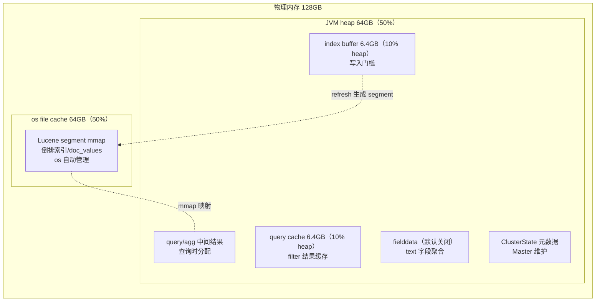
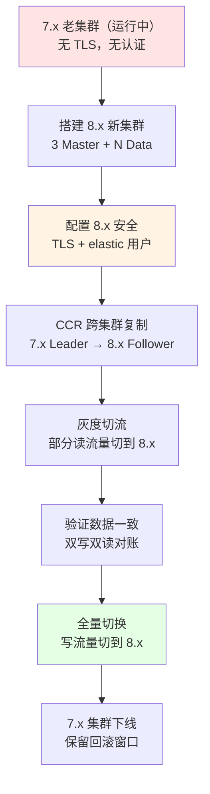

# 高可用与调优

> **一句话定位**：高可用与调优是资深面试的加分项，"节点宕机怎么恢复、JVM heap 为什么 50%"区分是否有生产经验。
> **面试热度**：⭐⭐⭐⭐
> **返回**：[ES 知识图谱](../README.md)

---

## 一、概念定义

### 1.1 ES 高可用：副本故障转移、Master 选举、分片再平衡

Elasticsearch 的高可用（High Availability）依赖三层机制叠加：**副本（Replica）故障转移** 保证单节点宕机数据不丢；**Master 选举（Zen2 Raft-like）** 保证元数据管理节点不单点；**分片再平衡（Rebalance）** 保证集群规模变化时分片自动均衡。三者共同构成"数据不丢、元数据不丢、负载自动均衡"的容灾能力，是 ES 区别于单机 Lucene 的核心特性。

**副本故障转移**：每个主分片（Primary）有 N 个副本（Replica），散布在不同节点。主分片所在节点宕机时，Master 从该分片的副本中选一个提升为新主，再补一个新副本——数据不丢（副本还在），读写不停（新主已就绪）。这是 ES 高可用的"第一道防线"。

**Master 选举**：详见 [01 架构与部署](../01-architecture/architecture-and-topology.md) 的 Zen2 章节。核心是 Voting Configuration（多数派）——3 个专用 Master 节点，挂 1 个仍能凑齐多数派继续选主，挂 2 个则集群不可写（保护脑裂）。Master 宕机→剩余 Master 候选节点触发选举→选出新 Master→新 Master 推送 ClusterState 给全集群。

**分片再平衡**：集群新增/缩容节点时，Master 自动触发再平衡——把过载节点的分片搬到新节点，让每个节点的分片数与磁盘占用均衡。再平衡不是故障转移（故障转移是被动响应宕机，再平衡是主动优化分布），但两者共用 `AllocationService` 分配器。

**与 MySQL MHA / RocketMQ Controller 的对照**：

| 维度 | ES Zen2 + 副本 | MySQL MHA | RocketMQ Controller |
|------|----------------|-----------|---------------------|
| 选举协议 | Zen2（Raft-like 多数派） | MHA Manager（外部进程） | Controller（Raft 多数派，5.x） |
| 元数据管理 | Master 内存 ClusterState | MySQL 主库 binlog + relay log | Controller/KV（NameServer + Controller） |
| 故障感知 | `cluster.election.duration` 10s | MHA Manager 健康检查 | 心跳 + Controller |
| 数据保护 | 副本（Replica）+ translog | 主从复制（半同步可选） | 主从复制（同步/异步可选） |
| 切主粒度 | 分片级（每个分片独立提升新主） | 库级（整库切主） | Broker 级（整 Broker 切主） |
| 脑裂防护 | Voting Configuration 多数派 | MHA 单点（人为防脑裂） | Raft 多数派 |
| 切主后数据补偿 | 副本已同步，提升即用 | relay log 补偿差异 | CommitLog 差异补偿 |

**关键差异**：ES 是**分片级**故障转移（每个分片独立提升新主，不影响其他分片），MySQL/RocketMQ 是**实例级**（整个库/Broker 切主，影响所有表/Topic）。分片级粒度更细——一个节点挂掉，它上面承载的几十个分片分别在不同节点上找到副本各自提升，恢复速度快、影响范围可控。

### 1.2 调优核心目标：吞吐、延迟、聚合内存、JVM heap 50% 规则

ES 调优的核心目标分两类——**写入吞吐**（bulk 批量、refresh 调大、副本临时 0）和**查询延迟**（file cache 预加载、查询缓存、聚合内存调优）。两类目标往往对立：提升吞吐的参数（如 `refresh_interval=30s`）会牺牲查询可见性（写后 30s 才可见），降低查询延迟的参数（如 `refresh_interval=1s`）会拖慢写入（频繁 refresh 生成 segment）。调优本质是**在吞吐与延迟之间找平衡点**。

**JVM heap 50% 规则**：ES 给 JVM heap 分配物理内存的 50%，剩下 50% 留给 os file cache（Lucene segment mmap 用）。这是 ES 调优最著名的"经验法则"，背后是 Lucene 的存储模型——segment 文件靠 os cache 加速读取，heap 给 Lucene 的 query/aggregation 中间结果与 fielddata 缓存。50% 是平衡点：heap 给多了 os cache 不够 segment 读得慢，heap 给少了 query/aggregation 中间结果挤不下触发频繁 GC。详见 [2.6 JVM heap 50% 规则](#26-jvm-heap-50-规则heap-与-os-cache-的平衡)。

**索引调优 vs 查询调优**：

| 维度 | 索引调优（提升写入吞吐） | 查询调优（降低查询延迟） |
|------|--------------------------|--------------------------|
| 核心目标 | 提升 docs/s 写入吞吐 | 降低 P99 查询延迟 |
| 关键参数 | `refresh_interval`、`number_of_replicas`、`translog.durability`、bulk 批量 | `index.store.preload`、`indices.queries.cache.size`、`index.cache.field.entry` |
| 取舍 | 牺牲近实时可见性（refresh 调大→写后更久才可见） | 牺牲 heap 内存（预加载/缓存占内存） |
| 典型场景 | 日志写入（每秒几十万 docs） | 实时检索（订单查询、商品搜索） |
| 风险 | 副本 0 期间单点故障数据丢失 | 缓存过大挤占 query/aggregation 中间结果 |

### 1.3 监控体系：cat API、_cluster/health、_nodes/stats、Prometheus+Grafana

ES 的监控体系分四层——**cat API**（人类可读的紧凑文本，快速巡检）、**_cluster/health**（集群级健康摘要）、**_nodes/stats**（节点级详细指标）、**Prometheus + Grafana**（生产级时序监控告警）。前三个是 ES 自带 REST API，第四个是生态集成（elasticsearch-exporter 采集 → Prometheus 时序存储 → Grafana 可视化告警）。

| 监控手段 | 数据格式 | 维度 | 典型用途 | 告警能力 |
|---------|---------|------|---------|---------|
| cat API | 紧凑文本（表格） | 索引/分片/节点/磁盘 | 手工巡检、快速定位 | 无（只读） |
| `_cluster/health` | JSON | 集群级 | 健康状态摘要（green/yellow/red） | 简单（status 字段） |
| `_nodes/stats` | JSON | 节点级详细 | JVM/GC/线程池/磁盘/网络 | 无（需外部聚合） |
| Prometheus+Grafana | 时序指标 | 全维度 + 历史趋势 | 生产监控告警、容量规划 | 强（PromQL + 告警规则） |

**使用建议**：日常巡检用 cat API（命令快、输出紧凑）；自动化告警用 Prometheus+Grafana（时序存储 + 阈值告警）；故障排查用 `_nodes/stats`（看 JVM/GC/线程池细节）；集群健康摘要用 `_cluster/health`（看分片分配状态）。

### 1.4 常见故障：节点宕机、分片未分配、JVM OOM、脑裂、慢查询

| 故障类型 | 现象 | 直接原因 | 排查入口 | 恢复手段 |
|---------|------|---------|---------|---------|
| 节点宕机 | `_cat/health` 节点数减少 | 进程崩溃/物理机故障/OOM | `_cat/nodes`、`_cluster/health` | 重启节点，副本自动提升为新主 |
| 分片未分配 | `_cluster/health` `unassigned_shards > 0` | 副本数 > 节点数/磁盘满/分片数 > 节点数 | `_cluster/allocation/explain` | 加节点/释放磁盘/调副本数 |
| JVM OOM | 节点被 OOM killer 杀死 | heap 不足/Circuit Breaker 失效 | `dmesg`、`_nodes/stats` GC | 扩 heap（≤31GB）/排查大聚合 |
| 脑裂 | 集群出现两个 Master | Voting Configuration 配置错误/网络分区 | `_cat/master`、日志 `disconnected` | 重启少数派节点，Master 合并 |
| 慢查询 | 查询超时/高延迟 | 全表扫描/大聚合/深分页 | slowlog、`_nodes/stats` search latency | 优化 DSL/加 filter 上下文/限 from+size |

**排查入口速查**：节点宕机看 `_cat/nodes` 确认哪些节点不在；分片未分配用 `_cluster/allocation/explain` 看具体原因（磁盘满/分片数限制/副本数 > 节点数）；JVM OOM 看 `dmesg | grep -i oom` 确认是否被 killer 杀；慢查询看 `index_search_slowlog` 定位慢请求。

---

## 二、原理与流程

### 2.1 副本故障恢复：primary 宕机→replica 提升→重新分配

副本故障恢复是 ES 高可用的核心流程——当承载某主分片的节点宕机时，ES 自动完成"提升副本为新主 + 补一个新副本"的恢复链，全程无需人工介入。流程涉及 `AllocationService`（分片分配器）、`RerouteActionCode`（重路由动作码，枚举分片迁移/取消/平衡等动作）、`RecoverySource`（recovery 数据源，从 primary 复制到新 replica）。



**流程要点**：

1. **故障感知**：Master 的 `NodeFailureDetector`（`org.elasticsearch.cluster.NodeConnections`）通过心跳发现节点失联，超过 `cluster.election.duration`（默认 10s）判定节点故障。
2. **标记未分配**：`AllocationService.applyFailedShard`（`org.elasticsearch.cluster.routing.allocation.AllocationService`）把宕机节点上的所有分片标记为 `UNASSIGNED`，ClusterState 中该分片从 `STARTED` 变为 `UNASSIGNED`。
3. **副本提升新主**：分配器的 `ReplicaAsPrimary` 动作（`RerouteActionCode` 枚举值之一）从副本列表中选一个同步完成的副本提升为新 primary——提升瞬间完成（副本已是完整 segment + translog，无需复制）。
4. **补新副本**：分配器为该 primary 分配一个新 replica，选择负载最低的节点（按 `DiskWatermark` 与 shard 数均衡）。
5. **recovery 同步**：新 replica 从 primary 复制数据，分两阶段——`Phase1`：复制现有 segment（file chunk，按段拷贝）；`Phase2`：replay translog（追平 primary 实时写入）。recovery 期间该 replica 状态为 `RECOVERING`，完成后变 `ACTIVE`。

**源码路径**：
- `org.elasticsearch.cluster.routing.allocation.AllocationService`——分片分配器入口，`applyFailedShard`/`reroute` 方法处理故障恢复。
- `org.elasticsearch.cluster.routing.RerouteService`——重路由服务，触发分配器重新计算分片分配。
- `org.elasticsearch.indices.recovery.RecoverySource`——recovery 数据源，从 primary 复制到新 replica。

### 2.2 分片再平衡：balance 参数、并发数、磁盘水位

分片再平衡（Rebalance）是 ES 在集群规模变化（加节点/缩容节点）时自动调整分片分布的机制——目标是让每个节点的分片数与磁盘占用均衡，避免某节点过载。再平衡由 `AllocationService` 的 `BalanceStrategy`（平衡策略）计算，受三类参数控制。

**再平衡参数**：

| 参数 | 默认值 | 作用 | 调大效果 |
|------|--------|------|---------|
| `cluster.routing.allocation.balance.shard` | 0.45 | 节点总分片数权重 | 更激进均衡总分片数（每个节点分片数尽量相等） |
| `cluster.routing.allocation.balance.index` | 0.55 | 单索引分片数权重 | 更激进均衡单索引分片（防某索引全挤一节点） |
| `cluster.routing.allocation.balance.threshold` | 1.0 | 触发再平衡的阈值 | 调大→更惰性（容忍不均衡），调小→更敏感（频繁搬迁） |
| `cluster.routing.allocation.cluster_concurrent_rebalance` | 2 | 集群级再平衡并发数 | 并行搬迁更多分片（更快平衡，但占带宽） |
| `cluster.routing.allocation.node_concurrent_recoveries` | 2 | 单节点 recovery 并发数 | 单节点并行 recover 更多分片 |

**磁盘水位（DiskWatermark）**：

| 水位 | 默认值 | 含义 | 触发动作 |
|------|--------|------|---------|
| `cluster.routing.allocation.disk.watermark.low` | 85% | 低水位 | 不再往该节点**新分配**分片（已分配的不动） |
| `cluster.routing.allocation.disk.watermark.high` | 90% | 高水位 | 把该节点上的分片**搬迁**到其他节点 |
| `cluster.routing.allocation.disk.watermark.flood_stage` | 95% | 洪水位 | 索引被强制设为 `index.blocks.read_only`（只读，防写满磁盘） |

**触发条件对照**：

| 触发源 | 触发动作 | 受控参数 |
|--------|---------|---------|
| 加节点 | 分片从过载节点搬到新节点 | `balance.shard`/`index`/`threshold` |
| 缩容节点 | 分片从被删节点搬到其他节点 | `cluster_concurrent_rebalance` |
| 磁盘 high 水位 | 分片从满盘节点搬到空盘节点 | `disk.watermark.high` |
| 磁盘 flood 水位 | 索引只读保护 | `disk.watermark.flood_stage` |

**生产建议**：①不要在写入高峰期扩容（再平衡搬迁占带宽，拖慢业务）；②`cluster_concurrent_rebalance` 在大集群可调到 4-6（默认 2 偏保守）；③`flood_stage` 是"最后防线"——一旦触发只读，需手动 `PUT /_all/_settings {"index.blocks.read_only": null}` 解除。

### 2.3 监控 cat API：_cat/indices、_cat/shards、_cat/health、_cat/allocation

cat API（Compact and Aligned Text）是 ES 自带的紧凑文本监控接口——输出表格化文本，适合手工巡检快速定位问题。常用四类 cat 命令：

```bash
# 1. 集群健康摘要（节点数、分片数、未分配分片数）
curl -s "http://localhost:9200/_cat/health?v"

# 输出：epoch timestamp cluster status node.total node.data shards pri relo init unassign
#       1700000000 10:00:00  es-prod green           9         6    300 150    0    0        0

# 2. 索引状态（docs 数、size、health）
curl -s "http://localhost:9200/_cat/indices?v&s=store.size:desc"

# 输出：health status index            uuid pri rep docs.count store.size
#       green  open   orders_202608   xxx   5   1   1000000      5gb
#       green  open   logs_202608     yyy   3   1  50000000    50gb

# 3. 分片分布（哪个分片在哪个节点、大小、状态）
curl -s "http://localhost:9200/_cat/shards/orders_202608?v"

# 输出：index          shard prirep state   docs  store node
#       orders_202608  0     p      STARTED 200k 1gb  es-data-1
#       orders_202608  0     r      STARTED 200k 1gb  es-data-2

# 4. 节点磁盘占用（disk.used、disk.total、disk.percent）
curl -s "http://localhost:9200/_cat/allocation?v"

# 输出：shards disk.indices disk.used disk.total disk.percent node
#          50          100gb     120gb      500gb           24 es-data-1
#          45           90gb     110gb      500gb           22 es-data-2
```

**cat API 的关键参数**：
- `?v`（verbose）——加表头（列名），不加则纯数据行，不便读。
- `?s=field:desc`——按字段排序，如 `?s=store.size:desc` 按磁盘占用降序。
- `?h=field1,field2`——只输出指定列，减少噪音。
- `?format=json`——输出 JSON 而非文本，便于脚本解析。

### 2.4 监控 _cluster/health：green/yellow/red 与延迟分配

`_cluster/health` 是集群级健康摘要 API——返回集群健康状态、分片分配情况、延迟分配分片数等。健康状态用三色灯表示，是"集群是否健康"的最直观指标。

```json
GET /_cluster/health?pretty

{
  "cluster_name": "es-prod",
  "status": "yellow",
  "timed_out": false,
  "number_of_nodes": 9,
  "number_of_data_nodes": 6,
  "active_primary_shards": 150,
  "active_shards": 290,
  "relocating_shards": 0,
  "initializing_shards": 2,
  "unassigned_shards": 10,
  "delayed_unassigned_shards": 10,
  "number_of_pending_tasks": 0,
  "number_of_in_flight_fetch": 0,
  "task_max_waiting_in_queue_millis": 0
}
```

**三色状态对照**：

| 状态 | 含义 | 触发条件 | 业务影响 | 典型原因 |
|------|------|---------|---------|---------|
| green | 全部分片已分配 | 所有 primary + replica 都 STARTED | 无影响，读写正常 | 健康集群 |
| yellow | 副本未分配 | 所有 primary 已分配，部分 replica 未分配 | 读写正常，但容灾降级（单点风险） | 节点数 ≤ 副本数/磁盘满/节点临时宕机 |
| red | 主分片未分配 | 部分 primary 未分配 | 受影响分片读写失败（数据暂时不可用） | 节点宕机超过副本数/磁盘损坏 |

**关键指标解读**：
- `active_shards`——已激活的分片总数（primary + replica）。green 时 `active_shards = active_primary_shards × (1 + replicas)`。
- `relocating_shards`——正在搬迁的分片数（再平衡或故障转移中）。> 0 表示集群正在重排分片。
- `initializing_shards`——正在初始化的分片数（recovery 中）。> 0 表示有副本正在同步。
- `unassigned_shards`——未分配的分片数。> 0 表示有分片没找到合适节点（排查用 `_cluster/allocation/explain`）。
- `delayed_unassigned_shards`——**延迟分配**的未分配分片数。配合 `index.unassigned.node_left.delayed_timeout`（默认 1m）——节点宕机后不立即分配新副本，延迟一段时间（如 10m），等宕机节点回来就直接恢复（避免无谓的 recovery）。

**延迟分配的价值**：节点短暂网络抖动（几十秒恢复）时，若立即分配新副本会触发大量 recovery（搬几十 GB 数据）；设延迟 10 分钟，节点回来直接复用旧副本，零数据搬迁。生产常调到 10-30 分钟。

### 2.5 监控 _nodes/stats：jvm、gc、thread_pool、indices、fs、transport

`_nodes/stats` 是节点级详细监控 API——返回每个节点的 JVM/GC/线程池/索引/磁盘/网络等细粒度指标，是故障排查的"显微镜"。

```json
GET /_nodes/stats?pretty

{
  "nodes": {
    "node-id-1": {
      "jvm": {
        "mem": {
          "heap_used_percent": 65,
          "heap_used_in_bytes": 20132659200,
          "heap_max_in_bytes": 31081402368
        },
        "gc": {
          "collectors": {
            "young": { "collection_count": 1200, "collection_time_in_millis": 45000 },
            "old":   { "collection_count": 3,    "collection_time_in_millis": 8000 }
          }
        }
      },
      "thread_pool": {
        "write":  { "threads": 16, "queue": 0,  "rejected": 0 },
        "search": { "threads": 13, "queue": 50, "rejected": 0 },
        "get":    { "threads": 4,  "queue": 0,  "rejected": 0 }
      },
      "indices": {
        "docs":   { "count": 10000000, "deleted": 500 },
        "store":  { "size_in_bytes": 53687091200 },
        "indexing": { "index_total": 10000000, "index_current": 5, "index_time_in_millis": 120000 },
        "search":  { "query_total": 500000, "query_current": 20, "query_time_in_millis": 80000 }
      },
      "fs": {
        "total": { "total_in_bytes": 536870912000, "free_in_bytes": 268435456000 },
        "data": [ { "path": "/data/es", "free_disk_percent": 50 } ]
      },
      "transport": {
        "rx_count": 1000000, "rx_size_in_bytes": 524288000,
        "tx_count": 800000,  "tx_size_in_bytes": 419430400
      }
    }
  }
}
```

**关键监控指标按"瓶颈定位"分类**：

| 维度 | 指标 | 异常含义 | 排查方向 |
|------|------|---------|---------|
| JVM heap | `jvm.mem.heap_used_percent` | > 75% 警告，> 85% 危险（GC 频繁/OOM 风险） | 扩 heap/排查大聚合/fielddata |
| GC | `jvm.gc.collectors.old.collection_time` | Old GC 频繁/耗时长（> 1s） | heap 不足/大对象多 |
| 写入线程池 | `thread_pool.write.queue` + `rejected` | queue > 0 写入排队，rejected > 0 写入被拒（背压） | bulk 批量调小/扩 Data 节点 |
| 查询线程池 | `thread_pool.search.queue` + `rejected` | queue 排队说明慢查询挤占 search 线程 | 优化 DSL/加 filter/限制 from+size |
| 索引吞吐 | `indices.indexing.index_time_in_millis / index_total` | 平均单文档写入耗时升高 | 看 segment 数/merge 进度 |
| 查询延迟 | `indices.search.query_time_in_millis / query_total` | 平均单查询耗时升高 | 看慢查询日志/聚合内存 |
| 磁盘 | `fs.total.free_in_bytes` | 剩余 < 15% 触发 low watermark | 扩盘/删旧索引/ILM 迁移 |

**源码路径**：`org.elasticsearch.monitor.jvm.JvmStats`——JVM 监控指标采集，含 `heap_used_percent`/`gc` 等字段。

### 2.6 JVM heap 50% 规则：heap 与 os cache 的平衡

JVM heap 50% 规则是 ES 调优最著名的经验法则——**把物理内存的 50% 分给 JVM heap，剩下 50% 留给 os file cache**。背后是 Lucene 的存储模型与 ES 的查询模型共同决定的。

**为什么必须给 os cache 留 50%**：Lucene 的 segment 文件靠 **mmap**（Memory Mapped File）映射到进程地址空间，实际读取走 os page cache。os cache 越大，能缓存的 segment 越多，查询越快——os cache 命中率直接决定查询延迟。如果 heap 给了 80%，os cache 只剩 20%，大量 segment 读盘，查询延迟飙升。

**heap 用在哪**：
- **query/aggregation 中间结果**——查询时 ES 在 heap 里构建 bitset/docvalues 临时结构、聚合桶（bucket）等中间结果。
- **fielddata 缓存**——text 字段排序/聚合时，需要把倒排结构转列存（`fielddata`），存 heap（8.x 默认关闭，改用 doc_values）。
- **index buffer**——写入时文档先入 index buffer（heap），refresh 时生成 segment 刷盘。`indices.memory.index_buffer_size` 默认 10% heap。
- **ClusterState + 元数据**——Master 维护 ClusterState 在 heap，集群越大占得越多。
- **查询缓存**（query cache）——filter 上下文的查询结果缓存，默认 10% heap。



**heap 不能给太多的原因**：①heap 给多了挤占 os cache，segment 读盘变慢；②heap 太大 GC 停顿长（Old GC 扫描大堆耗时），影响节点心跳（> 30s 被判故障）；③**heap 上限 31GB**——超过 31GB JVM 会禁用 Compressed Oops（压缩指针），对象引用从 4 字节变 8 字节，内存浪费 + GC 变慢。

**生产部署建议**：①物理内存 ≤ 64GB 时，heap 给 50%（如 64GB 物理内存 → 31GB heap，但留 33GB 给 os cache 已够用）；②物理内存 ≥ 128GB 时，heap 仍给 31GB（压缩指针上限），剩下 97GB 全给 os cache（segment 缓存充裕）；③**heap 永远不要超过 31GB**（JVM 压缩指针上限）。

### 2.7 Circuit Breaker：parent 总熔断与子熔断

Circuit Breaker（熔断器）是 ES 防止 OOM 的内存保护机制——在执行查询/聚合前先估算内存占用，超限直接抛 `CircuitBreakingException` 拒绝请求，避免 OOM kill 整个 JVM 进程。由 `CircuitBreakerService`（`org.elasticsearch.indices.breaker.CircuitBreakerService`）统一管理。

**熔断器层级**：

| 熔断器 | 限制 | 默认值 | 触发动作 | 触发后恢复 |
|--------|------|--------|---------|-----------|
| `parent_breaker`（总熔断） | 所有子熔断器之和的上限 | 95% heap | 整个 JVM 范围拒绝请求 | 估算内存下降后自动恢复 |
| `fielddata`（字段数据） | text 字段 fielddata 占用 | 40% heap | 拒绝该字段聚合 | LRU 淘汰旧 fielddata |
| `request`（请求级） | 单请求构建（query/agg）的内存 | 60% heap | 拒绝该请求 | 请求结束自动释放 |
| `accounting`（记账） | Lucene 间接内存占用 | 100% heap | 累计超限拒绝 | 内存释放后恢复 |
| `in_flight_requests`（在途请求） | RPC 请求序列化缓冲 | 100% heap | 拒绝新请求 | 请求完成释放 |

**工作机制**：每次请求前 `CircuitBreakerService` 的子熔断器调用 `addEstimate` 估算内存增量——估算后若超过该熔断器的 limit，抛 `CircuitBreakingException`，请求被拒（请求未执行，不占实际内存）。parent breaker 是所有子熔断器之和的"总开关"——任何子熔断器触发前先检查 parent 总限，超 parent 也拒绝。

**与 JVM OOM 的对照**：

| 维度 | Circuit Breaker | JVM OOM |
|------|----------------|---------|
| 触发时机 | 请求执行前估算超限 | 实际内存耗尽 |
| 保护粒度 | 单请求级（拒一个请求） | 进程级（杀整个 JVM） |
| 恢复方式 | 自动恢复（内存下降后） | 重启 JVM 进程（数据恢复慢） |
| 影响 | 单请求失败，集群正常 | 节点宕机，分片迁移 |
| 适用场景 | 防大聚合/大查询打挂节点 | 已是最后防线（无 CB 保护的内存） |

**生产调优**：①`indices.breaker.total.limit` 默认 95% heap，生产可降到 80%（留 15% 余量，防估算不准）；②`indices.breaker.request.limit` 默认 60%，大聚合场景可调到 70%（但配合监控 heap 使用）；③**永远不要关熔断器**——关了就是"裸奔" OOM，JVM 被杀整个节点挂掉。

### 2.8 调优索引吞吐：refresh、replicas、translog、bulk

写入吞吐调优围绕"减少 refresh 频率 + 减少 translog fsync + 减少副本同步开销 + 批量写"四条路径展开。核心参数对照：

| 参数 | 默认值 | 调优方向 | 效果 | 风险 |
|------|--------|---------|------|------|
| `index.refresh_interval` | 1s | 调到 10s/30s | refresh 频率降低 10-30 倍，segment 生成少，写吞吐↑ | 写后 10-30s 才可见（牺牲近实时） |
| `index.number_of_replicas` | 1 | 临时设 0 | 副本同步开销消失，写吞吐↑↑（2-3 倍） | 单点风险——宕机数据丢，**必须写完恢复** |
| `index.translog.durability` | request | 设 async | translog fsync 频率从每请求降到每 5s（`sync_interval`） | 5s 内宕机可能丢最近写入（牺牲持久性） |
| `indices.memory.index_buffer_size` | 10% heap | 调到 20-30% | index buffer 大，refresh 前能攒更多 doc | heap 占用多（挤占 query/agg） |
| bulk 批量大小 | —— | 调到 5-15MB | 减少网络往返，单次 RTT 摊薄 | 过大批量触发 GC/超时 |

**临时 0 副本场景**：日志批量导入时常用——①`PUT /logs/_settings {"number_of_replicas": 0}`；②bulk 批量导入（吞吐提升 2-3 倍）；③导入完恢复 `{"number_of_replicas": 1}`。**风险**：导入期间节点宕机数据丢，所以只对"可重导"的日志/时序数据用，订单/交易数据禁用。

**translog durability 对照**：

| 取值 | 含义 | fsync 频率 | 数据可靠性 | 写吞吐 |
|------|------|-----------|-----------|--------|
| `request`（默认） | 每次写请求后 fsync | 每请求一次 | 高（宕机不丢） | 低 |
| `async` | 后台线程按 `sync_interval` fsync | 每 5s 一次 | 中（宕机丢 5s） | 高 |

详见 [04 读写流程与 Translog](../04-read-write-translog/read-write-and-translog.md) 的 translog 章节。

### 2.9 调优查询延迟：file cache、store.preload、queries.cache

查询延迟调优围绕"减少读盘 + 加速 segment 读取 + 缓存查询结果"三条路径展开。8.x 引入 file cache 是查询调优的关键演进。

**file cache（8.x 新特性）**：8.0 引入的专用文件缓存——专门缓存 Lucene segment 的热数据（如 `.tim`/`.tip`/`.doc`），区别于 os page cache 的全文件缓存。`index.store.type: hybridcache`（8.16+）或 `mmapfs`+file cache 混用，让热段数据常驻专用缓存，查询更稳。详见 8.x release notes。

**调优参数对照**：

| 参数 | 作用 | 调优效果 | 适用场景 |
|------|------|---------|---------|
| `index.store.type: hybridcache`（8.x） | 用专用文件缓存 | 减少 segment 读盘，查询延迟↓ | 读密集 + 大数据量 |
| `index.store.preload: ["tim", "tip", "dvd"]` | 索引打开时预加载 segment 扩展名 | 首次查询不冷启动 | 大索引 + 高频查询 |
| `indices.queries.cache.size`（默认 10% heap） | filter 上下文查询结果缓存 | 重复 filter 查询秒回 | 高频过滤条件 |
| `index.cache.field.entry.size`（默认 unbounded） | 字段数据 entry 缓存 | 避免重复加载 doc_values | 高频聚合字段 |
| `index.sort.field: create_time` | 索引时按字段排序存储 | 提前剪枝减少扫描 | 时序数据 + 时间范围查询 |

**`index.store.preload` 的细节**：preload 不是把整个 segment 加载到内存，而是用 `madvise(MADV_WILLNEED)` 告诉内核"这些扩展名的文件段即将被访问"，内核预读到 page cache。常见 preload 扩展名：`.tim`（term dictionary）、`.tip`（term index FST）、`.doc`（doc_values 列存）、`.pos`（position）。代价是首次打开索引时大量 IO（可能数分钟）。

### 2.10 版本升级 7.x→8.x：安全默认、API 兼容、数据迁移

Elasticsearch 8.x 相对 7.x 的关键变化集中在**安全默认开启 + 性能优化 + API 现代化**三条主线。升级的核心挑战是"安全默认开启"——8.x 出厂强制 TLS + 认证，7.x 默认无安全，跨版本升级必须先处理安全配置。

**8.x 关键变化**：
- **安全默认开启**：`xpack.security.enabled: true`（默认），自动生成 TLS 证书 + `elastic` 用户密码，节点间通信强制 TLS。
- **Security 自动配置**：首次启动 `elasticsearch` 时自动生成证书、`elastic`/`kibana`/`logstash` 系统用户密码，输出到终端。
- **API 兼容**：8.x 的 REST API 兼容 7.x 大部分接口，但**类型移除**（`_doc` 替代 `_doc`，`type` 参数忽略）、`_mapping` 简化、`_search` 默认 `track_total_hits: 10000`。
- **file cache 引入**：8.0+ 引入文件缓存加速查询。
- **Runtime Field 默认可用**：8.x 默认支持运行时字段（7.x 是实验特性）。
- **dense_vector/KNN 8.x 增强**：原生 ANN 检索能力（HNSW 算法）。



**升级方案选择**：

| 方案 | 适用场景 | 停机时间 | 复杂度 | 风险 |
|------|---------|---------|--------|------|
| 滚动重启（rolling upgrade） | 7.x→8.x 同版本系列 | 零停机（逐节点） | 中 | 高（混合版本期间集群不一致） |
| 新集群 + CCR 复制 | 大集群/跨版本大跨度 | 零停机（灰度切流） | 高 | 中（CCR 有复制延迟） |
| 快照恢复 | 小集群/可停机 | 小时级 | 低 | 低（snapshots 全量恢复） |
| elasticdump 数据迁移 | 小数据量 | 分钟-小时 | 低 | 低（按行 dump） |

**生产零停机升级推荐**：新集群搭建（步骤 1-2）→ CCR 跨集群复制（步骤 3）→ 灰度切流（步骤 4-5）→ 全量切换（步骤 6-7）→ 老集群保留回滚窗口后下线（步骤 8）。

### 2.11 源码路径

本节涉及的关键源码类：

| 源码类 | 职责 | 关联章节 |
|--------|------|---------|
| `org.elasticsearch.cluster.routing.allocation.AllocationService` | 分片分配器，故障恢复与再平衡入口 | 2.1 副本故障恢复、2.2 分片再平衡 |
| `org.elasticsearch.cluster.routing.RerouteService` | 触发重路由，重新计算分片分配 | 2.1 副本故障恢复 |
| `org.elasticsearch.cluster.routing.allocation.RerouteActionCode` | 重路由动作码枚举（START_PRIMARY/RELOCATE/CANCEL/BALANCE） | 2.1 副本故障恢复、2.2 分片再平衡 |
| `org.elasticsearch.indices.recovery.RecoverySource` | recovery 数据源，从 primary 复制到 replica | 2.1 副本故障恢复 |
| `org.elasticsearch.cluster.routing.allocation.DiskWatermark` | 磁盘水位阈值（low/high/flood_stage） | 2.2 分片再平衡 |
| `org.elasticsearch.indices.breaker.CircuitBreakerService` | 熔断器服务，管理 parent/子熔断器 | 2.7 Circuit Breaker |
| `org.elasticsearch.indices.breaker.ChildCircuitBreakerService` | 子熔断器（fielddata/request/accounting） | 2.7 Circuit Breaker |
| `org.elasticsearch.monitor.jvm.JvmStats` | JVM 监控指标采集（heap/gc） | 2.5 监控 _nodes/stats |
| `org.elasticsearch.monitor.fs.FsInfo` | 文件系统监控（磁盘占用） | 2.5 监控 _nodes/stats |
| `org.elasticsearch.cluster.NodeConnections` | 节点心跳连接，故障感知 | 2.1 副本故障恢复 |

---

## 三、高频追问

### Q1：节点宕机怎么办？

Master 的 `NodeFailureDetector` 在 `cluster.election.duration`（默认 10s）内感知节点失联→`AllocationService.applyFailedShard` 把宕机节点上的分片标 UNASSIGNED→分配器从副本列表选一个提升为新 primary（瞬间完成，副本已同步）→分配器补一个新 replica→新 replica 从 primary recovery（file chunk + translog replay）。全集群自动恢复，无需人工介入。

### Q2：分片未分配怎么排查？

用 `_cluster/allocation/explain` 查具体原因——返回的 `decisions` 字段说明为什么该分片不能分配到每个候选节点。常见原因：①副本数 > 节点数（如 3 副本但只有 2 节点，多出的副本无法分配）；②磁盘满（触达 low/high 水位）；③分片数 > `cluster.max_shards_per_node`（默认 1000）；④节点角角色不匹配（如 hot 分片不能分到 warm 节点）。针对性加节点/释放磁盘/调副本数/调分片上限即可。

### Q3：JVM heap 为什么 50%？

给 os file cache 留空间——Lucene segment 靠 mmap 映射到进程地址空间，实际读 segment 走 os page cache。os cache 大→segment 缓存命中率高→查询快。如果 heap 给 80%，os cache 只剩 20%，segment 大量读盘，查询延迟飙升。50% 是平衡点：heap 给 query/agg 中间结果 + index buffer + 元数据，os cache 给 segment 缓存。另外 heap 上限 31GB（JVM 压缩指针上限），超过会禁用压缩指针、对象引用变 8 字节、GC 变慢。

### Q4：Circuit Breaker 是什么？

ES 的内存保护熔断器——请求执行前先估算内存增量，超限抛 `CircuitBreakingException` 拒绝请求，避免 OOM kill JVM 进程。分 parent（总熔断，95% heap）+ fielddata（40%）+ request（60%）+ accounting（100%）子熔断。CB 是"防 OOM 的第一道防线"——宁可拒一个请求，也不要杀整个 JVM。

### Q5：怎么提升写入吞吐？

四条路：①`refresh_interval` 调大到 10-30s（segment 生成少，refresh 开销↓）；②`number_of_replicas` 临时设 0（副本同步开销消失，吞吐↑↑ 2-3 倍）；③`translog.durability=async`（fsync 频率从每请求降到每 5s）；④bulk 批量（5-15MB/批，减少网络往返）。代价是牺牲近实时可见性 + 持久性 + 容灾——临时 0 副本只对可重导的日志/时序数据用。

### Q6：7.x 升 8.x 注意什么？

两件事：①**安全默认开启**——8.x 出厂强制 TLS + 认证，跨版本升级必须先生成证书 + 配置 `elastic` 用户密码，否则节点起不来；②**API 兼容但类型移除**——7.x 的 `_doc`/`_type` 路径在 8.x 被简化，老客户端可能报错。建议走"新集群 + CCR 复制 + 灰度切流"零停机方案，避免滚动重启期间的混合版本不一致风险。

### Q7：yellow 和 red 区别？

yellow = 副本未分配（所有 primary 在，部分 replica 缺）——读写正常但容灾降级；red = 主分片未分配（部分 primary 缺）——受影响分片读写失败。yellow 常见原因是节点数 ≤ 副本数（如 2 节点 1 副本，宕机 1 个只剩 1 节点撑主，副本无处放）；red 常见原因是节点宕机超过副本数（如 1 副本 2 节点全挂，主和副本都没了）。

### Q8：file cache 8.x 是什么？

8.0 引入的专用文件缓存——专门缓存 Lucene segment 的热数据（`.tim`/`.tip`/`.doc` 等扩展名），区别于 os page cache 的全文件缓存。`index.store.type: hybridcache`（8.16+）或 `mmapfs`+file cache 混用，让热段数据常驻专用缓存，查询更稳。区别于 os cache 的"全文件按需缓存"，file cache 是"按扩展名定向缓存热数据"，命中率更高。

### Q9：为什么 heap 上限 31GB？

JVM 在 heap ≤ 31GB 时启用 Compressed Oops（压缩指针），对象引用用 4 字节表示（而非 8 字节）——节省 50% 引用内存 + GC 扫描快。超过 31GB JVM 自动禁用压缩指针，对象引用变 8 字节，内存浪费 + GC 变慢。所以 ES 官方推荐 heap 永远 ≤ 31GB，超过的部分宁可留给 os cache。

---

## 四、实战关联

### 4.1 Java 场景：RestHighLevelClient 监控指标获取

生产中常通过 Java 客户端拉取 ES 集群健康与节点指标，集成到自研监控大盘：

```java
import org.elasticsearch.action.admin.cluster.health.ClusterHealthRequest;
import org.elasticsearch.action.admin.cluster.health.ClusterHealthResponse;
import org.elasticsearch.action.admin.cluster.node.stats.NodesStatsRequest;
import org.elasticsearch.action.admin.cluster.node.stats.NodesStatsResponse;
import org.elasticsearch.client.RequestOptions;
import org.elasticsearch.client.RestHighLevelClient;
import org.elasticsearch.cluster.health.ClusterHealthStatus;

// 1. 拉取集群健康状态（对应 _cluster/health）
ClusterHealthRequest healthReq = new ClusterHealthRequest();
// 可指定 indices 范围，避免全集群扫描
ClusterHealthResponse healthResp = client.cluster().health(healthReq, RequestOptions.DEFAULT);

ClusterHealthStatus status = healthResp.getStatus();  // GREEN/YELLOW/RED
int unassigned = healthResp.getUnassignedShards();    // 未分配分片数
int relocating = healthResp.getRelocatingShards();    // 搬迁中分片数
int delayed = healthResp.getDelayedUnassignedShards(); // 延迟分配分片数
int activePri = healthResp.getActiveShards();         // 已激活分片数

if (status == ClusterHealthStatus.RED) {
    // 告警：主分片未分配，需立即介入
    alertService.fire("ES 集群 RED: unassigned=" + unassigned);
}

// 2. 拉取节点级 JVM/线程池指标（对应 _nodes/stats）
NodesStatsRequest nodesReq = new NodesStatsRequest();
nodesReq.clear().jvm(true).threadPool(true).os(true).fs(true);
NodesStatsResponse nodesResp = client.nodes().stats(nodesReq, RequestOptions.DEFAULT);

nodesResp.getNodes().forEach(nodeStats -> {
    String nodeId = nodeStats.getNode().getId();
    // JVM heap 使用率
    double heapUsedPercent = nodeStats.getJvm().getMem().getUsedPercent();
    // 写入线程池 queue/rejected
    long writeQueue = nodeStats.getThreadPool().getStats().stream()
        .filter(s -> "write".equals(s.getName()))
        .findFirst()
        .map(ThreadPoolStats.Stats::getQueue)
        .orElse(0L);
    long writeRejected = nodeStats.getThreadPool().getStats().stream()
        .filter(s -> "write".equals(s.getName()))
        .findFirst()
        .map(ThreadPoolStats.Stats::getRejected)
        .orElse(0L);

    if (heapUsedPercent > 85) {
        alertService.fire("节点 " + nodeId + " heap " + heapUsedPercent + "% 危险");
    }
    if (writeRejected > 0) {
        alertService.fire("节点 " + nodeId + " 写入被拒 " + writeRejected);
    }
});
```

**关键点**：①`ClusterHealthRequest` 拉取的 status 是"集群级健康摘要"，适合做 RED 告警；②`NodesStatsRequest` 拉取的 JVM/线程池是"节点级细粒度指标"，适合做瓶颈定位；③写入线程池 `rejected > 0` 是背压信号——说明 bulk 速度超过节点处理能力，需要降速或扩容。

### 4.2 生产部署：3 Master 专用 + N Data + JVM heap 31GB + SSD

生产 ES 集群的标准部署形态：

| 角色 | 节点数 | 配置 | 职责 |
|------|--------|------|------|
| 专用 Master | 3（奇数，多数派） | 8C/16GB/100GB SSD | 元数据管理、选举，不存数据 |
| 专用 Data | N（按数据量） | 16C/64GB/4TB SSD | 存分片、读写、聚合 |
| 专用 Coordinating | 1-2（可选） | 16C/64GB | 请求路由归并（高并发场景） |

**关键配置项**：
- **Master 节点**：`node.roles: [master]`、`discovery.seed_hosts: ["m1","m2","m3"]`、`cluster.initial_master_nodes: ["m1","m2","m3"]`、heap 8GB（够 ClusterState 用）。
- **Data 节点**：`node.roles: [data]`、heap 31GB（物理内存 64GB）、`path.data: /data/es`（SSD）、`bootstrap.memory_lock: true`（锁定 heap 不 swap）。
- **内核参数**：`vm.max_map_count=262144`（Lucene mmap 必需）、`swappiness=1`（禁 swap）、`nofile=65536`（文件句柄）。
- **JVM 参数**：`-Xms31g -Xmx31g`（heap 固定避免动态扩容 GC）、`-XX:+UseG1GC`（G1 适合大堆）、`-XX:MaxGCPauseMillis=200`。

### 4.3 与 ops/linux 监控对照

ES 的 JVM heap vs os cache 权衡与 Linux 内存管理是同一套原理——`ops/linux/03-memory/memory-management.md` 讲的 page cache/dirty page/swap 在 ES 场景具体体现为：①Lucene segment mmap 占用 page cache；②`bootstrap.memory_lock: true` 防止 heap 被 swap 出去（swap 会拖慢 GC 几个数量级）；③`swappiness=1`（建议）让内核尽量不用 swap。

进程线程模型对照：ES 单 JVM 进程内通过 Netty 4 线程池承载 IO，对应 `ops/linux/02-process/process-and-thread.md` 的"IO 多路复用 + 线程池"模型——`transport.workers`（默认 2×CPU）处理 TCP IO，`write`/`search`/`get` 业务线程池串行处理业务逻辑。

### 4.4 与 ops/docker / ops/k8s 部署对照

容器化部署 ES 的关键差异：

| 维度 | 裸机部署 | Docker 部署 | K8s 部署 |
|------|---------|------------|---------|
| 内核参数 | `sysctl -w vm.max_map_count=262144` | `docker run --sysctl vm.max_map_count=262144` | `initContainer` 执行 sysctl |
| 持久化 | 直接挂裸盘 | volume mount | StatefulSet + PVC |
| 节点发现 | `seed_hosts` 列 IP | `seed_hosts` 容器名 | Headless Service + `seed_hosts` DNS |
| 资源隔离 | cgroup 限制 | `--memory`/`--cpus` | `resources.limits` |
| Master 部署 | 3 台物理机 | 3 容器（反亲和） | 3 Pod（podAntiAffinity 分散） |

**K8s 部署关键**：①必须用 StatefulSet（保证节点名稳定，分片不漂移）；②PVC 必须用本地盘或网络盘（不能用 ephemeral storage，Pod 重启数据丢）；③Master 节点用 podAntiAffinity 分散到不同 Node（防止单 Node 故障 3 Master 全挂）；④`vm.max_map_count` 必须在 initContainer 里 sysctl（Pod 内改不了内核参数，需特权 init）。

### 4.5 与 java-core/jvm 的对照

ES 的 JVM heap 50% 规则与 `java-core/jvm` 的 JVM 调优一脉相承——本质都是"堆大小 vs 堆外内存"的权衡。对照要点：

| 维度 | 通用 JVM 应用 | ES 特化场景 |
|------|--------------|------------|
| 堆大小决策 | 按对象数/GC 频率定 | 固定 50% 物理内存（上限 31GB） |
| 堆外内存 | DirectByteBuffer/NIO | Lucene segment mmap（os cache） |
| GC 选型 | G1/ZGC（大堆） | G1（≤31GB heap 首选） |
| 内存保护 | 无（OOM 就崩） | Circuit Breaker（请求级防 OOM） |
| 监控 | jstat/jmap | `_nodes/stats` jvm 指标 |

Circuit Breaker 与 JVM 内存溢出保护对照：通用 JVM 应用 OOM 时进程直接崩溃（无保护）；ES 的 Circuit Breaker 是"请求级"保护——在执行前估算内存，超限拒绝单个请求，不让整个 JVM 挂掉。这是 ES 把"内存预算"下沉到请求层的特化设计，详见 `java-core/jvm` 的内存溢出章节对照。

---

## 五、系统设计案例

### 5.1 设计一个 ES 生产集群的监控告警体系

**场景**：一个 30 节点的 ES 集群（3 Master + 24 Data + 3 Coordinating），承载日志检索 + 订单检索双业务，需要设计监控告警体系覆盖集群健康、节点资源、分片状态、查询延迟四类指标。

**方案选型**：Prometheus + elasticsearch-exporter + Grafana + AlertManager。理由：①时序存储支持历史趋势分析；②PromQL 灵活告警规则；③elasticsearch-exporter 已封装 cat/health/nodes/stats 指标采集；④Grafana 仪表盘可视化。

**监控指标清单（5 大类 20 指标）**：

| 类别 | 指标 | PromQL 示例 | 告警阈值 |
|------|------|-----------|---------|
| 集群健康 | status red | `elasticsearch_cluster_health_status{color="red"} == 1` | 持续 1 分钟 |
| 集群健康 | unassigned 分片 | `elasticsearch_cluster_health_unassigned_shards > 0` | > 0 持续 5 分钟 |
| 集群健康 | 节点数变化 | `elasticsearch_cluster_health_number_of_nodes < 30` | < 30 立即告警 |
| JVM | heap 使用率 | `elasticsearch_jvm_memory_used_bytes{area="heap"} / elasticsearch_jvm_memory_max_bytes{area="heap"} * 100` | > 85% 持续 5 分钟 |
| JVM | Old GC 频率 | `rate(elasticsearch_jvm_gc_collection_seconds_count{gc="old"}[5m])` | > 5 次/分钟 |
| JVM | GC 耗时 | `elasticsearch_jvm_gc_collection_seconds_sum{gc="old"}` | 单次 > 2s |
| 线程池 | write queue | `elasticsearch_thread_pool_queue{type="write"}` | > 50 持续 1 分钟 |
| 线程池 | write rejected | `rate(elasticsearch_thread_pool_rejected_count{type="write"}[1m])` | > 0 立即告警 |
| 线程池 | search queue | `elasticsearch_thread_pool_queue{type="search"}` | > 100 持续 1 分钟 |
| 线程池 | search rejected | `rate(elasticsearch_thread_pool_rejected_count{type="search"}[1m])` | > 0 立即告警 |
| 索引 | 写入吞吐 | `rate(elasticsearch_indexing_index_total[5m])` | 跌 50% 持续 5 分钟 |
| 索引 | 写入延迟 | `rate(elasticsearch_indexing_index_time_seconds_total[5m]) / rate(elasticsearch_indexing_index_total[5m])` | > 50ms/doc |
| 查询 | 查询延迟 | `rate(elasticsearch_search_query_time_seconds_total[5m]) / rate(elasticsearch_search_query_total[5m])` | > 500ms/query |
| 查询 | 慢查询数 | `elasticsearch_search_query_total - elasticsearch_search_query_total offset 5m` | 对比突增告警 |
| 磁盘 | 磁盘使用率 | `1 - elasticsearch_filesystem_data_available / elasticsearch_filesystem_data_size` | > 85% 持续 10 分钟 |
| 磁盘 | 磁盘 IO | `rate(elasticsearch_filesystem_io_total[5m])` | > 90% IOPS 持续 5 分钟 |
| 网络 | 节点间流量 | `rate(elasticsearch_transport_rx_size_bytes_total[5m])` | 突增 5 倍 |
| 网络 | HTTP 流量 | `rate(elasticsearch_http_current_open[5m])` | 跌 50% 告警 |
| 分片 | relocating | `elasticsearch_cluster_health_relocating_shards > 0` | > 0 持续 30 分钟（搬迁卡住） |
| 分片 | initializing | `elasticsearch_cluster_health_initializing_shards > 50` | > 50 持续 10 分钟 |

**部署架构**：

```
ES 集群(30节点) → elasticsearch-exporter(3副本,分散在不同k8s node)
  → Prometheus(主+备 2实例) → AlertManager(告警去重+分组)
                              → Grafana(5 个仪表盘:集群概览/JVM/线程池/索引/磁盘)
                              → 钉钉/企微/邮件/电话(4 级告警通道)
```

**告警分级**：
- **P0 电话**：集群 red、节点数减少、write/search rejected > 0。
- **P1 企微**：heap > 85%、磁盘 > 85%、unassigned > 0。
- **P2 邮件**：GC 频繁、查询延迟升高、写入吞吐下跌。
- **P3 仪表盘**：relocating 持续、initializing 偏多（只看不告警）。

### 5.2 设计一次从 7.x 到 8.x 的零停机升级方案

**场景**：一个 20 节点 7.x ES 集群（3 Master + 15 Data + 2 Coordinating），承载订单检索业务（10TB 数据，日均 5 亿次查询），要求零停机升级到 8.x，保留 7 天回滚窗口。

**方案选型**：新集群搭建 + CCR 跨集群复制 + 灰度切流 + 别名切换。理由：①滚动重启风险高（混合版本期间集群不一致，7.x/8.x 节点共存可能元数据格式不兼容）；②新集群 + CCR 是 ES 官方推荐的跨大版本升级方案，数据实时复制保证一致；③别名切换原子操作，业务无感。

**升级流程**（对应 2.10 流程图）：

1. **搭建 8.x 新集群**（步骤 1-3）：
   - 3 Master 专用 + 15 Data + 2 Coordinating，规格与老集群对齐。
   - 配置安全：`elasticsearch-setup` 自动生成 TLS 证书 + `elastic` 用户密码。
   - 配置 `indices.requests.cache.size: 5%`、`indices.breaker.total.limit: 80%` 等调优参数。
   - 验证：`GET /_cluster/health` 返回 green，`GET /_cat/nodes?v` 20 个节点就绪。

2. **CCR 跨集群复制**（步骤 4-5）：
   - 在 8.x 集群注册 7.x 为 remote cluster：`PUT /_cluster/settings {"persistent": {"cluster.remote.es7.seeds": ["7.x-node1:9300"]}}`。
   - 为每个索引建立 Follower：`PUT /orders/_ccr/follow {"leader_index": "orders"}`。
   - 8.x 的 Follower 索引自动从 7.x Leader 索引复制 segment + translog，实现数据实时同步。
   - 监控复制延迟：`GET /_ccr/stats`，关注 `leader_index`/`follower_index` 的 `last_requested_seq_no` 差值。

3. **灰度切流**（步骤 6-7）：
   - 双写：业务层同时写 7.x Leader 和 8.x（写 8.x 用 `PUT /orders_v8/_doc/{id}` 绕过 Follower 只读限制）。或用消息队列 fanout 到双集群。
   - 双读：10% 读流量切到 8.x Follower 索引，监控查询延迟与结果一致性。
   - 对账：抽样比对 7.x 与 8.x 同一文档，`GET /orders/_doc/{id}` vs `GET /orders_v8/_doc/{id}`，确认一致。

4. **全量切换**（步骤 8）：
   - 双写稳定后，停止 7.x 写入，等 CCR 复制延迟归零（`last_requested_seq_no` 持平）。
   - 原子切换别名：`POST /_aliases {"actions": [{"remove": {"index": "orders_v7", "alias": "orders"}}, {"add": {"index": "orders_v8", "alias": "orders"}}]}`。
   - 切换后业务全部走 8.x，观察 24 小时无异常。

5. **老集群下线**（步骤 9）：
   - 7.x 集群保留 7 天回滚窗口（停写但保留数据）。
   - 7 天后无回滚需求，删除 7.x 索引、下线集群。

**关键风险与对策**：

| 风险 | 影响 | 对策 |
|------|------|------|
| CCR 复制延迟 | 切流时数据不一致 | 切流前等 `last_requested_seq_no` 持平，最多差秒级 |
| 8.x API 不兼容 | 老客户端报错 | 升级 RestHighLevelClient 到 8.x 版本，先在测试环境验证 |
| 安全配置复杂 | 节点起不来 | 用 `elasticsearch-setup` 自动生成证书，避免手写配置错 |
| 切流后发现问题 | 业务已切，难回滚 | 保留 7 天 7.x 集群只读状态，可切别名回滚 |
| 双写时写入差异 | 数据不一致 | 用消息队列 fanout（顺序保证）或双写后对账 |

**回滚预案**：若切流后 8.x 出现严重问题，立刻切别名回 7.x——`POST /_aliases {"actions": [{"remove": {"index": "orders_v8", "alias": "orders"}}, {"add": {"index": "orders_v7", "alias": "orders"}}]}`。因为 7.x 集群 7 天内仍只读保留，数据未删，秒级回滚。代价是切流后到回滚之间 8.x 的增量写入会丢（需人工补）。

---

> **关联文档**：
> - 副本故障恢复的"分片分配"细节 → [01 架构与部署](../01-architecture/architecture-and-topology.md) 的 Master 选举章节
> - translog 刷盘策略 → [04 读写流程与 Translog](../04-read-write-translog/read-write-and-translog.md) 的 translog 章节
> - 分片数规划（单分片大小/over-sharding）→ [07 分片路由与 Reindex](../07-shard-routing/shard-routing-and-reindex.md) 的分片数规划章节
> - JVM heap 50% 规则的内存管理原理 → `ops/linux/03-memory/memory-management.md`
> - 容器化部署 → `ops/docker/`、`ops/k8s/`
> - 副本恢复 vs Redis/RocketMQ 主从复制 → `middleware/redis/05-replication/replication-and-cluster.md`、`middleware/rocketmq/04-ha/ha-and-replication.md`
