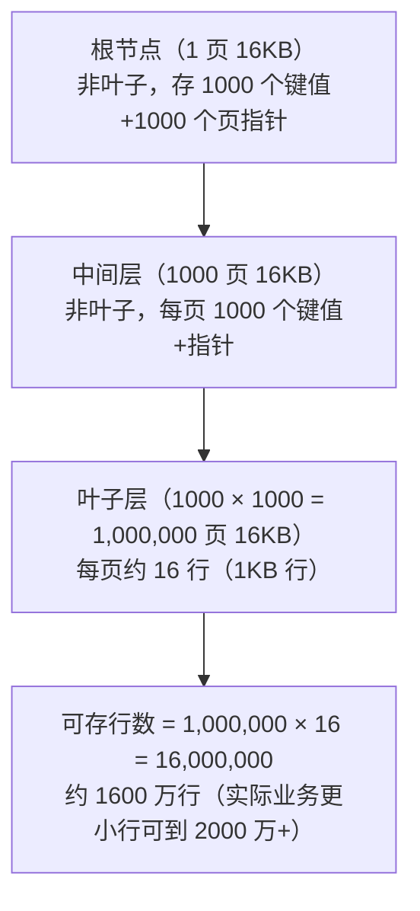
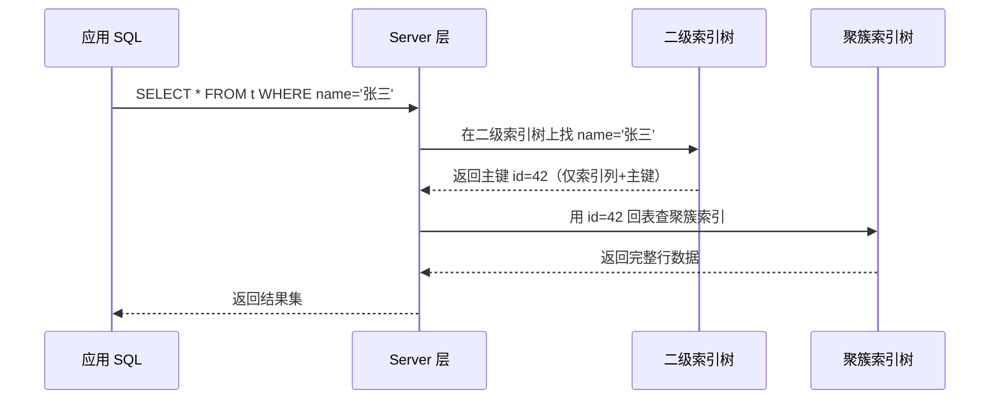
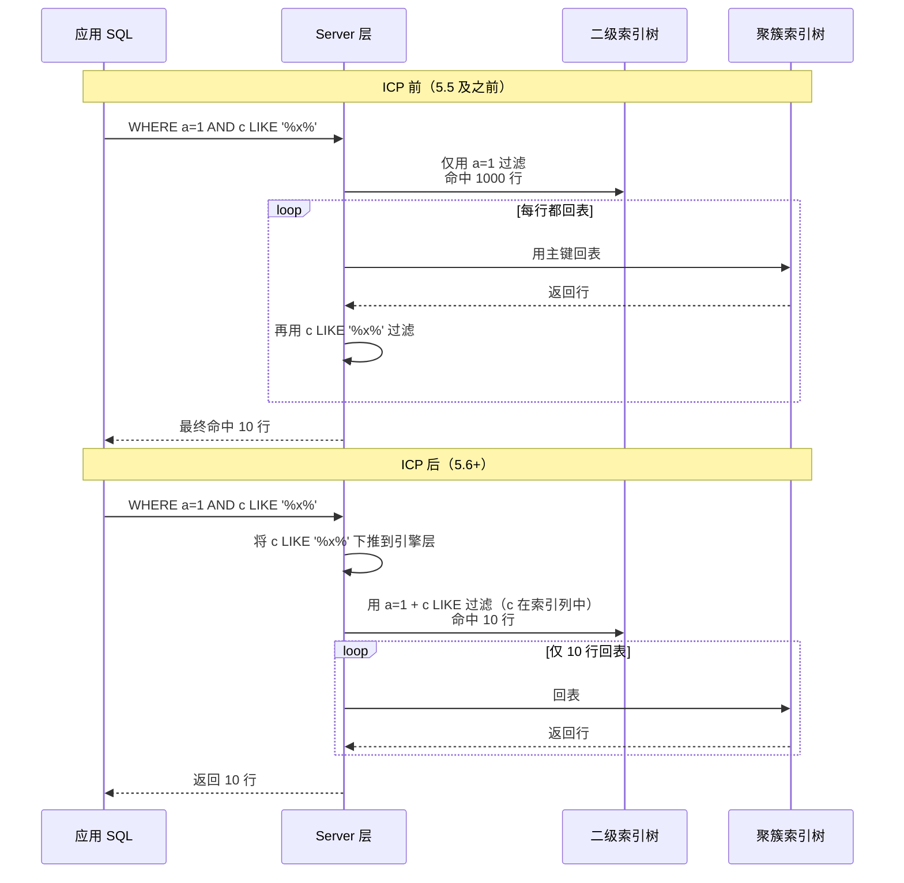

# 索引原理与优化

> **一句话定位**：索引是 MySQL 面试的起手题，"讲讲索引底层结构"几乎每场必问，能讲到 B+树页结构与三千万行推导才算合格。
> **面试热度**：⭐⭐⭐⭐⭐
> **返回**：[MySQL 知识图谱](../README.md)

---

## 一、概念定义

### 1.1 索引本质：有序数据结构

索引是帮助 MySQL 高效获取数据的**有序数据结构**。在 InnoDB 里，索引即 B+树——每张表都以一棵 B+树的形式组织在表空间中，B+树的叶子节点存放行数据，非叶子节点存放键值与页指针。"索引即数据"是这个组织方式的核心特征：聚簇索引的叶子就是完整行，所以**一张 InnoDB 表就是一棵聚簇索引树**，所有的二级索引叶子只是"主键值的副本"。

引入索引的代价：①**空间代价**——每个索引一棵 B+树；②**写代价**——每次 INSERT/UPDATE/DELETE 都要同步维护所有索引树；③**优化器代价**——索引越多，优化器选错的概率越大。所以索引不是越多越好，而是"建在查询路径上"才划算。

**索引的生命周期成本**：建索引不是一次性投入，而是持续成本——每次写入都要维护所有索引树。一张有 10 个索引的表，单次 INSERT 实际要写 11 棵 B+树（1 聚簇 + 10 二级）。这是为什么生产库索引要精简、要定期清理冗余索引的根因。`sys.schema_unused_indexes` 和 `sys.schema_redundant_indexes` 是 MySQL 8.0 提供的清理工具。

### 1.2 B+树 vs B树 vs 红黑树 vs Hash 索引

| 维度 | B+树（InnoDB） | B树 | 红黑树 | Hash 索引（Memory/自适应哈希） |
|------|---------------|-----|--------|------------------------------|
| 树高 | 3-4 层存千万行 | 10-20 层存百万行 | 20-30 层存百万行 | O(1) 无树结构 |
| 范围查询 | 强（叶子双向链表遍历） | 弱（需中序遍历） | 弱（中序遍历） | 极弱（只能精确匹配） |
| 磁盘 IO 次数 | 等于树高（3-4 次） | 等于树高（10+ 次） | 等于树高（20+ 次） | 1 次（哈希桶定位） |
| 有序性 | 强（叶子链表有序） | 强（节点内有序） | 强（中序有序） | 无（哈希值散乱） |
| 排序/ORDER BY | 可走索引 | 可走索引 | 不适合磁盘场景 | 无法走索引 |

**核心差异**：B+树非叶子节点**只存键值和指针**不存数据，单页（16KB）能放上千个键值，使树高极矮；叶子节点通过双向链表串成有序链表，范围查询只需定位起点再沿链表扫一遍。红黑树本质是二叉树，存储千万行时树高约 23（`log₂(10⁷)`），每次查询需 23 次磁盘 IO，无法接受。Hash 索引适合 KV 精确匹配但完全不支持范围、排序。

### 1.3 为什么 InnoDB 选 B+树

InnoDB 选 B+树有三条决定性理由：

1. **树矮**——非叶子节点只存键值+指针，单页 16KB 可容纳约 1000 个键值（1 个键 + 6 字节页指针，按主键 BIGINT 8 字节估算），三层 B+树即可存 `1000 × 1000 × 16` ≈ 2000 万行，磁盘 IO 次数固定为 3 次。
2. **叶子双向链表，范围查询高效**——B+树所有数据都集中在叶子层，叶子之间用双向链表连接；`WHERE id BETWEEN 100 AND 200` 只需定位到 id=100 的叶子节点，沿链表向后扫 100 行即可，无需重复从根节点查找。
3. **非叶子只存键值，单页可存更多键**——对比 B 树每个节点都存数据行，B+树非叶子节点能塞更多键值，扇出（fanout）更大，进一步压低树高；同时非叶子节点更小，更容易被 Buffer Pool 完整缓存。

**与 B 树的本质差异**：B 树每个节点都存数据行，单页 16KB 放了数据后只能放几十个键值，扇出小、树高大（10+ 层存百万行）；且 B 树范围查询需要中序遍历回溯到父节点，无法像 B+树那样沿叶子链表线性扫描。InnoDB 早期版本（5.5 之前）曾对比过 B 树与 B+树实现，B+树在 IO 次数与缓存命中率上全面胜出。

**与跳表的对比**：Redis 的 ZSet 用跳表实现有序集合，跳表查询复杂度 O(log n) 与 B+树相当，但跳表每个节点单独存储（没有"页"概念），磁盘 IO 次数等于跳表层数（约 `log₂ n`，存千万行需 20+ 次 IO）。B+树把多个键值压缩到一个 16KB 页内，一次 IO 读一整页，IO 次数等于树高（3-4 次）。**内存数据库用跳表合适，磁盘数据库必须用 B+树**——这是 InnoDB 选 B+树而非跳表的根本原因。

### 1.4 聚簇索引 vs 二级索引

| 维度 | 聚簇索引 | 二级索引（辅助索引） |
|------|---------|--------------------|
| 叶子节点存什么 | 完整行数据 | 索引列值 + 主键值 |
| 是否回表 | 否（直接拿到行） | 是（除非覆盖索引） |
| 一张表能几个 | 1 个 | 多个（受 `innodb_page_size` 与行大小限制，行越短可建越多） |
| 按什么排序 | 按主键有序 | 按索引列有序，相同索引列值内按主键有序 |

> **关键认知**：聚簇索引叶子存行，二级索引叶子存"主键值"。二级索引不是直接指向行物理地址，而是存主键值——这样即使行物理位置因页分裂变化，二级索引也不用改，代价是查询要回表。这是 InnoDB 与 MyISAM 的本质区别：MyISAM 索引叶子存行的物理地址（直接定位无需回表），但页分裂代价高且不支持聚簇组织。

### 1.5 索引组织表

InnoDB 是**索引组织表**（Index Organized Table, IOT）——表即聚簇索引，聚簇索引即表。"索引即数据"意味着行数据不是独立存放的堆表，而是按主键有序嵌入 B+树的叶子。这一设计的连锁影响：

- **必须有主键**——没有显式主键时，InnoDB 选第一个**所有列非空**的唯一索引；若也没有，则自动生成 **6 字节隐藏列 `DB_ROW_ID`** 作为聚簇键（用户感知不到，且多表共享 ROW_ID 可能导致性能抖动）。
- **二级索引叶子存主键值**——而非行物理地址，回表时用主键再查一次聚簇索引。
- **行物理位置随主键有序**——按主键自增插入是"追加"，按 UUID 插入是"随机插入"导致频繁页分裂。

**与 MyISAM 堆表的对比**：MyISAM 是堆表（Heap Table）——数据独立存放，索引叶子存行物理地址（页号+偏移），二级索引与聚簇索引结构相同。堆表的优势是 INSERT 极快（追加到文件尾无页分裂），劣势是范围查询慢（行无序需随机 IO）。InnoDB 的索引组织表让范围查询沿叶子链表顺序扫，但 INSERT 受主键有序性约束。这是 OLTP（InnoDB）与日志型场景（MyISAM/堆表）的核心架构差异。

### 1.6 索引基数（Cardinality）

索引基数是**该列不同值的数量**，决定了索引的选择性。选择性好（基数高）的列适合单独建索引；选择性差（基数低）的列需与其他列组合成联合索引。

| 基数类型 | 示例 | 选择性 | 单列索引效果 |
|---------|------|--------|-------------|
| 高基数 | 用户 ID、手机号、订单号 | 接近表行数 | 极佳（命中 1 行） |
| 中基数 | 城市、部门、商品分类 | 数十到数百 | 一般（命中千分之几） |
| 低基数 | 性别、状态、is_deleted | 个位数 | 极差（命中 50%+） |

**选择性 = 基数 / 表行数**，经验法则：选择性 > 0.1（即索引过滤后命中行数 < 10%）时单列索引有效；选择性 < 0.1 时应考虑联合索引。查看基数用 `SHOW INDEX FROM t` 的 `Cardinality` 列（估算值，可能不准，用 `ANALYZE TABLE` 更新）。

---

## 二、原理与流程

### 2.1 B+树结构详解

InnoDB 的 B+树以**页（Page）**为基本管理单位，默认 `innodb_page_size = 16KB`。页既是磁盘 IO 单位，也是 Buffer Pool 缓存单位。

**页的内部结构**（7 大段）：

| 段 | 作用 | 关键字段 |
|------|------|---------|
| File Header | 页头元信息（页号、前后页号、LSN、页类型） | `FIL_PAGE_PREV/NEXT`、`FIL_PAGE_LSN`、`FIL_PAGE_TYPE` |
| Page Header | 页内状态（槽数、空闲指针、已删记录数） | `PAGE_N_DIR_SLOTS`、`PAGE_FREE`、`PAGE_GARBAGE` |
| User Records | 用户记录区，按主键单向链表串起 | 每条记录含 `record_type`、`next` 指针、列值 |
| Free Space | 空闲空间，INSERT 从这里分配 | 用满则触发页分裂 |
| Page Directory | 槽（Slot）目录，每 4-8 条记录一个槽，用于二分查找 | `PAGE_N_DIR_SLOTS` 个槽 |
| File Footer | 页尾校验（checksum、页面版本） | `FIL_PAGE_END_LSN`、`CHECKSUM` |
| Infimum/Supremum | 最小/最大虚拟记录，页内链表头尾哨兵 | 固定存在 |

**页内查找流程**：①在 **Page Directory** 里用**二分查找**定位到目标记录所在的槽（Slot）；②槽指向 User Records 中的某条记录；③从该记录开始沿 `next` 指针单向遍历（通常 4-8 条）找到目标。这使得单页内查找复杂度从 O(n) 降为 O(log n)。

**页间组织**：页内记录用**单向链表**（`next` 指针）串联；页与页之间用**双向链表**（File Header 的 `FIL_PAGE_PREV/NEXT`）串联，使范围扫描可以直接跨页向后遍历无需回根。

**记录头（Record Header）关键字段**：每条 User Record 前有 5 字节记录头，含 `delete_mask`（删除标记，DELETE 后不立即物理删除）、`min_rec_mask`（非叶子节点最小记录标记）、`n_owned`（该记录拥有的记录数，用于 Page Directory 槽分组）、`heap_no`（页内堆位置序号）、`next_record`（下一条记录的偏移）。这些字段是 InnoDB 实现页内链表与槽分组的基础。

**三层 B+树存 2000 万行推导**（InnoDB 主键 BIGINT 8 字节，行大小约 1KB 的常见业务场景）：



**推导过程**：根节点 1 页 16KB，每个键值项 = 主键 8 字节 + 页号 6 字节 = 14 字节，单页可放约 `16384 / 14 ≈ 1170` 个键值，保守估算 1000；中间层 1000 页，每页同样约 1000 个键值，共 `1000 × 1000 = 1,000,000` 个叶子页指针；叶子层 1,000,000 页，每页 16KB，按行 1KB 算可放 16 行，共 `1,000,000 × 16 = 16,000,000` 行。**三层 B+树只需 3 次磁盘 IO 即可定位任意一行**，这是 MySQL 能支撑千万级单表的根本原因。

> **源码路径**：`storage/innobase/btr/btr0btr.cc`（B+树整体操作——插入、分裂、合并）、`storage/innobase/page/page0page.cc`（页内记录操作——插入、删除、Page Directory 二分查找）。

### 2.2 聚簇索引

聚簇索引按主键构建，叶子节点存**完整行数据**。一张 InnoDB 表只能有一个聚簇索引。

**主键选择策略**：

| 主键类型 | 写入行为 | 页分裂 | 存储 | 适用场景 |
|---------|---------|--------|------|---------|
| 自增 BIGINT | 顺序追加到叶子链表尾 | 几乎不分裂 | 8 字节 | 大多数 OLTP，强烈推荐 |
| UUID（字符串） | 随机插入到中间叶子 | 频繁分裂+数据移动 | 16-36 字节 | 分布式生成 ID 但代价高 |
| 复合业务键（如 user_id+ts） | 取决于键的有序性 | 可能频繁分裂 | 较大 | 业务必须时 |
| 无主键（ROW_ID 6 字节） | 隐藏列自增 | 不分裂 | 6 字节（不可见） | 不推荐，多表共享 ROW_ID 可能争用 |

**页分裂的代价**：当某页写满后，InnoDB 申请一个新页，把原页约一半记录搬到新页，再在父节点插入一条新指针。分裂不仅带来数据移动，还产生**页碎片**——分裂后两页各留约 50% 空闲，空间利用率下降。UUID 主键的随机插入会让分裂在所有叶子页上随机发生，写入性能远低于自增 ID。

**页合并（Page Merge）**：DELETE 后页内空间利用率低于 `MERGE_THRESHOLD`（默认 50%）时，InnoDB 会尝试与相邻页合并，释放空页。频繁删除+插入的表若页分裂与合并反复发生，会产生碎片——可用 `OPTIMIZE TABLE` 或 `ALTER TABLE t ENGINE=InnoDB` 重建表回收碎片。`MERGE_THRESHOLD` 可在建索引时指定：`CREATE INDEX ... WITH MERGE_THRESHOLD=40`。

**自增主键的"单调有序"边界**：自增 ID 只保证**趋势递增**不保证连续——DELETE 后 ID 空洞不会复用，事务回滚的 ID 也会丢弃。所以自增主键的有序性是"插入顺序"有序，不是"值连续"。这对 B+树页分裂行为无影响（追加到叶子尾即可），但业务层不能用 ID 差值估算行数。

**无主键时的兜底链**：①InnoDB 优先选第一个**所有列 NOT NULL** 的 **UNIQUE** 索引作为聚簇索引；②若没有这样的唯一索引，则自动生成 **6 字节隐藏列 `DB_ROW_ID`** 作聚簇键。ROW_ID 是 InnoDB 内部共享的（所有无主键表共用一个全局 ROW_ID 序列），高并发下可能成为争用点，**强烈建议显式定义自增主键**。

### 2.3 二级索引（辅助索引）

二级索引按非主键列构建，叶子节点存**索引列值 + 主键值**（不是行物理地址）。查询二级索引拿到的是"主键值"，再用主键去聚簇索引查完整行——这一步称为**回表**。



**回表的代价**：每行多一次聚簇索引查找（B+树从根到叶子，3 次磁盘 IO 最坏情况）。如果二级索引命中的行数很大，回表代价线性放大——这是 `EXPLAIN` 里 `rows` 大且 `Extra` 含 `Using index condition` 时往往很慢的根因。**优化思路是用覆盖索引避免回表**（见 2.4）。

**MyISAM 与 InnoDB 的对比**：MyISAM 的二级索引叶子直接存行的物理地址（页号+偏移），查询无需回表——直接定位行物理位置。但代价是行物理位置一旦因数据移动（如页分裂）变化，所有索引都要更新。InnoDB 选择"二级索引存主键值"的设计，行物理位置变化时二级索引不用改（主键值不变），代价是查询需回表。这是两种存储引擎的核心架构权衡。

### 2.4 覆盖索引

如果查询的列**全部在某个索引的列中**（含主键），引擎层直接从二级索引叶子拿到所有列值，无需回表——称为**覆盖索引**。在 `EXPLAIN` 中表现为 `Extra = Using index`。

`EXPLAIN` 中 `Extra` 三个常见值的对比：

| Extra 值 | 含义 | 是否回表 | 性能 |
|----------|------|---------|------|
| `Using index` | 查询被索引完全覆盖，无需回表 | 否 | 最优 |
| `Using where` | Server 层在拿到行后用 WHERE 过滤 | 是（如未覆盖） | 一般 |
| `Using index condition` | 索引下推生效，引擎层先用索引列条件过滤再回表 | 是（但回表次数减少） | 介于两者之间 |

**实战技巧**：高频查询 `SELECT id, name, age FROM t WHERE name=?` 时，建联合索引 `(name, age)` 即可覆盖（叶子含 name、age、id 主键），消除回表。这是"建索引要看查询"的典型体现。

**覆盖索引的限制**：①索引列不能太大（如 TEXT/BLOB 不能直接建索引，需前缀索引但前缀索引不能覆盖）；②联合索引列数不宜过多（每多一列，索引体积增大，写入代价上升）；③若查询列中含不在索引中的列（如 `SELECT *`），则无法覆盖。所以"避免 `SELECT *`"不仅是规范，更是让覆盖索引生效的前提。

### 2.5 最左前缀匹配

联合索引 `(a, b, c)` 在 B+树上按 `a → b → c` 的顺序组织，**只有从最左列开始连续匹配才能走索引**。匹配规则：

| 查询条件 | 能用到索引的列 | 说明 |
|---------|---------------|------|
| `WHERE a=1 AND b=2 AND c=3` | a, b, c | 全匹配 |
| `WHERE a=1 AND c=3` | a（c 用 ICP） | b 缺失，c 后续无法走索引精确匹配但可下推过滤 |
| `WHERE a=1 AND b>2 AND c=3` | a, b（c 失效） | b 是范围，c 在范围之后无法继续匹配 |
| `WHERE b=2 AND c=3` | 无（a 缺失） | 不满足最左前缀 |
| `WHERE a=1 ORDER BY b, c` | a 走索引，排序也走索引（避免 filesort） | ORDER BY 同样遵循最左前缀 |
| `WHERE a=1 ORDER BY c` | a 走索引，ORDER BY 走 filesort | b 缺失破坏排序连续性 |

**范围终止原理**：联合索引在 B+树上是有序的，顺序是 `a asc, b asc, c asc`。等值匹配会保留后续列的有序性（a=1 时 b 仍有序），但范围匹配（`b>2`）之后 c 在每个 b 值下虽然有序但跨 b 值就无序了，所以范围之后的列无法走索引精确匹配，只能靠 ICP 过滤。

**为什么最左前缀如此重要**：B+树的有序性是**多列组合有序**——先按 a 排序，a 相同再按 b 排序，b 相同再按 c 排序。这意味着：①`a=1` 时 b 仍有序（可继续走索引）；②`a>1`（范围）时 b 在不同 a 值下无序（无法走索引精确匹配）；③跳过 b 直接用 c，c 在不同 b 值下散乱（无法走索引）。所以"最左连续"是 B+树有序性的直接推论。

> **易错点**：`WHERE a=1 AND c=3` 中 c 不是"完全用不上"，5.6+ 之后通过 **ICP** 把 c 条件下推到引擎层在回表前过滤，`Extra` 显示 `Using index condition`。但 c 不参与 B+树的精确匹配定位，只是减少回表次数。

**索引列顺序设计原则**：联合索引列顺序应按"**等值优先 > 范围次之 > 排序最后**"设计——等值列放最前能最大程度缩小扫描范围；范围列放等值之后；排序列放最后可利用索引有序性避免 filesort。这是建索引时"看查询"的核心方法。

### 2.6 索引下推 ICP（Index Condition Pushdown, 5.6+）

ICP 优化针对**联合索引 + 部分 WHERE 条件无法走索引精确匹配**的场景。典型例子：联合索引 `(a, b, c)`，查询 `WHERE a=1 AND c LIKE '%x%'`。

**ICP 前后对比**：



**关键点**：ICP 把 WHERE 条件中**能在索引列上判断的部分**下推到 InnoDB 引擎层，在回表之前先过滤，大幅减少回表次数。条件是：①必须是联合索引；②下推的条件涉及的列必须在索引中；③LIKE 通配符在前（`'%x'`）也能下推（因为是在索引列值上做 LIKE，不是回表后的行上）。`EXPLAIN` 中 `Extra = Using index condition` 即表示 ICP 生效。

**ICP 的限制**：①下推条件只能用索引列值判断（不能用到回表后的列）；②子查询的条件不能下推；③存储函数（如 `WHERE a=1 AND func(b)=1`）不能下推；④若条件涉及回表后的列值（如 `WHERE a=1 AND col_x > 0`，col_x 不在索引中），无法下推。生产中判断 ICP 是否生效，直接看 `EXPLAIN` 的 `Extra` 是否含 `Using index condition`。

### 2.7 MRR（Multi-Range Read, 5.6+）

MRR 优化**二级索引范围查询的回表 IO 模式**。无 MRR 时，二级索引返回的主键值是无序的（按索引列有序，但主键值散乱），回表时是**随机 IO**；MRR 先把二级索引返回的主键值缓存起来，**排序后**再批量回表，将随机 IO 转为顺序 IO。

| 维度 | 无 MRR | MRR 开启 |
|------|--------|----------|
| 回表 IO 模式 | 随机 IO（主键散乱） | 顺序 IO（主键排序后批量回表） |
| 适合场景 | 范围查询命中行数多 | 同左，尤其大范围 |
| 开启参数 | `optimizer_switch='mrr=off'`（默认 on 但 `mrr_cost_based=on` 时常不选） | `SET optimizer_switch='mrr=on,mrr_cost_based=off'` |
| 额外开销 | 无 | 缓冲区排序，内存占用增加 |

**MRR 工作机制**：①Server 层向 InnoDB 请求二级索引范围扫描；②InnoDB 在二级索引树上扫描，把命中的 `(索引列值, 主键值)` 对放入 `read_rnd_buffer`（默认 256KB）；③缓冲区满或扫描结束，对主键值排序；④按排序后的主键顺序批量回表聚簇索引，IO 模式从随机转为顺序；⑤对 Buffer Pool 更友好——相邻主键的页大概率在同一区（extent），预读效率高。

**注意**：MRR 默认开启但**基于成本估算**，优化器经常判断走 MRR 反而更慢而放弃。生产中需结合 `EXPLAIN` 的 `Extra = Using MRR` 判断是否生效，必要时强制开启。

**MRR 与 ICP 的区别**：ICP 优化的是"回表前的过滤"（减少回表次数），MRR 优化的是"回表时的 IO 模式"（随机 IO 转顺序 IO）。两者可叠加生效——ICP 先减少回表行数，MRR 再对剩余回表行做排序批量回表。`EXPLAIN` 的 `Extra` 可同时出现 `Using index condition; Using MRR`。

### 2.8 索引失效场景全表

| 场景 | 说明 | 示例 |
|------|------|------|
| 函数运算 | 左侧列被函数包裹，索引失效 | `WHERE YEAR(create_time)=2024` → 改 `WHERE create_time >= '2024-01-01' AND create_time < '2025-01-01'` |
| 隐式类型转换 | 字符列与数字比较，MySQL 隐式转字符串为数字 | `WHERE phone=13800000000`（phone 是 varchar） → 改 `WHERE phone='13800000000'` |
| `LIKE '%x'` | 通配符在前，无法走 B+树有序定位 | `WHERE name LIKE '%张'` → 改全文索引或倒排 |
| `OR` 两边非全索引 | OR 两侧只要有一侧无索引，整体走全表 | `WHERE a=1 OR b=2`（b 无索引） → 用 UNION ALL 拆分 |
| `!=`/`<>` | 通常不走索引（数据分布不均时优化器可能选） | `WHERE status != 1` → 改 `WHERE status IN (0, 2)` |
| `NOT IN` | 同 `!=`，通常不走索引 | `WHERE id NOT IN (1,2,3)` |
| `IS NULL`/`IS NOT NULL` | 通常不走索引（取决于 NULL 比例） | 数据分布中 NULL 占比小可能走 |
| 字符集不一致 | JOIN 两侧字符集不同，索引失效 | `utf8mb4` JOIN `utf8` → 统一字符集 |
| 优化器估算成本 | 优化器判断全表扫描比走索引便宜（如索引列基数低、命中行数多） | `WHERE status=1`（status 只 3 个值且分布不均） → `FORCE INDEX` 强制 |

**为什么 `!=`/`<>` 通常不走索引**：B+树是有序结构，等值匹配（`=`）能直接二分定位到目标叶子页；但 `!=` 意味着"除某值外的所有行"，优化器估算命中行数占比高（如 `status != 1` 命中 90% 行），走索引需回表 90% 行，不如全表扫。同理 `NOT IN` 也是"排除少量值，命中大量行"。本质是**优化器基于成本估算**——若 `!=` 命中行数少（如 status 只有 0/1 两值，`!=1` 命中 1%），优化器也可能选索引。

**为什么隐式类型转换会让索引失效**：MySQL 对 `WHERE phone=13800000000`（phone 是 VARCHAR）的处理是**把 phone 列转为数字**再比较（而非把数字转为字符串）——因为 MySQL 的隐式转换规则是"字符串转数字"。列被函数包裹（`CAST(phone AS SIGNED)`）后，B+树上存的是字符串值但查询用数字比较，无法走索引。改写为 `phone='13800000000'` 则是常量与列同类型比较，索引生效。

**案例 SQL**：

```sql
-- 1) 函数运算失效
SELECT * FROM orders WHERE YEAR(create_time) = 2024;
-- 改写为：
SELECT * FROM orders
WHERE create_time >= '2024-01-01' AND create_time < '2025-01-01';

-- 2) 隐式类型转换失效（phone 是 VARCHAR）
SELECT * FROM users WHERE phone = 13800000000;
-- 改写为：
SELECT * FROM users WHERE phone = '13800000000';

-- 3) OR 一侧无索引
SELECT * FROM t WHERE a = 1 OR b = 2;  -- b 无索引，整体走全表
-- 改写为：
SELECT * FROM t WHERE a = 1
UNION ALL
SELECT * FROM t WHERE b = 2 AND a <> 1;
```

**索引失效的诊断方法**：①先 `EXPLAIN` 看 `type` 是否为 `ALL`（全表扫）、`key` 是否为 NULL；②若 `possible_keys` 有值但 `key` 为 NULL，说明优化器估算后放弃索引，多半是索引列基数低或命中行数多；③若 `key` 有值但 `rows` 很大，说明回表代价大，需考虑覆盖索引或联合索引；④对照上表排查 SQL 写法是否有函数、隐式转换、`%x` 等问题。

### 2.9 优化器选索引

MySQL 优化器**基于成本估算**选索引，成本 = `扫描行数 × 行权重 + 回表成本 + 排序成本`。估算依赖**统计信息**（`STATISTICS` 表、`ANALYZE TABLE` 更新）：

| 成本组成 | 说明 |
|---------|------|
| 扫描行数 | 优化器根据统计信息估算（`rows` 列），统计信息陈旧会估错 |
| 回表成本 | 每回表一次约等于一次随机 IO，二级索引命中行数多则代价高 |
| 排序成本 | `ORDER BY` 不走索引时触发 filesort，内存不够则落盘 |
| 临时表成本 | `GROUP BY`、`DISTINCT` 可能用临时表 |

**成本估算的局限**：①统计信息是**采样**的（默认采 20 页），大表上估算 `rows` 可能有 10% 偏差；②优化器**不知道 Buffer Pool 命中率**——它假设每次 IO 都落盘，实际热数据可能在内存中，导致估算偏保守；③优化器**不考虑并发**——多个查询并发时实际 IO 争用会让成本高于估算。这些局限是 `FORCE INDEX` 存在的原因。

**`FORCE INDEX` 的使用场景与副作用**：

| 维度 | 场景 | 副作用 |
|------|------|--------|
| 适用 | 优化器选错索引（统计信息陈旧或数据分布特殊） | 数据分布变化后强制可能反而更慢 |
| 适用 | 强制走某覆盖索引避免回表 | 限制优化器对其他查询路径的探索 |
| 不适用 | 数据分布均匀、统计信息准确时 | 强行限制优化器，可能劣化 |

**典型用法**：

```sql
-- 优化器选错走全表，强制走 idx_status
SELECT * FROM orders FORCE INDEX(idx_status) WHERE status = 2;
```

副作用：`FORCE INDEX` 是硬约束，数据分布变了（如某 status 值占比从 1% 涨到 50%）后强制反而更慢。生产中应优先 `ANALYZE TABLE` 更新统计信息，再考虑 `FORCE INDEX`。

**统计信息更新策略**：①`ANALYZE TABLE t` 手动更新（默认采样 20 个页，可调 `innodb_stats_sample_pages`）；②MySQL 8.0 默认**持久化统计信息**（`innodb_stats_persistent=ON`），存于 `mysql.innodb_table_stats`/`innodb_index_stats`；③大量写入后统计信息会变陈旧，建议在低峰期定期 `ANALYZE`；④`STATS_PERSISTENT=0` 的表统计信息不持久化，每次重启重新采样，可能导致执行计划抖动。

---

## 三、高频追问

### Q1：为什么不用红黑树/Hash/跳表做索引？

红黑树是二叉树，存千万行树高约 23，每次查询需 23 次磁盘 IO——磁盘 IO 次数等于树高，无法接受。Hash 索引 O(1) 适合精确匹配但**完全不支持范围查询、排序、最左前缀**，且存在哈希冲突。跳表（Redis ZSet 用）虽有序且范围查询快，但**没有 B+树的"页"组织**——每个节点单独存储，磁盘 IO 次数等于跳表层数（约 `log₂ n`，20+），且不能像 B+树那样把一页 16KB 数据一次性读入。B+树的核心优势在于**节点大小匹配磁盘页（16KB）**，每次 IO 读一整页，扇出大、树高 3-4 层，IO 次数最少。

**追问"那 Memory 引擎为什么用 Hash 索引"**：Memory 引擎全内存存储，无磁盘 IO 瓶颈，Hash 索引 O(1) 精确匹配比 B+树 O(log n) 更快。但 Memory 不支持事务、持久化弱，OLTP 主力仍是 InnoDB。InnoDB 内部有个**自适应哈希索引（AHI）**——对热点查询自动建内存 Hash 索引加速，兼顾 B+树的范围能力与 Hash 的精确匹配速度。

### Q2：一千万数据的表，B+树大概几层？为什么？

**3 层**。推导：根节点 1 页 16KB，每个键值项约 14 字节（主键 8 + 页号 6），单页约 1170 个键值；中间层约 1170 页，每页同样约 1170 个键值，共 `1170 × 1170 ≈ 137 万` 个叶子页指针；叶子层 137 万页，每页按行 1KB 算约 16 行，共 `137 万 × 16 ≈ 2200 万` 行。所以**3 层 B+树可存约 2000 万行**，1 千万数据落在 3 层范围内。如果行很大（如带 TEXT），单页行数少，可能涨到 4 层——4 层即可存数百亿行。

**追问"为什么不用 4 层"**：4 层 B+树可存 `1170 × 1170 × 1170 × 16 ≈ 250 亿` 行，远超单表实际容量（一般单表不超 10 亿行，再多应分表）。且 4 层意味着最坏 4 次磁盘 IO——虽然 Buffer Pool 能缓存非叶子节点（前 3 层加起来不到 1 万页，极易全缓存），但叶子层仍需 IO。所以实践中 3-4 层都是可接受的，关键是**非叶子节点要尽量缓存在 Buffer Pool**，让实际 IO 次数降到 1 次（只读叶子页）。

### Q3：主键选自增 ID 还是 UUID？为什么？

**自增 ID**。原因：①**写入顺序追加**——自增 ID 总是大于已有最大值，新记录追加到叶子链表尾，不触发页分裂；UUID 随机插入到中间叶子，频繁页分裂+数据移动。②**存储更小**——BIGINT 8 字节 vs UUID 16-36 字节，二级索引叶子存主键值，主键越小所有二级索引都更小。③**Buffer Pool 友好**——自增 ID 写入集中在尾部少数页，热页集中；UUID 散布在所有页，缓存命中率下降。UUID 的唯一优势是分布式生成不依赖 DB，但可用 Snowflake（时间戳+机器+序列）兼顾有序与分布式。

**追问"分布式场景怎么办"**：①Snowflake（64 位 = 1 符号位 + 41 位时间戳 + 10 位机器 ID + 12 位序列号），时间有序、机器分布式、单机每毫秒 4096 个；②号段模式（DB 批量取号，如取 1000 个缓存到本地）；③Redis INCR（性能高但依赖 Redis 可用性）。这三种方案都比 UUID 更适合做 MySQL 主键，因为它们都**趋势递增**，避免页分裂。

### Q4：联合索引 (a,b,c)，`WHERE a=1 AND c=3` 能用几个？

**B+树精确匹配只用 a**，c 通过 **ICP** 在引擎层过滤。B+树上 (a,b,c) 按 a→b→c 有序，a=1 时 c 在不同 b 值下散乱，无法直接用 c 的 B+树索引定位。但 5.6+ 之后，c 条件可下推到引擎层，在二级索引叶子上用 c 过滤后再回表——`Extra` 显示 `Using index condition`，回表次数减少但 c 不参与树的精确查找。答这题的关键是区分"用上索引"的两个层次：B+树定位 vs ICP 过滤。

**延伸**：若查询是 `WHERE a=1 AND b=2 AND c=3`，则三列全用上，`key_len` 等于三列字节数之和。若 `WHERE a=1 AND b>2 AND c=3`，则 a、b 用上，c 因 b 是范围而失效（仅可 ICP 过滤）。

### Q5：`WHERE a>1 AND b=2` 联合索引能用上 b 吗？为什么？

**B+树层面用不上 b**。联合索引 (a,b,c) 按 a→b→c 有序，`a>1` 是范围查询，命中多个 a 值，每个 a 值下 b=2 对应的记录在不同位置，c 在跨 a 值时无序。范围查询之后的列**无法继续走 B+树的精确匹配**，只能靠 ICP 下推过滤（5.6+）。答这题要点：①范围之后的列失效（B+树层面）；②ICP 可以下推但只是减少回表，不是"用上索引"。改写思路：`WHERE a>1 AND b=2` 若 a 范围很大，可拆为 `WHERE b=2 AND a>1`（若 (b,a) 也是索引）或用覆盖索引。

**更本质的理解**：B+树有序是"前缀有序"——`(a,b,c)` 的排序等价于先按 a 升序，a 相同按 b 升序，b 相同按 c 升序。`a>1` 命中的是多个 a 值的区间，在这些区间内 b 的值是散乱的（a=2 时 b 从 1 到 N，a=3 时 b 也从 1 到 N），所以无法用 b 做 B+树定位。但 `a=1 AND b>2` 可以用 a+b——因为 a 固定后 b 在 a=1 的子区间内是有序的。**等值保留后续有序性，范围破坏后续有序性**，这是最左前缀与范围终止的本质。

### Q6：`EXPLAIN` 里的 `key_len` 怎么算？有什么用？

**`key_len` = 实际用到的索引列的字节数总和**。计算规则：①定长类型按类型字节数（INT=4、BIGINT=8、CHAR(n) utf8mb4 = `4n`）；②变长类型（VARCHAR）= `列定义字节数 + 2`（变长列长度记录）；③允许 NULL 的列额外 +1（NULL 标志位）。作用是**判断联合索引用了几列**：`(a INT, b VARCHAR(10), c BIGINT)` 全用上 key_len = `4 + (10×4+2) + 8 = 54`；若 `WHERE a=1 AND c=3`，key_len = `4 + 8 = 12`（b 没用上，不计入），据此判断最左前缀匹配到哪一列。

**`key_len` 计算速查表**：

| 类型 | 字节数 | 允许 NULL | 备注 |
|------|--------|----------|------|
| TINYINT | 1 | +1 | |
| INT | 4 | +1 | |
| BIGINT | 8 | +1 | |
| CHAR(n) utf8mb4 | 4n | +1 | 定长不额外加 |
| VARCHAR(n) utf8mb4 | 4n + 2 | +1 | +2 是变长长度记录 |
| DATE | 3 | +1 | |
| DATETIME | 5 | +1 | MySQL 5.6.4+ |
| TIMESTAMP | 4 | +1 | |

**实战判断**：拿到 `EXPLAIN` 的 `key_len` 后，对照索引列定义反推用了几列。如联合索引 `(a INT, b VARCHAR(20) utf8mb4, c BIGINT)`，`key_len=4` 表示只用 a；`key_len=4+(20×4+2)=86` 表示用 a+b；`key_len=86+8=94` 表示三列全用上。若 a 允许 NULL 则各 +1。

### Q7：索引建多了有什么坏处？

三方面：①**写放大**——每次 INSERT/UPDATE/DELETE 都要同步维护所有索引树，索引越多写越慢，尤其大表批量插入时差异明显；②**空间浪费**——每个索引一棵 B+树，按行大小估算，10 个索引可能让表体积翻倍；③**优化器选错概率上升**——可选索引越多，优化器基于成本估算选错的概率越大，反而走慢查询。生产建议：索引建在"查询路径"上，定期用 `sys.schema_redundant_indexes` 查冗余索引、`sys.schema_unused_indexes` 查未使用索引并清理。

**索引数量参考**：单表索引数建议控制在 5 个以内，联合索引列数不超过 5 列。超过则需审视是否有冗余或可合并。`UPDATE` 频繁的表更应精简索引，避免写放大拖垮写入吞吐。

### Q8：count(*)/count(1)/count(列) 的区别与索引选择？

| 写法 | 语义 | 性能 | NULL 处理 |
|------|------|------|----------|
| `count(*)` | 统计行数，**不取值**只计数 | 最优——优化器选**最小的二级索引**扫描（覆盖索引优先） | 不忽略 |
| `count(1)` | 统计行数，每行返回常量 1 | 与 `count(*)` 基本等价，优化器同样选小索引 | 不忽略 |
| `count(列)` | 统计该列**非 NULL** 的行数 | 必须取列值，**若列无索引或 NULL 比例高则更慢** | 忽略 NULL |

**结论**：`count(*)` 与 `count(1)` 在 InnoDB 中性能基本一致，均优于 `count(列)`。`count(列)` 不仅要取列值还忽略 NULL，若列无索引则需回表或走聚簇索引全表扫。MySQL 8.0 对 `count(*)` 优化为优先选**最小的可用二级索引**（减少 IO 量），无二级索引时退回聚簇索引全表扫。

**为什么 InnoDB 不像 MyISAM 维护行数计数器**：MyISAM 的 `count(*)` 是 O(1)（表头存总行数），因为 MyISAM 不支持事务，无并发可见性问题。InnoDB 因 MVCC，不同事务看到的行数可能不同（有的行对某事务不可见），无法维护单一计数器，必须实际扫描。这是事务隔离带来的必然代价。

---

## 四、实战关联（Java 后端视角）

### 4.1 MyBatis/JPA 慢查询排查思路

Java 后端排查慢查询的标准链路：

| 步骤 | 工具/命令 | 看什么 |
|------|----------|--------|
| 1. 发现慢查询 | `slow_query_log`、`pt-query-digest` | 慢日志 Top N SQL |
| 2. 看执行计划 | `EXPLAIN` | `type`（访问类型）、`key`（实际索引）、`key_len`（用到的索引列长度）、`rows`（估算扫描行数）、`Extra`（Using index/where/index condition） |
| 3. 看 SQL 写法 | 代码审查 | 是否有索引失效写法（函数、隐式转换、`%x`、OR） |
| 4. 看索引设计 | `SHOW INDEX FROM t` | 是否有覆盖索引、是否冗余 |
| 5. 看 Schema | `SHOW CREATE TABLE` | 字符集、列类型、NULL 属性 |

**慢日志开启与配置**：

```sql
-- 动态开启（运行时生效，重启失效）
SET GLOBAL slow_query_log = ON;
SET GLOBAL long_query_time = 1;        -- 超过 1 秒记录
SET GLOBAL slow_query_log_file = '/var/log/mysql/slow.log';

-- 持久化配置（my.cnf）
[mysqld]
slow_query_log = 1
long_query_time = 1
log_queries_not_using_indexes = 1      -- 未走索引的查询也记录
```

**`pt-query-digest` 聚合分析**：

```bash
pt-query-digest /var/log/mysql/slow.log | head -50
# 输出按总耗时排序的 Top SQL，含执行次数、平均耗时、样例 SQL
```

**关键 `EXPLAIN` 字段解读**：

- `type` 从优到劣：`system > const > eq_ref > ref > range > index > ALL`。`ALL` 即全表扫描，必须优化。
- `key` 为 NULL 表示没用索引；与 `possible_keys` 对比可知优化器是否选错。
- `rows` 大（如 >1 万）且 `Extra` 含 `Using where` 无 `Using index`，基本是回表代价大。
- `Extra` 含 `Using filesort` 说明 ORDER BY 没走索引，需建联合索引覆盖排序。

**MyBatis 慢查询定位实操**：①开启 `slow_query_log`（`long_query_time=1`），用 `pt-query-digest` 聚合 Top N；②对慢 SQL 跑 `EXPLAIN`，重点看 `type`/`key`/`rows`/`Extra`；③若 `type=ALL` 且 `key=NULL`，排查索引失效写法；④若 `rows` 大且 `Extra=Using index condition`，考虑覆盖索引或联合索引优化回表；⑤若 `Extra=Using filesort`，建联合索引覆盖 ORDER BY 列。JPA 同理，但需注意 Hibernate 生成的 SQL 可能不符合预期（如 N+1 问题），必要时用 `@Query` 手写 SQL。

### 4.2 唯一索引 vs 业务代码校验

Java 后端常面临"唯一性约束放 DB 还是代码"的权衡：

| 方案 | 优点 | 缺点 |
|------|------|------|
| 唯一索引 | DB 兜底，并发安全，无遗漏 | INSERT 冲突时报 `DuplicateKeyException`，高并发下冲突重试代价大；二级索引多一回表代价 |
| 业务代码（先查再插） | 无 DB 异常，可定制提示 | **并发不安全**——两个事务都查到不存在后同时插入，必须配合唯一索引兜底 |

**工程实践**：两者结合——业务代码做"前置查询 + 友好提示"，DB 用唯一索引做"兜底"。捕获 `DuplicateKeyException` 后转业务异常返回给前端。不要为了"无 DB 异常"而放弃唯一索引，并发场景下必有脏数据。

**Spring 中的异常处理示例**：

```java
try {
    userMapper.insert(user);
} catch (DuplicateKeyException e) {
    // 唯一索引冲突 → 转业务异常
    throw new BizException("用户名已存在");
}
```

> **注意**：`DuplicateKeyException` 是 Spring `DataAccessException` 的子类，Spring 会把 JDBC 的 `SQLException`（error code=1062）翻译为该异常。捕获时不要吞掉原始异常，应记录日志便于排查。

### 4.3 软删除 `is_deleted` 加索引导致查询慢

**案例**：用户表加 `is_deleted TINYINT` 并建索引 `idx_is_deleted`，查询 `SELECT * FROM users WHERE is_deleted=0` 反而变慢。

**原因**：`is_deleted` 只有 0/1 两个值，**基数极低**（cardinality=2）。优化器估算 `is_deleted=0` 命中约 90% 行（多数未删除），走索引反而要回表 90% 行，不如全表扫——于是优化器放弃索引。即使强制走，回表代价巨大。

**优化方案**：

| 方案 | 做法 | 适合场景 |
|------|------|---------|
| 联合索引 | `(is_deleted, create_time)` | 查询常按时间过滤 |
| 覆盖索引 | `(is_deleted, id)` 查 `SELECT id FROM users WHERE is_deleted=0` | 只需计数 |
| 建条件索引 | MySQL 8.0 不支持部分索引，改用 `WHERE` 限定或分表 | 数据倾斜严重 |

**根因深挖**：`is_deleted` 单列索引无效的根因是**基数（cardinality）过低**——优化器估算 `is_deleted=0` 命中行数占比过高（如 95%），走索引需回表 95% 行，不如全表扫。即使强制 `FORCE INDEX`，回表代价仍巨大。**正确思路是把 `is_deleted` 与高频查询列组合成联合索引**，让 B+树在 `is_deleted` 过滤后继续用后续列的有序性，如 `(is_deleted, create_time)` 让"未删除 + 按时间排序"的查询走索引且免 filesort。


### 4.4 关联 framework/spring-framework：`@Transactional` 与索引选择

`@Transactional` 内执行的 SQL 受事务上下文影响，**统计信息可能不准**：

- **事务内统计信息陈旧**：`@Transactional` 开启后，事务内大量 INSERT/UPDATE 不会立即反映到 `STATISTICS` 表（统计信息是事务可见性隔离的），优化器基于旧统计信息选索引可能选错。
- **长事务风险**：`@Transactional` 没有显式边界（如包在 Controller 外层）会拉长事务，期间统计信息一直不更新，索引选择更易出错。
- **推荐实践**：①`@Transactional` 加在**Service 方法**最小边界；②只读查询用 `@Transactional(readOnly=true)`（提示优化器走只读路径）；③大批量写入后跑 `ANALYZE TABLE` 更新统计信息；④涉及关联 `framework/spring-framework` 的 `@Transactional` 传播行为见 [02 事务与 MVCC](../02-transaction/transaction-and-mvcc.md)。

**典型坑：`@Transactional` 包裹大批量导入导致索引选择劣化**：批量 INSERT 1 万行后立即查询，事务内统计信息未更新（持久化统计信息按事务可见性隔离），优化器基于旧统计信息选错索引。解法：①把查询拆到事务外；②或显式 `ANALYZE TABLE` 后再查；③或用 `FORCE INDEX` 临时规避。这是"事务内统计信息陈旧"对索引选择的实际影响。

**`@Transactional(readOnly=true)` 的索引意义**：①提示 InnoDB 走只读事务路径，**不分配事务 ID 与 Undo Segment**，减少 Undo 开销；②优化器知道是只读，可更激进地选索引（无需考虑锁升级）；③Spring 层面会设置连接为只读，部分连接池（如 HikariCP）可路由到只读节点。注意：`readOnly=true` 并不强制 InnoDB 跳过加锁（仍受隔离级别约束），若要绝对无锁需配合 `READ UNCOMMITTED` 或 `READ COMMITTED` 快照读。

### 4.5 索引与连接池的配合

Java 后端使用连接池（HikariCP、Druid）时，索引选择与连接池配置存在隐性关联：

| 场景 | 问题 | 优化 |
|------|------|------|
| 慢查询占用连接 | 慢 SQL 长时间持有连接，连接池耗尽 | 设 `socketTimeout`/`maxLifetime`，慢 SQL 预警 |
| 长事务持锁 | `@Transactional` 内慢查询持行锁，阻塞其他事务 | 缩短事务边界，慢查询拆到事务外 |
| 统计信息陈旧 | 连接池长连接复用，会话级统计信息不更新 | 定期 `ANALYZE TABLE`，或连接池配置 `connectionTestQuery` 触发刷新 |
| `FORCE INDEX` 滥用 | 硬编码索引约束，数据分布变化后劣化 | 谨慎使用，定期复审 |

**HikariCP 推荐配置**（与索引相关）：

```yaml
spring:
  datasource:
    hikari:
      maximum-pool-size: 20              # 按 QPS 与慢查询比例估算
      connection-timeout: 3000           # 获取连接超时 3 秒
      max-lifetime: 1800000              # 连接最大生命周期 30 分钟（避免 MySQL wait_timeout 断连）
      connection-test-query: SELECT 1    # 连接有效性检查
```

> **关键认知**：索引优化不只是 DBA 的事，Java 后端工程师需理解连接池、事务边界、`@Transactional` 与索引选择的联动，才能系统性解决慢查询导致的连接池耗尽问题。

---

## 五、系统设计案例

### 案例 1：亿级用户表如何设计索引与分页查询

**场景**：用户表 `users` 亿级数据，业务高频查询 `SELECT id, name, age FROM users ORDER BY id LIMIT 10000000, 20`（深分页）。

**3 分钟标准答法**：

1. **聚簇主键选自增 BIGINT**——避免 UUID 页分裂，写入顺序追加。
2. **二级索引覆盖**——对 `SELECT id, name, age` 建 `(name, age)` 联合索引，叶子含 name、age、id 主键，覆盖查询无需回表。
3. **深分页用游标/延迟关联**——`LIMIT 10000000, 20` 在 InnoDB 中并非"跳过 1000 万行"，而是**扫 1000 万 + 20 行后丢弃前 1000 万**，代价巨大。改写为：
   - **游标法**：`WHERE id > last_id ORDER BY id LIMIT 20`（要求 id 有序且客户端记录 last_id）。
   - **延迟关联**：`SELECT t.* FROM users t, (SELECT id FROM users ORDER BY id LIMIT 10000000, 20) x WHERE t.id = x.id`——子查询走覆盖索引（`id` 主键）只拿 id 不回表，外层再关联拿 20 行完整数据，回表仅 20 次。
4. **考虑分表**——亿级单表即使索引到位，写入压力、DDL 维护（如加列）代价仍大。按用户 ID 取模水平分 64 表，单表降到百万级，写入与查询都更可控。

**深分页慢的根因**：MySQL 处理 `LIMIT N, M` 时，必须**扫描 N+M 行**再丢弃前 N 行——因为无法预知前 N 行的物理位置，只能顺序扫描。N 越大，扫描的"无效行"越多。且 `SELECT *` 会每行回表，N=1000 万时回表 1000 万次，灾难性慢。延迟关联的核心是**子查询只走覆盖索引拿 id 不回表**，把"扫 1000 万行回表"降为"扫 1000 万行索引 + 20 次回表"。

**追问链**（3 条）：

- **追问 1**：游标法如何处理排序不是主键的场景？——按业务排序字段（如 `create_time`）建索引，游标用 `(create_time, id)` 复合游标（防 create_time 重复），但分页结果不能跳转到任意页，只支持"下一页"。
- **追问 2**：分表后全局唯一 ID 怎么生成？——Snowflake（时间戳 + 机器位 + 序列号）保证全局唯一且大致有序，或用号段模式（DB 批量取号）减少 DB 访问。
- **追问 3**：分表后跨表查询怎么办？——按分片键查询走单表（最优）；非分片键查询走全表扫描 + 合并（必要时用 ES 等二级索引）；统计类查询用预聚合表。

### 案例 2：订单表按 status 查询很慢怎么办

**场景**：订单表 `orders` 千万级，查询 `SELECT * FROM orders WHERE status=2 ORDER BY create_time DESC LIMIT 100` 很慢，`status` 已建索引。

**完整排查过程**：

```sql
-- Step 1: 看执行计划
EXPLAIN SELECT * FROM orders WHERE status=2 ORDER BY create_time DESC LIMIT 100;
-- 结果: type=ALL, key=NULL, rows=10000000, Extra=Using where; Using filesort
-- 诊断: 全表扫描 + filesort, 优化器放弃 status 索引

-- Step 2: 看 status 分布
SELECT status, COUNT(*) FROM orders GROUP BY status;
-- 结果: status=0 (10%), status=1 (20%), status=2 (20%), status=3 (30%), status=4 (20%)
-- 诊断: status=2 命中 20%, 优化器判断走索引回表不如全表扫

-- Step 3: 建联合索引
ALTER TABLE orders ADD INDEX idx_status_create_time (status, create_time);

-- Step 4: 复验
EXPLAIN SELECT * FROM orders WHERE status=2 ORDER BY create_time DESC LIMIT 100;
-- 结果: type=ref, key=idx_status_create_time, rows=2000000, Extra=Using index condition
-- 诊断: 走联合索引, filesort 消除(status 固定后 create_time 有序)
```

**追问链**：

| 追问 | 答案 |
|------|------|
| 1. 为什么 status 已建索引还慢？ | `status` 基数低（只有 0/1/2/3/4 五个值），优化器估算 `status=2` 命中约 20% 行，走索引回表代价大于全表扫，放弃索引 |
| 2. 怎么改？建联合索引 | 建 `(status, create_time)`，B+树按 status→create_time 有序，`WHERE status=2 ORDER BY create_time DESC` 既走索引又免 filesort |
| 3. 还能进一步优化吗？覆盖索引 | 若查询改为 `SELECT id, status, create_time FROM orders WHERE status=2 ORDER BY create_time DESC`，联合索引叶子含全部列 + 主键 id，覆盖查询无回表 |
| 4. 千万级单表写入压力大怎么办？分表 | 按 `user_id` 取模水平分表，`status` 查询走全表扫描 + 合并（性能可接受因每表只百万级）；或按 `create_time` 月份分表，status 查询跨月合并 |
| 5. 分表后 status 查询如何加速？ | 各分表建 `(status, create_time)` 索引，查询时并发扫所有分表取 Top N 后归并；或用 ES 做二级索引，按 status 实时查询 |
| 6. 历史订单如何归档？ | 按 `create_time` 冷热分离——热表只存近 3 月订单（百万级），冷表存历史（可用 TiDB/ClickHouse 等 OLAP 引擎） |

**核心思路**：低基数列单独建索引无效，必须与高频查询列（如排序字段、过滤字段）组合成联合索引，让 B+树在低基数列过滤后继续用后续列的有序性避免回表和 filesort。

**通用排查方法论**：①先 `EXPLAIN` 看 `type`/`key`/`rows`/`Extra`；②若 `key=NULL` 且 `type=ALL`，排查索引失效写法或低基数列问题；③若 `Extra=Using filesort`，说明 ORDER BY 没走索引，建联合索引覆盖排序；④若 `rows` 大且 `Extra=Using where` 无 `Using index`，考虑覆盖索引消除回表；⑤改写后用 `EXPLAIN` 复验，对比 `rows` 与 `Extra` 变化。这套方法论适用于绝大多数慢查询场景。

**面试加分项**：主动提出"用 `EXPLAIN ANALYZE`（MySQL 8.0+）看实际执行耗时"——它不仅显示估算的 `rows`，还显示每一步的实际耗时与循环次数，能区分"估算偏差"与"真实瓶颈"。例如 `rows=1000` 但 `actual_rows=100000`，说明统计信息严重失真，需 `ANALYZE TABLE`。

### 案例 3：联合索引顺序设计的典型误区

**场景**：订单表有查询 `SELECT * FROM orders WHERE user_id=? AND create_time BETWEEN ? AND ? ORDER BY create_time DESC`，需建联合索引。

**误区 1：按列出现顺序建索引 `(user_id, create_time)`**——看似合理，但若还有 `WHERE status=2` 条件，status 放哪里？

**正确设计思路**（按"等值优先 > 范围次之 > 排序最后"原则）：

| 索引方案 | 适用查询 | 问题 |
|---------|---------|------|
| `(user_id, create_time, status)` | `WHERE user_id=? AND create_time BETWEEN ... AND status=?` | status 在范围后，无法走索引精确匹配（仅 ICP） |
| `(user_id, status, create_time)` | `WHERE user_id=? AND status=? AND create_time BETWEEN ...` | 等值列在前，范围列在后，排序列最后，最优 |
| `(status, user_id, create_time)` | `WHERE status=? AND user_id=? AND create_time BETWEEN ...` | status 选择性差，放最前浪费索引前缀 |

**最优方案**：`(user_id, status, create_time)`——user_id 高基数放最前，status 等值次之，create_time 范围+排序最后。这样：①`user_id=?` 缩小到单用户；②`status=?` 进一步过滤；③`create_time BETWEEN` 走范围扫描；④`ORDER BY create_time` 利用索引有序性免 filesort。

**设计原则总结**：①等值条件列放最前（高基数优先）；②范围条件列放中间；③排序列放最后；④避免低基数列单独建索引。这套原则是"建索引要看查询"的方法论落地。

---

> **延伸阅读**：
> - [事务与 MVCC](../02-transaction/transaction-and-mvcc.md) —— `@Transactional` 与隔离级别对索引选择的间接影响
> - [锁机制](../03-lock/lock-mechanism.md) —— 行锁/Gap/Next-Key 加锁规则与索引的关系
> - [查询优化与执行计划](../04-query/query-optimization.md) —— `EXPLAIN` 全字段深入、深分页优化方案
