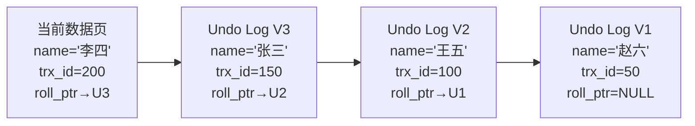
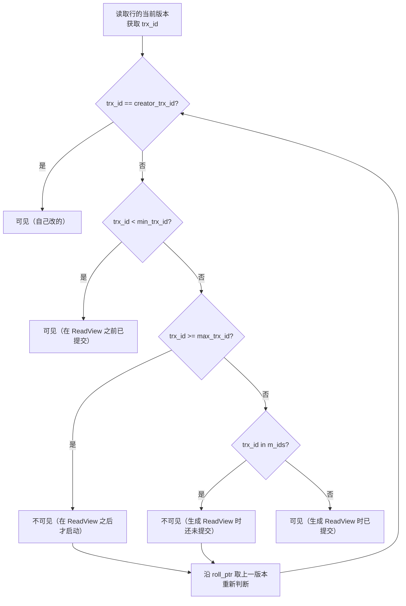
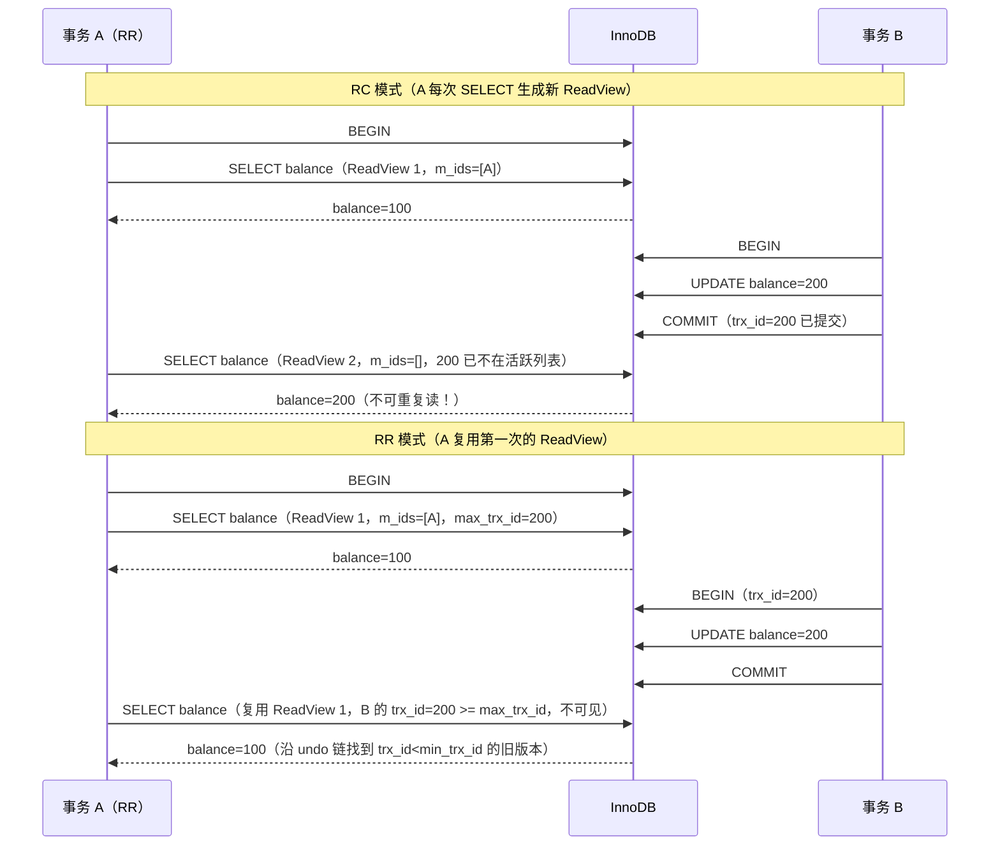
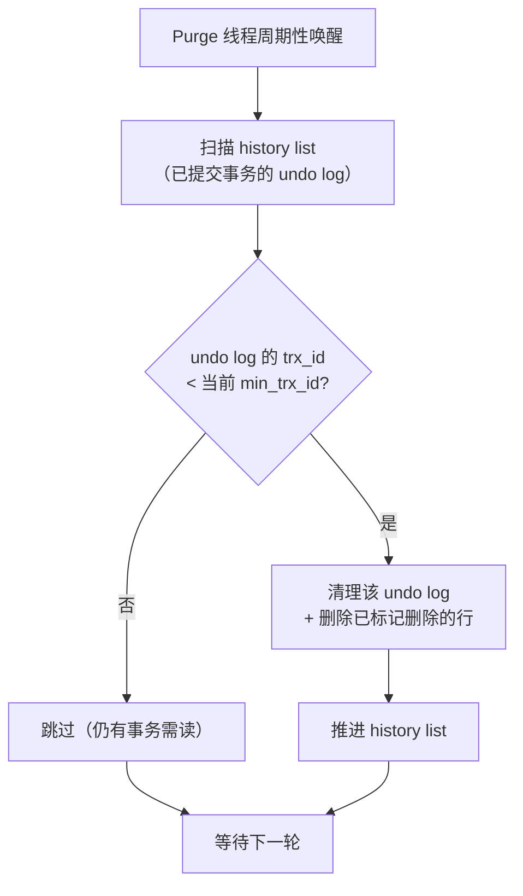

# 事务与 MVCC

> **一句话定位**：MVCC 是 MySQL 事务的灵魂，"讲讲 MVCC 原理"是资深面试的区分题，能讲到 ReadView 可见性算法与 Undo 版本链才算合格。
> **面试热度**：⭐⭐⭐⭐⭐
> **返回**：[MySQL 知识图谱](../README.md)

---

## 一、概念定义

### 1.1 ACID 四特性

事务是数据库操作的最小逻辑执行单元，要么全部成功要么全部回滚。InnoDB 是 MySQL 默认存储引擎，也是唯一支持事务的引擎（MyISAM 不支持）。ACID 是事务的四大保证：

| 特性 | 全称 | 含义 | InnoDB 实现机制 |
|------|------|------|----------------|
| A | Atomicity（原子性） | 事务内操作要么全做要么全不做 | **Undo Log**：回滚时按 undo log 反向补偿 |
| C | Consistency（一致性） | 事务前后数据满足约束（主键/外键/检查约束） | **业务约束 + AID 三者共同保证**：DB 层约束 + 应用层校验 |
| I | Isolation（隔离性） | 并发事务间互不干扰 | **锁 + MVCC**：写写用锁串行，读写用 MVCC 并发 |
| D | Durability（持久性） | 事务提交后数据不丢 | **Redo Log**：WAL 机制，crash 后可重放恢复 |

**关键区分**：一致性（C）是**目标**，AID 是**手段**。DB 只能保证"事务前后数据在 DB 层约束下一致"，但"业务一致性"（如转账后双方余额和不变）需要应用层配合——如果代码里扣了 A 的钱却忘了加给 B，DB 不会替你检查。这就是为什么 `@Transactional` 要配合正确的业务逻辑才能保证一致性。

### 1.2 并发问题四件套

当多个事务并发读写同一数据时，若不加隔离会出现以下问题：

| 问题 | 定义 | 示例 SQL |
|------|------|---------|
| 脏读（Dirty Read） | 事务 A 读到了事务 B **未提交**的修改，B 随后回滚，A 读到的是"脏"数据 | `B: UPDATE balance=200; A: SELECT balance(=200); B: ROLLBACK;` A 读到的 200 是不存在的 |
| 不可重复读（Non-Repeatable Read） | 事务 A 两次读同一行，中间事务 B **提交了修改**，A 两次读到的值不同 | `A: SELECT balance(=100); B: UPDATE balance=200; COMMIT; A: SELECT balance(=200);` 同一事务内同一行读出不同值 |
| 幻读（Phantom Read） | 事务 A 两次范围查询，中间事务 B **提交了插入/删除**，A 第二次查到的行数不同 | `A: SELECT COUNT(*) WHERE status=1(=10); B: INSERT status=1; COMMIT; A: SELECT COUNT(*) WHERE status=1(=11);` 行数变了像幻觉 |
| 丢失更新（Lost Update） | 事务 A 和 B 都基于同一初值更新，后提交的覆盖前者的修改 | `A: UPDATE balance=balance-50(=50); B: UPDATE balance=balance-30(=70);` B 覆盖 A，A 的扣减丢失 |

**脏读 vs 不可重复读 vs 幻读**：脏读读的是"未提交"数据（最严重）；不可重复读针对"同一行被修改"；幻读针对"行数变化（INSERT/DELETE）"。丢失更新在所有隔离级别下都需应用层防范（乐观锁/悲观锁），MySQL 隔离级别不直接解决。

### 1.3 四种隔离级别

SQL 标准定义四种隔离级别，从低到高解决上述并发问题：

| 隔离级别 | 解决脏读 | 解决不可重复读 | 解决幻读 | 性能 |
|---------|---------|--------------|---------|------|
| READ UNCOMMITTED（读未提交） | ❌ | ❌ | ❌ | 最高（几乎不用） |
| READ COMMITTED（读已提交，RC） | ✅ | ❌ | ❌ | 高 |
| REPEATABLE READ（可重复读，RR） | ✅ | ✅ | ✅（InnoDB 通过 Next-Key Lock） | 中 |
| SERIALIZABLE（串行化） | ✅ | ✅ | ✅ | 最低（加锁串行） |

**MySQL 默认隔离级别：RR**（可重复读）。`SELECT @@transaction_isolation;` 查看。与其他数据库（Oracle/PostgreSQL 默认 RC）不同，MySQL 选 RR 的历史原因：早期主从复制依赖 `binlog_format=statement`，RR 下 statement 格式能保证从库回放顺序一致（见 2.4）。

**InnoDB 在 RR 下额外解决幻读**：标准 SQL 的 RR 不解决幻读（只解决不可重复读），但 InnoDB 在 RR 下通过 **Next-Key Lock**（Gap Lock + Record Lock）在当前读时锁住间隙，阻止其他事务插入，从而避免幻读。这是 InnoDB 对 SQL 标准的增强。

### 1.4 范式与反范式（简要）

面试偶尔问，简要带过：

| 范式 | 要求 | 一句话 |
|------|------|--------|
| 1NF | 字段不可再分（每列原子值） | 不在一列里塞逗号分隔的列表 |
| 2NF | 非主键字段完全依赖主键（非部分依赖） | 联合主键时，非主键列不能只依赖主键的一部分 |
| 3NF | 非主键字段直接依赖主键（非传递依赖） | "订单表里不存商品名"——商品名依赖商品 ID，商品 ID 依赖订单 ID 是传递依赖 |
| BCNF | 主键字段不依赖非主键字段 | 3NF 的加强版，消除主属性间的依赖 |

**面试实践**：互联网公司普遍**反范式设计**——为了查询性能牺牲空间冗余（如订单表冗存商品名快照），因为：① JOIN 代价高；② 历史数据需快照（商品改名后历史订单仍显示旧名）。范式是理论基线，反范式是工程权衡。

---

## 二、原理与流程

### 2.1 MVCC 多版本并发控制

**MVCC 是什么**：Multi-Version Concurrency Control，多版本并发控制。让读写不互相阻塞——读操作读的是某个历史"快照版本"，写操作生成新版本，两者通过版本链隔离。InnoDB 在 RC 和 RR 下都走 MVCC（READ UNCOMMITTED 不需要 MVCC，直接读最新；SERIALIZABLE 不用 MVCC，全部加锁串行）。

**每行的三个隐藏列**：

| 隐藏列 | 字节数 | 含义 |
|--------|--------|------|
| `DB_TRX_ID` | 6 | 最近一次修改该行的事务 ID |
| `DB_ROLL_PTR` | 7 | 回滚指针，指向 undo log 中该行的上一版本 |
| `DB_ROW_ID` | 6 | 行 ID（无主键时 InnoDB 用它作聚簇索引键） |

每次 UPDATE/DELETE 一行，InnoDB 不会原地覆盖旧值，而是：①把旧值写入 undo log；②在数据页上写新值，更新 `DB_TRX_ID` 为当前事务 ID，`DB_ROLL_PTR` 指向刚写的 undo log。多次更新同一行，undo log 通过 `DB_ROLL_PTR` 串成链表——这就是**版本链**。

**Undo Log 版本链结构**：



图示：一行被事务 50/100/150/200 依次更新，当前页是 V4（name='李四'），undo 链保存 V3→V2→V1 三个历史版本。事务要读这行时，沿 `DB_ROLL_PTR` 遍历 undo 链，找到对自己"可见"的那个版本。

**ReadView（读视图）**：事务发起快照读时生成的一个"快照"，记录此刻哪些事务活跃、哪些已提交。ReadView 4 个核心字段：

| 字段 | 含义 |
|------|------|
| `creator_trx_id` | 创建该 ReadView 的事务 ID |
| `m_ids` | 生成 ReadView 时**仍活跃**的事务 ID 列表（未提交） |
| `min_trx_id` | `m_ids` 中的最小值 |
| `max_trx_id` | 下一个将分配的事务 ID（即当前最大事务 ID + 1） |

**ReadView 的存储**：InnoDB 把 ReadView 存在事务对象的 `read_view` 结构中（`trx0trx.h` 的 `trx_t::read_view`），全局活跃事务列表通过 `trx_sys->rw_trx_list` 维护。生成 ReadView 时加 trx_sys mutex 遍历活跃事务列表，拷贝到 `m_ids` 数组并排序，所以 `min_trx_id` 取最小值是 O(1) 操作。

**可见性判断算法**：访问某行时，沿 undo 链逐版本判断该版本的 `trx_id` 与 ReadView 的关系：



四种情况速记：
1. `trx_id == creator_trx_id` → **可见**（自己事务改的，当然可见）
2. `trx_id < min_trx_id` → **可见**（在 ReadView 生成前已提交）
3. `trx_id >= max_trx_id` → **不可见**（在 ReadView 生成后才启动的事务改的）
4. `min_trx_id <= trx_id < max_trx_id` 且 `trx_id in m_ids` → **不可见**（生成 ReadView 时该事务还活跃未提交）；若 `trx_id not in m_ids` → **可见**（已提交）

不可见时，沿 `DB_ROLL_PTR` 取 undo log 上一版本，重新走判断，直到找到可见版本或链尾（NULL）。

**可见性判断实例**：假设 ReadView 的 `m_ids=[100, 200]`，`min_trx_id=100`，`max_trx_id=300`，`creator_trx_id=150`。访问某行的 undo 链：

| 版本 | trx_id | 判断 | 结果 |
|------|--------|------|------|
| V4（当前） | 250 | `100 <= 250 < 300` 且 `250 not in [100,200]` | 可见（已提交） |
| V3 | 200 | `100 <= 200 < 300` 且 `200 in [100,200]` | 不可见（活跃未提交） |
| V2 | 150 | `150 == creator_trx_id` | 可见（自己改的） |
| V1 | 50 | `50 < 100` | 可见（ReadView 前已提交） |

本例 V4 已提交可见，直接返回 V4；若 V4 的 trx_id=100（在 m_ids 中），则不可见，回溯到 V3 再判断。

**可见性判断的性能考量**：MVCC 读 undo 链是**内存操作**（undo log 在 Buffer Pool 的 undo page 中），通常只需遍历 1-2 个版本即命中可见版本。但长事务会导致版本链变长（Purge 无法推进），极端情况下一行有几十个历史版本，每次读都要遍历，查询变慢——这是长事务危害性能的另一个视角。

### 2.2 RC vs RR 的 ReadView 生成时机差异

MVCC 的核心差异在于 ReadView 的生成时机：

| 隔离级别 | ReadView 生成时机 | 效果 |
|---------|------------------|------|
| RC（读已提交） | **每次 SELECT** 都生成新 ReadView | 每次能看到最新已提交数据 → 不可重复读 |
| RR（可重复读） | 事务**第一次 SELECT** 生成 ReadView，后续复用 | 同一事务内多次读结果一致 → 可重复读 |

**RC vs RR 时序对比**（两个并发事务操作同一行 balance 初值=100）：



**为什么 RC 叫"不可重复读"**：RC 下事务 A 两次 SELECT 之间，事务 B 提交了修改，A 的第二次 SELECT 生成新 ReadView 看到了 B 的修改——同一事务内同一行读出不同值，即"不可重复读"。RR 复用 ReadView，B 的修改对 A 不可见，所以可重复读。

**RR 的 ReadView 复用规则**：①事务内第一次快照读生成 ReadView；②后续所有快照读复用同一 ReadView；③若事务内执行了当前读（`FOR UPDATE`/`UPDATE`/`DELETE`），**不会**重新生成 ReadView（当前读直接读最新版本，不走 MVCC）；④事务内若只有 DML 没有 SELECT，则直到第一条 SELECT 才生成 ReadView。

### 2.3 快照读 vs 当前读

| 维度 | 快照读（Snapshot Read） | 当前读（Current Read） |
|------|----------------------|---------------------|
| 语句 | 普通 `SELECT` | `SELECT ... FOR UPDATE` / `SELECT ... LOCK IN SHARE MODE` / `UPDATE` / `DELETE` / `INSERT` |
| 读的版本 | MVCC 快照版本（ReadView 可见版本） | 最新版本 |
| 是否加锁 | 不加锁（读 undo 链历史版本） | 加锁（Next-Key Lock / Record Lock） |
| RR 下一致性 | 复用 ReadView，可重复读 | 每次读最新，可能看到别人提交 |

**RR 下的差异对比**：

```sql
-- 事务 A（RR）
BEGIN;
SELECT * FROM t WHERE id=1;          -- 快照读，读 ReadView 版本
-- 事务 B: UPDATE t SET name='X' WHERE id=1; COMMIT;
SELECT * FROM t WHERE id=1;          -- 快照读，仍读旧版本（可重复读）
SELECT * FROM t WHERE id=1 FOR UPDATE; -- 当前读，读到 name='X'（最新版本）+ 加锁
```

**关键陷阱**：RR 下事务 A 先快照读再当前读，可能"突然看到新数据"——这就是幻读的一种触发场景（见 2.4）。当前读用于需要保证"读到最新且加锁"的场景，如 `SELECT FOR UPDATE` 锁行后更新、`UPDATE` 必须基于最新值计算。

### 2.4 幻读的解决

**幻读定义回顾**：事务 A 两次范围查询，中间事务 B 插入新行并提交，A 第二次查到"多出来的行"像幻觉。

**RR 下 InnoDB 的双重防幻读**：

1. **快照读通过 MVCC 自然避免幻读**：RR 复用 ReadView，事务 B 插入的新行 `trx_id` 大于 `max_trx_id`，对 A 不可见——A 的快照读永远只看到 ReadView 生成时已存在的行。

2. **当前读通过 Next-Key Lock 避免幻读**：当前读（`SELECT ... FOR UPDATE` / `UPDATE` / `DELETE`）不仅锁命中的行，还锁住行之间的"间隙"（Gap Lock），阻止其他事务在间隙里 INSERT。`Next-Key Lock = Record Lock + Gap Lock`，锁住左开右闭区间 `(a, b]`。

**幻读的特殊场景（RR 下仍可能幻读）**：

```sql
-- 事务 A（RR）
BEGIN;
SELECT * FROM t WHERE id > 10;        -- 快照读，未加锁，假设返回 0 行
-- 事务 B: INSERT INTO t VALUES (11, 'X'); COMMIT;
SELECT * FROM t WHERE id > 10;        -- 快照读，仍返回 0 行（MVCC，B 的插入不可见）
UPDATE t SET name='Y' WHERE id > 10;  -- 当前读！UPDATE 必须找最新行，命中 B 插入的 id=11
SELECT * FROM t WHERE id > 10;        -- 快照读，现在返回 1 行（id=11）！幻读！
```

**原因**：`UPDATE`/`DELETE` 是当前读，会"看到"事务 B 插入的行并修改它。被当前读修改过的行，其 `trx_id` 被更新为事务 A 的 ID，之后事务 A 的快照读就能看到它（`trx_id == creator_trx_id` 可见）。这就是"先快照读后当前读触发幻读"的经典场景。

**另一种特殊场景**：事务 A 第一次快照读生成 ReadView，此时事务 B 还活跃（在 `m_ids` 中）；事务 B 提交后，事务 A 再次快照读——B 的修改仍不可见（ReadView 复用，B 在 `m_ids` 中就不可见）。只有事务 A 执行 `COMMIT` 后再开新事务，新事务的 ReadView 不含 B，才能看到 B 的修改——这属于新事务的正常读，不算幻读。

### 2.5 关键源码路径

| 模块 | 源码路径 | 职责 |
|------|---------|------|
| ReadView | `storage/innobase/read/read0read.cc` | ReadView 的创建、复用、可见性判断 |
| Undo Chain | `storage/innobase/trx/trx0undo.cc` | Undo log 的写入、版本链维护、Purge 清理 |
| 事务系统 | `storage/innobase/trx/trx0sys.cc` | 事务 ID 分配、活跃事务列表管理 |
| 行记录 | `storage/innobase/include/data0type.h` | 隐藏列 `DB_TRX_ID`/`DB_ROLL_PTR`/`DB_ROW_ID` 定义 |

**可见性判断入口**：`read0read.cc` 的 `ReadView::changes_visible(trx_id)` 方法，即上述四种情况的判定逻辑。Undo 链遍历在 `row0sel.cc` 的 `row_search_for_mysql` 中，沿 `DB_ROLL_PTR` 调用 `trx_undo_prev_version_build` 逐版本回溯。

### 2.6 Undo Log 物理结构

Undo Log 不是单一文件，而是存放在 **Undo Tablespace**（独立表空间，8.0 默认 `innodb_undo_directory=./`）中的回滚段（Rollback Segment）结构：

| 层级 | 结构 | 说明 |
|------|------|------|
| Undo Tablespace | 独立表空间文件 | 8.0 动态创建，`innodb_undo_tablespaces`（已废弃，8.0 自动管理） |
| Rollback Segment | 回滚段，每表空间 128 个 | `innodb_rollback_segments` 控制数量 |
| Undo Segment | 撤销段，每回滚段 1024 个 | 分配给事务 |
| Undo Log | 单个事务的 undo 记录链 | insert undo / update undo 两类 |

**8.0 Undo 表空间的改进**：8.0 之前 undo log 存在系统表空间（ibdata1）或独立 undo 表空间，无法动态收缩；8.0.14+ 支持自动 truncate undo 表空间（`innodb_undo_log_truncate=ON`），当 undo 表空间超过 `innodb_max_undo_log_size`（默认 1GB）时自动 truncate，解决了长事务后 undo 空间无法回收的痛点。

**两类 Undo Log**：

| 类型 | 何时生成 | 何时清理 | 用途 |
|------|---------|---------|------|
| insert undo | INSERT 操作 | 事务提交后立即可清理（无其他事务需读插入的行） | 仅用于事务回滚 |
| update undo | UPDATE/DELETE 操作 | 事务提交后由 Purge 线程清理（MVCC 可能需读旧版本） | 回滚 + MVCC 版本链 |

**关键**：insert undo 提交后可立即清理（插入的行对其他事务不可见，无需保留旧版本）；update undo 必须等"没有任何活跃事务的 ReadView 需要它"才能被 Purge 清理——这是长事务导致 undo 膨胀的根因。

**Undo Log 的物理记录格式**：update undo log 记录的是**旧值快照**（行的所有列旧值 + `DB_TRX_ID` + `DB_ROLL_PTR`），不是 SQL 语句。这与 binlog（记 SQL 或行变更）不同——undo 是物理逻辑混合日志（按行记录旧值，但不是页级别物理偏移），主要用于回滚与 MVCC 版本链。insert undo 只记录主键值（回滚时按主键删除即可），体积更小。

### 2.7 Purge 线程

Purge 线程负责清理不再被任何活跃事务需要的 undo log 与已标记删除的行记录。

**清理条件**：某 undo log 版本对应的事务 ID < 当前所有活跃事务 ReadView 的 `min_trx_id`——即没有任何活跃事务需要看到这个旧版本。

**Purge 流程**：



**关键参数**：
- `innodb_purge_batch_size`：每轮 Purge 清理的 undo log 页数（默认 300）
- `innodb_max_purge_lag`：history list 长度超过此值时延迟 DML 操作（默认 0 不延迟）
- `innodb_max_purge_lag_delay`：延迟上限（毫秒）

**长事务的危害（从 Purge 视角）**：长事务的 ReadView 让 `min_trx_id` 停留在旧值，Purge 线程无法推进——所有在该 ReadView 之后产生的 undo log 都不能清理，history list 持续增长，undo 表空间膨胀，查询需遍历更长的版本链变慢。这就是为什么监控 `information_schema.innodb_trx` 的 `trx_started` 时间至关重要。

### 2.8 SAVEPOINT 与嵌套事务

MySQL 原生支持 SAVEPOINT（保存点），允许在事务内部设置部分回滚点：

```sql
BEGIN;
INSERT INTO t VALUES (1);          -- 操作 1
SAVEPOINT sp1;                      -- 设置保存点
INSERT INTO t VALUES (2);          -- 操作 2
ROLLBACK TO SAVEPOINT sp1;          -- 回滚到保存点，操作 2 撤销，操作 1 保留
INSERT INTO t VALUES (3);          -- 操作 3
COMMIT;                             -- 提交操作 1 + 操作 3
```

**SAVEPOINT 与 Spring NESTED 传播行为的对应**：Spring 的 `@Transactional(propagation = Propagation.NESTED)` 底层即用 SAVEPOINT 实现——内层方法失败 `ROLLBACK TO SAVEPOINT`，外层事务可继续；外层回滚则全部回滚（包括内层已"提交"的保存点）。这与 `REQUIRES_NEW`（独立事务）不同：NESTED 的内层仍在外层事务内，只是多了部分回滚能力。

**注意**：SAVEPOINT 不是独立事务，不释放锁、不独立可见——`ROLLBACK TO SAVEPOINT` 只回滚 DML 操作，事务持有的锁不释放。若需独立提交/回滚，必须用 `REQUIRES_NEW`（新连接新事务）。

### 2.9 8.0 隔离级别参数变迁

| 版本 | 参数名 | 说明 |
|------|--------|------|
| 5.7 及以前 | `tx_isolation` | 已废弃 |
| 8.0 | `transaction_isolation` | 新参数名，语义清晰 |
| 8.0 | `transaction_read_only` | 替代 `tx_read_only` |

```sql
-- 8.0 查看隔离级别
SELECT @@transaction_isolation;
-- 设置隔离级别（会话级）
SET SESSION transaction_isolation = 'READ-COMMITTED';
-- 设置隔离级别（全局）
SET GLOBAL transaction_isolation = 'REPEATABLE-READ';
```

**与 RC 切换的配合**：8.0 切 RC 需同时确认 `binlog_format=row`（默认），否则 RC + statement 会导致主从不一致。

### 2.10 事务的可见性与 binlog 的关系

**RR 下 ReadView 与 binlog 的协作**：RR 事务的 ReadView 在第一次快照读生成，但 binlog 的写入时机是事务提交时。这意味着：

- **事务内的快照读**：基于 ReadView，与 binlog 无关。
- **事务提交时**：InnoDB 按提交顺序写 binlog，row 格式下记录每行的变更前后镜像。
- **从库回放**：从库按 binlog 顺序回放，row 格式下每行变更是幂等的（基于主键定位），不依赖事务隔离级别，所以 RC + row 能保证主从一致。

**statement 格式下 RR 的必要性**：statement 格式记录原始 SQL，从库回放时按 SQL 顺序执行。RC 下事务 A 和 B 可能交叉提交（A 的两条 SELECT 之间 B 提交了修改），statement 格式无法保证从库回放顺序与主库一致——可能导致主从数据不一致。RR 下事务内的 SELECT 复用 ReadView，结果稳定，statement 格式能保证主从一致。这就是 MySQL 默认 RR 的历史原因（5.7 之前默认 statement 格式）。

---

## 三、高频追问

### Q1: MVCC 解决了什么问题？Undo Log 版本链怎么工作？

**答**：MVCC 解决的是**读写并发冲突**——让读操作不加锁、不阻塞写，写操作也不阻塞读。原理是每行维护多个历史版本（通过 undo log 串联），读操作根据 ReadView 选择可见版本。Undo Log 版本链工作流程：①事务 UPDATE 一行时，先把旧值写入 undo log；②在数据页写新值，`DB_TRX_ID` 更新为当前事务 ID，`DB_ROLL_PTR` 指向新写的 undo log；③多次更新同一行，undo log 通过 `DB_ROLL_PTR` 串成链表；④读操作沿 `DB_ROLL_PTR` 遍历链表，找到对当前 ReadView 可见的版本返回。事务提交后，undo log 由 Purge 线程在无任何活跃事务需要时清理。

**追问：insert undo 和 update undo 有什么区别？** insert undo 在事务提交后立即可清理（插入的行对其他事务不可见，无需保留旧版本）；update undo 必须等 Purge 线程确认无活跃事务的 ReadView 需要它才能清理——这是长事务导致 undo 膨胀的根因。

### Q2: RR 下幻读完全解决了吗？举一个还能幻读的例子

**答**：没有完全解决。快照读通过 MVCC 自然避免幻读（ReadView 复用，新插入不可见），当前读通过 Next-Key Lock 避免幻读（锁住间隙阻止插入）。但**先快照读后当前读**会触发幻读：事务 A `SELECT WHERE id>10` 返回 0 行（快照读），事务 B 插入 `id=11` 并提交，事务 A 执行 `UPDATE WHERE id>10`（当前读）命中 B 插入的行并修改它，之后 A 再 `SELECT WHERE id>10` 返回 1 行（被当前读修改过的行 `trx_id` 变成 A，对 A 可见）。解法：事务开头直接用 `SELECT ... FOR UPDATE` 做当前读加锁，避免后续混合快照读。

### Q3: RC 和 RR 的 ReadView 生成时机差异？为什么 RC 叫不可重复读？

**答**：RC 每次 SELECT 都生成新 ReadView，RR 事务第一次 SELECT 生成后续复用。RC 叫不可重复读是因为：事务 A 两次 SELECT 之间事务 B 提交了修改，A 第二次 SELECT 生成新 ReadView，B 的事务 ID 已不在活跃列表（已提交），对 A 可见——同一事务内同一行读出不同值。RR 复用 ReadView，B 的 `trx_id >= max_trx_id`（在 ReadView 之后启动），对 A 不可见，所以可重复读。

### Q4: 为什么 MySQL 默认用 RR 而不是 RC？

**答**：历史原因——早期 MySQL 主从复制依赖 `binlog_format=statement`，记录原始 SQL 语句在从库回放。RR 下事务按提交顺序串行回放能保证主从一致；RC 下事务交叉提交，statement 格式无法保证从库回放顺序与主库一致（可能导致主从数据不一致）。所以 MySQL 选 RR 作默认，保证 statement 格式下主从安全。现代 MySQL 8.0 默认 `binlog_format=row`（记行变更而非 SQL），row 格式下 RC 也能保证主从一致，所以 RR 的历史优势消失。

### Q5: 8.0 之后为什么很多公司改用 RC？

**答**：三个原因：①**binlog row 格式成为默认**，RC 下主从复制也安全，RR 的历史优势消失；②**减少锁范围**——RR 下 Gap Lock 防幻读会锁住间隙，高并发写入时容易死锁；RC 没有 Gap Lock（只锁命中的行），锁范围小、死锁概率低；③**减少死锁**——Gap Lock 是 RR 下死锁的主因（两个事务互相持有对方需要的 Gap Lock），RC 无 Gap Lock 大幅降低死锁。代价是 RC 不防幻读，需应用层用乐观锁或 `SELECT FOR UPDATE` 补偿。互联网公司高并发写入场景普遍切 RC。

### Q6: 长事务为什么危险？

**答**：长事务（运行数分钟甚至数小时）有三个危害：①**Undo Log 膨胀**——事务活跃期间产生的所有 undo log 都不能被 Purge 线程清理（即使其他事务已提交，只要这个长事务的 ReadView 可能还需要旧版本），导致 undo 表空间持续增长、表空间碎片；②**历史版本堆积**——长事务的 ReadView 让被修改行的所有历史版本都保留在 undo 链中，其他事务查询时需遍历更长的版本链，查询变慢；③**锁占用**——长事务持锁时间长，阻塞其他事务、导致连接池耗尽。排查：`SELECT * FROM information_schema.innodb_trx WHERE TIME_TO_SEC(TIMEDIFF(NOW(), trx_started)) > 60;` 查超过 60 秒的事务。

---

## 四、实战关联（Java 后端视角）

### 4.1 Spring `@Transactional` 传播行为与 MySQL 事务

Spring `@Transactional` 的传播行为决定了业务方法如何参与 MySQL 事务：

| 传播行为 | 含义 | MySQL 事务表现 |
|---------|------|--------------|
| REQUIRED（默认） | 有事务加入，无则新建 | 两个方法共用同一 MySQL 事务（同一连接、同一 `trx_id`） |
| REQUIRES_NEW | 无条件新建事务 | 挂起当前事务，新开 MySQL 连接与事务，独立提交/回滚 |
| NESTED | 嵌套事务 | MySQL 层用 **SAVEPOINT** 实现，外层回滚则内层也回滚，内层回滚不影响外层 |
| SUPPORTS | 有事务加入，无则非事务执行 | 查询方法常用，无事务时走自动提交 |
| NOT_SUPPORTED | 非事务执行，挂起当前事务 | 强制非事务，如耗时日志记录 |
| MANDATORY | 必须在事务中，否则抛异常 | 强制调用方开事务 |
| NEVER | 必须非事务，否则抛异常 | 禁止在事务中调用 |

**关键陷阱：REQUIRES_NEW 与连接池**：`REQUIRES_NEW` 新开事务意味着从连接池获取**新连接**，若连接池配置过小（如 maximum-pool-size=10），业务方法嵌套调用 REQUIRES_NEW 可能耗尽连接池。生产建议连接池大小 ≥ 嵌套深度 × 并发量。

### 4.2 Spring 声明式事务失效场景

`@Transactional` 基于 AOP 代理，以下场景会失效：

| 失效场景 | 原因 | 解法 |
|---------|------|------|
| 方法非 `public` | Spring AOP 代理只拦截 public 方法 | 改为 public，或用 `TransactionTemplate` 编程式事务 |
| 自调用（`this.method()`） | AOP 代理无法拦截 `this` 内部调用 | 注入自身代理（`@Autowired self`）或用 `AopContext.currentProxy()` |
| 异常被 `catch` 吞掉 | Spring 通过检测抛出的异常决定回滚，异常被 catch 则认为正常 | catch 后手动 `TransactionAspectSupport.currentTransactionStatus().setRollbackOnly()` |
| `rollbackFor` 未配置 | 默认只回滚 `RuntimeException` 和 `Error`， checked 异常不回滚 | `@Transactional(rollbackFor = Exception.class)` 显式指定 |
| 数据库引擎不支持事务 | MyISAM 引擎无事务 | 确保用 InnoDB（MySQL 5.5+ 默认） |
| 传播行为 NOT_SUPPORTED | 显式非事务执行 | 检查传播行为配置 |

**自调用失效示例**：

```java
@Service
public class OrderService {
    @Transactional(rollbackFor = Exception.class)
    public void createOrder() {
        // 业务逻辑
        this.updateInventory();  // 事务失效！this 是原始对象非代理
    }
    
    @Transactional(propagation = Propagation.REQUIRES_NEW)
    public void updateInventory() {
        // 本应新开事务，但自调用走不到代理，与 createOrder 同一事务
    }
}
```

解法：注入自身代理 `@Autowired private OrderService self;` 后调用 `self.updateInventory()`。

### 4.3 长事务排查

**查活跃事务**：

```sql
-- 查所有活跃事务及运行时长
SELECT 
    trx_id,
    trx_state,
    trx_started,
    TIMESTAMPDIFF(SECOND, trx_started, NOW()) AS duration_seconds,
    trx_rows_modified,
    trx_mysql_thread_id
FROM information_schema.innodb_trx
ORDER BY trx_started ASC;
```

**查 Undo Log 体积**：

```sql
-- 查 undo 表空间大小
SELECT 
    space,
    ROUND(SUM(size) * 16 / 1024 / 1024, 2) AS undo_size_mb
FROM information_schema.innodb_sys_spaces
WHERE space IN (
    SELECT space FROM information_schema.innodb_sys_tablespaces 
    WHERE name LIKE '%undo%'
)
GROUP BY space;
```

**生产实践**：①监控 `innodb_trx` 表，超 60 秒告警；②Spring Boot Actuator 暴露事务指标；③`@Transactional` 加超时 `@Transactional(timeout = 30)`，超时自动回滚；④避免在事务内调用远程接口（RPC/HTTP），远程调用超时会拉长事务。

### 4.4 读写分离场景下的主从延迟

**问题**：主从复制是异步的，事务 A 在主库 INSERT 后立即在从库 SELECT，可能读不到（数据尚未同步到从库）。

**场景**：

```java
@Transactional
public void createAndQuery() {
    // 写主库
    orderMapper.insert(order);          // 主库
    // 读从库（若读写分离路由到从库）
    Order result = orderMapper.selectById(order.getId());  // 从库可能还没同步！
    // result 可能为 null
}
```

**解法**：①**强制走主库**——事务内的读全部路由到主库（ShardingSphere 的 `@Master` 注解、`@DS("master")`）；②**半同步复制**——主库写 binlog 后等至少一个从库 ack 才返回提交成功，降低延迟窗口（但牺牲性能）；③**业务层重试**——读不到时短延迟重试（不优雅，慎用）；④**读写分离策略**——写后立即读走主库，其他读走从库。

---

## 五、系统设计案例

### 案例 1：转账场景的并发安全设计

**题目**：设计一个转账接口，A 向 B 转 100 元，要求并发安全、不超卖、不重复扣款。

**3 分钟标准答法**：

1. **事务边界**：转账是两个 UPDATE（扣 A 加 B），必须在一个事务内，用 `@Transactional(rollbackFor = Exception.class)`。
2. **行锁保证并发**：先 `SELECT ... FOR UPDATE` 锁住 A 和 B 的账户行（当前读+加锁），防止其他并发事务同时修改。**加锁顺序统一**（如按账户 ID 升序），避免死锁。
3. **余额校验**：扣款前校验 A 的余额 ≥ 100，不足则抛异常回滚。
4. **幂等防重**：转账请求带 `request_id`（唯一索引），插入转账流水表，若 `request_id` 已存在则直接返回——防止网络重试导致重复扣款。

**SQL 示例**：

```sql
BEGIN;
-- 按账户 ID 升序加锁（防死锁）
SELECT balance FROM account WHERE id = LEAST(a_id, b_id) FOR UPDATE;
SELECT balance FROM account WHERE id = GREATEST(a_id, b_id) FOR UPDATE;
-- 余额校验
SELECT balance INTO @a_balance FROM account WHERE id = a_id;
IF @a_balance < 100 THEN ROLLBACK; RETURN '余额不足'; END IF;
-- 扣减加增加
UPDATE account SET balance = balance - 100 WHERE id = a_id;
UPDATE account SET balance = balance + 100 WHERE id = b_id;
-- 幂等流水
INSERT INTO transfer_log (request_id, from_id, to_id, amount) VALUES (...);
COMMIT;
```

**追问链**：
- Q: 为什么按账户 ID 升序加锁？ → 防止 A→B 和 B→A 两个并发转账互相死锁（A 锁了 a_id 等 b_id，B 锁了 b_id 等 a_id）。
- Q: `SELECT FOR UPDATE` 锁的是行还是表？ → 走主键索引锁行；若无索引则锁表（全表扫描加锁）。
- Q: 幂等表唯一索引冲突怎么办？ → `INSERT ... ON DUPLICATE KEY UPDATE` 或先 `SELECT` 判断，冲突说明已处理过，直接返回成功。
- Q: 跨库转账（A 和 B 在不同库）怎么办？ → 分布式事务：XA（强一致但慢）、TCC（最终一致）、本地消息表（异步保证最终一致）。
- Q: 高频小额转账性能瓶颈在哪？ → 行锁热点（热门账户被大量并发扣加），解法：分段锁（账户余额拆 N 个子账户）、异步入账。

### 案例 2：库存扣减超卖怎么办

**题目**：电商秒杀，100 件库存，1000 人并发抢购，如何防超卖？

**追问链式答法**（从简单到复杂，逐层追问）：

1. **第一层：SELECT FOR UPDATE（悲观锁）**
   ```sql
   BEGIN;
   SELECT stock FROM product WHERE id = 1 FOR UPDATE;  -- 锁行
   -- 若 stock > 0 则扣减
   UPDATE product SET stock = stock - 1 WHERE id = 1;
   COMMIT;
   ```
   - **问题**：行锁串行化，1000 人抢购只能一个一个来，TPS 极低。
   
2. **第二层：乐观锁版本号**
   ```sql
   UPDATE product SET stock = stock - 1, version = version + 1 
   WHERE id = 1 AND version = ? AND stock > 0;
   ```
   - **原理**：不加锁，UPDATE 时带版本号条件，失败则重试。
   - **问题**：高并发下大量 UPDATE 失败重试，DB 压力仍大；且 stock 检查在 SQL 里（`stock > 0`）依赖行锁保证原子性。
   
3. **第三层：Redis 预扣**
   - 秒杀前把库存加载到 Redis，`DECR stock` 原子扣减，返回值 ≥ 0 才下单。
   - **优势**：Redis 内存操作单线程串行，10 万+ QPS 无超卖。
   - **问题**：Redis 扣减成功但下单失败（用户弃单）需回滚库存。
   
4. **第四层：分段锁**
   - 100 件库存拆成 10 段（每段 10 件），10 个 Redis Key（`stock_0`~`stock_9`），并发请求 hash 到不同段，减少单 Key 热点。
   - **适用**：超高频秒杀（10 万+ QPS）。
   
**3 分钟标准答法**：秒杀防超卖分层——①Redis 预扣库存（`DECR` 原子操作，10 万 QPS）挡住绝大部分请求；②扣减成功的请求发 MQ 异步下单；③DB 层用 `UPDATE ... WHERE stock > 0` 兜底防超卖（乐观锁思路，无需 `FOR UPDATE`）；④唯一索引（user_id + activity_id）防重复下单。关键：Redis 挡流量、MQ 削峰填谷、DB 兜底。

**追问链**：
- Q: Redis 预扣成功但用户弃单怎么办？ → 下单超时（如 5 分钟未支付）自动回滚 Redis 库存。
- Q: Redis 挂了怎么办？ → Redis 集群保证高可用；降级方案是直接走 DB 乐观锁（牺牲性能保正确）。
- Q: DB 兜底的 `UPDATE WHERE stock > 0` 会锁表吗？ → 走主键索引锁行，不会锁表；但高并发下仍可能有行锁争用，所以 Redis 必须挡住 99% 流量。
- Q: 分段锁的库存如何对账？ → 定期汇总各段库存与 DB 总库存对账，段间库存可动态调配（某段售罄从其他段借）。

---

> **延伸阅读**：
> - 锁机制详见 [锁机制](../03-lock/lock-mechanism.md)（Record/Gap/Next-Key Lock 加锁规则、死锁排查）
> - 日志体系详见 [日志体系](../06-log/log-system.md)（Undo Log 物理结构、Redo Log、两阶段提交）
> - 查询优化详见 [查询优化与执行计划](../04-query/query-optimization.md)（Explain、慢查询排查）
