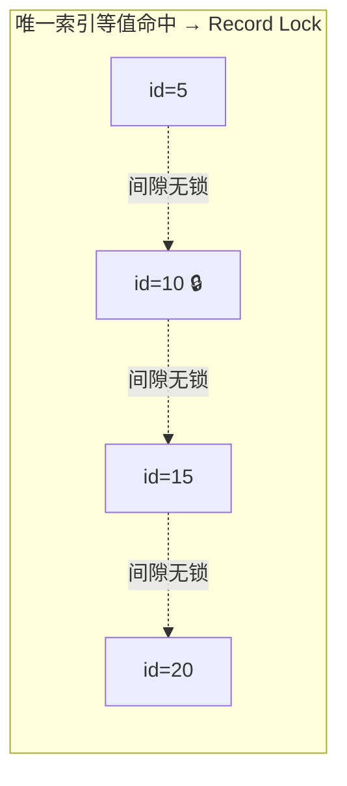
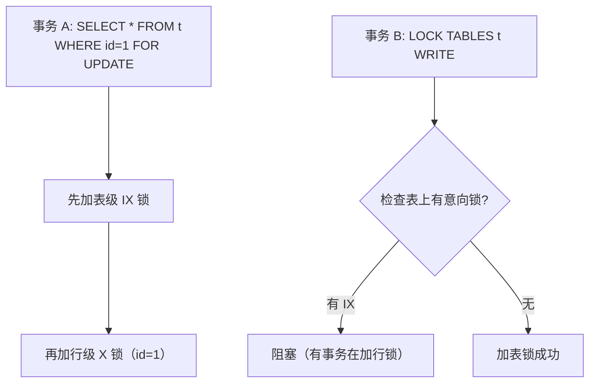
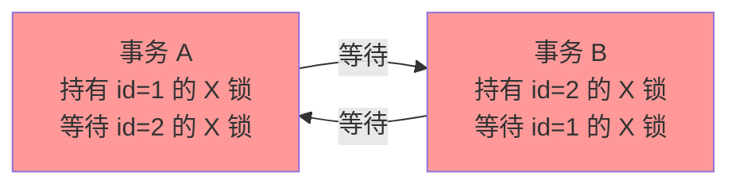

# 锁机制

> **一句话定位**：MySQL 锁是面试难点也是分水岭，"讲讲 SELECT FOR UPDATE 锁什么"能瞬间区分背八股与懂原理的候选人。
> **面试热度**：⭐⭐⭐⭐⭐
> **返回**：[MySQL 知识图谱](../README.md)

---

## 一、概念定义

### 1.1 锁的三层结构

MySQL 的锁从大到小分为三层：**全局锁**、**表级锁**、**行级锁**。不同层解决不同粒度的并发问题。

| 层级 | 锁类型 | 作用范围 | 典型场景 |
|------|--------|---------|---------|
| 全局锁 | `FLUSH TABLES WITH READ LOCK`（FTWRL） | 整个数据库 | 全库逻辑备份（mysqldump --single-transaction 用事务替代） |
| 表级锁 | 表锁（LOCK TABLES）/ MDL / 意向锁（IS·IX）/ AUTO-INC 锁 | 整张表 | DDL、表级读写控制 |
| 行级锁 | Record / Gap / Next-Key / 插入意向锁 | 行或间隙 | DML 并发控制（InnoDB 独有） |

**全局锁**：`FTWRL` 让整个库进入只读状态，阻塞所有 DML/DDL。用于全库备份，但现代生产用 `mysqldump --single-transaction`（MVCC 一致性快照）替代，避免锁全库。

**表级锁 vs 行级锁**：MyISAM 只支持表锁，DML 时锁整张表；InnoDB 支持行锁，DML 时只锁命中的行（走索引），并发度远高于 MyISAM。但 InnoDB 的"行锁"在条件不走索引时会退化为表锁（全表扫描每行都加锁）。

### 1.2 表级锁详解

| 表锁类型 | 作用 | 持续时间 | 兼容性 |
|---------|------|---------|--------|
| 表锁（LOCK TABLES） | 显式锁表读写 | 会话级，UNLOCK TABLES 释放 | 与所有锁互斥 |
| MDL（元数据锁） | 保护表结构不被并发修改 | 事务全程 | MDL_READ 间兼容，MDL_WRITE 与所有互斥 |
| 意向锁（IS/IX） | 标记事务"准备加行锁" | 事务全程 | IS/IX 互相兼容，与表 S/X 锁有兼容矩阵 |
| AUTO-INC 锁 | 自增列分配 | 短期（INSERT 完成即释放，或表级锁住） | 互斥 |

**意向锁的作用**：事务要加行锁前，先在表上加意向锁（IS 或 IX），这样其他事务想加表锁时，只需检查表上是否有意向锁，而不用遍历所有行锁——**意向锁是表锁快速判断"是否有行锁"的优化**。

### 1.3 行级锁详解

InnoDB 的行级锁是面试核心，四种类型：

| 行锁类型 | 锁定对象 | 触发场景 | 目的 |
|---------|---------|---------|------|
| Record Lock（记录锁） | 单行记录 | 唯一索引等值命中 | 防止其他事务修改/删除该行 |
| Gap Lock（间隙锁） | 索引区间（开区间 `(a,b)`） | RR 下范围查询或等值未命中 | 防止其他事务在间隙内 INSERT（防幻读） |
| Next-Key Lock（临键锁） | 记录 + 前面的间隙（左开右闭 `(a,b]`） | RR 下非唯一索引等值、范围查询 | Record + Gap 的组合，防幻读 |
| 插入意向锁 | 待插入位置 | INSERT 时若该位置被 Gap Lock 锁定 | 多事务插入同一 Gap 不同位置不冲突 |

**关键**：Record Lock 锁的是"行"，Gap Lock 锁的是"间隙"（两条记录之间的空隙），Next-Key Lock 是两者的组合。Gap Lock 与插入意向锁互斥——这是 RR 下防幻读的核心机制。

### 1.4 S/X/IS/IX 兼容矩阵

|  | IS | IX | S | X |
|--|----|----|---|---|
| **IS** | ✅ | ✅ | ✅ | ❌ |
| **IX** | ✅ | ✅ | ❌ | ❌ |
| **S** | ✅ | ❌ | ✅ | ❌ |
| **X** | ❌ | ❌ | ❌ | ❌ |

**速记**：①IS/IX 互相兼容（意向锁之间不冲突）；②S/X 与 IS/IX 的兼容性：IS 与 S 兼容、与 X 互斥，IX 与 S/X 都互斥（因为 S/X 是表级锁，会阻塞所有行操作）；③S 与 S 兼容（共享读），S 与 X 互斥，X 与 X 互斥。

**行级 S/X 锁的加锁语句**：
- `SELECT ... LOCK IN SHARE MODE` → 行 S 锁
- `SELECT ... FOR UPDATE` / `UPDATE` / `DELETE` → 行 X 锁
- `INSERT` → 行 X 锁 + 插入意向锁

### 1.5 悲观锁 vs 乐观锁

| 维度 | 悲观锁 | 乐观锁 |
|------|--------|--------|
| 思想 | 假设会冲突，先锁再操作 | 假设不冲突，提交时校验 |
| 实现 | `SELECT ... FOR UPDATE` | 版本号/时间戳 CAS |
| 并发度 | 低（串行化） | 高（无锁读） |
| 适用 | 写多冲突多 | 读多写少 |
| 冲突处理 | 等待锁 | 失败重试 |

**乐观锁 SQL 示例**：

```sql
UPDATE product SET stock = stock - 1, version = version + 1 
WHERE id = 1 AND version = ? AND stock > 0;
-- 返回 affected_rows=0 说明版本号不匹配（被别人改过），需重试
```

---

## 二、原理与流程

### 2.1 Record/Gap/Next-Key Lock 加锁规则（重点中的重点）

加锁规则是面试核心，能讲清"什么 SQL 加什么锁"才算合格。规则基于两个维度：**索引类型**（唯一 vs 非唯一）与**查询方式**（等值 vs 范围，命中 vs 未命中）。

**完整加锁规则表**（RR 隔离级别下）：

| 索引类型 | 查询方式 | 命中 | 加锁类型 | 锁定区间 |
|---------|---------|------|---------|---------|
| 唯一索引 | 等值 | ✅ 命中 | Record Lock | 命中行 |
| 唯一索引 | 等值 | ❌ 未命中 | Gap Lock | 命中位置前后的间隙 |
| 非唯一索引 | 等值 | ✅ 命中 | Next-Key Lock + 下一个 Gap | `(前一行, 命中行] + (命中行, 后一行)` |
| 非唯一索引 | 等值 | ❌ 未命中 | Gap Lock | 命中位置前后的间隙 |
| 唯一/非唯一 | 范围 | - | Next-Key Lock | `(起点, ...]` 到 `(终点前一行, 终点]` |
| 无索引 | 任意 | - | 全表 Next-Key Lock | 所有行+所有间隙（退化为表锁） |

**关键规则**：
1. **唯一索引等值命中**：退化为 Record Lock（只锁行，不锁间隙）——因为唯一性保证不会有重复值插入。
2. **唯一索引等值未命中**：退化为 Gap Lock（锁住查询值前后的间隙）——防止插入满足条件的值。
3. **非唯一索引等值命中**：Next-Key Lock + 下一个 Gap——因为有重复值，需防止在命中行前后插入相同值导致幻读。
4. **范围查询**：Next-Key Lock，锁住从起点到终点的所有行+间隙，左开右闭 `(a, b]`。
5. **无索引**：每行都加 Next-Key Lock，效果等同于表锁（全表锁）。

### 2.2 加锁案例图解

假设表 `t` 有 `id`（主键唯一索引）和 `c`（非唯一索引，有值 5, 10, 15, 20），RR 隔离级别：

**案例 1：唯一索引等值命中**

```sql
-- 事务 A
SELECT * FROM t WHERE id = 10 FOR UPDATE;
-- 加锁：id=10 的 Record Lock（只锁这一行）
```



事务 B 可以 INSERT id=7、id=12 等（间隙未锁），但不能 UPDATE/DELETE id=10。

**案例 2：唯一索引等值未命中**

```sql
-- 事务 A
SELECT * FROM t WHERE id = 12 FOR UPDATE;
-- 加锁：Gap Lock (10, 15)
```

```mermaid
flowchart LR
    subgraph "唯一索引等值未命中 → Gap Lock"
        R1["id=5"] -.->|无锁| R2["id=10"]
        R2 ===>|Gap Lock (10,15)| R3["id=15"]
        R3 -.->|无锁| R4["id=20"]
    end
```

事务 B 不能 INSERT id=11/12/13/14（落在 Gap 内），但可以操作 id=10 和 id=15。

**案例 3：非唯一索引等值命中**

```sql
-- 事务 A（c 是非唯一索引，有 5,10,15,20）
SELECT * FROM t WHERE c = 10 FOR UPDATE;
-- 加锁：Next-Key Lock (5, 10] + Gap Lock (10, 15)
```

```mermaid
flowchart LR
    subgraph "非唯一索引等值命中 → Next-Key + 下一Gap"
        R1["c=5"] ===>|Next-Key (5,10]| R2["c=10 🔒"]
        R2 ===>|Gap Lock (10,15)| R3["c=15"]
        R3 -.->|无锁| R4["c=20"]
    end
```

事务 B 不能 INSERT c=6/7/8/9/10/11/12/13/14（落在 `(5,15)` 内），因为非唯一索引可能有重复值，需防止插入 c=10 的行导致幻读。**这就是非唯一索引"多锁一个 Gap"的原因**。

### 2.3 意向锁的作用

意向锁（IS/IX）是表级锁，事务加行锁前先加意向锁：



**为什么需要意向锁**：没有意向锁时，事务 B 想加表锁需遍历所有行检查是否有行锁——O(N) 操作。有意向锁后，事务 A 加行锁前先在表上打标记（IS/IX），事务 B 只需检查表上是否有意向锁——O(1) 操作。意向锁是**行锁的快速冲突检测优化**。

### 2.4 MDL（元数据锁）

MDL 是 Server 层的表级锁，保护表结构不被并发修改。DML 自动加 MDL_READ，DDL 自动加 MDL_WRITE。

| 操作 | MDL 类型 | 持续时间 |
|------|---------|---------|
| SELECT / INSERT / UPDATE / DELETE | MDL_READ | 事务全程 |
| ALTER / DROP / TRUNCATE | MDL_WRITE | DDL 执行期间 |

**MDL 导致全表卡住的原理**（经典面试题）：

```mermaid
sequenceDiagram
    participant T1 as 事务 A（长事务 SELECT）
    participant T2 as 事务 B（DDL ALTER）
    participant T3 as 事务 C（SELECT）
    participant DB as InnoDB
    
    T1->>DB: BEGIN; SELECT * FROM t（持有 MDL_READ）
    Note over T1,DB: 事务 A 慢查询，未提交
    T2->>DB: ALTER TABLE t ADD COLUMN（需 MDL_WRITE）
    Note over T2,DB: MDL_WRITE 与 MDL_READ 互斥，阻塞
    T3->>DB: SELECT * FROM t（需 MDL_READ）
    Note over T3,DB: MDL_READ 与 MDL_WRITE 待定，排队等待 DDL
    T4->>DB: 所有后续 SELECT 都排队！
    Note over T4,DB: 全表"卡住"——DDL 阻塞了所有 DML
```

**根因**：MDL 队列是 FIFO，事务 A 的 MDL_READ 持有不放，事务 B 的 DDL（MDL_WRITE）排队等待；后续所有事务 C/D/E 的 SELECT（MDL_READ）虽与 A 兼容，但因 B 在前排队（FIFO），都被阻塞——**一个长事务 + 一个 DDL = 全表卡死**。

**解法**：①DDL 前检查 `information_schema.innodb_trx` 确认无长事务；②设 `lock_wait_timeout`（默认 31536000 秒）缩短 MDL 等待超时；③用 `gh-ost`/`pt-osc` 影子表方案避免在线 DDL 的 MDL 锁。

### 2.5 插入意向锁

插入意向锁是特殊的 Gap Lock，INSERT 时若待插入位置被 Gap Lock 锁定，则加插入意向锁等待。

| 兼容性 | Gap Lock | 插入意向锁 |
|--------|---------|-----------|
| Gap Lock | ❌（互斥） | ❌（Gap 阻止插入） |
| 插入意向锁 | ❌ | ✅（兼容） |

**关键**：多个事务的插入意向锁互相兼容——事务 A 插入 id=11、事务 B 插入 id=12，虽都在 Gap (10,15) 内，但互不阻塞。只有当 Gap Lock 已锁定该间隙时，插入意向锁才等待。

### 2.6 死锁

**死锁四条件**：①互斥（X 锁不可共享）、②持有并等待（持有 A 等 B）、③不可剥夺（锁不能被抢）、④循环等待（A 等 B、B 等 A）。

**死锁循环图**：



**MySQL 死锁处理**：
- **死锁检测**（`innodb_deadlock_detect=ON`，默认开）：InnoDB 主动检测循环等待，回滚 undo 量较少的事务（victim）。
- **锁等待超时**（`innodb_lock_wait_timeout=50`，默认 50 秒）：超时后放弃等待，返回 `ERROR 1205`。
- **查看死锁日志**：`SHOW ENGINE INNODB STATUS` 的 `LATEST DETECTED DEADLOCK` 段。

**死锁检测的性能代价**：高并发下死锁检测会消耗 CPU（每个等待的事务都检测循环），极端高并发（数百连接竞争同一行）可关闭检测 + 设短超时，但通常保持开启。

### 2.7 RR vs RC 下的锁差异

| 维度 | RR（可重复读） | RC（读已提交） |
|------|--------------|--------------|
| Gap Lock | ✅ 有（防幻读） | ❌ 无（除外键约束） |
| Next-Key Lock | ✅ 有 | 退化为 Record Lock |
| 锁范围 | 大（行+间隙） | 小（仅行） |
| 死锁概率 | 高（Gap Lock 交叉） | 低 |
| 幻读 | 防止 | 不防止 |

**8.0 切 RC 的锁优势**：RC 无 Gap Lock，锁范围大幅缩小——RR 下 `SELECT WHERE c>10 FOR UPDATE` 锁住所有 c>10 的行+间隙，RC 只锁命中的行。高并发写入下 RC 死锁概率显著低于 RR，这也是互联网公司切 RC 的主因之一。

### 2.8 关键源码路径

| 模块 | 源码路径 | 职责 |
|------|---------|------|
| 锁系统 | `storage/innobase/lock/lock0lock.cc` | 锁的申请、授予、检测、释放 |
| 死锁检测 | `lock0lock.cc` 的 `lock_deadlock_check()` | 循环等待检测 |
| 行锁 | `lock0lock.cc` 的 `lock_rec_lock()` | 行级锁授予 |
| 意向锁 | `lock0lock.cc` 的 `lock_table()` | 表级意向锁 |

**死锁检测入口**：`lock_deadlock_check_recursive` 沿等待图（wait-for graph）深度遍历，发现环即报死锁。victim 选择策略在 `lock_deadlock_select_victim` 中，优先回滚 undo 量少的事务（回滚代价小）。

---

## 三、高频追问

### Q1: SELECT ... FOR UPDATE 锁的是行还是表？

**答**：取决于查询条件是否走索引。若条件走索引（主键/唯一/二级索引），InnoDB 只锁命中的行（行锁）；若条件不走索引（全表扫描），InnoDB 对每行都加 Next-Key Lock，效果等同于表锁。例如 `WHERE id=1`（id 是主键）锁一行，`WHERE name='x'`（name 无索引）锁全表。**关键**：FOR UPDATE 必须走索引，否则是灾难性的表锁。

### Q2: 唯一索引等值命中加什么锁？未命中呢？

**答**：命中加 Record Lock（只锁该行，不锁间隙）——因为唯一性保证不会有第二个相同值插入，无需 Gap Lock。未命中加 Gap Lock（锁住查询值前后的间隙）——防止插入满足条件的值。例如 `WHERE id=10 FOR UPDATE`（id=10 存在）锁 id=10 一行；`WHERE id=12 FOR UPDATE`（id=12 不存在）锁 Gap (10,15)。

### Q3: 非唯一索引等值加什么锁？为什么多锁一个 Gap？

**答**：加 Next-Key Lock + 下一个 Gap。例如 `WHERE c=10 FOR UPDATE`（c 非唯一，有 5/10/15）锁 `(5,10] + (10,15)`。多锁一个 Gap 的原因是：非唯一索引可能有重复值，若只锁命中的行，其他事务可在命中行前后插入 c=10 的新行，导致当前读幻读。Gap Lock 阻止插入，保证 RR 下当前读的防幻读。

### Q4: 死锁怎么排查？怎么避免？

**答**：排查——①`SHOW ENGINE INNODB STATUS` 看 `LATEST DETECTED DEADLOCK` 段，含两个事务持有的锁与等待的锁；②根据锁信息反推 SQL，分析加锁顺序。避免——①**统一加锁顺序**（如按主键升序 FOR UPDATE）；②缩短事务（减少锁持有时间）；③避免 Gap Lock（切 RC 或走唯一索引）；④降低并发度。生产实践：代码 review 检查所有 `FOR UPDATE` 的调用顺序。

### Q5: innodb_lock_wait_timeout 和 innodb_deadlock_detect 的区别？

**答**：`innodb_lock_wait_timeout` 是**行锁等待超时**——事务等行锁超过此时间（默认 50 秒）放弃，返回 `ERROR 1205`，是被动超时。`innodb_deadlock_detect` 是**主动死锁检测**——InnoDB 实时检测循环等待，发现死锁立即回滚 victim（不等超时），是主动干预。两者配合：死锁检测秒级解决循环等待，锁等待超时兜底处理非死锁的长时间等待。

### Q6: 为什么 MDL 会导致全表卡住？

**答**：MDL 队列是 FIFO。长事务 A 的 SELECT 持有 MDL_READ 不释放，事务 B 的 DDL（需 MDL_WRITE）排队等待——MDL_WRITE 与 MDL_READ 互斥。后续所有事务 C/D/E 的 SELECT（MDL_READ）虽与 A 兼容，但因 B 在前排队（FIFO），都被阻塞。**一个长事务 + 一个 DDL = 全表卡死**。解法：DDL 前确认无长事务；设 `lock_wait_timeout` 缩短 MDL 超时；用 gh-ost 影子表避免在线 DDL。

### Q7: 乐观锁和悲观锁怎么选？

**答**：读多写少用乐观锁（无锁读、提交时 CAS 校验，冲突少时性能高）；写多冲突多用悲观锁（`FOR UPDATE` 串行化，冲突多时避免重试开销）。**经验法则**：冲突率 < 10% 用乐观锁，> 20% 用悲观锁，中间看场景。互联网秒杀场景：Redis 预扣（原子 DECR）+ DB 乐观锁兜底——Redis 挡 99% 流量，DB 只处理极少数冲突，用乐观锁足够。

---

## 四、实战关联（Java 后端视角）

### 4.1 Spring @Transactional + SELECT FOR UPDATE 的正确使用姿势

```java
@Service
public class OrderService {
    @Transactional(rollbackFor = Exception.class)
    public void deductStock(Long productId, int qty) {
        // 悲观锁：先锁行再更新
        Product p = productMapper.selectForUpdate(productId);
        if (p.getStock() < qty) {
            throw new BizException("库存不足");
        }
        productMapper.updateStock(productId, p.getStock() - qty);
    }
}
```

**关键点**：
1. `@Transactional` 必须在 `FOR UPDATE` 外层——锁在事务内持有，事务提交才释放。若没有事务，`FOR UPDATE` 执行完立即释放锁，毫无意义。
2. `FOR UPDATE` 必须走索引——`selectForUpdate(productId)` 按主键查询锁一行；若按无索引字段查询锁全表。
3. 锁持有时间 = 事务执行时间——事务内的 RPC/文件操作会拉长锁持有，应拆到事务外。
4. 锁顺序统一——多个 `FOR UPDATE` 按主键升序，避免死锁。

### 4.2 死锁案例：不同顺序更新

```java
// 事务 A
@Transactional
public void transferAtoB() {
    accountMapper.updateBalance(aId, -100);  // 锁 a_id
    accountMapper.updateBalance(bId, +100);  // 等 b_id
}

// 事务 B（并发）
@Transactional
public void transferBtoA() {
    accountMapper.updateBalance(bId, -100);  // 锁 b_id
    accountMapper.updateBalance(aId, +100);  // 等 a_id
}
// 死锁！A 持有 a 等 b，B 持有 b 等 a
```

**解法**：统一加锁顺序——所有转账都按账户 ID 升序加锁：

```java
@Transactional
public void transfer(Long fromId, Long toId, BigDecimal amount) {
    Long first = Math.min(fromId, toId);
    Long second = Math.max(fromId, toId);
    accountMapper.selectForUpdate(first);   // 先锁小的
    accountMapper.selectForUpdate(second);  // 再锁大的
    // 扣减加增加
}
```

### 4.3 @Transactional(isolation=...) 与 MySQL 隔离级别

```java
@Transactional(isolation = Isolation.READ_COMMITTED)
public void query() { ... }
```

| Spring Isolation | MySQL 隔离级别 | 锁行为 |
|-----------------|--------------|--------|
| DEFAULT | 用 MySQL 默认（RR） | RR 的 Gap Lock |
| READ_UNCOMMITTED | READ UNCOMMITTED | 无锁（脏读） |
| READ_COMMITTED | READ COMMITTED | 无 Gap Lock，只 Record Lock |
| REPEATABLE_READ | REPEATABLE READ | Next-Key Lock（默认） |
| SERIALIZABLE | SERIALIZABLE | 所有 SELECT 隐式加共享锁 |

**注意**：Spring 的 `Isolation.SERIALIZABLE` 会让普通 SELECT 也加共享锁（`LOCK IN SHARE MODE`），性能极差，生产几乎不用。

### 4.4 分布式锁：DB 行锁 vs Redis vs ZooKeeper

| 维度 | DB 行锁 | Redis（Redisson） | ZooKeeper |
|------|--------|-----------------|-----------|
| 实现 | `SELECT FOR UPDATE` | SET NX + 过期 | 临时顺序节点 |
| 性能 | 低（DB IO） | 高（内存） | 中 |
| 可靠性 | 高（ACID） | 中（主从切换丢锁） | 高（CP 一致性） |
| 公平性 | 非公平 | 非公平 | 公平（顺序节点） |
| 适用 | 与 DB 操作同事务 | 高并发短任务 | 强一致要求 |

**选型建议**：①与 DB 操作强绑定的锁用 DB 行锁（如扣库存）；②高并发短任务用 Redis（如秒杀预扣）；③强一致要求用 ZK/etcd（如选主）。

---

## 五、系统设计案例

### 案例 1：秒杀场景的库存扣减如何防超卖

**3 分钟标准答法**：

1. **Redis 预扣库存**：秒杀前把库存加载到 Redis，`DECR stock` 原子扣减，返回值 ≥ 0 才允许下单。Redis 单线程串行，10 万+ QPS 无超卖。挡住 99% 流量。
2. **DB 乐观锁兜底**：Redis 扣减成功的请求发 MQ 异步下单，DB 层用乐观锁 `UPDATE WHERE stock > 0` 兜底（无 `FOR UPDATE`，避免行锁串行）。
3. **唯一索引防重**：`(user_id, activity_id)` 唯一索引，防止重复下单。

**SQL 示例**：

```sql
-- DB 兜底（乐观锁，无需 FOR UPDATE）
UPDATE product SET stock = stock - 1 WHERE id = 1 AND stock > 0;
-- affected_rows=1 扣减成功，=0 库存不足
```

**追问链**：
- Q: Redis 预扣成功但用户弃单怎么办？ → 5 分钟未支付自动回滚 Redis 库存。
- Q: Redis 挂了怎么办？ → Redis 集群高可用；降级直走 DB 乐观锁（牺牲性能保正确）。
- Q: 为什么 DB 层不用 FOR UPDATE？ → 行锁串行化 TPS 极低，乐观锁无锁读+UPDATE 原子操作性能高，冲突少时（Redis 已挡 99%）几乎不重试。
- Q: 分段锁怎么做？ → 100 件库存拆 10 段（`stock_0`~`stock_9`），hash 到不同段减少热点。

### 案例 2：两事务互相死锁怎么排查

**场景**：线上报 `ERROR 1213 Deadlock found when trying to get lock; try restarting transaction`。

**排查步骤**：

1. **查看死锁日志**：

```sql
SHOW ENGINE INNODB STATUS\G
-- 找 LATEST DETECTED DEADLOCK 段
```

死锁日志示例（精简）：

```
*** (1) TRANSACTION:
UPDATE account SET balance=balance-100 WHERE id=2  -- 事务 A 等 id=2
*** (1) HOLDS THE LOCK(S): id=1  -- 事务 A 持有 id=1
*** (2) TRANSACTION:
UPDATE account SET balance=balance+100 WHERE id=1  -- 事务 B 等 id=1
*** (2) HOLDS THE LOCK(S): id=2  -- 事务 B 持有 id=2
*** WE ROLL BACK TRANSACTION (2)  -- victim 是事务 B（undo 少）
```

2. **分析加锁顺序**：事务 A 先锁 id=1 再等 id=2，事务 B 先锁 id=2 再等 id=1——循环等待。

3. **修复**：统一加锁顺序——所有转账按账户 ID 升序 `FOR UPDATE`：

```java
@Transactional
public void transfer(Long fromId, Long toId, BigDecimal amount) {
    Long first = Math.min(fromId, toId);
    Long second = Math.max(fromId, toId);
    accountMapper.selectForUpdate(first);   // 先锁小的
    accountMapper.selectForUpdate(second);  // 再锁大的
    // 扣减加增加
}
```

**追问链**：
- Q: 死锁检测回滚哪个事务？ → undo 量少的（回滚代价小），在 `lock_deadlock_select_victim` 中决定。
- Q: 死锁检测有性能代价吗？ → 高并发下检测消耗 CPU，极端场景可关检测 + 设短超时（`innodb_lock_wait_timeout=5`）。
- Q: 如何监控死锁频率？ → `SHOW GLOBAL STATUS LIKE 'Innodb_deadlocks'` 或 Prometheus 采集。
- Q: Gap Lock 导致的死锁怎么避免？ → 切 RC（无 Gap Lock）或走唯一索引（退化为 Record Lock）。
- Q: 死锁后业务怎么处理？ → 捕获 `DeadlockLoserDataAccessException`，指数退避重试。

---

> **延伸阅读**：
> - 事务与 MVCC 详见 [事务与 MVCC](../02-transaction/transaction-and-mvcc.md)（RR 下 Next-Key Lock 防幻读与 MVCC 的关系）
> - 查询优化详见 [查询优化与执行计划](../04-query/query-optimization.md)（Explain 与 FOR UPDATE 的锁分析）
> - 日志体系详见 [日志体系](../06-log/log-system.md)（Undo Log 与锁的回滚关系）
