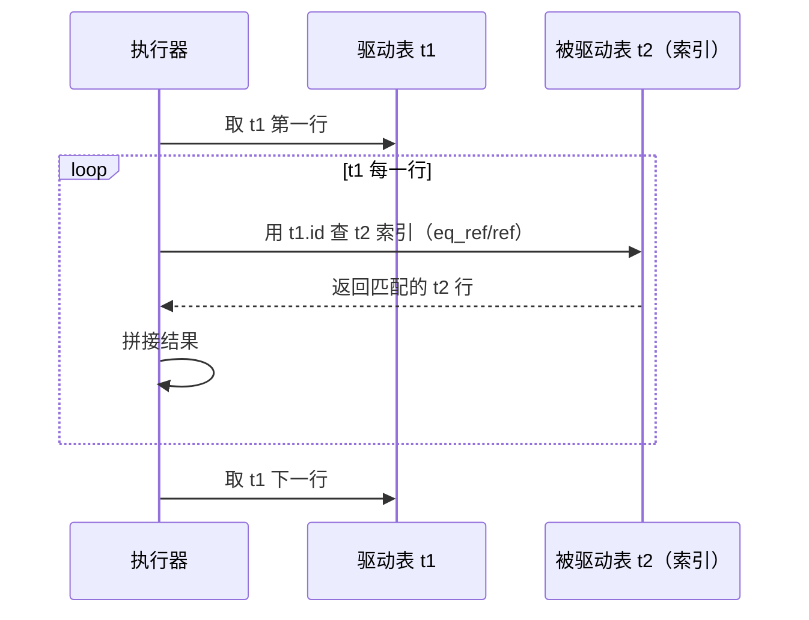
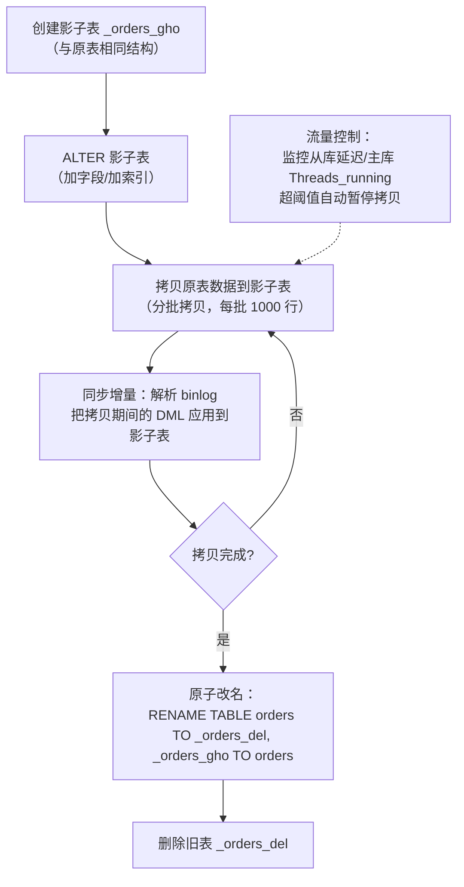

# 查询优化与执行计划

> **一句话定位**：慢查询排查是面试高频实战题，能讲清 Explain 12 字段与深分页优化才算合格后端
> **面试热度**：⭐⭐⭐⭐⭐
> **返回**：[MySQL 知识图谱](../README.md)

---

## 一、概念定义

### 1.1 SQL 执行流程

一条 SQL 从客户端发出到返回结果，经历以下阶段（8.0 移除了查询缓存）：


| 阶段 | 职责 | 关键点 |
|------|------|--------|
| 连接器 | TCP 连接、鉴权、线程管理 | `max_connections` 限制并发连接数；长连接占用内存 |
| 分析器 | 词法解析（识别表名/列名）、语法解析（生成解析树） | 语法错误在此阶段报出（`You have an error in your SQL syntax`） |
| 优化器 | 选择索引、决定 JOIN 顺序、子查询改写、生成执行计划 | **基于成本**估算（扫描行数、回表成本、排序成本） |
| 执行器 | 按执行计划调用存储引擎接口逐行获取数据 | 判断权限、调用 `handler::index_read`/`handler::rnd_next` |
| 存储引擎 | InnoDB 从 Buffer Pool / 磁盘读取索引页与数据页 | 行锁、MVCC、Buffer Pool 缓存都在此层 |

**8.0 移除查询缓存的原因**：查询缓存（Query Cache）在表数据变化时整张表的缓存失效，高并发写入场景下缓存命中率极低且维护开销大，成为性能瓶颈。8.0 直接移除，建议用 Redis 等外部缓存替代。

### 1.2 优化器的工作

优化器是 SQL 执行的大脑，基于**成本模型**选择执行计划：

| 优化内容 | 说明 | 示例 |
|---------|------|------|
| 选择索引 | 多个可用索引时，估算各索引扫描成本选最优 | `WHERE id=1 OR name='x'`，选 id（主键）还是 name（二级索引） |
| JOIN 顺序 | 多表 JOIN 时决定驱动表与被驱动表顺序 | 小表驱动大表 |
| 子查询改写 | IN 子查询改写为 Semi Join / 物化 | `WHERE id IN (SELECT ...)` |
| 排序优化 | 决定走索引排序还是 filesort | 索引有序时 `Using index`，否则 `Using filesort` |
| 聚合下推 | 5.7+ 聚合函数下推到存储引擎 | `COUNT(*)` 优化 |

**成本估算公式**：`成本 = IO 成本 + CPU 成本`。IO 成本按扫描页数 × `io_block_read_cost`（默认 1.0），CPU 成本按扫描行数 × `row_evaluate_cost`（默认 0.2）。优化器选成本最低的执行计划。

**优化器选错索引的常见原因**：①统计信息陈旧（`ANALYZE TABLE` 更新）；②数据分布不均（直方图 8.0+ 可辅助）；③SQL 写法误导（`OR`/`!=`/函数运算导致索引失效）；④参数 `optimizer_search_depth` 限制搜索深度。

**直方图（Histogram, 8.0+）**：当列数据分布不均（如 status 90% 是 'PAID'，10% 是 'PENDING'），优化器可能因不知道分布而选错索引。直方图记录列值的分布桶（最多 1024 桶），让优化器知道"status='PENDING' 只有 10% 数据"从而选对索引。创建：`ANALYZE TABLE orders UPDATE HISTOGRAM ON status WITH 100 BUCKETS;`。适用于：列无索引但有过滤条件、数据分布不均、优化器选错索引的场景。

**`ANALYZE TABLE` 的意义**：InnoDB 持久化统计信息（`innodb_stats_persistent=ON`，8.0 默认）存储在 `mysql.innodb_table_stats` 与 `mysql.innodb_index_stats` 表中。大批量写入后统计信息可能滞后，`ANALYZE TABLE` 强制重新采样更新。8.0 默认采样 20 页（`innodb_stats_persistent_sample_pages=20`），大表可调高提高精度但耗时更长。

### 1.3 Explain 的 12 个字段

`EXPLAIN` 是查看执行计划的工具，8.0 输出 12 个字段：

| 字段 | 含义 | 示例值 |
|------|------|--------|
| `id` | 查询序号，越大越先执行；相同则从上到下 | 1, 2 |
| `select_type` | 查询类型 | SIMPLE / PRIMARY / SUBQUERY / DERIVED / UNION |
| `table` | 涉及的表名 | t1, `<derived2>` |
| `partitions` | 分区表命中的分区 | NULL, p202401 |
| `type` | 访问类型（索引使用情况） | system > const > eq_ref > ref > range > index > ALL |
| `possible_keys` | 可能用到的索引 | PRIMARY, idx_name |
| `key` | 实际使用的索引 | PRIMARY |
| `key_len` | 使用的索引长度（字节） | 4, 8, 138 |
| `ref` | 索引比较的常量或列 | const, t2.id |
| `rows` | 估算扫描行数 | 1000 |
| `filtered` | 过滤后剩余比例（%） | 10.00 |
| `Extra` | 额外信息 | Using index / Using where / Using filesort |

**Explain 示例**：

```sql
EXPLAIN SELECT * FROM orders WHERE user_id = 100 AND status = 'PAID' ORDER BY create_time;
```

```
+----+-------------+--------+------------+------+---------------+-----------+---------+-------+------+----------+-----------------------+
| id | select_type | table  | partitions | type | possible_keys | key       | key_len | ref   | rows | filtered | Extra                 |
+----+-------------+--------+------------+------+---------------+-----------+---------+-------+------+----------+-----------------------+
|  1 | SIMPLE      | orders | NULL       | ref  | idx_user      | idx_user  | 8       | const |  120 |    10.00 | Using index condition |
+----+-------------+--------+------------+------+---------------+-----------+---------+-------+------+----------+-----------------------+
```

**解读**：`type=ref` 走索引等值查询，`key=idx_user` 用了 user_id 索引，`key_len=8`（bigint），`rows=120` 估算扫描 120 行，`filtered=10%` 过滤后约 12 行，`Extra=Using index condition` 用了 ICP 下推 status 条件到引擎层。

**EXPLAIN ANALYZE（8.0+）**：8.0 提供 `EXPLAIN ANALYZE` 输出实际执行耗时，比 `EXPLAIN` 的估算更精确：

```sql
EXPLAIN ANALYZE SELECT * FROM orders WHERE user_id = 100 AND status = 'PAID';
```

```
-> Index lookup on orders using idx_user (user_id=100)  (cost=25.2 rows=120)
    -> Filter: (orders.status = 'PAID')  (cost=25.2 rows=12) (actual time=0.12..0.35 rows=8 loops=1)
```

**区别**：`EXPLAIN` 输出估算值（`rows=120`），`EXPLAIN ANALYZE` 输出实际值（`actual rows=8`）和耗时（`actual time=0.12..0.35`）。用于验证优化器估算是否准确——若估算与实际差距大，说明统计信息需更新（`ANALYZE TABLE`）。

---

## 二、原理与流程

### 2.1 type 访问类型详解

`type` 是 Explain 中最重要的字段，反映索引使用的效率：

| 级别 | 含义 | 触发条件 | 示例 |
|------|------|---------|------|
| `system` | 表只有一行（系统表） | `SELECT * FROM mysql.proxies_priv` | 极少见 |
| `const` | 主键/唯一索引等值查询，最多返回一行 | `WHERE id = 1`（id 是主键） | 最高效 |
| `eq_ref` | JOIN 时被驱动表用主键/唯一索引等值匹配 | `JOIN t2 ON t1.id = t2.id` | JOIN 最优 |
| `ref` | 非唯一索引等值查询 | `WHERE name = 'x'`（name 有非唯一索引） | 常见且高效 |
| `range` | 索引范围扫描 | `WHERE id > 10`、`BETWEEN`、`IN` | 常见 |
| `index` | 扫描整个索引树（不回表） | `SELECT COUNT(*) FROM t`（走最小索引） | 比 ALL 好 |
| `ALL` | 全表扫描（不走索引） | 无索引或索引失效 | 最差，需优化 |

**性能分水岭**：`const`/`eq_ref`/`ref` 是优秀；`range` 是可接受；`index` 是次优；`ALL` 是需优化。生产中应避免 `ALL`，至少达到 `range` 级别。

**`ref` 与 `eq_ref` 的区别**：`eq_ref` 是 JOIN 时被驱动表用**唯一索引/主键**等值匹配（一对一），`ref` 是用**非唯一索引**等值匹配（一对多）。例如 `JOIN t2 ON t1.id=t2.id`（t2.id 是主键）→ t2 是 `eq_ref`；`WHERE name='x'`（name 非唯一索引）→ `ref`。

**`index` 与 `ALL` 的区别**：`index` 扫描整个索引树（叶子节点双向链表遍历），不回表；`ALL` 扫描聚簇索引（数据页），相当于全表扫描。`index` 比 `ALL` 快是因为索引树比数据页小（叶子只存索引列+主键）。典型 `index` 场景：`SELECT COUNT(*) FROM t`（优化器选最小索引扫描）、`SELECT id FROM t`（id 在二级索引叶子有覆盖）。

### 2.2 key_len 计算规则

`key_len` 表示使用的索引字段总长度，用于**判断联合索引用了几个列**：

**单列索引长度规则**：

| 数据类型 | key_len 计算 | 示例 |
|---------|-------------|------|
| `int` | 4 字节 | int → 4 |
| `bigint` | 8 字节 | bigint → 8 |
| `char(n)` utf8mb4 | 4n 字节 | char(10) → 40 |
| `varchar(n)` utf8mb4 | 4n + 2（变长） + 1（NULL） | varchar(10) NOT NULL → 42；varchar(10) 可 NULL → 43 |
| `date` | 3 字节 | date → 3 |
| `datetime` | 5 字节（5.6.4+） | datetime → 5 |
| `decimal(M,D)` | 整数部分 ÷ 9 × 4 + 余数；小数部分同理 | decimal(10,2) → 5 |

**联合索引 key_len 示例**：

假设联合索引 `idx(a, b, c)`，a 是 int，b 是 varchar(20) utf8mb4 NOT NULL，c 是 bigint：

| WHERE 条件 | key_len | 用了几列 |
|-----------|---------|---------|
| `WHERE a=1` | 4 | 1 列（a） |
| `WHERE a=1 AND b='x'` | 4 + 82 = 86 | 2 列（a, b） |
| `WHERE a=1 AND b='x' AND c=1` | 4 + 82 + 8 = 94 | 3 列（a, b, c） |
| `WHERE a=1 AND c=1` | 4 | 1 列（a，c 用 ICP） |

**关键用途**：通过 key_len 判断联合索引用了几列——若联合索引 (a,b,c) 的 key_len 只等于 a 的长度，说明 b 和 c 没用上（可能因范围查询终止或条件不连续）。

### 2.3 Extra 关键值详解

`Extra` 提供执行计划的额外信息，是判断查询效率的关键：

| Extra 值 | 含义 | 好坏 | 优化建议 |
|---------|------|------|---------|
| `Using index` | 覆盖索引，无需回表 | ✅ 最好 | 保持 |
| `Using where` | Server 层后过滤 | ⚠️ 可接受 | 看能否用索引覆盖过滤条件 |
| `Using index condition` | ICP 索引下推 | ✅ 好 | 5.6+ 已优化 |
| `Using temporary` | 用了临时表 | ❌ 需优化 | GROUP BY / DISTINCT / UNION 常见 |
| `Using filesort` | 额外排序 | ❌ 需优化 | 加排序字段到索引 |
| `Using join buffer` | BNL/BKA | ⚠️ 被驱动表无索引 | 给被驱动表 JOIN 列加索引 |

**`Using filesort` 不一定是磁盘排序**：filesort 在 `sort_buffer_size` 足够时是内存排序，不够才落临时表（磁盘排序）。但无论内存还是磁盘，都意味着**索引未覆盖排序字段**，需额外排序步骤——加 `ORDER BY` 字段到联合索引可消除。

**`Using temporary` 的常见场景**：`GROUP BY`、`DISTINCT`、`UNION` 需要临时表去重。若临时表超过 `tmp_table_size` 会落磁盘（`SHOW STATUS LIKE 'Created_tmp_disk_tables'` 查看）。

**`Using join buffer` 的含义**：JOIN 时被驱动表无索引，退化用 BNL（Block Nested Loop），把驱动表数据放 `join_buffer` 批量匹配。出现此值说明被驱动表 JOIN 列缺索引，需补索引把 BNL 优化为 NLJ。

**Extra 组合出现**：实际 EXPLAIN 中 Extra 可能有多个值同时出现，如 `Using index condition; Using where`——表示先用 ICP 下推到引擎层过滤，再在 Server 层用 WHERE 进一步过滤。读懂组合值才能精确判断查询的执行路径。

### 2.4 rows 与 filtered

| 字段 | 含义 | 用途 |
|------|------|------|
| `rows` | 优化器估算的扫描行数 | 判断扫描量，越小越好 |
| `filtered` | 过滤后剩余比例（%） | `实际返回行数 ≈ rows × filtered / 100` |

**`filtered` 的意义**：8.0 默认开启 `EXPLAIN FORMAT=JSON` 会输出更精确的 `rows_probed`。`filtered=10%` 意味着扫描 1000 行但只有 100 行满足条件——说明索引选择性不好，可考虑覆盖索引或调整查询。

### 2.5 JOIN 的实现

JOIN 是多表查询的核心，InnoDB 提供三种 JOIN 算法：

**1. Nested Loop Join（NLJ）**——被驱动表有索引时的标准算法：



**流程**：遍历驱动表 t1 每一行，用 t1 的 JOIN 列值查被驱动表 t2 的索引。若 t2 的 JOIN 列有索引，每次查 t2 是一次索引查找（B+树），效率高。

**NLJ 的成本公式**：`扫描行数 = t1.rows + t1.rows × t2单次索引查找行数`。若 t1 有 100 行，t2 索引查找每次 1 行，总扫描 100 + 100 = 200 行。若 t2 无索引退化 BNL，扫描行数 = t1.rows + t2.rows（全表扫一次）。

**2. Block Nested Loop（BNL）**——被驱动表无索引时：

| 步骤 | 操作 |
|------|------|
| 1 | 把驱动表 t1 的数据放入 `join_buffer` |
| 2 | 扫描被驱动表 t2 全表，与 join_buffer 中的 t1 批量匹配 |
| 3 | 返回匹配结果 |

**为什么用 BNL**：被驱动表无索引时，NLJ 需对 t1 每行全表扫描 t2——t1 有 N 行则 t2 扫 N 次。BNL 把 t1 放内存后只需扫 t2 一次，大幅减少扫描次数。但仍是全表扫描，**应给被驱动表 JOIN 列加索引**。

**join_buffer 的大小**：`join_buffer_size`（默认 256KB）控制 BNL 的缓冲区大小。若驱动表数据超过 join_buffer，BNL 会分批处理——先放 t1 的前 N 行进 buffer，扫 t2 一次匹配；再放下 N 行，再扫 t2——扫描 t2 次数 = `ceil(t1.rows / buffer容量的行数)`。调大 `join_buffer_size` 可减少 t2 扫描次数，但每个连接一个 buffer，过大导致内存浪费。

**3. Batched Key Access（BKA, 5.6+）**——NLJ 的批量优化：

| 步骤 | 操作 |
|------|------|
| 1 | 从 t1 取一批行的 JOIN 列值 |
| 2 | 对这批值排序（MRR） |
| 3 | 批量查 t2 索引，顺序回表（随机 IO → 顺序 IO） |

**三种 JOIN 算法对比**：

| 算法 | 被驱动表索引 | 优势 | 劣势 |
|------|-----------|------|------|
| NLJ | 有 | 逐行精确查找 | 每行一次随机 IO |
| BNL | 无 | 扫一次被驱动表 | 全表扫描 |
| BKA | 有 | 批量+MRR 顺序回表 | 需 `batched_key_access=on` |

**驱动表选择原则**：优化器基于 `rows` 估算选小表做驱动表——"小表驱动大表"。小表行数少，遍历次数少；大表有索引，每次查找快。若两张表都有索引，选过滤后行数少的做驱动。

### 2.6 子查询优化

子查询（Subquery）在 5.6+ 有大幅优化：

| 优化策略 | 说明 | 示例 |
|---------|------|------|
| Semi Join（半连接） | `IN` 子查询改写为 JOIN，只关心存在性 | `WHERE id IN (SELECT user_id FROM orders)` |
| Materialization（物化） | 子查询结果存为临时表，避免重复执行 | 子查询结果缓存为物化表 |
| EXISTS 改写 | `IN` 改写为 `EXISTS`，走外层索引 | `WHERE EXISTS (SELECT 1 FROM orders WHERE user_id=t.id)` |
| FirstMatch | 对每个外层行只匹配子查询一次 | 5.6+ Semi Join 的策略之一 |

**`IN` 子查询执行方式**：5.6+ 物化为临时表 → 转 JOIN；5.5 及以前是逐行执行子查询（相关子查询），性能极差。

**建议**：优先用 `JOIN` 替代 `IN` 子查询；若子查询结果集大，用 `EXISTS`（走外层索引）；`NOT IN` 在 8.0 仍有优化空间，大表建议改 `LEFT JOIN ... WHERE ... IS NULL`。

**Semi Join 的执行方式**：8.0 Semi Join 有 4 种策略——①`FirstMatch`：对外层每行只匹配子查询一次，找到即跳过；②`LooseScan`：子查询索引去重后扫描；③`Materialization`：子查询物化为临时表，外层 JOIN；④`DuplicateWeedout`：JOIN 后去重。优化器根据成本选策略，`EXPLAIN` 的 `Extra` 会显示 `Using where; FirstMatch(t1)` 等。

### 2.7 排序优化

`ORDER BY` 的两种执行路径：

**路径 1：索引有序（Using index）**——排序字段在索引中，天然有序，无需额外排序：

```sql
-- 联合索引 (user_id, create_time)
SELECT * FROM orders WHERE user_id=1 ORDER BY create_time;
-- Extra: Using index condition（索引已含 create_time，无需 filesort）
```

**路径 2：filesort**——排序字段不在索引中，需额外排序：

| filesort 算法 | sort_buffer 存什么 | 特点 |
|--------------|-------------------|------|
| 单路（one-pass） | 完整行数据 | 排序后直接返回，但占用内存大 |
| 双路（two-pass） | 排序字段 + 行指针 | 排序后回表取数据，内存占用小但多一次 IO |

**`sort_buffer_size` 调优**：控制内存排序区大小（默认 256KB）。排序数据超过此值则落临时表（磁盘排序），性能骤降。生产建议设 1-4MB，但不要太大（每个连接一个 sort_buffer，过大导致内存浪费）。

**优化 `Using filesort`**：①把 `ORDER BY` 字段加入联合索引；②`SELECT` 只查需要的列（减少单路排序内存占用）；③限制结果集（`LIMIT`）减少排序数据量。

**filesort 的优先队列优化**：8.0 对带 `LIMIT` 的排序用优先队列（堆排序）而非全排序——只需维护 TOP N 的堆，而非对全部数据排序。例如 `ORDER BY score DESC LIMIT 10`，只需维护 10 元素的最大堆，扫描一遍数据即可，复杂度 O(N log 10) 而非 O(N log N)。

**GROUP BY 优化**：8.0 默认 `group_by_optimizer=ON`，GROUP BY 走索引有序时无需临时表（`Using index for group-by`）。若 GROUP BY 字段无索引，用临时表（`Using temporary`）——可通过加联合索引消除。

### 2.8 分页优化

**`LIMIT 1000000, 10` 为什么慢**：MySQL 会扫描前 1000010 行，丢弃前 100 万行，只返回最后 10 行——扫描代价在"丢弃的 100 万行"上。

**三种分页优化方案**：

| 方案 | SQL | 原理 | 适用场景 |
|------|-----|------|---------|
| 延迟关联 | `SELECT * FROM t INNER JOIN (SELECT id FROM t WHERE ... ORDER BY ... LIMIT 1000000,10) tmp ON t.id=tmp.id` | 子查询走覆盖索引只拿主键，再 JOIN 回表 | 通用，推荐 |
| 游标分页 | `WHERE id > #{last_id} ORDER BY id LIMIT 10` | 直接跳到上一页末尾的 id | 翻页连续，要求有序无断点 |
| 预计算/汇总表 | 提前计算分页偏移存汇总表 | 避免实时扫描 | 超大数据量 |

**延迟关联 SQL 示例**：

```sql
-- 原始慢查询
SELECT * FROM orders WHERE status='PAID' ORDER BY create_time LIMIT 1000000, 10;
-- 延迟关联优化
SELECT * FROM orders o
INNER JOIN (
    SELECT id FROM orders WHERE status='PAID' ORDER BY create_time LIMIT 1000000, 10
) tmp ON o.id = tmp.id;
```

**原理**：子查询 `SELECT id` 走覆盖索引（`idx(status, create_time)` 含 id），只扫描索引不回表，拿 10 个主键后 JOIN 回表 10 行——从"扫描 100 万行回表"变成"扫描 100 万行索引（不回表）+ 回表 10 行"。

**游标分页 SQL 示例**：

```sql
-- 第一页
SELECT * FROM orders WHERE status='PAID' ORDER BY id ASC LIMIT 10;
-- 后续页（传入上一页最后一条的 id）
SELECT * FROM orders WHERE status='PAID' AND id > #{last_id} ORDER BY id ASC LIMIT 10;
```

**游标分页的限制**：①不能跳页（只能上一页/下一页）；②要求排序字段有序且无断点（主键自增最佳）；③若有删除导致 id 断点不影响正确性（`id > last_id` 跳到下一个存在的值）。

### 2.9 大表 DDL

**Online DDL 的三个阶段**：

| 方式 | 版本 | 原理 | 阻塞 | 适用 |
|------|------|------|------|------|
| copy | 5.5 之前 | 创建临时新表 → 拷贝数据 → 改名 | DML 全程阻塞 | 已淘汰 |
| inplace | 5.6+ | 在原表上修改（部分操作不拷数据） | 可能短暂阻塞 | 加索引、加列 |
| instant | 8.0+ | 只修改元数据，不动数据 | 不阻塞 | 末尾加列、删列、改默认值 |

**instant DDL 支持的操作**（8.0.12+）：①末尾加列；②删列（8.0.29+）；③修改列默认值；④重命名列。这些操作只改 `.frm`/`.sdi` 元数据，瞬间完成。

**inplace DDL 的阶段**（以加索引为例）：
1. **prepare**：加 MDL_WRITE 锁，创建日志表（短暂阻塞 DML）
2. **execute**：扫描数据构建索引（允许 DML 并发，记录变更到日志表）
3. **commit**：apply 日志表中的变更，加 MDL 锁切换（短暂阻塞 DML）

**gh-ost / pt-osc 影子表方案**：

| 工具 | 原理 | 优势 |
|------|------|------|
| gh-ost | 创建影子表 → 拷贝数据 → binlog 同步增量 → 改名 | 不用触发器，对主库压力小 |
| pt-osc | 创建影子表 → 触发器同步增量 → 改名 | 成熟稳定，但触发器有性能影响 |

**DDL 期间 MDL 锁阻塞链**：DDL 需 MDL_WRITE，若有长事务持有 MDL_READ，DDL 排队等待；后续所有 DML 因 FIFO 排在 DDL 后面也被阻塞——全表卡死（详见 [锁机制](../03-lock/lock-mechanism.md) 2.4 节 MDL）。

**DDL 操作的成本估算**：

| DDL 类型 | inplace 支持 | instant 支持（8.0） | 成本 |
|---------|-------------|-------------------|------|
| 加索引 | ✅ | ❌ | 扫描全表构建索引树 |
| 末尾加列 | ✅ | ✅（8.0.12+） | instant 瞬间；inplace 需修改所有行 |
| 中间加列 | ✅ | ❌ | inplace 重建表 |
| 删列 | ✅ | ✅（8.0.29+） | inplace 重建表 |
| 改列类型 | ✅ | ❌ | 重建表 + 数据转换 |
| 改默认值 | ✅ | ✅ | instant 只改元数据 |
| 重命名列 | ✅ | ✅（8.0+） | instant 只改元数据 |

**生产 DDL 检查清单**：①确认无长事务（`SELECT * FROM information_schema.innodb_trx WHERE TIME_TO_SEC(TIMEDIFF(NOW(), trx_started)) > 60`）；②设 `lock_wait_timeout=30`（MDL 等待超时 30 秒）；③低峰期执行；④大表用 gh-ost；⑤备库先执行验证。

### 2.10 关键源码路径

| 模块 | 源码路径 | 职责 |
|------|---------|------|
| 优化器 | `sql/sql_optimizer.cc` | 执行计划生成、成本估算、JOIN 顺序 |
| 执行器 | `sql/sql_executor.cc` | 按 执行计划调用存储引擎接口 |
| JOIN | `sql/join_optimizer/*` | 8.0 Hypergraph 优化器 |
| filesort | `sql/filesort.cc` | 排序实现（单路/双路） |
| Explain | `sql/explain_format.cc` | 执行计划输出 |

**8.0 优化器改进**：8.0.20+ 引入 Hypergraph 优化器（`optimizer_switch=hypergraph_optimizer=on`），替代传统的贪心算法，支持更复杂的 JOIN 重排。

---

## 三、高频追问

### Q1: type 的级别有哪些？ref 和 eq_ref 区别？

**答**：从高到低 7 级：`system > const > eq_ref > ref > range > index > ALL`。`const` 是主键/唯一索引等值查（最多一行）；`eq_ref` 是 JOIN 时被驱动表用**唯一索引/主键**等值匹配（一对一）；`ref` 是**非唯一索引**等值匹配（一对多）。区别：`eq_ref` 唯一索引一对一，`ref` 非唯一索引一对多。生产中 JOIN 应让被驱动表的 JOIN 列是主键/唯一索引（达到 `eq_ref`）。

### Q2: key_len 怎么算？有什么用？

**答**：key_len 是使用的索引字段总长度。计算：int=4、bigint=8、char(n) utf8mb4=4n、varchar(n) utf8mb4 NOT NULL=4n+2、可 NULL 再+1。用途：判断联合索引用了几列——若联合索引 (a,b,c) 的 key_len 只等于 a 的长度，说明 b、c 没用上。例如 `idx(int, varchar(20), bigint)`，`WHERE a=1 AND b='x'` 的 key_len = 4 + 82 = 86，说明用了 2 列。

### Q3: Extra 里 Using filesort 怎么优化？

**答**：`Using filesort` 说明排序字段不在索引中，需额外排序。优化：①把 `ORDER BY` 字段加入联合索引（最直接）；②`SELECT` 只查需要的列减少 sort_buffer 占用；③限制 `LIMIT` 减少排序数据量；④调大 `sort_buffer_size`（1-4MB）。例如 `WHERE user_id=1 ORDER BY create_time`，建联合索引 `(user_id, create_time)` 可让排序走 `Using index` 消除 filesort。

### Q4: JOIN 时怎么选驱动表？被驱动表没索引会怎样？

**答**：优化器基于 `rows` 估算选**小表**做驱动（小表驱动大表）——小表行数少遍历次数少，大表有索引每次查找快。被驱动表没索引会退化为 BNL（Block Nested Loop）：把驱动表放 join_buffer，全表扫描被驱动表批量匹配——比 NLJ 慢但比逐行全表扫好。**解法**：给被驱动表的 JOIN 列加索引，把 BNL 变成 NLJ。

### Q5: LIMIT 1000000, 10 怎么优化？

**答**：三种方案。①**延迟关联**——子查询走覆盖索引只拿主键，再 JOIN 回表 10 行；②**游标分页**——`WHERE id > #{last_id} ORDER BY id LIMIT 10`，直接跳到上一页末尾（不能跳页，要求有序）；③**预计算**——提前计算分页偏移存汇总表。推荐延迟关联，通用且性能好：从"扫描 100 万行回表"变成"扫描 100 万行索引（不回表）+ 回表 10 行"。

### Q6: 大表加索引会锁表吗？怎么办？

**答**：5.6+ 支持 Online DDL（inplace 方式），加索引期间允许 DML 并发，但有短暂 MDL 锁阻塞（prepare/commit 阶段）。8.0 部分 DDL 支持 instant（瞬间完成）。大表加索引的风险：①MDL 锁阻塞链（长事务 + DDL = 全表卡死）；②构建索引期间消耗 CPU/IO；③row log 应用阶段可能慢。**生产推荐**：用 `gh-ost` 或 `pt-osc` 影子表方案——创建影子表拷贝数据，binlog/触发器同步增量，最后原子改名，不阻塞线上 DML。

**追问：gh-ost 的流量控制怎么做？** gh-ost 通过 `throttle-control-replicas` 参数控制拷贝速度——监控从库延迟，超过阈值自动暂停拷贝。生产建议设 `max-load=Threads_running=50`（主库活跃线程超 50 暂停）。

### Q7: SELECT COUNT(*) 慢怎么办？

**答**：InnoDB 的 `COUNT(*)` 需扫描整表或最小索引（不像 MyISAM 有计数器）。优化：①**选最小索引**——优化器自动选最小的二级索引扫描（`COUNT(*)` 比 `COUNT(列)` 快，因为 `COUNT(*)` 不检查 NULL 可选最小索引）；②**近似计数**——`SHOW TABLE STATUS LIKE 't'` 的 `Rows` 字段（估算值，有 10-50% 偏差）；③**汇总表**——触发器/应用层维护计数，查询时直接读汇总表；④**Redis 计数**——写入时 Redis INCR，查询读 Redis（需保证一致性）。生产推荐汇总表 + 定期对账。

---

## 四、实战关联（Java 后端视角）

### 4.1 MyBatis PageHelper 深分页慢查询

MyBatis 的 `PageHelper` 插件自动生成 `LIMIT` 分页 SQL，深分页时产生慢查询：

```java
// PageHelper 深分页
PageHelper.startPage(100000, 10);  // 第 10 万页，每页 10 条
List<Order> orders = orderMapper.selectByStatus("PAID");
// 生成的 SQL: SELECT * FROM orders WHERE status='PAID' LIMIT 999990, 10
// 扫描 100 万行丢弃，极慢
```

**改写为延迟关联**：

```java
// 手动延迟关联
List<Long> ids = orderMapper.selectIdsByStatus("PAID", offset, limit);
// SELECT id FROM orders WHERE status='PAID' ORDER BY id LIMIT 999990, 10
List<Order> orders = orderMapper.selectByIds(ids);
// SELECT * FROM orders WHERE id IN (...)
```

**或游标分页**：

```java
// 游标分页（传入上一页最后一条 id）
List<Order> orders = orderMapper.selectByStatusAfterId("PAID", lastId, 10);
// SELECT * FROM orders WHERE status='PAID' AND id > #{lastId} ORDER BY id LIMIT 10
```

### 4.2 慢查询日志 + pt-query-digest

**开启慢查询日志**：

```ini
# my.cnf
slow_query_log = ON
slow_query_log_file = /var/log/mysql/slow.log
long_query_time = 1          # 超过 1 秒记录
log_queries_not_using_indexes = ON  # 记录未走索引的查询
```

**pt-query-digest 分析**：

```bash
# 分析慢查询日志，按总耗时排序
pt-query-digest /var/log/mysql/slow.log > slow_report.txt

# 输出示例（精简）
# Rank 1: SELECT * FROM orders WHERE user_id=? AND status=?
#   Calls: 1200, Total: 350s, Avg: 0.29s
#   EXPLAIN: type=ALL, key=NULL, rows=1000000
```

**排查链路**：①`pt-query-digest` 按总耗时排序找 TOP N 慢查询；②逐条 `EXPLAIN` 分析 type/key/rows/Extra；③针对性加索引/改写 SQL/改架构。

**performance_schema 替代方案（8.0）**：8.0 可用 `performance_schema.events_statements_summary_by_digest` 实时查看慢查询，无需解析日志文件：

```sql
-- 查 TOP 10 慢查询（按平均耗时）
SELECT 
    DIGEST_TEXT,
    COUNT_STAR AS exec_count,
    ROUND(AVG_TIMER_WAIT/1000000000, 2) AS avg_ms,
    ROUND(SUM_TIMER_WAIT/1000000000, 2) AS total_ms
FROM performance_schema.events_statements_summary_by_digest
WHERE DIGEST_TEXT IS NOT NULL
ORDER BY AVG_TIMER_WAIT DESC
LIMIT 10;
```

**优势**：实时采集、无需文件解析、可按平均/总耗时/执行次数多维度排序。配合 Prometheus + Grafana 可做慢查询实时监控大盘。

### 4.3 SELECT * 的危害

| 危害 | 说明 |
|------|------|
| 覆盖索引失效 | `SELECT *` 查所有列，索引无法覆盖，必然回表 |
| 网络传输 | 大字段（TEXT/BLOB）传输占带宽 |
| 序列化成本 | JDBC 序列化所有列到 Java 对象，CPU 消耗 |
| 列变更耦合 | 表加列后 `SELECT *` 多返回不需要的列，破坏 JSON 契约 |

**规范**：永远 `SELECT` 具体列名，禁止 `SELECT *`。MyBatis 用 `<resultMap>` 映射具体列。

**MyBatis 的 SQL 注入防护**：永远用 `#{param}` 而非 `${param}`——前者预编译参数化（防注入），后者字符串拼接（有注入风险）。唯一用 `${}` 的场景是动态表名/列名（如分表路由 `SELECT * FROM orders_${shard}`），此时需在应用层校验白名单。

### 4.4 @Transactional(readOnly=true) 对查询优化的意义

```java
@Transactional(readOnly = true)
public List<Order> queryOrders(Long userId) {
    return orderMapper.selectByUserId(userId);
}
```

| 优化点 | 说明 |
|--------|------|
| 不分配事务 ID | InnoDB 只读事务不分配 `trx_id`，不分配 Undo Segment |
| 不生成 ReadView | 只读事务在 RC 下无需 ReadView（8.0 优化） |
| 优化器提示 | 优化器知道是只读，可更激进选索引 |
| 连接池路由 | HikariCP 等可路由到只读从库 |

**注意**：`readOnly=true` 不强制加锁行为——仍受隔离级别约束。RR 下 `readOnly=true` 的普通 SELECT 仍走 MVCC 快照读。

**JDBC 批量写入优化**：`rewriteBatchedStatements=true` 是 JDBC 连接参数，让 `PreparedStatement.executeBatch()` 把多条 INSERT 合并为一条（`INSERT INTO t VALUES (...),(...),(...)`），大幅提升批量写入性能：

```java
// JDBC URL 加 rewriteBatchedStatements=true
// jdbc:mysql://host:3306/db?rewriteBatchedStatements=true

// 批量插入
try (PreparedStatement ps = conn.prepareStatement("INSERT INTO orders(id,amount) VALUES(?,?)")) {
    for (Order o : orders) {
        ps.setLong(1, o.getId());
        ps.setBigDecimal(2, o.getAmount());
        ps.addBatch();
    }
    ps.executeBatch();  // rewriteBatchedStatements=true 时合并为一条 INSERT
}
```

**性能对比**：不开 `rewriteBatchedStatements` 时 10000 条 INSERT 约 10 秒；开启后约 0.3 秒——30 倍提升。生产批量写入必开。

---

## 五、系统设计案例

### 案例 1：慢查询排查全流程

**3 分钟标准答法**：

1. **慢日志定位**：`pt-query-digest` 分析慢查询日志，按总耗时（Calls × Avg）排序找 TOP 3 慢 SQL。
2. **Explain 分析**：逐条 `EXPLAIN`，看 `type`（是否 ALL 全表扫描）、`key`（是否走索引）、`rows`（扫描行数）、`Extra`（是否 filesort/temporary）。
3. **三层优化**：
   - **索引层**：加合适的联合索引，消除 `ALL` 与 `Using filesort`；
   - **写法层**：`SELECT *` 改具体列、深分页改延迟关联、`OR` 改 `UNION`；
   - **架构层**：大表分库分表、热点数据 Redis 缓存、读写分离。

**追问链**：
- Q: 优化器选错索引怎么办？ → `ANALYZE TABLE` 更新统计信息；`FORCE INDEX` 临时强制；8.0 直方图辅助。
- Q: 加索引会影响写入性能吗？ → 会，每个索引一棵 B+树，INSERT/UPDATE/DELETE 维护所有索引树。需权衡读写比例。
- Q: 慢查询日志占空间怎么办？ → `log_slow_rate_limit` 采样记录；`log_rotate` 定期轮转；pt-query-digest 汇总后清理。
- Q: 线上加索引怎么不阻塞业务？ → `gh-ost` 影子表方案，不阻塞 DML。
- Q: 怎么判断该加什么索引？ → ①看 WHERE 条件的高频列；②看 ORDER BY/GROUP BY 字段；③建联合索引把 WHERE + ORDER BY 字段组合；④用 `sys.schema_unused_indexes` 清理无用索引。

### 案例 2：大表加字段怎么办

**题目**：一张 5 亿行的订单表需要加一个 `remark` 字段，怎么操作？

**追问链式答法**：

1. **第一层：instant DDL（8.0.12+）**
   - 若只在末尾加列且无复杂约束，`ALTER TABLE orders ADD COLUMN remark VARCHAR(200) DEFAULT NULL` 可走 instant，瞬间完成。
   - **限制**：只支持末尾加列；若加在中间或有 `AFTER` 子句，不支持 instant。

2. **第二层：inplace DDL（5.6+）**
   - instant 不支持时走 inplace，扫描全表重建（5 亿行可能几十分钟）。
   - **风险**：MDL 锁阻塞链（长事务 + DDL = 全表卡死）；构建期间 CPU/IO 消耗。

3. **第三层：gh-ost 影子表**
   - 创建影子表 `_orders_gho` → 拷贝数据 → binlog 同步增量 → 原子改名。
   - **优势**：不阻塞 DML；可暂停/恢复；可控流量。
   - **限制**：需要额外磁盘空间（影子表）；有外键需先处理。

4. **第四层：分库分表后变更协调**
   - 若已分库分表，各分片分别 gh-ost，需协调一致性。
   - **策略**：先在备用分片执行，验证无问题后批量推送；或用灰度发布（先加列后启用）。

**3 分钟标准答法**：大表加字段先看能否 instant（8.0.12+ 末尾加列），不行用 gh-ost 影子表——创建影子表拷贝数据、binlog 同步增量、原子改名，不阻塞线上 DML。分库分表场景各分片分别执行。关键：DDL 前检查无长事务（`innodb_trx`），避免 MDL 锁阻塞链。

**追问链**：
- Q: gh-ost 和 pt-osc 选哪个？ → gh-ost 不用触发器对主库压力小，优先选；pt-osc 成熟但触发器有性能影响。
- Q: 加字段带默认值会触发数据修改吗？ → 8.0 instant 只改元数据不修改已有行；inplace 会扫描全表填默认值。
- Q: 分库分表后加字段怎么保证一致？ → 灰度执行，先加列（所有分片），再启用功能（应用层发布）；或用配置中心控制灰度。

**gh-ost 的完整流程**：



**gh-ost 的核心优势**：①不使用触发器（pt-osc 用触发器，高并发下有性能影响），改用 binlog 解析同步增量；②可暂停/恢复（`throttle` 控制拷贝速度）；③原子改名（`RENAME TABLE` 是原子操作，切换瞬间完成）；④可交互式调整（运行中可动态修改 `throttle` 参数）。

**gh-ost 与 pt-osc 对比**：

| 维度 | gh-ost | pt-osc |
|------|--------|--------|
| 增量同步 | binlog 解析 | 触发器 |
| 主库压力 | 小（无触发器） | 大（触发器开销） |
| 暂停/恢复 | 支持 | 不支持 |
| 外键 | 不支持 | 有限支持 |
| 成熟度 | GitHub 生产 | Percona 成熟 |

**生产建议**：优先用 gh-ost（主库压力小、可暂停），pt-osc 作为备选（有外键时）。

---

> **延伸阅读**：
> - 索引原理详见 [索引原理与优化](../01-index/index-and-optimization.md)（B+树、覆盖索引、ICP、索引失效）
> - 锁机制详见 [锁机制](../03-lock/lock-mechanism.md)（MDL 锁阻塞链、FOR UPDATE 锁分析）
> - 存储引擎详见 [存储引擎底层](../05-storage/innodb-engine.md)（Buffer Pool、WAL、刷盘策略）
