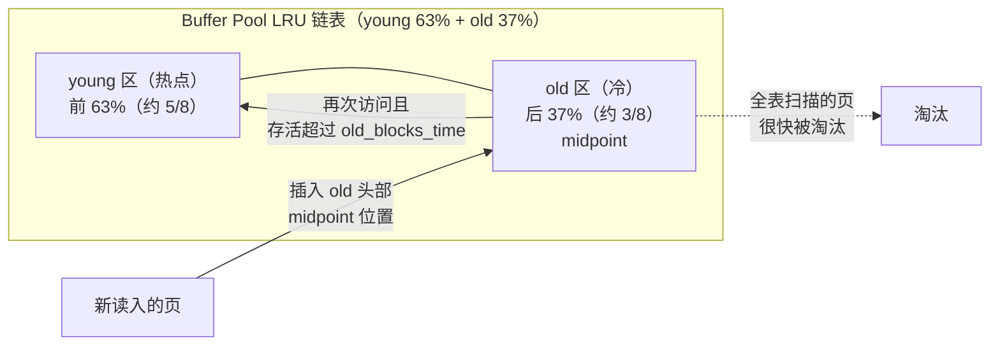
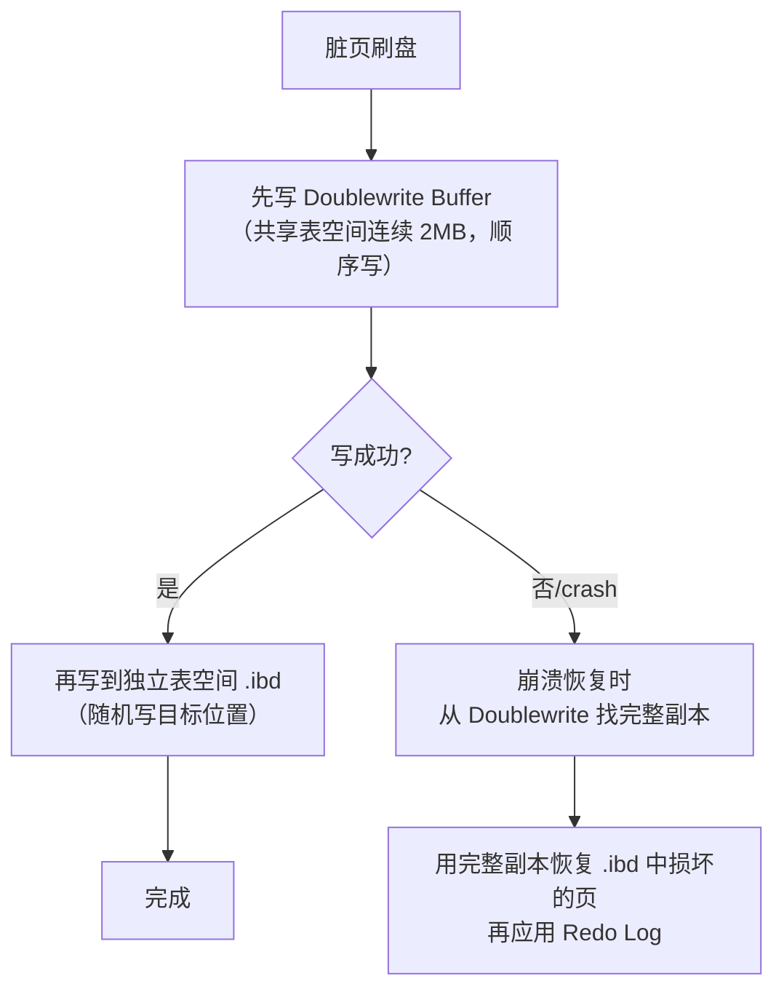
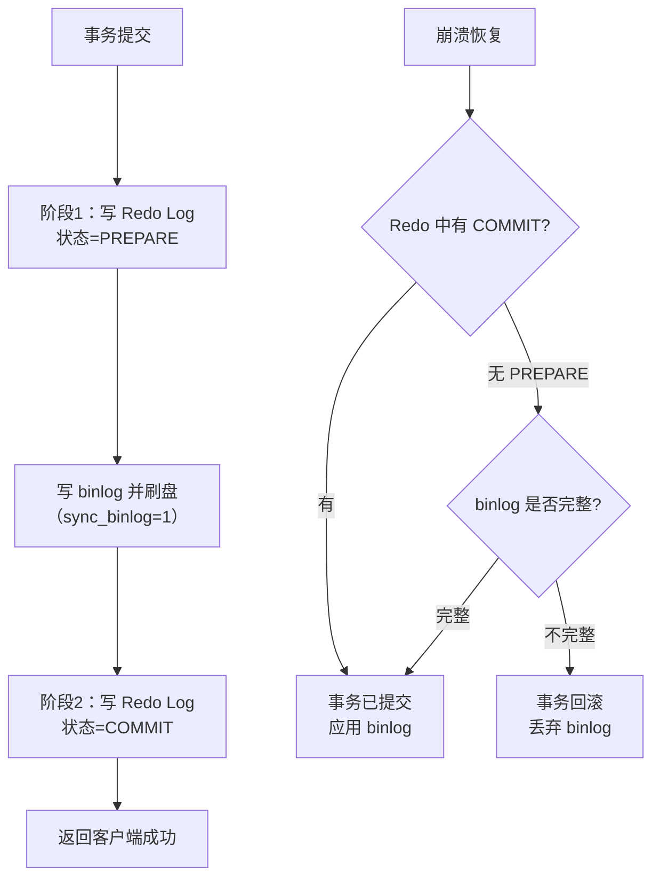
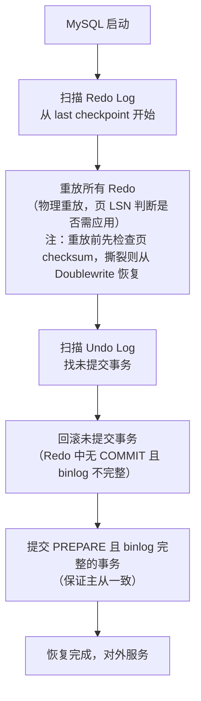

# 存储引擎底层

> **一句话定位**：InnoDB 存储引擎底层是资深面试的区分度题，能讲清 Buffer Pool 改进 LRU 与 WAL 刷盘策略才算懂 MySQL
> **面试热度**：⭐⭐⭐⭐⭐
> **返回**：[MySQL 知识图谱](../README.md)

---

## 一、概念定义

### 1.1 InnoDB vs MyISAM 对比

MySQL 5.5 起 InnoDB 成为默认存储引擎，8.0 中 MyISAM 已不再推荐使用（系统表也已全部转为 InnoDB）。两者核心差异如下：

| 维度 | InnoDB | MyISAM |
|------|--------|--------|
| 事务 | 支持 ACID 事务（commit/rollback/savepoint） | 不支持事务 |
| 锁粒度 | 行锁（默认）+ 表锁，支持 MVCC | 仅表锁，并发写性能差 |
| 外键 | 支持外键约束 | 不支持外键 |
| 聚簇索引 | 聚簇索引（主键索引与数据同页存储） | 非聚簇（索引与数据分离，堆表） |
| 崩溃恢复 | 支持（Redo Log + Doublewrite） | 不支持（损坏后需 `myisamchk` 修复） |
| 全文索引 | 5.6+ 支持（`FULLTEXT`） | 支持 |

**选型建议**：8.0 下默认用 InnoDB 即可。仅在只读归档表（如历史日志表）且无事务需求时才考虑 MyISAM，但 8.0 更推荐用归档引擎 `ARCHIVE`（压缩比高、不支持索引）替代 MyISAM。

**其他存储引擎简介**：①`Memory`：数据全内存，不支持事务，适合临时表；②`Archive`：高压缩比，只支持 INSERT 与 SELECT，不支持 UPDATE/DELETE，适合归档；③`NDB`（MySQL Cluster）：分布式无共享架构，高可用但运维复杂；④`RocksDB`（MyRocks）：LSM-Tree 存储，写放大低，Facebook 开源，适合写密集场景。8.0 主推 InnoDB，其他引擎按需使用。

**为什么 8.0 彻底弃用 MyISAM 系统表**：5.7 之前 `mysql` 系统库中的用户表、权限表仍是 MyISAM，崩溃后可能损坏导致无法启动。8.0 将所有系统表转为 InnoDB（`mysql.user` 等），借助 InnoDB 的崩溃恢复能力提升可靠性；同时移除了对 MyISAM 系统表的依赖，`mysql_upgrade` 也改为按需执行。

**InnoDB 版本演进里程碑**：

| 版本 | 关键特性 | 意义 |
|------|----------|------|
| 5.1（plugin 1.0） | InnoDB Plugin 独立分支 | 性能与功能超越内置 InnoDB |
| 5.5 | InnoDB 成为默认引擎 | 替代 MyISAM 成为主流 |
| 5.6 | 全文索引、在线 DDL、独立 Undo 表空间、Page Cleaner 线程 | 缩小与商业数据库差距 |
| 5.7 | 在线 resize Buffer Pool、并行刷脏页、JSON 类型、生成列 | 性能与功能显著提升 |
| 8.0 | 数据字典改造（DD）、原子 DDL、`innodb_dedicated_server`、动态 Redo Log 容量、AHI 分区 | 现代化重构 |

**8.0 数据字典改造（DD）**：5.7 之前元数据分散在 `.frm`/`.par`/`.TRG` 等文件 + `mysql` 系统表中，原子 DDL 不可能（崩溃后可能留下孤儿文件）。8.0 统一用 InnoDB 表存数据字典（`mysql.innodb_dynamic_metadata` 等），DDL 事务化（崩溃自动回滚），彻底解决 `.frm` 文件损坏与 DDL 非原子问题。这是 8.0 架构层面的重大改进。

**8.0 原子 DDL**：5.7 的 DDL 不是原子的（如 `DROP TABLE t1, t2` 若中途崩溃可能只删了 t1）。8.0 借助数据字典的事务化，DDL 操作（CREATE/ALTER/DROP/TRUNCATE）写入 binlog 后才提交数据字典事务，崩溃恢复时若 binlog 已写则 DDL 生效，否则回滚。这保证了 DDL 的原子性与可复制性。

**8.0 instant DDL**：8.0.12+ 引入 instant DDL（即时 DDL），只修改数据字典不修改数据行，瞬间完成。支持的操作：①末尾加列（`ADD COLUMN` 8.0.12+）；②删除列（8.0.29+）；③重命名列（8.0.28+）；④修改列默认值（8.0.12+）；⑤修改 ENUM/SET 枚举值（追加）。instant DDL 不锁表不拷贝数据，是 DDL 的最优形式。`ALGORITHM=INSTANT` 强制使用，不支持则报错。

### 1.2 InnoDB 内存架构

InnoDB 在内存中维护多个缓冲区，分别缓存数据页、变更、哈希索引与日志：

| 组件 | 作用 | 关键参数 |
|------|------|----------|
| **Buffer Pool** | 缓存热点数据页与索引页（16KB/页），所有读写都先走 Buffer Pool | `innodb_buffer_pool_size`（默认 128MB，生产建议物理内存 60%-70%） |
| **Change Buffer** | 对非唯一二级索引的写操作先缓存，后续合并到磁盘 | `innodb_change_buffer_max_size`（默认 25%，占 Buffer Pool 比例） |
| **Adaptive Hash Index（AHI）** | 自动监控热点查询，对 B+树节点建内存哈希索引 | `innodb_adaptive_hash_index`（默认 ON） |
| **Log Buffer** | 缓存 Redo Log，批量刷盘减少 IO | `innodb_log_buffer_size`（默认 16MB） |

**Buffer Pool 与查询缓存（Query Cache）的区别**：Buffer Pool 缓存的是数据页（以 16KB 页为单位），命中后仍需解析行；Query Cache（8.0 已移除）缓存的是 SQL→结果集映射。前者是存储引擎层缓存，后者是 Server 层缓存。两者层次不同、粒度不同、失效策略也不同。

**Buffer Pool 实例化**：`innodb_buffer_pool_instances`（默认 1，大于 1GB 时建议设为 CPU 核数）。每个实例有独立的 LRU/Free/Flush List 与互斥锁，减少高并发下的锁竞争。8.0 支持运行时动态调整大小（`SET GLOBAL innodb_buffer_pool_size=...`），后台线程完成页迁移而不中断服务。

**Log Buffer 的工作机制**：事务修改页时先生成 Redo Log，写入 Log Buffer（内存），再由 Master Thread 每秒或事务提交时刷盘到 Redo Log 文件。`innodb_flush_log_at_timeout`（默认 1 秒）控制刷盘频率（与 `innodb_flush_log_at_trx_commit` 协同）。Log Buffer 满（`innodb_log_buffer_size` 默认 16MB）也会触发刷盘。大事务（如批量导入）建议调大 Log Buffer（如 64MB-256MB），避免频繁刷盘。

### 1.3 InnoDB 磁盘架构

| 组件 | 作用 | 关键说明 |
|------|------|----------|
| **系统表空间** | 存放数据字典、Doublewrite Buffer、Change Buffer、Undo Log（8.0 默认独立） | `ibdata1`，`innodb_data_file_path` 配置；8.0 默认 undo 独立，系统表空间只存数据字典与 Doublewrite |
| **独立表空间** | 每张表一个 `.ibd` 文件，存数据与索引 | `innodb_file_per_table=ON`（8.0 默认）；`OPTIMIZE TABLE` 可回收碎片 |
| **Undo 表空间** | 存放 Undo Log（回滚段、MVCC 旧版本） | 8.0 默认独立（`undo_001`/`undo_002`），`innodb_undo_log_truncate=ON` 自动回收 |
| **Redo Log** | 记录数据页的物理修改，用于崩溃恢复 | `ib_logfile0`/`ib_logfile1`，8.0.30+ 改为 `#ib_redo0` 等动态文件；`innodb_redo_log_capacity`（8.0.30+）统一管理 |
| **临时表空间** | 存放临时表与排序中间结果 | `ibtmp1`，重启自动重建，`innodb_temp_data_file_path` 配置 |

**独立表空间 vs 系统表空间**：8.0 默认 `innodb_file_per_table=ON`，每张表独立 `.ibd` 文件。优势：①单表可单独备份/迁移（`ALTER TABLE ... TRANSPORTABLE`）；②`TRUNCATE TABLE` 直接删除文件，比系统表空间快；③磁盘空间可按表回收（`OPTIMIZE TABLE`）。劣势：文件数量多（fsync 开销略增）、Doublewrite 仍需共享表空间。

**通用表空间（General Tablespace, 5.7+）**：除系统表空间与独立表空间外，8.0 支持通用表空间（`CREATE TABLESPACE ... ADD DATAFILE`），多个表共享一个 `.ibd` 文件。优势：①减少文件数量（适合表很多场景）；②统一管理；③类似 Oracle 的表空间概念。劣势：`TRUNCATE TABLE` 不能直接删文件（需在表空间内回收），性能略差。适合表数量极多（如 SaaS 多租户）的场景。

**Redo Log 容量演进**：5.7 用 `innodb_log_file_size` + `innodb_log_files_in_group`（默认 2 个文件）。8.0.30+ 改为 `innodb_redo_log_capacity`（默认 100MB），自动管理文件数量与大小，运行时可动态调整。容量建议：能容纳 1 小时写入量，避免写满阻塞。

**Undo Log 的独立化**：5.7 之前 Undo 存在系统表空间，长事务导致 Undo 膨胀无法回收（系统表空间不可收缩）。8.0 默认独立 Undo 表空间（`undo_001`/`undo_002`），支持 `innodb_undo_log_truncate=ON` 自动 truncate 回收空间。`innodb_max_undo_log_size`（默认 1GB）触发 truncate 阈值，`innodb_undo_log_truncate=ON` 时自动清理不再活跃的 Undo 段。

**Redo Log 与 Undo Log 的区别**：

| 维度 | Redo Log | Undo Log |
|------|----------|----------|
| 作用 | 崩溃恢复（重做已提交未刷盘的修改） | 事务回滚 + MVCC 旧版本读取 |
| 内容 | 物理日志（页偏移+内容） | 逻辑日志（行的反向操作） |
| 方向 | 重做（前滚） | 撤销（回滚） |
| 生命周期 | 循环写，Checkpoint 后可覆盖 | 事务提交后无活跃读视图时可清理 |
| 存储位置 | 独立 Redo Log 文件 | Undo 表空间（8.0 独立） |

**Undo Log 与 MVCC 的关系**：RR 隔离级别下，事务开启时生成 ReadView，读取数据时通过 Undo Log 重建旧版本。长事务持有 ReadView，导致 Undo Log 无法被 Purge Thread 回收，Undo 表空间膨胀。8.0 的 `innodb_undo_log_truncate` 自动清理，但需无活跃读视图引用。监控 `innodb_undo_tablespaces_active` 与 Undo 表空间大小。

**日志体系概览**：InnoDB 涉及三类日志，各有用途：

| 日志 | 层次 | 作用 | 写入时机 |
|------|------|------|----------|
| Redo Log | 引擎层 | 崩溃恢复（重做已提交事务） | 事务修改时实时写 |
| Undo Log | 引擎层 | 事务回滚 + MVCC 旧版本 | 事务修改时实时写 |
| binlog | Server 层 | 主从复制 + 时间点恢复 | 事务提交时写 |

三者协同：Redo 保证已提交事务不丢，Undo 保证未提交事务可回滚，binlog 保证主从一致。两阶段提交协调 Redo 与 binlog，Undo 独立但受 Redo 保护（Undo Log 的写入也记 Redo）。

### 1.4 InnoDB 后台线程

| 线程 | 职责 | 关键说明 |
|------|------|----------|
| **Master Thread** | 调度刷脏页、合并 Change Buffer、写 Redo Log、执行 Checkpoint | 最高优先级后台线程，8.0 拆分为多个独立线程细化职责 |
| **IO Thread** | 异步 AIO 回调处理（读/写/insert buffer/redo log） | `innodb_read_io_threads`/`innodb_write_io_threads`（默认各 4） |
| **Purge Thread** | 回收 Undo Log（已提交事务的回滚段）、清理已删除标记的行 | 8.0 默认 4 个，`innodb_purge_threads` |
| **Page Cleaner Thread** | 刷脏页（从 Buffer Pool 到磁盘），减轻 Master Thread 压力 | `innodb_page_cleaners`（默认 4），与 Buffer Pool 实例数对齐 |

**Master Thread 的演进**：5.7 之前 Master Thread 是"大管家"，承担刷脏页、合并 Change Buffer、Checkpoint、Purge 等所有后台任务，高负载下成为瓶颈。5.7 起 Page Cleaner、Purge Thread 独立出来，8.0 进一步细化，Master Thread 主要负责调度与 Checkpoint 协调。

**Master Thread 的工作节奏**（5.7+ 残留逻辑，8.0 已细化）：每秒一次：刷脏页（若脏页比例 >阈值）、合并 Change Buffer、刷 Redo Log、必要时 Checkpoint。每 10 秒一次：更积极地刷脏页、合并 Change Buffer、删除无用的 Undo 段。8.0 中这些任务分散到 Page Cleaner 与 Purge Thread，Master Thread 更轻量。

**IO Thread 与异步 AIO**：InnoDB 使用 Linux AIO（`io_submit`/`io_getevents`）提交 IO 请求，IO Thread 负责回调处理。`innodb_use_native_aio=ON`（默认）使用内核 AIO，OFF 则用模拟 AIO（线程池）。NVMe SSD 并发 IO 能力强，建议调高 `innodb_read_io_threads`/`innodb_write_io_threads` 到 8-16。

**线程优先级与协作**：Master Thread 优先级最高，负责调度；Page Cleaner 独立刷脏页（不阻塞用户线程）；Purge Thread 独立回收 Undo（不阻塞用户线程）；IO Thread 处理 AIO 回调（用户线程提交 IO 请求后不等待，由 IO Thread 处理完成后唤醒）。这种分工让用户线程尽可能不被后台任务阻塞。

**`innodb_thread_concurrency`**：控制 InnoDB 内部并发线程数（默认 0=无限）。高并发场景若不限制，线程过多导致上下文切换开销大。可设为 CPU 核数的 2 倍左右（如 32 核设 64）。8.0 中默认 0（不限制），依赖 OS 调度，因为现代 MySQL 连接池化后线程数可控。

**Purge Thread 的细节**：Purge Thread 清理两类资源：①Undo Log（已提交事务的回滚段，无活跃读视图引用时可删除）；②被标记为删除的行（`DELETE_MARK` 标记的行，Purge Thread 真正物理删除）。`innodb_purge_batch_size`（默认 300）控制每次 Purge 的 Undo Log 页数。长事务会阻塞 Purge（Undo 无法回收），导致 Undo 表空间膨胀。

**Purge Thread 的阻塞与监控**：长事务（持有 ReadView 不释放）会阻塞 Purge Thread，导致：①Undo 表空间膨胀（无法 truncate）；②历史版本链变长（MVCC 读性能下降）；③`innodb_undo_log_truncate` 无法触发。监控 `SHOW ENGINE INNODB STATUS` 的 `History list length`（应 <1000，过大说明 Purge 落后）。8.0 的 `innodb_rseg_truncate_frequency`（默认 128）控制 truncate 频率。

**Page Cleaner 的自适应刷盘**：Page Cleaner 根据脏页比例与 Redo Log 使用率自适应调整刷盘速度。`innodb_adaptive_flushing=ON`（默认）启用自适应刷盘，避免脏页积压突然大量刷盘导致 IO 抖动。`innodb_flushing_avg_loops`（默认 30）控制刷盘速度的平滑度，值越大越平滑但响应越慢。

**Page Cleaner 的 LRU 刷盘与 Flush List 切换**：Page Cleaner 有两种刷盘模式：①从 LRU 尾部刷脏页（淘汰时需刷盘的页）；②从 Flush List 刷脏页（主动刷盘减少脏页比例）。8.0 中两者并行（`innodb_page_cleaners` 个线程分工），避免单一模式导致刷盘不及时。

---

## 二、原理与流程

### 2.1 Buffer Pool

**作用**：缓存热点数据页与索引页，所有读写都先走 Buffer Pool，命中则直接返回，未命中则从磁盘加载，减少磁盘 IO。Buffer Pool 是 InnoDB 性能的核心，命中率通常应 >99%。

**页结构**：Buffer Pool 以页（默认 16KB）为单位管理。每个页有控制块（页号、LSN、状态、锁信息、所在表空间）+ 数据区（16KB 数据页内容）。`innodb_page_size` 可设为 4K/8K/16K/32K/64K（8.0 默认 16K），一旦建库后不可改。页大小影响：①B+树扇出（页越大每页能存更多索引项，树更矮）；②IO 单位（页越大单次 IO 数据多但放大写）；③Buffer Pool 管理粒度。

**页的类型**：InnoDB 内部页有多种类型：①数据页（`FIL_PAGE_INDEX`，存 B+树节点）；②Undo 页（`FIL_PAGE_UNDO_LOG`）；③系统页（`FIL_PAGE_SYS`）；④事务系统页（`FIL_PAGE_TRX_SYS`）；⑤Insert Buffer 页（`FIL_PAGE_IBUF_FREE_LIST`）。Buffer Pool 缓存的主要是数据页与索引页，其他类型页也会在需要时加载。

**改进版 LRU（young/old 两段）**：

传统 LRU 问题：全表扫描会把整个表的数据页都加载进 Buffer Pool，冲刷掉真正的热点页，导致缓存命中率暴跌。一次 `SELECT * FROM big_table` 可能让 Buffer Pool 的热点全部失效。

InnoDB 改进方案：

- **midpoint**：young 与 old 的分界点，位于 LRU 链表的 5/8 处（`innodb_old_blocks_pct` 默认 37，即 old 占 37%，young 占 63%）
- **新页插入**：新读入的页插到 old 头部（midpoint 位置），而不是链表头部
- **晋升 young**：页在 old 区存活超过 `innodb_old_blocks_time`（默认 1000ms）后再次被访问，才晋升到 young 头部
- **全表扫描防护**：全表扫描的页插到 old 头部，但同一次查询内多次访问间隔 < 1s（顺序扫描），不满足 `old_blocks_time`，不会晋升 young，最终从 old 尾部淘汰，保护了 young 区热点

**为什么是 young 63% + old 37%**：经验值。old 区占 37%（约 3/8）既留够缓冲空间让全表扫描的页有地方放，又不会让 old 区过大挤占 young 区热点。可根据业务调整：读多写少调大 young（`innodb_old_blocks_pct=25`），全表扫描多调大 old（`=50`）。

**`innodb_old_blocks_time` 的调优**：默认 1000ms（1 秒）。全表扫描场景调大（如 3000ms）能更严格阻止扫描页晋升 young；但若业务确有"刚写入立刻查询"的模式，调大会导致这些页长期停留在 old 区被频繁淘汰。监控 `young-making rate`（`SHOW ENGINE INNODB STATUS`），若过低说明晋升困难，可适当调小。

**Buffer Pool 的预读机制**：InnoDB 有两种预读：①线性预读（`innodb_read_ahead_threshold`，默认 56）：当连续读取一个 extent（64 页）中超过阈值页时，预读下一个 extent；②随机预读（`innodb_random_read_ahead`，默认 OFF）：当一个 extent 中超过 13 页被访问时预读整个 extent。线性预读适合顺序扫描，随机预读适合随机访问热点集中区域，但可能预读无用页，默认关闭。

**三链表**：

| 链表 | 作用 | 说明 |
|------|------|------|
| **Free List** | 空闲页链表 | Buffer Pool 启动时所有页都在 Free List；分配页时从 Free List 摘除 |
| **LRU List** | 缓存页按访问顺序排列 | 改进版 LRU，young + old 两段 |
| **Flush List** | 脏页链表（被修改但未刷盘） | 页被修改后加入 Flush List；Page Cleaner 线程从此链表刷盘 |

**三链表的关系**：一个页可以同时在 LRU List 和 Flush List 中（被缓存的脏页）。Free List 与 LRU List 互斥（空闲页不在 LRU 中）。页的生命周期：Free List → LRU List（被读取）→ Flush List（被修改）→ 刷盘后从 Flush List 摘除 → LRU List 中被淘汰 → 回到 Free List。

**淘汰策略**：当 Free List 不足时，从 LRU List 的 old 尾部淘汰页；若该页是脏页（在 Flush List 中），先刷盘再淘汰。若脏页刷盘速度跟不上淘汰需求，会触发单页刷盘（`buf_flush_single_page`），阻塞用户线程，表现为性能抖动。

**Buffer Pool 的预热与保活**：①8.0 的 dump/load 机制（`innodb_buffer_pool_dump_at_shutdown`/`load_at_startup`）保存热点页列表；②`innodb_buffer_pool_load_now` 手动触发加载；③预热脚本（对核心表执行 `SELECT COUNT(*)` 触发全表扫描加载，但注意不要冲刷 young 区，可临时调大 `innodb_old_blocks_time`）；④`innodb_random_read_ahead=ON`（默认 OFF）预读相邻页，但可能预读无用页。

**Buffer Pool 监控**：`SHOW ENGINE INNODB STATUS` 输出 Buffer Pool hit rate（应 >99%）、young-making rate、`innodb_buffer_pool_pages_dirty`（脏页数）。`information_schema.innodb_buffer_pool_stats` 查看详细统计。

**源码路径**：`storage/innobase/buf/buf0buf.cc`（Buffer Pool 管理）、`storage/innobase/buf/buf0lru.cc`（LRU 淘汰）、`storage/innobase/buf/buf0flu.cc`（刷脏页）。

**Buffer Pool 的改进 LRU 源码关键函数**：`buf_LRU_insert_only_freed`（插入新页到 old 头部）、`buf_page_peek_if_too_old`（判断页是否在 old 区超时）、`buf_LRU_make_block_old`（标记为 old）、`buf_LRU_make_block_young`（晋升到 young 头部）。

### 2.2 Change Buffer

**作用**：对非唯一二级索引的写操作（INSERT/UPDATE/DELETE），若目标索引页不在 Buffer Pool 中，不立即从磁盘加载页，而是先把变更缓存到 Change Buffer，后续该页被读时再合并（merge）。避免了一次"读磁盘 + 写磁盘"的随机 IO，只需"写内存 + 延迟合并"。

**为什么只对二级索引有效**：

- **聚簇索引**：必须即时校验唯一性（主键冲突检查），必须把数据页加载到内存才能判断，无法延迟
- **非唯一二级索引**：不要求即时校验唯一性（唯一二级索引也不行，因为唯一性校验需要读页），且二级索引的修改往往是离散的随机 IO（叶子页分散在磁盘不同位置），延迟合并能把多次随机写合并为一次顺序读+写
- **聚簇索引走 Change Buffer 的后果**：若延迟校验唯一性，可能让两个事务都插入相同主键并都"成功"，破坏一致性

**合并时机**：①该索引页被查询读取时（触发 merge，读时顺便把 Change Buffer 中的变更应用到页上）；②后台 Purge Thread 定期合并；③数据库关闭时；④Change Buffer 满时强制合并最旧的。

**容量**：占 Buffer Pool 的 `innodb_change_buffer_max_size`（默认 25%）。写多读少的场景可调高到 50%，读多写少可调低到 5%。Change Buffer 本身也是 B+树结构，存储在系统表空间中（非内存独立区域）。

**适用场景**：写多读少 + 非唯一二级索引多的表（如日志表、流水表）。若表大量即时查询刚写入的数据，Change Buffer 无收益（读时立即合并，等于没缓存，反而增加合并开销）。

**Change Buffer 的合并开销**：合并（merge）时需读取目标索引页到内存，应用所有缓存的修改，再标记为脏页。若 Change Buffer 积压过多（如突然大量读触发合并），会产生集中 IO，影响性能。监控 `innodb_metrics` 中 `buffer_page_read` 与 `ibuf_merge` 指标，合并突增说明积压过多。

**Change Buffer 的容量监控**：`SHOW ENGINE INNODB STATUS` 输出 `Ibuf: size`（当前 Change Buffer 大小，单位页）、`free list len`、`seg size`。`information_schema.innodb_metrics` 中 `ibuf_num_entries` 查看条目数。若 Change Buffer 持续增长不合并，说明目标页长期未被读取，合并延迟；若突然大量合并，说明批量读取触发了 merge。

**Change Buffer vs Insert Buffer**：5.5 之前只支持 INSERT 的缓存（叫 Insert Buffer）；5.5+ 扩展支持 DELETE/UPDATE（改名 Change Buffer）。`innodb_change_buffering` 控制缓存哪些操作（`all`/`inserts`/`deletes`/`purges`/`changes`，默认 `all`）。

**Change Buffer 的内部结构**：Change Buffer 本身是一棵 B+树（`ibuf`），存储在系统表空间中（非独立内存区域）。每个节点记录 `(space_id, page_no, modification)`，即"哪个表空间的哪个页做什么修改"。合并时读取目标页，把所有缓存的修改批量应用，一次 IO 完成多个修改。

**源码路径**：`storage/innobase/ibuf/ibuf0ibuf.cc`（Change Buffer 管理）、`storage/innobase/ibuf/ibuf0merge.cc`（合并逻辑）。

### 2.3 Adaptive Hash Index（AHI）

**作用**：InnoDB 自动监控热点查询模式，对 B+树的热点叶子节点建立内存哈希索引，等值查询命中时直接 O(1) 定位，跳过 B+树的 O(log N) 遍历。

**工作机制**：
- 监控查询条件（`WHERE col = ?`）的访问模式
- 若某索引页被等值查询高频访问（连续 100 次相同条件模式），自动对该页建哈希索引
- 哈希表以 `(index_id, page_no, key)` 为键，指向叶子节点中的行位置
- 后续等值查询命中哈希，直接定位到行，无需从 B+树根节点遍历到叶子

**收益与代价**：
- **收益**：高并发等值查询显著加速（B+树 3-4 层 → 哈希 1 次定位），减少 CPU 消耗与 B+树遍历的 latch 争用
- **代价**：①占用内存（哈希表）；②每次数据页修改需同步维护哈希，写多场景有锁竞争（AHI 全局 RW 锁，高并发下成为瓶颈）
- **无收益场景**：范围查询（`>`/`<`/`BETWEEN`）、JOIN、写多读少、查询条件不固定（无法形成稳定访问模式）

**调优**：高并发等值查询开启（默认 ON）；写密集场景可关闭（`innodb_adaptive_hash_index=OFF`）减少锁竞争。8.0 引入了分区 AHI（`innodb_adaptive_hash_index_parts`，默认 8），降低全局锁竞争。

**AHI 的监控**：`SHOW ENGINE INNODB STATUS` 输出 `inserts`/`hash_searches`/`non_hash_searches`，`hash_searches / (hash_searches + non_hash_searches)` 为 AHI 命中率。若命中率 <10% 或写入密集，建议关闭 AHI 减少 RW 锁竞争。

**AHI 与手动建哈希索引的区别**：AHI 是 InnoDB 自动维护的内存哈希，不持久化（重启重建），对用户透明；MySQL 不支持手动创建哈希索引（仅 Memory 引擎支持，但不常用）。AHI 是"对 B+树的内存加速层"，不是独立索引结构。

**AHI 的失效场景**：①页被修改（B+树结构变化，如分裂/合并），AHI 中该页的哈希项失效需重建；②大范围查询（`WHERE id BETWEEN 1 AND 10000`）不命中 AHI（AHI 只加速等值查询）；③JOIN 的被驱动表用 AHI 加速（若被驱动表的关联字段有等值查询模式）。

**源码路径**：`storage/innobase/ha/ha0ha.cc`（AHI 哈希表管理）、`storage/innobase/btr/btr0sea.cc`（AHI 搜索与维护）。

### 2.4 Doublewrite Buffer

**问题：页撕裂（Partial Page Write）**：

InnoDB 页大小 16KB，操作系统 IO 单位通常 4KB（或更小）。若写 16KB 数据页时只写了部分（如写了 8KB 就宕机），该页损坏（partial page write）。此时 Redo Log 也无法恢复——Redo Log 是物理日志，记录"对页偏移 X 写入 Y"，前提是页本身完整；页已损坏则无法应用 Redo（会把损坏的页当完整页来覆盖，导致数据错乱）。

**为什么 Redo Log 不能恢复页撕裂**：Redo Log 记录的是"页偏移 X 处写入字节 Y"的物理修改。若页本身已损坏（部分写入），Redo 重放时会把新内容写到错误的位置（因为页结构已乱），导致数据损坏扩散。所以必须保证页本身完整，Redo 才能正确应用。这是 Doublewrite 存在的根本原因——它保证页的完整性，Redo 保证修改不丢。

**Doublewrite Buffer 方案**：

- **共享表空间连续 2MB**：`innodb_doublewrite=ON`（默认），位于系统表空间 `ibdata1`（8.0 也支持独立文件或表空间内）
- **流程**：脏页刷盘前，先顺序写到 Doublewrite Buffer（连续 2MB 区，顺序写很快，2MB 约 128 个页），再写到目标 `.ibd` 位置
- **崩溃恢复**：若 `.ibd` 中的页损坏（partial page write），从 Doublewrite Buffer 找到该页的完整副本，恢复后再应用 Redo Log
- **空间开销**：2MB 固定，不随数据增长，开销可忽略
- **性能影响**：每次刷盘多写一次（Doublewrite），但顺序写很快，且 Doublewrite 把多个页攒在一起顺序写，整体开销 <5%
- **8.0 优化**：`innodb_doublewrite_files`、`innodb_doublewrite_dir` 支持独立目录；用户表空间支持独立 Doublewrite（`innodb_doublewrite=VARIABLE`，8.0.22+）；支持跳过 Doublewrite 的场景（如只读表空间）

**Doublewrite Buffer 的工作细节**：Doublewrite Buffer 是 2MB 连续区，分为两半（各 1MB）。刷盘时 Page Cleaner 把脏页先写到 Doublewrite Buffer（顺序写两半轮流用），然后逐页写到 `.ibd` 目标位置（随机写）。写完 `.ibd` 后，Doublewrite Buffer 中对应的页可被覆盖（下次刷盘复用）。崩溃恢复时，扫描 `.ibd` 中校验和（checksum）不匹配的页，从 Doublewrite Buffer 找对应副本恢复。

**Doublewrite Buffer 的性能权衡**：每次刷盘多写一次（Doublewrite），但 Doublewrite 是顺序写（2MB 连续区），而数据页刷盘是随机写，顺序写的开销远小于随机写。实测整体开销 <5%，对于安全性收益（防页撕裂）完全值得。若确信底层存储能保证原子写（如某些 NVMe 设备支持 16KB 原子写），可关闭 Doublewrite（`innodb_doublewrite=OFF`）换取微小性能提升，但不推荐。

**Doublewrite 与 Redo 的协作**：崩溃恢复时先检查页是否撕裂（页校验和 checksum 不匹配），若撕裂从 Doublewrite 恢复完整页，再应用 Redo Log。若页未撕裂，直接应用 Redo（Redo 幂等，重复应用无影响）。两者是"保页完整"与"保修改不丢"的互补关系。

**源码路径**：`storage/innobase/buf/buf0dblwr.cc`（Doublewrite Buffer 管理）、`storage/innobase/buf/buf0flu.cc`（刷盘流程，调用 Doublewrite）。

### 2.5 LSN（Log Sequence Number）

**LSN** 是单调递增的日志序列号（8 字节整数），记录 Redo Log 的写入位置，贯穿整个崩溃恢复流程。LSN 是 InnoDB 内部"时间戳"，用于标记数据页与 Redo Log 的进度对应关系。

| LSN 类型 | 含义 |
|----------|------|
| **`log_lsn`** | Log Buffer 中已写入的 LSN（内存中，未持久化） |
| **`write_lsn`** | 已写入 OS Page Cache 但未 fsync 的 LSN（`innodb_flush_log_at_trx_commit=2` 时介于 flush 与 log 之间） |
| **`flush_lsn`** | 已 fsync 刷盘到 Redo Log 文件的 LSN（持久化的最高位置） |
| **`checkpoint_lsn`** | Checkpoint 推进的 LSN，小于此值的 Redo Log 可被覆盖重用 |

**LSN 的流转**：事务修改页 → 生成 Redo Log（LSN 递增）→ 写入 Log Buffer（`log_lsn`）→ 写入 OS Cache（`write_lsn`）→ fsync 到磁盘（`flush_lsn`）→ Checkpoint 推进（`checkpoint_lsn`）→ Redo Log 文件可重用。

**页 LSN**：每个数据页头部记录该页最后修改对应的 LSN（`FIL_PAGE_LSN`）。崩溃恢复时，比较页 LSN 与 Redo Log LSN，只应用页 LSN 之后的 Redo（避免重复应用已刷盘的修改）。这是 Redo Log 幂等性的保证——重放时跳过已应用的修改。

**LSN 与 Checkpoint 的关系**：`checkpoint_lsn` 之前的 Redo Log 对应的脏页已全部刷盘，因此这部分 Redo 可被覆盖。`checkpoint_lsn` 到 `flush_lsn` 之间的 Redo Log 对应的脏页可能未刷盘，崩溃恢复时需重放。两者的差距反映"积压的脏页量"，差距过大说明刷盘跟不上写入。

**LSN 的查询**：`SHOW ENGINE INNODB STATUS` 输出 `Log sequence number`（`log_lsn`）、`Log flushed up to`（`flush_lsn`）、`Last checkpoint at`（`checkpoint_lsn`）。三者关系：`log_lsn >= flush_lsn >= checkpoint_lsn`。`flush_lsn - checkpoint_lsn` 是崩溃恢复需重放的 Redo 量，过大则恢复慢。

**LSN 在崩溃恢复中的作用**：恢复时从 `checkpoint_lsn` 开始扫描 Redo Log，重放所有 Redo 记录。对每条 Redo，比较其 LSN 与目标页的 LSN（`FIL_PAGE_LSN`）：①若 Redo LSN > 页 LSN，说明页未应用此修改，重放；②若 Redo LSN <= 页 LSN，说明页已应用（已刷盘），跳过。这是 Redo 重放幂等性的保证。

**LSN 与 binlog 的协调**：两阶段提交中，Redo Log 的 PREPARE 与 COMMIT 都带 LSN。binlog 的 XID 与 Redo 的 XID 对应。崩溃恢复时，对 PREPARE 状态的事务，用 binlog 的最后位置（`MYSQL_BIN_LOG` 的 `binlog_end_lsn`）判断 binlog 是否完整。这是两阶段提交裁定事务去留的依据。

### 2.6 Checkpoint 机制

**作用**：推进 `checkpoint_lsn`，使 Redo Log 文件可重用（循环写）；将脏页刷盘，缩短崩溃恢复时间（无需从头重放所有 Redo）。

| 类型 | 说明 | 触发场景 |
|------|------|----------|
| **Sharp Checkpoint** | 全量刷盘所有脏页，Redo Log 可全部清空 | 仅在正常关闭时（`innodb_fast_shutdown=1`） |
| **Fuzzy Checkpoint** | 增量刷部分脏页，推进 `checkpoint_lsn` | 默认运行期间持续进行 |

**Fuzzy Checkpoint 触发条件**：
1. **Redo Log 快写满**：`checkpoint_lsn` 与 `flush_lsn` 差距接近 Redo Log 容量（默认 75% 水位），强制刷脏页推进 `checkpoint_lsn`（否则 Redo 写满会阻塞所有写操作，性能急剧下降）
2. **Buffer Pool 脏页过多**：脏页比例超过 `innodb_max_dirty_pages_pct`（默认 90%），Page Cleaner 加速刷盘
3. **Master Thread 空闲**：定期刷少量脏页（每秒/每 10 秒），保持平稳刷盘节奏
4. **正常关闭**：Sharp Checkpoint 刷全部脏页，确保关闭后无脏页

**Fuzzy Checkpoint 的子类型**：①Async/Sync Flush（Redo Log 驱动，紧急程度不同）；②Active Flush（脏页比例驱动）；③Idle Flush（空闲时主动刷）。Async Flush 不阻塞用户线程，Sync Flush 在 Redo 极度紧张时阻塞用户线程（性能急剧下降，需避免）。

**Redo Log 循环写**：Redo Log 文件是环形结构，`checkpoint_lsn` 之前的区域可被覆盖。若写入速度持续快于刷盘，Redo 写满会触发强制 Checkpoint，此时所有写操作阻塞（用户线程等待 Redo 空间），这是 Buffer Pool 与 Redo Log 容量规划不足的典型表现。表现：QPS 突然掉底，`Threads_running` 飙升，`SHOW ENGINE INNODB STATUS` 显示 "Log sequence number" 接近 "Log flushed up to"。

**Checkpoint 的性能意义**：Checkpoint 推进慢 → 崩溃恢复时长（需重放更多 Redo）；推进快 → 刷盘压力大（IO 占用高）。需平衡：脏页比例控制在 60%-75%，既能平滑刷盘，又留足缓冲应对写入高峰。

**Checkpoint 与 Redo Log 容量的关系**：Redo Log 容量决定了"能积压多少脏页"。若 Redo Log 太小（如默认 100MB），高写入场景很快写满，强制 Checkpoint 频繁触发，甚至阻塞写操作。建议 Redo Log 容量能容纳 1 小时写入量（8.0.30+ 用 `innodb_redo_log_capacity`，如写入 10MB/s 则配 36GB）。5.7 用 `innodb_log_file_size × innodb_log_files_in_group`（如 2GB × 2 = 4GB）。

**Checkpoint 的监控**：`SHOW ENGINE INNODB STATUS` 输出 `Log sequence number`（`log_lsn`）、`Log flushed up to`（`flush_lsn`）、`Last checkpoint at`（`checkpoint_lsn`）。关键指标：①`log_lsn - flush_lsn`：未刷盘的 Redo 量（应小，受 `innodb_flush_log_at_trx_commit` 控制）；②`flush_lsn - checkpoint_lsn`：积压的脏页 Redo 量（崩溃恢复需重放量，应控制在 Redo Log 容量的 30% 以内）。

**源码路径**：`storage/innobase/log/log0log.cc`（Checkpoint 逻辑）、`storage/innobase/buf/buf0flu.cc`（刷脏页触发 Checkpoint）。

### 2.7 WAL（Write-Ahead Logging）

**定义**：先写 Redo Log（顺序写），再修改 Buffer Pool 中的数据页（内存），数据页异步刷盘（随机写）。

**为什么这么设计**：

| 对比 | Redo Log（顺序写） | 数据页（随机写） |
|------|---------------------|------------------|
| IO 模式 | 顺序追加写（append） | 随机写（页分散在磁盘不同位置） |
| 性能 | 顺序写远快于随机写（磁盘寻道时间） | 慢（机械硬盘差 100 倍，SSD 差 5-10 倍） |
| 单次写量 | 小（只记录页的物理修改，几十到几百字节） | 大（整页 16KB） |
| 持久化要求 | 事务提交时必须落盘 | 可异步延迟刷盘 |

**核心收益**：把"对数据页的随机写"转换为"对 Redo Log 的顺序写"，性能提升 1-2 个数量级。事务提交只需确保 Redo Log 落盘（顺序写快），数据页可异步刷盘（随机写慢但不影响事务提交）。

**崩溃恢复**：Redo Log 已落盘但数据页未刷盘 → 重启后重放 Redo Log，把页恢复到崩溃前状态（物理重放：直接覆盖页偏移内容）。由于 Redo 是物理日志（记录页号+偏移+内容），重放是幂等的（页 LSN 判断是否已应用）。

**WAL 的代价**：①写放大（一次修改 = 1 次 Redo 写 + 1 次数据页写）；②崩溃恢复需重放 Redo（时间取决于积压量）；③Redo Log 需要磁盘空间（循环写，空间可控）。但这些代价远小于"直接同步写数据页"的性能损失。

**WAL 不是 InnoDB 独有**：WAL 是数据库通用模式（PostgreSQL、Oracle、SQL Server 都用）。核心思想都是"用顺序日志替代随机写数据，延迟刷盘提升吞吐"。InnoDB 的 Redo Log 是物理日志（页偏移+内容），而 PostgreSQL 的 WAL 是逻辑日志（SQL 级别），各有取舍。物理日志重放快但日志体积大；逻辑日志体积小但重放需重新执行 SQL。

**Redo Log 的物理日志格式**：每条 Redo 记录包含：①类型（MLOG_REC_INSERT/MLOG_REC_UPDATE_IN_PLACE 等）；②表空间 ID + 页号；③页内偏移；④修改的数据。物理日志的好处是重放时直接覆盖页偏移内容，不依赖 SQL 语义，幂等且高效。

**Redo Log 的最小单元**：Redo Log 以 512 字节为对齐单元（与磁盘扇区对齐），保证原子写入（现代磁盘保证 512 字节原子写）。一条 Redo 记录可能跨多个 512 字节块，但 InnoDB 保证 redo block（512 字节）的原子性，崩溃恢复时丢弃不完整的最后一个 block。

**源码路径**：`storage/innobase/log/log0log.cc`（Redo Log 写入）、`storage/innobase/trx/trx0rec.cc`（事务 Redo 记录生成）、`storage/innobase/log/log0recv.cc`（崩溃恢复重放）。

### 2.8 刷盘策略

#### 2.8.1 innodb_flush_log_at_trx_commit

控制 Redo Log 的刷盘时机，三个级别权衡性能与安全性：

| 值 | 提交时行为 | 刷盘频率 | 宕机风险 | 适用场景 |
|----|------------|----------|----------|----------|
| **0** | 不写不刷 | 每秒由 Master Thread 刷盘 | MySQL/OS 崩溃都丢 1 秒数据 | 测试环境，性能优先 |
| **1** | 写 + fsync 到磁盘 | 每次提交都刷盘（默认） | 不丢数据（满足 ACID） | 生产环境，强一致 |
| **2** | 写到 OS Page Cache，不 fsync | 每秒由 Master Thread fsync | MySQL 崩溃不丢；OS 崩溃丢 1 秒 | 折中方案，性能与安全平衡 |

**关键区分**：MySQL 进程崩溃（kill -9）vs 操作系统崩溃（断电）。
- `=2` 时 Redo Log 在 OS Page Cache，MySQL 崩溃后 OS 仍存活，数据不丢；OS 崩溃则 OS Cache 丢失。
- `=1` 时 Redo Log 已 fsync 到磁盘，无论 MySQL 还是 OS 崩溃都不丢。
- `=0` 时 Redo Log 在 Log Buffer（内存），任何崩溃都可能丢。

**性能对比**：`=1` → `=2` 性能提升约 2-3 倍（消除 fsync 等待）；`=2` → `=0` 再提升约 30%（消除 write 到 OS Cache）。但 `=0` 风险过大，几乎不用于生产。

**fsync 的性能瓶颈**：fsync 是同步操作，等待磁盘确认写入完成，延迟取决于磁盘性能（机械盘 5-10ms，SATA SSD 0.5-1ms，NVMe SSD 0.1-0.5ms）。高并发提交时 fsync 成为瓶颈，group commit（8.0 优化）能把多个事务的 fsync 合并为一次，缓解该问题。

**group commit 的原理**：多个事务同时提交时，InnoDB 把它们的 Redo Log 攒在一起，一次 fsync 刷盘，分摊 fsync 开销。`binlog_group_commit_sync_delay`（默认 0，单位 μs）控制等待攒批的时间，`binlog_group_commit_sync_no_delay_count`（默认 0）控制攒批的最大事务数。调大这两个参数能提升吞吐但增加提交延迟。

#### 2.8.2 innodb_flush_method

控制 InnoDB 写数据页与 Redo Log 的 IO 方式：

| 值 | 数据页 | Redo Log | 说明 |
|----|--------|----------|------|
| **fsync**（默认） | 经 OS Page Cache + fsync | 经 OS Page Cache + fsync | 传统模式，依赖 OS Cache |
| **O_DIRECT** | 绕过 OS Page Cache 直接写磁盘（`open(O_DIRECT)`） | 经 OS Page Cache + fsync | 数据页不占 OS Cache（避免与 Buffer Pool 双重缓存），Redo 仍走 OS Cache |
| **O_DIRECT_NO_FSYNC** | O_DIRECT 但不额外 fsync | O_DIRECT | 8.0+，某些文件系统（XFS/Ext4）可省去 fsync |
| **littlesync** | O_DIRECT | fsync | 介于两者之间，较少使用 |

**为什么推荐 O_DIRECT**：①避免 double buffer——Buffer Pool 已缓存数据页，OS Page Cache 再缓存一份是浪费内存；②数据页写直达磁盘，绕过 OS Cache 减少 memcpy 开销；③Redo Log 仍走 OS Cache，利用 OS 的顺序写优化（OS Page Cache 对顺序写有 write-back 优化）。

**生产建议**：`O_DIRECT`（数据页绕过 OS Cache 避免 double buffer，Redo Log 仍用 OS Cache 利用其顺序写优化）。Linux 下推荐配合 XFS 文件系统（对大文件与并发 IO 优化好于 Ext4）。

**O_DIRECT 与 fsync 的配合**：`O_DIRECT` 只保证数据绕过 OS Cache 直达磁盘，但不保证元数据（如文件大小）已刷盘，仍需 fsync 确保元数据落盘。`O_DIRECT_NO_FSYNC`（8.0+）省去 fsync，适用于 XFS/Ext4 等能保证 `O_DIRECT` 后元数据一致性的文件系统，但需谨慎验证。

**`innodb_flush_method` 与存储介质的关系**：①机械硬盘：fsync 或 O_DIRECT 差异不大（IO 本身慢）；②SATA SSD：O_DIRECT 略优（减少 OS Cache 内存占用）；③NVMe SSD：O_DIRECT_NO_FSYNC 最优（NVMe 原子写能力强，元数据一致性强）；④云盘（EBS）：O_DIRECT（云盘的 OS Cache 与块存储分层复杂，直接写更可控）。

#### 2.8.3 sync_binlog

控制 binlog 刷盘时机，与 Redo Log 的两阶段提交配合保证主从一致：

| 值 | 行为 | 宕机风险 | 适用场景 |
|----|------|----------|----------|
| **0** | 由 OS 决定何时刷盘 | OS 崩溃丢 binlog | 测试环境 |
| **1** | 每次提交都 fsync（默认） | 不丢 binlog | 生产环境，强一致 |
| **N** | 每 N 次提交 fsync 一次 | 宕机最多丢 N 个事务 | 折中，N=100-1000 常用 |

**与 Redo 的两阶段提交配合**：

**双 1 配置**：`innodb_flush_log_at_trx_commit=1` + `sync_binlog=1`，是生产环境强一致的标配。性能损耗最大但数据零丢失。

**折中配置**：`innodb_flush_log_at_trx_commit=2` + `sync_binlog=100`，性能提升 3-5 倍，代价是 OS 崩溃时最多丢 1 秒数据 + 100 个事务的 binlog。适用于日志类、统计类等可容忍秒级丢失的业务。

**两阶段提交的必要性**：若不用两阶段（直接写 Redo 提交再写 binlog），Redo 提交后写 binlog 前崩溃 → 主库已提交但从库收不到 binlog，主从数据不一致。两阶段通过 PREPARE 中间状态，崩溃恢复时用 binlog 完整性裁定事务去留，保证 Redo 与 binlog 状态一致。

**group commit 优化**：高并发下每个事务单独 fsync 开销大。8.0 的 group commit 把多个事务的 Redo Log fsync 合并为一次（`binlog_group_commit_sync_delay`/`binlog_group_commit_sync_no_delay_count` 控制），大幅提升吞吐。这与 `innodb_flush_log_at_trx_commit=1` 配合，既保证持久性又减少 fsync 次数。

**源码路径**：`storage/innobase/log/log0log.cc`（Redo Log 管理）、`storage/innobase/log/log0sync.cc`（刷盘同步）、`storage/innobase/buf/buf0flu.cc`（脏页刷盘与 Checkpoint）。

**崩溃恢复（Crash Recovery）完整流程**：

**崩溃恢复的详细步骤**：

1. **页撕裂检查与恢复**：扫描 `.ibd` 中页的 checksum，若损坏（partial page write）从 Doublewrite Buffer 恢复完整副本——必须在 Redo 重放前完成，因为 Redo 重放要求页本身完整
2. **扫描 Redo Log**：从 `checkpoint_lsn` 开始扫描，构建哈希表（`page_no → redo_list`），即每个页有哪些 Redo 需重放
3. **重放 Redo**：对每个页，若页 LSN < Redo LSN，则应用 Redo（物理覆盖页偏移内容）。批量重放，按页聚合减少 IO
4. **扫描 Undo Log**：找所有未提交（无 COMMIT）的事务，构建待回滚列表
5. **回滚未提交事务**：用 Undo Log 反向操作，回滚事务。若 PREPARE 状态且 binlog 完整则提交（不回滚）
6. **完成**：Buffer Pool 预热，对外提供服务

**恢复时间估算**：主要取决于 Redo Log 重放量（`flush_lsn - checkpoint_lsn`）。若配置合理（Checkpoint 及时推进），恢复时间通常 <30 秒。长恢复时间说明 Checkpoint 推进慢或 Redo Log 容量过大，需调优。

**恢复期间的不可用**：崩溃恢复期间 MySQL 无法对外服务（InnoDB 在恢复完成前不接受连接）。大型数据库恢复可能需数分钟，影响可用性。建议：①合理配置 Redo Log 容量（不过大）；②开启 `innodb_fast_shutdown=1`（正常关闭时 Sharp Checkpoint，减少恢复量）；③使用从库分担读流量，主库恢复期间读切到从库。

**8.0 的恢复优化**：①并行恢复（`innodb_parallel_read_threads`，多线程扫描重放 Redo）；②Redo Log 归档（`innodb_redo_log_archive_dirs`，可用于 PITR）；③加速 Undo 回滚（`innodb_rollback_segments` 控制并发回滚段数）。

---

## 三、高频追问

### 3.1 Buffer Pool 的 LRU 为什么改进？怎么改进？

**为什么**：传统 LRU 在全表扫描时会把整个表的数据页都加载到 LRU 头部，冲刷掉真正的热点页，导致缓存命中率暴跌。一次全表扫描（如 `SELECT * FROM big_table WHERE create_time > '2024-01-01'`）可能让 Buffer Pool 的热点全部失效，后续正常查询全部走磁盘，性能断崖式下降。典型场景：①业务误操作 `SELECT *`；②运维脚本全表统计；③数据迁移/导出工具。

**怎么改进**：①分 young（前 63%，约 5/8）+ old（后 37%，约 3/8）两段，新页插到 old 头部（midpoint）；②页在 old 区存活超过 `innodb_old_blocks_time`（默认 1s）后再次访问才晋升 young；③全表扫描的页虽进 old 头，但同次查询内多次访问间隔 <1s（顺序扫描，页 A 读完后立刻读页 B，不会再回来访问页 A），不满足 `old_blocks_time`，不会晋升 young，最终从 old 尾部淘汰。这样真正被反复访问的热点页在 young 区得到保护。调优：`innodb_old_blocks_pct`（old 占比，默认 37）、`innodb_old_blocks_time`（晋升阈值，默认 1000ms）。

**验证改进效果**：`SHOW ENGINE INNODB STATUS` 看 `Buffer pool hit rate`（应 >99%）与 `young-making rate`（晋升率）。若全表扫描后 hit rate 仍 >95%，说明改进 LRU 生效；若暴跌，检查 `innodb_old_blocks_time` 是否设为 0（禁用改进）。

### 3.2 Change Buffer 为什么只对二级索引有效？

**聚簇索引**必须即时校验唯一性（主键冲突检查），必须把数据页加载到内存才能判断，无法延迟。**非唯一二级索引**不要求即时校验唯一性，且二级索引修改往往是离散随机 IO（叶子页分散在磁盘不同位置），延迟合并能把多次随机写合并为一次顺序读+写，大幅减少 IO。唯一二级索引虽理论上可延迟，但因唯一性约束需读页校验，实际也不走 Change Buffer。若聚簇索引走 Change Buffer，两个事务可能都插入相同主键并都"成功"，破坏一致性。

### 3.3 什么是页撕裂？Doublewrite 怎么解决？

**页撕裂（Partial Page Write）**：InnoDB 页 16KB，OS IO 单位 4KB，写 16KB 页时若中途宕机（如只写了 8KB），该页损坏。此时 Redo Log 也无法恢复——Redo 是物理日志，记录"页偏移 X 写入 Y"，前提是页完整；页已损坏则 Redo 重放会把新内容写到错误位置，导致数据损坏扩散。

**Doublewrite 方案**：脏页刷盘前先顺序写到共享表空间连续 2MB 的 Doublewrite Buffer，再写到 `.ibd` 目标位置。崩溃恢复时若 `.ibd` 中页损坏，从 Doublewrite Buffer 找完整副本恢复，再应用 Redo Log。Doublewrite 是"页的备份"（保完整页），Redo 是"页的修改记录"（保增量），两者配合保证崩溃恢复可行。开销：每次刷盘多写一次，但顺序写很快，整体 <5%。

### 3.4 WAL 是什么？为什么这么设计？

**WAL（Write-Ahead Logging）**：先写 Redo Log（顺序写），再修改内存中的数据页，数据页异步刷盘（随机写）。

**为什么**：①顺序写远快于随机写（磁盘寻道，机械硬盘差 100 倍，SSD 差 5-10 倍），把随机写转顺序写性能提升 1-2 数量级；②事务提交只需 Redo Log 落盘（快），数据页可异步刷盘，解耦了提交与刷盘，提升事务吞吐；③Redo Log 是物理日志（记录页偏移+内容），崩溃恢复时直接重放，幂等且高效（页 LSN 判断是否已应用）；④Redo Log 体积小，可循环写，磁盘占用可控。代价是写放大与恢复时间，但远小于直接同步写数据页的损失。

### 3.5 innodb_flush_log_at_trx_commit=2 安全吗？

**MySQL 崩溃（进程被 kill）**：不丢数据。Redo Log 已写到 OS Page Cache，MySQL 进程崩溃但 OS 仍存活，数据在 OS Cache 中，重启后可读回。

**OS 崩溃（断电/主机宕机）**：丢最多 1 秒数据。OS Page Cache 未 fsync 到磁盘的部分丢失（Master Thread 每秒 fsync 一次）。

**结论**：`=2` 是"折中方案"，适合可容忍秒级数据丢失的非核心业务（如日志、统计、监控），核心交易业务必须 `=1`。相比 `=1` 性能提升约 2-3 倍（消除每次提交的 fsync 等待）。注意：若 OS 本身稳定（如云主机高可用），`=2` 的实际风险较低；但对物理机断电场景仍有风险。

**`=2` 与 `=0` 的区别**：`=2` 每次提交都 write 到 OS Page Cache（进程崩溃不丢，仅 OS 崩溃丢）；`=0` 每次提交只写 Log Buffer（内存），连 write 都不做，任何崩溃都可能丢。`=0` 风险远大于 `=2`，几乎不用于生产。

### 3.6 sync_binlog=1 和 innodb_flush_log_at_trx_commit=1 怎么配合？

这是**双 1 配置**，保证 Redo Log 与 binlog 都不丢，满足 ACID 与主从一致性。流程：①Redo Log 写入并 fsync（PREPARE）；②binlog 写入并 fsync（`sync_binlog=1`）；③Redo Log 写 COMMIT。崩溃恢复时：若 Redo 有 COMMIT 则事务已提交；若只有 PREPARE 则看 binlog 是否完整（有完整的 end marker），完整则提交（保证主从一致，从库能收到 binlog），不完整则回滚（从库不应收到未确认的 binlog）。两阶段提交保证 Redo 与 binlog 状态一致，避免主库提交了但从库 binlog 没收到（从库少数据），或主库未提交但 binlog 已写（从库多数据）的不一致。

**双 1 的性能影响**：每次事务提交需 2 次 fsync（Redo + binlog），高并发下 fsync 成为瓶颈。8.0 的 group commit 把多个事务的 fsync 合并为一次，缓解性能问题。若性能仍不足，可考虑：①半同步复制降级为异步（牺牲主从一致换性能）；②用 MGR（多数节点持久化即提交，单节点 fsync 仍需但共识层优化）；③业务层批量提交（减少事务数）。

### 3.7 LSN 是什么？Checkpoint 推进什么？

**LSN** 是单调递增的日志序列号（8 字节整数），记录 Redo Log 的写入位置。`log_lsn`（Log Buffer 中）、`write_lsn`（已写 OS Cache）、`flush_lsn`（已刷盘）、`checkpoint_lsn`（可重用 Redo 空间的边界）。**Checkpoint 推进的是 `checkpoint_lsn`**：将脏页刷盘后，把 `checkpoint_lsn` 向前推进到已刷盘脏页对应的最大 LSN，这样 `checkpoint_lsn` 之前的 Redo Log 区域可被覆盖重用（循环写）。若写入速度持续快于刷盘，Redo Log 写满时 Checkpoint 无法推进，会阻塞所有写操作（用户线程等待 Redo 空间），性能急剧下降，提示 Buffer Pool 或 Redo Log 容量不足。`checkpoint_lsn` 与 `flush_lsn` 的差距反映积压的脏页量，是监控刷盘健康度的关键指标。

**LSN 的查看**：`SHOW ENGINE INNODB STATUS` 输出 `Log sequence number`（`log_lsn`，当前生成的最高 LSN）、`Log flushed up to`（`flush_lsn`，已刷盘的最高 LSN）、`Last checkpoint at`（`checkpoint_lsn`，Checkpoint 推进的位置）。三者关系：`log_lsn >= flush_lsn >= checkpoint_lsn`。`log_lsn - flush_lsn` 是未刷盘的 Redo 量（受 `innodb_flush_log_at_trx_commit` 影响）；`flush_lsn - checkpoint_lsn` 是崩溃恢复需重放的 Redo 量（过大说明刷盘跟不上）。

---

## 四、实战关联（Java 后端视角）

### 4.1 Buffer Pool 调优

生产环境 `innodb_buffer_pool_size` 一般配物理内存的 **60%-70%**：
- 独立 MySQL 服务器：可配到 70%-80%（留足 OS 与连接内存）
- 与应用混部（如小型业务）：50%-60%，避免与 JVM 抢内存
- `innodb_buffer_pool_instances`：Buffer Pool 大于 1GB 时建议配为 CPU 核数，减少锁竞争

**Buffer Pool 预热**：重启后 Buffer Pool 为空，需要时间预热（从磁盘加载热点页），期间性能差。8.0 支持 `innodb_buffer_pool_dump_at_shutdown=ON` + `innodb_buffer_pool_load_at_startup=ON`，关闭时 dump 热点页列表（页号）到磁盘，启动时自动加载，大幅缩短预热时间。也可手动触发：`SET GLOBAL innodb_buffer_pool_dump_now=ON` / `innodb_buffer_pool_load_now=ON`。

**监控指标**：`SHOW ENGINE INNODB STATUS` 看 Buffer Pool hit rate（应 >99%）、young-making rate、脏页数。`information_schema.innodb_buffer_pool_stats` 查看详细统计。若命中率 <95%，说明 Buffer Pool 不足或存在全表扫描冲刷。

**Buffer Pool 与 SSD 的协同**：SSD 随机读性能远优于机械盘（0.1ms vs 5-10ms），即使 Buffer Pool 未命中，SSD 也能快速加载。但 SSD 写入有寿命限制（TBW），频繁刷脏页加速 SSD 磨损。建议：①合理设置 `innodb_max_dirty_pages_pct`（60%-75%），避免过度刷盘；②`innodb_flush_neighbors=0`（SSD 不需要合并相邻页写）；③监控 SSD 磨损指标（`smartctl -a`）。

**多 Buffer Pool 实例的锁优化**：`innodb_buffer_pool_instances` >1 时，每个实例有独立的 LRU/Free/Flush List 与互斥锁。用户线程访问页时先 hash 到具体实例（`space_id + page_no` hash），只在单个实例上加锁，减少锁竞争。建议 instances 数与 CPU 核数对齐（如 16 核设 8-16），但每个实例至少 1GB 才有收益。

**`innodb_dedicated_server`（8.0+）**：设为 ON 时，InnoDB 自动根据服务器内存与磁盘配置 Buffer Pool 等关键参数（适合独占服务器）。自动配置：`innodb_buffer_pool_size`（物理内存的 87.5%）、`innodb_redo_log_capacity`（基于磁盘容量）、`innodb_flush_method`。适合快速部署，生产环境建议手动精细调优。

**Buffer Pool 的碎片整理**：长期运行后 Buffer Pool 可能出现碎片（页分配不连续）。8.0 无需手动整理，内部自适应管理。但若频繁创建/删除临时表，可能导致 Buffer Pool 中临时页占用过多。`innodb_buffer_pool_chunk_size`（默认 128MB）控制 Buffer Pool 的分配粒度， chunks 数 = buffer_pool_size / chunk_size / instances，需为整数。

### 4.2 关联 java-core/jvm：堆外内存与 Buffer Pool 的内存预算

当 Java 应用与 MySQL 同机部署（小型业务）时，需协调内存预算：
- **JVM 堆**：业务对象，建议物理内存的 30%-40%
- **JVM 堆外内存**（`DirectByteBuffer`/Netty）：网络 IO 缓冲，通常几百 MB 到 1-2 GB
- **MySQL Buffer Pool**：60%-70%（独立部署）或 40%-50%（混部）

**陷阱**：混部时若 JVM 堆 + 堆外 + Buffer Pool 总和超过物理内存，触发 OS swap，性能断崖式下降（swap 的随机 IO 比 SSD 慢 100 倍）。务必监控 `vmstat` 的 `si`/`so`（swap in/out），长期非零说明内存超卖。建议用 `cgroups` 或容器内存限制（Docker `--memory`）硬隔离，防止单方 OOM 拖垮另一方。

**容器化部署注意**：K8s Pod 的 memory limit 需包含 JVM 堆 + 堆外 + Metaspace + 线程栈 + JIT 代码缓存。若 MySQL 也容器化，Buffer Pool 需算进 Pod memory limit。JVM 的 `-XX:MaxRAMPercentage` 基于 limit 计算堆上限，需留足非堆空间。

**JVM GC 与 MySQL 的互相影响**：同机部署时，JVM Full GC 会导致 STW（Stop-The-World），期间应用无法响应，但 MySQL 后台线程仍在刷盘。GC 停顿过长可能导致：①连接池中的连接超时（`wait_timeout`）；②事务长时间未提交（Undo 膨胀）；③主从复制延迟。建议用 G1/ZGC 减少停顿，或独立部署避免互相影响。

**MySQL 临时表与 JVM 内存的关系**：MySQL 执行复杂排序（`ORDER BY`/`GROUP BY`）时，若排序数据超过 `sort_buffer_size`，会用到临时表空间（磁盘）。这与 JVM 无关，但需注意：若 JVM 占用过多内存导致 MySQL 可用内存不足，`tmp_table_size` 受限，更多查询落盘排序，性能下降。混部时需为 MySQL 预留足够内存。

### 4.3 性能压测临时调优

压测时为追求极致写入性能，常临时配置：
- `innodb_flush_log_at_trx_commit=2`（Redo 写 OS Cache 不 fsync）
- `sync_binlog=0`（binlog 由 OS 决定刷盘）
- `innodb_flush_method=O_DIRECT`（避免数据页 double buffer）
- `innodb_change_buffer_max_size=50`（写多读少，增大 Change Buffer）
- `innodb_write_io_threads=16`（配合 NVMe SSD）

**性能收益**：写入 QPS 提升 3-5 倍（消除 fsync 等待是主要因素）。

**风险**：①OS 崩溃丢最多 1 秒数据 + binlog 丢失；②主从可能不一致（binlog 丢失导致从库少事务）；③压测数据不可信（生产环境不会这么配，压测结果无法外推）。**仅限测试环境**，生产核心业务必须用双 1 配置。

**压测后的恢复**：压测结束后需恢复生产配置（`innodb_flush_log_at_trx_commit=1` + `sync_binlog=1`），并清理压测数据。注意：压测期间产生的脏页需等待 Page Cleaner 刷盘，若立即停止 MySQL 可能触发大量刷盘，建议先降低写入速率（让脏页平稳刷盘）再停止。

**压测数据的可信度**：临时调优后的压测结果不能直接外推到生产环境。生产环境用双 1 配置，性能通常只有压测配置的 1/3 到 1/5。建议：①生产环境压测用生产配置（双 1）；②若需评估极限性能，单独说明配置差异；③关注瓶颈分析（IO/CPU/锁）而非绝对数值。

### 4.4 JDBC rewriteBatchedStatements 与批量写入

Java 批量写入（`PreparedStatement.addBatch()`）默认每条 SQL 单独发送，性能差。开启 `rewriteBatchedStatements=true`（JDBC URL 参数）后，MySQL Connector/J 会把多条 `INSERT` 重写为一条 `INSERT ... VALUES (...),(...),(...)`，减少网络往返与解析开销。

**配合 InnoDB 优化**：
- 关闭自动提交（`setAutoCommit(false)`），批量后一次 `commit()`
- 临时调大 `innodb_log_buffer_size`（如 64MB），减少 Redo Log 刷盘次数
- 二级索引较多的表，Change Buffer 自然生效，批量写入后延迟合并
- 批量大小控制在 1000-5000 行/批（过大导致锁持有时间长 + Undo 膨胀）

**性能对比**（单条插入 1 万行）：未开启 ~10 秒；开启 rewriteBatchedStatements + 批量 commit ~0.5 秒，提升 20 倍。注意：`rewriteBatchedStatements` 只对 `INSERT`/`REPLACE` 生效，`UPDATE`/`DELETE` 不重写。

**MyBatis-Plus 与批量写入**：MyBatis-Plus 的 `saveBatch()` 默认每 1000 条执行一次 `flushStatements()`，配合 `rewriteBatchedStatements=true` 效果最佳。`saveBatch(size, batchCount)` 可自定义批次大小。注意 `saveBatch` 内部用 `SqlSession` 的 batch 模式，与 JDBC 的 `addBatch` 等价。

**连接池与批量写入**：HikariCP 默认 `maximumPoolSize=10`，批量写入时需适当调大（如 20-30）以利用并发。但连接数过多会增加 MySQL 线程开销（`thread_cache_size`），需平衡。Druid 连接池的 `rewriteBatchedStatements` 需在 JDBC URL 中配置（与 HikariCP 相同）。

**Spring `@Transactional` 与批量写入**：批量写入必须在事务内（`@Transactional`），否则每条 `INSERT` 自动提交，性能退化。注意事务超时（`@Transactional(timeout=60)`）与批量大小的配合，大批量写入可能超时。JPA/Hibernate 的批量写入需配置 `hibernate.jdbc.batch_size`，否则不生效。

**批量写入与 Redo Log 的配合**：批量写入产生大量 Redo Log，若 `innodb_log_buffer_size` 不足（默认 16MB），会频繁刷盘。建议批量写入前临时调大（如 64MB-256MB），写入完成后恢复。8.0.30+ 的动态 Redo Log 容量也可临时调大，避免 Redo 写满触发 Checkpoint。

**批量写入与 Change Buffer 的协同**：批量插入带二级索引的表，Change Buffer 会缓存二级索引的修改，延迟合并。若批量写入后立即大量查询，Change Buffer 合并开销集中爆发。建议：①批量写入后等待一段时间再查询（让 Change Buffer 平滑合并）；②或批量写入期间临时调大 `innodb_change_buffer_max_size`。

---

## 五、系统设计案例

### 5.1 案例 1：MySQL 宕机会丢数据吗——3 分钟答法

**第一分钟：Redo Log WAL**

"先讲 WAL 机制。InnoDB 用 Write-Ahead Logging，事务修改数据页前先写 Redo Log（顺序写，快），数据页在 Buffer Pool 中修改后异步刷盘（随机写，慢）。事务提交时根据 `innodb_flush_log_at_trx_commit` 决定 Redo Log 刷盘策略：`=1`（默认）每次提交都 fsync 到磁盘，MySQL 宕机不丢；`=2` 写到 OS Page Cache 每秒 fsync，MySQL 崩溃不丢但 OS 崩溃丢 1 秒；`=0` 每秒刷盘，宕机丢 1 秒。所以是否丢数据首先取决于这个参数。"

**第二分钟：binlog 两阶段提交**

"再看 binlog。为保证主从一致，Redo Log 与 binlog 采用两阶段提交：①Redo Log 写 PREPARE；②binlog 写入并刷盘（`sync_binlog=1`）；③Redo Log 写 COMMIT。`sync_binlog` 控制 binlog 刷盘：`=1` 每次提交 fsync 不丢，`=0` 由 OS 决定可能丢，`=N` 每 N 次提交 fsync 最多丢 N 个事务。双 1 配置（两个参数都 `=1`）保证 Redo 与 binlog 都不丢，满足 ACID。"

**第三分钟：crash recovery 三步**

"崩溃恢复时：①扫描 Redo Log，重放所有已提交但未刷盘的数据页修改（物理重放，页 LSN 判断是否需应用）；②对只有 PREPARE 没 COMMIT 的事务，检查 binlog 是否完整（有 end marker），完整则提交（保证主从一致，从库能收到 binlog），不完整则回滚；③从 Doublewrite Buffer 恢复页撕裂的页（partial page write），恢复完整页后再应用 Redo。所以结论是：双 1 配置下宕机不丢数据；非双 1 配置按参数级别丢 1 秒到 N 个事务不等。"

**追问链**：
1. Q: Redo Log 与 binlog 有什么区别？ → Redo 是物理日志（页偏移+内容），InnoDB 引擎层，用于崩溃恢复；binlog 是逻辑日志（SQL/行变更），Server 层，用于主从复制与时间点恢复。两者层次不同、格式不同、用途不同。
2. Q: 两阶段提交中 Redo PREPARE 后崩溃，binlog 还没写，怎么处理？ → 回滚事务。Redo 中只有 PREPARE 无 COMMIT，且 binlog 不完整，判定为未提交，回滚。若 binlog 已写完整则提交（从库需要这个 binlog）。
3. Q: 为什么不用一阶段提交（写完 Redo 就提交）？ → 一阶段无法保证 Redo 与 binlog 一致。若 Redo 提交后写 binlog 前崩溃，主库已提交但从库收不到 binlog，主从数据不一致。两阶段提交通过 PREPARE 中间状态，崩溃恢复时用 binlog 完整性裁定，保证两者一致。
4. Q: 半同步复制与双 1 配置的关系？ → 双 1 保证主库本地不丢数据；半同步复制（`rpl_semi_sync_source_wait_for_slave_count=1`）保证至少一个从库收到 binlog 才返回成功。两者正交：双 1 是本地持久化，半同步是远程冗余。组合使用实现"本地 + 远程"双重保障。
5. Q: MGR（Group Replication）的两阶段提交一样吗？ → MGR 用 Paxos 变种（XCom）保证多数节点达成一致，与异步复制的两阶段提交不同。MGR 的共识协议保证已认证的事务在多数节点持久化，崩溃恢复时由 Paxos 保证一致性，不依赖 binlog 裁定。

### 5.2 案例 2：高并发写入场景怎么调 InnoDB 参数

**场景**：日均写入 1 亿行的日志表，QPS 峰值 2 万写入，查询以按时间范围扫描为主。

**调优思路（追问链）**：

**第一层：Buffer Pool**
- Q: Buffer Pool 配多大？ → 物理内存 60%-70%（如 64GB 机器配 40GB），`innodb_buffer_pool_instances=CPU 核数`（如 16），减少锁竞争。
- Q: 写入密集 Buffer Pool 脏页刷盘压力大怎么办？ → 调高 `innodb_max_dirty_pages_pct`（如 75%），允许更多脏页积压，给 Page Cleaner 更多缓冲；`innodb_page_cleaners` 设为 `innodb_buffer_pool_instances` 相同值，并行刷盘。
- Q: Redo Log 容量怎么配？ → 调大到能容纳 1 小时写入量（8.0.30+ 用 `innodb_redo_log_capacity`），避免 Redo 写满触发强制 Checkpoint 阻塞写操作。监控 `Log sequence number` 与 `Log flushed up to` 的差距。
- Q: Buffer Pool 预热怎么处理？ → 开启 `innodb_buffer_pool_dump_at_shutdown` + `load_at_startup`，重启后自动加载热点页，避免冷启动性能抖动。

**第二层：刷盘策略**
- Q: 用双 1 还是折中？ → 日志表可容忍秒级丢失，用 `innodb_flush_log_at_trx_commit=2` + `sync_binlog=100`，性能提升 3-5 倍。核心交易表必须双 1。
- Q: `innodb_flush_method` 选什么？ → `O_DIRECT`，数据页绕过 OS Cache 避免 double buffer（Buffer Pool 已缓存），Redo Log 仍走 OS Cache 利用顺序写优化。
- Q: 为什么不都用折中配置？ → 折中配置在 OS 崩溃时丢数据，核心业务不可接受。且主从一致性依赖 binlog 完整性，`sync_binlog=0` 可能导致从库少数据。
- Q: group commit 怎么配合？ → 调大 `binlog_group_commit_sync_delay`（如 1000μs）与 `binlog_group_commit_sync_no_delay_count`（如 10），攒批 fsync，吞吐提升 2-3 倍。

**第三层：Change Buffer**
- Q: Change Buffer 要调大吗？ → 日志表二级索引多（如 user_id + create_time 索引），写多读少，调大 `innodb_change_buffer_max_size=50`，延迟合并二级索引的随机 IO。
- Q: Change Buffer 有什么风险？ → 若突然大量读取刚写入的数据，Change Buffer 会立即合并，反而增加负担；宕机恢复时需合并 Change Buffer，恢复时间变长；Change Buffer 本身占 Buffer Pool 空间，调大挤占数据页缓存。
- Q: 什么时候 Change Buffer 无效？ → 聚簇索引、唯一二级索引不走 Change Buffer（需即时校验唯一性）。若表只有主键无二级索引，Change Buffer 完全不工作。

**第四层：IO 线程数**
- Q: `innodb_write_io_threads` 配多少？ → 写密集场景调到 8-16（默认 4），配合 NVMe SSD 的并发 IO 能力；机械硬盘无收益（IO 队列深度有限）。
- Q: 还有什么 IO 优化？ → ①`innodb_io_capacity`/`innodb_io_capacity_max`（默认 200/2000，SSD 调到 2000/4000，NVMe 调到 4000/8000），控制刷盘速度上限；②`innodb_flush_neighbors`（默认 0，SSD 设 0，机械盘设 1 利用局部性合并相邻页写）。
- Q: `innodb_io_capacity` 设过大有什么风险？ → InnoDB 会激进刷盘，占用大量 IO 带宽，可能影响用户查询的 IO 响应。建议根据磁盘 IOPS 实测值设置（NVMe 通常 10万+ IOPS，但留余量给查询）。

**追问链**：
1. Q: 怎么监控调优效果？ → `SHOW ENGINE INNODB STATUS` 看 Buffer Pool hit rate（应 >99%）、脏页比例、Redo Log 使用率；`innodb_metrics` 表看 Change Buffer merge 次数、AHI 命中率；`SHOW GLOBAL STATUS LIKE 'Innodb_data%'` 看 IO 吞吐。
2. Q: 写入瓶颈在 IO 还是锁？ → 看 `Threads_running` 与 `innodb_row_lock_waits`。若锁等待多（热点行竞争），调 IO 无用，需业务层分片或用队列削峰；若 IO 利用率 100%，调刷盘策略与 IO 线程。
3. Q: 还能怎么优化写入？ → ①批量插入（`rewriteBatchedStatements`）；②关闭二级索引（写入后再建）；③分表降低单表压力；④用 TiDB 等分布式数据库（写入水平扩展）；⑤冷热分离（热数据在 MySQL，冷数据归档到 ClickHouse/HBase）。
4. Q: 分表后主键怎么生成？ → 用号段模式（如 Leaf）或 Snowflake（雪花算法），避免自增主键跨表冲突。Snowflake 需注意时钟回拨（用 NTP 监控 + 拒绝回拨时间内的 ID）。分表后跨表查询需用 ShardingSphere 等中间件路由。
5. Q: 高并发写入如何避免热点？ → ①主键用 Snowflake 而非自增（避免尾部热点）；②二级索引用 `user_id` 散列（避免按时间聚集）；③分表按 `user_id` hash（均匀分布写入）；④用队列削峰（Kafka 缓冲写入，消费端批量入库）。

---

> **延伸阅读**：
> - 索引原理详见 [索引原理与优化](../01-index/index-and-optimization.md)（B+树、聚簇索引、回表、覆盖索引）
> - 锁机制详见 [锁机制](../03-lock/lock-mechanism.md)（行锁、MVCC、死锁分析）
> - 查询优化详见 [查询优化与执行计划](../04-query/query-optimization.md)（Explain、慢查询、深分页）
