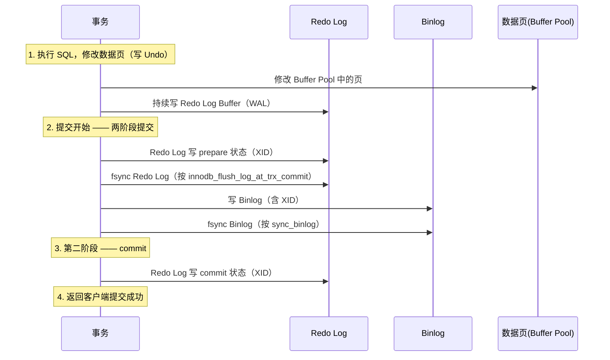

# 日志体系

> **一句话定位**：MySQL 日志体系是面试热点也是理解 crash recovery 与主从复制的根，"讲讲两阶段提交"是资深面试必问
> **面试热度**：⭐⭐⭐⭐⭐
> **返回**：[MySQL 知识图谱](../README.md)

---

## 一、概念定义

### 1.1 四大日志总览

MySQL 日志体系由 InnoDB 引擎层与 Server 层共同组成，核心有四类日志，分别承担回滚、重做、归档复制三大职责。理解每类日志的"产生层 / 内容 / 写入时机 / 生命周期"是讲清 crash recovery 与主从复制的前提。面试时若被问"讲讲 MySQL 的日志"，先报出这四类并说清各自定位，即可建立完整框架。

| 日志 | 作用 | 产生层 | 内容 | 写入时机 | 生命周期 |
|------|------|--------|------|----------|----------|
| **Undo Log（回滚日志）** | 事务回滚 + MVCC 版本链 | InnoDB 引擎层 | 行旧值（逻辑-物理混合） | 修改数据前先写 Undo | 事务提交后由 Purge 线程清理（无活跃快照引用时） |
| **Redo Log（重做日志）** | crash recovery 保证持久性 | InnoDB 引擎层 | 页级物理修改（哪个页哪个偏移改成什么） | WAL：修改 Buffer Pool 前先写 Redo Log Buffer | 循环写，被 Checkpoint 覆盖后失效 |
| **Binlog（归档日志）** | 主从复制 + 数据归档恢复 | Server 层（所有引擎共用） | SQL 语句 / 行变更（逻辑日志） | 事务提交时写入 | 按文件滚动，`binlog_expire_logs_seconds` 控制保留天数 |
| **Relay Log（中继日志）** | 从库接收主库 Binlog 回放 | 从库 Server 层 | 与 Binlog 格式一致 | IO Thread 拉取主库 Binlog 写入 | SQL Thread 回放完成后按 `relay_log_purge` 清理 |

**层次关系一句话**：Undo 和 Redo 都在 InnoDB 引擎层（MyISAM 没有），Binlog 在 Server 层（所有引擎共用），Relay Log 只在从库存在。面试时强调"层次不同"是区分 Binlog 与 Redo 的关键。

**面试回答框架**：被问"讲讲 MySQL 的日志"时，先报四类日志（Undo/Redo/Binlog/Relay Log）并说清各自定位（回滚/重做/归档复制/中继），再点出层次差异（InnoDB 层 vs Server 层），最后抛出两阶段提交作为深入点。这个框架覆盖 80% 的日志面试题。

**日志体系的演进**：MySQL 最初只有 Binlog（Server 层），用于复制。InnoDB 作为插件加入后自带 Redo Log 和 Undo Log（引擎层），解决崩溃恢复与事务回滚。5.6 引入并行复制，5.7 完善并行复制（LOGICAL_CLOCK），8.0 引入 WRITESET 并行复制与 Redo Log 容量动态调整。理解演进有助于回答"为什么 MySQL 有多个日志"这类问题——历史遗留 + 职责分工。

**日志与 ACID 的对应关系**：①原子性（A）——Undo Log 保证（事务回滚）；②持久性（D）——Redo Log 保证（crash recovery）；③隔离性（I）——Undo Log + MVCC + 锁保证（快照读非锁定）；④一致性（C）——Undo + Redo + Binlog + 两阶段提交共同保证（崩溃后数据一致）。面试时用 ACID 对应日志，能清晰展示体系理解。

### 1.2 各日志详细说明

**Undo Log（回滚日志）**：记录修改前的行旧值，用于事务回滚与 MVCC 快照读。每行数据隐藏列 `DB_TRX_ID`（最近修改事务 ID）、`DB_ROLL_PTR`（指向 Undo Log 的回滚指针）串联起版本链。Undo 存放在独立 Undo 表空间（8.0 默认 `undo_001/undo_002`），由 Purge 线程清理。大事务会产生大量 Undo 且迟迟不能 Purge，导致 Undo 表空间膨胀。Undo 是逻辑-物理混合日志：逻辑上记录"这一行原来是什么"，但承载在物理页结构上。Undo 的写入时机是"修改数据前先写"，保证无论事务是否提交，都能通过 Undo 恢复到修改前状态。

**Redo Log（重做日志）**：记录页级物理修改（如"页号 X 偏移 Y 改成 Z"），是物理日志。InnoDB 用 WAL（Write-Ahead Logging）保证持久性：先写 Redo Log 再改 Buffer Pool 中的数据页，崩溃后用 Redo Log 重放恢复已提交但未刷盘的修改。Redo Log 固定大小循环写，8.0.30 后由 `innodb_redo_log_capacity` 单一参数控制总容量。Redo 是物理日志，重放时直接定位页偏移写入，幂等且速度快，是 InnoDB 崩溃恢复快于其他数据库的关键。Redo 的写入时机是 WAL 模式——修改数据前先写 Redo Log Buffer，事务提交时按 `innodb_flush_log_at_trx_commit` 刷盘。

**Binlog（归档日志）**：Server 层产生的逻辑日志，记录 SQL 语句（STATEMENT）或行变更（ROW），用于主从复制与数据归档恢复。所有存储引擎共用 Binlog，这是 MyISAM 也能做主从复制的原因。事务提交时写 Binlog，按文件滚动（`binlog.000001`、`binlog.000002`...）。8.0 默认 ROW 格式（5.7 默认 STATEMENT），因为 ROW 的一致性更强，且 Canal 等增量同步工具依赖 ROW 格式。Binlog 的写入时机是事务提交时（两阶段提交的第二阶段），与 Redo Log 的"执行中持续写"不同。

**Relay Log（中继日志）**：从库接收主库 Binlog 后落地的中转日志，结构与 Binlog 完全一致。IO Thread 从主库拉 Binlog 写本地 Relay Log，SQL Thread 读 Relay Log 回放到从库数据。5.7+ 支持并行复制（基于组提交 / WRITESET），5.6 只能单线程回放导致从库延迟。Relay Log 的存在解耦了"拉取"与"回放"，两者可异步执行，IO Thread 不必等 SQL Thread 回放完。Relay Log 的写入时机是 IO Thread 拉到主库 Binlog 后立即写入，回放后按 `relay_log_purge` 清理。

### 1.3 物理日志 vs 逻辑日志 vs 逻辑-物理混合

日志按内容记录方式可分为三类，理解三者的区别是讲清"为什么 Redo 恢复快、Binlog 可移植、Undo 兼顾回滚与版本链"的关键：

| 类型 | 代表日志 | 内容特征 | 优点 | 缺点 |
|------|----------|----------|------|------|
| **物理日志** | Redo Log | 记录"哪个页哪个偏移改成什么"，与存储格式强绑定 | 恢复快（直接重放物理操作）、幂等（重放多次结果一致） | 不可跨引擎、不可跨版本、记录量大但 InnoDB 压缩后量小 |
| **逻辑日志** | Binlog | 记录 SQL 语句或行变更，与存储格式解耦 | 可跨引擎、可跨版本、可移植性强（恢复/复制） | 恢复慢（需重新执行 SQL）、非幂等（STATEMENT 格式下 `NOW()`/`RAND()` 不确定） |
| **逻辑-物理混合** | Undo Log | 记录行旧值（逻辑上"这一行原来是什么"），但承载在物理页结构上 | 同时支持回滚（逻辑）与 MVCC（版本链） | 清理依赖 Purge 线程，长事务导致堆积 |

**面试记忆口诀**：Redo 是物理（页级），Binlog 是逻辑（SQL/行级），Undo 是混合（行旧值）。物理恢复快但不可移植，逻辑可移植但恢复慢，Undo 兼顾回滚与版本链所以是混合。

**为什么 Redo 用物理日志而 Binlog 用逻辑日志**：Redo 的目标是 crash recovery（恢复本机数据），物理日志直接定位页偏移写入，速度快且幂等，适合本机恢复；Binlog 的目标是主从复制与归档，从库可能引擎/版本不同，逻辑日志与存储格式解耦，可移植性强。两者职责不同，故日志类型不同。

**三种日志的协作关系**：一次 UPDATE 操作，①先写 Undo Log（记录旧值）；②修改 Buffer Pool 中的页，同时写 Redo Log（记录页物理修改）；③事务提交时，按两阶段提交：Redo Log prepare → 写 Binlog（记录行变更）→ Redo Log commit。Undo 用于回滚和 MVCC，Redo 用于崩溃恢复，Binlog 用于主从复制，三者各司其职又通过两阶段提交保持一致。

---

## 二、原理与流程

### 2.1 Undo Log（回滚日志）

#### 2.1.1 作用与内容

Undo Log 有两大核心作用：①**事务回滚**——事务执行中或回滚时，用 Undo Log 恢复数据到修改前的状态，保证原子性（A）；②**MVCC 版本链**——快照读时通过 Undo Log 串联的历史版本判断可见性，实现非锁定读（隔离性 I）。Undo 记录的是行旧值，每条 Undo 记录对应一次行修改，多个修改形成链表。

**Undo 的两类记录**：①`TRX_UNDO_INSERT_REC`（插入操作的 Undo）——只需记录主键值，回滚时按主键删除，事务提交后即可清理（无 MVCC 价值）；②`TRX_UNDO_UPD_EXIST_REC`（更新/删除操作的 Undo）——记录修改前的完整行旧值，回滚时恢复旧值，事务提交后仍需保留供 MVCC 快照读，由 Purge 线程清理。

**Undo 与 MVCC 的关系**：MVCC（多版本并发控制）依赖 Undo Log 实现快照读。当一个事务在读数据时，若该数据已被其他事务修改但未提交，通过 Undo Log 找到旧版本读取，避免加锁阻塞。隔离级别 RC（读已提交）每次 SELECT 生成新 ReadView，读到最新已提交版本；RR（可重复读）事务首次 SELECT 生成 ReadView，后续复用，保证可重复读。两者都依赖 Undo 版本链。详见 [事务与 MVCC](../02-transaction/transaction-and-mvcc.md)。

**Undo 与隔离级别的关系**：RC 级别下，每次 SELECT 生成新 ReadView，事务提交后旧 Undo 可被 Purge（无活跃快照引用）；RR 级别下，事务首次 SELECT 生成 ReadView 并复用，该 ReadView 会阻止其后所有 Undo 的 Purge 直到事务结束。因此 RR 级别下长事务的 Undo 膨胀比 RC 更严重（ReadView 存活时间长）。生产中若业务允许，用 RC 可减少 Undo 膨胀风险。

**Undo 的回滚类型**：①事务主动回滚（`ROLLBACK`）——按 Undo Log 逆序恢复旧值；②崩溃恢复回滚——对处于 prepare 状态且 Binlog 未写的事务回滚；③死锁回滚——InnoDB 检测到死锁后选一个事务回滚（按 Undo 量最小原则）。回滚的代价取决于事务修改的行数，大事务回滚慢。

**Undo Log 的物理存储**：Undo Log 存放在 Undo 表空间的 Undo 页中（16KB 页），按 Undo Segment 组织。每个 Undo Segment 头部记录该 Segment 的状态（Active/Free/Cached）。Undo 页的修改也会产生 Redo Log（Undo 是持久化的，崩溃后需恢复），因此 Undo 与 Redo 是协作关系：Undo 保证逻辑回滚，Redo 保证 Undo 本身不丢。

**Undo Log 的压缩**：8.0 支持 Undo Log 压缩（`innodb_undo_log_truncate=ON` 时自动 truncate 回收空间），但不压缩单个 Undo 记录。Undo 记录的格式紧凑（只记录必要字段），单条记录通常几十字节。大事务产生大量 Undo 记录，累积后占用多个 Undo 页，导致 Undo 表空间膨胀。

**Undo Log 与临时表**：临时表的修改也产生 Undo Log，但临时表的 Undo 不记 Redo Log（临时表崩溃后无需恢复，会话结束自动删除）。这是 InnoDB 的优化，减少临时表操作的 Redo 开销。因此临时表的大批量操作（如 `CREATE TEMPORARY TABLE ... INSERT ... SELECT`）不会撑大 Redo Log，但仍会产生 Undo（用于事务回滚）。

#### 2.1.2 存放与表空间

Undo Log 存放在 Undo 表空间中。8.0 默认有两个 Undo 表空间文件 `undo_001`、`undo_002`（位于数据目录），由 `innodb_undo_tablespaces` 控制（8.0.14+ 该参数已废弃，Undo 表空间自动管理）。Undo 表空间支持自动 truncate：`innodb_undo_log_truncate=ON`（默认）时，当 Undo 表空间超过 `innodb_max_undo_log_size`（默认 1GB）且活跃事务最小 undo segment 释放后，自动 truncate 回收空间。

**8.0 Undo 改进**：5.7 需手动配置独立 Undo 表空间且不支持在线 truncate（需停机）；8.0 默认独立 Undo 表空间 + 自动 truncate，彻底解决 Undo 膨胀需停机的问题。这是 8.0 在运维便利性上的重大改进。Undo 表空间内部由多个 Rollback Segment 组成，每个 Rollback Segment 含 1024 个 Undo Segment，每个 Undo Segment 处理一个事务的 Undo。

**Undo Segment 的分配**：事务开始时从 Rollback Segment 中分配一个空闲的 Undo Segment，事务的所有 Undo 记录写入该 Segment。事务提交后，Undo Segment 标记为可重用（INSERT 类 Undo）或进入 History 链等待 Purge（UPDATE/DELETE 类 Undo）。高并发场景下 Undo Segment 可能不够用（默认 128 个 Rollback Segment），导致事务等待，可调大 `innodb_rollback_segments`。

**Undo Log 的持久化与 Redo**：Undo Log 存放在 Undo 页中，Undo 页的修改也会产生 Redo Log。崩溃恢复时先重放 Redo Log（恢复 Undo 页），再用 Undo Log 回滚未提交事务。因此 Undo 与 Redo 是协作关系：Undo 保证逻辑回滚，Redo 保证 Undo 页本身不丢。这也是 Undo 被称为"逻辑-物理混合"的原因——逻辑上记旧值，物理上承载在 Undo 页（受 Redo 保护）。

**Undo 与 Redo 的写入顺序**：修改数据前先写 Undo Log（保证可回滚），再修改 Buffer Pool 中的页并写 Redo Log（WAL）。顺序：①写 Undo Log 到 Undo 页（Undo 页的修改也产生 Redo）；②修改数据页（产生 Redo）；③MTR 提交，Redo Log 写入 Log Buffer。因此一个修改产生两条 Redo（Undo 页修改 + 数据页修改），这是 InnoDB 保证原子性与持久性的代价。

**Undo 与回滚的关系**：事务执行 `ROLLBACK` 时，InnoDB 按 Undo Log 的逆序应用旧值，恢复数据到事务开始前的状态。回滚的代价取决于事务修改的行数：大事务回滚慢（需逐行恢复），可能阻塞其他事务（持锁时间长）。因此生产中应避免大事务，既能减少 Undo 膨胀，又能降低回滚代价。

#### 2.1.3 活跃 Undo 与 History 链

Undo Log 有两种状态：①**活跃 Undo（Active）**——事务尚未提交，对应的 Undo 不能被清理；②**History 链（History List）**——事务已提交，但 Undo 仍保留，供 MVCC 快照读使用，由 Purge 线程在无活跃快照引用时清理。

**版本链结构**：每行数据隐藏列 `DB_TRX_ID`（事务 ID）、`DB_ROLL_PTR`（指向 Undo Log 的指针），多次修改后形成链表：当前行 → Undo1（旧值1）→ Undo2（旧值2）→ ...。ReadView 通过 `DB_TRX_ID` 与可见性判断决定沿版本链读到哪一版本。版本链越长，快照读遍历越多，性能越差。

**ReadView 与 Undo 的关系**：ReadView 记录生成时所有活跃事务 ID，读数据时若行的 `DB_TRX_ID` 在 ReadView 的活跃事务中（说明修改该行的事务还未提交），则沿 `DB_ROLL_PTR` 找 Undo 旧版本，直到找到 `DB_TRX_ID` 小于 ReadView 最小活跃事务 ID 的版本（说明该版本在 ReadView 生成前已提交）。

**Undo 版本链的退化**：若 History 链过长（长事务导致 Purge 阻塞），快照读需遍历多个版本才能找到可见版本，性能劣化。生产监控 `History list length` 应 <1000，超 10000 告警。极端情况下版本链可达数百个，单次 SELECT 延迟从毫秒级劣化到秒级。

#### 2.1.4 Purge 线程清理

Purge 线程负责清理 History 链中不再被任何活跃事务快照引用的 Undo 记录。8.0 默认有 4 个 Purge 线程（`innodb_purge_threads=4`）。Purge 时机：当 Undo 表空间中可清理的 Undo 页超过 `innodb_purge_batch_size`（默认 300）时触发。

**Purge 阻塞的代价**：若存在长事务（长 SQL 或长连接中未提交的事务），该事务的 ReadView 会阻止其之后所有 Undo 的 Purge，导致 Undo 表空间膨胀、History 链过长、快照读需遍历更多版本导致性能下降。监控 `SHOW ENGINE INNODB STATUS` 中 `History list length`（应 <1000，超 10000 告警）。

**Purge 与 Delete 的关系**：`DELETE` 操作只是在记录上打删除标记（`deleted flag`），真正删除物理记录由 Purge 线程完成。因此大量 DELETE 后若 Purge 跟不上，空间不会立即释放，需等 Purge 完成。`TRUNCATE` 则直接重建表空间，不产生大量 Undo。

#### 2.1.5 大事务导致 Undo 膨胀

长事务（运行时间长、修改行数多）会产生大量 Undo 记录且迟迟不能 Purge，导致：①Undo 表空间文件持续增长；②History 链过长，快照读性能劣化；③Purge 线程压力增大，可能阻塞 DDL（`TRUNCATE` 需等待 Undo 清理）；④Undo 表空间满后事务无法继续（报错 `Undo log full`）。

排查方法：①`information_schema.innodb_trx` 查 `trx_started`、`trx_rows_modified` 找长事务；②`SHOW ENGINE INNODB STATUS` 看 `History list length`；③`information_schema.innodb_metrics` 查 `undo_log_truncations`（truncate 次数）。

解决：①及时提交事务，避免长连接中开启事务不关闭；②拆分大事务为小事务（如批量更新改为分批）；③监控长事务告警（`information_schema.innodb_trx` 查超时事务或应用层 `@Transactional(timeout=30)`）；④8.0 开启 `innodb_undo_log_truncate=ON` 自动 truncate。

**源码路径**：`storage/innobase/trx/trx0undo.cc`（Undo Log 管理）、`storage/innobase/trx/trx0purge.cc`（Purge 线程）、`storage/innobase/trx/trx0rseg.cc`（Rollback Segment）、`storage/innobase/trx/trx0rec.cc`（Undo 记录解析）。

### 2.2 Redo Log（重做日志）

#### 2.2.1 作用与内容

Redo Log 的核心作用是 **crash recovery 保证持久性（D）**：已提交事务的修改即使数据页未刷盘，崩溃后也能用 Redo Log 重放恢复。Redo 记录的是页级物理修改（如"页号 100 偏移 200 写入字节 0x1A2B"），是物理日志。

**为什么是物理日志**：物理日志重放时直接定位到页偏移写入，幂等（重放多次结果一致）且速度快。若用逻辑日志（SQL）恢复，需重新执行 SQL、走完整执行计划，慢且非幂等。物理日志是 InnoDB 崩溃恢复快于其他数据库的关键。一条 SQL 可能修改多个页（如 B+树分裂），Redo Log 记录每个页的物理修改，恢复时逐页重放。

**Redo Log 的物理格式**：Redo Log 由多个 Redo Log Block 组成，每个 Block 512 字节（与磁盘扇区大小对齐，保证写入原子性）。Block Header 包含 LSN、数据长度等元信息，Block Body 是 Redo Log 记录。Redo Log 记录的格式因操作类型而异（如插入、更新、B+树分裂各有不同的 Redo 格式），但都包含"页号 + 偏移 + 修改内容"。

**Redo Log 与 LSN**：LSN（Log Sequence Number）是 Redo Log 的单调递增序号，每写入一定量 Redo Log LSN 增加。LSN 用于追踪 Redo Log 的写入进度与数据页的刷盘进度。Checkpoint LSN 是"已刷盘数据页的最大 LSN"，崩溃恢复只需重放 Checkpoint LSN 之后的 Redo Log。详见 [存储引擎底层](../05-storage/innodb-engine.md) 的 LSN 与 Checkpoint 章节。

**Redo Log 的幂等性与崩溃恢复**：Redo Log 重放是幂等的（重放多次结果一致），因为记录的是"页号 X 偏移 Y 写入 Z"（覆盖写入，不依赖原值）。崩溃恢复时即使部分页已刷盘（重放前已是新值），重放也不影响（覆盖写入相同值）。这是物理日志优于逻辑日志的关键特性——逻辑日志重放非幂等（如 `UPDATE SET count=count+1` 重放两次结果错误）。

**Redo Log Archiving（8.0.17+）**：8.0.17 引入 Redo Log 归档功能，将 Redo Log 复制到备份目录，用于物理备份一致性。备份工具（如 Percona XtraBackup）读取归档的 Redo Log 保证备份一致。`innodb_redo_log_archive_dirs` 配置归档目录。这是 8.0 在备份恢复方面的改进。

**Redo Log 与 Buffer Pool 的协作**：①修改 Buffer Pool 中的页（产生脏页）；②MTR 将 Redo Log 写入 Log Buffer；③脏页异步刷盘（Page Cleaner 线程）；④Redo Log 在 Checkpoint 时确认脏页已刷盘，可被覆盖。若脏页刷盘慢（如 IO 瓶颈），Redo Log 可用空间不足，可能触发同步刷盘（用户线程等待），导致写入抖动。生产建议 SSD + 足够大的 Redo Log 容量，避免此问题。

#### 2.2.2 结构与循环写

Redo Log 由固定大小的文件组成，循环写：`ib_logfile0`、`ib_logfile1`（8.0 默认）。写满一个文件后切换到下一个，所有文件写满后回到第一个覆盖最旧的数据（此时需确保最旧的数据已被 Checkpoint 刷盘）。

**8.0.30 Redo Log 容量演进**：5.7/8.0.30 之前用 `innodb_log_file_size`（单文件大小）+ `innodb_log_files_in_group`（文件数，默认 2）两个参数控制；8.0.30+ 改为单一参数 `innodb_redo_log_capacity`（默认 100MB，生产建议 4-8GB），动态调整无需重启。旧的 `innodb_log_file_size`、`innodb_log_files_in_group` 已废弃。`innodb_redo_log_capacity` 支持 `SET GLOBAL` 在线调整，后台线程自动 resize。

**循环写 vs 顺序追加写**：Redo Log 是固定文件循环写（覆盖旧数据），Binlog 是按文件滚动追加写（不覆盖）。这是两者最本质的写入方式差异：Redo Log 只需保证"未刷盘的修改可恢复"，刷盘后即可覆盖；Binlog 需保留全部历史用于归档与复制，不能覆盖。

**Redo Log 容量大小的影响**：①太小——Checkpoint 频繁触发，刷盘压力大，写入抖动；②太大——crash recovery 时间长（需重放更多 Redo）。生产建议 Redo Log 总容量能容纳 1 小时的写入量，平衡刷盘频率与恢复时间。

**Redo Log 与 Checkpoint 的关系**：Checkpoint 是"已刷盘数据页的最大 LSN"，Redo Log 中 LSN 小于 Checkpoint LSN 的部分可被覆盖。当 Redo Log 写入追上 Checkpoint（即可用空间不足）时，InnoDB 强制触发 Checkpoint 刷盘，可能导致写入抖动（用户线程等待刷盘完成）。因此 Redo Log 容量需足够大，避免频繁触发强制 Checkpoint。详见 [存储引擎底层](../05-storage/innodb-engine.md) 的 Checkpoint 章节。

**Redo Log 的写入流程**：①事务修改 Buffer Pool 中的页（产生脏页）；②MTR 将 Redo Log 记录写入 Log Buffer（内存）；③Log Buffer 按 `innodb_flush_log_at_trx_commit` 策略刷盘（写 OS Page Cache + fsync）；④后台线程（`log_writer`）持续将 Log Buffer 刷盘，不必等事务提交。8.0 优化了 Log Buffer 的并发写入（无锁化），提升高并发吞吐。

**Redo Log 的循环写机制**：Redo Log 文件逻辑上是环形结构，写入指针（`log_sn`）不断前进，Checkpoint 指针（`checkpoint_lsn`）跟随刷盘进度推进。当写入指针追上 Checkpoint 指针（差值达到 Redo Log 容量）时，需等待 Checkpoint 推进（刷盘）才能继续写入。生产建议 Redo Log 容量能容纳 1 小时写入量，避免写入追上 Checkpoint 导致抖动。

**Redo Log 的刷盘触发时机**：①事务提交时（按 `innodb_flush_log_at_trx_commit`）；②后台线程每秒刷盘（`innodb_flush_log_at_timeout` 默认 1s）；③Log Buffer 占用超过 `innodb_log_buffer_size` 一半时触发刷盘；④Checkpoint 触发时（需保证 Redo Log 可被覆盖）。多种触发时机保证 Redo Log 及时落盘，平衡性能与安全性。

#### 2.2.3 Mini-Transaction（MTR）批量写入

InnoDB 的修改以 Mini-Transaction（MTR）为单位批量写入 Redo Log Buffer，再批量刷盘，减少 IO 次数。一个 MTR 内可能包含多个页的修改，这些修改要么全部成功要么全部失败（保证原子性）。MTR 是 InnoDB 内部的"最小事务单元"，比数据库事务粒度更小（一个事务包含多个 MTR）。

**MTR 流程**：①修改 Buffer Pool 中的页（写脏页）；②将 Redo Log 记录写入 MTR 内部缓冲；③MTR 提交时将 Redo Log 写入 Log Buffer，并将脏页加入 Flush List；④Log Buffer 按 `innodb_flush_log_at_trx_commit` 策略刷盘。

**MTR 的原子性保证**：MTR 提交时，其 Redo Log 记录作为一个整体写入 Log Buffer，要么全部可见要么全部不可见。崩溃恢复时，若 MTR 的 Redo Log 不完整（如写到一半崩溃），整个 MTR 被丢弃。这是通过 Redo Log 的 LSN 与校验和实现的。

**MTR 与 B+树分裂**：B+树页分裂涉及多个页的修改（原页分裂、新页分配、父页指针更新），这些修改必须原子完成（否则 B+树结构损坏）。MTR 将一次页分裂的所有修改打包，要么全部重放要么全部丢弃，保证 B+树一致性。这是 InnoDB 用 MTR 而非单条 Redo 记录的原因。

**MTR 与 Doublewrite Buffer 的协作**：MTR 提交时不仅写 Redo Log，还将脏页加入 Flush List。脏页刷盘前先写 Doublewrite Buffer（防页撕裂），再写到目标位置。崩溃恢复时，若页撕裂（部分写入），Doublewrite Buffer 中有完整副本可恢复，再用 Redo Log 重放。详见 [存储引擎底层](../05-storage/innodb-engine.md) 的 Doublewrite Buffer 章节。

**MTR 的类型**：①`MTR_LOG_ALL`——正常 MTR，产生 Redo Log；②`MTR_LOG_NONE`——不产生 Redo Log（如临时表修改，崩溃后无需恢复）；③`MTR_LOG_SHORT_INSERTS`——B+树插入的优化 MTR，减少 Redo 量。InnoDB 根据操作类型选择 MTR 类型，减少不必要的 Redo 写入。

**MTR 与事务的关系**：一个事务包含多个 MTR（每条 SQL 可能产生多个 MTR，如 B+树分裂涉及多个页的修改）。MTR 是 InnoDB 内部的原子单位，事务是用户层的原子单位。事务提交时（两阶段提交的 commit），其所有 MTR 的 Redo Log 已写入 Log Buffer，commit 状态写入后才算事务成功。

#### 2.2.4 innodb_flush_log_at_trx_commit 三级刷盘策略

`innodb_flush_log_at_trx_commit` 控制 Redo Log 刷盘策略，是持久性与性能的权衡核心：

| 取值 | 行为 | MySQL 崩溃 | OS 崩溃/断电 | 性能 |
|------|------|------------|--------------|------|
| **0**（延迟写） | 每秒由后台线程将 Log Buffer 写入 OS Page Cache 并 fsync 到磁盘，事务提交时不触发 | 可能丢 1 秒数据 | 丢未 fsync 的数据 | 最高 |
| **1**（双 1 标准） | 事务提交时将 Log Buffer 写入 OS Page Cache 并 fsync 到磁盘 | 完全不丢 | 完全不丢 | 最低（每次提交都 fsync） |
| **2**（延迟刷） | 事务提交时将 Log Buffer 写入 OS Page Cache，但每秒才 fsync 到磁盘 | 完全不丢（OS Cache 还在） | 可能丢 1 秒数据 | 居中 |

**生产建议**：核心交易库必须 `=1`（双 1 配置）；日志库/可容忍秒级丢失的库可用 `=2` 提升性能 3-5 倍；`=0` 仅用于可丢数据的场景（极少）。注意：`=2` 在 MySQL 进程崩溃时不丢数据（OS Page Cache 仍在），但 OS 崩溃或断电时丢 1 秒数据，因此 `=2` 比 `=0` 安全但仍不如 `=1`。

**fsync 的代价**：`fsync` 是系统调用，强制将 OS Page Cache 的数据写入磁盘，等待磁盘 ACK，延迟高（机械盘约 10ms，SSD 约 1ms）。高并发场景下每个事务都 fsync 会成为瓶颈，故有 Group Commit 攒批 fsync。详见 [存储引擎底层](../05-storage/innodb-engine.md) 的刷盘策略章节。

**innodb_flush_method 与 Redo Log**：`innodb_flush_method=O_DIRECT`（生产推荐）时，数据页绕过 OS Cache 直接写磁盘（避免 Buffer Pool 与 OS Cache 的 double buffer），但 Redo Log 仍走 OS Page Cache（`fsync` 刷盘），利用 OS Cache 的顺序写优化。若用 `O_DIRECT` 对 Redo Log 也绕过 OS Cache，反而降低性能（失去顺序写合并优化）。

**源码路径**：`storage/innobase/log/log0log.cc`（Redo Log 核心逻辑，8.0.30 后拆分为 `log0buf.cc`/`log0write.cc`/`log0files.cc`）、`storage/innobase/log/log0sync.cc`（刷盘同步）、`storage/innobase/log/log0recv.cc`（崩溃恢复重放）、`storage/innobase/log/log0write.cc`（Redo Log 写入）。

### 2.3 Binlog（归档日志）

#### 2.3.1 作用与产生层

Binlog 的两大作用：①**主从复制**——从库通过拉取主库 Binlog 回放实现数据同步；②**数据归档与恢复**——基于时间点恢复（PITR），用 `mysqlbinlog` 工具解析 Binlog 重放。Binlog 由 Server 层产生，所有存储引擎共用（MyISAM 也写 Binlog），这是与 Redo Log（InnoDB 独有）的关键区别。

**Binlog 的写入时机**：事务提交时写入。具体流程：①事务执行中各语句修改数据（产生 Redo/Undo）；②事务提交时，Server 层将事务的所有变更写入 Binlog Cache（`binlog_cache_size` 控制）；③Binlog Cache 写入 Binlog 文件并按 `sync_binlog` 刷盘；④写 Redo Log commit。注意 Binlog 在 Redo Log prepare 之后、Redo Log commit 之前写入，这是两阶段提交的顺序。

**Binlog Cache 与临时文件**：事务执行中产生的 Binlog 变更先写入内存中的 Binlog Cache（`binlog_cache_size` 默认 32KB），事务提交时才写入 Binlog 文件。若 Binlog Cache 不够（大事务），会溢出到临时文件（`tmpdir`），性能下降且占用磁盘。生产建议调大 `binlog_cache_size`（如 4MB）并监控 `Binlog_cache_disk_use`。

**Binlog 文件滚动**：Binlog 文件达到 `max_binlog_size`（默认 1GB）后滚动到新文件（`binlog.000001` → `binlog.000002`）。`FLUSH BINARY LOGS` 命令手动触发滚动。`binlog_expire_logs_seconds`（8.0，默认 2592000 即 30 天）控制 Binlog 文件保留时长，过期自动删除。注意：若从库尚未拉取某个 Binlog 文件，主库不会删除（即使过期）。

#### 2.3.2 格式：STATEMENT / ROW / MIXED

| 格式 | 内容 | 优点 | 缺点 | 适用场景 |
|------|------|------|------|----------|
| **STATEMENT** | 记录原始 SQL 语句 | 日志量小、可读性强 | 非幂等：`NOW()`/`UUID()`/`RAND()` 等不确定函数主从不一致；`LIMIT` 无 `ORDER BY` 顺序不确定 | 简单 SQL、无不确定函数 |
| **ROW**（8.0 默认） | 记录每行的变更前后的值（`binlog_row_image=FULL` 记录完整行） | 幂等、确定性、主从一致；能处理触发器/存储过程的副作用 | 日志量大（每行一条）、可读性差（需 `mysqlbinlog --base64-output=DECODE-ROWS -v` 解码） | 复杂 SQL、高一致性要求（生产默认） |
| **MIXED** | 自动判断：一般 SQL 用 STATEMENT，含不确定函数时用 ROW | 兼顾日志量与一致性 | 判断逻辑复杂，某些边界情况仍可能不一致 | 折中方案，8.0 已少用 |

**8.0 默认 ROW 的原因**：①ROW 一致性更强，无不确定函数问题；②Canal、Debezium 等增量同步工具依赖 ROW 格式；③ROW 支持更细粒度的并行复制（WRITESET 基于 ROW 的行哈希）；④8.0 优化了 ROW 的日志量（`binlog_row_image=MINIMAL` 只记录变更列）。生产环境强烈建议 ROW。

**`binlog_row_image`**：控制 ROW 格式记录的行内容：①`FULL`（默认）——记录变更前后的所有列；②`MINIMAL`——只记录变更列和主键；③`NOBLOB`——除 BLOB/TEXT 外记录所有列。`MINIMAL` 可减少日志量，但 Canal 等工具需完整行，建议保持 `FULL`。

**STATEMENT 格式的陷阱**：①`NOW()`/`CURRENT_TIMESTAMP`——主从时间不同导致值不同；②`UUID()`/`RAND()`——随机值主从不同；③`INSERT ... SELECT ... LIMIT`无 `ORDER BY`——主从行顺序不同导致复制数据不同；④触发器/存储过程的副作用——STATEMENT 不记录触发器内部修改，可能漏数据。ROW 格式记录所有行变更，无这些问题。

**MIXED 格式的局限**：MIXED 试图兼顾日志量与一致性，但判断逻辑复杂（哪些 SQL 用 STATEMENT、哪些用 ROW），某些边界情况仍可能不一致。8.0 已少用 MIXED，推荐直接用 ROW。

**ROW 格式的日志量优化**：①`binlog_row_image=MINIMAL`——只记录变更列和主键，减少单行日志量；②`binlog_row_value_options=PARTIAL_JSON`——JSON 类型只记录变更部分；③压缩 Binlog（`binlog_transaction_compression=ON`，8.0.20+）——对 Binlog 事务压缩，减少网络传输与存储。大表场景这些优化可减少 50%+ 的 Binlog 量。

**Binlog 与其他引擎的兼容性**：Binlog 是 Server 层日志，所有引擎共用。MyISAM 表的修改也写 Binlog（若无事务则每条 SQL 一个 Binlog 事务）。但 MyISAM 无事务支持，崩溃后无法用 Redo 恢复（无 Redo Log），只能依赖 Binlog 做数据恢复。8.0 系统表已转 InnoDB，MyISAM 仅用于特殊场景。

#### 2.3.3 写入模式：sync_binlog 与组提交

`sync_binlog` 控制 Binlog 刷盘策略，与 `innodb_flush_log_at_trx_commit` 对应：

| 取值 | 行为 | MySQL 崩溃 | OS 崩溃/断电 | 性能 |
|------|------|------------|--------------|------|
| **0** | 事务提交时只写 OS Page Cache，由 OS 决定何时 fsync | 完全不丢 | 丢未 fsync 的数据 | 最高 |
| **1**（双 1 标准） | 事务提交时 fsync 到磁盘 | 完全不丢 | 完全不丢 | 最低 |
| **N**（如 100） | 每 N 次事务提交 fsync 一次 | 最多丢 N 个事务 | 最多丢 N 个事务 | 居中 |

**组提交（Group Commit）**：多个事务的 Binlog 攒批后一次性 fsync，减少 IO 次数。核心参数：①`binlog_group_commit_sync_delay`（默认 0，设为如 1000μs 表示攒批 1ms）；②`binlog_group_commit_sync_no_delay_count`（默认 0，设为如 10 表示攒够 10 个事务）。两者满足任一即触发 fsync。生产高并发场景建议开启，吞吐可提升 2-3 倍。

**组提交的三阶段**：①Flush Stage——各事务将 Binlog 写入 OS Page Cache；②Sync Stage——攒批 fsync；③Commit Stage——各事务写 Redo Log commit。三个 Stage 流水线化，提升并发吞吐。8.0 优化了组提交的流水线效率，高并发下吞吐显著提升。

**组提交与 binlog_order_commits**：`binlog_order_commits=ON`（默认）保证事务按 Binlog 写入顺序 commit，便于从库按顺序回放。`OFF` 时 commit 顺序可能与 Binlog 顺序不同，性能略高但从库需处理乱序提交。生产建议保持 `ON`，除非确认从库能处理乱序（如用 WRITESET 并行复制）。

**组提交与并行复制的协同**：主库组提交越激进（攒批大），同组事务写入 Binlog 时被打上相同的 `sequence` 号，从库识别同 `sequence` 的事务可并行回放（COMMIT_ORDER 策略）。因此调大 `binlog_group_commit_sync_delay` 不仅提升主库吞吐，还提升从库并行度，是主从复制性能的关键调优参数。但攒批大增加主库事务延迟（毫秒级），需权衡。

**双 1 配置**：`innodb_flush_log_at_trx_commit=1` + `sync_binlog=1`，是核心交易库的标配，保证完全不丢已提交数据。折中配置（如 `innodb_flush_log_at_trx_commit=2` + `sync_binlog=100`）适合日志库，性能提升 3-5 倍但容忍秒级丢失。

**Binlog 与 Redo Log 的 fsync 顺序**：两阶段提交中，Redo Log prepare 先 fsync（按 `innodb_flush_log_at_trx_commit`），然后 Binlog fsync（按 `sync_binlog`），最后 Redo Log commit。两个 fsync 是两阶段提交的主要性能开销。Group Commit 将多个事务的 fsync 合并，显著降低开销。

**Binlog 的 Event 类型**：①`QUERY_EVENT`——STATEMENT 格式的 SQL 语句；②`TABLE_MAP_EVENT`——ROW 格式的表映射（表名、列类型）；③`WRITE_ROWS_EVENT`/`UPDATE_ROWS_EVENT`/`DELETE_ROWS_EVENT`——ROW 格式的行变更；④`XID_EVENT`——事务提交标记（两阶段提交的 commit 点）；⑤`Transaction_context_event`——组提交上下文（并行复制用）；⑥`Rows_query_event`——原始 SQL（`binlog_rows_query_events=ON` 时记录）。Canal 解析这些 Event 转为结构化消息。

**Binlog 与 GTID**：GTID 模式下，每个事务的 Binlog 前会有 `GTID_EVENT`，记录该事务的 GTID（`server_uuid:transaction_id`）。从库通过 GTID 判断是否已回放，避免重复。GTID 模式要求主从库的 `server_uuid` 不同（否则 GTID 冲突）。`gtid_purged` 记录已跳过的 GTID（用于从库跳过已手动同步的事务）。

**Binlog 的校验**：8.0 默认开启 Binlog 校验（`binlog_checksum=CRC32`），每个 Event 附带 CRC32 校验和，从库接收时校验，防止网络传输错误。崩溃恢复时也校验 Binlog 完整性，损坏的 Event 会被丢弃。

**Binlog 与事务隔离级别的关系**：Binlog 记录的是已提交事务的变更，与隔离级别无关（无论 RC/RR，只有提交的事务才写 Binlog）。但隔离级别影响 Binlog 的内容：①RC 下事务内的多次修改只记最终值（中间修改被覆盖）；②RR 下同理。注意：RC 隔离级别下 Binlog 的 STATEMENT 格式可能导致主从不一致（锁释放早，从库回放时可能读到不同数据），因此 RC 下建议用 ROW 格式。8.0 默认 ROW，故 RC 可安全使用。

**Binlog 与触发器**：①STATEMENT 格式——触发器内的 SQL 不记 Binlog，从库不会执行触发器（主从触发器逻辑需一致）；②ROW 格式——记录触发器导致的行变更，从库直接应用行变更，不执行触发器。ROW 格式下主从触发器可以不同（从库不执行触发器，只应用行变更）。生产建议 ROW 格式，避免触发器导致的主从不一致。

#### 2.3.4 Binlog vs Redo Log 对比

| 维度 | Binlog | Redo Log |
|------|--------|----------|
| **产生层** | Server 层（所有引擎共用） | InnoDB 引擎层（独有） |
| **内容** | 逻辑日志（SQL/行变更） | 物理日志（页级修改） |
| **写入方式** | 按文件滚动追加写（不覆盖） | 固定大小循环写（覆盖） |
| **写入时机** | 事务提交时写 | WAL：修改数据前先写（事务执行中持续写） |
| **用途** | 主从复制、数据归档恢复 | crash recovery 保证持久性 |

**为什么需要两个**：Redo Log 是 InnoDB 独有的物理日志，保证 crash recovery；Binlog 是 Server 层的逻辑日志，用于主从复制与归档。两者职责不同、层次不同、不能互相替代。若只用 Redo Log，则无法做主从复制（Redo 是物理日志，与存储格式绑定，从库引擎/版本不同则不可用）；若只用 Binlog，则 crash recovery 慢且非幂等（需重新执行 SQL）。两者需保持一致（两阶段提交）。

**历史背景**：MySQL 最初只有 Binlog（Server 层），InnoDB 作为插件加入后自带 Redo Log（引擎层），两者并存。这是 MySQL 架构的历史遗留，但也形成了"物理日志管恢复、逻辑日志管复制"的清晰分工。

**其他数据库的日志设计对比**：①PostgreSQL 只有 WAL（类似 Redo Log），无独立 Binlog，复制基于 WAL 流，架构更简洁但归档能力弱；②Oracle 有 Redo Log（在线日志）+ Archive Log（归档日志），归档日志是 Redo Log 的副本，而非独立逻辑日志；③MySQL 的双日志设计虽复杂，但 Binlog 的逻辑日志特性使其在异构复制（跨引擎/跨版本）和增量同步（Canal）场景有独特优势。

**源码路径**：`sql/binlog.cc`（Binlog 核心逻辑）、`sql/binlog_ostream.cc`（Binlog IO 流）、`sql/rpl_binlog_sender.cc`（主库发送 Binlog 给从库）、`sql/rpl_binlog_receiver.cc`（从库接收 Binlog）、`sql/rpl_rli.cc`（Relay Log 信息管理）。

### 2.4 Relay Log（中继日志）

#### 2.4.1 作用与结构

Relay Log 是从库接收主库 Binlog 后的本地中转日志，结构与 Binlog 完全一致（同样的 event 格式）。从库通过 Relay Log 解耦"拉取"与"回放"：IO Thread 拉主库 Binlog 写 Relay Log，SQL Thread 读 Relay Log 回放，两者可异步执行。Relay Log 的存在使得从库即使暂时无法回放（如锁等待），IO Thread 仍可持续拉取，减少主库 Binlog 积压。

**Relay Log 文件**：`relay-bin.000001`、`relay-bin.000002`...，由 `relay_log` 控制路径（默认数据目录），`max_relay_log_size` 控制单文件大小（默认 0，即与 `max_binlog_size` 一致，1GB）。`relay_log_purge=ON`（默认）时，SQL Thread 回放完成后自动清理旧 Relay Log 文件。

**Relay Log 与 Binlog 的差异**：虽然格式一致，但用途不同——Relay Log 是从库的临时中转，回放后清理；Binlog 是主库的归档，长期保留。从库也可开启 `log_bin` 记录自己的 Binlog（级联复制场景：从库既回放主库 Binlog，又作为下一级从库的主库）。

**Relay Log 的恢复**：从库崩溃后重启，SQL Thread 根据 `relay-log.info`（8.0 为 `mysql.slave_relay_log_info` 表）记录的位点继续回放。若 Relay Log 文件损坏，需重新从主库拉取（`RESET SLAVE` + `CHANGE MASTER TO`）。GTID 模式下，从库自动从断点继续，无需手动指定位点。

#### 2.4.2 IO Thread 与 SQL Thread

- **IO Thread**：连接主库，请求 Binlog（基于主库 `COM_BINLOG_DUMP` 命令），主库通过 `rpl_binlog_sender.cc` 发送 Binlog event，IO Thread 接收后写入本地 Relay Log。IO Thread 维护与主库的连接，记录已拉取的 Binlog 位点（8.0 存于 `mysql.slave_master_info` 表）。IO Thread 断线自动重连，从上次位点继续拉取。
- **SQL Thread**：读 Relay Log 解析 event 并在从库回放（执行 SQL 或应用行变更）。回放完成后记录已回放位点（8.0 存于 `mysql.slave_relay_log_info` 表）。回放完成后 Relay Log 可被清理（`relay_log_purge=ON`，默认）。

**位点管理**：IO Thread 维护 `Master_Log_File` + `Read_Master_Log_Pos`（已拉取的主库 Binlog 位点），SQL Thread 维护 `Relay_Master_Log_File` + `Exec_Master_Log_Pos`（已回放的主库 Binlog 位点）。两者之差即为从库延迟。8.0 推荐用 GTID 代替位点（`gtid_mode=ON`），GTID 自动追踪每个事务的复制状态，切换主库更方便（自动定位断点）。

**GTID 复制**：GTID（Global Transaction ID）格式为 `server_uuid:transaction_id`，每个事务在主库提交时分配唯一 GTID，从库通过 GTID 自动判断是否已回放。GTID 复制的优势：①主从切换时从库自动从断点继续，无需手动指定位点；②避免重复回放（GTID 已执行则跳过）；③便于排查复制故障（可定位到具体事务）。生产建议开启 GTID（8.0 默认支持）。

**GTID 的限制**：①`CREATE TABLE ... SELECT` 不支持（GTID 无法正确追踪）；②事务内不能同时操作事务表与非事务表（如 InnoDB 与 MyISAM）；③`CREATE TEMPORARY TABLE` 不能在事务内（临时表不记 Binlog）；④GTID 模式要求 `enforce_gtid_consistency=ON`，某些 SQL 语法受限。生产开启 GTID 前需评估应用 SQL 兼容性。

**复制延迟的根因**：①SQL Thread 单线程回放（5.6 及之前）；②大事务回放慢；③从库硬件不如主库；④从库有长查询阻塞回放（如大 SELECT 持锁）；⑤网络延迟导致 IO Thread 拉取慢。排查：`SHOW SLAVE STATUS` 看 `Seconds_Behind_Master`、`Slave_IO_Running`、`Slave_SQL_Running`。

#### 2.4.3 5.7+ 并行复制

5.6 的 SQL Thread 单线程回放，主库高并发写入时从库跟不上导致延迟。5.7+ 引入并行复制（基于组提交 `slave_parallel_type=LOGICAL_CLOCK`）：同一组提交内的事务无锁冲突，可在从库并行回放。8.0 进一步支持基于 WRITESET 的并行复制（`binlog_transaction_dependency_tracking=WRITESET`），分析事务修改的行是否有冲突，无冲突即可并行，并行度更高。

| 并行复制策略 | 原理 | 并行度 | 配置 |
|--------------|------|--------|------|
| **COMMIT_ORDER**（5.7 默认） | 主库同一组提交内的事务并行 | 受组提交大小限制 | `slave_parallel_type=LOGICAL_CLOCK` |
| **WRITESET**（8.0 推荐） | 分析事务修改的行（WRITESET）是否冲突，无冲突即并行 | 高（突破组提交限制） | `binlog_transaction_dependency_tracking=WRITESET` |
| **WRITESET_SESSION** | 同一会话内保持顺序，跨会话用 WRITESET | 居中（保守） | `binlog_transaction_dependency_tracking=WRITESET_SESSION` |

**`slave_parallel_workers`** 控制并行回放线程数（8.0 默认 4，生产建议 8-16）。监控 `SHOW SLAVE STATUS` 中 `Seconds_Behind_Master` 与 `Slave_parallel_workers` 的活跃数。并行复制要求主库和从库都配置 `binlog_transaction_dependency_tracking`，主库计算依赖写入 Binlog，从库读取依赖决定并行度。

**5.6 到 8.0 并行复制的演进**：①5.6——`slave_parallel_workers` 只能并行回放不同数据库的事务（`slave_parallel_type=DATABASE`），实用性差（单库无法并行）；②5.7——`slave_parallel_type=LOGICAL_CLOCK` 基于组提交，同组事务并行，突破单库限制；③8.0——`binlog_transaction_dependency_tracking=WRITESET` 基于行冲突分析，并行度更高。8.0 的 WRITESET 是并行复制的重大突破，从库回放速度可接近主库写入速度。

**并行复制的限制**：①热点行场景下并行度受限（事务冲突多）；②从库若有长查询持锁，回放线程等待锁，并行度无法发挥；③DDL 串行回放（DDL 不能并行）；④`replica_preserve_commit_order=ON` 时 commit 阶段串行，可能成为瓶颈。

**WRITESET 的限制**：写入热点行（如计数器表）时，事务间冲突多，WRITESET 退化为 COMMIT_ORDER，并行度无提升。`transaction_write_set_extraction` 控制 WRITESET 的哈希算法（`MURMUR32`/`XXHASH64`，8.0 默认 `XXHASH64`）。

**从库并行复制监控**：`SHOW SLAVE STATUS` 中 `Slave_parallel_workers` 显示配置的并行线程数，`Slave_parallel_mode` 显示并行策略。`performance_schema.threads` 表可查看各 Worker 线程的状态（空闲/忙碌）。若大部分 Worker 空闲，说明主库事务冲突多，并行度受限，可尝试切换 `WRITESET` 策略。

**8.0 复制改进**：①默认开启 GTID（`gtid_mode=ON`）；②`WRITESET` 并行复制提升从库回放并行度；③`replica_parallel_workers`（8.0.26+ 替代 `slave_parallel_workers`）支持动态调整；④`replica_preserve_commit_order=ON` 保证从库提交顺序与主库一致（避免从库事务顺序与主库不同导致的问题）。

**复制延迟的业务影响**：①读写分离场景——从库延迟导致读到旧数据，业务异常（如支付后查不到订单）；②缓存更新场景——Canal 基于从库 Binlog 时，从库延迟导致缓存更新慢；③报表场景——从库延迟导致报表数据非实时；④主从切换场景——延迟大时切换丢数据风险高。生产建议核心业务读主，非核心读从并容忍延迟。

**复制的监控指标**：①`Seconds_Behind_Master`——粗略延迟（基于位点差）；②心跳表——精确延迟（基于时间戳）；③`Slave_IO_Running`/`Slave_SQL_Running`——复制线程状态；④`Relay_Log_Space`——Relay Log 占用空间；⑤`Replica_IO_Thread_State`/`Replica_SQL_Thread_State`——线程详细状态。生产建议监控心跳延迟，超 5s 告警。

### 2.5 两阶段提交（2PC）

#### 2.5.1 为什么需要两阶段提交

两阶段提交的核心目的是**保证 Redo Log 与 Binlog 的一致性**。若无两阶段提交，可能出现：
- 先写 Redo Log 后写 Binlog：若写完 Redo Log 崩溃，Binlog 未写，主库恢复后事务提交，但从库没收到该事务，主从数据不一致。
- 先写 Binlog 后写 Redo Log：若写完 Binlog 崩溃，Redo Log 未写，主库恢复后事务回滚，但从库收到该事务并执行，主从数据不一致。

两阶段提交通过"Redo Log prepare → 写 Binlog → Redo Log commit"的顺序，保证 Binlog 与 Redo Log 的状态在崩溃后可恢复一致。核心思想：Binlog 写完是"提交点"，崩溃恢复时根据 Binlog 是否已写决定提交或回滚。

#### 2.5.2 两阶段提交流程时序图



**关键点**：①Redo Log 的 prepare 状态携带 XID（事务 ID），用于崩溃恢复时与 Binlog 的 XID 匹配；②Binlog 写入并 fsync 后才写 Redo Log commit，保证"只要 Redo Log commit 了，Binlog 一定已完整"；③commit 状态写入后事务才算真正提交成功；④若 Binlog 写入失败，整个事务回滚（Redo Log prepare 被丢弃）。

**XID 的作用**：XID 是事务的唯一标识，在 Redo Log prepare、Binlog、Redo Log commit 三处都记录。崩溃恢复时，InnoDB 扫描 Redo Log 找到 prepare 状态的事务，提取 XID，再去 Binlog 中查找该 XID 是否已完整写入，以此决定提交或回滚。XID 的匹配是两阶段提交崩溃恢复的核心。

**prepare 状态的意义**：Redo Log prepare 表示"事务已准备好提交，但还未最终 commit"。此时 Redo Log 已 fsync（持久化），若崩溃不会丢失修改记录。prepare 之后写 Binlog，若 Binlog 写成功则可以安全 commit；若 Binlog 写失败则回滚（Redo Log prepare 被丢弃，用 Undo 回滚数据）。prepare 状态是两阶段提交的"中间态"，是崩溃恢复判断的关键。**注意**：组提交流水线下（见 2.6.1），prepare 的 fsync 与 Binlog 的 fsync 合并到 Sync Stage 批量执行，不再单独 fsync——但逻辑等价（最终都保证 Redo prepare 与 Binlog 都已持久化后才写 commit）。

**commit 状态的意义**：Redo Log commit 是事务提交的最终标志。commit 后事务对其他事务可见，且不可回滚。commit 状态的写入是轻量的（只改 Redo Log 中的事务状态位），但必须在 Binlog fsync 之后，保证"commit 了则 Binlog 一定完整"。崩溃恢复时遇到 commit 状态直接提交，无需检查 Binlog。

#### 2.5.3 Crash Recovery 逻辑

崩溃恢复时，InnoDB 扫描 Redo Log 中的事务状态：

- **Redo Log 处于 prepare 状态**（未 commit）：检查 Binlog 是否已写入该 XID
  - **Binlog 未写**：回滚该事务（Binlog 未被从库消费，回滚不影响主从一致性）
  - **Binlog 已写**：提交该事务（Binlog 已可能被从库消费，必须提交以保持主从一致）
- **Redo Log 处于 commit 状态**：直接提交（Binlog 已完整，Redo 已 commit，无需额外处理）

**核心判断依据**：Binlog 是否已完整写入（fsync）。因为 Binlog 是主从复制的依据，若 Binlog 已写，则从库可能已消费或即将消费，主库必须提交以保持一致；若 Binlog 未写，从库不会消费，主库回滚不影响主从一致性。

**恢复完整流程**：①重放 Redo Log（恢复所有已写入 Redo Log 的修改到数据页，包括已提交和未提交的）；②扫描 Undo Log，回滚未提交事务（处于 prepare 且 Binlog 未写的事务）；③此时数据页已一致，可对外提供服务。恢复时间取决于 Redo Log 量与 Undo 量，通常几秒到几分钟，大库可能几十分钟。8.0 优化了恢复速度（并行重放 Redo）。

**恢复的优化**：①8.0 支持并行重放 Redo Log（多线程并行恢复不同页），加速恢复；②通过 `innodb_adaptive_flushing`、`innodb_io_capacity`、`innodb_max_dirty_pages_pct` 等参数控制 Checkpoint 推进速度，频繁 Checkpoint 可减少崩溃时需重放的 Redo 量（但增加运行时刷盘压力）；③Redo Log Archiving（8.0.17+）可将 Redo Log 归档到备份目录，用于物理备份一致性。详见 [存储引擎底层](../05-storage/innodb-engine.md) 的崩溃恢复章节。

#### 2.5.4 XA 与两阶段提交的关系

MySQL 的两阶段提交是内部 XA 协议的实现：Redo Log 是一个参与者（prepare/commit），Binlog 是另一个参与者（写 Binlog），MySQL Server 是协调者。外部 XA（`XA START`/`XA END`/`XA PREPARE`/`XA COMMIT`）是跨多个 MySQL 实例的分布式事务，也基于两阶段提交。两者底层协议一致，区别在于参与者是"Redo + Binlog"（内部 XA）还是"多个 MySQL 实例"（外部 XA）。

**内部 XA 的意义**：保证单机内 Redo 与 Binlog 的一致性，是主从复制正确性的基石。若没有内部 XA，主从数据可能不一致（见 2.5.1）。外部 XA 用于跨库分布式事务（如转账涉及两个库），但性能较差（多轮网络交互），生产中常用 TCC 或消息表替代。

**两阶段提交的边界**：两阶段提交只保证 Redo 与 Binlog 的一致性，不保证"主从数据实时一致"——从库可能延迟（异步复制）。若需主从强一致，需用半同步复制（主库等从库收到 Binlog 才返回）或 MGR（组复制，Paxos 多数派写成功）。详见 [架构与高可用](../07-architecture/ha-and-sharding.md)。

**两阶段提交的异常场景**：①Binlog 写入失败（磁盘满）——事务回滚，Redo Log prepare 被丢弃；②Redo Log commit 写入失败（极端罕见）——崩溃恢复时该事务处于 prepare 状态，检查 Binlog 已写则提交；③主库宕机后从库提升为主——若主库有未同步到从库的 Binlog（异步复制），从库提升后这部分数据丢失。半同步复制可降低此风险。

**两阶段提交与 DDL**：8.0 的原子 DDL 也走两阶段提交（DDL 操作写入 Binlog 后才提交数据字典事务）。崩溃恢复时若 DDL 的 Binlog 已写则 DDL 生效，否则回滚。这是 8.0 原子 DDL 的实现基础。详见 [存储引擎底层](../05-storage/innodb-engine.md) 的原子 DDL 章节。

**两阶段提交的简化版本**：对于只读事务（无数据修改），不产生 Undo/Redo/Binlog，无需两阶段提交。InnoDB 8.0 优化了只读事务：①不分配 TRX_ID（减少 Undo 开销）；②不写 Redo Log（无修改）；③不写 Binlog（无变更）。因此只读查询不触发两阶段提交，性能高。但 `@Transactional(readOnly=true)` 仍会开启事务（用于隔离级别控制），只是不产生日志。

**两阶段提交与 binlog_ignore_db**：`binlog_ignore_db` 忽略某些库的 Binlog，但这些库的事务仍走两阶段提交（Redo Log prepare → 跳过 Binlog → Redo Log commit）。若主库忽略某库 Binlog，从库不会收到该库变更，导致主从数据不一致。生产建议不用 `binlog_ignore_db`，用 `replicate_ignore_db`（从库忽略回放）更安全。

### 2.6 Binlog 与 Redo Log 的一致性

#### 2.6.1 组提交（Group Commit）

组提交不仅用于 Binlog（`binlog_group_commit_sync_delay`），Redo Log 也有组提交（多个事务的 Redo Log 攒批一次 fsync）。两阶段提交中，多个事务的 prepare → 写 Binlog → commit 可交错执行，形成三阶段流水线：①Flush Stage——各事务将 Redo Log 和 Binlog 写入 OS Page Cache；②Sync Stage——攒批 fsync Binlog（和 Redo Log）；③Commit Stage——各事务写 Redo Log commit。三个 Stage 流水线化，提升并发吞吐。

**组提交与并行复制的关系**：组提交的主库事务分组信息会写入 Binlog（`Transaction_context_event`），从库基于该信息决定哪些事务可并行回放（COMMIT_ORDER 策略）。因此主库的组提交越激进（攒批越大），从库并行度越高，但主库事务延迟也越大（攒批等待时间）。这是主从复制性能与主库写入延迟的权衡。

**组提交的调优**：①`binlog_group_commit_sync_delay`（默认 0μs）——攒批等待时间，设为 1000-5000μs 可提升攒批量；②`binlog_group_commit_sync_no_delay_count`（默认 0）——攒批事务数，设为 10-50；③`innodb_flush_log_at_timeout`（默认 1s）——Redo Log 后台刷盘频率。高并发场景调大前两个参数可提升吞吐 2-3 倍，但增加事务提交延迟（毫秒级）。低并发场景建议保持默认（攒批无意义反而增加延迟）。

#### 2.6.2 binlog_transaction_dependency_tracking

8.0 引入 `binlog_transaction_dependency_tracking` 控制从库并行复制的依赖追踪策略：

| 策略 | 原理 | 并行度 | 适用场景 |
|------|------|--------|----------|
| **COMMIT_ORDER**（默认） | 基于主库组提交顺序，同一组内并行 | 受组提交大小限制 | 通用，性能稳定 |
| **WRITESET** | 基于事务修改的行（WRITESET）冲突分析，无冲突即并行 | 高（突破组提交限制） | 写入分散、冲突少的场景 |
| **WRITESET_SESSION** | 同一会话内保持顺序，跨会话用 WRITESET | 居中（保守） | 需保证会话内顺序的场景 |

**WRITESET 原理**：主库在写 Binlog 时，提取每个事务修改的行（主键哈希）存入 WRITESET 历史，新事务检查其修改的行是否在历史中冲突，无冲突则标记可并行。从库基于该标记并行回放。WRITESET 适合写入分散（如不同用户的数据）的场景，写入热点行时退化为 COMMIT_ORDER。

**WRITESET 的内存开销**：WRITESET 需维护行哈希历史（`binlog_transaction_dependency_history_size`，默认 25000 个行哈希），超过后清空重建。大事务会占用大量内存，需监控。热点行场景下 WRITESET 冲突率高，建议用 COMMIT_ORDER 更稳定。

**组提交与两阶段提交的协作**：两阶段提交中，多个事务的 prepare → 写 Binlog → commit 可通过组提交流水线化。具体：①Flush Stage——多个事务的 Redo Log prepare 并行写入 Log Buffer；②Sync Stage——多个事务的 Binlog 攒批 fsync；③Commit Stage——多个事务的 Redo Log commit 并行写入。流水线化显著提升高并发吞吐，是 8.0 并发性能优于 5.7 的原因之一。

**源码路径**：`storage/innobase/trx/trx0undo.cc`（Undo）、`storage/innobase/log/log0log.cc`（Redo）、`storage/innobase/trx/trx0trx.cc`（事务提交两阶段）、`sql/binlog.cc`（Binlog）、`sql/rpl_binlog_sender.cc`（Binlog 发送）、`sql/rpl_slave.cc`（从库复制）、`sql/rpl_transaction_ctx.cc`（WRITESET 依赖追踪）。

---

## 三、高频追问

### 3.1 Undo Log 和 Redo Log 有什么区别？

Undo Log 记录行旧值（逻辑-物理混合），用于事务回滚与 MVCC 版本链；Redo Log 记录页级物理修改，用于 crash recovery 保证持久性。Undo 是修改前先写（保证可回滚），Redo 是 WAL 模式修改前先写（保证可重放）。Undo 在事务提交后由 Purge 线程清理（MVCC 无引用时），Redo Log 循环写被 Checkpoint 覆盖。两者都在 InnoDB 引擎层，但职责互补：Undo 保证原子性（A）与隔离性（I），Redo 保证持久性（D）。面试记忆：Undo 管回滚和版本链，Redo 管崩溃恢复。

**写入时机差异**：Undo 是"修改前先写"（保证无论何时崩溃都能回滚），Redo 也是"修改前先写"（WAL，保证已写 Redo 的修改崩溃后可重放）。但两者的"先写"含义不同：Undo 先写是为了回滚（旧值），Redo 先写是为了重放（新值）。一个事务的完整流程：①先写 Undo（记录旧值）→ ②修改 Buffer Pool 中的页，同时写 Redo Log（记录新值的物理修改）→ ③提交时两阶段提交（Redo prepare → Binlog → Redo commit）。

**生命周期差异**：Undo 在事务提交后仍可能保留（MVCC 快照读需要），由 Purge 线程清理；Redo Log 在事务提交后仍保留（直到被 Checkpoint 覆盖），用于崩溃恢复。两者都不是"提交即删除"，这是初学者常误解的点。

### 3.2 Binlog 和 Redo Log 有什么区别？为什么需要两个？

Binlog 是 Server 层逻辑日志（SQL/行变更），用于主从复制与归档；Redo Log 是 InnoDB 层物理日志（页级修改），用于 crash recovery。两者层次不同、内容不同、写入方式不同（Binlog 追加写、Redo 循环写）。需要两个的原因：Redo 不可移植（与存储格式绑定），无法做跨引擎/跨版本的复制；Binlog 是逻辑日志可移植，但 crash recovery 慢且非幂等。两者职责不可互相替代，需通过两阶段提交保持一致。历史原因：MySQL 最初只有 Binlog，InnoDB 加入后自带 Redo Log，形成并存格局。

**为什么不用 Binlog 做 crash recovery**：Binlog 是逻辑日志，恢复时需重新执行 SQL，慢且非幂等（`NOW()` 等不确定函数重放结果不同）。Redo 是物理日志，直接定位页偏移写入，幂等且快。且 Binlog 只在事务提交时写，事务执行中的修改未记录，无法恢复"未提交但已修改 Buffer Pool"的中间状态。Redo 在事务执行中持续写，能恢复到崩溃前的精确物理状态。

**为什么不用 Redo Log 做主从复制**：Redo 是物理日志，与存储格式（页结构、偏移量）强绑定，从库若引擎版本不同（如主库 8.0、从库 5.7）或页大小不同则无法重放。Binlog 是逻辑日志，与存储格式解耦，可跨引擎/跨版本复制。且 Redo Log 循环写会被覆盖，历史数据不保留，无法做增量复制；Binlog 按文件滚动保留全部历史。

### 3.3 两阶段提交是什么？为什么需要？

两阶段提交是保证 Redo Log 与 Binlog 一致性的机制，流程为：①Redo Log prepare → ②写 Binlog → ③Redo Log commit。需要它的原因：若无两阶段提交，先写 Redo 后写 Binlog 崩溃则从库少数据，先写 Binlog 后写 Redo 崩溃则从库多数据，均导致主从不一致。两阶段提交通过"Binlog 写完才 commit Redo"保证 Binlog 与 Redo 状态可恢复一致。崩溃恢复时根据 Redo 状态（prepare/commit）与 Binlog 是否已写决定提交或回滚。XID 是匹配 Redo 与 Binlog 的关键。

**两阶段提交的性能开销**：主要开销是两次 fsync（Redo Log prepare 的 fsync + Binlog 的 fsync），每次 fsync 约 1-10ms（取决于磁盘）。双 1 配置下高并发场景可能成为瓶颈，通过 Group Commit 攒批 fsync 缓解。折中配置（`innodb_flush_log_at_trx_commit=2` + `sync_binlog=100`）减少 fsync 次数，但牺牲 crash 安全性。

**两阶段提交与一阶段提交的区别**：一阶段提交只写一次日志（要么 Redo 要么 Binlog），无法保证两者一致。两阶段提交通过 prepare 中间态，使得崩溃恢复时能根据 Binlog 状态决定提交或回滚，保证一致性。代价是多一次 fsync 和状态管理开销。

### 3.4 crash recovery 的逻辑是什么？

崩溃恢复分三步：①**重放 Redo Log**——将所有已写入 Redo Log 的修改重放到数据页（包括已提交和未提交的），恢复到崩溃前的物理状态；②**回滚未提交事务**——扫描 Undo Log，对处于 prepare 状态且 Binlog 未写的事务回滚（Binlog 已写的则提交）；③**对外提供服务**。判断依据是 Binlog 是否已完整写入：已写则从库可能已消费，必须提交；未写则从库不会消费，回滚不影响主从一致。恢复期间数据库不可用，时间取决于 Redo/Undo 量，8.0 支持并行重放加速。

**重放 Redo 的幂等性**：Redo Log 是物理日志，记录"页号 X 偏移 Y 写入 Z"，重放时直接覆盖写入，多次重放结果一致（幂等）。因此重放时无需判断事务是否已提交，全部重放，后续用 Undo 回滚未提交事务。若 Redo 非幂等（如逻辑日志），重放可能产生错误结果。

**崩溃恢复与 Checkpoint 的关系**：崩溃恢复只需重放 Checkpoint LSN 之后的 Redo Log（之前的已刷盘）。Checkpoint 频率越高，崩溃时需重放的 Redo 越少，恢复越快，但运行时刷盘压力越大。生产通过调整 `innodb_adaptive_flushing`、`innodb_io_capacity`、`innodb_max_dirty_pages_pct` 等参数平衡 Checkpoint 推进速度与运行时性能。

**崩溃恢复的盲区**：①若 Redo Log 本身损坏（磁盘坏道），无法恢复，需用备份；②若数据页损坏（页撕裂），用 Doublewrite Buffer 恢复；③若 Binlog 损坏，处于 prepare 状态的事务可能误判（Binlog 已写但损坏，被当作未写而回滚），需定期备份 Binlog。

### 3.5 长事务为什么导致 Undo 膨胀？

长事务运行期间产生大量 Undo 记录，且事务未提交时其 ReadView 会阻止其后所有 Undo 的 Purge（因为 Purge 需确保无活跃事务快照引用）。长事务不仅自身 Undo 多，还会"卡住"其后所有事务的 Undo 清理，导致 Undo 表空间持续增长、History 链过长、快照读遍历版本链性能下降。排查：`information_schema.innodb_trx` 查 `trx_started` 找长事务，`SHOW ENGINE INNODB STATUS` 看 `History list length`（应 <1000）。解决：及时提交事务、避免长连接中开启事务不关闭、监控长事务告警、8.0 开启 `innodb_undo_log_truncate` 自动 truncate。

**长事务的连锁反应**：①Undo 膨胀 → Undo 表空间满 → 事务报错 `Undo log full`；②History 链过长 → 快照读遍历多版本 → SELECT 延迟增加；③Purge 阻塞 → 空间不释放 → 磁盘告警；④持锁时间长 → 其他事务等待 → 锁等待超时。因此长事务是 MySQL 性能杀手，需从应用层避免。

**长事务的常见来源**：①应用 Bug——开启事务后忘记提交（如 `@Transactional` 方法内调用远程接口超时）；②长 SQL——大表 `DELETE`/`UPDATE` 不分批；③锁等待——事务持有的行锁被其他事务等待，导致事务迟迟不能提交；④开发调试——在数据库客户端手动 `BEGIN` 后未 `COMMIT`。监控 `information_schema.innodb_trx` 的 `trx_started` 字段，超过 60s 告警。

### 3.6 sync_binlog=1 和 innodb_flush_log_at_trx_commit=1 必须都配吗？

不一定，取决于业务对数据丢失的容忍度。核心交易库必须双 1（完全不丢已提交数据），是金融/交易场景的硬性要求。日志库或可容忍秒级丢失的库可用 `sync_binlog=100` + `innodb_flush_log_at_trx_commit=2`，性能提升 3-5 倍。但需注意：①非双 1 配置在 OS 崩溃或断电时可能丢数据；②主从一致性依赖 Binlog 完整性，`sync_binlog=0` 可能导致从库少数据；③两阶段提交要求 Binlog 与 Redo 一致，若一个双 1 一个非双 1，崩溃恢复可能出现不一致（建议两者配置匹配）。生产建议：核心库双 1，日志库折中配置。

**双 1 配置的瓶颈**：双 1 下每个事务提交需两次 fsync（Redo Log + Binlog），高并发场景 fsync 成为瓶颈。优化手段：①Group Commit 攒批 fsync（`binlog_group_commit_sync_delay=1000`）；②使用 NVMe SSD（fsync 延迟从 10ms 降到 0.1ms）；③业务层合并小事务为大事务（减少提交次数）。若优化后仍不满足，考虑分库分表分散写入压力。

**非双 1 配置的风险案例**：`innodb_flush_log_at_trx_commit=2` + `sync_binlog=0` 时，MySQL 崩溃不丢数据（OS Page Cache 还在），但 OS 崩溃或断电丢 1 秒数据。若此时主库宕机且从库未同步（异步复制），从库提升为主后丢失这部分数据。因此非双 1 配置不适合金融场景，即使从库延迟容忍也不行。

### 3.7 从库延迟怎么解决？

从库延迟的根因是 SQL Thread 单线程或并行度不足。解决方案分层：①**并行复制**——5.7+ 开启 `slave_parallel_type=LOGICAL_CLOCK`，8.0 用 `binlog_transaction_dependency_tracking=WRITESET` 提升并行度，`slave_parallel_workers=8-16`；②**减少大事务**——大事务在从库回放慢，拆分为小事务；③**读写分离容忍**——对一致性要求不高的读走从库，要求强一致的走主库；④**半同步复制**——`rpl_semi_sync_master_enabled=ON` 保证主库至少一个从库收到 Binlog 才返回，但牺牲主库写入性能；⑤**强制走主**——关键业务（如支付后查询）强制读主库，避免从库延迟导致数据不一致。监控 `Seconds_Behind_Master` 或心跳表。

**从库延迟的根因分层**：①IO Thread 拉取慢——网络带宽不足或主库负载高（发送 Binlog 占用 CPU）；②SQL Thread 回放慢——单线程（5.6）或并行度不足；③从库硬件差——CPU/IO 不如主库；④从库有长查询——大 SELECT 持锁阻塞回放；⑤大事务——单事务回放耗时长。排查：`SHOW SLAVE STATUS` 看 `Slave_IO_Running`、`Slave_SQL_Running`、`Seconds_Behind_Master`，`SHOW PROCESSLIST` 看从库线程状态。

**从库延迟的监控误区**：`Seconds_Behind_Master` 只反映 Binlog 位点差，不反映实际回放延迟。若从库 SQL Thread 卡在某个大事务（回放 10 分钟），`Seconds_Behind_Master` 可能显示 0（因为 IO Thread 已拉取到最新位点）。更精确的方案：主库定时写心跳表（`INSERT INTO heartbeat VALUES(NOW())`），从库读心跳表时间戳与当前时间差即为真实延迟。生产建议延迟 <1s，告警阈值 5s。

---

## 四、实战关联（Java 后端视角）

### 4.1 Canal 原理：伪装 MySQL 从库解析 Binlog

Canal 是阿里开源的 MySQL Binlog 增量订阅与消费组件，广泛应用于缓存更新、ES 同步、数据变更通知等场景。原理：Canal 伪装成 MySQL 从库，向主库发送 `COM_BINLOG_DUMP` 命令，主库通过 `rpl_binlog_sender` 推送 Binlog event，Canal 解析后转为结构化消息推送到下游（Kafka/RocketMQ/客户端）。

**ROW 格式的必要性**：Canal 强依赖 ROW 格式的 Binlog，因为 ROW 记录每行变更前后的值，Canal 可直接提取变更字段（如 `before`/`after` 的行数据）。STATEMENT 格式只记 SQL，Canal 无法解析（需执行 SQL 才知道影响哪些行），且不确定函数无法还原。因此使用 Canal 必须配置 `binlog_format=ROW`，8.0 默认即是。`binlog_row_image=FULL` 保证 Canal 能拿到完整行数据。

**Java 集成**：Spring Boot 中用 `canal-spring-boot-starter`，实现 `EntryHandler<T>` 接口监听表变更，Canal 推送 `CanalEntry.Entry`，解析后更新 Redis 缓存或同步到 ES。典型代码：

```java
@Component
public class OrderCanalHandler implements EntryHandler<Order> {
    @Override
    public void insert(Order order) {
        redisTemplate.opsForValue().set("order:" + order.getId(), order);
    }
    @Override
    public void update(Order before, Order after) {
        redisTemplate.opsForValue().set("order:" + after.getId(), after);
        // 同步到 ES
        esTemplate.save(after);
    }
    @Override
    public void delete(Order order) {
        redisTemplate.delete("order:" + order.getId());
    }
}
```

**注意**：Canal 消费是异步的，存在延迟（毫秒到秒级），业务需容忍最终一致性。Canal 宕机后重启会从上次位点继续消费（基于 `canal.meta` 持久化位点），不丢数据。高可用场景用 Canal HA（Zookeeper 选主），主备 Canal 实例只有一个活跃消费，主备切换时从位点继续。

**Canal 与两阶段提交的关系**：Canal 读取的是已提交事务的 Binlog（两阶段提交中 Binlog fsync 后才算提交），因此 Canal 看到的事务一定是已提交的，不会读到半提交事务。Canal 按 Binlog 的事务边界（`Xid` event）组装消息，保证一个事务的变更要么全部推送到下游要么不推送，下游消费是事务一致的。

**Canal vs Debezium**：Debezium 是 RedHat 开源的 CDC 工具，基于 Kafka Connect，原理与 Canal 类似（伪装从库解析 Binlog）。Canal 更适合国内生态（阿里开源，中文文档全），Debezium 更适合云原生 Kafka 生态。两者都要求 `binlog_format=ROW`。

**Canal 的位点管理**：Canal 记录已消费的 Binlog 位点（`canal.meta` 文件或 Zookeeper），重启后从上次位点继续。若 Canal 宕机期间主库 Binlog 过期删除（`binlog_expire_logs_seconds`），Canal 重启后无法继续（位点对应的 Binlog 已不存在），需重新全量同步。生产建议 Binlog 保留至少 7 天，Canal HA 部署减少宕机时间。

### 4.2 数据恢复：mysqlbinlog 解析恢复

`mysqlbinlog` 是 MySQL 自带的 Binlog 解析工具，用于基于时间点恢复（PITR）。典型场景：误删数据后，用全量备份恢复 + Binlog 增量重放恢复到误删前。

```bash
# 解析指定时间段的 Binlog（ROW 格式需解码）
mysqlbinlog --start-datetime="2026-08-10 10:00:00" \
            --stop-datetime="2026-08-10 10:30:00" \
            --base64-output=DECODE-ROWS -v \
            binlog.000123 > recover.sql

# 应用到数据库
mysql -u root -p < recover.sql
```

**ROW 格式需解码**：ROW 格式的 Binlog 是 base64 编码，需加 `--base64-output=DECODE-ROWS -v` 解码为可读的行变更。恢复时注意排除误操作的 SQL（如误删的 `DELETE`），否则会重复执行误操作。可在生成的 `recover.sql` 中手动删除误操作的 event。

**基于位点的恢复**：若知道误操作的 Binlog 位点（`position`），可用 `--start-position`/`--stop-position` 精确恢复，比时间点更准确。位点信息可通过 `SHOW BINLOG EVENTS IN 'binlog.000123'` 查询。

**Java 后端场景**：生产中误删数据后，DBA 用 `mysqlbinlog` 恢复，Java 应用无需介入。但 Java 开发者需理解 Binlog 恢复的原理，以便在故障复盘时定位数据丢失范围、配合 DBA 确定恢复时间点。常见误操作：①`DELETE FROM table` 忘记 `WHERE`；②`DROP TABLE` 误删表；③`UPDATE table SET col=...` 忘记 `WHERE`。恢复时需找到误操作前的 Binlog 位点，重放到该位点。

**PITR（Point-In-Time Recovery）完整流程**：①用全量备份（如 Percona XtraBackup）恢复到备份时间点；②用 `mysqlbinlog` 从备份时间点的 Binlog 位点重放到误操作前；③验证数据正确性。注意：全量备份必须是物理备份（XtraBackup）而非逻辑备份（`mysqldump`），否则恢复速度慢。

**误操作恢复的实战步骤**：①发现误操作后立即停止应用写入（避免新数据覆盖）；②用 `SHOW BINARY LOGS` 找到误操作对应的 Binlog 文件；③用 `SHOW BINLOG EVENTS IN 'binlog.000123'` 定位误操作的位点（如 `DELETE FROM order` 的 event）；④用全量备份恢复到测试库；⑤用 `mysqlbinlog --stop-position=误操作前位点` 重放 Binlog 到测试库；⑥验证数据正确后迁移回生产库。生产建议定期演练 PITR，避免实战时手忙脚乱。

### 4.3 大事务导致 Binlog 过大的排查

大事务会产生单个过大的 Binlog 事务（单事务 Binlog event 过多），影响：①从库回放慢导致延迟；②Binlog 文件膨胀；③Canal 消费延迟；④主库 Binlog Cache 溢出（`binlog_cache_size` 默认 32KB，超出写临时文件）。排查手段：

- **`binlog_rows_query_events=ON`**（8.0 默认 ON）：在 ROW 格式 Binlog 中额外记录原始 SQL（`Rows_query_event`），便于定位是哪条 SQL 产生了大量行变更。用 `mysqlbinlog --base64-output=DECODE-ROWS -v` 可看到原始 SQL。
- **`SHOW BINARY LOGS`**：查看 Binlog 文件大小，异常增大的文件对应大事务。
- **`SHOW BINLOG EVENTS IN 'binlog.000123'`**：查看指定 Binlog 文件的事件，定位大事务的起止位点（`Xid` event 标记事务提交）。
- **`binlog_cache_disk_use`**：`SHOW GLOBAL STATUS LIKE 'Binlog_cache_disk_use'` 查看因 Binlog Cache 不足而使用临时文件的事务数，非零说明 `binlog_cache_size` 太小或有大事务。

**解决**：①拆分大事务为小事务（如批量更新改为分批，每批 1000 行提交一次）；②避免长事务持有锁导致 Binlog 攒批；③调大 `binlog_cache_size`（如 4MB）减少临时文件；④监控 `Binlog_cache_disk_use` 告警；⑤用 `binlog_transaction_dependency_tracking=WRITESET` 提升从库并行回放度，缓解大事务导致的从库延迟。

**Java 应用层的预防**：①MyBatis/MyBatis-Plus 批量操作时用 `rewriteBatchedStatements=true` + 分批提交（每批 1000 行）；②`@Transactional` 方法避免调用远程接口（超时导致长事务）；③定时任务批量处理数据时，每批独立事务提交；④监控 `Binlog_cache_disk_use` 与 `information_schema.innodb_trx` 的 `trx_rows_modified`，大事务告警。

**rewriteBatchedStatements 的原理**：JDBC 默认逐条执行 `INSERT`/`UPDATE`，每条一个事务（一个 Binlog 事务）。`rewriteBatchedStatements=true` 后 JDBC 将多条 `INSERT` 合并为一条（`INSERT INTO t VALUES (...),(...),(...)`），减少网络往返与事务提交次数。配合 Spring `@Transactional` 批量提交，可显著减少 Binlog 事务数量，提升从库回放速度。详见 `framework/spring-framework` 的事务文档。

**大事务的监控指标**：①`information_schema.innodb_trx.trx_rows_modified`——事务修改的行数，超 10000 告警；②`information_schema.innodb_trx.trx_started`——事务开始时间，超 60s 告警；③`SHOW GLOBAL STATUS LIKE 'Binlog_cache_disk_use'`——Binlog Cache 溢出次数，非零说明有大事务；④`SHOW BINARY LOGS`——Binlog 文件大小异常增大对应大事务。

### 4.4 关联 framework/spring-framework：事务传播行为与两阶段提交的边界

Spring 的 `@Transactional` 定义了 7 种事务传播行为（REQUIRED/REQUIRES_NEW/NESTED 等），控制的是**业务事务边界**（Java 层的 `Connection.commit()`/`rollback()`），而两阶段提交是 MySQL 内部的**日志一致性机制**（Redo prepare → Binlog → Redo Log commit）。两者边界：

- **`@Transactional` 调用 `commit()`**：触发 MySQL 内部的两阶段提交流程（prepare → Binlog → commit），Java 层的 `commit()` 是两阶段提交的入口。
- **`@Transactional` 调用 `rollback()`**：触发 MySQL 用 Undo Log 回滚，Binlog 不写（事务未到提交阶段）。
- **`REQUIRES_NEW`**：挂起当前事务，新开一个独立事务（新 `Connection`），两个事务各自独立两阶段提交，互不影响。
- **`NESTED`**：基于 savepoint 的部分回滚，外层事务提交时才触发两阶段提交，内层 savepoint 失败只回滚到 savepoint 不影响外层。

**失效场景**：`@Transactional` 标注的方法非代理调用（同类内部调用）则事务不生效，此时无 `commit()` 调用，MySQL 不会两阶段提交，事务在连接归还连接池时由 `resetConnection` 回滚。详见 `framework/spring-framework` 的事务传播行为文档。

**事务超时与两阶段提交**：`@Transactional(timeout=10)` 设置事务超时 10 秒，超时后 Spring 抛出 `TransactionTimedOutException` 并回滚事务。超时是 Spring 层面控制的（定时器检查），不影响 MySQL 内部的两阶段提交流程。注意：超时回滚仍需走 Undo Log 回滚，大事务回滚慢，可能实际超过 timeout 才完成回滚。

**连接池与事务边界**：Spring 事务通过 `DataSourceTransactionManager` 管理 `Connection` 的 `commit()`/`rollback()`。连接池（如 HikariCP）的 `Connection` 在事务结束后归还，若连接池配置不当（如 `autoCommit=true`），每条 SQL 独立提交，不走两阶段提交。生产建议连接池 `autoCommit=false`，由 Spring 事务管理提交。

**Spring 事务与 MySQL 日志的对应关系**：①`@Transactional` 开始——从连接池获取 `Connection`，设 `autoCommit=false`；②业务 SQL 执行——每条 SQL 修改数据页，产生 Undo + Redo Log；③`@Transactional` 提交——`Connection.commit()` 触发两阶段提交（Redo prepare → Binlog → Redo commit）；④`@Transactional` 回滚——`Connection.rollback()` 触发 Undo 回滚，不写 Binlog。理解这个对应关系有助于排查事务相关的问题（如"为什么回滚后 Binlog 没有记录"）。

**分布式事务对比**：Spring 的 `@Transactional` 是单库事务（JDBC 事务），底层是 MySQL 内部 XA（Redo + Binlog）。跨库分布式事务需用 `JtaTransactionManager`（JTA/XA 协议），底层是外部 XA（多个资源管理器），性能较差。生产中常用 TCC 或本地消息表替代跨库 XA。

**事务边界与 Binlog 的关系**：Spring `@Transactional` 的 `commit()` 触发 MySQL 两阶段提交，一个 Spring 事务对应一个 Binlog 事务（含 XID）。因此 Spring 事务的粒度直接影响 Binlog 事务的大小：大事务（如批量处理万行）会产生大 Binlog 事务，影响从库回放速度。建议拆分大事务，每批 1000 行提交一次，既减少 Binlog 事务大小，又降低 Undo 膨胀风险。

**多数据源与两阶段提交**：Spring 多数据源（`AbstractRoutingDataSource`）下，每个数据源是独立的 MySQL 连接，各自独立两阶段提交。跨数据源的事务需用 JTA/XA（`JtaTransactionManager`），性能较差。生产中常用本地消息表替代跨库 XA：①主库事务中写消息表（同库两阶段提交）；②消息表通过 Canal/轮询推送到 MQ；③消费端更新从库。详见 `framework/spring-framework` 的多数据源文档。

**Spring 事务与 Binlog 格式的关系**：Spring `@Transactional` 的行为与 Binlog 格式无关（事务管理是连接层的），但 Binlog 格式影响从库回放与 Canal 消费。若用 Canal 做缓存更新，必须确保 `binlog_format=ROW`，否则 Canal 无法解析。Spring 应用无需感知 Binlog 格式，但需在数据库配置层面保证。

**Spring 事务与 GTID**：GTID 模式下，每个 Spring 事务（`@Transactional` 提交）对应一个 GTID。主从切换时，应用无需感知（数据源切换由运维或中间件完成）。但若主从切换期间有未提交的事务，可能丢失（异步复制）或等待（半同步复制）。建议应用层实现重试机制，事务失败后重试。

**Canal 与 Spring 事务的协作**：Canal 消费 Binlog 更新缓存时，需注意：①Canal 消费是异步的，Spring 事务提交后缓存可能未立即更新（最终一致性）；②若 Spring 事务回滚，Canal 不会收到变更（Binlog 不写）；③Canal 宕机期间积压的 Binlog 重启后补消费，缓存更新有延迟。业务需容忍缓存与 DB 的短暂不一致，或用"先更新 DB 再删缓存"策略降低不一致窗口。

**本地消息表与 Canal 的对比**：①本地消息表——业务事务中写消息表（同库），消息表通过轮询推送 MQ，保证 DB 与消息的最终一致性；②Canal——业务事务无感知，Canal 解析 Binlog 推送下游。Canal 方式对业务无侵入（无需写消息表），但延迟略高（Binlog 解析 + 网络传输）。本地消息表延迟低（轮询频率可控），但需业务代码配合（写消息表）。生产中 Canal 更常用（无侵入）。

**Canal 的事务一致性**：Canal 按 Binlog 的事务边界（`XID_EVENT`）组装消息，一个 DB 事务对应一条 Canal 消息（含该事务的所有行变更）。下游消费时，一条 Canal 消息要么全部成功要么全部失败，保证事务一致性。若下游是 Kafka，可用 Kafka 事务保证 Canal 消息的原子写入（一条 Canal 消息对应一个 Kafka 事务）。

**Canal 的数据类型映射**：Canal 将 MySQL 的行变更转为 Java 对象（`CanalEntry.RowData`），含 `beforeColumns`（变更前）和 `afterColumns`（变更后）。MySQL 类型与 Java 类型的映射：`INT`→`Integer`、`BIGINT`→`Long`、`VARCHAR`→`String`、`DATETIME`→`Date`、`DECIMAL`→`BigDecimal`。注意时区问题：MySQL 的 `DATETIME` 无时区，Canal 默认按主库时区解析，若主从时区不同可能导致时间偏移。生产建议统一时区（UTC 或 Asia/Shanghai）。

---

## 五、系统设计案例

### 5.1 案例 1：MySQL 宕机后数据怎么恢复——3 分钟答法

**3 分钟答法**（crash recovery 三步）：

1. **Redo 重放**：InnoDB 启动时扫描 Redo Log，将所有已写入 Redo Log 的物理修改重放到数据页，恢复到崩溃前的物理状态（包括已提交和未提交的事务）。重放是幂等的，重复执行结果一致。8.0 支持并行重放加速。
2. **Undo 回滚**：扫描 Undo Log，对处于 prepare 状态且 Binlog 未写的事务回滚（Binlog 已写的则提交），保证已提交事务持久化、未提交事务回滚。判断依据是 Binlog 的 XID 是否已完整写入。
3. **Binlog 补齐**：两阶段提交保证 Binlog 与 Redo 一致，崩溃恢复后主从复制可继续（从库基于 Binlog 位点或 GTID 继续拉取）。

**追问链 1**：Q: Redo Log 循环写，崩溃时已被 Checkpoint 覆盖的修改怎么办？ → 已被 Checkpoint 覆盖说明对应数据页已刷盘，无需 Redo 重放。崩溃恢复只重放 Checkpoint LSN 之后的 Redo Log，这部分对应未刷盘的修改。Checkpoint LSN 记录了"已刷盘数据页的最大 LSN"。

**追问链 2**：Q: Binlog 未写的事务为什么回滚？ → Binlog 未写意味着从库不会消费该事务，主库回滚不影响主从一致性。若 Binlog 已写则从库可能已消费，主库必须提交以保持一致。判断依据是 Binlog 的 XID 是否完整写入（fsync 成功）。

**追问链 3**：Q: 恢复期间数据库能用吗？ → 不能。crash recovery 期间 InnoDB 处于恢复状态，拒绝连接（连接报错 `InnoDB is in read only mode`）。恢复时间取决于 Redo Log 量（未刷盘的修改量）与 Undo 量（未提交事务数），通常几秒到几分钟，大库可能几十分钟。8.0 优化了恢复速度（并行重放 Redo）。生产建议 Redo Log 容量控制在 1 小时写入量以内，平衡刷盘频率与恢复时间。

**追问链 4**：Q: 如何减少崩溃恢复时间？ → ①控制 Redo Log 容量（避免过大），减少重放量；②调大 `innodb_io_capacity` 让 Checkpoint 更积极推进，崩溃时需重放的 Redo 减少（但增加运行时刷盘压力）；③8.0 默认并行重放 Redo 加速恢复；④避免长事务（减少 Undo 回滚量）；⑤定期做物理备份（XtraBackup），崩溃后可从备份快速恢复而非全量重放 Redo。

**追问链 5**：Q: 崩溃恢复会不会丢数据？ → 双 1 配置（`innodb_flush_log_at_trx_commit=1` + `sync_binlog=1`）下不丢已提交数据。非双 1 配置可能丢：①`innodb_flush_log_at_trx_commit=0/2` 时 OS 崩溃丢未 fsync 的 Redo；②`sync_binlog=0/N` 时 OS 崩溃丢未 fsync 的 Binlog。核心库必须双 1。

### 5.2 案例 2：主从延迟导致业务异常怎么设计

**场景**：支付后立即查询订单状态，走从库可能查不到（主从延迟），导致用户以为支付失败重复支付。

**设计追问链**：

1. **半同步复制**：主库写入后至少等待一个从库收到 Binlog 才返回客户端，降低延迟概率。但牺牲主库写入性能（等待从库 ACK），且从库收到 Binlog 不等于回放完成，仍可能有延迟。配置 `rpl_semi_sync_master_enabled=ON` + `rpl_semi_sync_master_timeout=60000`（默认 10s，生产建议调大至 60s 超时降级为异步）。
2. **并行复制**：8.0 开启 `binlog_transaction_dependency_tracking=WRITESET` + `slave_parallel_workers=16`，提升从库回放并行度，减少延迟。适用于写入分散的场景。
3. **读写分离策略**：对一致性要求不高的读走从库（容忍秒级延迟），要求强一致的走主库。实现：Spring 中用 `@DS` 或 `AbstractRoutingDataSource` 动态切换数据源，AOP 根据方法注解决定走主还是走从。
4. **强制走主**：关键业务（如支付后查询）强制读主库，确保读到最新数据。实现：在业务方法上标注 `@Master` 注解，AOP 切换到主库数据源。配合缓存（Redis）缓解主库压力：支付后先写 Redis，查询先查 Redis 命中则返回，未命中再查主库。

**追问链 1**：Q: 半同步复制降级为异步怎么办？ → 半同步复制在从库超时（`rpl_semi_sync_master_timeout`，默认 10s）时会降级为异步复制，此时主从延迟无法保证。生产建议设置较长超时（如 60s）或用 `AFTER_SYNC` 模式（主库等从库收到 Binlog 才返回，比 `AFTER_COMMIT` 更安全，避免主库提交后从库没收到导致幻读）。

**追问链 2**：Q: 强制走主会不会压垮主库？ → 会的。强制走主只用于关键业务（如支付后查询），不能滥用。对于非关键读（如历史订单查询）仍走从库。可用缓存（Redis）缓解主库压力：支付后先写 Redis，查询先查 Redis 命中则返回，未命中再查主库。还可引入本地缓存（Caffeine）进一步减少主库查询。

**追问链 3**：Q: 主从延迟怎么监控？ → `SHOW SLAVE STATUS` 看 `Seconds_Behind_Master`（从库回放位点与主库当前位点的秒差），但该指标不精确（只反映 Binlog 位点差，不反映实际回放延迟）。更精确的方案：在主库定时写入心跳表（带时间戳），从库读心跳表的时间戳与当前时间差即为真实延迟。生产建议延迟 <1s，告警阈值 5s，超 10s 读写分离自动降级为强制走主。

**追问链 4**：Q: 主库宕机从库怎么提升为主？ → ①确认从库已回放完所有 Relay Log（`Seconds_Behind_Master=0`）；②从库执行 `STOP SLAVE` + `RESET SLAVE ALL`；③从库设为读写模式（`SET GLOBAL read_only=OFF`）；④应用层切换数据源到新主库；⑤其他从库重新指向新主库（`CHANGE MASTER TO MASTER_HOST=新主库`）。用 MHA/Orchestrator/MGR 自动化切换更可靠。详见 [架构与高可用](../07-architecture/ha-and-sharding.md)。

**追问链 5**：Q: 如何避免主从切换丢数据？ → 异步复制下主库宕机可能丢未同步到从库的事务。解决方案：①半同步复制——主库等至少一个从库收到 Binlog 才返回，降低丢数据概率；②MGR（组复制）——Paxos 多数派写成功，主库宕机不丢已确认事务；③金融场景用 MGR 或半同步 + 双 1。详见 [架构与高可用](../07-architecture/ha-and-sharding.md)。

**追问链 6**：Q: 从库回放出错怎么处理？ → ①`slave_skip_errors` 跳过指定错误（如 1062 主键冲突），但可能导致数据不一致，慎用；②GTID 模式下用 `gtid_purged` 跳过指定 GTID；③`sql_slave_skip_counter` 跳过指定数量的 event（位点模式）；④根本解决是修复数据不一致（如用 pt-table-sync 同步主从数据）。生产建议从库回放出错时告警，人工排查而非自动跳过。

---

> **延伸阅读**：
> - 存储引擎底层详见 [存储引擎底层](../05-storage/innodb-engine.md)（Buffer Pool、WAL、Checkpoint、刷盘策略、崩溃恢复完整流程）
> - 事务与 MVCC 详见 [事务与 MVCC](../02-transaction/transaction-and-mvcc.md)（ACID、隔离级别、Undo 版本链、ReadView）
> - 架构与高可用详见 [架构与高可用](../07-architecture/ha-and-sharding.md)（主从复制、半同步、MGR、读写分离）
