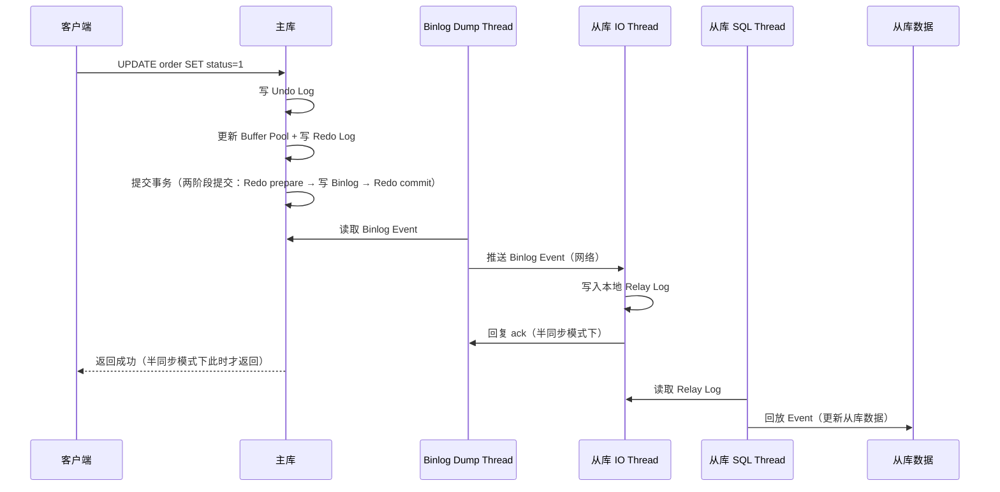

# 架构与高可用

> **一句话定位**：架构与高可用是资深面试区分度题，"订单系统怎么分库分表"能考察从分片键到分布式事务的全链路思维
> **面试热度**：⭐⭐⭐⭐⭐
> **返回**：[MySQL 知识图谱](../README.md)

---

## 一、概念定义

### 1.1 主从复制三种模式

MySQL 主从复制是高可用与水平扩展的基石。按"主库写 Binlog 后是否等从库确认"划分，复制模式有异步、半同步、全同步三种，三者在数据一致性、性能、可用性之间形成权衡梯度。面试时被问"讲讲主从复制"，先报三种模式并说清各自定位，即可建立框架。

**复制演进脉络**：MySQL 3.23 引入异步复制（仅 Binlog 推送）；5.5 引入半同步复制插件（减少数据丢失）；5.7 半同步增强（AFTER_SYNC 模式、并行复制 LOGICAL_CLOCK）；8.0 引入 MGR（基于 Paxos 的多数派一致）与 WRITESET 并行复制。每代演进都在提升一致性或回放并发度，理解演进有助于回答"MySQL 复制有哪些模式"这类体系题。

| 模式 | 主库行为 | 一致性 | 性能 | 可用性 | 适用场景 |
|------|----------|--------|------|--------|----------|
| **异步复制** | 写完 Binlog 直接返回，不等从库 | 弱（可能丢数据） | 最高（无等待） | 高（从库宕机不影响主库） | 互联网常规业务，容忍少量延迟 |
| **半同步复制** | 写完 Binlog 至少等 1 个从库 ack 才返回 | 中（至少 1 从库有数据） | 中（多一程 RTT） | 中（从库全宕则降级） | 金融、订单等关键业务 |
| **全同步复制** | 等所有从库 ack 才返回 | 强（所有从库一致） | 最低（短板效应） | 低（任一从库宕机阻塞主库） | 极少使用，一般用 MGR 替代 |

**面试记忆口诀**：异步追求性能容忍丢数据，半同步追求"至少一个从库有"，全同步追求所有从库都有但几乎没人用。生产环境绝大多数采用异步复制（默认）或半同步复制，全同步因可用性差被 MGR（基于 Paxos 的多数派）替代。

**三种模式的一致性-性能权衡**：异步复制一致性最弱但性能最高（主库无等待），半同步居中（多一程 ack RTT），全同步最强但性能最低（等所有从库）。面试时常被问"为什么不全用半同步"——半同步有降级风险（超时退化为异步）且有性能损失（多一程 RTT），对延迟敏感的非关键业务仍用异步。

**MySQL 默认就是异步复制**：主库执行完事务、写完 Binlog 后直接返回客户端，Dump Thread 异步推送 Binlog 给从库。这是 MySQL 历史最悠久、最简单的复制模式，也是延迟最低的模式。代价是主库宕机时未推送的 Binlog 会丢失，导致主从数据不一致。异步复制适合"读多写少、容忍延迟、可用性优先"的业务。

**半同步复制（Semi-Sync）**：插件式增强（`rpl_semi_sync_master` / `rpl_semi_sync_slave`），主库写完 Binlog 后至少等 1 个从库 ack 才返回。8.0 默认 AFTER_SYNC 模式（5.7+），主库在 Binlog 写完、引擎 commit 前等待从库 ack，减少幻读风险。超时降级为异步，兼顾一致性与可用性。

**全同步复制（Fully Sync）**：主库等所有从库 ack。任一从库宕机即阻塞主库，可用性差。MySQL 原生不支持全同步，通过 MGR（Group Replication）实现"多数派一致"——基于 Paxos 只需大多数节点 ack，是全同步的工程化妥协。


### 1.2 读写分离

读写分离是主从复制的直接业务应用：主库负责写，从库负责读，利用复制延迟换取读扩展能力。核心是"读从库、写主库"的路由策略与"从库延迟导致读到旧数据"的容忍管理。

**读写分离的前提**：①主从复制正常（Binlog 推送与回放畅通）；②业务容忍复制延迟（秒级延迟不影响正确性）；③路由层能区分读写请求。

**读写分离的常见问题**：①"写后读一致性"——用户写完立即读，可能读到从库旧值；②从库延迟导致业务异常（如订单状态查询不到）；③跨从库的分布式读不一致（不同从库延迟不同）。

**读写分离的解决方案**：①强制走主库（写后一段时间内读走主库）；②半同步复制减少延迟；③缓存兜底（写时同时写缓存）；④业务层感知延迟并重试。详见后文高频追问与系统设计案例。

**读写分离与分库分表的关系**：读写分离解决"读 QPS 瓶颈"（单主库读不过来，加从库分担读），分库分表解决"写 QPS 瓶颈与数据量瓶颈"（单主库写不过来/单表数据太大）。两者常组合使用——先分库分表扩展写入，每个分片内再做读写分离扩展读。ShardingSphere 同时支持读写分离与分库分表，可叠加配置。

### 1.3 分库分表三种维度

当单库单表数据量达到千万级（写入瓶颈）或单库连接/QPS 达到上限（连接瓶颈），需要通过分库分表水平扩展。按切分维度有垂直分库、水平分表、垂直分表三种。

| 维度 | 切分对象 | 切分依据 | 解决问题 | 风险 |
|------|----------|----------|----------|------|
| **垂直分库** | 库 | 按业务拆库（订单库、用户库、商品库） | 单库连接/QPS 瓶颈、业务隔离 | 跨库 JOIN 困难、分布式事务 |
| **水平分表** | 表 | 按 hash/range/时间将行拆到多张同结构表 | 单表数据量大、写入瓶颈 | 跨片查询、分片键选择、全局 ID |
| **垂直分表** | 表 | 按字段拆分（热字段 vs 冷字段）到同库多张表 | 单表字段过多、IO 瓶颈 | 跨表 JOIN、维护成本 |

**面试记忆口诀**：垂直分库按业务拆库（订单库/用户库），水平分表按行拆表（hash user_id 分 64 表），垂直分表按字段拆表（订单基础信息表 + 订单详情表）。三者不互斥，生产架构常叠加：先垂直分库按业务隔离，再水平分表扩写性能。

**垂直分库的本质**：业务解耦与资源隔离。订单库、用户库、商品库各自独立部署，互不影响，避免单库连接被打爆。代价是跨库 JOIN 需应用层组装、分布式事务协调（如订单创建涉及订单库 + 用户库 + 库存库）。

**水平分表的本质**：单表写入水平扩展。按分片键（如 `user_id`）hash 到 N 张同结构表（`order_00` ~ `order_63`），写入分散到 N 张表，绕过单表 B+ 树深度与索引膨胀瓶颈。代价是跨片查询（如全表 count、按非分片键查询）需要广播或汇总表。

**垂直分表的本质**：行内字段冷热分离。订单的 `id`/`status`/`amount` 是热字段（高频查询），`remark`/`ext_info` 是冷字段（低频访问），拆到两张表减少单行 IO 与 Buffer Pool 占用。代价是应用层 JOIN，但通常同库 JOIN 性能可接受。

### 1.4 高可用方案对比

MySQL 高可用方案演进历经 MHA、Orchestrator、MGR、MySQL InnoDB Cluster 四代。理解每代方案的"故障检测 / 主从切换 / 数据一致性保障"机制是选型的关键。

| 方案 | 故障检测 | 切换方式 | 数据一致性 | 运维复杂度 | 现状 |
|------|----------|----------|------------|------------|------|
| **MHA** | SSH 探活 | 选最新从库提升为主，补齐其他从库 Binlog | 中（依赖 Binlog 补齐） | 高（需 SSH 与 Perl 脚本） | 已老旧，逐步淘汰 |
| **Orchestrator** | 拓扑探测 + Raft 集群 | 拓扑感知自动 failover | 中（依赖半同步复制） | 中（Go 实现，活跃维护） | 中型团队主流 |
| **MGR**（8.0+） | Paxos 心跳 | 自动选主（多数派） | 强（多数派一致） | 中（原生插件） | 金融与关键场景主流 |
| **MySQL InnoDB Cluster** | MGR + MySQL Router | MGR 自动选主 + Router 路由 | 强（基于 MGR） | 低（官方全套方案） | 官方推荐 |
| **中间件 + 分库分表** | 中间件探活 | 业务感知切换 | 看分片配置 | 高（中间件本身需 HA） | 大规模数据场景 |

**面试记忆口诀**：MHA 老派 SSH 补 Binlog，Orchestrator Go 拓扑感知活跃，MGR 原生 Paxos 强一致，InnoDB Cluster 官方全套 Router+MGR。选型看数据一致性要求与运维能力——金融选 MGR，互联网选 Orchestrator + 半同步，海量数据选中间件分库分表。

**MHA（Master High Availability）**：由日本 DeNA 公司开发，2011 年开源。核心是当主库宕机时，从所有从库中选出 Binlog 位点最新的提升为新主库，并从老主库的 Binlog 中补齐其他从库缺失的事务，最大限度减少数据丢失。MHA 的局限是依赖 SSH 互信与 Perl 脚本，运维复杂度高，且对半同步复制支持有限。目前已被 Orchestrator 与 MGR 取代。

**Orchestrator**：GitHub 工程师 Shlomi Noach 开发，用 Go 写的 MySQL 拓扑管理与自动 failover 工具。支持拓扑发现、自动修复、手动切换。自身用 Raft 实现高可用，支持与 Consul/Etcd 集成。是目前中型互联网团队的主流方案，配合半同步复制可达到"零数据丢失"目标。

**MGR（MySQL Group Replication）**：MySQL 8.0 引入的原生集群方案（5.7 已有 plugin，8.0 GA）。基于 Paxos 变种（Mention-based consensus）实现多数派一致，单主模式下自动选主，多主模式下支持多节点同时写。冲突检测基于 WRITESET（行级冲突检测），比传统的"全序串行化"更高效。是金融场景的首选。

**MySQL InnoDB Cluster**：官方推出的完整高可用方案，由 MGR + MySQL Router + MySQL Shell 三件套组成。MGR 提供数据层高可用，MySQL Router 提供应用层路由（读写分离、故障转移），MySQL Shell 提供运维管理。是 Oracle 官方推荐方案，运维门槛最低。

**演进脉络**：MHA（2011，SSH 补 Binlog）→ Orchestrator（2016，Go 拓扑感知）→ MGR（2016 5.7 plugin，2018 8.0 GA，Paxos 多数派）→ InnoDB Cluster（2018，官方全套）。每一代都在降低运维复杂度与提升数据一致性。面试时讲演进脉络能展示对生态的理解。

**容灾等级对照**：MHA 是"尽力而为"（Binlog 补齐可能失败），Orchestrator + 半同步是"零丢数据"（至少 1 从库 ack），MGR 是"强一致"（多数派 commit），InnoDB Cluster 在 MGR 基础上加 Router 实现透明切换。容灾等级依次提升，运维门槛依次降低（MHA 最复杂，InnoDB Cluster 最简）。

### 1.5 中间件边界

分库分表与读写分离的中间件层是架构选型的"另一维"问题。常见中间件有 ShardingSphere、MyCat、Vitess、ProxySQL，本节只标注边界，不展开细节。

| 中间件 | 定位 | 语言 | 边界 |
|--------|------|------|------|
| **ShardingSphere-JDBC** | JDBC 层增强（轻量，应用内） | Java | 适合 Java 应用，无独立进程，与 Spring Boot 集成方便 |
| **ShardingSphere-Proxy** | 独立代理进程（多语言客户端通用） | Java | 适合异构语言，多一层网络开销 |
| **MyCat** | 独立代理（早期开源分库分表方案） | Java | 社区活跃度下降，逐步被 ShardingSphere 取代 |
| **Vitess** | 云原生 MySQL 集群方案（YouTube 开源） | Go | 适合 K8s 场景，CNCF 项目，运维复杂 |
| **ProxySQL** | MySQL 协议代理（读写分离 + SQL 路由） | C++ | 专注读写分离与连接池，分库分表能力弱 |

**选型口诀**：Java 单体选 ShardingSphere-JDBC，异构语言选 ShardingSphere-Proxy，云原生选 Vitess，仅读写分离选 ProxySQL。详见后文实战关联。

**ShardingSphere 的边界**：Apache 顶级项目（原当当开源，后捐赠 Apache）。分 JDBC 与 Proxy 两种形态，JDBC 是 JDBC 层增强（应用内 SDK，无独立进程），Proxy 是独立代理进程。支持分库分表、读写分离、加密脱敏、影子库、分布式事务（XA/Seata AT）。是 Java 生态最主流的分库分表方案。

**ShardingSphere 的功能矩阵**：①分库分表（核心）——支持分片算法（hash/range/时间/复合）、广播表、绑定表；②读写分离——主从路由、负载均衡（轮询/随机/权重）；③分布式事务——XA（Atomikos/Narayana）、Seata AT、LOCAL（本地事务）；④数据加密——字段级透明加密脱敏；⑤影子库——压测流量影子表隔离；⑥SQL 审计——黑名单/白名单。功能矩阵覆盖分库分表周边需求，是选型的加分项。

**MyCat 的边界**：早期开源分库分表方案，曾在国内广泛使用。社区活跃度下降，逐步被 ShardingSphere 取代。新项目不建议选型，老项目可考虑迁移。

**Vitess 的边界**：YouTube 开源的云原生 MySQL 集群方案，CNCF 毕业项目。基于 Go 实现，与 K8s 集成良好，支持分片、垂直水平扩展、自动 failover。适合大规模云原生场景，运维门槛较高。

**ProxySQL 的边界**：专注 MySQL 协议代理，读写分离与连接池是强项，分库分表能力弱。常与 MGR 或 Orchestrator 配合作为前端路由。C++ 实现性能高，但功能边界清晰——只做"路由与连接池"，不做"分片"。

### 1.6 分片键与全局 ID 的关系

分片键与全局 ID 是分库分表的两面——分片键决定"数据落在哪个分片"，全局 ID 决定"分片内每条记录的唯一标识"。两者关系需理清：

- **分片键不一定是主键**：订单表分片键是 `user_id`，但主键是 `order_id`（Snowflake 生成）。分片键用于路由，主键用于分片内唯一标识。
- **全局 ID 需跨分片唯一**：分片内主键冲突检测失效（多分片各自自增），需全局 ID 方案（Snowflake/号段）保证跨分片唯一。
- **ID 可推导分片（可选）**：部分方案将分片信息编码进 ID（如 `user_id` 高位含分片号），便于从 ID 反推分片。但通常分片路由由分片键决定，ID 不承担路由职责。

**面试记忆口诀**：分片键管路由（数据去哪），全局 ID 管唯一（每条记录的身份）。两者各司其职，通常分片键是业务字段（如 `user_id`），全局 ID 是技术字段（如 Snowflake `order_id`）。

---

## 二、原理与流程

### 2.1 主从复制原理（三线程模型）

MySQL 主从复制的核心是三个线程协作：主库的 **Binlog Dump Thread**、从库的 **IO Thread**、从库的 **SQL Thread**。理解三线程职责划分与数据流是讲清复制延迟根因的前提。

**主库 Binlog Dump Thread**：当从库连接主库并请求复制（`CHANGE MASTER TO ...`），主库创建一个 Dump Thread，负责读取主库 Binlog 并推送给从库。一个主库若有 N 个从库，则有 N 个 Dump Thread（每个从库一个）。Dump Thread 读 Binlog 后通过网络发送给从库 IO Thread。8.0 默认 GTID 复制模式下，Dump Thread 按 GTID 推送，无需位点协商。

**从库 IO Thread**：从库启动复制后（`START SLAVE` / `START REPLICA`）创建 IO Thread，主动连接主库 Dump Thread，拉取 Binlog Event，写入本地 **Relay Log**（中继日志）。IO Thread 是"拉取方"，与 Dump Thread 的"推送方"形成生产者-消费者模型，解耦拉取与回放。

**从库 SQL Thread**：读 Relay Log 中的 Event，回放到从库数据。SQL Thread 是"单线程串行回放"（5.6 及之前），这是复制延迟的根因——主库并发写入的多个事务，在从库只能串行回放。5.7+ 引入并行复制（基于组提交 LOGICAL_CLOCK 或 8.0 WRITESET），SQL Thread 可并发回放无冲突事务。

**复制数据流**：主库事务提交 → 写 Binlog → Dump Thread 读取并推送 → 从库 IO Thread 接收并写 Relay Log → 从库 SQL Thread 读 Relay Log 回放 → 从库数据更新。每一步都涉及网络与磁盘 IO，任一环节慢都会导致复制延迟。

**三个线程的生命周期**：①Dump Thread 在从库连接主库时创建，从库断开时销毁（一个从库对应一个 Dump Thread）；②IO Thread 在 `START SLAVE` 时创建，`STOP SLAVE` 时销毁；③SQL Thread 同 IO Thread。三个线程的状态可通过 `SHOW PROCESSLIST`（主库看 Dump Thread）与 `SHOW SLAVE STATUS\G`（从库看 IO/SQL Thread）查看。IO Thread 与 SQL Thread 独立运行，IO Thread 拉取快、SQL Thread 回放慢时，Relay Log 会堆积。

**复制时序图**：



**复制过滤（Replication Filter）**：从库可配置只复制部分库或表，常用 `replicate_wild_do_table` / `replicate_wild_ignore_table`。例如 `replicate_wild_do_table=order.%` 表示只复制 order 库的所有表。复制过滤在从库 SQL Thread 回放前生效，过滤粒度在 Event 级别。注意：过滤配置不当可能导致从库数据不完整，主从切换时引发数据丢失。

**复制过滤的踩坑点**：①GTID 模式下复制过滤需谨慎——GTID 会记录"已执行"的事务，过滤掉的事务也会标记为"已执行"，主从切换后新主缺数据但 GTID 显示已执行，难恢复；②`replicate_do_db` 是基于"当前库"过滤（`USE` 语句切换的库），跨库更新（如 `UPDATE db1.t, db2.t`）可能漏过滤，推荐用 `replicate_wild_do_table` 通配符方式；③生产环境从库过滤配置应有文档记录，主从切换时需检查新主是否完整。

**复制延迟的根因**：①**单 SQL Thread 串行回放**（5.6 及之前）——主库并发 N 个事务，从库只能串行回放，TPS 差距悬殊；②**大事务**——单事务涉及百万行 UPDATE，主库执行 5 秒，从库回放也需 5 秒，期间其他事务阻塞；③**网络抖动**——主从跨机房时，网络 RTT 与丢包导致 IO Thread 拉取变慢；④**从库负载高**——从库承担大量读请求，CPU/IO 占用影响 SQL Thread 回放。

**5.7+ 并行复制**：5.7 引入基于组提交的 LOGICAL_CLOCK 并行复制，同一组提交内的事务无冲突，可在从库并发回放。8.0 进一步引入基于 WRITESET 的并行复制——以行级冲突检测代替组提交粒度，冲突率低的事务可更大并发度回放。`slave_parallel_workers` 控制并发回放线程数，`binlog_transaction_dependency_tracking` 控制依赖追踪算法（COMMIT_ORDER / WRITESET / WRITESET_SESSION）。

**并行复制演进**：5.6 引入基于库级并行的 `slave_parallel_workers`（跨库并发，库内仍串行，实用性低）；5.7 引入基于组提交的 LOGICAL_CLOCK（同组事务并发，实用性大幅提升）；8.0 引入 WRITESET（行级冲突检测，并发度最高，默认 WRITESET_SESSION）。演进脉络是"并行粒度从库级 → 组提交级 → 行级"，每次演进都提升回放并发度。

**LOGICAL_CLOCK 原理**：主库组提交时，同一组内的事务在 Binlog 中标记相同的 `logical_clock`。从库回放时，相同 `logical_clock` 的事务无锁竞争，可并发执行。局限是并行度受限于主库组提交大小——若主库并发低、组提交小，从库并行度也低。

**WRITESET 原理**：主库为每个事务计算 WRITESET（修改行的主键哈希集合），写入 Binlog。从库回放时，检查当前事务的 WRITESET 与已回放但未提交事务的 WRITESET 是否有交集——无交集则并发回放，有交集则串行。WRITESET 是行级冲突检测，比 LOGICAL_CLOCK 的组提交粒度更细，并发度更高。

**延迟监控**：`SHOW SLAVE STATUS\G` 中 `Seconds_Behind_Master` 字段。注意该值是"SQL Thread 当前回放位点与主库 Binlog 位点的时间差"，并非"实时延迟"——若 SQL Thread 卡在某个大事务，`Seconds_Behind_Master` 可能显示 0（因为该事务在主库也是几秒前提交的），但实际回放已严重滞后。更准确的监控是 `pt-heartbeat` 工具——在主库定期写入心跳记录，从库读心跳记录的时间差即为真实延迟。

### 2.2 半同步复制原理

半同步复制（Semi-Synchronous Replication）是异步复制的增强版，通过"主库等待从库 ack"减少数据丢失。理解超时降级与 AFTER_SYNC/AFTER_COMMIT 区别是讲清半同步的关键。

**核心参数**：
- `rpl_semi_sync_master_wait_for_slave_count`：主库需等待多少从库 ack 才返回，默认 1。设为 N 表示需 N 个从库都 ack。
- `rpl_semi_sync_master_timeout`：主库等待从库 ack 的超时时间，默认 10000ms（10 秒）。超时后**降级为异步复制**，避免从库宕机阻塞主库写。
- `rpl_semi_sync_master_wait_point`：等待点，`AFTER_SYNC`（8.0 默认）或 `AFTER_COMMIT`（5.6 默认）。

**AFTER_SYNC vs AFTER_COMMIT 对比**：

| 维度 | AFTER_SYNC（8.0 默认） | AFTER_COMMIT（5.6 默认） |
|------|----------------------|-------------------------|
| 等待时机 | Binlog 写完、引擎 commit 前 | 引擎 commit 后、返回客户端前 |
| 从库 ack 后主库动作 | 主库才 commit 并返回 | 主库已 commit，仅等 ack 返回 |
| 幻读风险 | 低（commit 前已确认从库收到） | 高（其他会话可见已 commit 数据，但从库可能未收到） |
| 数据丢失风险 | 低（主库宕机时未 commit，从库也无该事务） | 中（主库已 commit 返回，从库可能未收到，主库宕机则丢） |

**面试记忆口诀**：AFTER_SYNC 是"先等从库收到再 commit"，减少幻读；AFTER_COMMIT 是"先 commit 再等 ack"，性能略高但幻读风险大。8.0 默认 AFTER_SYNC，是工程上的一致性优先选择。

**降级机制**：半同步复制并非"强一致"，而是"尽力一致"。当 `rpl_semi_sync_master_timeout` 超时（如从库宕机、网络抖动），主库自动降级为异步复制，保证可用性。降级后即使从库恢复，主库也不会自动切回半同步——需等从库追上 Binlog 位点后由从库重新发起 semi-sync 握手。这是半同步复制的"软一致性"特征，与 MGR 的"强一致性多数派"形成对比。

**半同步的局限**：①**单从库 ack 即可**——默认只需 1 个从库 ack，若该从库宕机仍有数据丢失风险（需配置 `wait_for_slave_count=N`）；②**降级时退化为异步**——超时降级后无强一致保障；③**性能损失**——多一程网络 RTT，写入延迟增加（同机房约 1ms，跨机房 5-10ms）。

**半同步的部署要点**：①主从都需安装半同步插件（`INSTALL PLUGIN rpl_semi_sync_master SONAME 'semisync_master.so'`）；②主库开启 `rpl_semi_sync_master_enabled=ON`，从库开启 `rpl_semi_sync_slave_enabled=ON`；③`rpl_semi_sync_master_wait_for_slave_count` 建议设为 ≥2（至少 2 从库 ack），单从库 ack 仍有丢失风险；④`rpl_semi_sync_master_timeout` 生产建议 3000-5000ms（太短易降级，太长阻塞主库）；⑤从库重启后需等 SQL Thread 追上 Binlog 位点，主库才恢复半同步（降级期间不自动恢复）。

**半同步与数据丢失的关系**：半同步"减少"而非"消除"数据丢失。降级期间（从库全宕或超时）退化为异步，主库宕机仍丢数据。要"零丢数据"需配合 Orchestrator——主库宕机时 Orchestrator 选"已 ack 的从库"为新主，保证已 ack 的数据不丢。这是半同步 + Orchestrator 的"零丢数据"组合，是中型互联网团队的主流方案。

### 2.3 MGR（MySQL Group Replication，8.0+）

MGR 是 MySQL 8.0 引入的原生集群方案，基于 Paxos 变种实现多数派一致，是"全同步复制的工程化妥协"。理解 Paxos 多数派、单主/多主模式、冲突检测是讲清 MGR 的关键。

**Paxos 多数派原理**：MGR 基于 Paxos 变种（具体为 Mention-based consensus，类 Multi-Paxos）。事务在主库发起后，需经多数派节点（`floor(N/2)+1`）确认后才 commit。例如 3 节点集群需 2 节点确认，5 节点需 3 节点。少数派节点宕机不影响集群可用性，多数派节点存活即可继续提供服务。这是 MGR 优于全同步复制的根本——全同步需所有节点 ack，MGR 只需多数派。

**单主模式（single-primary mode）**：集群中只有一个主节点可写，其他节点为只读。主节点宕机时集群自动选新主（基于 Paxos 选举）。单主模式是 MGR 默认模式，也是生产推荐模式——写入串行化简单，无冲突检测开销。

**多主模式（multi-primary mode）**：所有节点都可写，冲突检测基于 WRITESET（行级冲突检测）。两个节点同时更新同一行时，后到达的事务被检测为冲突并回滚（`certification-based conflict detection`）。多主模式适合"写冲突率低"的场景（如不同业务模块写不同表），不适合"同行高频更新"。

**WRITESET 冲突检测**：每个事务提取其修改的行的"WRITESET"（行主键哈希集合），事务在 commit 前广播给所有节点做冲突检测。若两个并发事务的 WRITESET 有交集（即修改了同一行），后到达的事务被回滚。WRITESET 冲突检测是行级的，比传统的"全序串行化"更高效——无冲突事务可并发 commit。

**MGR 与半同步的对比**：

| 维度 | MGR | 半同步复制 |
|------|-----|-----------|
| 一致性模型 | 多数派强一致 | 单从库 ack（尽力一致） |
| 宕机容忍 | 多数派存活即可（3 节点容 1 宕） | 从库全宕则降级异步 |
| 冲突检测 | WRITESET 行级 | 无（主从单向） |
| 写入性能 | 略低（多一程 Paxos RTT） | 中（多一程 ack RTT） |
| 运维复杂度 | 中（原生插件，部署简单） | 低（插件增强，运维熟悉） |
| 适用场景 | 金融、强一致 | 互联网常规、关键业务 |

**MGR 的局限**：①**写入性能略降**——每个事务多一程 Paxos 多数派 RTT（同机房约 1-2ms，跨机房 5-10ms）；②**网络分区处理**——少数派节点被隔离后变为只读，需等分区恢复；③**WriteSet 内存开销**——大事务的 WRITESET 哈希集合占用内存，`binlog_transaction_dependency_tracking=WRITESET` 配置需谨慎；④**最大节点数限制**——官方推荐 ≤9 节点，超过会因 Paxos 通信开销降低性能。

**MGR 部署要求**：①所有节点同版本（8.0+）；②`binlog_format=ROW`（MGR 依赖 ROW 格式做冲突检测）；③`binlog_row_image=FULL`（完整行镜像用于 WRITESET）；④`gtid_mode=ON`（MGR 依赖 GTID）；⑤`slave_preserve_commit_order=ON`（保持提交顺序与多数派一致）；⑥所有节点的主键必须存在（冲突检测依赖主键）。这些前置条件是 MGR 部署的常见踩坑点。

**MGR 故障恢复**：少数派节点宕机后，多数派仍可继续提供服务。宕机节点恢复后自动重新加入集群（基于 GTID 追赶）。若多数派节点宕机（如 3 节点中 2 宕机），集群变为只读，需手动强制提升（`group_replication_force_members`）。这是 MGR 的"脑裂"边界——网络分区时少数派被隔离，多数派继续服务，分区恢复后少数派自动追上。

### 2.4 分库分表策略

分库分表的核心决策是分片键选择与分片策略。本节展开水平分表的三种分片策略、分片键选择原则、全局唯一 ID 方案、跨片查询与分布式事务。

**水平分表的三种分片策略**：

| 策略 | 分片依据 | 优点 | 缺点 | 适用场景 |
|------|----------|------|------|----------|
| **hash 分片** | `hash(分片键) % N` | 数据均匀分布、写入均衡 | 扩容需 rehash 全表迁移、范围查询难 | 用户中心、订单中心（user_id hash） |
| **range 分片** | 按 ID/时间范围分片（0-1M 片 1，1M-2M 片 2） | 扩容简单（加新片）、范围查询友好 | 数据倾斜（最新片数据多）、热点集中 | 日志、流水（按时间 range） |
| **时间分片** | 按月/日建表（order_202401、order_202402） | 历史归档简单（直接 drop 老表）、范围查询友好 | 写入集中在最新片（需路由）、跨月查询需广播 | 流水、日志（按月分表） |

**分片键选择原则**：①**高频查询条件**——分片键应能覆盖绝大多数查询（如 `user_id` 在订单查询中是高频条件），避免大量跨片查询；②**避免数据倾斜**——分片键取值应均匀分布（如 `user_id` 哈希均匀，但 `region_code` 可能倾斜）；③**业务可推导**——应用层能从分片键推导出目标分片（如 `user_id=123` → `hash(123) % 64 = 11` → 路由到第 11 张表）；④**不可变更**——分片键一旦确定不应变更，否则需跨片迁移数据。

**全局唯一 ID 方案**：分库分表后单表 `AUTO_INCREMENT` 失效（多表自增会冲突），需引入全局唯一 ID 方案。

**UUID 的局限详解**：UUID v4 是 128 位随机数，作为主键有三大问题：①**无序**——B+ 树聚簇索引按主键有序插入，UUID 随机导致页分裂频繁，写入性能差；②**索引膨胀**——128 位（16 字节）比 bigint（8 字节）大一倍，所有二级索引都含主键，索引膨胀严重；③**可读性差**——`550e8400-e29b-41d4-a716-446655440000` 不适合业务展示。UUID v7（时间序 + 随机）部分解决有序问题，但仍不如 Snowflake 紧凑。

**号段模式（Leaf）详解**：美团 Leaf 提供两种模式——Leaf-segment（号段）与 Leaf-snowflake。号段模式核心是 DB 表 `leaf_alloc`：

```sql
CREATE TABLE leaf_alloc (
  biz_tag     VARCHAR(128) PRIMARY KEY,
  max_id      BIGINT NOT NULL,
  step        INT NOT NULL,
  update_time TIMESTAMP NOT NULL
);
```

应用拉取号段时 `UPDATE leaf_alloc SET max_id = max_id + step WHERE biz_tag = ?`，更新后 `max_id` 即新号段上界。号段内本地 `AtomicLong` 自增，耗尽前异步预拉取下一号段（双 buffer 切换）。优点是 DB 压力低（每次拉一个号段）、ID 有序（号段内连续）。缺点是 DB 仍是单点（需主备 + 半同步）、号段跨重启浪费。

**Snowflake 的变种**：①**百度的 uid-generator**——用环形 buffer 预生成 ID，解决时钟回拨与性能问题；②**美团的 Leaf-snowflake**——workerId 由 ZK 分配，ZK 同时记录上次时间戳用于回拨检测；③**滴滴的 Tinyid**——号段模式的多 DB 版，支持多 master 降低单点风险。这些变种都在 Snowflake 基础上解决"时钟回拨"与"workerId 分配"两大痛点。

| 方案 | 生成方式 | 优点 | 缺点 | 适用场景 |
|------|----------|------|------|----------|
| **UUID** | `UUID.randomUUID()` 128 位 | 无中心、生成简单 | 无序（B+ 树插入差）、索引膨胀、可读性差 | 不推荐用于主键 |
| **Snowflake** | 时间戳 + workerId + 序列号 64 位 | 有序、高性能、可推导时间 | 时钟回拨风险、workerId 分配复杂 | 互联网主流（订单 ID、消息 ID） |
| **号段模式（Leaf）** | 数据库分配号段（如 1-1000 给应用 A，1001-2000 给 B） | 有序、高性能（号段内本地生成） | 依赖 DB、号段耗尽需重新申请 | 中等规模业务（美团 Leaf 方案） |

**Snowflake 时钟回拨处理**：Snowflake 的 64 位结构 = 1 位符号位 + 41 位时间戳（毫秒）+ 10 位 workerId + 12 位序列号。时间戳依赖机器时钟，若机器时钟回拨（NTP 同步、手动调时），可能生成重复 ID。常见处理方案：
- **等待回拨**：若回拨 < 5ms，线程等待直到追上原时间戳（简单但阻塞）。
- **拒绝服务**：若回拨 > 5ms，直接抛异常拒绝生成（保守但影响可用性）。
- **借用未来位**：若回拨 < 一定阈值，借用下一个 workerId 临时使用（需扩展 workerId 池）。
- **依赖 ZK/ETCD**：workerId 由 ZK 分配，同时记录上次时间戳，回拨时报警。

**跨片查询处理**：分片键之外的查询无法直接路由到单分片，需特殊处理：
- **广播查询**：将查询发到所有分片，汇总结果（性能差，应避免）。如全表 `COUNT(*)`。
- **汇总表**：将跨片维度的数据预先汇总到汇总表（如每日统计表），查询走汇总表而非分片表。
- **ES 宽表补齐**：将分片表数据同步到 ES，跨片查询走 ES（如按商品名搜索订单）。ES 承担"非分片键查询"。
- **二级索引表**：建立"非分片键 → 分片键"映射表，先查映射表拿到分片键，再路由到分片。如按订单号查订单——订单号映射表记录 `order_no → user_id`。

**分布式事务**：分库分表后单库本地事务失效（事务跨多个分片库），需引入分布式事务方案。

| 方案 | 一致性 | 性能 | 复杂度 | 适用场景 |
|------|--------|------|--------|----------|
| **XA（2PC）** | 强一致 | 低（资源锁定久） | 中（数据库原生支持） | 金融强一致场景 |
| **TCC（Try-Confirm-Cancel）** | 最终一致 | 高（无锁） | 高（业务侵入大，需写 6 个接口） | 互联网高并发场景 |
| **本地消息表** | 最终一致 | 中（异步消息） | 中（DB + MQ） | 订单/库存等异步场景 |
| **Saga** | 最终一致 | 高（无锁、补偿） | 高（需补偿逻辑） | 长流程业务（如订单全流程） |

**XA 的局限**：XA 是数据库原生 2PC，`@Transactional` + JTA 实现。强一致但性能差——资源锁定从 prepare 到 commit 全程持有，并发度低。且协调者宕机可能阻塞参与者。生产中仅用于金融强一致场景。

**XA 的工程陷阱**：①MySQL XA 仅支持 InnoDB 引擎；②XA 事务持有锁时间长，高并发下易死锁；③协调者（如 Atomikos）宕机可能阻塞参与者（需人工介入）；④MySQL XA 与 `binlog` 的两阶段提交叠加，逻辑复杂。生产中 XA 需严格测试与压测。

**TCC 的本质**：将业务拆为三个阶段——Try（资源预留）、Confirm（确认提交）、Cancel（回滚释放）。无数据库锁，并发度高。但业务侵入大——每个业务操作需写 Try/Confirm/Cancel 三个接口，开发成本高。适合"高并发 + 强业务约束"场景（如库存扣减）。

**本地消息表的本质**：业务表与消息表同库同事务写入，消息表记录"待发送消息"。后台定时扫描消息表发送到 MQ，消费方消费 MQ 后回调确认。通过"业务表 + 消息表同事务"保证业务与消息的原子性，MQ 保证消息投递可靠性。是订单/库存等异步场景的主流方案。详见 [middleware/README.md（kafka 待建）](../../README.md) 交叉引用。

**本地消息表 vs 事务消息（RocketMQ）**：RocketMQ 事务消息是"DB 事务 + MQ 投递"的另一种实现——MQ 层面支持"半消息"（对消费方不可见），业务执行本地 DB 事务后提交半消息（投递）或回滚半消息（丢弃）。相比本地消息表，事务消息无需维护消息表与扫描线程，但对 MQ 强依赖（需 RocketMQ）。本地消息表对 MQ 无要求（任何 MQ 都行），但需维护消息表。两者选型看 MQ 基础设施——有 RocketMQ 选事务消息，无则选本地消息表。

**Saga 的本质**：将长流程拆为多个本地事务，每个本地事务提交后立即执行下一段。任一段失败则执行"补偿事务"回滚已执行的段。无锁、高并发，但补偿逻辑复杂，适合订单全流程（创建订单 → 扣库存 → 支付 → 发货，任一失败需补偿）。

**分布式事务选型决策树**：①是否强一致？是 → XA（金融场景）；否 → ②。②是否高并发？是 → TCC（互联网核心场景）；否 → ③。③是否长流程？是 → Saga（订单全流程）；否 → 本地消息表（异步最终一致）。决策树按"一致性 → 性能 → 流程长度"三步收敛，覆盖 90% 场景。

**本地消息表的工程实现要点**：①消息表与业务表同库同事务（保证原子性）；②后台扫描线程定时扫描"待发送"消息（频率与延迟权衡）；③MQ 投递成功后更新消息状态为"已发送"；④消费方幂等消费（基于业务唯一键去重）；⑤消费方处理成功后回调确认，消息表标记"已完成"；⑥超时未确认的消息重投（需 MQ 支持幂等或消费方幂等）。详见 [middleware/README.md（kafka 待建）](../../README.md) 交叉引用。

### 2.5 高可用方案选型对比

高可用方案选型需综合"数据一致性要求、运维能力、规模、成本"四维评估。

| 方案 | 一致性 | 运维门槛 | 规模适配 | 成本 |
|------|--------|----------|----------|------|
| **MHA** | 中（Binlog 补齐） | 高（SSH + Perl） | 中小（≤10 节点） | 低（开源） |
| **Orchestrator + 半同步** | 高（零丢数据） | 中（Go + Raft） | 中（≤30 节点） | 中（开源） |
| **MGR** | 强（多数派） | 中（原生插件） | 中（≤9 节点） | 中（开源） |
| **MySQL InnoDB Cluster** | 强（MGR） | 低（官方全套） | 中（≤9 节点） | 中（开源） |
| **中间件 + 分库分表** | 看分片配置 | 高（中间件 HA） | 大（百节点+） | 高（运维成本） |

**选型口诀**：金融强一致选 MGR/InnoDB Cluster，中型互联网选 Orchestrator + 半同步，海量数据选中间件分库分表（ShardingSphere + 半同步）。MHA 已老旧，新项目不推荐。

**交叉引用**：
- **分布式锁、幂等的 Redis 方案对照**：分布式事务中"本地消息表 + MQ"与 Redis 分布式锁有协同场景（如幂等消费用 Redis 锁）。详见 [middleware/README.md（redis 待建）](../../README.md)。
- **本地消息表与 Kafka 互补**：本地消息表保证"业务表 + 消息原子性"，Kafka 保证"消息投递可靠性"。两者配合实现最终一致。详见 [middleware/README.md（kafka 待建）](../../README.md)。

### 2.6 读写分离与主从延迟对策

读写分离后，主从复制延迟会导致"写后读不一致"。常见对策：

| 对策 | 原理 | 优点 | 缺点 |
|------|------|------|------|
| **强制走主库** | 写后一段时间内读走主库 | 简单、强一致 | 主库压力大 |
| **半同步复制** | 主库等从库 ack 减少延迟 | 减少延迟、不增加主库压力 | 多一程 RTT、降级风险 |
| **缓存兜底** | 写时同时写缓存，读先查缓存 | 减少读 DB、强一致（缓存有效期） | 缓存一致性、缓存击穿 |
| **业务层重试** | 读到旧值时等待 + 重试 | 业务层自适应 | 复杂、用户体验差 |

**强制走主库的实现**：常见做法是请求上下文记录"最近写时间戳"，读请求判断若距最近写时间 < 阈值（如 1 秒），则强制走主库。Spring 中可用 ThreadLocal 记录写时间戳，配合 `AbstractRoutingDataSource` 动态切换数据源。更精细的做法是"会话级粘性"——同一用户的请求在写后一段时间内都走主库（基于 user_id 做会话路由），避免 ThreadLocal 跨请求失效。

**半同步复制的边界**：半同步减少延迟但非零延迟——从库 ack 表示"收到 Binlog"，但 SQL Thread 回放仍需时间（大事务回放慢）。要彻底解决需走 MGR（多数派 commit 即对客户端可见）。

**缓存兜底的实现**：写 DB 时同时写 Redis 缓存（`SET key value EX 1`，1 秒过期）。读请求先查缓存，命中则返回，未命中则查从库。1 秒过期窗口保证读到的数据至少是 1 秒前的（从库延迟通常 < 1 秒）。这是"用缓存换取一致性窗口"的典型方案，适合读多写少场景。

**业务层重试的实现**：读请求检测到"数据不符合预期"（如订单状态仍是"待支付"但用户已支付），则等待 100ms 重试，最多重试 3 次。重试期间从库大概率已追上。适合"写后立即读且对延迟敏感"的场景，但用户体验略差（请求耗时增加）。

### 2.7 分库分表扩容方案

分库分表后扩容是工程难点——原 N 分片扩到 2N 分片，数据需重新分布。常见方案：

| 方案 | 原理 | 优点 | 缺点 | 适用场景 |
|------|------|------|------|----------|
| **倍扩容（2N）** | N → 2N，原 `hash % N` 改 `hash % 2N`，数据按前缀分桶迁移 | 迁移量小（每表一半数据迁移）、双写期短 | 必须倍数扩容（不能加 1 个片） | hash 分片标准方案 |
| **一致性哈希** | 节点布置在哈希环上，扩容只影响相邻段 | 加减节点迁移量最小 | 实现复杂、数据倾斜需虚拟节点 | 动态扩缩容场景 |
| **冷热分离** | 热数据留在分片表，冷数据归档到历史表 | 分片表数据量稳定 | 归档逻辑复杂、跨表查询 | 订单/流水（按时间冷热） |

**倍扩容流程**（N=64 → 2N=128 为例）：
1. **准备期**：建好 64 张新表（`order_64` ~ `order_127`），双写开启（写时同时写老表与新表）。
2. **迁移期**：后台任务扫描老表数据，按 `hash(user_id) % 128` 判断目标表，若目标在新表则迁移。迁移时记录位点，支持断点续传。
3. **校验期**：全量迁移完成后，数据校验（老表与新表 count、sum、抽样比对）。
4. **切换期**：读切换到新分片规则（`hash % 128`），观察一段时间无异常后停止双写、清理老表冗余数据。

**一致性哈希的边界**：一致性哈希在缓存场景（如 Redis Cluster）广泛使用，但在 MySQL 分库分表场景较少——MySQL 分片迁移成本高，一致性哈希的"动态加减节点"优势不明显，且数据倾斜需虚拟节点调优。生产中 MySQL 分库分表仍以倍扩容为主。

**冷热分离的实践**：订单系统典型实践——近 3 个月热数据在分片表（`order_00` ~ `order_63`），3 个月以上冷数据归档到历史表（`order_history_YYYYMM`，按月 range 分表）。查询热数据走分片表，查询历史数据走历史表。归档通过定时任务 + 批量 DELETE + INSERT 完成，归档期间历史表只读。

### 2.8 GTID 复制

GTID（Global Transaction Identifier）是 5.6 引入的复制增强，8.0 默认开启。GTID 格式为 `server_uuid:transaction_id`（如 `3E11FA47-71CA-11E1-9E33-C80AA9429562:23`），全局唯一标识每个事务。

**GTID vs 位点复制**：

| 维度 | 位点复制（传统） | GTID 复制（8.0 默认） |
|------|-----------------|----------------------|
| 标识 | `binlog_file:position` | `server_uuid:transaction_id` |
| 主从切换 | 需手动计算新主位点 | 自动基于 GTID 找到缺失事务 |
| 复制搭建 | 需指定 `MASTER_LOG_FILE` / `MASTER_LOG_POS` | 只需 `MASTER_AUTO_POSITION=1` |
| 数据一致性 | 依赖运维计算位点 | GTID 保证不漏不重 |
| 故障恢复 | 难（位点易错） | 易（GTID 自动追赶） |

**GTID 的优势**：①主从切换简化——新主提升后，从库自动基于 GTID 找到缺失事务追赶，无需手动计算位点；②复制搭建简化——`CHANGE MASTER TO MASTER_AUTO_POSITION=1` 即可，从库自动请求缺失的 GTID；③数据一致性保障——GTID 全局唯一，从库不会重复回放同一事务，也不会漏放。

**GTID 的限制**：①`create table ... select` 不支持（GTID 无法保证原子性）；②事务中不能同时操作事务表与非事务表（如 InnoDB 与 MyISAM 混用）；③`CREATE TEMPORARY TABLE` 在某些场景受限；④跨库级联复制需 `gtid_mode=ON` 全链路一致。这些限制是 GTID 部署的常见踩坑点。

**GTID 与 MGR 的关系**：MGR 强制依赖 GTID（`gtid_mode=ON` 是 MGR 前置条件）。MGR 集群内的事务通过 GTID 标识，多数派确认后 GTID 写入所有节点。GTID 是 MGR 实现"全局事务标识"的基础。

---

## 三、高频追问

### 3.1 主从复制原理？延迟怎么解决？

主从复制基于三线程模型——主库 Binlog Dump Thread 推送、从库 IO Thread 写 Relay Log、SQL Thread 回放。延迟根因是 SQL Thread 单线程串行回放（5.6 及之前）、大事务、网络抖动、从库负载。解决方向：①5.7+ 并行复制（LOGICAL_CLOCK / WRITESET）提升回放并发度；②避免大事务（拆批、限流）；③从库独立部署（不承担读请求）；④半同步减少延迟；⑤`slave_parallel_workers` 调优。**扩展要点**：`Seconds_Behind_Master` 不准（卡大事务时显示 0），应用 `pt-heartbeat` 监控真实延迟；GTID 复制比位点复制更易切换主从。

### 3.2 半同步复制是什么？什么时候降级为异步？

半同步复制是异步复制的增强——主库写完 Binlog 后至少等 1 个从库 ack 才返回客户端，减少数据丢失。降级时机：`rpl_semi_sync_master_timeout`（默认 10 秒）超时后自动降级为异步，保证从库宕机时主库仍可写。降级后即使从库恢复，主库也不会自动切回半同步——需等从库追上 Binlog 位点后由从库重新发起 semi-sync 握手。**扩展要点**：8.0 默认 AFTER_SYNC 模式（commit 前等 ack），减少幻读；`wait_for_slave_count=N` 配置需 N 个从库 ack，进一步降低丢失风险。

### 3.3 分库分表怎么选分片键？跨片查询怎么办？

分片键选择原则：①高频查询条件（如 `user_id` 覆盖 80% 订单查询）；②避免数据倾斜（哈希均匀）；③业务可推导（应用能从分片键推导分片）；④不可变更。跨片查询对策：①避免——尽量用分片键查询；②广播——发到所有分片汇总（性能差）；③汇总表——预先汇总跨片维度；④ES 宽表补齐——非分片键查询走 ES；⑤二级索引表——建立"非分片键 → 分片键"映射表。**扩展要点**：订单系统典型分片键是 `user_id`（用户视角查询为主），但商家视角需走 ES 宽表或汇总表。

### 3.4 分布式 ID 方案有哪些？Snowflake 时钟回拨怎么办？

主流方案：UUID（无中心但无序，不推荐作主键）、Snowflake（时间戳+workerId+序列号，有序高性能）、号段模式 Leaf（DB 分配号段，中等规模适用）。Snowflake 时钟回拨处理：①等待回拨（回拨 < 5ms 时线程等待追上原时间戳）；②拒绝服务（回拨 > 5ms 抛异常）；③借用未来位或扩展 workerId；④依赖 ZK/ETCD 记录上次时间戳。**扩展要点**：Snowflake 64 位结构 = 1 符号位 + 41 位时间戳（毫秒级，可用 69 年）+ 10 位 workerId（1024 节点）+ 12 位序列号（单机毫秒内 4096 个 ID）。

### 3.5 分布式事务怎么选？（强一致 XA vs 最终一致消息表）

选型看一致性要求与性能要求：①金融强一致选 XA（数据库 2PC，资源锁定久，性能差）；②互联网高并发选 TCC（Try-Confirm-Cancel，无锁但业务侵入大）；③订单/库存异步场景选本地消息表（业务表 + 消息表同事务，MQ 投递）；④长流程选 Saga（每段本地事务 + 失败补偿）。**扩展要点**：本地消息表是订单系统主流方案——业务表与消息表同库同事务写，后台扫描消息表发 MQ，消费方幂等消费 + 回调确认。详见 [middleware/README.md（kafka 待建）](../../README.md)。

### 3.6 MGR 和半同步怎么选？

选型看一致性要求与运维能力：①金融强一致选 MGR（多数派 Paxos，强一致，原生插件）；②中型互联网选 Orchestrator + 半同步（零丢数据，运维熟悉）；③大规模数据选中间件分库分表 + 半同步（ShardingSphere）。MGR 优势是原生强一致，劣势是写入性能略降（多 Paxos RTT）且节点数 ≤9。半同步优势是运维熟悉、降级可用，劣势是单从库 ack 非强一致。**扩展要点**：MGR 多主模式适合"写冲突率低"场景（不同业务模块写不同表），同行高频更新应选单主模式。

### 3.7 读写分离如何解决主从延迟？

四种对策：①强制走主库（写后一段时间内读走主库，简单但主库压力大）；②半同步复制（主库等从库 ack 减少延迟，降级风险）；③缓存兜底（写时同时写缓存，读先查缓存）；④业务层重试（读到旧值时等待+重试）。**扩展要点**：强制走主库的常见实现是 ThreadLocal 记录"最近写时间戳"，读请求判断若距最近写 < 阈值（如 1 秒）则走主库，配合 `AbstractRoutingDataSource` 动态切换数据源。彻底解决需走 MGR（多数派 commit 即对客户端可见）。

### 3.8 分库分表后如何扩容？

常见方案：①倍扩容（N → 2N，原 `hash % N` 改 `hash % 2N`，每表一半数据迁移，双写期短但必须倍数扩容）；②一致性哈希（加减节点迁移量最小，但实现复杂需虚拟节点）；③冷热分离（热数据留分片表，冷数据归档历史表）。倍扩容流程：准备期建新表双写 → 迁移期后台扫描迁移 → 校验期 count/sum 比对 → 切换期读切新规则、停双写清理。**扩展要点**：一致性哈希在 Redis Cluster 常用但 MySQL 少用（MySQL 迁移成本高）；冷热分离适合订单/流水（按时间归档）。

### 3.9 GTID 复制相比位点复制有什么优势？

GTID（`server_uuid:transaction_id`）全局唯一标识事务，优势：①主从切换简化——从库自动基于 GTID 找缺失事务追赶，无需手动计算位点；②复制搭建简化——`MASTER_AUTO_POSITION=1` 即可；③数据一致性保障——GTID 全局唯一不漏不重。限制：①`create table ... select` 不支持；②事务不能同时操作事务表与非事务表；③`CREATE TEMPORARY TABLE` 部分受限；④跨库级联需全链路 `gtid_mode=ON`。**扩展要点**：MGR 强制依赖 GTID（`gtid_mode=ON` 是前置条件），GTID 是 MGR 全局事务标识基础。

---

## 四、实战关联（Java 后端视角）

### 4.1 ShardingSphere-JDBC 与 ShardingSphere-Proxy 选型

**ShardingSphere-JDBC**：JDBC 层增强（应用内 SDK，无独立进程）。与 Spring Boot 集成简单——引入 `shardingsphere-jdbc-core` 依赖，配置分片规则即可。优点是无独立进程、无网络开销、与 Java 生态深度融合（支持 `@Transactional`、MyBatis、JPA）。缺点是只支持 Java 应用，异构语言（PHP/Go/Python）无法接入。

**ShardingSphere-JDBC 配置示例**（Spring Boot YAML）：

```yaml
spring:
  shardingsphere:
    datasource:
      names: ds0,ds1
      ds0: { type: HikariDataSource, jdbcUrl: jdbc:mysql://host0:3306/order, username: root, password: *** }
      ds1: { type: HikariDataSource, jdbcUrl: jdbc:mysql://host1:3306/order, username: root, password: *** }
    sharding:
      tables:
        t_order:
          actual-data-nodes: ds${0..1}.t_order_${0..63}
          database-strategy:
            inline: { sharding-column: user_id, algorithm-expression: ds${user_id % 2} }
          table-strategy:
            inline: { sharding-column: user_id, algorithm-expression: t_order_${user_id % 64} }
          key-generator: { column: order_id, type: SNOWFLAKE }
      binding-tables: t_order,t_order_item
      broadcast-tables: t_config
```

上述配置实现：按 `user_id` 分 2 库 64 表，`order_id` 用 Snowflake 生成，`t_order` 与 `t_order_item` 绑定表（同分片键同分片，JOIN 不跨片），`t_config` 广播表（所有库都有全量）。

**ShardingSphere-Proxy**：独立代理进程（多语言客户端通用）。应用连接 Proxy 如连普通 MySQL，Proxy 内部路由分片。优点是多语言通用、对应用透明（无需改造）、便于运维（分片规则集中管理）。缺点是多一层网络开销（约 1-2ms RTT）、Proxy 本身需 HA（单点风险）。

**选型口诀**：Java 单体选 JDBC（无开销、深度集成），异构语言或微服务选 Proxy（透明、集中管理）。生产中常见组合——核心 Java 服务走 JDBC，辅助脚本/异构服务走 Proxy。

**ShardingSphere-Proxy 的 HA 部署**：Proxy 本身是无状态代理（分片规则从配置中心加载），可多实例部署 + 负载均衡（如 LVS/Nginx TCP 代理）。客户端连接 VIP，Proxy 实例宕机自动切换。生产建议至少 2 实例 + VIP，避免单点。

### 4.2 Spring Boot 多数据源配置

**AbstractRoutingDataSource**：Spring 内置的动态数据源路由抽象。核心是 `determineCurrentLookupKey()` 方法，返回当前应使用的数据源 key。子类重写该方法实现动态路由：

```java
public class DynamicDataSource extends AbstractRoutingDataSource {
    @Override
    protected Object determineCurrentLookupKey() {
        return DynamicContextHolder.get();
    }
}
```

配合 ThreadLocal 存储当前数据源 key，AOP 切面在方法调用前设置 key（如 `@DS("slave")` 注解切面）。是"读写分离"的 Java 实现基础。

**`@DS` 注解**：MyBatis-Plus Dynamic-Datasource 框架提供的注解，简化多数据源切换。`@DS("slave")` 标注在 Service 方法上，方法执行时切到 slave 数据源。框架内部基于 `AbstractRoutingDataSource` + AOP。是 Spring Boot 多数据源的主流方案，比手写 AOP 简单。

**ShardingSphere 与 `@DS` 的关系**：ShardingSphere-JDBC 内部已实现读写分离路由（`master` / `slave` 自动切换），无需 `@DS` 注解。`@DS` 用于"业务自定义多数据源"（如不同业务用不同库），ShardingSphere 用于"分库分表 + 读写分离"。两者职责不同，不应叠加使用。

**多数据源配置示例**（基于 `AbstractRoutingDataSource`）：

```java
@Configuration
public class DataSourceConfig {
    @Bean
    @Primary
    public DataSource dynamicDataSource(
            @Qualifier("masterDataSource") DataSource master,
            @Qualifier("slaveDataSource") DataSource slave) {
        DynamicDataSource ds = new DynamicDataSource();
        Map<Object, Object> target = new HashMap<>();
        target.put("master", master);
        target.put("slave", slave);
        ds.setTargetDataSources(target);
        ds.setDefaultTargetDataSource(master);
        return ds;
    }
}

class DynamicDataSource extends AbstractRoutingDataSource {
    @Override
    protected Object determineCurrentLookupKey() {
        return DynamicContextHolder.get();
    }
}
```

**`@DS` 切面实现**：AOP 拦截 `@DS` 注解方法，方法执行前将 key 存入 ThreadLocal，执行后清除。注意 ThreadLocal 需用 `TransmittableThreadLocal`（阿里 TTL）支持线程池透传，否则线程池复用会导致数据源 key 错乱。

### 4.3 全局唯一 ID 在订单系统中的实践

订单系统的 ID 方案通常是 **Snowflake + 业务前缀**：
- 业务前缀：`ORDER` / `PAY` / `REFUND` 等，便于业务识别（如 `ORDER-123456789012345678`）。
- Snowflake 部分：时间戳 + workerId + 序列号，保证全局唯一与有序。
- workerId 分配：通过 ZK/ETCD 自动分配（避免手动配置冲突），或部署时通过环境变量注入。

**实践要点**：①ID 生成器独立服务（如 `id-service`），业务服务 RPC 调用获取 ID；②ID 生成器集群部署（多 workerId），避免单点；③监控 ID 生成速率与时钟回拨告警；④ID 用 `String` 存储（Snowflake 64 位 long 在 JS 中精度丢失，前端 JSON 解析会出问题）。

**Snowflake 时钟回拨处理代码示例**：

```java
public synchronized long nextId() {
    long currentMillis = System.currentTimeMillis();
    if (currentMillis < lastTimestamp) {
        long offset = lastTimestamp - currentMillis;
        if (offset <= 5) {
            // 回拨 5ms 内，等待追上
            try { Thread.sleep(offset + 1); } catch (InterruptedException e) {}
            currentMillis = System.currentTimeMillis();
        } else {
            throw new RuntimeException("时钟回拨超过 5ms: " + offset);
        }
    }
    if (currentMillis == lastTimestamp) {
        sequence = (sequence + 1) & 0xFFF;
        if (sequence == 0) {
            currentMillis = tilNextMillis(lastTimestamp);
        }
    } else {
        sequence = 0;
    }
    lastTimestamp = currentMillis;
    return ((currentMillis - EPOCH) << 22)
         | (workerId << 12)
         | sequence;
}
```

**号段模式（Leaf）的 Java 实现**：Leaf-segment 方案——DB 表 `leaf_alloc` 存 `biz_tag`、`max_id`、`step`。应用启动时拉取一个号段（如 `max_id=1000, step=1000`，拉取后 `max_id` 更新为 2000），号段内本地原子自增生成 ID。号段耗尽前异步拉取下一号段，避免阻塞。优点是无中心依赖（号段内本地生成）、高性能、有序。缺点是 DB 仍是单点（需主备），且号段跨重启会浪费（未用完的号段丢弃）。

### 4.4 关联 framework/spring-framework：@Transactional 与 XA

`framework/spring-framework` 模块中 `@Transactional` 是 Spring 的事务抽象，默认基于本地事务（JDBC 事务）。当业务涉及分库分表或多数据源时，本地事务失效，需引入 XA 或 Seata AT。

**XA 集成**：Spring 通过 `JtaTransactionManager` 支持 XA 分布式事务。配置步骤：
1. 引入 XA 数据源（如 `AtomikosDataSourceBean`）；
2. 配置 `JtaTransactionManager` 为事务管理器；
3. `@Transactional` 注解自动升级为 XA 事务。

**XA 的局限**：性能差（资源锁定久），生产中仅用于金融强一致场景。互联网场景更常用 Seata AT（应用层 SQL 解析 + 全局锁）或本地消息表（异步最终一致）。

**Spring 与 ShardingSphere 的协作**：ShardingSphere-JDBC 内部支持 XA 与 Seata AT 两种分布式事务。`@Transactional` 注解在 ShardingSphere 环境下会自动委托给 ShardingSphere 的事务管理器，对业务透明。详见 `framework/spring-framework` 模块的 `@Transactional` 传播行为与失效场景文档。

**Seata AT 模式**：阿里开源的分布式事务方案，应用层 SQL 解析 + 全局锁。相比 XA，AT 模式无需数据库层 XA 支持，只需业务表有主键。原理是：①一阶段：拦截业务 SQL，生成 before/after 快照存 undo_log 表，本地事务提交（释放本地锁）；②二阶段：全局事务成功则删除 undo_log，失败则用 undo_log 回滚。AT 模式性能优于 XA（无长期资源锁定），但有短暂不一致窗口（一阶段提交后到二阶段回滚前，其他事务可能读到中间态）。

**Seata TCC 模式**：与 4.4 节 TCC 一致，需业务实现 Try/Confirm/Cancel 三个接口。Seata 框架提供事务协调器（TC）与全局事务管理，业务侧通过 `@TwoPhaseBusinessAction` 注解声明 TCC 接口。TCC 模式性能最高（无锁、无 undo_log），但业务侵入大。

**选型决策**：①金融强一致 + 数据库支持 XA → XA；②互联网高并发 + 最终一致 → 本地消息表；③业务可改造 + 高性能 → Seata TCC；④无 XA 支持 + 低侵入 → Seata AT。详见 `framework/spring-framework` 模块的事务集成文档。

**XA 与 @Transactional 集成代码示例**：

```java
@Configuration
public class XaDataSourceConfig {
    @Bean
    public DataSource masterDataSource() {
        MysqlXADataSource mysqlXa = new MysqlXADataSource();
        mysqlXa.setUrl("jdbc:mysql://master:3306/db");
        AtomikosDataSourceBean xa = new AtomikosDataSourceBean();
        xa.setXaDataSource(mysqlXa);
        xa.setUniqueResourceName("masterDS");
        return xa;
    }
    @Bean
    public PlatformTransactionManager transactionManager() {
        return new JtaTransactionManager(new UserTransactionImp());
    }
}

@Service
public class OrderService {
    @Transactional  // 自动升级为 XA 全局事务
    public void createOrder(Order order) {
        orderMapper.insert(order);       // 主库
        stockMapper.deduct(order.getSkuId());  // 库存库（另一数据源）
        // 两阶段提交：XA prepare → XA commit，跨库强一致
    }
}
```

**XA 的性能对比**：单库本地事务约 1ms，XA 跨 2 库约 5-10ms（多一程 prepare 协调），高并发下 XA TPS 可能仅为本地事务的 1/5。互联网场景极少用 XA，金融场景可接受。

**Seata AT 集成**：Seata AT 通过 `@GlobalTransactional` 注解标注全局事务，业务侧无感知（无需写 Try/Confirm/Cancel）。ShardingSphere 与 Seata 集成后，`@Transactional` 自动委托给 Seata AT 事务管理器。详见 `framework/spring-framework` 模块的事务文档。

---

## 五、系统设计案例

### 5.1 案例 1：订单系统分库分表方案设计（3 分钟答法）

**3 分钟答法**：

1. **第一步：评估规模**（30 秒）——假设日均订单 1000 万，3 年累计 10 亿+。单表千万级已到瓶颈，需水平分表。
2. **第二步：选分片键**（30 秒）——选 `user_id` hash 分 64 张表（`order_00` ~ `order_63`）。理由：订单查询 80% 是用户视角（"我的订单"），`user_id` 是高频条件且取值均匀。
3. **第三步：全局 ID**（30 秒）——Snowflake 生成订单号（时间戳 + workerId + 序列号），保证全局唯一有序。
4. **第四步：跨片查询**（30 秒）——商家视角（"我的店铺订单"）无法走分片键，建 ES 宽表同步订单数据，商家查询走 ES；全表统计走汇总表（每日统计表）。
5. **第五步：分布式事务**（30 秒）——订单创建涉及订单库 + 库存库 + 优惠券库。用本地消息表保证最终一致——订单库写订单 + 消息表同事务，MQ 通知库存/优惠券服务消费。
6. **第六步：读写分离**（30 秒）——主库写，从库读。半同步复制减少延迟。写后读一致性用"强制走主库"（ThreadLocal 记录写时间戳，1 秒内读走主库）。

**追问链**：
1. **追问：商家视角查询订单怎么走？** ——走 ES 宽表。订单创建后通过 Canal 解析 Binlog 同步到 ES，商家按 `merchant_id` 查询走 ES。ES 承担"非分片键查询"职责。
2. **追问：Snowflake 时钟回拨怎么处理？** ——ID 生成器服务依赖 ZK 记录上次时间戳，回拨 < 5ms 等待追上，> 5ms 抛异常告警。workerId 由 ZK 自动分配，避免手动配置冲突。
3. **追问：扩容（64 表 → 128 表）怎么迁移？** ——常见做法是"倍扩容"——原 64 表按 `hash(user_id) % 64`，扩容后按 `hash(user_id) % 128`，原表数据按"前缀分桶"迁移到新表（`hash(user_id) % 64 == 0` 的数据，在 % 128 下分到 0 或 64，可双写迁移）。迁移期双写 + 校验 + 切换。

**补充追问链**：
4. **追问：订单创建的分布式事务怎么保证？** ——本地消息表方案。订单库写订单表 + 消息表（同事务原子性），后台扫描消息表发 MQ 通知库存/优惠券服务。消费方幂等消费 + 回调确认。若消费方超时未确认，消息表重投。
5. **追问：从库延迟导致用户刚下单查不到怎么办？** ——写后读一致性方案。ThreadLocal 记录写时间戳，1 秒内读请求强制走主库；或写时同时写 Redis 缓存（1 秒过期），读先查缓存。彻底解决需走 MGR。
6. **追问：分片表的全表 COUNT 怎么做？** ——不做实时全表 COUNT（64 张表广播性能差）。建汇总表（每日定时统计 `order_count_daily` 表），查询走汇总表。或走 ES 聚合查询（ES 同步全量订单数据）。

### 5.2 案例 2：高可用 MySQL 集群怎么设计

**3 分钟答法**：

1. **第一层：一主多从 + 半同步复制**（30 秒）——主库写，2-3 个从库读，半同步复制（`wait_for_slave_count=1`，`timeout=3000ms`）。解决单点故障与读扩展。
2. **第二层：Orchestrator 自动 failover**（30 秒）——部署 Orchestrator（Raft 集群 3 节点），监控主库健康，主库宕机自动选最新从库提升为主。配合半同步可实现"零丢数据"。
3. **第三层：跨机房部署**（30 秒）——主从跨机房（同城双活），半同步跨机房 RTT 约 5-10ms，`timeout` 配 3000ms 足够。异地机房只作灾备（异步复制）。
4. **第四层：分库分表扩写性能**（30 秒）——单主库写入瓶颈（如订单峰值 10万 TPS），用 ShardingSphere 分 16 库 64 表，写入分散到 16 个主库，每个主库各自一主多从 + 半同步。

**追问链**：
1. **追问：半同步降级了怎么办？** ——监控半同步状态（`Rpl_semi_sync_master_status`），降级时告警。若降级持续（从库宕机），运维介入修复从库。业务侧对关键写操作（如支付）降级时拒绝服务（fail-fast），避免数据丢失。
2. **追问：Orchestrator 选新主时如何避免数据丢失？** ——选"Binlog 位点最新"的从库为新主，其他从库补齐缺失的 Binlog 后重新接入。若用半同步复制，至少 1 个从库已 ack，主库宕机时该从库数据完整，可作为新主。这是半同步 + Orchestrator 的"零丢数据"组合。
3. **追问：MGR 替代半同步 + Orchestrator 怎么样？** ——MGR 是原生强一致方案，免去 Orchestrator 运维。但 MGR 节点数 ≤9，写入性能略降（多 Paxos RTT）。金融场景选 MGR（强一致优先），互联网场景选半同步 + Orchestrator（性能优先）。大规模数据（百节点+）仍需中间件分库分表，MGR 仅作单分片内的高可用。

**扩展追问**：跨机房异步复制延迟怎么处理？——同城双活用半同步（延迟可控），异地灾备用异步（容忍延迟）。异地容灾切换时业务需降级（如只读模式），等异步复制追上后再切写。

**补充追问链**：
4. **追问：Orchestrator 脑裂怎么避免？** ——Orchestrator 自身用 Raft 集群（3 节点）避免脑裂，Leader 负责决策。MySQL 层面配合 `super_read_only=ON`，非主节点强制只读，避免双主写入冲突。Orchestrator 切换前会确保旧主 `read_only=ON` 或隔离。
5. **追问：半同步降级期间的数据丢失怎么补救？** ——降级期间的 Binlog 仍在主库（未推送从库），主库宕机则丢失。补救：①降级时业务告警 + 关键写操作 fail-fast；②主库恢复后用 `binlog` 工具比对从库缺失的事务，手动补齐；③极端情况用 PITR（基于 binlog 时间点恢复）。
6. **追问：MGR 跨机房性能怎么样？** ——MGR 跨机房 Paxos RTT 约 5-10ms，写入延迟增加。3 机房 3 节点（每机房 1 节点）是常见部署，多数派需 2 节点 ack，任一机房宕机不影响。跨机房 MGR 需专线网络（公网延迟抖动大不适合）。若跨机房延迟过高（>30ms），建议改用同城 MGR + 异地异步灾备。

