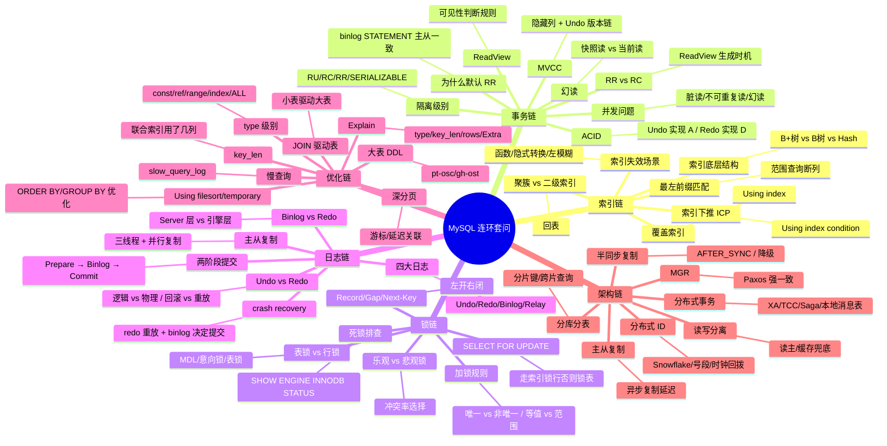

# 跨主题高频面试 Q&A

> **一句话定位**：面试前冲刺用，41 题速答串联各主题，附连环套问思维导图
> **面试热度**：⭐⭐⭐⭐⭐
> **返回**：[MySQL 知识图谱](../README.md)

---

## 使用说明

- 全部 41 题按主题分类，每题 3-5 句要点速答，末尾 **关联** 链接指向对应主题文档的详细推导。
- 连环追问题在题号后标注 🔗，配合文末「连环套问思维导图」把握面试官的追问路径。
- 建议先盖住答案自答，再对照要点查漏，最后跳转关联文档补全原理。
- 版本基线 MySQL 8.0，5.7 仅作差异对比；涉及 InnoDB 特性时默认引擎为 InnoDB。
- 答案只给「要点 + 关键数字 + 为什么」，不展开推导——推导在关联文档里。

**各篇题目数与关联文档**：

| 篇章 | 题目数 | 关联文档 |
|------|--------|---------|
| 一、索引篇 | 8 题（Q1-Q8） | [索引原理与优化](./01-index/index-and-optimization.md) |
| 二、事务与 MVCC 篇 | 6 题（Q9-Q14） | [事务与 MVCC](./02-transaction/transaction-and-mvcc.md) |
| 三、锁机制篇 | 6 题（Q15-Q20） | [锁机制](./03-lock/lock-mechanism.md) |
| 四、查询优化篇 | 6 题（Q21-Q26） | [查询优化与执行计划](./04-query/query-optimization.md) |
| 五、存储引擎篇 | 5 题（Q27-Q31） | [存储引擎底层](./05-storage/innodb-engine.md) |
| 六、日志体系篇 | 5 题（Q32-Q36） | [日志体系](./06-log/log-system.md) |
| 七、架构与高可用篇 | 5 题（Q37-Q41） | [架构与高可用](./07-architecture/ha-and-sharding.md) |
| 合计 | **41 题** | 7 份主题文档 |

---

## 一、索引篇（8 题）

### Q1: MySQL 索引底层是什么结构？为什么用 B+树？🔗

**答**：InnoDB 索引底层是 B+树。B+树非叶子节点只存键值和指针不存数据，单页（16KB）能放上千个键值，3-4 层即可存千万行；叶子节点通过双向链表连接，范围查询只需遍历叶子链表。对比红黑树树高过高（千万行约 23 层，磁盘 IO 次数多）、Hash 索引不支持范围查询与排序，InnoDB 选 B+树是因为它兼顾了树矮（减少磁盘 IO）、范围查询高效（叶子链表）、有序（支持排序）三大需求。B 树虽也矮，但非叶子节点存数据导致单页键值数少、树更高，且范围查询需中序遍历回溯。

**关联**：→ [索引原理与优化](./01-index/index-and-optimization.md)

### Q2: 聚簇索引和二级索引的区别？🔗

**答**：聚簇索引的叶子节点存**完整行数据**，一张 InnoDB 表只有一棵聚簇索引树（按主键组织），"索引即数据"；二级索引的叶子节点只存**索引列值 + 主键值**，查到主键后还需回表到聚簇索引取行。因此主键查询走聚簇索引一次定位，二级索引查询多数要回表两次。InnoDB 聚簇索引按主键组织，没显式主键时选第一个 NOT NULL 唯一索引，再没有就生成隐藏 6 字节 ROWID——这就是为什么建表必加自增主键。

**关联**：→ [索引原理与优化](./01-index/index-and-optimization.md)

### Q3: 什么是回表？怎么避免？🔗

**答**：回表指二级索引查到主键后，再回到聚簇索引树取完整行的过程，一次查询两次 B+树查找。回表代价大：每次回表都是一次随机 IO，命中行数多时性能急剧下降。避免回表的核心是**覆盖索引**——把查询需要的所有列都建到二级索引里，让索引"覆盖"查询列，Extra 显示 `Using index` 即表示走了覆盖索引未回表。实战中常通过 `(a, b, c)` 联合索引覆盖 `SELECT a, b, c FROM t WHERE a=?` 这类查询。

**关联**：→ [索引原理与优化](./01-index/index-and-optimization.md)

### Q4: 什么是覆盖索引？🔗

**答**：覆盖索引指二级索引的叶子节点已包含查询所需的全部列（索引列 + 主键），无需回表即可返回结果，Extra 显示 `Using index`。它把"两次 B+树查找"降为"一次"，把随机 IO 降为顺序 IO，是高频查询优化的首选手段。建联合索引时把 `WHERE` 列放前、`ORDER BY` 列放中、`SELECT` 列放后，可同时满足过滤、排序、覆盖。注意覆盖索引不是索引类型，而是"查询恰好被索引覆盖"的执行效果。

**关联**：→ [索引原理与优化](./01-index/index-and-optimization.md)

### Q5: 最左前缀匹配是什么？🔗

**答**：联合索引 `(a, b, c)` 按 a→b→c 顺序在 B+树中排序，查询条件必须从最左列开始连续匹配才能走索引。`WHERE a=? AND b=? AND c=?` 全走，`WHERE a=? AND c=?` 只走 a（c 用不到索引，因 b 缺失后 c 在树中无序），`WHERE b=? AND c=?` 完全不走索引（缺 a 前缀）。范围查询（`>`/`<`/`BETWEEN`/`LIKE 'x%'`）会断开后续列的索引使用——范围列之后的所有列都不能走索引，因为范围后的列在 B+树中不再有序。优化原则：等值列在前、范围列在后。

**追问：`ORDER BY` 能走最左前缀吗？** 能。联合索引 `(a, b, c)` 下 `WHERE a=? ORDER BY b, c` 可走索引排序（`Using index`），因为 a 固定后 b、c 在索引中有序。但 `WHERE a=? ORDER BY c` 不能走索引排序（跳过 b 后 c 无序），产生 `Using filesort`。

**关联**：→ [索引原理与优化](./01-index/index-and-optimization.md)

### Q6: 索引下推 ICP 是什么？🔗

**答**：Index Condition Pushdown（索引下推）是 5.6 引入的优化：把原本在 Server 层做的 `WHERE` 过滤下推到存储引擎层，在二级索引遍历时就用索引列条件过滤，减少回表次数。典型场景：联合索引 `(a, b)`，查询 `WHERE a=? AND b LIKE '%xx%'`，无 ICP 时先按 a 取出所有主键回表再过滤 b；有 ICP 时在索引层就用 b 条件过滤，只对满足条件的行回表。Extra 显示 `Using index condition`。ICP 只对二级索引有效，聚簇索引无需下推。

**关联**：→ [索引原理与优化](./01-index/index-and-optimization.md)

### Q7: 索引失效有哪些场景？🔗

**答**：常见失效场景：①对索引列做函数/运算（`WHERE YEAR(create_time)=?`、`WHERE id+1=?`）；②隐式类型转换（varchar 列 `WHERE phone=13800138000` 数字查字符串）；③`LIKE '%xx'` 左模糊；④`OR` 两边不全有索引（一边无索引则全表扫）；⑤`NOT IN`/`!=`/`<>` 优化器认为扫描行数多时放弃索引；⑥联合索引未满足最左前缀；⑦优化器认为全表扫更快（扫描行数超过表 30% 左右）。`FORCE INDEX` 可强制走索引验证是否优化器误判。

**追问：`ORDER BY` 会让索引失效吗？** 不会让 `WHERE` 的索引失效，但若 `ORDER BY` 列不在索引中会产生 `Using filesort`。解法：把 `ORDER BY` 列加入联合索引。例如 `WHERE user_id=? ORDER BY create_time` 建联合索引 `(user_id, create_time)`，排序走索引消除 filesort。

**关联**：→ [索引原理与优化](./01-index/index-and-optimization.md)

### Q8: 主键选自增 ID 还是 UUID？为什么？🔗

**答**：推荐自增 ID。InnoDB 聚簇索引按主键有序组织，自增 ID 总是追加到 B+树末尾，页分裂少、写入快；UUID 无序导致新行插到中间，频繁页分裂、写放大、缓冲池命中率下降。UUID 优势是全局唯一、分布式无冲突，适合分库分表或多数据中心。折中方案：用 Snowflake 等有序分布式 ID 兼顾唯一与有序。UUID 占 16 字节（binary(16)）比 bigint 8 字节大一倍，所有二级索引叶子都存主键，主键越大索引越大。

**追问：为什么主键越大二级索引越大？** InnoDB 二级索引叶子节点存"索引列值 + 主键值"（用于回表）。主键 bigint 8 字节、UUID 16 字节，每条二级索引记录多 8 字节。一张 1000 万行的表若有 5 个二级索引，主键从 bigint 改 UUID 每个索引多 80MB，5 个索引多 400MB——这是 UUID 隐性成本。

**关联**：→ [索引原理与优化](./01-index/index-and-optimization.md)

---

## 二、事务与 MVCC 篇（6 题）

### Q9: ACID 是什么？各自怎么实现？🔗

**答**：A 原子性——事务要么全做要么全不做，由 **Undo Log** 实现（回滚时按 undo 反向操作）；D 持久性——提交后即使宕机不丢，由 **Redo Log** 实现（crash 后重放 redo）；I 隔离性——并发事务互不干扰，由 **锁 + MVCC** 实现（写写用锁、读写用 MVCC）；C 一致性——事务执行前后数据合法，由 A+I+D 共同保证（应用层约束也参与）。关键认知：ACID 中 C 是目标，AID 是手段，一致性是 AID 三者协同 + 业务约束的最终结果。

**追问：InnoDB 怎么保证 ACID 四特性的？** A=Undo Log（回滚时反向补偿）+ 事务内部所有操作原子性；C=AID+DB 约束（主键/外键/唯一索引/检查约束）+ 应用层校验；I=锁（写写串行）+ MVCC（读写并发）；D=Redo Log（WAL 先写日志再写数据页）+ `innodb_flush_log_at_trx_commit=1`（每事务 fsync）。四者通过两阶段提交（Redo prepare → Binlog → Redo commit）协同，保证 crash 后 AID 都满足。

**关联**：→ [事务与 MVCC](./02-transaction/transaction-and-mvcc.md)

### Q10: 并发问题有哪些？分别对应什么隔离级别？🔗

**答**：四种并发问题由轻到重：①丢失修改（两事务更新同列后互相覆盖）；②脏读（读到别的事务未提交的数据）；③不可重复读（同一事务两次读同一行结果不同，因别的事务提交了 UPDATE）；④幻读（同一事务两次范围查询结果集行数不同，因别的事务提交了 INSERT/DELETE）。四个隔离级别：读未提交（RU）全不防、读已提交（RC）防脏读、可重复读（RR）防脏读+不可重复读、串行化（SERIALIZABLE）全防。MySQL RR 通过 MVCC + Next-Key Lock 额外解决大部分幻读。

**追问：丢失更新怎么防？** MySQL 隔离级别不直接防丢失更新——需应用层用乐观锁（`UPDATE ... WHERE version=?`）或悲观锁（`SELECT ... FOR UPDATE`）。乐观锁适合读多写少，悲观锁适合写多冲突多。

**关联**：→ [事务与 MVCC](./02-transaction/transaction-and-mvcc.md)

### Q11: MVCC 原理是什么？ReadView 怎么判断可见性？🔗

**答**：MVCC（多版本并发控制）通过**隐藏列 + Undo 版本链 + ReadView** 实现。每行有 `trx_id`（最近修改事务 ID）和 `roll_pointer`（指向 undo 旧版本），多次修改形成 undo 版本链。ReadView 记录：`m_ids`（生成时活跃事务 ID 列表）、`min_trx_id`（最小活跃）、`max_trx_id`（下一个将分配的事务 ID）、`creator_trx_id`（当前事务）。可见性判断：行 `trx_id == creator_trx_id` 可见（自己改的）；`trx_id < min_trx_id` 可见（在 ReadView 前已提交）；`trx_id >= max_trx_id` 不可见（ReadView 后才开的事务）；在 `m_ids` 中不可见（未提交），否则可见。不可见时顺 `roll_pointer` 找旧版本重判。

**追问：MVCC 的 Undo 版本链什么时候清理？** 由 Purge 线程清理。某 undo log 版本对应的事务 ID < 当前所有活跃事务 ReadView 的 `min_trx_id` 时（即没有任何活跃事务需要看到这个旧版本），Purge 线程可清理。长事务的 ReadView 让 `min_trx_id` 停留旧值，Purge 无法推进——所有后续 undo log 都不能清理，导致 undo 表空间膨胀。这就是长事务危害的根因。

**关联**：→ [事务与 MVCC](./02-transaction/transaction-and-mvcc.md)

### Q12: RR 下幻读解决了吗？🔗

**答**：RR **大部分解决**了幻读，但不是完全解决。快照读（普通 SELECT）走 MVCC，ReadView 在事务首次读时生成并复用，后续读的都是同一快照，看不到别的事务新插入的行——幻读解决。当前读（`SELECT ... FOR UPDATE`/`UPDATE`/`DELETE`）走 Next-Key Lock（Record + Gap），锁住已有行及行间间隙，别的事务无法 INSERT 到间隙——幻读解决。**漏洞**：事务内先快照读再当前读，或先当前读再快照读，可能看到当前读带入的新行，建议事务内查询统一用当前读或统一用快照读。

**追问：怎么避免 RR 的幻读漏洞？** ①事务开头直接用 `SELECT ... FOR UPDATE` 做当前读加锁，后续操作都基于当前读；②避免事务内混合快照读与当前读；③若只需快照读，全程用普通 SELECT，不穿插 `FOR UPDATE`/`UPDATE`。

**关联**：→ [事务与 MVCC](./02-transaction/transaction-and-mvcc.md)

### Q13: RC 和 RR 的 ReadView 生成时机差异？🔗

**答**：RC（读已提交）**每条 SELECT** 都生成新 ReadView，所以能看到别的事务已提交的最新数据，导致不可重复读。RR（可重复读）在**事务首次快照读**时生成 ReadView 并复用到事务结束，后续所有快照读都用同一 ReadView，所以可重复读。差异本质：ReadView 复用与否。当前读不走 ReadView，始终读最新已提交版本。这也解释了为什么 RR 下事务第一条 SELECT 之前别的事务提交的数据可见，之后提交的不可见。

**追问：8.0 为什么很多公司从 RR 切 RC？** 三个原因：①8.0 默认 `binlog_format=row`，RC 下 row 格式主从复制也安全，RR 的历史优势消失；②RC 无 Gap Lock（除外键），锁范围小、死锁概率低，高并发写入更友好；③RC 每次读最新已提交数据，对"读后写"场景更直觉。代价是不防幻读，需应用层用乐观锁或 `SELECT FOR UPDATE` 补偿。

**关联**：→ [事务与 MVCC](./02-transaction/transaction-and-mvcc.md)

### Q14: 为什么 MySQL 默认 RR？8.0 后为什么很多公司改 RC？🔗

**答**：MySQL 早期 binlog 只有 STATEMENT 格式，主从复制在 RC 下语句乱序会导致主从数据不一致（如 `UPDATE t SET x=x+1` 在并发下两库结果不同），RR 保证事务内语句顺序执行，主从一致，故默认 RR。8.0 后改 RC 的原因：①binlog 默认 ROW 格式记录行变更，与隔离级别无关，主从一致不再依赖 RR；②RC 并发更好——不加 Gap Lock，锁冲突少，死锁少；③RC 无幻读漏洞争议，语义更清晰；④互联网高并发场景 RC 性能优势明显。改 RC 需同步把 binlog 设为 ROW。

**关联**：→ [事务与 MVCC](./02-transaction/transaction-and-mvcc.md)

---

## 三、锁机制篇（6 题）

### Q15: MySQL 有哪些锁？表级、行级？🔗

**答**：表级锁包括：**表锁**（`LOCK TABLES`，显式）、**MDL**（元数据锁，DDL/DML 互斥）、**意向锁**（IS/IX，行锁前先标表级意向，快速判断是否有冲突）。行级锁包括：**Record Lock**（锁单行记录）、**Gap Lock**（锁行间间隙，防 INSERT）、**Next-Key Lock**（Record + Gap，左开右闭）。还有**插入意向锁**（INSERT 前申请，与 Gap Lock 冲突、与其他插入意向锁不冲突）。全局锁 `FLUSH TABLES WITH READ LOCK` 用于备份。InnoDB 行锁基于索引，无索引时退化为表锁。

**追问：意向锁的作用是什么？** 意向锁（IS/IX）是表级锁，事务加行锁前先在表上加意向锁，让"加表锁"的操作能 O(1) 判断是否有行锁（只需检查表上是否有意向锁，不用遍历所有行锁）。意向锁之间互相兼容（IS/IS/IX/IX 不冲突），只与表级 S/X 锁有冲突关系——它是行锁的快速冲突检测优化，不参与行级并发控制。

**关联**：→ [锁机制](./03-lock/lock-mechanism.md)

### Q16: Record/Gap/Next-Key Lock 分别是什么？🔗

**答**：**Record Lock** 锁索引上一条记录，防止别的事务 UPDATE/DELETE 该行。**Gap Lock** 锁两个记录之间的间隙（区间开区间），防止别的事务 INSERT 到间隙，只在 RR 隔离级别生效，RC 无 Gap Lock。**Next-Key Lock** = Record + 前面的 Gap，左开右闭 `(a, b]`，是 RR 下默认的行锁，既防改行又防插入，用于解决幻读。例如索引上有 5、10、15，对 10 加 Next-Key Lock 锁 `(5, 10]`。退化规则：唯一索引等值命中退化为 Record Lock，唯一索引等值未命中退化为 Gap Lock。

**追问：为什么 RR 下需要 Gap Lock 而 RC 不需要？** RR 要求可重复读+防幻读，快照读靠 MVCC 天然防幻读，但当前读（`FOR UPDATE`/`UPDATE`/`DELETE`）需锁住间隙防止其他事务 INSERT 新行导致行数变化。RC 每次读最新已提交版本，不要求防幻读，所以无需 Gap Lock——这也是 RC 死锁概率低于 RR 的原因。8.0 切 RC 可大幅减少 Gap Lock 导致的死锁。

**关联**：→ [锁机制](./03-lock/lock-mechanism.md)

### Q17: SELECT FOR UPDATE 锁的是行还是表？🔗

**答**：**取决于是否有匹配的索引**。`SELECT ... FOR UPDATE` 是当前读，走索引时锁命中的行（及间隙，RR 下）；**未走索引（全表扫）时锁全表**——因为 InnoDB 行锁基于索引，全表扫要对每行加锁，等价于锁表。这是生产事故高发点：以为锁一行实际锁全表，导致全库阻塞。排查：`EXPLAIN` 看 type 是否为 ALL、key 是否为 NULL；`SHOW ENGINE INNODB STATUS` 看锁的具体范围。建议：FOR UPDATE 必带高选择性索引条件，且先 EXPLAIN 确认走索引。

**追问：8.0 的 NOWAIT/SKIP LOCKED 有什么用？** ①`FOR UPDATE NOWAIT`——锁不到立即报错（不等待），适合"抢不到就放弃"的场景；②`FOR UPDATE SKIP LOCKED`——跳过被锁的行返回未锁的行，适合并发消费者从任务表拉取任务（各取各的互不阻塞）。两者配合可大幅提升并发度，替代应用层重试逻辑。

**关联**：→ [锁机制](./03-lock/lock-mechanism.md)

### Q18: 唯一索引等值命中加什么锁？未命中呢？🔗

**答**：**唯一索引等值命中**：退化为 Record Lock，只锁命中那一条记录，不加 Gap Lock——因为唯一性保证不会有第二条相同值插入，间隙锁无意义。**唯一索引等值未命中**：退化为 Gap Lock，锁住查询值所在的间隙，防止别的事务 INSERT 这个值破坏唯一性。**非唯一索引等值命中**：Next-Key Lock + 后一个 Gap Lock（锁住命中值到下一值之间的间隙，因为非唯一可能有多个相同值，需防幻读）。**范围查询**：所有隔离级别都加 Next-Key Lock 锁住范围区间。

**追问：非唯一索引为什么多锁一个 Gap？** 非唯一索引可能有重复值（如 c=10 有多行），若只锁命中的行，其他事务可在命中行前后插入新的 c=10 行，导致当前读（`SELECT ... FOR UPDATE`）幻读。Gap Lock 锁住 `(前一行, 命中行] + (命中行, 后一行)` 防止插入，保证 RR 下当前读防幻读。唯一索引无需此 Gap（唯一性保证无重复值）。

**关联**：→ [锁机制](./03-lock/lock-mechanism.md)

### Q19: 死锁怎么排查与避免？🔗

**答**：死锁是两事务互相等待对方持有的锁。InnoDB 自动死锁检测（`innodb_deadlock_detect=ON`）发现环后回滚 undo 量少的事务。排查：`SHOW ENGINE INNODB STATUS` 看 `LATEST DETECTED DEADLOCK` 段，含两事务持有的锁与等待的锁、执行的 SQL。避免：①事务尽量短小，快速提交；②按固定顺序访问表与行（如按主键升序加锁），避免交叉；③大事务拆小；④FOR UPDATE 改用乐观锁；⑤合理索引避免锁升级为表锁；⑥RC 隔离级别下 Gap Lock 少，死锁概率低。`innodb_lock_wait_timeout` 控制锁等待超时。

**追问：死锁检测有性能代价吗？** 高并发下死锁检测会消耗 CPU（每个等待的事务都检测循环等待图），极端高并发（数百连接竞争同一行）检测开销可能成为瓶颈。可关闭检测（`innodb_deadlock_detect=OFF`）+ 设短超时（`innodb_lock_wait_timeout=5`）让超时回滚代替检测，但牺牲死锁响应速度。生产通常保持开启，仅在确认死锁检测成为瓶颈时关闭。

**关联**：→ [锁机制](./03-lock/lock-mechanism.md)

### Q20: 乐观锁和悲观锁怎么选？🔗

**答**：悲观锁假设冲突必发生，先加锁再操作（`SELECT ... FOR UPDATE`），强一致但并发低，适合写多读少、冲突频繁。乐观锁假设冲突少，读时不锁、提交时校验版本（`version` 字段或 `CAS`），`UPDATE t SET x=?, version=version+1 WHERE id=? AND version=?`，影响行数 0 即重试，并发高但冲突多时重试开销大。选择：冲突率 <10% 用乐观锁，>30% 用悲观锁，中间看业务容忍度。乐观锁注意 ABA 问题（用版本号而非状态值），悲观锁注意死锁与锁等待超时。

**追问：乐观锁重试次数怎么设？** 通常 3 次指数退避（10ms/50ms/200ms），3 次仍失败说明冲突极严重，应降级为悲观锁或限流。重试需保证业务方法幂等——否则重试导致重复执行（如重复扣款）。8.0+ 可用 `SELECT ... FOR UPDATE NOWAIT`（锁不到立即报错）或 `SKIP LOCKED`（跳过被锁的行）优化悲观锁并发。

**关联**：→ [锁机制](./03-lock/lock-mechanism.md)

---

## 四、查询优化篇（6 题）

### Q21: Explain 各字段含义？type 有哪些级别？🔗

**答**：核心字段：**id**（执行顺序，越大越先）、**select_type**（SIMPLE/PRIMARY/SUBQUERY）、**table**、**type**（访问类型，性能关键）、**possible_keys**（可能用的索引）、**key**（实际用的索引）、**key_len**（索引使用长度）、**rows**（预估扫描行数）、**Extra**（额外信息）。type 从好到差：`system` > `const`（主键/唯一索引等值）> `eq_ref`（JOIN 主键/唯一等值）> `ref`（非唯一索引等值）> `range`（范围）> `index`（扫整棵索引树）> `ALL`（全表扫）。生产底线：type 至少 `range`，严禁 `ALL`。

**追问：Explain 的 rows 和 filtered 怎么配合看？** `rows` 是优化器估算的扫描行数，`filtered` 是过滤后剩余比例，实际返回行数 ≈ `rows × filtered / 100`。若 `rows=1000` 且 `filtered=1%`，说明扫描 1000 行只返回 10 行——索引选择性不好，需建更精确的联合索引。8.0 可用 `EXPLAIN ANALYZE` 看实际执行耗时与行数，验证估算准确度。

**关联**：→ [查询优化与执行计划](./04-query/query-optimization.md)

### Q22: key_len 怎么算？有什么用？🔗

**答**：key_len 表示索引中**实际使用**的字节数，用于判断联合索引用了几列。计算规则：`CHAR(n)` = `n × 字节倍数`（utf8mb4 四倍、utf8 三倍），`VARCHAR` 额外 +2（变长列长度）、`NULL` 额外 +1（NULL 标志），`INT` 4、`BIGINT` 8、`DATE` 3、`DATETIME` 5。例：联合索引 `(a INT, b VARCHAR(20), c BIGINT)`，`WHERE a=? AND b=?` 的 key_len = 4 + (20×4 + 2) + 0 = 86，若只 `WHERE a=?` 则 key_len=4。用途：判断联合索引是否被完整使用，是否因范围查询断开后续列。

**追问：key_len 为 0 是什么情况？** ①`type=ALL` 全表扫描没用索引，key_len=0；②`type=index` 扫整个索引树但未用索引定位（如 `SELECT COUNT(*)`），key_len 可能不显示；③查询条件无等值匹配只排序时，key_len 可能为 0。key_len=0 通常说明索引未用于过滤，需检查 WHERE 条件是否命中索引列。

**关联**：→ [查询优化与执行计划](./04-query/query-optimization.md)

### Q23: Extra 里 Using filesort 怎么优化？🔗

**答**：`Using filesort` 表示 ORDER BY 无法走索引排序，需在内存（`sort_buffer`）或磁盘做排序，代价高。优化：①建联合索引把 `WHERE` 列和 `ORDER BY` 列都覆盖，让排序走索引（`ORDER BY` 列顺序与索引一致）；②`WHERE a=? ORDER BY b, c` 建 `(a, b, c)` 索引；③排序方向与索引一致（8.0 支持降序索引 `DESC`）；④只 SELECT 需要的列，减少 sort_buffer 压力；⑤调大 `sort_buffer_size`。`Using temporary`（临时表）更糟，常见于 GROUP BY + ORDER BY 不同列、DISTINCT，需改写 SQL 或加索引。

**追问：Using temporary 什么时候出现？** `GROUP BY`、`DISTINCT`、`UNION` 需要临时表去重时出现。若临时表超过 `tmp_table_size` 落磁盘（`SHOW STATUS LIKE 'Created_tmp_disk_tables'` 查看磁盘临时表数）。优化：给 GROUP BY 列加索引（走 `Using index for group-by`），或拆分 SQL 减少 DISTINCT。

**关联**：→ [查询优化与执行计划](./04-query/query-optimization.md)

### Q24: JOIN 时怎么选驱动表？🔗

**答**：驱动表是嵌套循环的外层表，被驱动表是内层。**小表驱动大表**——驱动表全量扫，被驱动表走索引多次 probe，所以驱动表小则 probe 次数少。优化器一般自动选小表为驱动表（基于统计信息），可用 `STRAIGHT_JOIN` 强制顺序。关键：被驱动表的 JOIN 列必须有索引，否则每次 probe 都全表扫。Nested Loop Join 适合等值小表 JOIN；BNL（Block Nested Loop）用于被驱动表无索引，把驱动表分块入 join_buffer 减少被驱动表扫表次数；BKA（Batched Key Access）结合 MRR 批量查被驱动表。

**追问：JOIN 的 ON 和 WHERE 有什么区别？** INNER JOIN 时 ON 和 WHERE 等效（都过滤）。LEFT JOIN 时 ON 是连接条件（不过滤左表行），WHERE 是过滤条件（过滤左表行）。如 `LEFT JOIN t2 ON t1.id=t2.id AND t2.status=1`——status=1 只影响 t2 的匹配不影响 t1 的行数；`LEFT JOIN t2 ON t1.id=t2.id WHERE t2.status=1`——status=1 过滤掉 t2.status!=1 的行（含 t2 为 NULL 的行），等价 INNER JOIN。

**关联**：→ [查询优化与执行计划](./04-query/query-optimization.md)

### Q25: LIMIT 1000000, 10 怎么优化？🔗

**答**：深分页问题——MySQL 需扫前 1000010 行再丢前 100 万行，越往后越慢。优化方案：①**游标分页**（推荐）——记住上一页最后一条的 id，`WHERE id > ? LIMIT 10` 走主键索引，O(1) 翻页，但不支持随机跳页；②**延迟关联**——`SELECT t.* FROM t INNER JOIN (SELECT id FROM t ORDER BY x LIMIT 1000000, 10) tmp ON t.id=tmp.id`，子查询走覆盖索引只取 id，再回表 10 行；③**业务限制**——限制最大翻页深度（如只允许前 100 页），超过用搜索。禁止 `LIMIT offset, n` 做深分页。

**追问：游标分页和延迟关联各适合什么场景？** 游标分页适合"下一页"连续翻页（App feed 流、无限滚动），要求排序字段有序且无断点（主键自增最佳），性能 O(1) 但不能跳页。延迟关联适合需要跳页的 PC 端列表（第 10 万页），性能从"扫描 100 万行回表"优化为"扫描 100 万行索引（不回表）+ 回表 10 行"，仍有扫描成本但大幅降低。两者也可组合：游标分页为主，延迟关联兜底跳页。

**关联**：→ [查询优化与执行计划](./04-query/query-optimization.md)

### Q26: 大表加字段/索引会锁表吗？怎么办？🔗

**答**：5.6 前 DDL 会锁表；5.6+ 引入 Online DDL，多数加列/加索引支持 `inplace` + `nolock`，执行期间可读写。但大表（千万行+）即使 Online DDL 仍有风险：①建索引需扫全表 + 排序，耗时长，占用 buffer pool 与 IO；②开始与结束阶段短暂 MDL 锁，可能阻塞线上；③ row copy 期间 redo 暴涨。生产做法：①用 **pt-online-schema-change** 或 **gh-ost** 工具，建影子表 + 触发器同步增量，影子表建好后 rename 切换，全程不锁；②业务低峰执行；③分批次（如按分区）；④8.0 的 instant DDL（加列到末尾）秒级完成。

**追问：DDL 前为什么要检查长事务？** DDL 需 MDL_WRITE 锁，若存在长事务持有 MDL_READ，DDL 排队等待；后续所有 DML 因 MDL 队列 FIFO 排在 DDL 后面也被阻塞——一个长事务 + 一个 DDL = 全表卡死。所以 DDL 前必须 `SELECT * FROM information_schema.innodb_trx WHERE TIME_TO_SEC(TIMEDIFF(NOW(), trx_started)) > 60` 检查无长事务，或设 `lock_wait_timeout=30` 缩短 MDL 等待超时避免卡死。

**追问：gh-ost 和 pt-osc 选哪个？** gh-ost 优先——不用触发器（用 binlog 解析同步增量），对主库压力小，可暂停/恢复，有流量控制（`throttle-control-replicas` 监控从库延迟）。pt-osc 成熟但用触发器，高并发下触发器有性能开销。有外键时 pt-osc 有限支持，gh-ost 不支持外键需先处理。

**关联**：→ [查询优化与执行计划](./04-query/query-optimization.md)

---

## 五、存储引擎篇（5 题）

### Q27: InnoDB 和 MyISAM 区别？🔗

**答**：①**事务**——InnoDB 支持事务、crash recovery；MyISAM 不支持，宕机易损坏。②**锁粒度**——InnoDB 行锁（基于索引）；MyISAM 表锁，写并发低。③**索引结构**——InnoDB 聚簇索引（索引即数据）；MyISAM 非聚簇（索引与数据分离，数据存 `.MYD`，索引存 `.MYI`）。④**外键**——InnoDB 支持；MyISAM 不支持。⑤**全文索引**——MyISAM 老牌支持；InnoDB 5.6+ 才支持。⑥**崩溃恢复**——InnoDB 有 redo log；MyISAM 靠 `myisamchk` 修复，慢且不可靠。8.0 系统表已全转 InnoDB，MyISAM 仅用于只读历史表。

**追问：为什么 InnoDB 选聚簇索引而 MyISAM 选非聚簇？** InnoDB 面向 OLTP（高并发读写），聚簇索引让主键查找一次 IO 定位行，且行数据与索引同页 IO 局部性好；MyISAM 面向 OLAP/只读，非聚簇让二级索引也直接存行指针（不需回表聚簇索引），多索引场景下扫描更快。设计取舍不同。

**关联**：→ [存储引擎底层](./05-storage/innodb-engine.md)

### Q28: Buffer Pool 的 LRU 为什么改进？🔗

**答**：传统 LRU 全表扫一次会把热点页全冲掉（缓冲池污染），全表扫数据仅用一次却把热数据挤出去。InnoDB 改进 LRU 分 **young 区（新热数据，63%，约 5/8）+ old 区（冷数据，37%，约 3/8）**：新页先插 old 区头部，若在 `innodb_old_blocks_time`（默认 1 秒）内再次被访问才提升到 young 区头部。全表扫的页插 old 区，1 秒内不再访问就留在 old 区被淘汰，不冲掉 young 区热数据。young 区满时从尾部淘汰到 old 区，old 区满时从尾部淘汰出缓冲池。这套机制保护了热点数据。

**追问：Buffer Pool 大小怎么配？** 生产环境一般配物理内存的 60%-70%（`innodb_buffer_pool_size`）。如 64GB 服务器配 40-45GB 给 Buffer Pool，剩余给 OS/连接池/JVM（若同机）。8.0 支持动态调整（`SET GLOBAL innodb_buffer_pool_size=N` 在线生效，无需重启）。Buffer Pool 可分多个 instance（`innodb_buffer_pool_instances`）减少锁争用，建议每个 Instance ≥ 1GB。

**关联**：→ [存储引擎底层](./05-storage/innodb-engine.md)

### Q29: Change Buffer 是什么？为什么只对二级索引有效？🔗

**答**：Change Buffer 缓存对**二级索引**的 INSERT/UPDATE/DELETE 操作，当目标页不在 Buffer Pool 时先记在 Change Buffer，等下次该页被读到内存时再 merge，减少随机 IO。**只对二级索引有效**因为：聚簇索引的修改必须立即定位行（按主键有序），页必然在内存或需读入，无缓存意义；二级索引修改是随机的（如 `UPDATE t SET name=? WHERE id=?` 改 name 列，name 索引页可能不在内存），缓存后批量 merge 能把多次随机 IO 合并为一次顺序 IO。前提：二级索引非唯一（唯一索引需立即读页校验唯一性，无法缓存）。

**追问：Change Buffer 和 Insert Buffer 的关系？** Insert Buffer 是 5.5 之前的名字（只缓存 INSERT）；5.5 后扩展支持 DELETE/UPDATE 改名 Change Buffer。占 Buffer Pool 的 `innodb_change_buffer_max_size`（默认 25%）。写多读少的二级索引场景收益大；若二级索引 immediately 被读（merge 触发频繁），Change Buffer 无收益反而有维护开销。

**关联**：→ [存储引擎底层](./05-storage/innodb-engine.md)

### Q30: Doublewrite 解决什么问题？🔗

**答**：Doublewrite Buffer（双写缓冲）解决**页撕裂**问题——InnoDB 页 16KB，操作系统页 4KB，磁盘扇区 512B，宕机时 16KB 可能只写了一部分（如写了 8KB），导致页损坏。Doublewrite 先把页写到共享表空间的连续 2MB 区域（doublewrite buffer），再写到各表独立 `.ibd` 文件。crash recovery 时若发现 `.ibd` 中的页校验和不对，从 doublewrite buffer 恢复完整页再重放 redo。代价是每次写多一次顺序写（doublewrite 区连续，IO 快），但换来页完整性。8.0.20+ 支持独立 doublewrite 文件减少共享表空间依赖。

**追问：Doublewrite 能关掉吗？** 能，`innodb_doublewrite=OFF` 可关闭，但不建议——关掉后页撕裂无法恢复，redo 重放到撕裂页会产生错误数据。仅在极致写入性能场景（如批量导入后重建表）临时关闭。SSD 时代 doublewrite 的顺序写开销已很小（<5%），不值得为省这点性能冒数据损坏风险。

**追问：页撕裂为什么不能用 redo 修复？** Redo 记录的是"页偏移的变化"，重放时假设页本身是完整的——若页已撕裂（部分写入），redo 重放会把变化应用到不完整的页上，产生错误数据。Doublewrite 提供页的"完整副本"，先恢复完整页再重放 redo。这就是 Doublewrite 不可被 redo 替代的原因。

**关联**：→ [存储引擎底层](./05-storage/innodb-engine.md)

### Q31: WAL 是什么？为什么这么设计？🔗

**答**：WAL（Write-Ahead Logging，预写日志）——先写 redo log（顺序写）再写数据页（随机写），提交时只需 fsync redo log。设计原因：①**顺序写远快于随机写**——redo log 是追加写循环文件，磁盘顺序 IO 性能比随机 IO 高 1-2 个数量级；②**批量刷盘**——多个事务的 redo 可合并一次 fsync，把多次随机写数据页转为一次顺序写日志；③**crash recovery**——宕机后数据页可能未落盘，但 redo log 已落盘，重放即可恢复。`innodb_flush_log_at_trx_commit=1` 每事务 fsync 保不丢，=0 每秒刷（丢 1 秒），=2 每次写 OS buffer 每秒 fsync（OS 崩溃丢 1 秒）。

**追问：redo log 满了会怎样？** redo log 是固定大小的循环文件（8.0.30 前用 `innodb_log_file_size` × `innodb_log_files_in_group`，8.0.30+ 用 `innodb_redo_log_capacity` 单一参数）。redo log 写满时 InnoDB 必须推进 Checkpoint——把 Buffer Pool 中脏页刷盘到 Checkpoint LSN，释放 redo 空间。此时所有写入操作会被阻塞等待 Checkpoint 完成，表现为业务写入卡顿。生产应监控 `redo log usage`，确保 Checkpoint 跟得上写入速度，避免"redo log full"导致的写入停顿。

**关联**：→ [存储引擎底层](./05-storage/innodb-engine.md)

---

## 六、日志体系篇（5 题）

### Q32: Undo Log 和 Redo Log 区别？🔗

**答**：**Undo Log** 记录修改前的旧值（逻辑日志），用途：事务回滚（保证原子性 A）+ MVCC 版本链（提供快照读）。**Redo Log** 记录修改后的物理页变化（物理日志，"哪个页偏移改成什么"），用途：crash recovery 重放（保证持久性 D）。写入时机：修改数据页前先写 undo，再写 redo，再改页。存储：undo 在 undo tablespace（8.0 独立），redo 在 `ib_logfile`（8.0.30+ 改 `#ib_redo` 文件组）。redo 是循环写固定大小，undo 是按需扩展。redo 必须落盘才提交，undo 不强制（崩溃后未提交事务靠 undo 回滚，但需配合 redo）。

**追问：为什么 undo 是逻辑日志而 redo 是物理日志？** Undo 用逻辑日志（记录旧值行级）是因为回滚时需反向操作（恢复旧值），逻辑日志语义清晰易回滚。Redo 用物理日志（记录页偏移变化）是因为重放时直接覆盖页偏移，幂等且高效（不依赖 SQL 语义，重复重放无副作用）。若 redo 用逻辑日志，重放时可能因数据状态不同产生不同结果（非幂等）。

**关联**：→ [日志体系](./06-log/log-system.md)

### Q33: Binlog 和 Redo Log 区别？为什么需要两个？🔗

**答**：**Redo Log** 是 InnoDB 引擎层日志，物理日志（页偏移变化），循环写，用于引擎层 crash recovery。**Binlog** 是 Server 层日志，逻辑日志（SQL 或行变更），追加写，用于主从复制与数据恢复（pitr）。为什么两个：①历史原因——binlog 是 MySQL Server 层的，InnoDB 早期是插件需自带 redo；②层次不同——redo 物理日志重放快但只在同一实例，binlog 逻辑日志可跨实例跨版本；③功能不同——redo 只管 crash recovery，binlog 管复制与备份。两者通过两阶段提交保证一致性。

**关联**：→ [日志体系](./06-log/log-system.md)

### Q34: 两阶段提交是什么？为什么需要？🔗

**答**：两阶段提交（2PC）保证 redo log 与 binlog 一致：①**Prepare 阶段**——InnoDB 写 redo log 并标 prepare 状态；②**Commit 阶段**——写 binlog，再写 redo log 标 commit 状态。crash recovery 时：若 redo 有 commit 标记，提交事务；若 redo 是 prepare 但 binlog 完整（有完整 XID），提交（说明 binlog 已写，从库可能已应用，必须提交保持一致）；若 redo 是 prepare 且 binlog 不完整，回滚（binlog 没写，从库不会有，回滚无影响）。不用 2PC 则可能出现 redo 提交但 binlog 没写（从库丢数据）或 binlog 写了但 redo 没提交（从库多数据），主从不一致。

**追问：组提交（Group Commit）和两阶段提交什么关系？** 组提交是两阶段提交的性能优化——多个事务的 prepare → 写 binlog → commit 三阶段可流水线化：Flush Stage 多事务并行写 Redo+Binlog 到 OS Cache；Sync Stage 攒批 fsync；Commit Stage 并行写 Redo commit。把多个事务的 fsync 合并为一次，高并发下大幅提升吞吐。`binlog_group_commit_sync_delay`（默认 0）控制攒批等待时间。

**关联**：→ [日志体系](./06-log/log-system.md)

### Q35: crash recovery 怎么保证数据不丢？🔗

**答**：crash recovery 依赖 redo log + binlog 两阶段提交。流程：①启动时扫 redo log，重放所有已 prepare 但页未落盘的变更到 Buffer Pool；②对每个 prepare 状态事务查 binlog 是否有完整 XID——有则提交、无则用 undo 回滚；③重放完成后 Buffer Pool 脏页异步刷盘。保证不丢的前提：`innodb_flush_log_at_trx_commit=1`（每事务 fsync redo）+ `sync_binlog=1`（每事务 fsync binlog）。代价是每事务两次 fsync，性能影响大，可调为 `=2`/`sync_binlog=N` 牺牲少量安全性换性能。redo log 循环写，checkpoint 之前的页已落盘可覆盖，恢复只重放 checkpoint 之后的。

**追问：崩溃恢复时页撕裂怎么处理？** 重放 redo 前先检查每页的 checksum（校验和），若不匹配说明该页在崩溃时只写了部分（partial page write / 页撕裂），从 Doublewrite Buffer 找该页的完整副本恢复，再用 redo 重放。若没有 Doublewrite，redo 重放到撕裂页会产生错误数据——这就是 Doublewrite 的不可替代性。

**关联**：→ [日志体系](./06-log/log-system.md)

### Q36: 主从复制原理？延迟怎么解决？🔗

**答**：三线程模型：主库 **Binlog Dump Thread** 推送 binlog，从库 **IO Thread** 拉取写 relay log，**SQL Thread** 重放 relay log。5.7+ 支持基于组提交的**逻辑时钟并行复制**（`slave_parallel_type=LOGICAL_CLOCK`），8.0 默认 `MTS`（多线程从库）按库或按 WRITESET 并行重放。延迟原因：从库单线程重放跟不上主库并发写；大事务；从库硬件差；网络。解决：①开并行复制；②避免大事务（拆分）；③从库更好硬件；④半同步复制保证至少一个从库收到；⑤读写分离读容忍延迟（缓存 + 提示）；⑥关键读走主库。

**追问：为什么从库回放不能多线程并行？** 早期从库 SQL Thread 单线程串行回放，因为 binlog 中的事务可能操作同一行，并行回放需保证顺序一致。5.7+ 引入基于组提交的并行——同一组提交内的事务互不冲突，可并行回放；8.0 的 WRITESET 模式基于行级冲突检测，不同行的事务可并行，并行度更高。但跨组/跨行冲突的事务仍需串行等待，所以并行复制不能完全消除延迟，只能缩短。

**追问：GTID 复制和传统位点复制有什么区别？** 传统复制用"binlog 文件名 + position"定位同步位点，切换主库时需手动计算新主库的位点，易错。GTID（Global Transaction ID）为每个事务分配全局唯一 `server_uuid:transaction_id`，从库自动从主库未同步的 GTID 开始拉取，切换主库时自动衔接。8.0 默认开启 GTID（`gtid_mode=ON`），生产推荐 GTID + 并行复制。

**关联**：→ [日志体系](./06-log/log-system.md)

---

## 七、架构与高可用篇（5 题）

### Q37: 读写分离如何解决主从延迟？🔗

**答**：读写分离后读走从库，延迟导致读到旧数据。解决：①**强制读主**——写后一段时间内（如同会话、同请求）关键读走主库，用注解或 `@DS("master")` 路由；②**半同步复制**——主库写后等至少一个从库收到 binlog 才返回，降低延迟（但不消除）；③**缓存兜底**——写后写缓存，读先查缓存，缓存过期再读从库（已延迟过去）；④**GTID + 并行复制**——缩短从库重放时间；⑤业务接受最终一致——非关键读（如列表）容忍延迟，关键读（如刚下的订单）走主库。彻底消除延迟需用 MGR/Paxos 强一致集群。

**追问：写后立即读怎么保证走主库？** ①同会话粘连——写后一段时间内同 Session 的读走主库（HikariCP `read-only` 标记 + Spring `@Transactional` 判断）；②同请求粘连——同 HTTP 请求内写后读走主库（ThreadLocal 标记 + 过滤器清除）；③业务层显式指定——关键读用 `@DS("master")` 或 `@Master` 注解；④中间件路由——ShardingSphere 的 `master-slave-rules` 支持事务内自动走主库。生产推荐"同请求粘连 + 关键读显式指定"组合。

**关联**：→ [架构与高可用](./07-architecture/ha-and-sharding.md)

### Q38: 半同步复制是什么？什么时候降级？🔗

**答**：半同步复制（Semi-Sync）介于异步与全同步之间——主库提交事务后**等待至少一个从库 ACK 收到 binlog** 才返回客户端成功，保证主库宕机时从库已有该事务。8.0 默认 `AFTER_SYNC`（主库收到从库 ACK 后才提交，从库不会比主库多数据）。**降级场景**：从库故障或网络抖动导致 ACK 超时（`rpl_semi_sync_master_timeout`，默认 10 秒），主库为不阻塞业务自动降级为异步复制——此时主库宕机可能丢已 ACK 前的数据。监控 `Rpl_semi_sync_master_status` 为 ON 表示半同步生效，OFF 表示已降级。需配监控告警及时恢复从库。

**追问：MGR 和半同步怎么选？** 半同步是"主从 + ACK"模式，主库单点写入，从库被动接收，适合一主多从读多写少场景；MGR 是"集群共识"模式，基于 XCom Paxos 多数派确认，自动选主 failover，无单点，适合金融强一致场景。半同步成本低（只需插件），MGR 成本高（需至少 3 节点 + 网络要求低延迟）。中小规模选半同步 + Orchestrator failover，大规模金融选 MGR。

**关联**：→ [架构与高可用](./07-architecture/ha-and-sharding.md)

### Q39: 分库分表怎么选分片键？跨片查询怎么办？🔗

**答**：分片键选择原则：①**高基数**（取值多，分布均匀，避免热点）；②**查询高频出现在 WHERE**（让多数查询能定位单片）；③**不可变**（值不变，避免迁移）；④**业务关联**（如按 user_id 分片，用户相关查询落单片）。常用：user_id、order_id、tenant_id。**跨片查询**对策：①**广播表**（小表如字典表每片都存，JOIN 本地化）；②**冗余字段**（订单表冗余 user_id，按 user_id 查不用跨片）；③**异构索引**（按另一维度建一份冗余表，如订单按 user_id 分片 + 按 merchant_id 冗余一份）；④**应用层聚合**（多片查询后合并，分页困难）；⑤**ES 宽表**（binlog 同步到 ES 提供复杂查询）。分片数建议 2 的幂，方便扩容倍增。

**追问：分库分表后怎么扩容？** ①**倍增扩容**——原 4 库 → 8 库，分片键 hash 后 `mod 8`，原 `mod 4` 的数据只需迁移一半（倍增时只动模 8 不等于模 4 的那部分）；②**一致性 hash**——加节点只影响相邻段数据，但数据分布可能不均；③**预分片**——建库时一次建足（如 1024 逻辑分片），物理库少但逻辑分片多，扩容时只调逻辑分片到物理库的映射，不迁数据。生产推荐预分片 + 倍增。

**关联**：→ [架构与高可用](./07-architecture/ha-and-sharding.md)

### Q40: 分布式 ID 方案有哪些？Snowflake 时钟回拨怎么办？🔗

**答**：常见方案：①**UUID**——简单全局唯一，但无序、占 16 字节，不适合主键；②**Snowflake**——64 位（1 符号 + 41 时间戳 + 10 机器 + 12 序列），有序、高性能，依赖机器时钟；③**号段模式**（如美团 Leaf）——DB 取一段号段缓存本地发，用完再取，DB 压力小；④**Redis INCR**——简单但依赖 Redis 可用性；⑤**数据库多主自增**（步长法）——`auto_increment_offset` + `auto_increment_increment`，扩容难。**Snowflake 时钟回拨**：①回拨小（如 <5ms）——等待回拨时间过去再发；②回拨大——报错或用扩展位记录回拨次数；③Leaf-Snowflake 用 ZooKeeper 持久化上次时间戳，启动时比 ZK 时间戳大才发，避免回拨。生产推荐 Leaf 或改进 Snowflake。

**追问：Snowflake 的 64 位怎么分配？** 1 位符号位（0）+ 41 位毫秒时间戳（支持 69 年）+ 10 位机器 ID（1024 节点，可拆 5 位数据中心 + 5 位机器）+ 12 位序列号（每毫秒 4096 个 ID）。单机单毫秒最多 4096 个 ID，超出需等下一毫秒。时间戳位用绝对毫秒减起始时间（如 2020-01-01），41 位约 69 年可用，到期需迁移。

**关联**：→ [架构与高可用](./07-architecture/ha-and-sharding.md)

### Q41: 分布式事务怎么选？🔗

**答**：常见方案：①**2PC/XA**——强一致，但同步阻塞、性能差，适合数据库内部跨库（如 MySQL XA）；②**TCC**（Try-Confirm-Cancel）——业务侵入大，需写补偿，性能好，适合金融核心；③**Saga**——长事务拆多个子事务 + 补偿，最终一致，适合长流程（如订单履约）；④**本地消息表**——业务表 + 消息表同事务写，定时扫消息表发 MQ，最终一致，简单可靠，互联网最常用；⑤**事务消息**（RocketMQ）——MQ 保证半消息 + 回查，等价本地消息表但无需自己建表。选择：强一致金融选 TCC，最终一致业务选本地消息表/事务消息，跨库强一致选 XA 但慎用。原则：能用本地事务就别上分布式事务。

**追问：本地消息表怎么保证消息不丢不重？** 不丢：①消息表与业务表同事务写（原子性）；②后台扫描线程定时扫"待发送"消息发 MQ；③MQ 投递成功后更新消息状态为"已发送"；④消费方消费成功后回调确认，消息表标"已完成"；⑤超时未确认的消息重投。不重：消费方幂等消费（基于业务唯一键去重），即使消息重投也不会重复执行业务。关键：消息表的同事务写入保证了"业务发生则消息必产生"，MQ 的可靠投递 + 消费方幂等保证了"消息必被消费且只消费一次"。

**关联**：→ [架构与高可用](./07-architecture/ha-and-sharding.md)

---

## 连环套问思维导图

面试官常沿一条链追问到底，下图梳理 6 条高频追问链，把握「上一题答完下一题会被怎么问」的路径：

每条链都是"入口题 → 原理 → 陷阱 → 实战"的递进，面试官常沿一条链追问到底。

**索引链详解**：从"索引底层是什么"入口，追问 B+树为什么矮（页 16KB + 非叶子只存键值），到聚簇 vs 二级的回表代价，再到覆盖索引如何避免回表，接着最左前缀匹配的范围终止陷阱，ICP 如何减少回表，最后落到索引失效场景（函数/隐式转换/左模糊）。一条链覆盖索引篇 8 题的核心逻辑。

**事务链详解**：从 ACID 入口（A=Undo, D=Redo），追问四种隔离级别分别解决什么并发问题，到 MVCC 的 ReadView 可见性算法（四种判断），RR vs RC 的 ReadView 生成时机差异，RR 下幻读是否完全解决（先快照读后当前读的特例），最后落到为什么 MySQL 默认 RR（binlog statement 历史原因）与 8.0 切 RC 趋势。

**锁链详解**：从表锁 vs 行锁入口，追问 Record/Gap/Next-Key Lock 的加锁规则（唯一索引等值命中退化 Record、未命中退化 Gap、非唯一索引 Next-Key + 下一 Gap），到死锁排查（SHOW ENGINE INNODB STATUS + 统一加锁顺序），最后落到乐观锁 vs 悲观锁选型（冲突率 <10% 乐观、>20% 悲观）。

**日志链详解**：从四大日志总览入口，追问 Undo vs Redo（回滚 vs 重放、逻辑 vs 物理），Binlog vs Redo（Server 层 vs 引擎层、逻辑 vs 物理、为什么需要两个），到两阶段提交（Redo prepare → Binlog → Redo commit，保证主从一致），crash recovery（prepare 查 Binlog 决定提交/回滚），最后落到主从复制（三线程 + 并行复制）。

**优化链详解**：从慢查询排查入口（pt-query-digest + Explain），追问 type/key_len/Extra 三字段含义，到 JOIN 驱动表选择（小表驱动大表 + 被驱动表加索引），深分页优化（延迟关联/游标分页），最后落到大表 DDL（instant/inplace/gh-ost）。

**架构链详解**：从主从复制入口（三线程 + 异步延迟），追问半同步复制（AFTER_SYNC + 超时降级），到 MGR（XCom Paxos + WRITESET 冲突检测），读写分离的主从延迟对策（强制走主/缓存/半同步），分库分表分片键选择，分布式 ID（Snowflake 时钟回拨），最后落到分布式事务选型（XA/TCC/本地消息表/Saga）。

> **使用提示**：面试前盖住答案自答 41 题，对照思维导图检查每条追问链是否答得完整；答不上来的题跳转 **关联** 文档补原理推导。

## 附：高频面试场景速查

| 场景 | 核心题 | 关联文档 |
|------|--------|---------|
| "讲讲 MySQL 索引" | Q1-Q8 | [索引原理与优化](./01-index/index-and-optimization.md) |
| "讲讲 MVCC" | Q9-Q14 | [事务与 MVCC](./02-transaction/transaction-and-mvcc.md) |
| "讲讲 MySQL 锁" | Q15-Q20 | [锁机制](./03-lock/lock-mechanism.md) |
| "慢查询怎么优化" | Q21-Q26 | [查询优化与执行计划](./04-query/query-optimization.md) |
| "讲讲 InnoDB 底层" | Q27-Q31 | [存储引擎底层](./05-storage/innodb-engine.md) |
| "讲讲 MySQL 日志" | Q32-Q36 | [日志体系](./06-log/log-system.md) |
| "MySQL 高可用怎么设计" | Q37-Q41 | [架构与高可用](./07-architecture/ha-and-sharding.md) |
