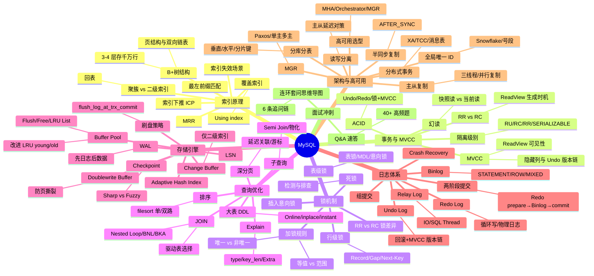

# mysql — MySQL 面试知识体系

## 一、模块简介

本模块按 MySQL 知识层次组织 **8 份**主题/汇总文档，覆盖从索引底层结构、事务与 MVCC、锁机制、查询优化、存储引擎、日志体系到架构与高可用的完整面试知识图谱，并把每个专题都落到 Java 后端工程实战。

- **定位**：面向 Java 后端高级/资深面试的 MySQL 知识体系，深度对标 `ops/docker`、`ops/network`、`ops/linux`
- **适用对象**：Java 后端面试（社招高级/资深，5 年+），兼顾架构与系统设计方向
- **组织方式**：7 个主题目录 + 1 个 Q&A 文件，每份主题文档遵循「概念定义 → 原理与流程 → 高频追问 → 实战关联 → 系统设计案例」五段式结构
- **导航约定**：每份文档顶部含 `> 返回 [MySQL 知识图谱](../README.md)` 链接，本文档为统一入口
- **版本基线**：MySQL 8.0（覆盖降序索引、隐藏列、Redo Log Archiving、MGR 等特性，5.7 仅作差异对比）

---

## 二、知识图谱



---

## 三、导航表

| 分层 | 文档 | 核心考点 |
|------|------|---------|
| 索引原理 | [索引原理与优化](./01-index/index-and-optimization.md) ✅ | B+树/聚簇·二级/回表/覆盖/最左匹配/ICP/MRR/索引失效 |
| 事务与 MVCC | [事务与 MVCC](./02-transaction/transaction-and-mvcc.md) ✅ | ACID/隔离级别/MVCC/ReadView/Undo Chain/RR vs RC 幻读 |
| 锁机制 | [锁机制](./03-lock/lock-mechanism.md) ✅ | 行锁/Gap/Next-Key/意向锁/插入意向锁/死锁/RR·RC 锁差异 |
| 查询优化 | [查询优化与执行计划](./04-query/query-optimization.md) ✅ | Explain 全字段/JOIN Nested Loop/子查询/深分页/大表 DDL |
| 存储引擎 | [存储引擎底层](./05-storage/innodb-engine.md) ✅ | Buffer Pool/Change Buffer/AHI/LSN/Checkpoint/WAL/刷盘 |
| 日志体系 | [日志体系](./06-log/log-system.md) ⬜ | Undo/Redo/Binlog/Relay Log/两阶段提交/Crash Recovery |
| 架构与高可用 | [架构与高可用](./07-architecture/ha-and-sharding.md) ⬜ | 主从复制/读写分离/分库分表/MHA/MGR/半同步/高可用选型 |
| 面试冲刺 | [Q&A 速答](./08-interview-qa.md) ⬜ | 40+ 题速答 + 连环套问思维导图 |

> 共 **9 份**文档：入口 README（本文档）+ 上表 8 份主题/Q&A 文档。

---

## 四、推荐学习路径

### 路线一：系统学习（适合有 1-2 周准备期）

按 MySQL 知识层次自底向上，先建立存储与索引底层，再向上到事务、锁、优化、架构：

```
01 索引 → 02 事务 → 03 锁 → 04 查询优化 → 05 存储引擎 → 06 日志 → 07 架构 → 08 Q&A
```

**特点**：先见森林后见树木，符合「索引→事务→锁→优化→存储→日志→架构」的认知递进，适合建立完整体系。

### 路线二：面试冲刺（高频优先，适合 3-5 天突击）

按面试热度排序，先啃必考点，再补体系：

1. 01 索引 → 03 锁 → 02 事务
2. 04 查询优化 → 06 日志
3. 05 存储引擎 → 07 架构
4. 08 Q&A（40+ 题，含连环套问思维导图）

**特点**：投入产出比最高，覆盖 80% 高频考点，索引/锁/事务是起手三连问。

> 两套路线殊途同归，最终都应回到 [Q&A 速答](./08-interview-qa.md) 做闭环检验。

---

## 五、与 java-core / framework 模块的关联

本模块虽为中间件文档，但与仓库内 Java 模块存在直接关联，便于在面试中结合源码与实战作答：

| MySQL 知识点 | 关联 Java 模块 | 关联要点 |
|-------------|---------------|---------|
| 01 索引 / `@Transactional` | `framework/spring-framework` | `@Transactional` 与索引选择关系 |
| 01 索引 / 唯一索引 | `framework/valid` | 唯一索引与参数校验互补 |
| 02 事务 / `@Transactional` | `framework/spring-framework` | `@Transactional` 传播行为、失效场景 |
| 02 事务 / 业务约束 | `framework/valid` | 业务约束与 DB 约束互补 |
| 03 锁 / 隔离级别 | `framework/spring-framework` | `@Transactional(isolation=...)` 与隔离级别 |
| 03 锁 / 死锁异常 | `java-core/jvm` | JDBC 连接池、死锁异常处理 |
| 04 查询 / 只读事务 | `framework/spring-framework` | `@Transactional(readOnly=true)` 查询优化 |
| 04 查询 / 流式处理 | `java-core/lambda` | 流式处理 vs SQL 排序/分页的权衡 |
| 05 存储引擎 / 堆外内存 | `java-core/jvm` | 堆外内存与 Buffer Pool 内存预算 |
| 05 存储引擎 / GC 与刷盘 | `java-core/jvm` | JVM GC 与 MySQL 刷盘的协调 |
| 06 日志 / 事务边界 | `framework/spring-framework` | 事务抽象与两阶段提交的边界 |
| 06 日志 / Canal | `framework/jackson` | Canal 解析 binlog 与序列化 |
| 07 架构 / 多数据源 | `framework/spring-framework` | 多数据源、`@DS`、`AbstractRoutingDataSource` |
| 07 架构 / 分布式 ID | `java-core/lambda` | 分布式 ID 算法实现 |
| 07 架构 / 分布式事务 | `framework/spring-framework` | 分布式事务集成 |

**延伸阅读**：

- `java-core/jvm` —— 对照理解 JVM 堆外内存、GC 与 MySQL 刷盘的协调
- `framework/spring-framework` —— `@Transactional` 传播行为、多数据源、分布式事务集成
- `framework/valid` —— 参数校验与 DB 唯一约束的互补关系

> 建议在阅读事务、锁与架构文档时，对照 `java-core`/`framework` 模块的源码实例，加深「面试八股 → 工程实战」的双向映射。

---

## 六、与 ops 模块的交叉引用

本模块部分原理推导链与 `ops` 运维文档存在对照关系，MySQL 章只讲"数据库场景下的实现与选择"，原理推导回对应模块：

| MySQL 文档 | 跳转目标 | 对照要点 |
|-----------|---------|---------|
| 05 存储引擎 | `ops/linux/04-io/io-model-and-epoll.md` | IO 线程与 epoll、IO 模型对照 |
| 05 存储引擎 | `ops/linux/03-memory/memory-management.md` | Page Cache 与 Buffer Pool 关系 |
| 06 日志 | `ops/linux/05-fs/filesystem-and-vfs.md` | fsync 与文件系统崩溃一致性 |
| 07 架构 | `middleware/README.md`（redis 待建） | 分布式锁、幂等的 Redis 方案对照 |
| 07 架构 | `middleware/README.md`（kafka 待建） | 本地消息表与 Kafka 互补 |

> 处理原则：MySQL 章只讲"数据库场景下的实现与选择"，原理推导链回对应模块，不重复展开。
