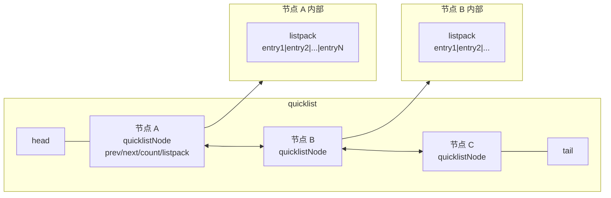
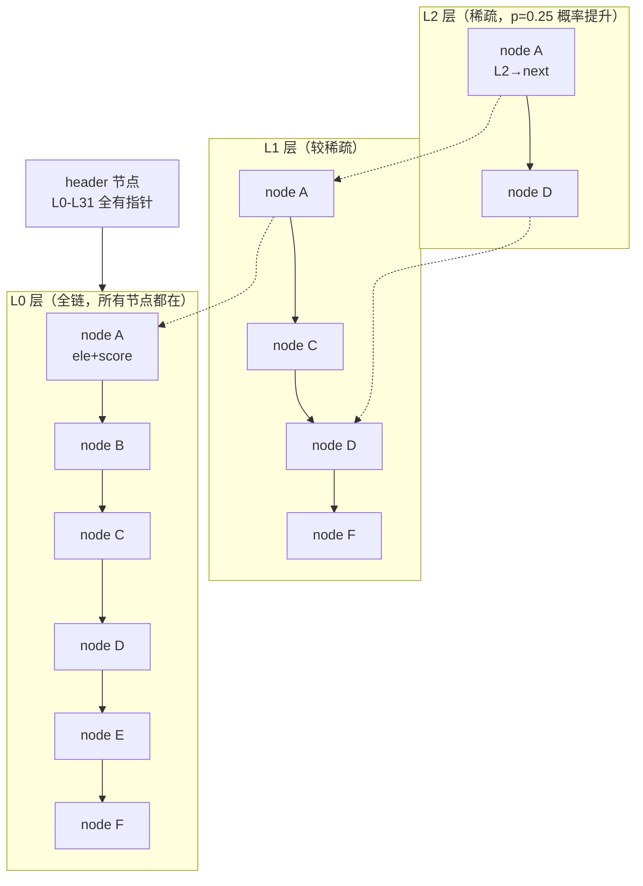

# 数据结构与对象编码

> **一句话定位**：Redis 数据结构是面试起手题，"讲讲 Redis 有哪些数据类型及底层实现"几乎每场必问，能讲到 SDS 空间预分配、dict 渐进式 rehash、跳表与 listpack 的编码转换才算合格。
> **面试热度**：⭐⭐⭐⭐⭐
> **返回**：[Redis 知识图谱](../README.md)

---

## 一、概念定义

### 1.1 数据类型与底层结构：接口与实现解耦

Redis 对外暴露的**数据类型（type）**只有 5 种基础类型 + 3 种扩展类型（Stream/Bitmap/HyperLogLog，后两者是对 String/Set 的位运算封装），但对内采用的**底层编码（encoding）**却有十几种。这种"接口与实现解耦"的设计哲学是 Redis 内存效率的根本来源：同一类型在不同数据规模下选用不同底层结构，**小数据用紧凑结构省内存、大数据用高效结构保性能**。

| 数据类型（type） | 可能的底层编码（encoding，Redis 7.x） | 选型依据 |
|------------------|----------------------------------------|----------|
| String | int / embstr / raw | 整数用 int、短字符串用 embstr、长字符串用 raw |
| List | listpack / quicklist | 元素少且短用 listpack 连续内存，多或长用 quicklist（节点内 listpack） |
| Hash | listpack / hashtable | 小 hash 用 listpack，大 hash 用 hashtable |
| Set | intset / hashtable / listpack | 纯整数小集合用 intset，大集合用 hashtable，混合小集合也可用 listpack |
| ZSet | listpack / skiplist + dict | 小 zset 用 listpack，大 zset 用 skiplist + dict 双结构 |
| Stream | listpack | 唯一编码，消息流的 Radix Tree 节点内部用 listpack |

**为什么不让 type 直接对应一种结构？** 因为 Redis 是**内存数据库**，内存是第一稀缺资源。如果 List 永远用双向链表，那么一个只有 3 个元素的 List 也要为每个元素分配一个 listNode（前后指针 + 值指针），仅指针开销就 48 字节，比数据本身还大。Redis 的做法是：**按数据规模动态切换编码**，小数据用紧凑结构（listpack 一段连续内存无指针开销），数据增长到阈值后再切换为高效结构（hashtable O(1) 查找、skiplist O(log n) 范围查询），切换过程对上层透明。

**编码转换的触发时机**：①元素数量超过 `*-max-listpack-entries`（Hash/ZSet）/ `set-max-intset-entries`（Set）阈值；②任一元素长度超过 `*-max-listpack-value`（Hash/ZSet）阈值；③发生写入操作时检查（只读操作不触发转换）。阈值可通过 `CONFIG SET` 动态调整，但生产中一般不调——默认值是 Redis 团队基于大量场景调优的。**注意 List 是例外**：它只有一个 `list-max-listpack-size` 参数，正数限元素个数、负数限单节点字节数（默认 -2 即 8KB），没有独立的 entries/value 两个参数（这两个是 Hash/ZSet 的参数）。

### 1.2 为什么 Redis 要做编码转换

以 Hash 的 listpack → hashtable 转换为例。当 Hash 字段数 ≤ 128 且每个 value 长度 ≤ 64 字节时，用 listpack 存储——一段连续内存，元素紧密排列，无指针开销，CPU 缓存友好（一次 cache line 读入多个 entry）。但当任一阈值被突破，Redis 把整个 listpack 转为 hashtable：

| 维度 | listpack（小 hash） | hashtable（大 hash） |
|------|---------------------|----------------------|
| 内存布局 | 连续内存，无指针开销 | 每个键值对独立 dictEntry，含 3 个指针 24 字节开销 |
| 查找复杂度 | O(n) 顺序遍历 | O(1) 哈希定位 |
| CPU 缓存 | 极佳（一段 cache line 装多个 entry） | 一般（dictEntry 散布在堆上） |
| 写入代价 | 追加到尾部，可能 memmove | 申请 dictEntry + 挂桶 |
| 适合规模 | < 128 字段且 value < 64B | 大规模或长 value |

**转换的本质是"时间-空间"权衡**：小数据下 n 很小，O(n) 顺序遍历实际比 O(1) 哈希定位还快（因为常数因子小、缓存命中率高），且内存省一半以上；大数据下 O(n) 不可接受，必须上 O(1) 哈希或 O(log n) 跳表。Redis 用阈值把"小"和"大"的边界量化，默认 128/64 是经验值——再大 listpack 的 O(n) 查找就开始拖累延迟。

**编码转换的不可逆性**：listpack → hashtable 是单向的，即使后续删除元素到只剩几个字段，hashtable 也不会退回 listpack（避免频繁转换抖动）。这是 Redis 7.x 的行为，6.x 及之前同理。面试时被追问"删减后会不会退回紧凑编码"，答案是**不会**，除非手动 `DEBUG OBJECT` 或重建 key。

### 1.3 redisObject 结构详解

Redis 的每个值在内存中都是一个 `redisObject`（`src/server.h` 的 `struct redisObject`），它是连接 type 与 encoding 的桥梁。结构如下：

```c
struct redisObject {
    unsigned type:4;        // 数据类型，4 位（OBJ_STRING/LIST/HASH/SET/ZSET）
    unsigned encoding:4;     // 底层编码，4 位（OBJ_ENCODING_RAW/INT/QUICKLIST/LISTPACK/...）
    unsigned lru:LRU_BITS;   // LRU 或 LFU 信息，24 位
    int refcount;            // 引用计数，4 字节
    void *ptr;               // 指向真实数据的指针，8 字节
};
```

| 字段 | 位数/字节 | 作用 |
|------|----------|------|
| type | 4 位 | 标识数据类型，`TYPE` 命令返回此值 |
| encoding | 4 位 | 标识底层编码，`OBJECT ENCODING` 命令返回此值 |
| lru | 24 位 | LRU 模式记最后访问时间（分钟级时间戳）、LFU 模式低 16 位记频率高 8 位记上次衰减时间 |
| refcount | 4 字节 | 引用计数，为 0 时回收；共享对象 refcount 可大于 1 |
| ptr | 8 字节 | 指向真实数据结构（SDS/listpack/dict/zskiplist 等） |

**内存占用**：redisObject 头部 = 4 位 + 4 位 + 24 位 + 4 字节 + 8 字节，对齐后**头部 16 字节**，加上 ptr 指向的真实数据结构。一个 embstr 字符串 = redisObject 16 字节 + SDS header 3 字节 + 内容 + 结尾 `\0`，所以短字符串总开销约 20 字节起。理解这点有助于估算 Redis 内存——每个 key 都至少有一个 dictEntry（24 字节）+ 一个 redisObject（16 字节）+ key 的 SDS，空 key 也要占几十字节。

### 1.4 共享对象池

Redis 启动时预创建 **0-9999 共 10000 个整数 redisObject**，放入 `server.shared.integers` 数组。当 String 的值是 0-9999 的整数时，redisObject 的 ptr 直接指向共享对象，不新建 redisObject，refcount 共享累加。

| 启用条件 | 说明 |
|---------|------|
| `maxmemory-policy` 不含 LFU | LRU/淘汰策略为 allkeys-lru/volatile-lru/noeviction 等时启用；LFU 策略下关闭，因为 LFU 需要每个对象独立统计访问频率，共享会互相污染 |
| 值范围 [0, 9999] | 超出范围不共享，新建 redisObject |
| 仅整数共享 | 字符串不进共享池 |

**为什么字符串不共享？** 共享的前提是判等——两个对象是否相等需要 O(1) 判等才能安全复用。整数判等 O(1)（直接比较值），字符串判等需要 O(n) 逐字节比较（先比 len 再比内容），在共享池里判等的开销可能超过新建对象的开销。所以 Redis 只对整数做共享，**这是"共享收益 vs 判等成本"的权衡**。

**共享对象的淘汰影响**：共享对象 refcount 永远 > 0（至少被 shared 数组持有），所以**永远不会被淘汰**。这是共享对象的隐含约束——不能让淘汰器误删共享整数。LFU 模式下关闭共享正是因为共享对象的访问频率会被所有引用者共同累加，无法反映单个 key 的真实热度，淘汰器会失准。

> **源码路径**：`src/object.c` 的 `createObject`（新建对象）、`shared.integers` 初始化在 `src/server.c` 的 `initServer` → `createSharedObjects`；判等函数 `equalStringObjects` 在 `src/object.c`。

---

## 二、原理与流程

### 2.1 SDS 详解

SDS（Simple Dynamic String）是 Redis 自己实现的动态字符串，**几乎所有 key 和 String 值都用 SDS 存储**（少数整数直接 int 编码）。SDS 的核心设计目标：①O(1) 获取长度；②二进制安全；③高效扩容；④兼容 C 字符串函数。

**SDS 结构**（`src/sds.h`）：

```c
struct sdshdr {
    uint32_t len;     // 已使用长度
    uint32_t alloc;   // 分配的总长度（不含头部和结尾 \0）
    unsigned char flags;  // 低 3 位标识 sdshdr5/8/16/32/64 哪种子类型
    char buf[];        // 实际数据，结尾仍带 \0 以兼容 C 函数
};
```

**五种子类型按长度选型**：`sdshdr5`（len < 32，头部 1 字节）、`sdshdr8`（len < 256，头部 3 字节）、`sdshdr16`（len < 64KB，头部 5 字节）、`sdshdr32`（len < 4GB，头部 9 字节）、`sdshdr64`（len < 2^64，头部 17 字节）。**按字符串实际长度选最小头部**——短字符串用 sdshdr5 头部仅 1 字节，长字符串才用 sdshdr64 头部 17 字节，这是 Redis 对小数据极致压缩的体现。

**空间预分配**（`src/sds.c` 的 `sdsMakeRoomFor`）：SDS 扩容时不是按需分配，而是预分配额外空间以减少后续 realloc 次数：

| 当前长度 | 预分配策略 | 扩容后总长 |
|---------|-----------|-----------|
| < 1MB | 翻倍 | `len × 2` |
| ≥ 1MB | 固定加 1MB | `len + 1MB` |

例如当前 len=100B，追加 50B 后 SDS 不只分配 150B，而是分配 200B（100 × 2），下次再追加 100B 内无需 realloc。预分配的上界是 `min(len*2, 1MB)`——大于 1MB 后每次只多加 1MB，避免预分配过多浪费内存。

**惰性释放**：SDS 缩短时（如 `sdstrim`）不立即释放多余内存，而是把 alloc 保持，仅更新 len。这避免后续追加再次触发 realloc。空间预分配 + 惰性释放合起来让 SDS 在频繁追加场景下 realloc 次数降到 O(log n)。

**二进制安全**：SDS 用 `len` 字段记录长度而非依赖 `\0` 终止符，所以**数据中可以包含 `\0`**——如图片二进制、序列化字节流。C 字符串遇到 `\0` 就截断，无法存二进制。这是 SDS 与 C 字符串的本质差异，也是 Redis 能存任意二进制数据的基础。

**SDS vs C 字符串对比**：

| 维度 | SDS | C 字符串 |
|------|-----|---------|
| 获取长度 | O(1)（读 len 字段） | O(n)（遍历到 `\0`） |
| 二进制安全 | 是（len 决定边界） | 否（`\0` 截断） |
| 扩容 | 预分配，realloc 次数少 | 每次 realloc |
| 缩容 | 惰性释放，保留 alloc | 立即释放 |
| 兼容 C 函数 | 是（结尾仍带 `\0`） | - |
| 内存开销 | 多 3-17 字节头部 | 无头部 |

> **源码路径**：`src/sds.c` 的 `sdsnew`（创建）、`sdsMakeRoomFor`（扩容预分配）、`sdscatlen`（追加）、`sdstrim`（惰性释放）、`sdslen`（O(1) 取长度）。

### 2.2 dict 字典与渐进式 rehash

dict 是 Redis 内部最核心的数据结构——**Hash/Set 的 hashtable 编码、ZSet 的 dict 部分、RedisDB 的键空间**都用 dict 实现。dict 的核心设计是**双哈希表 + 渐进式 rehash**，避免一次性 rehash 阻塞单线程主循环。

**dict 结构**（`src/dict.h`）：

```c
struct dict {
    dictEntry **ht_table[2];  // 两个哈希表 ht[0] 和 ht[1]
    unsigned long ht_used[2]; // 两个表已用元素数
    long rehashidx;           // rehash 进度，-1 表示未进行 rehash
    ...
};
struct dictEntry {
    void *key;
    union { void *val; uint64_t u64; int64_t s64; double d; } v;
    struct dictEntry *next;   // 拉链法解决冲突
};
```

**双哈希表的设计**：平时只用 ht[0]，ht[1] 为 NULL。当负载因子 `used/size` 超过阈值触发扩容时，分配 ht[1]（大小为 ht[0] 的 2 倍），然后把 ht[0] 的元素**分批迁移**到 ht[1]，迁移期间两个表并存。

**为什么不能一次性 rehash？** Redis 是单线程命令执行模型，一次性 rehash 10 万元素大约阻塞 10ms（每元素 hash + 挂桶 + 指针操作约 100ns），10ms 在 Redis 里是灾难性阻塞——期间所有命令排队。所以 Redis 把 rehash 摊到每次增删改查里，每次迁移 1 个桶（一个桶可能多个元素但平均 1 个），让 rehash 成本均摊到正常请求中，对延迟几乎无影响。

**负载因子与扩缩容阈值**：

| 触发条件 | 阈值 | 动作 |
|---------|------|------|
| 扩容（正常） | `used / size > 1` | 触发 rehash 扩容到 2 倍 |
| 扩容（强制） | `used / size > dict_force_resize_ratio = 5` | 即使 bgrewriteaof/bgsave 进行中也强制扩容（避免哈希攻击性能崩塌） |
| 缩容 | `used / size < 0.1` | 触发 rehash 缩容到能容纳 used 的最小 2 的幂 |

**为什么 dict 改用 SipHash？** 早期 Redis 用 MurmurHash，但 MurmurHash 仍有碰撞攻击可能。SipHash 是**密码学安全的非加密哈希**，能有效抵御 hash 碰撞 DoS 攻击——攻击者无法构造大量碰撞 key 让所有元素挤到一个桶里退化成 O(n)。Redis 4.0 起默认 SipHash，每个 dict 启动时随机生成密钥，进一步增加攻击难度。

**渐进式 rehash 的流程**（`src/dict.c` 的 `dictRehash`）：

```mermaid
flowchart TD
    A["触发条件: used/size > 1<br/>分配 ht[1] = 2 × ht[0].size"] --> B["rehashidx = 0<br/>开始迁移"]
    B --> C["每次增删改查<br/>dictRehash(d, 1)<br/>迁移 ht[0] 的第 rehashidx 个桶"]
    C --> D{rehashidx < ht[0].size?}
    D -- 是 --> E["迁移该桶所有元素到 ht[1]<br/>rehashidx++"]
    E --> F["该桶若为空则跳过<br/>最多跳过 100 个空桶后强制停"]
    F --> C
    D -- 否 --> G["rehash 完成<br/>ht[0] = ht[1], ht[1] = NULL<br/>rehashidx = -1"]
```

**rehash 期间的读写规则**：

| 操作 | 走哪个表 |
|------|---------|
| 读（GET/查） | 先查 ht[0]，再查 ht[1] |
| 写（SET/增） | 直接写 ht[1]（保证 ht[0] 只减不增） |
| 删（DEL） | 两表都查都删 |
| 改（改值） | 两表都查，找到后改 |

**为什么写只写 ht[1]？** 让 ht[0] 的元素单调递减，rehash 进度不会倒退。如果写还往 ht[0] 写，那 rehash 迁移完一个桶后又有新元素进来，陷入"永远 rehash 不完"的困境。写只走 ht[1] 保证 ht[0] 只剩"待迁移的旧元素"，rehash 必然收敛。

> **源码路径**：`src/dict.c` 的 `dictRehash`（渐进式 rehash 核心）、`_dictRehashStep`（每次操作迁移 1 桶）、`dictExpand`（分配 ht[1]）、`dictKeyHash`（SipHash 计算）。

### 2.3 listpack：7.0 替代 ziplist

listpack 是 Redis 7.0 引入的紧凑连续内存结构，**替代了 ziplist**。List/Hash/ZSet 的小规模编码从 ziplist 改为 listpack，Set 的小规模混合编码也用 listpack。

**listpack 结构**（`src/listpack.c`）：

```
+--------+--------+--------+---+--------+--------+--------+
| entry1 | entry2 | entry3 |...| entryN | num-elements | end |
+--------+--------+--------+---+--------+--------+--------+
```

每个 entry 的内部：`encoding（变长） + data + backlen（变长，反向遍历用）`。end 是 1 字节 0xFF 标记结束，num-elements 是元素总数。

**为什么弃用 ziplist？** ziplist 的每个 entry 前有一个 `prev_entry_length` 字段记录前一个 entry 的长度，用于反向遍历。当插入或修改导致前一个 entry 长度变化时，`prev_entry_length` 字段本身的大小可能从 1 字节变 5 字节，进而引发后一个 entry 的 `prev_entry_length` 也变化，**连锁更新**最坏 O(n²)。具体场景：连续多个 entry 长度都刚好小于 254（用 1 字节 prev_entry_length），插入一个长 entry 后，后续所有 entry 的 prev_entry_length 都要从 1 字节变 5 字节，逐个 memmove。

**listpack 如何规避连锁更新？** listpack 用 `backlen` 替代 `prev_entry_length`——backlen 记录的是**当前 entry 自身的长度**（不含 backlen 自己），而非前一个 entry 的长度。反向遍历时，从结尾往前读 backlen 得到当前 entry 总长，跳过它就到前一个 entry。这样修改某个 entry 的长度只影响它自己的 backlen，**不会波及相邻 entry**，彻底消除连锁更新。

**ziplist vs listpack 对比**：

| 维度 | ziplist（< 7.0） | listpack（≥ 7.0） |
|------|-----------------|------------------|
| 反向遍历字段 | `prev_entry_length`（记录前一 entry 长度） | `backlen`（记录自身长度） |
| 连锁更新 | 有，最坏 O(n²) | 无，单 entry 修改只影响自身 |
| 内存开销 | 每 entry 多 1-5 字节 prev_entry_length | 每 entry 多 1-5 字节 backlen |
| 适用场景 | List/Hash/ZSet 小规模编码 | 同上，但性能更稳定 |

**listpack 的查找复杂度**：O(n) 顺序遍历，但因为元素少（默认 ≤ 128）且内存连续 CPU 缓存友好，实际性能优于 hashtable。元素一多就触发编码转换到 hashtable/quicklist，不会让 listpack 的 O(n) 拖累延迟。

> **源码路径**：`src/listpack.c` 的 `lpNew`（创建）、`lpAppend`（追加）、`lpFind`（查找）、`lpInsert`（插入）；ziplist 已在 7.0 从编码选项中移除，仅保留兼容代码。

### 2.4 quicklist：双向链表 + 节点内 listpack

quicklist 是 List 的"大规模"编码——当 List 规模超过 `list-max-listpack-size` 阈值时（正数=元素个数上限，负数=单节点字节数上限，默认 -2 即 8KB），从 listpack 转为 quicklist。quicklist 是**双向链表，每个节点内部是一个 listpack**，结合了链表的灵活性与 listpack 的紧凑性。

**quicklist 结构**（`src/t_list.c` / `src/quicklist.c`）：



每个 quicklistNode 含：`prev/next` 指针（双向链表）、`count`（节点内元素数）、`container`（是 listpack 还是单纯 ziplist 兼容）、`*entry`（指向 listpack 头）、`compressed`（是否 LZF 压缩）。

**`fill` 控制单节点大小**（`list-max-listpack-size`）：

| fill 值 | 单节点 listpack 大小上限 | 说明 |
|---------|------------------------|------|
| -1 | 4 KB | 内存敏感 |
| -2 | 8 KB | **默认值**，平衡内存与性能 |
| -3 | 16 KB | 偏性能 |
| -4 | 32 KB | 偏性能，谨慎 |
| -5 | 64 KB | 极端，单元素很大的场景 |

> 正数 `fill` 表示按元素个数限制（如 `fill=128` 每节点最多 128 个元素），负数按字节数限制。生产默认 -2（8KB）是 Redis 团队基于"单节点 listpack 遍历成本 vs 链表跳转成本"的调优。

**`compress` 控制两端压缩**（`list-compress-depth`）：

| compress 值 | 行为 |
|-------------|------|
| 0 | 不压缩（默认） |
| 1 | 两端各保留 1 个未压缩节点，其余 LZF 压缩 |
| 2 | 两端各保留 2 个未压缩节点 |
| 3 | 两端各保留 3 个未压缩节点 |

**为什么只压缩中间、两端不压缩？** List 的访问模式是两端高频（LPUSH/RPOP/LPUSH/RPOP 都在头尾操作），中间节点大多只被 LRANGE 范围查询偶尔访问。压缩中间节点能省 50%+ 内存，两端保留未压缩保证高频操作零解压延迟。若访问中间节点才按需解压，代价是单次 LRANGE 延迟略增。

**quicklist 的优势**：①相比纯双向链表，每个节点装多个元素，指针开销摊薄到 N 个元素（N 个元素只有 2 个指针而非 2N 个）；②相比纯 listpack，不受单段连续内存大小限制，可无限扩展；③中间压缩省内存，两端不压缩保性能。

> **源码路径**：`src/quicklist.c` 的 `quicklistPush`（头尾插入）、`quicklistDelEntry`（删除）、`quicklistIndex`（随机访问，O(n)）；`src/t_list.c` 的 `pushCommand` 处理编码转换。

### 2.5 intset：整数集合

intset 是 Set 的"纯整数小集合"编码——当 Set 所有元素都是整数且数量 ≤ `set-max-intset-entries=512` 时用 intset。intset 是**有序整数数组**，用二分查找 O(log n) 定位。

**intset 结构**（`src/intset.h`）：

```c
struct intset {
    int32_t encoding;   // INTSET_ENC_INT16 / INT32 / INT64
    int32_t length;     // 元素个数
    int8_t  contents[]; // 按 encoding 决定每个元素的字节数，有序存储
};
```

**自动升级**（`intsetUpgradeAndAdd`）：intset 初始为 INT16（每个元素 2 字节）。插入一个超出 INT16 范围（如 70000）的整数时，触发**全量升级**——所有元素从 INT16 重写为 INT32，整个数组 memmove 扩容，然后插入新元素。升级是**一次性、不可逆**的。

**为什么只升不降？** 假设 intset 已是 INT64，删除大数后所有元素又 fit INT16，理论上可以降级。但降级需要**遍历所有元素检查是否都 fit 低编码**，O(n) 开销且场景少（删大数后通常还会再加回来）。Redis 选择"只升不降"——升级是插入触发的偶发事件，降级是删除触发的频繁事件，让删除保持 O(log n) 不引入 O(n) 检查。

**intset 的查找**：二分查找 O(log n)，因为数组有序。插入也是二分找位置 + memmove 后移，O(n) 因 memmove。但因为元素 ≤ 512 且每个元素 2-8 字节，整个 intset 最多 4KB，一次 cache line 装多个元素，实际性能极佳。

> **源码路径**：`src/intset.c` 的 `intsetAdd`（插入，可能触发升级）、`intsetUpgradeAndAdd`（升级）、`intsetSearch`（二分查找）。

### 2.6 skiplist 跳表

skiplist 是 ZSet 的"大规模"编码的核心结构——ZSet 的有序性靠跳表实现 O(log n) 范围查询。跳表是**多层有序链表**，通过概率性提升部分节点到高层，让查询能跨级跳过大量节点，达到平衡树的效果但实现远比平衡树简单。

**跳表多层结构**（`src/t_zset.c`）：



**跳表查询流程**：从 header 最高层开始，沿当前层 next 指针比较 score（相同 score 比较 ele），若 next 节点 score 小于目标则跳过去，否则下降一层。最坏复杂度 O(log n)。

**跳表插入流程**（`zslInsert`）：①随机生成层数 `zslRandomLevel`（每层以 p=0.25 概率继续提升，最高 32 层）；②从最高层往下逐层查找插入位置，记录每层的前驱节点（update 数组）；③创建新节点，按层数分配 `level[]` 数组；④更新 update 数组中各层前驱的 forward 指针指向新节点，新节点各层 forward 指向原前驱的 next；⑤更新各层 span（跨度，用于排名查询 `ZREVRANK`，span = 该层从当前节点到 next 节点之间跨过的 L0 节点数）；⑥若新节点层数 > 当前最大层数，更新跳表 header 的对应层。插入复杂度 O(log n)。

**span 字段的作用**：每层 forward 指针附带一个 `span` 字段，记录"从当前节点沿该层前进指针到下一节点跨过了多少个 L0 节点"。`ZREVRANK` 查排名时从 header 沿路累加 span 即可得到排名，无需遍历 L0，O(log n)。这是跳表实现排名查询的精妙之处——span 把"位置信息"编码进多级指针，查询时沿高层跳大步、累加 span，类似 B+ 树的非叶子节点存"子树规模"。

**关键参数**：

| 参数 | 值 | 说明 |
|------|------|------|
| `ZSKIPLIST_MAXLEVEL` | 32 | 最大层数，足以支撑 2^64 个元素 |
| `p` | 0.25 | 节点提升到上一层的概率 |
| 期望层高 | 1.33 | `1/(1-p) = 1/(1-0.25) = 1.33`，即平均每个节点占 1.33 层 |
| 查询复杂度 | O(log n) | 与红黑树相当 |

**为什么 Redis 用跳表不用红黑树？** 三条理由：

1. **范围查询天然高效**——跳表 L0 层就是完整有序链表，`ZRANGE/ZRANGEBYSCORE` 定位起点后沿 L0 链表扫 N 个节点即可，O(log n + N)。红黑树范围查询虽也 O(log n + N) 但要中序遍历回溯父节点，实现复杂且常数因子大。
2. **实现简单**——跳表核心代码（`zslCreate`/`zslInsert`/`zslDelete`/`zslGetRank`）约 200 行，红黑树删除/旋转/染色逻辑上千行。Redis 代码可维护性优先。
3. **内存灵活**——跳表每个节点按层数分配指针（层数随机），矮节点 1 个指针、高节点 32 个指针，按需分配。红黑树每个节点固定 2 个子指针 + 1 个父指针 + 颜色位，无法按需伸缩。

**跳表 vs B+树**：B+树是磁盘数据库（MySQL/PG）的索引结构，核心优势是**节点匹配磁盘页（16KB）**，一次 IO 读一页。Redis 是内存数据库，无磁盘 IO，跳表无需压缩到页内，每节点独立存储反而更灵活。**内存数据库用跳表合适，磁盘数据库用 B+树合适**，这是场景决定的。

> **源码路径**：`src/t_zset.c` 的 `zslCreate`（创建跳表）、`zslInsert`（插入，含随机层数 `zslRandomLevel`）、`zslDelete`（删除）、`zslGetRank`（排名查询，沿路累加 span）、`zslFirstInRange`/`zslLastInRange`（范围查询起点定位）。

### 2.7 intset 查找与升级边界

intset 虽然只支持整数 Set，但其设计体现了 Redis 在"内存紧凑"与"查找性能"间的权衡：

| 场景 | intset 表现 | 替代方案 |
|------|------------|---------|
| 500 个小整数（< 32768） | INT16 编码，1KB，二分查找 O(log 500) ≈ 9 次 | hashtable 同等数据约 12KB |
| 500 个大整数（> 2^31） | INT64 编码，4KB，二分查找 9 次 | hashtable 约 12KB |
| 513 个整数（超阈值） | 触发转 hashtable，O(1) 查找 | 不可逆 |

**为什么 set 的 intset 阈值是 512 而非 128？** intset 是纯整数数组，二分查找 O(log n) 在 n=512 时约 9 次比较，且数组连续内存 cache line 友好，实际性能接近 hashtable 的 O(1)。而 listpack/ziplist 是 O(n) 遍历，128 就到临界点。intset 阈值更大是因为它本质是有序数组二分查找，复杂度更优，可以容忍更多元素。

### 2.8 各数据类型的编码转换阈值表

Redis 7.x 的编码转换阈值（均可通过 `CONFIG SET` 动态调整）：

| 数据类型 | 小规模编码 | 大规模编码 | 数量阈值 | 单元素长度阈值 | 配置项 |
|---------|-----------|-----------|---------|---------------|--------|
| List | listpack | quicklist | `list-max-listpack-size` 正数=个数上限 | 无（size 负数=单节点字节上限） | `list-max-listpack-size`（默认 -2=8KB） |
| Hash | listpack | hashtable | 128 | 64 字节 | `hash-max-listpack-entries` / `hash-max-listpack-value` |
| ZSet | listpack | skiplist + dict | 128 | 64 字节 | `zset-max-listpack-entries` / `zset-max-listpack-value` |
| Set | intset（纯整数）/ listpack（混合小集合） | hashtable | 512（intset） | - | `set-max-intset-entries` / `set-max-listpack-entries` / `set-max-listpack-value` |

> **List 参数与 Hash/ZSet 不同**：Hash/ZSet 有 `*-max-listpack-entries`（元素个数）和 `*-max-listpack-value`（单元素字节数）两个独立参数；List 只有一个 `list-max-listpack-size`——正数表示 listpack 元素个数上限，负数表示单节点字节数上限（-1=4KB / -2=8KB 默认 / -3=16KB / -4=32KB / -5=64KB）。因此 List 没有"单元素长度阈值"这一列，超限由单节点总字节数间接控制。参考 `CONFIG GET list-max-listpack-size`。

**阈值的意义**：这些值是 Redis 团队基于"O(n) 顺序遍历 vs O(1)/O(log n) 哈希/跳表查找"的临界点调优的。Hash/ZSet 的 128/64 是经验值——再大 listpack 的 O(n) 查找就开始拖累 P99 延迟，必须转高效结构。List 的默认 -2（8KB）同理，是单节点 listpack 遍历成本与 quicklist 链表跳转成本的平衡点。生产中一般不调，除非业务场景特殊（如全是大 value，可调小 `*-value` 阈值提前转 hashtable）。

### 2.9 ZSet 为什么用 skiplist + dict 双结构

ZSet 是 Redis 最复杂的数据类型——它既要支持按 score 范围查询（`ZRANGEBYSCORE`），又要支持按 ele 精确查 score（`ZSCORE`）、按 ele 改 score（`ZINCRBY`）。单个结构无法兼顾两者，所以 Redis 用**skiplist + dict 双结构**。

**双结构职责**：

| 结构 | 职责 | 复杂度 | 典型命令 |
|------|------|--------|---------|
| dict | ele → score 的精确映射 | O(1) | `ZSCORE`、`ZINCRBY`、`ZRANK`（结合 skiplist） |
| skiplist | 按 score 有序排列 | O(log n) | `ZRANGE`、`ZRANGEBYSCORE`、`ZREVRANGE` |

**两结构如何共用元素节点？** 这是最精妙的设计——skiplist 的每个节点内含 `ele`（元素名）和 `score`（分数），dict 的 key 是 `ele`、value 是指向 skiplist node 的指针。两者**共用同一份 ele 和 score 数据**，不是两份副本。具体在 `src/t_zset.c` 的 `zset` 结构：

```c
struct zset {
    dict *dict;           // ele → skiplist node 指针
    zskiplist *zsl;       // 跳表
};
struct zskiplistNode {
    sds ele;              // 元素名
    double score;         // 分数
    struct zskiplistNode *backward;  // 后退指针
    struct zskiplistLevel {
        struct zskiplistNode *forward;
        unsigned long span;          // 跨度，用于排名
    } level[];            // 各层前进指针
};
```

dict 的 value 指向 skiplist node，skiplist node 又含 ele 和 score，所以**内存中只有一份 ele 和一份 score**，dict 和 skiplist 共享。`ZSCORE` 走 dict O(1) 直接取 node.score，`ZRANGE` 走 skiplist O(log n) 范围遍历，两者互补不可替代。

**为什么不用单个 skiplist 兼顾？** 若只用 skiplist，`ZSCORE key member` 要在跳表里按 ele 查找——跳表是按 score 有序的，按 ele 查需 O(n) 遍历，完全不可接受。若只用 dict，`ZRANGEBYSCORE` 要把所有元素取出来排序，O(n log n) 且每次都重排。所以必须双结构，dict 补跳表"精确查找弱"、skiplist 补 dict"范围查询弱"。

**双结构写入的一致性**：`ZADD` 时必须同时更新 dict 和 skiplist——先 `zslInsert` 插入跳表，再 `dictAdd` 添加 dict 项；`ZREM` 时先 `zslDelete` 删跳表节点（释放 ele 和 score 内存），再 `dictDelete` 删 dict 项（dict 只存指针，删 dict 不释放 ele/score）。两结构的事务性靠 Redis 单线程保证——命令执行是原子的，不会出现"dict 更新了 skiplist 没更新"的中间态。若 Redis 引入多线程命令执行（目前 7.x 仍是单线程执行），这套一致性保障需重新设计。

**listpack 编码的 ZSet**：当 ZSet 元素 ≤ 128 且 ele 长度 ≤ 64 字节时，用 listpack 而非 skiplist+dict。listpack 按 ele 有序存储（score 跟在 ele 后），`ZSCORE` 用二分查找 O(log n)（listpack 支持二分因为元素按 ele 有序），`ZRANGE` 沿 listpack 顺序扫。元素少时 listpack 内存远省于 skiplist+dict（无指针开销），这是"小数据紧凑、大数据高效"的编码转换哲学。

> **源码路径**：`src/t_zset.c` 的 `zsetAdd`（插入，同时更新 dict 和 skiplist）、`zsetDel`（删除，两结构同步删）、`zslGetRank`（用 span 累加算排名）。

---

## 三、高频追问

### Q1：Redis 有几种数据类型？底层数据结构是什么？

**5 种基础类型 + 3 种扩展类型**。基础：String（int/embstr/raw SDS）、List（listpack/quicklist）、Hash（listpack/hashtable dict）、Set（intset/listpack/hashtable）、ZSet（listpack/skiplist+dict）。扩展：Stream（listpack 唯一编码）、HyperLogLog（基于 String 的稀疏/密集位图）、Bitmap（基于 String 的位运算）、Geo（基于 ZSet 的 skiplist）。Redis 7.x 的关键变化是 **listpack 替代 ziplist**，List/Hash/ZSet 的小规模编码全改 listpack，消除连锁更新。面试时要强调"type 与 encoding 解耦"——type 对外固定，encoding 按规模动态切换，这是 Redis 内存效率的核心。

### Q2：String 底层 SDS 为什么不直接用 C 字符串？

三条核心理由：①**O(1) 取长度**——SDS 有 `len` 字段，`STRLEN` 命令 O(1)；C 字符串要遍历到 `\0` 才知道长度，O(n)，Redis 频繁取 key 长度无法接受。②**二进制安全**——SDS 用 len 决定边界，数据可含 `\0`；C 字符串遇 `\0` 截断，无法存图片/序列化字节流。③**扩容预分配**——SDS 扩容时预分配 `min(len*2, 1MB)`，减少后续 realloc 次数；C 字符串每次追加都 realloc。SDS 还保留结尾 `\0` 以兼容 `strchr`/`strstr` 等 C 标准库函数，是"兼容 + 增强"的设计。

### Q3：为什么 Redis 用跳表不用红黑树？

三条理由：①**范围查询天然高效**——跳表 L0 是完整有序链表，`ZRANGEBYSCORE` 定位起点后沿链表扫 N 个节点，O(log n + N)；红黑树范围查询要中序遍历回溯，实现复杂常数大。②**实现简单**——跳表核心约 200 行（`zslCreate`/`zslInsert`/`zslDelete`），红黑树旋转染色上千行，Redis 代码可维护性优先。③**内存灵活**——跳表每节点按随机层数分配指针，矮节点 1 个指针、高节点 32 个；红黑树每节点固定 2 子指针 + 父指针 + 颜色，无法伸缩。Redis 是内存数据库无磁盘 IO，跳表无需像 B+树那样压缩到页内，每节点独立存储更灵活。

### Q4：渐进式 rehash 过程中，查询怎么走？增删改怎么走？

**查询（GET/查）**：先查 ht[0]，找不到再查 ht[1]，因为 rehash 期间元素散布两表。**增（SET 新 key）**：只写 ht[1]，保证 ht[0] 只减不增，rehash 必然收敛。**删（DEL）**：两表都查都删，避免删漏。**改（改已存在 key 的值）**：两表都查，找到后原地改（不改哈希桶位置）。每次增删改查都会顺带调用 `_dictRehashStep` 迁移 1 个桶，把 rehash 成本摊到正常请求里。rehash 完成后 ht[0] 被 ht[1] 替换，rehashidx 重置为 -1。这是 Redis 单线程模型下避免一次性 rehash 阻塞的关键设计。

### Q5：listpack 为什么替代 ziplist？连锁更新是什么？

ziplist 的每个 entry 前有 `prev_entry_length` 字段记录前一 entry 长度，用于反向遍历。该字段 1 字节（前 entry 长度 < 254）或 5 字节（≥ 254）。当插入或修改导致前 entry 长度跨过 254 阈值，`prev_entry_length` 从 1 字节变 5 字节，使当前 entry 变长 4 字节，进而后一 entry 的 `prev_entry_length` 也跨阈值变长，**连锁传播**最坏 O(n²)——所有 entry 逐个 memmove。listpack 用 `backlen`（记录自身长度）替代 `prev_entry_length`（记录前一 entry 长度），修改某 entry 只影响它自己的 backlen，**彻底消除连锁更新**。这是 7.0 的关键改进，让小规模编码的性能更稳定。

### Q6：ZSet 为什么用 skiplist + dict 两个结构？

因为 ZSet 要同时支持两类操作：①按 ele 精确查 score（`ZSCORE`、`ZINCRBY`）——dict O(1) 最优；②按 score 范围查询（`ZRANGE`、`ZRANGEBYSCORE`）——skiplist O(log n) 最优。单 skiplist 按 ele 查要 O(n) 遍历不可接受；单 dict 范围查询要 O(n log n) 全量排序更不可接受。两结构**共用元素节点**——skiplist node 内含 ele 和 score，dict 的 value 指向 skiplist node，内存中只有一份 ele 和 score。dict 补 skiplist"精确查找弱"、skiplist 补 dict"范围查询弱"，互补不可替代。这是 Redis 为 ZSet 复杂查询需求设计的精妙双结构。

---

## 四、实战关联（Java 后端视角）

### 4.1 Java 场景与数据类型选型

| 业务场景 | Redis 数据类型 | 典型命令 | Java API（Spring Data Redis） |
|---------|---------------|---------|------------------------------|
| 排行榜（积分/热榜） | ZSet | `ZADD`/`ZREVRANGE`/`ZINCRBY`/`ZREVRANK` | `RedisTemplate.opsForZSet()` |
| 统计 UV | HyperLogLog | `PFADD`/`PFCOUNT`/`PFMERGE` | `RedisTemplate.opsForHyperLogLog()` |
| 消息流/延迟队列 | Stream | `XADD`/`XREAD`/`XGROUP`/`XACK` | `StreamOperations` |
| 位置服务（附近的人） | Geo（基于 ZSet） | `GEOADD`/`GEORADIUS`/`GEOPOS` | `RedisTemplate.opsForGeo()` |
| 用户属性（字段多） | Hash | `HSET`/`HGET`/`HGETALL` | `RedisTemplate.opsForHash()` |
| 关注列表/消息队列 | List | `LPUSH`/`RPOP`/`BRPOP` | `RedisTemplate.opsForList()` |
| 标签/去重集合 | Set | `SADD`/`SINTER`/`SUNION` | `RedisTemplate.opsForSet()` |
| 缓存对象/Token | String | `SET`/`GET`/`SETEX` | `RedisTemplate.opsForValue()` |

**排行榜实战（ZSet）**：积分变更用 `ZINCRBY user:rank 100 userA`（O(log n)）；取 Top 10 用 `ZREVRANGE user:rank 0 9 WITHSCORES`（O(log n + 10)）；查某用户排名用 `ZREVRANK user:rank userA`（O(log n) 用 span 累加）。ZSet 底层 skiplist + dict 双结构让这些操作都高效。

**UV 统计（HyperLogLog）**：`PFADD uv:20260811 user1 user2 ...`（12KB 误差 0.81%），`PFCOUNT uv:20260811` 拿近似基数，`PFMERGE uv:202608 uv:20260801 uv:20260802 ...` 合并月 UV。相比 Set 存 user_id（1 亿 user_id 约 1GB），HyperLogLog 12KB 省 5 个数量级内存，代价是 0.81% 误差。

### 4.2 编码转换阈值与业务数据规模匹配

| 业务场景 | 数据规模 | 推荐编码 | 阈值匹配 |
|---------|---------|---------|----------|
| Hash 存商品属性 | < 128 字段且 value < 64B | listpack | 默认阈值，省内存 |
| Hash 存用户画像（字段多或长） | > 128 字段或 value > 64B | hashtable | 触发转换，O(1) 查找 |
| Set 存在线用户 ID（纯整数） | < 512 | intset | 紧凑连续内存 |
| Set 存标签（字符串） | 任意 | listpack/hashtable | 小用 listpack，大用 hashtable |
| ZSet 存排行榜 | > 128 或 score 精度要求高 | skiplist + dict | 双结构兼顾范围与精确 |
| List 存消息队列 | 元素少且短（单节点 < 8KB） | listpack | 连续内存 |
| List 存大消息流 | 元素多或单节点超 8KB | quicklist | 链表 + 节点内 listpack |

**调优实践**：①若业务 Hash 的 value 普遍 > 64B（如存 JSON），可调小 `hash-max-listpack-value` 到 32 提前转 hashtable，避免 listpack 频繁扩容；②若 Set 全是大整数（如 64 位 user_id），调大 `set-max-intset-entries` 到 2048 让更多场景用 intset 省内存；③ZSet 的 `zset-max-listpack-value` 同理。调优后用 `OBJECT ENCODING key` 验证实际编码。

### 4.3 关联 framework/jackson：SDS 二进制安全与序列化

Redis 的 String 值是 SDS，**二进制安全**意味着可以存任意字节流。Spring Data Redis 的 `RedisTemplate` 默认用 Java 序列化（`JdkSerializationRedisSerializer`），但生产推荐用 Jackson 的 `GenericJackson2JsonRedisSerializer`——把对象序列化为 JSON 字节流存入 SDS。

**对接原理**：`GenericJackson2JsonRedisSerializer` 用 Jackson `ObjectMapper` 把对象 `writeValueAsBytes` 得到 `byte[]`，这个 `byte[]` 直接作为 SDS 的 buf 存入 Redis。读取时 `RedisTemplate` 用 `deserialize` 把 `byte[]` 还原为对象。SDS 的二进制安全保证 JSON 字节流中的 `\0` 不截断（虽然 JSON 通常不含 `\0`，但二进制安全的语义让任何序列化格式都能存）。

**关联 `framework/jackson` 模块**：`framework/jackson` 的自定义序列化器（如 `MoneySerializer` 序列化 `Money` 类型）可以直接复用到 `GenericJackson2JsonRedisSerializer` 的 `ObjectMapper` 配置中——同一个 `ObjectMapper` 既用于 HTTP 响应序列化，也用于 Redis 缓存序列化，保证 API 响应与缓存数据格式一致。这是 `framework/jackson` 与 Redis 数据结构的天然对接点。

```java
@Configuration
public class RedisConfig {
    @Bean
    public RedisTemplate<String, Object> redisTemplate(RedisConnectionFactory cf) {
        RedisTemplate<String, Object> template = new RedisTemplate<>();
        template.setConnectionFactory(cf);
        GenericJackson2JsonRedisSerializer ser = new GenericJackson2JsonRedisSerializer();
        template.setValueSerializer(ser);  // SDS 存 JSON 字节流
        template.setHashValueSerializer(ser);
        template.setKeySerializer(new StringRedisSerializer());
        return template;
    }
}
```

### 4.4 关联 java-core/reflect：对象系统与反射元数据

Redis 的 `redisObject` 用 `type:4` + `encoding:4` 标识类型与编码，类似 Java 反射的 `Class` 对象用元数据描述类型。但两者本质不同：①Redis 的 type/encoding 是**运行时动态切换**的（listpack → hashtable 转换改 encoding 字段），Java 的 `Class` 是**编译期固定**的；②Redis 的 `refcount` 是**手动引用计数**（共享对象 refcount > 1），Java 用**JVM GC 可达性分析**自动回收。关联 `java-core/reflect` 和 `java-core/jvm` 模块时，可以对照"手动内存管理 vs 自动 GC"的权衡——Redis 选手动是因为内存是稀缺资源，必须精确控制。

**对照点细化**：

| 维度 | Redis redisObject | Java Class/对象头 |
|------|-------------------|------------------|
| 类型标识 | type 4 位 | Class 对象（指针压缩后 4 字节） |
| 运行时状态 | encoding 动态切换 | Class 固定，无"编码切换"概念 |
| 生命周期管理 | refcount 手动计数 | JVM GC 可达性分析 + 分代回收 |
| 访问追踪 | lru 24 位（LRU/LFU） | 无内置访问追踪（需 JNI 或 agent） |
| 内存开销 | 头部 16 字节 | 对象头 12-16 字节（Mark Word + Klass Pointer） |

### 4.5 缓存对象 vs 缓存字段：Hash vs String 编码选型

Java 后端常面临"缓存整个对象还是按字段缓存"的决策，直接影响 Redis 编码：

| 方案 | Redis 类型 | 编码 | 优点 | 缺点 |
|------|-----------|------|------|------|
| 整对象 JSON | String | embstr/raw | 简单、一次 GET 拿全 | 改一字段要全量重写、大 value 可能超 embstr 阈值 |
| 按字段缓存 | Hash | listpack/hashtable | 改单字段只 `HSET`、省内存（小 hash listpack） | 拿全对象要 `HGETALL`、字段数多时转 hashtable |
| 对象分桶 | Hash + 多 key | 混合 | 超大对象拆分避免单 key 大 Value | 业务侧需维护分桶逻辑 |

**选型建议**：①对象小且读多写少用 String（embstr，一次 GET 高效）；②对象字段多且频繁改单字段用 Hash（`HSET` 局部更新）；③任一字段超 64B 会触发 Hash 从 listpack 转 hashtable，权衡"字段大 value 导致编码转换"——若大量字段都超 64B，hashtable 反而比 listpack 省内存（listpack 的 entry 有 encoding + backlen 开销，大 value 时比例不划算，但 hashtable 有 dictEntry 24 字节开销，需实测）。

---

## 五、系统设计案例

### 案例 1：设计一个支持亿级 UV 的日活统计系统

**场景**：日活用户数（DAU）统计，单日 UV 可达 1 亿，需支持按天/周/月聚合，延迟 < 100ms。

**3 分钟标准答法**：

1. **数据结构选 HyperLogLog**——`PFADD uv:20260811 user_id` 把用户 ID 加入 HLL，每 key 固定 12KB，1 亿 user_id 也只占 12KB（相比 Set 存全量 user_id 约 1GB，省 5 个数量级）。误差 0.81%（1 亿 UV 误差约 80 万），对 UV 这种近似统计场景可接受。
2. **按天分 key**——`uv:20260811`、`uv:20260812`，每 key 独立 HLL。查询单日 UV 用 `PFCOUNT uv:20260811`。
3. **跨天合并用 PFMERGE**——周 UV：`PFMERGE uv:2026w32 uv:20260811 uv:20260812 ... uv:20260817`；月 UV：`PFMERGE uv:202608 uv:20260801 ... uv:20260831`。合并后 `PFCOUNT uv:2026w32` 取周 UV。
4. **内存估算**——1 天 12KB，1 年 365 天 × 12KB = 4.4MB；周/月合并 key 额外 12KB × 52 周 + 12 月 ≈ 768KB；总内存 < 5MB。相比 Set 方案（1 天 1GB，1 年 365GB）省 5 个数量级。

**核心权衡**：精度 vs 内存。HLL 误差 0.81% 在 UV 统计场景完全可接受——业务关心的是"10 万级还是 1 亿级"，不是精确到个位。若强求精确 UV，必须用 Set 存全量 user_id，1 亿 UV 一天 1GB，一年 365GB，不可持续。

**追问链**（3 条）：

- **追问 1：数据精度要求高怎么办？**——HLL 不行，改用 Bitmap（`SETBIT uv:20260811 user_id_hash_mod_bucket 1`，按 user_id 取模分桶到 1 亿位 ≈ 12.5MB，误差 0），或 Set 存全量 user_id（精确但内存爆炸，1 亿 ID 约 1GB/天）。精度越高内存越大，HLL 是"可接受误差换极致省内存"的最优解。
- **追问 2：实时性要求高怎么办？**——HLL 不支持"去重后查询单个 user 是否访问过"，只能统计基数（总数）。若需查"某 user 今天是否访问"，必须额外用 Set 或 Bitmap 存明细。HLL 只做聚合统计，不做明细查询——这是概率数据结构的本质局限。
- **追问 3：跨天合并怎么做？**——`PFMERGE destkey src1 src2 ...` 把多个 HLL 合并到一个 destkey，合并是 O(1) 常数级操作（HLL 内部是密集位图合并），1 亿 UV 合并 31 天 < 10ms。合并后 destkey 可长期保留，也可用完即删。注意 PFMERGE 会覆盖 destkey 原有内容。

**架构图**：

```
用户访问 → PFADD uv:20260811 user_id (12KB/天)
                ↓
        定时任务合并:
        PFMERGE uv:2026w32 uv:20260811..17 (周 UV, 12KB)
        PFMERGE uv:202608 uv:20260801..31 (月 UV, 12KB)
                ↓
        查询层:
        PFCOUNT uv:20260811 (日 UV, 误差 0.81%)
        PFCOUNT uv:2026w32  (周 UV)
        PFCOUNT uv:202608   (月 UV)
        总内存: < 5MB/年
```

### 案例 2：设计一个延迟队列

**场景**：订单超时未支付自动取消、定时任务调度，要求消息延迟触发、多消费者并发、宕机不丢消息。

**基础方案（ZSet score=到期时间戳）**：

```
生产者: ZADD delay:queue expire_timestamp order_id
消费者: 定时扫描 ZRANGEBYSCORE delay:queue 0 now_timestamp LIMIT 0 100
        取出到期消息 → ZREM delay:queue order_id → 处理
```

**追问链**：

| 追问 | 答案 |
|------|------|
| 1. 多消费者竞争怎么办？ | `ZPOPMIN delay:queue` 原子取出最小 score 元素，多消费者并发不会重复消费。或用 Lua 脚本封装"取出 + 删除"保证原子性 |
| 2. 宕机丢消息怎么办？ | ZSet 数据在内存，宕机即丢。必须开 AOF 持久化（`appendfsync everysec`），最多丢 1 秒数据；处理成功后写 ACK key（`SET ack:order_id done`），消费者重启时扫未 ACK 的重试 |
| 3. 消息量大怎么办？ | 单 ZSet 上百万消息时 `ZRANGEBYSCORE` 扫描变慢，按业务分片 key（`delay:queue:0` 到 `delay:queue:99`，hash order_id % 100），消费者并发扫多分片 |
| 4. 延迟精度要求高怎么办？ | 定时扫描间隔决定延迟精度——每秒扫一次则最坏延迟 1 秒；若需毫秒级，改用 Redis Stream 的消费者组（`XADD` + `XREAD GROUP`），Stream 有背压、ACK、消息积压统计，更适合生产级延迟队列 |
| 5. Stream 替代 ZSet 的优势？ | Stream 原生支持消费者组（`XGROUP CREATE`）、ACK 机制（`XACK`）、消息积压监控（`XPENDING`/`XINFO`），比 ZSet 手搓 ACK 更可靠；7.x 推荐 Stream 做延迟/消息队列 |
| 6. 为什么不用专业 MQ？ | Redis 延迟队列适合**轻量级**场景（消息量 < 10万/秒、可靠性可接受 AOF 级别）。若消息量 > 10万/秒或需严格不丢消息，用 RocketMQ/RabbitMQ 的延迟队列，Redis 不专业做 MQ |

**演进路径**：ZSet 手搓 → 加 AOF + ACK key → 分片多 key → Stream 消费者组 → 专业 MQ。这是"轻量 Redis 方案到专业 MQ 方案"的典型演进，面试时主动说出演进路径体现工程视野。

**ZSet 方案的 Lua 原子取出脚本**（生产可用）：

```lua
-- KEYS[1] = delay:queue, ARGV[1] = now_timestamp, ARGV[2] = limit
local items = redis.call('ZRANGEBYSCORE', KEYS[1], 0, ARGV[1], 'LIMIT', 0, ARGV[2])
if #items > 0 then
    for i, v in ipairs(items) do
        redis.call('ZREM', KEYS[1], v)
    end
end
return items
```

`ZRANGEBYSCORE` + `ZREM` 用 Lua 封装保证原子性，避免多消费者并发时"取出后未删除、另一消费者又取出"的重复消费。注意 `ZRANGEBYSCORE` 在百万级 ZSet 上扫描仍有开销，分片 key 是量级瓶颈后的必经优化。

**Stream 方案的消费者组**（7.x 推荐）：

```
生产者: XADD delay:queue * order_id 12345 delay_ms 60000
消费者组: XGROUP CREATE delay:queue cg1 0
消费者: XREADGROUP GROUP cg1 consumer1 COUNT 10 BLOCK 1000 STREAMS delay:queue >
处理完成: XACK delay:queue cg1 <message_id>
积压查询: XPENDING delay:queue cg1
死信转移: XCLAIM delay:queue cg1 consumer2 <idle_ms> <message_id>
```

Stream 的优势：①消费者组原生支持多消费者负载均衡；②`XACK` 显式确认，未 ACK 的消息进入 PEL（Pending Entries List）可重投；③`XPENDING`/`XINFO` 监控积压，运维友好；④`XCLAIM` 转移超时消息到其他消费者实现死信处理。相比 ZSet 手搓，Stream 把"延迟队列"需要的可靠性机制全内置了。

**核心权衡**：简单 vs 可靠。ZSet 方案最简单（几行 Lua 脚本），但宕机丢消息、无背压；Stream 方案次简单（内置消费者组+ACK），可靠性中等；专业 MQ 最可靠但引入额外组件。根据业务可靠性需求选档，不要为简单场景上重型 MQ。

---

> **延伸阅读**：
> - [持久化机制](../02-persistence/persistence-mechanism.md) —— AOF 持久化与延迟队列的宕机不丢消息保障
> - [内存管理与淘汰策略](../03-memory/memory-and-eviction.md) —— 共享对象池与淘汰策略的关联、refcount 与 LRU/LFU
> - [事件与并发模型](../04-event/event-and-concurrency.md) —— 单线程模型下渐进式 rehash 不阻塞的原因
