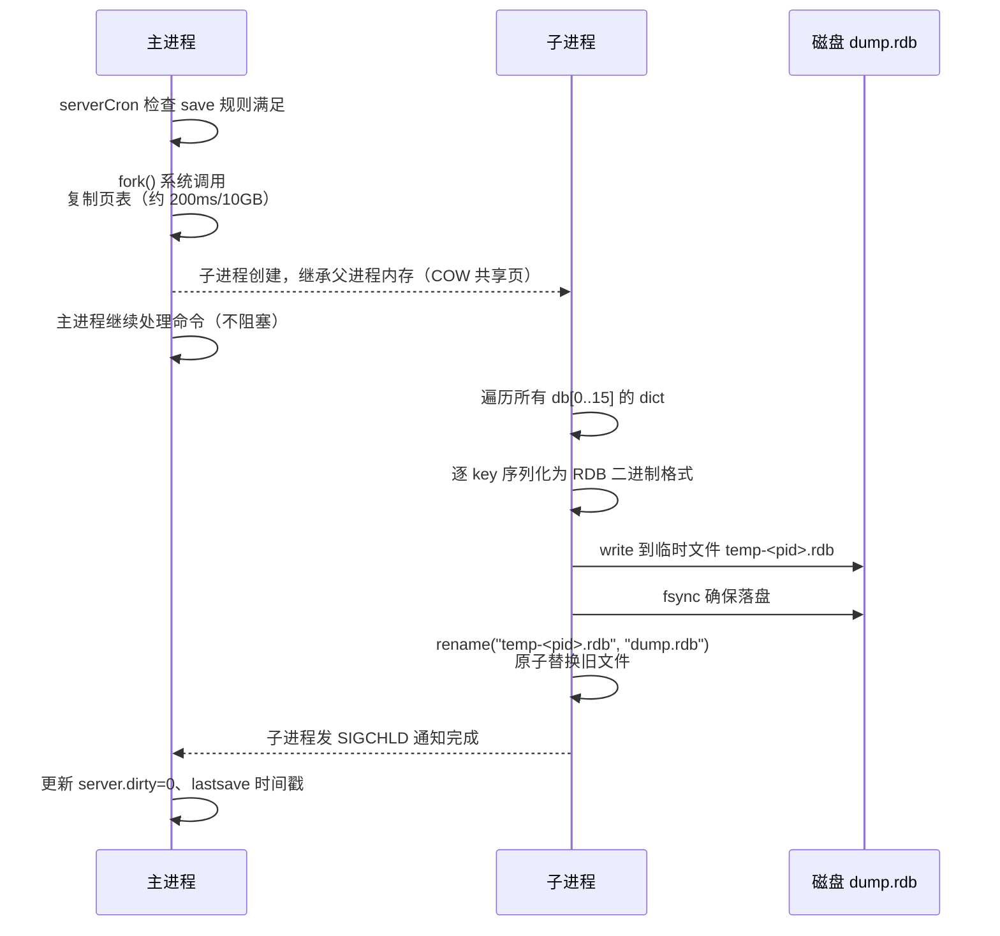
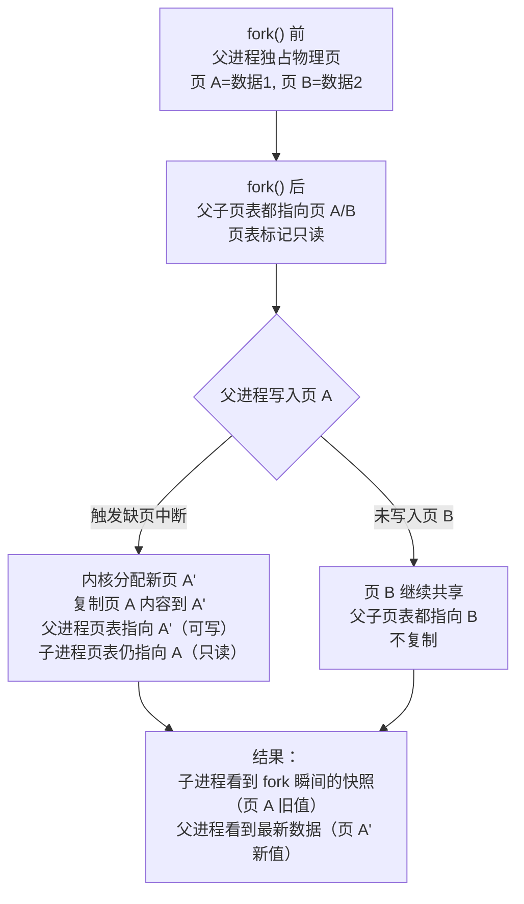
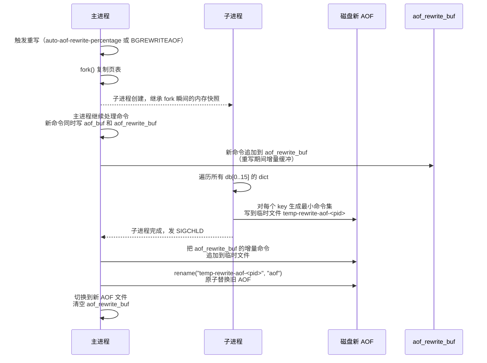

# 持久化机制

> **一句话定位**：持久化是 Redis 与纯内存缓存（如 Memcached）的本质区别，"RDB 和 AOF 怎么选"是高频必问，能讲到 fork COW 与 fsync 阻塞才算合格。
> **面试热度**：⭐⭐⭐⭐⭐
> **返回**：[Redis 知识图谱](../README.md)

---

## 一、概念定义

### 1.1 为什么 Redis 需要持久化

Redis 是**内存数据库**——所有数据常驻内存，命令执行直接操作内存，这是它极高的 QPS（单机 10 万+/秒）的根本来源。但内存是**易失性存储**：断电、宕机、进程崩溃，内存中的数据瞬间消失。如果一个 Redis 实例承载着用户会话、商品库存、订单状态，宕机重启后数据全丢，业务直接不可用。所以 Redis 必须提供把内存数据落到磁盘的机制——**持久化**。

**与 MySQL 的本质区别**：MySQL 是**磁盘数据库**，数据原本就在磁盘（InnoDB 的表空间文件），内存里的 Buffer Pool 只是缓存，宕机后磁盘数据还在，重启后从磁盘加载即可恢复。对 MySQL 而言，持久化是**默认且唯一**的存储方式，"宕机不丢数据"是基本能力。而 Redis 的数据本来在内存，磁盘持久化是**额外附加**的能力——可以不开（纯缓存场景），也可以按需配置 RDB/AOF/混合。这个定位差异决定了 Redis 持久化设计的核心权衡：**在"持久化成本"与"数据安全"间按业务档位选择**，不像 MySQL 只有一档"必须安全"。

**持久化的三类代价**：
1. **fork 阻塞**——RDB 和 AOF 重写都靠 `fork()` 子进程，fork 时主进程要复制页表，期间阻塞所有命令。页表大小与实例内存成正比，10GB 实例 fork 约 200ms。
2. **fsync 阻塞**——AOF 的 `appendfsync always` 模式每次写命令都 fsync，磁盘 IO 阻塞主线程，QPS 直接腰斩。
3. **AOF 重写 CPU 占用**——子进程遍历全量数据生成最小命令集（混合持久化时生成 RDB 格式），同时父进程维护 `aof_rewrite_buf` 增量缓冲，重写期间 CPU 与内存双压力。

Redis 的持久化设计就是围绕**如何让这三类代价可控**展开的：fork 用 COW 避免复制数据、AOF 重写用子进程避免阻塞主线程、appendfsync 提供三档策略让用户按业务选。

**与 Memcached 的对比**：Memcached 是纯内存缓存，**完全没有持久化**——重启即丢所有数据，这是它的设计哲学（缓存就该是临时的，数据源在 DB）。Redis 提供持久化，使其既能做缓存又能做"轻量数据库"（如会话存储、计数器、延迟队列），扩展了使用场景。但 Redis 的持久化强度仍弱于 MySQL（everysec 最多丢 1 秒 vs MySQL 的 ACID 不丢），所以定位仍是"缓存 + 轻量存储"，不是"主数据库"。

**持久化的版本演进**：
- 2.x：只有 RDB
- 2.4：引入 AOF（`appendonly yes`）
- 4.0：引入混合持久化（`aof-use-rdb-preamble`）
- 7.0：AOF 改为多文件目录结构（`appendonlydir`）、流式 RDB 默认开启（`repl-diskless-sync yes`）
- 7.x：listpack 替代 ziplist 后 RDB 序列化格式也更新，更紧凑

### 1.2 RDB vs AOF vs 混合持久化对比

Redis 提供三种持久化档位，核心维度是"全量快照 vs 增量命令"——RDB 是某时刻的**全量快照**（二进制 dump），AOF 是**增量命令日志**（追加每条写命令），混合持久化是两者的结合（RDB 头 + AOF 尾）。

| 维度 | RDB | AOF | 混合持久化（7.x 默认） |
|------|-----|-----|----------------------|
| 机制 | 全量快照，某时刻 dump 整个内存 | 增量命令，追加每条写命令（RESP 协议） | AOF 重写时子进程生成 RDB 头 + 父进程增量 AOF 尾 |
| 文件体积 | 小（二进制紧凑，压缩后更小） | 大（文本命令，未重写时膨胀严重） | 中（RDB 头紧凑 + 少量增量 AOF） |
| 恢复速度 | 快（二进制直接 load，10GB 约 5-10s） | 慢（逐条回放命令，10GB 可能几分钟） | 较快（先 load RDB 再回放少量 AOF） |
| 数据丢失窗口 | 大（取决于 save 间隔，最坏丢两次 save 之间所有数据） | 小（everysec 默认最多丢 1s） | 小（AOF 尾最多丢 1s） |
| 性能影响 | fork 阻塞（按 save 规则触发） | fsync 阻塞（always 最重、everysec 次之、no 最轻） | AOF 重写时 fork 阻塞 + CPU 占用 |

**选型决策树**：纯缓存可全关（`save ""` + `appendonly no`），容忍丢几分钟数据用 RDB，要求不丢数据用 AOF everysec，生产推荐**混合持久化**（`appendonly yes` + `aof-use-rdb-preamble yes` + `appendfsync everysec`）——兼顾恢复速度（RDB 头快）与数据安全（AOF 尾最多丢 1s）。混合持久化在 7.x 默认开启，已经成为事实标准。

**文件结构差异**：7.x 的 AOF 不再是单一文件，而是 `appendonlydir` 目录下三个文件——`appendonly.aof.<seq>.base.rdb`（基础文件，混合持久化时为 RDB 格式）、`appendonly.aof.<seq>.incr.aof`（增量文件，RESP 命令）、`appendonly.aof.manifest`（清单文件记录文件列表与状态）。这种多文件设计支持**AOF 重写时的增量替换**——重写生成新的 base 文件，旧的 incr 文件可独立归档或删除，比 6.x 的单文件 rename 更灵活，也支持**AOF 归档**（把 base + incr 打包做时间点备份）。

| 7.x AOF 目录文件 | 作用 | 格式 |
|-----------------|------|------|
| `appendonly.aof.<seq>.base.rdb` | 上次重写后的全量快照 | RDB 二进制（混合持久化）或 AOF 命令 |
| `appendonly.aof.<seq>.incr.aof` | 重写后的增量命令 | RESP 文本 |
| `appendonly.aof.manifest` | 文件清单（序号、类型、状态） | 文本 |

**RDB 与 AOF 的可共存性**：Redis 允许同时开启 RDB 和 AOF（生产推荐配置）。两者不冲突——RDB 由 `save` 规则触发 `bgsave`，AOF 由写入命令追加。宕机恢复时 Redis **优先加载 AOF**（AOF 数据更全），RDB 作为补充灾备（即使 AOF 损坏，RDB 还能恢复到某个时间点）。同时开启的代价是磁盘空间占用翻倍（dump.rdb + aof 文件）和偶尔的双重 fork（bgsave 与 AOF 重写恰巧同时触发，Redis 会延后其中一个避免并发 fork）。

### 1.3 持久化对性能的影响

持久化不是"零成本"的，三类代价直接影响 Redis 的延迟与吞吐：

| 代价类型 | 触发场景 | 影响机制 | 量化影响 |
|---------|---------|---------|---------|
| fork 阻塞 | `bgsave` / AOF 重写 / 主从全量同步 | 主进程复制页表（不复制数据），期间不处理命令 | 10GB 实例 fork 约 200ms，期间所有命令排队 |
| fsync 阻塞 | AOF `appendfsync always` | 每条写命令都 fsync 落盘，磁盘 IO 阻塞主线程 | HDD fsync 约 10ms，QPS 降到 100 左右；SSD 约 1ms |
| AOF 重写 CPU | `auto-aof-rewrite-percentage` 触发 | 子进程遍历全量数据生成 RDB 格式 + 父进程维护增量缓冲 | 重写期间 CPU 占用上升，可能挤压命令执行 |

**fork 阻塞是最容易被忽视的坑**——很多人以为"bgsave 是后台子进程，不影响主线程"，但 `fork()` 系统调用本身在主进程执行，复制页表期间主进程是阻塞的。10GB 实例 fork 200ms 在 Redis 里是**显著延迟尖刺**（Redis 正常 P99 < 1ms），对延迟敏感的业务（如实时推荐、交易）不可接受。这也是为什么生产实践强调"单实例内存 < 10GB"——把 fork 时间控制在 200ms 以内可接受范围，超过 10GB 必须用 Cluster 分片。

**fsync 阻塞是 AOF 的核心成本**——fsync 是把 page cache 的数据真正刷到磁盘扇区，这个操作必须等磁盘控制器确认写入完成，是**同步 IO**。`appendfsync always` 让每条写命令都等 fsync，单线程模型下等于把磁盘 IO 延迟叠加到每条命令上。`everysec` 是折中——每秒后台线程 fsync 一次，主线程不等 fsync，最多丢 1 秒。`no` 完全交给 OS，OS 自己决定何时刷盘（通常 30 秒一次），性能最好但丢失窗口最大。

---

## 二、原理与流程

### 2.1 RDB 全量快照

RDB（Redis Database）是某时刻整个内存数据的**二进制快照**，文件名默认 `dump.rdb`。触发方式有两种：`save`（前台阻塞）和 `bgsave`（后台子进程）。

**`save` vs `bgsave`**：

| 命令 | 执行方式 | 阻塞 | 适用场景 |
|------|---------|------|---------|
| `save` | 主进程直接遍历所有 db 生成 RDB | 阻塞所有命令（期间 Redis 不可用） | 严禁生产使用，仅用于灾备手动触发或空实例 |
| `bgsave` | fork 子进程，子进程遍历生成 RDB | 仅 fork 瞬间阻塞（复制页表），之后子进程后台写 | 生产唯一可用方式，`save` 规则自动触发也是 bgsave |

**`save` 规则触发**（`redis.conf` 默认）：
```
save 3600 1     # 3600s 内至少 1 个 key 变化 → 触发 bgsave
save 300 100    # 300s 内至少 100 个 key 变化 → 触发 bgsave
save 60 10000   # 60s 内至少 10000 个 key 变化 → 触发 bgsave
```

`save` 规则由 `serverCron`（每 100ms 执行一次，即 `hz=10`，可通过 `CONFIG SET hz 100` 提高）检查，满足任一条件就触发 `bgsave`。注意 `save 3600 1` 不是"每 3600 秒一定 bgsave"，而是"如果 3600 秒内有 1 个 key 变化则触发"——若一直无写入则永不触发。`save ""` 表示禁用 RDB 自动触发（纯 AOF 或纯缓存场景）。

**bgsave 流程**（`src/rdb.c` 的 `rdbSaveBackground`）：



**关键设计**：①fork 后子进程与父进程共享物理页（COW），子进程读到的是 fork 瞬间的数据快照，父进程后续修改不影响子进程的 RDB 内容；②写临时文件再 rename，保证**原子性**——要么旧的 dump.rdb 还在，要么新的已替换，不会出现写一半崩溃导致文件损坏；③fsync 确保数据真正落盘，否则 rename 后数据还在 page cache，断电仍会丢。

**RDB 文件格式**（7.x）：RDB 文件以魔数 `REDIS` 开头，后跟版本号（如 `0011` 表示 RDB version 11），然后是各 db 的数据（每个 db 先 `SELECTDB` 标识 db index，再逐 key 序列化 key/value/expire）。结尾有 CRC64 校验码（8 字节），用于加载时校验文件完整性。`redis-check-rdb` 工具可离线检查 RDB 文件结构。

> **源码路径**：`src/rdb.c` 的 `rdbSaveBackground`（bgsave 入口）、`rdbSave`（实际遍历写 RDB）、`rdbSaveRio`（IO 抽象层写入，被 bgsave 和流式同步和 AOF 重写复用）；`src/server.c` 的 `serverCron` 调用 `saveBgsaveHandler` 检查 save 规则。

### 2.2 fork 与 COW 详解

`fork()` 是 Unix 系统调用，创建一个与父进程几乎完全相同的子进程（内存布局、文件描述符、信号处理都一样）。但 fork 后父子进程共享的是**物理内存页**，而非复制数据——这就是 **COW（Copy-On-Write，写时复制）**。

**COW 原理**：fork 后，父子进程的页表指向**同一批物理页**，但页表项标记为**只读**。当父进程（处理新命令）要修改某页时，触发**缺页中断**，内核分配一个新物理页，把原页内容复制过去，父进程页表指向新页（可写），子进程页表仍指向原页（只读）。这样只有被父进程修改的页才复制，未修改的页继续共享。



**为什么 fork 本身很快？** 因为 fork 只**复制页表**，不复制数据页。一个进程的虚拟地址空间可能有几十 GB，但实际有数据的物理页远少于虚拟地址空间——fork 只需遍历页表项复制。页表大小与**实际使用的内存**成正比：

| 实例内存 | 页表大小（估算） | fork 耗时（估算） |
|---------|----------------|------------------|
| 1 GB | ~2 MB | ~20 ms |
| 10 GB | ~20 MB | ~200 ms |
| 50 GB | ~100 MB | ~1 s |
| 100 GB | ~200 MB | ~2 s+ |

（页表项每 4KB 页对应 8 字节页表项，10GB / 4KB × 8B ≈ 20MB；fork 复制页表是 memcpy 级操作，约 100MB/s）

**fork 阻塞的来源**：不是 CPU 计算，而是**复制页表**这个内存拷贝操作。页表越大（实例内存越大），拷贝越久。这就是为什么大内存实例 fork 会造成延迟尖刺——50GB 实例 fork 1 秒，期间所有命令排队，对延迟敏感的业务是灾难。

**COW 的内存放大效应**：fork 后，所有被父进程修改的页都要复制一份。极端情况——fork 期间所有页都被写入（如高写入负载），子进程需要的内存 = 父进程内存，此时物理内存占用翻倍。所以生产实践要求**物理内存留 50% 余量**给 fork COW 用，否则 fork 时 OOM。`info memory` 的 `used_memory_rss` 在 fork 期间会明显上涨，就是这个原因。

**COW 与 Linux 内存管理的关联**：COW 是 Linux 的通用机制（不是 Redis 发明的），所有 `fork()` 的进程都走 COW。Redis 之所以对 COW 敏感，是因为 Redis 是**单线程**——fork 期间主线程阻塞，而多线程程序（如 Java 的 `fork`）fork 后其他线程能继续工作。关联 `ops/linux/03-memory/memory-management.md` 看 COW 的内核实现（缺页中断处理、页表项权限切换）、`ops/linux/01-process/process-and-thread.md` 看 fork 的进程语义。

> **源码路径**：`fork()` 在 `src/rdb.c` 的 `rdbSaveBackground` 和 `src/aof.c` 的 `rewriteAppendOnlyFileBackground` 中调用；COW 是内核行为，Redis 代码不直接处理，但 Redis 通过 `vm.overcommit_memory=1` 配置确保 fork 有足够虚拟内存（否则 fork 可能因内核过度提交策略失败）。

### 2.3 流式 RDB（7.x）

传统的主从全量同步流程：主库 `bgsave` 生成 RDB 文件落盘 → 主库把磁盘 RDB 发给从库 → 从库 load RDB 到内存。这个流程的问题：①主库要写磁盘（磁盘 IO 瓶颈，尤其网络盘如 EBS）；②RDB 文件占磁盘空间；③多从库同步时主库要反复读磁盘发送。

**流式 RDB**（`repl-diskless-sync yes`，7.x）：主库 fork 子进程后，子进程**不写磁盘**，而是直接把 RDB 二进制流通过 socket 发送给从库。从库收到后直接 load 到内存。流式 RDB 复用了 `src/rio.c` 的 rio 抽象层——rio 既可以写文件（`rioFile`）、也可以写 socket（`rioSocket`），`rdbSaveRio` 不关心底层是文件还是 socket，同一份代码生成 RDB。

| 维度 | 传统 RDB 落盘同步 | 流式 RDB（7.x） |
|------|------------------|----------------|
| 磁盘 IO | 主库写 RDB + 读 RDB 发送 | 无磁盘 IO |
| 磁盘空间 | 占用 dump.rdb 空间 | 不占 |
| 多从库同步 | 串行或重复读磁盘 | `repl-diskless-sync-delay` 攒一批从库后并行发送 |
| 适用场景 | 磁盘快（本地 SSD） | 磁盘慢（网络盘 EBS）或从库多 |

**`repl-diskless-sync-delay`**：主库发现有从库请求全量同步后，**等待 delay 秒**（默认 2 秒）攒更多从库，然后 fork 一次子进程并行发送给所有等待的从库。这避免了"每来一个从库就 fork 一次"的开销。

**适用场景判断**：如果磁盘是网络盘（AWS EBS、阿里云 ESSD），写磁盘延迟高（毫秒级），流式 RDB 避免磁盘 IO 更优；如果磁盘是本地 NVMe SSD，磁盘 IO 不是瓶颈，落盘 RDB 可以复用（多个从库分批同步时复用同一份文件），反而更省。生产中需要根据磁盘类型选择。

**流式 RDB 的限制**：①只适用于主从全量同步场景，不适用于普通 bgsave 备份（备份必须落盘）；②fork 阻塞仍在（子进程仍需 fork 创建）；③从库数量多时，主库要并行发送多份 RDB 流，网络带宽可能成为瓶颈（每从库占一份带宽）。`repl-diskless-sync-delay` 攒批可以减少 fork 次数，但单次 fork 的发送压力仍在。

**配置参数**：

| 参数 | 默认值 | 作用 |
|------|--------|------|
| `repl-diskless-sync` | `yes`（7.x） | 开启流式 RDB |
| `repl-diskless-sync-delay` | `5` | 攒批等待秒数 |
| `repl-diskless-sync-period` | `300` | 两次流式同步最小间隔（避免频繁 fork） |
| `repl-diskless-loading` | `swapdb`（7.x） | 从库加载方式（`swapdb` 切换 DB 不阻塞，`on-empty-db` 仅空库可加载） |

> **源码路径**：`src/replication.c` 的 `replicationDiskless` 判断、`sendBulkToSlave` 流式发送 RDB；`rio.c` 的 socket rio 抽象。

### 2.4 AOF 追加写命令

AOF（Append-Only File）记录**每一条写命令**，文件名默认 `appendonly.aof`（7.x 用 `appendonlydir` 目录，内含 base 文件和增量文件）。开启 `appendonly yes` 后，每条写命令（SET/LPUSH/HSET 等）执行完后，Redis 把命令的 RESP 协议格式追加到 AOF 文件。

**RESP 协议格式**（以 `SET key value` 为例）：
```
*3\r\n$3\r\nSET\r\n$3\r\nkey\r\n$5\r\nvalue\r\n
```
- `*3` 表示 3 个参数（命令名 + 2 个参数）
- `$3\r\nSET\r\n` 表示长度 3 的字符串 "SET"
- `$3\r\nkey\r\n` 表示长度 3 的字符串 "key"
- `$5\r\nvalue\r\n` 表示长度 5 的字符串 "value"

AOF 文件就是一条条 RESP 命令的顺序追加，恢复时 Redis 逐条解析并重新执行这些命令，重建内存状态。

**AOF 写入的三级流水线**：


| 层级 | 操作 | 执行者 | 作用 |
|------|------|--------|------|
| 1. aof_buf | 命令执行后追加到内存缓冲区 | 主线程 | 攒一批命令，避免每条都 write |
| 2. write | write 系统调用写到 page cache | 主线程（每次事件循环末尾） | 数据进入内核缓冲，进程崩溃不丢，但宕机可能丢 |
| 3. fsync | fsync 把 page cache 刷到磁盘扇区 | 后台线程（everysec/no）或主线程（always） | 真正持久化，断电不丢 |

**write vs fsync 的本质区别**：write 只是写到内核的 page cache，**进程崩溃数据不丢**（内核会保留），但**操作系统宕机/断电数据丢**（page cache 在内存）。fsync 才是真正把数据写到磁盘扇区，**断电也不丢**。所以 AOF 的数据安全取决于 fsync 时机——appendfsync 策略控制的就是 fsync 的频率。

**为什么 AOF 用 RESP 而不是自定义二进制？** RESP 是 Redis 的标准通信协议，客户端发命令就用 RESP，AOF 直接复用——写 AOF 等于把客户端发的命令原样存下来。好处是 AOF 文件可读（`redis-check-aof` 工具能解析），恢复时直接复用命令执行器。坏处是体积比二进制大（文本格式有冗余），但混合持久化用 RDB 头弥补了体积问题。7.x 的 incr 文件仍是 RESP，base 文件用 RDB 二进制，兼顾可读性与紧凑性。

> **源码路径**：`src/aof.c` 的 `propagateNow`（命令追加到 aof_buf）、`flushAppendOnlyFile`（write + 按 appendfsync 决定 fsync）、`aof_background_fsync`（后台线程 fsync，everysec 模式用）。

### 2.5 AOF 重写

AOF 是追加写命令，文件会越来越大——如 `INCR counter` 执行 1000 次，AOF 文件有 1000 条 `INCR`，但 counter 最终值只是 1000。如果不重写，AOF 文件膨胀到几百 GB，恢复时要回放百万条命令，极慢。

**AOF 重写**（rewrite）：子进程遍历所有 db，对每个 key 生成**当前状态的最小命令集**。如 1000 次 `INCR counter` 重写为 1 条 `SET counter 1000`；`RPUSH list a; RPUSH list b; RPOP list` 重写为 `RPUSH list a`（RPOP 后只剩 a）。

**重写流程**（`src/aof.c` 的 `rewriteAppendOnlyFileBackground`）：



**为什么需要 `aof_rewrite_buf`？** 子进程 fork 后，数据隔离——父进程处理的新命令子进程看不到。如果重写期间父进程写了 1 万条命令，这些命令子进程没遍历到，重写出的 AOF 会丢失这 1 万条。所以父进程在重写期间，新命令**同时写 aof_buf（旧 AOF）和 aof_rewrite_buf（待追加到新 AOF）**。子进程生成完 RDB/AOF 主体后，父进程把 `aof_rewrite_buf` 的增量追加进去，再 rename 替换，保证重写后的 AOF 数据完整。

**重写的触发**：
- `auto-aof-rewrite-percentage 100`：AOF 文件大小比上次重写后增长了 100% 触发
- `auto-aof-rewrite-min-size 64mb`：AOF 文件至少 64MB 才触发重写（避免小文件频繁重写）
- `BGREWRITEAOF` 命令手动触发

**7.x 多文件重写的差异**：6.x 的重写是 fork 子进程生成临时文件，完成后 rename 替换旧 AOF。7.x 改为多文件后，重写生成新的 base 文件（`appendonly.aof.<seq>.base.rdb`），重写期间父进程的增量写入新的 incr 文件，重写完成后更新 manifest 清单，旧 base/incr 文件标记为可删除。这种设计避免了 rename 期间的服务暂停，也支持**AOF 归档**——把历史 base/incr 文件打包做时间点备份（类似 MySQL 的 binlog 归档）。

**重写的代价**：①fork 阻塞（同 bgsave）；②子进程遍历全量数据 CPU 占用；③父进程维护 `aof_rewrite_buf` 额外内存（重写期间写入量越大，缓冲越大）。生产中如果写入压力大，重写期间可能内存翻倍（fork COW + aof_rewrite_buf），需监控。

**AOF 重写的极限场景**：①如果重写期间写入量极大，`aof_rewrite_buf` 可能膨胀到 GB 级，父进程内存压力大；②如果重写期间又触发了新的重写（写入极快导致 AOF 又翻倍），Redis 会**拒绝并发重写**（同一时间只允许一次重写），新重写请求排队；③如果磁盘 IO 极慢（网络盘），子进程写新 AOF 耗时长，重写窗口拉长，`aof_rewrite_buf` 积压更严重。生产应监控 `aof_rewrite_in_progress` 和 `aof_pending_fsync`，重写超 10 分钟需告警。

> **源码路径**：`src/aof.c` 的 `rewriteAppendOnlyFileBackground`（重写入口）、`rewriteAppendOnlyFile`（子进程遍历 db 写新 AOF）、`aofRewriteBufferAppend`（父进程增量写入 aof_rewrite_buf）、`aofChildWriteDiff`（重写完成后把 aof_rewrite_buf 追加到新 AOF）。

### 2.6 appendfsync 三种策略

`appendfsync` 控制 fsync 的频率，是 AOF 数据安全与性能的核心权衡：

| 策略 | fsync 时机 | 数据丢失窗口 | 性能影响 | 适用场景 |
|------|-----------|-------------|---------|---------|
| `always` | 每条写命令都 fsync | 0 丢失（最安全） | 最慢（SSD fsync ~1ms，QPS 降到 ~1000） | 金融级数据安全（极少用） |
| `everysec` | 每秒后台线程 fsync 一次 | 最多丢 1 秒 | 接近无 fsync 的性能（默认） | 生产首选，99% 场景 |
| `no` | 完全交给 OS（约 30 秒 fsync 一次） | 最多丢 30 秒 | 最快（无 fsync 阻塞） | 纯缓存可容忍丢失 |

**always 为什么慢？** Redis 是单线程命令执行模型，`appendfsync always` 让每条写命令都 fsync，fsync 是同步 IO（等磁盘控制器确认），1ms 的 fsync 直接叠加到命令延迟上。原本 1μs 的 SET 变成 1ms，QPS 从 10 万降到 1000。除非业务要求金融级不丢数据，否则不用 always。

**everysec 的实现**：主线程每次事件循环只做 write（写到 page cache，不阻塞），fsync 由**后台线程**每秒执行一次。后台线程 fsync 期间主线程继续处理命令，不阻塞。如果某次 fsync 超过 1 秒（磁盘慢），下次 fsync 会延后，但主线程不等——这是"最多丢 1 秒"的来源。

**no 的风险**：OS 的 pdflush 线程默认 30 秒刷一次脏页，断电时这 30 秒的数据全丢。性能最好但丢失窗口最大，仅适合纯缓存场景。

**数据丢失窗口的例外**：everysec 理论上最多丢 1 秒，但有两个例外——①磁盘满或 fsync 线程异常，主线程发现 fsync 失败会**停止接受写命令**（返回 `MISCONF` 错误，保护数据一致性），此时不是"丢 1 秒"而是"不可写"；②AOF 重写期间如果主进程崩溃，重写的临时文件不完整，但旧 AOF 还在，恢复用旧 AOF（可能丢重写期间的增量）。所以 everysec 的"最多丢 1 秒"是在正常 fsync 的前提下的保证，异常情况下行为更复杂。

**fsync 与文件系统的崩溃一致性**：fsync 保证数据写到磁盘的**稳定存储**（stable storage），但不同文件系统的保证强度不同——ext4/xfs 的 fsync 保证元数据（文件大小、分配块）和数据都落盘；但若日志模式是 `data=writeback`（ext4 的非默认模式），fsync 后崩溃可能看到旧数据。生产推荐 ext4 的 `data=ordered`（默认）或 xfs，fsync 语义最可靠。详见 `ops/linux/05-fs/filesystem-and-vfs.md`。

> **源码路径**：`src/aof.c` 的 `flushAppendOnlyFile`（按 appendfsync 策略决定 fsync 时机）、`aof_background_fsync`（后台线程 fsync，everysec 模式用）；`src/bio.c` 的 `bio_aof_fsync` 线程。

### 2.7 混合持久化

混合持久化（`aof-use-rdb-preamble yes`，7.x 默认开启）是 RDB 与 AOF 的结合——AOF 重写时，子进程生成的不是 AOF 命令格式，而是 **RDB 二进制格式**（即 AOF 文件的开头是 RDB 快照）。重写完成后，父进程的增量命令（aof_rewrite_buf）以 AOF 格式追加在 RDB 之后。

**AOF 文件结构**（混合持久化，7.x 多文件形态）：

7.x 起 AOF 不再是单文件，而是 `appendonlydir` 目录下的多文件组合：base 文件（重写时的全量快照，RDB 格式）+ incr 文件（重写后的增量命令，RESP 格式）+ manifest 清单。混合持久化的"RDB 头 + AOF 尾"在 7.x 体现为 base 文件是 RDB、incr 文件是 AOF，恢复时先 load base（RDB 快）再回放 incr（AOF 少量）。

```
appendonlydir/
├── appendonly.aof.1.base.rdb   # base：上次重写的全量快照（RDB 格式）
├── appendonly.aof.1.incr.aof   # incr：重写后的增量命令（RESP 格式）
└── appendonly.aof.manifest     # manifest：文件清单与状态
```

单文件视角（6.x 及之前，或概念性说明）：

```
+---------------------------+---------------------------+
|     RDB 格式头（快照）     |   AOF 格式尾（增量命令）   |
|  子进程遍历全量数据生成    |  重写期间父进程新写入命令   |
|  二进制紧凑，恢复时 load    |  RESP 格式，恢复时回放     |
+---------------------------+---------------------------+
```

**恢复流程**：Redis 启动时检测 AOF 文件开头是否是 RDB 格式（魔数 `REDIS` 开头），是则先 load RDB 部分（快，二进制直接反序列化到内存），再回放 AOF 尾部（少，只有重写后的增量命令）。相比纯 AOF 恢复（回放全量命令，慢），混合持久化恢复速度接近 RDB，数据完整性接近 AOF everysec。

| 维度 | 纯 AOF 重写 | 混合持久化重写 |
|------|------------|--------------|
| 子进程生成格式 | AOF 命令（RESP 文本） | RDB 二进制 |
| 文件体积 | 大（文本命令） | 小（RDB 紧凑） |
| 恢复速度 | 慢（回放全量命令） | 快（先 load RDB 再回放少量 AOF） |
| 数据丢失窗口 | everysec 最多 1s | everysec 最多 1s（相同） |

**7.x 默认开启的原因**：混合持久化在恢复速度和数据安全上全面优于纯 AOF，没有理由不用。`aof-use-rdb-preamble no` 仅用于兼容旧版本（6.x 及之前不支持混合格式的 Redis 无法读取），7.x 新实例一律开启。

> **源码路径**：`src/aof.c` 的 `rewriteAppendOnlyFileRio`（子进程生成 RDB 头，调 `rdbSaveRio`）、`loadAppendOnlyFile`（恢复时检测 RDB 前导，先 `rdbLoad` 再回放 AOF）。

### 2.8 Transparent Hugepage 对 COW 的影响

Linux 的 **Transparent Hugepage（THP）** 默认开启，把标准 4KB 页合并为 2MB 大页，减少页表项数量、提升 TLB 命中率。但对 Redis 的 COW 是灾难。

| 维度 | 标准页（4KB） | THP 大页（2MB） |
|------|-------------|----------------|
| 页大小 | 4 KB | 2 MB |
| 页表项数（10GB） | ~260 万项 | ~5000 项 |
| fork 复制页表 | 260 万项 × 8B = 20MB | 5000 项 × 8B = 40KB |
| COW 复制粒度 | 4 KB | 2 MB |

**THP 对 COW 的放大效应**：fork 后父进程只修改 1 字节，标准页模式下只复制 4KB；THP 模式下要复制整个 2MB 大页，**放大 512 倍**。假设 fork 期间有 1GB 数据被修改，标准页模式复制 1GB，THP 模式可能复制到几十 GB（每个修改触及的大页都全页复制），物理内存瞬间爆炸，甚至 OOM。

**必须关闭 THP**：
```bash
echo never > /sys/kernel/mm/transparent_hugepage/enabled
```

`never` 表示完全禁用 THP（不用大页，只用 4KB 标准页）。`madvise` 表示只在进程显式请求时用大页（Redis 不请求，等于禁用）。`always` 是默认值（尽量用大页），对 Redis 有害。

**永久关闭**：写入 `/etc/default/grub` 的 `GRUB_CMDLINE_LINUX` 加 `transparent_hugepage=never`，或用 systemd 服务在启动时执行 echo never。

**验证**：
```bash
cat /sys/kernel/mm/transparent_hugepage/enabled
# 输出 [never] 表示已关闭
```

**Redis 安装时的 `install_server.sh` 脚本会自动检查并提示关闭 THP，这是 Redis 官方推荐的生产配置。**

**THP 与 fork 页表复制的区别**：关闭 THP 后页表项增多（10GB 从 5000 项变 260 万项），fork 复制页表是否变慢？不会——因为 fork 复制的是**实际使用的页表项**（通过页表中间层 PMD/PUD 遍历），THP 关闭后实际使用的 4KB 页对应的页表项总数与 THP 下大页对应的页表项总数不同，但内核 fork 时按 PMD 遍历，复制开销基本一致。THP 的真正问题是**COW 时的复制粒度**，不是 fork 本身。

**其他 THP 相关配置**：①`vm.overcommit_memory=1`：允许内核过度提交内存，确保 fork 时虚拟内存充足（fork 需要分配与父进程等大的虚拟地址空间，虽不立即占物理内存）。Redis 推荐设为 1，否则 fork 可能因虚拟内存不足返回 ENOMEM。②`vm.swap_size` 或禁用 swap：Redis 在 swap 上运行会极慢（磁盘比内存慢 1000 倍），fork COW 时换页更严重。生产应 `swapoff -a` 或限制 Redis 进程的 swap 使用（cgroup `memory.memsw.limit_in_bytes`）。

### 2.9 关键源码路径汇总

| 功能 | 源码路径 | 核心函数 |
|------|---------|---------|
| bgsave | `src/rdb.c` | `rdbSaveBackground`、`rdbSave`、`rdbSaveRio` |
| RDB 加载（恢复） | `src/rdb.c` | `rdbLoad`、`rdbLoadRio` |
| fork + COW | 内核（`fork()` 系统调用） | Redis 侧：`rdbSaveBackground`、`rewriteAppendOnlyFileBackground` |
| AOF 追加 | `src/aof.c` | `propagateNow`、`flushAppendOnlyFile` |
| AOF 重写 | `src/aof.c` | `rewriteAppendOnlyFileBackground`、`rewriteAppendOnlyFile`、`aofRewriteBufferAppend` |
| AOF 恢复 | `src/aof.c` | `loadAppendOnlyFile` |
| 混合持久化 | `src/aof.c` + `src/rdb.c` | `rewriteAppendOnlyFileRio`（生成 RDB 头）、`rdbSaveRio` |
| IO 抽象层 | `src/rio.c` | `rio` 结构（file rio / socket rio / fd rio），differential write |
| 流式 RDB | `src/replication.c` | `sendBulkToSlave`、`replicationDiskless` |
| appendfsync | `src/aof.c` + `src/bio.c` | `flushAppendOnlyFile`、`bio_aof_fsync` |

**rio 抽象层**（`src/rio.c`）是 Redis 持久化的 IO 统一接口——RDB 写文件、RDB 写 socket（流式同步）、AOF 重写都用 rio。rio 封装了 read/write/flush 三个操作，底层可以是文件 fd、socket、内存 buffer。这让 RDB 生成逻辑（`rdbSaveRio`）与具体 IO 目标解耦，同一份代码既能写磁盘 RDB、又能流式发给从库。

---

## 三、高频追问

### Q1：RDB 和 AOF 怎么选？生产用哪个？

**生产用混合持久化**（`appendonly yes` + `aof-use-rdb-preamble yes` + `appendfsync everysec`），7.x 默认配置。理由：混合持久化兼顾 RDB 的恢复速度（RDB 头快 load）和 AOF 的数据安全（AOF 尾最多丢 1 秒），是两者的最优结合。纯 RDB 丢失窗口大（两次 save 之间全丢），纯 AOF 恢复慢（回放全量命令）。仅纯缓存场景（数据可从 DB 重建）才关 AOF 只留 RDB 或全关。

### Q2：bgsave 时如果有写入怎么办？数据会丢吗？

不会丢，靠 **COW**。fork 后子进程拿到的是 fork 瞬间的内存快照（只读共享页），父进程处理新命令时触发缺页中断，内核复制修改的页给父进程，子进程仍读旧页。所以 bgsave 期间父进程的写入不会进入 RDB（RDB 是 fork 瞬间的快照），但这些写入在内存里，下次 bgsave 或 AOF 会记录。**RDB 不丢"已写入内存但未进 RDB 的数据"**，因为它们在内存里，宕机才丢——这是 RDB 的丢失窗口（两次 bgsave 之间的写入）。

### Q3：AOF 文件越来越大怎么办？

**AOF 重写**。Redis 自动触发（`auto-aof-rewrite-percentage 100` + `auto-aof-rewrite-min-size 64mb`）或手动 `BGREWRITEAOF`。重写时子进程遍历全量数据生成最小命令集（如 1000 次 INCR 重写为 1 条 SET），文件体积大幅缩小。重写期间父进程的增量命令缓存在 `aof_rewrite_buf`，重写完成后追加到新 AOF 再 rename 替换，保证数据完整。混合持久化下重写生成 RDB 格式，体积更小。

### Q4：fork 为什么会阻塞？怎么优化？

fork 时主进程要**复制页表**（不是复制数据），页表大小与实例内存成正比，10GB 实例页表约 20MB，fork 复制约 200ms，期间主进程阻塞所有命令。优化：①控制单实例内存 < 10GB，fork 时间 < 200ms 可接受；②用 Cluster 分片，每片 10GB，分散 fork 压力；③关闭 THP（`echo never > /sys/kernel/mm/transparent_hugepage/enabled`），避免大页放大 COW 复制粒度；④用流式 RDB（`repl-diskless-sync yes`）减少主从同步时的 fork 次数。根本原因是 fork 复制页表是内核行为，Redis 无法绕过。

### Q5：everysec 真的只丢 1 秒吗？有没有例外？

正常情况下最多丢 1 秒（后台线程每秒 fsync 一次，断电时最多丢最近 1 秒未 fsync 的数据）。但有例外：①磁盘满或 fsync 失败，主线程发现后**停止接受写命令**（返回 `MISCONF` 错误），此时不是"丢 1 秒"而是"不可写"，需人工介入；②AOF 重写期间如果 fsync 落后于写入，可能短暂超过 1 秒窗口；③极端情况 fsync 线程异常阻塞，积累的未 fsync 数据可能超过 1 秒。所以 everysec 的"最多丢 1 秒"是**正常 fsync 的保证**，异常场景行为更复杂，但 Redis 设计上宁可不可写也不允许数据不一致。

### Q6：混合持久化怎么恢复？

Redis 启动时优先加载 AOF（如果 `appendonly yes`）。7.x 读取 `appendonlydir/manifest` 清单，按序号依次加载——先 load base 文件（检测是否 RDB 格式，是则 `rdbLoad` 快速加载，否则按 AOF 回放），再回放各 incr 文件的增量命令（RESP 格式）。6.x 单文件模式下，读取 AOF 文件开头检测是否 RDB 格式（魔数 `REDIS`），是则先 `rdbLoad` 加载 RDB 头（快，二进制直接反序列化到内存），然后继续读取 AOF 尾部的增量命令逐条回放（少，只有上次重写后的写入）。恢复速度接近纯 RDB（RDB/base 占绝大部分体积），数据完整性接近 AOF everysec（incr/AOF 尾最多丢 1 秒）。如果 AOF 文件开头不是 RDB 格式（旧版本或 `aof-use-rdb-preamble no`），则按纯 AOF 全量回放。

---

## 四、实战关联（Java 后端视角）

### 4.1 生产配置模板

Java 后端部署 Redis 的标准持久化配置（写入 `redis.conf`）：

```conf
# AOF 开启 + 混合持久化 + everysec
appendonly yes
aof-use-rdb-preamble yes
appendfsync everysec

# RDB 规则（作为 AOF 的补充灾备）
save 3600 1
save 300 100
save 60 10000

# 关闭 THP（系统层配置，非 redis.conf）
# echo never > /sys/kernel/mm/transparent_hugepage/enabled

# 控制单实例内存
maxmemory 8gb
maxmemory-policy allkeys-lru

# AOF 重写控制（避免频繁重写）
auto-aof-rewrite-percentage 100
auto-aof-rewrite-min-size 64mb
```

**配置理由**：①`appendonly yes` 开 AOF 保证数据安全；②`aof-use-rdb-preamble yes` 混合持久化加速恢复；③`appendfsync everysec` 性能与安全平衡；④`maxmemory 8gb` 控制单实例 < 10GB，fork 时间 < 200ms；⑤关闭 THP 避免 COW 放大。这套配置是 99% 生产场景的标准答案。

**Spring Boot 集成配置**（`application.yml`）：

```yaml
spring:
  redis:
    host: ${REDIS_HOST}
    port: 6379
    password: ${REDIS_PASSWORD}
    lettuce:
      pool:
        max-active: 50
        max-idle: 20
        min-idle: 5
    timeout: 3000ms
```

客户端配置与持久化无直接关系，但 Java 工程师需理解——Redis 宕机恢复期间（AOF 加载 10-30 秒），客户端会报 `UNIDENTIFIED` 或连接异常，需配置重试和降级策略（如回源 DB）。Lettuce 的 `topology-refresh` 和 `command-timeout` 应对短时不可用。

### 4.2 大内存实例 fork 阻塞的优化

当单实例内存超过 10GB，fork 时间超过 200ms，对延迟敏感业务不可接受。优化路径：

| 优化手段 | 效果 | 代价 |
|---------|------|------|
| 控制单实例 < 10GB | fork < 200ms | 需 Cluster 分片分散数据 |
| Cluster 分片（每片 10GB） | 单片 fork 可控 | 集群运维复杂度上升 |
| `repl-diskless-sync yes` | 主从同步不落盘，减少 fork | 仅对主从同步有效，AOF 重写 fork 仍在 |
| 关闭 THP | COW 复制粒度回归 4KB | TLB 命中率略降（Redis 不在乎） |
| 业务侧削峰 | 降低 fork 期间写入量，减少 COW 复制 | 需业务配合 |

**根本优化是控制单实例内存**——Redis 单实例不是越大越好，10GB 是工程上的经验上界。50GB 需求拆成 5 个 10GB 的 Cluster 节点，每个节点 fork 200ms 可接受，比单实例 50GB fork 1 秒健康得多。

### 4.3 与 MySQL binlog 的对比

Java 后端常同时用 MySQL 和 Redis，两者的持久化机制有本质差异：

| 维度 | MySQL binlog | Redis AOF |
|------|-------------|-----------|
| 日志类型 | 逻辑日志（行变更：INSERT/UPDATE/DELETE 的 row image） | 逻辑日志（命令：SET/LPUSH 的 RESP 格式） |
| 写入时机 | 事务提交时写 binlog（与引擎 redo 日志配合） | 每条写命令执行后追加 |
| 用途 | 主从复制 + 归档恢复 + 时间点恢复（PITR） | 宕机恢复（AOF 重写维护体积） |
| 刷盘策略 | `sync_binlog=0/1/N`（0 交 OS、1 每事务 fsync、N 每 N 事务 fsync） | `appendfsync always/everysec/no` |
| 压缩 | binlog 本身不压缩（靠 rotate 滚动） | AOF 重写压缩（最小命令集） |
| 恢复速度 | 慢（回放 binlog + redo） | 混合持久化较快（RDB 头 + AOF 尾） |

**本质差异**：MySQL 数据在磁盘，binlog 是"变更日志"用于复制和归档；Redis 数据在内存，AOF 是"重建日志"用于宕机恢复。MySQL 的持久化是**天然**的（数据本来就在磁盘），binlog 是补充；Redis 的持久化是**附加**的（数据本来在内存），RDB/AOF 是为宕机恢复加的。所以 Redis 的持久化配置是"选档"（按业务选 RDB/AOF/混合/全关），MySQL 是"必开"（binlog 不开则无复制无归档）。

### 4.4 关联 ops/linux 模块

Redis 持久化涉及多个 Linux 底层机制，深入理解需关联 `ops` 模块：

| Redis 概念 | Linux 机制 | ops 模块文档 |
|-----------|-----------|-------------|
| fsync 落盘 | 文件系统崩溃一致性、page cache、fsync 语义 | `ops/linux/05-fs/filesystem-and-vfs.md` |
| fork + COW | 虚拟内存、页表、写时复制 | `ops/linux/03-memory/memory-management.md` |
| THP 大页 | 透明大页、TLB、页大小权衡 | `ops/linux/03-memory/memory-management.md` |
| AOF 重写子进程 | 进程模型、信号 SIGCHLD | `ops/linux/01-process/process-and-thread.md` |
| 流式 RDB socket | IO 模型、socket | `ops/linux/04-io/io-model-and-epoll.md` |

**处理原则**：Redis 章只讲"Redis 场景下的配置与选择"（如关 THP、选 appendfsync），底层原理推导（如 fsync 如何保证崩溃一致性、COW 的内核实现）回 `ops/linux` 对应文档，不重复展开。

### 4.5 Java 客户端与持久化的关联

Spring Data Redis 的 `RedisTemplate` 本身不直接涉及持久化配置（持久化是服务端配置），但 Java 后端工程师需理解持久化对业务的影响：| 业务场景 | 持久化要求 | Java 侧应对 |
|---------|-----------|------------|
| 缓存（可重建） | AOF everysec 或纯 RDB | 宕机后从 DB 回源重建缓存 |
| 会话（Session） | AOF everysec | 宕机最多丢 1 秒会话，用户重新登录 |
| 计数器（INCR） | AOF everysec | 丢失少量计数可接受，或用 DB 兜底 |
| 分布式锁（Redisson） | AOF everysec | 锁状态宕机恢复，锁续期靠看门狗 |
| 延迟队列（ZSet/Stream） | AOF everysec + ACK key | 丢失 1 秒消息 + ACK 兜底重试 |
| 金融账户 | AOF always（或不用 Redis） | 每笔 fsync，或改用 MySQL |

**关键认知**：Redis 持久化的丢失窗口（everysec 1 秒）决定了它**不适合做金融级强一致存储**——金融账户应放 MySQL（ACID + redo 日志），Redis 仅做缓存或非关键计数。Java 后端架构师需根据持久化特性决定哪些数据放 Redis、哪些放 MySQL，这是"缓存 vs 数据库"分工的核心。

### 4.6 监控持久化状态

Java 后端运维 Redis 时需监控持久化关键指标，及时发现 fork 阻塞和重写异常：

| 监控指标 | info 段 | 告警阈值 | 含义 |
|---------|---------|---------|------|
| `rdb_bgsave_in_progress` | Persistence | > 0 持续超 5 分钟 | bgsave 进行中，时间过长可能卡死 |
| `rdb_last_save_time` | Persistence | 与上次差 > 1 小时 | save 规则可能未触发 |
| `rdb_last_bgsave_status` | Persistence | != ok | bgsave 失败，磁盘满或 fork 失败 |
| `rdb_last_bgsave_time_sec` | Persistence | > 10（10GB 实例） | bgsave 耗时长，实例过大 |
| `aof_enabled` | Persistence | != 1（生产应开启） | AOF 未开启 |
| `aof_rewrite_in_progress` | Persistence | > 0 持续超 10 分钟 | AOF 重写卡住 |
| `aof_last_rewrite_time_sec` | Persistence | > 30 | AOF 重写耗时长 |
| `aof_pending_fsync` | Persistence | > 100 | 待 fsync 积压，磁盘慢 |
| `aof_delayed_fsync` | Persistence | > 0 | fsync 曾阻塞主线程 |

**Spring Boot Actuator 集成**：用 `RedisConnectionFactory` 的 `getConnection().info()` 获取这些指标，暴露到 Actuator 的 `/actuator/redis` 端点，接入 Prometheus + Grafana 做监控面板。fork 阻塞超过 1 秒或 AOF 重写失败需立即告警，否则可能导致数据丢失。

**延迟监控**：Redis 的 `latency` 命令（`LATENCY HISTORY event`）记录延迟事件，`fork`、`aof-write`、`aof-fsync-always` 是关键事件。`LATENCY DOCTOR` 会给出诊断建议——如发现 `fork: 500ms` 的记录，说明 fork 阻塞严重，需考虑分片或减小实例。

---

## 五、系统设计案例

### 案例 1：设计一个 50GB Redis 实例的持久化方案

**场景**：业务数据总量 50GB（用户画像 + 缓存 + 计数器），要求宕机最多丢 1 秒，恢复时间 < 1 分钟，延迟 P99 < 5ms。

**3 分钟标准答法**：

1. **拒绝单实例 50GB，用 Cluster 分片到 5 个 10GB 节点**——单实例 50GB fork 需 1 秒（页表 100MB），延迟尖刺不可接受；分片后每片 10GB fork 200ms 可接受。Cluster 5 主 5 从，每片 maxmemory 8GB（留 fork COW 余量）。
2. **每节点配置混合持久化**——`appendonly yes` + `aof-use-rdb-preamble yes` + `appendfsync everysec`。恢复时先 load RDB 头（10GB RDB 约 10 秒）再回放 AOF 尾（少量增量），总恢复 < 30 秒。
3. **关闭 THP**——`echo never > /sys/kernel/mm/transparent_hugepage/enabled`，避免 COW 大页放大。部署时写入 systemd 服务确保开机自动关闭。
4. **fork 阻塞 200ms 可接受**——10GB 实例 fork 200ms 是工程上界，P99 5ms 是常态，fork 期间的 200ms 尖刺每月几次（AOF 重写频率可控），业务可容忍。

**核心权衡**：数据规模 vs fork 阻塞。单实例越大 fork 越慢，但分片越多运维越复杂。50GB 拆 5 片是经验平衡点——每片 10GB fork 可控，5 片运维复杂度可接受。若 500GB 需求则拆 50 片，运维复杂度上升但无更好方案。

**追问链**（3 条）：

- **追问 1：单实例为什么不超 10GB？** → fork 阻塞。10GB 实例页表约 20MB，fork 复制 200ms；50GB 实例页表 100MB，fork 1 秒，期间所有命令排队，延迟尖刺破坏 P99。10GB 是"fork 时间 < 200ms"的经验上界，超 10GB 必须分片。
- **追问 2：从库怎么做持久化？** → 从库不开 AOF，只靠主从同步。从库的 RDB 用于主从全量同步（主库 bgsave 发给从库），从库本身不开 AOF——避免从库也 fork 造成额外阻塞。从库的数据安全靠主库 AOF + 主从同步保证。如果主库宕机，从库提升为主库后再开 AOF。
- **追问 3：AOF 重写时主库压力大怎么办？** → `auto-aof-rewrite-percentage 100` 控制重写频率。重写期间 fork 阻塞 + CPU 占用 + aof_rewrite_buf 内存增长，写入压力大时重写可能拖累延迟。优化：①调大 `auto-aof-rewrite-min-size`（如 256MB）减少重写触发频率；②低峰期手动 `BGREWRITEAOF` 避开高峰；③监控 `info persistence` 的 `aof_rewrite_in_progress` 及时告警。

**架构图**：

```
50GB 数据 → Cluster 5 主 5 从分片
    ├── 节点 1（10GB, slot 0-3461）
    │   ├── appendonly yes + aof-use-rdb-preamble yes + appendfsync everysec
    │   ├── maxmemory 8gb
    │   └── THP 关闭
    ├── 节点 2-5（同配置）
    └── 每节点 fork 200ms, 恢复 < 30s, 丢 < 1s
```

**容量规划细节**：①每节点物理内存应 ≥ maxmemory × 1.5（留 fork COW 50% 余量），8GB maxmemory 需 12GB+ 物理机；②磁盘空间需 ≥ maxmemory × 2（RDB + AOF 可能同时存在），8GB 实例需 16GB+ 磁盘；③网络带宽预估——AOF 重写时子进程写新 AOF（8GB 写盘）+ 主进程继续写 aof_buf（增量），磁盘写带宽需 ≥ 100MB/s 避免重写耗时过长；④fork 频率——save 规则 + AOF 重写规则叠加，高峰期每分钟可能 fork 一次，需监控 fork 耗时。

**灾备策略补充**：①定期把 dump.rdb 和 aof 目录备份到对象存储（如 S3/OSS），做异地灾备；②AOF 归档（7.x 支持）可保留历史 base/incr 文件，做时间点恢复（PITR）；③Sentinel 或 Cluster 的自动故障转移保证主库宕机后从库秒级提升，配合持久化恢复业务。

### 案例 2：主从全量同步时如何避免主库磁盘 IO

**场景**：Redis 主从架构，主库每秒写入量大（10 万 QPS），从库频繁扩容（新增从库触发全量同步），主库磁盘是网络盘（AWS EBS），磁盘 IO 延迟高（写 RDB 慢）。

**追问链**：

| 追问 | 答案 |
|------|------|
| 1. 传统全量同步怎么做？ | 主库 `bgsave` 生成 RDB 落盘 → 主库把磁盘 RDB 发给从库 → 从库 load RDB 到内存。主库要写磁盘 + 读磁盘，磁盘 IO 双重开销。 |
| 2. 磁盘 IO 瓶颈在哪？ | 网络盘（EBS）写 RDB 10GB 约 30 秒（带宽 300MB/s），读 RDB 发送又 30 秒，从库同步总耗时 60 秒+。期间从库不可用。 |
| 3. 如何避免主库落盘？ | 流式 RDB：`repl-diskless-sync yes`。主库 fork 子进程，子进程不写磁盘，直接把 RDB 二进制流通过 socket 发给从库，从库边接收边 load。 |
| 4. 多从库怎么办？ | `repl-diskless-sync-delay 5`——主库发现有从库请求同步后等 5 秒，攒一批从库，fork 一次子进程并行发给所有从库。避免"每来一个从库 fork 一次"。 |
| 5. 流式 RDB 的代价？ | 主库 fork 阻塞（同 bgsave）+ 子进程占用 CPU 发送。但省了磁盘 IO，网络盘场景下总耗时从 60 秒降到 30 秒（fork 200ms + 网络 30 秒发送）。 |
| 6. 什么时候不该用流式 RDB？ | 磁盘是本地 NVMe SSD 时，落盘 RDB 可复用（多从库分批同步复用同一份文件），比流式 RDB 每次都 fork 更省。需 benchmark 对比。 |

**核心权衡**：磁盘 IO vs fork 次数。流式 RDB 牺牲 fork 次数（每个从库一批要 fork 一次）换磁盘 IO 零开销，网络盘场景最优；本地 SSD 场景落盘 RDB 复用文件更省。选型取决于磁盘类型与从库数量。

**演进路径**：传统落盘 RDB → 流式 RDB（`repl-diskless-sync yes`）→ 批量并行发送（`repl-diskless-sync-delay`）→ 终极方案：从库持久化 + psync2 断点续传（避免全量同步）。生产中应尽量减少全量同步发生——合理设置 `repl-backlog-size` 让断线重连走增量同步（psync2），避免触发全量同步的 bgsave。

**案例 2 的架构图**：

```
新从库上线 → 请求全量同步
    ↓
主库: repl-diskless-sync yes, repl-diskless-sync-delay 5
    ↓
主库等 5 秒攒批 → fork 子进程（200ms 阻塞）
    ↓
子进程: 遍历 dict 生成 RDB 流 → 通过 socket 直接发给从库（不落盘）
    ↓
从库: 边接收 RDB 流边 load 到内存（swapdb 模式不阻塞对外服务）
    ↓
全量同步完成 → 进入增量同步（psync2 + repl-backlog）
```

**流式 RDB 与 psync2 的配合**：流式 RDB 解决的是"全量同步时避免磁盘 IO"，但要真正减少全量同步的发生，靠 **psync2 断点续传**。从库断线重连时，如果主库的 `repl-backlog`（默认 1MB，生产应调大到 256MB+）还保留着断线期间的命令，从库走增量同步（psync2），不触发全量同步。只有 backlog 不够覆盖断线期间的命令差时才退化到全量同步。所以生产配置应：①调大 `repl-backlog-size`；②合理设置 `repl-backlog-ttl`（0 表示永不释放）；③监控 `master_repl_offset` 与从库 offset 的差距，差距接近 backlog 大小时告警（可能即将退化全量同步）。

---

> **延伸阅读**：
> - [数据结构与对象编码](../01-data-structure/data-structure-and-encoding.md) —— 持久化遍历的 dict 结构与渐进式 rehash 的关联
> - [内存管理与淘汰策略](../03-memory/memory-and-eviction.md) —— maxmemory 控制 fork COW 余量、内存碎片与 fork 的关联
> - [事件与并发模型](../04-event/event-and-concurrency.md) —— 单线程模型下 fork 阻塞所有命令的原因、serverCron 触发 bgsave 的时机
