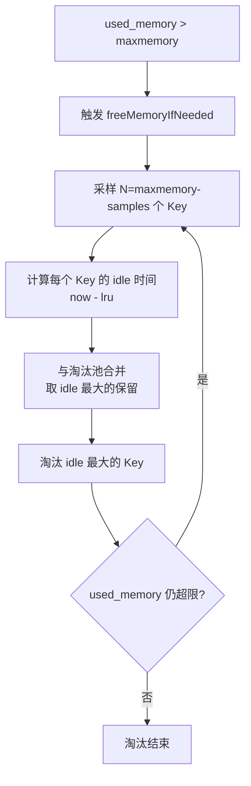
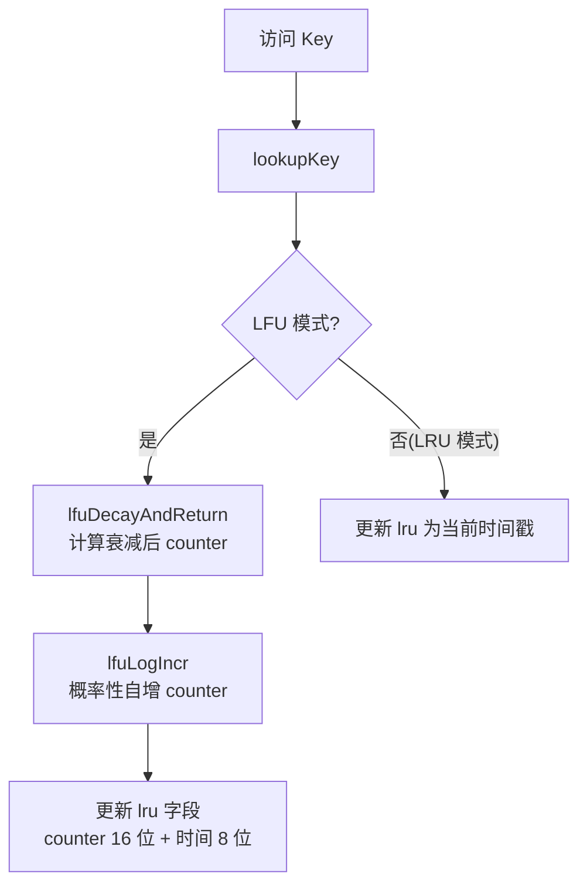
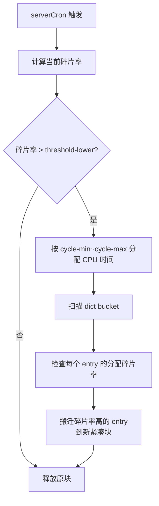
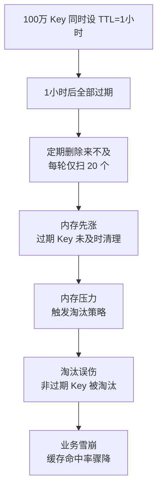

# 内存管理与淘汰策略

> **一句话定位**：内存是 Redis 的核心资源，"过期 Key 怎么删、内存满了怎么办"是中高级面试分水岭，能讲到 LRU 近似采样与 LFU 对数衰减才算合格。
> **面试热度**：⭐⭐⭐⭐⭐
> **返回**：[Redis 知识图谱](../README.md)

---

## 一、概念定义

### 1.1 Redis 内存管理本质

Redis 是**内存数据库**——所有数据常驻内存，命令执行直接操作内存，这是它极高的 QPS（单机 10 万+/秒）的根本来源。但内存是**有限且昂贵**的资源：一台 32GB 物理机的内存被 Redis 进程、操作系统、fork 子进程页表、AOF 缓冲共享，Redis 能用的远少于物理内存。所以 Redis 的内存管理不是"想用多少用多少"，而是"在有限内存里装下最多有价值的数据"——这就是 `maxmemory` 与淘汰策略设计的核心动机。

**与 MySQL 的本质区别**：MySQL 是**磁盘数据库**，数据在磁盘的表空间文件里，内存里的 Buffer Pool 只是缓存。MySQL 的表可以远大于物理内存（100GB 表跑在 32GB 内存的机器上很常见），磁盘是"无限"的扩展空间。Redis 没有这个后盾——`maxmemory` 是硬上限，超了就触发淘汰或拒绝写入，没有"溢出到磁盘"的选项（Redis on Flash 等方案不在讨论范围）。这个差异决定了 Redis 必须有**淘汰策略**，而 MySQL 不需要——MySQL 的"淘汰"是 Buffer Pool 的 LRU 把脏页刷回磁盘，数据不丢；Redis 的淘汰是直接删除 Key，数据就没了。

**内存的三层消耗**：一个 Redis 实例的物理内存（`used_memory_rss`）不是只有数据本身，而是三层叠加：
1. **数据层**：所有 Key/Value 的 redisObject + 底层数据结构（dict entry、skiplist node、listpack entry 等），这是 `used_memory_dataset`，业务能感知的部分。
2. **overhead 层**：dict 的 bucket 数组、client 输出缓冲区、AOF 缓冲、replication backlog、`serverCron` 临时变量等运行时开销，这是 `used_memory_overhead`。
3. **碎片层**：jemalloc 分配器按 size class 对齐导致的内部碎片，一个 17 字节的 value 实际占 32 字节的 size class，15 字节是碎片。这是 `used_memory_rss - used_memory` 的主要来源之一。

理解这三层，才能理解为什么"业务数据只有 10GB，但 `used_memory_rss` 显示 15GB"——15GB = 10GB（数据）+ 2GB（overhead）+ 3GB（碎片）。

### 1.2 `maxmemory` 与三个核心指标

`maxmemory` 是 Redis 的**硬上限**配置——当 `used_memory`（Redis 逻辑分配的内存）超过 `maxmemory` 时，触发淘汰策略（或 `noeviction` 模式下拒绝写入）。`maxmemory` 不是建议值，是强约束。

`INFO memory` 命令返回的三个核心指标容易混淆，必须区分清楚：

| 指标 | 含义 | 典型值（10GB 数据实例） | 关注点 |
|------|------|----------------------|--------|
| `used_memory` | Redis 视角已分配的内存（含数据 + overhead），即 `je_malloc` 累计分配量 | 12GB | 是否接近 `maxmemory` |
| `used_memory_rss` | 操作系统视角的物理内存（Resident Set Size），含碎片 | 13.5GB | 是否接近物理内存上限 |
| `used_memory_dataset` | 纯数据内存（减去 overhead 后），即 `used_memory - used_memory_overhead` | 10GB | 业务实际数据量 |

**三者的关系**：`used_memory_rss` ≥ `used_memory`（RSS 含碎片，used_memory 不含）；`used_memory` = `used_memory_dataset` + `used_memory_overhead`（数据 + 运行时开销）。监控时关注：
- `used_memory` 接近 `maxmemory` → 淘汰策略即将触发，写入可能失败或数据被淘汰。
- `used_memory_rss` 接近物理内存 → fork 子进程可能 OOM，或触发 OS 的 OOM Killer 杀掉 Redis 进程。
- `used_memory_dataset` 增长但 `used_memory` 不增 → overhead 在涨（如 client 缓冲区堆积），不是业务数据问题。

### 1.3 内存碎片

内存碎片是 Redis 内存管理的高频追问点。碎片的本质是**分配器的 size class 对齐**导致的内部空洞。

**jemalloc 的 size class 机制**：jemalloc 不是按需精确分配，而是按预设的 size class 分配。常见 size class 序列为 8/16/32/48/64/80/96/112/128/160/192/224/256/320/384/... 字节。一个 17 字节的 value（如 SDS 头 + 字符串内容）会分配到 32 字节的 size class，15 字节是碎片。一个 33 字节的 value 分配到 48 字节，15 字节碎片。当 Key 大量删改后，某些 size class 内出现空洞——已分配但未使用的字节，这就是碎片。

**碎片率指标**：`mem_fragmentation_ratio = used_memory_rss / used_memory`。经验值：
- **1.0-1.2**：正常，jemalloc 对小对象碎片率低。
- **1.2-1.5**：轻度碎片，可接受，关注但不需立即处理。
- **1.5-2.0**：中度碎片，建议开启 `activedefrag`。
- **> 2.0**：重度碎片，必须处理——可能是 `LATENCY FRAGMENT` 事件，或 fork 子进程后 COW 页未释放。

> **注意**：`mem_fragmentation_ratio` 高不一定全是碎片。fork 子进程期间，子进程共享父进程的物理页，`used_memory_rss` 会瞬间翻倍（父子各占一份 COW 页），碎片率飙到 2.0+，这是正常现象，子进程退出后恢复。所以监控碎片率要排除 fork 期间。

### 1.4 过期 Key 与淘汰 Key 的区别

这两个概念容易混淆，但本质完全不同：

| 维度 | 过期 Key 删除 | 淘汰 Key 淘汰 |
|------|-------------|-------------|
| 触发条件 | Key 的 TTL 到期 | `used_memory` 超过 `maxmemory` |
| 驱动力 | **时间驱动**（Key 设了 EXPIRE，到期就该删） | **空间驱动**（内存不够了，必须腾地方） |
| 是否与 `maxmemory` 有关 | 无关（即使内存没用满，过期 Key 也会删） | 直接相关（内存没用满时永远不会触发淘汰） |
| 删除对象 | 只删设了 TTL 且到期的 Key | 按 `maxmemory-policy` 选 Key 删（可能是无 TTL 的 Key） |
| 设计目标 | 防止"过期数据常驻内存"（内存泄漏） | 防止"内存超限导致 OOM 或写入失败" |

**理解要点**：过期删除是"该删的删"（时间到了），淘汰是"不该删的也得删"（空间不够了）。一个设了 TTL 且到期的 Key，会被惰性/定期删除清理，这与 `maxmemory` 无关。一个没设 TTL 的 Key，永远不过期，但当 `used_memory > maxmemory` 且淘汰策略是 `allkeys-*` 时，可能被淘汰。两者独立触发，但在 `freeMemoryIfNeeded` 中会先做过期清理（回收过期 Key 释放内存），不够再按策略淘汰。

---

## 二、原理与流程

### 2.1 过期 Key 删除策略

Redis 采用**惰性删除 + 定期删除**的组合策略，两者互补：惰性删除保证"访问到的过期 Key 一定被删"，定期删除保证"未访问的过期 Key 不会无限堆积"。

#### 2.1.1 惰性删除

**触发点**：每次访问 Key 时（`GET`/`SET`/`HGET`/`LRANGE` 等所有读写命令），在 `lookupKey`（`src/db.c`）中调用 `expireIfNeeded` 检查 TTL，过期则删除并返回 nil。

**源码路径**：`src/db.c` 的 `expireIfNeeded` → `lazyFreeExpireAndLazyFree`（异步删除）或 `dbAsyncDelete`/`dbSyncDelete`（同步删除）。

```c
// src/db.c 的 lookupKey（简化）
robj *lookupKey(redisDb *db, robj *key, int flags) {
    expireIfNeeded(db, key);  // 访问时检查 TTL
    // ... 后续查找逻辑
}
```

**优点**：CPU 友好——不主动扫描，只在访问时检查，对主线程的额外开销极小（一次 TTL 比较）。
**缺点**：过期 Key 如果无人访问，永远不会被删除，常驻内存——这就是所谓的"内存泄漏"。例如某个用户登录态 `session:12345` 设了 30 分钟 TTL，但用户 30 分钟前就下线了，之后无人再访问这个 Key，惰性删除永远不触发，这个 Key 会一直占内存。

#### 2.1.2 定期删除

**触发点**：`serverCron` 每 100ms（`hz` 默认 10，即每秒 10 次）触发 `activeExpireCycle`（`src/expire.c`），扫描设置了 TTL 的 Key。

**源码路径**：`src/expire.c` 的 `activeExpireCycle` → 遍历 db 数组 → `activeExpireCycleTryReserve` 抽样。

```c
// src/expire.c 的 activeExpireCycle（简化）
void activeExpireCycle(int type) {
    for (int j = 0; j < dbs_per_call; j++) {
        // 抽样 ACTIVE_EXPIRE_CYCLE_LOOKUPS_PER_LOOP=20 个设置 TTL 的 key
        do {
            num = dictGetRandomKey(db->expires, samples);
            // 检查每个 key 是否过期，过期则删除
            for (i = 0; i < num; i++) {
                if (dictGetSignedIntegerVal(de) < now) dbAsyncDelete(db, key);
            }
            // 如果过期比例 > 25%，继续扫描（自适应）
        } while (expired_per_slot > ACTIVE_EXPIRE_CYCLE_LOOKUPS_PER_LOOP / 4);
    }
}
```

**核心参数**：
- `ACTIVE_EXPIRE_CYCLE_LOOKUPS_PER_LOOP=20`：每轮抽样 20 个设置 TTL 的 Key。
- **自适应扫描**：如果抽样中过期比例 > 25%（`expired / sampled > 0.25`），说明这个 db 的过期 Key 很多，继续扫描下一轮；否则换下一个 db。这样能自适应地集中扫描"过期 Key 多"的 db，避免均匀扫描浪费。
- **时间预算**：`fast` 模式每轮最多 2ms（不阻塞主线程），`slow` 模式最多 25ms。当过期 Key 堆积时，`slow` 模式会多扫几轮，但仍受时间预算约束。

**优点**：解决了惰性删除的"内存泄漏"——即使无人访问，定期扫描也会清理过期 Key。
**缺点**：采样 20 个是随机抽样，如果过期 Key 总量很大（如百万级），一次扫描 20 个杯水车薪，可能来不及清理。极端情况下（批量导入数据设了相同 TTL），定期删除跟不上过期速度，内存会先涨后跌——这就是"大量 Key 同时过期导致内存抖动"的根因。

#### 2.1.3 为什么不用定时删除

定时删除（每个 Key 到期时精确删除）听起来最理想，但实现成本不可接受：

**方案**：为每个设了 TTL 的 Key 注册一个定时器（`timerfd` 或链表节点），到期时触发删除。

**为什么 Redis 不用**：Redis 的 Key 可能数千万，每个 Key 一个定时器意味着千万级定时器。定时器的维护成本：
1. **内存开销**：每个定时器至少 40 字节（`struct timer_node`），千万级定时器消耗 400MB+ 内存。
2. **调度开销**：定时器需要按到期时间排序（最小堆或红黑树），插入/删除是 O(log n)，千万级定时器的插入是 23 次比较——不贵但累积。
3. **触发抖动**：百万级定时器同时到期时，主线程要在一瞬间执行百万次删除，严重阻塞。

相比之下，惰性 + 定期删除的组合是 O(1) 级开销（惰性是访问时 O(1) 检查，定期是抽样 O(20)）。Redis 选择了"近似最优"而非"精确最优"——这是它在单线程模型下的必然选择。

#### 2.1.4 删除的同步与异步

Redis 4.0 引入了**异步删除**（`UNLINK`、`DEL` 在大 Key 时自动异步），解决"删除大 Key 阻塞主线程"的问题：

- **同步删除**（`DEL`、`dbSyncDelete`）：在主线程内释放内存，大 Key（如百万元素 List）删除可能阻塞 100ms+。
- **异步删除**（`UNLINK`、`dbAsyncDelete`）：主线程只从 dict 中摘除引用，内存释放交给 bio 后台线程（`lazyFree`）。主线程开销 O(1)，bio 线程 O(n) 释放。

源码路径：`src/lazyfree.c` 的 `freeObjAsync` → bio 线程的 `bioProcessLazyFreeObjects`。

过期 Key 删除默认走异步（`lazyfree-lazy-expire yes` 7.x 默认），淘汰 Key 默认也走异步（`lazyfree-lazy-eviction yes`）。这保证了定期删除和淘汰不会因大 Key 而阻塞。

### 2.2 8 种淘汰策略详解

当 `used_memory > maxmemory` 时，`freeMemoryIfNeeded`（`src/evict.c`）触发淘汰。淘汰策略由 `maxmemory-policy` 配置，共 8 种：

| 策略 | 作用范围 | 淘汰依据 | 适用场景 |
|------|---------|---------|---------|
| `noeviction` | 无 | 不淘汰，写入直接返回 OOM 错误 | 数据库（Session/计数器等不允许丢失的场景） |
| `allkeys-lru` | 所有 Key | 近似 LRU（最久未访问） | 缓存（访问有时间局部性） |
| `allkeys-lfu` | 所有 Key | LFU（访问次数最少） | 缓存（访问有频率差异，4.0+） |
| `allkeys-random` | 所有 Key | 随机淘汰 | 无明显访问模式、均匀访问 |
| `volatile-lru` | 设了 TTL 的 Key | 近似 LRU | 混合场景（部分数据可丢、部分不可丢） |
| `volatile-lfu` | 设了 TTL 的 Key | LFU | 混合场景（4.0+） |
| `volatile-random` | 设了 TTL 的 Key | 随机淘汰 | 混合场景、无明显访问模式 |
| `volatile-ttl` | 设了 TTL 的 Key | TTL 越短越先淘汰 | 缓存（越快过期的越先删，符合业务预期） |

**命名规则**：`allkeys-*` 从所有 Key 中选（包括无 TTL 的），`volatile-*` 只从设了 TTL 的 Key 中选（`volatile` 指"设了过期时间"的 Key，不是"易失"的意思）。`noeviction` 是特殊策略，不淘汰任何 Key。

**版本演进**：
- 4.0 前只有 6 种（无 LFU）。
- 4.0 引入 `allkeys-lfu` 和 `volatile-lfu`，共 8 种。
- 7.x 默认 `maxmemory-policy noeviction`（用户需显式配置淘汰策略）。

**选型决策树**：
1. 业务允许丢数据（纯缓存）→ `allkeys-lfu`（按频率保留热点，4.0+ 首选）。
2. 业务不允许丢数据（Session/订单）→ `noeviction` + 容量监控 + 报警 + 提前扩容。
3. 部分可丢（如热数据用 `allkeys-*`，冷数据用 `volatile-*`）→ `volatile-lru`/`volatile-lfu`（把可丢的设 TTL，不可丢的不设）。
4. 访问无明显模式 → `allkeys-random`（简单粗暴，无 LRU/LFU 的采样开销）。

### 2.3 LRU 近似实现

Redis 的 LRU 不是教科书式的双向链表 LRU，而是**近似 LRU**——通过采样模拟 LRU 行为。

#### 2.3.1 为什么不用双向链表 LRU

教科书 LRU 用双向链表 + 哈希表：每次访问把 Key 移到链表头部，淘汰时从尾部删。Redis 不用这个方案的原因：

1. **内存开销大**：每个 Key 需要两个额外指针（`prev`/`next`），千万级 Key 消耗 160MB+ 内存（每指针 8 字节）。
2. **维护成本高**：每次访问都要移动节点到头部，链表操作虽 O(1) 但常数大，对单线程的 Redis 是负担。
3. **与现有结构冲突**：Redis 的 dict 已经管理了所有 Key，再维护一个双向链表是双重管理，复杂度高。

#### 2.3.2 近似 LRU 的实现

Redis 在 redisObject 的 `lru` 字段（24 位）记录**最近访问时间戳**（低精度，秒级），淘汰时采样 `maxmemory-samples`（默认 5）个 Key，取 `lru` 最小（最久未访问）的淘汰。

**源码路径**：`src/evict.c` 的 `freeMemoryIfNeeded` → `approximateLRU` → `dictGetRandomKey` 采样。

```c
// src/evict.c 的近似 LRU（简化）
void evictionPoolPopulate(redisDb *db, evictionPoolEntry *pool) {
    // 采样 maxmemory-samples 个 key
    for (int i = 0; i < samples; i++) {
        de = dictGetRandomKey(dict, &keyobj);
        if (de) {
            // 记录到淘汰池（按 lru 排序）
            pool[i].idle = estimateObjectIdleTime(val);
            // 插入 pool 按 idle 降序
        }
    }
    // 从 pool 中取 idle 最大（最久未访问）的淘汰
}
```

**采样数与精度**：
- `maxmemory-samples 1`：随机淘汰，几乎无 LRU 效果。
- `maxmemory-samples 5`（默认）：近似 LRU，命中率接近真实 LRU 的 80%。
- `maxmemory-samples 10`：更接近真实 LRU，但采样开销翻倍。

Redis 5.0 引入了**淘汰池**（eviction pool）优化：每次采样 N 个 Key 后，与上次保留的淘汰池（默认 16 个）合并，取最久未用的淘汰。这样即使 `maxmemory-samples=5`，实际比较的范围是 5 + 16 = 21 个，精度大幅提升，接近 `maxmemory-samples=21` 的效果。

**LRU 采样淘汰流程**：



### 2.4 LFU 实现

LFU（Least Frequently Used）按**访问频率**淘汰，4.0 引入。与 LRU 的区别：LRU 看"最近一次访问时间"，LFU 看"历史访问次数"。LFU 解决了 LRU 的一个典型问题——**扫描污染**：偶尔被扫描到的冷数据，因为"最近访问过"，LRU 会保留它，反而挤掉了真正的热点。

#### 2.4.1 redisObject 的 lru 字段复用

LRU 和 LFU 都复用 redisObject 的 24 位 `lru` 字段，但拆分方式不同：

| 模式 | 24 位拆分 | 含义 |
|------|----------|------|
| LRU | 24 位时间戳 | 最近访问时间（秒级，可表示 194 天） |
| LFU | 16 位频率 counter + 8 位时间衰减 | counter 是对数频率，时间衰减记录上次衰减时间 |

**16 位 counter 的对数计数器**：如果用线性计数，16 位最多记 65535 次，对热点 Key（百万次访问）很快就饱和了——所有热点 counter 都是 65535，无法区分。Redis 用**对数计数器**：

```c
// src/lfu.c 的 lfuLogIncr（简化）
uint8_t lfuLogIncr(uint8_t counter) {
    if (counter == 255) return 255;  // 已饱和
    double r = (double)rand() / RAND_MAX;
    double baseval = counter - LFU_INIT_VAL;  // LFU_INIT_VAL=5
    double p = 1.0 / (baseval * lfu_log_factor + 1.0);  // lfu_log_factor 默认 10
    if (r < p) counter++;  // 概率性自增
    return counter;
}
```

**对数计数器的概率自增**：counter 越大，自增概率越低。`lfu_log_factor` 默认 10 时：
- counter = 0：每次访问都 +1（概率 1.0）。
- counter = 10：每次访问 +1 的概率约 9%。
- counter = 100：每次访问 +1 的概率约 0.1%。
- counter = 255：饱和，不再自增。

这样 counter = 255 对应约 1000 万次访问（`lfu_log_factor=10`），16 位足以区分"访问 1 次的冷数据"和"访问 100 万次的热点"。**对数衰减的精妙**：如果只增不减，一个曾经的"短时热点"（如秒杀商品，1 小时内被访问 10 万次）会永远 counter 很高，即使之后无人访问。所以 LFU 引入**时间衰减**：

```c
// src/lfu.c 的 lfuDecayAndReturn（简化）
uint8_t lfuDecayAndReturn(robj *o) {
    unsigned long ldt = o->lru >> 8;  // 8 位时间衰减字段
    unsigned long now = LFUGetTimeInMinutes();
    unsigned long decay = (now - ldt) / lfu_decay_time;  // lfu_decay_time 默认 1 分钟
    if (decay > 0) {
        counter = (counter > decay) ? counter - decay : 0;
        o->lru = (counter << 8) | (now & 0xFF);  // 更新时间衰减字段
    }
    return counter;
}
```

**衰减逻辑**：每 `lfu-decay-time` 分钟（默认 1 分钟）未访问，counter 减 1。这样"短时热点"如果不持续访问，counter 会缓慢回落，给新热点腾出位置。

#### 2.4.2 LFU 计数与衰减流程



### 2.5 LRU vs LFU 对比

| 维度 | LRU | LFU |
|------|-----|-----|
| 淘汰依据 | 最近访问时间（最久未访问） | 访问频率（访问次数最少） |
| 优势 | 实现简单、符合时间局部性 | 保留真热点、抗扫描污染 |
| 劣势 | 扫描污染——偶尔访问的冷数据挤掉热点 | 访问模式变化时反应慢（需衰减） |
| 适用场景 | 访问有明显时间局部性（如新闻、商品） | 访问有频率差异（如排行榜、热门商品） |
| counter/时间字段 | 24 位时间戳 | 16 位 counter + 8 位衰减时间 |
| Redis 版本 | 1.0 引入 | 4.0 引入 |
| 采样开销 | O(maxmemory-samples) | O(maxmemory-samples) + 衰减计算 |

**LRU 的典型失败场景——"扫描污染"**：

假设缓存有 1000 万 Key，其中 100 个是真热点（counter=200），其余是冷数据。某次运维执行 `SCAN 0 MATCH * COUNT 10000000`（全量扫描），会"访问"到所有 1000 万 Key，每个 Key 的 `lru` 都被更新为当前时间。扫描后：
- LRU 模式：所有 Key 的 `lru` 都是"刚才"，淘汰时随机选一个删（因为 `lru` 几乎相同）——真正的热点可能被淘汰，而冷数据被保留。命中率骤降，需要一段时间才能恢复（热点重新被访问后 `lru` 更新）。
- LFU 模式：扫描一次只让 counter 从 0 涨到 1（概率自增），真热点 counter=200 不受影响。淘汰时 counter=1 的冷数据先被淘汰，真热点安全保留。扫描污染对 LFU 几乎无影响。

**LFU 的典型失败场景——"反应迟钝"**：

某商品一直是热点（counter=200），某天突然下架（无人再访问），新热点出现。由于 LFU 的衰减是"每分钟 counter 减 1"，旧热点的 counter 从 200 降到 0 需要 200 分钟（约 3 小时），这期间旧热点仍被保留，新热点可能被淘汰。相比之下 LRU 的反应更快——旧热点 10 分钟未访问就可能被淘汰（取决于采样池）。

**LFU 衰减参数调优**：
- `lfu-decay-time 1`（默认）：每分钟 counter 减 1，适合访问模式变化快的场景。
- `lfu-decay-time 10`：每 10 分钟 counter 减 1，衰减慢，适合长期热点稳定的场景。
- `lfu-decay-time 0`：不衰减，counter 只增不减——适合访问模式极稳定的场景（如排行榜），但风险是旧热点永远占位。

**LFU 自增参数调优**：
- `lfu-log-factor 10`（默认）：counter 到 255 需约 1000 万次访问。
- `lfu-log-factor 1`：counter 增长更快，到 255 需约 10 万次访问——区分度降低，但反应更快。
- `lfu-log-factor 100`：counter 增长极慢，到 255 需约 1 亿次访问——区分度极高，但冷数据 counter 几乎不涨，容易区分冷热但可能过度淘汰。

**为什么 4.0 后推荐 LFU**：LRU 的典型失败场景——"全表扫描"：某次运维执行 `SCAN` 或 `KEYS`（即使是 `SCAN`）会"访问"到大量冷数据，这些冷数据的 `lru` 被更新为当前时间，LRU 会误以为它们是热点而保留，反而淘汰了真正的热点（因为热点的 `lru` 不如刚扫描的冷数据新）。LFU 的 counter 是对数增长，扫描一次只让 counter 从 0 涨到 1，真正的热点 counter 是 100+，扫描污染对 LFU 几乎无影响。所以 4.0 后纯缓存场景推荐 `allkeys-lfu`。

**LRU/LFU 的切换**：`maxmemory-policy` 配置后立即生效，无需重启。但切换时已有的 `lru` 字段会被重新解释——LRU 存的是时间戳（24 位秒级），LFU 存的是 counter+衰减时间。切换后旧值会被当作新模式的初始值，可能导致短期内淘汰行为异常，建议切换后 `FLUSHDB` 或等待一段时间（旧 Key 被访问后 `lru` 更新为新模式值）。

### 2.6 内存分配器 jemalloc

Redis 默认使用 **jemalloc** 作为内存分配器（编译时选择，不是运行时配置），而非 glibc 的 ptmalloc。

#### 2.6.1 size class 分配

jemalloc 按 size class 分配内存，常见 size class 序列（部分）：

| size class | 适用对象大小范围 | 典型 Redis 用途 |
|-----------|----------------|---------------|
| 8 字节 | 1-8 字节 | 小整数、短字符串 |
| 16 字节 | 9-16 字节 | SDS 头 + 短内容 |
| 32 字节 | 17-32 字节 | 中等字符串 |
| 48 字节 | 33-48 字节 | dict entry |
| 64 字节 | 49-64 字节 | redisObject |
| 80/96/112/128 字节 | 65-128 字节 | 跳表节点、listpack entry |

**碎片的产生**：一个 17 字节的 value 分配到 32 字节 size class，15 字节是碎片。一个 65 字节的 value 分配到 80 字节，15 字节碎片。当大量删改后，某些 size class 内出现空洞——已分配但实际未用满的字节，这是 `used_memory_rss > used_memory` 的主因。

#### 2.6.2 为什么不用 glibc malloc

| 维度 | jemalloc | glibc ptmalloc |
|------|---------|---------------|
| 碎片率 | 1.1-1.3（实测） | 1.5-2.0（实测） |
| 多线程 | 每线程独立 arena，无锁竞争 | 主 arena 有锁，多线程竞争 |
| 大块分配 | 按 size class 精细化 | 粗放，碎片多 |
| Redis 场景适配 | 单线程下碎片率更低 | 单线程下无多线程优势，碎片更高 |

Redis 是单线程（命令执行），glibc ptmalloc 的多线程优势用不上，但 ptmalloc 的碎片率劣势还在。jemalloc 的 size class 更细化，对小对象（Redis 的主要 workload）碎片率更低。所以 Redis 默认 jemalloc，编译时 `MALLOC=jemalloc`。

### 2.7 activedefrag 主动碎片整理

即使 jemalloc 碎片率低，长时间运行后碎片仍可能累积到 1.5+。4.0 前只能靠重启或 `MEMORY PURGE`（调用 `je_purge` 释放空闲页）缓解。4.0+ 引入了 `activedefrag`——在 `serverCron` 中占用少量 CPU，**主动移动数据**整理碎片。

**原理**：activedefrag 扫描分配的内存块，如果某块内碎片率高（已用字节占比低），把存活的数据搬迁到新分配的紧凑块，释放原块。这类似 JVM 的标记-复制 GC，但 Redis 是原地搬迁（数据结构是 dict，搬迁后更新指针即可）。

**前置条件**：activedefrag 依赖 jemalloc 的 `je_mallctl` 接口获取分配信息，编译时必须链接 jemalloc（`MALLOC=jemalloc`）。如果用 glibc malloc 编译的 Redis 不支持 activedefrag（`CONFIG SET activedefrag yes` 会报错）。

**关键配置**：

| 参数 | 默认值 | 含义 |
|------|--------|------|
| `activedefrag` | `no`（7.4 前默认 no，建议显式开 yes） | 是否开启主动碎片整理 |
| `active-defrag-ignore-bytes` | 100MB | 碎片字节数低于此值不触发 |
| `active-defrag-threshold-lower` | 10 | 碎片率（`mem_fragmentation_ratio` 的百分比溢出）低于 10% 不触发 |
| `active-defrag-threshold-upper` | 100 | 碎片率超过 100%（即 2.0）时以最大力度整理 |
| `active-defrag-cycle-min` | 1 | 最小 CPU 占比（%） |
| `active-defrag-cycle-max` | 25 | 最大 CPU 占比（%） |

**源码路径**：`src/defrag.c` 的 `activeDefragCycle` → `defragDictBucket` → 搬迁 dict bucket 内的 entry。

**工作流程**：



**实测效果**：开启 activedefrag 后，碎片率从 1.8 降到 1.2，CPU 额外占用 1-3%，对主线程延迟无明显影响（因为只在 `serverCron` 的 1-25% 时间片内运行）。

**与传统方案的对比**：

| 方案 | 效果 | 代价 | 适用场景 |
|------|------|------|---------|
| `activedefrag` | 碎片率降到 1.1-1.3 | CPU 1-25% | 4.0+ 长期运行实例 |
| `MEMORY PURGE` | 释放空闲页，碎片率降 0.1-0.2 | 一次性阻塞 | 临时缓解 |
| 重启 Redis | 碎片归零 | 实例不可用几分钟 | 极端碎片、版本升级 |
| 不处理 | 碎片持续累积 | 内存浪费 | 短期运行、内存充裕 |

### 2.8 关键源码路径汇总

| 功能 | 源码路径 | 关键函数 |
|------|---------|---------|
| 定期删除 | `src/expire.c` | `activeExpireCycle` |
| 惰性删除触发 | `src/db.c` | `expireIfNeeded`（被 `lookupKey` 调用） |
| 淘汰触发 | `src/evict.c` | `freeMemoryIfNeeded` |
| 近似 LRU | `src/evict.c` | `evictionPoolPopulate` |
| LFU 自增 | `src/lfu.c` | `lfuLogIncr` |
| LFU 衰减 | `src/lfu.c` | `lfuDecayAndReturn` |
| 异步删除 | `src/lazyfree.c` | `freeObjAsync` → bio 线程 |
| 主动碎片整理 | `src/defrag.c` | `activeDefragCycle` |

---

## 三、高频追问

### Q1: Redis 过期 Key 怎么处理？

**答**：Redis 采用**惰性删除 + 定期删除**组合策略。惰性删除在每次访问 Key 时检查 TTL，过期则删除返回 nil，保证"访问到的过期 Key 一定被删"，但未访问的过期 Key 会常驻内存。定期删除由 `serverCron` 每 100ms 触发，抽样 20 个设置 TTL 的 Key 检查过期，过期比例 > 25% 则继续扫描（自适应），解决"未访问过期 Key 内存泄漏"。不用定时删除是因为千万级 Key 的定时器维护成本不可接受。4.0 后大 Key 删除默认异步（bio 线程释放内存），避免阻塞主线程。

**关联**：→ [内存管理与淘汰策略](./03-memory/memory-and-eviction.md)

### Q2: 内存满了怎么办？8 种淘汰策略

**答**：`used_memory > maxmemory` 时触发 `freeMemoryIfNeeded`，按 `maxmemory-policy` 淘汰。8 种策略分两类：`allkeys-*`（所有 Key）和 `volatile-*`（设了 TTL 的 Key）。每种又有 LRU/LFU/random/ttl 四种依据。`noeviction` 不淘汰直接拒绝写入。生产选型：纯缓存用 `allkeys-lfu`（按频率保留热点），数据库用 `noeviction` + 监控，混合场景用 `volatile-lru`/`volatile-lfu`（把可丢的设 TTL）。4.0 引入 LFU 后，纯缓存场景推荐 `allkeys-lfu` 代替 `allkeys-lru`，抗扫描污染。

**关联**：→ [内存管理与淘汰策略](./03-memory/memory-and-eviction.md)

### Q3: LRU 怎么实现的？为什么不用双向链表？

**答**：Redis 用**近似 LRU**——redisObject 的 24 位 `lru` 字段记录最近访问时间戳，淘汰时采样 `maxmemory-samples`（默认 5）个 Key 取最久未访问的淘汰。不用双向链表 LRU 是因为：①内存开销大——每 Key 两个额外指针，千万级 Key 消耗 160MB+；②维护成本高——每次访问移动节点到头部，单线程下常数大；③与 dict 双重管理复杂度高。5.0 引入淘汰池（eviction pool）优化，采样 5 个与池中 16 个合并比较，精度接近 `maxmemory-samples=21`。

**关联**：→ [内存管理与淘汰策略](./03-memory/memory-and-eviction.md)

### Q4: LRU 和 LFU 区别？哪个好？为什么 4.0 后推荐 LFU？

**答**：LRU 按"最近访问时间"淘汰，LFU 按"访问频率"淘汰。LRU 的劣势是**扫描污染**——全表扫描会更新冷数据的 `lru`，误保留冷数据而淘汰真热点。LFU 的对数 counter 只随高频访问增长，扫描一次只让 counter 涨 1，真热点 counter 是 100+，扫描污染几乎无影响。所以 4.0 后纯缓存场景推荐 `allkeys-lfu`。但 LFU 也不是万能——访问模式有明显时间局部性（如新闻、限时活动）时，LRU 反应更快；LFU 的 counter 衰减慢，对新热点反应迟钝。按业务访问模式选。

**关联**：→ [内存管理与淘汰策略](./03-memory/memory-and-eviction.md)

### Q5: 怎么查内存碎片？怎么清理？

**答**：查碎片用 `INFO memory`，关注 `mem_fragmentation_ratio = used_memory_rss / used_memory`。1.0-1.2 正常，1.5+ 需关注，2.0+ 必须处理。清理方案：①4.0+ 开启 `activedefrag yes`，`serverCron` 中主动搬迁数据整理碎片，CPU 占用 1-25% 可控；②4.0 前 `MEMORY PURGE` 调用 `je_purge` 释放空闲页（效果有限）；③重启 Redis 重新加载所有数据，碎片归零（但影响可用性）。注意排除 fork 子进程期间的"伪碎片"——子进程 COW 页让 RSS 翻倍，子进程退出后恢复。

**关联**：→ [内存管理与淘汰策略](./03-memory/memory-and-eviction.md)

### Q6: 为什么 used_memory_rss 比 used_memory 大？

**答**：三个原因叠加：①**内存碎片**——jemalloc 按 size class 分配，17 字节占 32 字节 size class，15 字节是碎片，体现在 RSS 但不在 `used_memory`；②**共享对象池**——0-9999 整数对象共享，RSS 含共享池但 `used_memory` 只算一次；③**fork 子进程**——bgsave/AOF 重写子进程 COW 复制页，RSS 翻倍但 `used_memory` 不含子进程内存。正常碎片率 1.1-1.3，fork 期间可飙到 2.0+，子进程退出后恢复。如果长期 > 2.0 且无 fork，考虑开启 `activedefrag`。

**关联**：→ [内存管理与淘汰策略](./03-memory/memory-and-eviction.md)

---

## 四、实战关联（Java 后端视角）

### 4.1 生产 maxmemory 配置建议

`maxmemory` 应设为物理内存的 **60-70%**，留余量给：
- **fork 子进程页表**：10GB 实例的页表约 20MB，50GB 实例约 100MB——看似不大，但 COW 期间 RSS 会翻倍，留 30% 余量防 OOM。
- **系统开销**：操作系统、其他进程（如 Prometheus exporter）约占 10-20%。
- **AOF 缓冲**：AOF 重写期间 `aof_rewrite_buf` 增量缓冲可能占用数百 MB。

**配置示例**（32GB 物理机）：
```
maxmemory 20gb
maxmemory-policy allkeys-lfu
maxmemory-samples 10
```

### 4.2 碎片整理配置

```
activedefrag yes
active-defrag-cycle-min 1
active-defrag-cycle-max 25
active-defrag-threshold-lower 10
active-defrag-ignore-bytes 100mb
```

### 4.3 不同业务场景的淘汰策略选择

| 业务场景 | 策略 | 理由 |
|---------|------|------|
| 纯缓存（商品详情、热点数据） | `allkeys-lfu` | 允许丢、按频率保留热点 |
| Session 存储 | `noeviction` | 不允许丢，靠监控+扩容 |
| 计数器/限流器 | `noeviction` | 不允许丢，数据有状态 |
| 延迟队列（ZSet） | `noeviction` | 消息不能丢 |
| 临时验证码（有 TTL） | `volatile-lru` | 可丢的设 TTL，按 LRU 淘汰 |
| 混合（热点+冷数据） | `allkeys-lfu` | 整体按频率保留热点 |

### 4.4 关联 java-core/jvm

| Redis 知识点 | 关联 Java 模块 | 对照要点 |
|-------------|---------------|---------|
| refcount 引用计数 | `java-core/jvm` | Redis 引用计数 vs JVM GC 可达性分析——Redis 手动管理引用计数，JVM 自动 GC |
| jemalloc | `java-core/jvm` | Redis jemalloc vs JVM 堆外内存 DirectByteBuffer——两者都用 native 内存，但管理方式不同 |
| 单线程模型 | `java-core/jvm` | Redis 单线程无 GC 暂停 vs JVM 多线程+GC Stop-the-World——Redis 的"停顿"来自 fork/大 Key 删除 |
| 淘汰策略 | `java-core/jvm` | Redis `allkeys-lfu` vs JVM 软引用 `SoftReference`——都是"内存不够时释放"，但 Redis 是显式策略，JVM 是 GC 自动 |

### 4.5 Spring Boot 中的 Redis 监控集成

Spring Boot Actuator + Micrometer 可将 Redis 内存指标暴露到 Prometheus：

```java
@Bean
public RedisMetricsBinder redisMetricsBinder(RedisConnectionFactory factory) {
    return new RedisMetricsBinder(factory);
}

// 自定义指标：碎片率、淘汰速率、过期速率
@EventListener
public void onRedisInfo(RedisInfoEvent event) {
    Properties info = event.getInfo();
    double fragRatio = parseDouble(info, "mem_fragmentation_ratio");
    if (fragRatio > 1.5) {
        alertManager.warn("Redis 碎片率超阈值: " + fragRatio);
    }
}
```

**关键告警阈值**（生产实践）：
- `mem_fragmentation_ratio > 1.5` → 告警，检查是否需开 `activedefrag`
- `used_memory / maxmemory > 0.8` → 告警，即将触发淘汰或拒绝写入
- `evicted_keys` 增长率 > 100/s → 告警，淘汰过快可能影响命中率
- `keyspace_misses / (keyspace_hits + keyspace_misses) > 0.3` → 告警，命中率低于 70%

---

## 五、系统设计案例

### 案例 1：设计一个 100GB 缓存集群的内存规划

**场景**：电商商品缓存，1000 万 SKU，每条平均 10KB，总数据量 100GB。QPS 峰值 50 万，读写比 10:1。需要高可用、允许丢失、成本可控。

**3 分钟标准答法**：

1. **容量规划**：100GB 数据不能放单机（fork 阻塞 + OOM 风险），用 Cluster 分片。选 5 节点 × 32GB 物理机，每节点 `maxmemory 20GB`，5 × 20 = 100GB 正好。留 12GB/节点 给系统+fork+COW。
2. **淘汰策略**：纯缓存允许丢，用 `allkeys-lfu`——按频率保留热点商品，冷门商品被淘汰时回源 DB。
3. **碎片整理**：`activedefrag yes`，碎片率 > 1.5 时自动整理。
4. **监控**：Prometheus + redis_exporter 监控 `used_memory_rss`/`mem_fragmentation_ratio`/`evicted_keys`/`keyspace_hits`。
5. **高可用**：每主 1 从，Cluster 自动故障转移。

**追问链**：

| 追问 | 答案 |
|------|------|
| 1. 为什么不全部用 64GB 物理机（3 节点）？ | 单节点 40GB 数据，fork 阻塞约 800ms（40GB × 20ms/GB），主线程冻结明显。5 节点每节点 20GB，fork 约 400ms，更可控。 |
| 2. 为什么用 `allkeys-lfu` 而非 `allkeys-lru`？ | 商品访问有明显频率差异（爆款 vs 长尾），LFU 按频率保留爆款。LRU 可能被"限时活动扫描"污染。 |
| 3. 碎片率为什么会高？ | 频繁删改（商品上下架、价格更新）导致 jemalloc size class 内空洞。10KB 商品分配到 16KB size class，6KB 碎片/条。 |
| 4. 缓存命中率怎么保障？ | 预热（发布时批量 `SET`）+ 分级缓存（本地 Caffeine 兜底）+ 回源限流（DB 单查询限流防击穿）。 |
| 5. 数据继续增长怎么办？ | Cluster 扩容到 7-8 节点，`CLUSTER SETSLOT` 槽位迁移，在线扩容不停服。 |

### 案例 2：大量 Key 同时过期导致的问题

**场景**：某次促销活动批量导入 100 万个限时优惠券 Key，设了 `EXPIRE` 1 小时。1 小时后，这些 Key 同时过期，期间 Redis 内存先涨后跌，QPS 骤降，业务出现卡顿。

**问题分析**：



**根因**：定期删除每轮抽样 20 个，100 万过期 Key 要 50000 轮才能扫完，而 `serverCron` 每 100ms 才触发一轮，理论上要 5000 秒（约 83 分钟）才能清理完。期间过期 Key 仍占内存，可能触发淘汰策略，误伤非过期 Key。

**解法**：

1. **随机过期时间打散**：导入时设 `EXPIRE key 3600 + random(0, 300)`，让过期时间分散在 1 小时到 1 小时 5 分之间，5 分钟内分批过期，定期删除来得及。

```bash
# 批量导入时设随机 TTL
for key in keys:
    ttl = 3600 + random(0, 300)  # 1 小时 + 0-5 分钟随机
    redis_client.expire(key, ttl)
```

2. **峰值限流**：如果已有同时过期，`CONFIG SET active-expire-effort 20`（7.x，提高定期删除力度，但增加 CPU 占用）。

3. **监控告警**：监控 `expired_keys`（`INFO stats`）的瞬时增长率，突增时预警。

**追问链**：

| 追问 | 答案 |
|------|------|
| 1. 为什么会同时过期？ | 批量导入数据时用了相同的 TTL（如 `EXPIRE key 3600`），未加随机偏移。 |
| 2. 定期删除为什么来不及？ | 每轮抽样 20 个，100 万 Key 要 50000 轮，`serverCron` 每 100ms 一轮，需 5000 秒。 |
| 3. 内存为什么会先涨？ | 过期 Key 未被清理前仍占内存，`used_memory` 不降。 |
| 4. 为什么会业务雪崩？ | 内存压力触发淘汰，误伤非过期 Key，缓存命中率骤降，请求回源 DB 压垮 DB。 |
| 5. 随机过期时间的原理？ | 把"同一时刻过期"打散到"一段时间内分批过期"，让定期删除来得及逐批清理。 |

**核心教训**：**批量导入数据时必须设随机 TTL**，避免"同时过期"的雪崩风险。这是 Redis 运维的基本规范。

---

> **延伸阅读**：
> - [数据结构与对象编码](../01-data-structure/data-structure-and-encoding.md) —— redisObject 的 refcount 与 lru 字段、共享对象池与淘汰策略的关联
> - [持久化机制](../02-persistence/persistence-mechanism.md) —— fork 子进程对 `used_memory_rss` 的瞬时影响、COW 与内存规划
> - [事件与并发模型](../04-event/event-and-concurrency.md) —— `serverCron` 中的定期删除与碎片整理调度
