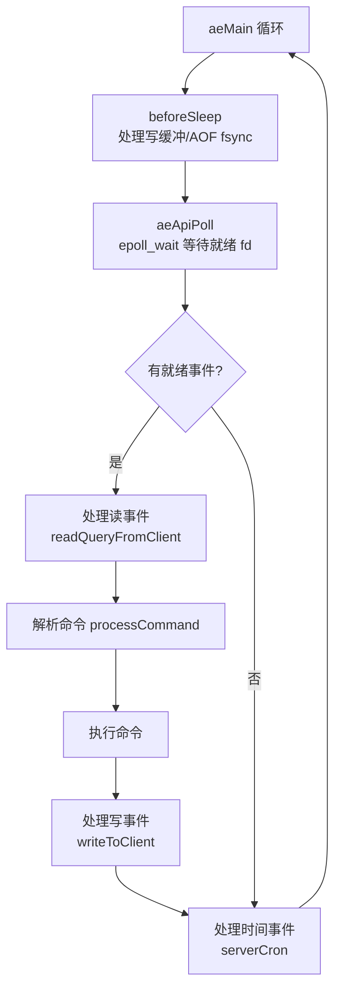
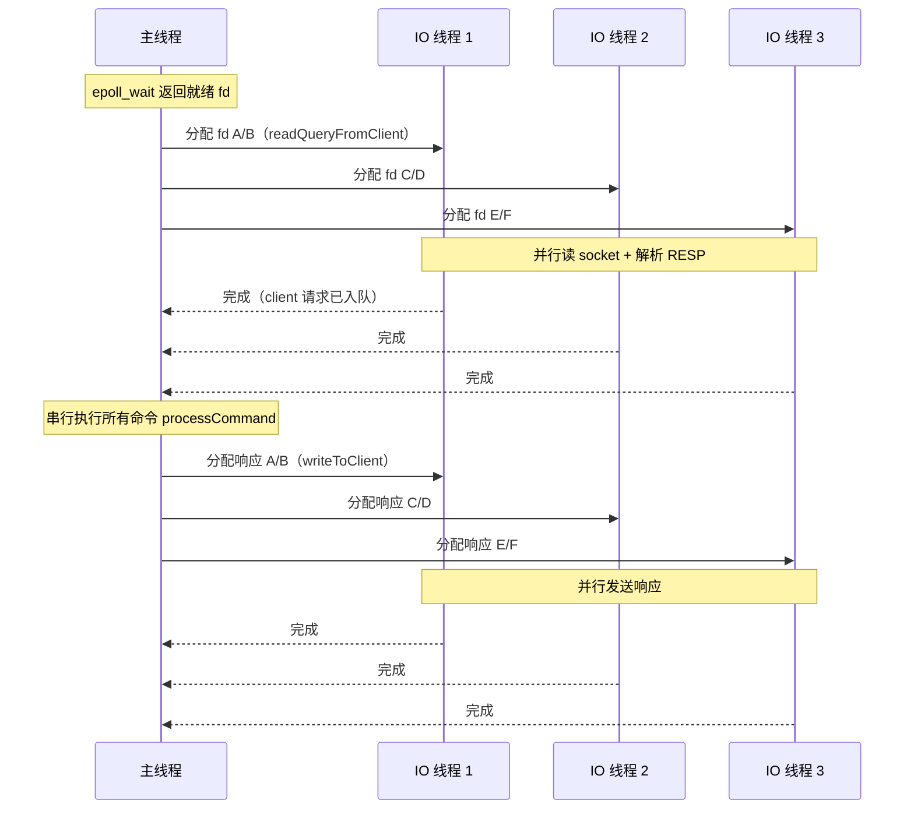
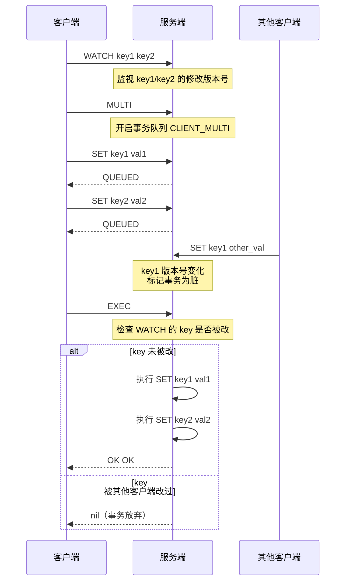

# 事件与并发模型

> **一句话定位**：单线程模型是 Redis 最具辨识度的特征，"为什么单线程还这么快"是面试必问，能讲到 IO 多线程与命令串行的边界才算合格。
> **面试热度**：⭐⭐⭐⭐⭐
> **返回**：[Redis 知识图谱](../README.md)

---

## 一、概念定义

### 1.1 Redis 单线程的含义

"Redis 是单线程"这句话是**简化表述**，严格说不够准确。Redis 的"单线程"指的是**命令执行单线程**——所有客户端命令（`GET`/`SET`/`LPUSH`/`ZADD` 等）在主线程（main thread）中串行执行，`processCommand` 是唯一的命令执行入口，一个命令执行完才执行下一个。但 Redis 进程并非只有一个线程，实际上有三类线程并存：

| 线程类型 | 数量 | 职责 | 版本 |
|---------|------|------|------|
| 主线程（main thread） | 1 | 命令执行 + 事件循环 + 事件分发 | 1.0+ |
| bio 后台线程（background IO） | 3 | `fsync` AOF、关闭文件、`lazyfree` 异步删除 | 4.0+ |
| IO 线程（IO threads） | 0-N（`io-threads` 配置） | 读 socket + 写 socket（命令解析与执行仍主线程） | 6.0+ |

**关键认知**：6.0 引入 IO 多线程后，"Redis 是单线程"的说法仍成立——因为**命令执行**（`processCommand`）仍单线程，只有 **IO 读写**（`readQueryFromClient`/`writeToClient`）并行。这是 Redis 设计的底线：命令执行串行保证了原子性，无需加锁。

**与 MySQL 的对比**：MySQL 是多线程架构（`innodb_thread_concurrency` 控制并发），每个连接一个线程，命令在各线程并行执行，靠锁与 MVCC 保证并发安全。Redis 单线程模型完全不需要锁——所有命令串行执行，天然原子，这是它"快"的根因之一（无锁竞争、无上下文切换）。

### 1.2 为什么单线程

Redis 选择单线程命令执行，是**深思熟虑的架构决策**，不是技术局限。四条核心理由：

1. **避免锁竞争**：Redis 的核心数据结构（dict、skiplist、listpack）都不是线程安全的。如果命令多线程执行，每次操作都要加锁——`INCR` 是读-改-写三步，多线程下需加锁，竞争激烈时锁开销可能超过单线程串行。单线程下所有数据结构无需加锁，操作开销最小。
2. **避免上下文切换**：多线程在 CPU 核间切换有开销（寄存器/缓存刷新）。单线程无调度开销，CPU 缓存命中率高。对小内存操作（Redis 命令多数是 O(1)/O(log n)），上下文切换的相对成本不可忽视。
3. **瓶颈不在 CPU**：Redis 的瓶颈在**内存大小**和**网络带宽**，不在 CPU。单线程内存操作的吞吐已达 10 万+ QPS，多数业务用不满。多线程提升的是 CPU 利用率，但 CPU 不是瓶颈，提升无用。
4. **单线程内存操作极快**：Redis 命令多数是内存随机访问（ns 级）或 O(log n) 跳表查找（μs 级），单线程执行极快。只有大 Key 操作（如 `SMEMBERS` 10 万元素）才会让单线程成为瓶颈——这是大 Key 的危害，不是单线程的错。

**单线程的代价**：无法利用多核 CPU（一个 Redis 进程最多用满一个核）。如果单机 QPS 超过 10 万，单线程扛不住，要用 Cluster 分片到多节点。这是"单线程换简单性"的权衡——Redis 选择了简单与一致，放弃了单机多核利用。

### 1.3 Reactor 模型

Redis 的事件循环是**单 Reactor** 模型——一个主线程跑事件循环，所有 IO 多路复用、事件分发、命令执行都在主线程。

**Reactor 三要素**：
1. **IO 多路复用**：epoll（Linux）/ kqueue（Mac）/ select（兼容）监听所有客户端 fd，返回就绪的 fd。
2. **事件分发**：对每个就绪 fd，根据事件类型（读/写）调用对应处理器（`readQueryFromClient`/`writeToClient`）。
3. **事件处理器**：读处理器解析命令并执行（`processCommand`），写处理器发送响应。

**与 Netty 的对比**：Netty 是**主从 Reactor 多线程**——Boss Group 接受连接，Worker Group 处理 IO，业务逻辑可丢到业务线程池。Redis 是**单 Reactor + IO 多线程**——主线程跑事件循环，IO 读写可并行（6.0+），但命令执行仍主线程。Netty 适合长连接 + 重业务逻辑（如 RPC），Redis 适合短命令 + 内存操作。

**Reactor 的三种变体**：

| 变体 | 代表 | 特点 | 适用场景 |
|------|------|------|---------|
| 单 Reactor 单线程 | Redis 1.0-5.x | 一个线程做所有事 | 命令快、连接数适中 |
| 单 Reactor 多线程 | Redis 6.0+ | IO 并行、命令串行 | 网络 IO 成为瓶颈 |
| 主从 Reactor 多线程 | Netty | Boss 接受连接、Worker 处理 IO | 高并发长连接 |

**Redis 不用主从 Reactor 的原因**：Redis 的命令执行极快（内存操作 ns/μs 级），单线程已能处理 10 万+ QPS。主从 Reactor 的优势在"接受连接"与"处理 IO"分离，适合连接数极多（百万级）且单连接吞吐低的场景（如 IM）。Redis 的连接数通常在数千到数万，单 Reactor 够用，引入主从 Reactor 增加复杂度收益不大。

**`beforeSleep` 钩子**：`aeProcessEvents` 在 `epoll_wait` 前调用 `beforeSleep`，处理写缓冲、AOF fsync、发送客户端响应等。这是 Redis 的"批处理"优化——把多个客户端的响应攒到一起，一次性 `write` 发送，减少系统调用次数。`afterSleep` 在 `epoll_wait` 返回后调用，用于 IO 多线程的唤醒协调。

### 1.4 Pipeline 与事务的区别

这两个概念容易混淆，但本质完全不同：

| 维度 | Pipeline | 事务（MULTI/EXEC） |
|------|---------|-------------------|
| 发起方 | 客户端 | 服务端 |
| 原子性 | 非原子——中间可插入其他客户端命令 | 原子——所有命令一次性执行 |
| 目标 | 节省网络 RTT | 保证命令原子执行 |
| 失败处理 | 每条命令独立失败 | 语法错误整体不入队，运行时错误不回滚 |
| 回滚 | 不支持 | 不支持 |
| 客户端支持 | Jedis `pipelined()` | Jedis `multi()` |
| 性能提升 | 减少 RTT | 无（反而有入队开销） |

**理解要点**：Pipeline 是**网络层优化**——客户端把多个命令打包发送，减少 RTT，但服务端仍是逐条执行，中间可能插入其他客户端命令，非原子。事务是**语义层保证**——`MULTI` 开启队列，命令入队不执行，`EXEC` 一次性执行，保证这批命令期间不插入其他客户端命令，原子。两者可组合：`MULTI` + Pipeline 批量入队 + `EXEC` 执行，既省 RTT 又原子。

**Pipeline 与 Pipeline 的原子性误解**：常见误区是"Pipeline 是原子的"——实际上 Pipeline 只是批量发送，服务端逐条执行，中间可能插入其他客户端的命令。例如客户端 A 用 Pipeline 发 `GET key1` 和 `SET key1 val1`，客户端 B 可能在两条之间插入 `SET key1 other_val`，导致 A 的 `SET` 覆盖 B 的值——如果需要原子性，用 `MULTI`/`EXEC` 或 Lua。

**Pipeline 与事务的性能对比**：Pipeline 的收益是减少 RTT（10 条命令从 10 RTT 降为 1 RTT），事务的收益是原子性（无 RTT 优化，反而有入队开销）。生产中两者常组合使用——`MULTI` + Pipeline 批量入队 + `EXEC`，既省 RTT 又原子。Jedis 的 `Transaction` 类内部就是 `MULTI` + Pipeline 入队 + `EXEC`。

---

## 二、原理与流程

### 2.1 事件循环详解

Redis 的事件循环是核心——所有命令执行、IO 读写、定时任务都在这个循环中。

**循环结构**：`main` → `aeMain` → `aeProcessEvents`（循环体）→ `aeApiPoll`（epoll_wait）→ 处理就绪事件 → 处理时间事件 → 回到 `aeProcessEvents`。

**源码路径**：`src/ae.c` 的 `aeMain` → `aeProcessEvents` → `aeApiPoll`。

```c
// src/ae.c 的 aeMain（简化）
void aeMain(aeEventLoop *eventLoop) {
    while (!eventLoop->stop) {
        aeProcessEvents(eventLoop, AE_ALL_EVENTS|AE_CALL_BEFORE_SLEEP|AE_CALL_AFTER_SLEEP);
    }
}

// aeProcessEvents（简化）
int aeProcessEvents(aeEventLoop *eventLoop, int flags) {
    // 1. 计算最近时间事件的到期时间，作为 epoll_wait 的超时
    if (beforeSleep) beforeSleep(eventLoop);  // 处理写缓冲、AOF fsync 等
    // 2. epoll_wait 等待就绪 fd
    numevents = aeApiPoll(eventLoop, tvp);
    // 3. 处理就绪的读/写事件
    for (j = 0; j < numevents; j++) {
        aeFileEvent *fe = &eventLoop->events[eventLoop->fired[j].fd];
        if (fe->rfileproc) fe->rfileproc(eventLoop, fd, fe->clientData, AE_READABLE);
        if (fe->wfileproc) fe->wfileproc(eventLoop, fd, fe->clientData, AE_WRITABLE);
    }
    // 4. 处理时间事件（serverCron 等）
    aeProcessTimeEvents(eventLoop);
}
```

**为什么用 epoll 不用 select**：

| 维度 | select | epoll |
|------|--------|-------|
| fd 数量限制 | 1024（FD_SETSIZE） | 无限制（受系统 fd 上限） |
| 就绪事件返回 | O(n) 遍历全部 fd | O(1) 返回就绪 fd 列表 |
| 内核实现 | 每次调用全量传 fd，内核遍历 | 红黑树管理 fd，就绪链表返回 |
| 触发模式 | LT（水平触发） | LT 或 ET（边沿触发） |
| Redis 选择 | ❌ 不用 | ✅ 用 LT 模式 |

Redis 用 epoll 的 **LT（Level Triggered）** 模式——只要 fd 可读/可写，`epoll_wait` 就持续返回。不用 ET（Edge Triggered）是因为 ET 需要一次性读完所有数据（否则下次 `epoll_wait` 不再返回），对 Redis 兼容性不好。LT 模式不会漏事件，代码更简单。

**select 的 1024 fd 限制详解**：`select` 用 `fd_set` 位图管理 fd，位图大小由 `FD_SETSIZE` 宏决定，默认 1024。这意味着一个 `select` 最多监听 1024 个 fd，对于 Redis 这种需要处理万级连接的服务不可接受。epoll 用红黑树管理 fd，无数量限制（受系统 `ulimit -n` 控制，默认 1024，生产调到 65535+）。

**LT vs ET 的工程权衡**：
- **LT（水平触发）**：fd 可读时持续通知，直到数据被读完。编程简单，不会漏事件。Redis 用 LT。
- **ET（边沿触发）**：fd 从"不可读"变"可读"时通知一次，之后不再通知，必须一次性读完。编程复杂（需循环 `read` 直到 `EAGAIN`），但减少 `epoll_wait` 的调用次数。Nginx 用 ET。

Redis 选 LT 是因为：①命令执行与 IO 读写分离，LT 模式下每次 `epoll_wait` 返回就绪 fd，逐个处理即可；②ET 模式需要在一次事件中读完所有数据，对 Redis 的"一个客户端一个命令"模型不匹配（一个 fd 可能对应多个待处理命令）。

**事件循环流程**：



### 2.2 IO 多路复用 epoll

**epoll 的三个系统调用**：
1. `epoll_create(size)`：创建 epoll 实例，返回 fd。`size` 是提示值（Linux 2.6.8 后忽略）。
2. `epoll_ctl(epfd, op, fd, event)`：注册/修改/删除 fd。`op` 是 `EPOLL_CTL_ADD`/`EPOLL_CTL_MOD`/`EPOLL_CTL_DEL`。`event` 指定监听的事件（`EPOLLIN` 可读、`EPOLLOUT` 可写）。
3. `epoll_wait(epfd, events, maxevents, timeout)`：阻塞等待就绪 fd，返回就绪 fd 列表。

**内核数据结构**：
- **红黑树**：管理所有注册的 fd，插入/删除/修改 O(log n)。
- **就绪链表**：内核维护的就绪 fd 列表，`epoll_wait` 只拷贝这个列表，O(1) 返回。

**epoll 的工作流程**：
1. `epoll_create` 创建 epoll 实例，内核分配红黑树与就绪链表。
2. `epoll_ctl(ADD)` 注册 fd，内核把 fd 插入红黑树，并注册回调函数。
3. 当 fd 可读/可写时，内核触发回调，把 fd 加入就绪链表。
4. `epoll_wait` 检查就绪链表，非空则拷贝给用户空间，返回就绪 fd 数量；空则阻塞等待。

**与 select/poll 的对比**：

| 维度 | select | poll | epoll |
|------|--------|------|-------|
| fd 数量限制 | 1024 | 无限制 | 无限制 |
| fd 传递方式 | 每次全量传 | 每次全量传 | 注册一次，内核红黑树管理 |
| 就绪检测 | 内核遍历全部 fd O(n) | 内核遍历全部 fd O(n) | 就绪链表 O(1) |
| 用户空间检测 | 遍历全部 fd O(n) | 遍历全部 fd O(n) | 只遍历就绪 fd O(就绪数) |
| 适合场景 | 连接数少 | 连接数中等 | 连接数多（万级） |

**Redis 封装**：Redis 在 `ae_epoll.c` 中封装了 epoll，接口统一为 `aeApiCreate`/`aeApiAddEvent`/`aeApiPoll`，支持 Linux/Mac/其他平台（编译时选 `ae_epoll.c`/`ae_kqueue.c`/`ae_select.c`）。

### 2.3 IO 多线程

6.0 引入 IO 多线程，解决"网络 IO 成为瓶颈"的场景。

**配置**：
```
io-threads 4          # 启用 4 个 IO 线程（含主线程，实际 3 个辅助线程）
io-threads-do-reads yes  # 7.x，读也并行（默认只并行写）
```

**原理**：主线程把就绪的 fd 分发给 IO 线程，IO 线程并行执行 `readQueryFromClient`（读 socket + 解析 RESP 命令）或 `writeToClient`（发送响应）。命令执行（`processCommand`）仍主线程串行。

**源码路径**：`src/networking.c` 的 `handleClientsWithPendingReadsUsingThreads`/`handleClientsWithPendingWritesUsingThreads`。

**为什么不让命令也多线程**：
1. **破坏原子性**：`INCR` 是读-改-写三步，多线程下需加锁，违背单线程初衷。
2. **需要锁**：dict、skiplist 等数据结构加锁开销大，竞争激烈时可能比单线程更慢。
3. **复杂度**：单线程保证所有命令原子，无需考虑并发安全。多线程引入锁与同步，复杂度激增。

**IO 多线程流程**：



**适用场景**：高 QPS + 大 value（如缓存大 JSON、图片 base64），网络 IO 成为瓶颈时开启。纯小 value（如 `GET`/`SET` 小字符串）场景，IO 多线程提升不明显——因为命令执行时间与 IO 时间相当，并行 IO 收益小。

**性能实测**：QPS 10 万 + value 1KB 场景，`io-threads 4` 提升约 30-50%；QPS 5 万 + value 100B 场景，提升约 5-10%。建议 4 核以上机器开启，`io-threads` 不超过 CPU 核数。

**与 Memcached 多线程的对比**：Memcached 早期就是多线程架构（主线程接受连接，Worker 线程处理命令），靠锁保证并发安全。Memcached 的多线程在"纯缓存"场景表现良好（value 小、命令简单，锁竞争轻）。Redis 不走这条路是因为它的数据结构更复杂（dict、skiplist、listpack），加锁开销大；且 Redis 的定位不止是缓存（还有持久化、复制、集群等），单线程模型简化了一致性问题。6.0 的 IO 多线程是"折中方案"——IO 并行但命令串行，既提升网络吞吐又保持原子性。

**IO 多线程的边界**：IO 多线程只解决"网络 IO 瓶颈"，不解决"CPU 瓶颈"。如果 CPU 已满（如大量 Lua 脚本、大 Key 操作），IO 多线程无济于事——因为命令执行仍在主线程串行，CPU 是硬上限。此时应分片到 Cluster 多节点，而非开 IO 多线程。

### 2.4 时间事件 serverCron

`serverCron` 是 Redis 的"心跳"——定期执行后台任务。

**触发频率**：`hz` 参数控制，默认 10（每秒 10 次，即每 100ms）。`dynamic-hz yes`（7.0+）自适应——客户端多时提高频率，减少响应延迟。

**核心职责**：

| 任务 | 职责 | 源码 |
|------|------|------|
| 过期清理 | `activeExpireCycle` 定期删除过期 Key | `src/expire.c` |
| 内存淘汰 | `freeMemoryIfNeeded` 检查 `maxmemory` | `src/evict.c` |
| 统计更新 | 更新 `INFO` 指标（ops/sec、hit rate） | `src/server.c` |
| 集群心跳 | `clusterCron` 发送 Gossip PING | `src/cluster.c` |
| AOF 重写触发 | 检查 AOF 增长率，触发后台重写 | `src/aof.c` |
| RDB 触发 | 检查 `save` 规则，触发 bgsave | `src/rdb.c` |
| 客户端超时 | 关闭超时空闲连接 | `src/networking.c` |
| Sentinel 心跳 | 发送 PING/PONG 监控主从 | `src/sentinel.c` |

**时间事件与文件事件的协调**：`aeProcessEvents` 先处理文件事件（IO），再处理时间事件（`serverCron`）。如果文件事件多，时间事件可能延迟——但 `serverCron` 内部会计算实际耗时，调整下一轮频率。

**`hz` 参数调优**：
- `hz 10`（默认）：每 100ms 执行一次，适合多数场景。
- `hz 100`：每 10ms 执行一次，过期 Key 清理更及时，但 CPU 占用增加。
- `hz 1`：每 1s 执行一次，CPU 占用最低，但过期 Key 清理慢、集群心跳慢。
- `dynamic-hz yes`（7.0+）：根据客户端数量自适应，客户端多时提高频率。

**`serverCron` 的执行时间预算**：每次执行不应超过 1ms（`hz=10` 时）。如果过期 Key 多或淘汰频繁，单次执行可能超时，导致下次 `epoll_wait` 延迟——表现为客户端延迟抖动。监控 `latency_latest`（`INFO latency`）可发现 `serverCron` 延迟。

### 2.5 Pipeline 原理

**客户端流程**：Jedis 的 `pipelined()` 开启 Pipeline 模式，客户端连续发送命令不等待响应，服务端顺序执行后批量返回。

```java
// Jedis Pipeline 示例
Pipeline pipe = jedis.pipelined();
for (int i = 0; i < 1000; i++) {
    pipe.set("key" + i, "val" + i);
}
List<Object> results = pipe.syncAndReturnAll();  // 一次性接收所有响应
```

**节省 RTT**：10 个命令单条发送需 10 RTT（假设单 RTT 1ms，共 10ms），Pipeline 批量发送只需 1 RTT（1ms），节省 9ms。高 RTT 场景（如跨机房 10ms RTT）收益更大。

**非原子**：Pipeline 不加锁不排队，服务端逐条执行，中间可插入其他客户端命令。如果需要原子性（如"先 `GET` 再 `SET`"期间不能有其他客户端改值），用事务或 Lua。

**Lettuce 自动 Pipeline**：Lettuce（Spring Boot 默认 Redis 客户端）默认开启自动 Pipeline——多个并发请求自动批量发送，无需手动 `pipelined()`。这比 Jedis 的手动 Pipeline 更易用。

### 2.6 MULTI/EXEC 事务

**事务流程**：
1. `MULTI`：开启事务，设置 `CLIENT_MULTI` 标志，后续命令入队不执行。
2. 命令入队：`queueMultiCommand` 把命令加入队列，返回 `QUEUED`。
3. `EXEC`：一次性执行所有入队命令，保证原子性（期间不插入其他客户端命令）。
4. `WATCH key`：乐观锁 CAS，`EXEC` 前检查 key 是否被修改，若被改则返回 nil 放弃执行。

**源码路径**：`src/multi.c` 的 `queueMultiCommand`/`execCommand`，`src/db.c` 的 `watchCommand`/`touchWatchedKey`。

**MULTI/EXEC 事务流程**：



**为什么无回滚**：
1. **Redis 命令不支持回滚**：没有 undo log，命令执行后无法撤销。MySQL 有 undo log 记录修改前的值，回滚时恢复。
2. **语法错误在入队时已检查**：`MULTI` 后 `LPUSH string-key 1`（对 string 执行 list 命令）会报错不入队，`EXEC` 时直接返回错误。
3. **运行时错误不回滚**：如对 string 执行 `INCR`（类型不匹配），该命令报错，但其他命令仍执行——不回滚。这是 Redis 的事务设计哲学：**不回滚 = 简单**，程序员应保证命令正确。

**`WATCH` 的乐观锁原理**：`WATCH key` 记录 key 的"修改版本号"（`watched_keys` 字典），任何对该 key 的修改（`SET`/`DEL`/`INCR` 等）都会递增版本号。`EXEC` 前检查所有被 WATCH 的 key 的版本号是否变化，任一变化则放弃事务返回 nil。这是 **CAS（Compare-And-Set）** 乐观锁——不加锁，提交时检查是否被改过。

**`WATCH` 的典型场景**：原子地"读-改-写"——如"取余额 → 判断 → 扣款"，用 `WATCH balance` + `MULTI` + `DECRBY balance amount` + `EXEC`。如果 `EXEC` 返回 nil（其他客户端改过），重试。

**`WATCH` 与 `SELECT` 的限制**：`WATCH` 在 Cluster 中只能监视本节点的 key（跨槽 key 的 `WATCH` 会报错 `CROSSSLOT`）。需要跨槽原子性时用 Lua 脚本（Lua 可跨槽但需 `hashtag` 保证同槽）。

**与 MySQL 事务的差异**：MySQL 事务支持 ACID（Atomicity 原子性、Durability 持久性等），回滚是基本能力。Redis 事务只保证**原子执行**（命令一次性执行，不插入其他客户端命令），不保证**原子性**（失败不回滚）。这是 Redis "简单优先"的设计哲学体现。

### 2.7 Lua 与 Function

**EVAL 原子执行**：`EVAL script numkeys key... arg...` 在主线程执行 Lua 脚本，执行期间不切换（`aeProcessEvents` 不返回），天然原子。适合多步操作的原子性保障（如"先 `GET` 再判断再 `SET`"）。

**为什么 Lua 能原子**：Redis 是单线程，Lua 脚本在主线程执行，执行期间 `aeProcessEvents` 不返回，其他客户端命令无法插入。这是单线程模型的红利——多步操作打包成 Lua 脚本，天然原子，无需加锁。

**Lua 脚本不能阻塞**：如果 Lua 脚本执行太久（如死循环），主线程被阻塞，所有客户端等待。`lua-time-limit` 默认 5s，超时后可用 `SCRIPT KILL` 中止（只对未写操作的脚本有效），或 `SHUTDOWN NOSAVE` 强制重启。

**7.x Function 替代 EVAL**：`EVAL` 每次都要传脚本，客户端缓存与服务端解析有开销。7.0 引入 Function——`FUNCTION LOAD` 预加载脚本，`FCALL` 调用，支持 `FUNCTION LIST`/`FUNCTION DELETE` 管理。Function 比 EVAL 更高效（避免重复传输）且可管理（持久化、版本化）。

**EVAL vs Function 对比**：

| 维度 | EVAL | Function（7.x） |
|------|------|----------------|
| 脚本传输 | 每次调用都传脚本全文 | `FUNCTION LOAD` 一次性加载，`FCALL` 只传函数名 |
| 服务端缓存 | `SCRIPT LOAD` 可缓存但管理不便 | `FUNCTION LIST`/`DELETE` 可管理 |
| 持久化 | 不持久化（重启丢失） | `FUNCTION DUMP`/`RESTORE` 可持久化 |
| 库支持 | 单脚本 | 支持库（library），多个函数共享代码 |
| 适合场景 | 一次性脚本、临时调试 | 长期使用的业务逻辑 |

**Function 示例**：
```bash
# 加载库
FUNCTION LOAD "#!lua name=mylib
redis.register_function('atomic_decr', function(keys, args)
    local stock = redis.call('GET', keys[1])
    if not stock then return -1 end
    stock = tonumber(stock)
    if stock <= 0 then return 0 end
    redis.call('DECR', keys[1])
    return stock - 1
end)"

# 调用
FCALL atomic_decr 1 stock:item:123
```

**源码路径**：`src/scripting.c` 的 `evalCommand`，`src/functions.c` 的 `fcallCommand`。

### 2.8 关键源码路径汇总

| 功能 | 源码路径 | 关键函数 |
|------|---------|---------|
| 事件循环 | `src/ae.c` | `aeMain`/`aeProcessEvents` |
| epoll 封装 | `src/ae_epoll.c` | `aeApiPoll` |
| IO 读写 | `src/networking.c` | `readQueryFromClient`/`writeToClient` |
| IO 多线程 | `src/networking.c` | `handleClientsWithPendingReadsUsingThreads` |
| 命令执行 | `src/server.c` | `processCommand` |
| 时间事件 | `src/server.c` | `serverCron` |
| 事务 | `src/multi.c` | `queueMultiCommand`/`execCommand` |
| Lua 脚本 | `src/scripting.c` | `evalCommand` |
| Function | `src/functions.c` | `fcallCommand` |

---

## 三、高频追问

### Q1: Redis 为什么快？

**答**：四个原因叠加：①**内存操作**——所有数据在内存，读写 ns/μs 级，远快于磁盘；②**单线程无锁**——命令串行执行，数据结构无需加锁，无锁竞争开销；③**epoll 多路复用**——单线程处理万级连接，O(1) 返回就绪事件，无 select 的 O(n) 遍历；④**高效数据结构**——SDS O(1) 取长度、dict 渐进式 rehash、跳表 O(log n) 范围查询、listpack 紧凑内存。单线程不是慢的原因，是"快"的根因之一——避免了锁与上下文切换。

**深入理解"快"的边界**：Redis 的"快"是**单机内存操作**的快，不是"分布式高并发"的快。单机 QPS 10 万已是极限，超过这个量级要靠 Cluster 分片多节点。Redis 的快有边界——大 Key 操作（如 `SMEMBERS` 10 万元素）会让单线程阻塞，所有客户端等待；Lua 脚本过长（超 5s）会触发 `lua-time-limit`。所以"Redis 快"的前提是：①数据在内存；②命令是 O(1)/O(log n)；③无大 Key；④无长 Lua 脚本。违反任一前提，单线程的"快"就会变成"慢"。

**与 Memcached 的性能对比**：Memcached 是多线程，理论上 CPU 利用率更高。但实测小 value 场景 Redis 单线程 QPS 略高（无锁开销 + 数据结构优化），大 value 场景 Memcached 多线程占优（网络 IO 并行）。6.0 引入 IO 多线程后，Redis 大 value 场景的性能劣势已补齐。

**关联**：→ [事件与并发模型](./04-event/event-and-concurrency.md)

### Q2: 单线程怎么处理并发请求？

**答**：epoll 多路复用 + 事件循环。主线程在 `aeMain` 循环中调用 `epoll_wait` 等待就绪 fd，有就绪事件则调用 `readQueryFromClient` 读取并解析命令，`processCommand` 执行命令，`writeToClient` 发送响应。所有客户端命令串行执行，一个执行完才执行下一个。看似"并发"（多个客户端同时连接），实则"串行"（命令逐条执行）。这是 Redis 单线程高并发的核心——epoll 让单线程能处理万级连接，串行执行保证原子性。

**关联**：→ [事件与并发模型](./04-event/event-and-concurrency.md)

### Q3: IO 多线程后还是单线程吗？为什么命令不并行？

**答**：命令执行仍单线程，只有 IO 读写并行。6.0 的 `io-threads` 让 `readQueryFromClient`/`writeToClient` 在 IO 线程并行，但 `processCommand` 仍主线程串行。不让命令并行的原因：①**破坏原子性**——`INCR` 是读-改-写，多线程需加锁；②**需要锁**——dict/skiplist 加锁开销大，竞争激烈时可能比单线程更慢；③**复杂度**——单线程无并发安全问题，多线程引入锁与同步。IO 多线程解决的是"网络 IO 瓶颈"（大 value 场景），不是"CPU 瓶颈"。

**关联**：→ [事件与并发模型](./04-event/event-and-concurrency.md)

### Q4: Pipeline 和事务区别？

**答**：Pipeline 是客户端批量发送（节省 RTT，非原子，中间可插入其他客户端命令），事务是服务端原子执行（`MULTI` 队列 + `EXEC` 一次性执行，保证不插入其他命令）。Pipeline 目标是网络优化，事务目标是语义原子。两者可组合：`MULTI` + Pipeline 批量入队 + `EXEC` 执行，既省 RTT 又原子。注意 Redis 事务无回滚——语法错误不入队，运行时错误不回滚（其他命令仍执行），这是与 MySQL 事务的核心差异。

**关联**：→ [事件与并发模型](./04-event/event-and-concurrency.md)

### Q5: Redis 事务能回滚吗？为什么？

**答**：不能。三个原因：①Redis 命令不支持回滚（无 undo log，执行后无法撤销）；②语法错误在入队时已检查（`MULTI` 后 `LPUSH string-key 1` 报错不入队）；③运行时错误不回滚（如对 string 执行 `INCR` 报错，其他命令仍执行）。这是 Redis "简单优先"的设计哲学——不回滚 = 简单，程序员应保证命令正确。MySQL 有 undo log 支持回滚，但代价是复杂度高、性能开销大。Redis 选择了简单与高性能，放弃了回滚能力。如果需要原子性保证多步操作，用 Lua 脚本（执行期间不切换，天然原子）或 `WATCH` 乐观锁（CAS 检查 key 是否被改）。

**关联**：→ [事件与并发模型](./04-event/event-and-concurrency.md)

### Q6: Lua 脚本为什么能保证原子性？

**答**：因为单线程。Lua 脚本在主线程执行，执行期间 `aeProcessEvents` 不返回，其他客户端命令无法插入——天然原子。这是单线程模型的红利：多步操作（如"先 `GET` 再判断再 `SET`"）打包成 Lua 脚本，无需加锁即原子。但 Lua 脚本不能阻塞——`lua-time-limit` 默认 5s，超时后 `SCRIPT KILL` 中止（仅对未写操作的脚本有效），或 `SHUTDOWN NOSAVE` 强制重启。7.0 引入 Function（`FUNCTION LOAD`/`FCALL`）替代 `EVAL`，预加载脚本更高效且可管理。

**关联**：→ [事件与并发模型](./04-event/event-and-concurrency.md)

---

## 四、实战关联（Java 后端视角）

### 4.1 Lettuce 连接池与 Pipeline

Spring Boot 默认用 Lettuce（基于 Netty），自动开启 Pipeline——多个并发请求自动批量发送，无需手动 `pipelined()`。

```java
// Lettuce 自动 Pipeline（推荐）
@Autowired
RedisTemplate<String, String> redisTemplate;

public void batchSet(Map<String, String> kvMap) {
    // 并发调用 set，Lettuce 自动批量发送
    kvMap.forEach((k, v) -> redisTemplate.opsForValue().set(k, v));
}
```

```java
// Jedis 手动 Pipeline（需管理连接）
try (Jedis jedis = pool.getResource()) {
    Pipeline pipe = jedis.pipelined();
    for (int i = 0; i < 1000; i++) {
        pipe.set("key" + i, "val" + i);
    }
    pipe.sync();  // 一次性接收
}
```

### 4.2 IO 多线程适用场景

| 场景 | 是否开启 IO 多线程 | 理由 |
|------|------------------|------|
| 高 QPS + 大 value（缓存 JSON/图片） | ✅ 开启 `io-threads 4` | 网络 IO 是瓶颈，并行 IO 提升明显 |
| 高 QPS + 小 value（Session/计数器） | ❌ 不开 | CPU 不是瓶颈，命令执行与 IO 时间相当 |
| 低 QPS | ❌ 不开 | 单线程已足够，开 IO 线程浪费 |
| 4 核以下机器 | ❌ 不开 | IO 线程与主线程竞争 CPU |

### 4.3 Lua 脚本实现原子扣库存

```lua
-- atomic_decr.lua
local stock = redis.call('GET', KEYS[1])
if not stock then return -1 end  -- key 不存在
stock = tonumber(stock)
if stock <= 0 then return 0 end  -- 库存不足
redis.call('DECR', KEYS[1])
return stock - 1  -- 返回扣减后剩余库存
```

```java
// Java 调用
Long remain = redisTemplate.execute(
    new DefaultRedisScript<>(atomicDecrScript, Long.class),
    Collections.singletonList("stock:item:123")
);
if (remain == null || remain == -1) {
    throw new BizException("商品不存在");
} else if (remain == 0) {
    throw new BizException("库存不足");
} else {
    // 扣减成功，异步落库
    mqService.send("stock_decr", "item:123");
}
```

### 4.4 限流令牌桶 Lua 脚本

```lua
-- rate_limiter.lua（令牌桶）
local key = KEYS[1]
local rate = tonumber(ARGV[1])  -- 每秒令牌数
local capacity = tonumber(ARGV[2])  -- 桶容量
local now = tonumber(ARGV[3])
local tokens = redis.call('GET', key)
if not tokens then tokens = capacity end
local last_time = redis.call('GET', key..':ts') or now
-- 计算补充令牌
local delta = math.max(0, now - last_time) * rate / 1000
tokens = math.min(capacity, tokens + delta)
if tokens < 1 then return 0 end  -- 限流
redis.call('SET', key, tokens - 1)
redis.call('SET', key..':ts', now)
return 1
```

### 4.5 Spring `@Cacheable` 与 Pipeline 的批量预加载

```java
// 启动时批量预加载热点数据到缓存
@PostConstruct
public void preloadCache() {
    List<String> hotKeys = productRepo.findHotProductIds();
    // 使用 Lettuce 自动 Pipeline 批量加载
    hotKeys.forEach(id -> {
        Product p = productRepo.findById(id);
        redisTemplate.opsForValue().set("product:" + id, p, 1, TimeUnit.HOURS);
    });
}
```

### 4.6 关联 java-core/jvm 与 ops

| Redis 知识点 | 关联模块 | 对照要点 |
|-------------|---------|---------|
| 单线程模型 | `java-core/jvm` | Redis 单线程无 GC 暂停 vs JVM 多线程+GC Stop-the-World |
| Reactor epoll | `ops/linux/04-io/io-model-and-epoll.md` | Redis Reactor 与 epoll、IO 多路复用的底层机制 |
| IO 多线程 | `java-core/lambda` | Netty Reactor 与 Redis 事件循环的对照（epoll 共用） |
| Pipeline 管道 | `java-core/stream` | Pipeline 批量与 Stream 批处理的对比 |
| 内存屏障 | `ops/linux/03-memory/memory-management.md` | 单线程模型与内存屏障、CPU 缓存友好性 |

---

## 五、系统设计案例

### 案例 1：设计一个秒杀库存扣减方案

**场景**：秒杀商品 1000 件，瞬时 QPS 10 万，要求不超卖、不少卖、高可用。

**3 分钟标准答法**：

1. **库存预扣到 Redis**：活动开始前把库存 `SET stock:item:123 1000`，所有扣减操作走 Redis 而非 DB。
2. **Lua 原子扣减**：用 Lua 脚本保证"查库存 + 判断 + 扣减"原子，避免超卖。
3. **异步落库**：扣减成功后发 MQ，消费者异步更新 DB 库存，解耦 Redis 与 DB。
4. **限流降级**：入口限流（令牌桶 Lua），DB 兜底（Redis 宕机时限流 + 直接查 DB）。

**追问链**：

| 追问 | 答案 |
|------|------|
| 1. Redis 宕机怎么办？ | 限流降级（入口令牌桶）+ DB 乐观锁兜底（`UPDATE stock SET stock=stock-1 WHERE id=? AND stock>0`）+ 宕机恢复后从 DB 重建 Redis 库存 |
| 2. 库存超卖怎么办？ | Lua 原子脚本保证 Redis 不超卖 + DB 乐观锁兜底（`WHERE stock>0`）+ 唯一索引防重（`user_id + item_id` 联合唯一） |
| 3. 热点商品怎么办？ | 库存分片 `stock:item:123:1` ~ `stock:item:123:10`，每片 100 件，随机选片扣减，避免单 key 热点 |
| 4. 为什么用 Lua 而非 `DECR`？ | `DECR` 只扣减不判断，扣到负数就是超卖；Lua 把"判断 + 扣减"打包原子，保证不超卖 |
| 5. 异步落库丢消息怎么办？ | MQ 至少一次语义 + 消费者幂等（`user_id + item_id` 联合唯一索引，重复消费时 DB 唯一约束报错跳过） |

### 案例 2：设计一个接口限流器

**场景**：API 接口限流，每秒 100 QPS，超过返回 429。

**追问链（方案演进）**：

1. **计数器 `INCR` + `EXPIRE`**：简单但有临界问题——窗口切换瞬间双倍流量（0.9s 时 100 个 + 1.1s 时 100 个 = 0.2s 内 200 个）。
2. **滑动窗口 ZSet**：`ZADD rate:limit:* member`（score 为时间戳），`ZREMRANGEBYSCORE` 清理过期，`ZCARD` 计数。精确但内存开销大（每个请求一个 ZSet 节点）。
3. **令牌桶 Lua 脚本**：补充令牌 + 消费令牌，允许突发（桶满时一次性消费多个）。Lua 保证原子性 + 减少 RTT（多步操作一次往返）。

**三种方案对比**：

| 方案 | 原子性 | 内存开销 | 精度 | 适用场景 |
|------|--------|---------|------|---------|
| 计数器 `INCR` | 非（需 Lua） | 低（1 个 key） | 低（临界问题） | 简单限流 |
| 滑动窗口 ZSet | 非（需 Lua） | 高（每请求 1 节点） | 高 | 精确限流 |
| 令牌桶 Lua | ✅ 原子 | 低（2 个 key） | 高 | 推荐 |

**为什么用 Lua**：
- **原子性**：补充令牌 + 判断 + 消费令牌多步操作，Lua 保证原子，避免并发时多消费。
- **减少 RTT**：多步操作一次性发送执行，避免多次往返。
- **灵活性**：Lua 可实现复杂逻辑（如不同用户不同限流策略），普通命令难以表达。

**最终方案**：令牌桶 Lua 脚本 + 按用户/IP 维度分 key（`rate:limit:user:123`）+ 兜底（Redis 不可用时放行 + 告警，不能因限流器挂了导致全站不可用）。

**注意事项**：
- **兜底策略**：Redis 宕机时限流器应"放行"（fail-open），不能因限流器挂了导致全站 503。可在客户端加本地计数器兜底。
- **预热**：冷启动时令牌桶为空，第一次请求会失败——可在初始化时 `SET key capacity` 填满令牌。
- **集群一致性**：Cluster 模式下不同节点的令牌桶独立，跨节点限流需用 Redlock 或单独的限流服务。

---

> **延伸阅读**：
> - [数据结构与对象编码](../01-data-structure/data-structure-and-encoding.md) —— SDS/dict/skiplist 等高效数据结构是"快"的根因之一
> - [内存管理与淘汰策略](../03-memory/memory-and-eviction.md) —— `serverCron` 中的定期删除与淘汰调度
> - [复制与集群](../05-replication/replication-and-cluster.md) —— `serverCron` 中的 `clusterCron` Gossip 心跳
