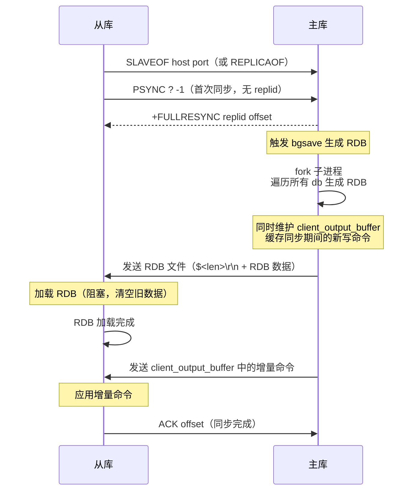
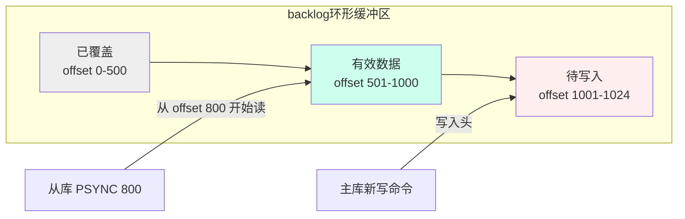
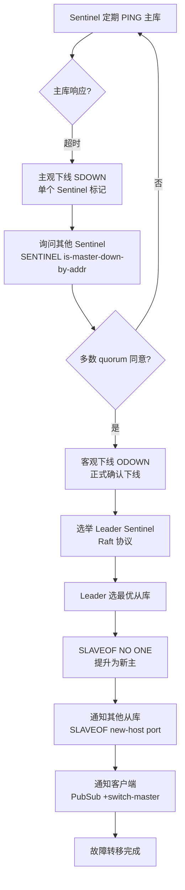
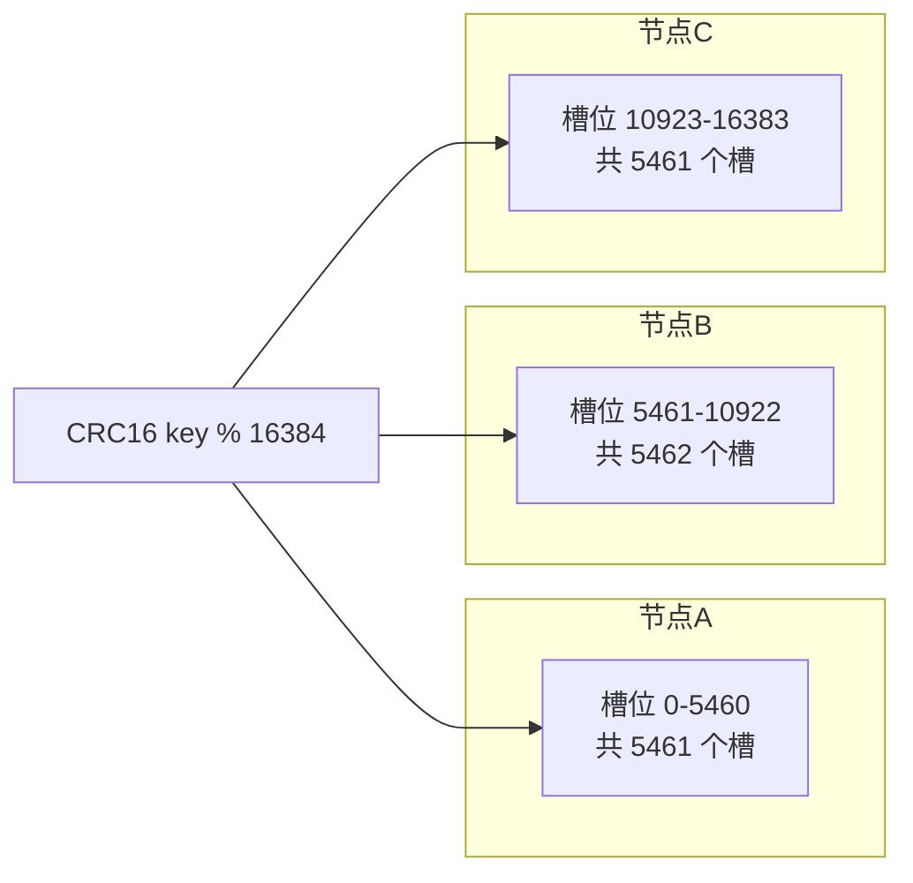
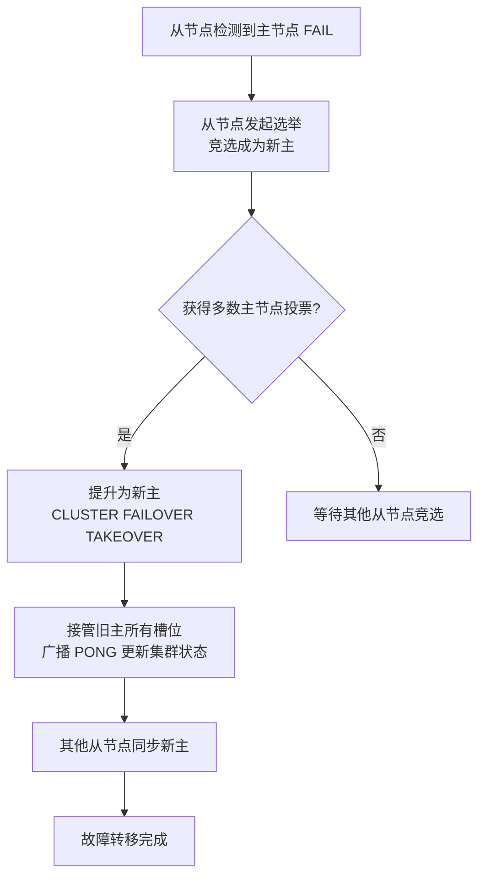
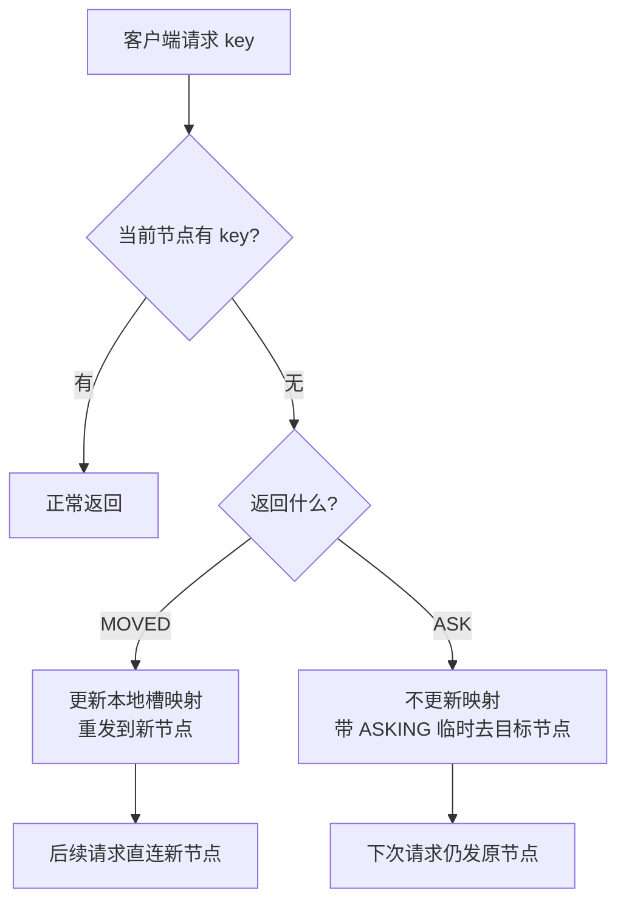
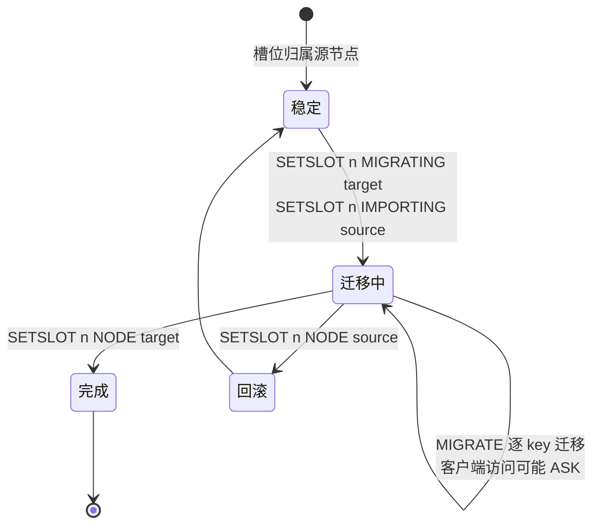

# 复制与集群

> **一句话定位**：复制与集群是 Redis 从单机走向分布式的关键，"主从怎么同步、Cluster 怎么分片"是高级面试分水岭，能讲到 psync2 断点续传与 Gossip 协议才算合格。
> **面试热度**：⭐⭐⭐⭐⭐
> **返回**：[Redis 知识图谱](../README.md)

---

## 一、概念定义

### 1.1 主从复制

主从复制是 Redis 最基础的分布式能力——一个主库（master）的数据复制到一个或多个从库（slave/replica），实现**读写分离**（主写从读）、**数据冗余**（从库备份数据）、**故障恢复基础**（主库宕机从库可提升为主）。

**核心特征**：
- **异步复制**：主库写命令后立即返回客户端，不等从库确认。从库异步接收并应用。这意味着主库宕机时，未同步到从库的最新数据会丢失。
- **单主多从**：一个主库可以有多个从库，但一个从库只能有一个主库（级联复制除外）。
- **读写分离**：主库处理写命令，从库处理读命令，分摊读压力。但写压力无法分摊——所有写都走主库。

**与 MySQL 主从复制的对比**：

| 维度 | Redis 主从 | MySQL 主从 |
|------|-----------|-----------|
| 复制方式 | RDB 全量 + backlog 增量 | binlog 逻辑日志 |
| 同步方式 | 异步（默认） | 异步/半同步/组复制 |
| 数据丢失窗口 | 取决于 backlog 与断线时长 | 取决于 binlog 同步策略 |
| 从库读一致性 | 弱（异步延迟） | 弱（异步延迟） |
| 级联复制 | 支持 | 支持 |

### 1.2 Sentinel 哨兵

Sentinel 是 Redis 的高可用方案——独立进程，不存数据，专门负责**监控**、**自动故障转移**、**配置中心**三大职责。

**三大职责**：
1. **监控**：Sentinel 定期向主库、从库、其他 Sentinel 发送 `PING`，检测存活状态。
2. **自动故障转移**：主库宕机时，Sentinel 自动选一个从库提升为新主，通知其他从库同步新主，通知客户端切换连接。
3. **配置中心**：客户端连接 Sentinel 查询主库地址，主库切换后 Sentinel 通知客户端新地址（通过 PubSub `+switch-master`）。

**部署架构**：通常 3 个 Sentinel 节点（奇数，避免脑裂），与 Redis 主从独立部署。Sentinel 之间互相通信，通过 Raft 协议选举 Leader Sentinel 执行故障转移。

### 1.3 Cluster 集群

Cluster 是 Redis 的分布式分片方案——去中心化，每个节点既存数据又参与集群治理，无中心节点。

**核心特征**：
- **分片**：16384 个槽位均匀分配到各节点，key 通过 `CRC16(key) % 16384` 计算所属槽，由对应节点存储。
- **去中心化**：无中心代理（不像 Twemproxy 需要代理层），客户端直连任意节点，节点间通过 Gossip 协议交换状态。
- **自动故障转移**：节点间通过 Gossip 检测存活，主节点宕机时其从节点自动提升为主。
- **多主多从**：每个主节点有 0-N 个从节点，主节点负责读写，从节点负责备份和故障转移。

### 1.4 三者关系

主从、Sentinel、Cluster 是递进关系：

| 维度 | 主从复制 | Sentinel | Cluster |
|------|---------|----------|---------|
| 数据分片 | 不分片（全量复制） | 不分片（全量复制） | 分片（16384 槽） |
| 故障转移 | 手动（`SLAVEOF NO ONE`） | 自动（Sentinel 选举） | 自动（Gossip + 节点选举） |
| 中心节点 | 无 | Sentinel（独立进程） | 无（去中心化） |
| 适用规模 | 数据量小、读分摊 | 数据量小、高可用 | 数据量大、高并发、高可用 |
| 客户端复杂度 | 低（直连主从） | 中（连 Sentinel 查主） | 高（缓存槽映射、处理 MOVED/ASK） |

**选型决策树**：
1. 数据量 < 单机内存（如 10GB）、只需读写分离 → **主从复制**（手动故障转移）。
2. 数据量 < 单机内存、需要自动故障转移 → **Sentinel + 主从**。
3. 数据量 > 单机内存（如 100GB）、需要分片 → **Cluster**。
4. 数据量极大 + 极高 QPS → **Cluster + 读写分离**（每主多从）。

---

## 二、原理与流程

### 2.1 全量同步流程

全量同步是主从复制的"冷启动"方式——从库首次连接主库，或断线后增量同步不可用时，主库把全部数据通过 RDB 发给从库。

**完整流程**：



**为什么全量同步开销大**：
1. **fork 阻塞**：主库 `bgsave` 需要 fork 子进程，10GB 实例 fork 约 200ms，期间主库不响应命令。
2. **网络传输**：10GB RDB 通过网络传输，千兆网卡约 100 秒，万兆网卡约 10 秒。
3. **从库加载阻塞**：从库加载 RDB 时清空旧数据并逐条加载，10GB RDB 加载约 30-60 秒，期间从库不响应读请求。
4. **主库缓冲开销**：同步期间主库的新写命令缓存在 `client_output_buffer`，如果从库加载慢、缓冲区溢出，会导致同步失败重试。

**触发全量同步的场景**：
- 从库首次连接主库（无 replid 和 offset）。
- 断线重连后 offset 不在 backlog 范围内（backlog 已被覆盖）。
- 主库切换后新主不认识旧 replid（psync2 之前的版本）。

**源码路径**：`src/replication.c` 的 `syncCommand`（处理 PSYNC）/`sendBulkToSlave`（发送 RDB）。

### 2.2 增量同步与 replication backlog

增量同步是全量同步的"热启动"方式——从库断线重连后，如果主库的 replication backlog 中包含从库断开时的 offset，只补发缺失部分，无需全量同步。

**replication backlog 结构**：主库维护一个**环形缓冲区**（`repl_backlog_size` 默认 1MB），所有写命令同时写入 backlog 和所有从库的输出缓冲区。backlog 记录每个字节对应的 offset，从库通过 offset 定位需要补发的起点。

**增量同步流程**：

1. 从库断线重连，发送 `PSYNC replid offset`（replid 是主库的复制 ID，offset 是从库最后同步的位置）。
2. 主库检查：
   - `replid` 匹配（是同一个主库或 psync2 的关联 replid）。
   - `offset` 在 backlog 范围内（`offset >= backlog_start && offset <= backlog_end`）。
3. 主库回复 `+CONTINUE`，从 offset 开始从 backlog 中读取并补发缺失命令。
4. 如果 offset 不在 backlog 范围内（断线太久、backlog 已被覆盖），回退到全量同步。

**backlog 大小调优**：`repl_backlog_size` 默认 1MB，对高写入场景太小——如果从库断线 10 秒，写入速度 10MB/s，backlog 需要 100MB 才能覆盖。生产建议设为 `峰值写入速率 × 最大容忍断线时长`，如 `10MB/s × 60s = 600MB`。

**offset 机制**：主库维护 `master_repl_offset`（全局递增的字节偏移），每写入一条命令到 backlog 就递增。从库维护 `slave_repl_offset`（已同步到的偏移）。主从通过 offset 差值判断同步进度。

**环形缓冲区示意**：



backlog 是环形覆盖——新数据不断写入头，旧数据从尾被覆盖。从库的 offset 必须落在 `[backlog_offset_start, backlog_offset_end]` 区间内才能增量同步，否则回退全量。

**源码路径**：`src/replication.c` 的 `masterReplyBackground`（发送 backlog 增量）/`replicationFeedSlaves`（写入 backlog）。

### 2.3 psync2 断点续传

psync2（4.0+）解决一个关键问题：**主库故障切换后，新主不认识旧主的 replid 和 offset，从库只能全量同步**。psync2 通过"replid 继承"机制实现跨主续传。

**问题场景**（无 psync2 时）：
1. 主库 A（replid=xxx，offset=1000），从库 B 同步到 offset=800。
2. 主库 A 宕机，从库 B 提升为新主（replid=yyy，offset=800）。
3. 从库 C（原同步到 A，offset=600）重连新主 B，发送 `PSYNC xxx 600`。
4. 新主 B 的 replid 是 yyy，不认识 xxx，拒绝增量同步 → 全量同步。

**psync2 的解决方案**：
1. 每个节点维护两个 replid：`replid`（当前主库的复制 ID）和 `replid2`（上一个主库的 replid）。
2. 从库提升为新主时，`replid2 = 旧主的 replid`，`replid` 生成新的。
3. 从库 C 重连新主 B，发送 `PSYNC xxx 600`（xxx 是旧主 replid）。
4. 新主 B 检查 `replid2 == xxx` 且 offset 600 在 backlog 内 → 回复 `+CONTINUE`，增量同步。

**psync2 的限制**：
- 新主的 backlog 必须包含旧主断线时的 offset——如果主库切换后新主的 backlog 太小或 offset 已被覆盖，仍需全量同步。
- 级联复制场景（A→B→C）中，中间节点 B 的 backlog 需要覆盖 C 的 offset。

**psync2 vs 旧版 psync 对比**：

| 维度 | 旧版 psync（4.0 前） | psync2（4.0+） |
|------|---------------------|---------------|
| replid | 单一 `replid` | `replid` + `replid2` 双 ID |
| 主库切换后 | 新主不认识旧 replid → 全量同步 | `replid2` 继承旧主，可增量同步 |
| 断线重连 | 仅同主库可增量 | 跨主库切换后仍可增量（backlog 覆盖时） |
| 适用场景 | 单主稳定场景 | 频繁故障切换的高可用集群 |

**源码路径**：`src/replication.c` 的 `masterTryToResumeReplication`（psync2 匹配逻辑）。

### 2.4 Sentinel 故障转移

Sentinel 故障转移是分阶段流程：检测下线 → 选举 Leader Sentinel → 选新主 → 执行切换 → 通知客户端。

**完整流程**：



**阶段 1：下线检测**
- **主观下线（SDOWN）**：单个 Sentinel 对主库 `PING` 超时（`down-after-milliseconds` 默认 30s），标记为主观下线。可能是网络抖动，不触发故障转移。
- **客观下线（ODOWN）**：Sentinel 询问其他 Sentinel"主库是否下线"，如果多数（≥ `quorum`）同意，标记为客观下线。这是正式确认下线，触发故障转移。

**阶段 2：选举 Leader Sentinel**
- Sentinel 之间通过 **Raft 协议** 选举 Leader——任一 Sentinel 发起选举（term 递增），其他 Sentinel 投票（先到先得，同 term 只投一次），获得多数票的成为 Leader。
- Leader 负责执行故障转移，避免多个 Sentinel 同时切换造成混乱。

**阶段 3：选最优从库**
Leader 按以下优先级选新主：
1. **`slave-priority`**（优先级值，小的优先，0 永不选）。
2. **`slave_repl_offset`**（offset 最大的，数据最全）。
3. **`runid`**（字典序最小的，兜底规则）。

**阶段 4：执行切换**
1. Leader 对选中从库发送 `SLAVEOF NO ONE`，提升为新主。
2. Leader 对其他从库发送 `SLAVEOF new-host port`，让它们同步新主。
3. 旧主恢复后变为从库，同步新主。

**阶段 5：通知客户端**
Sentinel 通过 PubSub 频道 `+switch-master` 发布新主地址，客户端订阅该频道获取通知。客户端也可主动 `SENTINEL get-master-addr-by-name` 查询新主。

**源码路径**：`src/sentinel.c` 的 `sentinelHandleRedisInstance`（监控）/`sentinelStartFailover`（触发故障转移）/`sentinelSelectSlave`（选新主）。

### 2.5 Cluster 槽位设计

Cluster 把所有 key 分散到 16384 个槽位（slot）中，每个节点负责一部分槽位。

**槽位计算**：`slot = CRC16(key) % 16384`。CRC16 是一种校验算法，能把任意 key 均匀映射到 0-16383 范围内。

**3 主节点的槽位分配示例**：



**为什么是 16384 而不是 65536**：

这是 Redis 作者 antirez 的经典回答，三条理由：

1. **心跳包压缩**：Gossip 协议的 PING/PONG 消息携带节点负责的槽位 bitmap。16384 个槽用 bitmap 表示需 `16384/8 = 2KB`；65536 个槽需 `65536/8 = 8KB`。心跳包每秒发送，8KB 太大浪费带宽。
2. **节点数实际不超过 1000**：Redis 官方建议 Cluster 节点数不超过 1000。16384 个槽 / 1000 节点 = 平均 16 槽/节点，足够均匀分配。65536 个槽对 1000 节点来说冗余 4 倍。
3. **bitmap 压缩**：槽位 bitmap 在节点数少时很稀疏（如 3 节点只占 3 段），可以用游程编码压缩。16384 位的 bitmap 压缩后通常只有几十字节，65536 位压缩效果差。

**hashtag 机制**：默认情况下，不同 key 可能分散到不同槽位，无法在同一个事务中操作。`hashtag` 用 `{}` 括起 key 的一部分，CRC16 只计算 `{}` 内的内容：

```
SET user:1001:profile val   # slot = CRC16("user:1001:profile") % 16384
SET user:1001:orders val    # slot = CRC16("user:1001:orders") % 16384 → 可能不同槽

SET {user:1001}:profile val  # slot = CRC16("user:1001") % 16384
SET {user:1001}:orders val   # slot = CRC16("user:1001") % 16384 → 同槽！
```

这样 `{user:1001}:profile` 和 `{user:1001}:orders` 保证在同一节点，可以在事务中操作。

**hashtag 提取规则**（面试易追问）：
- 取 key 中第一个 `{` 到其后第一个 `}` 之间的内容。如果 `{` 后没有 `}` 或 `{}` 之间为空，则用整个 key 计算。
- 示例：`{user:1001}:profile` 取 `user:1001`；`foo{bar}baz` 取 `bar`；`{` 无配对 `}` 则用全 key。
- 限制：只取第一对 `{}`，如 `{{bar}}` 取的是 `{bar`（第一个 `{` 到第一个 `}`）。

**源码路径**：`src/cluster.c` 的 `keyHashSlot`（CRC16 计算槽位）/`clusterUpdateSlots`（槽位分配）。

### 2.6 Gossip 协议

Gossip 是 Cluster 节点间的状态同步协议——每个节点定期向少量随机节点发送 PING，携带自己已知的集群状态，通过"传染病"式传播，最终所有节点状态一致。

**Gossip 消息类型**：
- **PING**：定期发送，携带自己已知的节点子集（约 1/10 集群规模）的状态。
- **PONG**：对 PING 的响应，携带自己的最新状态。
- **MEET**：新节点加入集群时发送，相当于"打招呼"。

**Gossip 工作流程**：
1. 每秒选择 5 个随机节点发送 PING（`clusterCron` 中触发）。
2. PING 消息携带本节点已知的部分节点信息（`clusterNode` 结构，含 `ip/port/flags/slaveof/slots`）。
3. 接收方更新自己的集群状态视图，回复 PONG。
4. 通过"传染病"式传播，最终所有节点状态一致。

**下线检测**：
- **PFAIL（疑似下线）**：节点 A 对节点 B 的 PING 超时（`cluster-node-timeout` 默认 15s），A 标记 B 为 PFAIL。
- **FAIL（确认下线）**：A 通过 Gossip 传播 B 的 PFAIL 状态，如果半数以上主节点都标记 B 为 PFAIL，A 标记 B 为 FAIL，并广播给全集群。
- **从节点提升**：B 的从节点检测到 B 为 FAIL，发起故障转移，提升为主。

**与 Sentinel 的对比**：Sentinel 是独立进程监控主库，Cluster 是节点间互相监控。Sentinel 用 Raft 选举 Leader 执行切换，Cluster 的从节点自行竞选（类似 Raft Candidate）。

**Cluster 故障转移流程**（区别于 Sentinel）：



**Cluster 从节点竞选细节**：
- 从节点检测到主节点 FAIL 后，等待一小段随机时间（避免多个从节点同时竞选）。
- 向所有主节点发送投票请求，获得**多数主节点**（N/2+1）投票的从节点成为新主。
- 每个主节点在一个**配置纪元（epoch）**内只投一票（类似 Raft term）。
- 新主接管旧主的所有槽位，广播 PONG 告知全集群。
- 与 Sentinel 的区别：Cluster 的故障转移由从节点**自行发起**，不需要独立哨兵进程。

**源码路径**：`src/cluster.c` 的 `clusterSendPing`（发送 Gossip）/`clusterProcessPacket`（处理 Gossip 消息）/`clusterFailoverReplaceYourMaster`（从节点提升）。

### 2.7 MOVED 与 ASK 重定向

Cluster 客户端可以直连任意节点。如果 key 不在当前节点负责的槽位，节点返回重定向响应：

**MOVED 重定向**：
```
GET key
(error) MOVED 5474 192.168.1.2:6379
```
含义：key 的槽位 5474 在节点 `192.168.1.2:6379`，客户端应**永久**更新本地槽位映射表，重新发送到目标节点。

**ASK 重定向**：
```
GET key
(error) ASK 5474 192.168.1.2:6379
```
含义：槽位 5474 正在迁移中，key 可能在目标节点，客户端应**临时**发送到目标节点（用 `ASKING` 命令前缀），但**不更新**本地槽位映射表。

**对比**：

| 维度 | MOVED | ASK |
|------|-------|-----|
| 触发时机 | 槽位已永久迁移 | 槽位迁移中（临时） |
| 客户端行为 | 更新本地槽映射，后续请求直连新节点 | 不更新映射，本次临时去目标节点（带 `ASKING`） |
| 后续请求 | 直连新节点 | 仍发原节点，可能再次 ASK |
| 迁移阶段 | 迁移完成后 | 迁移进行中 |

**为什么 ASK 不更新缓存**：迁移未完成时，部分 key 还在源节点、部分已在目标节点。如果客户端缓存了"槽 5474 → 目标节点"，后续请求源节点上的 key 会找不到。所以 ASK 是临时的，每次请求都先问源节点。

**`ASKING` 命令**：发送 ASK 重定向后，客户端必须先发 `ASKING` 命令再发实际命令。`ASKING` 告诉目标节点"这个请求是临时重定向来的，即使槽位还在 IMPORTING 状态也请处理"。如果不发 `ASKING`，目标节点会返回 MOVED（因为槽位还没正式归属它）。

**客户端处理流程对比**：



**面试易混点**：MOVED 是"槽位归属已变更"（永久），ASK 是"槽位迁移中 key 可能暂时在目标节点"（临时）。两者都是 Cluster 客户端必须正确处理的协议，Lettuce/Jedis 等成熟客户端已内置处理逻辑。

### 2.8 槽位迁移流程

槽位迁移是 Cluster 扩缩容的核心操作——把一个槽位从源节点迁移到目标节点。

**完整流程**：

1. **标记迁移状态**：
   - 源节点：`CLUSTER SETSLOT n MIGRATING targetNodeId`
   - 目标节点：`CLUSTER SETSLOT n IMPORTING sourceNodeId`

2. **逐 key 迁移**：
   - 源节点扫描槽位 n 的所有 key：`CLUSTER GETKEYSINSLOT n count`
   - 对每个 key 执行 `MIGRATE targetHost targetPort "" dbid timeout KEYS key1 key2...`
   - `MIGRATE` 是原子操作：把 key 从源节点删除，发送到目标节点，目标节点写入。如果超时，源节点保留 key，重试。

3. **迁移中访问**：
   - 客户端访问源节点的 key：如果 key 还在源节点，正常返回；如果已迁移，返回 ASK 重定向。
   - 客户端访问目标节点的 key（带 `ASKING`）：如果 key 已迁移到目标，正常返回；如果还没迁移，返回 MOVED（指向源节点）。

4. **完成迁移**：
   - 所有 key 迁移完成后，向所有节点发送 `CLUSTER SETSLOT n NODE targetNodeId`，更新槽位归属。

**迁移的注意事项**：
- 大 Key 迁移会阻塞——`MIGRATE` 传输大 Key（如 10MB）期间，源节点和目标节点的主线程都会阻塞。建议迁移前排查大 Key，或用 `MIGRATE ... REPLACE` 批量迁移。
- 迁移期间客户端延迟可能增加——每次 ASK 重定向多一次 RTT。
- 迁移可中断——`CLUSTER SETSLOT n NODE sourceNodeId` 可回滚迁移状态。

**迁移状态流转图**：



**源码路径**：`src/cluster.c` 的 `migrateCommand`（MIGRATE 命令实现）/`clusterUpdateSlots`（槽位更新）。

### 2.9 集群限制

Cluster 模式有一些限制，是面试常问的"坑点"：

| 限制 | 原因 | 解决方案 |
|------|------|---------|
| 不支持跨槽事务 | `MULTI` 中的命令涉及不同槽会报 `CROSSSLOT` 错误 | 用 hashtag `{}` 保证同槽 |
| `MSET`/`MGET` 必须同槽 | 多 key 命令要求所有 key 在同一槽 | `MSET key1:{user} val1 key2:{user} val2` |
| `SELECT` 只能用 db0 | Cluster 不支持多 db | 所有 key 在 db0 |
| `DBSIZE` 只返回本节点 key 数 | Cluster 无全局视图 | 客户端遍历所有节点累加 |
| `FLUSHALL` 只清本节点 | 同上 | 遍历所有节点执行 |
| `KEYS`/`SCAN` 只扫本节点 | 同上 | 遍历所有节点 |
| PubSub 广播到所有节点 | `PUBLISH` 消息广播到全集群，浪费带宽 | 7.0 Sharded PubSub `SPUBLISH`/`SSUBSCRIBE` |

**Sharded PubSub（7.0+）**：传统 `PUBLISH` 把消息广播到所有节点，即使只有少数订阅者。7.0 引入 Sharded PubSub——订阅信息按槽位存储，`SPUBLISH` 只发到订阅者所在节点，不广播全集群。这解决了 PubSub 的带宽浪费问题。

**hashtag 的使用原则**：
- 只在需要跨 key 原子操作时使用（如事务、`MGET`）。
- 不要滥用——所有 `{user:1001}` 的 key 落在同一节点，可能导致数据倾斜（某个用户数据量过大）。
- hashtag 取 `{}` 内的第一个 `{` 到第一个 `}` 之间的内容，如 `{user:1001}:profile` 取 `user:1001`。

### 2.10 关键源码路径汇总

| 功能 | 源码路径 | 关键函数 |
|------|---------|---------|
| 主从同步 | `src/replication.c` | `syncCommand`/`replicationFeedSlaves` |
| 增量同步 | `src/replication.c` | `masterTryToResumeReplication` |
| Gossip | `src/cluster.c` | `clusterSendPing`/`clusterProcessPacket` |
| 槽位计算 | `src/cluster.c` | `keyHashSlot` |
| 槽位迁移 | `src/cluster.c` | `migrateCommand` |
| 故障转移 | `src/cluster.c` | `clusterFailoverReplaceYourMaster` |
| Sentinel | `src/sentinel.c` | `sentinelHandleRedisInstance`/`sentinelStartFailover` |

---

## 三、高频追问

### Q1: 主从同步流程？

**答**：首次同步走全量——从库 `SLAVEOF` 后发 `PSYNC ? -1`，主库 `+FULLRESYNC` 回复 replid 和 offset，`bgsave` 生成 RDB 发给从库，从库加载 RDB 后主库补发同步期间的增量命令。后续走增量——主库维护 replication backlog 环形缓冲区，从库断线重连后发 `PSYNC replid offset`，如果 offset 在 backlog 内则 `+CONTINUE` 增量补发。全量同步开销大（fork + 网络传输 + 加载阻塞，10GB 约 5 分钟），生产应调大 backlog 避免全量。

**关联**：→ [复制与集群](./05-replication/replication-and-cluster.md)

### Q2: 断线重连怎么同步？

**答**：断线重连后从库发 `PSYNC replid offset`。如果 offset 在主库的 replication backlog 范围内，主库回复 `+CONTINUE` 增量补发缺失命令。如果 offset 已被 backlog 覆盖（断线太久），回退全量同步。4.0 引入 psync2——主库故障切换后新主继承旧主的 replid（`replid2`），从库用旧 replid 也能在新主上增量同步，避免切换后全量。backlog 大小应设为 `峰值写入速率 × 最大容忍断线时长`。

**关联**：→ [复制与集群](./05-replication/replication-and-cluster.md)

### Q3: Sentinel 怎么选主？

**答**：分两步——先选 Leader Sentinel，再选新主库。Leader 选举用 Raft 协议：任一 Sentinel 发现主库客观下线后发起选举（term 递增），其他 Sentinel 先到先得投票（同 term 只投一次），获得多数票的成为 Leader。Leader 按优先级选新主：①`slave-priority` 小的优先（0 永不选）；②offset 最大的（数据最全）；③runid 字典序最小的（兜底）。选好后发 `SLAVEOF NO ONE` 提升新主，通知其他从库同步新主，PubSub 通知客户端。

**关联**：→ [复制与集群](./05-replication/replication-and-cluster.md)

### Q4: Cluster 为什么是 16384 个槽？

**答**：三条理由：①**心跳包压缩**——Gossip PING/PONG 携带槽位 bitmap，16384 槽需 2KB，65536 槽需 8KB，心跳包每秒发送，8KB 太大浪费带宽；②**节点数不超过 1000**——16384/1000=16 槽/节点够用，65536 冗余 4 倍；③**bitmap 压缩**——稀疏 bitmap 用游程编码压缩，16384 位压缩效果好。这是 antirez 在 GitHub issue 上的经典回答。

**关联**：→ [复制与集群](./05-replication/replication-and-cluster.md)

### Q5: MOVED 和 ASK 区别？

**答**：MOVED 是永久重定向——槽位已迁移完成，客户端应更新本地槽位映射表，后续请求直连新节点。ASK 是临时重定向——槽位正在迁移中，key 可能在目标节点，客户端临时去目标节点（带 `ASKING` 命令），但不更新本地映射（因为迁移未完成，部分 key 还在源节点）。迁移完成后不再返回 ASK，改为 MOVED。

**关联**：→ [复制与集群](./05-replication/replication-and-cluster.md)

### Q6: Cluster 支持事务吗？

**答**：不支持跨槽事务。`MULTI` 中的命令如果涉及不同槽位，`EXEC` 时报 `CROSSSLOT` 错误。要在一个事务中操作多个 key，必须用 hashtag `{}` 保证它们在同一槽位——如 `SET {user:1001}:profile val1` 和 `SET {user:1001}:orders val2`，CRC16 只计算 `{}` 内的 `user:1001`，两个 key 落在同一节点，可以事务操作。但 hashtag 会导致数据倾斜（某用户数据量过大时全部落一个节点），需谨慎使用。

**关联**：→ [复制与集群](./05-replication/replication-and-cluster.md)

### Q7: hashtag 是什么？

**答**：hashtag 是 Cluster 保证多个 key 落在同一槽位的机制。key 中 `{}` 内的内容被用作 CRC16 计算的输入，`{}` 外的部分不参与。如 `{user:1001}:profile` 和 `{user:1001}:orders` 的槽位都是 `CRC16("user:1001") % 16384`，保证同节点。适用场景：需要跨 key 事务、`MGET`/`MSET` 多 key 操作。注意不要滥用——所有 `{user:1001}` 的 key 落同一节点，可能导致数据倾斜和热点。

**关联**：→ [复制与集群](./05-replication/replication-and-cluster.md)

---

## 四、实战关联（Java 后端视角）

### 4.1 生产部署选型

| 场景 | 方案 | 部署 | 理由 |
|------|------|------|------|
| 数据量 < 10GB，只需读分摊 | 主从复制 | 1 主 2 从 | 简单，手动故障转移 |
| 数据量 < 10GB，需自动高可用 | Sentinel + 主从 | 1 主 2 从 + 3 Sentinel | 自动故障转移 |
| 数据量 10-100GB，需分片 | Cluster | 3 主 3 从 | 分片 + 自动故障转移 |
| 数据量 > 100GB，极高 QPS | Cluster + 读写分离 | 3 主 6 从 | 分片 + 读分摊 |
| 数据量 > 500GB | Cluster + 多数据中心 | 6 主 6 从（双机房） | 容灾 |

### 4.2 主从延迟的对策

主从复制是异步的，从库读到的数据可能滞后于主库。对策：

| 方案 | 实现 | 适用场景 | 代价 |
|------|------|---------|------|
| `WAIT numreplicas timeout` | 等待 N 个从库确认同步 | 强一致读 | 增加 RTT，降低吞吐 |
| `min-replicas-to-write 1` | 至少 1 个从库同步才允许写 | 防止主库孤立写入 | 从库全挂时主库不可写 |
| 读从库 + 容忍延迟 | 业务接受短暂不一致 | 报表、统计 | 读到旧数据 |
| 关键读走主库 | 强一致读走主库 | 账户余额、库存 | 主库读压力 |

```java
// Spring 中读写分离配置
@Bean
public RedisTemplate<String, String> redisTemplate(RedisConnectionFactory factory) {
    RedisTemplate<String, String> template = new RedisTemplate<>();
    template.setConnectionFactory(factory);
    // 写走主库
    template.setEnableTransactionSupport(true);
    return template;
}

// 强一致读走主库
public String readCritical(String key) {
    // 直接读主库（如 Lettuce 的 ReadFrom.MASTER）
    return redisTemplate.opsForValue().get(key);
}

// 弱一致读走从库
public String readNonCritical(String key) {
    // 读从库（如 Lettuce 的 ReadFrom.SLAVE_PREFERRED）
    return slaveRedisTemplate.opsForValue().get(key);
}
```

### 4.3 与 MySQL 主从复制的对比

| 维度 | Redis 主从 | MySQL 主从 |
|------|-----------|-----------|
| 复制方式 | RDB 全量 + backlog 增量 | binlog 逻辑日志 |
| 同步方式 | 异步（默认） | 异步/半同步/组复制 |
| 数据丢失窗口 | 取决于 backlog 与断线时长 | 取决于 binlog 同步策略 |
| 从库读一致性 | 弱（异步延迟） | 弱（异步延迟） |
| 全量同步速度 | 快（RDB 二进制） | 慢（binlog 回放） |
| 增量同步 | backlog 环形缓冲 | relay log |
| 主从切换 | Sentinel/Cluster 自动 | MHA/MGR/Orchestrator |

### 4.4 关联 java-core/framework 与 ops

| Redis 知识点 | 关联模块 | 对照要点 |
|-------------|---------|---------|
| Cluster 槽位分片 | `framework/spring-framework` | Redis Cluster 槽位与 Spring 多数据源 `AbstractRoutingDataSource` 的对照 |
| 主从复制 | `middleware/mysql` | Redis 主从 vs MySQL 主从复制的对比 |
| Cluster 容器化 | `ops/docker` | Redis Cluster 容器编排、Sentinel 容器部署 |
| Gossip 协议 | `ops/linux/06-network/tcp-and-conntrack.md` | Gossip 心跳与 TCP keepalive |

---

## 五、系统设计案例

### 案例 1：设计一个支撑 100GB 数据 + 10 万 QPS 的 Redis 集群

**场景**：电商缓存平台，1000 万 SKU × 平均 10KB = 100GB 数据，峰值 QPS 50 万（读 45 万 + 写 5 万）。

**3 分钟标准答法**：

1. **分片方案**：100GB 数据不能放单机，用 Cluster 分片。选 6 节点 Cluster（3 主 3 从），每主负责约 33GB（`maxmemory 40GB`，物理机 64GB），3 主承担写 QPS 5 万（每主约 1.7 万 QPS，单线程够用）。
2. **读写分离**：读 QPS 45 万，3 主扛不住，每主加 1 从（共 3 主 6 从），读分摊到 6 个节点（每节点约 7.5 万读 QPS）。
3. **淘汰策略**：纯缓存允许丢，`allkeys-lfu` 按频率保留热点。
4. **持久化**：每节点开 `appendonly yes` + `everysec` + 混合持久化，防止宕机丢全量数据。
5. **监控**：Prometheus + redis_exporter，监控 `used_memory_rss`/`evicted_keys`/`master_repl_offset` 差值。

**追问链**：

| 追问 | 答案 |
|------|------|
| 1. 为什么不 3 主 3 从而是 3 主 6 从？ | 读 QPS 45 万，3 主 3 从共 6 个读节点，每节点 7.5 万 QPS 接近单线程上限。加到 3 主 6 从共 9 个读节点，每节点 5 万 QPS 留余量。 |
| 2. 节点宕机怎么办？ | 主节点宕机，从节点自动提升为主（Cluster Gossip 检测 + 故障转移，约 15-30 秒）。期间该节点不可用，客户端重试或走本地缓存兜底。 |
| 3. 扩容怎么做？ | 新增 3 主 3 从（共 12 节点），`CLUSTER SETSLOT` 迁移槽位到新节点，在线扩容不停服。迁移建议低峰期执行，大 Key 迁移会阻塞。 |
| 4. 数据倾斜怎么办？ | 某些热点商品 key 访问量过大导致单节点 CPU 瓶颈。用 hashtag 分片（`stock:{item}:{shard}`）把热点分散到多节点，或本地缓存兜底减少 Redis 访问。 |
| 5. 主从延迟怎么处理？ | 非关键读走从库（容忍延迟），关键读走主库（`ReadFrom.MASTER`）。监控 `master_repl_offset - slave_repl_offset` 差值，超阈值告警。 |

### 案例 2：设计一个高可用缓存集群

**场景**：核心业务缓存，要求 99.99% 可用性，不能因 Redis 故障导致业务不可用。

**追问链（方案演进）**：

1. **Cluster + 自动故障转移**：3 主 3 从 Cluster，主节点宕机自动切换从节点，恢复时间约 15-30 秒。但切换期间该节点不可用，QPS 骤降。
2. **客户端重试 + MOVED 处理**：客户端缓存槽位映射表，遇到 MOVED 自动重试到新节点。Lettuce/Jedis 内置 MOVED 重试，应用层无感知。
3. **本地 Caffeine 兜底**：Redis 不可用时读本地 Caffeine 缓存，返回旧数据而非报错。兜底 TTL 设为 Redis TTL 的 2 倍（如 Redis 1 小时、Caffeine 2 小时），避免本地缓存过早过期。
4. **缓存预热**：新节点加入或故障恢复后，批量预加载热点 key，避免冷启动流量打穿到 DB。
5. **降级策略**：Redis 整体不可用时，降级为"读 DB + 限流"——DB 查询限流防压垮，返回降级值（如默认值、空列表）。

**最终架构**：

```
请求 → 本地 Caffeine（L1）→ Redis Cluster（L2）→ DB（L3）
                ↑                  ↑                ↑
            兜底（旧数据）      主力缓存          数据源
```

**关键原则**：
- **多层兜底**：L1 失败走 L2，L2 失败走 L3，L3 限流降级。
- ** fail-open**：缓存不可用时返回旧数据而非报错（允许短暂不一致，不允许业务不可用）。
- **可观测**：监控每层命中率、延迟、错误率，出问题能快速定位是哪一层。

---

> **延伸阅读**：
> - [持久化机制](../02-persistence/persistence-mechanism.md) —— 全量同步的 RDB 生成与 fork 阻塞、流式 RDB 避免落盘
> - [事件与并发模型](../04-event/event-and-concurrency.md) —— `serverCron` 中的 `clusterCron` Gossip 心跳调度
> - [高可用与运维](../07-ops/ha-and-ops.md) —— 集群监控指标、节点宕机排查、版本升级
