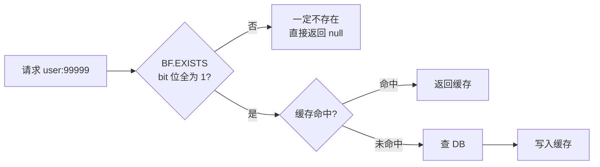
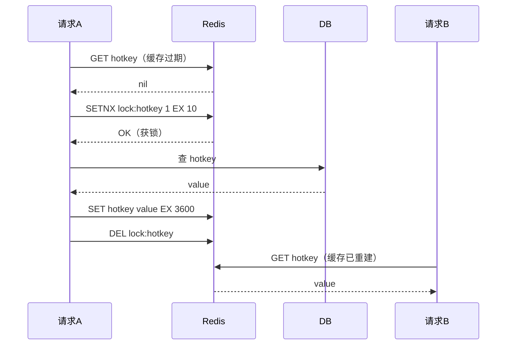
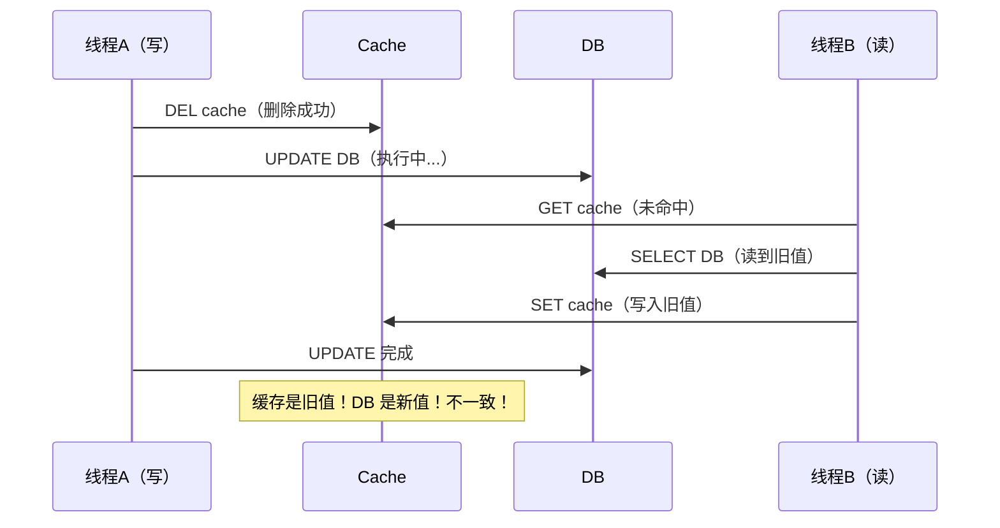
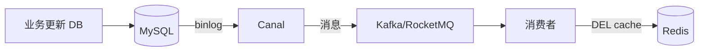
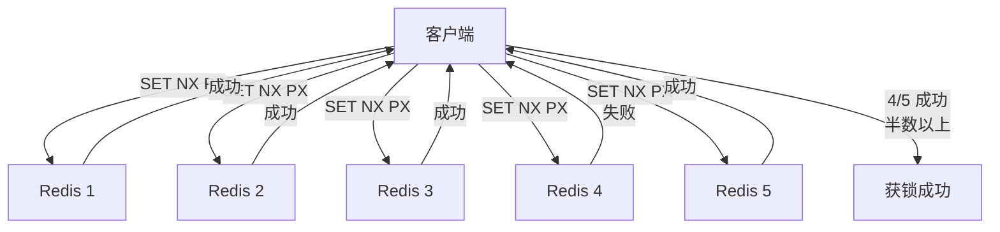
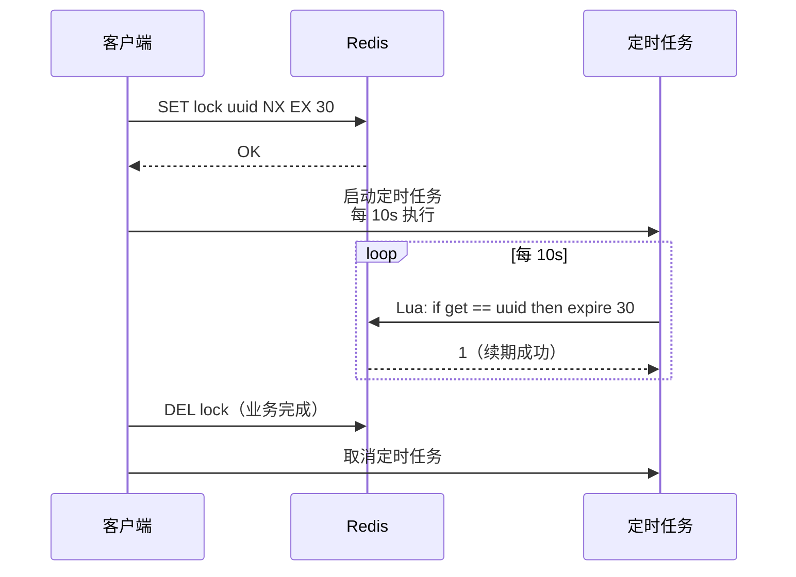
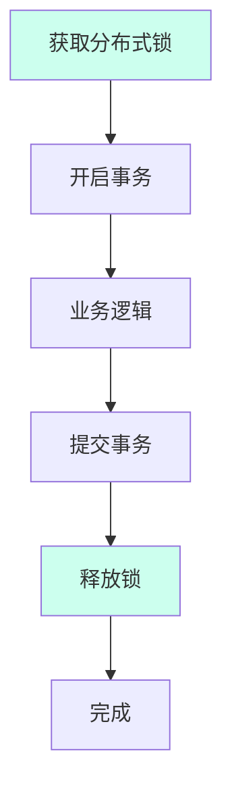

# 缓存实战与分布式锁

> **一句话定位**：缓存实战与分布式锁是 Redis 工程化的核心，"缓存三大问题、缓存一致性、分布式锁"是中高级面试必问，能讲到 Redlock 争议与 Redisson 看门狗才算合格。
> **面试热度**：⭐⭐⭐⭐⭐
> **返回**：[Redis 知识图谱](../README.md)

---

## 一、概念定义

### 1.1 缓存三大问题

Redis 作为缓存是面试最高频场景，"穿透、击穿、雪崩"三连问几乎每场必考。三者都是"缓存未命中导致请求绕过缓存直达 DB"的问题，但触发原因不同。

| 维度 | 缓存穿透 | 缓存击穿 | 缓存雪崩 |
|------|---------|---------|---------|
| 触发原因 | 查询**不存在**的数据 | **热点 Key** 过期瞬间 | **大量 Key** 同时过期或 Redis 宕机 |
| 发生时机 | 攻击或 bug 持续查不存在的 ID | 热点商品缓存过期瞬间 | 批量导入统一 TTL、Redis 整体宕机 |
| 危害 | 每次请求都打 DB，DB 压力大 | 并发请求全打 DB，DB 瞬时压力大 | DB 瞬时压力极大，可能压垮 |
| 解决方案 | 布隆过滤器、空值缓存 | 互斥锁、热点永不过期 | 随机过期、多级缓存、熔断降级 |
| 本质 | 数据根本不存在 | 单 key 过期引发并发 | 多 key 同时过期或缓存整体不可用 |

**记忆口诀**：穿透是"查没有的"（穿过去到 DB）、击穿是"一个洞"（单热点）、雪崩是"一片倒"（大面积）。

### 1.2 缓存一致性

DB 与缓存双写时的数据同步问题——先更新 DB 还是先删缓存？延迟双删还是订阅 binlog？这是工程实践的核心争议点。

**核心矛盾**：
- 缓存与 DB 是两个存储，无法在一个事务内原子更新（除非用 2PC，性能不可接受）。
- 任何顺序都存在短暂的"缓存与 DB 不一致"窗口。
- 目标不是"强一致"而是"最终一致"——在可接受时间内达到一致。

**一致性级别**：
- **强一致**：每次读都拿到最新值。需要 2PC 或串行化，性能代价大，缓存场景几乎不用。
- **最终一致**：短暂不一致，但最终会收敛。缓存场景的常规目标。
- **弱一致**：不保证收敛到最新值。极少用于缓存。

### 1.3 分布式锁

分布式锁是跨进程互斥机制——多个进程/节点需要协调对共享资源的排他访问时，用 Redis 实现锁。

**与 JVM 锁的本质区别**：

| 维度 | JVM 锁（synchronized/Lock） | 分布式锁 |
|------|----------------------------|---------|
| 作用范围 | 单 JVM 进程内 | 跨进程、跨节点 |
| 实现 | JVM 内存（对象头/AQS） | 外部存储（Redis/ZK/ETCD） |
| 性能 | ns 级 | ms 级（网络 RTT） |
| 可靠性 | 进程崩溃即失效 | 依赖外部存储的可用性 |
| 适用场景 | 单实例内的线程互斥 | 微服务、分布式任务调度 |

**分布式锁的必备条件**：
1. **互斥性**：任意时刻只有一个客户端持有锁。
2. **避免死锁**：锁必须有过期时间，持有者宕机后锁能自动释放。
3. **幂等性**：锁持有者不能误删别人的锁（需 value 标识持有者）。
4. **高可用**：锁服务自身不能成为单点。

### 1.4 限流与排行榜

Redis 还常用于限流和排行榜场景，是工程化的高频应用：

- **限流**：用 `INCR` + `EXPIRE` 实现计数器、用 ZSet 实现滑动窗口、用 Lua 实现令牌桶。
- **排行榜**：用 ZSet 的 `ZADD`/`ZREVRANGE`/`ZINCRBY` 实现实时排名。

---

## 二、原理与流程

### 2.1 缓存穿透方案对比

**方案 1：空值缓存**

查询不到的数据也缓存 `null`（短 TTL 如 60s），后续请求命中 `null` 直接返回，不打 DB。

```
GET user:99999 → DB 查不到 → SET user:99999 "" EX 60 → 返回 null
下次 GET user:99999 → 缓存命中 null → 直接返回
```

**优点**：实现简单，对少量不存在的 key 有效。
**缺点**：
- 浪费内存（攻击者换不同 ID 则无效，每个 ID 都要存一个 null）。
- 短 TTL 期间 DB 数据已新增，仍返回 null（短暂不一致）。

**方案 2：布隆过滤器**

`BF.ADD` 添加元素、`BF.EXISTS` 判断存在。原理是多个 hash 函数映射到一个 bit 数组，全为 1 才"可能存在"，有 0 则"一定不存在"。



**误判率公式**：`p ≈ (1 - e^{-kn/m})^k`（k 个 hash 函数，m 个 bit，n 个元素）。典型配置：100 万元素、1% 误判率，需 1.2MB bit 数组 + 7 个 hash 函数。

**为什么布隆过滤器不能删除**：一个 bit 位可能被多个 key 共享（多个 key 的 hash 都映射到同一位），删除一个 key 会把共享位清零，导致其他 key 被误判为"不存在"。

**对比表**：

| 方案 | 实现 | 优点 | 缺点 | 适用场景 |
|------|------|------|------|---------|
| 空值缓存 | 查不到也缓存 null（短 TTL） | 简单 | 攻击换 ID 无效、浪费内存 | 少量固定不存在的 key |
| 布隆过滤器 | bit 数组 + 多 hash | 内存省、查询快 | 误判率、不能删除 | 海量 key 防穿透 |

**Counting Bloom Filter**（变体）：用计数器代替 bit，支持删除（计数器减 1），但内存开销增大，Redis 的 RedisBloom 模块未原生支持。

### 2.2 缓存击穿方案对比

**方案 1：互斥锁**

热点 key 过期后，第一个查 DB 的请求用 `SETNX` 加锁重建缓存，其他请求等待重试。



**为什么互斥锁会降低并发**：同一 key 的请求串行化，吞吐降为 1。但只影响该热点 key，不影响其他 key。

**方案 2：热点永不过期（逻辑过期）**

不设 TTL，在 value 中存过期时间戳。访问时判断是否过期，过期则**异步**重建缓存。

```json
{
  "data": "商品详情...",
  "expire": 1735689600
}
```

**访问逻辑**：
1. 读取 value，判断 `expire` 是否过期。
2. 未过期：直接返回 data。
3. 已过期：返回旧 data（保证可用），同时异步触发重建（`SETNX` 防止重复重建）。

**为什么"逻辑过期"而非"物理不过期"**：物理不设 TTL 则缓存永驻内存，即使数据已过期仍占用内存。逻辑过期可配合异步重建，在数据过期后仍能释放内存（重建时刷新 expire）。

**对比表**：

| 方案 | 实现 | 优点 | 缺点 | 适用场景 |
|------|------|------|------|---------|
| 互斥锁 | `SETNX` 加锁重建 | 一致性强 | 并发降低、等待延迟 | 一般热点 key |
| 逻辑过期 | value 存过期时间 + 异步重建 | 无等待、高可用 | 短暂不一致、内存占用 | 超级热点 key |

### 2.3 缓存雪崩方案

缓存雪崩是"大面积缓存失效"的极端场景，需多管齐下：

| 方案 | 实现 | 适用场景 |
|------|------|---------|
| 随机过期时间 | `expire key ttl + random(0, 300)` 打散 | 预防批量 key 同时过期 |
| 多级缓存 | 本地 Caffeine（L1）+ Redis（L2）+ DB（L3） | Redis 宕机后 L1 兜底 |
| 熔断降级 | Sentinel/Hystrix 限流降级 | DB 压力大时返回降级值 |
| Redis Cluster 高可用 | 主从 + 自动故障转移 | 减少 Redis 宕机概率 |
| 永不过期 + 异步刷新 | 热点 key 不设 TTL，后台定时刷新 | 超级热点 key |

**雪崩 vs 击穿的区别**：
- 击穿是**单 key** 过期引发并发（互斥锁解决）。
- 雪崩是**多 key** 同时过期或 Redis 整体宕机（需系统级方案）。

### 2.4 缓存一致性方案对比

**方案 1：Cache Aside（先删缓存再更新 DB）**

最常用的模式——更新 DB 前先删缓存，让下次读请求重新加载。

```
更新：DEL cache → UPDATE DB
读取：GET cache → 未命中 → SELECT DB → SET cache
```

**并发不一致场景**：



**方案 2：延迟双删**

删缓存 → 更新 DB → 延迟 500ms 再删缓存，把并发期间写入的旧缓存再删一次。

```
DEL cache → UPDATE DB → sleep(500ms) → DEL cache
```

**为什么延迟**：等读请求把旧值写入缓存后再删。延迟时间需估算读请求耗时 + 缓存写入耗时（通常 500ms-1s）。

**延迟时间的难点**：
- 延迟太短：读请求还没写入缓存，第二次删无效。
- 延迟太长：期间读到旧数据。
- 实际需结合业务 RTT 监控调优。

**方案 3：订阅 binlog（最终一致性）**

Canal 订阅 MySQL binlog → MQ → 消费者删缓存，异步解耦。



**为什么不能先更新缓存**：并发覆盖问题——线程 A 先更新缓存 → 线程 B 更新 DB + 缓存 → 线程 B 先完成 → 线程 A 后完成缓存被覆盖为旧值。

**对比表**：

| 方案 | 一致性 | 复杂度 | 延迟 | 适用场景 |
|------|--------|--------|------|---------|
| Cache Aside（先删后更新） | 弱（有并发不一致窗口） | 低 | 低 | 一致性要求不高的场景 |
| 延迟双删 | 中（延迟后收敛） | 中 | 中（延迟 500ms） | 一般业务 |
| 订阅 binlog | 最终一致 | 高（需 Canal + MQ） | 异步 | 强一致要求、高写入场景 |

### 2.5 分布式锁演进

分布式锁经历了从简单到可靠的演进过程，每一步都在解决前一步的缺陷。

**演进时间线**：


**阶段 1：SETNX + EXPIRE 两步非原子**

```
SETNX lock 1   # 加锁
EXPIRE lock 10 # 设过期
```

**缺陷**：`SETNX` 成功后 `EXPIRE` 前宕机，锁永不过期（死锁）。

**阶段 2：SET NX EX 原子加锁**（2.6.12+）

```
SET lock uuid NX EX 10
```

一行命令搞定加锁 + 过期，原子性有保障。但引入新问题：业务执行时间超过锁过期时间，锁被自动释放，其他客户端获锁，原客户端执行完 `DEL` 误删别人的锁。

**阶段 3：UUID 防误删**

加锁时 value 设为 UUID，释放时判断是否是自己的锁：

```lua
-- 释放锁的 Lua 脚本（保证判断 + 删除原子）
if redis.call('get', KEYS[1]) == ARGV[1] then
    return redis.call('del', KEYS[1])
else
    return 0
end
```

**为什么用 Lua**：`GET` + 判断 + `DEL` 三步非原子，中间可能锁过期被别人拿走。Lua 脚本在 Redis 单线程内原子执行。

**阶段 4：Redlock 多节点投票**（Antirez 提出）

N=5 个独立主节点（非 Cluster），依次向每个节点 `SET lock val NX PX ttl`，半数以上（N/2+1=3）成功且总耗时 < `ttl` 则获锁。



**为什么不用 Cluster**：Cluster 故障转移会导致锁丢失——主从切换后新主没有锁信息（异步复制未同步）。Redlock 用独立主节点避免此问题。

**阶段 5：Redisson 看门狗自动续期**

`lockWatchdogTimeout` 默认 30s，加锁成功后启动定时任务每 10s（`lockWatchdogTimeout/3`）续期到 30s。

```
RLock lock = redisson.getLock("myLock");
lock.lock();  // 默认开启看门狗，30s 过期，每 10s 续期
// 业务执行...
lock.unlock();
```

**为什么需要续期**：业务执行时间不可预测（避免锁提前过期被其他客户端获取）。`tryLock(waitTime, leaseTime, unit)` 指定 leaseTime 则不开看门狗（业务确知执行时间时用）。

### 2.6 Redlock 详解与争议

**Redlock 算法步骤**：
1. 客户端获取当前时间 `T1`。
2. 依次向 N=5 个独立 Redis 节点发送 `SET lock val NX PX ttl`（`ttl` 通常 10s）。
3. 获取当前时间 `T2`，计算耗时 `T2 - T1`。
4. 如果半数以上（3 个）成功且 `T2 - T1 < ttl`，则获锁成功，锁有效期 = `ttl - (T2 - T1)`。
5. 如果未获锁，向所有节点发送 `DEL` 释放。

**Martin Kleppmann 的质疑**（2016 年著名论战）：

1. **GC 暂停问题**：客户端获锁后发生长 GC（Stop-The-World），期间锁已过期但客户端不知，其他客户端获锁，导致两个客户端同时持有锁。
2. **时钟漂移问题**：多节点时钟不同步导致锁失效时间不一致。Redis 依赖本地时钟判断 `T2 - T1 < ttl`，如果某节点时钟跳跃（NTP 校准或手动调整），判断会出错。

**Antirez 的回应**：
1. GC 暂停概率极低，且不是 Redlock 独有问题（ZK/Zookeeper 也有类似问题）。
2. 时钟漂移可接受——合理配置 NTP，时钟跳跃幅度远小于 `ttl`。
3. 如果对正确性要求极高（如金融），不应使用任何基于过期时间的锁，应用 ZK 的临时顺序节点。

**对比表**：

| 维度 | Redisson Redlock | Zookeeper 锁 |
|------|------------------|-------------|
| 一致性 | AP（最终一致） | CP（强一致） |
| 性能 | 高（ms 级） | 中（ZAB 协议开销） |
| 可用性 | 高（多节点多数可用即可） | 中（需 ZK 集群多数可用） |
| 复杂度 | 中（Redisson 封装） | 高（需运维 ZK） |
| 锁失效 | 基于过期时间 | 基于会话（客户端断开即释放） |

**结论**：对绝大多数业务（如库存扣减、任务调度），Redisson 单节点锁已足够；对正确性要求极高的场景（如金融转账），用 ZK 或 DB 悲观锁。

### 2.7 Redisson 看门狗原理

**看门狗机制**：



**关键参数**：
- `lockWatchdogTimeout`：默认 30s，锁的过期时间。
- 续期间隔：`lockWatchdogTimeout / 3 = 10s`。
- 续期用 Lua 脚本：`if redis.call('get', KEYS[1]) == ARGV[1] then return redis.call('pexpire', KEYS[1], ARGV[2]) else return 0 end`。

**为什么指定 leaseTime 就不开看门狗**：
- 业务确知执行时间（如 5s 内必完成），指定 `leaseTime=5s` 可避免看门狗的资源开销。
- 如果业务执行超过 leaseTime，锁会自动释放，其他客户端可获锁——这是预期行为。
- 不指定 leaseTime 时开启看门狗，适合业务执行时间不可预测的场景。

**Redisson 锁的其他特性**：
- **可重入**：同一线程可多次获锁，用 Hash 结构记录重入次数（`field=线程 ID，value=重入次数`）。
- **公平锁**：`RedissonFairLock`，按请求顺序获锁（FIFO）。
- **读写锁**：`RedissonReadWriteLock`，支持读共享、写排他。

### 2.8 限流方案

**方案 1：计数器（固定窗口）**

`INCR` + `EXPIRE`，每个时间窗口内计数。

```lua
-- Lua 脚本保证原子
local count = redis.call('incr', KEYS[1])
if count == 1 then
    redis.call('expire', KEYS[1], ARGV[1])
end
if count > tonumber(ARGV[2]) then
    return 0
else
    return 1
end
```

**临界问题**：窗口切换瞬间双倍流量——如限制 100 次/秒，0.9s 时已 100 次，1.0s 窗口切换计数清零，1.1s 又 100 次，0.2s 内放过 200 次。

**方案 2：滑动窗口（ZSet）**

`ZADD` 请求时间戳、`ZREMRANGEBYSCORE` 清理过期、`ZCARD` 计数。

```java
public boolean isAllowed(String key, int max, int windowSec) {
    long now = System.currentTimeMillis();
    long windowStart = now - windowSec * 1000L;
    // 清理窗口外的请求
    redisTemplate.opsForZSet().removeRangeByScore(key, 0, windowStart);
    // 添加当前请求
    redisTemplate.opsForZSet().add(key, now + ":" + UUID, now);
    // 计数
    Long count = redisTemplate.opsForZSet().zCard(key);
    return count != null && count <= max;
}
```

**优点**：无临界问题，平滑限流。
**缺点**：内存开销大（每个请求一个 ZSet 成员）。

**方案 3：令牌桶（Lua 脚本）**

Guava RateLimiter 的分布式版——固定速率往桶里放令牌，请求消耗令牌。

```lua
-- 令牌桶 Lua 脚本
local capacity = tonumber(ARGV[1])  -- 桶容量
local rate = tonumber(ARGV[2])      -- 令牌生成速率（个/秒）
local now = tonumber(ARGV[3])       -- 当前时间戳（秒）
local requested = tonumber(ARGV[4]) -- 请求消耗的令牌数

local last_time = tonumber(redis.call('hget', KEYS[1], 'last_time')) or now
local tokens = tonumber(redis.call('hget', KEYS[1], 'tokens')) or capacity

-- 计算期间生成的令牌
local delta = math.max(0, now - last_time) * rate
tokens = math.min(capacity, tokens + delta)

local allowed = tokens >= requested
if allowed then
    tokens = tokens - requested
end

redis.call('hmset', KEYS[1], 'tokens', tokens, 'last_time', now)
redis.call('expire', KEYS[1], math.ceil(capacity / rate))
return allowed and 1 or 0
```

**对比表**：

| 方案 | 实现 | 优点 | 缺点 | 适用场景 |
|------|------|------|------|---------|
| 计数器 | `INCR` + `EXPIRE` | 简单 | 临界问题 | 粗粒度限流 |
| 滑动窗口 | ZSet + 时间戳 | 精确 | 内存开销大 | 精确限流 |
| 令牌桶 | Lua 脚本 | 支持突发流量 | 实现复杂 | API 网关限流 |

### 2.9 排行榜 ZSet

排行榜是 ZSet 的经典应用——`ZADD` 添加成员与分数、`ZREVRANGE` 取 Top N、`ZINCRBY` 增量更新分数。

**常用命令**：
```bash
ZADD rank 100 user1 90 user2 85 user3   # 添加成员
ZINCRBY rank 5 user2                     # user2 分数 +5
ZREVRANGE rank 0 9 WITHSCORES            # 取 Top 10（降序）
ZREVRANK rank user1                      # 查 user1 的排名
ZSCORE rank user1                        # 查 user1 的分数
```

**相同 score 的排序规则**：按 member 的字典序（`ZADD` 相同 score 不覆盖而是按 member 排序）。如 score=100 的 `user1` 和 `user2`，`user1` 排前。

**实战场景**：
- 游戏积分排行榜：`ZADD game:rank {score} {playerId}`，`ZREVRANGE game:rank 0 99` 取 Top 100。
- 实时热搜：`ZINCRBY hotsearch 1 {keyword}`，`ZREVRANGE hotsearch 0 9` 取 Top 10。
- 粉丝数排行：`ZADD fans:rank {fansCount} {userId}`。

### 2.10 关键源码路径汇总

| 功能 | 源码路径 | 关键函数 |
|------|---------|---------|
| SETNX | `src/t_string.c` | `setnxCommand` |
| SET NX EX | `src/t_string.c` | `setCommand` |
| ZSet 排行榜 | `src/t_zset.c` | `zaddCommand`/`zrangeCommand` |
| Lua 脚本 | `src/scripting.c` | `evalCommand` |
| 限流（应用层） | 无源码 | 纯应用层方案 |
| Redisson 锁 | Redisson 源码 `RedissonLock.java` | `tryLock`/`renewExpiration` |

---

## 三、高频追问

### Q1: 缓存穿透/击穿/雪崩区别和方案？

**答**：三者都是缓存未命中导致请求打 DB。**穿透**是查询不存在的数据（布隆过滤器/空值缓存）；**击穿**是热点 key 过期瞬间并发打 DB（互斥锁/热点永不过期）；**雪崩**是大面积 key 同时过期或 Redis 宕机（随机过期/多级缓存/熔断降级）。记忆口诀：穿透是"查没有的"、击穿是"一个洞"、雪崩是"一片倒"。

**关联**：→ [缓存实战与分布式锁](./06-cache-practice/cache-and-distributed-lock.md)

### Q2: 先删缓存还是先更新 DB？

**答**：常用 Cache Aside——先删缓存再更新 DB。但存在并发不一致（线程 A 删缓存 → 线程 B 读 DB 旧值写入缓存 → 线程 A 更新 DB → 缓存是旧值）。改进方案：①延迟双删（更新 DB 后延迟 500ms 再删缓存）；②订阅 binlog（Canal 订阅 binlog 异步删缓存，最终一致）。为什么不能先更新缓存？并发覆盖问题——线程 A 先更新缓存 → 线程 B 更新 DB+缓存 → 线程 B 先完成 → 线程 A 后完成缓存被覆盖为旧值。

**关联**：→ [缓存实战与分布式锁](./06-cache-practice/cache-and-distributed-lock.md)

### Q3: 布隆过滤器为什么不能删除？

**答**：布隆过滤器的 bit 位是共享的——多个 key 的 hash 可能映射到同一位。删除一个 key 会把共享位清零，导致其他 key 被误判为"不存在"。变体 Counting Bloom Filter 用计数器代替 bit 支持删除（减 1），但内存开销增大。误判率公式 `p ≈ (1 - e^{-kn/m})^k`，典型 100 万元素 1% 误判率需 1.2MB + 7 个 hash 函数。

**关联**：→ [缓存实战与分布式锁](./06-cache-practice/cache-and-distributed-lock.md)

### Q4: 分布式锁怎么实现？

**答**：演进五阶段：①SETNX + EXPIRE 两步非原子（宕机死锁）；②`SET NX EX` 原子加锁（2.6.12+）；③UUID 防误删（Lua 脚本判断 value 再 DEL）；④Redlock 多节点投票（N=5 独立节点，半数以上成功获锁）；⑤Redisson 看门狗自动续期（每 10s 续到 30s）。生产推荐 Redisson——封装了原子加锁、UUID 防误删、看门狗续期、可重入、公平锁等特性。

**关联**：→ [缓存实战与分布式锁](./06-cache-practice/cache-and-distributed-lock.md)

### Q5: Redlock 有什么争议？

**答**：Martin Kleppmann 指出两个问题：①GC 暂停——客户端获锁后长 GC，锁已过期但客户端不知，其他客户端获锁导致双持；②时钟漂移——多节点时钟不同步导致锁失效判断错误。Antirez 回应：GC 暂停概率极低且非 Redlock 独有，时钟漂移可 NTP 校准。结论：对绝大多数业务 Redisson 单节点锁够用，对正确性要求极高的场景用 ZK（基于会话而非过期时间）。

**关联**：→ [缓存实战与分布式锁](./06-cache-practice/cache-and-distributed-lock.md)

### Q6: Redisson 看门狗原理？

**答**：`lockWatchdogTimeout` 默认 30s，加锁成功后启动定时任务每 10s（`timeout/3`）用 Lua 脚本续期到 30s（判断 value==UUID 再 EXPIRE）。为什么需要续期？业务执行时间不可预测，避免锁提前过期被其他客户端获取。`tryLock(waitTime, leaseTime, unit)` 指定 leaseTime 则不开看门狗——业务确知执行时间时用，避免看门狗开销。

**关联**：→ [缓存实战与分布式锁](./06-cache-practice/cache-and-distributed-lock.md)

### Q7: 为什么不用 Zookeeper 做锁？

**答**：ZK 锁基于临时顺序节点 + Watch，CP 强一致，客户端断开会话失效锁自动释放，比 Redlock 更可靠。但 ZK 性能低于 Redis（ZAB 协议开销 vs Redis 内存操作），且需额外运维 ZK 集群。绝大多数业务（库存扣减、任务调度）对性能要求高于正确性，Redisson 足够；金融转账等对正确性要求极高的场景才用 ZK 或 DB 悲观锁。

**关联**：→ [缓存实战与分布式锁](./06-cache-practice/cache-and-distributed-lock.md)

---

## 四、实战关联（Java 后端视角）

### 4.1 多级缓存与 Spring 集成

Java 场景下常用 Spring `@Cacheable` + Caffeine 多级缓存：

```java
@Configuration
public class CacheConfig {

    @Bean
    public CacheManager cacheManager(RedisConnectionFactory factory) {
        // L1: 本地 Caffeine
        CaffeineCacheManager localManager = new CaffeineCacheManager();
        localManager.setCaffeine(Caffeine.newBuilder()
                .expireAfterWrite(5, TimeUnit.MINUTES)
                .maximumSize(1000));

        // L2: Redis
        RedisCacheConfiguration redisConfig = RedisCacheConfiguration
                .defaultCacheConfig()
                .entryTtl(Duration.ofHours(1))
                .serializeValuesWith(SerializationPair
                        .fromSerializer(new GenericJackson2JsonRedisSerializer()));

        RedisCacheManager redisManager = RedisCacheManager.builder(factory)
                .cacheDefaults(redisConfig).build();

        // 组合：CompositeCacheManager 先查 L1 再查 L2
        CompositeCacheManager composite = new CompositeCacheManager(localManager, redisManager);
        composite.setFallbackToNoOpCache(false);
        return composite;
    }
}
```

**多级缓存读写流程**：
1. **读**：L1（Caffeine）命中 → 返回；未命中 → L2（Redis）命中 → 回填 L1 → 返回；未命中 → DB → 回填 L2 + L1。
2. **写**：删 L1 + 删 L2 + 更新 DB（或延迟双删）。

### 4.2 Redisson 分布式锁集成 Spring

```java
@Aspect
@Component
public class RedissonLockAspect {

    @Autowired
    private RedissonClient redissonClient;

    @Around("@annotation(redissonLock)")
    public Object around(ProceedingJoinPoint joinPoint, RedissonLock redissonLock) throws Throwable {
        String lockKey = redissonLock.key();
        RLock lock = redissonClient.getLock(lockKey);
        boolean acquired = false;
        try {
            // tryLock(等待时间, 自动释放时间, 时间单位)
            // 指定 leaseTime 则不开看门狗
            acquired = lock.tryLock(redissonLock.waitTime(), redissonLock.leaseTime(), TimeUnit.SECONDS);
            if (!acquired) {
                throw new RuntimeException("获取锁失败: " + lockKey);
            }
            return joinPoint.proceed();
        } finally {
            if (acquired && lock.isHeldByCurrentThread()) {
                lock.unlock();
            }
        }
    }
}

// 使用注解
@RedissonLock(key = "stock:lock:#{#itemId}", waitTime = 5, leaseTime = -1)
public void deductStock(Long itemId) {
    // 业务逻辑
}
```

### 4.3 分布式锁与事务边界

**锁应在事务内还是事务外？**



**锁应在事务外**——先获锁、再开事务、提交事务后释放锁。如果锁在事务内（事务还没提交锁就释放了），其他客户端获锁后读到的是**未提交的旧值**（事务隔离），导致超卖等问题。

**反面案例**：
```java
@Transactional
public void deductStock(Long itemId) {
    RLock lock = redissonClient.getLock("stock:" + itemId);
    lock.lock();  // 锁在事务内
    try {
        // 业务逻辑
    } finally {
        lock.unlock();  // 释放锁时事务还没提交！
    }
}
```

**正确做法**：
```java
public void deductStock(Long itemId) {
    RLock lock = redissonClient.getLock("stock:" + itemId);
    lock.lock();  // 锁在事务外
    try {
        doDeductStockInTransaction(itemId);  // 事务方法
    } finally {
        lock.unlock();  // 事务已提交，释放锁
    }
}

@Transactional
public void doDeductStockInTransaction(Long itemId) {
    // 业务逻辑
}
```

### 4.4 关联 java-core/framework

| Redis 知识点 | 关联模块 | 对照要点 |
|-------------|---------|---------|
| `@Cacheable` + Caffeine | `framework/spring-framework` | Spring Cache 抽象与 Redis 集成、序列化配置 |
| 一致性与 `@Transactional` | `framework/spring-framework` | 锁与事务的边界协调（锁在事务外） |
| Redisson `@RedissonLock` | `framework/spring-framework` | Redisson 集成 Spring、注解化锁 |
| RedisTemplate 序列化器 | `framework/jackson` | `GenericJackson2JsonRedisSerializer` 与 Jackson 自定义序列化 |
| 缓存空值与参数校验 | `framework/valid` | 空值缓存与参数校验互补防穿透 |

---

## 五、系统设计案例

### 案例 1：设计一个商品详情页的多级缓存方案

**场景**：电商商品详情页，日 PV 1000 万，99% 读 1% 写，要求 99.99% 可用性。

**3 分钟标准答法**：

1. **多级缓存架构**：
   ```
   请求 → Nginx 本地缓存（10s）→ 本地 Caffeine（5min）→ Redis（1h）→ DB
   ```
   - Nginx：抗第一波流量，10s 短 TTL 保证更新及时性。
   - Caffeine：进程内缓存，5min TTL，Redis 宕机时兜底。
   - Redis：主力缓存，1h TTL，集中存储。
   - DB：数据源，最后兜底。

2. **缓存一致性**：延迟双删 + 订阅 binlog 双保险。商品更新时先删缓存 → 更新 DB → 延迟 500ms 再删；Canal 订阅 binlog 异步删缓存兜底。

3. **热点预热**：运营后台批量上架时，提前预热热点商品到 Redis + Caffeine。

4. **降级策略**：Redis 整体不可用时，降级为"Caffeine 兜底 + DB 限流"，返回旧数据而非报错。

**追问链**：

| 追问 | 答案 |
|------|------|
| 1. 一致性怎么保证？ | 延迟双删 + 订阅 binlog 双保险。延迟双删应对并发写入，binlog 兜底防止延迟双删失败。 |
| 2. 热点商品怎么办？ | 永不过期（逻辑过期 + 异步重建）+ 多副本打散（`item:{id}:1`/`item:{id}:2` 随机读）。 |
| 3. 缓存击穿怎么办？ | 互斥锁重建（`SETNX` 加锁，其他请求等待）。超级热点用逻辑过期避免击穿。 |
| 4. 缓存穿透怎么办？ | 布隆过滤器过滤不存在的商品 ID + 空值缓存兜底。 |
| 5. 缓存雪崩怎么办？ | 随机过期时间（`ttl + random(0, 300)`）+ 多级缓存 + 熔断降级。 |

### 案例 2：设计一个秒杀系统的库存扣减与分布式锁

**场景**：秒杀活动，1000 件商品，瞬时 10 万并发请求，要求不超卖。

**追问链（方案演进）**：

1. **基础方案：Lua 原子扣减**
   ```lua
   local stock = redis.call('get', KEYS[1])
   if not stock or tonumber(stock) < tonumber(ARGV[1]) then
       return 0  -- 库存不足
   end
   redis.call('decrby', KEYS[1], ARGV[1])
   return 1  -- 扣减成功
   ```
   Lua 脚本保证原子性，避免超卖。但仍有问题：Redis 宕机怎么办？库存怎么落库？

2. **分布式锁：Redisson + Lua**
   - 锁粒度：商品级 `stock:lock:{item}`，避免全局锁。
   - 锁超时：看门狗续期，防止业务执行期间锁过期。
   - 锁应在事务外：先获锁 → 扣减 Redis → 异步落库 → 释放锁。

3. **锁什么时候加？**
   - **锁在事务外**——先获锁、再开事务、扣减 Redis + 记录订单、提交事务、释放锁。
   - 如果锁在事务内，释放锁时事务还没提交，其他客户端获锁后读到旧库存导致超卖。

4. **锁粒度怎么选？**
   - 商品级 `stock:lock:{item}` 足够——不同商品不互斥，并发度高。
   - 不用全局锁 `stock:lock`——所有秒杀商品串行，性能差。

5. **库存怎么落库？**
   - Redis 扣减成功后，发 MQ 异步落库（订单创建 + DB 扣减），避免 DB 成为瓶颈。
   - 消费者失败重试，最终一致。

6. **Redlock vs Redisson？**
   - 单节点 Redisson 够用——秒杀场景对性能要求高，单节点 Redis + 主从即可。
   - Redlock 五节点开销大，且秒杀允许极少量超卖兜底（DB 乐观锁校验）。

7. **Redis 宕机怎么办？**
   - DB 兜底 + 限流降级——Redis 宕机后请求走 DB，DB 用乐观锁（`UPDATE stock SET count = count - 1 WHERE id = ? AND count > 0`）防超卖，限流防压垮。
   - 本地 Caffeine 缓存库存（短 TTL 10s），Redis 宕机时短暂可用。

**最终架构**：

```
请求 → 限流（令牌桶）→ Lua 扣减 Redis 库存 → 发 MQ 异步落库
                          ↓ 失败
                     DB 兜底 + 乐观锁
```

**关键原则**：
- **Redis 前置扣减**：Redis 内存操作 10 万 QPS，DB 扛不住。Redis 扣减成功即返回，DB 异步落库。
- **最终一致**：Redis 扣减 + MQ 异步落库，允许短暂不一致（Redis 已扣 DB 未扣），但最终收敛。
- **兜底校验**：DB 落库时乐观锁校验 `count > 0`，防止 Redis 与 DB 不一致导致超卖。

---

> **延伸阅读**：
> - [事件与并发模型](../04-event/event-and-concurrency.md) —— Lua 脚本的原子性原理、`evalCommand` 的单线程执行
> - [内存管理与淘汰策略](../03-memory/memory-and-eviction.md) —— 缓存雪崩与淘汰策略的关联、`allkeys-lfu` 保留热点
> - [高可用与运维](../07-ops/ha-and-ops.md) —— 大 Key/热 Key 治理、监控指标、降级策略
