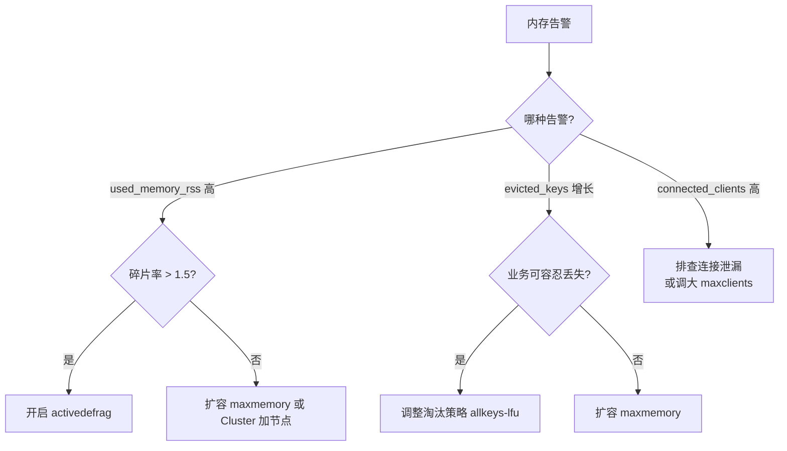
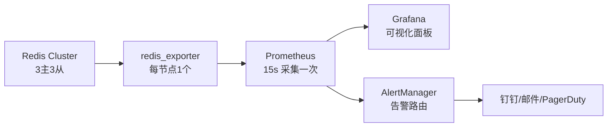

# 高可用与运维

> **一句话定位**：运维与高可用是资深面试的加分项，"大 Key 怎么排查、热 Key 怎么处理"区分是否真正有生产经验。
> **面试热度**：⭐⭐⭐⭐⭐
> **返回**：[Redis 知识图谱](../README.md)

---

## 一、概念定义

### 1.1 Redis 运维核心目标

Redis 运维围绕四大目标展开——**可用性、性能、内存可控、安全**，每个目标都有对应的监控指标和处置策略。

| 目标 | 含义 | 关键指标/手段 |
|------|------|--------------|
| 可用性 | 故障转移 + 数据不丢 | `role`/`connected_slaves`/`master_repl_offset` 差值 |
| 性能 | 低延迟高 QPS | `instantaneous_ops_per_sec`/慢查询/大 Key·热 Key |
| 内存可控 | 碎片与淘汰 | `used_memory_rss`/`mem_fragmentation_ratio`/`evicted_keys` |
| 安全 | ACL + TLS | `ACL`/`tls-port`/`requirepass` |

### 1.2 大 Key 与热 Key

大 Key 和热 Key 是生产事故的两大常见根源，面试常考但很多人答不出区别。

| 维度 | 大 Key | 热 Key |
|------|--------|-------|
| 问题表现 | 单 key 体积大（如 10MB String、10 万元素 List） | 单 key 访问量大（QPS 数万） |
| 危害 | 单 key 操作阻塞单线程（`DEL` 10MB 约 10ms 阻塞） | Cluster 中热 Key 所在节点 CPU 瓶颈 |
| 排查方式 | `redis-cli --bigkeys`/`MEMORY USAGE`/`SCAN` | `redis-cli --hotkeys`/`MONITOR`/`OBJECT FREQ` |
| 处理方式 | `DEL` 改 `UNLINK`、拆分分桶 | 本地缓存、多副本打散 |

**本质区别**：大 Key 是"体积问题"（一个 key 占用内存/带宽大），热 Key 是"热度问题"（一个 key 被访问过于频繁）。一个 key 可能既大又热（如秒杀商品缓存），危害叠加。

### 1.3 慢查询

Redis 单线程模型下，一条慢命令会阻塞**所有**请求——一个 `KEYS *` 阻塞 10 秒，整个 Redis 10 秒不可用。慢查询治理是运维的基础功。

**慢查询日志机制**：
- `slowlog-log-slower-than`：阈值，默认 10000us（10ms），超过则记录。
- `slowlog-max-len`：保留条数，默认 128，FIFO 队列，超出丢弃最旧的。
- `SLOWLOG GET 10`：查看最近 10 条慢查询。

### 1.4 监控指标体系

`info` 命令提供 5 大类指标，覆盖 Redis 运维的各个维度：

| 大类 | 命令 | 核心指标 |
|------|------|---------|
| 内存 | `info memory` | `used_memory`/`used_memory_rss`/`mem_fragmentation_ratio`/`used_memory_peak` |
| 连接 | `info clients` | `connected_clients`/`blocked_clients` |
| 性能 | `info stats` | `instantaneous_ops_per_sec`/`keyspace_hits`/`keyspace_misses` |
| 持久化 | `info persistence` | `rdb_bgsave_in_progress`/`aof_rewrite_in_progress`/`aof_current_size` |
| 主从 | `info replication` | `role`/`connected_slaves`/`master_repl_offset`/`slave_repl_offset` |

---

## 二、原理与流程

### 2.1 慢查询排查

**慢查询配置**：

```bash
# redis-cli 实时查看
CONFIG GET slowlog-log-slower-than    # 默认 10000（10ms）
CONFIG GET slowlog-max-len            # 默认 128
CONFIG SET slowlog-log-slower-than 5000  # 调到 5ms
CONFIG SET slowlog-max-len 1000          # 保留 1000 条

# 查看慢查询
SLOWLOG GET 10    # 最近 10 条
SLOWLOG LEN       # 当前慢查询条数
SLOWLOG RESET     # 清空慢查询日志
```

**常见慢命令及替代方案**：

| 慢命令 | 原因 | 阻塞时间 | 替代方案 |
|--------|------|---------|---------|
| `KEYS *` | 遍历所有 key | 10 万 key 约 40ms，百万级秒级 | `SCAN 0 COUNT 1000` 游标分页 |
| `SMEMBERS` 大集合 | 返回 10 万元素 | 10 万元素约 100ms | `SSCAN` 分页遍历 |
| `HGETALL` 大哈希 | 返回 10 万字段 | 同上 | `HSCAN` 分页 |
| `LRANGE 0 -1` 大列表 | 返回全部元素 | 同上 | 分页 `LRANGE 0 99` |
| `SORT` | 内存排序 + 临时表 | 10 万元素秒级 | 业务侧排序或用 ZSet |
| `FLUSHALL` | 清空所有 DB | 10GB 秒级 | `FLUSHALL ASYNC` 异步清空 |
| `DEL` 大 Key | 同步释放内存 | 10MB 约 10ms | `UNLINK` 异步删除 |

**`KEYS *` 为什么危险**：`KEYS *` 遍历 Redis 中所有 key，单线程下期间不处理任何其他请求。10 万 key 约 40ms（影响不大），但百万级 key 会阻塞秒级，生产环境绝对禁止。

**`SCAN` 的原理**：基于游标（cursor）的分页遍历，每次返回一个新游标和一批 key。单次返回少不影响主线程，可分多次调用直到游标为 0。缺点是不保证不重复（rehash 期间可能重复返回），业务侧需去重。

### 2.2 大 Key 排查与处理

**排查方式**：

1. **`redis-cli --bigkeys`**：采样统计，每隔 100 个 key 抽样，找出各类型最大的 key。快速但不精确（采样可能漏）。

```bash
$ redis-cli --bigkeys
# Scanning the entire keyspace to find biggest keys as well as
# average sizes per key type.  You can use it to make your code
# avoid creating keys that are too big.

-------- sample 1 -------
 Biggest string   found 'user:1001' has 9 MB
 Biggest list     found 'timeline:1001' has 10000 items
 Biggest hash     found 'profile:1001' has 5000 fields
```

2. **`MEMORY USAGE key`**：精确查单 key 内存（返回字节数，含 redisObject 头部）。

```bash
MEMORY USAGE user:1001    # 返回 9437184（约 9MB）
```

3. **`SCAN 0 COUNT 1000`**：遍历不阻塞，结合 `MEMORY USAGE` 逐 key 检查。

**大 Key 的危害**：

| 危害 | 说明 | 量级参考 |
|------|------|---------|
| 删除阻塞 | `DEL` 同步释放内存阻塞主线程 | 10MB String 约 10ms、10 万元素 List 约 100ms |
| 网络传输慢 | `GET` 大 value 块住网络 | 10MB value 千兆网卡约 80ms |
| Cluster 迁移卡顿 | `MIGRATE` 传输大 Key 超时 | 10MB Key 迁移可能超时重试 |
| 淘汰延迟 | 淘汰大 Key 需释放大量内存 | 10MB 一次淘汰约 10ms |
| 阻塞从库 | 从库加载 RDB 时大 Key 解码慢 | 10GB RDB 含大 Key 加载约 60s |

**处理方式**：

1. **`DEL` 改 `UNLINK`**：`UNLINK` 异步删除，bio 线程后台释放内存，不阻塞主线程。
2. **拆分**：根据 key 类型选择拆分策略。

**大 Key 拆分方案**：

| 类型 | 拆分策略 | 示例 |
|------|---------|------|
| String | 分块存储 | `content:{id}:part1`/`part2`，读时合并 |
| Hash | 分桶 | `user:profile:{bucket}`，`bucket = hash(user_id) % 100` |
| List | 分段 | `timeline:{user}:{segment}`，每段 1000 元素 |
| Set | 分片 | `tags:{item}:{shard}`，`shard = hash(member) % 10` |
| ZSet | 分片 | `rank:{topic}:{shard}`，按 score 范围分片 |

### 2.3 热 Key 排查与处理

**排查方式**：

1. **`redis-cli --hotkeys`**：配合 LFU 策略（需 `maxmemory-policy = allkeys-lfu`），基于频率统计输出热 Key。

```bash
$ redis-cli --hotkeys
# Scanning the entire keyspace to find hot keys...
# Note: The hotkeys command is designed to run only when maxmemory-policy
# is configured as allkeys-lfu.

-------- hot key --------
1) "stock:1001" (hits: 234)
2) "item:hot:1001" (hits: 156)
```

2. **`MONITOR`**：实时返回所有命令，抓取高频 key。生产慎用——`MONITOR` 本身消耗性能（每条命令都输出），可能压垮 Redis。

3. **`OBJECT FREQ key`**：查访问频率（需 LFU 模式，返回 0-255 对数频率）。

```bash
OBJECT FREQ stock:1001    # 返回 200（高频）
```

4. **代理层统计**：在 Twemproxy/客户端侧统计 key 访问频率，不依赖 Redis 内部机制。

**热 Key 的危害**：
- 单节点 CPU 瓶颈——Cluster 中热 Key 所在节点被打满，其他节点空闲。
- 网络带宽瓶颈——热 Key 的 value 大时，单节点带宽打满。

**处理方式**：

| 方案 | 实现 | 适用场景 |
|------|------|---------|
| 本地缓存 | Caffeine 缓存热 Key 减少对 Redis 的访问 | 读多写少、可容忍短暂不一致 |
| 多副本打散 | 写多个 key `hotkey:1`/`hotkey:2`，随机读其中一个 | 纯读场景 |
| 读写分离 | 读走从库分摊 | 从库较多时 |
| Cluster 分片无效 | 热 Key 只在一个节点，分片不能解决 | 需本地缓存或副本 |

**多副本打散示例**：
```java
// 写入时复制到 N 个副本
for (int i = 1; i <= 5; i++) {
    redisTemplate.opsForValue().set("stock:1001:" + i, value, 1, TimeUnit.HOURS);
}

// 读取时随机选一个副本
int shard = ThreadLocalRandom.current().nextInt(1, 6);
String value = redisTemplate.opsForValue().get("stock:1001:" + shard);
```

### 2.4 监控指标详解

**`info memory`（内存）**：

| 指标 | 含义 | 关注点 |
|------|------|--------|
| `used_memory` | Redis 逻辑分配的内存 | Redis 视角的使用量 |
| `used_memory_rss` | 操作系统视角的物理内存（含碎片） | 真实占用，接近 maxmemory 时告警 |
| `used_memory_peak` | 历史峰值内存 | 容量规划参考 |
| `mem_fragmentation_ratio` | `rss / used`，碎片率 | >1.5 需关注，>2 需处理 |
| `used_memory_dataset` | 减去 overhead 后的纯数据内存 | 实际数据量 |
| `maxmemory` | 配置的内存上限 | 硬约束 |

**`info clients`（连接）**：

| 指标 | 含义 | 关注点 |
|------|------|--------|
| `connected_clients` | 当前连接数 | 突增可能客户端泄漏 |
| `blocked_clients` | 阻塞命令等待中的客户端 | `BLPOP`/`BRPOP`/`WAIT` 等 |
| `maxclients` | 最大连接数配置 | 默认 10000 |

**`info stats`（性能）**：

| 指标 | 含义 | 关注点 |
|------|------|--------|
| `instantaneous_ops_per_sec` | 当前 QPS | 容量规划、突发流量 |
| `total_commands_processed` | 总命令数 | 累计统计 |
| `keyspace_hits` | 缓存命中次数 | 命中率 = `hits / (hits + misses)` |
| `keyspace_misses` | 缓存未命中次数 | 命中率低于 95% 需关注 |
| `rejected_connections` | 达到 maxclients 拒绝的连接数 | 突增说明连接打满 |
| `expired_keys` | 过期淘汰的 key 数 | 突增说明大量 key 过期 |
| `evicted_keys` | 内存淘汰的 key 数 | 突增说明内存不足 |

**`info persistence`（持久化）**：

| 指标 | 含义 | 关注点 |
|------|------|--------|
| `rdb_bgsave_in_progress` | RDB 是否在进行（0/1） | 长时间为 1 说明 fork 慢 |
| `aof_rewrite_in_progress` | AOF 重写是否在进行 | 长时间为 1 说明重写频繁 |
| `aof_current_size` | AOF 当前大小 | 持续增长需关注 |
| `aof_last_rewrite_time_sec` | 上次 AOF 重写耗时 | 超过秒级需优化 |

**`info replication`（主从）**：

| 指标 | 含义 | 关注点 |
|------|------|--------|
| `role` | 角色（master/slave） | 主从切换后检查 |
| `connected_slaves` | 已连接从库数 | 少于配置数说明从库掉线 |
| `master_repl_offset` | 主库 offset | 主从差值即延迟 |
| `slave_repl_offset` | 从库 offset | 与主库差值判断延迟 |
| `master_link_status` | 从库与主库连接状态（up/down） | down 说明从库断开 |

### 2.5 内存告警与处理

**告警阈值参考**：

| 指标 | 告警阈值 | 处理方式 |
|------|---------|---------|
| `used_memory_rss` / `maxmemory` | > 80% | 扩容或开启淘汰 |
| `mem_fragmentation_ratio` | > 1.5 | 开启 `activedefrag` |
| `used_memory_peak` / 物理内存 | > 80% | 扩容 |
| `evicted_keys` 增长速率 | > 100/s | 扩容或调大 maxmemory |
| `connected_clients` / `maxclients` | > 80% | 排查连接泄漏或调大 maxclients |

**处理流程**：



### 2.6 ACL 安全（6.0+）

Redis 6.0 引入 ACL（Access Control List），支持多用户、细粒度权限控制。

**ACL 基本用法**：

```bash
# 创建用户 alice，密码 password，只能操作 cache:* 的 key，只能用 get/set
ACL SETUSER alice on >password ~cache:* +get +set

# 创建用户 bob，只读权限
ACL SETUSER bob on >password ~* +get +scan

# 查看所有用户
ACL WHOAMI
ACL LIST

# 删除用户
ACL DELUSER alice
```

**ACL 权限说明**：

| 符号 | 含义 | 示例 |
|------|------|------|
| `on`/`off` | 启用/禁用用户 | `on` 启用 |
| `>password` | 设置密码 | `>mypass123` |
| `~pattern` | key 通配符 | `~cache:*` 只能操作 cache: 开头 |
| `+command` | 允许命令 | `+get` 允许 GET |
| `-command` | 禁止命令 | `-keys` 禁止 KEYS |
| `allkeys` | 所有 key（等同 `~*`） | |
| `allcommands` | 所有命令 | |
| `nopass` | 无密码 | |

**为什么需要 ACL**：
1. **多租户隔离**：不同业务方用不同用户、权限隔离，避免某业务方误删其他业务的 key。
2. **最小权限原则**：只读业务用只读用户，避免误写。
3. **审计合规**：多用户可追溯操作来源。

**`default` 用户的安全风险**：默认 `default` 用户拥有全权限且可能无密码，生产环境必须收紧——`ACL SETUSER default off`（禁用）或改密码 + 限制权限。

### 2.7 TLS 传输加密（6.0+）

Redis 6.0 支持 TLS，加密客户端与 Redis 之间的传输数据。

**TLS 配置**：

```bash
# redis.conf
tls-port 6379
port 0                          # 关闭非加密端口
tls-cert-file /etc/redis/redis.crt
tls-key-file /etc/redis/redis.key
tls-ca-cert-file /etc/redis/ca.crt
tls-auth-clients yes            # 要求客户端证书
```

**TLS 与 ACL 的关系**：
- **ACL 控制操作权限**——"你能做什么"（哪些命令、哪些 key）。
- **TLS 控制传输安全**——"数据怎么传"（加密传输防窃听）。
- 两者互补，生产环境高安全要求时都开。

**TLS 的性能开销**：TLS 握手增加约 1-2ms 延迟（首次连接），加密解密 CPU 开销约 5-10%。对绝大多数业务可接受，对极致性能场景（如 10 万 QPS+）需评估。

### 2.8 版本升级注意

**5.x → 6.x 主要变化**：

| 特性 | 说明 | 影响 |
|------|------|------|
| IO 多线程 | `io-threads 4` | 网络密集场景性能提升 |
| ACL | 多用户权限 | 多租户隔离 |
| RESP3 协议 | 新版客户端协议 | 可选，向后兼容 |
| TLS | 传输加密 | 安全合规 |
| `STRALGO` 命令 | 字符串算法（LCS） | 新增命令 |

**6.x → 7.x 主要变化**：

| 特性 | 说明 | 影响 |
|------|------|------|
| Function | 替代 `EVAL`，可缓存可管理 | 脚本迁移 |
| listpack 全面替代 ziplist | `list-max-ziplist-*` 改为 `list-max-listpack-*` | 配置参数变更 |
| Sharded PubSub | `SPUBLISH`/`SSUBSCRIBE` | 解决 PubSub 带宽浪费 |
| `config` 默认禁用 | `CONFIG SET` 需 ACL 授权 | 安全收紧 |
| 流式 RDB | `repl-diskless-sync` 默认 yes | 主从同步不落盘 |
| ACL2 | 增强 ACL 功能 | 权限管理更强 |

**升级注意事项**：
1. **配置参数变更**：6.x 的 `list-max-ziplist-entries` 在 7.x 改为 `list-max-listpack-entries`，旧配置需迁移。
2. **Lua 脚本迁移**：7.x 推荐 Function 替代 `EVAL`，需重写脚本为 Function。
3. **PubSub 迁移**：7.x 的 Sharded PubSub 需客户端适配。
4. **兼容性测试**：升级前在测试环境验证所有命令和配置。

### 2.9 关键源码路径汇总

| 功能 | 源码路径 | 关键函数 |
|------|---------|---------|
| 慢查询 | `src/server.c` | `slowlogEntry`/`slowlogCommand` |
| 大 Key 扫描 | `src/object.c` | `objectCommand`（`MEMORY USAGE`） |
| 异步删除 | `src/lazyfree.c` | `lazyfreeCentireObject`/`unlinkCommand` |
| ACL | `src/acl.c` | `ACLCommand`/`ACLSetUser` |
| TLS | `src/tls.c` | `tlsInit`/`tlsRead`/`tlsWrite` |
| info 命令 | `src/server.c` | `infoCommand`/`genRedisInfoString` |

---

## 三、高频追问

### Q1: 怎么排查大 Key？

**答**：三种方式：①`redis-cli --bigkeys` 采样统计，每隔 100 个 key 抽样找最大 key，快速但不精确；②`MEMORY USAGE key` 精确查单 key 字节数；③`SCAN 0 COUNT 1000` 遍历不阻塞，结合 `MEMORY USAGE` 逐 key 检查。生产建议定期（如每天低峰期）跑 `--bigkeys` 巡检，发现后用 `UNLINK` 异步删除或拆分。

**关联**：→ [高可用与运维](./07-ops/ha-and-ops.md)

### Q2: 大 Key 怎么处理？为什么用 `UNLINK`？

**答**：两种处理：①`DEL` 改 `UNLINK`——`UNLINK` 异步删除，bio 线程后台释放内存不阻塞主线程；②拆分——String 分块、Hash 分桶（`hash(user_id) % 100`）、List 分段、Set/ZSet 分片。为什么用 `UNLINK`：`DEL` 同步释放内存阻塞主线程（10MB 约 10ms），`UNLINK` 先断开 key 与内存空间的引用（主线程 O(1)），再由 bio 线程异步释放，不阻塞。

**关联**：→ [高可用与运维](./07-ops/ha-and-ops.md)

### Q3: 热 Key 怎么发现和处理？

**答**：发现：①`redis-cli --hotkeys`（需 LFU 策略）；②`MONITOR` 抓取命令（生产慎用本身消耗性能）；③`OBJECT FREQ key`（需 LFU 模式）。处理：①本地 Caffeine 缓存热 Key 减少对 Redis 的访问；②多副本打散——写多个 key `hotkey:1`/`hotkey:2`，读时随机选一个。Cluster 分片对热 Key 无效（热 Key 只在一个节点）。

**关联**：→ [高可用与运维](./07-ops/ha-and-ops.md)

### Q4: Redis 慢查询怎么查？

**答**：`SLOWLOG GET 10` 查看最近 10 条。`slowlog-log-slower-than` 默认 10000us（10ms），`slowlog-max-len` 默认 128 条。常见慢命令：`KEYS *`（遍历所有 key，用 `SCAN` 替代）、`SMEMBERS`/`HGETALL` 大集合（用 `SSCAN`/`HSCAN` 分页）、`SORT`（内存排序，用 ZSet 替代）、`DEL` 大 Key（用 `UNLINK` 异步删除）、`FLUSHALL`（用 `FLUSHALL ASYNC`）。

**关联**：→ [高可用与运维](./07-ops/ha-and-ops.md)

### Q5: `KEYS *` 为什么危险？

**答**：`KEYS *` 遍历 Redis 中所有 key，单线程下期间不处理任何其他请求。10 万 key 约 40ms（影响不大），百万级 key 阻塞秒级，生产环境绝对禁止。替代方案是 `SCAN 0 COUNT 1000`——基于游标的分页遍历，每次返回少不影响主线程，可多次调用直到游标为 0。缺点是 rehash 期间可能重复返回 key，业务侧需去重。

**关联**：→ [高可用与运维](./07-ops/ha-and-ops.md)

### Q6: `info` 你关注哪些指标？

**答**：五大类：①`info memory`——`used_memory_rss`（真实占用，接近 maxmemory 告警）、`mem_fragmentation_ratio`（碎片率 >1.5 需 activedefrag）、`used_memory_peak`（峰值）；②`info clients`——`connected_clients`（突增说明连接泄漏）、`blocked_clients`（阻塞命令）；③`info stats`——`instantaneous_ops_per_sec`（当前 QPS）、`keyspace_hits`/`misses`（命中率 <95% 需关注）、`evicted_keys`（淘汰突增说明内存不足）；④`info persistence`——`rdb_bgsave_in_progress`/`aof_rewrite_in_progress`（长时间 1 说明 fork 慢）；⑤`info replication`——`role`/`connected_slaves`/`master_repl_offset` 差值（主从延迟）。

**关联**：→ [高可用与运维](./07-ops/ha-and-ops.md)

### Q7: ACL 是什么？

**答**：Redis 6.0 引入的访问控制列表，支持多用户、细粒度权限。`ACL SETUSER alice on >password ~cache:* +get +set` 创建用户 alice，密码 password，只能操作 `cache:*` 的 key，只能用 `get`/`set`。为什么需要 ACL：多租户隔离（不同业务方权限隔离）、最小权限原则（只读业务用只读用户）、审计合规。生产环境必须收紧 `default` 用户——`ACL SETUSER default off` 或改密码 + 限制权限。

**关联**：→ [高可用与运维](./07-ops/ha-and-ops.md)

---

## 四、实战关联（Java 后端视角）

### 4.1 Spring Boot Actuator + Micrometer 集成 Redis 监控

```java
@Configuration
public class RedisMonitorConfig {

    @Bean
    public LettuceConnectionFactory redisConnectionFactory() {
        RedisStandaloneConfiguration config = new RedisStandaloneConfiguration();
        config.setHostName("localhost");
        config.setPort(6379);
        return new LettuceConnectionFactory(config);
    }

    @Bean
    public RedisHealthIndicator redisHealthIndicator(RedisConnectionFactory factory) {
        return new RedisHealthIndicator(factory);
    }

    @Bean
    public MeterBinder redisMetrics(RedisConnectionFactory factory) {
        return registry -> {
            // 自定义指标：缓存命中率
            new RedisMetricsBinder(factory).bindTo(registry);
        };
    }
}

@Component
public class RedisMetricsBinder implements MeterBinder {

    @Autowired
    private RedisTemplate<String, String> redisTemplate;

    @Override
    public void bindTo(MeterRegistry registry) {
        // 定时采集 info stats
        registry.gauge("redis.keyspace.hits", this,
            o -> getProperty("keyspace_hits"));
        registry.gauge("redis.keyspace.misses", this,
            o -> getProperty("keyspace_misses"));
        registry.gauge("redis.connected_clients", this,
            o -> getProperty("connected_clients"));
    }

    private double getProperty(String key) {
        Properties info = redisTemplate.getConnectionFactory()
            .getConnection().info("stats");
        return Double.parseDouble(info.getProperty(key, "0"));
    }
}
```

### 4.2 Prometheus + redis_exporter + Grafana

生产环境常用 redis_exporter 采集 Redis 指标，Prometheus 存储，Grafana 可视化。

```yaml
# prometheus.yml
scrape_configs:
  - job_name: 'redis'
    static_configs:
      - targets: ['redis-exporter:9121']
```

**Grafana 关键面板**：
- 内存使用：`used_memory_rss` / `maxmemory`（使用率）
- 命中率：`keyspace_hits / (keyspace_hits + keyspace_misses)`
- QPS：`instantaneous_ops_per_sec`
- 主从延迟：`master_repl_offset - slave_repl_offset`
- 慢查询数：`slowlog_len`
- 淘汰 key 数：`evicted_keys`

### 4.3 Redisson 大 Key 拆分 API

```java
// Redisson 的 RMap 支持内部分片（RMapCache）
RMapCache<String, String> profileMap = redisson.getMapCache("profile");
profileMap.put("user:1001", "data", 1, TimeUnit.HOURS);

// 大 List 拆分为分段
RList<String> segment1 = redisson.getList("timeline:1001:1");
RList<String> segment2 = redisson.getList("timeline:1001:2");
```

### 4.4 关联 ops 与 java-core

| Redis 知识点 | 关联模块 | 对照要点 |
|-------------|---------|---------|
| 单进程单线程 | `ops/linux/01-process/process-and-thread.md` | Redis 单进程单线程 vs Linux 进程线程模型 |
| TCP keepalive | `ops/linux/06-network/tcp-and-conntrack.md` | Redis 短连接 vs 长连接、TCP keepalive |
| 容器化部署 | `ops/docker` | Redis Cluster 容器编排、Sentinel 容器部署、健康检查 |
| Prometheus 监控 | `ops/docker` | redis_exporter + Prometheus + Grafana 集成 |

---

## 五、系统设计案例

### 案例 1：设计一个 Redis 生产集群的监控告警体系

**场景**：电商缓存集群，3 主 3 从 Cluster，要求 99.99% 可用性，需设计完整监控告警。

**3 分钟标准答法**：

1. **监控架构**：Prometheus + redis_exporter + Grafana + AlertManager。



2. **5 大类指标 + 告警阈值**：

| 大类 | 指标 | 告警阈值 | 级别 |
|------|------|---------|------|
| 内存 | `used_memory_rss / maxmemory` | > 80% | Warning / >90% Critical |
| 内存 | `mem_fragmentation_ratio` | > 1.5 | Warning |
| 性能 | `instantaneous_ops_per_sec` | > 8 万 | Warning（接近单线程上限） |
| 性能 | 慢查询数 `slowlog_len` | > 10/min | Warning |
| 连接 | `connected_clients` | > 8000 | Warning / >9500 Critical |
| 主从 | `master_repl_offset - slave_repl_offset` | > 10000 | Warning（延迟） |
| 主从 | `connected_slaves` | < 配置数 | Critical（从库掉线） |
| 持久化 | `rdb_bgsave_in_progress` | = 1 持续 > 5min | Warning（fork 慢） |
| 命中率 | `hits / (hits + misses)` | < 90% | Warning |
| 淘汰 | `evicted_keys` 增长 | > 100/s | Warning |

3. **巡检任务**：每天低峰期跑 `redis-cli --bigkeys` 巡检大 Key，每周跑 `--hotkeys` 巡检热 Key。

**追问链**：

| 追问 | 答案 |
|------|------|
| 1. 主从延迟怎么监控？ | `info replication` 的 `master_repl_offset - slave_repl_offset` 差值，差值 > 10000 告警。也可用 `WAIT` 命令探测。 |
| 2. 内存怎么监控？ | `used_memory_rss / maxmemory` 使用率、`mem_fragmentation_ratio` 碎片率。使用率 >80% Warning、碎片率 >1.5 开 `activedefrag`。 |
| 3. QPS 怎么监控？ | `info stats` 的 `instantaneous_ops_per_sec`，Prometheus 15s 采集一次。QPS > 8 万接近单线程上限需拆分。 |
| 4. 慢查询怎么告警？ | `slowlog_len` 每分钟增量 > 10 告警。慢查询突增说明有大 Key 或 `KEYS` 类危险命令。 |
| 5. 告警怎么分级？ | Warning（趋势性，需关注但不紧急）、Critical（故障性，需立即处理如从库掉线、内存超 90%）。 |

### 案例 2：设计一次从 6.x 到 7.x 的零停机升级方案

**场景**：生产 Redis 6.x Cluster，3 主 3 从，需升级到 7.x，要求零停机。

**追问链（方案演进）**：

1. **新集群搭建 7.x**：部署 3 主 3 从 7.x Cluster，与旧集群并行运行。

2. **双写迁移数据**：
   - 业务侧双写——同时写旧集群（6.x）和新集群（7.x）。
   - 用 `MIGRATE` 或 `redis-shake` 工具把旧集群数据同步到新集群。
   - 双写期间以旧集群为主，新集群校验数据一致性。

3. **校验数据**：
   - 用 `redis-check-rdb` 或对比 `DBSIZE`、抽样 key 对比 value。
   - 一致性达标后准备切流。

4. **切流**：
   - 灰度切流——先切 10% 流量到新集群，观察无异常后逐步切 50% → 100%。
   - 切流期间保留双写，万一回滚可立即切回旧集群。

5. **下线旧集群**：
   - 切流 100% 且稳定运行 1 周后，停止双写，下线旧集群。

6. **配置兼容**：
   - `list-max-ziplist-*` → `list-max-listpack-*`，参数名变更需迁移。
   - Lua 脚本迁移为 Function（可选，7.x 仍支持 `EVAL`）。
   - PubSub 如需 Sharded PubSub 需客户端适配。

7. **Function 替代 EVAL 脚本迁移**：
   - 7.x 推荐 `FUNCTION LOAD` 替代 `EVAL`——可缓存可管理。
   - 逐步把 `EVAL` 脚本重写为 Function，测试验证后替换。

**关键原则**：
- **不停服**：新集群并行 + 双写 + 灰度切流，保证业务无感知。
- **可回滚**：双写期间保留旧集群，切流异常可立即切回。
- **数据校验**：切流前必须验证数据一致性，避免数据丢失。
- **配置迁移**：7.x 参数名变更需提前迁移，避免启动失败。

---

> **延伸阅读**：
> - [内存管理与淘汰策略](../03-memory/memory-and-eviction.md) —— `used_memory_rss`/碎片率/淘汰策略触发条件
> - [事件与并发模型](../04-event/event-and-concurrency.md) —— 单线程模型下慢命令阻塞的影响、bio 线程异步删除
> - [复制与集群](../05-replication/replication-and-cluster.md) —— 主从延迟监控、Cluster 故障转移、节点宕机排查
