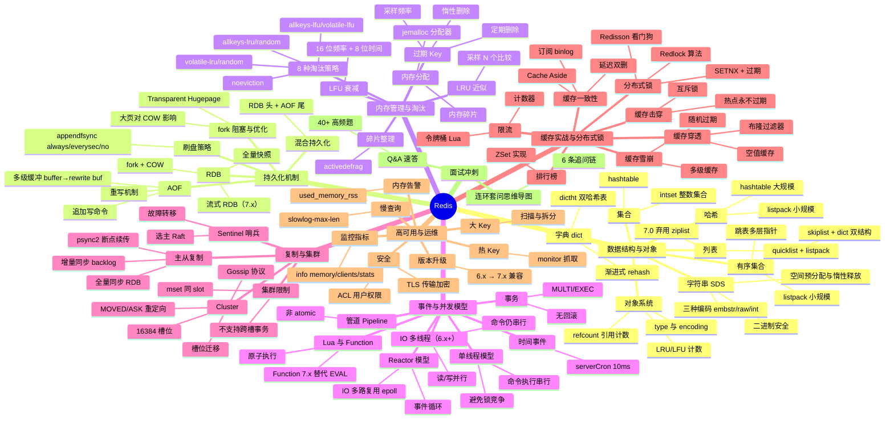

# redis — Redis 面试知识体系

## 一、模块简介

本模块按 Redis 知识层次组织 **8 份**主题/汇总文档，覆盖从数据结构与对象编码、持久化机制、内存管理与淘汰、事件与并发模型、复制与集群、缓存实战与分布式锁到高可用与运维的完整面试知识图谱，并把每个专题都落到 Java 后端工程实战。

- **定位**：面向 Java 后端高级/资深面试的 Redis 知识体系，深度对标 `middleware/mysql`、`ops/linux`、`ops/docker`
- **适用对象**：Java 后端面试（社招高级/资深，5 年+），兼顾架构与系统设计方向
- **组织方式**：7 个主题目录 + 1 个 Q&A 文件，每份主题文档遵循「概念定义 → 原理与流程 → 高频追问 → 实战关联 → 系统设计案例」五段式结构
- **导航约定**：每份文档顶部含 `> 返回 [Redis 知识图谱](../README.md)` 链接，本文档为统一入口
- **版本基线**：Redis 7.x（覆盖 listpack 替代 ziplist、Function、Sharded PubSub、流式 RDB、IO 多线程等特性，5.x/6.x 仅作差异对比）

---

## 二、知识图谱



---

## 三、导航表

| 分层 | 文档 | 核心考点 |
|------|------|---------|
| 数据结构与对象 | [数据结构与对象编码](./01-data-structure/data-structure-and-encoding.md) ✅ | SDS/dict 渐进式 rehash/quicklist+listpack/skiplist 跳表/intset/对象 type+encoding/编码转换 |
| 持久化机制 | [持久化机制](./02-persistence/persistence-mechanism.md) ✅ | RDB fork+COW/流式 RDB/AOF 重写/多级缓冲/混合持久化/appendfsync 策略/大页影响 |
| 内存管理与淘汰 | [内存管理与淘汰策略](./03-memory/memory-and-eviction.md) ✅ | jemalloc 碎片/惰性+定期删除/8 种淘汰策略/LRU 近似/LFU 衰减/activedefrag |
| 事件与并发模型 | [事件与并发模型](./04-event/event-and-concurrency.md) ⬜ | 单线程/Reactor epoll/IO 多线程/serverCron/Pipeline/MULTI 事务/Lua+Function |
| 复制与集群 | [复制与集群](./05-replication/replication-and-cluster.md) ⬜ | 全量+增量同步/psync2/Sentinel Raft/16384 槽位/Gossip/MOVED·ASK/槽位迁移 |
| 缓存实战与分布式锁 | [缓存实战与分布式锁](./06-cache-practice/cache-and-distributed-lock.md) ⬜ | 穿透·击穿·雪崩/Cache Aside/延迟双删/binlog 订阅/SETNX/Redlock/Redisson/限流/排行榜 |
| 高可用与运维 | [高可用与运维](./07-ops/ha-and-ops.md) ⬜ | 慢查询/大 Key·热 Key 治理/info 监控指标/内存告警/ACL+TLS 安全/版本升级 |
| 面试冲刺 | [Q&A 速答](./08-interview-qa.md) ⬜ | 40+ 题速答 + 连环套问思维导图 |

> 共 **9 份**文档：入口 README（本文档）+ 上表 8 份主题/Q&A 文档。

---

## 四、推荐学习路径

### 路线一：系统学习（适合有 1-2 周准备期）

按 Redis 知识层次自底向上，先建立数据结构与内存模型底层，再向上到持久化、事件、集群、实战：

```
01 数据结构 → 02 持久化 → 03 内存与淘汰 → 04 事件模型 → 05 复制与集群 → 06 缓存实战 → 07 运维 → 08 Q&A
```

**特点**：先见森林后见树木，符合「数据结构 → 持久化 → 内存 → 事件 → 集群 → 实战 → 运维」的认知递进，适合建立完整体系。底层到上层路径清晰：数据结构是基础，持久化/内存决定单机能力，事件模型决定并发性能，集群决定扩展性，实战/运维是工程落地。

### 路线二：面试冲刺（高频优先，适合 3-5 天突击）

按面试热度排序，先啃必考点，再补体系：

1. 01 数据结构 → 06 缓存实战与分布式锁
2. 02 持久化 → 03 内存与淘汰
3. 05 复制与集群 → 04 事件模型
4. 07 运维 → 08 Q&A（40+ 题，含连环套问思维导图）

**特点**：投入产出比最高，覆盖 80% 高频考点。Redis 面试起手三连问是「数据类型与底层结构 → 缓存三大问题 → 持久化」，先把这三块拿下再补集群与事件模型。

> 两套路线殊途同归，最终都应回到 [Q&A 速答](./08-interview-qa.md) 做闭环检验。

---

## 五、与 java-core / framework 模块的关联

本模块虽为中间件文档，但与仓库内 Java 模块存在直接关联，便于在面试中结合源码与实战作答：

| Redis 知识点 | 关联 Java 模块 | 关联要点 |
|-------------|---------------|---------|
| 01 数据结构 / SDS 二进制安全 | `framework/jackson` | SDS 二进制安全与 Jackson 序列化字节的对接 |
| 01 数据结构 / 对象系统 | `java-core/reflect` | Redis Object type/encoding 与反射元数据的对照 |
| 03 内存与淘汰 / 引用计数 | `java-core/jvm` | Redis refcount 引用计数 vs JVM GC 可达性分析 |
| 03 内存与淘汰 / 内存分配 | `java-core/jvm` | jemalloc 与 JVM 堆外内存、DirectByteBuffer 的对照 |
| 04 事件模型 / 单线程 vs 多线程 | `java-core/jvm` | Redis 单线程模型 vs JVM 多线程并发的本质差异 |
| 04 事件模型 / Reactor epoll | `java-core/lambda` | Netty Reactor 与 Redis 事件循环的对照（epoll 共用） |
| 04 事件模型 / Pipeline 管道 | `java-core/stream` | Pipeline 批量与 Stream 批处理的对比 |
| 05 复制与集群 / 分片 | `framework/spring-framework` | Redis Cluster 槽位与 Spring 多数据源路由的对照 |
| 06 缓存实战 / `@Cacheable` | `framework/spring-framework` | Spring Cache 抽象与 Redis 集成、序列化配置 |
| 06 缓存实战 / 一致性 | `framework/spring-framework` | `@Transactional` 与缓存一致性边界的协调 |
| 06 分布式锁 / Redisson | `framework/spring-framework` | Redisson 集成 Spring、`@RedissonLock` 注解化 |
| 06 缓存实战 / 序列化 | `framework/jackson` | RedisTemplate 序列化器与 Jackson 自定义序列化 |
| 06 缓存实战 / 参数校验 | `framework/valid` | 缓存空值与参数校验互补防穿透 |

> 建议在阅读内存管理、事件模型与缓存实战文档时，对照 `java-core`/`framework` 模块源码，加深「面试八股 → 工程实战」双向映射（延伸阅读：`java-core/jvm` 对照引用计数/单线程模型，`framework/spring-framework` 对照 Cache/Redisson，`framework/jackson` 对照序列化器）。

---

## 六、与 ops 模块的交叉引用

本模块部分原理推导链与 `ops` 运维文档存在对照关系，Redis 章只讲"Redis 场景下的实现与选择"，原理推导回对应模块：

| Redis 文档 | 跳转目标 | 对照要点 |
|-----------|---------|---------|
| 02 持久化 | `ops/linux/05-fs/filesystem-and-vfs.md` | fsync 与文件系统崩溃一致性、RDB/AOF 落盘 |
| 02 持久化 | `ops/linux/03-memory/memory-management.md` | fork COW 与 Linux 内存管理、THP 大页影响 |
| 02 持久化 | `ops/linux/04-io/io-model-and-epoll.md` | AOF 重写子进程与 IO 模型对照 |
| 04 事件模型 | `ops/linux/04-io/io-model-and-epoll.md` | Redis Reactor 与 epoll、IO 多路复用、IO 多线程 |
| 04 事件模型 | `ops/linux/03-memory/memory-management.md` | 单线程模型与内存屏障、CPU 缓存友好性 |
| 05 复制与集群 | `middleware/README.md`（mysql 已建） | Redis 主从 vs MySQL 主从复制的对照 |
| 05 复制与集群 | `ops/docker/` | Redis Cluster 容器化部署、Sentinel 编排 |
| 07 运维 | `ops/linux/01-process/process-and-thread.md` | Redis 单进程单线程 vs Linux 进程线程模型 |
| 07 运维 | `ops/linux/06-network/tcp-and-conntrack.md` | Redis 短连接 vs 长连接、TCP keepalive |

> 处理原则：Redis 章只讲"Redis 场景下的实现与选择"，原理推导链回对应模块，不重复展开。
