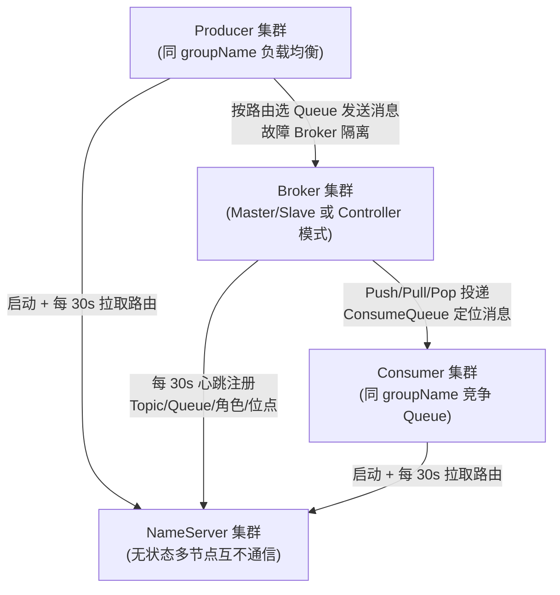
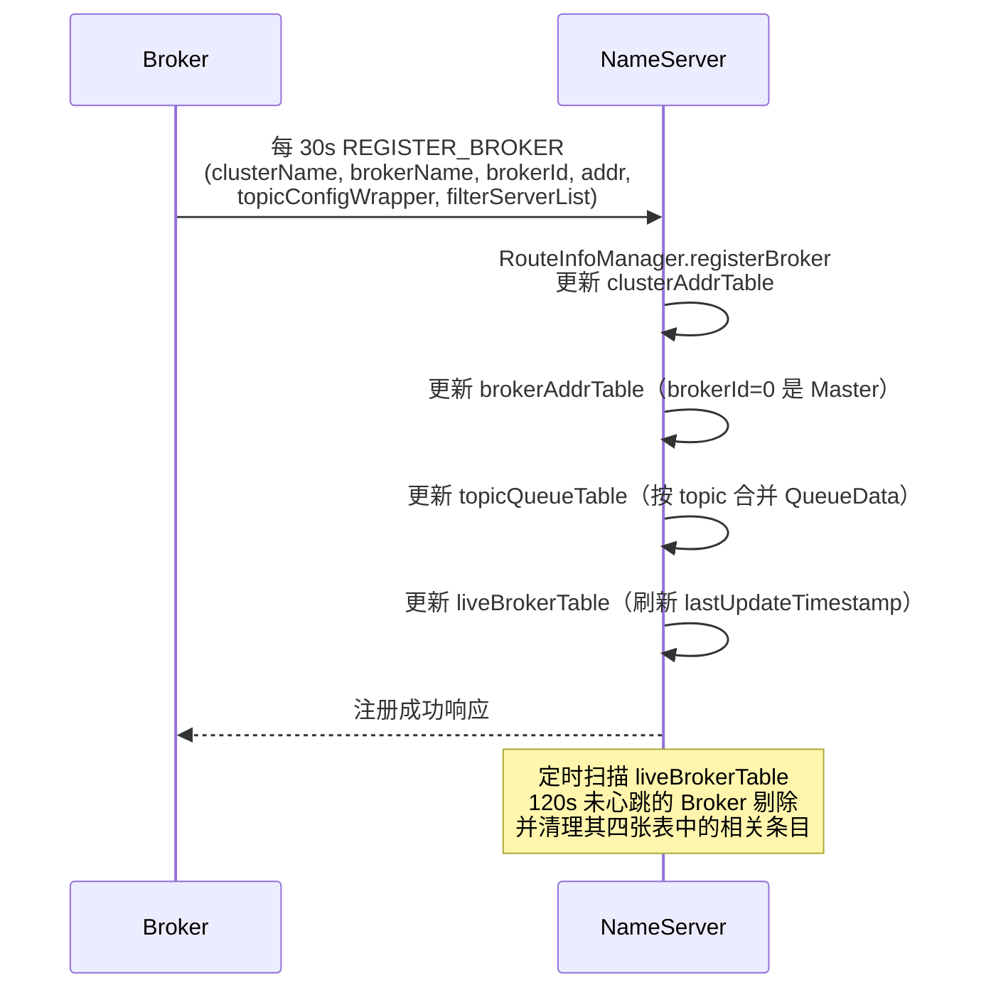
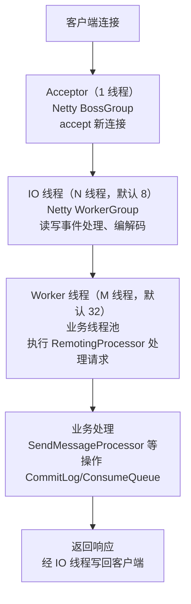
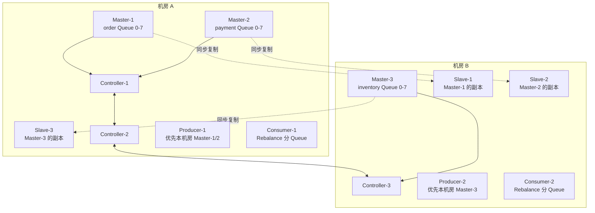
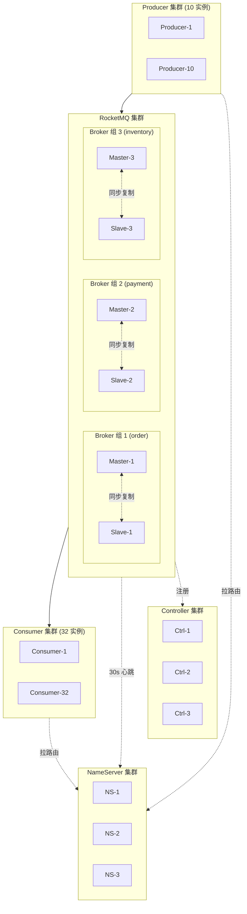
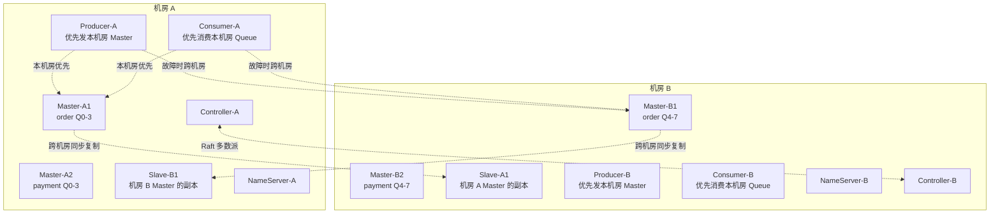

# 架构与部署拓扑

> **一句话定位**：RocketMQ 架构是面试起手题，"讲讲 RocketMQ 整体架构与 NameServer 为什么不用 ZooKeeper"几乎每场必问，能讲到 Netty Reactor 线程模型与 Controller 模式才算合格。
> **面试热度**：⭐⭐⭐⭐⭐
> **返回**：[RocketMQ 知识图谱](../README.md)

---

## 一、概念定义

### 1.1 RocketMQ 四大组件

RocketMQ 在拓扑上由 **NameServer、Broker、Producer、Consumer** 四大组件构成，这是所有后续专题的术语基线。理解"谁管路由、谁存消息、谁发消息、谁消费消息"这条职责链，是讲清任何 RocketMQ 问题的前提。

| 组件 | 角色 | 职责 | 有无状态 | 集群形态 |
|------|------|------|---------|---------|
| NameServer | 路由注册中心 | 注册/发现 Broker、维护 Topic 路由元数据、心跳判活 | **无状态** | 多节点**互不通信**（区别于 ZK/Eureka） |
| Broker | 消息存储与转发 | 接收/持久化消息、维护 ConsumeQueue/IndexFile、推/拉消息给 Consumer | **有状态**（存消息与位点） | Master/Slave、Dledger、Controller 模式 |
| Producer | 消息生产者 | 根据 NameServer 拿 Topic 路由、选 Queue、发送、重试、故障隔离 | 无状态（实例级） | 集群名相同即同一组（负载均衡） |
| Consumer | 消息消费者 | 订阅 Topic、Rebalance 分配 Queue、拉取/Pop 消息、ACK、重试 | 有状态（消费位点） | 集群名相同即同一组（竞争 Queue） |

四大组件的协作链是面试的"30 秒讲完架构"标准答法：



**关键要点**：①NameServer 多节点之间**互不通信**，每个节点独立维护一份路由表，靠 Broker 向所有节点广播心跳达成最终一致；②Producer 与 Consumer 都从 NameServer 拉取路由（注意是**拉**不是推），定时 30s 更新本地路由表；③Broker 是唯一有状态组件，它的存储模型（CommitLog/ConsumeQueue/IndexFile）和副本模型（Master/Slave、Dledger、Controller）是后续两份文档的主题。

### 1.2 NameServer vs ZooKeeper：为什么 RocketMQ 弃用 ZK

RocketMQ 早期（2.x 之前）曾用 ZooKeeper 做注册中心，3.x 起自研 NameServer 替代。这是面试高频追问，核心论点是 **"AP 比 CP 更适合 MQ 路由场景"**。

| 维度 | ZooKeeper（CP） | NameServer（AP） |
|------|----------------|------------------|
| 一致性 | CP（ZAB 强一致写） | AP（各自维护路由表，最终一致） |
| 节点关系 | 集群互连，Leader/Follower | **节点互不通信**，每个独立 |
| 状态 | 有状态（事务日志 + 快照） | 无状态（内存路由表，可随时重启） |
| 复杂度 | 重（Paxos 变种 ZAB、Leader 选举、事务日志） | 轻（纯内存 HashMap，几行就能讲清） |
| 依赖 | 额外引入 ZK 集群（3/5 节点 JVM 进程） | 无外部依赖，NameServer 是 RocketMQ 自带 |
| 故障感知 | Session 超时（默认 30s）+ 通知客户端 | 120s 心跳超时 + 客户端定时拉取 |
| 写入 | 每次路由变更走 ZAB 多数派写 | Broker 向每个 NS 独立注册，写不互斥 |

**为什么 AP 更适合？** RocketMQ 的路由元数据本质是"Broker 有哪些 Topic、哪些 Queue、谁是 Master"这类**变更频率极低**的信息——Broker 下线是低频事件，且即使短暂不一致（某 NS 还感知到已下线的 Broker），Producer 发送失败后有重试和故障隔离机制兜底，不会造成数据错误，最多是一次发送延迟。ZK 的 CP 强一致在这种低频写场景是过度设计——为了 99.999% 的强一致付出 Leader 选举、事务日志、跨节点同步的复杂度代价，收益却不明显。RocketMQ 团队的取舍是：**用"最终一致 + 客户端重试"换"极简架构 + 无外部依赖"**。

**Broker 如何保证所有 NameServer 路由一致？** Broker 每 30s 向**所有** NameServer 节点独立心跳注册（不是发给 Leader 再同步），所以只要 Broker 正常，所有 NS 的路由表最终一致。差异只出现在 NS 短暂不可用的窗口——某 NS 重启后内存路由表清空，等下一次 Broker 心跳到达才补齐。这个窗口内该 NS 给客户端的是旧路由或空路由，客户端会转而请求其他 NS 或重试。这是 AP 模型"允许短暂不一致"的代价。

### 1.3 Broker 角色演进：Master/Slave → Dledger → Controller

Broker 的高可用部署模式经历三代演进，面试时讲清三代差异和 5.x 为什么引入 Controller 是加分项。

| 模式 | 版本 | 切换方式 | 副本同步 | 兼容原存储 | 自动 Failover |
|------|------|---------|---------|------------|---------------|
| Master/Slave | 2.x-至今 | **手动**切换 Slave 为 Master | 同步/异步复制（HA Service） | 是 | 否（需人工 `mqadmin` 切换） |
| Dledger | 4.x-至今 | **自动**（Raft 选举新 Master） | Raft 多数派复制 | **否**（Dledger 独立 CommitLog 格式） | 是 |
| Controller 模式 | 5.x | **自动**（Controller 选主） | 复用原 Master/Slave 复制通道 | **是**（兼容原 CommitLog） | 是 |

**三代演进的本质**：①Master/Slave 能复制但切换靠人工，故障恢复慢（MTTR 数十分钟）；②Dledger 用 Raft 实现自动选主，但要求**全新存储格式**——已有集群不能平滑升级，且 Dledger 的复制走自己的协议不复用原 HA 通道，相当于"另起炉灶"；③Controller 模式是 5.x 的关键设计，**Controller 只负责选主决策，复制仍走原 Master/Slave 的 HA Service 通道**，所以能兼容原存储、老集群可直接升级。Controller 本身是一个独立部署的 Raft 集群（类似 ZK 但极简），Broker 启动时向 Controller 注册，Master 宕机时 Controller 从 Slave 中选出新 Master 并通知其他 Broker 切换副本组主从角色。

**Controller 部署形态**：①**独立部署**（推荐生产）——3 节点 Raft 集群，与 Broker 物理隔离；②**嵌入式部署**——Broker 进程内嵌 Controller 模式，适合开发测试，生产不建议。Controller 只管元数据（谁是 Master、副本组列表），不存消息数据，所以极轻——3 节点小 JVM 进程即可，相比 ZK 的重依赖，这是 RocketMQ 团队"自研轻量元数据中心"思路的延续。

### 1.4 Topic 与 MessageQueue：逻辑分类与并行单位

RocketMQ 的消息组织模型是 **Topic（逻辑分类）× MessageQueue（并行单位）**，理解读写队列分离是 5.x 的高频追问点。

- **Topic**：逻辑分类，类似于 Kafka 的 topic 概念。一个业务（如订单、支付、库存）对应一个 Topic，Topic 是 Producer 发送目标和 Consumer 订阅目标。
- **MessageQueue**（简称 Queue）：Topic 下的并行单位，类似 Kafka 的 partition。**Queue 数量决定 Consumer 的最大并行度**——N 个 Queue 最多被 N 个 Consumer 实例并发消费（集群模式下每个 Queue 同一时刻只被一个 Consumer 实例消费）。Queue 也是 Broker 上的物理存储分片——每个 Queue 对应一份 ConsumeQueue 索引文件。
- **读写队列分离**（`readQueueNums` / `writeQueueNums`）：RocketMQ 的 TopicConfig 允许读写队列数独立配置。正常情况下两者相等；扩容时先把 `writeQueueNums` 调大（Producer 开始写新 Queue），等新 Queue 有消息后再调大 `readQueueNums`（Consumer 开始消费新 Queue）；缩容反之——先调小 `readQueueNums`（Consumer 停止消费待缩 Queue），等存量消息消费完再调小 `writeQueueNums`。**读写分离的目的是扩缩容时平滑过渡，避免消息丢失或消费错乱**。

| 操作 | writeQueueNums 调整 | readQueueNums 调整 | 时机 |
|------|--------------------|--------------------|------|
| 扩容 | 先调大 | 后调大 | 写入新 Queue → 消费新 Queue |
| 缩容 | 后调小 | 先调小 | 停止消费 → 消费完存量 → 停止写入 |

**为什么 Queue 数决定并行度？** 集群消费模式下，Rebalance 策略把 Queue 分配给 Consumer 实例——`AllocateMessageQueueAveragely`（平均分配）把 N 个 Queue 尽量均分给 M 个 Consumer，若 N < M 则有 `M-N` 个 Consumer 空闲。所以生产上 Queue 数应 ≥ Consumer 实例数，常见配置 16 或 32 个 Queue 以支撑水平扩展。

> **源码路径**：`org.apache.rocketmq.broker.topic.TopicConfig`（readQueueNums/writeQueueNums 字段）、`TopicConfigManager`（Topic 配置持久化到 `${storeRoot}/config/topics.json`）。

### 1.5 Topic 权限控制（perm）

`TopicConfig` 还有一个 `perm` 字段控制 Topic 的读写权限，这是生产环境隔离与运维操作的常用开关。`perm` 是位掩码，6 表示可读可写（默认），2 表示只写，4 表示只读。

| perm 值 | 二进制 | 含义 | 典型场景 |
|---------|--------|------|---------|
| 6 | 110 | 可读可写 | 正常运行（默认） |
| 2 | 010 | 只写不可读 | 灰度发布新 Topic，只允许写入暂不消费 |
| 4 | 100 | 只读不可写 | 下线 Topic 前先停止写入，等存量消息消费完再删除 |
| 1 | 001 | 不可读写（仅作占位） | 极少用，完全隔离 |

**运维场景**：①下线 Topic——先把 perm 改为 4（只读），等 Consumer 把存量消息消费完（观察 ConsumeQueue offset 追上），再删除 Topic 避免消息丢失；②灰度发布——新 Topic 先 perm=2（只写），让 Producer 发消息但不消费，验证流量后改 perm=6 启用消费；③故障隔离——某 Broker 故障时把其上的 Topic perm 改为只读，强制 Producer 切到其他 Broker。

**与 Kafka ACL 的差异**：RocketMQ 的 perm 是 Topic 级别的粗粒度权限控制，Kafka 用 ACL（Access Control List）支持 User × Topic × Operation 细粒度授权。RocketMQ 5.x 引入了更细的 ACL 机制（`aclEnable=true` + `PlainAccessControl`），但 perm 仍是 Topic 级快速运维开关，两者互补——perm 用于运维快速切换，ACL 用于安全授权。

---

## 二、原理与流程

### 2.1 NameServer 路由管理：四张内存表

NameServer 的核心是 `RouteInfoManager`，它用**四张内存 HashMap** 维护全部路由元数据。理解这四张表的数据结构是讲清 NameServer 工作原理的钥匙。

| 表名 | Key | Value | 数据来源 | 作用 |
|------|-----|-------|---------|------|
| `topicQueueTable` | Topic 名 | `List<QueueData>`（每个 Broker 一条） | Broker 注册时上报 | 查 Topic 有哪些 Queue、在哪些 Broker |
| `brokerAddrTable` | Broker 名 | `BrokerData`（cluster + 主从地址 Map） | Broker 注册 | 查 Broker 的 Master/Slave 地址 |
| `clusterAddrTable` | Cluster 名 | Set<String>（Broker 名集合） | Broker 注册 | 查集群有哪些 Broker |
| `liveBrokerTable` | Broker 地址 | `BrokerLiveInfo`（lastUpdateTimestamp + channel） | 心跳更新 | 判活——120s 未更新则剔除 |

**心跳注册流程**（Broker 每 30s 向所有 NameServer 发 `REGISTER_BROKER` 请求）：



**120s 判活机制**：NameServer 内部有个定时任务（`RouteInfoManager.scanNotActiveBroker`，每 5s 执行一次）扫描 `liveBrokerTable`，若 `System.currentTimeMillis() - lastUpdateTimestamp > 120000`（120s）则判定该 Broker 下线，从四张表中剔除其相关条目。120s = 30s 心跳间隔 × 4 倍冗余，容忍 3 次心跳丢失，避免网络抖动误判。

**路由剔除的级联清理**：Broker 被判活失败后，NameServer 不仅删 `liveBrokerTable` 的条目，还要级联清理：①从 `brokerAddrTable` 删该 Broker 地址（若 Master 下线则保留 Slave，等下次心跳上报新 Master）；②从 `topicQueueTable` 中删除该 Broker 对应的 `QueueData`；③若该 Broker 是 cluster 下最后一个，则从 `clusterAddrTable` 删整个 cluster。这个级联清理保证路由表的"无僵尸条目"。

> **源码路径**：`org.apache.rocketmq.namesrv.routeinfo.RouteInfoManager`（四张表 + `registerBroker`/`unregisterBroker`/`scanNotActiveBroker`）、`org.apache.rocketmq.namesrv.processor.DefaultRequestProcessor`（处理 `REGISTER_BROKER` 请求码 103）。

### 2.2 Producer 路由发现与发送

Producer 的路由发现是**拉取模型**——启动时全量拉取，运行时定时 30s 增量更新，发送时按 Queue 选择策略选目标。

**启动流程**：`DefaultMQProducerImpl.start()` → `mqClientFactory.updateTopicRouteInfoFromNameServer()` 全量拉取所有用到的 Topic 的路由，缓存到 `topicRouteDataMap`。拉取后构造 `topicPublishInfo`（含 `QueueData` 列表、每个 Queue 的 Broker 地址），发送时用。

**定时更新**：`MQClientInstance` 内部一个定时任务（`updateTopicRouteInfoFromNameServer`，默认 30s 一次），刷新本地路由缓存。若发现路由变更（如新 Broker 上线、Queue 数变化），更新 `topicPublishInfo`，下次发送生效。

**发送时的 Queue 选择策略**（`DefaultMQProducerImpl.send` → `selectOneMessageQueue`）：

| 策略 | 类 | 逻辑 |
|------|----|----|
| 轮询（默认） | `SelectMessageQueueByRoundRobin` | 轮询 Queue 列表，自动跳过故障 Broker |
| 哈希（顺序消息用） | `SelectMessageQueueByHash` | 按 `arg`（如 orderId）hash 选 Queue，保证同 key 进同 Queue |
| 机房亲和 | `SelectMessageQueueInMachineRoom` | 优先选同机房的 Queue |

**故障隔离**（`sendLatencyFaultEnable`，默认关闭，生产建议开启）：开启后 `MQFaultStrategy` 维护每个 Broker 的**延迟与可用性状态**——发送失败或响应慢的 Broker 被加入"故障隔离"列表，在 `notBestBroker` 标记里，下次选 Queue 时优先选健康 Broker，故障 Broker 经过一段退避时间后才重新尝试。这比单纯轮询更智能——轮询会继续往慢 Broker 发送造成超时，故障隔离能自动规避。

```java
// DefaultMQProducerImpl.tryToFindTopicPublishInfo 简化逻辑
TopicPublishInfo topicPublishInfo = this.topicPublishInfoTable.get(topic);
if (topicPublishInfo == null || !topicPublishInfo.isHaveTopicRouterInfo()) {
    // 本地无缓存，向 NameServer 拉取
    topicPublishInfo = mqClientFactory.updateTopicRouteInfoFromNameServer(topic, true, null);
}
if (topicPublishInfo != null && topicPublishInfo.ok()) {
    return topicPublishInfo;  // 调用 selectOneMessageQueue() 选 Queue
}
// 拉取失败（Topic 不存在），尝试用默认 Topic（TBW107）的 Queue 兜底（自动创建场景）
```

> **源码路径**：`org.apache.rocketmq.client.impl.producer.DefaultMQProducerImpl`（`start`/`send`/`tryToFindTopicPublishInfo`）、`org.apache.rocketmq.client.latency.MQFaultStrategy`（故障隔离）。

### 2.3 Consumer 路由发现与 Rebalance

Consumer 的路由发现同样是拉取模型，但与 Producer 有显著差异——Consumer 还要处理 **Rebalance**（Queue 在 Consumer 实例间重新分配）。

| 维度 | Producer 路由发现 | Consumer 路由发现 |
|------|----------------|-----------------|
| 拉取时机 | 启动 + 30s 定时 | 启动 + 30s 定时 |
| 缓存内容 | `topicPublishInfo`（Queue 列表 + Broker 地址） | `subscriptionData` + `topicSubscribeInfoTable` |
| 选 Queue | 自己选（轮询/哈希/机房） | **Rebalance 策略分配**，Consumer 不能自选 |
| 故障应对 | 故障隔离跳过 Broker | Queue 被 Rebalance 重新分配给其他 Consumer |
| 触发条件 | 路由变更 | 路由变更 **+ Consumer 上下线** |

**Rebalance 触发**：①Consumer 启动时；②定时任务（默认 20s）；③Broker 上下线导致路由变更；④Consumer 集群成员变更（同一 group 内 Consumer 实例增减）。Rebalance 时 `RebalanceImpl.doRebalance` 遍历所有订阅的 Topic，对每个 Topic 调用 `allocateMessageQueueStrategy.allocate` 把 Queue 列表分配给当前 Consumer 实例。

**Rebalance 策略**（`AllocateMessageQueueStrategy`）：

| 策略 | 逻辑 | 适用 |
|------|------|------|
| `AllocateMessageQueueAveragely`（默认） | N Queue / M Consumer 尽量均分，余数给前几个 Consumer | 通用 |
| `AllocateMessageQueueAveragelyByCircle` | 环形分配，Queue 1→C1, Q2→C2, Q3→C3, Q4→C1... | Queue 远多于 Consumer 时分散 |
| `AllocateMachineRoom` | 按机房亲和分配，同机房 Queue 给同机房 Consumer | 多机房部署 |
| `AllocateConsistentHash` | 一致性哈希，Consumer 增减时减少 Queue 迁移 | Consumer 频繁扩缩容 |

> **源码路径**：`org.apache.rocketmq.client.impl.consumer.RebalanceImpl`（`doRebalance`/`rebalanceByTopic`）、`org.apache.rocketmq.client.impl.consumer.DefaultMQPushConsumerImpl`（启动触发 Rebalance）、`org.apache.rocketmq.common.algorithm` 包下各 `AllocateMessageQueue*` 策略类。

### 2.4 Broker 网络模型：Netty Reactor 1+N+M

Broker 的网络层基于 Netty 实现 **Reactor 主从线程模型**，面试时画出 1+N+M 三层线程模型是加分项。



| 线程层 | 线程数 | 职责 | 阻塞容忍 |
|--------|-------|------|---------|
| Acceptor（Boss） | 1 | 接受新连接，注册到 Worker | 不阻塞 |
| IO 线程（Worker） | N（默认 8） | 读写、编解码、SSL、空闲心跳 | 不阻塞（纯 IO） |
| Worker 线程（业务线程池） | M（默认 32） | 执行 `RemotingProcessor`，操作存储、发消息、消费 | 可阻塞（业务慢不影响 IO） |

**为什么 IO 线程与业务线程分离？** 若 IO 线程直接处理业务（如写 CommitLog），磁盘 IO 慢会阻塞整个 Reactor，导致心跳、ACK 等关键请求堆积。分离后 IO 线程只做编解码和路由分发，业务线程慢只影响自身请求队列。这是 Reactor 模式的核心收益——**IO 与业务解耦，互不拖累**。

**半同步半队列**：5.x 引入 `Semaphore` 限制业务线程并发——`SendMessageProcessor` 用信号量控制并发写 CommitLog 数，超限的请求排队，避免业务线程池被打爆。

**请求处理器路由**（`BrokerController` 启动时注册的 Processor 表）：

| 请求码 | Processor | 处理逻辑 |
|--------|-----------|---------|
| 10 (`SEND_MESSAGE`) | `SendMessageProcessor` | 写 CommitLog + 构建 ConsumeQueue |
| 11 (`PULL_MESSAGE`) | `PullMessageProcessor` | 按 offset 从 ConsumeQueue 读消息 |
| 36 (`POP_MESSAGE`) | `PopMessageProcessor`（5.x） | Pop 消费，弹出消息 + popCheckPoint |
| 20 (`HEART_BEAT`) | `HeartbeatProcessor` | Consumer 心跳注册 |
| 14 (`QUERY_CONSUMER_OFFSET`) | `QueryConsumerOffsetProcessor` | 查消费位点 |
| 34 (`UPDATE_CONSUMER_OFFSET`) | `UpdateConsumerOffsetProcessor` | 更新消费位点 |

**请求处理链**：IO 线程解码后，根据请求码路由到对应 Processor，Processor 在业务线程池执行，结果经 IO 线程编码返回。这种"请求码 → Processor"的派发模式是 Broker 处理多样业务请求的核心机制。

**与 Redis Reactor 对比**：Redis 是**单线程 Reactor**（6.x 引入 IO 多线程但命令执行仍单线程），Broker 是**多线程 Reactor**——因为 Broker 要处理磁盘 IO 和复杂业务逻辑，单线程会成瓶颈；Redis 命令纯内存操作快，单线程已够。两者都遵循"IO 与业务解耦"思想，但线程数差异是场景决定的。

> **源码路径**：`org.apache.rocketmq.remoting.netty.NettyRemotingServer`（Acceptor/Worker/业务线程池初始化）、`org.apache.rocketmq.remoting.netty.NettyEncoder`/`NettyDecoder`（编解码）、`org.apache.rocketmq.broker.processor.SendMessageProcessor`（发送消息业务处理）。

### 2.5 Topic 创建流程

Topic 创建有**自动创建**和**手动创建**两条路径，生产环境必须关闭自动创建。

| 方式 | 开关/命令 | 适用 | 风险 |
|------|---------|------|------|
| 自动创建 | `broker.autoCreateTopicEnable=true`（默认 true） | 开发测试 | 生产误用导致 Topic 命名混乱、Queue 数不可控 |
| 手动创建 | `mqadmin updateTopic -c cluster -t TopicName -r 16 -w 16` | 生产 | 需运维介入，忘记创建导致发送失败 |

**自动创建流程**：Producer 发送时若 Topic 不存在，路由拉取返回空，Producer 会用默认 Topic **`TBW107`**（`AUTO_CREATE_TOPIC_KEY_TOPIC`）的路由兜底——向 `TBW107` 配置的 Broker 发送，Broker 收到消息发现该 Topic 不存在但 `autoCreateTopicEnable=true`，于是**自动创建 TopicConfig**（默认 8 Queue）并注册到 NameServer。这是 4.x/5.x 的兜底机制，生产应关闭 `autoCreateTopicEnable` 并预先用 `mqadmin` 创建 Topic。

**TopicConfig 持久化**：`TopicConfigManager` 把所有 Topic 的 `TopicConfig`（readQueueNums/writeQueueNums/perm/ordered 等）序列化为 JSON 存到 `${storeRoot}/config/topics.json`，Broker 重启时加载恢复。

> **源码路径**：`org.apache.rocketmq.broker.topic.TopicConfigManager`（Topic 配置管理与持久化）、`org.apache.rocketmq.broker.topic.TopicConfig`（Topic 元数据结构）、`org.apache.rocketmq.common.topic.TopicValidator`（Topic 名校验，含 `AUTO_CREATE_TOPIC_KEY_TOPIC = TBW107`）。

### 2.6 源码路径汇总

| 类 | 路径 | 作用 |
|----|------|------|
| `RouteInfoManager` | `namesrv/src/main/java/.../namesrv/routeinfo/` | 四张路由表 + 心跳注册 + 判活扫描 |
| `DefaultRequestProcessor` | `namesrv/src/main/java/.../namesrv/processor/` | 处理 NameServer 请求码（注册/注销/路由查询） |
| `BrokerController` | `broker/src/main/java/.../broker/` | Broker 启动入口，持有所有 Processor/Manager |
| `TopicConfigManager` | `broker/src/main/java/.../broker/topic/` | Topic 配置管理与持久化 |
| `NettyRemotingServer` | `remoting/src/main/java/.../remoting/netty/` | Netty Reactor 主从线程模型 |
| `DefaultMQProducerImpl` | `client/src/main/java/.../client/impl/producer/` | Producer 路由发现 + 发送 + 故障隔离 |
| `RebalanceImpl` | `client/src/main/java/.../client/impl/consumer/` | Consumer Rebalance 逻辑 |
| `Controller` | `controller/src/main/java/.../controller/` | 5.x Controller 模式 Raft 选主 |

---

## 三、高频追问

### Q1：RocketMQ 有哪些组件？

**四大组件**：NameServer（路由注册中心，无状态多节点互不通信）、Broker（消息存储与转发，有状态）、Producer（消息生产者，集群负载均衡）、Consumer（消息消费者，集群竞争 Queue）。协作链：Broker 30s 心跳注册到 NameServer，Producer/Consumer 从 NameServer 拉取路由后直连 Broker 发送/消费。与 Kafka 的区别是 Kafka 用 ZooKeeper 做 NameServer 的角色，RocketMQ 自研轻量 NameServer 替代 ZK。

### Q2：NameServer 为什么不用 ZooKeeper？

**AP vs CP 权衡**：路由元数据是低频写、短暂不一致可容忍的场景，ZK 的 CP 强一致是过度设计；NameServer 选 AP，每个节点无状态、互不通信，Broker 向所有节点独立心跳注册，最终一致。ZK 重（ZAB 协议 + Leader 选举 + 事务日志 + JVM 进程），NameServer 轻（纯内存 HashMap + 几百行代码），且无外部依赖。RocketMQ 团队的取舍是"最终一致 + 客户端重试"换"极简架构 + 无外部依赖"。

### Q3：Broker 宕机怎么办？

**看部署模式**：①Master/Slave 模式——Master 宕机需人工 `mqadmin` 切换 Slave 为 Master，期间不可写（若异步复制 Slave 有部分数据，同步复制则数据完整）；②Dledger 模式——Raft 自动选新 Master，但要求全新存储格式，老集群不能升级；③**Controller 模式（5.x 推荐）**——Controller 自动选新 Master，**且复用原 Master/Slave 复制通道，兼容原存储**，老集群可平滑升级。Controller 是独立 Raft 集群（3 节点起步），只管元数据不管消息数据。

### Q4：NameServer 之间互不通信怎么保证一致性？

**最终一致**——靠 Broker 向所有 NameServer 独立心跳注册。Broker 每 30s 向配置的所有 NS 节点发 `REGISTER_BROKER`，每个 NS 收到后独立更新自己的四张路由表。差异只出现在某 NS 短暂重启窗口——重启后内存清空，等下一次 Broker 心跳到达才补齐，这个窗口内该 NS 可能给旧路由，客户端发送失败后重试或转其他 NS。120s 内 Broker 心跳必到达所有健康 NS，所以最终一致。这是 AP 模型的标准做法——允许可用性优先，短暂不一致由客户端重试兜底。

### Q5：Topic 和 Queue 的关系是什么？

**Topic 是逻辑分类，Queue 是并行单位**。Topic 类似 Kafka 的 topic，标识一类业务消息；Queue 类似 Kafka 的 partition，是 Topic 下的分片。**Queue 数决定 Consumer 最大并行度**——集群模式下 N 个 Queue 最多被 N 个 Consumer 并发消费（每个 Queue 同一时刻只被一个 Consumer 实例持有）。Queue 还是 Broker 上的物理存储分片，每个 Queue 对应一份 ConsumeQueue 索引。生产建议 Queue 数 ≥ Consumer 实例数，常见 16 或 32 个 Queue 以支撑水平扩展。

### Q6：读写队列分离（readQueueNums/writeQueueNums）是什么？

**TopicConfig 允许读写队列数独立配置**，目的是扩缩容时平滑过渡。扩容：先调大 `writeQueueNums`（Producer 开始写新 Queue），等新 Queue 有消息后调大 `readQueueNums`（Consumer 开始消费新 Queue）；缩容：先调小 `readQueueNums`（Consumer 停止消费待缩 Queue），等存量消息消费完再调小 `writeQueueNums`（Producer 停止写）。这样避免"写入但未消费"或"消费到已缩 Queue"的错乱，是 RocketMQ 对 Kafka partition 扩缩容痛点的改进（Kafka partition 增加后消息路由会变，老消息可能"漂移"）。

### Q7：Broker 的 Netty Reactor 线程模型？

**1+N+M 三层**：①Acceptor 1 线程（Netty BossGroup）接新连接；②IO 线程 N 个（默认 8，Netty WorkerGroup）做读写、编解码、SSL，纯 IO 不阻塞；③业务线程 M 个（默认 32）执行 `RemotingProcessor` 处理业务逻辑（写 CommitLog、消费消息等），可阻塞。IO 与业务分离避免业务慢拖累 Reactor。对比 Redis 单线程 Reactor——Broker 要处理磁盘 IO 和复杂业务必须多线程，Redis 纯内存命令单线程够用。

### Q8：Controller 模式 5.x 有什么优势？

**自动 Failover + 兼容原存储**。Controller 是独立 Raft 集群（3 节点起步），Broker 向 Controller 注册，Master 宕机时 Controller 自动选新 Master 并通知副本组切换主从角色。关键优势是**复用原 Master/Slave HA Service 复制通道**——不像 Dledger 要求全新 CommitLog 格式，Controller 模式兼容原存储，老集群可直接升级启用。Controller 只管元数据（谁是 Master、副本组列表），极轻量，3 节点小 JVM 进程即可，是 RocketMQ 团队"自研轻量元数据中心"思路的延续，相比 ZK 的重依赖更简洁。

### Q9：Broker 的 perm 字段是做什么的？

**Topic 级别读写权限位掩码**：6=可读可写（默认）、2=只写、4=只读、1=不可读写。典型场景：下线 Topic 前先 perm=4 停止写入等存量消费完再删，避免消息丢失；灰度发布新 Topic 先 perm=2 只写不消费验证流量；故障 Broker 上 Topic 改只读强制切流。perm 是 Topic 级粗粒度运维开关，ACL 是 5.x 引入的细粒度安全授权，两者互补。

### Q10：RocketMQ 的 Topic 自动创建有什么风险？

**生产必须关闭 `autoCreateTopicEnable`**。开启时，Producer 发送不存在的 Topic 会用默认 Topic `TBW107` 兜底，Broker 收到后自动创建 8 Queue 的 TopicConfig——这导致 Topic 命名混乱（任何笔误都会被创建）、Queue 数不可控（默认 8 不一定匹配业务）、没有审批流程。生产应预先用 `mqadmin updateTopic -c cluster -t TopicName -r 16 -w 16` 创建 Topic，Queue 数按 Consumer 实例数和 TPS 估算，并走审批流程。

---

## 四、实战关联（Java 后端视角）

### 4.1 Spring Boot + RocketMQ Starter 配置

生产 Java 后端常用 `rocketmq-spring-boot-starter`，Producer 和 Consumer 的典型配置如下：

```yaml
# application.yml
rocketmq:
  name-server: 10.0.0.1:9876;10.0.0.2:9876;10.0.0.3:9876  # 多 NS 分号分隔
  producer:
    group: order-producer-group
    send-message-timeout: 3000      # 发送超时，默认 3000ms
    retry-times-when-send-failed: 2 # 同步发送重试次数
    retry-times-when-send-async-failed: 2  # 异步发送重试次数
    max-message-size: 4194304      # 4MB，最大消息体
    # 故障隔离（5.x 生产建议开启）
    send-latency-enable: true      # 开启延迟故障隔离
    # 不参与故障隔离的 Broker（可选）
    isolate-which-broker: false
```

**Producer 注解式发送**（`RocketMQTemplate`）：

```java
@Service
public class OrderMessageProducer {
    @Resource
    private RocketMQTemplate rocketMQTemplate;

    // 同步发送
    public SendResult sendOrder(Order order) {
        return rocketMQTemplate.syncSend("order-topic", order);
    }

    // 异步发送
    public void sendOrderAsync(Order order) {
        rocketMQTemplate.asyncSend("order-topic", order, new SendCallback() {
            @Override public void onSuccess(SendResult r) { /* ACK */ }
            @Override public void onException(Throwable e) { /* 重试或告警 */ }
        });
    }

    // 顺序消息（按 orderId hash 选 Queue）
    public SendResult sendOrderSequentially(Order order) {
        return rocketMQTemplate.syncSendOrderly(
            "order-topic", order, String.valueOf(order.getOrderId()));
    }
}
```

**Consumer 注解式监听**（`@RocketMQMessageListener`）：

```java
@Component
@RocketMQMessageListener(
    topic = "order-topic",
    consumerGroup = "order-consumer-group",
    selectorExpression = "*",                 // Tag 过滤，* 表示全部
    consumeMode = ConsumeMode.CONCURRENTLY,   // 并发消费（顺序消息用 ORDERLY）
    messageModel = MessageModel.CLUSTERING,   // 集群消费
    maxReconsumeTimes = 16,                   // 重试次数，默认 16
    consumeThreadMax = 64                     // 消费线程池上限
)
public class OrderMessageListener implements RocketMQListener<Order> {
    @Override
    public void onMessage(Order order) {
        // 业务处理，抛异常会触发重试，16 次后进死信队列
        orderService.process(order);
    }
}
```

**关键参数解读**：①`consumerGroup` 相同的多个 Consumer 实例组成集群，Queue 被它们竞争分配；②`consumeMode` 选 `CONCURRENTLY` 并发消费（吞吐优先）或 `ORDERLY` 顺序消费（保证同 Queue 串行）；③`messageModel` 选 `CLUSTERING`（集群，每消息消费一次）或 `BROADCASTING`（广播，每 Consumer 都消费）；④`maxReconsumeTimes` 超过后进死信队列 `%DLQ%order-consumer-group`。

### 4.2 Broker 集群部署拓扑

**生产推荐拓扑（Controller 模式 5.x）**：

```
3 Master + 3 Slave + 3 Controller 节点（起 2 机房部署）

机房 A: Master-1, Master-2, Slave-3, Controller-1, Controller-2
机房 B: Master-3, Slave-1, Slave-2, Controller-3

- 每个 Master 配 1 个 Slave（1 主 1 从，同步复制保证数据不丢）
- Controller 3 节点 Raft（跨机房分布，多数派写）
- Topic 按业务拆分：order-topic / payment-topic / inventory-topic
- Queue 数 16 或 32（按 Consumer 实例数与 TPS 估算）
```

**部署拓扑图（Controller 模式，2 机房）**：



### 4.3 与 Kafka 架构对比

| 维度 | RocketMQ | Kafka |
|------|---------|-------|
| 注册中心 | NameServer（AP，无状态互不通信） | ZooKeeper（CP，ZAB 强一致）——**4.x**；5.x KRaft 自研 |
| Broker 角色 | Master/Slave/Dledger/Controller（4 种模式） | 无 Master/Slave，partition 多副本 + ISR |
| 副本同步 | HA Service 通道（Master/Slave）或 Raft（Dledger） | ISR Fetch 同步（Follower 主动拉 Leader） |
| 选主 | Controller 模式由 Controller 选（5.x） | Controller 节点选 partition Leader |
| Topic 模型 | Topic × Queue（读写分离） | Topic × partition（无读写分离） |
| 存储 | CommitLog 统一存（所有 Topic 共用） | partition 独立 LogSegment 文件 |
| 消费模型 | Push/Pull/Pop（5.x） | Pull（Consumer 主动拉） |
| 事务消息 | 半消息 + 回查（原生支持） | 0.11+ 支持（Producer 端两阶段） |
| 延迟消息 | 18 级（4.x）/任意延迟 TimerWheel（5.x） | 无原生支持（需业务自实现） |

**关键差异**：①NameServer 比 ZK 轻——RocketMQ 自研避免 ZK 重依赖，Kafka 5.x 也用 KRaft 替代 ZK，思路趋同；②RocketMQ 的 CommitLog 所有 Topic 共用一个文件，Kafka 每 partition 独立 LogSegment——前者写性能高（顺序写一个文件），后者读性能高（partition 内局部性强）；③RocketMQ 原生支持事务消息和延迟消息，Kafka 需业务自实现——这是 RocketMQ 在电商/金融场景选型占优的原因。

### 4.4 关联 java-core/lambda：Netty Reactor 与异步编程

Broker 的 Netty Reactor 是**事件驱动异步编程**的典型实现——Acceptor 注册 `OP_ACCEPT` 事件，IO 线程注册 `OP_READ`/`OP_WRITE` 事件，事件触发后回调 ChannelHandler。这与 `java-core/lambda` 的 `CompletableFuture` 异步编排是同一思想：**回调链 + 非阻塞 IO**。

Producer 的异步发送（`asyncSend`）返回 `CompletableFuture`，业务侧链式处理：

```java
producer.asyncSend(msg).thenAccept(result -> {
    log.info("发送成功, msgId={}", result.getMsgId());
}).exceptionally(ex -> {
    log.error("发送失败", ex);
    return null;
});
```

这与 `java-core/lambda` 里 `CompletableFuture.supplyAsync` 链式编排完全同构——Producer 内部把发送结果用 Netty `ChannelFuture` 包装，业务侧用 `CompletableFuture` 接续处理，是 Netty Future 与 JDK CompletableFuture 的桥接。

### 4.5 关联 java-core/jvm：1+N+M 线程模型与 JVM 线程调度

Broker 的 1+N+M 线程模型对应 JVM 线程调度三层：

| RocketMQ 层 | JVM 线程 | 调度特征 |
|------------|---------|---------|
| Acceptor（1） | Netty BossThread | 阻塞在 `select()`，事件极低频，几乎不占 CPU |
| IO 线程（N=8） | Netty WorkerThread | 阻塞在 `select()`，事件驱动唤醒，CPU 占用低 |
| 业务线程（M=32） | 业务线程池 | 频繁 CPU + 磁盘 IO 混合，JVM 线程调度热点 |

**调优关联**：①业务线程数 M 应与 JVM 核数和磁盘 IO 能力匹配——M 过大导致线程上下文切换开销，M 过小导致请求堆积；②Broker 用堆外内存（DirectByteBuffer）做 Netty ByteBuf，避免堆内到堆外拷贝，关联 `java-core/jvm` 的 Direct Memory 监控；③GC 选 G1 或 ZGC 避免长停顿影响心跳——Broker 心跳停顿超 120s 会被 NameServer 剔除，这是 JVM 调优的硬约束。

---

## 五、系统设计案例

### 案例 1：设计一个支撑 10 万 TPS 的订单消息集群

**场景**：电商订单系统，峰值 10 万 TPS，消息体均 2KB，需保证消息不丢、不重、可追溯，单机房 + 异地灾备。

**3 分钟标准答法**：

1. **容量估算**——10 万 TPS × 2KB = 200MB/s 写入，单 Master 顺序写 CommitLog 可达 200-300MB/s（SSD），但考虑消费读、副本复制开销，单 Master 承载约 3-5 万 TPS。所以需 **3 Master + 3 Slave** 分摊流量，每 Master 配 1 Slave 同步复制。
2. **Topic 拆分**——按业务拆 order-topic / payment-topic / inventory-topic，避免单 Topic 集中热点。每个 Topic 配 16-32 Queue，匹配 Consumer 实例数水平扩展。
3. **Producer 侧**——开启 `sendLatencyFaultEnable` 故障隔离，慢 Broker 自动跳过；同步发送 + 2 次重试；异步发送用 `CompletableFuture` 链式处理 ACK。
4. **Consumer 侧**——集群消费 + 并发消费（`CONCURRENTLY`），64 线程池；消费幂等用 Redis SETNX 去重（业务唯一键 orderNo）。
5. **可靠性保障**——同步刷盘（`SYNC_FLUSH`）+ 同步复制（`SYNC_MASTER`）保证消息不丢；消费失败重试 16 次后进死信队列人工介入。

**部署拓扑图**：



**容量估算细节**：①3 Master 分摊 10 万 TPS，每 Master 约 3.3 万 TPS，SSD 顺序写可达；②磁盘容量——10 万 TPS × 2KB × 86400s = 17TB/天，按 7 天保留需 120TB，3 Master 每台 40TB SSD；③内存——每 Master 64GB JVM 堆 + 16GB Direct Memory 给 Netty；④Queue 数 16/Topic × 3 Topic × 3 Master = 144 Queue，Consumer 32 实例平均每实例 4-5 Queue。

**核心权衡**：可靠性 vs 性能。同步刷盘 + 同步复制保证不丢消息但 TPS 降到 3-5 万/Master（比异步低 40%），所以需 3 Master 分摊才达 10 万 TPS。若业务可接受异步（如日志类消息），单 Master 可达 10 万 TPS，省一半机器。

**追问链**：

- **追问 1：磁盘写不下怎么办？**——按业务分流 Topic 到不同 Broker 组（order 组、payment 组独立），扩 Master 节点；消息保留期设短（如 3 天），过期消息转冷存储（HDFS/S3）；监控 Broker 磁盘水位超 80% 告警。
- **追问 2：某 Master 宕机怎么办？**——Controller 自动选 Slave 为新 Master（秒级切换），Producer 故障隔离跳过该 Broker 直到恢复，Consumer Rebalance 把该 Broker 的 Queue 分给其他 Consumer 实例继续消费。
- **追问 3：消息堆积怎么办？**——扩 Consumer 实例（但 Queue 数是上限），临时增加 Queue 数扩并行度，或 Pop 消费（5.x）让多 Consumer 共享 Queue 消费；堆积消息可转临时 Topic 缓冲。

### 案例 2：设计一个多机房 RocketMQ 部署方案

**场景**：同城双活，机房 A 和机房 B 各有订单服务，要求 Producer 优先本机房发送、Broker 机房亲和、单机房故障另一机房可接管。

**部署拓扑**：



**关键设计**：

1. **Broker 机房亲和**——机房 A 部 Master-A1/A2，机房 B 部 Master-B1/B2，每 Master 在对端机房备 1 Slave（跨机房同步复制）。order-topic 的 Queue 0-3 在机房 A 的 Master-A1，Queue 4-7 在机房 B 的 Master-B1，实现 Queue 级机房分布。
2. **Producer 本机房优先**——用 `SelectMessageQueueInMachineRoom` 策略，优先选本机房 Master 的 Queue 发送，减少跨机房延迟。机房 A 故障时降级发机房 B Master，用故障隔离兜底。
3. **Consumer 本机房优先**——用 `AllocateMachineRoom` Rebalance 策略，本机房的 Queue 优先分给本机房 Consumer，跨机房消费仅在故障时触发。
4. **Controller 跨机房 Raft**——3 节点 Controller 跨机房分布（机房 A 2 节点 + 机房 B 1 节点，或各 1 节点 + 第 3 机房 1 节点），Raft 多数派写保证 Controller 自身高可用。
5. **NameServer 跨机房部署**——机房 A 和机房 B 各部署 NameServer，Broker 同时向所有 NS 注册，Producer/Consumer 拉所有 NS 路由。

**核心权衡**：一致性 vs 可用性。跨机房同步复制延迟高（同城 1-3ms，但仍是同机房 0.1ms 的 10-30 倍），所以用"Queue 级机房分布 + 本机房优先"减少跨机房流量，仅在故障时才跨机房接管。若要严格强一致，所有 Master 集中单机房 + 异步复制到备机房，但单机房故障时备机房数据有延迟丢失风险。RocketMQ 多机房方案选的是"最终一致 + 本机房亲和"，与 Kafka MirrorMaker 跨机房复制思路类似但更原生。

**追问链**：

- **追问 1：跨机房同步复制延迟怎么优化？**——同城双活延迟 1-3ms 可接受，异地用异步复制（容忍数据延迟）；或用 Dledger Raft 跨机房多数派写（但 Raft 跨机房写延迟更高）。
- **追问 2：Controller 跨机房脑裂怎么办？**——Raft 多数派天然防脑裂，3 节点最多容忍 1 节点故障，若机房 A 2 节点 + 机房 B 1 节点，机房 B 故障机房 A 2 节点仍多数派正常工作；机房 A 故障则机房 B 1 节点不足多数派，Controller 不可用但 Broker 仍按现有 Master 继续工作（降级，无自动切换）。
- **追问 3：如何平滑扩到三机房？**——Controller 扩到 5 节点（3 机房分布），容忍 2 节点故障；Broker 按机房分组，Queue 按机房数均分；Producer/Consumer 用机房亲和策略。

---

> **延伸阅读**：
> - [存储与刷盘机制](../02-storage/storage-and-flush.md) —— Broker 存储模型 CommitLog/ConsumeQueue/IndexFile 与同步异步刷盘
> - [消息模型与发送消费](../03-message/message-model.md) —— Producer 发送方式、Consumer Push/Pull/Pop 与 Rebalance 策略详解
> - [高可用与副本同步](../04-ha/ha-and-replication.md) —— Master/Slave 复制、Dledger Raft、Controller 模式自动 Failover 细节
