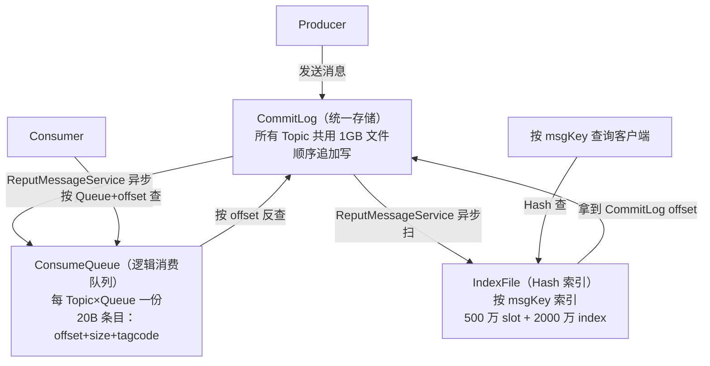
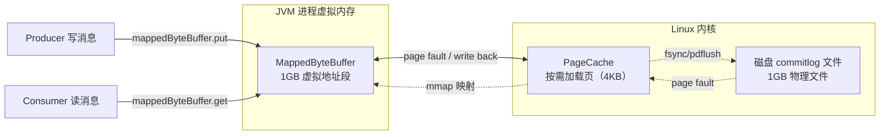
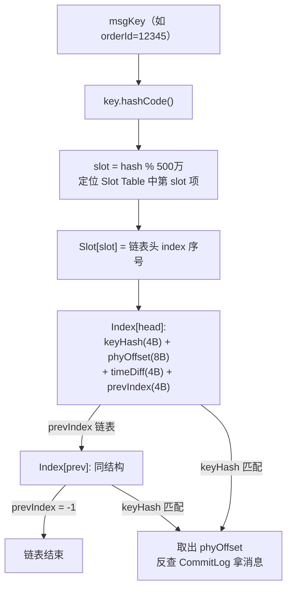
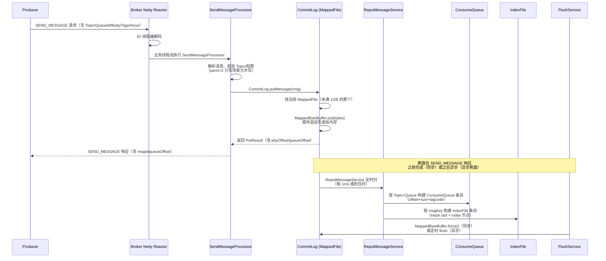
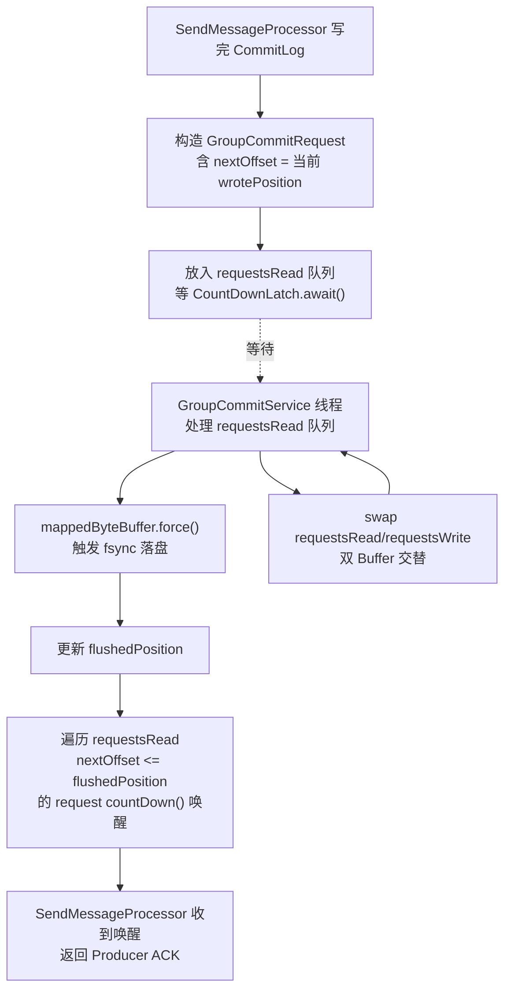
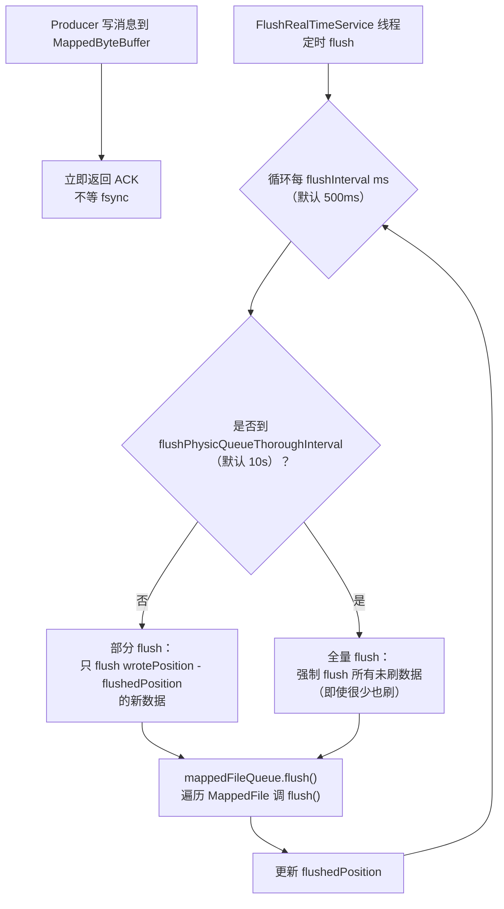
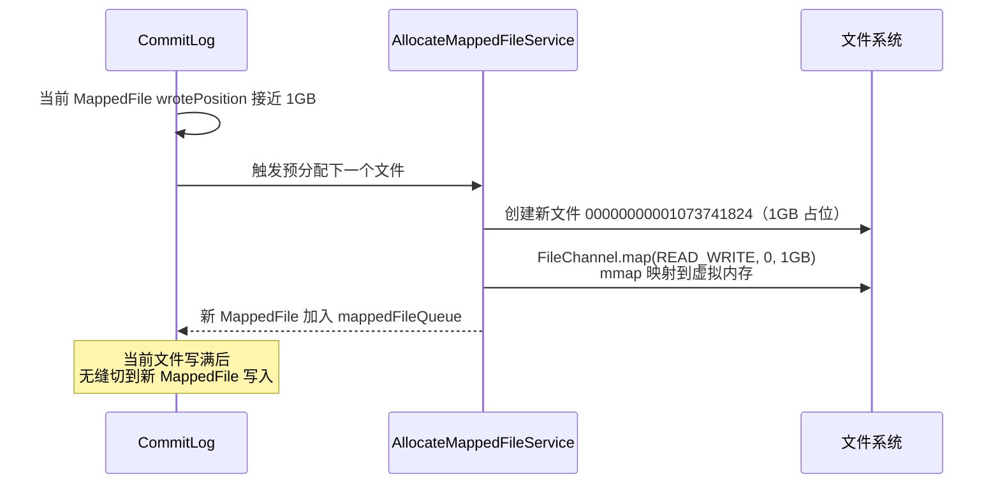
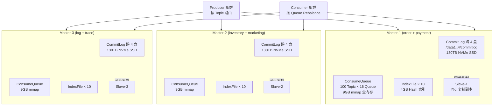
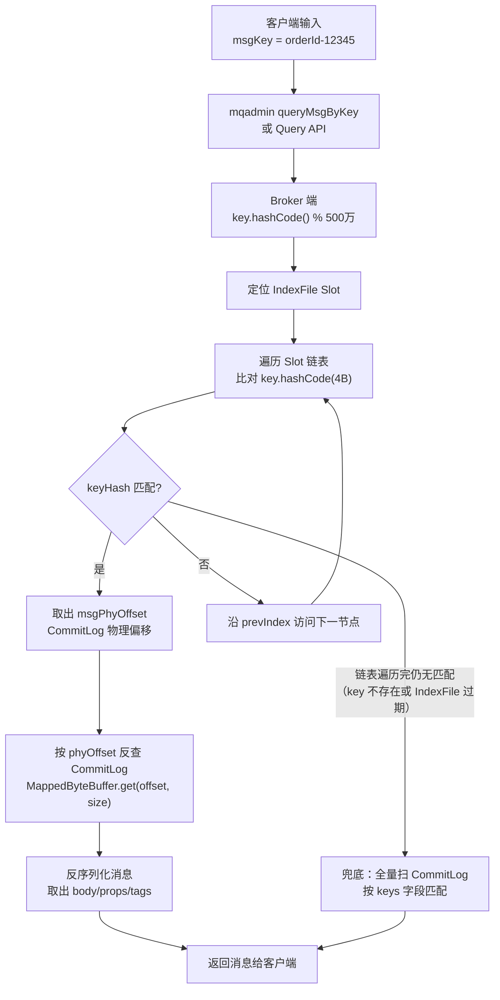

# 存储与刷盘机制

> **一句话定位**：存储是 RocketMQ 性能与可靠性的根基，"CommitLog 为什么统一存储、ConsumeQueue 是什么"是中高级面试分水岭。
> **面试热度**：⭐⭐⭐⭐⭐
> **返回**：[RocketMQ 知识图谱](../README.md)

---

## 一、概念定义

### 1.1 RocketMQ 存储设计哲学

RocketMQ 的 Broker 是**有状态**的消息存储与转发组件（参见 [架构与部署拓扑](../01-architecture/architecture-and-topology.md)），所有消息最终都要落到磁盘。存储层的设计直接决定了 RocketMQ 的两个核心能力——**写吞吐**（Producer 发送 TPS）与**读延迟**（Consumer 消费 P99）。RocketMQ 在存储层做了一件让初学者困惑的事：**所有 Topic 的所有消息都写进同一个文件 CommitLog**，而不是像 Kafka 那样每个 partition 用独立文件。这个看似"反直觉"的设计是 RocketMQ 写性能能与 Kafka 比肩的关键，也是面试高频分水岭。

**统一存储 vs 分区独立文件**的本质差异在于**写盘寻址的随机性**：

- **Kafka 分区独立文件**：每个 partition 对应一组 LogSegment 文件，Producer 发送时按 partition 路由到对应文件追加写。当 Topic×partition 数量增多（如 100 Topic × 10 partition = 1000 个文件），Broker 同时要往 1000 个文件顺序写——每个文件单看是顺序写，但磁盘视角是**多个文件头的交叉写**，物理磁头在多个文件区间跳来跳去，退化为随机写。HDD 上随机写性能急剧下降（顺序写 200MB/s vs 随机写 1-5MB/s），SSD 也会因写放大放大损耗。这是 Kafka 在 partition 数多时性能下降的根本原因。
- **RocketMQ 统一 CommitLog**：所有 Topic 的消息无差别追加到同一个 CommitLog 文件（顺序写一个文件），磁盘视角是**纯粹的顺序写**——磁头不跳，吞吐稳定在磁盘顺序写上限（SSD 200-500MB/s，HDD 100-200MB/s）。即使有 1000 个 Topic×Queue，写入仍是单文件追加，性能不受 Topic 数量影响。代价是**消费时要按 offset 反查 CommitLog**，所以引入 ConsumeQueue 做索引（见 1.2）。

| 维度 | RocketMQ 统一 CommitLog | Kafka 分区独立 LogSegment |
|------|------------------------|--------------------------|
| 写入方式 | 所有 Topic 共用一个文件顺序追加 | 每 partition 独立文件追加 |
| 磁盘视角 | 纯顺序写（单文件头） | 多文件交叉写（partition 多时退化为随机写） |
| 写性能 vs Topic 数 | **不衰减**（核心优势） | partition 数多时衰减 |
| 消费读 | 按 offset 经 ConsumeQueue 索引反查 CommitLog | partition 内顺序读 LogSegment |
| 读性能 | ConsumeQueue 索引后随机读 CommitLog（需 mmap 优化） | partition 内顺序读（局部性好） |
| 适用场景 | Topic 多、消息杂（电商/金融） | Topic 少、partition 内大数据量（日志/流计算） |

**设计权衡的本质**：RocketMQ 用"写入端极致顺序化 + 读取端加索引"换"Topic 数量无关的稳定写吞吐"。这个选择贴合电商/金融场景——业务 Topic 多（订单、支付、库存、营销、积分...），每个 Topic 的 Queue 不算太大，写入吞吐是主要矛盾，消费读延迟靠 mmap + PageCache 兜底。Kafka 的选择贴合日志流计算场景——Topic 少但 partition 内数据量大，partition 内顺序读是主要矛盾，写入端交叉写在 partition 数可控时影响不大。两种设计没有绝对优劣，是场景驱动的取舍。

**为什么 RocketMQ 不学 Kafka 的分区文件？** 因为目标场景不同。RocketMQ 早期定位是电商消息中间件（淘宝双 11），业务上有几百上千个 Topic，每个 Topic 的单分区流量不大（KB/s 级），若用分区文件，几百个文件头交叉写，HDD 直接废掉。统一 CommitLog 把"几百个文件交叉写"压成"一个文件顺序写"，把性能从 Topic 数解耦——这是 RocketMQ 能在 HDD 上扛住电商场景的关键设计。Kafka 不需要这个优化，因为 Kafka 的典型部署 Topic 数少（几个到几十个），每个 partition 流量大（MB/s 级），分区文件交叉写的损耗在可接受范围。

### 1.2 三类文件职责

RocketMQ 的 Broker 存储由 **CommitLog、ConsumeQueue、IndexFile** 三类文件协作构成，理解三者职责分工是讲清存储模型的前提。

| 文件类型 | 职责 | 存储内容 | 文件大小 | 文件命名 | 访问模式 |
|---------|------|---------|---------|---------|---------|
| **CommitLog** | 消息主体存储 | 消息全量内容（含 Topic/QueueId/Body/Tags/Props） | 固定 1GB | 起始 offset（如 `00000000000000000000`、`00000000001073741824`） | 顺序写、随机读 |
| **ConsumeQueue** | 逻辑消费队列索引 | 20 字节条目：8B CommitLog offset + 4B size + 8B tagcode | 固定 30 万条 ≈ 5.72MB | `${topic}/${queueId}/00000000000000000000` | 顺序写、顺序读 |
| **IndexFile** | 消息 Hash 索引 | Hash 索引（按 msgKey/唯一键查询） | 固定 500 万 slot + 2000 万 index ≈ 400MB | 时间戳命名（如 `20260812120000000`） | 随机写、随机读 |

**三者协作链**：Producer 发送消息 → Broker 把消息追加写 CommitLog（顺序写，性能极致）→ 后台 `ReputMessageService` 异步扫 CommitLog，按 Topic×Queue 构建 ConsumeQueue 条目、按 msgKey 构建 IndexFile 条目（解耦写入与索引构建）→ Consumer 消费时先查 ConsumeQueue（按 Topic×Queue+offset 找条目）→ 由条目里的 CommitLog offset 反查 CommitLog 拿到消息体。这是"写入统一、读取索引"的核心架构。



**为什么 ConsumeQueue 是 20 字节条目？** 这是面试常追问的细节。ConsumeQueue 是"逻辑消费队列"——它**不存消息体**，只存索引：①8 字节存该消息在 CommitLog 中的物理 offset（用于反查 CommitLog）；②4 字节存消息总 size（用于从 CommitLog 读出整条消息）；③8 字节存 tagcode（用于 Tag 过滤，消费者订阅 Tag 时先在 ConsumeQueue 条目层过滤，避免回查 CommitLog 浪费 IO）。20 字节紧凑设计让 ConsumeQueue 单文件 30 万条仅 5.72MB，**可以整体 mmap 到内存**，消费时几乎全是内存命中，是 RocketMQ 消费低延迟的关键。

**IndexFile 解决"按 key 查消息"问题**：消息发送时可带 `keys`（业务唯一键，如订单号），Broker 写 IndexFile 做 Hash 索引——key hash 到 500 万 slot 中的某一项，slot 指向 index 链表头，链表节点存 CommitLog offset。这样按 msgKey 查询时走 Hash 索引（O(1) 定位 slot + 链表遍历），比全量扫 CommitLog 快几个数量级。这是 RocketMQ 支撑"按订单号查消息轨迹"等运维场景的底座。

### 1.3 刷盘策略

消息写 CommitLog 后，先进入 MappedByteBuffer 的 page cache，**何时真正 fsync 到磁盘扇区**由刷盘策略决定。RocketMQ 提供两档：**同步刷盘 SYNC_FLUSH** 与 **异步刷盘 ASYNC_FLUSH**，对应不同可靠性档位。

| 维度 | 同步刷盘 SYNC_FLUSH | 异步刷盘 ASYNC_FLUSH（默认） |
|------|--------------------|-----------------------------|
| 刷盘时机 | 每条消息写入后 fsync 落盘才返回 ACK | 写入 page cache 立即返回 ACK，后台定时 fsync |
| 数据丢失窗口 | 几乎为 0（断电最多丢 fsync 中的数据） | 默认 500ms 间隔，断电最多丢 500ms 数据 |
| 写入性能 | 单 Master 约 1-3 万 TPS（fsync 阻塞） | 单 Master 约 10 万 TPS（不阻塞） |
| 适用场景 | 金融级不丢消息（交易、支付） | 普通业务消息（订单、营销、日志） |
| 实现类 | `GroupCommitService`（双 Buffer 交替等待） | `FlushRealTimeService`（定时 flush） |

**两档策略的取舍本质是"可靠性 vs 性能"的权衡**：fsync 是同步 IO，必须等磁盘控制器确认写入扇区完成，HDD 一次 fsync 约 5-10ms，SSD 约 0.5-1ms。同步刷盘让每条消息都等 fsync，相当于把磁盘 IO 延迟叠加到每条消息的 ACK 上——单 Master 写吞吐从 10 万 TPS 暴跌到 1-3 万 TPS。异步刷盘写入只到 page cache，断电时 page cache 中未 fsync 的数据会丢，但写吞吐保持 10 万 TPS 级。

**生产实践**：默认用**异步刷盘 + 同步复制**（`ASYNC_FLUSH` + `SYNC_MASTER`）——刷盘异步保性能，副本同步保可靠性，断电时 Slave 上的副本还在，组合可靠性接近同步刷盘但性能高 3-5 倍。仅金融交易、支付核心链路用同步刷盘 + 同步复制（`SYNC_FLUSH` + `SYNC_MASTER`），TPS 下降可接受，换"绝不丢消息"。

### 1.4 零拷贝对比：RocketMQ 为什么用 mmap 不用 sendfile

RocketMQ 消费时要把 CommitLog 中的消息从磁盘读到内存再发给 Consumer，这涉及"内核态数据 → 用户态 → 内核态 socket"的拷贝。Linux 提供两类零拷贝（避免用户态中转）——`mmap` 和 `sendfile`，RocketMQ 选了 **mmap**，Kafka 选了 **sendfile**，这个差异是面试高频追问。

| 维度 | mmap（RocketMQ） | sendfile（Kafka） |
|------|-----------------|------------------|
| 原理 | 把文件映射到进程虚拟内存，用户态与内核态**共享页**，用户态可直接读 | 内核态把文件数据直接拷贝到 socket buffer，全程不经用户态 |
| 用户态可见 | 是（MappedByteBuffer 可读） | 否（数据全程在内核态） |
| 读模式 | 适合**随机读**（按 offset 任意位置读） | 适合**顺序读**（从头到尾连续发） |
| 写模式 | 支持写（MappedByteBuffer 可写，顺序追加） | 不支持写（只读+发） |
| RocketMQ 用途 | CommitLog 写入 + 消费时按 offset 读消息体 | 不适用 |
| Kafka 用途 | 不用 | partition 顺序读 + 发给 Consumer |

**RocketMQ 选 mmap 的根本原因——消费者按 offset 随机读**：RocketMQ 的消费场景是 Consumer 拉取消息时，先查 ConsumeQueue（拿到一批 CommitLog offset），再按这些 offset **随机**反查 CommitLog——offset 不连续，物理位置跳跃。mmap 把 CommitLog 文件映射到虚拟内存，按 offset 读相当于内存随机访问（PageCache 命中时几乎零延迟），完全契合随机读。sendfile 是连续顺序读 + 发，无法支持"按指定 offset 跳读"。

**Kafka 选 sendfile 的根本原因——partition 内顺序读**：Kafka Consumer 按 partition 顺序消费（Consumer 主动 fetch，offset 连续递增），磁盘读是顺序读，sendfile 让内核态直接把文件数据拷到 socket，全程不经用户态，零拷贝极致。但 sendfile 不支持"跳到任意 offset 读"——只能从头到尾或从某点连续读，对 Kafka 顺序消费够用。

**RocketMQ 不用 sendfile 的另一个原因**：sendfile 只能"读文件 + 发 socket"，RocketMQ 的 CommitLog 还要**写入**（Producer 发消息写 CommitLog），sendfile 不支持写。mmap 既可读又可写，RocketMQ 用同一个 MappedByteBuffer 既写消息又读消息，复用映射。所以 RocketMQ 的存储底座是 `MappedFile`（封装 `MappedByteBuffer`），与 Kafka 用 `FileChannel.transferTo`（sendfile）形成鲜明对比。

---

## 二、原理与流程

### 2.1 CommitLog 结构

CommitLog 是所有 Topic 消息的统一主体存储文件，物理上由一组固定 **1GB** 大小的文件组成，文件名即该文件的**起始物理 offset**。

**文件布局**：

```
${storePathRootDir}/commitlog/
├── 00000000000000000000         # offset 0 起，1GB
├── 00000000001073741824         # offset 1073741824 起（1GB = 1073741824 字节）
├── 00000000002147483648         # offset 2147483648 起
└── ...                          # 按需新建
```

文件名是 20 位补零的数字，表示该文件在 CommitLog 全局 offset 中的起始位置。当当前文件写满 1GB 时，`AllocateMappedFileService` 预分配下一个文件（见 2.7），新文件起始 offset = 上一文件起始 + 1GB。消息写入时按全局物理 offset 追加，落到对应文件——`MappedFile.getFileFromOffset(offset)` 根据文件名二分定位文件，再在文件内偏移 `offset - fileFromOffset` 处写入。

**消息格式**（CommitLog 中每条消息的序列化结构，简化版）：

```
+----------+----------+----------+-----------+-----------+-----------+----------+
| TOTALSIZE | MAGICODE| BODYCRC  | QUEUEID   | FLAG      | QUEUEOFFSET| ...
| 4B        | 4B      | 4B       | 4B        | 4B        | 8B         |
+----------+----------+----------+-----------+-----------+-----------+----------+
| ... PHYSICALOFFSET(8B) | PRODUCERGROUP | ... | TOPIC(变长) | ... | BODY(变长) |
+----------+----------+----------+-----------+-----------+-----------+----------+
```

关键字段：①`TOTALSIZE`（4B）整条消息长度，读取时按此长度切分；②`QUEUEOFFSET`（8B）消息在 Queue 中的逻辑 offset；③`PHYSICALOFFSET`（8B）消息在 CommitLog 中的物理 offset；④`BODYCRC`（4B）消息体 CRC 校验；⑤`TOPIC`（变长，长度前缀）和 `BODY`（变长，长度前缀）。每条消息约 100-200 字节元信息 + 消息体，单文件 1GB 可存几百万条小消息。

**`MappedFile` 与 `MappedByteBuffer`**：`MappedFile` 是 RocketMQ 对 `MappedByteBuffer` 的封装（`store.MappedFile`），用 `FileChannel.map(MapMode.READ_WRITE, 0, fileSize)` 把文件映射到进程虚拟内存。写入时调 `mappedByteBuffer.put(bytes)` 直接写虚拟内存（内核同步刷到 page cache），读取时调 `mappedByteBuffer.get(position)` 按 offset 随机读。映射后整个 1GB 文件在虚拟内存中只是一段指针，物理页按需从磁盘 page fault 加载——写入只触发虚拟内存写入，OS 的 pdflush 后台刷 page cache 到磁盘（异步刷盘）；或主动 `mappedByteBuffer.force()` 触发 fsync（同步刷盘）。



**mmap 的页对齐问题**：mmap 映射的文件大小必须是页（4KB）对齐，1GB 是 4KB 的整数倍，无问题。但若文件不足 1GB（最后一个文件），mmap 仍按 1GB 映射，超出实际文件尾部的部分访问会触发 SIGBUS——RocketMQ 通过预分配（2.7）保证当前活跃文件始终是完整 1GB，避免越界访问。

> **源码路径**：`store.CommitLog`（消息追加写主入口 `putMessage`、按 offset 读 `getMessage`）、`store.MappedFile`（封装 `MappedByteBuffer`，`appendMessage` 写入、`selectMappedBuffer` 读取视图）、`store.DefaultMessageStore`（管理 CommitLog 与 ConsumeQueue 协作）。

### 2.2 ConsumeQueue 结构

ConsumeQueue 是 CommitLog 的**逻辑消费索引**——每个 Topic×Queue 对应一个 ConsumeQueue 目录，里面是一组固定大小（30 万条 ≈ 5.72MB）的索引文件。

**目录布局**：

```
${storePathRootDir}/consumequeue/
├── order-topic/                       # Topic 名
│   ├── 0/                             # Queue 0
│   │   ├── 00000000000000000000       # 第 0 条索引起，30 万条
│   │   ├── 0000000000060000000        # 第 30 万条索引起
│   │   └── ...
│   ├── 1/                             # Queue 1
│   └── ...
├── payment-topic/
└── ...
```

**条目格式**（每条 20 字节，紧凑定长）：

```
+----------------------+---------------------+----------------------+
| CommitLog Offset (8B)| MsgSize (4B)        | Tag HashCode (8B)    |
+----------------------+---------------------+----------------------+
```

- **CommitLog Offset**（8B）：消息在 CommitLog 中的物理 offset，用于反查 CommitLog 读消息体。
- **MsgSize**（4B）：消息总长度，从 CommitLog 读时按此长度读取整条消息。
- **Tag HashCode**（8B）：消息 Tags 的 hashcode，用于消费时 Tag 过滤——Consumer 订阅 `tagA || tagB`，Broker 在 ConsumeQueue 层先按 tagcode 过滤掉不匹配的条目，避免回查 CommitLog 浪费 IO。

**索引关系**：ConsumeQueue 的条目索引 = 该 Queue 中的逻辑 offset（第 N 条消息对应 ConsumeQueue 第 N 条索引）。Consumer 消费时上报位点（`consumeOffset`），Broker 用 `consumeOffset × 20B` 定位到 ConsumeQueue 的对应条目，读出 CommitLog offset，再从 CommitLog 读消息。这个过程的关键是 ConsumeQueue 单文件 5.72MB，**整体 mmap 到内存**，访问条目几乎全是内存命中，性能极高。

**ConsumeQueue 与 CommitLog 的解耦**：ConsumeQueue 是异步构建的——`ReputMessageService`（`store.DefaultMessageStore` 内部线程）定时扫 CommitLog 新写入的消息，按 Topic×Queue 拆分，写对应的 ConsumeQueue。这种解耦让写入端（CommitLog 顺序写）与索引端（ConsumeQueue 构建）异步并行，写入性能不受索引构建拖累。代价是 ConsumeQueue 有几十毫秒的构建延迟——消息刚写 CommitLog 后极短时间内（<100ms），ConsumeQueue 还没构建，Consumer 此时拉取会拉不到。这个延迟对绝大多数业务可接受。

**ConsumeQueue 的边界**：每个 ConsumeQueue 文件固定 30 万条，写满后新建下一个文件，文件名是该文件起始逻辑 offset。ConsumeQueue 的逻辑 offset 与 Queue 中的消息序号一一对应——Queue 第 0 条消息对应 ConsumeQueue 第 0 条索引，第 30 万条消息对应下一个文件的第 0 条索引。这种定长条目 + 文件大小设计让 ConsumeQueue 支持按逻辑 offset O(1) 定位——`文件 = offset / 30万`、`文件内偏移 = (offset % 30万) × 20B`。

> **源码路径**：`store.ConsumeQueue`（ConsumeQueue 文件管理，`putMessagePositionInfo` 构建索引条目、`getIndexBuffer` 按 offset 读条目）、`store.ConsumeQueueStore`（管理所有 Topic×Queue 的 ConsumeQueue 集合）、`store.ReputMessageService`（扫 CommitLog 异步构建 ConsumeQueue 与 IndexFile）。

### 2.3 IndexFile 结构

IndexFile 是 RocketMQ 的 **Hash 索引文件**，支撑按 msgKey（业务唯一键，如订单号、流水号）查询消息。IndexFile 结构固定——500 万 slot + 2000 万 index，单文件约 400MB。

**文件结构**：

```
+----------------+---------------------+----------------------+----------------------+
| Header (40B)   | Slot Table (500万×4B)| Index List (2000万×20B)|
+----------------+---------------------+----------------------+----------------------+
```

- **Header**（40B）：含 `beginTimestamp`、`endTimestamp`（消息时间区间）、`beginPhyOffset`、`endPhyOffset`（CommitLog offset 区间）、`hashSlotCount`、`indexCount` 等。
- **Slot Table**（500 万 × 4B = 20MB）：500 万个 slot，每个 slot 4 字节存"该 slot 上一次写入的 index 节点序号"（链表头）。slot 的位置 = `key.hashCode() % 500万`。
- **Index List**（2000 万 × 20B = 400MB）：每个 index 节点 20 字节——`key.hashCode(4B)` + `msgPhyOffset(8B)`（CommitLog offset）+ `timeDiff(4B)`（与 header beginTimestamp 的时间差，用于时间区间查询）+ `prevIndex(4B)`（同一 slot 上一个 index 节点序号，链表指针）。

**Hash 索引结构**：



**查询流程**：①客户端传 msgKey → ②`key.hashCode() % 500万` 定位 slot → ③读 `Slot[slot]` 拿链表头 index 序号 → ④沿 `prevIndex` 遍历链表，比对每个节点的 `key.hashCode(4B)` 是否匹配（解决 Hash 冲突）→ ⑤匹配的节点取 `msgPhyOffset` 反查 CommitLog 拿消息。

**为什么 500 万 slot + 2000 万 index？** 这是负载因子的权衡——2000 万 index / 500 万 slot = 4，平均每个 slot 链表长度 4，查询时平均遍历 4 个节点（每个 20B，共 80B 内存访问），效率高。如果 slot 太少（如 100 万），链表平均长度 20，查询慢；如果 slot 太多（如 1 亿），Slot Table 占 400MB 内存，浪费。500 万:2000 万 是工程上的平衡点。

**时间区间查询**：IndexFile 还支持按时间区间查消息——Header 记录 `beginTimestamp/endTimestamp`，每个 index 节点记 `timeDiff`，查询时先按 Header 判断该 IndexFile 时间范围是否匹配，匹配后遍历 index 节点按 `timeDiff` 过滤。这是支撑 RocketMQ `mqadmin queryMsgByTime` 命令的底座。

**IndexFile 写满后切换**：2000 万 index 写满后，新建下一个 IndexFile（文件名是时间戳），Header 的 `beginPhyOffset` 续接上一文件 `endPhyOffset`。多个 IndexFile 链式组成完整的 Hash 索引，查询时 Broker 遍历所有 IndexFile 的 Header 判断时间/offset 范围，定位到候选文件后再 Hash 查询。

> **源码路径**：`store.IndexService`（管理 IndexFile 集合，`load` 启动时加载、`queryIndex` 按 key 查询、`buildIndex` 构建 index 节点）、`store.index.IndexFile`（单文件实现，`putKey` 写 index 节点、`selectPhyOffset` Hash 查询）。

### 2.4 消息写入全流程

Producer 发送消息到 Broker 写入 CommitLog 的完整流程，是面试讲清存储机制的"主线剧情"：



**关键时序**：①**写入 CommitLog 是同步阻塞**——SendMessageProcessor 调 `CommitLog.putMessage` 写入 MappedByteBuffer 完成才返回，这一步是 Producer ACK 的前提；②**刷盘根据策略**——同步刷盘在 ACK 前 fsync 完成，异步刷盘 ACK 后异步 fsync；③**ConsumeQueue/IndexFile 构建完全异步**——ReputMessageService 后台扫，不阻塞 Producer ACK。这个时序设计让 Producer 感知的延迟只取决于"写 CommitLog + 是否同步刷盘"，索引构建异步不拖累发送端。

**SendMessageProcessor 的预处理**：业务线程收到请求后做校验——Topic 是否存在（不存在且 `autoCreateTopicEnable=true` 则用 TBW107 兜底自动创建，生产应关）、`perm` 是否允许写（perm=2 或 6 才允许写）、消息体大小是否超限（默认 4MB）、QueueId 是否合法（0 到 readQueueNums-1）。校验通过后调 `CommitLog.putMessage` 进入存储层。

**CommitLog.putMessage 的细节**：①找到当前活跃的 MappedFile（最后一个未写满 1GB 的文件）；②对消息做序列化（按 2.1 的消息格式拼装 byte[]）；③`mappedByteBuffer.put(bytes)` 追加到虚拟内存；④更新 MappedFile 的 `wrotePosition`；⑤返回 `PutResult` 含 phyOffset（物理 offset）和 queueOffset（逻辑 offset）。整个过程无锁（单 Broker 单线程写 CommitLog，5.x 引入 `GroupCommitService` 双 Buffer 也是单线程顺序处理）。

### 2.5 同步刷盘流程

同步刷盘（`SYNC_FLUSH`）在消息写入 MappedByteBuffer 后，**先 fsync 落盘再返回 Producer ACK**，保证每条消息都真正写入磁盘扇区。实现类是 `GroupCommitService`。

**核心机制——双 Buffer 交替 + GroupCommitRequest**：



**双 Buffer 交替的设计**：`GroupCommitService` 维护两个请求队列 `requestsRead` 和 `requestsWrite`——Producer 写消息后把 `GroupCommitRequest` 放入 `requestsWrite`，Service 线程处理 `requestsRead`，处理完一次后 swap 两个队列（`requestsRead` 变空，`requestsWrite` 变成新的 `requestsRead`）。这个设计让"提交刷盘请求"与"执行刷盘"解耦——Producer 提交请求到 `requestsWrite` 不阻塞 Service 线程处理 `requestsRead`，避免锁竞争。

**核心代码片段**（简化版）：

```java
// store.CommitLog.GroupCommitService（5.x）
class GroupCommitService extends ServiceThread {
    private List<GroupCommitRequest> requestsWrite = new ArrayList<>();
    private List<GroupCommitRequest> requestsRead = new ArrayList<>();

    // Producer 写完 CommitLog 后调此方法提交刷盘请求
    public synchronized void putRequest(final GroupCommitRequest request) {
        synchronized (this) {
            requestsWrite.add(request);
        }
        if (hasNotServed()) {
            wakeup();
        }
    }

    // Service 线程主循环
    public void run() {
        while (!stopped) {
            // swap：把 write 队列切给 read 处理，write 队列清空继续接新请求
            this.swapRequests();
            // 处理 read 队列：fsync + 唤醒等待的 Producer
            for (GroupCommitRequest req : this.requestsRead) {
                boolean flushOk = CommitLog.this.mappedFileQueue.getFlushedWhere() >= req.getNextOffset();
                for (int i = 0; i < 2 && !flushOk; i++) {
                    // fsync 落盘
                    CommitLog.this.mappedFileQueue.flush(100);
                    flushOk = CommitLog.this.mappedFileQueue.getFlushedWhere() >= req.getNextOffset();
                }
                // 唤醒等待的 Producer ACK
                req.wakeupCustomer(flushOk ? PutStatusEnum.PUT_OK : PutStatusEnum.FLUSH_DISK_TIMEOUT);
            }
            this.requestsRead.clear();
        }
    }
}
```

**性能损耗**：同步刷盘每条消息要等 fsync（HDD 5-10ms / SSD 0.5-1ms），相当于把磁盘 IO 延迟叠加到每条消息 ACK 上——单 Master 写吞吐从异步的 10 万 TPS 暴跌到 1-3 万 TPS（SSD），HDD 更低（1 万 TPS 以下）。`GroupCommitService` 的双 Buffer 交替是把"等 fsync 的多个请求批量处理"优化——一次 fsync 能唤醒多个等待的 request，减少 fsync 次数，但本质仍是"每批请求等一次 fsync"。

**同步刷盘的超时**：`GroupCommitService` 的 fsync 有超时（默认 5s），超过则返回 `FLUSH_DISK_TIMEOUT`，Producer 收到后认为发送失败触发重试。生产中应监控同步刷盘超时率，超时率高说明磁盘 IO 瓶颈或磁盘故障。

> **源码路径**：`store.CommitLog.GroupCommitService`（同步刷盘主循环，`putRequest`/`swapRequests`/`run`）、`store.CommitLog.GroupCommitRequest`（刷盘请求封装，含 `nextOffset` 与 `CountDownLatch`）、`store.MappedFileQueue.flush`（遍历 MappedFile 调 `force()`）。

### 2.6 异步刷盘流程

异步刷盘（`ASYNC_FLUSH`，默认）在消息写入 MappedByteBuffer 后**立即返回 Producer ACK**，不阻塞等 fsync——fsync 由 `FlushRealTimeService` 后台定时执行。这是 RocketMQ 的默认刷盘策略，性能最优。

**核心机制——定时 flush + 全量刷间隔**：



**两个关键间隔参数**：

| 参数 | 默认值 | 作用 |
|------|--------|------|
| `flushInterval`（`FlushRealTimeService` 循环间隔） | 500ms | 后台线程每 500ms 执行一次 flush |
| `flushPhysicQueueThoroughInterval`（全量刷间隔） | 10s | 每 10s 强制全量 flush 一次，避免低写入时数据长期不刷 |

**部分 flush vs 全量 flush**：正常情况下（每 500ms 一次），`FlushRealTimeService` 只 flush `wrotePosition - flushedPosition` 之间的新数据（增量）；但低写入场景下，可能 500ms 内只有几条消息，部分 flush 会导致这些消息长期不落盘——所以引入 `flushPhysicQueueThoroughInterval`（10s），每 10s 强制全量 flush 一次，保证低写入时数据也能及时落盘。

**核心代码片段**（简化版）：

```java
// store.CommitLog.FlushRealTimeService（5.x）
class FlushRealTimeService extends ServiceThread {
    public void run() {
        int flushInterval = messageStoreConfig.getFlushIntervalCommitLog();       // 500ms
        int thoroughInterval = messageStoreConfig.getFlushPhysicQueueThoroughInterval(); // 10s
        long last = System.currentTimeMillis();
        while (!stopped) {
            boolean flushThoroughly = System.currentTimeMillis() - last >= thoroughInterval;
            if (flushThoroughly) {
                last = System.currentTimeMillis();
            }
            // 等待 flushInterval 或被唤醒
            this.waitForRunning(flushInterval);
            // flush：thoroughly=true 时强制全量，否则只 flush 增量
            CommitLog.this.mappedFileQueue.flush(flushThoroughly ? 500 : 100);
        }
    }
}
```

**异步刷盘的数据丢失窗口**：断电时 page cache 中未 fsync 的数据全丢——最坏情况是上一次 flush 到断电这 500ms 内的所有写入，丢失窗口 ≤ 500ms（实际更短，因 OS 的 pdflush 也会刷 page cache）。对绝大多数业务（订单、营销、日志）可接受，配合**异步刷盘 + 同步复制**（Slave 有副本）组合可靠性接近同步刷盘但性能高 3-5 倍。

**FlushRealTimeService vs GroupCommitService 的本质差异**：GroupCommitService 每批请求等 fsync 完成才唤醒 Producer（同步阻塞）；FlushRealTimeService 写入立即返回 ACK，fsync 后台异步（不阻塞）。两者底层都是 `mappedFileQueue.flush()`（调 `MappedByteBuffer.force()`），差异在"fsync 是否阻塞 Producer ACK"——这决定了同步刷盘与异步刷盘的性能差距。

> **源码路径**：`store.CommitLog.FlushRealTimeService`（异步刷盘主循环）、`store.MappedFileQueue.flush`（遍历 MappedFile 调 `MappedFile.flush()`）、`store.MappedFile.flush`（封装 `mappedByteBuffer.force()`）。

### 2.7 文件预分配与回收

RocketMQ 的 CommitLog 是一组 1GB 文件，运行时需要动态创建新文件（当前文件写满）和清理过期文件（超过保留时长）。这两个操作由专门的后台服务异步完成，避免阻塞写入主流程。

**文件预分配——`AllocateMappedFileService`**：当前活跃的 MappedFile 写满 1GB 前，`AllocateMappedFileService` 会预创建下一个文件并 mmap 映射。具体策略：监控当前 MappedFile 的 `wrotePosition`，当接近 1GB（默认剩 10% 时）触发预分配——新建一个 1GB 文件（`FileChannel` + `map(MapMode.READ_WRITE, 0, 1GB)`），放入 `mappedFileQueue` 队列。这样当前文件写满时，下一个 MappedFile 已经准备好，写入无缝切换，不会因"文件创建 + mmap 映射"（约 10-50ms）阻塞 Producer 发送。



**预分配的两种实现**：①`mmap` 方式（默认）——直接 `FileChannel.map()` 映射，速度快但虚拟内存占用大；②`FileChannel + 堆外 ByteBuffer` 方式（部分场景）——用堆外 ByteBuffer 写入再 `transferTo` 文件，避免 mmap 的虚拟内存占用。生产默认用 mmap，性能最优。

**文件回收——`CleanCommitLogService`**：RocketMQ 消息有过期保留时长（`fileReservedTime` 默认 72 小时），超过保留时长的 CommitLog 文件会被 `CleanCommitLogService` 清理。具体策略：`CleanCommitLogService` 定时（默认每 10s）扫所有 MappedFile，判断文件的"最后一条消息时间"是否超过 `fileReservedTime`，超过则删除文件释放磁盘空间。

**过期判定的特殊性**：RocketMQ 的过期判定是**文件级**而非消息级——只要文件里还有一条消息未过期，整个 1GB 文件就不能删。这导致实际保留时长可能比 `fileReservedTime` 长——文件最后一条消息过期后才能删整个文件，前面消息的保留时长会超过 72h。这个设计避免了"逐条消息删除"的复杂度（消息是定长追加写，无法在文件中间删除），代价是磁盘占用比理论值略高（多保留一个文件的容量）。

**过期清理的前提——消费进度**：`CleanCommitLogService` 删除文件前会检查 ConsumeQueue 的消费进度——如果某 Queue 的消费位点还落后于该文件，说明消息没消费完，**不能删**（否则 Consumer 消费时会拉不到消息）。只有所有 Queue 的消费位点都超过该文件，且超过 `fileReservedTime`，才删除。这避免了"消息还没消费完就被清理"的问题。

**文件相关的关键配置**：

| 配置项 | 默认值 | 作用 |
|--------|--------|------|
| `fileReservedTime` | 72（小时） | 文件保留时长，超过且消费完才删 |
| `deleteWhen` | `04`（凌晨 4 点） | 定时清理时段（避免高峰清理） |
| `deleteExpiredFilesInterval` | `120000`（120s） | 清理任务执行间隔 |
| `maxMessageSize` | `4194304`（4MB） | 单条消息最大大小 |
| `mapedFileSizeCommitLog` | `1073741824`（1GB） | CommitLog 单文件大小 |
| `mapedFileSizeConsumeQueue` | `300000`（条） | ConsumeQueue 单文件条目数 |
| `flushDiskType` | `ASYNC_FLUSH` | 刷盘策略（SYNC_FLUSH/ASYNC_FLUSH） |

> **源码路径**：`store.AllocateMappedFileService`（预分配 MappedFile，`putMMapRequest`/`mMapOperation`）、`store.CleanCommitLogService`（过期清理，`run`/`deleteExpiredFile`）、`store.MappedFileQueue`（管理 MappedFile 队列，`getMappedFile`/`flush`/`commit`）。

### 2.8 源码路径汇总

| 功能 | 源码路径 | 核心类/方法 |
|------|---------|------------|
| CommitLog 消息主体 | `store.CommitLog` | `putMessage`（写）、`getMessage`（读） |
| MappedFile 文件封装 | `store.MappedFile` | `appendMessage`（追加写）、`selectMappedBuffer`（读视图）、`flush`（fsync） |
| MappedFile 队列管理 | `store.MappedFileQueue` | `getMappedFile`、`flush`、`commit` |
| ConsumeQueue 逻辑队列 | `store.ConsumeQueue` | `putMessagePositionInfo`（构建索引）、`getIndexBuffer`（按 offset 读） |
| ConsumeQueue 集合管理 | `store.ConsumeQueueStore` | `findConsumeQueue`（按 Topic×Queue 查找）、`load`（启动加载） |
| IndexFile Hash 索引 | `store.index.IndexFile` | `putKey`（写 index）、`selectPhyOffset`（Hash 查询） |
| IndexFile 集合管理 | `store.IndexService` | `load`、`queryIndex`、`buildIndex` |
| 异步构建索引 | `store.DefaultMessageStore.ReputMessageService` | `doReput`（扫 CommitLog 构建 CQ/IndexFile） |
| 同步刷盘 | `store.CommitLog.GroupCommitService` | `putRequest`、`swapRequests`、`run` |
| 同步刷盘请求 | `store.CommitLog.GroupCommitRequest` | `nextOffset`、`wakeupCustomer` |
| 异步刷盘 | `store.CommitLog.FlushRealTimeService` | `run`、`waitForRunning` |
| 文件预分配 | `store.AllocateMappedFileService` | `putMMapRequest`、`mMapOperation` |
| 文件回收 | `store.CleanCommitLogService` | `deleteExpiredFile`、`isSpaceEnough` |
| 消息存储主类 | `store.DefaultMessageStore` | `putMessage`、`getMessage`、`start`、`load` |
| 发送消息处理器 | `broker.processor.SendMessageProcessor` | `processRequest`、`buildMsgContext` |

---

## 三、高频追问

### Q1：RocketMQ 存储和 Kafka 有什么区别？

**核心差异是 CommitLog 统一存储 vs Kafka 分区独立文件**。RocketMQ 所有 Topic 的消息写同一个 CommitLog 文件，磁盘视角是纯顺序写，写性能不受 Topic 数量影响——这是为电商场景多 Topic 设计的；Kafka 每 partition 独立 LogSegment 文件，partition 多时磁盘退化为多文件交叉写，性能衰减——但 partition 内顺序读局部性好，适合日志流计算。RocketMQ 消费时按 offset 经 ConsumeQueue 索引反查 CommitLog（随机读，靠 mmap 优化），Kafka partition 内顺序读（sendfile 零拷贝）。两种设计是场景驱动的取舍。

### Q2：ConsumeQueue 是什么？

**逻辑消费队列索引，每个 Topic×Queue 对应一份，每条 20 字节**（8B CommitLog offset + 4B msgSize + 8B tagcode）。它不存消息体，只存索引——Consumer 消费时按位点（逻辑 offset）查 ConsumeQueue 条目，拿到 CommitLog 物理 offset 反查 CommitLog 拿消息。ConsumeQueue 单文件 30 万条约 5.72MB，整体 mmap 到内存，访问几乎全内存命中，是消费低延迟的关键。ConsumeQueue 是异步构建的（`ReputMessageService` 扫 CommitLog），与写入端解耦。

### Q3：为什么 RocketMQ 用 mmap 不用 sendfile？

**因为消费者按 offset 随机读，sendfile 不支持随机读**。RocketMQ 消费场景是 Consumer 拉一批 CommitLog offset 反查 CommitLog，offset 不连续、物理位置跳跃，需要"按指定 offset 跳读"。mmap 把 CommitLog 映射到虚拟内存，按 offset 读相当于内存随机访问（PageCache 命中时零延迟），契合随机读。sendfile 是连续顺序读 + 发给 socket，不支持跳读。Kafka 用 sendfile 是因为 partition 内顺序消费（offset 连续递增），契合顺序读。另外 sendfile 只能读不能写，RocketMQ CommitLog 还要写入，必须用 mmap。

### Q4：同步刷盘和异步刷盘怎么选？

**金融级不丢消息用同步刷盘，普通业务用异步刷盘**。同步刷盘（`SYNC_FLUSH`）每条消息等 fsync 完成才 ACK，TPS 降到 1-3 万（SSD），断电不丢；异步刷盘（`ASYNC_FLUSH`，默认）写入立即 ACK，后台定时 fsync（500ms），TPS 10 万+，断电最多丢 500ms。生产实践推荐**异步刷盘 + 同步复制**（`ASYNC_FLUSH` + `SYNC_MASTER`）——刷盘异步保性能，副本同步保可靠性，断电时 Slave 有副本兜底，组合可靠性接近同步刷盘但性能高 3-5 倍。仅交易、支付核心链路用同步刷盘 + 同步复制。

### Q5：CommitLog 文件多大？

**固定 1GB**。每个 CommitLog 文件 1GB，文件名是该文件在全局 offset 中的起始位置（20 位补零数字，如 `00000000000000000000`、`00000000001073741824`）。写满 1GB 后新建下一个文件，`AllocateMappedFileService` 预分配保证无缝切换。1GB 是工程权衡——太小（如 100MB）文件数多管理开销大、mmap 映射次数多；太大（如 10GB）单文件占用大、过期清理粒度粗（一个文件要等所有消息过期才能删）。1GB 适配 mmap 虚拟内存映射与文件管理粒度。

### Q6：IndexFile 怎么按 key 查消息？

**Hash 索引 + 链表解决冲突**。IndexFile 有 500 万 slot + 2000 万 index 节点，查询时 `key.hashCode() % 500万` 定位 slot，读 `Slot[slot]` 拿链表头 index 序号，沿 `prevIndex` 遍历链表，比对每个节点的 `key.hashCode(4B)` 匹配（解决 Hash 冲突），匹配的节点取 `msgPhyOffset` 反查 CommitLog 拿消息。平均链表长度 4（2000 万/500 万），查询效率高。未命中时（如 key 不存在或 IndexFile 过期被清理）退化为全量扫 CommitLog 兜底（极慢，仅运维场景用）。

### Q7：文件过期怎么清理？

**`fileReservedTime` 默认 72 小时，超过保留时长且消费完才删整个文件**。`CleanCommitLogService` 每 10s 扫所有 MappedFile，判断文件最后一条消息时间是否超过 72h——超过且所有 Queue 的消费位点都超过该文件（消息已消费完），则删整个 1GB 文件。注意是**文件级清理**而非消息级——只要文件里还有一条消息未过期，整个 1GB 文件不能删，所以实际保留时长可能比 72h 略长（多保留一个文件的容量）。`deleteWhen=04` 配置在凌晨 4 点低峰期清理，避免高峰清理影响性能。

### Q8：MappedFile 和 MappedByteBuffer 的关系？

**MappedFile 封装 MappedByteBuffer**。`MappedByteBuffer` 是 JDK 提供的 mmap API（`FileChannel.map()` 返回），把文件映射到进程虚拟内存，用户态可直接读写虚拟地址。`MappedFile`（`store.MappedFile`）是 RocketMQ 对 `MappedByteBuffer` 的封装——它持有 `MappedByteBuffer` 引用，提供 `appendMessage`（追加写）、`selectMappedBuffer`（按 offset 读视图）、`flush`（调 `mappedByteBuffer.force()` 触发 fsync）等方法，并管理文件的 `wrotePosition`/`flushedPosition`/`committedPosition` 三指针。简单说，`MappedByteBuffer` 是底层 mmap 句柄，`MappedFile` 是 RocketMQ 在其上加的存储管理层。

---

## 四、实战关联（Java 后端视角）

### 4.1 Producer 的 SendResult 与 flushDiskType 配置

Java 后端用 `rocketmq-client` 发送消息，刷盘策略在 Broker 端配置（`broker.conf` 的 `flushDiskType`），但 Producer 侧可通过 `SendResult` 感知刷盘状态：

```java
DefaultMQProducer producer = new DefaultMQProducer("order-producer-group");
producer.setNamesrvAddr("10.0.0.1:9876");
producer.start();

Message msg = new Message("order-topic", "tagA",
    "orderId-12345".getBytes(StandardCharsets.UTF_8),
    order.toJson().getBytes(StandardCharsets.UTF_8));

SendResult result = producer.send(msg);
SendStatus status = result.getSendStatus();
// SLAVE_NOT_AVAILABLE / FLUSH_DISK_TIMEOUT / FLUSH_SLAVE_TIMEOUT / SLAVE_NOT_SYNC
if (status == SendStatus.FLUSH_DISK_TIMEOUT) {
    // 同步刷盘超时（SYNC_FLUSH 且 fsync 超过 5s）
    // 触发重试或告警
}
```

**`flushDiskType` 的两种取值与 Producer 感知**：①`ASYNC_FLUSH`（默认）——Producer 几乎不会收到 `FLUSH_DISK_TIMEOUT`（ACK 不等 fsync）；②`SYNC_FLUSH`——若 fsync 超时（磁盘慢或故障），Producer 收到 `FLUSH_DISK_TIMEOUT` 状态，应触发重试。Java 工程师需理解——同步刷盘的代价不仅是 Broker 性能下降，还会在磁盘故障时让 Producer 端感知超时，需配置 `retryTimes`（默认 2）和降级策略。

### 4.2 磁盘选型：SSD vs HDD

RocketMQ 对磁盘的需求是"**CommitLog 顺序写 + IndexFile 随机读**"的混合负载，磁盘选型要分场景看：

| 磁盘类型 | CommitLog 顺序写 | ConsumeQueue 读 | IndexFile 随机读 | 适用场景 |
|---------|-----------------|----------------|-----------------|---------|
| HDD（机械盘） | 100-200MB/s（够用） | 5.72MB mmap 内存命中 | 1-5MB/s（瓶颈） | 低 TPS、无 key 查询 |
| SATA SSD | 200-500MB/s | 内存命中 | 50-100MB/s | 通用生产 |
| NVMe SSD | 500-2000MB/s | 内存命中 | 100-500MB/s | 高 TPS、频繁 key 查询 |

**关键认知**：CommitLog 是顺序写，HDD 也能扛（顺序写 100MB/s 支撑单 Master 5-10 万 TPS），所以低 TPS 场景用 HDD 也能跑；但 IndexFile 是**随机读**（按 key Hash 查询，slot 位置不连续），HDD 随机读仅 1-5MB/s，频繁 key 查询会成瓶颈——所以**有 msgKey 查询需求的场景必须用 SSD**。生产推荐 NVMe SSD，CommitLog 写、ConsumeQueue/IndexFile 读都不瓶颈。

**磁盘容量的估算**：TPS × 平均消息体 × 保留时长 × 副本数。如 10 万 TPS × 2KB × 72h × 1（单 Master）= 10万 × 2KB × 259200s ≈ 52TB——单 Master 72 小时保留需 52TB 磁盘。实际生产用多 Master 分摊（3 Master 每台 17TB），加 50% 余量（消息体实际含元信息比 body 大、监控留 buffer）每台 25TB。容量监控水位超 80% 告警，避免磁盘满导致 Broker 不可写。

### 4.3 与 MySQL InnoDB 存储对比

Java 后端常同时用 MySQL 和 RocketMQ，两者存储设计有相似也有差异，面试时对比能体现深度：

| 维度 | RocketMQ CommitLog | MySQL InnoDB |
|------|--------------------|--------------|
| 写入模式 | 顺序追加写（CommitLog 文件追加） | 随机写（B+ 树页分裂、索引维护） |
| WAL 思想 | CommitLog 先写 + ConsumeQueue 异步构建 | Redo Log 先写（WAL）+ 数据页异步刷 |
| 刷盘策略 | SYNC_FLUSH / ASYNC_FLUSH | `innodb_flush_log_at_trx_commit=0/1/2` |
| 索引 | ConsumeQueue（按 Queue offset）+ IndexFile（按 msgKey Hash） | B+ 树（聚簇 + 二级） |
| 存储引擎 | 单一追加写日志 | B+ 树表空间 + Redo Log + Undo Log |

**本质相似——WAL（Write-Ahead Logging）思想**：RocketMQ 的 CommitLog 先顺序写 + ConsumeQueue 异步构建索引，与 MySQL InnoDB 的 Redo Log 先写（WAL）+ 数据页异步刷是同一思想——把"随机写"转化为"顺序写 + 异步整理"。区别是 RocketMQ 的最终存储就是 CommitLog（追加写为主，ConsumeQueue 只是索引），而 MySQL 的最终存储是 B+ 树表空间（随机写为主，Redo Log 只是恢复日志）。

**刷盘策略的对照**：RocketMQ 的 `SYNC_FLUSH`/`ASYNC_FLUSH` 与 MySQL 的 `innodb_flush_log_at_trx_commit=1/2` 是等价概念——1 是每事务 fsync（同步刷盘），2 是每事务写 page cache 但每秒 fsync（异步刷盘，最多丢 1 秒）。两者都是"可靠性 vs 性能"的权衡档位。

### 4.4 与 java-core/jvm 的对照：MappedByteBuffer 堆外内存

RocketMQ 的 mmap 零拷贝依赖 `MappedByteBuffer`，这是 JVM 与 OS 内存的交界——`MappedByteBuffer` 是**堆外内存**，不归 JVM 堆管理，不参与 GC。关联 `java-core/jvm` 的 Direct Memory 与 GC 协调：

| 内存类型 | RocketMQ 用途 | GC 影响 |
|---------|--------------|---------|
| JVM 堆内 | 业务对象、消息反序列化对象 | 受 GC 管理，Full GC 会停顿 |
| 堆外 DirectByteBuffer | Netty ByteBuf（网络层） | 不受 GC 管理，需手动释放 |
| MappedByteBuffer（mmap） | CommitLog/ConsumeQueue 文件映射 | 不受 GC 管理，OS 管理页生命周期 |

**调优关联**：①Broker 的 JVM 堆不必太大（8-16GB 足够），CommitLog/ConsumeQueue 都在堆外 mmap，堆内只放业务对象；②`-XX:MaxDirectMemorySize` 控制堆外 DirectByteBuffer 上限（Netty ByteBuf 用），需 ≥ 网络并发 × 单消息体大小；③GC 选 G1 或 ZGC 避免长停顿——Broker 心跳停顿超 120s 会被 NameServer 剔除，长 GC 是 Broker 假死的高危原因；④PageCache 与 JVM 堆的内存预算要分开——Broker 物理机的内存 = JVM 堆 + DirectByteBuffer + PageCache（mmap 用），不能全给 JVM 堆。详见 `java-core/jvm` 模块的 Direct Memory 与 GC 调优章节。

---

## 五、系统设计案例

### 案例 1：设计一个支撑亿级消息的存储方案

**场景**：电商大促，峰值 50 万 TPS（订单 + 支付 + 库存 + 营销），消息体均 2KB，需保留 72 小时，要求消息不丢、可追溯、消费低延迟。

**3 分钟标准答法**：

1. **容量估算**——50 万 TPS × 2KB = 1GB/s 写入，单 Master 顺序写 SSD 上限 200-500MB/s，需多 Master 分摊。3 Master 同步复制 + 异步刷盘组合，每 Master 承载约 17 万 TPS（写入 340MB/s，SSD 可达）。72 小时保留：50 万 × 2KB × 72 × 3600 = 259TB，3 Master 每台 86TB + 50% 余量 = 130TB SSD。
2. **CommitLog 分磁盘**——单 Master 130TB 磁盘是瓶颈，CommitLog 跨多块盘：`storePathRootDir` 配多路径（`/data1/commitlog,/data2/commitlog,...`），`MappedFileQueue` 按 round-robin 分配到不同盘，写入分摊到多盘顺序写，单盘压力降到 1/N。每 Master 配 4-8 块 16TB NVMe SSD，写入带宽分摊。
3. **ConsumeQueue 全内存映射**——ConsumeQueue 单文件 5.72MB，3 Master × 100 Topic × 16 Queue = 4800 个 ConsumeQueue，总约 27GB——全部 mmap 到内存，消费时几乎全内存命中。每 Master 物理机 64GB 内存（ConsumeQueue 9GB + PageCache 40GB + JVM 堆 16GB）。
4. **异步刷盘 + 同步副本**——`ASYNC_FLUSH` + `SYNC_MASTER`，刷盘异步保性能（单 Master 17 万 TPS），副本同步保可靠性（断电时 Slave 副本兜底）。仅订单/支付核心 Topic 用同步刷盘（`SYNC_FLUSH`），其他 Topic 异步刷盘。
5. **IndexFile 支撑 key 查询**——按订单号查消息轨迹走 IndexFile Hash 索引，500 万 slot × 单文件 400MB，每 Master 配 10 个 IndexFile 约 4GB，支撑 2 亿 key 索引。NVMe SSD 随机读支撑查询低延迟。

**部署拓扑图**：



**容量估算细节**：①50 万 TPS × 2KB × 86400s = 86TB/天，72h 保留 = 259TB，3 Master 分摊每台 86TB，+50% 余量 = 130TB，每 Master 配 8 块 16TB NVMe SSD（共 128TB，CommitLog 跨盘分摊）；②内存——每 Master 64GB（ConsumeQueue 9GB + PageCache 40GB + JVM 堆 16GB），3 Master 共 192GB 内存；③IndexFile——每 Master 10 个 IndexFile = 4GB，支撑 2 亿 key（按 10 亿消息/72h，每 5 条消息一个 key 估算）。

**核心权衡——可靠性 vs 性能**：全异步刷盘 + 同步复制 TPS 最高（单 Master 17 万），但断电时依赖 Slave 副本兜底——若 Master 与 Slave 同时宕机（如同机房断电）仍丢 500ms 数据。严格不丢场景用同步刷盘 + 同步复制，TPS 降到单 Master 3-5 万，需 5-10 Master 才达 50 万 TPS。生产推荐"核心 Topic 同步刷盘 + 普通 Topic 异步刷盘"混合配置，按业务可靠性档位分流。

**追问链**：

- **追问 1：磁盘写不下怎么办？** → 按业务分流 Topic 到不同 Broker 组（order 组、payment 组独立物理集群），扩 Master 节点；缩短 `fileReservedTime`（如 48h）；过期消息转冷存储（HDFS/S3 归档）；监控 Broker 磁盘水位超 80% 告警。
- **追问 2：ConsumeQueue 占内存太多怎么办？** → 9GB ConsumeQueue 是 100 Topic × 16 Queue × 5.72MB 的理论值，实际不会全部满载。若内存吃紧，调小 Topic 的 Queue 数（如 8 Queue）或让 OS 按需 page fault 加载（不全 mmap，访问时才加载）。
- **追问 3：单 Master 宕机怎么办？** → Controller 模式自动选 Slave 为新 Master（秒级切换），Producer 故障隔离跳过该 Broker 直到恢复，Consumer Rebalance 把该 Broker 的 Queue 分给其他 Consumer 继续。Master 恢复后作为 Slave 重新加入副本组。

### 案例 2：设计一个按 msgId 精确查询消息的方案

**场景**：订单系统排查问题，需按订单号（`orderId=12345`）查询该订单相关所有消息（创建、支付、发货、签收），消息发送时 `Message.setKeys("orderId-12345")`。

**查询流程图**：



**方案设计要点**：

1. **正常路径走 IndexFile Hash 索引**——Producer 发送时调 `Message.setKeys("orderId-12345")`，Broker 写 IndexFile 做 Hash 索引。查询时 `key.hashCode() % 500万` 定位 slot，遍历链表匹配 `key.hashCode` 拿到 `msgPhyOffset` 反查 CommitLog。平均链表长度 4，查询 O(1) + 4 次内存访问，毫秒级返回。
2. **多 IndexFile 遍历**——Broker 维护多个 IndexFile（按时间滚动），查询时遍历所有 IndexFile 的 Header 判断时间/offset 范围是否匹配，匹配的文件做 Hash 查询。若所有 IndexFile 都不匹配（key 不存在或过期已清理），返回未命中。
3. **兜底全量扫**——若 IndexFile 未命中但业务确信消息存在（可能 IndexFile 过期被清理或发送时未设 keys），退化为全量扫 CommitLog——按时间范围扫所有 CommitLog 文件，每条消息反序列化后比对 `keys` 字段匹配。极慢（1GB 文件扫秒级），仅运维排查场景用，不适合在线查询。
4. **msgId（自动生成）vs keys（业务设置）**——RocketMQ 区分两者：`msgId` 是 Broker 自动生成的全局唯一 ID（含 brokerIp + 物理 offset + 进程内序号），按 msgId 查询时直接解析出 phyOffset 反查 CommitLog（O(1)，不走 Hash 索引）；`keys` 是业务设置的业务唯一键（如订单号），按 keys 查询走 IndexFile Hash 索引。两者查询路径不同，msgId 查询比 keys 查询快且不依赖 IndexFile。

**容量与性能估算**：①IndexFile 容量——500 万 slot + 2000 万 index × 20B = 400MB/文件，单 Master 配 10 个 IndexFile = 4GB，支撑 2 亿 key 索引。若业务 72h 内消息 10 亿条、每 5 条一个 key（一个订单 5 条消息），需 2 亿 key，10 个 IndexFile 够用；②查询性能——Hash 定位 O(1) + 链表遍历平均 4 次 + CommitLog 反查（PageCache 命中时微秒级），单次查询毫秒级返回。未命中时兜底全量扫 1GB CommitLog 约 1-5 秒（SSD），不适合高并发在线查询，仅运维用。

**追问链**：

- **追问 1：为什么按 msgId 查比按 keys 查快？** → msgId 含 brokerIp + phyOffset，解析出 phyOffset 后直接反查 CommitLog（O(1)），不走 Hash 索引；keys 是业务设置，要走 IndexFile Hash 索引（O(1) + 链表遍历）。msgId 查询不依赖 IndexFile，即使 IndexFile 过期清理仍可查。
- **追问 2：IndexFile 满了怎么办？** → 写满 2000 万 index 后新建下一个 IndexFile，Header 的 `beginPhyOffset` 续接上一文件 `endPhyOffset`。多个 IndexFile 链式组成完整 Hash 索引，查询时遍历所有文件的 Header 判断范围匹配。
- **追问 3：keys 没设置怎么查？** → 只能全量扫 CommitLog 按 body 内容匹配（如订单号在 body 里），极慢。生产应要求 Producer 必设 keys（业务唯一键），否则无法高效追溯。

---

> **延伸阅读**：
> - [架构与部署拓扑](../01-architecture/architecture-and-topology.md) —— Broker 部署模式与 Master/Slave、Controller 模式如何与存储配合
> - [消息模型与发送消费](../03-message/message-model.md) —— Producer 发送方式、Consumer Push/Pull/Pop 如何消费 CommitLog 中的消息
> - [高可用与副本同步](../04-ha/ha-and-replication.md) —— Master/Slave 同步/异步复制如何与刷盘配合保障消息不丢
