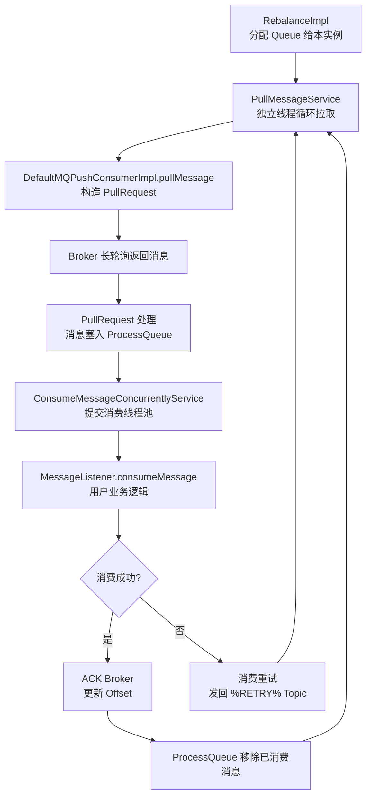
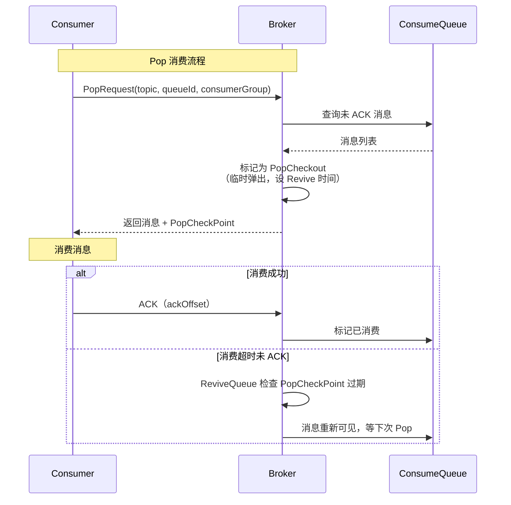
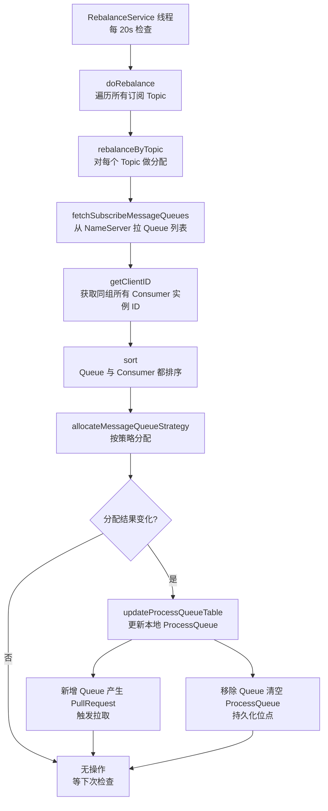
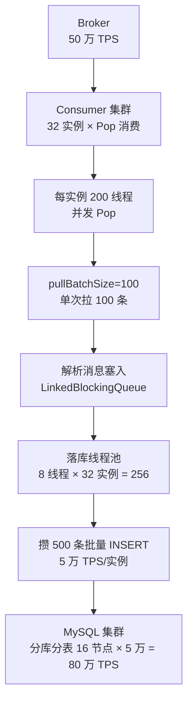
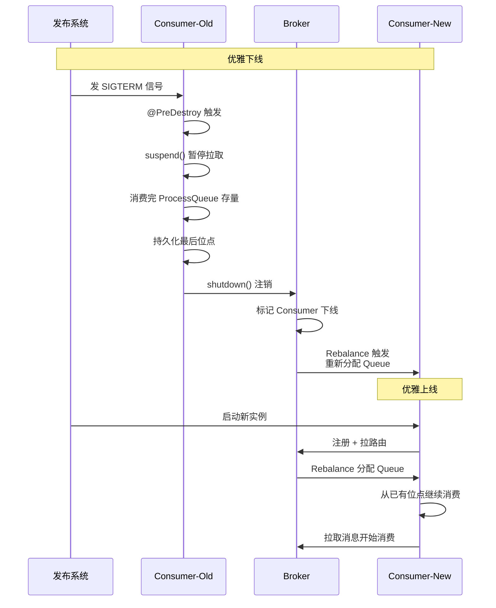

# 消息模型与发送消费

> **一句话定位**：消息模型是 RocketMQ 工程化使用的核心，"Push 和 Pull 的区别、Rebalance 怎么做、消费位点怎么管"是中高级面试必问。
> **面试热度**：⭐⭐⭐⭐⭐
> **返回**：[RocketMQ 知识图谱](../README.md)

---

## 一、概念定义

RocketMQ 的消息模型回答两个核心问题：**Producer 怎么发** 与 **Consumer 怎么消费**。理解发送方式、消费模型、消费模式、Rebalance、消费位点五条概念基线，是讲清任何 RocketMQ 消息流程的前提。

### 1.1 发送方式：同步、异步、单向

Producer 有三种发送方式，本质是 **可靠性 vs 吞吐 vs 延迟** 的三角权衡。

| 发送方式 | API | 是否等待响应 | 可靠性 | 吞吐 | 延迟 | 适用场景 |
|---------|-----|------------|--------|------|------|---------|
| 同步发送 | `producer.send(msg)` | 阻塞等待 `SendResult` | 最高（拿 ACK 才算成功） | 低（每条等 RTT） | 高（等 Broker 返回） | 重要业务消息（订单、支付） |
| 异步发送 | `producer.send(msg, callback)` | 非阻塞，回调通知 | 高（回调可感知失败） | 高（流水线化） | 低（不等返回即发下一条） | 高吞吐可容忍少量失败（日志、埋点） |
| 单向发送 | `producer.sendOneway(msg)` | 不等响应 | 最低（发完即忘） | 最高 | 最低 | 日志收集、 metrics 上报等可丢失场景 |

**三者的本质差异**：同步发送是"发一条 → 等 ACK → 发下一条"，吞吐受 RTT 限制（10ms RTT 下理论 100 条/s/连接）；异步发送是"发一条 → 不等 → 发下一条 → 回调异步到达"，吞吐取决于 Producer 的发送线程数与 Netty pipeline 能力；单向发送是"发完即忘"，连回调都省，吞吐最高但失败不可感知。

**重试策略**：同步发送失败自动重试 `retryTimesWhenSendFailed`（默认 2 次，共发 3 次），异步发送重试 `retryTimesWhenSendAsyncFailed`（默认 2 次），单向发送不重试。重试会触发 Broker 故障隔离——连续失败多次的 Broker 在 `sendLatencyFaultEnable=true` 时被短期排除。

### 1.2 消费模型：Push、Pull、Pop

Consumer 有三种消费模型，本质是 **封装层级 vs 控制粒度 vs 堆积风险** 的权衡。

| 消费模型 | 类 | 封装层级 | 控制粒度 | 堆积风险 | 版本 |
|---------|-----|---------|---------|---------|------|
| Push 模型 | `DefaultMQPushConsumer` | 高（封装拉取+分配+位点） | 低（用户只管 `MessageListener`） | 低（内置流控与限速） | 4.x+ |
| Pull 模型 | `DefaultMQPullConsumer` | 低（仅拉取） | 高（手动 `pull`+手动管 offset） | 高（用户拉取速率不可控） | 4.x（5.x 已废弃） |
| Pop 消费 | `DefaultLitePullConsumer`（5.x） | 中（主动订阅+自动分配） | 中（用户主动 `poll`，Broker 端弹出） | 低（避免 Rebalance 堆积） | 5.x |

**Push 不是真推送**：Push 模型底层仍是 Pull——`PullMessageService` 线程不断从 Broker 拉消息塞进 `ProcessQueue`，用户线程从 `ProcessQueue` 消费。所谓"Push"是用长轮询 + 内部线程封装出来的"伪推送"，对用户透明。这点是面试高频追问。

**Pull 模型为何废弃**：4.x 的 `DefaultMQPullConsumer` 要求用户手动管理消费位点、手动判断拉取时机，极易因拉取过快导致内存堆积或拉取过慢导致消费滞后。5.x 引入 `DefaultLitePullConsumer` 替代——它内部自动管理位点与订阅，既保留"用户主动 poll"的灵活性，又免去手动管 offset 的负担。

**Pop 消费解决了什么**：Push 模型下，消费者 Rebalance 时 `ProcessQueue` 中未消费的消息会被丢弃，重新拉取需等下次 Rebalance 完成，导致短暂消费停顿；长轮询场景下消费者被阻塞在 Broker 等消息，Rebalance 与拉取互锁易死锁。Pop 模式让 Broker 主动"弹出"消息给消费者，消费者与 Queue 解耦——同一 Queue 可被多个 Consumer 并发 Pop，无需 Rebalance 分配，彻底解决堆积问题。

### 1.3 消费模式：集群与广播

集群模式和广播模式决定消息被消费的范围，是 Push/Pull 之外的另一维度。

| 消费模式 | 常量 | 每条消息消费次数 | 位点存储 | 消费进度 | 适用场景 |
|---------|------|----------------|---------|---------|---------|
| 集群消费 | `CLUSTERING` | 1 次（同组内一个消费者消费） | Broker（远程） | 同组共享 | 业务消息（订单、支付） |
| 广播消费 | `BROADCASTING` | N 次（同组所有消费者都消费） | 本地文件 | 各实例独立 | 通知、配置广播、本地缓存刷新 |

**集群模式**：同一 ConsumerGroup 内的消费者**分摊** Queue——N 个 Queue 被 M 个 Consumer 平均分配，每个 Queue 同一时刻只被一个 Consumer 实例消费。位点存在 Broker，全组共享进度。这是默认模式，覆盖 90% 业务场景。

**广播模式**：同一 ConsumerGroup 内的消费者**各自消费全量消息**——每个实例都消费所有 Queue 的所有消息，互不影响。位点存本地文件（`LocalFileOffsetStore`），因为每个实例进度独立。典型用于"所有节点都要感知的事件"，如配置变更广播。

**为何广播位点存本地**：集群模式下全组共享一份消费进度，存 Broker 统一管理；广播模式下每个实例进度独立，没有"共享进度"概念，若存 Broker 反而要为每个实例存一份，不如本地文件直接。这是位点存储策略与消费模式绑定的根因。

### 1.4 Rebalance：消费者上下线的再均衡

Rebalance 是 ConsumerGroup 内 Queue 分配的动态调整机制，触发时机有四类：

1. **消费者上下线**——新 Consumer 加入组或某 Consumer 宕机（120s 心跳超时）
2. **Queue 数变化**——Topic 扩容/缩容（`writeQueueNums`/`readQueueNums` 调整）
3. **Broker 上下线**——Broker 宕机导致其上的 Queue 不可用
4. **定时检查**——`RebalanceService` 每 20s 检查一次，感知上述变化

Rebalance 的分配策略由 `AllocateMessageQueueStrategy` 接口定义，4 种内置策略：

| 策略类 | 中文名 | 分配方式 | 适用场景 |
|--------|--------|---------|---------|
| `AllocateMessageQueueAveragely` | 平均分配（默认） | Queue 尽量均分，差额分给前几个 Consumer | 通用场景 |
| `AllocateMessageQueueAveragelyByCircle` | 环形分配 | Queue 轮流交替分给各 Consumer | Consumer 与 Broker 跨机房时减少跨机房访问 |
| `AllocateMessageQueueByMachineRoom` | 机房分配 | 同机房 Consumer 优先分同机房 Broker 的 Queue | 同城双机房 |
| `AllocateMachineRoomNearby` | 机房就近 | 机房亲和分配，`MachineRoomResolver` 定义机房归属 | 多机房亲和 |

**平均分配的细节**：假设 8 Queue、3 Consumer，平均分配结果是 C1=3、C2=3、C3=2（前两个多 1 个）。这是 `AllocateMessageQueueAveragely` 的默认行为——用 `mod` 取余决定哪些 Consumer 多分一个 Queue。

**环形分配的差异**：同样 8 Queue、3 Consumer，环形分配是 C1=Q0/Q3/Q6、C2=Q1/Q4/Q7、C3=Q2/Q5——交替分配。环形分配在 Queue 跨 Broker 时让每个 Consumer 的 Queue 分散到不同 Broker，减少单 Broker 压力，但跨机房延迟可能更高。

### 1.5 消费位点：进度持久化与启动策略

消费位点（Offset）记录"Consumer 消费到哪了"，是 Consumer 重启后定位消费起点的依据。

**位点存储**：

| 存储方式 | 类 | 适用模式 | 持久化位置 | 特点 |
|---------|-----|---------|----------|------|
| 远程存储 | `RemoteBrokerOffsetStore` | 集群模式 | Broker | 全组共享，Broker 统一管理，可靠 |
| 本地存储 | `LocalFileOffsetStore` | 广播模式 | 本地文件 `~/.rocketmq_offsets/` | 各实例独立，重启后从本地恢复 |

**位点更新流程**：Consumer 消费完消息后调 `OffsetStore.updateOffset(queue, offset)` 更新内存中的位点，定时（默认 5s）调 `persistAll` 持久化——集群模式发到 Broker，广播模式写本地文件。

**启动策略 `consumeFromWhere`**：Consumer 启动时若本地/Broker 已有位点，从已有位点继续；若无位点（首次启动或位点丢失），按 `consumeFromWhere` 配置决定起点：

| 启动策略 | 常量 | 起始位点 | 适用场景 |
|---------|------|---------|---------|
| 从最后消费 | `CONSUME_FROM_LAST_OFFSET`（默认） | Queue 最大 offset（跳过历史，从新消息开始） | 实时业务（只关心新消息） |
| 从头消费 | `CONSUME_FROM_FIRST_OFFSET` | Queue 最小 offset（0） | 数据回放、初始化加载 |
| 从时间戳 | `CONSUME_FROM_TIMESTAMP` | 按时间戳定位 offset | 指定时间点回放 |

**注意**：`consumeFromWhere` 只在**位点不存在时生效**。若已有位点（哪怕是旧位点），总是从已有位点继续，配置被忽略。这是常见误区——以为改了配置就能跳过堆积，实际不行，要跳过堆积需手动重置位点（`mqadmin resetOffset`）。

---

## 二、原理与流程

### 2.1 同步发送：`sendDefaultImpl` 核心逻辑

同步发送是 Producer 的默认方式，核心入口是 `client.impl.producer.DefaultMQProducerImpl.sendDefaultImpl`。

**源码路径**：`client.impl.producer.DefaultMQProducerImpl#sendDefaultImpl`

```java
// DefaultMQProducerImpl.sendDefaultImpl（简化）
private SendResult sendDefaultImpl(Message msg, CommunicationMode mode,
                                   SendCallback sendCallback, long timeout) {
    // 1. 查路由：从 NameServer 拿 Topic 的 Queue 列表（本地缓存 + 定时更新）
    TopicPublishInfo topicPublishInfo = tryToFindTopicMessageInfo(msg.getTopic());
    // 2. 计算重试次数（同步默认 2 次，共 3 次）
    int timesTotal = (mode == CommunicationMode.SYNC)
        ? 1 + retryTimesWhenSendFailed : 1;
    // 3. 选 Queue（故障隔离启用时跳过被隔离的 Broker）
    MessageQueue mqSelected = selectOneMessageQueue(topicPublishInfo, lastBrokerName);
    // 4. 循环发送 + 重试
    for (int times = 0; times < timesTotal; times++) {
        SendResult result = sendKernel(msg, mqSelected, mode, sendCallback, timeout);
        if (result != null) return result;
        // 失败则换 Broker 再试
        lastBrokerName = mqSelected.getBrokerName();
        mqSelected = selectOneMessageQueue(topicPublishInfo, lastBrokerName);
    }
    throw new MQClientException("Send failed after " + timesTotal + " retries");
}
```

**关键设计**：①`sendKernel` 内部用 Netty 发 RPC 请求给 Broker，同步模式下用 `CountDownLatch.await` 阻塞等待响应；②重试时换 Queue——上次失败的 Broker 优先跳过（`sendLatencyFaultEnable=true` 时彻底隔离一段时间）；③超时由 `sendMsgTimeout` 控制（默认 3000ms），含重试总耗时不能超。

**故障隔离机制**：`MQFaultStrategy` 维护每个 Broker 的延迟表，发送失败时记录当前时间 + 隔离时长（按延迟分档：> 15000ms 隔离 600000ms，> 3000ms 隔离 180000ms 等）。隔离期内选 Queue 跳过该 Broker，到期后恢复。

### 2.2 异步发送：ResponseFuture 回调

异步发送通过 `send(msg, SendCallback)` 实现，核心是 `NettyRemotingAbstract` 的 `ResponseFuture` 机制。

**源码路径**：`client.impl.producer.DefaultMQProducerImpl#sendKernel` → `NettyRemotingAbstract#invokeAsync`

```java
// NettyRemotingAbstract.invokeAsync（简化）
public void invokeAsync(Channel channel, RemotingCommand request,
                        long timeout, InvokeCallback callback) {
    // 1. 用 requestId 关联请求与响应
    int requestId = request.getOpaqueRequestId();
    ResponseFuture future = new ResponseFuture(channel, requestId, timeout, callback);
    // 2. 放入响应表，等 Broker 响应回来时按 requestId 取出
    responseTable.put(requestId, future);
    // 3. Netty 异步发送，不等返回
    channel.writeAndFlush(request).addListener(f -> {
        if (!f.isSuccess()) responseTable.remove(requestId);
    });
    // 4. Broker 响应回来时，Netty 的 processResponseCommand 按 requestId 找 future
    //    执行 callback：future.executeInvokeCallback()
}
```

**异步的优势**：Producer 发送线程不等 Broker 返回，立即发下一条，吞吐取决于发送速率而非 RTT。但回调在 Netty IO 线程执行，若回调逻辑重需切到业务线程池，避免阻塞 IO 线程。

**异步的重试**：异步发送失败也重试 `retryTimesWhenSendAsyncFailed` 次，但重试在 Netty 线程内进行，不阻塞发送线程。回调 `onSuccess`/`onException` 通知用户。

### 2.3 单向发送：sendOneway

单向发送是"发完即忘"，不等响应不回调，适合日志收集等可丢失场景。

**源码路径**：`client.impl.producer.DefaultMQProducerImpl#sendOneway` → `NettyRemotingAbstract#invokeOneway`

```java
// DefaultMQProducerImpl.sendOneway（简化）
public void sendOneway(Message msg) {
    TopicPublishInfo info = tryToFindTopicMessageInfo(msg.getTopic());
    MessageQueue mq = selectOneMessageQueue(info, null);
    // 直接走 invokeOneway，不放入 responseTable
    sendKernel(msg, mq, CommunicationMode.ONEWAY, null, timeout);
}

// NettyRemotingAbstract.invokeOneway（简化）
public void invokeOneway(Channel channel, RemotingCommand request, long timeout) {
    // 不创建 ResponseFuture，不等响应
    // 用 Semaphore 限流（onewaySemaphore，默认 65535），防止发太快撑爆 Netty
    if (!onewaySemaphore.tryAcquire(timeout)) throw new RuntimeException("timeout");
    channel.writeAndFlush(request);
}
```

**关键设计**：①不创建 `ResponseFuture`，不占 `responseTable` 内存；②用 `Semaphore` 限流防飞速过快撑爆 Netty buffer；③失败不可感知，无重试。

### 2.4 Push 消费模型：封装 Pull

Push 模型是"用 Pull 模拟 Push"，核心是 `DefaultMQPushConsumer` 内部的拉取-消费流水线。

**源码路径**：`client.impl.consumer.DefaultMQPushConsumerImpl`



**关键组件**：

| 组件 | 职责 | 关键参数 |
|------|------|---------|
| `RebalanceImpl` | Queue 分配，触发 PullRequest | `allocateMessageQueueStrategy` |
| `PullMessageService` | 独立线程循环拉取 | `pullBatchSize`（默认 32，单次拉取条数） |
| `ProcessQueue` | 本地消息树（TreeMap 按 offset 排序） | `pullThresholdForQueue`（默认 1000，本地堆积上限） |
| `ConsumeMessageConcurrentlyService` | 消费线程池 | `consumeThreadMin/Max`（默认 20/64） |
| `MessageListener` | 用户业务逻辑入口 | `consumeMode`（CONCURRENTLY/ORDERLY） |

**流控机制**：`ProcessQueue` 中消息数超过 `pullThresholdForQueue`（默认 1000）时暂停拉取，防止消费不及拉取导致内存撑爆。这是 Push 模型堆积风险低的根因——内置流控。

### 2.5 Pull 消费模型：手动与自动

4.x 的 `DefaultMQPullConsumer` 要求手动 `pull` + 手动管 offset，5.x 用 `DefaultLitePullConsumer` 替代。

**4.x Pull（已废弃）**：

```java
// 4.x 手动 Pull（简化）
DefaultMQPullConsumer consumer = new DefaultMQPullConsumer("group");
consumer.start();
Set<MessageQueue> mqs = consumer.fetchSubscribeMessageQueues("topic");
for (MessageQueue mq : mqs) {
    // 手动拉取，需自己管 offset
    PullResult result = consumer.pull(mq, "tag", offset, 32);
    if (result.getPullStatus() == PullStatus.FOUND) {
        // 处理消息
        offset = result.getNextBeginOffset();
        consumer.updateConsumeOffset(mq, offset);  // 手动更新位点
    }
}
```

**5.x LitePullConsumer（推荐）**：

```java
// 5.x DefaultLitePullConsumer（简化）
DefaultLitePullConsumer consumer = new DefaultLitePullConsumer("group");
consumer.setConsumeFromWhere(ConsumeFromWhere.CONSUME_FROM_LAST_OFFSET);
consumer.subscribe("topic", "tag");  // 自动分配 Queue + 自动管 offset
consumer.start();
// 主动 poll，类似 Kafka Consumer
while (running) {
    List<MessageExt> msgs = consumer.poll(Duration.ofSeconds(1));
    // 处理消息，位点自动更新
}
```

**LitePullConsumer 的优势**：①自动订阅——`subscribe` 后内部自动 Rebalance 分配 Queue；②自动位点——poll 后内部自动 ACK 并更新 offset；③API 类似 Kafka，降低迁移成本；④支持 Pop 模式（`setConsumeType`）。

### 2.6 Pop 消费 5.x：Broker 端弹出

Pop 消费是 5.x 的关键特性，Broker 端临时"弹出"消息给 Consumer，解决 Rebalance 堆积与长轮询死锁。

**源码路径**：`client.impl.consumer.DefaultLitePullConsumerImpl`（Pop 模式）+ `broker.processor.PopMessageProcessor`



**Pop 的核心机制**：①Broker 收到 Pop 请求后，从 ConsumeQueue 取消息并标记为"弹出中"（PopCheckout），返回给 Consumer；②Consumer 消费完后 ACK，Broker 才真正标记已消费；③若 Consumer 宕机未 ACK，Broker 的 ReviveQueue 线程定时检查 PopCheckPoint 过期（默认 5s），过期则消息重新可见，等下次 Pop。

**为何解决 Rebalance 堆积**：Push 模型下 Queue 被 Rebalance 分配给某 Consumer，该 Consumer 宕机时 Queue 中 `ProcessQueue` 的消息被丢弃，等下次 Rebalance 重新分配后才继续消费，造成停顿。Pop 模型下消息与 Queue 解耦——任何 Consumer 都可 Pop 任何 Queue，某 Consumer 宕机不影响其他 Consumer 继续消费。

**为何解决长轮询死锁**：Push 模型长轮询时 Consumer 阻塞在 Broker 等消息，此时若触发 Rebalance，Consumer 要先退出长轮询才能 Rebalance，形成互锁。Pop 模型 Consumer 主动 poll，不阻塞，Rebalance 与拉取不互锁。

### 2.7 Rebalance 策略：分配流程

Rebalance 由 `RebalanceService` 线程每 20s 触发，核心流程在 `client.impl.consumer.RebalanceImpl`。

**源码路径**：`client.impl.consumer.RebalanceImpl#doRebalance`



**关键设计**：①Queue 列表与 Consumer 实例列表都按字典序排序——保证所有 Consumer 算出同样的分配结果，无需中心协调；②分配策略可插拔——`AllocateMessageQueueStrategy` 接口，默认 `AllocateMessageQueueAveragely`；③分配结果变化才操作 `ProcessQueue`——新增 Queue 产生 `PullRequest` 触发拉取，移除 Queue 清空 `ProcessQueue` 并持久化最后位点。

**触发时机的细节**：除了 20s 定时检查，Consumer 启动、Consumer 感知到 Broker 上下线（路由表更新）、Consumer 主动 unsubscribe 也会立即触发 Rebalance，不等 20s。

### 2.8 消费位点管理：OffsetStore

位点管理由 `OffsetStore` 接口定义，集群模式用 `RemoteBrokerOffsetStore`，广播模式用 `LocalFileOffsetStore`。

**源码路径**：`client.impl.consumer.RemoteBrokerOffsetStore` / `LocalFileOffsetStore`

```java
// OffsetStore 接口核心方法（简化）
public interface OffsetStore {
    // 加载位点（启动时）
    void load();
    // 更新位点（消费完消息后调）
    void updateOffset(MessageQueue mq, long offset, boolean increaseOnly);
    // 读取位点（拉取前调）
    long readOffset(MessageQueue mq, ReadOffsetType type);
    // 持久化（定时 5s 调）
    void persistAll(Set<MessageQueue> mqs);
}

// RemoteBrokerOffsetStore.persistAll（简化）
public void persistAll(Set<MessageQueue> mqs) {
    for (MessageQueue mq : mqs) {
        long offset = offsetTable.get(mq);
        // 发 RPC 给 Broker 持久化位点
        brokerOuterAPI.updateConsumeOffset(mq, offset);
    }
}

// LocalFileOffsetStore.persistAll（简化）
public void persistAll(Set<MessageQueue> mqs) {
    Properties props = new Properties();
    for (MessageQueue mq : mqs) {
        props.put(mq.getKey(), offsetTable.get(mq));
    }
    // 写本地文件 ~/.rocketmq_offsets/group/Client.properties
    MixAll.string2File(props.toString(), storePath);
}
```

**位点更新流程**：①消费完消息后调 `updateOffset` 更新内存 `offsetTable`；②定时 5s 调 `persistAll` 持久化（集群发 Broker，广播写本地）；③Broker 端位点存在 `${userHome}/store/config/consumerOffset.json`，按 ConsumerGroup × Topic × Queue 组织。

**位点丢失的恢复**：若 Broker 端位点丢失（如 Broker 重启未持久化），Consumer 重启后从 `consumeFromWhere` 配置重新定位；若本地文件丢失（广播模式），同样按 `consumeFromWhere` 重新定位。这是 `consumeFromWhere` 的真实用途——位点丢失的兜底。

### 2.9 批量发送与压缩

批量发送用 `MessageBatch` 把多条消息打包一次发送，减少 RTT。压缩用 ZIP，默认阈值 4096 字节。

**批量发送限制**：同 Topic、同 Tag、同 `waitStoreMsgOK`（刷盘策略一致）的消息才能批量发送。跨 Topic/Tag 不支持批量。

```java
// 批量发送（简化）
List<Message> msgs = Arrays.asList(msg1, msg2, msg3);
MessageBatch batch = MessageBatch.generateFromList(msgs);
// MessageBatch 内部把多条消息体拼接成一个 byte[]
SendResult result = producer.send(batch);
```

**压缩机制**：`DefaultMQProducerImpl` 发送前检查消息体大小，超过 `compressMsgBodyOverHowmuch`（默认 4096 字节）则用 ZIP 压缩。压缩在客户端做，解压在 Broker 端做。批量发送的消息体拼接后若超阈值，也会压缩。

**批量与压缩的协同**：批量发送把多条小消息拼成大消息，大消息更可能超 4096 阈值触发压缩，压缩后体积更小，网络传输更快。两者叠加可显著提升吞吐——实测 100 条 1KB 消息批量+压缩后，网络流量比逐条发送减少 60%+。

### 2.10 源码路径汇总

| 组件 | 源码路径 |
|------|---------|
| 同步/异步/单向发送 | `client.impl.producer.DefaultMQProducerImpl`（`sendDefaultImpl`/`sendKernel`） |
| 异步回调机制 | `remoting.NettyRemotingAbstract`（`invokeAsync`/`ResponseFuture`） |
| Push 消费 | `client.impl.consumer.DefaultMQPushConsumerImpl`（`pullMessage`/`consumeMessage`） |
| Pull 消费 5.x | `client.impl.consumer.DefaultLitePullConsumerImpl`（`poll`/`subscribe`） |
| Rebalance | `client.impl.consumer.RebalanceImpl`（`doRebalance`/`rebalanceByTopic`） |
| 位点管理 | `client.impl.consumer.RemoteBrokerOffsetStore` / `LocalFileOffsetStore` |
| Pop 消费 Broker 端 | `broker.processor.PopMessageProcessor` / `broker.processor.PopBufferMergeService` |
| 批量发送 | `client.producer.MessageBatch` / `client.impl.producer.DefaultMQProducerImpl#batchSend` |

---

## 三、高频追问

### Q1：Push 和 Pull 有什么区别？

Push 模型（`DefaultMQPushConsumer`）是高封装——内部用 `PullMessageService` 线程自动拉取、自动 Rebalance、自动管位点，用户只实现 `MessageListener`。Pull 模型（`DefaultMQPullConsumer` 已废弃，5.x 用 `DefaultLitePullConsumer`）是低封装——用户主动 `poll`，控制拉取时机与速率。Push 对用户透明，Pull 控制粒度更细。

### Q2：Push 是真的推送吗？

不是。Push 底层仍是 Pull——`PullMessageService` 线程不断从 Broker 拉消息塞进 `ProcessQueue`，用户线程从 `ProcessQueue` 消费。所谓"Push"是用长轮询（Broker 端挂起请求 5s 等消息）+ 内部线程封装出来的"伪推送"，对用户透明。真推送会推爆 Consumer，Pull 才是可控的方式。

### Q3：Rebalance 怎么做？

默认用 `AllocateMessageQueueAveragely` 平均分配——Queue 列表与 Consumer 实例列表都排序，按顺序均分，差额分给前几个 Consumer。触发时机是 `RebalanceService` 每 20s 检查 + Consumer 上下线/Broker 上下线/Queue 数变化的立即触发。所有 Consumer 独立计算但结果一致（因排序保证），无需中心协调。

### Q4：消费位点怎么存？

集群模式存 Broker（`RemoteBrokerOffsetStore`），全组共享一份进度；广播模式存本地文件（`LocalFileOffsetStore`，`~/.rocketmq_offsets/`），各实例独立。更新流程是消费完消息后调 `updateOffset` 更新内存，定时 5s 调 `persistAll` 持久化。位点丢失时按 `consumeFromWhere` 兜底（默认从最新 offset 开始）。

### Q5：消费者重启从哪开始消费？

若位点存在（Broker 或本地），从已有位点继续——`consumeFromWhere` 配置被忽略。若位点不存在（首次启动或丢失），按 `consumeFromWhere`：`CONSUME_FROM_LAST_OFFSET`（默认）从最新 offset 开始，`CONSUME_FROM_FIRST_OFFSET` 从头消费，`CONSUME_FROM_TIMESTAMP` 按时间戳定位。要跳过堆积需手动 `mqadmin resetOffset` 重置位点。

### Q6：Pop 消费是什么？

5.x 新增的消费模型，Broker 端"弹出"消息给 Consumer——Broker 从 ConsumeQueue 取消息标记为 PopCheckout 返回给 Consumer，Consumer ACK 后才真正标记已消费，宕机未 ACK 的消息由 ReviveQueue 线程检查过期后重新可见。Pop 解决两个问题：①Rebalance 时 `ProcessQueue` 消息丢弃导致的堆积；②长轮询 Consumer 阻塞与 Rebalance 互锁。Pop 让 Queue 与 Consumer 解耦，多 Consumer 可并发 Pop 同一 Queue。

### Q7：批量发送怎么用？

用 `MessageBatch.generateFromList(msgs)` 把多条消息打包，再 `producer.send(batch)`。限制是同 Topic、同 Tag、同 `waitStoreMsgOK`——跨 Topic/Tag 不能批量。批量发送的消息体拼接后若超 `compressMsgBodyOverHowmuch`（默认 4096 字节）会自动 ZIP 压缩。批量+压缩叠加可显著提升吞吐，适合日志、埋点等高吞吐场景。

### Q8：消费者数能超过 Queue 数吗？

能超过，但多余的消费者会**闲置**——集群模式下每个 Queue 同一时刻只被一个 Consumer 实例消费，N 个 Queue 最多让 N 个 Consumer 实例干活，第 N+1 个消费者分不到 Queue。所以扩 Consumer 前要先确认 Queue 数够，否则扩了也是浪费。若要提升并行度，要么扩 Topic 的 Queue 数，要么用 Pop 消费（5.x，允许多 Consumer 共享 Queue）。

---

## 四、实战关联

### 4.1 Spring Boot `@RocketMQMessageListener` 配置示例

Spring Boot 集成 RocketMQ 后，用注解声明消费者，`consumeMode` 和 `messageModel` 是两个核心配置：

```java
@RocketMQMessageListener(
    topic = "order-topic",
    consumerGroup = "order-consumer-group",
    selectorExpression = "create || pay",  // Tag 过滤
    consumeMode = ConsumeMode.CONCURRENTLY,  // 并发消费（CONCURRENTLY）/ 顺序消费（ORDERLY）
    messageModel = MessageModel.CLUSTERING,  // 集群（CLUSTERING）/ 广播（BROADCASTING）
    consumeThreadMax = 64,  // 消费线程池上限
    pullBatchSize = 32,     // 单次拉取条数
    maxReconsumeTimes = 16  // 最大重试次数
)
public class OrderConsumer implements RocketMQListener<OrderMessage> {
    @Override
    public void onMessage(OrderMessage msg) {
        orderService.process(msg);  // 业务逻辑
    }
}
```

**配置要点**：①`consumeMode` 选 `CONCURRENTLY` 是并发消费（多线程并行），选 `ORDERLY` 是顺序消费（同 Queue 串行）；②`messageModel` 选 `CLUSTERING` 是集群消费（默认），选 `BROADCASTING` 是广播消费；③`consumeThreadMax` 控制消费并行度，但上限受 Queue 数约束——集群模式下 N 个 Queue 最多 N 个线程并行拉取，再多线程也分不到 Queue。

### 4.2 消费者并发度调优

并发度调优是 Push 消费的核心实战，三个参数联动：

| 参数 | 默认 | 调优方向 | 影响 |
|------|------|---------|------|
| `consumeThreadMin/Max` | 20/64 | 调大提升消费并行度 | 受 Queue 数约束（集群模式上限 = Queue 数） |
| `pullBatchSize` | 32 | 调大减少拉取次数，提升单次吞吐 | 过大易导致消费不及拉取堆积 |
| `pullThresholdForQueue` | 1000 | 调大允许更多本地堆积 | 过大易 OOM |

**调优经验**：①若消费慢是 IO 瓶颈（如落库慢），调大 `consumeThreadMax`（但 Queue 数是上限，要先扩 Queue）；②若网络 RTT 是瓶颈，调大 `pullBatchSize`（单次多拉减少 RTT 占比）；③若内存紧张，调小 `pullThresholdForQueue`（限制本地堆积）；④若 Queue 数不足，扩 Topic 的 Queue 数或用 Pop 消费（5.x）绕过 Queue 数限制。

### 4.3 与 Kafka 消费模型对比

RocketMQ 与 Kafka 的消费模型在概念上类似但实现不同：

| 维度 | RocketMQ | Kafka |
|------|---------|-------|
| 消费单位 | MessageQueue | Partition |
| 消费者组 | ConsumerGroup | ConsumerGroup |
| 分配策略 | `AllocateMessageQueueStrategy`（4 种） | `ConsumerPartitionAssignor`（Range/RoundRobin/Sticky/Cooperative） |
| 位点存储 | Broker（集群）/ 本地（广播） | `__consumer_offsets` Topic（特殊 Topic） |
| 位点提交 | 自动 5s + 手动 | 自动 `enable.auto.commit` + 手动 `commitSync/Async` |
| 消费模型 | Push（封装 Pull）/ Pull / Pop | 仅 Pull（`poll`） |
| Rebalance 触发 | 20s 定时 + 事件触发 | 协调者心跳超时 + 组变更通知 |

**关键差异**：①Kafka 只有 Pull 模型，RocketMQ 有 Push（封装 Pull）+ Pull + Pop 三种；②Kafka 位点存特殊 Topic，RocketMQ 集群模式存 Broker 配置文件；③Kafka Rebalance 由协调者（GroupCoordinator）驱动，RocketMQ 由 Consumer 端各自独立计算；④Kafka 的 Partition 数是硬上限（消费者数 ≤ Partition 数），RocketMQ 的 Queue 数同样是上限，但 5.x Pop 消费打破了这个限制。

### 4.4 与 `java-core/lambda` 的对照：异步回调 CompletableFuture

Producer 异步发送的 `SendCallback` 与 `java-core/lambda` 的 `CompletableFuture` 是同类模式——都是异步非阻塞 + 回调通知：

```java
// RocketMQ 异步发送
producer.send(msg, new SendCallback() {
    @Override public void onSuccess(SendResult result) { /* 成功 */ }
    @Override public void onException(Throwable e) { /* 失败 */ }
});

// CompletableFuture 异步（java-core/lambda 对照）
CompletableFuture.supplyAsync(() -> callRemoteService())
    .thenAccept(result -> /* 成功 */)
    .exceptionally(e -> { /* 失败 */ return null; });
```

**本质相同**：都是"提交异步任务 + 注册回调 + 线程池执行回调"。RocketMQ 的 `SendCallback` 在 Netty IO 线程执行，`CompletableFuture` 在 ForkJoinPool 或指定线程池执行。若回调重，两者都要切到业务线程池避免阻塞执行线程。

### 4.5 与 `java-core/stream` 的对照：批量发送与批处理

RocketMQ 的 `MessageBatch` 批量发送与 `java-core/stream` 的批处理是同类思路——把多个操作打包一次执行，减少单次开销：

```java
// RocketMQ 批量发送
List<Message> msgs = Arrays.asList(msg1, msg2, msg3);
producer.send(MessageBatch.generateFromList(msgs));  // 一次 RTT 发 3 条

// Stream 批处理（java-core/stream 对照）
List<List<Item>> batches = items.stream()
    .collect(Collectors.groupingBy(i -> i.getId() % 3))  // 分 3 批
    .values().stream().collect(Collectors.toList());
batches.forEach(batch -> batchInsert(batch));  // 批量插入
```

**本质相同**：都是"攒一批 + 一次处理"，减少网络/IO 开销。RocketMQ 批量发送减少 RTT，Stream 批处理减少 DB 往返。两者都要注意"攒批不能太久"——RocketMQ 批量发送是同步攒批（用户主动构造 List），Stream 批处理若用窗口需设超时防丢数据。

---

## 五、系统设计案例

### 案例 1：设计一个高吞吐的消费方案

**场景**：订单事件流，峰值 50 万 TPS，要求消费延迟 < 1s，落库 DB（MySQL，单机 5 万 TPS 上限）。

**3 分钟标准答法**：

1. **Pop 消费打破 Queue 数限制**——5.x `DefaultLitePullConsumer` Pop 模式，让多 Consumer 并发消费同一 Queue，不受 Queue 数约束（Push 模式下 16 Queue 最多 16 Consumer 并行）。
2. **批量拉取 + 批量落库**——`pullBatchSize` 调到 100，单次拉 100 条消息；消费时攒 500 条批量 `INSERT`，减少 DB 往返。
3. **多线程并发消费**——`consumeThreadMax` 调到 200，Pop 模式下多线程并发 Pop 不同 Queue。
4. **异步落库**——消费线程只解析消息塞队列，独立线程池从队列攒批写 DB，消费与落库解耦。



**吞吐估算**：①消费侧——32 实例 × 200 线程 × 单线程 80 TPS（Pop 100 条/次 × 0.8 次/s）= 51.2 万 TPS，覆盖 50 万峰值；②落库侧——32 实例 × 8 线程 × 单线程 5 万/500 条 × 500 条/批 = 32 × 8 × 5 万 = 1280 万 TPS 理论值，实际受 MySQL 分片上限 80 万 TPS 制约，足够。

**部署方案**：32 Consumer 实例（16C32G 每台）+ 16 MySQL 分片（32C128G SSD 每台），Broker 5 节点（3 副本 Controller 模式）。

**核心权衡**：吞吐 vs 延迟。批量拉取 100 条攒批增加单次延迟（攒批时间 100ms+），但减少拉取次数提升吞吐。延迟 < 1s 要求攒批不超 500ms，可调 `pullBatchSize` 与攒批超时配合。

**追问链**：

| 追问 | 答案 |
|------|------|
| 1. Pop 消费消息丢了怎么办？ | Pop 有 PopCheckPoint，Consumer 宕机未 ACK 的消息 5s 后由 ReviveQueue 重新可见，不会丢；落库失败用消费重试（发回 `%RETRY%` Topic），重试 16 次后进死信队列人工处理 |
| 2. MySQL 落库跟不上怎么办？ | 分库分表扩到 32 分片（160 万 TPS），或消息转冷 Topic 缓冲后慢慢消费；落库前用 Redis 做幂等去重，避免重复消费导致唯一索引冲突 |
| 3. 批量 INSERT 失败怎么办？ | 批量 INSERT 用 `INSERT IGNORE` 或 `ON DUPLICATE KEY UPDATE` 容错单条失败；整批失败回滚消息位点触发重试 |
| 4. Consumer 水平扩容上限？ | Pop 模式下无 Queue 数限制，理论可无限扩 Consumer；实际受 Broker Pop 处理能力与 MySQL 落库能力约束 |

### 案例 2：设计一个消费优雅上下线方案

**场景**：消费者要发布上线，要求发布过程中不丢消息、不重复消费、不影响其他消费者。

**3 分钟标准答法**：

1. **Pause 消费**——发布前先暂停消费（`suspend()` 或 `@PreDestroy` 钩子），停止拉取新消息，等 `ProcessQueue` 中存量消息消费完。
2. **Rebalance 通知**——Consumer 主动注销（`shutdown()`），Broker 感知后触发同组其他 Consumer Rebalance，重新分配 Queue。
3. **优雅停机**——`@PreDestroy` 钩子调 `consumer.shutdown()`，内部等待 `ProcessQueue` 清空 + 持久化位点 + 断开 Broker 连接。
4. **启动预热**——新实例启动后先 Rebalance 分配 Queue，拉取消息后慢慢提升消费速率，避免瞬时打满。



**关键设计**：①`@PreDestroy` 钩子要设超时（如 30s），超时强制退出防卡死；②`ProcessQueue` 清空验证——遍历所有 Queue 的 `ProcessQueue`，确认 `msgTreeMap` 为空；③位点持久化要在 `shutdown()` 前完成，否则重启后从旧位点消费导致重复；④新实例启动后消费速率限流——先 10% 流量，逐步提升，避免瞬时打满下游 DB。

**核心权衡**：停机时间 vs 数据安全。等 `ProcessQueue` 清空可能耗时长（堆积多时数分钟），但保证不丢不重复。若要快速停机，可跳过等清空，但未消费消息会等下次 Rebalance 后被其他 Consumer 重新拉取——位点已持久化则不重复，位点未持久化则会重复消费。稳妥方案是设 30s 超时，超时内尽量清空，超时强制退出接受少量重复（消费幂等兜底）。

**追问链**：

| 追问 | 答案 |
|------|------|
| 1. 发布过程中消息丢了吗？ | 不丢——下线前持久化位点，未消费的消息留在 Broker，新实例 Rebalance 后从位点继续拉取消费 |
| 2. 发布过程中重复消费吗？ | 可能少量重复——`ProcessQueue` 清空超时强制退出时，未 ACK 的消息位点未更新，新实例从旧位点重新消费。用消费幂等（唯一索引/去重表）兜底 |
| 3. 多个 Consumer 同时上下线怎么办？ | Rebalance 每次只处理一个 Consumer 变更，多实例滚动发布（每批 1-2 台），错开 30s，避免全组 Rebalance 风暴 |
| 4. Pop 模式下优雅停机有何不同？ | Pop 模式 Consumer 宕机不触发 Rebalance（Queue 与 Consumer 解耦），未 ACK 的消息 5s 后自动重新可见，无需等清空，停机更快 |

---

> **延伸阅读**：
> - [架构与部署拓扑](../01-architecture/architecture-and-topology.md) —— NameServer/Broker/Producer/Consumer 四大组件与 Topic×Queue 模型
> - [存储与刷盘机制](../02-storage/storage-and-flush.md) —— ConsumeQueue 索引与消费位点的存储底层
> - [高可用与副本同步](../04-ha/ha-and-replication.md) —— Broker 宕机后 Consumer Rebalance 与消费位点恢复
