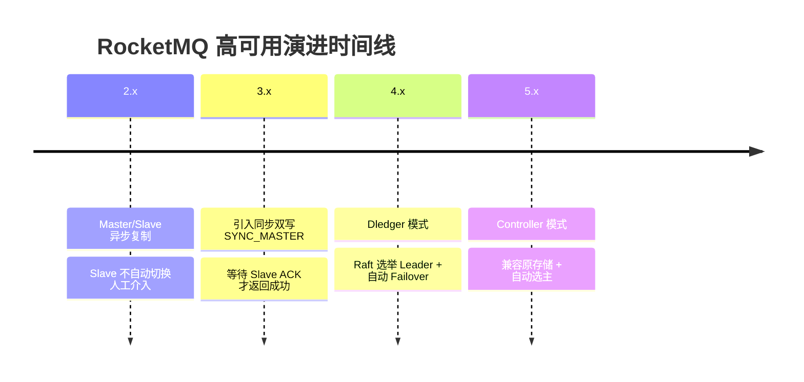
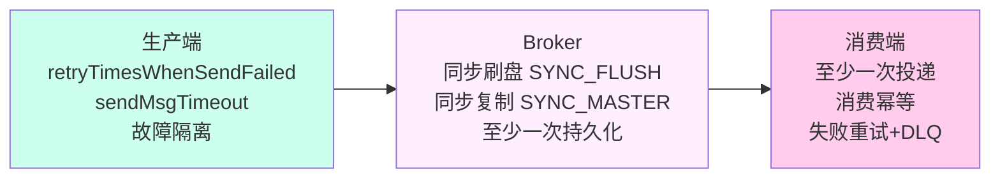
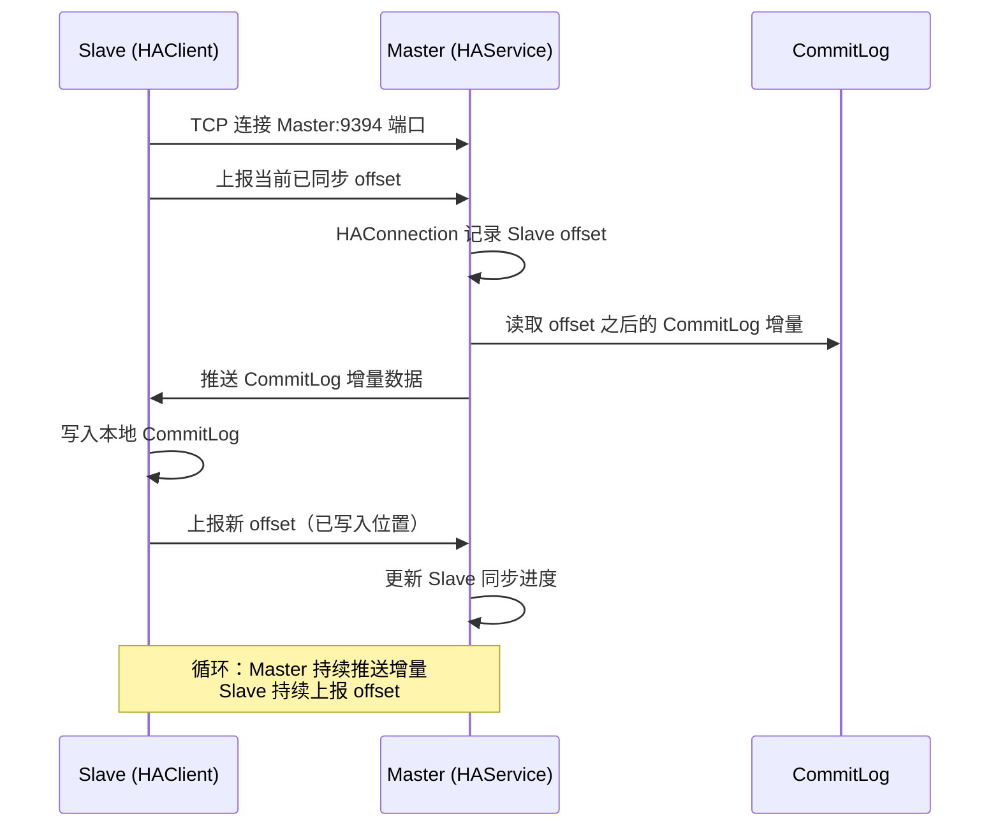
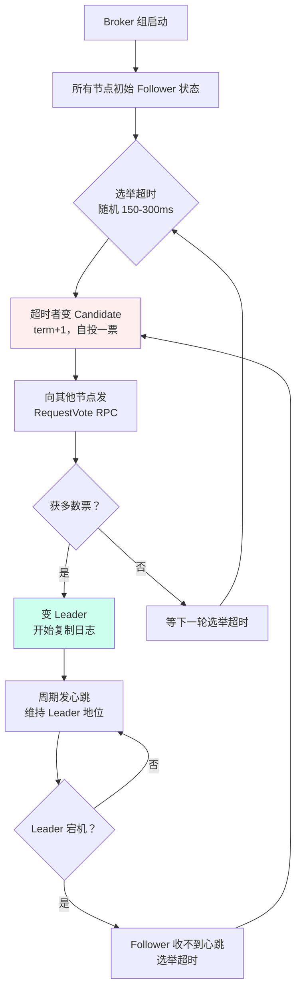
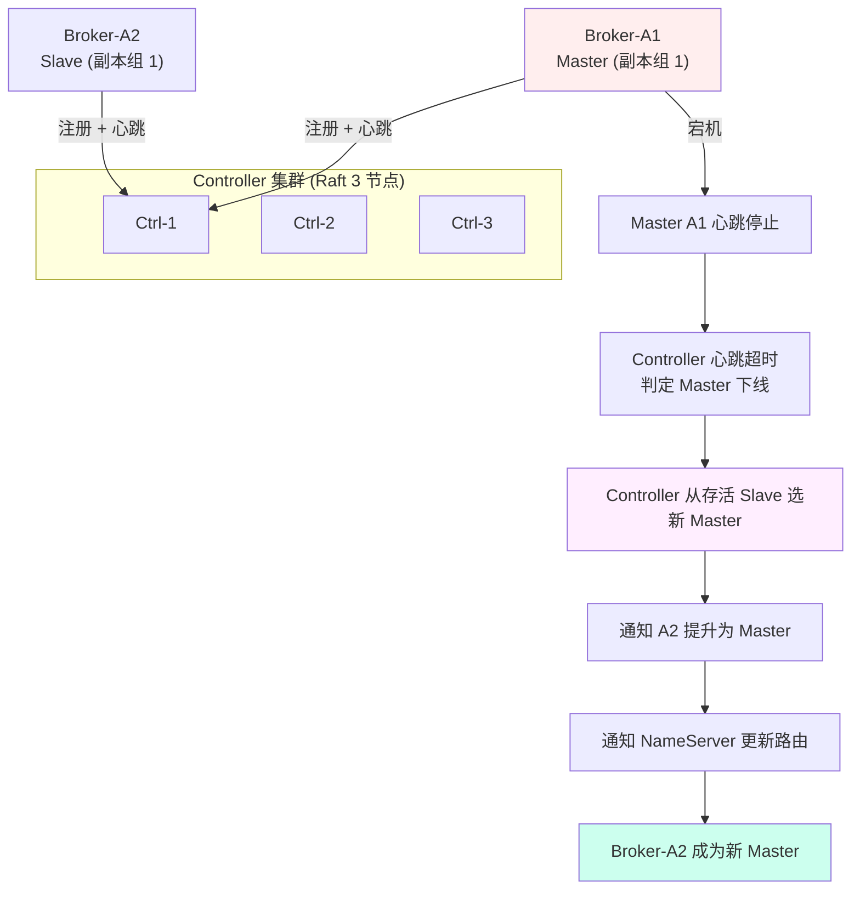
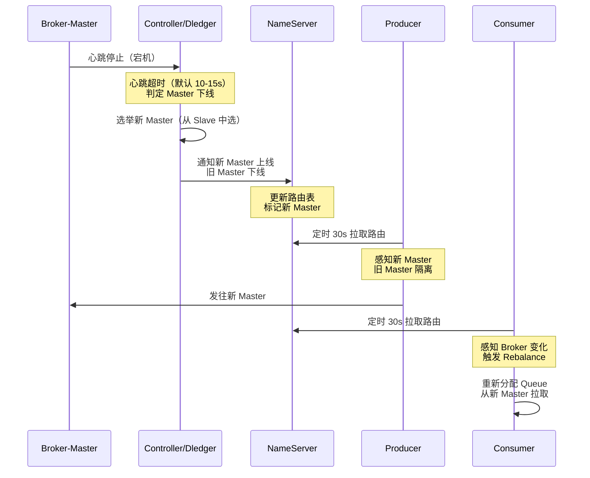
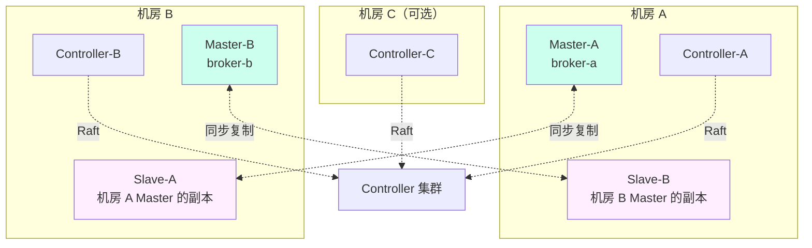
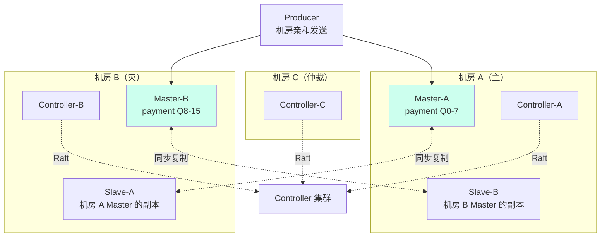
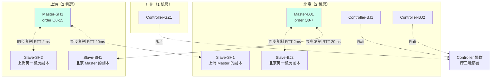

# 高可用与副本同步

> **一句话定位**：高可用是消息中间件的命脉，"Broker 宕机消息会不会丢、Dledger/Controller 怎么选"是资深面试分水岭。
> **面试热度**：⭐⭐⭐⭐⭐
> **返回**：[RocketMQ 知识图谱](../README.md)

---

## 一、概念定义

### 1.1 RocketMQ 高可用演进

RocketMQ 的高可用方案经历了四代演进，每一代都在解决上一代的痛点，理解这条演进线是讲清"现在生产该用哪种模式"的前提。



**四代演进的核心驱动力**：

1. **Master/Slave 异步复制（2.x）**：Slave 主动连 Master 拉取 CommitLog 增量，Master 写入后立即返回成功不等 Slave。痛点是 Master 宕机时未同步到 Slave 的消息会丢，且 Slave 不能自动提升为 Master，需人工用 `mqadmin` 命令切换，MTTR（故障恢复时间）数十分钟。
2. **同步双写 SYNC_MASTER（3.x）**：Master 等待至少一个 Slave 确认收到后才返回发送成功，解决消息丢失问题。痛点是性能下降约 20-30%（等待 Slave ACK 的 RTT 开销），且仍然不能自动切换 Master。
3. **Dledger 模式（4.x）**：引入 Raft 协议实现自动选举 Leader 和日志复制，Master 宕机时秒级自动选出新 Leader。痛点是 Dledger 使用全新的 `DLedgerCommitLog` 格式替换原 CommitLog，老集群不能平滑升级，且复制协议不复用原 HA 通道。
4. **Controller 模式（5.x）**：引入独立的 Controller 集群负责 Master 选举决策，复制仍走原 Master/Slave 的 HA Service 通道。痛点是增加了 Controller 组件的运维成本（虽然很轻），但解决了 Dledger 的存储侵入问题，老集群可直接升级。

**选型建议**：5.x 新部署优先 Controller 模式；4.x 老集群用 Dledger 或保持 Master/Slave 同步双写；纯日志类容忍丢失的场景可用 Master/Slave 异步复制追求极致吞吐。

**演进背后的核心矛盾**：可靠性 vs 复杂度。Master/Slave 简单但不可靠（人工切换慢）；Dledger 可靠但复杂（换存储格式）；Controller 在两者间找平衡——自动切换但不换存储，是 5.x 团队对"如何最小代价实现高可用"的回答。理解这条演进线的关键不是记住每个模式的特点，而是理解每代方案在解决上一代什么痛点、又引入了什么新代价。这条演进线也与 MySQL 高可用演进（手工 → MHA → Orchestrator → MGR）高度同构，核心矛盾都是"如何用最小代价同时实现可靠与自动"。

### 1.2 同步复制 vs 异步复制

复制策略决定"Master 宕机时消息会不会丢"，是面试必问的权衡题。

| 维度 | SYNC_MASTER（同步复制） | ASYNC_MASTER（异步复制） |
|------|------------------------|--------------------------|
| 返回时机 | 等待至少一个 Slave ACK 后返回成功 | Master 写完 CommitLog 立即返回成功 |
| 数据丢失窗口 | 几乎不丢（除非 Master 和 Slave 同时宕机） | 丢失未同步到 Slave 的增量（秒级窗口） |
| 性能损耗 | 约 20-30%（等待 Slave ACK 的 RTT） | 无额外损耗 |
| Master 宕机影响 | Slave 数据完整可安全提升为 Master | Slave 可能缺少量最新消息 |
| 适用场景 | 金融、订单、支付等强可靠场景 | 日志、监控、埋点等容忍丢失场景 |

**关键细节**：①同步复制不要求所有 Slave ACK，只需**至少一个** Slave ACK（`SyncStateSet` 判断多数副本，但 2 节点场景下 1 个 ACK 即可）；②异步复制并非完全不等待，Master 仍然会推送 CommitLog 给 Slave，只是不等 ACK 就返回成功，Slave 最终会追平；③同步复制下如果所有 Slave 都宕机，Master 会阻塞发送（`GroupTransferService` 等待超时后返回失败），这是保证可靠性的兜底。

**同步复制的"半数确认"语义**：3 副本场景下 `SyncStateSet` 要求多数派（2 个 Slave）ACK 才算同步成功，类似 Raft 的半数确认但实现更轻——不走 Raft 协议，只检查 `HAClient` 上报的 offset 是否达到消息位点。2 节点（1 主 1 从）场景退化为"1 个 ACK 即可"，因为 1 个 ACK 就是全部 Slave 确认。这是 RocketMQ 同步复制比 Raft 简单的原因——没有 term、没有选举、没有日志格式侵入，只在 Master/Slave 通道上多等一个 ACK。

### 1.3 自动 Failover 的必要性

Master/Slave 模式的最大痛点是 Slave 不能自动切换为 Master——Master 宕机后必须人工介入用 `mqadmin updateBrokerConfig` 命令把 Slave 提升为 Master，故障恢复时间动辄数十分钟。Dledger 和 Controller 模式都是为了解决"自动切换"这个问题。

| 模式 | 切换方式 | 切换耗时 | 数据完整性 | 人工介入 |
|------|---------|---------|-----------|---------|
| Master/Slave | 手动 `mqadmin` 命令 | 数十分钟（含人工响应） | 取决于复制策略 | 必须 |
| Dledger | Raft 选举自动切换 | 秒级（通常 3-10s） | 多数派提交日志完整 | 无 |
| Controller | Controller 决策自动切换 | 秒级（通常 5-15s） | 复用原复制通道 | 无 |

**为什么 Master/Slave 不能自动切换？** 因为 Master/Slave 模式没有"决策者"——NameServer 是无状态路由中心不参与选主，Broker 自身也不知道谁该当 Master。这就像一个团队没有 leader，谁都不该擅自宣布自己接班。Dledger 的方案是让 Broker 组内部用 Raft 自己选主（去中心化），Controller 的方案是引入外部的决策者（中心化）。

**脑裂问题**：自动选主必须解决脑裂——网络分区时两个节点都以为自己是 Master，导致双写数据不一致。Master/Slave 模式不存在脑裂（因为根本不自动选主）。Dledger 用 Raft 的 term + 多数票防脑裂（少数派无法当选）。Controller 模式下 Controller 集群自身用 Raft 保证一致性，Broker 只听 Controller 的决策，不会自行宣布当 Master，从架构上规避脑裂。这是 Controller 模式比 Dledger 更安全的一点——选主决策权在外部 Raft 集群，Broker 无法"擅自"变 Master。

### 1.4 消息可靠性三端保障

消息不丢不是单点能保证的，需要**生产端 + Broker + 消费端**三端协同：



**三端各自的责任**：
- **生产端**：发送失败重试（`retryTimesWhenSendFailed` 默认 2 次）+ 退避策略 + 故障 Broker 隔离（`sendLatencyFaultEnable`），防止因网络抖动或 Broker 短暂不可用导致消息丢失。
- **Broker**：同步刷盘保证单机持久化 + 同步复制保证跨机冗余，两者结合实现"消息写入即不丢"。
- **消费端**：至少一次（At-Least-Once）投递语义 + 消费幂等（业务唯一键去重），防止因消费失败不重试导致消息"丢消费"。

**核心结论**：三端缺一不可。生产端不重试，网络抖动就丢；Broker 不同步刷盘+同步复制，宕机就丢；消费端不幂等，重试就重复。面试回答"消息怎么保证不丢"必须覆盖三端，只讲 Broker 刷盘+复制是不完整的。

---

## 二、原理与流程

### 2.1 Master/Slave 复制

Master/Slave 复制是 RocketMQ 最基础的副本机制，由 `HAService` 统一管理，核心是**Slave 主动连接 Master + Master 推送 CommitLog 增量**。

**核心组件**：
- `HAService`（Master 侧）：管理所有 Slave 连接，维护 `HAConnection` 列表，负责向 Slave 推送 CommitLog 增量。
- `HAClient`（Slave 侧）：主动连接 Master，上报自身已同步 offset，接收 Master 推送的增量数据。
- `HAConnection`：Master 侧对每个 Slave 的封装，维护该 Slave 的同步进度。

**复制流程**：



**关键机制**：
1. **Slave 主动连接**：Slave 启动时主动连接 Master 的 HA 端口（默认 9394），不是 Master 推给 Slave。这与 MySQL 主从类似（从库 IO 线程连主库）。
2. **offset 上报**：Slave 每次写入本地 CommitLog 后，向 Master 上报已同步的 offset。Master 据此判断 Slave 的同步进度，决定下一批推送的起点。
3. **增量推送**：Master 不全量推送 CommitLog，只推 Slave offset 之后的增量，避免重复传输。
4. **长连接 + 长轮询**：HA 连接是长 TCP 连接，Master 有新数据就推，Slave 上报 offset 后 Master 立即推送下一批。

**与 Redis 主从复制的对比**：Redis 主从是"主库发 RDB 全量 + backlog 增量"，RocketMQ 是"Master 推 CommitLog 增量，无全量同步概念"（Slave 首次连接也是从 offset 0 开始增量推送，等价于全量但不分阶段）。Redis 的 backlog 是环形缓冲区断线续传，RocketMQ 的 CommitLog 本身就是持久化文件，Slave 断线重连后从上次 offset 继续，天然支持断点续传无需额外 backlog 机制——CommitLog 文件就是"backlog"。

**与 MySQL 半同步复制的对比**：MySQL 半同步复制是主库等至少一个从库 ACK binlog 才返回提交，RocketMQ 同步复制是 Master 等至少一个 Slave ACK CommitLog 才返回发送成功，思路完全一致。差异是 MySQL 复制 binlog 逻辑日志（需解析执行），RocketMQ 复制 CommitLog 物理日志（直接拷字节，效率高）。

**源码路径**：`store.ha.HAService`（Master 侧管理）、`store.ha.HAConnection`（Master 侧单 Slave 连接封装）、`store.ha.HAClient`（Slave 侧客户端）、`store.ha.HAConnection.readSocket`（读取 Slave offset）/`sendService`（推送 CommitLog 增量）。

### 2.2 同步双写流程

同步双写（SYNC_MASTER）是在 Master/Slave 复制基础上增加"等待 Slave ACK"的机制，核心由 `GroupTransferService` 实现。

**核心机制**：Master 收到消息写入 CommitLog 后，不立即返回发送成功，而是把消息的 offset 加入 `GroupTransferService` 的等待队列。`GroupTransferService` 轮询检查 Slave 的已同步 offset 是否达到该消息的 offset，达到后唤醒等待的发送线程返回成功。

**等待唤醒机制**：

```java
// GroupTransferService 核心逻辑（简化示意）
while (!requests.isEmpty()) {
    for (req : requests) {
        // 检查是否有 Slave 的同步 offset >= req.offset
        if (slaveOffset >= req.offset) {
            req.notifyWaiter();  // 唤醒发送线程返回成功
        }
    }
    // 没有达到的，wait 一会儿再检查
    waitNotify.waitForRunning(10);  // 每 10ms 轮询
}
```

**关键细节**：
1. **`SyncStateSet`**：Master 维护一个"多数副本同步位点集合"，判断多少个 Slave 已 ACK。2 节点场景（1 Master 1 Slave）只需 1 个 Slave ACK；3 副本场景需 2 个 ACK（多数派）。
2. **`waitNotify` 机制**：发送线程把请求加入等待队列后调用 `waitNotify` 阻塞，`GroupTransferService` 检查到位点满足后调用 `notify` 唤醒。这是 `WaitNotifyObject` 的典型用法——生产者-消费者唤醒模型。
3. **超时兜底**：如果 Slave 长时间不 ACK（网络故障或 Slave 宕机），发送线程等待超时后返回失败，不让请求无限阻塞。超时由 `sendMsgTimeout` 控制。
4. **Slave 全挂的行为**：同步双写下如果所有 Slave 都宕机，`SyncStateSet` 为空，`GroupTransferService` 永远等不到 ACK，所有发送请求超时失败——这是"宁可不可用也不丢消息"的强可靠取舍。

**源码路径**：`store.ha.GroupTransferService`（等待 Slave ACK 唤醒）、`store.ha.WaitNotifyObject`（等待唤醒原语）、`store.ha.HAService.SyncStateSet`（多数副本判断）。

### 2.3 Dledger 模式

Dledger 是 RocketMQ 4.5 引入的基于 Raft 协议的高可用方案，核心思想是**用 Raft 选举 Leader + 日志复制半数确认**实现自动 Failover。

**Dledger 的关键改变**：
- **`DLedgerCommitLog` 替换原 CommitLog**：Dledger 不用原来的 CommitLog 格式，而是用自研的 DLedger 日志格式，每条消息带 Raft term 和 index。这是 Dledger 的根本代价——存储格式侵入，老集群不能直接升级。
- **Raft 选举 Leader**：Broker 组内用 Raft 协议选举 Leader（即 Master），Leader 宕机时 Follower 自动发起选举，秒级选出新 Leader。
- **日志复制半数确认**：Leader 收到消息后复制到 Follower，半数（N/2+1）确认后才返回成功，类似同步双写但走 Raft 协议。

**Raft 选举流程**：



**Raft 选举的关键设计**：
1. **随机选举超时**：每个 Follower 的选举超时时间随机（150-300ms），避免所有 Follower 同时发起选举导致分票。这是 Raft 比 Paxos 更易理解的关键设计。
2. **term 递增**：每次选举 term（任期号）递增，同一 term 内每个节点只投一票，防止旧 Leader 脑裂。
3. **Leader 心跳**：Leader 周期性发心跳维持地位，Follower 在选举超时内收到心跳就保持 Follower，超时未收到才发起选举。
4. **PreVote 优化**：Dledger 实现了 PreVote 阶段——Candidate 先发预投票探测自己日志是否最新，避免 term 无谓递增干扰正常 Leader。这是 Raft 工程优化的常见做法。

**Dledger 的代价**：①存储格式不兼容原 CommitLog，老集群需迁移数据；②Raft 复制协议不复用原 HA Service 通道，相当于"另起炉灶"；③部署必须 3 节点起步（Raft 需奇数节点），2 节点场景不适用。

**为什么 Dledger 要换存储格式？** 因为 Raft 协议要求每条日志带 term（任期号）和 index（日志序号），原 CommitLog 格式没有这两个字段。Dledger 在每条消息前加 DLedger header（term + index + magic），变成 `DLedgerCommitLog`。这是 Raft 协议的硬约束——不带 term 无法判断日志新旧，不带 index 无法保证日志连续性。Controller 模式之所以不换存储，是因为它把 Raft 选举和复制解耦——Controller 内部跑 Raft（选主），Broker 之间跑原 HA Service（复制），各干各的。

**源码路径**：`dledger.DLedgerLeaderElector`（Raft 选举）、`dledger.DLedgerServer`（Dledger 服务端）、`store.dledger.DLedgerCommitLog`（Dledger 存储格式）、`dledger.DLedgerEntryPusher`（日志复制）。

### 2.4 Controller 模式 5.x

Controller 模式是 RocketMQ 5.x 的关键设计，目标是**既实现自动 Failover，又兼容原 Master/Slave 存储格式**。Controller 本身是一个独立的 Raft 集群，只负责 Master 选举决策，不参与消息复制。

**Controller 的核心职责**：
1. **Broker 注册与心跳**：Broker 启动时向 Controller 注册（副本组 ID、Broker 名、角色），运行中持续心跳保活。
2. **Master 选举**：副本组的 Master 宕机时，Controller 从存活的 Slave 中选出新 Master，通知其他 Broker 切换主从角色。
3. **元数据维护**：维护"哪个副本组的 Master 是谁"这类元数据，Broker 和 Client 可查询。
4. **isActive 状态管理**：Controller 维护 Broker 的活跃状态，心跳超时标记下线，恢复后重新上线并参与选主决策。

**Controller 选主的判定依据**：当 Master 心跳超时被判定下线后，Controller 从该副本组的存活 Slave 中选新 Master，选择依据是 offset 最大者（数据最全）。如果多个 Slave offset 相同，按 brokerId 小者优先（brokerId=1 是默认 Slave）。这个判定比 Dledger 的 Raft 选举更简单——Controller 只需比较 offset，不需要走完整的 Raft 选举流程，因为选主决策权在 Controller 而非 Broker 内部。

**Controller 选举流程**：



**Controller 模式 vs Dledger 的关键差异**：
1. **Controller 是外部决策者**：Controller 是独立部署的 Raft 集群（类似 ZK 但极简），Broker 组内部不搞 Raft 选举。而 Dledger 是 Broker 组内部自己跑 Raft。
2. **复制走原 HA 通道**：Controller 模式下消息复制仍用 Master/Slave 的 `HAService` 通道，不换存储格式。Dledger 用自研复制协议换掉原 HA 通道。
3. **老集群可平滑升级**：Controller 模式兼容原 CommitLog，老集群开启 Controller 配置即可升级，无需迁移数据。Dledger 必须全新部署。

**Controller 部署形态**：
- **独立部署（推荐生产）**：3 节点 Raft 集群，与 Broker 物理隔离，3 个小 JVM 进程即可，运维成本低。
- **嵌入式部署（开发测试）**：Broker 进程内嵌 Controller 模式，省去独立部署，但生产不建议（Broker 宕机会带走 Controller）。

**Controller 与 NameServer 的分工**：Controller 管"谁是 Master"（副本组选举决策），NameServer 管"Broker 有哪些 Topic/Queue"（路由元数据）。两者职责正交，NameServer 仍是无状态多节点互不通信，Controller 是 Raft 强一致小集群。Broker 既向 NameServer 注册路由（30s 心跳），也向 Controller 注册副本组身份（心跳保活）。这是 5.x 的"双注册中心"设计——路由用 AP（NameServer），选主用 CP（Controller），各取所长。

**源码路径**：`controller.BrokerHeartbeatManager`（Broker 心跳管理）、`controller.ControllerManager`（Controller 主逻辑）、`controller.ReplicasInfoManager`（副本组元数据）、`controller.BrokerHousekeepingService`（Broker 下线检测）。

### 2.5 三种模式对比表

| 维度 | Master/Slave | Dledger | Controller 模式 5.x |
|------|-------------|---------|---------------------|
| 自动 Failover | 否（手动切换） | 是（Raft 选举） | 是（Controller 决策） |
| 存储侵入 | 无（原 CommitLog） | 有（DLedgerCommitLog） | 无（原 CommitLog） |
| 复制通道 | HA Service | DLedger Raft 协议 | HA Service（复用原通道） |
| 部署复杂度 | 低 | 中（3 节点 Raft 内嵌） | 中（3 节点独立 Controller） |
| 老集群升级 | 不适用 | 不能平滑升级 | 可平滑升级 |
| 最少节点数 | 2（1 主 1 从） | 3（Raft 奇数） | 2（1 主 1 从）+ 3 Controller |
| 切换耗时 | 数十分钟（人工） | 3-10s | 5-15s |
| 5.x 推荐 | 否（兼容保留） | 否（过渡方案） | **是**（5.x 主推） |

**5.x 的推荐路径**：新部署直接用 Controller 模式；4.x Dledger 集群可逐步迁移到 Controller（存储格式需评估）；4.x Master/Slave 同步双写集群开启 Controller 配置即可平滑升级。

**与 NameServer 的协同**：Controller 决策出新 Master 后，新 Master 需要向 NameServer 注册（标记自己是 Master 角色），客户端才能从 NameServer 拉到正确路由。这个协同链是：Controller 选主 → 新 Master 注册 NameServer → 客户端拉取路由。如果 Controller 选了主但新 Master 没注册 NameServer，客户端仍不知道谁是 Master，所以新 Master 注册 NameServer 是故障转移的关键收尾步骤。

### 2.6 故障转移全流程

Broker 宕机后的故障转移涉及 Controller/Dledger、NameServer、Producer、Consumer 多方协同，面试讲清这条链路是资深加分项。



**故障转移的关键阶段**：
1. **心跳超时检测（10-15s）**：Controller/Dledger 通过心跳超时判定 Master 下线。这个窗口期客户端仍可能向旧 Master 发送，导致发送失败——Producer 靠重试兜底。
2. **选主决策（秒级）**：Controller 从存活 Slave 中选 offset 最全的提升为新 Master，或 Dledger 走 Raft 选举。
3. **路由更新（30s 内）**：NameServer 收到 Controller 通知后更新路由表，但客户端是定时拉取（默认 30s），所以客户端感知有最长 30s 延迟。
4. **客户端 Rebalance**：Consumer 感知 Broker 变化后触发 Rebalance，重新分配 Queue 归属，从新 Master 拉取消息继续消费。

**故障感知的双重路径**：①Controller 路径——Controller 心跳超时选新 Master，新 Master 向 NameServer 注册，客户端拉路由感知（被动感知，最长 30s）；②客户端路径——Producer 发送失败触发故障隔离（`sendLatencyFaultEnable`），Consumer 拉取失败触发 Rebalance（主动感知，秒级）。两条路径互补——Controller 路径保证路由最终正确，客户端路径保证发送/消费不长时间中断。

**故障转移期间的消息行为**：
- **发送侧**：旧 Master 宕机到客户端感知新 Master 期间，发送会失败，Producer 重试 + 故障隔离兜底，重试期间消息暂存 Producer 侧不丢。
- **消费侧**：旧 Master 上的未消费消息，如果 Slave 已同步则新 Master 可继续消费；如果 Slave 未同步（异步复制下可能丢少量最新消息），这部分消息丢失。
- **消费位点**：Consumer 的消费位点存在 Broker 侧（集群消费模式），新 Master 需要从 Slave 的位点继续，可能重复消费少量已 ACK 但未同步到 Slave 的消息——所以消费端必须幂等。

**故障转移的可见性窗口**：从 Master 宕机到客户端完全切到新 Master，存在最长约 40-45s 的"切换窗口"（心跳超时 10-15s + 选主秒级 + 客户端路由拉取 30s）。这期间 Producer 发送失败靠重试兜底，Consumer 消费暂停靠 Rebalance 后恢复。对延迟敏感的场景，可调小客户端路由拉取间隔（`fetchNamesrvAddrInterval` 默认 30s）缩短感知延迟，但会增加 NameServer 压力。

### 2.7 消息可靠性保障

消息不丢的完整方案是"三端保障"，每端都有具体配置项。

**三端可靠性保障方案表**：

| 端 | 保障手段 | 配置/实现 | 代价 |
|----|---------|----------|------|
| 生产端 | 发送重试 | `retryTimesWhenSendFailed=2`（默认） | 重试期间延迟增加 |
| 生产端 | 发送超时 | `sendMsgTimeout=3000ms`（默认） | 超时即失败需业务兜底 |
| 生产端 | 故障隔离 | `sendLatencyFaultEnable=true` | 慢 Broker 被跳过 |
| Broker | 同步刷盘 | `flushDiskType=SYNC_FLUSH` | 吞吐降 40% |
| Broker | 同步复制 | `brokerRole=SYNC_MASTER` | 吞吐降 20-30% |
| Broker | 至少一次 | 写入 CommitLog + 刷盘才返回成功 | - |
| 消费端 | 至少一次投递 | ACK 后才更新消费位点 | 重复消费需幂等 |
| 消费端 | 消费幂等 | 业务唯一键 + Redis SETNX 去重 | 去重存储开销 |
| 消费端 | 失败重试 | 消费失败重试 16 次后进 DLQ | DLQ 需人工处理 |

**关键配置组合**：
- **金融级（不丢不重）**：同步刷盘 + 同步复制 + 生产重试 2 次 + 消费幂等，吞吐约单 Master 3-5 万 TPS。
- **普通业务（不丢容忍重复）**：异步刷盘 + 同步复制 + 生产重试 + 消费幂等，吞吐约单 Master 8-10 万 TPS。
- **日志类（容忍少量丢失）**：异步刷盘 + 异步复制 + 生产不重试，吞吐可达单 Master 10-15 万 TPS。

**"不丢"的边界**：即使同步刷盘 + 同步复制，仍有一种极端场景会丢——Master 和 Slave 同时宕机（如机房整体断电），且 Master 的消息在刷盘前还没落盘。这是"两节点同时不可用"的极端情况，概率极低但理论上存在。要彻底杜绝，需三机房三副本 + 同步复制多数派确认，或生产端本地消息表兜底。面试回答时承认这个边界，比声称"绝对不丢"更严谨。

### 2.8 源码路径汇总

| 功能 | 源码路径 | 关键类/方法 |
|------|---------|-----------|
| Master/Slave 复制 | `store.ha.HAService` | `HAService`、`HAConnection`、`HAClient` |
| 同步双写等待 | `store.ha.GroupTransferService` | `GroupTransferService`、`WaitNotifyObject` |
| 多数副本判断 | `store.ha.HAService` | `SyncStateSet` |
| Dledger 选举 | `dledger.DLedgerLeaderElector` | `DLedgerLeaderElector`、`DLedgerServer` |
| Dledger 存储 | `store.dledger.DLedgerCommitLog` | `DLedgerCommitLog` |
| Dledger 复制 | `dledger.DLedgerEntryPusher` | `DLedgerEntryPusher` |
| Controller 心跳 | `controller.BrokerHeartbeatManager` | `BrokerHeartbeatManager` |
| Controller 选主 | `controller.ControllerManager` | `ControllerManager`、`ReplicasInfoManager` |
| Broker 下线检测 | `controller.BrokerHousekeepingService` | `BrokerHousekeepingService` |

---

## 三、高频追问

### Q1: Broker 宕机消息会丢吗？

**答**：取决于刷盘和复制策略。同步刷盘 + 同步复制（SYNC_FLUSH + SYNC_MASTER）保证消息写入即不丢——Master 刷盘成功 + 至少一个 Slave 复制成功才返回 ACK。异步刷盘 + 异步复制（ASYNC_FLUSH + ASYNC_MASTER）下，Master 宕机会丢失未刷盘和未同步到 Slave 的消息（秒级窗口）。生产可靠场景用同步刷盘 + 同步复制。

**关联**：→ [高可用与副本同步](./04-ha/ha-and-replication.md)

### Q2: Master/Slave 怎么切换？

**答**：Master/Slave 模式不能自动切换，需人工用 `mqadmin updateBrokerConfig -b slaveAddr -n nsAddr -k brokerRole=ASYNC_MASTER` 把 Slave 提升为 Master，故障恢复耗时数十分钟。Dledger 和 Controller 模式支持自动切换——Dledger 走 Raft 选举，Controller 由外部 Controller 集群决策，都是秒级切换。5.x 推荐用 Controller 模式实现自动切换。

**关联**：→ [高可用与副本同步](./04-ha/ha-and-replication.md)

### Q3: Dledger 是什么？

**答**：Dledger 是 RocketMQ 4.5 引入的基于 Raft 协议的高可用方案。核心是 Broker 组内用 Raft 选举 Leader（Master）+ 日志复制半数确认，实现自动 Failover。代价是使用 `DLedgerCommitLog` 替换原 CommitLog 格式，老集群不能平滑升级，且复制不复用原 HA 通道。4.x 时代是自动切换的主要方案，5.x 被 Controller 模式取代（Controller 兼容原存储）。

**关联**：→ [高可用与副本同步](./04-ha/ha-and-replication.md)

### Q4: Controller 模式有什么优势？

**答**：Controller 模式是 5.x 主推的高可用方案，三大优势：①自动 Failover——Controller 集群负责 Master 选举决策，Master 宕机秒级选出新 Master；②兼容原存储——复制仍走 Master/Slave 的 HA Service 通道，不换 CommitLog 格式，老集群可平滑升级；③部署灵活——Controller 是独立 3 节点 Raft 集群，Broker 最少 2 节点（1 主 1 从）即可，不像 Dledger 必须 3 节点起步。5.x 新部署优先 Controller。

**关联**：→ [高可用与副本同步](./04-ha/ha-and-replication.md)

### Q5: 同步复制和异步复制怎么选？

**答**：按业务可靠性需求选。金融、订单、支付等强可靠场景用同步复制（SYNC_MASTER），Master 宕机不丢消息，代价是吞吐降 20-30%。日志、监控、埋点等容忍丢失场景用异步复制（ASYNC_MASTER），追求极致吞吐。实际生产常见组合是"同步刷盘 + 同步复制"用于核心业务 Topic，"异步刷盘 + 异步复制"用于日志 Topic，混部在同一集群不同 Topic 配置。

**关联**：→ [高可用与副本同步](./04-ha/ha-and-replication.md)

### Q6: 消息怎么保证不丢？

**答**：三端保障。①生产端：`retryTimesWhenSendFailed` 发送失败重试 + `sendLatencyFaultEnable` 故障隔离，防止网络抖动丢；②Broker：`SYNC_FLUSH` 同步刷盘保证单机持久化 + `SYNC_MASTER` 同步复制保证跨机冗余，写入即不丢；③消费端：至少一次投递语义（ACK 后才更新位点）+ 消费幂等（业务唯一键 Redis SETNX 去重），防止消费丢失和重复。三端缺一不可，只讲 Broker 刷盘+复制是不完整的。

**关联**：→ [高可用与副本同步](./04-ha/ha-and-replication.md)

### Q7: Dledger 和 Controller 怎么选？

**答**：5.x 优先 Controller 模式——兼容原存储、老集群可平滑升级、部署灵活（Broker 2 节点 + Controller 3 节点）。4.x 老集群若已用 Dledger 可继续用，或评估迁移到 Controller。新建集群不建议用 Dledger，它是 4.x 的过渡方案，5.x 官方主推 Controller。如果不想引入 Controller 组件，Master/Slave 同步双写 + 人工切换也能用，但故障恢复慢。

**关联**：→ [高可用与副本同步](./04-ha/ha-and-replication.md)

### Q8: 同步双写性能损耗多少？

**答**：约 20-30%。同步双写下 Master 要等待至少一个 Slave ACK 才返回成功，多了一次跨机 RTT 开销。同城机房 RTT 约 1-2ms，单条消息多 1-2ms 延迟。批量发送和并发能摊薄这个开销，所以整体吞吐降 20-30% 而非线性下降。如果追求极致吞吐且容忍丢失，用异步复制可省掉这部分开销。金融场景这个损耗是必要的可靠性投资。

**关联**：→ [高可用与副本同步](./04-ha/ha-and-replication.md)

### Q9: Controller 集群本身宕机怎么办？

**答**：Controller 集群是 3 节点 Raft，容忍 1 节点宕机（多数派需 2 票）。如果 2 节点宕机只剩 1 节点，Raft 无法选主，Controller 服务不可用——但这只影响"新 Master 选举"，不影响已有 Master 继续提供服务。也就是说 Controller 全挂时，Broker 仍能正常收发消息，只是 Master 宕机后无法自动切换。所以 Controller 是"可选组件"而非"必选组件"，挂了不影响常态服务，只影响故障转移能力。生产建议 3 节点跨机房部署降低同时宕机概率。

**关联**：→ [高可用与副本同步](./04-ha/ha-and-replication.md)

---

## 四、实战关联（Java 后端视角）

### 4.1 Producer 可靠性配置

生产端可靠性核心是重试和故障隔离，Java 配置示例：

```java
DefaultMQProducer producer = new DefaultMQProducer("order_producer_group");
producer.setNamesrvAddr("ns1:9876;ns2:9876;ns3:9876");
// 发送失败重试次数（默认 2）
producer.setRetryTimesWhenSendFailed(3);
// 异步发送失败重试次数（默认 2）
producer.setRetryTimesWhenSendAsyncFailed(3);
// 发送超时（默认 3000ms）
producer.setSendMsgTimeout(3000);
// 开启故障 Broker 隔离（慢/不可用 Broker 临时跳过）
producer.setSendLatencyFaultEnable(true);
// 消息体超过 4KB 压缩
producer.setMaxMessageSize(1024 * 1024 * 4);
producer.start();

Message msg = new Message("order_topic", "tagA", "orderId:1001",
        JSON.toJSONString(order).getBytes(StandardCharsets.UTF_8));
// 同步发送 + 重试
SendResult result = producer.send(msg);
```

**配置要点**：①`retryTimesWhenSendFailed` 是同步发送失败的重试次数，默认 2，核心业务调到 3；②`sendLatencyFaultEnable` 开启后，发送慢或失败的 Broker 会被临时隔离一段时间，避免持续向故障 Broker 发送；③异步发送用 `producer.asyncSend(msg, callback)`，重试由 `retryTimesWhenSendAsyncFailed` 控制。

**生产端兜底方案**：对于绝对不能丢的消息，生产端可加一层"本地消息表"兜底——发送前先把消息写本地 DB 表，发送成功后更新状态，定时任务扫描未成功状态的消息补偿发送。这是金融级场景的最后一道防线，弥补重试 3 次仍失败的消息，确保不丢。本地消息表方案在 [实战与最佳实践](../06-practice/practice-and-best-practice.md) 详述。

### 4.2 生产部署拓扑

典型生产部署是 **2 Master 2 Slave + Controller** 同步双写，按机房分布：



**部署要点**：①Master 和 Slave 跨机房分布，单机房故障另一机房有完整 Master；②Controller 集群跨机房部署（3 节点分 3 机房），保证 Controller 自身高可用；③同步双写跨机房 RTT 约 1-2ms，吞吐损耗约 20-30%，可接受；④Producer 机房亲和——优先发本机房 Master，减少跨机房 RTT。

**机柜/交换机层面的亲和**：除了机房级别分布，还要注意机柜和交换机级别的分布——同一副本组的 Master 和 Slave 不能放在同一机柜或同一交换机下，防止机柜故障或交换机故障导致整个副本组不可用。这是高可用部署的" rack awareness"原则，与 K8s 的 `podAntiAffinity` 同理。生产部署时应把 Master 和 Slave 的机柜位置记录在 CMDB 中，便于排障时快速定位物理位置。

### 4.3 与 MySQL 高可用对比

RocketMQ 的高可用思路与 MySQL 高度一致，都是"主从复制 + 自动选主"模式，对比有助于建立统一认知。

| 维度 | RocketMQ | MySQL |
|------|---------|-------|
| 主从复制 | HA Service 推送 CommitLog 增量 | binlog 复制（异步/半同步） |
| 自动选主 | Dledger Raft / Controller | MHA / Orchestrator / MGR |
| 复制格式 | CommitLog 物理日志 | binlog 逻辑日志/relaylog |
| 数据丢失窗口 | 同步复制不丢，异步秒级 | 半同步不丢，异步秒级 |
| 多数派确认 | SyncStateSet / Raft 半数 | MGR 半数 / 半同步至少 1 个 ACK |
| 故障切换耗时 | Controller 秒级 / 人工数十分钟 | MHA 分钟级 / MGR 秒级 |

**核心差异**：RocketMQ 复制的是 CommitLog 物理日志（直接拷字节），MySQL 复制的是 binlog 逻辑日志（需解析执行）。物理日志复制效率高但格式耦合，逻辑日志复制通用但开销大。MySQL 的 MGR（Group Replication）用 Paxos 变种实现自动选主，思路与 Dledger 的 Raft 类似。

**演进思路的对照**：MySQL 高可用也经历了"手工切换 → MHA 半自动 → Orchestrator 自动 → MGR 内置 Raft"的演进，与 RocketMQ 的"Master/Slave 手工 → Dledger 内置 Raft → Controller 外置 Raft"惊人相似。区别是 RocketMQ 在 Dledger 之后退回"外置决策者"（Controller），因为内置 Raft 的存储侵入代价太高；MySQL 的 MGR 直接内置 Group 通信引擎（XCom），兼容了 binlog 格式所以没走回头路。这是两个中间件基于自身存储格式约束做出的不同选择——MySQL 的 binlog 是逻辑日志易兼容，RocketMQ 的 CommitLog 是物理日志难改造。

### 4.4 关联 java-core/jvm：HA Service 线程模型

HA Service 的复制流程是典型的多线程并发模型，与 `java-core/jvm` 的线程调度知识直接关联。

| HA 组件 | 线程模型 | JVM 调度特征 |
|---------|---------|-------------|
| `HAService.AcceptSocketService` | 单线程 Acceptor | 阻塞在 `accept()`，事件低频 |
| `HAConnection.WriteSocketService` | 每 Slave 一个写线程 | 频繁 IO 等待，CPU 占用低 |
| `HAConnection.ReadSocketService` | 每 Slave 一个读线程 | 阻塞在 `read()`，事件驱动 |
| `GroupTransferService` | 单线程轮询 | 每 10ms 轮询检查位点，CPU 中等 |
| `HAClient`（Slave 侧） | 单线程 | 连接 Master + 写本地 CommitLog |

**调优关联**：①Slave 数量多时 `HAConnection` 线程数翻倍（读写各一），大集群需关注线程上下文切换开销，关联 JVM 线程调度；②`GroupTransferService` 的 10ms 轮询间隔是可靠性与 CPU 开销的权衡，调小延迟更低但 CPU 占用更高；③HA Service 用堆外内存做网络缓冲（Netty ByteBuf），需关注 JVM Direct Memory 监控，避免 OOM。

**`WaitNotifyObject` 的线程协作模型**：`GroupTransferService` 用 `WaitNotifyObject` 实现"发送线程等待 + 检查线程唤醒"的生产者-消费者模型——发送线程把请求加入 `requests` 队列后 `wait`，`GroupTransferService` 检查到 Slave ACK 满足后 `notify` 唤醒。这与 `java-core/jvm` 的 `wait/notify` 机制、`java-core/lambda` 的 `CompletableFuture` 异步编排是同一思想——通过共享变量 + 唤醒机制实现跨线程协作。差异是 `WaitNotifyObject` 是阻塞式（发送线程挂起），`CompletableFuture` 是非阻塞式（回调链），前者吞吐略低但实现简单，后者吞吐高但需处理异步链路复杂度。

---

## 五、系统设计案例

### 案例 1：设计一个金融级消息可靠性方案

**场景**：银行支付系统，要求消息绝对不丢（SLA 99.99%），单机房 + 异地灾备，峰值 1 万 TPS。

**3 分钟标准答法**：

1. **可靠性配置**——同步刷盘 + 同步复制 + Controller 自动切换 + 生产重试 + 消费幂等，五重保障。
2. **部署拓扑**——2 Master 2 Slave + 3 Controller，Master 和 Slave 跨机房分布，Controller 跨机房部署。
3. **容量估算**——1 万 TPS × 1KB = 10MB/s 写入，单 Master 同步双写可达 3-5 万 TPS，2 Master 分摊足够。
4. **消费幂等**——支付消息带 orderId 业务唯一键，消费端 Redis SETNX 去重 + DB 唯一索引兜底。

**可靠性保障方案表**：

| 环节 | 保障手段 | 配置 | 失败兜底 |
|------|---------|------|---------|
| 生产端发送 | 同步发送 + 3 次重试 | `retryTimesWhenSendFailed=3` | 重试失败记本地表，定时补偿 |
| 生产端故障隔离 | 慢 Broker 跳过 | `sendLatencyFaultEnable=true` | 隔离期间消息发往其他 Master |
| Broker 刷盘 | 同步刷盘 | `flushDiskType=SYNC_FLUSH` | 刷盘失败返回发送失败 |
| Broker 复制 | 同步复制 | `brokerRole=SYNC_MASTER` | Slave 全挂则 Master 拒绝发送 |
| Broker 容灾 | Controller 自动切换 | 3 节点 Controller | Master 宕机秒级切换 Slave |
| 消费端投递 | 至少一次 | ACK 后更新位点 | 未 ACK 重复投递 |
| 消费端幂等 | Redis SETNX + DB 唯一索引 | orderId 去重 | 重复消息被丢弃 |
| 消费端重试 | 失败重试 16 次 | `maxReconsumeTimes=16` | 进 DLQ 人工处理 |

**部署拓扑图**：



**SLA 估算**：①单 Master 可用性约 99.9%（年宕机 8 小时）；②同步复制 + Controller 切换，Master 宕机秒级切换不中断服务，可用性提升到 99.99%；③跨机房灾备，单机房整体故障另一机房接管，可用性达 99.999%（理论值）。99.99% SLA 需同步刷盘 + 同步复制 + Controller + 跨机房灾备四重保障。

**核心权衡**：可靠性 vs 性能。同步刷盘 + 同步复制使单 Master TPS 从 10 万降到 3-5 万，但支付场景 1 万 TPS 足够覆盖，可靠性投资值得。

**对账机制**：金融场景还需定时对账兜底——Producer 本地消息表与 Broker 消息索引按 orderId 对账，发现不一致（发了未存/存了未消费）触发补偿。这是同步刷盘 + 同步复制 + Controller 之外的"第六重保障"，覆盖极端并发边界场景下的消息不一致。对账频率可日结（T+1）或小时级，按业务容忍度决定。

### 案例 2：设计一个异地多活的消息集群

**场景**：全国性电商，三地五机房，要求 Producer 机房亲和发送、Broker 机房亲和分布、单机房故障其他机房接管、跨机房复制延迟可控。

**部署拓扑**：



**设计要点**：

1. **同机房内同步复制**：北京两机房之间 RTT 约 2ms，用同步复制保证本机房 Master 宕机同机房 Slave 完整，秒级切换不丢消息。
2. **跨地域异步复制**：北京-上海 RTT 约 20ms，用异步复制避免同步双写的高延迟。跨地域副本作为灾备，容忍秒级数据延迟。
3. **Producer 机房亲和**：Producer 优先发本机房 Master，减少跨机房 RTT。通过 `sendLatencyFaultEnable` 隔离远机房 Broker，本机房 Master 不可用时才 fallback 到远机房。
4. **Controller 跨三地部署**：Controller 集群 3 节点分北京、上海、广州，Raft 多数派需 2 票，单地域故障不影响 Controller 可用性。
5. **Topic Queue 分地域**：order-topic 的 Q0-7 在北京 Master，Q8-15 在上海 Master，Consumer 机房亲和消费本地域 Queue，减少跨地域拉取。

**跨机房延迟优化**：
- **Producer 亲和**：本地 Master 不可用才发远机房，减少常态跨地域流量。
- **Consumer 亲和**：Rebalance 策略用 `MachineRoom` 机房亲和分配，Consumer 优先消费本机房 Queue。
- **异步复制带宽控制**：跨地域复制走压缩 + 限流，避免占用专线带宽。

**专线带宽估算**：北京-上海异步复制，1 万 TPS × 1KB = 10MB/s 单向，压缩后约 3-5MB/s，专线带宽需预留至少 20MB/s（考虑突发和重试）。如果专线带宽不足，会导致复制积压、Slave 同步延迟拉大，影响灾备接管的 RPO（恢复点目标）。监控应关注 `HAClient` 的 offset 落后量，超过阈值告警。

**追问链**：
- **追问 1：跨地域复制丢消息怎么办？**——异地是异步复制容忍秒级延迟，Master 机房整体故障时未同步的少量消息丢失，靠生产端本地表 + 定时补偿兜底，金融级场景核心消息走本地消息表对账。
- **追问 2：Controller 跨地域 Raft 会不会慢？**——Raft 多数派需 2 票，北京-上海-广州三地，Leader 在北京只需上海或广州一票确认，RTT 约 20ms，选举虽慢但选主是低频事件不影响常态吞吐。
- **追问 3：Consumer 跨地域拉取怎么办？**——Rebalance 用机房亲和策略，Consumer 优先分本机房 Queue，本机房 Queue 不够时才拉远机房，常态无跨地域拉取。
