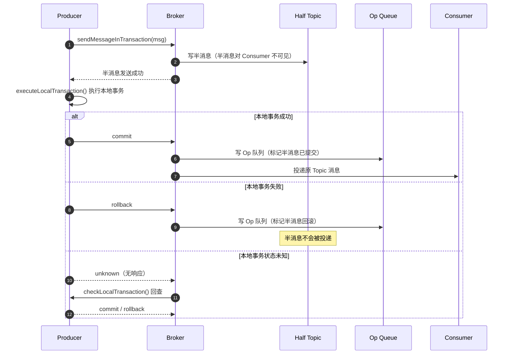
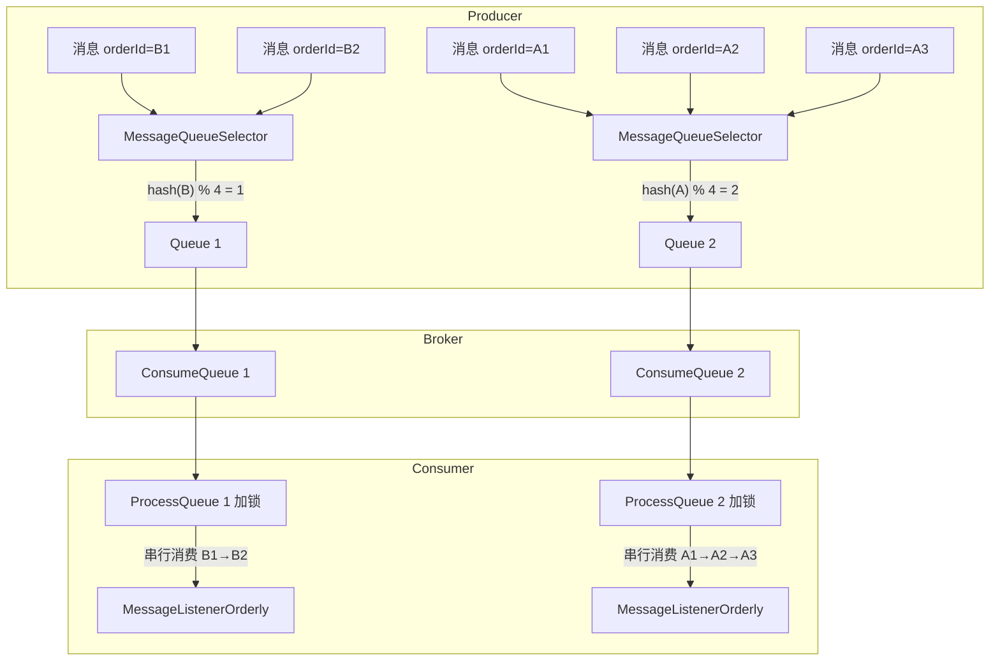
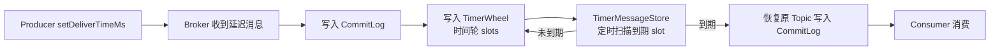
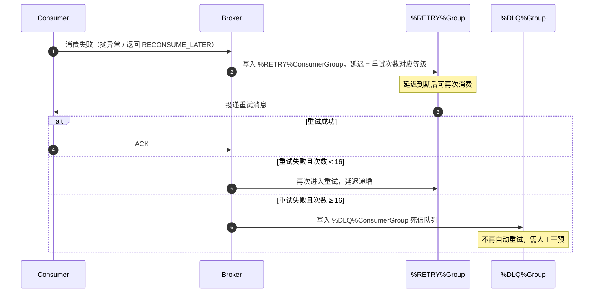
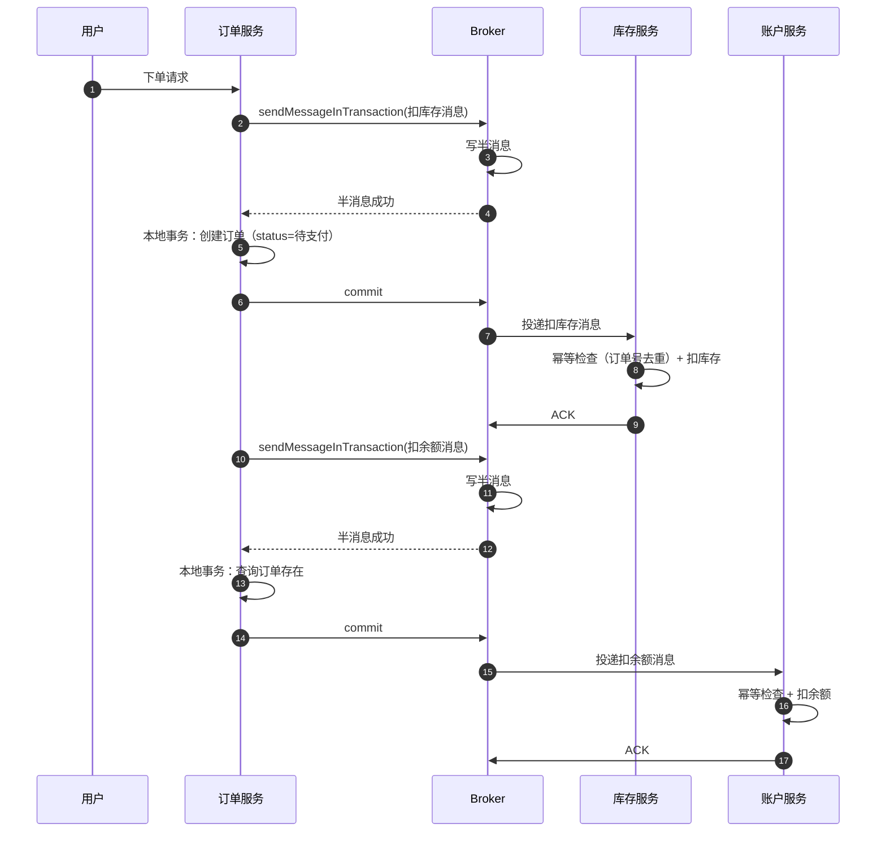
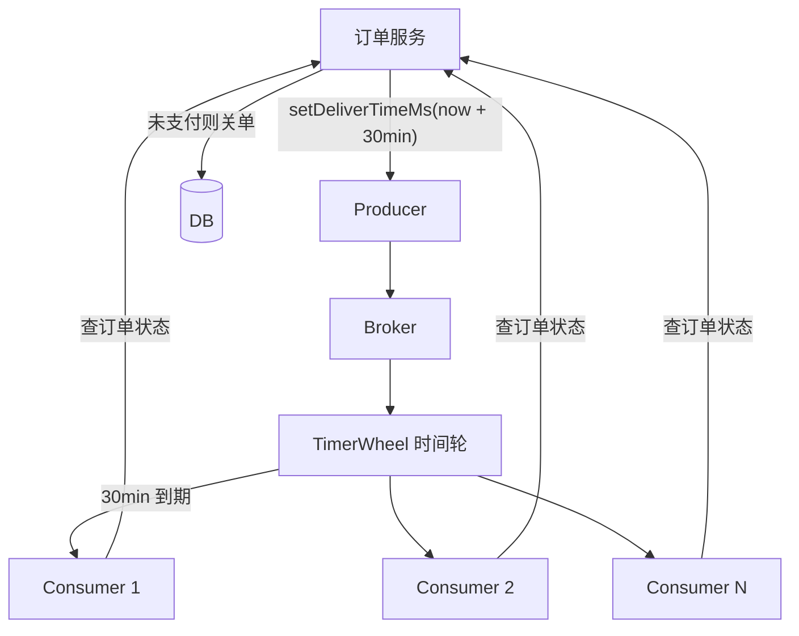

# 高级特性

> **一句话定位**：高级特性是 RocketMQ 的差异化竞争力，"事务消息、顺序消息、延迟消息"是中高级面试必问，能讲到半消息回查与 5.x 任意延迟才算合格。
> **面试热度**：⭐⭐⭐⭐⭐
> **返回**：[RocketMQ 知识图谱](../README.md)

---

## 一、概念定义

RocketMQ 区别于 Kafka / RabbitMQ 的核心护城河，就是开箱即用的高级特性。Kafka 把"事务、延迟、顺序"留给业务层自己实现，RocketMQ 则在 Broker 端原生支持，是中高级面试的必问分水岭——能讲到半消息回查、5.x `TimerWheel` 任意延迟、`MessageQueueSelector` 分区顺序才进入"合格线"。

### 1.1 事务消息

事务消息是 RocketMQ 独有的**两阶段事务**机制，解决"本地事务与消息发送的原子性"问题——要么本地事务成功且消息一定发出，要么本地事务回滚且消息不被消费端看到。其核心是**半消息（Half Message）+ 事务回查**，与 Kafka 的事务消息有本质区别。

| 维度 | RocketMQ 事务消息 | Kafka 事务消息 |
|------|------------------|----------------|
| 事务边界 | **生产端 + 消费端**全链路（半消息对消费端不可见，回查后才投递） | **仅生产端**（多分区原子写入，消费端用 `isolation.level=read_committed` 隔离未提交消息） |
| 回查机制 | 有——Broker 定时回查 Producer 本地事务状态 | 无——Producer 负责主动 commit/abort |
| 超时处理 | 回查 15 次后默认回滚 | 事务超时由 `transaction.timeout.ms` 控制，超时自动 abort |
| 适用场景 | 微服务最终一致、订单+扣库存+扣余额 | Stream 处理 Exactly-Once、多分区原子写 |
| 复杂度 | Producer 实现 `TransactionListener` 即可 | 需配 `transactional.id`、`initTransactions`、`beginTransaction` |

**一句话区分**：Kafka 事务是"原子写多分区"，RocketMQ 事务是"本地事务与消息发送的原子性 + 回查兜底"。

### 1.2 顺序消息

顺序消息保证**同一业务 Key 的消息按发送顺序消费**。RocketMQ 把顺序约束收敛到 **Queue 级别**——同 Key 进同 Queue，同 Queue 单 Consumer 串行消费，即"分区顺序"。全局顺序是其退化特例——单 Topic 单 Queue，所有消息串行。

| 维度 | 全局顺序 | 分区顺序 |
|------|---------|---------|
| Queue 数 | 1 | N（按业务 Key hash 分配） |
| 并行度 | 1（牺牲吞吐） | N（同 Key 串行，跨 Key 并行） |
| 顺序保证 | 全局严格有序 | 同 Key 严格有序，跨 Key 无序 |
| 实现复杂度 | 配置 1 Queue 即可 | `MessageQueueSelector` 按 hash 选 Queue |
| 适用场景 | 极少的强顺序场景（如 binlog 同步） | 大多数业务（订单状态机、账户流水） |

**生产推荐**：分区顺序。单 Queue 全局顺序的吞吐 = 单 Consumer 处理速度，几乎不可用于高 TPS 场景。

### 1.3 延迟消息

延迟消息让消息发送后**延迟指定时间**才对消费端可见。4.x 是固定 18 级延迟（精度秒级、最大 2h），5.x 引入 `TimerWheel` 时间轮，支持任意延迟、精度毫秒级。

| 维度 | 4.x 固定延迟 | 5.x 任意延迟 |
|------|-------------|-------------|
| 延迟精度 | 秒级（18 个固定等级） | 毫秒级（任意时刻） |
| 最大延迟 | 2h | 理论无限（受 `TimerWheel` 文件保留时间限制） |
| 存储开销 | 低（替换 `SCHEDULE_TOPIC_XXXX`） | 高（独立 `TimerWheel` 文件 + 索引） |
| API | `setDelayTimeLevel(3)` | `setDeliverTimeMs(timestamp)` |
| 兼容性 | 5.x 仍兼容 `MessageDelayLevel` 配置 | 5.x 新增 |

**业务意义**：4.x 18 级固定延迟无法做"30 分钟订单关单"这种精确场景（要么 10m 要么 1h），5.x 才真正解决。

### 1.4 重试与死信

消费失败的消息自动进入重试队列 `%RETRY%ConsumerGroup`，最多重试 16 次，递增延迟（10s/30s/1m/2m...2h）。16 次仍失败转入死信队列 `%DLQ%ConsumerGroup`，需人工干预。

**重试延迟等级表**（16 级，与延迟消息 4.x 共用同一套延迟级别子集）：

| 次数 | 延迟 | 次数 | 延迟 | 次数 | 延迟 |
|------|------|------|------|------|------|
| 1 | 10s | 7 | 6m | 13 | 1h |
| 2 | 30s | 8 | 7m | 14 | 2h |
| 3 | 1m | 9 | 8m | 15 | 2h |
| 4 | 2m | 10 | 9m | 16 | 2h |
| 5 | 3m | 11 | 10m | — | — |
| 6 | 4m | 12 | 20m | — | — |

**死信处理**：进入 `%DLQ%` 后消息不再自动重试，需用 `mqadmin queryMsgById` 查询后人工排查根因（消费 bug、依赖故障、脏数据），或自动告警触发人工介入。

### 1.5 消息过滤

RocketMQ 支持三种过滤方式，过滤位置从 Broker 端到服务端 FilterServer 递进：

| 维度 | Tag 过滤 | SQL92 过滤 | ClassFilter |
|------|----------|------------|-------------|
| 过滤位置 | Broker 端（ConsumeQueue tagcode 位运算） | Broker 端（表达式求值） | **FilterServer**（独立 JVM 执行用户代码） |
| 性能 | 最高（位运算） | 中（表达式解析） | 低（独立 JVM 反序列化 + 执行） |
| 灵活性 | 仅等值匹配（多 Tag 用 `\|\|`） | 表达式（`a > 5 AND b = 'x'`） | 任意 Java 逻辑 |
| 适用场景 | 简单分类（订单类型） | 复杂条件（属性过滤） | 极端场景（需自定义逻辑） |

**生产推荐**：Tag 过滤优先，SQL92 次之，ClassFilter 极少用（FilterServer 是独立 JVM 进程，运维成本高）。

### 1.6 消息轨迹

消息轨迹（Trace）记录一条消息**从发送到消费的完整链路**——Producer 发送耗时、Broker 存储、Consumer 消费耗时，用于排障与性能分析。

| 轨迹类型 | 内容 | 来源 |
|---------|------|------|
| Pub 轨迹 | 发送时间、客户端 IP、Broker IP、发送结果、耗时 | Producer 端 `TraceDispatcher` |
| Sub 轨迹 | 消费时间、消费组、消费结果、耗时 | Consumer 端 `TraceDispatcher` |
| End 轨迹 | Broker 存储时间、是否重试 | Broker 端 `MessageStore` |

轨迹数据异步发送到 `RMQ_SYS_TRACE_TOPIC`，对主链路无阻塞，但需单独 Consumer 消费轨迹 Topic。

---

## 二、原理与流程

### 2.1 事务消息两阶段

事务消息的核心是**半消息 + 回查**——把"本地事务与消息发送"两步原子化，用 Broker 端的半消息暂存做中间态。



**关键点**：①半消息存储在 `RMQ_SYS_TRANS_HALF_TOPIC` 这个**系统 Topic**，对 Consumer 不可见；②本地事务结果通过 `commit`/`rollback` 通知 Broker，Broker 在 `Op` 队列写标记；③若 Producer 宕机或网络异常未返回结果，Broker 定时回查兜底。

### 2.2 事务消息回查机制

`TransactionalMessageService` 定时扫描半消息，回查 Producer 的本地事务状态——这是事务消息的"兜底"逻辑，解决 Producer 宕机或网络异常导致的"事务状态未知"。

```java
// broker.transaction.queue.TransactionalMessageService（核心逻辑简化）
public void check(long transactionTimeout, int transactionCheckMax,
                  AbstractTransactionalMessageCheckListener listener) {
    // 1. 扫描 HALF_TOPIC 中未被 Op 队列标记的半消息
    List<MessageExt> halfMsgs = fetchHalfMsgs(halfTopic);
    for (MessageExt msg : halfMsgs) {
        // 2. 超过 transactionTimeout（默认 6s）才回查
        if (now - msg.getStoreTimestamp() < transactionTimeout) {
            continue;
        }
        // 3. 回查次数超过 transactionCheckMax（默认 15）则回滚
        if (msg.getReconsumeTimes() >= transactionCheckMax) {
            listener.resolveHalfMsg(msg); // 标记 rollback
            continue;
        }
        // 4. 回查 Producer
        listener.sendCheckMessage(msg); // 调用 Producer.checkLocalTransaction()
    }
}
```

**回查参数**：
- `transactionTimeout`：默认 6s，半消息存储后 6s 未确认才触发回查（避免刚发完就回查）。
- `transactionCheckMax`：默认 15 次，超过后直接回滚（防止无限回查）。
- `transactionCheckInterval`：回查间隔，默认 60s。

**回查失败怎么办**：15 次回查后仍无结果，Broker 自动回滚半消息（写 `Op` 队列标记 rollback），半消息不再被投递。业务端需通过本地事务日志排查。

### 2.3 顺序消息

顺序消息的保证在两端：**Producer 用 `MessageQueueSelector` 把同 Key 路由到同 Queue，Consumer 用 `MessageListenerOrderly` 串行消费同 Queue**。



**Producer 端**：

```java
// client.impl.producer.DefaultMQProducer（核心逻辑简化）
SendResult send(Message msg, MessageQueueSelector selector, Object arg) {
    List<MessageQueue> queues = fetchMessageQueues(msg.getTopic());
    // 按 hash(businessKey) % queueSize 选 Queue
    MessageQueue queue = selector.select(queues, msg, arg);
    return defaultMQProducerImpl.sendKernelImpl(msg, queue);
}
```

**Consumer 端**：`ConsumeMessageOrderlyService` 给 `ProcessQueue` 加锁，确保同 Queue 同一时刻只被一个线程消费。锁分两层——Broker 瑞流锁（Rebalance 时申请）+ 本地 `ProcessQueue` 锁（消费线程串行）。

**消费失败的重试**：顺序消息消费失败**不会进重试队列**，而是在本地循环重试，直到消费成功为止。这是顺序消息与普通消息的关键差异——顺序约束下不能跳过，必须本地阻塞重试。所以顺序消息的消费逻辑**必须幂等**且**必须有最大重试上限**，否则会无限阻塞。

### 2.4 全局顺序 vs 分区顺序

| 维度 | 全局顺序 | 分区顺序 |
|------|---------|---------|
| Queue 数 | 1 | N |
| 并行度 | 1 | N |
| 顺序保证 | 全局严格有序 | 同 Key 严格有序 |
| 吞吐 | 极低（单 Consumer） | 接近普通消息 |
| 实现 | 配置 `readQueueNums=writeQueueNums=1` | `MessageQueueSelector` hash 选 Queue |
| 适用场景 | binlog 同步、配置广播 | 订单状态机、账户流水 |
| 失败影响 | 单消息阻塞影响全部 | 仅影响同 Key |

**生产几乎不用全局顺序**——单 Queue 单 Consumer 的吞吐无法支撑任何业务量。除非是 binlog 同步这类对顺序绝对敏感且 TPS 不高的场景。

### 2.5 延迟消息 4.x

4.x 用固定 18 级延迟，原理是 **Broker 端替换 Topic + 定时投递**：

```
Producer setDelayTimeLevel(3) → Broker 收到后替换 Topic 为 SCHEDULE_TOPIC_XXXX
                              → 写入 ConsumeQueue 的 delayLevel = 3（对应 1m）
                              → ScheduleMessageService 定时扫描每个 delayLevel 的 ConsumeQueue
                              → 到期后恢复原 Topic，投递给 Consumer
```

```java
// store.schedule.ScheduleMessageService（核心逻辑简化）
public void start() {
    // 为每个 delayLevel 启动一个定时器
    for (int level = 1; level <= maxDelayLevel; level++) {
        scheduler.scheduleAtFixedRate(() -> {
            // 1. 从 SCHEDULE_TOPIC_XXXX 的对应 queue 读取到期消息
            ConsumeQueue cq = getConsumeQueue(SCHEDULE_TOPIC_XXXX, level - 1);
            // 2. 计算到期时间（storeTime + delayTime <= now）
            long now = System.currentTimeMillis();
            for (SelectMapedBufferResult msg : cq) {
                if (msg.getStoreTimestamp() + delayTimeTable.get(level) > now) break;
                // 3. 恢复原 Topic，重新写入 CommitLog 投递
                deliverMessage(msg, level);
            }
        }, 0, 1000, TimeUnit.MILLISECONDS);
    }
}
```

**18 级延迟**：`1s 5s 10s 30s 1m 2m 3m 4m 5m 6m 7m 8m 9m 10m 20m 30m 1h 2h`。

**限制**：①只能选固定等级，无法做"30 分钟关单"这种精确场景；②18 级共 18 个 Queue，所有延迟消息共用，高峰时延迟消息间相互影响；③`MessageDelayLevel` 改动需重启 Broker。

### 2.6 延迟消息 5.x

5.x 引入 `TimerWheel` 时间轮，支持任意延迟，精度毫秒级。



**时间轮机制**：`TimerWheel` 是一个独立的存储文件，按时间分 slot。每条延迟消息按 `deliverTimeMs` 写入对应 slot，`TimerMessageStore` 定时扫描到期 slot，把消息恢复原 Topic 投递。

**4.x 兼容**：5.x 仍支持 `MessageDelayLevel` 配置，4.x 的 `setDelayTimeLevel` 会被转换为 `setDeliverTimeMs` 走 `TimerWheel` 路径，平滑升级。

**优势**：①任意延迟（`setDeliverTimeMs(now + 30 * 60 * 1000)`）；②精度毫秒级；③不限制等级，存储开销换灵活性。

### 2.7 重试与死信

消费失败的消息自动进入重试流程：



**重试队列**：`%RETRY%ConsumerGroup` 是 Consumer 组级别的重试队列，每个组独立。重试消息的延迟等级 = `max(reconsumeTimes + 2, 3) + delayLevel`（取延迟等级子集）。

**死信队列**：`%DLQ%ConsumerGroup` 是 Consumer 组级别的死信队列，16 次重试失败后进入。死信消息可通过 `mqadmin` 查询和重投：

```bash
# 查询死信
mqadmin queryMsgByTopic -t %DLQ%ConsumerGroup
# 重投
mqadmin consumeMessage -t %DLQ%ConsumerGroup -g ConsumerGroup
```

**注意**：顺序消息**不进重试队列**——顺序消息消费失败在本地循环重试，跳过会破坏顺序。所以顺序消息的消费逻辑必须设最大重试次数，否则会无限阻塞。

### 2.8 Tag 与 SQL92 过滤

**Tag 过滤**：Broker 端按 `tagcode`（Tag 的 hash 值，64 位 long）位运算过滤。ConsumeQueue 条目最后 8 字节存 `tagcode`，Consumer 订阅时传 `subExpression`，Broker 遍历 ConsumeQueue 时直接位运算判断。

```java
// store.ConsumeQueue（核心逻辑简化）
public boolean isTagMatch(SubscriptionData subData, long tagCode) {
    if (subData.classFilterMode) return true;
    if (subData.subString.equals("*")) return true;
    if (subData.codeSet.contains(tagCode)) return true; // 等值匹配
    if (subData.needTypeUpdate) return false;
    if (subData.tagsSet.isEmpty()) return true;
    return subData.tagsSet.contains(tagCode); // 多 Tag 匹配
}
```

**SQL92 过滤**：用 `MessageSelector.bySql("a > 5 AND b = 'x'")` 订阅，Broker 端对消息属性做表达式求值。需消息在发送时设置 `userProperty`，Broker 用 `ExpressionForTagsFilter` 求值。

```java
Message msg = new Message("Topic", "Tag", body);
msg.putUserProperty("age", "10");
msg.putUserProperty("region", "bj");
// 消费端
consumer.subscribe("Topic", MessageSelector.bySql("age > 5 AND region = 'bj'"));
```

**ClassFilter**：用户实现 `MessageFilter` 接口，部署到 FilterServer（独立 JVM 进程），Broker 把消息推给 FilterServer 执行用户代码。性能差、运维重，生产极少用。

### 2.9 消息轨迹

轨迹由 `TraceDispatcher` 异步收集，发送到 `RMQ_SYS_TRACE_TOPIC`：

```java
// client.impl.consumer.TraceDispatcher（核心逻辑简化）
public void start() {
    // 异步线程批量发送轨迹
    traceExecutor.submit(() -> {
        while (running) {
            TraceBean bean = traceQueue.poll(1, TimeUnit.SECONDS);
            if (bean != null) {
                // 组织轨迹 Topic 消息
                Message msg = buildTraceMessage(bean);
                traceProducer.send(msg);
            }
        }
    });
}

// Producer 端发送轨迹
SendResult send(Message msg) {
    long start = System.currentTimeMillis();
    SendResult result = doSend(msg);
    // 异步发送轨迹
    traceDispatcher.addTrace(new TraceBean("Pub", msg, result, System.currentTimeMillis() - start));
    return result;
}
```

**轨迹开关**：Producer / Consumer 启用 `setEnableMsgTrace(true)`，默认关。开启后轨迹异步发送，对主链路无阻塞，但占用 Broker 端 `RMQ_SYS_TRACE_TOPIC` 存储，需单独消费。

### 2.10 源码路径

| 特性 | 核心类 | 包路径 |
|------|--------|--------|
| 事务消息 Producer 端 | `TransactionMQProducer` / `MQTransactionListener` | `client.transaction` |
| 事务消息 Broker 端 | `TransactionalMessageService` / `TransactionServicesManager` | `broker.transaction.queue` |
| 顺序消息 Producer | `DefaultMQProducer.send(Message, MessageQueueSelector, Object)` | `client.impl.producer` |
| 顺序消息 Consumer | `ConsumeMessageOrderlyService` / `MessageListenerOrderly` | `client.impl.consumer` |
| 延迟消息 4.x | `ScheduleMessageService` | `store.schedule` |
| 延迟消息 5.x | `TimerMessageStore` / `TimerWheel` | `store.timer` |
| 消息过滤 | `ConsumeQueue`（Tag）/ `ExpressionForTagsFilter`（SQL92） | `store` |
| 消息轨迹 | `TraceDispatcher` / `TraceBean` | `client.impl.consumer` |

---

## 三、高频追问

### Q1：RocketMQ 事务消息怎么实现？

半消息 + 本地事务 + 回查三段式。Producer 调 `sendMessageInTransaction`，Broker 先写半消息到 `RMQ_SYS_TRANS_HALF_TOPIC`（对消费端不可见），然后执行本地事务 `executeLocalTransaction`，根据返回值 `commit`/`rollback` 写 `Op` 队列。若 Producer 宕机未返回，Broker 定时（默认 6s）扫描半消息回查 `checkLocalTransaction`，最多回查 15 次。

### Q2：事务消息回查失败怎么办？

15 次回查仍无结果，Broker 自动回滚半消息（写 `Op` 队列 rollback 标记），半消息不再投递。业务端需通过本地事务日志（建议每次本地事务前后写事务日志表）排查最终状态，必要时人工补偿。

### Q3：顺序消息怎么保证顺序？

两端保证：Producer 用 `MessageQueueSelector` 按 `hash(businessKey) % queueSize` 把同 Key 路由到同 Queue；Consumer 用 `MessageListenerOrderly` 串行消费同 Queue，`ConsumeMessageOrderlyService` 给 `ProcessQueue` 加锁确保单线程消费。注意顺序消息失败在本地重试，不进重试队列。

### Q4：全局顺序和分区顺序区别？

全局顺序单 Queue（`readQueueNums=writeQueueNums=1`），所有消息串行消费，吞吐极低，仅 binlog 同步等少数场景用；分区顺序多 Queue，同 Key 同 Queue 串行、跨 Key 并行，吞吐接近普通消息，是生产推荐形态。

### Q5：延迟消息 4.x 和 5.x 区别？

4.x 是固定 18 级延迟（1s~2h），用 `setDelayTimeLevel(3)`，Broker 替换 `SCHEDULE_TOPIC_XXXX` 由 `ScheduleMessageService` 定时投递；5.x 用 `TimerWheel` 时间轮支持任意延迟（`setDeliverTimeMs(timestamp)`），精度毫秒级，最大延迟受 `TimerWheel` 文件保留时间限制。5.x 兼容 4.x 的 `MessageDelayLevel`。

### Q6：消费失败重试多少次？

默认 16 次，延迟递增（10s/30s/1m/2m/.../2h），延迟等级与 4.x 延迟消息共用。重试消息进 `%RETRY%ConsumerGroup` 队列。16 次仍失败进 `%DLQ%ConsumerGroup` 死信队列。顺序消息例外，在本地循环重试不进重试队列。

### Q7：死信队列怎么处理？

进入 `%DLQ%` 后不再自动重试，用 `mqadmin queryMsgByTopic -t %DLQ%ConsumerGroup` 查询死信，根据消息内容排查根因（消费 bug、依赖故障、脏数据），修复后用 `mqadmin consumeMessage` 重投，或写定时任务扫描死信触发告警。

### Q8：Tag 和 SQL92 过滤区别？

Tag 过滤是 Broker 端按 `tagcode` 位运算，性能最高但只能等值匹配（多 Tag 用 `||`）；SQL92 过滤用 `MessageSelector.bySql("a > 5")` 表达式求值，灵活但性能次之；ClassFilter 在独立 FilterServer JVM 执行用户 Java 代码，最灵活但性能最差、运维重，生产极少用。

---

## 四、实战关联

### 4.1 Spring Boot 集成事务消息

Spring Boot 用 `@RocketMQTransactionListener` 注解实现事务监听器，与 `@Transactional` 配合时需注意**事务边界**——本地事务与消息事务的协调。

```java
@RocketMQTransactionListener
public class OrderTransactionListener implements TransactionListener {
    @Autowired
    private OrderService orderService;
    
    @Override
    public LocalTransactionState executeLocalTransaction(Message msg, Object arg) {
        try {
            // 在此执行本地事务，注意不要套 @Transactional（边界在外层）
            orderService.createOrder((Order) arg);
            return LocalTransactionState.COMMIT_MESSAGE;
        } catch (Exception e) {
            return LocalTransactionState.ROLLBACK_MESSAGE;
        }
    }
    
    @Override
    public LocalTransactionState checkLocalTransaction(MessageExt msg) {
        // 回查：根据 orderId 查订单状态判断本地事务是否成功
        String orderId = msg.getKeys();
        Order order = orderService.getById(orderId);
        if (order != null && order.getStatus() != null) {
            return LocalTransactionState.COMMIT_MESSAGE;
        }
        return LocalTransactionState.UNKNOW;
    }
}
```

**与 `@Transactional` 的配合**：`executeLocalTransaction` 内部不要再套 `@Transactional`（外层方法已是事务边界），否则事务提交时机与半消息确认时机错位。若本地事务涉及多表，建议把多表操作封装到 `orderService.createOrder` 内部用 `@Transactional`，`executeLocalTransaction` 仅负责调用与状态返回。

### 4.2 Tag 与 SQL92 过滤示例

```java
// Producer 设置 Tag 和属性
Message msg = new Message("OrderTopic", "PAY", body);
msg.putUserProperty("amount", "1000");
msg.putUserProperty("region", "bj");
producer.send(msg);

// Consumer 1：Tag 过滤
consumer.subscribe("OrderTopic", "PAY"); // 只消费 PAY tag
// Consumer 2：多 Tag 过滤
consumer.subscribe("OrderTopic", "PAY || REFUND");
// Consumer 3：SQL92 过滤
consumer.subscribe("OrderTopic", 
    MessageSelector.bySql("amount > 500 AND region = 'bj'"));
```

### 4.3 延迟消息实现订单超时关闭

```java
// 5.x：任意延迟，精确到毫秒
Message msg = new Message("OrderTimeoutTopic", orderId.getBytes());
// 30 分钟后投递
msg.setDeliverTimeMs(System.currentTimeMillis() + 30 * 60 * 1000L);
producer.send(msg);

// 4.x：只能选固定等级，30 分钟没有，只能选 1h
Message msg = new Message("OrderTimeoutTopic", orderId.getBytes());
msg.setDelayTimeLevel(14); // 1h
producer.send(msg);

// 消费端：超时关单
@RocketMQMessageListener(topic = "OrderTimeoutTopic", consumerGroup = "timeout-consumer")
public class OrderTimeoutConsumer implements RocketMQListener<String> {
    @Override
    public void onMessage(String orderId) {
        Order order = orderService.getById(orderId);
        if (order != null && order.getStatus() == OrderStatus.UNPAID) {
            orderService.close(orderId); // 关单
        }
        // 已支付的忽略（消费幂等 + 业务校验）
    }
}
```

### 4.4 与 Kafka 事务消息对比

| 维度 | RocketMQ | Kafka |
|------|----------|-------|
| 事务边界 | 生产+消费端（半消息对消费端不可见） | 仅生产端（多分区原子写） |
| 回查机制 | 有，Broker 主动回查 Producer | 无，Producer 主动 commit/abort |
| 事务超时 | `transactionTimeout` 6s 触发回查 | `transaction.timeout.ms` 60s 自动 abort |
| 适用场景 | 本地事务与消息原子性（订单+库存） | Stream 处理 Exactly-Once（多分区原子写） |

### 4.5 与 `framework/spring-framework` 的对照

事务消息与 Spring `@Transactional` 的分布式事务边界协调：
- `@Transactional` 是**本地事务**（DB 范围），事务消息解决的是"本地事务 + 消息发送"的原子性。
- `executeLocalTransaction` 方法本身就是事务边界，内部不应再套 `@Transactional`（外层是方法级事务，内嵌会重复传播）。
- 本地事务 + 消息事务的组合，本质是"最终一致"而非"2PC 强一致"——本地事务提交后消息才对消费端可见。

---

## 五、系统设计案例

### 5.1 设计一个分布式事务方案：订单+扣库存+扣余额

**背景**：电商下单场景，订单服务创建订单、库存服务扣减库存、账户服务扣减余额，三者跨库跨服务需保证最终一致。

**方案**：RocketMQ 事务消息 + 本地事务 + 幂等消费。



**关键设计**：
1. **事务消息保证消息发送与本地事务原子性**——订单创建成功则消息一定投递，订单回滚则消息不投递。
2. **消费端幂等**——库存和账户服务用订单号做去重表或 Redis SETNX，防止消息重投。
3. **补偿机制**——若消费端持续失败进死信，人工介入或定时任务扫描补偿。
4. **为什么不用 2PC/TCC**——TCC 需要每个服务实现 Try/Confirm/Cancel 三套接口，开发成本高；事务消息只需实现 `TransactionListener`，消费端幂等是常规需求。

### 5.2 设计一个订单超时关闭系统

**背景**：电商订单 30 分钟未支付自动关闭，日订单量千万级。

**方案**：5.x 任意延迟消息 + 分片 Topic。



**容量估算**：
- 假设日订单 1000 万，30 分钟 TTL，活跃延迟消息约 `1000w / 48 ≈ 21w` 条（30 分钟占一天的 1/48）。
- 单条延迟消息约 200 字节（orderId + 元数据），`TimerWheel` 存储约 `21w × 200B ≈ 40MB`，可忽略。
- 投递峰值：订单集中在午晚高峰，峰值 TPS 估算 1w/s，单 Broker 足够。
- Consumer 数：订单 Topic 配 16 队列，16 Consumer 实例，单实例 625 TPS，常规配置即可。

**投递流程**：
1. 订单服务创建订单后发送延迟消息，`deliverTimeMs = now + 30 * 60 * 1000`。
2. Broker 写 `TimerWheel`，30 分钟后到期。
3. `TimerMessageStore` 扫描到期 slot，恢复原 Topic 投递。
4. Consumer 消费时查订单状态，未支付则关单 + 释放库存，已支付则忽略。
5. **幂等**：消费端用订单号做 Redis SETNX 去重，防止重复关单。

**为什么不用定时扫表**：千万级订单表扫表压力大、扫描间隔不好控（间隔短压力大，间隔长超时不准）；延迟消息精度毫秒级，且投递时点精确到 30 分钟到期，DB 压力分散。

**4.x vs 5.x 选择**：4.x 只有 1h 这一级（30 分钟无对应等级），用 4.x 只能选 1h（晚 30 分钟）或 10m（早 20 分钟关单影响用户体验），5.x 才能精准 30 分钟。

---

> 高级特性是 RocketMQ 的护城河，面试时能讲到"半消息回查 + 5.x `TimerWheel` + `MessageQueueSelector` 分区顺序"即达到资深工程师标准。实战中事务消息 + 幂等消费 + 延迟消息的组合是分布式系统的常规武器。
