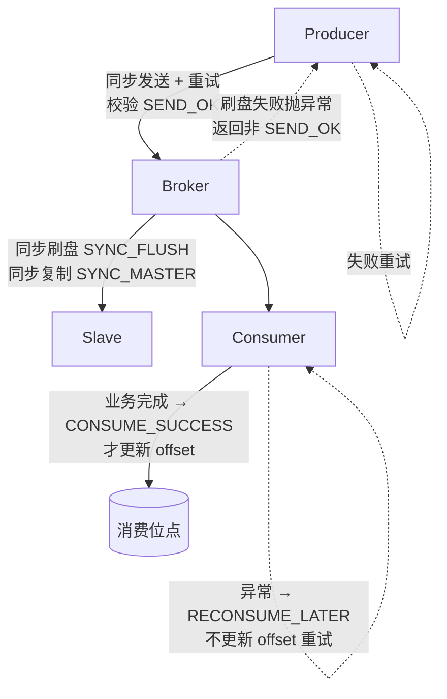
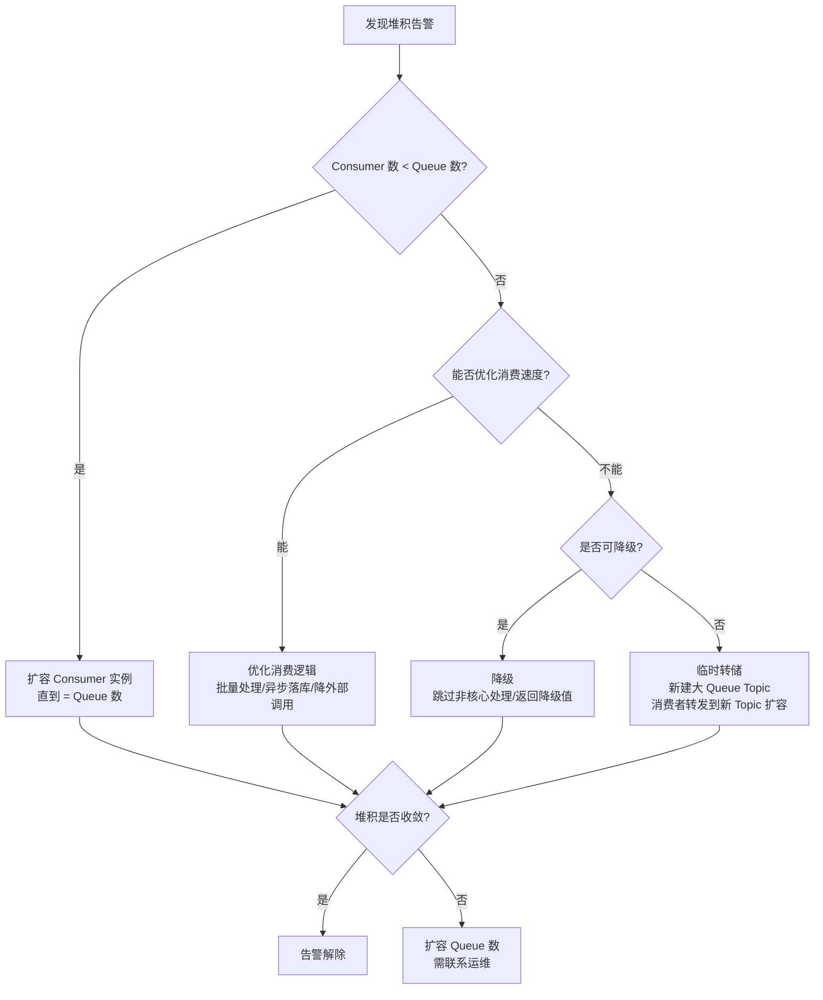
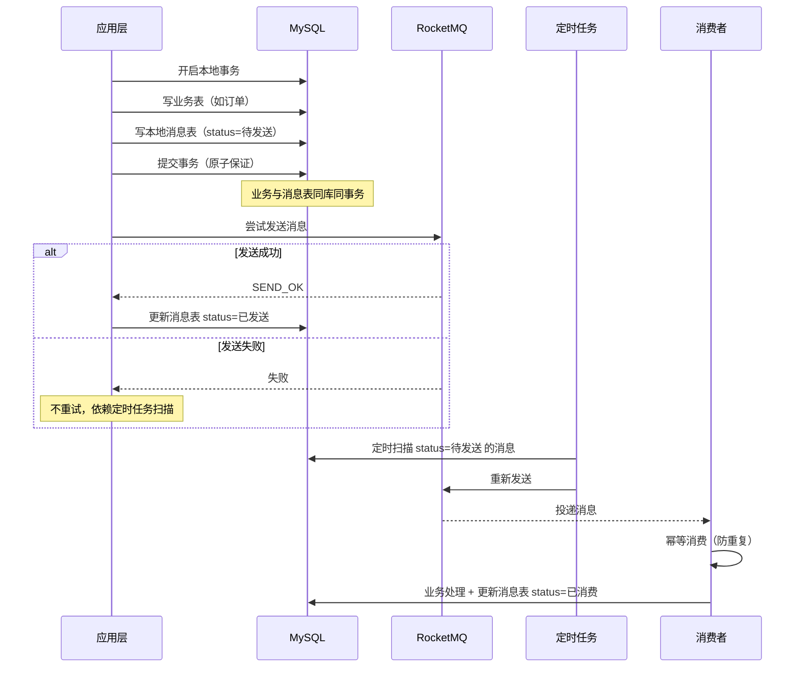
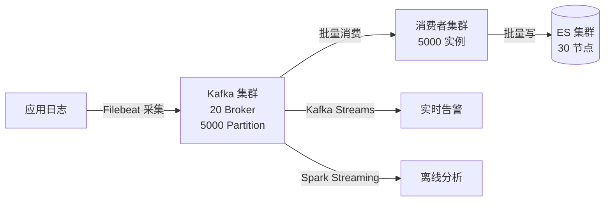

# 实战与最佳实践

> **一句话定位**：实战是区分"背八股"与"有经验"的分水岭，"消息怎么不丢、不重、堆积怎么办"是资深面试必问。
> **面试热度**：⭐⭐⭐⭐⭐
> **返回**：[RocketMQ 知识图谱](../README.md)

---

## 一、概念定义

### 1.1 消息三大顽疾

RocketMQ 在工程实战中有三个高频顽疾——**丢失、重复、堆积**，三者几乎是每场面试的必考题，且往往连环追问。它们的共同本质是：分布式 + 异步 + 网络不可靠三者叠加导致消息从生产端到消费端全链路都无法保证"恰好一次"。

| 顽疾 | 成因 | 发生阶段 | 核心保障方案 |
|------|------|---------|------------|
| 消息丢失 | 生产端发送失败未重试、Broker 宕机未刷盘、消费端异常未 ACK | 生产 → 存储 → 消费全链路 | 同步发送 + 重试、同步刷盘 + 同步复制、手动 ACK |
| 消息重复 | 网络重传、消费端崩溃 offset 未提交、Producer 重试 | 生产端重试、消费端 Rebalance | 消费幂等（唯一键 + 去重表） |
| 消息堆积 | 消费速度 < 生产速度、Consumer 数受 Queue 数限制 | 消费端 | 扩容 Consumer（≤ Queue 数）、转储新 Topic、降级 |

**关键认知**：三者相互制约——为防丢失加强重试，必然带来重复；为防重复做幂等，必然降低消费速度；消费速度下降又会引发堆积。实战方案是在三者间权衡，而非单点最优。

### 1.2 幂等设计

RocketMQ 默认是 **至少一次（At-Least-Once）** 语义——消息至少被投递一次，但可能多次。这意味着**消费端必须假设消息会重复，自行实现幂等**。幂等性是"消息不重"的工程兜底，也是面试追问"重复怎么办"的标准答案。

| 方案 | 实现 | 优点 | 缺点 | 适用场景 |
|------|------|------|------|---------|
| 唯一键 + Redis SETNX | `SETNX msgId:xxx EX 86400` 判重 | 性能高、实现简单 | 依赖 Redis 可用性、需设合理 TTL | 高并发场景首选 |
| DB 唯一索引 | 业务唯一键建唯一索引，重复插入抛异常 | 强一致、不依赖外部存储 | 性能差、DB 压力大 | 低并发、强一致场景 |
| 状态机判断 | 消费前查业务状态，已处理则跳过 | 业务友好、天然防重 | 需业务表有状态字段 | 订单状态流转场景 |
| 去重表 | 独立去重表记录已消费 msgId | 灵活、与业务解耦 | 需独立表、清理成本 | 通用场景 |

**核心权衡**：Redis SETNX 快但有 TTL 风险（TTL 内宕机则重复消费窗口扩大），DB 唯一索引慢但强一致。生产实践常**双保险**——Redis 短时去重 + DB 唯一索引兜底。

### 1.3 分布式事务方案对比

分布式事务是 RocketMQ 的核心实战场景，"订单扣库存扣余额发券"是经典面试题。三种主流方案的权衡是资深面试的加分项。

| 方案 | 一致性保证 | 性能 | 复杂度 | 适用场景 |
|------|-----------|------|--------|---------|
| 本地消息表 | 最终一致 | 中（DB+MQ 双写） | 中（需定时扫描） | 异步解耦、非强一致业务 |
| 事务消息 | 最终一致 | 高（Broker 回查） | 中（需实现回查接口） | RocketMQ 原生、业务可回查 |
| Seata TCC | 强一致（Try-Confirm-Cancel） | 低（两阶段 + 全局锁） | 高（需写三个方法） | 资金、库存等强一致业务 |
| Seata SAGA | 最终一致（长事务补偿） | 中（补偿链长） | 高（需写补偿逻辑） | 长流程业务编排 |

**选型口诀**：能用消息（最终一致）就不用 TCC（强一致代价大），能用事务消息就不用本地消息表（少一次 DB 写），长流程业务用 SAGA。

### 1.4 容量规划

容量规划是资深面试的"工程经验题"，不会精确估算等于没踩过生产坑。核心是 TPS、磁盘、Queue 数、Consumer 数四个维度的估算。

| 维度 | 估算公式 | 示例 |
|------|---------|------|
| TPS | 消息总量 / 时间窗口 | 日 1 亿消息 / 86400s ≈ 1157 TPS（峰值放大 3-5 倍 ≈ 5000 TPS） |
| 磁盘容量 | TPS × 平均大小 × 保留天数 × 副本数 | 5000 × 2KB × 3 天 × 2 副本 ≈ 60GB |
| Queue 数 | 目标 TPS / 单 Queue TPS（单 Queue 约 1-2 万 TPS） | 5000 / 10000 = 1，冗余配置 8-16 Queue |
| Consumer 数 | ≤ Queue 数（集群模式每 Queue 同一时刻只被一个 Consumer 消费） | 16 Queue → 最多 16 个 Consumer 实例 |

**关键细节**：①峰值 TPS 必须按日均放大 3-5 倍；②磁盘需预留 30% 余量给 PageCache 和 IndexFile；③Queue 数宁多勿少（扩容 Consumer 受 Queue 数限制）。

### 1.5 RocketMQ vs Kafka vs RabbitMQ

三大主流 MQ 的对比是面试"选型题"的标准答案，需讲清三者本质差异。

| 维度 | RocketMQ | Kafka | RabbitMQ |
|------|---------|-------|---------|
| 吞吐 | 10 万级 TPS | 百万级 TPS | 万级 TPS |
| 延迟 | ms 级 | ms 级 | μs 级（最低） |
| 事务消息 | ✅ 原生支持（半消息+回查） | ❌ 不支持 | ❌ 不支持 |
| 延迟消息 | ✅ 18 级（4.x）/ 任意延迟（5.x） | ❌ 不支持 | ✅ 插件支持 |
| 顺序消息 | ✅ 分区顺序 | ✅ 分区顺序 | ✅ 队列顺序 |
| 消息过滤 | ✅ Tag/SQL92/ClassFilter | ❌ 仅靠消费端过滤 | ✅ Routing Key |
| 消息回溯 | ✅ 按 time/offset 回溯 | ✅ 按 offset 回溯 | ❌ 不支持 |
| 生态 | 阿里系、金融业务 | 大数据（Kafka Connect/Streams） | AMQP 标准、IoT |
| 适用场景 | 金融、电商、事务消息 | 日志采集、大数据流处理 | 复杂路由、低延迟 |

**选型口诀**：金融/事务选 RocketMQ，大数据/日志选 Kafka，复杂路由/低延迟选 RabbitMQ。

---

## 二、原理与流程

### 2.1 消息丢失三端分析与保障

消息丢失是面试必问的"三连击"——生产端怎么不丢、Broker 怎么不丢、消费端怎么不丢。回答必须**分三端讲**，每端都有具体的保障机制。

**生产端保障**：同步发送 + 重试 + 校验 `SEND_OK`。Producer 调用 `producer.send(msg)` 同步等待 Broker 返回 `SendResult`，状态为 `SEND_OK` 才算成功；失败则按 `retryTimesWhenSendFailed`（默认 2 次）重试；失败时还需故障隔离（`sendLatencyFaultEnable=true`，故障 Broker 暂时排除）。

```java
producer.setRetryTimesWhenSendFailed(3);       // 同步发送重试 3 次
producer.setSendLatencyFaultEnable(true);      // 开启故障隔离
SendResult result = producer.send(msg);
if (result.getSendStatus() != SendStatus.SEND_OK) {
    throw new RuntimeException("发送失败：" + result.getSendStatus());
}
```

**Broker 端保障**：同步刷盘 + 同步复制。Broker 配置 `flushDiskType=SYNC_FLUSH`（同步刷盘，消息写入 PageCache 后立即 fsync 到磁盘）+ `brokerRole=SYNC_MASTER`（Master 同步等 Slave 复制完成才返回 SEND_OK）。这是金融级配置，性能代价大（吞吐降低 30-50%），一般业务用异步刷盘 + 同步复制即可。

**消费端保障**：手动 ACK + 业务完成后才更新 offset。Push 模式下实现 `MessageListenerConcurrentlyly`，返回 `CONSUME_SUCCESS` 才更新 offset；返回 `RECONSUME_LATER` 则重试。**关键：业务逻辑必须放在返回前完成**，否则 offset 已更新但业务未完成则消息丢失。

```java
consumer.registerMessageListener((MessageListenerConcurrently) (msgs, context) -> {
    try {
        for (MessageExt msg : msgs) {
            processMessage(msg);  // 业务处理
        }
        return ConsumeConcurrentlyStatus.CONSUME_SUCCESS;  // 成功才更新 offset
    } catch (Exception e) {
        return ConsumeConcurrentlyStatus.RECONSUME_LATER;  // 失败重试
    }
});
```



**三端保障对比表**：

| 端 | 保障机制 | 配置 | 性能代价 |
|----|---------|------|---------|
| 生产端 | 同步发送 + 重试 + 校验 SEND_OK | `retryTimesWhenSendFailed=3`、`sendLatencyFaultEnable=true` | 低（同步比异步慢，吞吐降 30%） |
| Broker 端 | 同步刷盘 + 同步复制 | `flushDiskType=SYNC_FLUSH`、`brokerRole=SYNC_MASTER` | 高（吞吐降 30-50%） |
| 消费端 | 手动 ACK + 业务后才更新 offset | `MessageListenerConcurrently` 返回状态控制 | 低（无额外开销） |

### 2.2 消息重复成因与幂等

消息重复的三大成因：①Producer 重试——`SEND_OK` 但 ACK 丢失，Producer 重发；②Consumer Rebalance——消费端崩溃后 Queue 被重新分配，offset 未提交的消息被新 Consumer 重新消费；③网络重传——TCP 层重传导致消息多次到达。

**幂等核心方案**：业务唯一键 + Redis SETNX / DB 唯一索引 / 状态机。下面是典型的 Redis SETNX + 业务唯一键方案：

```java
@Component
@RocketMQMessageListener(topic = "order_pay", consumerGroup = "order_pay_group")
public class OrderPayListener implements RocketMQListener<OrderPayMsg> {

    @Autowired
    private StringRedisTemplate redisTemplate;
    @Autowired
    private OrderService orderService;

    @Override
    public void onMessage(OrderPayMsg msg) {
        String dedupKey = "mq:dedup:" + msg.getBizId();  // 业务唯一键（订单号）
        // 1. Redis SETNX 判重（TTL 24h，防宕机窗口）
        Boolean first = redisTemplate.opsForValue()
                .setIfAbsent(dedupKey, "1", 24, TimeUnit.HOURS);
        if (Boolean.FALSE.equals(first)) {
            return;  // 已处理过，幂等返回
        }
        try {
            // 2. 业务处理（DB 唯一索引兜底）
            orderService.markAsPaid(msg.getOrderId(), msg.getAmount());
        } catch (Exception e) {
            redisTemplate.delete(dedupKey);  // 失败则回滚去重标记，下次重试
            throw e;
        }
    }
}
```

**双保险设计**：Redis SETNX 是第一道（性能高），DB 唯一索引是第二道（强一致）。即使 Redis 宕机或 TTL 失效，DB 唯一索引仍能拦截重复。状态机方案适用于业务表本身有状态字段（如订单 status），消费前查状态，已是终态则跳过。

### 2.3 消息堆积成因与处理

消息堆积的本质是**消费速度 < 生产速度**，根因有三：①消费端处理慢（DB 慢查、外部调用超时）；②消费端宕机；③Queue 数太少导致 Consumer 并行度受限。处理方案的决策树如下：



**Queue 数 ≥ Consumer 数的硬约束**：集群模式下每个 Queue 同一时刻只被一个 Consumer 实例消费，所以 Consumer 数最多等于 Queue 数。例如 Topic 有 8 个 Queue，扩容到 16 个 Consumer 也只有 8 个在工作，其余 8 个闲置。**顺序消费场景更严格**——扩容 Consumer 会导致 Rebalance，同一 Queue 被切换消费者则顺序被打破，所以顺序消费扩容必须先扩 Queue。

**临时转储方案**：当 Queue 数已到上限（如 64）且 Consumer 数也满（64），堆积仍未缓解时，可新建一个 Queue 数更大的 Topic（如 256），让原 Consumer 充当"转发器"把消息原样转发到新 Topic，再用 256 个 Consumer 消费新 Topic。这是应急方案，事后需清理临时 Topic。

### 2.4 分布式事务方案详解

**方案 1：本地消息表**

核心思想是"把 MQ 发送纳入 DB 事务"，业务表与消息表在同一个本地事务里写入，保证"业务成功则消息一定存在"。



**优点**：实现简单、强可靠（DB 事务保证业务与消息原子）。**缺点**：①业务与消息表耦合（同库）；②定时扫描有延迟（秒级）；③消费者需幂等。

**方案 2：事务消息（RocketMQ 原生）**

RocketMQ 的半消息（Two-Phase）机制，原理在 [05 高级特性](../05-feature/advanced-feature.md) 已详述。工程实战的关键是实现 `TransactionListener` 的两个方法：

```java
public class OrderTransactionListener implements TransactionListener {
    // 执行本地事务（半消息发送成功后回调）
    @Override
    public LocalTransactionState executeLocalTransaction(Message msg, Object arg) {
        try {
            orderService.createOrder((OrderDTO) arg);  // 本地事务
            return LocalTransactionState.COMMIT_MESSAGE;
        } catch (Exception e) {
            return LocalTransactionState.ROLLBACK_MESSAGE;
        }
    }
    // 事务回查（Broker 长时间未收到 Commit/Rollback 时调用）
    @Override
    public LocalTransactionState checkLocalTransaction(MessageExt msg) {
        String orderId = msg.getKeys();
        Order order = orderService.getById(orderId);
        if (order != null && order.getStatus() == OrderStatus.CREATED) {
            return LocalTransactionState.COMMIT_MESSAGE;  // 本地事务已成功
        }
        return LocalTransactionState.ROLLBACK_MESSAGE;
    }
}
```

**与本地消息表的对比**：事务消息无需 DB 消息表（Broker 承担存储角色）、无需定时扫描（Broker 主动回查），代码更轻。但要求本地事务结果可回查（业务表需有状态字段供 `checkLocalTransaction` 查询）。

**方案 3：Seata TCC**

Try-Confirm-Cancel 三阶段，需为每个业务写三个方法。强一致但性能差（两阶段 + 全局锁），适合资金、库存等强一致场景。与 RocketMQ 消息方案是互补而非替代——强一致用 TCC，最终一致用消息。

### 2.5 顺序消费的工程挑战

顺序消费（`MessageListenerOrderly`）的核心约束是"同 Queue 内串行消费"，由此带来三大工程挑战：

| 挑战 | 成因 | 方案 |
|------|------|------|
| 扩缩容乱序 | Consumer 数变化触发 Rebalance，Queue 被切换消费者则乱序 | 顺序消费场景不直接扩 Consumer，先扩 Queue |
| 消费失败阻塞 | 同 Queue 内某消息失败重试，阻塞后续消息 | 失败时记录到死信队列，跳过当前消息避免无限阻塞 |
| 消息堆积难处理 | 串行消费速度上限 = 单 Queue 处理速度 | 用业务 Key 分散到多 Queue 提升并行度 |

**`MessageQueueSelector` 选 Queue**：生产端按业务 Key（如 orderId）hash 到固定 Queue，保证同业务 Key 的消息进同一 Queue。

```java
SendResult sendResult = producer.send(msg, (mqs, msg, arg) -> {
    int orderId = (Integer) arg;
    int index = Math.abs(orderId) % mqs.size();
    return mqs.get(index);
}, orderId);
```

### 2.6 容量规划方法

以"日均 1 亿消息的订单系统"为例做完整估算：

| 步骤 | 公式 | 计算过程 | 结果 |
|------|------|---------|------|
| 日均 TPS | 日总量 / 86400s | 1 亿 / 86400 | 1157 TPS |
| 峰值 TPS | 日均 × 放大系数（3-5 倍） | 1157 × 5 | 5785 TPS |
| 单机 TPS | 单 Broker 约 5-10 万 TPS | - | 1 台 Broker 足够（冗余配置 3 台） |
| 磁盘容量 | TPS × 平均大小 × 保留天数 × 副本数 | 5785 × 2KB × 3 天 × 3 副本 | 100GB（含 30% 余量需 130GB） |
| Queue 数 | 目标 TPS / 单 Queue TPS | 5785 / 10000 | 1，冗余配置 16 Queue |
| Consumer 数 | ≤ Queue 数 | - | 16 个实例（每实例 1 Queue） |
| 消费 TPS 校验 | Consumer 数 × 单 Consumer TPS | 16 × 500 | 8000 TPS > 5785 TPS ✓ |

**关键经验**：①Queue 数宁多勿少，扩容成本低但 Consumer 受限；②磁盘按峰值 × 保留天数 × 副本数算，留 30% 余量给 PageCache；③Consumer 单机 TPS 约 500-1000（含 DB 写），需结合业务实际压测。

### 2.7 RocketMQ vs Kafka vs RabbitMQ 对比

**吞吐维度**：Kafka 百万级 TPS（顺序写 + 零拷贝 + 批量发送极致优化），RocketMQ 10 万级（CommitLog 统一存储，索引分离），RabbitMQ 万级（Erlang 单机瓶颈）。Kafka 吞吐最高但牺牲了事务/延迟消息等业务特性。

**特性维度**：RocketMQ 特性最全——原生支持事务消息（半消息+回查）、延迟消息（4.x 18 级、5.x 任意延迟）、消息过滤（Tag/SQL92/ClassFilter）、消息回溯（按 time/offset）。Kafka 只有分区顺序、无事务/延迟消息、过滤靠消费端。RabbitMQ 有路由灵活（Exchange/Binding）但无事务消息。

**生态维度**：Kafka 是大数据栈事实标准（Kafka Connect/Streams/KSQL），与 Spark/Flink 深度集成；RabbitMQ 是 AMQP 标准实现，IoT/边缘场景多；RocketMQ 阿里系，金融/电商业务多，国内生态成熟。

**选型决策表**：

| 业务场景 | 推荐 MQ | 理由 |
|---------|---------|------|
| 金融/电商订单 | RocketMQ | 事务消息、延迟消息、消息回溯 |
| 日志采集/大数据流 | Kafka | 百万级吞吐、生态成熟 |
| 复杂路由/IoT | RabbitMQ | AMQP 路由灵活、μs 级延迟 |
| 异步解耦（无事务） | Kafka / RocketMQ | 看吞吐量与团队栈 |
| 分布式事务通知 | RocketMQ | 原生事务消息 |

### 2.8 Spring Boot 集成实战

`rocketmq-spring-boot-starter` 是官方推荐集成方式，核心三件套——`RocketMQTemplate`（生产端）、`@RocketMQMessageListener`（消费端）、`RocketMQMessageConverter`（序列化）。

**生产配置模板**（`application.yml`）：

```yaml
rocketmq:
  name-server: 127.0.0.1:9876
  producer:
    group: order-producer-group
    send-message-timeout: 3000        # 发送超时 3s
    retry-times-when-send-failed: 3   # 同步发送重试 3 次
    retry-times-when-send-async-failed: 3  # 异步发送重试 3 次
    max-message-size: 4194304          # 消息最大 4MB
    compress-message-body-threshold: 4096  # 超过 4KB 压缩
```

**生产端代码**：

```java
@Service
public class OrderMessageProducer {
    @Autowired
    private RocketMQTemplate rocketMQTemplate;

    public SendResult sendOrderCreated(OrderDTO order) {
        Message<OrderDTO> msg = MessageBuilder.withPayload(order)
                .setHeader(MessageConst.PROPERTY_KEYS, String.valueOf(order.getOrderId()))
                .setHeader("bizType", "order")
                .build();
        // 同步发送 + Tag 过滤
        return rocketMQTemplate.syncSend("order-topic:created", msg);
    }

    public void sendOrderAsync(OrderDTO order) {
        rocketMQTemplate.asyncSend("order-topic:created", MessageBuilder.withPayload(order).build(),
                new SendCallback() {
                    @Override
                    public void onSuccess(SendResult result) { /* 成功 */ }
                    @Override
                    public void onException(Throwable e) { /* 失败重试或告警 */ }
                });
    }
}
```

**消费端代码**：

```java
@Service
@RocketMQMessageListener(
    topic = "order-topic",
    consumerGroup = "order-consumer-group",
    selectorExpression = "created || paid",  // Tag 过滤
    messageModel = MessageModel.CLUSTERING,
    consumeMode = ConsumeMode.CONCURRENTLY,
    maxReconsumeTimes = 5,                  // 最多重试 5 次
    consumeThreadMax = 20                   // 消费线程池最大 20
)
public class OrderConsumer implements RocketMQListener<OrderDTO> {
    @Override
    public void onMessage(OrderDTO order) {
        log.info("收到订单消息: {}", order.getOrderId());
        orderService.process(order);
    }
}
```

**序列化配置**（默认用 Jackson，可自定义）：

```java
@Configuration
public class RocketMqConfig {
    @Bean
    public RocketMQMessageConverter messageConverter() {
        return new RocketMQMessageConverter();  // 内置 Jackson + FastJSON + Gson
    }
}
```

---

## 三、高频追问

> 本节整理面试中 8 道高频追问题，每题 2-3 句要点速答。

**Q1：消息怎么保证不丢？**

三端保障——生产端用同步发送 + 重试 + 校验 `SEND_OK`；Broker 端配置同步刷盘 + 同步复制；消费端实现手动 ACK，业务完成后才返回 `CONSUME_SUCCESS` 更新 offset。金融级场景三端全开，一般业务可适度降级（异步刷盘 + 同步复制）。

**Q2：消息重复怎么办？**

消费端做幂等——用业务唯一键（如订单号）+ Redis SETNX 判重，或 DB 唯一索引兜底。双保险设计：Redis 短时去重（性能高）+ DB 唯一索引（强一致）。状态机方案适合业务表本身有状态字段的场景。

**Q3：消息堆积怎么处理？**

先看 Consumer 数是否 < Queue 数，是则扩容 Consumer；若已满则优化消费逻辑（批量处理、异步落库、降外部调用）；仍不缓解则降级（跳过非核心处理）；最后手段是临时转储——新建大 Queue Topic 转发扩容。顺序消费场景不能直接扩 Consumer，需先扩 Queue。

**Q4：消费者数能超过 Queue 数吗？**

不能。集群模式下每个 Queue 同一时刻只被一个 Consumer 实例消费，Consumer 数 > Queue 数时多余消费者闲置。所以扩容 Consumer 前需确认 Queue 数是否足够，Queue 数是并行度的硬上限。

**Q5：分布式事务用什么方案？**

优先事务消息（RocketMQ 原生，Broker 主动回查，代码轻），次选本地消息表（DB+MQ 双写，需定时扫描）。强一致场景（资金/库存）才用 Seata TCC，代价是两阶段 + 全局锁。选型口诀：能用消息就不用 TCC，能用事务消息就不用本地消息表。

**Q6：RocketMQ 和 Kafka 怎么选？**

金融/电商订单选 RocketMQ（事务消息、延迟消息、消息回溯），日志采集/大数据流选 Kafka（百万级吞吐、生态成熟）。本质看业务特性需求——需要事务/延迟/过滤选 RocketMQ，要极致吞吐选 Kafka。

**Q7：顺序消费怎么扩容？**

不能直接扩 Consumer——Rebalance 会把 Queue 切换消费者导致乱序。正确做法是先扩 Queue 数（`mqadmin updateTopic`），等新 Queue 有消息后再扩 Consumer。生产端用 `MessageQueueSelector` 按业务 Key hash 到固定 Queue，扩容后需重新 hash 但会短暂乱序。

**Q8：幂等怎么实现？**

三种方案——①Redis SETNX + 业务唯一键（`SETNX msgId:xxx EX 86400`，性能高）；②DB 唯一索引（业务唯一键建唯一索引，重复插入抛异常，强一致）；③状态机判断（消费前查业务状态，已是终态则跳过）。生产实践常双保险——Redis SETNX + DB 唯一索引。

---

## 四、实战关联

### 4.1 Spring Boot + RocketMQ Starter 完整生产配置

完整的 `application.yml` 生产配置模板，含发送、消费、监控：

```yaml
rocketmq:
  name-server: ${ROCKETMQ_NAMESERVER:127.0.0.1:9876}
  producer:
    group: ${spring.application.name}-producer
    send-message-timeout: 3000
    retry-times-when-send-failed: 3
    retry-times-when-send-async-failed: 3
    max-message-size: 4194304
    compress-message-body-threshold: 4096
    # 5.x 新增：开启消息轨迹
    enable-msg-trace: true
    customized-trace-topic: RMQ_SYS_TRACE_TOPIC
  consumer:
    # 全局消费线程池
    consume-thread-min: 10
    consume-thread-max: 20
    # 拉取批次大小
    pull-batch-size: 32
```

### 4.2 幂等消费方案（Redis SETNX + 业务唯一键 + 状态机）

完整的幂等消费模板，结合 Redis SETNX、DB 唯一索引、状态机三重保险：

```java
@Service
@RocketMQMessageListener(
    topic = "order-pay-topic",
    consumerGroup = "order-pay-group",
    selectorExpression = "paid",
    maxReconsumeTimes = 5
)
public class OrderPayConsumer implements RocketMQListener<OrderPayMsg> {

    @Autowired private StringRedisTemplate redisTemplate;
    @Autowired private OrderService orderService;

    @Override
    public void onMessage(OrderPayMsg msg) {
        String dedupKey = "mq:dedup:order:" + msg.getOrderId();
        // 1. Redis SETNX 判重
        Boolean first = redisTemplate.opsForValue()
                .setIfAbsent(dedupKey, "1", 24, TimeUnit.HOURS);
        if (Boolean.FALSE.equals(first)) {
            log.info("消息已消费，幂等返回: {}", msg.getOrderId());
            return;
        }
        try {
            // 2. 状态机判断（订单已是已支付则跳过）
            Order order = orderService.getById(msg.getOrderId());
            if (order == null || order.getStatus() == OrderStatus.PAID) {
                return;
            }
            // 3. 业务处理（DB 唯一索引兜底，重复支付抛 UniqueConstraintException）
            orderService.markAsPaid(msg.getOrderId(), msg.getAmount(), msg.getPayTime());
        } catch (DuplicateKeyException e) {
            // DB 唯一索引拦截重复，幂等返回
            log.info("DB 唯一索引拦截重复消息: {}", msg.getOrderId());
        } catch (Exception e) {
            redisTemplate.delete(dedupKey);  // 失败则回滚去重标记
            throw e;  // 抛出触发重试
        }
    }
}
```

### 4.3 与 `framework/spring-framework` 的 `@Transactional` 协调

本地事务 + 消息发送的顺序是工程坑点——`@Transactional` 方法内发送消息，若消息发送在事务提交前，则事务回滚时消息已发出（业务失败但消息已发）。正确做法是用 `TransactionSynchronizationManager` 在事务提交后发送：

```java
@Service
public class OrderService {
    @Autowired private RocketMQTemplate rocketMQTemplate;

    @Transactional
    public void createOrder(OrderDTO order) {
        orderMapper.insert(order);
        // 事务提交后再发消息（避免事务回滚但消息已发）
        TransactionSynchronizationManager.registerSynchronization(
            new TransactionSynchronizationAdapter() {
                @Override
                public void afterCommit() {
                    rocketMQTemplate.syncSend("order-topic:created",
                            MessageBuilder.withPayload(order).build());
                }
            });
    }
}
```

> 若用本地消息表方案，则消息表与业务表在同一事务内写入，无需 `afterCommit`——事务保证原子性，定时任务扫描发送。

### 4.4 与 `framework/jackson` 的消息序列化

RocketMQ Starter 默认用 Jackson 序列化消息体。对于含日期、枚举的复杂对象，需自定义 `ObjectMapper`：

```java
@Configuration
public class RocketMqSerializerConfig {
    @Bean
    public RocketMQMessageConverter rocketMQMessageConverter() {
        ObjectMapper mapper = new ObjectMapper()
            .registerModule(new JavaTimeModule())
            .disable(SerializationFeature.WRITE_DATES_AS_TIMESTAMPS);
        MappingJackson2MessageConverter converter = new MappingJackson2MessageConverter();
        converter.setObjectMapper(mapper);
        return new RocketMQMessageConverter(
            new StringMessageConverter(),
            new ByteArrayMessageConverter(),
            converter,  // Jackson
            new FastJsonMessageConverter()  // 备选
        );
    }
}
```

### 4.5 与 `framework/valid` 的消息参数校验

消费前校验消息参数，避免脏数据进业务——结合 Hibernate Validator 在消费端做校验：

```java
@RocketMQMessageListener(topic = "order-topic", consumerGroup = "order-group")
public class OrderConsumer implements RocketMQListener<OrderDTO> {
    @Override
    public void onMessage(OrderDTO order) {
        // 参数校验（@Valid + Validator）
        Set<ConstraintViolation<OrderDTO>> violations = validator.validate(order);
        if (!violations.isEmpty()) {
            log.warn("消息参数校验失败: {}, violations: {}", order.getOrderId(), violations);
            return;  // 丢弃非法消息（或转死信）
        }
        orderService.process(order);
    }
}
```

### 4.6 与 `middleware/redis` 的交叉引用

- **本地消息表与 Redis 分布式锁互补**：本地消息表依赖 DB 事务保证原子性，Redis 分布式锁用于跨服务并发控制（如订单重复支付需分布式锁防并发）。二者协同——本地消息表保证"业务与消息原子"，分布式锁保证"跨服务并发互斥"。
- **消费幂等用 Redis SETNX 去重**：见 4.2 节方案，Redis SETNX 是高性能去重第一道，DB 唯一索引是强一致第二道。延伸阅读：[`middleware/redis/06-cache-practice/cache-and-distributed-lock.md`](../../redis/06-cache-practice/cache-and-distributed-lock.md)。

---

## 五、系统设计案例

### 5.1 电商订单全链路消息方案

**场景**：用户下单后需依次执行——扣库存、扣余额、发券、通知。需保证最终一致（任一步失败则回滚或补偿）且消息不重不丢。

**方案选型**：事务消息 + 幂等消费 + 顺序消息（同一订单的消息按 orderId 分 Queue 保证顺序）。

```mermaid
sequenceDiagram
    participant U as 用户
    participant O as 订单服务
    participant MQ as RocketMQ
    participant I as 库存服务
    participant A as 账户服务
    participant C as 券服务
    U->>O: 下单请求
    O->>MQ: 发送半消息（order:created）
    MQ-->>O: 半消息发送成功
    O->>O: 执行本地事务（创建订单，status=待支付）
    O->>MQ: Commit 半消息
    MQ->>I: 投递 order:created
    I->>I: 扣库存（幂等，DB 唯一索引兜底）
    I->>MQ: 发送 stock:deducted（带 orderId）
    MQ->>A: 投递 stock:deducted
    A->>A: 扣余额（幂等）
    A->>MQ: 发送 balance:deducted
    MQ->>C: 投递 balance:deducted
    C->>C: 发券（幂等）
    Note over O,I,A,C: 全链路按 orderId 分 Queue 保证顺序<br/>每个服务消费幂等（Redis SETNX + DB 唯一索引）
```

**关键设计点**：

| 环节 | 方案 | 目的 |
|------|------|------|
| 下单 → 库存 | 事务消息 | 保证"订单创建成功则库存消息一定发出" |
| 库存 → 余额 → 发券 | 顺序消息（orderId 分 Queue） | 保证同一订单操作顺序不乱 |
| 每个服务消费 | 幂等（Redis SETNX + DB 唯一索引） | 防重（至少一次语义下重复不可避免） |
| 失败处理 | 消费失败 → 重试 16 次 → 死信队列 → 人工补偿 | 兜底机制 |

**为什么不用 Seata TCC**：订单全链路是异步业务（非强一致），事务消息 + 幂等即可满足最终一致，TCC 的两阶段 + 全局锁性能代价过大。只有资金、库存等核心强一致场景才用 TCC。

### 5.2 千万级 TPS 日志采集系统

**场景**：分布式系统日志采集，日均 100 亿条日志，峰值千万 TPS，落库 ES 供查询。

**选型决策**：

| 维度 | Kafka | RocketMQ | 决策 |
|------|-------|---------|------|
| 吞吐 | 百万级 TPS | 10 万级 TPS | Kafka 胜（千万 TPS 需 Kafka） |
| 延迟 | ms 级 | ms 级 | 持平 |
| 事务/延迟消息 | 不需要 | 有 | 日志场景不需要 |
| 生态 | Kafka Connect/Streams | 阿里系 | Kafka 与 ES/Spark 集成成熟 |
| 结论 | ✅ 选 Kafka | ❌ | 千万级 TPS + 大数据生态 |

**为什么选 Kafka 而非 RocketMQ**：日志采集的核心诉求是**极致吞吐 + 大数据生态**，不需要事务/延迟/过滤等业务特性。Kafka 的百万级 TPS + Kafka Connect（ES Sink Connector 现成）+ Spark/Flink 直读是最佳组合。RocketMQ 10 万级 TPS 在千万级场景需 100+ Broker，成本不划算。

**架构设计**：



**容量估算**：

| 维度 | 计算 | 结果 |
|------|------|------|
| 峰值 TPS | 1000 万 | 10,000,000 TPS |
| Broker 数 | 峰值 TPS / 单 Broker TPS | 10,000,000 / 500,000 = 20 台 |
| Partition 数 | 峰值 TPS / 单 Partition TPS | 10,000,000 / 2000 = 5000 |
| 消费者数 | = Partition 数 | 5000 实例 |
| 磁盘容量 | TPS × 1KB × 保留 3 天 × 副本 3 | 10M × 1KB × 3 × 3 = 90TB/天，3 天 270TB |
| ES 节点数 | 磁盘 / 单节点容量 | 270TB / 10TB = 27，冗余 30 节点 |

**关键优化**：①生产端批量发送（`batch.size=16384`）+ 压缩（`compression.type=lz4`）；②消费端批量落库（`bulk.size=1000`）+ 异步刷盘；③Partition 数 = 消费者数，并行度最大化；④ES 用 bulk API 批量写入，减少 segment merge 压力。

**对比决策表**：

| 方案 | 优点 | 缺点 | 适用 |
|------|------|------|------|
| Kafka + ES | 吞吐极致、生态成熟 | 无事务消息 | 千万级 TPS 日志采集 ✅ |
| RocketMQ + ES | 有事务/延迟消息 | 吞吐不足（10 万级） | 中小规模日志（< 10 万 TPS） |
| Flume + HDFS | 老牌方案 | 吞吐有限、生态老化 | 历史遗留系统 |

---

> **延伸阅读**：
> - [RocketMQ 高级特性](../05-feature/advanced-feature.md)：事务消息半消息+回查、顺序消息、延迟消息详解
> - [RocketMQ 高可用与副本同步](../04-ha/ha-and-replication.md)：同步刷盘、同步复制、Failover 机制
> - [Redis 缓存实战与分布式锁](../../redis/06-cache-practice/cache-and-distributed-lock.md)：本地消息表与 Redis 分布式锁互补、消费幂等用 Redis SETNX 去重
