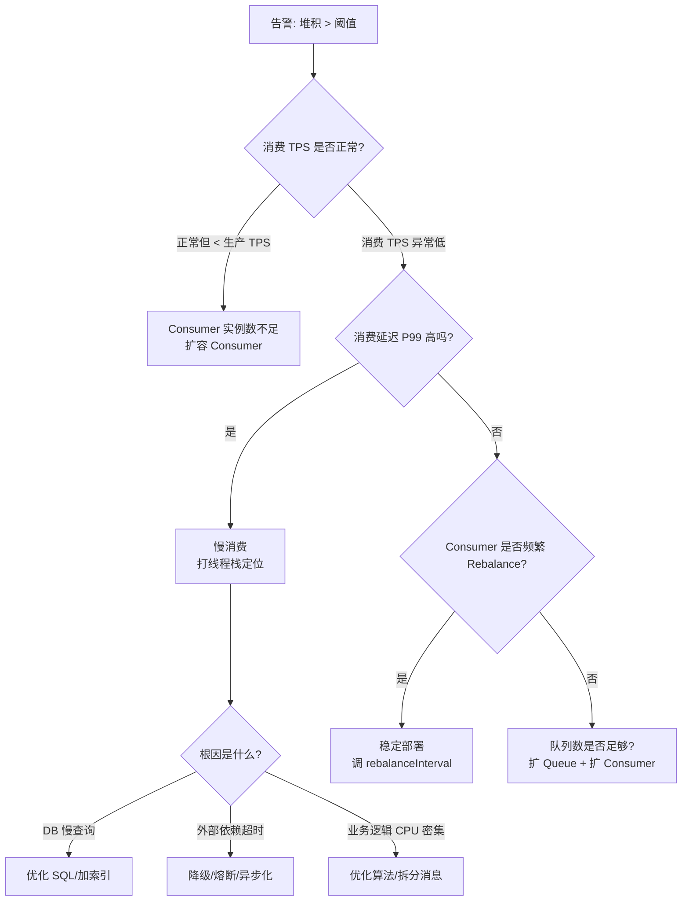
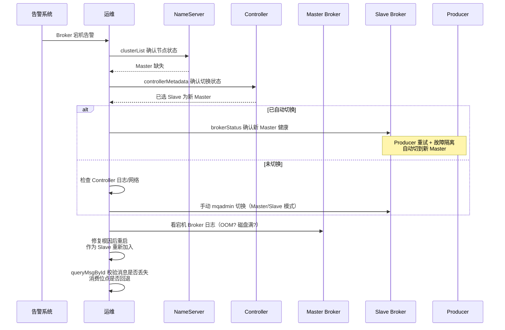
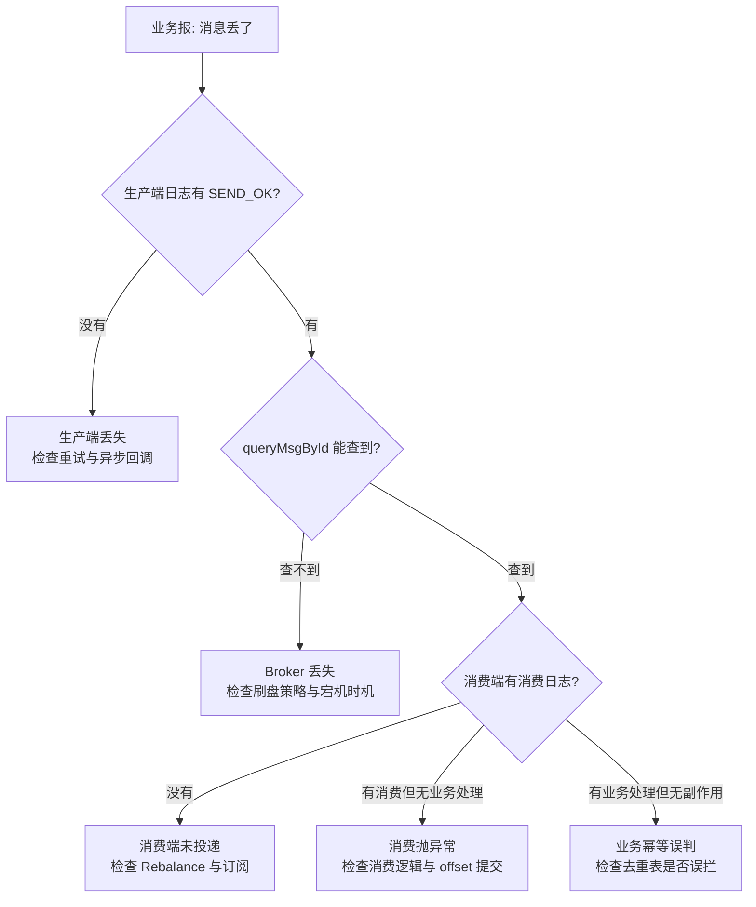
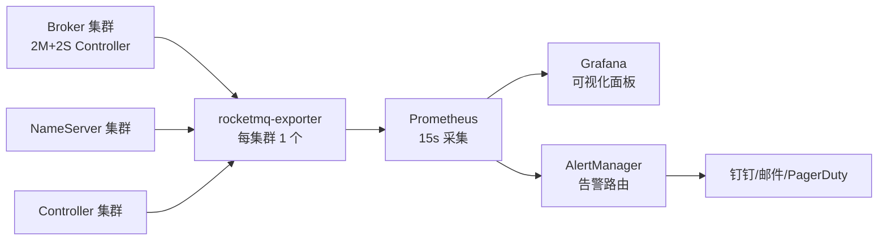
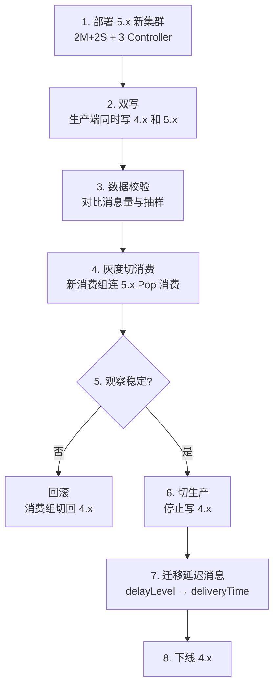

# 运维与排障

> **一句话定位**：运维排障是资深面试的加分项，"Broker 宕机怎么排查、消息堆积怎么定位"区分是否有生产经验。
> **面试热度**：⭐⭐⭐⭐
> **返回**：[RocketMQ 知识图谱](../README.md)

---

## 一、概念定义

### 1.1 RocketMQ 运维核心目标

RocketMQ 运维围绕四大目标展开——**可用性、消息可靠性、性能、容量可控**，每个目标都有对应的监控指标与处置策略。与 Redis 的"可用性/性能/内存/安全"四目标不同，RocketMQ 作为消息中间件，更强调消息从生产到消费全链路的可靠性，以及堆积/延迟这类 MQ 独有的运维指标。

| 目标 | 含义 | 关键指标/手段 |
|------|------|--------------|
| 可用性 | Broker 不丢服务、主备可切换 | `brokerStatus`/`clusterList`/Master-Slave 切换时延 |
| 消息可靠性 | 不丢/不重/不乱序 | 发送 `SEND_OK`、同步刷盘+同步复制、消费 ACK |
| 性能 | 低延迟高 TPS | Broker TPS、消费 TPS、P99 延迟、堆外内存 |
| 容量可控 | 磁盘不爆、堆积可控 | 磁盘使用率、ConsumeQueue 堆积量、消息保留时间 |

**运维目标间权衡**：同步刷盘 + 同步复制提升可靠性但降低 TPS；消息保留时间过短可能丢历史消息，过长则磁盘爆满。生产实践一般是"异步刷盘 + 同步复制 + 合理保留期"的组合——靠副本兜底而非单机刷盘。

### 1.2 mqadmin 工具

`mqadmin` 是 RocketMQ 自带的命令行管理工具，定位类比 Redis 的 `redis-cli`、MySQL 的 `mysql` 客户端。位于发行包 `bin/mqadmin`，连接 NameServer 后可管理 Topic、Broker、消费组、消息。5.x 起新增 `mqadmin` 对 Controller 模式、Pop 消费的支持。

| 命令分类 | 代表命令 | 用途 |
|---------|---------|------|
| 集群/节点 | `clusterList`、`brokerStatus`、`brokerConsumeStats` | 查看集群拓扑、Broker 运行状态 |
| Topic 管理 | `topicList`、`topicStatus`、`topicRoute`、`updateTopic` | 查看/创建/修改 Topic 与队列数 |
| 消费组 | `consumerList`、`consumerStatus`、`consumerProgress` | 查看消费组、消费位点、堆积 |
| 消息查询 | `queryMsgById`、`queryMsgByKey`、`queryMsgByOffset`、`queryMsgByUniqueKey` | 按不同维度查消息 |
| 点位控制 | `resetOffsetByTime`、`resetOffsetByQueue` | 按时间重置消费位点（回溯/跳过） |
| 副本/Controller | `controllerMetadata`、`getBrokerReplicaStatus` | 5.x Controller 模式运维 |
| 消费/生产 模拟 | `producer`、`consumer` | 压测/模拟收发 |

**关键认知**：`mqadmin` 通过 `-n <nameserver>` 连接 NameServer 拉取路由，再通过路由找 Broker；当所有 NameServer 不可达时 `mqadmin` 也会失效，这是 AP 模型的边界。

### 1.3 监控体系

生产 RocketMQ 监控常用 **Dashboard（官方控制台）+ rocketmq-exporter + Prometheus + Grafana** 组合。Dashboard 是 RocketMQ 自带的可视化控制台（`rocketmq-dashboard`），用于人工巡检；Prometheus + Grafana 用于指标采集与告警。

| 监控层 | 工具 | 关注对象 |
|--------|------|---------|
| 可视化控制台 | RocketMQ Dashboard | Topic/消费组/消息查询，人工巡检 |
| 指标采集 | rocketmq-exporter | Broker/Topic/消费组指标暴露为 Prometheus 格式 |
| 时序存储 | Prometheus | 15s 采集一次，保留 15-30 天 |
| 可视化面板 | Grafana | TPS/延迟/堆积趋势图 |
| 告警 | AlertManager | 阈值告警路由到钉钉/邮件/PagerDuty |

**监控指标五大类**：Broker（TPS/延迟/磁盘/CPU/堆外内存）、Topic（QPS/消息量）、Consumer（消费 TPS/延迟/堆积）、Producer（发送 TPS/失败率）、副本（同步延迟、Master 角色）。

### 1.4 常见故障分类

RocketMQ 生产事故主要有五大类，每类的排查路径不同：

| 故障类型 | 典型现象 | 根因方向 |
|---------|---------|---------|
| 消费阻塞 | `consumeStatus` 堆积量持续增长 | 消费 TPS < 生产 TPS、慢消费、Consumer 数不够 |
| Broker 宕机 | `clusterList` 缺节点、发送失败 | JVM OOM、磁盘满、硬件故障、Kill |
| 消息丢失 | 业务侧查不到消息 | 生产端未收到 `SEND_OK`、Broker 未刷盘、消费端 offset 未提交 |
| 脑裂 | 两个 Broker 都认为自己是 Master | Controller 异常、网络分区、Master/Slave 模式人工误操作 |
| Rebalance 风暴 | 消费者频繁上下线、消费抖动 | K8s 滚动发布、消费者心跳超时、`rebalanceInterval` 过短 |

**共同本质**：分布式 + 异步 + 网络不可靠 + 有状态（Broker 存消息、Consumer 存位点）导致任一环节抖动都可能放大为生产事故。运维的核心是**把抖动控制在 SLA 范围内**，而非追求零故障。

---

## 二、原理与流程

### 2.1 mqadmin 核心命令

**集群与 Broker 状态**：

```bash
# 查看集群拓扑（Broker 列表、角色、偏移）
$ sh mqadmin clusterList -n localhost:9876

# 查看 Broker 详细状态（运行状态、CommitLog/ConsumeQueue、堆外内存）
$ sh mqadmin brokerStatus -n localhost:9876 -b 192.168.1.1:10911

# 查看 Topic 路由（哪些 Broker 有该 Topic 的队列）
$ sh mqadmin topicRoute -n localhost:9876 -t OrderTopic
```

`clusterList` 输出示例（关注 `BID`/`ROLE`）：

```
# Cluster Name     # BID  # Addr              # Version   # ROLE
DefaultCluster    0       192.168.1.1:10911   V5_2_0     MASTER
DefaultCluster    1       192.168.1.2:10911   V5_2_0     SLAVE
```

| 命令 | 用法 | 关键参数 | 排查场景 |
|------|------|---------|---------|
| `clusterList` | `clusterList -n <ns>` | `-c` 集群名过滤 | Broker 是否在线、Master/Slave 角色 |
| `brokerStatus` | `brokerStatus -n <ns> -b <addr>` | `-b` Broker 地址 | CommitLog 大小、堆外内存、运行时长 |
| `topicList` | `topicList -n <ns>` | `-c` 集群名 | Topic 列表与队列数 |
| `topicStatus` | `topicStatus -n <ns> -t <topic>` | `-t` Topic | 各 Queue 的最大/最小 offset |
| `consumerProgress` | `consumerProgress -n <ns> -g <group>` | `-g` 消费组 | 各 Queue 的消费位点与堆积量 |
| `consumerStatus` | `consumerStatus -n <ns> -g <group>` | `-g` 消费组 | 消费者实例、消费 TPS、延迟 |
| `queryMsgById` | `queryMsgById -n <ns> -i <msgId>` | `-i` 消息 ID | 精确查消息是否落 Broker |
| `queryMsgByKey` | `queryMsgByKey -n <ns> -t <topic> -k <key>` | `-k` 业务 key | 按业务 key 查消息（走 IndexFile） |
| `resetOffsetByTime` | `resetOffsetByTime -n <ns> -g <group> -t <topic> -s <timestamp>` | `-s` 时间戳（毫秒/ms） | 重置消费位点（回溯/跳过） |
| `updateTopic` | `updateTopic -n <ns> -t <topic> -c <cluster> -r 16 -w 16` | `-r`/`-w` 读/写队列数 | 扩容 Topic 队列 |

**`resetOffsetByTime` 的语义**：将消费组对某 Topic 的所有 Queue 的位点重置到指定时间——若时间戳对应的 offset 在 ConsumeQueue 范围内则回溯到该位置重新消费；若指定未来时间则跳过当前堆积。常用于"消费逻辑有 bug 导致数据脏，回溯到某时间点重消费"或"堆积太多，跳过部分历史消息"。

### 2.2 监控指标体系

RocketMQ 监控指标按对象分四大类：

**Broker 指标**（最关键）：

| 指标 | 含义 | 关注点 |
|------|------|--------|
| `broker_tps` | Broker 每秒消息条数 | 容量评估、突发流量 |
| `broker_runtime_put_tps` | 发送 TPS | 突降说明生产端有问题或 Broker 拒收 |
| `broker_runtime_get_found_tps` | 拉取 TPS | 消费侧吞吐 |
| `broker_runtime_put_size` | 单条消息平均大小 | 磁盘容量评估 |
| `broker_runtime_dispatch_commitlog_size` | CommitLog 当前大小 | 磁盘容量 |
| `broker_runtime_commitlog_disk_capacity` | CommitLog 磁盘总容量 | 容量规划 |
| `broker_runtime_commitlog_disk_ratio` | CommitLog 磁盘使用率 | >80% 告警、>90% 紧急 |
| `broker_runtime_jvm_memory_used` | JVM 堆内存使用 | OOM 预警 |
| `broker_runtime_jvm_direct_memory_used` | 堆外内存使用 | Direct Memory OOM 预警 |
| `broker_runtime_cpu_used` | CPU 使用率 | >80% 需关注 |
| `broker_runtime_put_message_distribute_time_ms` | 发送延迟分布 | P99/P999 延迟 |

**Topic 指标**：

| 指标 | 含义 | 关注点 |
|------|------|--------|
| `topic_put_nums` | Topic 每秒生产条数 | 单 Topic 流量 |
| `topic_put_size` | Topic 每秒生产字节 | 单 Topic 带宽 |
| `topic_get_nums` | Topic 每秒消费条数 | 单 Topic 消费速率 |

**Consumer 指标**（堆积排查最常用）：

| 指标 | 含义 | 关注点 |
|------|------|--------|
| `consumer_lag` / `consumer_lag_size` | 堆积消息条数/字节数 | >10 万条需关注、>100 万条紧急 |
| `consumer_consume_tps` | 消费 TPS | 是否匹配生产 TPS |
| `consumer_consume_latency` | 消费延迟（ms） | P99 延迟反映消费慢度 |
| `consumer_consume_ok` / `consumer_consume_failed` | 消费成功/失败次数 | 失败率高说明消费端异常 |

**Producer 指标**：

| 指标 | 含义 | 关注点 |
|------|------|--------|
| `producer_send_tps` | 发送 TPS | 突降说明生产端或 Broker 异常 |
| `producer_send_failed` | 发送失败次数 | 突增说明 Broker 拒收或网络抖动 |
| `producer_send_latency` | 发送延迟 | P99 >50ms 需关注 |

### 2.3 消费阻塞排查

消费阻塞（消息堆积）是 RocketMQ 最常见事故，排查路径：**先确认堆积 → 再看消费 TPS → 再定位慢消费根因 → 最后扩容或降级**。

```bash
# 1. 查看消费进度与堆积（最关键的一步）
$ sh mqadmin consumerProgress -n localhost:9876 -g order-consumer-group
# 输出：每个 Queue 的 Broker Offset、Consumer Offset、Diff（堆积量）
#                 Broker Offset      Consumer Offset      Diff
#  Queue 0        100000             95000                5000
#  Queue 1        100000             80000                20000   ← 堆积严重

# 2. 查看消费组运行状态（消费 TPS、延迟）
$ sh mqadmin consumerStatus -n localhost:9876 -g order-consumer-group

# 3. 打印消费者线程栈（定位慢消费）
$ sh mqadmin consumerStatus -n localhost:9876 -g order-consumer-group -i <clientId> -s
```

**决策树**：



**慢消费的三大根因**：①业务 DB 慢查询（最常见，占 70%）——消费消息时同步查/写 DB，DB 慢则消费慢；②外部依赖超时——调用第三方 HTTP/RPC 接口超时阻塞消费线程；③业务逻辑 CPU 密集——如解析大 JSON、复杂计算。

**堆积应急三板斧**：

| 手段 | 操作 | 适用 |
|------|------|------|
| 扩容 Consumer | 增加 Consumer 实例数（≤ Queue 数） | 消费 TPS 不足但单 Consumer 满载 |
| 降级 | 关闭非核心逻辑、异步化外部调用、跳过校验 | 慢消费根因是外部依赖 |
| 转储 | 把堆积 Topic 消息转发到新 Topic，用更多 Queue 消费 | 堆积严重、Queue 数也不够 |

### 2.4 Broker 宕机处理

Broker 宕机排查的核心是**先确认是否切换、再看根因、最后补偿数据**。



**根因排查清单**：

| 现象 | 可能根因 | 日志/指标 |
|------|---------|---------|
| JVM OOM 退出 | 堆外内存泄漏、`DirectMemory` 不足 | `broker.log` 有 `OutOfMemoryError: Direct buffer memory` |
| 磁盘满 | 消息保留过期未清理、ConsumeQueue 膨胀 | `store.log` 有 `disk full`、磁盘使用率 100% |
| 进程被 Kill | OOM Killer、手动 kill -9 | `dmesg` 有 oom-killer 记录 |
| 网络抖动 | NameServer 心跳超时 | `namesrv.log` 有心跳超时记录 |
| 副本同步失败 | Slave 拉取超时、网络分区 | `ha.log` 有 `HA Connection broken` |

**消息补偿**：Broker 重启后若采用同步刷盘+同步复制则无丢失；若异步刷盘可能丢末尾未刷盘消息，需通过 `queryMsgById` 对账业务侧；消费位点若回退，需用 `resetOffsetByTime` 回溯到故障时间点重消费。

### 2.5 消息丢失排查

消息丢失是面试必问的"三端排查"题，必须**分生产端、Broker、消费端**逐环节确认。

| 环节 | 排查方法 | 丢失原因 |
|------|---------|---------|
| 生产端 | 看 Producer 发送日志，是否收到 `SEND_OK` | 发送失败未重试、异步发送回调异常未处理 |
| Broker | `queryMsgById` 或 `queryMsgByKey` 查消息是否在 Broker | 异步刷盘宕机丢末尾消息、磁盘损坏 |
| 消费端 | 看消费日志，是否消费成功、offset 是否提交 | 消费抛异常未捕获、消费成功但 offset 提交失败、Rebalance 后位点回退 |

**三端排查流程**：



**关键细节**：①`queryMsgByKey` 走 IndexFile，要求生产时设置了 `keys`（业务唯一键）；②`queryMsgById` 走 ConsumeQueue 精确查找，要求知道 msgId；③消费端 offset 提交失败（如 Rebalance 期间）会导致重复消费，但不会丢——丢的根因往往是"消费成功但未提交 offset 后 Consumer 宕机，重启后从旧 offset 重消费"，这其实是重复而非丢失。

### 2.6 Rebalance 风暴

Rebalance 是 Consumer 集群分配 Queue 的过程，频繁 Rebalance 会导致消费抖动、消息重复、短暂消费停滞。5.x 默认 `rebalanceInterval=20s`，过短或消费者频繁上下线会引发"Rebalance 风暴"。

| 成因 | 现象 | 方案 |
|------|------|------|
| K8s 滚动发布 | 每个 Pod 上下线触发全组 Rebalance | 分批发布、`rebalanceInterval` 调大到 60s |
| 心跳超时 | 网络抖动致 Consumer 心跳丢失 | 调大 `heartbeatBrokerInterval` 与超时阈值 |
| Consumer 实例数 > Queue 数 | 部分 Consumer 抢不到 Queue | Queue 数 ≥ Consumer 数 |
| 消费慢致心跳线程阻塞 | 心跳线程被业务逻辑阻塞 | 消费逻辑异步化、独立线程池 |

**Rebalance 风暴的危害**：①每次 Rebalance 期间部分 Queue 短暂无消费者，造成堆积；②Rebalance 后位点重新分配，可能重复消费（上一个 Consumer 已处理但 offset 未提交）；③频繁 Rebalance 致消费 TPS 抖动严重。

**5.x Pop 消费的缓解作用**：Pop 消费模式下，多个 Consumer 可共享拉取同一 Queue，降低 Rebalance 影响——某 Consumer 离线时其他 Consumer 仍可继续拉取，无需重新分配 Queue。这是 5.x Pop 消费相对于 Pull 消费的重要运维优势。

### 2.7 扩缩容

RocketMQ 扩缩容分三个层面：Broker 扩容、Topic 队列扩容、Consumer 扩缩容。

| 操作 | 命令/步骤 | 注意点 |
|------|---------|--------|
| Broker 上线 | 部署新 Broker → 注册到所有 NS → 加入 clusterName | 新 Broker 默认不承担存量 Topic，需 `updateTopic` 显式分配 Queue |
| Broker 下线 | `updateTopic` 把 Queue 迁离 → 等消息消费完 → `shutdown` | 必须先迁 Queue 再下线，否则该 Broker 的 Queue 消息无法消费 |
| Topic 队列扩容 | `updateTopic -t <topic> -r <newN> -w <newN>` | 先扩 `writeQueueNums`（生产写新 Queue），等有消息再扩 `readQueueNums`（消费新 Queue） |
| Topic 队列缩容 | 先缩 `readQueueNums` → 等存量消费完 → 缩 `writeQueueNums` | 缩容的 Queue 上存量消息必须先消费完 |
| Consumer 扩容 | 启动新 Consumer 实例 | Consumer 数 ≤ Queue 数，否则多余实例空转 |
| Consumer 缩容 | 关闭 Consumer 实例 | 触发 Rebalance，其他 Consumer 接管 Queue |

**读写队列分离的价值**：扩容时若直接同时调大读写队列数，新 Queue 立即对 Consumer 可见但还没消息，Consumer 会空轮询；先扩写队列让 Producer 写入消息，等消息到达后再扩读队列，避免空轮询。

**Broker 扩容的 Queue 分配问题**：新 Broker 加入 clusterName 后，存量 Topic 的 Queue **不会自动迁移**到新 Broker——需用 `updateTopic` 显式分配 Queue 到新 Broker，否则新 Broker 只承担新创建 Topic 的负载。

### 2.8 版本升级 4.x → 5.x

4.x → 5.x 是 RocketMQ 最大版本跨越，主要变化：Controller 模式（替代 Dledger）、Pop 消费（替代 Pull）、任意延迟消息（替代 18 级延迟）、API 兼容性。

| 变化项 | 4.x | 5.x | 迁移注意 |
|--------|-----|-----|---------|
| 高可用 | Master/Slave + Dledger | Controller 模式 | Controller 独立部署，Broker 升级后启用 Controller |
| 消费模型 | Push + Pull | + Pop 消费 | Pop 降低 Rebalance 影响，可灰度切换 |
| 延迟消息 | 18 级（1s/5s/10s...2h） | 任意延迟（TimerWheel） | API 不兼容，需改 delayLevel 为 delayTime |
| 客户端 | rocketmq-client | + rocketmq-client-java（gRPC） | 老客户端仍兼容，可平滑 |
| NameServer | 无 Controller | + Controller（Raft） | Controller 与 NS 并存 |

**升级步骤**：

| 步骤 | 操作 | 风险 |
|------|------|------|
| 1. 部署 Controller | 3 节点 Raft 集群，独立部署 | Controller 自身高可用，挂了不影响 Broker 运行，仅影响选主 |
| 2. 灰度升级 Broker | 先升级 Slave，观察 → 再切主 → 升级原 Master | 升级期间 Slave 短暂不可用，需保证 Master 健康 |
| 3. 验证 API 兼容 | 老客户端发送/消费正常 | 5.x 兼容 4.x 协议，但延迟消息 API 不兼容 |
| 4. 迁移延迟消息 | `setDelayTimeLevel` → `setDeliveryTime` | 需改造生产端代码，灰度切换 |
| 5. 灰度切 Pop 消费 | 新消费组用 Pop，老组保持 Pull | Pop 与 Pull 可共存，按消费组切换 |
| 6. 全量切换 | 所有应用升级客户端、切 Pop | 回滚成本高，需保留 4.x 兜底 |

### 2.9 JVM 调优

Broker 是 JVM 进程，JVM 调优核心是**堆外内存（Direct Memory）管理**与 **GC 选择**。RocketMQ 大量使用 MappedByteBuffer（mmap）与 Netty 的 DirectByteBuffer，堆外内存使用量大，常是 OOM 主因。

| 调优项 | 参数 | 推荐值 | 说明 |
|--------|------|--------|------|
| 堆大小 | `-Xms8g -Xmx8g` | 与物理内存匹配 | Broker 堆主要存索引与元数据，不需过大 |
| 堆外内存上限 | `-XX:MaxDirectMemorySize=16g` | ≥ CommitLog + Netty 需要 | 限制 DirectByteBuffer 总量，防 OOM |
| GC 选择 | `-XX:+UseG1GC` | G1 | 4.x 默认 CMS（已废弃），5.x 推荐 G1 |
| GC 停顿目标 | `-XX:MaxGCPauseMillis=50` | 50ms | Broker 对停顿敏感，G1 可控停顿 |
| 堆外内存池 | `transientStorePoolEnable=true` | 开启 | 预分配堆外内存池，避免运行时分配 |
| 刷盘线程 | `flushDiskType=ASYNC_FLUSH` | 异步 | 生产用异步刷盘 + 同步复制兜底 |

**`transientStorePoolEnable` 的原理**：Broker 启动时预分配一批 DirectByteBuffer（默认 5 个，每个 1GB）作为"堆外内存池"，消息写入时从池中借用，写完 CommitLog 后归还。避免运行时频繁 `ByteBuffer.allocateDirect()` 触发 GC 与 OOM。

**G1 vs CMS**：CMS 老年代碎片化严重，长时间运行后 Full GC 频繁（Stop-The-World 数秒）；G1 分 Region 整理，停顿可控。5.x 已废弃 CMS，G1 是默认推荐。

**堆外内存 OOM 的典型表现**：`broker.log` 报 `OutOfMemoryError: Direct buffer memory`，但 JVM 堆使用率不高。排查方向：①`MaxDirectMemorySize` 设置过小；②`transientStorePoolEnable` 未开启导致运行时分配不可控；③消息体过大致 Netty DirectByteBuffer 占用高。

---

## 三、高频追问

### Q1: 怎么查消息堆积？

**答**：`sh mqadmin consumerProgress -n <ns> -g <group>`，看每个 Queue 的 `Diff` 列（Broker Offset - Consumer Offset），即堆积量。也可在 Dashboard 的"消费进度"页查看。堆积 >10 万条需关注、>100 万条紧急。

**关联**：→ [运维与排障](./07-ops/ops-and-troubleshooting.md)

### Q2: 消息堆积怎么处理？

**答**：三板斧：①扩容 Consumer（≤ Queue 数，若 Consumer 数已达 Queue 数则先扩 Queue）；②降级——关闭非核心逻辑、异步化外部依赖、跳过校验；③转储——把堆积 Topic 消息转发到新 Topic（Queue 更多），用更多 Consumer 消费。根因往往是慢消费（DB 慢查询或外部依赖超时），需先打线程栈定位。

**关联**：→ [运维与排障](./07-ops/ops-and-troubleshooting.md)

### Q3: Broker 宕机怎么排查？

**答**：三步：①`clusterList` 确认节点缺失与角色（Master/Slave）；②若 Controller 模式则 `controllerMetadata` 确认是否自动切换；③看宕机 Broker 日志——`broker.log` 看 OOM、`store.log` 看磁盘满、`dmesg` 看 OOM Killer。修复根因后重启作为 Slave 重新加入，用 `queryMsgById` 校验消息完整性。

**关联**：→ [运维与排障](./07-ops/ops-and-troubleshooting.md)

### Q4: 消息丢了怎么定位？

**答**：三端逐环节排查：①生产端看发送日志是否收到 `SEND_OK`，没收到则生产端丢失（未重试或异步回调异常）；②Broker 端 `queryMsgById` 或 `queryMsgByKey` 查消息是否存在，不存在则 Broker 丢失（异步刷盘宕机或磁盘损坏）；③消费端看消费日志是否成功处理并提交 offset，未提交则 Rebalance 后会重复消费（但非丢失）。生产端 + Broker 都正常则多数是消费端"消费成功但业务副作用未生效"，往往是幂等去重表误拦。

**关联**：→ [运维与排障](./07-ops/ops-and-troubleshooting.md)

### Q5: 怎么重置消费位点？

**答**：`sh mqadmin resetOffsetByTime -n <ns> -g <group> -t <topic> -s <timestamp>`，`-s` 是毫秒时间戳。将消费组对该 Topic 所有 Queue 的位点重置到指定时间——若时间在 ConsumeQueue 范围内则回溯重消费，若指定未来时间则跳过当前堆积。常用于"消费逻辑有 bug，回溯到某时间点重消费"或"堆积太多，跳过部分历史消息"。注意：重置会触发所有 Consumer Rebalance，且会重复消费该时间点之后已处理的消息，需配合幂等。

**关联**：→ [运维与排障](./07-ops/ops-and-troubleshooting.md)

### Q6: Broker JVM 怎么调优？

**答**：三个关键点：①GC 选 G1（`-XX:+UseGCPauseMillis=50`），4.x 的 CMS 已废弃；②堆外内存设上限（`-XX:MaxDirectMemorySize=16g`），Broker 大量用 MappedByteBuffer + Netty DirectByteBuffer，堆外内存常是 OOM 主因；③开启 `transientStorePoolEnable=true` 堆外内存池，预分配避免运行时分配不可控。堆大小 8g 足够（Broker 堆主要存索引，不需过大）。

**关联**：→ [运维与排障](./07-ops/ops-and-troubleshooting.md)

### Q7: 4.x 升 5.x 注意什么？

**答**：四个关键：①Controller 迁移——5.x 推荐 Controller 模式替代 Dledger，需独立部署 3 节点 Raft 集群；②Pop 消费——5.x 新增 Pop 消费降低 Rebalance 影响，按消费组灰度切换；③任意延迟消息——5.x 用 TimerWheel 替代 18 级延迟，API 从 `setDelayTimeLevel` 改为 `setDeliveryTime`，需改造生产端；④API 兼容——5.x 兼容 4.x 协议，老客户端可平滑升级，但推荐升级到 `rocketmq-client-java`（gRPC）。

**关联**：→ [运维与排障](./07-ops/ops-and-troubleshooting.md)

### Q8: Rebalance 风暴怎么处理？

**答**：①稳定部署——K8s 滚动发布分批，避免同时大量 Consumer 上下线；②调大 `rebalanceInterval`（默认 20s，可调到 60s）减少抖动；③保证 Consumer 数 ≤ Queue 数，多余实例空转；④消费逻辑异步化，避免业务逻辑阻塞心跳线程；⑤5.x 切 Pop 消费，多 Consumer 共享 Queue，降低 Rebalance 影响。

**关联**：→ [运维与排障](./07-ops/ops-and-troubleshooting.md)

---

## 四、实战关联（Java 后端视角）

### 4.1 Spring Boot Actuator + Micrometer 集成 RocketMQ 监控

Spring Boot 集成 RocketMQ 后，可通过 Micrometer 自定义业务指标，与 Actuator 健康检查一起暴露给 Prometheus：

```java
@Component
public class RocketMQMetricsBinder implements MeterBinder {

    @Autowired
    private DefaultMQPushConsumer consumer;

    @Override
    public void bindTo(MeterRegistry registry) {
        // 消费 TPS
        registry.gauge("rocketmq.consumer.consume.tps", this,
            o -> consumer.getConsumerStatus().getConsumeTps());
        // 堆积量（各 Queue Diff 之和）
        registry.gauge("rocketmq.consumer.lag", this,
            o -> consumer.getConsumerStatus().getDiffTotal());
        // 消费失败次数
        registry.counter("rocketmq.consumer.consume.failed").increment();
    }
}

// 健康检查
@Component
public class RocketMQHealthIndicator implements HealthIndicator {
    @Override
    public Health health() {
        // 检查消费者是否在运行、堆积是否超阈值
        long lag = consumer.getConsumerStatus().getDiffTotal();
        if (lag > 100_000) {
            return Health.down().withDetail("lag", lag).build();
        }
        return Health.up().withDetail("lag", lag).build();
    }
}
```

### 4.2 RocketMQ Dashboard 部署与告警配置

RocketMQ Dashboard 是官方可视化控制台（`rocketmq-dashboard`），基于 Spring Boot + Vue，部署：

```bash
# Docker 部署
$ docker run -d --name rocketmq-dashboard \
    -p 8080:8080 \
    -e "NAMESRV_ADDR=localhost:9876" \
    apacherocketmq/rocketmq-dashboard:latest
```

Dashboard 核心功能：①Topic 列表与队列详情；②消费组列表与消费进度（堆积可视化）；③消息查询（按 msgId/key/offset）；④`mqadmin` 命令的图形化版本（创建 Topic、重置位点等）。Dashboard 本身不采集指标到 Prometheus，需配合 rocketmq-exporter。

### 4.3 与 `ops/docker`、`ops/k8s` 的容器化部署

RocketMQ 容器化部署推荐用 Operator（如 rocketmq-operator）管理 Broker/NameServer/Controller 三个组件：

```yaml
# Broker 有状态服务（K8s StatefulSet）
apiVersion: apps/v1
kind: StatefulSet
metadata:
  name: rocketmq-broker
spec:
  serviceName: rocketmq-broker
  replicas: 2
  template:
    spec:
      containers:
      - name: broker
        image: apache/rocketmq:5.2.0
        args: ["sh", "mqbroker", "-n", "rocketmq-ns:9876", "-c", "DefaultCluster"]
        resources:
          limits:
            memory: 16Gi
        env:
        - name: JAVA_OPT_EXT
          value: "-Xms8g -Xmx8g -XX:MaxDirectMemorySize=16g -XX:+UseG1GC"
        volumeMounts:
        - name: store
          mountPath: /root/store
  volumeClaimTemplates:
  - metadata:
      name: store
    spec:
      accessModes: ["ReadWriteOnce"]
      resources:
        requests:
          storage: 500Gi
```

容器化注意点：①Broker 存储用持久卷（CommitLog 不可丢）；②JVM 参数通过 `JAVA_OPT_EXT` 注入；③K8s 滚动发布需配置 `partition` 分批，避免全部 Consumer 同时重启引发 Rebalance 风暴；④`preStop` 钩子优雅退出——等消费完当前批次再退出。

### 4.4 Prometheus + rocketmq-exporter 监控

```yaml
# prometheus.yml
scrape_configs:
  - job_name: 'rocketmq'
    static_configs:
      - targets: ['rocketmq-exporter:5557']
    scrape_interval: 15s
```

rocketmq-exporter 连接 NameServer 拉取 Broker/Topic/消费组指标，暴露为 Prometheus 格式。Grafana 官方有 RocketMQ 仪表盘模板（ID 14612），含 Broker TPS、堆积趋势、消费延迟等核心面板。

### 4.5 与 `ops/linux` 的 JVM/进程/IO 监控对照

| RocketMQ 运维项 | 对应 Linux 工具 | 对照要点 |
|----------------|----------------|---------|
| Broker 进程线程 | `top -Hp <pid>`/`jstack` | 查看 Broker 线程数、定位慢消费线程 |
| JVM 堆外内存 | `pmap -x <pid>`/`jcmd` | DirectByteBuffer 监控，排查 OOM |
| 磁盘 IO | `iostat -x 1`/`iotop` | CommitLog 顺序写 IO、刷盘瓶颈 |
| TCP 连接 | `ss -tnp`/`netstat` | Broker 与 NS/Consumer 长连接 |
| 网络延迟 | `ping`/`tcpdump` | Producer→Broker、Broker→Slave 延迟 |

延伸阅读：[`ops/linux/03-memory/memory-management.md`](../../ops/linux/03-memory/memory-management.md)（堆外内存与 Direct Memory 监控）、[`ops/linux/01-process/process-and-thread.md`](../../ops/linux/01-process/process-and-thread.md)（Broker 线程模型）。

---

## 五、系统设计案例

### 5.1 设计一个 RocketMQ 生产集群的监控告警体系

**场景**：电商核心链路 RocketMQ 集群，2 Master + 2 Slave（Controller 模式），日均 10 亿消息，要求 99.95% 可用性，需设计完整监控告警体系。

**3 分钟标准答法**：

1. **监控架构**：Prometheus + rocketmq-exporter + Grafana + AlertManager。



2. **5 大类指标 + 告警阈值**：

| 大类 | 指标 | 告警阈值 | 级别 |
|------|------|---------|------|
| Broker | `broker_runtime_commitlog_disk_ratio` | >80% Warning / >90% Critical | 磁盘容量 |
| Broker | `broker_runtime_jvm_direct_memory_used` / `MaxDirectMemorySize` | >80% Warning | 堆外内存 |
| Broker | `broker_runtime_put_message_distribute_time_ms` P99 | >50ms Warning | 发送延迟 |
| Broker | `broker_tps` 突降 | 较前 5 分钟均值降 50% | 生产异常 |
| Topic | `topic_put_nums` 突降 | 较前 5 分钟降 50% | 单 Topic 生产异常 |
| Consumer | `consumer_lag` | >10 万 Warning / >100 万 Critical | 消费堆积 |
| Consumer | `consumer_consume_tps` | 较生产 TPS 差距 >30% | 消费跟不上 |
| Consumer | `consumer_consume_failed` 增长率 | >10/min Warning | 消费失败 |
| 副本 | `getBrokerReplicaStatus` Slave 落后 | 落后 offset > 10000 Warning | 副本同步延迟 |
| Controller | `controllerMetadata` Master 角色 | Master 缺失 Critical | 选主异常 |

3. **巡检任务**：①每天低峰期跑 `mqadmin consumerProgress` 巡检所有消费组堆积；②每周跑 `clusterList` 巡检 Broker 节点状态；③每周跑 `brokerStatus` 巡检 CommitLog 增长趋势与磁盘余量。

4. **告警分级**：Warning（趋势性，需关注但不紧急，如磁盘 80%、堆积 10 万）、Critical（故障性，需立即处理，如 Master 缺失、磁盘 90%、堆积 100 万）。Critical 走 PagerDuty 电话告警，Warning 走钉钉。

**追问链**：

| 追问 | 答案 |
|------|------|
| 1. 堆积怎么监控？ | `consumer_lag` 指标（`consumerProgress` 的 Diff 之和），>10 万 Warning、>100 万 Critical。同时监控 `consumer_consume_tps` 与 `topic_put_nums` 的差值，若消费 TPS 持续低于生产 TPS 则堆积会增长。 |
| 2. 副本同步延迟怎么监控？ | `getBrokerReplicaStatus` 看 Slave 落后 Master 的 offset，>10000 告警。同步复制模式下延迟高会拖慢发送 TPS，需排查 Slave 性能与网络。 |
| 3. 堆外内存怎么监控？ | `broker_runtime_jvm_direct_memory_used` 与 `MaxDirectMemorySize` 的比值，>80% 告警。同时看 `transientStorePoolEnable` 是否开启，开启后堆外内存可控。 |
| 4. 告警怎么避免误报？ | ①Prometheus 用 `for 5m` 持续 5 分钟才告警，避免瞬时抖动；②堆积阈值按业务分级——核心 Topic 10 万告警，非核心 100 万；③Master 缺失需确认 Controller 状态而非单点 `clusterList`。 |
| 5. Dashboard 和 Prometheus 怎么配合？ | Dashboard 用于人工巡检与排障（查消息、重置位点），Prometheus 用于指标采集与告警。二者互补——Dashboard 是交互式工具，Prometheus 是自动化监控。 |

### 5.2 设计一次从 4.x 到 5.x 的零停机升级方案

**场景**：生产 RocketMQ 4.x 集群（2 Master + 2 Slave，Master/Slave 模式），需升级到 5.x（Controller 模式 + Pop 消费 + 任意延迟消息），要求零停机、可回滚。

**升级流程**：



**关键设计点**：

| 步骤 | 方案 | 目的 |
|------|------|------|
| 1. 新集群搭建 | 部署 5.x 2M+2S + 3 节点 Controller，与 4.x 并行 | 物理隔离，可回滚 |
| 2. 双写 | 生产端改造为同时发 4.x 和 5.x（双发） | 保证 5.x 有全量消息 |
| 3. 数据校验 | 对比两集群 `topicStatus` 的 offset 增量、抽样 `queryMsgById` 对比消息体 | 确认 5.x 数据完整 |
| 4. 灰度切消费 | 新消费组连 5.x 用 Pop 消费，老消费组保持 4.x | 先验证消费逻辑 |
| 5. 观察 | 观察 1-2 周堆积、消费 TPS、业务副作用 | 确认 5.x 稳定 |
| 6. 切生产 | 停止写 4.x，生产端切到 5.x | 完成生产迁移 |
| 7. 迁移延迟消息 | `setDelayTimeLevel` → `setDeliveryTime` | API 不兼容需改造 |
| 8. 下线 4.x | 等消息消费完，shutdown 4.x Broker | 完成升级 |

**关键原则**：
- **不停服**：双写 + 灰度切消费，保证业务无感知。
- **可回滚**：双写期间保留 4.x，切流异常可立即切回。
- **数据校验**：切流前必须验证 5.x 数据完整性。
- **API 兼容**：延迟消息 API 不兼容需改造，其他协议 5.x 兼容 4.x。

**为什么不能原地升级**：4.x Master/Slave 模式与 5.x Controller 模式的 Broker 角色管理逻辑不同，原地升级需停 Broker，不满足零停机；双写 + 灰度切流虽改造量大但可回滚，是金融级升级的标准做法。

**成本权衡**：双写期间生产端 TPS 翻倍、存储翻倍，需预留容量；双写改造涉及所有生产者，改造成本高。若业务可接受分钟级停服，则原地升级（停服 → 升级 Broker → 启动）成本更低。

---

> **延伸阅读**：
> - [架构与部署拓扑](../01-architecture/architecture-and-topology.md) —— NameServer/Broker/Controller 部署模式、Netty Reactor 线程模型
> - [存储与刷盘机制](../02-storage/storage-and-flush.md) —— CommitLog/ConsumeQueue/IndexFile、同步异步刷盘、`transientStorePoolEnable` 堆外内存池
> - [高可用与副本同步](../04-ha/ha-and-replication.md) —— Master/Slave 复制、Controller 自动 Failover、脑裂防护
> - [实战与最佳实践](../06-practice/practice-and-best-practice.md) —— 消息堆积/丢失/重复 三大顽疾、容量规划
