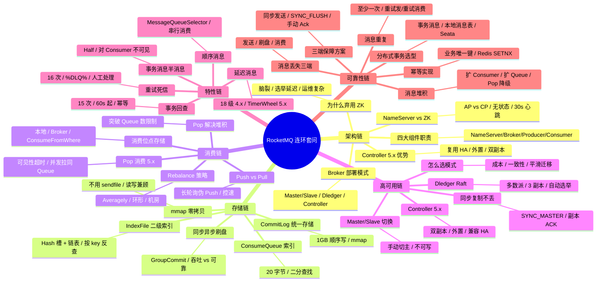

# 跨主题高频面试 Q&A

> **一句话定位**：面试前冲刺用，41 题速答串联各主题，附连环套问思维导图。
> **面试热度**：⭐⭐⭐⭐⭐
> **返回**：[RocketMQ 知识图谱](../README.md)

---

## 使用说明

- 全部 41 题按主题分类，每题 3-5 句要点速答，末尾 **关联** 链接指向对应主题文档的详细推导。
- 连环追问题在题号后标注 🔗，配合文末「连环套问思维导图」把握面试官的追问路径。
- 建议先盖住答案自答，再对照要点查漏，最后跳转关联文档补全原理。
- 版本基线 RocketMQ 5.x，4.x 仅作差异对比。
- 答案只给「要点 + 关键数字 + 为什么」，不展开推导——推导在关联文档里。

**各篇题目数与关联文档**：

| 篇章 | 题目数 | 关联文档 |
|------|--------|---------|
| 一、架构与部署篇 | 7 题（Q1-Q7） | [架构与部署拓扑](./01-architecture/architecture-and-topology.md) |
| 二、存储与刷盘篇 | 6 题（Q8-Q13） | [存储与刷盘机制](./02-storage/storage-and-flush.md) |
| 三、消息模型篇 | 6 题（Q14-Q19） | [消息模型与发送消费](./03-message/message-model.md) |
| 四、高可用与副本篇 | 5 题（Q20-Q24） | [高可用与副本同步](./04-ha/ha-and-replication.md) |
| 五、高级特性篇 | 7 题（Q25-Q31） | [高级特性](./05-feature/advanced-feature.md) |
| 六、实战与最佳实践篇 | 6 题（Q32-Q37） | [实战与最佳实践](./06-practice/practice-and-best-practice.md) |
| 七、运维与排障篇 | 4 题（Q38-Q41） | [运维与排障](./07-ops/ops-and-troubleshooting.md) |
| 合计 | **41 题** | 7 份主题文档 |

---

## 一、架构与部署篇（7 题）

### Q1: RocketMQ 有哪些组件？各自职责？🔗

**答**：RocketMQ 有四大组件：NameServer（路由注册中心，无状态多节点，Broker 每 30s 心跳注册，120s 判活）、Broker（消息存储与转发，分 Master/Slave/Dledger/Controller 模式）、Producer（消息生产者，同步/异步/单向发送）、Consumer（消息消费者，Push/Pull/Pop 消费）。NameServer 不用 ZooKeeper 是因为 AP 无状态更轻，CP 强一致太重。5.x 起 Controller 模式替代 Dledger 成为主推方案。

**关联**：→ [架构与部署拓扑](./01-architecture/architecture-and-topology.md)

### Q2: NameServer 为什么不用 ZooKeeper？🔗

**答**：NameServer 追求 AP（可用性优先），ZooKeeper 是 CP（强一致优先）。RocketMQ 路由数据短时不一致可容忍（Broker 心跳 30s、判活 120s），但 ZK 的选举与写多数派开销太重。NameServer 各节点互不通信、无状态、内存存路由表（< 1MB），单节点 QPS 轻量；客户端随机连一个 NameServer 拉 Topic 路由，30s 主动更新，故障时切下一个。ZK 还会引入脑裂与 Leader 选举延迟，运维复杂度高。

**关联**：→ [架构与部署拓扑](./01-architecture/architecture-and-topology.md)

### Q3: Broker 宕机怎么办？四种部署模式对比🔗

**答**：①单 Master：无冗余，宕机即丢消息，仅用于开发；②Master/Slave：Slave 异步/同步复制，Master 宕机 Slave 可读不可写（除非配 Controller 才自动切主）；③Dledger 模式：Raft 选举自动 Failover，但需 3 节点起步、CommitLog 走 Dledger 复制链路；④Controller 模式（5.x 主推）：外置 Controller 组件协调 Master 选举，复用原生 HA 复制，兼容旧 Master/Slave 部署。生产推荐 Controller 模式 + 同步复制 + 同步刷盘。

**关联**：→ [架构与部署拓扑](./01-architecture/architecture-and-topology.md)

### Q4: NameServer 之间互不通信怎么保证一致性？🔗

**答**：NameServer 节点间确实不通信，靠 Broker 向**所有** NameServer 都注册心跳（30s 一次）来"推"一致性。Broker 启动注册、定期心跳、下线注销，每个 NameServer 独立接收并维护自己的路由表。短时窗口内不同 NameServer 可能数据不一致（如某 Broker 心跳到 NS1 成功、到 NS2 失败），但最终一致（下次心跳补齐）。客户端 30s 拉取路由、故障自动切下一个 NameServer，能容忍秒级不一致。这是典型的 AP 设计，用最终一致换可用性。

**关联**：→ [架构与部署拓扑](./01-architecture/architecture-and-topology.md)

### Q5: Topic 和 Queue 的关系？读写队列分离是什么？🔗

**答**：Topic 是逻辑消息分类，Queue 是 Topic 下的并行消费单位（类似 Kafka Partition）。一个 Topic 默认 4 个 Queue，分布在多 Broker 上实现水平扩展。**读写队列分离**：`readQueueNums` 与 `writeQueueNums` 可不同——扩容时先扩写队列让 Producer 写入，待消息消费完后再扩读队列给 Consumer，避免扩容瞬间新 Queue 无历史消息导致消费错乱。日常读写队列数相等，仅在运维变更期临时分离。

**关联**：→ [架构与部署拓扑](./01-architecture/architecture-and-topology.md)

### Q6: Netty Reactor 线程模型？1+N+M 是什么？🔗

**答**：RocketMQ Broker 基于 Netty 实现 1+N+M 三层 Reactor：①**1 个 main Reactor**（Accept 线程）监听端口、接收连接；②**N 个 sub Reactor**（默认 4 个）处理 IO 读写（编解码、握手）；③**M 个 Worker 线程**（默认 8 个）执行业务逻辑（PutMessage/GetMessage）。业务线程与 IO 线程隔离，避免慢请求拖垮 IO。Producer/Consumer 端也用 Netty 但线程模型更简单（1 个 Reactor + 异步回调）。这是 Netty 主流 Reactor 模式的工程落地。

**关联**：→ [架构与部署拓扑](./01-architecture/architecture-and-topology.md)

### Q7: Controller 模式 5.x 有什么优势？🔗

**答**：Controller 模式是 5.x 主推的 Broker 高可用方案：①**自动 Failover**——Master 宕机由 Controller 协调 Slave 升主，无需 Dledger 的 3 节点 Raft 集群；②**兼容原生 HA 复制**——沿用 Master/Slave 的 HA Service 复制链路，不重写 CommitLog 写入路径，性能无损失；③**外置 Controller**——独立部署，可复用 etcd/Raft 自身高可用，与 Broker 解耦；④**平滑迁移**——从老 Master/Slave 部署升级只需挂 Controller 即可获自动切换能力。相比 Dledger 更轻量，相比老 Master/Slave 解决了手动切主痛点。

**关联**：→ [架构与部署拓扑](./01-architecture/architecture-and-topology.md)

---

## 二、存储与刷盘篇（6 题）

### Q8: RocketMQ 存储和 Kafka 有什么区别？🔗

**答**：①**存储布局**——RocketMQ 所有 Topic 的消息统一写 CommitLog（顺序写、文件 1GB），ConsumeQueue 仅存索引；Kafka 每个 Partition 独立日志段，Topic 间物理隔离；②**消费并发**——RocketMQ ConsumeQueue 让同一 Topic 可多 Queue 并发消费且 ConsumeGroup 独立位点互不干扰；Kafka 同一 Partition 在一个 ConsumerGroup 内只能被一个消费者消费；③**零拷贝**——RocketMQ 用 mmap+PageCache 读写都走堆外，Kafka 用 sendfile（Linux）零拷贝发送；④**Topic 扩展性**——RocketMQ CommitLog 统一存储支持海量 Topic 不退化，Kafka Topic 多时 Partition 文件多、随机 IO 严重。

**关联**：→ [存储与刷盘机制](./02-storage/storage-and-flush.md)

### Q9: CommitLog 是什么？文件多大？🔗

**答**：CommitLog 是 RocketMQ 的核心存储文件，所有 Topic 的消息按到达顺序追加写入，**单文件固定 1GB**，写满即创建新文件（CommitLog 轮转），文件名是起始 offset。写入走 MappedFile（封装 MappedByteBuffer + mmap），顺序写磁盘 + PageCache，单机写入可达 10 万 TPS+。读取消费时通过 ConsumeQueue 的物理 offset 回查 CommitLog，按 offset 定位文件、按 position 定位消息。CommitLog 统一存储是 RocketMQ 海量 Topic 性能不退化的关键。

**关联**：→ [存储与刷盘机制](./02-storage/storage-and-flush.md)

### Q10: ConsumeQueue 是什么？每条多少字节？🔗

**答**：ConsumeQueue 是 CommitLog 的逻辑索引队列，每个 Topic 的每个 Queue 对应一个 ConsumeQueue 文件，存储 CommitLog 的物理定位。每条 **20 字节**：8 字节 offset（CommitLog 物理偏移）、4 字节 size（消息长度）、8 字节 tagcode（Tag 哈希，用于过滤）。消费时先从 ConsumeQueue 读索引，再按 offset 去 CommitLog 取消息体。ConsumeQueue 单文件 30 万条（约 5.7MB），全是定长条目，二分查找/顺序读极快。

**关联**：→ [存储与刷盘机制](./02-storage/storage-and-flush.md)

### Q11: 为什么 RocketMQ 用 mmap 不用 sendfile？🔗

**答**：sendfile 只适合"内核→socket"单向发送场景（如 Kafka 静态文件消费），RocketMQ 需要读消息后还能"业务处理+回写"（如消费失败、轨迹、IndexFile），sendfile 不能在用户态加工数据。mmap 把文件映射到用户态内存，应用可随机读写、零拷贝传输给 Consumer（MappedByteBuffer 直接走堆外）。且 RocketMQ 的写入也要零拷贝——mmap 可写，sendfile 只读。结论：mmap 兼顾读写零拷贝，sendfile 仅适合 Kafka 那种"只发不加工"的纯转发场景。

**关联**：→ [存储与刷盘机制](./02-storage/storage-and-flush.md)

### Q12: 同步刷盘和异步刷盘怎么选？🔗

**答**：①**异步刷盘**（ASYNC_FLUSH，默认）：消息写 PageCache 即返回 ACK，由 OS 后台刷盘，吞吐高但有断电丢消息风险；②**同步刷盘**（SYNC_FLUSH）：消息写完后 GroupCommitService 串行 fsync 落盘再 ACK，吞吐低但宕机不丢。金融/订单等强可靠场景用同步刷盘+同步复制，普通业务用异步刷盘即可。GroupCommit 优化：多条消息聚合一次 fsync（类似 group commit），把 fsync 次数从"每消息一次"降到"每 10ms 一次"。

**关联**：→ [存储与刷盘机制](./02-storage/storage-and-flush.md)

### Q13: IndexFile 怎么按 key 查消息？🔗

**答**：IndexFile 是 RocketMQ 的二级索引文件，支持按 `MessageKey`（业务唯一键）或时间范围反查消息。结构：Header（40 字节，含 begin/end timestamp、slot count）+ Hash 槽数组（默认 500 万槽，每槽 4 字节指向链表头）+ 链表条目（20 字节：keyHash、commitLogOffset、size、prevIndex）。查询时对 key 取 hash 定位槽，沿链表过滤 keyHash 匹配项，再去 CommitLog 取消息。场景：事务回查、消息审计、按订单号查消息轨迹。

**关联**：→ [存储与刷盘机制](./02-storage/storage-and-flush.md)

---

## 三、消息模型篇（6 题）

### Q14: Push 和 Pull 有什么区别？🔗

**答**：①**Pull 模型**：消费者主动拉取（DefaultLitePullConsumer 5.x / DefaultMQPullConsumer 4.x），需自己管理位点、控速，灵活但繁琐；②**Push 模型**：DefaultMQPushConsumer 看似推送，本质是 Pull 长轮询——PullConsumer 后台线程循环拉取，Broker 无消息时挂起（DefaultPull 5s 或长轮询），有消息立即返回。Push 封装了位点、Rebalance、流控，开箱即用。日常用 Push，精细控速或批处理场景用 Pull。

**关联**：→ [消息模型与发送消费](./03-message/message-model.md)

### Q15: Push 是真的推送吗？🔗

**答**：不是真推送，是"Pull 长轮询"伪 Push。DefaultMQPushConsumer 内部用 PullConsumerService 后台线程循环 `pullBroker()`，Broker 没消息时挂起请求（长轮询 5s 或 30s），有新消息立即返回，拉到后回调 `MessageListener` 看起来像推送。好处：①Broker 不需维护"哪些 Consumer 订阅了哪些 Topic"的推送连接表（NameServer 模式天然无状态）；②长轮询比短轮询实时性高、比真推送连接管理简单；③消费速率由 Consumer 自己控，避免被 Broker 推爆。

**关联**：→ [消息模型与发送消费](./03-message/message-model.md)

### Q16: Rebalance 怎么做？有哪些策略？🔗

**答**：Rebalance 是 ConsumerGroup 内 Queue 与 Consumer 的分配再均衡，触发时机：Consumer 上下线、Topic Queue 数变化、Broker 上下线。策略实现 `AllocateMessageQueueStrategy` 接口：①**Averagely**（默认）：平均分配，余数轮流分给前几个 Consumer，负载最均衡；②**AveragelyByCircle**：环形分配，Queue 轮流分给 Consumer，跨 Broker 打散；③**MachineRoom**：机房亲和，同机房 Consumer 优先消费同机房 Broker 的 Queue；④**ConsistentHash**：一致性哈希，Consumer 上下线时减少 Queue 迁移。默认 Averagely，缺点是扩容瞬间有重复消费/消费间隙。

**关联**：→ [消息模型与发送消费](./03-message/message-model.md)

### Q17: 消费位点怎么存？重启从哪消费？🔗

**答**：位点存储分两种：①**BroadcastMode**（广播）：存 Consumer 本地文件（`~/.rocketmq_offsets/`），文件丢了会重头消费；②**ClusterMode**（集群，主流）：存 Broker 端（`consumerOffset.json` + 内存表），Consumer 每 5s 上报位点，Broker 持久化。重启从哪消费：从 Broker 读已持久化位点，如果位点丢失或首次启动，按 `ConsumeFromWhere` 配置（CONSUME_FROM_LAST_OFFSET 从最新、CONSUME_FROM_FIRST_OFFSET 从头、CONSUME_FROM_TIMESTAMP 从时间点）。位点提交是异步的，重启可能有少量重复消费。

**关联**：→ [消息模型与发送消费](./03-message/message-model.md)

### Q18: Pop 消费是什么？5.x 有什么优势？🔗

**答**：Pop 消费是 5.x 引入的拉取模式，借鉴 Kafka 的 fetch 但保留 RocketMQ 模型。核心：Consumer 发 PopRequest 拉一批消息，Broker 把这批消息标记"已 Pop 未 Ack"并加锁，Consumer 消费完异步 Ack，超时未 Ack 视为消费失败可被其他 Consumer 重新 Pop（可见性超时，默认 30s）。**优势**：①解决 Rebalance 死锁——传统 Push 在 Rebalance 期间未消费完的消息被卡住，Pop 无 Rebalance 锁；②解决 Queue 数 < Consumer 数的扩容瓶颈——Pop 模式下多 Consumer 可拉同一 Queue；③堆积场景下 Pop 可并行拉取，吞吐比 Push 高数倍。

**关联**：→ [消息模型与发送消费](./03-message/message-model.md)

### Q19: 批量发送怎么用？有什么限制？🔗

**答**：Producer 用 `send(Collection<Message> msgs)` 批量发送，Broker 收到后写一条"BatchMessage"占位、内部含多条 payload。**限制**：①总大小 ≤ 4MB（默认 `maxMessageSize=4MB`，可调但超大会触发 Broker 拒收）；②同一批量内 Topic、Tag、waitStoreMsgOK 必须相同（不同 Tag 不能批量）；③批量内消息没有独立 ACK——要么整批成功要么整批失败，不适合需细粒度重试的场景。批量+异步发送可把 TPS 推到 10 万+，是 RocketMQ 高吞吐的核心手段。

**关联**：→ [消息模型与发送消费](./03-message/message-model.md)

---

## 四、高可用与副本篇（5 题）

### Q20: Broker 宕机消息会丢吗？🔗

**答**：取决于部署模式与刷盘配置：①单 Master：Master 宕机未刷盘部分丢；②Master/Slave + 异步复制：Master 宕机时未同步到 Slave 的少量消息丢；③Master/Slave + 同步复制（SYNC_MASTER）：Master 写完后等至少一个 Slave ACK 才返回 ACK，Master 宕机 Slave 数据完整，不丢；④Dledger/Controller 模式 + 同步刷盘：Raft 多数派复制 + 同步落盘，宕机不丢。生产要"不丢"必须：同步刷盘 + 同步复制 + 副本数 ≥ 2。

**关联**：→ [高可用与副本同步](./04-ha/ha-and-replication.md)

### Q21: Master/Slave 怎么切换？🔗

**答**：老 Master/Slave 模式**不能自动切主**——Master 宕机后 Slave 只能提供读不能写（除非配 `controllerMode=true` + Controller）。手动切换需：停 Slave → 改配置升级为 Master → 重启，期间写不可用。5.x Controller 模式下，Master 宕机由 Controller 协调选 Slave 升主，自动切换秒级完成，无需人工介入。这是 Controller 模式的核心价值——弥补老 Master/Slave 的"故障不可写"短板。

**关联**：→ [高可用与副本同步](./04-ha/ha-and-replication.md)

### Q22: Dledger 是什么？Raft 选举流程🔗

**答**：Dledger 是 RocketMQ 4.5+ 引入的基于 Raft 的 Broker 高可用方案：①**CommitLog 走 Dledger 复制**——Master 写入后由 Dledger 多数派复制（类 Paxos/Raft），多数 ACK 才算写入成功；②**Raft 选举**——节点三态（Follower/Candidate/Leader），心跳超时（默认 3s）Follower 升 Candidate 发起投票，获多数票升 Leader；③**自动 Failover**——Leader 宕机剩余节点重新选举，秒级选出新 Leader。限制：需 3 节点起步（容忍 1 节点宕机）、CommitLog 写入路径被 Dledger 接管、不兼容老 HA Service。5.x 后 Controller 模式成主推替代。

**关联**：→ [高可用与副本同步](./04-ha/ha-and-replication.md)

### Q23: Controller 模式有什么优势？Dledger 怎么选？🔗

**答**：Controller 模式相比 Dledger：①**复用原生 HA 复制**——不走 Dledger 复制链路，CommitLog 写入性能不退化；②**外置 Controller 解耦**——Controller 独立部署（可基于 etcd/Raft 自身高可用），Broker 仍按 Master/Slave 部署；③**部署成本低**——Master/Slave 双副本即可（Dledger 需 3 副本）；④**平滑迁移**——老 Master/Slave 集群挂 Controller 即获自动 Failover。**怎么选**：新建集群优先 Controller；已有 Dledger 集群稳定运行则不强行迁移；预算紧张、容忍 1 节点宕机的选 Controller（2 副本），要求 Raft 强一致选 Dledger（3 副本）。

**关联**：→ [高可用与副本同步](./04-ha/ha-and-replication.md)

### Q24: 消息怎么保证不丢？三端保障🔗

**答**：①**生产端**：同步发送 + 重试（retryTimesWhenSendFailed=2）+ 同步 ACK 等待，发送失败落本地表/重投；②**Broker 端**：同步刷盘（SYNC_FLUSH）+ 同步复制（SYNC_MASTER 或 Dledger/Controller 副本），多数派 ACK 才算持久化；③**消费端**：业务消费成功后再 Ack（手动提交位点），消费失败走重试，重试 16 次后进死信队列人工处理。生产级"零丢失"组合：同步发送 + retryTimes ≥ 2 + SYNC_FLUSH + SYNC_MASTER + 副本 ≥ 2 + 消费手动 Ack + 业务幂等兜底。

**关联**：→ [高可用与副本同步](./04-ha/ha-and-replication.md)

---

## 五、高级特性篇（7 题）

### Q25: 事务消息怎么实现？半消息+回查🔗

**答**：事务消息是 RocketMQ 的两阶段提交：①**半消息**——Producer 先发 Half Message 到 Broker，Broker 标记 `TRANSACTION_HALF_TOPIC`（对 Consumer 不可见）；②**执行本地事务**——Producer 回调 `executeLocalTransaction()` 执行业务（如扣库存、写订单）；③**提交/回滚**——本地事务成功发 Commit（消息转真实 Topic）、失败发 Rollback（删半消息）；④**回查**——若 Producer 没回 Commit/Rollback（如宕机），Broker 定期（60s）回查 `checkLocalTransaction()`，根据本地事务状态二次决定 Commit 或 Rollback。回查保证"Producer 挂了"也能最终一致。

**关联**：→ [高级特性](./05-feature/advanced-feature.md)

### Q26: 事务消息回查失败怎么办？🔗

**答**：Broker 默认回查 15 次（`transactionCheckMax=15`），每次间隔递增（60s 起、逐步加大到 6h）。15 次仍无结果，Broker 放弃回查，把半消息标记 Rollback（即丢弃）并打印告警日志。**应对**：①回查接口必须幂等——同一条半消息可能被回查多次，本地事务表按业务唯一键去重；②回查接口要快——超时（默认 60s）会被算作失败；③回查失败要监控告警——15 次用尽前人工介入补本地事务状态。关键：事务消息是"最终一致"，不是强一致，业务必须容忍秒级到分钟级延迟。

**关联**：→ [高级特性](./05-feature/advanced-feature.md)

### Q27: 顺序消息怎么保证顺序？🔗

**答**：①**分区顺序**（主流）：同一业务 Key（如订单号）的消息用 `MessageQueueSelector` 按 key 哈希选固定 Queue，保证同 key 消息进同 Queue；Broker 端单 Queue 内天然 FIFO；Consumer 端用 `MessageListenerOrderly` 串行消费同 Queue（加锁防并发）。②**全局顺序**：整个 Topic 只 1 个 Queue，绝对有序但失去并行度，仅用于严格顺序场景（极少用）。**坑**：消费失败不能抛异常（会卡住整个 Queue），必须返回 SUSPEND_CURRENT_QUEUE_A_MOMENT 重试；扩 Queue 数会破坏 hash 路由，需停服变更。

**关联**：→ [高级特性](./05-feature/advanced-feature.md)

### Q28: 延迟消息 4.x 和 5.x 区别？🔗

**答**：①**4.x 定时延迟**：18 个固定延迟等级（1s/5s/10s/30s/1m/2m/...2h），消息先存 `SCHEDULE_TOPIC_XXXX`，后台定时任务按等级扫描到期消息转回原 Topic。缺点：等级固定不可任意延迟、等级越高精度越差（2h 等级误差可能分钟级）。②**5.x 任意延迟**：引入 TimerWheel（时间轮）存储延迟消息，任意延迟精度可达秒级，支持指定具体时刻投递（如"2026-08-12 15:00 投递"）。5.x API 用 `MessageBuilder.withDelayLevel()` 或 `deliveryTimestamp()`。选型：5.x 优先用任意延迟，4.x 只能在 18 等级中选最接近的。

**关联**：→ [高级特性](./05-feature/advanced-feature.md)

### Q29: 消费失败重试多少次？延迟等级？🔗

**答**：消费失败（`MessageListener` 返回 RECONSUME_LATER 或抛异常）后 Broker 把消息投递到重试 Topic `%RETRY%ConsumerGroup`，重试 **最多 16 次**（`maxReconsumeTimes=16`）。延迟等级沿用 4.x 的 18 级（1s、5s、10s、30s、1m、2m、3m、4m、5m、6m、7m、8m、9m、10m、20m、30m、1h、2h），按重试次数递增等级（第 1 次重试延迟 10s，第 16 次延迟 2h）。16 次仍失败进死信队列。设计思路：指数退避，避免毒消息持续冲击消费。注意：顺序消息的重试会阻塞整个 Queue。

**关联**：→ [高级特性](./05-feature/advanced-feature.md)

### Q30: 死信队列是什么？怎么处理？🔗

**答**：消息重试 16 次仍失败，进入死信队列 `%DLQ%ConsumerGroup`，原 Topic+Queue 信息保留在消息属性里。死信队列特点：①不再自动重试，需人工处理；②默认 1 天过期（`messageDelayLevel` 配置相关），需及时处理避免丢失；③同 ConsumerGroup 共享一个 DLQ。**处理方式**：①`mqadmin queryMsgByOffset` 查 DLQ 消息定位失败原因；②修复消费代码 bug 后用 `mqadmin consumeMsg` 重投递到原 Topic；③业务上允许跳过的，记日志后 Ack 清理。监控 DLQ 长度是消费健康度的关键指标。

**关联**：→ [高级特性](./05-feature/advanced-feature.md)

### Q31: Tag 和 SQL92 过滤区别？🔗

**答**：①**Tag 过滤**：Broker 端按 Tag 哈希（ConsumeQueue 里的 tagcode 字段）匹配，Consumer 订阅时指定 `||` 分隔的 Tag 列表（如 `TagA||TagB`），Broker 端过滤后下发。性能高（tagcode 4 字节比较）但不支持复杂条件。②**SQL92 过滤**：Consumer 用 SQL92 语法订阅（如 `a > 5 and b = 'x'`），Broker 端对消息属性做表达式求值过滤。灵活（支持数值/字符串比较、IN、BETWEEN、IS NULL）但 Broker 要解析表达式，性能略低。③**ClassFilter**：Broker 下发到 Consumer 端用 Java 代码过滤（如脚本），灵活但安全风险高，基本弃用。日常用 Tag，复杂过滤用 SQL92。

**关联**：→ [高级特性](./05-feature/advanced-feature.md)

---

## 六、实战与最佳实践篇（6 题）

### Q32: 消息怎么保证不丢？三端保障方案🔗

**答**：①**生产端不丢**：用同步发送（`send()`）+ 同步等待 ACK，失败重试 2-3 次，仍失败落本地表（如 MySQL）后台补投；异步发送仅用于日志类可丢场景。②**Broker 端不丢**：同步刷盘（SYNC_FLUSH）+ 同步复制（SYNC_MASTER 或 Dledger/Controller 多数派），消息写多数副本+落盘才 ACK。③**消费端不丢**：业务处理完成后再 Ack 提交位点，消费失败走重试 16 次 → 死信队列。零丢失组合：同步发送 + retryTimes=2 + SYNC_FLUSH + Controller 同步复制 + 手动 Ack + 业务幂等。极端情况（机房整体故障）还需异地多活或 binlog 备份兜底。

**关联**：→ [实战与最佳实践](./06-practice/practice-and-best-practice.md)

### Q33: 消息重复怎么办？幂等怎么实现？🔗

**答**：RocketMQ 不保证"恰好一次"，默认"至少一次"——Producer 重试发、Consumer 重试消费都可能重复。**幂等实现方案**：①**业务唯一键 + 去重表**：消息设业务 key（订单号、流水号），Consumer 端用 Redis SETNX 或 MySQL unique 索引判重，重复则丢弃；②**业务状态机**：订单从"待支付"到"已支付"，重复消费时状态已是"已支付"则跳过；③**Token 机制**：业务前置发 token，消息消费校验 token 有效性，消费即失效。**生产推荐**：业务唯一键 + Redis SETNX（TTL 设为重试周期 ×2），简单可靠。分布式锁方案见 Redis 模块。

**关联**：→ [实战与最佳实践](./06-practice/practice-and-best-practice.md)

### Q34: 消息堆积怎么处理？🔗

**答**：堆积根因是消费速度 < 生产速度。**应急处理**：①**扩 Consumer**——但 Queue 数是上限（默认 4），Consumer 数 > Queue 数时多余 Consumer 空闲；②**临时转移 Queue**——用 `mqadmin updateTopic` 把堆积 Topic 的 Queue 扩到 16/32，再扩 Consumer；③**Pop 消费降级**——切到 5.x Pop 模式，多 Consumer 并发拉同 Queue，绕过 Push 的 Queue 数限制；④**消费降级**——临时关闭非核心逻辑（如通知、日志），只做核心入库；⑤**最后兜底**——跳过堆积消息（先 Ack 让位点前进），用异步任务回捞。根因排查：监控 Consumer TPS、慢消费日志、GC。

**关联**：→ [实战与最佳实践](./06-practice/practice-and-best-practice.md)

### Q35: 消费者数能超过 Queue 数吗？🔗

**答**：Push 模式下**不能**——`AllocateMessageQueueAveragely` 按 Queue 分配 Consumer，Consumer 数 > Queue 数时多余的 Consumer 拿不到 Queue 直接空闲。如 4 Queue + 6 Consumer，只有 4 个 Consumer 消费、2 个闲着。**解决**：①扩 Queue 数到 ≥ Consumer 数（生产推荐 Queue 数 ≥ Consumer 数 × 2）；②切到 5.x **Pop 消费**模式——Pop 模式打破"一 Queue 一 Consumer"约束，多 Consumer 可并发拉同一 Queue，Consumer 数无 Queue 数上限。所以"堆积扩容"场景下 Pop 是首选。

**关联**：→ [实战与最佳实践](./06-practice/practice-and-best-practice.md)

### Q36: 分布式事务用什么方案？🔗

**答**：RocketMQ 自带**事务消息**方案（Q25），适合"先发消息、再执行本地事务、失败回查"的场景，最终一致。其他方案对比：①**本地消息表**：业务表+消息表同事务写入，后台定时扫表投递，简单可靠但延迟高、需扫表；②**Seata AT/TCC**：强一致但侵入业务，性能开销大；③**最大努力通知**：发完就不管，靠对端查接口兜底，弱一致。**选型**：RocketMQ 事务消息适合"消息驱动+最终一致"（如下单后发消息触发库存/积分），Seata 适合跨服务强一致（如资金转账），本地消息表适合对账型业务。详见实战文档。

**关联**：→ [实战与最佳实践](./06-practice/practice-and-best-practice.md)

### Q37: RocketMQ 和 Kafka 怎么选？🔗

**答**：①**Topic 数量**：RocketMQ CommitLog 统一存储，Topic 多性能不退化，适合业务消息多 Topic 场景；Kafka Partition 独立文件，Topic 多时随机 IO 退化，适合 Topic 少而吞吐大场景（如日志/埋点）。②**延迟/事务/重试**：RocketMQ 内置事务消息、延迟消息、重试死信，业务消息能力丰富；Kafka 需自建方案（如时间轮延迟、外部事务）。③**消费模型**：Kafka 同 Partition 一个 Consumer 严格绑定，RocketMQ 5.x Pop 模式更灵活。④**运维**：Kafka 依赖 ZK（KRaft 逐步替代），RocketMQ NameServer 轻。**结论**：业务消息选 RocketMQ，大数据/日志选 Kafka，详见实战文档对比。

**关联**：→ [实战与最佳实践](./06-practice/practice-and-best-practice.md)

---

## 七、运维与排障篇（4 题）

### Q38: 怎么查消息堆积？怎么处理？🔗

**答**：①**查堆积**：`mqadmin consumerProgress -g ConsumerGroup` 看 `Diff`（堆积量=最大 offset - 消费 offset），`Diff > 10万` 需关注；Dashboard 看 Consumer TPS 与 Diff 曲线。②**查根因**：`mqadmin consumerStatus` 看 Consumer 实例分布与 Queue 分配是否均衡；查 Consumer 端 `consumeLatency`（消费延迟）是否突增——大概率是消费逻辑慢或下游 DB 慢；查 Broker `brokerStatus` 看磁盘/CPU 是否打满。③**处理**：扩 Consumer（受 Queue 数限制）→ 临时扩 Queue → Pop 模式降级 → 兜底跳过堆积异步回捞。详见实战文档 Q34。

**关联**：→ [运维与排障](./07-ops/ops-and-troubleshooting.md)

### Q39: Broker 宕机怎么排查？🔗

**答**：①**现象**：Producer 报 `RemotingTimeoutException` 或 `BrokerException`，Dashboard 看 Broker 离线。②**第一步看进程**：`jps` 看 Broker 进程是否在，不在则看 `broker.log` 是不是 OOM（`Out Of Memory Error`）或 GC 崩溃；`dmesg | grep -i kill` 看是不是被 OOM Killer 杀。③**第二步看磁盘**：`df -h` 看磁盘是否打满（Broker 默认 90% 满会拒绝写入），`iostat -x 1` 看 IO 是否打满。④**第三步看网络**：`netstat` 看 NameServer 心跳是否通，防火墙是否拦截。⑤**恢复**：磁盘满则清旧 CommitLog 或扩容；OOM 则调 `Xmx` 与 Direct Memory 上限；进程崩溃则重启 Broker，副本模式下数据从 Slave/其他副本恢复。

**关联**：→ [运维与排障](./07-ops/ops-and-troubleshooting.md)

### Q40: 消息丢了怎么定位？三端排查🔗

**答**：①**生产端**：查 Producer 日志看发送是否成功（ACK 是否返回），失败看 retryTimes；`mqadmin queryMsgById` 反查消息是否到 Broker。②**Broker 端**：`mqadmin queryMsgByOffset` 在 CommitLog 查消息是否存在；查 broker.log 看刷盘是否失败（`FlushDiskTimeout`）、复制是否失败（`SlaveNotAvailable`）；查磁盘是否损坏（`fsck`、SMART 错误）。③**消费端**：`mqadmin consumerProgress` 看位点是否前进；查 Consumer 日志是否有 Ack 失败、业务异常吞掉消息没 Ack。**定位流程**：先用业务 key 反查消息在哪个环节丢——Producer 日志没则生产端丢，Broker 有但 Consumer 没收到则 Broker→Consumer 链路丢，Consumer 收到但业务没执行则消费端丢。

**关联**：→ [运维与排障](./07-ops/ops-and-troubleshooting.md)

### Q41: Broker JVM 怎么调优？🔗

**答**：①**堆大小**：CommitLog 走 mmap 堆外内存，JVM 堆不需太大，建议 8-16GB（避免大堆 GC 停顿长）。②**堆外内存**：`-XX:MaxDirectMemorySize=16g` 限制 Direct Memory（MappedByteBuffer + Netty 都用堆外），配合 `transientStorePoolEnable=true` 启用堆外缓冲池减少 GC。③**GC 选择**：G1 适合大堆（JDK 8 后期+），ZGC 适合超低延迟（JDK 11+，5.x 推荐）；CMS 已弃用。④**关键参数**：`-XX:+UseG1GC -XX:MaxGCPauseMillis=50 -XX:G1HeapRegionSize=16m`；监控 `jstat -gcutil` 看 GC 频率与停顿，`-Xlog:gc*`（JDK 11+）看详细日志。⑤**避免坑**：关闭 THP（大页导致 mmap 复制放大）、`vm.swappiness=1`（避免 swap）、`vm.max_map_count=655360`（mmap 文件数限制）。

**关联**：→ [运维与排障](./07-ops/ops-and-troubleshooting.md)

---

## 连环套问思维导图

面试官常从一个点切入连环追问，下面 6 条追问链覆盖 80% 高频追问路径，对照检查每条链是否能完整答出。

> **使用提示**：面试前盖住答案自答 41 题，对照思维导图检查每条追问链是否答得完整；答不上来的题跳转 **关联** 文档补原理推导。

### 连环套问链详注

下面把思维导图中的 6 条追问链展开为问答路径，标注每一步的"考点 + 易踩坑"，供面试前对照演练。

**链 1：架构链（Q1 → Q2 → Q3 → Q7 → Q4）**

- **Q1 起手问"四大组件"**：考点是 NameServer/Broker/Producer/Consumer 职责边界，易踩坑是把 NameServer 说成"配置中心"——它是路由注册中心，无配置下发能力。
- **Q2 追问"为什么不用 ZK"**：考点是 AP vs CP 取舍，易踩坑是只说"ZK 慢"不说 RocketMQ 路由数据本就允许短时不一致。
- **Q3 追问"Broker 部署模式"**：考点是四种模式演进，易踩坑是把 Controller 和 Dledger 混为一谈——Controller 不接管 CommitLog 复制链路。
- **Q7 追问"Controller 优势"**：考点是双副本 + 外置 + 兼容 HA，易踩坑是忽略 Controller 自身也需要高可用（基于 etcd/Raft）。
- **Q4 反问"NameServer 不通信怎么一致"**：考点是 Broker 全量注册 + 心跳 30s + 客户端 30s 拉取的最终一致机制，易踩坑是说成"强一致"。

**链 2：存储链（Q9 → Q10 → Q13 → Q11 → Q12）**

- **Q9 起手问"CommitLog"**：考点是统一存储 + 1GB 文件 + mmap，易踩坑是答不出"为什么统一存储能让 Topic 多不退化"。
- **Q10 追问"ConsumeQueue"**：考点是 20 字节条目（offset/size/tagcode）+ 二分查找，易踩坑是答成 ConsumeQueue 存消息体（实际只存索引）。
- **Q13 追问"IndexFile"**：考点是 Hash 槽 + 链表 + 按 key/时间反查，易踩坑是和 ConsumeQueue 混淆——ConsumeQueue 按 offset 查，IndexFile 按 key 查。
- **Q11 追问"为什么 mmap 不 sendfile"**：考点是 sendfile 只读单向、mmap 可读写，易踩坑是说成"mmap 比 sendfile 快"——同场景下 sendfile 零拷贝次数更少，是 RocketMQ 需要读写加工才选 mmap。
- **Q12 追问"同步异步刷盘"**：考点是 GroupCommit 聚合 fsync + 吞吐/可靠权衡，易踩坑是答成"同步刷盘每条都 fsync"——实际是 GroupCommit 每 10ms 聚合一次。

**链 3：消费链（Q14 → Q16 → Q17 → Q18 → Q35）**

- **Q14 起手问"Push vs Pull"**：考点是长轮询伪 Push + 控速灵活度，易踩坑是把 Push 说成真推送。
- **Q16 追问"Rebalance 策略"**：考点是 AllocateMessageQueueStrategy 四策略 + 触发时机，易踩坑是答不出 Rebalance 瞬间的重复消费/消费间隙问题。
- **Q17 追问"消费位点"**：考点是广播本地/集群 Broker 端 + ConsumeFromWhere，易踩坑是忽略位点异步提交导致的重复消费。
- **Q18 追问"Pop 消费"**：考点是可见性超时 + 并发拉同 Queue + 无 Rebalance 锁，易踩坑是答成"Pop 就是 Pull"——Pop 是 Broker 端加锁的拉取，和裸 Pull 不同。
- **Q35 反问"堆积扩容"**：考点是 Push 受 Queue 数限制、Pop 突破限制，易踩坑是答"扩 Consumer 就行"——Queue 数 < Consumer 数时无效。

**链 4：高可用链（Q21 → Q20 → Q22 → Q23 → Q24）**

- **Q21 起手问"Master/Slave 切换"**：考点是老模式不能自动切主 + Controller 弥补短板，易踩坑是把老 Master/Slave 说成能自动 Failover。
- **Q20 追问"宕机丢不丢"**：考点是刷盘 + 复制 + 副本数组合，易踩坑是只说"同步刷盘不丢"——单 Master 同步刷盘宕机仍丢未刷部分。
- **Q22 追问"Dledger"**：考点是 Raft 选举 + 3 副本 + CommitLog 走 Dledger 复制，易踩坑是答不出 Dledger 与原生 HA Service 互斥。
- **Q23 追问"Controller 优势 + 怎么选"**：考点是双副本 + 复用 HA + 平滑迁移，易踩坑是答成"Controller 一定比 Dledger 好"——强一致场景 Dledger 更稳。
- **Q24 反问"三端不丢"**：考点是发送/刷盘/消费三端组合方案，易踩坑是只答 Broker 端忽略生产/消费端。

**链 5：特性链（Q25 → Q26 → Q27 → Q28 → Q29 → Q30）**

- **Q25 起手问"事务消息"**：考点是半消息 + 本地事务 + 回查两阶段，易踩坑是把半消息说成"延迟消息"——半消息是"对 Consumer 不可见"不是"延迟投递"。
- **Q26 追问"回查失败"**：考点是 15 次 + 递增间隔 + 最终 Rollback，易踩坑是答不出回查接口必须幂等。
- **Q27 追问"顺序消息"**：考点是 MessageQueueSelector + 同 Queue 串行消费，易踩坑是答成"全局顺序"——分区顺序才是主流。
- **Q28 追问"延迟消息 4.x vs 5.x"**：考点是 18 级 vs TimerWheel 任意延迟，易踩坑是答不出 4.x 等级越高精度越差。
- **Q29 追问"重试 16 次"**：考点是 18 级延迟递增 + 16 次进死信，易踩坑是答成"无限重试"。
- **Q30 追问"死信队列"**：考点是 %DLQ% + 人工重投 + 监控告警，易踩坑是答不出 DLQ 默认过期时间。

**链 6：可靠性链（Q32 → Q24 → Q33 → Q36 → Q34 → Q37）**

- **Q32 起手问"三端不丢"**：考点是发送/刷盘/消费三端组合，易踩坑是只答一端。注意 Q32 与 Q24 是同一考点在不同篇的复现，回答时可合并。
- **Q24 反问"Broker 副本保障"**：考点是同步刷盘 + 同步复制 + Controller/Dledger，承接 Q32 的 Broker 端细节。
- **Q33 追问"消息重复 + 幂等"**：考点是至少一次语义 + 业务唯一键 + Redis SETNX，易踩坑是答成"RocketMQ 保证不重复"——它只保证至少一次。
- **Q36 追问"分布式事务选型"**：考点是事务消息/本地消息表/Seata 对比，易踩坑是把事务消息说成强一致——是最终一致。
- **Q34 追问"消息堆积"**：考点是扩 Consumer 受限 + 扩 Queue + Pop 降级 + 兜底跳过，易踩坑是只答"扩 Consumer"。
- **Q37 收尾问"RocketMQ vs Kafka"**：考点是 Topic 多场景 + 延迟/事务/重试特性 + 消费模型，易踩坑是只答"Kafka 吞吐高"——RocketMQ 单机 TPS 也可达 10 万+。

> **串联技巧**：面试官追问本质是"由点及面"，回答时主动用"其实这背后还有 X" 把下个考点带出来，化被动为主动。

## 附：高频面试场景速查

| 场景 | 核心题 | 关联文档 |
|------|--------|---------|
| "讲讲 RocketMQ 架构" | Q1-Q7 | [架构与部署拓扑](./01-architecture/architecture-and-topology.md) |
| "RocketMQ 怎么存消息" | Q8-Q13 | [存储与刷盘机制](./02-storage/storage-and-flush.md) |
| "Push 消费还是 Pull" | Q14-Q19 | [消息模型与发送消费](./03-message/message-model.md) |
| "Broker 宕机怎么办" | Q20-Q24 | [高可用与副本同步](./04-ha/ha-and-replication.md) |
| "事务消息怎么实现" | Q25-Q31 | [高级特性](./05-feature/advanced-feature.md) |
| "消息丢了/重复/堆积" | Q32-Q37 | [实战与最佳实践](./06-practice/practice-and-best-practice.md) |
| "生产怎么运维" | Q38-Q41 | [运维与排障](./07-ops/ops-and-troubleshooting.md) |

---

## 附：面试 30 秒自检表

面试前最后 30 秒过一遍这张表，每行对应一个"必答要点"，能脱口而出才算过关。

| 题号 | 30 秒必答要点 |
|------|--------------|
| Q1 | 四大组件：NameServer 路由 / Broker 存储 / Producer 发送 / Consumer 消费 |
| Q2 | NameServer AP 无状态，ZK CP 太重，30s 心跳 + 120s 判活 |
| Q3 | 四模式：单 Master / Master-Slave / Dledger / Controller，生产用 Controller |
| Q4 | Broker 向所有 NameServer 注册，最终一致，客户端 30s 拉路由 |
| Q5 | Topic 逻辑分类，Queue 并行单位，读写队列分离用于扩容过渡 |
| Q6 | 1 main + N sub Reactor + M worker，业务线程与 IO 线程隔离 |
| Q7 | Controller 复用 HA、外置部署、双副本、平滑迁移 |
| Q8 | RocketMQ 统一 CommitLog，Kafka 分 Partition 文件，海量 Topic 选 RocketMQ |
| Q9 | CommitLog 1GB 顺序写 + mmap，所有 Topic 共享 |
| Q10 | ConsumeQueue 20 字节索引：offset + size + tagcode |
| Q11 | mmap 可读写零拷贝，sendfile 只读单向，RocketMQ 需加工数据 |
| Q12 | 同步刷盘 GroupCommit 聚合 fsync，异步刷盘吞吐高有断电风险 |
| Q13 | IndexFile Hash 槽 + 链表，按 key/时间反查消息 |
| Q14 | Push 长轮询伪推送，Pull 主动拉取控速 |
| Q15 | Push 本质 Pull + Broker 长轮询 5s/30s |
| Q16 | Rebalance 四策略：Averagely / 环形 / 机房 / 一致性哈希 |
| Q17 | 广播本地存，集群 Broker 端存，ConsumeFromWhere 控起点 |
| Q18 | Pop 5.x 可见性超时 + 并发拉同 Queue，突破 Queue 数限制 |
| Q19 | 批量 ≤ 4MB，同 Topic 同 Tag，整批 ACK |
| Q20 | 不丢组合：同步刷盘 + 同步复制 + 副本 ≥ 2 |
| Q21 | 老 Master/Slave 不能自动切主，Controller 弥补短板 |
| Q22 | Dledger Raft 3 副本，多数派 ACK，自动选举 |
| Q23 | Controller 双副本 + 复用 HA + 平滑迁移，强一致选 Dledger |
| Q24 | 三端：同步发送 + SYNC_FLUSH + 手动 Ack |
| Q25 | 半消息 + 本地事务 + 回查，两阶段最终一致 |
| Q26 | 回查 15 次，递增间隔，最终 Rollback，接口必须幂等 |
| Q27 | MessageQueueSelector 按 key hash 选 Queue，同 Queue 串行消费 |
| Q28 | 4.x 18 级固定，5.x TimerWheel 任意延迟秒级精度 |
| Q29 | 重试 16 次，延迟等级递增，16 次进死信 |
| Q30 | %DLQ% + 人工重投 + 监控告警 |
| Q31 | Tag 哈希过滤快，SQL92 表达式过滤灵活 |
| Q32 | 三端：发送重试 + 刷盘复制 + 手动 Ack + 幂等兜底 |
| Q33 | 至少一次语义，业务唯一键 + Redis SETNX 去重 |
| Q34 | 扩 Consumer / 扩 Queue / Pop 降级 / 兜底跳过回捞 |
| Q35 | Push 受 Queue 数限制，Pop 突破限制 |
| Q36 | 事务消息最终一致，Seata 强一致，本地消息表对账型 |
| Q37 | 业务消息选 RocketMQ，日志大数据选 Kafka |
| Q38 | mqadmin consumerProgress 看 Diff，扩容 + Pop 降级 |
| Q39 | 查进程 / 磁盘 / 网络，OOM 与磁盘满是常见根因 |
| Q40 | 三端排查：Producer 日志 / Broker queryMsgByOffset / Consumer 位点 |
| Q41 | 堆 8-16GB，G1/ZGC，MaxDirectMemorySize 16g，关 THP |

> **临场技巧**：被问到不熟的题，先答"30 秒必答要点"中的关键词，再展开细节；答不上来就主动引导到相邻题（如被问 Q30 死信，可带出 Q29 重试），把追问链拉到自己熟的段落。
