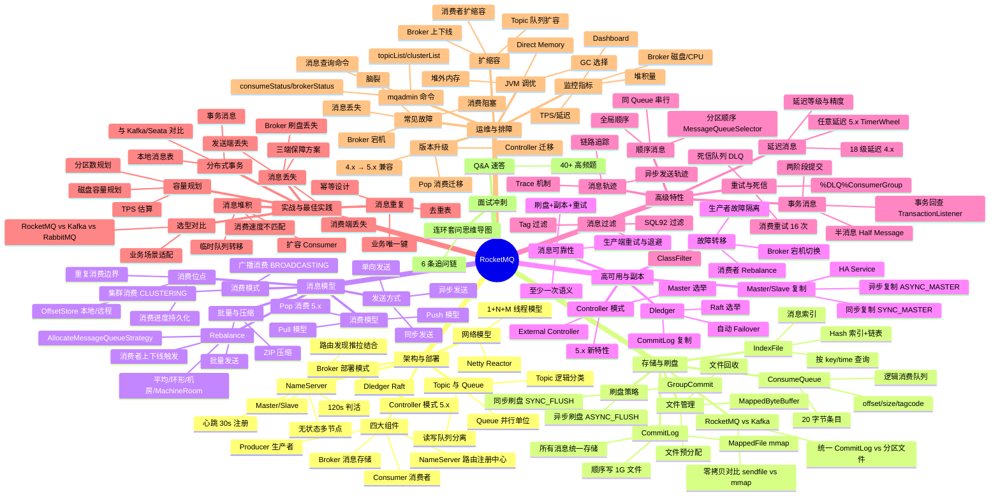

# rocketmq — RocketMQ 面试知识体系

## 一、模块简介

本模块按 RocketMQ 知识层次组织 **8 份**主题/汇总文档，覆盖从架构与部署、存储与刷盘、消息模型与发送消费、高可用与副本同步、高级特性（事务/顺序/延迟/重试/过滤/轨迹）、实战与最佳实践、运维与排障到面试冲刺的完整面试知识图谱，并把每个专题都落到 Java 后端工程实战。

- **定位**：面向 Java 后端高级/资深面试的 RocketMQ 知识体系，深度对标 `middleware/mysql`、`middleware/redis`、`ops/linux`
- **适用对象**：Java 后端面试（社招高级/资深，5 年+），兼顾架构与系统设计方向
- **组织方式**：7 个主题目录 + 1 个 Q&A 文件，每份主题文档遵循「概念定义 → 原理与流程 → 高频追问 → 实战关联 → 系统设计案例」五段式结构
- **导航约定**：每份文档顶部含 `> 返回 [RocketMQ 知识图谱](../README.md)` 链接，本文档为统一入口
- **版本基线**：RocketMQ 5.x（覆盖 Controller 模式、Pop 消费、任意延迟消息、DefaultLitePullConsumer 等特性，4.x 仅作差异对比）

---

## 二、知识图谱



---

## 三、导航表

| 分层 | 文档 | 核心考点 |
|------|------|---------|
| 架构与部署 | [架构与部署拓扑](./01-architecture/architecture-and-topology.md) ✅ | NameServer 无状态/Broker 角色演进/Topic×Queue 模型/Netty Reactor 线程模型 |
| 存储与刷盘 | [存储与刷盘机制](./02-storage/storage-and-flush.md) ✅ | CommitLog 统一存储/ConsumeQueue 索引/IndexFile/mmap 零拷贝/同步异步刷盘 |
| 消息模型 | [消息模型与发送消费](./03-message/message-model.md) ✅ | 同步/异步/单向发送/Push·Pull·Pop 消费/集群·广播/Rebalance 策略/消费位点 |
| 高可用与副本 | [高可用与副本同步](./04-ha/ha-and-replication.md) ✅ | Master/Slave 同步异步复制/Dledger Raft/Controller 模式/Failover/消息可靠性保障 |
| 高级特性 | [高级特性](./05-feature/advanced-feature.md) ⬜ | 事务消息半消息+回查/顺序消息/延迟消息 18 级+任意延迟/重试死信/Tag·SQL92 过滤/消息轨迹 |
| 实战与最佳实践 | [实战与最佳实践](./06-practice/practice-and-best-practice.md) ⬜ | 消息堆积/丢失/重复 三大顽疾/分布式事务方案/幂等设计/容量规划/RocketMQ vs Kafka 选型 |
| 运维与排障 | [运维与排障](./07-ops/ops-and-troubleshooting.md) ⬜ | mqadmin 命令/监控指标/常见故障/扩缩容/版本升级/JVM 调优 |
| 面试冲刺 | [Q&A 速答](./08-interview-qa.md) ⬜ | 40+ 题速答 + 连环套问思维导图 |

> 共 **9 份**文档：入口 README（本文档）+ 上表 8 份主题/Q&A 文档。

---

## 四、推荐学习路径

### 路线一：系统学习（适合有 1-2 周准备期）

按 RocketMQ 知识层次自底向上，先建立架构与存储模型底层，再向上到消息模型、高可用、高级特性、实战与运维：

```
01 架构 → 02 存储 → 03 消息 → 04 高可用 → 05 特性 → 06 实战 → 07 运维 → 08 Q&A
```

**特点**：先见森林后见树木，符合「架构 → 存储 → 消息 → 高可用 → 特性 → 实战 → 运维」的认知递进，适合建立完整体系。底层到上层路径清晰：架构是骨架，存储决定单机能力，消息模型决定吞吐与消费语义，高可用决定容灾，特性是业务武器，实战/运维是工程落地。

### 路线二：面试冲刺（高频优先，适合 3-5 天突击）

按面试热度排序，先啃必考点，再补体系：

1. 01 架构 → 05 特性
2. 03 消息 → 02 存储
3. 04 高可用 → 06 实战
4. 07 运维 → 08 Q&A（40+ 题，含连环套问思维导图）

**特点**：投入产出比最高，覆盖 80% 高频考点。RocketMQ 面试起手三连问是「架构组件与 NameServer → 事务消息 → 消息可靠性（不丢/不重/堆积）」，先把这三块拿下再补存储与运维。

> 两套路线殊途同归，最终都应回到 [Q&A 速答](./08-interview-qa.md) 做闭环检验。

---

## 五、与 java-core / framework 模块的关联

本模块虽为中间件文档，但与仓库内 Java 模块存在直接关联，便于在面试中结合源码与实战作答：

| RocketMQ 知识点 | 关联 Java 模块 | 关联要点 |
|----------------|---------------|---------|
| 01 架构 / Netty Reactor | `java-core/lambda` | Broker 的 Netty Reactor 与 Stream 异步编程的对照 |
| 01 架构 / Broker 线程模型 | `java-core/jvm` | 1+N+M 线程模型与 JVM 线程调度 |
| 02 存储 / mmap 零拷贝 | `java-core/jvm` | MappedByteBuffer 与 JVM 堆外内存、DirectByteBuffer 对照 |
| 02 存储 / PageCache | `java-core/jvm` | PageCache 与 JVM GC 的协调、堆外内存预算 |
| 03 消息 / 异步发送 | `java-core/lambda` | Producer 异步回调 CompletableFuture 与 Stream 批处理 |
| 03 消息 / 批量发送 | `java-core/stream` | 批量发送与 Stream 批处理的对比 |
| 04 高可用 / 副本同步 | `java-core/jvm` | HA Service 的线程模型与 JVM 多线程并发 |
| 05 事务消息 / 两阶段 | `framework/spring-framework` | 事务消息与 `@Transactional` 的分布式事务边界 |
| 06 实战 / Spring 集成 | `framework/spring-framework` | `@RocketMQMessageListener`、RocketMQTemplate 集成 |
| 06 实战 / 序列化 | `framework/jackson` | 消息体序列化与 Jackson 自定义序列化 |
| 06 实战 / 参数校验 | `framework/valid` | 消息消费幂等与参数校验互补 |
| 06 实战 / 分布式事务 | `framework/spring-framework` | 本地消息表 + Seata + 事务消息的对比 |

> 建议在阅读存储、消息模型与实战文档时，对照 `java-core`/`framework` 模块源码，加深「面试八股 → 工程实战」双向映射（延伸阅读：`java-core/jvm` 对照 MappedByteBuffer 堆外内存/PageCache/线程模型，`framework/spring-framework` 对照 Spring 集成/事务消息边界，`framework/jackson` 对照序列化器）。

---

## 六、与 ops / middleware 内其他模块的交叉引用

本模块部分原理推导链与 `ops` 运维文档及其他中间件文档存在对照关系，RocketMQ 章只讲"RocketMQ 场景下的实现与选择"，原理推导回对应模块：

| RocketMQ 文档 | 跳转目标 | 对照要点 |
|--------------|---------|---------|
| 02 存储与刷盘 | `ops/linux/04-io/io-model-and-epoll.md` | mmap 零拷贝与 IO 模型、Netty Reactor 与 epoll |
| 02 存储与刷盘 | `ops/linux/03-memory/memory-management.md` | PageCache 与 Linux 内存管理、MappedByteBuffer |
| 02 存储与刷盘 | `ops/linux/05-fs/filesystem-and-vfs.md` | CommitLog 顺序写与文件系统、fsync 崩溃一致性 |
| 04 高可用 | `ops/linux/06-network/tcp-and-conntrack.md` | Broker 长连接、TCP keepalive、HA 复制连接 |
| 04 高可用 | `ops/docker/` | Dledger/Controller 容器化部署、Broker 编排 |
| 04 高可用 | `middleware/mysql/07-architecture/ha-and-sharding.md` | RocketMQ 主从复制 vs MySQL 主从复制 |
| 05 事务消息 | `middleware/mysql/06-log/log-system.md` | 事务消息两阶段 vs MySQL 两阶段提交 |
| 06 实战 / 分布式事务 | `middleware/redis/06-cache-practice/cache-and-distributed-lock.md` | 本地消息表与 Redis 分布式锁互补 |
| 06 实战 / 幂等 | `middleware/redis/06-cache-practice/cache-and-distributed-lock.md` | 消费幂等用 Redis SETNX 去重 |
| 07 运维 | `ops/linux/01-process/process-and-thread.md` | Broker 进程线程模型 vs Linux 进程线程 |
| 07 运维 | `ops/linux/03-memory/memory-management.md` | 堆外内存与 Direct Memory 监控 |
| 07 运维 | `ops/k8s/` | RocketMQ on K8s 部署、Operator |

> 处理原则：RocketMQ 章只讲"RocketMQ 场景下的实现与选择"，原理推导链回对应模块，不重复展开。
