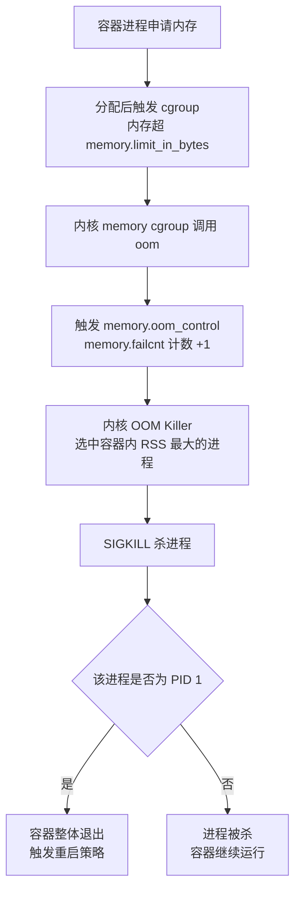
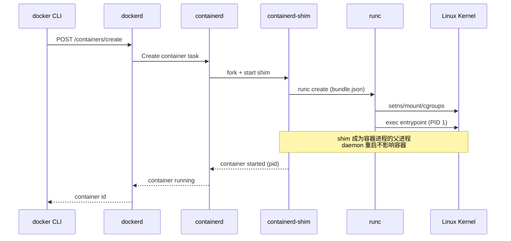
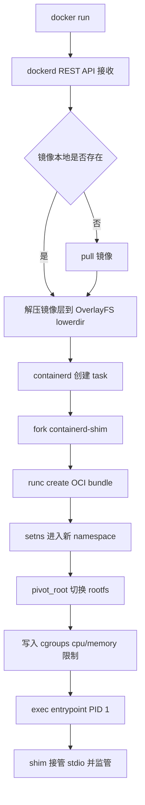

# 容器本质与底层原理

> **一句话定位**：容器本质是受控的进程，namespace/cgroups/unionfs 是三大基石，面试官最爱“讲讲容器原理”的入口题。
> **面试热度**：⭐⭐⭐⭐⭐
> **返回**：[Docker 知识图谱](../README.md)

---

## 一、概念定义

### 1.1 容器 vs 虚拟机

容器和虚拟机都解决“隔离”问题，但隔离层级截然不同：

| 维度 | 虚拟机 (VM) | 容器 (Container) |
|------|------------|-----------------|
| 隔离层级 | 硬件层（CPU/内存/设备虚拟化） | 操作系统层（内核机制） |
| Guest OS | 有，每个 VM 一个完整内核 | 无，共享宿主机内核 |
| 资源开销 | 重（GB 级内存/磁盘） | 轻（MB 级） |
| 启动时间 | 分钟级（Bootloader + 内核初始化） | 秒级（仅进程启动） |
| 安全边界 | 强（Hypervisor 隔离） | 弱（共享内核，逃逸风险） |
| 镜像体积 | GB-TB | MB-百 MB |
| 跨平台能力 | 强（可跑异构 OS） | 弱（Linux 容器只能跑 Linux 程序） |
| 高密度 | 一台宿主几台 VM | 一台宿主数百容器 |
| 网络虚拟 | 虚拟网卡 + 虚拟交换机 | veth pair + bridge/iptables |

**关键差异**：VM 用 Hypervisor（Type 1 如 ESXi、Type 2 如 KVM/VirtualBox）模拟硬件，每台 VM 都要跑一个完整 Guest Kernel；容器则**直接调用宿主机 Linux Kernel 的 namespace + cgroups**，把“一组进程”伪装成“一台独立主机”。这正是容器“轻”的根因——没有开机过程，没有第二个内核。

### 1.2 容器的本质：受控的进程

**一句话**：容器 = 一个被 namespace 隔离视图、被 cgroups 限制资源、被 unionfs 提供独立文件系统视图的**普通 Linux 进程**。

容器内进程在宿主机上同样可见——只是它“看到的”主机名、PID 编号、网卡、挂载点都被改写了。验证方式：

```bash
# 宿主机
$ docker run -d --name demo alpine sleep 3600
$ docker inspect --format '{{.State.Pid}}' demo
12345
$ ps -ef | grep 12345
root  12345 ... sleep 3600

# 容器内
$ docker exec demo sh -c 'echo $$ && ps'
1
# PID 1 是 sleep，但宿主机看是 12345
```

容器进程 PID 1 在宿主机被改写为 12345，正是 PID namespace 的功劳。**容器没有“启动一个新操作系统”，它只是把已有进程的“世界观”改了**。

### 1.3 三大基石

| 基石 | 解决的问题 | 内核机制 | 典型代表 |
|------|-----------|---------|---------|
| Namespace | 隔离视图——让进程看到独立的主机名/PID/网络/挂载 | `clone(CLONE_NEW*)`、`unshare`、`setns` | PID/NET/MNT/IPC/UTS/USER/CGROUP |
| Cgroups | 限制用量——CPU/内存/IO/PID 数都按配额分 | cgroupfs（`/sys/fs/cgroup`） | cpu/memory/blkio/pids |
| UnionFS | 提供分层文件系统——镜像可叠加、写时复制 | OverlayFS（mainline）、AUFS（已弃用） | lowerdir+upperdir+workdir+merged |

> **核心**：namespace 管“能看到什么”，cgroups 管“能用多少”，unionfs 管“文件系统长什么样”。三者**协同**才构成容器。缺一不可：只有 namespace 是沙箱不防 OOM；只有 cgroups 是限额不防窥视；只有 unionfs 是叠加不防逃逸。

---

## 二、原理与流程

### 2.1 Namespace：6+1 个隔离视图

Linux 内核提供 7 个 namespace（前 6 个标准 + 1 个 cgroup）：

| Namespace | 隔离什么 | 内核版本 | 典型命令 | 面试追问点 |
|----------|---------|---------|---------|-----------|
| PID | 进程编号（容器内 PID 1） | 2.6.24 | `unshare --pid` | PID 1 的信号陷阱（SIGTERM 默认不杀 PID 1） |
| NET | 网络栈（网卡/路由/iptables/socket） | 2.6.29 | `ip netns add` | veth pair + bridge 的连线 |
| MNT | 挂载点视图（mount tree） | 2.4.19 | `mount --make-private` | pivot_root vs chroot 的差异 |
| IPC | System V IPC、POSIX 消息队列 | 2.6.19 | `ipcs` | 跨容器 IPC 的隔离 |
| UTS | hostname、domainname | 2.6.19 | `hostname newname` | 主机名与 DNS 解析 |
| USER | UID/GID 映射（容器内 root ↔ 宿主普通用户） | 3.8 | `newuidmap` | userns-remap 的安全性 |
| CGROUP | cgroup 视图（让容器看不到宿主其他 cgroup） | 4.6 | `/sys/fs/cgroup/...` | cgroup v2 统一层级 |

**PID namespace 与进程 1 的关键点**：

- 容器内**第一个进程**默认是 PID 1，承担两个特殊角色：①**孤儿进程的收养者**（其他进程的父进程退出，孤儿会挂到 PID 1 下）；②**信号处理者**——但 PID 1 默认**忽略 SIGTERM**（除非自己 `signal(SIGTERM, handler)` 注册）。
- 这就是 `docker stop` 默认等 10 秒后强杀（`SIGKILL`）的根因：Spring Boot 早期 fat jar 启动后 main 线程是 PID 1，没注册 SIGTERM handler，stop 等于强杀。

**USER namespace 的 UID 映射陷阱**：

- 容器内 `root (uid=0)` 可映射到宿主机的 `uid=100000`，让“提权”后实际是无权限用户——这就是 rootless docker 的核心。
- 但映射文件 `/etc/subuid`、`/etc/subgid` 配置错误会导致文件 owner 错乱、volume 权限拒绝。Docker 的 `userns-remap` 默认对挂载的 volume **不重写 owner**，导致宿主 volume 文件 owner=`1000` 在容器内显示 `nobody`。

### 2.2 Cgroups：资源限制

**Cgroup v1 vs v2 对比**：

| 维度 | cgroup v1 | cgroup v2 |
|------|----------|-----------|
| 层级结构 | 每个 controller 独立层级（多树） | 统一层级（单树） |
| 进程归属 | 一个进程可挂多个 cgroup | 一个进程只挂一个 |
| 控制器可用 | cpu/cpuacct/memory/blkio/pids/net_cls/... | 统一管理（部分 controller 后合并） |
| 进程内接口 | `/proc/<pid>/cgroup` 列出多行 | `/proc/<pid>/cgroup` 列出 `0::/path` |
| Docker 默认 | 早期默认 | 20.10+ 可用 `--cgroup-version` |
| systemd 集成 | 不友好（需 Unit 切片） | 原生 `Delegate=yes` |
| Java 影响 | 老版本 JDK 能读 | JDK 8u191+ / 11+ 才识别 v2 |

**资源子系统速览**：

| 子系统 | 文件路径（v1） | 关键参数 |
|--------|---------------|---------|
| cpu | `/sys/fs/cgroup/cpu/.../cpu.cfs_quota_us` | 配额（100000=100ms/period，-1=不限制） |
| cpuacct | `/sys/fs/cgroup/cpuacct/.../cpuacct.usage` | 统计用量 |
| memory | `/sys/fs/cgroup/memory/.../memory.limit_in_bytes` | 内存上限 |
| blkio | `/sys/fs/cgroup/blkio/.../blkio.throttle.read_bps_device` | 块设备 IO 限速 |
| pids | `/sys/fs/cgroup/pids/.../pids.max` | 进程数上限（防 fork bomb） |

**docker run 参数与 cgroup 文件映射**：

```bash
docker run -d \
  --cpus=2 \              # cpu.cfs_quota_us=200000
  --memory=2g \           # memory.limit_in_bytes=2147483648
  --memory-swap=2g \      # memory.memsw.limit_in_bytes（无 swap）
  --memory-reservation=1g \ # memory.soft_limit_in_bytes
  --oom-kill-disable \    # memory.oom_control.disable=1（慎用）
  --pids-limit=200 \      # pids.max=200
  --device-read-bps /dev/sda:10mb \ # blkio.throttle.read_bps_device
  myimage
```

**OOM Killer 触发链（高频追问）**：



> **关键文件**：`memory.failcnt` 记录触发次数；`memory.events`（v2）含 `oom`、`oom_kill` 计数；`dmesg` 可看 `oom-kill: ...`。

### 2.3 UnionFS / OverlayFS

OverlayFS 是 Linux mainline 的联合挂载文件系统（4.0+ 进入主线），替代 AUFS（Docker 早期默认）。

**四层结构**：

```
┌─────────────────────────────────────────┐
│  merged（容器内看到的统一视图）         │
├─────────────────────────────────────────┤
│  upperdir（可写层，容器修改写在这里）   │
├─────────────────────────────────────────┤
│  lowerdir N（只读，镜像 N-1 层叠加）    │  ← 镜像层数叠加
├─────────────────────────────────────────┤
│  workdir（OverlayFS 内部工作目录）     │
└─────────────────────────────────────────┘

mount -t overlay overlay \
  -o lowerdir=/lower1:/lower2,upperdir=/upper,workdir=/work \
  /merged
```

**写时复制（Copy-On-Write, CoW）原理**：

- 容器**读**文件：从 merged 目录读，按层级向上找（upperdir 优先），第一次命中即返回，未改的文件不占 upperdir。
- 容器**写**文件：①该文件不在 upperdir → 从 lowerdir 复制到 upperdir 后修改；②已在 upperdir → 直接改。复制是 **file-level**（整个文件复制），不是 block-level。
- **删除**：在 upperdir 创建 whiteout 文件（character device 0/0），遮蔽 lowerdir 同名文件。
- **修改文件属性**：upperdir 同样需要 CoW，所以大镜像层 + 小修改仍占空间。

**为什么 OverlayFS 替代 AUFS**：

| 维度 | AUFS | OverlayFS |
|------|------|-----------|
| Mainline | 不在主线（Ubuntu 私有） | 4.0+ 进入主线 |
| 性能 | 慢（多层查找 O(n)） | 快（VFS cache） |
| Docker 默认 | 早期 | 18.06+ 默认 |
| 维护 | 已弃用 | 持续维护 |
| 层数限制 | 127 层 | 无硬限制 |

### 2.4 OCI 标准

OCI（Open Container Initiative）由 Docker/CoreOS 等于 2015 年发起，规范容器格式与运行时：

| 规范 | 内容 | 典型实现 |
|------|------|---------|
| OCI Image Spec | manifest（清单）/ config（配置）/ layer（层） | docker push 的产物 |
| OCI Runtime Spec | config.json + rootfs（bundle） | runc/crun/kata |
| OCI Distribution Spec | Registry 接口（push/pull/manifest） | Docker Hub/Harbor/registry |

**runc 的地位**：OCI Runtime Spec 的**参考实现**，由 Docker 公司捐赠给 OCI。它的输入是 OCI bundle（`config.json` + `rootfs`），输出是按 spec 创建的容器进程。`docker`、`containerd`、`podman`、`CRI-O` 都**调用 runc** 或兼容实现（crun、kata-runtime）创建容器。

> **要记住的链**：Image Spec → Runtime Spec → runc。镜像解压成 bundle，bundle 喂给 runc，runc 调内核 syscall 把容器跑起来。

### 2.5 Docker 架构与运行时调用链

**四层组件**：

| 组件 | 职责 | 进程 |
|------|------|------|
| dockerd | Docker Daemon，对外 REST API、镜像构建、卷管理 | `/usr/bin/dockerd` |
| containerd | 高级运行时，容器生命周期、镜像 pull、存储管理 | `containerd` |
| containerd-shim | 容器父进程，监管容器，与 daemon 解耦 | `containerd-shim <id>` |
| runc | OCI Runtime 实现，创建/启动/停止容器进程 | `runc` |

**为什么需要 shim**：早期 Docker 把容器父进程挂在 dockerd 下，daemon 重启会 SIGHUP 所有容器 → 体验差。引入 shim 后，**容器的父进程是 shim 而非 dockerd**——daemon 重启或升级时容器继续运行。shim 还负责：① 收集容器 exit code；② 接管容器的 stdin/stdout/log pipe；③ 给 runc 提供 exec 调用入口。

**调用链时序图**：



### 2.6 容器创建全流程

从 `docker run` 到 entrypoint 执行的端到端流程：



**关键步骤解读**：

1. **API 接收**：docker CLI → dockerd REST `/containers/create` + `/containers/{id}/start`。
2. **镜像准备**：若本地无镜像，pull 后逐层解压，按 `lowerdir1:lowerdir2:...` 顺序挂载到 OverlayFS。
3. **bundle 构造**：containerd 用镜像 config + 用户参数生成 `config.json`（OCI Runtime Spec），准备 `rootfs`。
4. **shim fork**：containerd 调 shim 启动一个新的 `containerd-shim <container-id>` 进程。
5. **runc create**：shim 调用 `runc create`，runc 根据 config.json 设置：① `clone()` 系统调用创建带 namespace 的子进程；② `pivot_root()` 切换 rootfs；③ 挂载 `/proc`、`/dev` 等；④ 写入 cgroup 文件限制资源。
6. **runc start**：runc 在已设置的 namespace 中 `exec` entrypoint（如 `java -jar app.jar`），该进程成为容器 PID 1。
7. **shim 监管**：runc 退出后，shim 作为容器进程的父进程（`ps -ef` 看 PPID 是 shim），接管 stdin/stdout、上报 exit code 给 containerd。

> **要点**：runc 只在**创建与启动阶段**短暂运行，启动后退出。长期运行的是 shim + 容器进程。

---

## 三、高频追问与面试题

### Q1：容器和虚拟机能同时跑吗？（嵌套虚拟化 + 云原生场景）

**参考答案**：可以，且在生产中常见。两种典型场景：

- **嵌套虚拟化**：物理机装 Hypervisor（如 ESXi/KVM），VM 内再装 Docker——云上 ECS 跑容器是典型。Intel VT-x 支持 `-enable-nested` 后 KVM 客户机内可再开 Hypervisor。性能损失约 10-30%。
- **VM + 容器混合部署**：一台物理机跑几个 VM 隔离不同租户/安全域，VM 内跑几十个容器做应用部署。这是企业上云常见形态。
- **Kubernetes on VM**：GKE/EKS 早期节点是 VM，VM 内跑 kubelet + 容器。Pod 抽象在 VM 之上。

**云原生趋势**：裸金属 + 容器（如 AWS Fargate、阿里云 ACK 等）省去 VM 一层，但牺牲多租户强隔离。对安全要求高的金融场景仍用 VM 隔离 + 容器部署。

**关联**：[容器安全](../07-security/docker-security.md) §1 多租户隔离模型。

### Q2：为什么容器是“进程级”隔离？安全吗？（逃逸案例：dirty COW、runc CVE-2019-5736）

**参考答案**：容器共享宿主机内核，“进程级隔离”意味着**隔离只到内核视图层，不到硬件层**。一旦内核有漏洞，容器内 root 可逃逸到宿主机。

**典型逃逸案例**：

| CVE | 漏洞机制 | 逃逸路径 |
|-----|---------|---------|
| Dirty COW (CVE-2016-5195) | 内核竞态条件只读内存可写 | 容器内写 `/etc/passwd` 突破 |
| CVE-2019-5736 | runc 二进制可被容器内进程覆写 | 容器内重新打开 `/proc/self/exe` 写入恶意 runc，宿主再 `docker exec` 时执行恶意 runc |
| CVE-2022-0185 | 文件系统 context 逃逸 | `CAP_SYS_ADMIN` + 大量 mount 触发 |
| CVE-2024-21626 | runc 文件描述符泄露 | 容器内通过泄露的 fd 操纵宿主文件 |

**缓解措施**：① 跑非 root 容器（`USER nobody`）；② 启用 `userns-remap` 让容器 root 映射为宿主普通用户；③ 用 rootless docker / Podman；④ 用 `--security-opt no-new-privileges`、最小 capabilities；⑤ 高安全场景用 Kata Containers（VM 级隔离的容器）。

**关联**：[容器安全](../07-security/docker-security.md) §2 capabilities/seccomp、§3 user namespace remap。

### Q3：Docker 进程死了，容器会死吗？（shim 设计）

**参考答案**：**默认不会**，这正是 containerd-shim 设计的核心目的。

**shim 设计**：

- 容器进程的**父进程是 containerd-shim**，不是 dockerd。
- containerd 与 shim 之间用 ttrpc 通信，shim 持有容器的 stdio pipe 和 exit code 通道。
- dockerd 重启 → 只断开 dockerd 与 containerd 的连接 → containerd 通知所有 shim 重新建立连接 → 容器继续运行。
- containerd 重启 → shim 仍在运行（shim 是独立进程）→ containerd 启动后扫描所有 shim socket 重新接管。

**例外情况**：

- `docker run --restart=no`：daemon 停了容器不重启。
- `live-restore` 默认开启（17.09+），daemon 重启容器继续跑。
- 强杀 containerd（`kill -9`）会导致 shim 监管中断，但容器进程可能仍在运行（成为孤儿）。

**验证**：

```bash
docker run -d --name demo alpine sleep 3600
systemctl restart docker
docker ps  # demo 仍在运行
```

**关联**：[容器运行时与生命周期](../03-container/container-runtime.md) §3 重启策略与 live-restore。

### Q4：cgroup v1 和 v2 的区别对 Java 有什么影响？（部分 JDK 老版本读 v2 失败导致内存限制失效）

**参考答案**：核心影响在 **JVM 容器感知**——JDK 通过读 `/sys/fs/cgroup/memory/.../memory.limit_in_bytes`（v1）或 `/sys/fs/cgroup/.../memory.max`（v2）探测容器内存上限，用其推算堆大小。

**问题**：

- **JDK 8u131 之前**：完全无容器感知，`Runtime.getRuntime().maxMemory()` 返回宿主机物理内存，容器 OOM 时 JVM 仍按宿主机内存分配。
- **JDK 8u131-8u191**：开启 `-XX:+UseContainerSupport`（8u191 默认开启），通过 `cgroup v1` 路径读 `memory.limit_in_bytes`，但**不支持 cgroup v2**——如果系统是 cgroup v2（如 RHEL 9、Ubuntu 22.04 默认），JVM 仍读不到限制，退化为宿主机内存。
- **JDK 11+ / 8u191+ 后续补丁**：补丁 JDK-8227078 等加入 cgroup v2 探测路径，能识别 `memory.max`、`memory.high`、`cpu.max`。
- **JDK 10 引入容器感知**：JDK 8 反向移植到 8u191。

**实战陷阱**：使用 RHEL 9 + JDK 8u191（恰好处在 v2 支持的临界版本）时，若没有打全补丁，会出现 `Xmx` 看起来生效但 Native 内存（Metaspace/Direct Buffer/Stack）超出 cgroup 限制触发 OOM Killer 杀 JVM 而非抛 OutOfMemoryError。

**验证**：

```bash
java -XX:+UseContainerSupport -XX:+PrintContainerInfo -version
# 输出 cgroup 路径与读到的 limit
```

**关联**：[Java 容器调优](../08-performance/java-container-tuning.md) §1 JVM 容器感知源码路径。`java-core/jvm` 模块目前聚焦类加载与类初始化，未覆盖 container 源码实例——本节在文档层引用 HotSpot 上游源码路径（`os::Linux::container`），作为面试时引用源码出处的口径，不依赖仓库内 Java 文件。

### Q5：OverlayFS 与 bind mount 的差异？为什么 volume 比 bind mount 更安全？

**参考答案**：

| 维度 | OverlayFS | bind mount | volume |
|------|-----------|-----------|--------|
| 跨文件系统 | 多层叠加 | 单一路径映射 | Docker 管理 |
| 写时复制 | 有（CoW） | 无 | 无 |
| 文件 owner | 容器内 root 拥有 | 保留宿主 owner | Docker daemon 管理 |
| 权限隔离 | 容器内 | 容器内 root 直接改宿主文件 | 用 `--user` 时仍需注意 |
| 备份迁移 | 镜像分层 | 宿主路径强绑定 | `docker volume` 命令统一管理 |
| 跨主机 | 镜像 push | 不支持 | 支持 volume driver（NFS/云盘） |

**bind mount 的安全风险**：

- `docker run -v /etc:/etc alpine`：容器内 root 可覆写宿主 `/etc/passwd`，**直接逃逸**——只要文件可写。
- 容器内进程 UID 与宿主 UID 同名映射（默认不开 userns-remap），`root (uid=0)` 就是宿主 root，改宿主文件 = 改宿主系统。

**volume 更安全的原因**：

- volume 由 Docker daemon 在 `/var/lib/docker/volumes/` 下创建，路径与宿主系统隔离。
- 不暴露宿主任意路径，容器只能访问指定 volume。
- 配合 `userns-remap` 后，容器内 root 在宿主是 uid=100000，volume 文件 owner 也是 100000，权限边界一致。
- 支持只读挂载 `docker run -v myvol:/data:ro`。

**何时仍用 bind mount**：开发期挂载源码到容器做热重载（`-v ./src:/app/src`），但**绝不要在生产用 bind mount 挂敏感路径**（`/etc`、`/var/run/docker.sock` 等）。

**关联**：[Docker 存储模型](../05-storage/docker-storage.md) §1 OverlayFS、§2 volume 与 bind mount。

### Q6：Docker 镜像的层是怎么存储的？为什么一个 100MB 镜像容器跑起来只占几 MB？

**参考答案**：镜像层存储依赖 UnionFS（Docker 默认 OverlayFS）。每条 Dockerfile 指令（`FROM/RUN/COPY/ADD`）产生一层，每层是一个独立的目录（在 `/var/lib/docker/overlay2/<hash>/diff/` 下）。

**容器启动时**：

1. 把镜像的所有 lowerdir 按 hash 链叠加（`lowerdir=l1:l2:l3...`）。
2. 创建容器专属的 upperdir 与 workdir。
3. mount 成 merged，作为容器 rootfs。
4. 容器修改只写 upperdir，lowerdir 只读共享。

**100MB 镜像只占几 MB 的原因**：

- 多个容器共用同一组 lowerdir——同一镜像启动 100 个容器只读层**只占一份**。
- upperdir 在容器退出后删除（除非 commit 成新镜像）。
- 不同镜像共享 base 层（如都 FROM openjdk:8），共用同一份 `/var/lib/docker/overlay2/<hash>/`。

**陷阱**：容器内 `rm` 一个镜像内的大文件，并不会真正释放空间——只是 upperdir 加了 whiteout 遮蔽了 lowerdir，**lowerdir 的原文件仍在**。要让镜像变小要在构建期删除，且最好**同一层 ADD + rm**（否则前层还有该文件）。

**关联**：[镜像构建与分发](../02-image/dockerfile-and-image.md) §3 镜像分层与瘦身。

### Q7：为什么容器 PID 1 收不到 SIGTERM？

**参考答案**：两个根因：

- **PID 1 默认忽略 SIGTERM**：Linux 内核对 PID 1 有特殊保护——任何**未被注册 handler 的信号**对 PID 1 默认忽略，防止误杀 init 导致系统崩溃。容器继承了这一保护。
- **Bash 镜像的 trap 陷阱**：`CMD ["sh", "-c", "java -jar app.jar"]` 会让 `sh` 成为 PID 1，而 `sh` 默认不转发信号给子进程，导致 `java` 收不到 SIGTERM，`docker stop` 10 秒后强杀。

**解决方案**：

1. **直接 exec 启动**：Dockerfile 用 `ENTRYPOINT ["java", "-jar", "app.jar"]`（exec 形式），让 java 直接成为 PID 1。
2. **Spring Boot 优雅关闭**：Spring Boot 2.3+ 内建 graceful shutdown，注册 SIGTERM handler。
3. **使用 init 进程**：`docker run --init`（推荐），在容器内注入 `tini`（init 实现）作为 PID 1，tini 转发信号给应用并回收僵尸进程。
4. **dumb-init**：早期常用方案，原理同 tini。

**关联**：[容器运行时与生命周期](../03-container/container-runtime.md) §2 PID 1 与信号机制、`framework/spring-framework` 的 ContextClosedEvent 与 shutdown hook。

---

## 四、实战关联（Java 后端视角）

### 4.1 JVM 容器感知

Spring Boot 应用打包为镜像后，JVM 看到的“CPU 数”和“内存上限”会被 namespace/cgroups 改写：

**默认探测路径**（JDK 8u191+ / 11+）：

```java
// 对应 HotSpot 上游源码 os::Linux::container 的简化伪代码（仓库内无此文件）
class HotspotContainer {  // 伪代码示意，非仓库实际类
    boolean isContainerized() {
        // 1. 检查 /proc/self/cgroup 是否含 memory 子系统
        // 2. 读 /sys/fs/cgroup/memory/memory.limit_in_bytes（v1）
        //    或 /sys/fs/cgroup/memory.max（v2）
    }
    long memoryLimitInBytes() {
        // v1: 读 memory.limit_in_bytes
        // v2: 读 memory.max
        // 兼容 systemd scope 路径
    }
    int activeProcessorCount() {
        // 读 cpu.cfs_quota_us / cpu.cfs_period_us
        // 推算: quota / period, 若 quota=-1 用宿主 CPU 数
    }
}
```

**典型坑**：

| 场景 | 现象 | 根因 |
|------|------|------|
| JDK 8u131- 跑容器 | JVM 用宿主机内存，OOM Killer 杀 JVM | 无容器感知 |
| JDK 8u191 + cgroup v2 | JVM 读不到 limit | 老 patch 不支持 v2 |
| `--cpus=2` 但 JVM 看见 8 核 | GC 线程数按 8 核起 | cpu cgroup 解析失败 |
| Native 内存超 cgroup | JVM 不抛 OOM 被 SIGKILL | Native 不计入堆限制 |

**推荐 JVM 参数**（容器内 Spring Boot）：

```bash
java \
  -XX:+UseContainerSupport \           # 8u191+ 默认开
  -XX:MaxRAMPercentage=75.0 \          # 堆占容器内存 75%（默认 25%，太保守）
  -XX:InitialRAMPercentage=50.0 \      # 初始堆
  -XX:MinRAMPercentage=25.0 \          # 小容器下限
  -XX:ActiveProcessorCount=2 \         # 显式指定 CPU 数（防探测失败）
  -XX:+UseG1GC \                       # 容器友好的 GC
  -XX:MaxGCPauseMillis=200 \
  -jar app.jar
```

**关联 `java-core/jvm` 模块**：该模块目前聚焦类加载（`com.yintp.jvm.classload.ClassLoadTest`）与类初始化（`com.yintp.jvm.classinit.ClassInitTest1~9`），未覆盖 GC 与 container 源码实例——本节在文档层引用 HotSpot 上游源码路径（`os::Linux::container`），作为面试时引用源码出处的口径，不依赖仓库内 Java 文件。对照理解 [Java 容器调优](../08-performance/java-container-tuning.md) §1.2 推导链。

### 4.2 Spring Boot PID 1 与优雅关闭

**默认 PID 1 的陷阱**：

Spring Boot fat jar 用 `org.springframework.boot.loader.JarLauncher` 启动，main 方法里 `SpringApplication.run()`。**在容器内**：

- 若 Dockerfile 用 `CMD java -jar app.jar`（shell 形式），`/bin/sh -c 'java -jar app.jar'` 让 **sh 成为 PID 1**，sh 不转发信号。
- 若用 `ENTRYPOINT ["java","-jar","app.jar"]`（exec 形式），**java 成为 PID 1**，但需注册 SIGTERM handler 才能优雅关闭。

**Spring Boot 2.3+ 内建优雅关闭**：

```yaml
server:
  shutdown: graceful            # 开启优雅停机
spring:
  lifecycle:
    timeout-per-shutdown-phase: 30s   # 等待最多 30s
```

- `docker stop` 发 SIGTERM → JVM 收到 → Spring 发 `ContextClosedEvent` → 关闭所有 bean → 等 actuator 健康检查返回 DOWN → 30s 内退出。
- 若 30s 没退完，docker 发 `SIGKILL` 强杀。

**用 init 进程兜底**：

```dockerfile
# Dockerfile
ENTRYPOINT ["java","-jar","app.jar"]
```

```bash
docker run --init myapp
# --init 注入 tini 作为 PID 1，java 成为 PID 2
# tini 转发 SIGTERM 给子进程，并回收僵尸进程
```

**关联 `framework/spring-framework` 模块**：该模块有 `ContextClosedEvent` 与 `@PreDestroy` 的执行顺序实例，对照理解 Spring 容器内 shutdown hook 的链路。

### 4.3 Java 进程与 cgroup 的交互验证

```bash
# 1. 跑一个限制内存 512MB 的 Spring Boot 容器
docker run -d --name app -m 512m myapp:latest

# 2. 进容器看 JVM 看到的内存
docker exec app jcmd 1 VM.flags | grep -i heap
docker exec app jcmd 1 VM.system_properties | grep container

# 3. 看 cgroup 文件
docker exec app cat /proc/self/cgroup
# v1 输出: 8:memory:/docker/<container-id>
# v2 输出: 0::/docker/<container-id>

# 4. 宿主机看 cgroup 限制
cat /sys/fs/cgroup/memory/docker/<container-id>/memory.limit_in_bytes
# 536870912  (= 512 * 1024 * 1024)

# 5. 模拟超内存
docker exec app java -Xmx1024m -cp . OOMDemo
# OOM Killer 触发: dmesg | grep -i "killed process"
```

> **关键认知**：JVM 的 `-Xmx` 只是堆限制，**不防 Native 内存超 cgroup**。Metaspace、Direct Buffer、Thread Stack、JIT Code Cache 都在堆外，需用 `MaxDirectMemorySize`、`CompressedClassSpaceSize`、`ThreadStackSize` 显式预算。详见 [Java 容器调优](../08-performance/java-container-tuning.md) §2 堆外内存预算。

---

## 五、面试案例

### 5.1 “讲讲你对 Docker 容器原理的理解”——3 分钟标准答法

**3 分钟结构**（约 600-700 字口述）：

> 容器本质是一个**受控的 Linux 进程**，与虚拟机的差异在隔离层级——VM 虚拟硬件跑完整 Guest OS，容器共享宿主机内核，用内核三大机制实现隔离：
>
> 1. **namespace** 隔离“视图”：PID/NET/MNT/IPC/UTS/USER/CGROUP 七个 namespace 让容器内进程看到独立的主机名、PID 编号、网卡、挂载点，但宿主机上其实就是一个普通进程。
> 2. **cgroups** 限制“用量”：cpu/memory/blkio/pids 等子系统让容器按配额使用资源，超内存触发 OOM Killer。
> 3. **unionfs** 提供“分层文件系统”：OverlayFS 把镜像多层叠加 + 容器可写层，写时复制。
>
> 在此之上是**标准化调用链**：OCI 标准（Image Spec + Runtime Spec + Distribution Spec）让镜像格式与运行时解耦，dockerd 把镜像解压成 OCI bundle，调 containerd 创建 task，containerd fork containerd-shim 作为容器父进程，shim 再调 runc 创建 namespace、设置 cgroups、mount rootfs，最后 exec entrypoint 成为容器 PID 1。
>
> 与 VM 相比，容器**没有开机过程、没有第二个内核**，启动只需秒级，密度可达一台宿主数百个。代价是**安全边界弱**——共享内核意味着内核漏洞会引发逃逸（如 CVE-2019-5736），高安全场景需用 Kata Containers（VM 级隔离）或 rootless docker。

**结构要点**：本质（受控进程）→ 三大机制（namespace/cgroups/unionfs）→ OCI 标准 → 调用链（dockerd/containerd/shim/runc）→ 与 VM 的差异（含安全边界）。

### 5.2 “Docker daemon 重启，容器会不会死？”——shim 设计追问链

**追问链**：

| 追问 | 标准答法 |
|------|---------|
| Q：Docker daemon 重启容器会死吗？ | 默认不会，容器父进程是 containerd-shim 不是 dockerd，daemon 重启只重建与 shim 的连接 |
| Q：那为什么早期 Docker 重启会死？ | 早期 dockerd 直接当容器父进程，daemon 重启会 SIGHUP 所有子进程；17.09+ 引入 shim + live-restore 解决 |
| Q：containerd 重启呢？ | shim 仍活着（独立进程），containerd 启动后扫描 shim socket 重新接管 |
| Q：强杀 containerd 呢？ | shim 可能挂掉，容器进程变孤儿（PPID=1），仍运行但失去监管，需要手动清理 |
| Q：shim 挂了会怎样？ | 容器进程变孤儿，没人收 exit code、没人管 stdio。containerd 检测到 shim 退出会标记容器为 exited |
| Q：那这个设计有什么代价？ | 多一层进程开销，每个容器一个 shim（~5MB）；好处是解耦与稳定性，K8s 后来也采用类似 CRI shim 设计 |

**底层机制关键词**：parent process（父进程） / live-restore / ttrpc / orphan reaping / CRI shim。

**延伸**：该设计影响了 K8s 的 CRI 接口——kubelet 不直接调 runc，而是通过 CRI shim（如 containerd 的 CRI plugin 或 CRI-O）间接管理，与 Docker 的 shim 思路一致：**长期运行容器进程与短期管理进程解耦**。

---

## 六、参考与延伸

- **标准与规范**：OCI Image Spec、OCI Runtime Spec、OCI Distribution Spec（opencontainers.org）
- **内核文档**：`Documentation/admin-guide/cgroup-v1.rst`、`cgroup-v2.rst`、`Documentation/filesystems/overlayfs.rst`
- **man 手册**：`namespaces(7)`、`cgroups(7)`、`clone(2)`、`unshare(2)`、`pivot_root(2)`
- **延伸阅读**：
  - [镜像构建与分发](../02-image/dockerfile-and-image.md)——Dockerfile 指令、镜像分层
  - [容器运行时与生命周期](../03-container/container-runtime.md)——生命周期、重启策略
  - [Docker 存储模型](../05-storage/docker-storage.md)——OverlayFS、volume
  - [Docker 安全模型](../07-security/docker-security.md)——capabilities、userns-remap
  - [Java 容器调优](../08-performance/java-container-tuning.md)——JVM 感知、堆外预算
- **仓库内关联**：
  - `java-core/jvm`——类加载与类初始化实例（容器感知见 [Java 容器调优](../08-performance/java-container-tuning.md) §1 引用的 HotSpot 上游源码路径）
  - `framework/spring-framework`——`ContextClosedEvent`、shutdown hook、优雅关闭
  - [TCP 连接管理](../../network/02-transport/tcp-connection.md)——容器网络底层 veth + iptables 的 TCP 视角

> **返回**：[Docker 知识图谱](../README.md)
