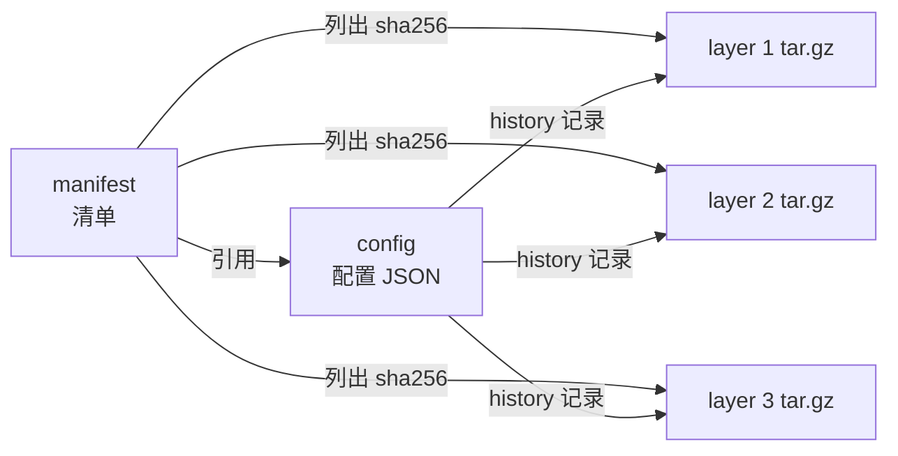
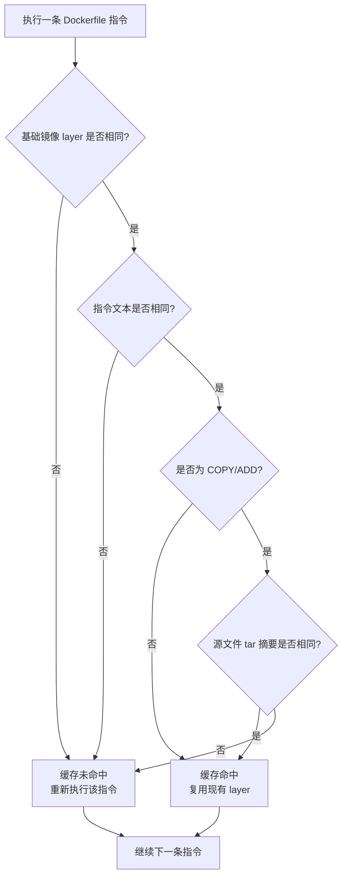
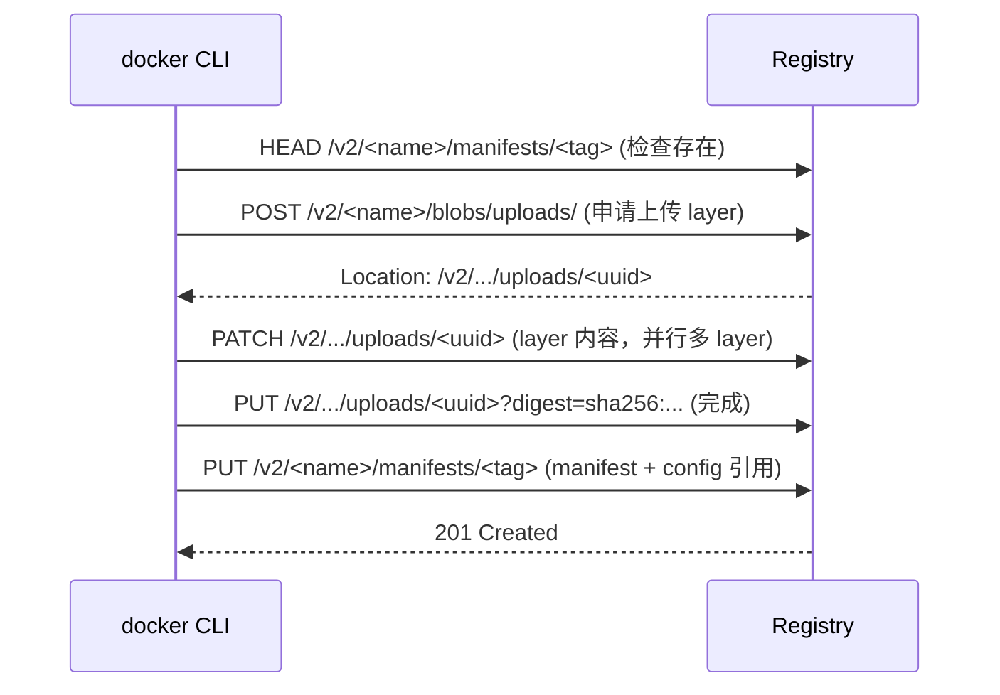
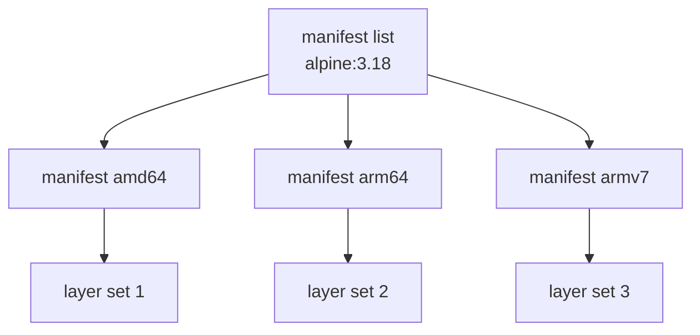

# 镜像构建与分发

> **一句话定位**：镜像本质是分层只读文件系统快照，Dockerfile 指令与构建缓存是面试高频起手题。
> **面试热度**：⭐⭐⭐⭐⭐
> **返回**：[Docker 知识图谱](../README.md)

---

## 一、概念定义

### 1.1 镜像的本质：分层只读文件系统快照

**一句话**：镜像 = 一组按序叠加的**只读层（layer）** + 一份**元数据（config）**，通过 UnionFS 叠加成一份"文件系统快照"。

镜像不是"一个文件"，而是 **"层 + 元数据"的组合**：

- 每条 Dockerfile 指令（`FROM`/`RUN`/`COPY` 等）产生一个 layer；
- 每个 layer 是一个 tar 包，记录相对上一层的文件变更；
- 所有 layer 叠加 + 一份 config（含 ENTRYPOINT/CMD/ENV 等）= 一个完整镜像。

这与 [容器本质](../01-foundation/container-principle.md) §2.3 OverlayFS 的 `lowerdir` 叠加直接对应——**镜像就是容器 rootfs 的 lowerdir 来源**。

### 1.2 三大核心概念关系

| 概念 | 角色 | 类比 |
|------|------|------|
| image（镜像） | 模板，只读分层文件系统快照 | 面向对象里的"类" |
| container（容器） | 运行实例，镜像 + 可写层 | 面向对象里的"对象" |
| registry（仓库） | 分发仓库，存储与拉取镜像 | Maven Central / npm registry |

三者关系链：

```
[Dockerfile] --build--> [image] --push--> [registry]
                              ^                  |
                              | pull             |
                              |                  v
                          [本地 image] --run--> [container]
                              ^                     |
                              | commit              |
                              +---------------------+
```

- `docker build` 把 Dockerfile + context 产出一个本地 image。
- `docker push` 把 image 传到 registry；`docker pull` 反向。
- `docker run <image>` 把 image 解压成 rootfs + 加可写层 = container。
- `docker commit <container>` 反向把容器可写层固化成新 image（不推荐，应改 Dockerfile）。

### 1.3 镜像内部结构（OCI Image Spec）

一个镜像在 registry 上由三部分组成，对应 **OCI Image Spec**：

| 组成 | 内容 | 作用 |
|------|------|------|
| manifest（清单） | layer 的 sha256 列表 + config 引用 | 拉取镜像的"目录"，决定要下载哪些层 |
| config（配置） | ENTRYPOINT/CMD/ENV/USER/HISTORY 等 | 容器运行时元数据 + 每层构建历史 |
| layer（层） | tar.gz 文件变更包 | 实际文件系统内容 |

三者关系：



**`docker inspect <image>`** 看到的就是 config 的展开——`Config.Cmd`、`Config.Env`、`Config.Entrypoint`、`History[]`（每条对应一层 + 创建时间 + 指令文本）。

### 1.4 层 layer 的本质

每个 layer 是一个 **tar.gz**，记录相对上层的文件变更（add/modify/delete）：

| 变更类型 | layer 内的表现 |
|---------|---------------|
| add（新增） | tar 包内新增文件 |
| modify（修改） | tar 包内同名文件覆盖（在叠加时上层覆盖下层） |
| delete（删除） | 创建 **whiteout 文件**（character device 0/0 或 `.wh.<filename>`），遮蔽下层同名文件 |

**whiteout 的关键陷阱**（高频追问）：在中间层删一个文件，**下层该文件仍在 tar 包里**——只是被遮蔽。要让镜像真正变小，必须**在产生该文件的同一层删除**，或用多阶段构建从干净基础镜像拷贝。

验证镜像分层：

```bash
# 拉一个镜像看 manifest
docker pull alpine:3.18
docker inspect alpine:3.18 | grep -A 20 '"RootFS"'
# "Layers": [
#     "sha256:8d3ac348...:L"
# ]
# 单层镜像

# 看历史（每条指令一层）
docker history alpine:3.18
# IMAGE          CREATED       CREATED BY   SIZE
# <missing>      2 months ago  /bin/sh -c…  7.34MB
```

> **要点**：镜像不是"一个文件"，而是 **manifest + config + N 个 layer tar.gz** 的组合；层叠加顺序由 manifest 与 history 共同决定。

---

## 二、原理与流程

### 2.1 Dockerfile 指令全解

按使用频率与面试考查密度分组：

#### 基础类

| 指令 | 作用 | 高频考点 |
|------|------|---------|
| `FROM` | 指定基础镜像（每条 FROM 开启一个新构建阶段） | `FROM --platform=linux/amd64`、`FROM x AS builder` 多阶段 |
| `ARG` | 构建期变量（仅在 build 阶段可见，不进运行时环境） | 与 ENV 的区别：ARG 不进 `docker run` 环境；多阶段 ARG 默认不跨阶段，需 `FROM stage2` 后重新声明 |
| `LABEL` | 镜像元数据键值对（替代已弃用的 MAINTAINER） | `LABEL org.opencontainers.image.source=...` OCI 规范标签 |

#### 执行类（最核心，面试高频）

| 指令 | 作用 | 形式 |
|------|------|------|
| `RUN` | 构建期执行命令，产生新 layer | shell 形式：`RUN apt-get install -y vim` → `/bin/sh -c "..."`；exec 形式：`RUN ["apt-get", "install", "-y", "vim"]` 直接 exec 无 shell |
| `CMD` | 容器启动默认命令（可被 `docker run <args>` 覆盖） | exec 形式 `["cmd","arg"]` 推荐；shell 形式 `cmd arg` 实际包成 `/bin/sh -c "cmd arg"` |
| `ENTRYPOINT` | 容器启动固定命令（不易被覆盖） | exec 形式推荐；shell 形式会忽略 CMD 的参数 |

**RUN 两种形式的差异**：

- shell 形式：`RUN apt-get update` → 实际执行 `/bin/sh -c "apt-get update"`，有 shell 可用变量替换（`$HOME`）、管道（`|`）、重定向（`>`）。
- exec 形式：`RUN ["apt-get", "update"]` → 直接 exec，**没有 shell**，`~`、`$VAR`、`|` 都不会展开。

**易错点**：`RUN ["echo", "$HOME"]` 输出字面 `$HOME`，不会展开变量。需要 shell 时用 `RUN ["sh", "-c", "echo $HOME"]`。

#### CMD vs ENTRYPOINT 组合矩阵（面试必背）

| 形式 | ENTRYPOINT | CMD | 实际执行 | 说明 |
|------|-----------|-----|---------|------|
| 都有（exec 形式）| `["ep"]` | `["arg"]` | `ep arg` | CMD 作为 ENTRYPOINT 的参数，最常用 |
| 都有（shell 形式 ENTRYPOINT）| `"ep"` | `["arg"]` | `/bin/sh -c "ep"`，**CMD 的 arg 不传递** | shell 形式 ENTRYPOINT 会忽略 CMD，是常见坑 |
| 只 ENTRYPOINT | `["ep"]` | 无 | `ep` | |
| 只 CMD | 无 | `["cmd"]` | `cmd` | 大部分官方镜像的默认 |
| 都无 | 无 | 无 | 报错 | 启动失败 |

**覆盖规则**：

- `docker run <image> <args>` 中的 `<args>` 会**覆盖 CMD**，但**追加到 ENTRYPOINT**（除非用 `--entrypoint` 显式覆盖）。
- `docker run --entrypoint <ep> <image>` 会覆盖 ENTRYPOINT。

**推荐组合**：服务类镜像用 `ENTRYPOINT ["app"]` + `CMD ["--default-arg"]`——既固定启动进程，又允许默认参数被覆盖。Spring Boot 推荐 `ENTRYPOINT ["java","-jar","/app/app.jar"]`。

#### 文件类

| 指令 | 作用 | 高频考点 |
|------|------|---------|
| `COPY` | 复制文件/目录到镜像 | 推荐用 COPY；源必须在构建上下文内 |
| `ADD` | 复制 + 自动解压 tar / 支持远程 URL | **不推荐**：远程 URL 不可缓存、解压行为不直观；只在需自动解压时用 |
| `WORKDIR` | 设置工作目录（不存在会创建） | 后续指令的相对路径基于此；推荐用绝对路径 |
| `VOLUME` | 声明匿名卷挂载点 | 仅声明，运行时若不 `-v` 会创建匿名卷；与 `-v` 的优先级 |

**COPY vs ADD 该用哪个**（高频追问）：官方文档明确**推荐 COPY**，因为 COPY 行为直观；ADD 的两个特性（自动解压 tar、远程 URL）都是双刃剑：

- 自动解压：`ADD x.tar.gz /opt/` 解压到 `/opt/`，但若只想复制 tar 本身会踩坑。
- 远程 URL：`ADD https://... /file` 不可缓存（每次重建都下载），且不能用作身份验证；改用 `RUN curl + COPY`。

#### 环境类

| 指令 | 作用 | 高频考点 |
|------|------|---------|
| `ENV` | 设置环境变量（构建期 + 运行期都可见） | 与 ARG 区分：ENV 进运行时；多指令共享变量 |
| `EXPOSE` | 声明端口（仅文档作用，不真正映射） | `docker run -P` 自动映射所有 EXPOSE 端口；`-p` 显式映射 |
| `USER` | 切换运行用户 | 推荐非 root 运行；`USER nobody` 或 `USER 1000` |
| `HEALTHCHECK` | 容器健康检查命令 | `HEALTHCHECK CMD curl -f http://localhost/actuator/health || exit 1` |

#### 构建类（低频）

| 指令 | 作用 | 说明 |
|------|------|------|
| `ONBUILD` | 当前镜像被作为 FROM 时触发的指令 | 已不推荐（行为隐式、调试困难），多阶段构建更清晰 |
| `SHELL` | 切换后续 RUN 的默认 shell | Windows 上切 `SHELL ["powershell", "-Command"]`；Linux 极少用 |
| `STOPSIGNAL` | 设置停止信号（默认 SIGTERM） | `STOPSIGNAL SIGQUIT` |

### 2.2 构建上下文 Build Context

`docker build` 命令格式：

```bash
docker build [OPTIONS] PATH | URL | -
```

其中 `PATH | URL | -` 即**构建上下文**——Docker CLI 把该路径/URL 下所有文件打包发送给 dockerd，作为 `COPY`/`ADD` 的源。

**`.dockerignore` 的必要性**：

- 不写 `.dockerignore` → 整个 `.` 目录（含 `.git`、`node_modules`、`target`）被打包传给 daemon。
- 上下文太大 → 每次构建 `sending context to daemon: 1.2GB...` 慢；且 COPY 源变大可能击穿缓存。

**`.dockerignore` 示例**：

```
.git
.idea
*.iml
target/
node_modules/
*.log
```

**构建上下文大小对构建速度的影响**：

- CLI 把上下文打包成 tar 流上传给 daemon → 大小越大上传越慢。
- daemon 收到后存为临时目录，`COPY` 源基于该目录 → 上下文内容稳定才能命中缓存。

**远程上下文**（支持 git URL、tar URL）：

- `docker build https://github.com/user/repo.git#main` —— 克隆仓库后以其为上下文。
- `docker build http://server/archive.tar.gz` —— 下载 tar 后解压为上下文。

### 2.3 构建缓存与分层原理（深度重点）

**核心原则**：每条 Dockerfile 指令产生一个 layer；**指令顺序决定缓存命中率**。

#### 缓存失效规则

缓存失效是**级联**的——某层失效，该层及所有后续层全部失效，需重新执行：

| 触发条件 | 说明 |
|---------|------|
| 指令文本变了 | 如 `RUN apt-get install -y vim=2:8.0` 改版本号 |
| 上下文文件变了（COPY/ADD） | daemon 校验源文件 tar 摘要，摘要变即失效 |
| 父层变了 | 父层 hash 变，本层必然失效（因为 layer id = f(parent_id, instruction)） |

**缓存命中判定流程**：



#### 缓存优化实践：先 COPY pom.xml → 下载依赖 → 再 COPY src

**反面示例**（缓存失效链）：

```dockerfile
# ❌ 每改一行代码，依赖全部重下
FROM maven:3.8-openjdk-17
WORKDIR /app
COPY . .                          # 改任意 .java 文件 → 摘要变
RUN mvn package -DskipTests       # 失效，重新下载所有依赖
```

**正面示例**（依赖层稳定）：

```dockerfile
# ✅ 只有 pom.xml 变才重下依赖
FROM maven:3.8-openjdk-17
WORKDIR /app
COPY pom.xml .                    # pom 不变 → 缓存命中
RUN mvn dependency:go-offline    # 依赖层缓存稳定
COPY src ./src                    # 改 .java 只让本层及后续失效
RUN mvn package -DskipTests       # 失效但依赖已缓存，仅编译
```

**原理推导**：

1. `COPY pom.xml .` —— 只要 pom.xml 不变，源摘要不变，该层命中。
2. `RUN mvn dependency:go-offline` —— 父层（pom 层）相同 + 指令相同 → 缓存命中，跳过下载。
3. `COPY src ./src` —— 改 .java 文件后摘要变 → 该层失效。
4. `RUN mvn package` —— 父层变了，失效，重新编译。但 Maven 本地仓库 `~/.m2` 是上一步缓存层的一部分，依赖 jar 已在 → 仅重新编译，几秒完成。

> **关键认知**：把"变化频率低"的放前面，"变化频率高"的放后面。依赖 < pom.xml < 源码 < 资源文件。

#### BuildKit 新一代构建器

BuildKit 是 Docker 18.06+ 引入、20.10+ 默认启用的下一代构建器，相比 legacy builder 的改进：

| 特性 | legacy builder | BuildKit |
|------|---------------|----------|
| 多 stage 构建 | 串行执行 | **并行执行无依赖的 stage** |
| 缓存挂载 | 不支持 | `--mount=type=cache` 跨构建持久化 |
| 密钥挂载 | 需 COPY 进镜像（残留风险） | `--mount=type=secret` 不留痕 |
| 进度输出 | 简单行 | 富文本 / tty 进度 |
| 默认启用 | 18.09 前 | 20.10+ 默认（`DOCKER_BUILDKIT=1` 显式开关 legacy 时代） |

**`--mount=type=cache` 跨构建复用 Maven `.m2`**：

```dockerfile
# syntax=docker/dockerfile:1.4
FROM maven:3.8-eclipse-temurin-17
WORKDIR /app
COPY pom.xml .
RUN --mount=type=cache,target=/root/.m2 mvn dependency:go-offline
COPY src ./src
RUN --mount=type=cache,target=/root/.m2 mvn package -DskipTests
```

- `--mount=type=cache,target=/root/.m2` 让 `~/.m2` 在构建间复用，不进镜像层。
- 即使删了 `RUN dependency:go-offline` 这层，下次构建 Maven 仍能从缓存命中本地仓库。

**`--mount=type=secret` 不留痕注入密钥**：

```dockerfile
# syntax=docker/dockerfile:1.4
FROM maven:3.8-eclipse-temurin-17
RUN --mount=type=secret,id=maven-settings,target=/root/.m2/settings.xml \
    mvn deploy
```

```bash
docker build --secret id=maven-settings,src=$HOME/.m2/settings.xml .
```

- 密钥挂载在构建期可见，**不写入任何 layer**，镜像内无法 `docker history` 看到它。

### 2.4 多阶段构建 Multi-stage Build

**动机**：构建期需要 JDK/Maven，运行期只需 JRE——单阶段镜像把构建工具链也打包进镜像，体积膨胀。

**语法**：

```dockerfile
FROM maven:3.8-eclipse-temurin-17 AS builder
WORKDIR /app
COPY pom.xml .
RUN mvn dependency:go-offline
COPY src ./src
RUN mvn package -DskipTests

FROM eclipse-temurin:17-jre
COPY --from=builder /app/target/*.jar /app/app.jar
ENTRYPOINT ["java","-jar","/app/app.jar"]
```

- `FROM ... AS builder` 给阶段命名。
- `COPY --from=builder` 从指定阶段拷贝产物——只拷贝 jar，不带 Maven 缓存与 JDK。
- 最终镜像只含 JRE + jar，**体积典型 400MB → 150MB**。

**与 BuildKit `--target` 的配合**：

```bash
docker build --target builder -t myapp:builder .
docker build --target stage2 -t myapp:runtime .
```

- 可只构建到指定阶段，便于调试中间产物。

### 2.5 镜像分发与 Registry 协议

#### Docker Registry HTTP API V2

push/pull 流程基于 HTTP API V2（OCI Distribution Spec 的前身）：

**push 流程**：



**pull 流程**（相反）：

1. `GET /v2/<name>/manifests/<tag>` 拉取 manifest。
2. 解析 manifest 拿到 layer digest 列表 + config digest。
3. **并行** `GET /v2/<name>/blobs/<digest>` 下载每个 layer tar.gz。
4. 解压 + 按 OverlayFS lowerdir 顺序叠加成 rootfs。

> **要点**：manifest 先传/拉取，layer 并行传输——这就是为什么 `docker pull` 日志显示多个 layer 同时 `Pull complete`。

#### manifest list：多架构镜像

一个 tag（如 `alpine:3.18`）实际可能对应 **多个架构**的镜像，通过 manifest list 实现：



- `docker pull alpine:3.18` 在 amd64 主机上 → daemon 自动选 manifest list 中的 amd64 项 → 拉对应 layer。
- 在 arm64 主机（如 M1 Mac、树莓派）→ 选 arm64 项。
- 跨架构构建工具：`docker buildx build --platform=linux/amd64,linux/arm64`。

#### 镜像签名与可信分发

| 方案 | 说明 | 现状 |
|------|------|------|
| Docker Content Trust (Notary v1) | 基于 Notary + TUF，对 manifest 签名 | 已逐渐弃用 |
| cosign（sigstore） | 现代签名工具，签名存 OCI artifact | 主流方向 |
| Notary v2 (Notation) | OCI 原生签名规范 | 与 cosign 并存 |

**cosign 用法预览**：

```bash
cosign sign myregistry/myapp:v1
cosign verify myregistry/myapp:v1
```

#### 镜像 GC 与存储回收

registry 存储镜像 layer 在 `/var/lib/registry` 下，按 sha256 哈希分目录。当一个 tag 被 `delete` 或重新 push 后，旧 layer **不会立即被删**——需要手动 GC：

```bash
# 1. 标记未引用的 blob（dry-run）
registry garbage-collect --dry-run /etc/docker/registry/config.yml

# 2. 真正回收
registry garbage-collect /etc/docker/registry/config.yml
```

> **陷阱**：GC 期间 registry 应**设为只读**（避免 GC 期间新上传被误判未引用）。生产环境通常做：临时切只读 → GC → 恢复。

---

## 三、高频追问与面试题

### Q1：CMD 和 ENTRYPOINT 的区别？都能被 `docker run` 覆盖吗？

**参考答案**：参见 §2.1 组合矩阵。核心差异：

- **CMD** 是默认命令，`docker run <image> <args>` 的 `<args>` **完全覆盖** CMD。
- **ENTRYPOINT** 是固定启动进程，`<args>` **追加为参数**（不覆盖），需 `--entrypoint` 才能覆盖。

**易错点**：

- ENTRYPOINT 的 **shell 形式**（`ENTRYPOINT java -jar app.jar`，非 JSON 数组）会让 CMD 参数**不传递**——因为 shell 形式实际执行 `/bin/sh -c "java -jar app.jar"`，CMD 被忽略。**必须用 exec 形式**（JSON 数组）才能让 CMD 作为 ENTRYPOINT 的参数。
- shell 形式让 `/bin/sh` 成为 PID 1，**不转发 SIGTERM**——`docker stop` 等 10 秒后强杀。服务镜像必须用 exec 形式。

**推荐**：服务镜像用 `ENTRYPOINT ["java","-jar","/app/app.jar"]`（exec 形式），让 java 直接成为 PID 1，注册 handler 实现优雅关闭。详见 [容器本质](../01-foundation/container-principle.md) §三 Q7。

**关联**：§2.1 CMD vs ENTRYPOINT 组合矩阵、[容器运行时](../03-container/container-runtime.md) §2 PID 1 与信号机制。

### Q2：COPY 和 ADD 该用哪个？

**参考答案**：**官方推荐 COPY**。两者差异：

| 维度 | COPY | ADD |
|------|------|-----|
| 基本复制 | ✅ | ✅ |
| 自动解压 tar.gz | ❌ | ✅（解压到目标目录） |
| 远程 URL | ❌（需先 RUN curl） | ✅（但不缓存、不能鉴权） |
| 行为可预期性 | 高 | 低（解压行为不直观） |

**何时用 ADD**：仅当确实需要自动解压 tar 时——如 `ADD rootfs.tar.gz /`。其他场景一律 COPY。

**何时禁用 ADD**：

- 远程 URL：每次重建都重新下载，无法利用缓存；且不能带 Authorization 头。改用 `RUN curl -fsSL -o /tmp/x && ...` + COPY。
- 复制目录：COPY 行为更直观，ADD 复制目录时的解压行为容易误判。

**关联**：§2.1 文件类指令表。

### Q3：为什么我的 Dockerfile 构建很慢？缓存怎么失效了？

**参考答案**：参见 §2.3 缓存失效规则。**典型踩坑**：先 COPY src 再 mvn install：

```dockerfile
# ❌ 改任意 .java 文件 → 全部重新构建
FROM maven:3.8-openjdk-17
WORKDIR /app
COPY . .                          # 上下文任意文件变 → 摘要变
RUN mvn package -DskipTests       # 失效，重下所有依赖（~5 分钟）
```

**修复**：先 COPY pom.xml，把依赖下载放在源码拷贝前：

```dockerfile
# ✅ 依赖层稳定
FROM maven:3.8-openjdk-17
WORKDIR /app
COPY pom.xml .                    # 缓存键只取决于 pom.xml
RUN mvn dependency:go-offline    # 依赖层命中
COPY src ./src                    # 源码变只影响本层及后续
RUN mvn package -DskipTests       # 重编译，但 .m2 已缓存
```

**进一步**：用 BuildKit `--mount=type=cache` 把 `~/.m2` 跨构建持久化，即使删了 `dependency:go-offline` 层，下次构建仍能命中本地仓库。详见 §2.3 BuildKit。

**关联**：§2.3 缓存优化实践、§四 4.1 Spring Boot Dockerfile。

### Q4：镜像为什么这么大？怎么瘦小？

**参考答案**：镜像膨胀的常见原因与对策：

| 原因 | 对策 |
|------|------|
| 基础镜像含完整 OS（如 ubuntu:22.04 ~77MB） | 改用 alpine（~5MB）/ distroless |
| 把构建工具链打进运行镜像（JDK+Maven ~800MB） | 多阶段构建，运行镜像只装 JRE |
| 中间层 ADD 大文件 + 后续 rm | 用多阶段从干净基础重新 COPY |
| apt/yum 装包后没清缓存 | `RUN apt-get install -y x && apt-get clean && rm -rf /var/lib/apt/lists/*` 同层清理 |
| debug 工具（curl/jq/strace）残留 | 用 distroless，运行期无 shell 调试工具 |

**常用瘦身工具**：

- **dive**：分析每层空间占用，找出最胖的层。`dive myimage:tag`。
- **docker-slim**：自动分析容器运行时实际访问的文件，构建极小镜像。
- **slim** / **distroless** / **alpine** 三选一，详见 §四 4.3 选型表。

**典型瘦身影像路径**：单阶段 fat jar（1.2GB）→ 多阶段 + JRE（400MB）→ alpine + JRE（150MB）→ distroless + JRE（~80MB）。

**关联**：§四 4.3 distroless vs alpine vs temurin、[容器本质](../01-foundation/container-principle.md) §三 Q6 whiteout 陷阱。

### Q5：`docker build` 和 `docker buildx build` 的区别？BuildKit 带来了什么？

**参考答案**：

- `docker build`：legacy builder，单线程、无并行、不支持 `--mount`。
- `docker buildx build`：基于 BuildKit，支持多 stage 并行、`--mount=type=cache/secret`、跨架构构建 `--platform`、富进度输出。
- Docker 20.10+ `docker build` 默认也走 BuildKit（`DOCKER_BUILDKIT=1` 环境变量在 18.09–20.09 间显式启用）。

**BuildKit 带来的改进**（详见 §2.3）：

1. **并行构建多 stage**：无依赖的阶段并行执行。
2. **`--mount=type=cache`**：跨构建持久化缓存（Maven `.m2`、npm `node_modules`、apt 缓存）。
3. **`--mount=type=secret`**：密钥构建期可见但不入 layer。
4. **`--mount=type=ssh`**：SSH agent 转发，构建期拉私服仓库不暴露私钥。
5. **跨架构构建**：`docker buildx build --platform=linux/amd64,linux/arm64`。

**关联**：§2.3 BuildKit 新一代构建器。

### Q6：镜像的"层"存在哪？删除文件能减小镜像吗？

**参考答案**：镜像层存储依赖 UnionFS（详见 [容器本质](../01-foundation/container-principle.md) §2.3 OverlayFS）。每条 Dockerfile 指令产生一层，存储在 `/var/lib/docker/overlay2/<hash>/diff/` 下。

**删除文件不能减小镜像**——这是 whiteout 机制的陷阱：

```dockerfile
FROM ubuntu:22.04
RUN apt-get update && apt-get install -y wget   # 装了 wget，~3MB
RUN rm /usr/bin/wget                              # 删 wget
```

- 第 2 层 `apt install wget` 包含 wget 二进制。
- 第 3 层 `rm /usr/bin/wget` 创建一个 whiteout 文件遮蔽下层 wget。
- **但第 2 层的 wget 二进制仍在 tar 包里**——容器运行时看不到，但镜像 tar 里仍占空间。

**正确瘦身姿势**：

| 方法 | 示例 |
|------|------|
| 同层装 + 删 | `RUN apt-get install -y wget && rm -rf /var/lib/apt/lists/* && apt-get clean`（同一 RUN，缓存清理在同一层） |
| 多阶段构建 | 构建层 `RUN apt install wget && make build`，运行层 `COPY --from=builder /app/bin` 干净拷贝 |
| squash（实验） | `docker build --squash` 把所有层压成一层（实验功能，不推荐） |

**验证镜像层**：`docker history --no-trunc <image>` 看每层 size；`dive <image>` 可视化每层增删文件。

**关联**：[容器本质](../01-foundation/container-principle.md) §三 Q6、§2.3 缓存优化实践。

### Q7：同一镜像在不同架构下怎么 pull？

**参考答案**：通过 **manifest list**（多架构 manifest）。详见 §2.5。

一个 tag（如 `eclipse-temurin:17`）实际是一个 manifest list，包含多个架构子 manifest：

```
manifest list (eclipse-temurin:17)
├── manifest for linux/amd64
├── manifest for linux/arm64
├── manifest for linux/arm/v7
└── ...
```

- `docker pull eclipse-temurin:17` 在 amd64 主机 → daemon 自动按宿主架构选 amd64 manifest → 拉对应 layer。
- 跨架构构建：`docker buildx build --platform=linux/amd64,linux/arm64 --push -t myapp:v1 .`——一次性构建多架构镜像并 push 成 manifest list。
- 显式指定：`docker pull --platform=linux/arm64 eclipse-temurin:17`。

**关联**：§2.5 manifest list 多架构镜像分发机制。

---

## 四、实战关联（Java 后端视角）

### 4.1 Spring Boot 应用 Dockerfile 最佳实践

#### 反面示例：单 stage 打 fat jar

```dockerfile
# ❌ 每改一行代码，依赖层全部失效
FROM maven:3.8-openjdk-17
WORKDIR /app
COPY . .
RUN mvn package -DskipTests
# 运行时还带着 JDK + Maven，镜像 1.2GB
CMD ["java","-jar","target/app.jar"]
```

问题：

1. **缓存失效链**：`COPY . .` 把源码放在依赖下载前，改任意 .java → 重新下载依赖。
2. **运行镜像膨胀**：把 JDK + Maven 缓存都打进运行镜像，但运行时只需 JRE。
3. **shell 形式 CMD**：`CMD java -jar ...` 让 `/bin/sh` 成为 PID 1，不转发 SIGTERM。

#### 正面示例：多 stage + 分层

```dockerfile
FROM maven:3.8-eclipse-temurin-17 AS builder
WORKDIR /app
COPY pom.xml .
RUN mvn dependency:go-offline
COPY src ./src
RUN mvn package -DskipTests

FROM eclipse-temurin:17-jre
COPY --from=builder /app/target/*.jar /app/app.jar
ENTRYPOINT ["java","-jar","/app/app.jar"]
```

**优点**：

1. **依赖层稳定**：pom.xml 不变 → `dependency:go-offline` 缓存命中。
2. **运行镜像小**：只装 JRE（~250MB），不含 Maven、JDK、源码。
3. **exec 形式 ENTRYPOINT**：java 直接成为 PID 1，支持优雅关闭。

#### 进阶：Spring Boot Layertools 分层（预告）

Spring Boot 2.3+ 内建分层支持，`java -Djarmode=layertools -jar app.jar list` 把 fat jar 拆成 4 层：

| 层 | 内容 | 变化频率 |
|----|------|---------|
| dependencies | 第三方依赖 jar（BOOT-INF/lib 中除 snapshot 与 spring-boot-loader） | 极低 |
| spring-boot-loader | Spring Boot 启动器 jar | 低 |
| snapshot-dependencies | SNAPSHOT 依赖 | 中（开发期） |
| application | 应用自身 classes（BOOT-INF/classes） | 高 |

配合 Dockerfile：

```dockerfile
FROM eclipse-temurin:17-jre AS builder
WORKDIR /app
COPY target/*.jar app.jar
RUN java -Djarmode=layertools -jar app.jar extract

FROM eclipse-temurin:17-jre
WORKDIR /app
COPY --from=builder /app/dependencies/ ./
COPY --from=builder /app/spring-boot-loader/ ./
COPY --from=builder /app/snapshot-dependencies/ ./
COPY --from=builder /app/application/ ./
ENTRYPOINT ["java","org.springframework.boot.loader.JarLauncher"]
```

**分层带来的缓存收益**：改一行业务代码只让 `application` 层失效，前 3 层全部命中——构建从"重编译 + 重打 jar + 重传"变为"重编译 classes 层"。

**配合 BuildKit `--mount=type=cache`** 把 Maven `~/.m2` 跨构建复用：

```dockerfile
# syntax=docker/dockerfile:1.4
FROM maven:3.8-eclipse-temurin-17 AS builder
WORKDIR /app
COPY pom.xml .
RUN --mount=type=cache,target=/root/.m2 mvn dependency:go-offline
COPY src ./src
RUN --mount=type=cache,target=/root/.m2 mvn package -DskipTests
# ...
```

> **详细 Layertools 与 Jib 工具的对比**见 [Java 容器调优](../08-performance/java-container-tuning.md) §3 分层镜像与 Jib。

### 4.2 关联 framework 模块

#### Spring Boot 可执行 jar 的内部结构

Spring Boot fat jar 解压后：

```
app.jar
├── META-INF/
│   └── MANIFEST.MF                 # Main-Class: org.springframework.boot.loader.JarLauncher
├── org/springframework/boot/loader/  # spring-boot-loader 的类
└── BOOT-INF/
    ├── classes/                    # 应用自身 classes（对应 Layertools application 层）
    └── lib/                        # 第三方依赖 jar（对应 dependencies/snapshot-dependencies 层）
```

- `BOOT-INF/classes` 对应 Layertools 的 `application` 层——应用业务代码，变化最频繁。
- `BOOT-INF/lib` 对应 `dependencies` + `snapshot-dependencies` 层——依赖 jar，变化频率低。
- `org/springframework/boot/loader/` 对应 `spring-boot-loader` 层——启动器，几乎不变。

> **关联 `framework/spring-framework` 模块**：该模块包含 Spring Boot 3.x `JarLauncher` 源码与启动流程，对照理解 fat jar 内部结构如何映射到镜像分层。

#### 镜像内的应用配置注入

容器化 Spring Boot 应用的配置优先级（从高到低）：

1. **命令行参数**：`docker run app --server.port=8080`
2. **环境变量**：`docker run -e SERVER_PORT=8080 app`
3. **`SPRING_APPLICATION_JSON`**：`-e SPRING_APPLICATION_JSON='{"server":{"port":8080}}'`
4. **ServletConfig / ServletContext**（不适用于容器化）
5. **JNDI**（不适用）
6. **Java System properties**：`-Dserver.port=8080`
7. **操作系统环境变量**
8. **外部 application.properties/yml**（打包在 jar 内）
9. **内部 application.properties/yml**（默认值）

**镜像内推荐做法**：用 `ENV` 在 Dockerfile 设默认值，运行时用 `-e` 覆盖：

```dockerfile
ENV SERVER_PORT=8080 \
    JAVA_OPTS="-XX:MaxRAMPercentage=75.0"
ENTRYPOINT ["sh","-c","java $JAVA_OPTS -jar /app/app.jar"]
```

> **关联 `framework/jackson` 模块**：该模块有自定义序列化与配置注入的实例，对照理解 `SPRING_APPLICATION_JSON` 与 JSON 配置文件的优先级。详见 [容器本质](../01-foundation/container-principle.md) §四 4.2 配置注入。

### 4.3 distroless vs alpine vs temurin 选型表

Java 后端运行镜像三大主流选择：

| 维度 | distroless/java17 | eclipse-temurin:17-jre-alpine | eclipse-temurin:17-jre |
|------|------------------|-------------------------------|------------------------|
| 基础 | debian 或自定义（无 shell） | alpine（musl libc） | ubuntu/debian（glibc） |
| 体积 | ~180MB | ~80MB | ~250MB |
| 包含 shell | ❌ | ✅（busybox sh） | ✅（bash） |
| 调试工具（curl/jq） | ❌ | ✅（apk add） | ✅（apt install） |
| libc | glibc | musl | glibc |
| JDK 兼容性 | 良好（基于 Temurin） | **musl 陷阱**：部分 JNI 库不兼容 | 良好 |
| 安全攻击面 | 最小 | 小（但 musl 偶有兼容问题） | 中 |
| 适用场景 | 生产运行镜像 | 体积敏感的微服务 | 开发/调试期，需工具 |

**alpine 的 musl libc 陷阱**：

- 部分依赖 native 库的 Java 库（如 Netty 的 native transport、SQLite JDBC、 RocksJava）在 musl 下行为异常或直接报错。
- 解决：用 temurin 的 `-alpine` 变体（官方维护，已测过常见 JNI 库）或改用 glibc 镜像。

**distroless 的调试痛点**：

- 无 shell → `docker exec -it app sh` 失败。
- 调试期可临时用 `:debug` 变体（含 busybox shell），生产用 `:latest`。

**推荐选型**：

- 开发/调试期：`eclipse-temurin:17-jre`（有 shell 与工具）。
- 生产稳定期：`eclipse-temurin:17-jre` 或 `distroless/java17-debian11`。
- 极致瘦身场景：`eclipse-temurin:17-jre-alpine`（确认 JNI 兼容后）。

---

## 五、面试案例

### 5.1 "写一个 Spring Boot 的 Dockerfile"——白板题

**面试官**：给我写一个 Spring Boot 应用的 Dockerfile，要求构建缓存友好、运行镜像小。

**3 分钟标准答法**：

> 我会用多阶段构建。第一阶段用 Maven 镜像构建 jar，第二阶段用 JRE 镜像运行。关键点是分层顺序——先 COPY pom.xml 下载依赖，再 COPY 源码，这样改业务代码不会让依赖层失效。
>
> ```dockerfile
> FROM maven:3.8-eclipse-temurin-17 AS builder
> WORKDIR /app
> COPY pom.xml .
> RUN mvn dependency:go-offline
> COPY src ./src
> RUN mvn package -DskipTests
> 
> FROM eclipse-temurin:17-jre
> COPY --from=builder /app/target/*.jar /app/app.jar
> ENTRYPOINT ["java","-jar","/app/app.jar"]
> ```
>
> 三个要点：① 多阶段让运行镜像只含 JRE+jar，~150MB；② pom 层前置让依赖缓存稳定；③ ENTRYPOINT 用 exec 形式，java 成为 PID 1，支持优雅关闭。

**追问链**：

| 追问 | 标准答法 |
|------|---------|
| 改一行代码，重新构建要多久？ | 几秒——pom.xml 没变 → 依赖层命中，仅 COPY src + mvn package 失效，Maven 本地仓库已缓存 |
| 怎么进一步减小？ | 用 Spring Boot Layertools 把 fat jar 拆 4 层，或用 distroless，或 BuildKit `--mount=type=cache` 复用 .m2 |
| 怎么优雅关闭？ | `ENTRYPOINT` exec 形式让 java 是 PID 1，Spring Boot 2.3+ 内建 graceful shutdown，详见 [容器本质](../01-foundation/container-principle.md) §四 4.2 |
| ENTRYPOINT 用 shell 形式行不行？ | 不行——`/bin/sh` 成为 PID 1 不转发 SIGTERM，docker stop 等 10 秒强杀 |

### 5.2 "镜像 1.2GB，怎么减小到 200MB？"——镜像减小火力全开

**3 分钟标准答法**：

> 先定位膨胀来源——`docker history <image>` 看每层 size，或用 `dive` 工具看每层增删的文件。常见膨胀点：基础镜像含完整 OS、把构建工具链打进运行镜像、apt 缓存没清理、debug 工具残留。
>
> 三步走：
>
> 1. **多阶段构建**：构建阶段用 JDK+Maven，运行阶段只 COPY jar + 用 JRE 基础镜像——这一步通常 1.2GB → 400MB。
> 2. **换基础镜像**：运行阶段从 `ubuntu:22.04` 换 `eclipse-temurin:17-jre-alpine` 或 `distroless/java17`——再 400MB → 80-150MB。
> 3. **同层清理**：`RUN apt install && apt clean && rm -rf /var/lib/apt/lists/*` 必须在同一 RUN，否则缓存层仍占空间。
>
> 极致场景用 Spring Boot Layertools 把 fat jar 拆 4 层，让改业务代码只失效最末层；或用 distroless（无 shell、攻击面最小）。
>
> 注意 alpine 用 musl libc，部分 JNI 库（Netty native、RocksJava）可能不兼容——生产前要测过。

**追问链**：

| 追问 | 标准答法 |
|------|---------|
| 为什么 RUN 删文件镜像不会变小？ | whiteout 机制——删除只在上层创建遮蔽，下层文件仍在 tar 包里 |
| 怎么验证哪一层最胖？ | `dive <image>` 或 `docker history --no-trunc <image>` 看 size |
| distroless 没 shell 怎么调试？ | 临时用 `:debug` 变体（含 busybox sh），或 `kubectl debug` 注入 sidecar |
| 多架构镜像怎么构建？ | `docker buildx build --platform=linux/amd64,linux/arm64 --push`，底层是 manifest list |

### 5.3 "Dockerfile 改一行代码，为什么重新下载了所有依赖？"——缓存失效链追问

**面试官**：我改了一行 .java 代码，重新 `docker build`，为什么 Maven 重新下载了所有依赖？

**追问链**：

| 追问 | 标准答法 |
|------|---------|
| Q：为什么会重下依赖？ | Dockerfile 里 `COPY . .` 在 `RUN mvn package` 前，改 .java → 上下文摘要变 → COPY 层失效 → 后续 RUN 全部失效 |
| Q：缓存命中怎么判定？ | 父层 hash 相同 + 指令文本相同 +（COPY/ADD 时）源 tar 摘要相同 → 命中；任一不满足即失效，且该层之后全失效 |
| Q：怎么修？ | 先 COPY pom.xml → RUN mvn dependency:go-offline → 再 COPY src → mvn package，依赖层稳定 |
| Q：如果依赖本身变了呢？ | 改 pom.xml → pom 层失效 → dependency:go-offline 失效重下——这是预期行为 |
| Q：BuildKit 的 `--mount=type=cache` 怎么帮忙？ | `~/.m2` 跨构建持久化在 BuildKit 缓存卷，即使 dependency:go-offline 层失效，下次 mvn 仍从本地仓库命中，不重下 |
| Q：缓存存在哪？会被 GC 吗？ | BuildKit 缓存卷在 `/var/lib/docker/buildkit/cache/`，不会被镜像 GC 回收，但可用 `docker builder prune` 清理 |

**底层机制关键词**：cache key（缓存键）/ digest（摘要）/ cascade invalidation（级联失效）/ BuildKit cache mount。

---

## 六、参考与延伸

- **官方文档**：Dockerfile reference（docs.docker.com）、BuildKit（github.com/moby/buildkit）
- **OCI 规范**：OCI Image Spec、OCI Distribution Spec（opencontainers.org）
- **工具**：dive（github.com/wagoodman/dive）、docker-slim（github.com/slimtoolkit/slim）、cosign（github.com/sigstore/cosign）
- **延伸阅读**：
  - [容器本质与底层原理](../01-foundation/container-principle.md)——UnionFS、OverlayFS、whiteout
  - [容器运行时与生命周期](../03-container/container-runtime.md)——PID 1、信号、重启策略
  - [Docker 存储模型](../05-storage/docker-storage.md)——OverlayFS、layer 存储
  - [Docker 安全模型](../07-security/docker-security.md)——镜像扫描、签名、可信分发
  - [Java 容器调优](../08-performance/java-container-tuning.md)——Layertools、Jib、分层镜像
- **仓库内关联**：
  - `framework/spring-framework`——Spring Boot 3.x JarLauncher、fat jar 内部结构、配置注入优先级
  - `framework/jackson`——`SPRING_APPLICATION_JSON` 与 JSON 配置文件优先级
  - `java-core/jvm`——JVM 容器感知源码（`HotspotContainer`）

> **返回**：[Docker 知识图谱](../README.md)
