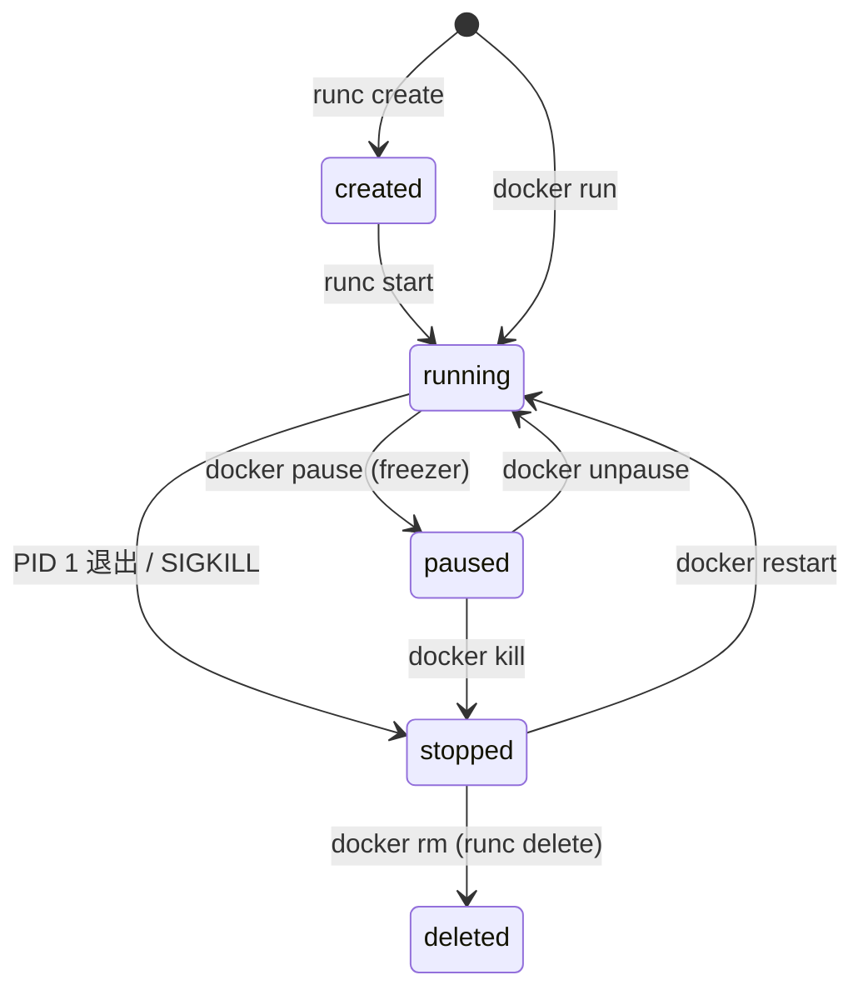
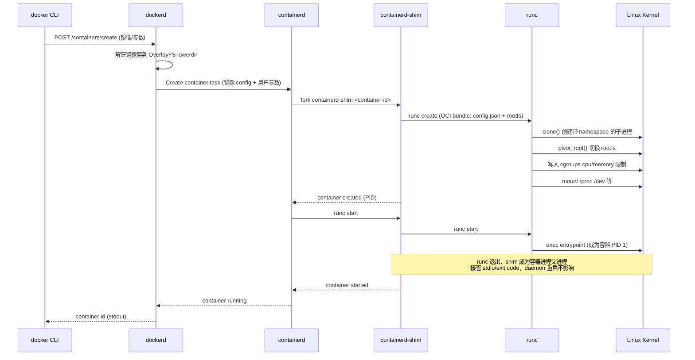
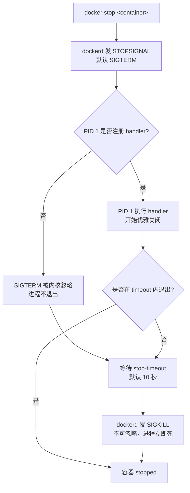

# 容器运行时与生命周期

> **一句话定位**：docker run 后发生什么是面试连环追问的核心，PID 1 信号陷阱是 Java 容器化的高频踩坑点。
> **面试热度**：⭐⭐⭐⭐⭐
> **返回**：[Docker 知识图谱](../README.md)

---

## 一、概念定义

### 1.1 容器生命周期状态机

容器从创建到销毁经历一组确定的状态，由 `runc`（OCI Runtime 实现）驱动转换。完整状态机如下：



五个核心状态的语义：

| 状态 | OCI Runtime 状态 | 触发命令 | 进程是否存活 | 可写层是否保留 |
|------|-----------------|---------|-------------|---------------|
| created | 已创建未启动 | `runc create` / `docker create` | 容器进程已 fork 但 entrypoint 未 exec | 是 |
| running | 运行中 | `runc start` / `docker start` / `docker run` | PID 1 正在执行 | 是 |
| paused | 已暂停 | `docker pause` | 进程冻结（不可调度） | 是 |
| stopped | 已停止 | PID 1 退出 / `docker stop` / `docker kill` | 进程已退出 | 是（直到 `docker rm`） |
| deleted | 已删除 | `docker rm` | 无 | 否（upperdir 清理） |

> **要点**：`created` 是 `docker create` 与 `docker run` 的分水岭——`docker create` 只准备 bundle 不启动进程，`docker run` = `docker create` + `docker start`。CRI（Container Runtime Interface，K8s 与容器运行时的接口）也暴露这个状态，`docker create` 对应 CRI 的 `RunPodSandbox` 之前的准备阶段。

### 1.2 容器与镜像的关系

容器 ≠ 镜像的拷贝，容器 = 镜像 + 可写层 + 运行时配置：

```
┌─────────────────────────────────────────────┐
│  容器 (container)                            │
│  ┌─────────────────────────────────────────┐ │
│  │  运行时配置 (runtime config)            │ │
│  │  - namespace (PID/NET/MNT/IPC/UTS/USER) │ │
│  │  - cgroups (cpu/memory/blkio/pids)      │ │
│  │  - 网络 (IP/veth/iptables)              │ │
│  │  - 挂载点 (volume/bind mount)           │ │
│  └─────────────────────────────────────────┘ │
│  ┌─────────────────────────────────────────┐ │
│  │  可写层 upperdir (OverlayFS)            │ │  ← 容器修改写这里
│  └─────────────────────────────────────────┘ │
│  ┌─────────────────────────────────────────┐ │
│  │  镜像 (image)                           │ │  ← 只读，多容器共享
│  │  lowerdir N 层 (Dockerfile 逐层)        │ │
│  └─────────────────────────────────────────┘ │
└─────────────────────────────────────────────┘
```

- **镜像只读、可共享**：同一镜像启动 100 个容器，lowerdir 只占一份。
- **可写层独立**：每个容器有自己的 upperdir，在 `/var/lib/docker/overlay2/<id>/diff/` 下，容器退出后 upperdir 保留（除非 `docker rm`）。
- **运行时配置不入镜像**：`docker run` 的 `-e`、`-v`、`-p`、`--cpus` 等参数只作用于当前容器，不会改镜像。

> **与镜像的关系链**：详见 [镜像构建与分发](../02-image/dockerfile-and-image.md) §1.2 三大核心概念关系——镜像 = 模板（类），容器 = 实例（对象）。

### 1.3 容器配置的三层来源

容器最终运行的配置由三个层次叠加，后者覆盖前者：

| 层次 | 来源 | 典型项 | 覆盖关系 |
|------|------|--------|---------|
| 第一层（基础） | 镜像 Dockerfile | `CMD` / `ENV` / `EXPOSE` / `ENTRYPOINT` / `WORKDIR` / `USER` / `STOPSIGNAL` | 默认值 |
| 第二层（覆盖） | `docker run` 参数 | `-e` / `-v` / `-p` / `--entrypoint` / `<args>` / `--user` / `--stop-signal` | 覆盖第一层 |
| 第三层（动态） | 运行时动态生成 | 容器 IP / 挂载点路径 / hostname / PID 映射 | 运行时确定，不可静态预知 |

**典型叠加示例**：

```dockerfile
# 镜像 Dockerfile（第一层）
ENV SERVER_PORT=8080
EXPOSE 8080
ENTRYPOINT ["java","-jar","/app/app.jar"]
CMD ["--spring.profiles.active=prod"]
```

```bash
# docker run 参数（第二层，覆盖）
docker run -d \
  -e SERVER_PORT=9090 \                  # 覆盖 ENV
  -p 9090:9090 \                         # 覆盖 EXPOSE 的映射
  --entrypoint java \                    # 覆盖 ENTRYPOINT（少见）
  myapp \
  --spring.profiles.active=dev           # 覆盖 CMD
```

```bash
# 运行时动态（第三层）
docker inspect myapp --format '{{.NetworkSettings.IPAddress}}'  # 172.17.0.3
docker inspect myapp --format '{{.State.Pid}}'                  # 12345（宿主 PID）
```

> **关键陷阱**：`docker run <image> <args>` 的 `<args>` 覆盖的是 **CMD**，不是 ENTRYPOINT；要覆盖 ENTRYPOINT 需 `--entrypoint`。详见 [镜像构建与分发](../02-image/dockerfile-and-image.md) §2.1 CMD vs ENTRYPOINT 组合矩阵。

### 1.4 容器与进程的关系：PID 1 的特殊性

容器本质是受 namespace/cgroups 约束的进程树（详见 [容器本质](../01-foundation/container-principle.md) §1.2），容器内**第一个进程**默认是 PID 1，承担两个特殊角色：

1. **孤儿进程的收养者**：容器内其他进程的父进程退出，孤儿会挂到 PID 1 下，由 PID 1 负责回收（reap）。若 PID 1 不实现 reap，会产生僵尸进程（`Z` 状态）。
2. **信号处理者**：但 PID 1 默认**忽略 SIGTERM**——除非进程自己 `signal(SIGTERM, handler)` 注册 handler。

**PID 1 信号保护机制**：

- Linux 内核对 PID 1 有特殊保护：任何**未被注册 handler 的信号**对 PID 1 默认忽略（防止误杀 init 导致系统崩溃）。容器继承了这一保护。
- 后果：`docker stop` 默认发 SIGTERM，若 PID 1 没注册 handler，SIGTERM 被忽略 → 10 秒后 docker 发 SIGKILL 强杀。
- `docker kill` 直接发 SIGKILL，不可被忽略、不可被注册 handler 拦截。

**验证 PID 1 的信号保护**：

```bash
# 一个未注册 SIGTERM handler 的进程作为 PID 1
docker run -d --name demo alpine sleep 3600
docker exec demo sh -c 'echo $$ && ps'   # PID 1 是 sleep

docker stop demo &
sleep 2
docker inspect demo --format '{{.State.Status}}'  # 仍是 running（SIGTERM 被忽略）
# 等 10 秒后变 stopped（SIGKILL 强杀）
```

> **要点**：PID 1 的特殊性是 Java 容器化的高频踩坑点——`java -jar app.jar` 作为 PID 1 时，早期 JDK / 早期 Spring Boot 不注册 SIGTERM handler，`docker stop` 必然等 10 秒强杀。详见 §2.4 PID 1 与信号处理。

---

## 二、原理与流程

### 2.1 `docker run` 完整调用链

接 [容器本质](../01-foundation/container-principle.md) §2.5 的四层组件与 shim 设计，`docker run` 的端到端调用链如下：



**关键步骤解读**：

1. **CLI → dockerd**：docker CLI 把 `docker run` 翻译为两次 REST 调用——`POST /containers/create`（创建容器对象）+ `POST /containers/{id}/start`（启动）。
2. **镜像准备**：若本地无镜像，先 pull；然后逐层解压，按 `lowerdir1:lowerdir2:...` 顺序挂载到 OverlayFS。
3. **bundle 构造**：containerd 用镜像 config + 用户参数生成 `config.json`（OCI Runtime Spec），准备 `rootfs`。
4. **shim fork**：containerd fork 一个新的 `containerd-shim <container-id>` 进程，作为容器未来的父进程。
5. **runc create**：shim 调 `runc create`，runc 根据 config.json 设置：① `clone()` 创建带 namespace 的子进程；② `pivot_root()` 切换 rootfs；③ 挂载 `/proc`、`/dev`；④ 写入 cgroup 文件限制资源。此时容器状态 = `created`，进程已存在但 entrypoint 未 exec。
6. **runc start**：shim 调 `runc start`，runc 在已设置的 namespace 中 `exec` entrypoint（如 `java -jar app.jar`），该进程成为容器 PID 1。容器状态 = `running`。
7. **runc 退出、shim 接管**：runc 只在创建与启动阶段短暂运行，启动后退出。shim 作为容器进程的父进程（`ps -ef` 看 PPID 是 shim），接管 stdin/stdout、上报 exit code 给 containerd。

> **核心**：`docker run` = `docker create` + `docker start`，对应 `runc create` + `runc start` 两个阶段。create 准备环境不启动进程，start 才 exec entrypoint。

### 2.2 容器状态转换全解

#### created（已创建未启动）

- 由 `runc create` / `docker create` 触发。
- 容器进程已 `clone()` 出来（namespace/cgroups/rootfs 已设置），但 entrypoint 尚未 `exec`。
- 此时进程处于一个特殊的"暂停"状态，可通过 `runc start` 唤醒。
- CRI（K8s 接口）也暴露此状态，`docker create` 对应 CRI 在 `RunPodSandbox` 之前的准备阶段。

#### running（运行中）

- 由 `runc start` / `docker start` / `docker run` 触发。
- PID 1（entrypoint）正在执行。
- 容器进程的父进程是 containerd-shim，不是 dockerd（详见 [容器本质](../01-foundation/container-principle.md) §三 Q3 shim 设计）。

#### paused（已暂停）

- 由 `docker pause` 触发，**不是** `kill -STOP`。
- 底层用 **cgroup freezer 子系统**冻结进程：内核把容器内所有进程的 task 状态置为 `FROZEN`，进程不可调度、不可被信号唤醒。
- 与 `SIGSTOP` 的区别：SIGSTOP 是信号层面的暂停，进程仍响应 `SIGCONT`；freezer 是 cgroup 层面的冻结，更彻底。
- `docker unpause` 解冻。

**paused 状态的网络陷阱**：

- 容器暂停后**网络栈仍在**（veth pair、iptables 规则不消失），但容器进程不响应任何请求 → 健康检查会失败、上游连接会超时。
- 长时间 paused 会导致 TCP 连接被对端 RST 或 keepalive 超时断开。

#### stopped（已停止）

- 触发方式：① PID 1 正常退出（exit code 0）；② PID 1 异常退出（exit code 非 0）；③ `docker stop`（SIGTERM + 超时 SIGKILL）；④ `docker kill`（直接 SIGKILL）。
- 容器进程已退出，但**可写层（upperdir）保留**——可用 `docker start` 重启（PID 1 重新 exec，但 upperdir 内的文件修改仍在）。
- 直到 `docker rm` 才清理 upperdir。

> **关键认知**：`docker stop` 后容器并未被删除，`docker ps -a` 仍可见。`docker rm` 才彻底清理。这也是"为什么 `docker stop` 后磁盘没释放"的根因——upperdir 还在。

#### deleted（已删除）

- 由 `docker rm` 触发，底层调 `runc delete`。
- 清理 upperdir、workdir、容器配置、cgroup 目录、网络命名空间（veth pair 删除）。
- 容器彻底消失，不可恢复。

### 2.3 重启策略 Restart Policy

`docker run --restart=<policy>` 控制容器退出后是否自动重启：

| 策略 | 语义 | 退出码要求 | 重启计数 | 典型场景 |
|------|------|-----------|---------|---------|
| `no`（默认） | 不重启 | — | — | 一次性任务、CI job |
| `on-failure[:max]` | 异常退出（非 0 码）才重启 | 非 0 | 达到 max 次后停止 | 可能偶发失败的服务 |
| `always` | 总是重启（无论退出码） | 任意 | 不限；daemon 重启也拉起 | 核心服务、数据库 |
| `unless-stopped` | 总是重启，但 daemon 重启时不拉起"被手动 stop"的容器 | 任意 | 不限 | 不希望维护期被 daemon 拉起的服务 |

**退出码语义**：

- exit code 0：正常退出。`on-failure` 不重启；`always`/`unless-stopped` 重启。
- exit code 非 0：异常退出。所有非 `no` 策略都重启（`on-failure` 受 max 限制）。
- `docker kill`（SIGKILL）：exit code 137。`on-failure` 会重启（137 是非 0），`always`/`unless-stopped` 也重启。

**always vs unless-stopped 的关键差异**：

两者在容器正常退出时都重启，差异在 **daemon 重启时**：

| 场景 | `--restart=always` | `--restart=unless-stopped` |
|------|-------------------|--------------------------|
| 容器正常退出 | 重启 | 重启 |
| 容器被 `docker stop` | 重启 | 重启 |
| daemon 重启（`systemctl restart docker`） | 拉起所有 `always` 容器 | 只拉起"daemon 重启前仍在 running"的容器；之前被 `docker stop` 的不拉起 |

**重启计数的重置时机**：

- `on-failure:max` 的计数在容器**成功运行一段时间后**（默认 10 秒）自动清零。
- 若容器启动后 10 秒内又退出，计数累加；达到 max 次后不再重启，容器停留在 stopped。
- 手动 `docker start` 会重置计数。

```bash
# 验证重启计数
docker run -d --name demo --restart=on-failure:3 alpine sh -c 'exit 1'
# 每次退出都会重启，累计 3 次后停止
docker inspect demo --format '{{.RestartCount}}'  # 显示累计重启次数
```

### 2.4 PID 1 与信号处理（深度重点）

#### PID 1 的信号保护

Linux 内核对 PID 1 有特殊保护（详见 §1.4）：任何**未被注册 handler 的信号**对 PID 1 默认忽略。这导致两类典型坑：

1. **shell 形式 CMD/ENTRYPOINT**：`CMD java -jar app.jar` 实际执行 `/bin/sh -c "java -jar app.jar"`，**sh 成为 PID 1**，sh 不转发信号给子进程 → java 收不到 SIGTERM。
2. **Java 应用未注册 handler**：`ENTRYPOINT ["java","-jar","app.jar"]` 让 java 直接成为 PID 1，但早期 JDK / 早期 Spring Boot 不注册 SIGTERM handler → SIGTERM 被内核忽略 → docker stop 等 10 秒后 SIGKILL。

#### `docker stop` 的完整链路



#### STOPSIGNAL 指令与 `docker stop` 超时

- Dockerfile `STOPSIGNAL SIGTERM`（默认）指定 `docker stop` 发送的信号。
- `docker stop -t 30` 或 `--stop-timeout=30` 指定 SIGKILL 前的等待秒数（默认 10）。
- `docker run --stop-signal=SIGQUIT` 可覆盖 STOPSIGNAL。

#### 解决方案对比

| 方案 | 原理 | 优点 | 缺点 | 推荐度 |
|------|------|------|------|--------|
| `docker run --init` | 注入 tini 作为 PID 1，java 成为 PID 2 | tini 转发信号 + reap 僵尸进程 | 多一个进程（~1MB） | ⭐⭐⭐⭐⭐（通用兜底） |
| `ENTRYPOINT ["java","-jar",...]` exec 形式 | java 直接成为 PID 1 | 无额外进程 | 需 java 自己注册 handler + reap | ⭐⭐⭐（需配合 Spring Boot 2.3+） |
| Spring Boot 2.3+ 内建 graceful shutdown | java 注册 SIGTERM handler | 无额外进程 | 依赖 Spring Boot 版本 | ⭐⭐⭐⭐⭐（Spring Boot 场景） |
| `dumb-init` | 同 tini，早期常用 | 同 tini | 已较少维护 | ⭐⭐⭐ |
| `bash -c "exec java ..."` | exec 让 java 替换 bash 成为 PID 1 | 无额外进程 | 仍需 java 注册 handler | ⭐⭐（不如直接 exec 形式） |

**`docker run --init` 的本质**：

- Docker 18.02+ 内置 `tini`（init 实现），`--init` 在容器内注入 tini 作为 PID 1，应用进程成为 PID 2。
- tini 做两件事：① 转发信号给子进程；② 回收僵尸进程（reap）。
- Dockerfile 也可用 `ENTRYPOINT ["tini","--","java","-jar","app.jar"]`，但 `--init` 更通用。

### 2.5 日志驱动 Log Driver

容器的 stdout/stderr 由 containerd-shim 接管，通过 log driver 决定如何持久化：

| 驱动 | 存储 | `docker logs` 是否可用 | 生产推荐 | 典型场景 |
|------|------|----------------------|---------|---------|
| `json-file`（默认） | `/var/lib/docker/containers/<id>/<id>-json.log` | ✅ | ⚠️ 需配轮转 | 单机开发、小规模 |
| `journald` | systemd journal | ✅ | ✅ | systemd 主机 |
| `syslog` | syslog daemon | ❌ | ✅ | 集中日志（传统） |
| `fluentd` | fluentd agent | ❌ | ✅ | K8s/容器平台 |
| `gelf` | GELF 协议（Graylog） | ❌ | ✅ | ELK/Graylog 栈 |
| `awslogs` | CloudWatch | ❌ | ✅ | AWS |
| `none` | 不存 | ❌ | — | 只用 sidecar 收集 |

**`json-file` 的默认坑**（高频踩坑点）：

- 默认配置：单文件 100MB、轮转 1 个（即最多 100MB x 1 = 100MB）。
- 但很多老版本 Docker（< 18.06）默认**无轮转**——日志无限增长，最终撑爆磁盘。
- 撑满磁盘的后果：dockerd 无法写、新容器无法创建、容器进程 write stdout 报 `No space left on device`。

**配置轮转**：

```bash
# 全局配置 /etc/docker/daemon.json
{
  "log-driver": "json-file",
  "log-opts": {
    "max-size": "10m",      # 单文件 10MB
    "max-file": "3"         # 保留 3 个
  }
}

# 单容器覆盖
docker run --log-driver=json-file --log-opt max-size=10m --log-opt max-file=3 myapp
```

**`docker logs` 的局限**：

- 仅对 `json-file` 和 `journald` 生效——其他驱动下 `docker logs` 报错 `Error response from daemon: configured logging driver does not support reading`。
- 生产环境推荐用 sidecar（Fluentd/Filebeat）或直接输出到 stdout 由 K8s log driver 收集。

### 2.6 健康检查 Healthcheck

#### HEALTHCHECK 指令

Dockerfile：

```dockerfile
HEALTHCHECK --interval=30s --timeout=3s --start-period=10s --retries=3 \
  CMD curl -f http://localhost:8080/actuator/health || exit 1
```

`docker run` 覆盖：

```bash
docker run --health-cmd="curl -f http://localhost:8080/health || exit 1" \
  --health-interval=30s --health-timeout=3s --health-retries=3 myapp
```

#### 参数语义

| 参数 | 默认 | 作用 |
|------|------|------|
| `--interval` | 30s | 检查间隔 |
| `--timeout` | 30s | 单次检查超时（超时算失败） |
| `--start-period` | 0s | 启动宽限期（期间失败不计入 retries） |
| `--retries` | 3 | 连续失败次数达到此值才标 unhealthy |

#### health status

容器有 4 种健康状态：

| 状态 | 含义 |
|------|------|
| `starting` | 在 start-period 内，还在初始化 |
| `healthy` | 最近 N 次（retries）检查都成功 |
| `unhealthy` | 连续 retries 次检查失败 |
| `none` | 未配置 healthcheck |

```bash
docker inspect myapp --format '{{.State.Health.Status}}'  # healthy / unhealthy
docker inspect myapp --format '{{json .State.Health}}'    # 完整检查记录
```

#### unhealthy 不会自动重启容器

**高频踩坑点**：容器变 `unhealthy` 后，Docker **不会**自动重启它——这只是状态标记。要自动重启需配合：

- `--restart=always` 或 `unless-stopped`：但这是基于"进程退出"的策略，unhealthy 容器进程未退出不会触发。
- `docker events` 监听 `health_status: unhealthy` 事件，外部脚本主动 `docker restart`。
- K8s 的 liveness probe：unhealthy 时 K8s（而非 Docker）重启 Pod。

```bash
# 监听 unhealthy 事件并重启
docker events --filter event=health_status \
  --filter health=unhealthy \
  --format '{{.ID}}' | xargs -r docker restart
```

### 2.7 容器资源限制入门

> 详细推导放 [Java 容器调优](../08-performance/java-container-tuning.md)，这里讲机制。

#### 核心参数

```bash
docker run -d \
  --memory=512m --memory-swap=512m \   # 内存上限 512MB，不开 swap
  --cpus=2 \                            # 2 核（cpu.cfs_quota_us=200000）
  --cpu-shares=512 \                    # CPU 权重（默认 1024，相对值）
  --pids-limit=200 \                    # 最大进程数
  myapp
```

#### OOM 时的行为

- 容器内存超过 `--memory` 限制 → 触发 cgroup OOM Killer → 选中容器内 RSS 最大的进程 → SIGKILL。
- 若被杀进程是 PID 1 → 容器整体退出 → 触发重启策略。
- 若被杀进程不是 PID 1 → 该进程死，容器继续运行（但可能已不健康）。
- `--oom-kill-disable`：禁用 OOM Killer（慎用，会导致进程卡死等待内存）。

详见 [容器本质](../01-foundation/container-principle.md) §2.2 OOM Killer 触发链。

---

## 三、高频追问与面试题

### Q1：`docker run` 之后到底发生了什么？

**参考答案**：见 §2.1 完整调用链。3 分钟标准答法：

> docker CLI 把 `docker run` 翻译为两次 REST 调用 dockerd——`POST /containers/create` 创建容器对象，`POST /containers/{id}/start` 启动。dockerd 收到后：① 若本地无镜像先 pull，然后逐层解压到 OverlayFS lowerdir；② 调 containerd 创建 container task，containerd 用镜像 config + 用户参数生成 OCI bundle（config.json + rootfs）；③ containerd fork 一个 containerd-shim 进程作为容器未来的父进程；④ shim 调 `runc create`，runc 用 clone() 创建带 namespace 的子进程、pivot_root 切 rootfs、写入 cgroups 限制；⑤ shim 调 `runc start`，runc exec entrypoint 成为容器 PID 1；⑥ runc 退出，shim 接管容器进程的 stdio 与 exit code 上报。整个过程的关键是 shim 解耦——daemon 重启不影响容器。

**关联**：§2.1 调用链时序图、[容器本质](../01-foundation/container-principle.md) §2.5 Docker 架构与运行时调用链、§三 Q3 shim 设计。

### Q2：`docker stop` 和 `docker kill` 的区别？

**参考答案**：

| 维度 | `docker stop` | `docker kill` |
|------|--------------|---------------|
| 信号 | 先 STOPSIGNAL（默认 SIGTERM），等 timeout 后 SIGKILL | 默认 SIGKILL（可用 `-s` 指定） |
| 优雅关闭 | 支持（PID 1 注册 handler 时） | 不支持（SIGKILL 不可拦截） |
| timeout | 默认 10 秒，可 `-t` 调 | 无 |
| 数据一致性 | 机会 flush | 立即死，可能丢数据 |
| exit code | 退出码取决于 PID 1 的 exit | 137（SIGKILL） |

- `docker stop`：发 SIGTERM → 等 10 秒 → 若未退出发 SIGKILL。给应用优雅关闭的机会。
- `docker kill`：直接发 SIGKILL（默认），立即死。相当于 `kill -9`。
- `docker kill -s SIGUSR1`：可发任意信号，但默认是 SIGKILL。

**关联**：§2.4 PID 1 与信号处理、§五 5.2 SIGKILL 排查案例。

### Q3：为什么 Java 应用 `docker stop` 后要等 10 秒才死？

**参考答案**：这是 PID 1 信号陷阱。两个根因：

1. **shell 形式 CMD**：`CMD java -jar app.jar` → 实际执行 `/bin/sh -c "java -jar app.jar"`，**sh 成为 PID 1**，sh 不转发 SIGTERM 给子进程 java。SIGTERM 被 sh 忽略，docker 等 10 秒后 SIGKILL 强杀 sh 与 java。
2. **java 是 PID 1 但未注册 handler**：`ENTRYPOINT ["java","-jar","app.jar"]` 让 java 直接是 PID 1，但早期 JDK / 早期 Spring Boot 不注册 SIGTERM handler → SIGTERM 被内核对 PID 1 的保护机制忽略 → 10 秒后 SIGKILL。

**解决方案**：

- 用 `ENTRYPOINT` exec 形式让 java 直接成为 PID 1 + Spring Boot 2.3+ 内建 graceful shutdown（注册 SIGTERM handler）。
- 或 `docker run --init` 注入 tini 作为 PID 1，java 成为 PID 2，tini 转发 SIGTERM。
- 或 Dockerfile `STOPSIGNAL SIGTERM` + 合理 `--stop-timeout`。

**关联**：§2.4 PID 1 与信号处理、[容器本质](../01-foundation/container-principle.md) §三 Q7 为什么容器 PID 1 收不到 SIGTERM、§四 4.2 Spring Boot PID 1 与优雅关闭。

### Q4：容器 paused 后还能被访问吗？

**参考答案**：不能正常响应，但网络栈仍在。

- **freezer 原理**：`docker pause` 用 cgroup freezer 子系统冻结进程，内核把容器内所有进程 task 状态置为 `FROZEN`，不可调度、不可被信号唤醒。与 SIGSTOP（信号层暂停）不同，freezer 更彻底。
- **网络栈仍在**：veth pair、iptables 规则不消失，但容器进程不响应任何请求 → 健康检查失败、HTTP 请求超时。
- **TCP 连接的坑**：长时间 paused 会导致 TCP 连接被对端 RST 或 keepalive 超时断开（默认 2 小时，但很多客户端更短）。
- **验证**：`docker pause demo` 后 `curl http://<container-ip>:8080` 会一直 hang，直到 timeout。

**典型场景**：调试时临时暂停容器抓快照（如 `docker checkpoint`），但生产环境绝不要 pause 在线服务。

**关联**：§2.2 容器状态转换全解 paused。

### Q5：`docker run -d` 后容器为什么立刻退出了？

**参考答案**：容器退出 = PID 1 退出。常见根因：

1. **CMD 是 shell 形式且后台进程**：`CMD service nginx start` → `sh -c "service nginx start"` 启动 nginx 后台进程后 sh 退出 → PID 1 死 → 容器死。正确：`CMD ["nginx","-g","daemon off;"]` 让 nginx 前台运行。
2. **entrypoint 是后台 daemon**：如 `CMD /usr/sbin/sshd` → sshd 默认后台运行，主进程退出 → 容器死。正确：`CMD ["sshd","-D"]`。
3. **shell 脚本启动后 exec 没用**：`CMD sh -c "start.sh"` 若 start.sh 启动后台进程后退出，容器死。正确：`CMD ["sh","-c","exec java -jar app.jar"]` 或直接 exec 形式。
4. **应用本身崩溃**：看 `docker logs <container>` 与 exit code。exit 137 = OOM/被 SIGKILL；exit 1 = 应用异常。

**判断方法**：

```bash
docker run -d --name demo myapp
docker ps -a | grep demo              # 看 STATUS，Exited (x) ago
docker inspect demo --format '{{.State.ExitCode}}'  # 退出码
docker logs demo                      # 看输出
```

**关联**：§2.1 调用链、[镜像构建与分发](../02-image/dockerfile-and-image.md) §2.1 CMD vs ENTRYPOINT。

### Q6：always 和 unless-stopped 在什么场景下不一样？

**参考答案**：在 **daemon 重启**时表现不同。详见 §2.3 重启策略表格。

- `--restart=always`：daemon 重启后拉起**所有** always 容器，包括之前被 `docker stop` 的。
- `--restart=unless-stopped`：daemon 重启后只拉起"daemon 重启前仍在 running"的容器；之前被 `docker stop` 的**不**拉起。

**场景对比**：

| 场景 | always | unless-stopped |
|------|--------|----------------|
| 容器正常退出 | 重启 | 重启 |
| 容器被 `docker stop` | 重启 | 重启 |
| daemon 重启（维护期） | 拉起所有 always 容器（包括维护期 stop 的） | 只拉起重启前 running 的容器 |

**推荐**：维护期不希望被 daemon 拉起的用 `unless-stopped`；核心服务（数据库、注册中心）用 `always`。

**关联**：§2.3 重启策略 Restart Policy。

### Q7：`--restart=on-failure:5` 的 5 是什么意思？计数什么时候清零？

**参考答案**：5 是最大重启次数。

- 容器**异常退出**（exit code 非 0）才重启，正常退出（exit 0）不重启。
- 累计重启 5 次后停止重启，容器停留在 stopped。
- **计数清零时机**：容器成功运行一段时间（默认 10 秒）后自动清零。若容器启动后 10 秒内又退出，计数累加；超过 10 秒后退出，计数已清零，下次失败重新从 0 计。
- 手动 `docker start` 也会重置计数。

**验证**：

```bash
docker run -d --name demo --restart=on-failure:3 alpine sh -c 'exit 1'
# 每 10 秒内退出重启，累计 3 次后停止
sleep 60
docker inspect demo --format '{{.RestartCount}}'  # 显示 3
docker inspect demo --format '{{.State.Status}}'  # exited
```

**关联**：§2.3 重启策略 Restart Policy。

### Q8：容器的日志在哪？怎么轮转？

**参考答案**：默认 `json-file` 驱动，存在 `/var/lib/docker/containers/<id>/<id>-json.log`。

**轮转配置**：

```bash
# 全局 /etc/docker/daemon.json
{
  "log-driver": "json-file",
  "log-opts": {
    "max-size": "10m",
    "max-file": "3"
  }
}

# 单容器覆盖
docker run --log-opt max-size=10m --log-opt max-file=3 myapp
```

**默认坑**：

- 老版本 Docker（< 18.06）默认**无轮转**——日志无限增长，撑爆磁盘。
- 新版本默认单文件 100MB、轮转 1 个（即最多 100MB x 1 = 100MB），但对高吞吐服务仍不够。

**生产推荐**：

- 改用 `fluentd`/`gelf`/`journald` 驱动，集中收集。
- 或用 sidecar（Fluentd/Filebeat）挂载容器日志目录收集。
- 注意 `docker logs` 仅对 `json-file`/`journald` 生效，其他驱动下不可用。

**关联**：§2.5 日志驱动 Log Driver、§五 5.3 日志写满案例。

### Q9：HEALTHCHECK unhealthy 为什么不会重启容器？怎么解决？

**参考答案**：Docker 的 healthcheck 只是**状态标记**，不触发重启。unhealthy 容器进程未退出，`--restart=always` 不会触发（restart policy 基于"进程退出"）。

**解决方案**：

1. **外部监听 events**：`docker events --filter event=health_status --filter health=unhealthy`，脚本监听后主动 `docker restart`。
2. **K8s liveness probe**：K8s 自己的探针，unhealthy 时 K8s（而非 Docker）重启 Pod。这是 K8s 场景的标准方案。
3. **应用内自愈**：应用检测自身不健康后主动 `System.exit(1)`，配合 `--restart=on-failure` 重启。
4. **Swarm 模式**：Docker Swarm 的 `--healthcheck` 配合 `--restart-condition` 可自动重启 unhealthy 服务。

**关联**：§2.6 健康检查 Healthcheck。

---

## 四、实战关联（Java 后端视角）

### 4.1 Spring Boot 容器优雅关闭

#### Spring Boot 2.3+ 内建 graceful shutdown

```yaml
server:
  shutdown: graceful                          # 开启优雅停机
spring:
  lifecycle:
    timeout-per-shutdown-phase: 30s           # 等待最多 30s
```

- `docker stop` 发 SIGTERM → JVM 收到（需 PID 1 注册 handler）→ Spring 发 `ContextClosedEvent` → 关闭所有 bean → 等 actuator 健康检查返回 DOWN → 30s 内退出。
- 若 30s 没退完，docker 发 SIGKILL 强杀。

#### Dockerfile 标配

```dockerfile
FROM eclipse-temurin:17-jre
COPY app.jar /app/app.jar
STOPSIGNAL SIGTERM                            # 显式声明（默认就是 SIGTERM）
ENTRYPOINT ["java","-jar","/app/app.jar"]
```

```bash
docker run -d --name app --stop-timeout=30 myapp
```

#### PID 1 问题的解决方案对比

| 方案 | 配置 | 优点 | 缺点 |
|------|------|------|------|
| `docker run --init` | `--init`（无需改 Dockerfile） | 通用，tini 转发信号 + reap 僵尸 | 多一个进程（~1MB） |
| Spring Boot 2.3+ 内建 | `server.shutdown=graceful` | 无额外进程，Spring 控制 shutdown 阶段 | 依赖 Spring Boot 版本 |
| Dockerfile exec 形式 | `ENTRYPOINT ["java","-jar",...]` | java 直接是 PID 1 | 仍需 Spring Boot 2.3+ 注册 handler |
| 显式 tini | `ENTRYPOINT ["tini","--","java","-jar",...]` | 不依赖 docker CLI 的 `--init` | Dockerfile 需装 tini |

**推荐组合**：Spring Boot 2.3+ 内建 graceful shutdown + `ENTRYPOINT` exec 形式 + `docker run --init` 兜底（防止 reap 僵尸）。

### 4.2 关联 framework/spring-framework 模块

Spring 的 `ContextClosedEvent` 与 Servlet 容器的 shutdown hook 执行顺序：

```
SIGTERM 到达 JVM
    │
    ▼
JVM 触发 ShutdownHook 线程（Runtime.addShutdownHook）
    │
    ▼
Spring 的 ShutdownHook 执行：
    1. 发 ContextClosedEvent（所有 ApplicationListener 收到）
    2. 停止接收新请求（server.shutdown=graceful）
    3. 等待在途请求完成（timeout-per-shutdown-phase）
    4. 销毁 Servlet 容器（Tomcat/Jetty stop）
    5. 销毁所有单例 bean（@PreDestroy 方法执行）
    6. 关闭 ThreadPool
    7. JVM 退出
```

> **关联 `framework/spring-framework` 模块**：该模块包含 `ContextClosedEvent` 与 `@PreDestroy` 的执行顺序实例，对照理解 Spring 容器内 shutdown hook 的链路。

### 4.3 关联 java-core/jvm 模块

JVM ShutdownHook 在容器里的执行时机与 SIGTERM 丢失的踩坑：

- JVM 注册的 ShutdownHook 是**普通线程**，由 JVM 在退出前启动。
- SIGTERM 到达 JVM → JVM 启动所有 ShutdownHook 线程 → 等它们执行完 → JVM 退出。
- **踩坑**：若 java 不是 PID 1（如 shell 形式 CMD），SIGTERM 根本到不了 JVM——被 sh 拦截或忽略。
- **踩坑**：JVM ShutdownHook 执行超时（> stop-timeout）会被 docker SIGKILL 强杀，ShutdownHook 中断。

**验证 JVM 是否收到 SIGTERM**：

```bash
# 容器内
docker exec app jcmd 1 VM.signal SIGTERM
# 或看 JVM 日志是否有 ShutdownHook 触发痕迹
```

> **关联 `java-core/jvm` 模块**：该模块有 JVM ShutdownHook 与容器信号的测试用例，对照理解 [Java 容器调优](../08-performance/java-container-tuning.md) §1.3 的 shutdown 链路。

### 4.4 JVM CPU 数与线程池陷阱

JVM 进程作为 PID 1，除了 `-XX:+UseContainerSupport` 之外还有隐藏坑：

- **`Runtime.getRuntime().availableProcessors()` 返回的是 JVM 探测到的 CPU 数**。
- JDK 8u191+ / 11+ 通过读 `cpu.cfs_quota_us / cpu.cfs_period_us` 推算，但**探测失败时退化为宿主机 CPU 数**。
- 探测失败场景：cgroup v2 但 JDK 版本太老不支持 v2；或 `--cpus` 用的是 `cpu.shares` 而非 `cpu.cfs_quota_us`。

**线程池配置陷阱**：

- Tomcat `server.tomcat.threads.max` 默认 200，按 CPU 数推算——若 JVM 看见宿主机 32 核，但容器只限 2 核，Tomcat 起太多线程 → 上下文切换开销大。
- `ForkJoinPool` 的并行度默认 = CPU 数 - 1，同样受探测影响。
- 解决：显式 `-XX:ActiveProcessorCount=2` 强制指定，覆盖探测结果。

```bash
docker run -d --cpus=2 myapp
# 若 JDK 探测失败，加
docker run -d --cpus=2 -e JAVA_OPTS="-XX:ActiveProcessorCount=2" myapp
```

> **关联 `java-core/jvm` 模块**：`HotspotContainer` 源码的 `activeProcessorCount()` 方法，对照理解 [容器本质](../01-foundation/container-principle.md) §四 4.1 JVM 容器感知。

---

## 五、面试案例

### 5.1 "docker run 之后发生了什么？"——调用链时序图（3 分钟标准答法）

**面试官**：说一下 `docker run` 之后到底发生了什么？

**3 分钟标准答法**：

> docker CLI 把 `docker run` 翻译为两次 REST 调用 dockerd。第一次 `POST /containers/create` 创建容器对象——dockerd 检查镜像本地是否存在，没有就 pull；然后逐层解压镜像到 OverlayFS lowerdir，构造 OCI bundle（config.json + rootfs）。第二次 `POST /containers/{id}/start` 启动。
>
> dockerd 把启动请求交给 containerd。containerd 先 fork 一个 containerd-shim 进程作为容器未来的父进程——这是为了解耦，daemon 重启不会影响容器。shim 调用 `runc create`，runc 根据 config.json 用 `clone()` 创建带 namespace（PID/NET/MNT/IPC/UTS）的子进程，`pivot_root` 切换 rootfs，挂载 `/proc`、`/dev`，写入 cgroups 限制资源。此时容器是 `created` 状态，进程已存在但 entrypoint 还没执行。
>
> 接着 shim 调 `runc start`，runc 在已设置的 namespace 中 `exec` entrypoint，比如 `java -jar app.jar`，这个进程成为容器的 PID 1。runc 完成使命后退出，shim 接管容器进程的 stdio 和 exit code 上报，成为容器进程的父进程。
>
> 关键设计是 shim——它让容器进程不挂在 dockerd 下，daemon 重启或升级时容器继续运行；shim 还负责回收僵尸进程和收集 exit code。

**结构要点**：CLI → dockerd REST → 镜像准备 → containerd → shim fork → runc create（namespace/cgroup/rootfs）→ runc start（exec entrypoint 为 PID 1）→ shim 接管。

**追问链**：

| 追问 | 标准答法 |
|------|---------|
| 为什么要 shim？ | 解耦——容器父进程是 shim 不是 dockerd，daemon 重启不影响容器；还负责 stdio、exit code、reap |
| runc 一直运行吗？ | 不，runc 只在 create/start 阶段短暂运行，启动后退出；长期运行的是 shim + 容器进程 |
| docker create 和 docker run 的区别？ | create 只准备 bundle 不启动进程（created 状态），run = create + start |
| 容器进程的父进程是谁？ | containerd-shim，不是 dockerd；`ps -ef` 看 PPID 是 shim |

### 5.2 "你的 Spring Boot 应用 `docker stop` 后立刻被 SIGKILL，怎么排查？"——PID 1 信号陷阱

**面试官**：你的 Spring Boot 容器，`docker stop` 后应用日志没有 graceful shutdown 痕迹，像被强杀了，怎么排查？

**排查链**：

| 步骤 | 检查 | 结论 |
|------|------|------|
| 1. 看 Dockerfile 的 CMD/ENTRYPOINT 形式 | `CMD java -jar app.jar`（shell 形式）→ sh 是 PID 1，不转发信号 | 改 `ENTRYPOINT ["java","-jar","app.jar"]` exec 形式 |
| 2. 看容器内 PID 1 是谁 | `docker exec app sh -c 'cat /proc/1/comm'` → 若是 `sh` 则确认 shell 形式 | 同上 |
| 3. 看 Spring Boot 版本与配置 | < 2.3 或未配 `server.shutdown=graceful` → 未注册 SIGTERM handler | 升级 + 配置 graceful shutdown |
| 4. 看 stop-timeout | 默认 10 秒，若应用 shutdown 需更久 → 被 SIGKILL | `docker run --stop-timeout=30` |
| 5. 看 STOPSIGNAL | 默认 SIGTERM，若配了 SIGQUIT 等 JVM 不识别的信号 | Dockerfile `STOPSIGNAL SIGTERM` |
| 6. 看 JVM 日志有无 ShutdownHook 痕迹 | 无 → SIGTERM 没到 JVM | 确认是 PID 1 信号陷阱 |

**根因分类**：

```
docker stop 后立刻 SIGKILL
├── PID 1 不是 java（是 sh/bash）
│   └── CMD/ENTRYPOINT 用 shell 形式
│       └── 修复：改 exec 形式 ENTRYPOINT ["java","-jar",...]
├── PID 1 是 java 但未注册 SIGTERM handler
│   ├── Spring Boot < 2.3
│   │   └── 升级 或 用 docker run --init 注入 tini
│   └── Spring Boot 2.3+ 但未配 server.shutdown=graceful
│       └── 配置 graceful shutdown
└── 注册了但 stop-timeout 太短
    └── 加大 --stop-timeout
```

**终极兜底方案**：

```bash
docker run --init --stop-timeout=30 myapp
```

`--init` 注入 tini 作为 PID 1，java 成为 PID 2，tini 转发 SIGTERM 并 reap 僵尸进程，无论 java 是否注册 handler 都能收到信号。

### 5.3 "容器日志把磁盘写满，怎么排查和处理？"——json-file 默认坑

**面试官**：线上机器磁盘满了，定位到是 `/var/lib/docker/containers/` 下的 json log，怎么处理？

**排查链**：

```bash
# 1. 定位哪个容器日志最大
du -sh /var/lib/docker/containers/*/*.log | sort -h | tail
# 输出示例：
# 4.0K  /var/lib/docker/containers/aaa/aaa-json.log
# ...
# 50G   /var/lib/docker/containers/xxx/xxx-json.log

# 2. 看是哪个容器
docker ps --no-trunc | grep xxx

# 3. 看日志内容（确认是不是应用狂打日志）
tail -n 100 /var/lib/docker/containers/xxx/xxx-json.log

# 4. 看容器的 log 配置
docker inspect xxx --format '{{.HostConfig.LogConfig}}'
# {json-file map[max-file: max-size:]}  ← 没配轮转！
```

**临时处理**（不停容器）：

```bash
# 危险：truncate 日志文件（容器仍持有 fd，可继续写）
truncate -s 0 /var/lib/docker/containers/xxx/xxx-json.log
```

> **注意**：`rm` 日志文件不行——容器进程持有 fd，rm 后空间不释放，且容器继续写会重建文件。`truncate` 是安全做法。

**根治方案**：

```bash
# 全局配置 /etc/docker/daemon.json
{
  "log-driver": "json-file",
  "log-opts": {
    "max-size": "10m",
    "max-file": "3"
  }
}

# 重启 daemon（容器不停，靠 live-restore）
systemctl reload docker  # 或 systemctl restart docker
```

> **注意**：daemon.json 的 log-opts 只对**新创建**的容器生效，已有容器需 `docker rm` 后重建。生产环境推荐用配置管理工具（Ansible/Terraform）统一设置，并在镜像层限制应用日志速率。

**生产推荐**：

| 方案 | 适用场景 |
|------|---------|
| `json-file` + 轮转 | 单机、小规模 |
| `fluentd`/`gelf` 驱动 | 集中日志、K8s |
| sidecar（Filebeat）挂载日志目录 | 不想改 log driver |
| 应用层限制日志速率 | 根本防止狂打日志 |

---

## 六、参考与延伸

- **官方文档**：`docker run` reference、`docker stop` reference、Logging drivers、Healthcheck（docs.docker.com）
- **OCI 规范**：OCI Runtime Spec——`runc create`/`runc start`/`runc delete` 的状态机定义（opencontainers.org）
- **工具**：tini（github.com/krallin/tini）、dumb-init（github.com/Yelp/dumb-init）
- **延伸阅读**：
  - [容器本质与底层原理](../01-foundation/container-principle.md)——namespace/cgroups/unionfs、shim 设计、OOM Killer
  - [镜像构建与分发](../02-image/dockerfile-and-image.md)——CMD vs ENTRYPOINT、STOPSIGNAL、HEALTHCHECK 指令
  - [Docker 存储模型](../05-storage/docker-storage.md)——可写层 upperdir、volume 清理
  - [Docker 安全模型](../07-security/docker-security.md)——PID 1 与 capabilities
  - [Java 容器调优](../08-performance/java-container-tuning.md)——JVM 容器感知、堆外内存预算、ActiveProcessorCount
- **仓库内关联**：
  - `java-core/jvm`——`HotspotContainer` 源码、JVM ShutdownHook 与容器信号
  - `framework/spring-framework`——`ContextClosedEvent`、`@PreDestroy`、Spring Boot 3.x JarLauncher 启动与优雅关闭
  - [TCP 连接管理](../../network/02-transport/tcp-connection.md)——容器 paused 与 docker stop 对 TCP 连接的影响

> **返回**：[Docker 知识图谱](../README.md)
