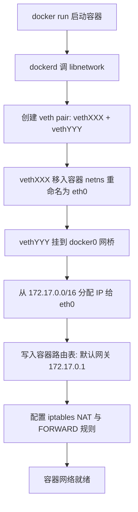
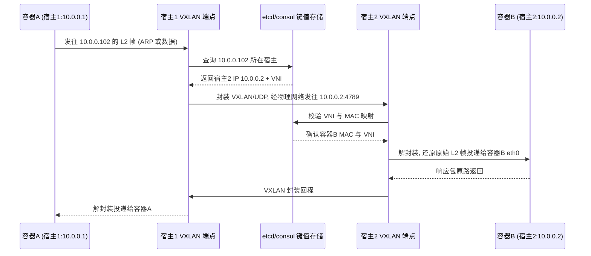

# Docker 网络模型

> **一句话定位**：Docker 网络基于 Linux 虚拟网络设备实现二层隔离，iptables 链路与 DNS 发现是高频追问核心。
> **面试热度**：⭐⭐⭐⭐
> **返回**：[Docker 知识图谱](../README.md)

---

## 一、概念定义

### 1.1 Docker 网络的本质

Docker 网络不是一套独立的网络协议栈，而是**复用 Linux 内核已有的虚拟网络设备与 netfilter 框架**拼装出来的二层隔离方案：

| 内核机制 | 在 Docker 网络中的角色 |
|---------|----------------------|
| `veth pair` | 虚拟网线，一端在容器 netns，一端挂到 docker0 网桥，跨 namespace 连接容器与宿主网络 |
| `bridge`（Linux bridge） | 软件网桥 `docker0`，二层转发，把多个 veth 串到一个广播域 |
| `iptables` / netfilter | 实现 NAT（SNAT 出网、DNAT 端口映射）与访问控制（FORWARD 链） |
| `netns`（network namespace） | 每个容器独享的网络栈（网卡/路由/iptables/socket） |
| `vxlan` | overlay 网络的封装协议，跨主机打通 L2 域 |

**一句话**：Docker 网络 = `veth pair`（连线）+ `bridge`（组网）+ `iptables`（地址转换与策略）+ `netns`（隔离），没有一项是 Docker 自研的。

### 1.2 CNM 三要素

Docker 网络采用 **CNM（Container Network Model）** 自有模型，由三个核心对象构成：

| CNM 要素 | 对应实现 | 作用 |
|----------|---------|------|
| **Sandbox**（沙箱） | network namespace | 独立的网络栈：网卡、路由表、iptables、socket。一个容器一个 Sandbox |
| **Endpoint**（端点） | veth pair 的一端 | Sandbox 接入 Network 的"插头"。一个 Sandbox 可有多个 Endpoint（多网卡） |
| **Network**（网络） | bridge / overlay / macvlan 驱动实例 | 一组 Endpoint 的集合，同 Network 内的 Endpoint 可二层互通 |

**三者关系**：Sandbox 包含多个 Endpoint，Endpoint 挂在 Network 上，Network 由网络驱动（driver）实例化。一个容器可接入多个 Network（如同时接入 frontend 和 backend 两个 bridge）。

```
┌──────────────────────────────────────────────────┐
│  Sandbox (容器 netns)                            │
│  ┌──────────┐  ┌──────────┐                     │
│  │Endpoint A│  │Endpoint B│                     │
│  └────┬─────┘  └────┬─────┘                     │
└───────┼─────────────┼───────────────────────────┘
        │             │
┌───────▼─────────────▼───────────────────────────┐
│  Network A (bridge: frontend)   Network B (... ) │
│  ─ 同 Network 内 Endpoint 二层互通 ─            │
└──────────────────────────────────────────────────┘
```

### 1.3 CNM 与 K8s CNI 的边界

| 维度 | CNM（Docker 自有） | CNI（CNCF 标准） |
|------|-------------------|------------------|
| 提出方 | Docker 公司 | CoreOS 主导，CNCF 标准 |
| 配置模型 | 强配置模型（容器运行时调用 libnetwork 的 JSON 配置） | 接口规范（插件二进制，stdin 喂 JSON，stdout 回结果） |
| 典型使用者 | Docker / Docker Swarm | Kubernetes / containerd / CRI-O / Podman |
| 多插件支持 | 需通过 remote driver 桥接 | 原生多插件（Calico/Flannel/Cilium/Weave...） |
| IPAM | libnetwork 内建 | 独立 IPAM 插件 |
| 网络 attach/detach | 支持 attach 到运行中容器 | Pod 创建时一次性配置，不支持动态 attach |

> **边界声明**：本章只讲 Docker 自有的 CNM 模型与五大内置驱动。K8s 的 CNI 插件生态（Calico BGP、Flannel VXLAN、Cilium eBPF）属独立知识域，参见 [云原生网络](../network/05-system-design/cloud-native.md)。

### 1.4 五大内置网络驱动一览

Docker 开箱即用提供五种网络驱动，按隔离级别与适用场景区分：

| 驱动 | 作用 | 隔离级别 | 适用场景 | 典型命令 |
|------|------|---------|---------|---------|
| **bridge** | 默认驱动，容器接到 `docker0` 软网桥，经 NAT 出网 | 中（独立 netns，共享 docker0 广播域） | 单机开发/测试，Spring Boot + MySQL 单机互访 | `docker run --network=bridge ...`（默认） |
| **host** | 容器直接使用宿主 netns，无 veth/docker0 | 无（与宿主共享网络栈） | 极致性能、端口可规划的场景；监控 agent | `docker run --network=host ...` |
| **none** | 仅 `lo` 回环，无任何外部连通 | 最高（完全孤岛） | 安全基线、自定义网络栈、离线批处理 | `docker run --network=none ...` |
| **overlay** | 跨主机 L2 域，基于 VXLAN 隧道封装 | 中（跨主机同网段） | Docker Swarm 多主机容器互通 | `docker network create -d overlay mynet` |
| **macvlan** | 容器直接获得宿主物理网段的 MAC/IP | 低（直接暴露在物理网络） | 对性能要求极高、容器需被外部网络直连 | `docker network create -d macvlan ...` |

> **记忆口诀**：bridge 组局域（NAT 出网）、host 无隔离（性能最高）、none 全孤立（安全基线）、overlay 跨主机（VXLAN 隧道）、macvlan 直入物理网（性能逼近裸机）。

---

## 二、原理与流程

### 2.1 bridge 网络（默认驱动，深度重点）

bridge 是 `docker run` 不指定网络时的默认驱动，也是面试追问最密集的网络类型。

#### 2.1.1 docker0 网桥的本质

`docker0` 是一个 **Linux bridge** 设备，由 dockerd 在首次启动时自动创建：

```bash
$ brctl show docker0
bridge name     bridge id               STP enabled     interfaces
docker0         8000.0242abcdef0102     no              veth3a2b1
                                                        veth9c8d7
$ ip addr show docker0
3: docker0: <BROADCAST,MULTICAST,UP,LOWER_UP> mtu 1500 ...
    inet 172.17.0.1/16 brd 172.17.255.255 scope global docker0
```

**关键属性**：

- **二层转发**：docker0 只做 MAC 地址学习与帧转发，**无路由能力**。容器间通信靠 MAC 表，跨网段通信靠宿主路由表 + iptables。
- **默认子网**：`172.17.0.0/16`，docker0 自身 IP `172.17.0.1` 作为容器默认网关。
- **无 STP**：单机网桥无需生成树协议（STP disabled），避免收敛延迟。
- **MTU 1500**：标准以太网 MTU，overlay 下会被压缩。

#### 2.1.2 容器接入流程

`docker run` 启动容器时的网络接入链路：



**逐步解读**：

1. **创建 veth pair**：`ip link add vethXXX type veth peer name vethYYY`，veth 是成对虚拟设备，一端发包另一端收包。
2. **移入容器 netns**：`ip link set vethXXX netns <container-pid>`，把一端放到容器的 network namespace 内。
3. **重命名为 eth0**：在容器 netns 内 `ip link set vethXXX name eth0`，统一网卡名。
4. **挂到 docker0**：宿主侧 `ip link set vethYYY master docker0`，把另一端接到 docker0 网桥。
5. **分配 IP**：dockerd 的 IPAM 从 `172.17.0.0/16` 选一个未占用地址（如 `172.17.0.2`）配给 eth0。
6. **配置路由**：容器内 `ip route add default via 172.17.0.1`，默认网关指向 docker0。
7. **iptables 规则**：宿主侧写入 MASQUERADE（出网 SNAT）与 DNAT（端口映射）规则。

**验证命令**：

```bash
# 容器内
$ docker exec demo ip addr show eth0
4: eth0@if5: <BROADCAST,MULTICAST,UP,LOWER_UP> mtu 1500 ...
    inet 172.17.0.2/16 brd 172.17.255.255 scope global eth0

# 宿主机
$ ip link show | grep veth
5: veth9c8d7@if4: <BROADCAST,MULTICAST,UP,LOWER_UP> ...

$ brctl show docker0
docker0   ...   veth9c8d7
```

> **注意 `eth0@if5` 的 `@5`**：veth pair 两端互为对端，`@5` 表示对端是宿主 PID 5（即 vethYYY）。这是判断 veth 配对关系的线索。

#### 2.1.3 容器间通信

| 场景 | 通信路径 | 是否可达 |
|------|---------|---------|
| 同一 bridge（如都在 docker0） | 容器 A eth0 → docker0 转发 → 容器 B eth0 | ✅ 直接二层转发 |
| 不同 bridge（如 frontend 与 backend 两网桥） | 容器 A → 网桥 A → 宿主路由 → 网桥 B → 容器 B | ❌ 默认不通（需显式 attach 或路由配置） |
| 容器访问宿主 | 容器 eth0 → docker0 → 宿主 docker0 接口 | ✅ 通过 172.17.0.1 |
| 宿主访问容器 | 宿主 → docker0 → 容器 eth0 | ✅ 通过容器 IP |

**同 bridge 二层转发原理**：容器 A（172.17.0.2）ping 容器 B（172.17.0.3），A 的 eth0 发出 ARP 请求"谁是 172.17.0.3"，docker0 网桥广播 ARP，B 应答 MAC，A 把 ICMP 帧发给 B 的 MAC，docker0 根据 MAC 表把帧从 B 的 veth 端口转发出去。**全程无路由，纯二层**。

**跨 bridge 默认不通的原因**：Linux 内核对不同 bridge 之间的转发需要路由表条目，dockerd 默认不为跨 bridge 写路由。若要让容器跨 bridge 互通，需让容器同时 attach 两个网络（`docker network connect backend container`），相当于双网卡。

#### 2.1.4 NAT 出网链路（SNAT）

容器访问外网（如 `curl https://example.com`）的数据流向：

```
容器 eth0 (172.17.0.2) 
   → docker0 (172.17.0.1) 
   → 宿主路由表判断目标是公网 
   → iptables POSTROUTING 链 
   → MASQUERADE 规则: 源地址 172.17.0.2 → 宿主 eth0 IP 
   → 宿主 eth0 出网
```

**iptables 规则查看**：

```bash
$ iptables -t nat -L POSTROUTING -n -v
Chain POSTROUTING (policy ACCEPT ...)
  MASQUERADE  all  --  172.17.0.0/16  0.0.0.0/0
```

**MASQUERADE 与 SNAT 的区别**：MASQUERADE 是动态 SNAT，自动取出口网卡的当前 IP 作为转换源地址——适合 DHCP 动态 IP 的宿主（如笔记本 Wi-Fi）。SNAT 是静态指定转换后源 IP，性能略好但需固定 IP。

#### 2.1.5 端口映射原理（DNAT）

`docker run -p 8080:80` 把宿主 8080 端口映射到容器 80 端口，本质是 **iptables DNAT**：

```bash
$ iptables -t nat -L DOCKER -n -v
Chain DOCKER (2 references)
  DNAT  tcp  --  0.0.0.0/0  0.0.0.0/0  tcp dpt:8080 to:172.17.0.2:80
```

**两条 DNAT 规则**：Docker 在 `PREROUTING`（外部访问宿主）和 `OUTPUT`（宿主本机访问 localhost:8080）两条链都写入 DNAT，确保两种来源的请求都能转发到容器。

- **PREROUTING DNAT**：外部请求到达宿主 eth0 → PREROUTING → DNAT 改目标地址为 `172.17.0.2:80` → 路由判断走 docker0 → 容器 eth0。
- **OUTPUT DNAT**：宿主本机 `curl localhost:8080` → OUTPUT → DNAT 改目标 → 路由判断走 docker0 → 容器。

#### 2.1.6 iptables 完整链路图

外部请求访问 `宿主:8080` 到容器内应用处理完毕后出网的全链路：


**关键节点解读**：

| 节点 | 链/动作 | 作用 |
|------|---------|------|
| A→B | PREROUTING | 数据包进入宿主后的第一个 netfilter 钩子，DNAT 在此发生 |
| B→C | DNAT | 改写目标地址 `宿主IP:8080` → `172.17.0.2:80` |
| C→D | 路由决策 | 目标 `172.17.0.2` 是 docker0 子网，从 docker0 转发 |
| D→E | docker0 二层转发 | 根据 veth MAC 把帧送到容器 eth0 |
| E→F | 容器内协议栈 | 应用 `accept()` 处理 HTTP 请求 |
| F→G | 响应包 | 源 `172.17.0.2:80`，目标 `外部IP:随机端口` |
| G→H | 容器 eth0 → docker0 | 响应包原路返回到 docker0 |
| H→I | POSTROUTING | 响应包出宿主前的最后钩子 |
| I→J | SNAT MASQUERADE | 改写源地址 `172.17.0.2` → `宿主IP`，让外部看到的是宿主 IP |
| J→K | eth0 出网 | 响应包从宿主 eth0 发出 |

> **面试关键**：整个链路涉及**两次地址转换**——DNAT 改目标（入向）、SNAT 改源（出向）。若记不住细节，至少要说出 "PREROUTING DNAT → docker0 → 容器 → POSTROUTING SNAT" 这个骨架。

### 2.2 host 网络

`--network=host` 让容器直接使用宿主的 network namespace，**不再创建 veth pair、不再分配独立 IP**：

```bash
$ docker run --network=host alpine ip addr
# 输出与宿主机 ip addr 完全一致：包含 eth0、docker0、lo 等所有宿主网卡
```

**特点**：

| 维度 | 表现 |
|------|------|
| 性能 | 最优（无 veth 开销、无 NAT、无 bridge 转发） |
| 隔离 | 无（容器能看到宿主所有 socket、路由、iptables） |
| 端口冲突 | 容器监听 80 会与宿主已占用 80 冲突 |
| 适用 | 监控 agent（Prometheus node_exporter）、网络抓包工具、对延迟极敏感的服务 |

**陷阱**：host 网络下 `-p 8080:80` 参数被忽略——既然共享 netns，就不存在端口映射。容器内 `server.port=80` 会直接占用宿主 80，部署前必须确认端口空闲。

### 2.3 none 网络

`--network=none` 只给容器一个 `lo` 回环接口，**完全隔离**：

```bash
$ docker run --network=none alpine ip addr
1: lo: <LOOPBACK,UP,LOWER_UP> ...
    inet 127.0.0.1/8
# 仅有 lo，无任何对外连通
```

**用途**：

- **安全基线**：跑敏感计算任务（如密钥生成、签名服务），杜绝网络外泄。
- **自定义网络栈**：高级用户在容器内手动 `ip link add`、配置自定义路由，构建特殊网络拓扑。
- **离线批处理**：纯计算任务无需联网，避免误联网导致数据泄露。

### 2.4 overlay 网络（跨主机通信）

overlay 驱动通过 **VXLAN 隧道**在多台宿主之间打通二层网络，让不同宿主上的容器像在同一局域网。

#### 2.4.1 动机与依赖

- **动机**：bridge 网络只能单机互通，Docker Swarm 多主机编排需要容器跨机互访。
- **依赖**：需键值存储（etcd 或 consul）作为控制面，存储网络拓扑、IP 分配、VXLAN ID 映射。
- **默认网络**：Swarm 初始化后自动创建 `ingress` overlay 网络（用于 routing mesh 负载均衡）。

#### 2.4.2 VXLAN 封装原理

VXLAN（Virtual eXtensible LAN）把**原始 L2 以太网帧**封装进 **UDP 报文**，在 L3 网络上透传 L2：

```
┌─────────────────────────────────────────────────────────┐
│  外层 IP 头: 宿主A IP → 宿主B IP                        │
├─────────────────────────────────────────────────────────┤
│  外层 UDP 头: 源端口随机 → 目标端口 4789 (VXLAN 默认) │
├─────────────────────────────────────────────────────────┤
│  VXLAN 头: VNI (24 位网络标识, 区分不同 overlay 网络) │
├─────────────────────────────────────────────────────────┤
│  原始 L2 帧: 容器A MAC → 容器B MAC + L3/L4 载荷        │
└─────────────────────────────────────────────────────────┘
```

- **VNI（VXLAN Network Identifier）**：24 位，理论上可建 1600 万个隔离网络，远超 VLAN 的 4096 上限。
- **默认端口**：UDP 4789，宿主防火墙需放行。
- **MTU 代价**：外层封装占 50 字节（外层 IP 20 + UDP 8 + VXLAN 8 + 原始以太网头 14），容器 MTU 需从 1500 降到 1450，否则大包分片影响吞吐。

#### 2.4.3 跨主机容器通信流程时序图

容器 A（宿主 10.0.0.1，容器 IP 10.0.0.101）访问容器 B（宿主 10.0.0.2，容器 IP 10.0.0.102）的全流程：



**关键节点**：

1. **控制面查询**：VTEP（VXLAN Tunnel Endpoint，每个宿主一个）首次通信时查 etcd 获得目标容器所在宿主的物理 IP，并在本地缓存（FDB 转发表）。
2. **封装**：VTEP1 把容器 A 的 L2 帧套上 VXLAN + UDP + IP 头，目标 10.0.0.2:4789。
3. **传输**：物理网络按外层 IP 路由，对内层 L2 帧透明。
4. **解封装**：VTEP2 收到 UDP 4789 包，剥外层头，按 VNI 找到对应 overlay 网桥，把原始 L2 帧投给容器 B。
5. **回程**：容器 B 响应包反向走同样链路。

#### 2.4.4 性能代价

| 维度 | bridge | overlay | 差距 |
|------|--------|---------|------|
| MTU | 1500 | 1450 | 大包需分片或应用层 MSS 调整 |
| 延迟 | ~0.01ms（本机） | +0.1-0.5ms（封装/解封装 + 跨机） | 10-50 倍 |
| 吞吐 | 接近线速 | 受封装 CPU 开销影响 | 高并发下降 10-30% |
| 复杂度 | 单机，无外部依赖 | 需 etcd/consul + VXLAN | 运维成本显著上升 |

> **生产建议**：单机用 bridge，多机优先考虑 K8s + CNI（Calico BGP 或 Flannel VXLAN），Docker Swarm overlay 仅在已采用 Swarm 的场景下使用。

### 2.5 macvlan 网络

macvlan 驱动让容器**直接获得宿主物理网段的 MAC 地址与 IP**，绕过 docker0 与 NAT：

```bash
# 创建 macvlan 网络，指定父接口为宿主 eth0
docker network create -d macvlan \
  --subnet=192.168.1.0/24 \
  --gateway=192.168.1.1 \
  -o parent=eth0 \
  macnet

# 容器直接拿到 192.168.1.x
docker run --network=macnet --ip=192.168.1.100 nginx
```

**原理**：宿主 eth0 开启 macvlan 子接口（`macvlan0`），容器 veth 一端接入子接口，容器对外表现为独立 MAC，物理交换机直接看到容器 MAC。

**陷阱——promiscuous mode**：

- 宿主 eth0 默认只接收目标 MAC 是自己的帧。macvlan 让容器有独立 MAC，宿主网卡需开启混杂模式（`ip link set eth0 promisc on`）才能收到发给容器 MAC 的帧。
- 云厂商虚拟网卡的 promiscuous mode 通常**被禁用**（AWS ENA、阿里云 ENI 不支持），导致 macvlan 在云上 VM 内不可用——这是 macvlan 在云原生环境少用的主因。
- **宿主与容器通信限制**：默认 macvlan 模式下宿主无法与同 macvlan 的容器通信（内核安全限制），需用 `bridge` 模式 + 额外配置才能打通。

### 2.6 自定义网络与 DNS 发现

#### 2.6.1 默认 bridge vs 自定义 bridge

| 维度 | 默认 bridge（docker0） | 自定义 bridge |
|------|----------------------|---------------|
| DNS 发现 | ❌ 不支持容器名解析 | ✅ 内嵌 DNS 127.0.0.11 |
| 容器间通信 | 只能用 IP | 可用容器名当域名 |
| 网络隔离 | 所有容器共享 docker0 | 不同自定义网络默认隔离 |
| 子网 | 固定 172.17.0.0/16 | 可自定义 |
| 推荐场景 | 临时测试 | 生产推荐 |

#### 2.6.2 内嵌 DNS server

自定义 bridge 网络自带一个 **内嵌 DNS server**（监听 `127.0.0.11:53`），容器创建时 `/etc/resolv.conf` 的 nameserver 自动指向它：

```bash
$ docker network create mynet
$ docker run --network=mynet --name=app -d nginx
$ docker exec app cat /etc/resolv.conf
nameserver 127.0.0.11
options ndots:0
```

**解析流程**：

1. 容器内应用 `gethostbyname("db")` → 查询 `127.0.0.11`。
2. 内嵌 DNS 查 libnetwork 的容器名表：`db` → `172.18.0.3`。
3. 返回 IP，应用直接连 `172.18.0.3:3306`。

**容器名即域名**：自定义网络内，容器名（`--name`）自动成为 DNS 记录。`docker run --name=db` 后，其他容器 `ping db` 或 `jdbc:mysql://db:3306` 即可解析。

> **为什么默认 bridge 不支持 DNS**：默认 docker0 是 Docker 早期遗留设计，所有容器共享一个网络，为保持兼容性未引入 DNS。自定义网络是后来设计的"现代 bridge"，才内置 DNS server。**生产环境应始终用自定义网络**。

### 2.7 网络与 namespace 的对应

Docker 网络隔离的底层是 network namespace：

| 对象 | 所在 netns | 验证方式 |
|------|----------|---------|
| 容器 eth0 | 容器专属 netns | `docker exec demo ip link` 看到的 eth0 仅在容器内 |
| veth 一端（容器侧） | 容器 netns | 同上 |
| veth 另一端（宿主侧） | 宿主 netns（"host" netns） | `ip link` 在宿主看到 vethXXX |
| docker0 网桥 | 宿主 netns | `ip link show docker0` 在宿主可见 |
| 容器路由表 | 容器 netns | `docker exec demo ip route` 独立于宿主 |
| 容器 iptables 规则 | 容器 netns（独立） | `docker exec demo iptables -L` 与宿主分离 |

**关键认知**：veth pair 是**跨 netns 的连接器**——一端在容器 netns，一端在宿主 netns，数据包从一端进另一端出，是连接两个 netns 的"网线"。docker0 位于宿主 netns，是所有容器 veth 宿主端的汇聚点。

---

## 三、高频追问与面试题

### Q1：`docker run -p 8080:80` 之后网络数据流向是什么？

**参考答案**：完整链路是 iptables 的 DNAT + SNAT 两次地址转换：

1. 外部请求到达宿主 eth0，目标 `宿主IP:8080`。
2. 进入 netfilter 的 **PREROUTING** 链，命中 Docker 写入的 **DNAT** 规则：`dpt:8080 to:172.17.0.2:80`，目标地址改写为容器 IP:端口。
3. 路由决策：目标 `172.17.0.2` 属于 docker0 子网，从 docker0 接口转发。
4. docker0 根据 veth MAC 表把帧送到容器 eth0。
5. 容器内应用 `accept()` 处理请求。
6. 响应包源 `172.17.0.2:80`，目标 `外部IP`，原路返回到 docker0。
7. 进入 **POSTROUTING** 链，命中 **MASQUERADE**（SNAT）规则：源地址改写为宿主 eth0 IP。
8. 响应包从宿主 eth0 发出回到外部。

**口诀**：PREROUTING DNAT 改目标 → docker0 转发到容器 → 容器处理 → POSTROUTING SNAT 改源 → eth0 出网。

**关联**：[NAT](../network/03-network/nat.md) §NAPT 与四种 NAT 类型——Docker 的 SNAT 本质是 NAPT（Network Address Port Translation）。

### Q2：为什么默认 bridge 下容器间不能用容器名通信，自定义 bridge 可以？

**参考答案**：核心差异在**内嵌 DNS server**。

- **默认 bridge（docker0）**：Docker 早期设计，为兼容性未引入 DNS，容器间只能用 IP 通信。`--link` 是历史遗留方案，靠在 `/etc/hosts` 注入静态条目实现，单向且容器重建后失效。
- **自定义 bridge**：Docker 1.10+ 引入内嵌 DNS server（127.0.0.11），自动为容器名注册 DNS 记录。容器内 `/etc/resolv.conf` 指向 127.0.0.11，`gethostbyname("db")` 直接解析。

**验证**：

```bash
# 默认 bridge: 容器名不通
$ docker run --name=c1 alpine ping c2  # ping: bad address 'c2'

# 自定义网络: 容器名直接解析
$ docker network create mynet
$ docker run --network=mynet --name=c1 -d alpine sleep 3600
$ docker run --network=mynet --name=c2 -d alpine sleep 3600
$ docker exec c1 ping c2  # 通, 解析为 mynet 子网 IP
```

**生产建议**：始终用自定义网络，不用默认 bridge，也不用已废弃的 `--link`。

### Q3：容器访问外网走的是什么？

**参考答案**：容器访问外网走 **docker0 → iptables SNAT（MASQUERADE）→ 宿主 eth0**。

1. 容器 eth0（`172.17.0.2`）发往外网的包，默认网关指向 docker0（`172.17.0.1`）。
2. 包到达宿主 docker0 接口，宿主路由表判断目标是公网，走 eth0 出网。
3. netfilter 的 **POSTROUTING** 链命中 MASQUERADE 规则：源地址 `172.17.0.2` 改写为宿主 eth0 的公网 IP。
4. 包从 eth0 发出，对外表现为宿主 IP 发起的连接。

**关键**：这是 **SNAT（源地址转换）**，对外屏蔽了容器 IP，外网看到的源是宿主。MASQUERADE 是动态 SNAT，自动取出口网卡当前 IP，适合 DHCP 动态 IP 的宿主。

**关联**：[NAT](../network/03-network/nat.md) §NAPT 与四种 NAT 类型——这是 NAPT 的典型应用，与家用路由器的 SNAT 同理。

### Q4：外部如何访问容器内服务？

**参考答案**：三种主流方式，按隔离级别递减：

| 方式 | 原理 | 隔离 | 典型场景 |
|------|------|------|---------|
| **DNAT 端口映射**（`-p`） | iptables PREROUTING DNAT 改目标到容器 IP | 中（仅映射端口暴露） | 生产推荐，Spring Boot + Nginx 互访 |
| **host 网络** | 容器直接用宿主 netns，无隔离 | 无（容器端口 = 宿主端口） | 监控 agent、抓包工具 |
| **macvlan** | 容器获宿主网段 MAC/IP，物理交换机直连 | 低（容器暴露在物理网） | 极致性能、容器需被外部直连 |

**端口映射是最常用的方式**，`-p 8080:80` 只暴露 8080 一个端口，安全性可控。host 与 macvlan 都让容器直接占用宿主网段资源，端口冲突与 MAC 漂移风险高，慎用。

### Q5：overlay 网络的 VXLAN 是什么？有什么性能代价？

**参考答案**：VXLAN（Virtual eXtensible LAN）是把**原始 L2 以太网帧封装进 UDP 报文**的隧道协议，让 L2 域跨 L3 网络延伸。

**封装结构**：外层 IP + UDP（端口 4789）+ VXLAN 头（含 24 位 VNI）+ 原始 L2 帧。

**VNI（VXLAN Network Identifier）**：24 位网络标识，可建 1600 万个隔离网络，远超传统 VLAN 的 4096 上限。

**性能代价**：

1. **MTU 缩小 50 字节**：外层封装占 50 字节，容器 MTU 从 1500 降到 1450，未调整 MSS 时大包分片影响吞吐。
2. **封装/解封装 CPU 开销**：每个跨机包多两次封包解包，高并发下 CPU 占用上升 10-30%。
3. **延迟增加**：跨机 + 封装，单包延迟增加 0.1-0.5ms。
4. **依赖外部键值存储**：需 etcd/consul 作为控制面，运维复杂度上升。

**适用场景**：Docker Swarm 多主机编排。**不适用**：单机、对延迟极敏感的服务——后者应直接用 bridge 或 host。

### Q6：两个容器互相 ping 不通，怎么排查？

**参考答案**：按以下顺序定位（从常见到少见）：

1. **是否同 bridge**：`docker network inspect bridge` 看两个容器是否都在同一网络的 Endpoints 列表。不同 bridge 默认不通。
2. **iptables FORWARD 链是否 DROP**：`iptables -L FORWARD -n` 看 policy。某些安全基线把 FORWARD 默认设为 DROP，导致 docker0 转发被拦。`iptables -P FORWARD ACCEPT` 临时放开验证。
3. **容器是否在同一子网**：跨子网需路由，docker0 默认不为跨网段容器写路由。
4. **容器内防火墙**：容器内 `iptables -L` 看是否被容器内规则拦（少见，但某些镜像自带规则）。
5. **veth 是否挂上 docker0**：`brctl show docker0` 看容器对应的 veth 是否在网桥接口列表。若不在，可能是 libnetwork 异常，重启 dockerd。
6. **MTU 不匹配**：跨网络环境（如 underlay MTU 1450）容器 MTU 1500 会导致大包黑洞，`ping -s 1472 -M do` 小包通大包不通即可定位。

**最常见原因**：跨 bridge 默认不通（第 1 条）与 FORWARD 默认 DROP（第 2 条）。

### Q7：docker0 与宿主 eth0 的关系？

**参考答案**：docker0 是**独立的软件网桥设备**，与宿主 eth0 是两个独立的网络接口，通过 iptables NAT 规则联动：

- **docker0**：Linux bridge，IP `172.17.0.1/16`，是容器的默认网关。
- **eth0**：宿主物理网卡，连接外部网络。
- **关系**：docker0 与 eth0 在二层上是**隔离的**，docker0 自身不会"桥接"到 eth0。容器出网靠 **iptables POSTROUTING 的 MASQUERADE** 做 SNAT，把源从容器 IP 改为 eth0 IP 后从 eth0 发出。

**验证**：

```bash
$ ip route
default via 192.168.1.1 dev eth0        # 宿主默认路由走 eth0
172.17.0.0/16 dev docker0 proto kernel  # docker0 子网路由
```

**关键认知**：docker0 与 eth0 不是"网线直连"，而是"通过 iptables 在三层上联通"。这也是为什么容器出网必须靠 SNAT——没有 SNAT，源 IP 是 `172.17.0.2` 的包出去外部网络无法路由回来。

### Q8：为什么生产环境很少用 Docker 默认 bridge？

**参考答案**：默认 bridge（docker0）有四个生产不友好特性：

| 问题 | 影响 | 自定义 bridge 的解法 |
|------|------|---------------------|
| **无 DNS 发现** | 容器间只能用 IP，IP 随容器重建变化，硬编码不可维护 | 内嵌 DNS，容器名即域名，`jdbc:mysql://db:3306` 永久有效 |
| **固定子网 172.17.0.0/16** | 与现有网络规划冲突时无法调整，且地址耗尽风险 | `docker network create --subnet=10.1.0.0/24` 自定义 |
| **所有容器共享 docker0** | 无网络隔离，不同业务容器互通，安全边界模糊 | 按业务建多个自定义网络（frontend/backend/db 隔离） |
| **单机限制** | 无法跨主机，与微服务多机部署相悖 | overlay 或上 K8s |

**生产推荐**：按业务域建多个自定义 bridge（如 `web-net`、`app-net`、`db-net`），容器按需 attach，实现网络级隔离。跨机则用 overlay 或直接上 K8s + CNI。

---

## 四、实战关联（Java 后端视角）

### 4.1 Spring Boot + MySQL 多容器互访

#### 反面：用 `--link`（已废弃）

```bash
# 已废弃方案, 不推荐
docker run --name mysql -e MYSQL_ROOT_PASSWORD=secret -d mysql:8
docker run --name app --link mysql:db -d myapp:latest
# app 容器内 /etc/hosts 被注入: 172.17.0.3 db
# 缺点: ① 单向(app 能解析 db, 反之不行) ② mysql 重建后 IP 变, hosts 不更新, 失效
```

`--link` 靠在容器 `/etc/hosts` 注入静态条目实现"容器名解析"，有三个硬伤：① 单向（只有后启动的容器能解析先启动的）；② 容器重建后 IP 变化，hosts 不更新，连接中断；③ Docker 官方已标记 deprecated，未来版本可能移除。

#### 正面：自定义 bridge + DNS 发现

```bash
# 1. 创建自定义网络
docker network create app-net

# 2. 启动 MySQL, 加入网络, 容器名 db
docker run --network=app-net --name=db --rm \
  -e MYSQL_ROOT_PASSWORD=secret \
  -e MYSQL_DATABASE=appdb \
  mysql:8

# 3. 启动 Spring Boot, 加入同网络, 容器名 app
docker run --network=app-net --name=app --rm \
  -e SPRING_DATASOURCE_URL='jdbc:mysql://db:3306/appdb' \
  myapp:latest
# app 容器内 DNS 解析 db → 172.18.0.2, 永久有效
```

**关键**：`jdbc:mysql://db:3306/appdb` 中的 `db` 不是 IP 而是容器名，由自定义网络内嵌 DNS（127.0.0.11）解析。MySQL 容器重建后 IP 变化但容器名仍是 `db`，DNS 自动更新，Spring Boot 连接无需改动。

#### 衔接到 Compose

上述手动 `docker run` 在生产不实用，Task 7 的 [Docker Compose](../06-compose/docker-compose.md) 用 YAML 声明式描述同样的拓扑：

```yaml
services:
  app:
    image: myapp:latest
    environment:
      SPRING_DATASOURCE_URL: jdbc:mysql://db:3306/appdb
    depends_on:
      - db
    networks:
      - app-net
  db:
    image: mysql:8
    environment:
      MYSQL_ROOT_PASSWORD: secret
      MYSQL_DATABASE: appdb
    networks:
      - app-net
networks:
  app-net:
    driver: bridge
```

Compose 的 `depends_on` 控制启动顺序，`networks` 自动创建并让服务加入同网络，容器名（`db`/`app`）自动成为 DNS 记录。详见 [Docker Compose 多容器编排](../06-compose/docker-compose.md) §depends_on 陷阱与 healthcheck。

### 4.2 关联 ops/network 模块（交叉引用）

Docker 网络的底层机制与计算机网络原理高度耦合，以下三处交叉对照可加深"面试八股 → 工程实战"映射：

#### 4.2.1 TCP 连接管理：容器内 TIME_WAIT 堆积

[TCP 连接管理](../network/02-transport/tcp-connection.md) §TIME_WAIT 与端口耗尽：

- **场景**：Spring Boot 容器作为客户端高频短连接访问下游 MySQL 容器，TIME_WAIT 堆积在 Spring Boot 容器侧。
- **容器特有陷阱**：容器 netns 的 ephemeral port range（默认 32768-60999）与宿主共享 `net.ipv4.ip_local_port_range`，但每个容器 netns 独立——容器内 `ss -tan | grep TIME-WAIT | wc -l` 看到的是容器自己的 TIME_WAIT 数。
- **解法**：① 用连接池（HikariCP）复用长连接，减少短连接；② 调小 `net.ipv4.tcp_fin_timeout`（容器内 `sysctl` 需 `--cap-add=NET_ADMIN`）；③ 用 `SO_REUSEADDR`（Spring Boot 默认开）。

#### 4.2.2 NAT：docker0 的 SNAT 就是 NAPT

[NAT](../network/03-network/nat.md) §NAPT 与四种 NAT 类型：

- Docker 的 **MASQUERADE 出网**本质是 **NAPT（Network Address Port Translation）**——多对一地址转换 + 端口区分，与家用路由器的 SNAT 同理。
- Docker 的 **DNAT 端口映射**（`-p 8080:80`）是入向 NAPT，把宿主 8080 映射到容器 80。
- **对照四种 NAT 类型**：Docker bridge 网络相当于 **Symmetric NAT**（对称 NAT）——同一容器对同一目标的端口映射固定，但不同目标用不同端口，外部主动入向需显式 `-p` 端口映射，否则不可达。这与 [NAT](../network/03-network/nat.md) §STUN/TURN/ICE 穿透讨论的 NAT 类型可对照理解。

#### 4.2.3 云原生网络：overlay/VXLAN 与 K8s CNI 的边界

[云原生网络](../network/05-system-design/cloud-native.md) §K8s CNI 与 Service Mesh：

- **VXLAN 同源**：Docker overlay 与 K8s Flannel 的 VXLAN 模式用的是**同一 VXLAN 协议**（UDP 4789 + VNI），差异在控制面（Docker 用 libnetwork + etcd，Flannel 用 etcd 直接存 key）。
- **边界**：Docker overlay 是 Docker Swarm 专属，K8s 不用 libnetwork，而是通过 CNI 接口调用 Calico/Flannel/Cilium 插件。CNI 插件生态比 Docker 网络驱动丰富得多（Calico BGP 路由、Cilium eBPF 数据面、Weave 加密）。
- **Service Mesh 边界**：Docker 网络解决的是"容器怎么互通"，Service Mesh（Istio/Linkerd）解决的是"互通之后怎么治理"（流量拆分、熔断、可观测）。两者层级不同，Docker 网络是 Mesh 的 underlay。

### 4.3 关联 framework/spring-framework：server.address 与容器绑定

Spring Boot 的 `server.address` 配置决定 HTTP 服务监听的网卡，在容器内有**两个高频踩坑点**：

**陷阱 1：显式绑定到容器 IP，容器重建后失效**

```yaml
server:
  address: 172.17.0.2  # 容器 IP, 重建后变化, 监听失败
```

容器 IP 由 dockerd IPAM 动态分配，重建后可能变。显式写死 IP 会导致 Spring Boot 启动时 `BindException: Cannot assign requested address`。

**陷阱 2：误绑 127.0.0.1，外部不可达**

```yaml
server:
  address: 127.0.0.1  # 仅容器内 lo 可达, 端口映射 -p 也访问不到
```

绑 127.0.0.1 只监听容器回环，`-p 8080:8080` 映射后从宿主 `curl localhost:8080` 仍连不上——因为 DNAT 把目标改成容器 IP（如 172.17.0.2），而应用只听 127.0.0.1，包到容器但没人 accept。

**正确做法**：默认 `0.0.0.0`（监听所有网卡），或显式写 `0.0.0.0`：

```yaml
server:
  address: 0.0.0.0  # 监听容器 eth0 + lo, DNAT 后可达
```

**关联 framework/spring-framework 模块**：该模块有 `@RestController` + `server.address` 的配置实例，对照理解 Spring Boot 内嵌容器（Tomcat/Jetty）的绑定行为与容器网络的耦合点。

### 4.4 关联 framework/valid：API 网关端口暴露与健康检查端点

容器化部署 Spring Boot + API 网关时，端口暴露策略与 actuator 健康检查端点设计相关：

**端口暴露分层**：

| 端口 | 暴露方式 | 用途 |
|------|---------|------|
| 业务端口（如 8080） | `-p 8080:8080` 对外 | 对外 API |
| 管理端口（如 8081） | 自定义网络内可达，不 `-p` | actuator 健康检查、metrics，仅供内部监控 |

**actuator 端点设计**：

```yaml
management:
  server:
    port: 8081  # 独立管理端口
    address: 0.0.0.0
  endpoints:
    web:
      exposure:
        include: health,info,metrics
  endpoint:
    health:
      probes:
        enabled: true  # 暴露 /actuator/health/liveness 与 readiness
```

**Docker healthcheck 与 actuator 联动**：

```dockerfile
HEALTHCHECK --interval=30s --timeout=3s --retries=3 \
  CMD curl -f http://localhost:8081/actuator/health || exit 1
```

`/actuator/health` 返回 `{"status":"UP"}` 时 Docker 标记容器 healthy，Compose `depends_on` 的 `condition: service_healthy` 才会放行下游启动。

**关联 framework/valid 模块**：该模块有 Hibernate Validator 自定义校验器实例，对照理解 API 网关层参数校验与容器健康检查端点的分工——校验在应用层（Valid），健康检查在容器层（actuator + healthcheck），两者互补保障服务可用性。

---

## 五、面试案例

### 5.1 "讲讲 Docker 的网络模型"——3 分钟标准答法

**3 分钟结构**（约 600-700 字口述）：

> Docker 网络基于 Linux 内核已有的虚拟网络设备拼装，不是自研协议栈。核心是 **CNM 模型三要素**：Sandbox（network namespace）做隔离、Endpoint（veth pair）做连线、Network（bridge/overlay 等驱动实例）做组网。
>
> 默认驱动是 **bridge**：dockerd 启动时创建 docker0 软网桥，容器启动时创建一对 veth，一端放容器 netns 重命名为 eth0，一端挂到 docker0，从 172.17.0.0/16 分配 IP。容器间同 bridge 直接二层转发，出网走 **iptables POSTROUTING 的 MASQUERADE** 做 SNAT，把源 IP 从容器改成宿主；端口映射 `-p` 走 **PREROUTING 的 DNAT**，把宿主端口改写到容器 IP:端口。
>
> 除了 bridge，还有 **host**（共享宿主 netns，性能最优但无隔离）、**none**（仅 lo，完全孤立）、**overlay**（基于 VXLAN 隧道跨主机，需 etcd 控制面，MTU 降 50 字节）、**macvlan**（容器直获宿主网段 MAC，需 promiscuous mode）。
>
> 生产关键：**自定义 bridge 自带内嵌 DNS**（127.0.0.11），容器名即域名，`jdbc:mysql://db:3306` 永久有效；默认 bridge 无 DNS，只能用 IP，生产应始终用自定义网络。多机则用 overlay 或上 K8s + CNI（Calico/Flannel）。

**结构要点**：本质（复用内核机制）→ CNM 三要素 → bridge 默认链路（veth/iptables DNAT/SNAT）→ 其他四种驱动 → DNS 发现与生产选型。

### 5.2 "`docker run -p 8080:80` 后外部访问，数据流向是什么？"——iptables 完整链路

**参考答法**（分入向与出向）：

**入向（外部请求到容器）**：

1. 外部请求 `宿主IP:8080` 到达宿主 eth0。
2. 进 netfilter **PREROUTING** 链，命中 Docker 写入的 **DNAT** 规则：`dpt:8080 to:172.17.0.2:80`，目标改写为容器 IP:端口。
3. 路由决策：目标是 docker0 子网，从 docker0 转发。
4. docker0 按 veth MAC 表把帧送到容器 eth0。
5. 容器内应用 `accept()` 处理 HTTP 请求。

**出向（响应回外部）**：

6. 响应包源 `172.17.0.2:80`，目标 `外部IP`，原路返回到 docker0。
7. 进 **POSTROUTING** 链，命中 **MASQUERADE**（SNAT）：源 IP 改写为宿主 eth0 IP。
8. 响应包从宿主 eth0 发出回到外部。

**口诀**：PREROUTING DNAT 改目标 → docker0 转发 → 容器处理 → POSTROUTING SNAT 改源 → eth0 出网。两次地址转换，入向改目标、出向改源。

### 5.3 "容器间互相访问怎么做？默认 bridge 行不行？"——DNS 发现

**参考答法**：

默认 bridge（docker0）**不行**——它没有 DNS 发现，容器间只能用 IP，IP 随容器重建变化，不可维护。`--link` 是历史遗留方案，靠 `/etc/hosts` 静态注入，单向且容器重建后失效，已废弃。

**正确做法**：用**自定义 bridge**：

```bash
docker network create app-net
docker run --network=app-net --name=db -d mysql:8
docker run --network=app-net --name=app -e SPRING_DATASOURCE_URL='jdbc:mysql://db:3306/appdb' -d myapp
```

自定义 bridge 自带内嵌 DNS server（127.0.0.11），容器名自动注册为 DNS 记录，`db` 永久解析为当前容器 IP，MySQL 重建后 DNS 自动更新，Spring Boot 连接串无需改。

**延伸**：生产环境按业务域建多个自定义网络（`web-net`/`app-net`/`db-net`），容器按需 attach，实现网络级隔离。Compose 的 `networks` 字段把这套流程声明式化，详见 [Docker Compose](../06-compose/docker-compose.md)。

### 5.4 "overlay 网络怎么实现的跨主机通信？"——VXLAN 封装

**参考答法**：

overlay 网络靠 **VXLAN 隧道**实现跨主机 L2 互通。VXLAN 把**原始 L2 以太网帧封装进 UDP 报文**，在 L3 物理网络上透传 L2：

- **封装结构**：外层 IP（宿主A→宿主B）+ UDP（目标端口 4789）+ VXLAN 头（含 24 位 VNI 网络标识）+ 原始 L2 帧（容器A→容器B）。
- **控制面**：etcd/consul 存储容器 IP 到宿主 IP 的映射，VTEP（每宿主一个）首次通信时查询并缓存。
- **数据面**：VTEP1 封装 → 物理网络按外层 IP 路由 → VTEP2 解封装 → 还原 L2 帧投递给容器 B。

**性能代价**：① MTU 从 1500 降到 1450（外层占 50 字节），未调 MSS 时大包分片；② 封装/解封装 CPU 开销，高并发下降 10-30%；③ 延迟增加 0.1-0.5ms；④ 依赖外部键值存储，运维复杂。

**边界**：Docker overlay 是 Swarm 专属，K8s 不用 libnetwork，而是通过 CNI 调用 Calico/Flannel/Cilium。Calico 用 BGP 路由（无封装），Cilium 用 eBPF（数据面高性能），与 Docker overlay 的 VXLAN 是不同技术路线，详见 [云原生网络](../network/05-system-design/cloud-native.md)。

---

## 六、参考与延伸

- **内核文档**：`Documentation/networking/bridge.rst`、`Documentation/networking/vxlan.rst`
- **man 手册**：`ip-link(8)`、`bridge(8)`、`iptables(8)`、`veth(4)`
- **Docker 官方文档**：Networking overview、Bridge networks、Overlay networks
- **延伸阅读**：
  - [容器本质与底层原理](../01-foundation/container-principle.md) §2.1 NET namespace——网络隔离的内核机制基础
  - [容器运行时与生命周期](../03-container/container-runtime.md) §容器创建全流程——docker run 中网络接入步骤
  - [Docker Compose 多容器编排](../06-compose/docker-compose.md)——depends_on 陷阱、networks 声明式配置、Task 7 衔接
  - [Docker 安全模型](../07-security/docker-security.md)——网络隔离与 capabilities 的边界
- **ops/network 模块交叉引用**：
  - [TCP 连接管理](../network/02-transport/tcp-connection.md)——容器内 TIME_WAIT 堆积与端口耗尽
  - [NAT](../network/03-network/nat.md)——docker0 SNAT 本质是 NAPT，对照四种 NAT 类型
  - [云原生网络](../network/05-system-design/cloud-native.md)——overlay/VXLAN 与 K8s CNI、Service Mesh 的边界
- **仓库内关联**：
  - `framework/spring-framework`——`server.address` 与容器网络绑定、`ContextClosedEvent` 与优雅关闭
  - `framework/valid`——API 网关端口暴露与 actuator 健康检查端点设计

> **返回**：[Docker 知识图谱](../README.md)
