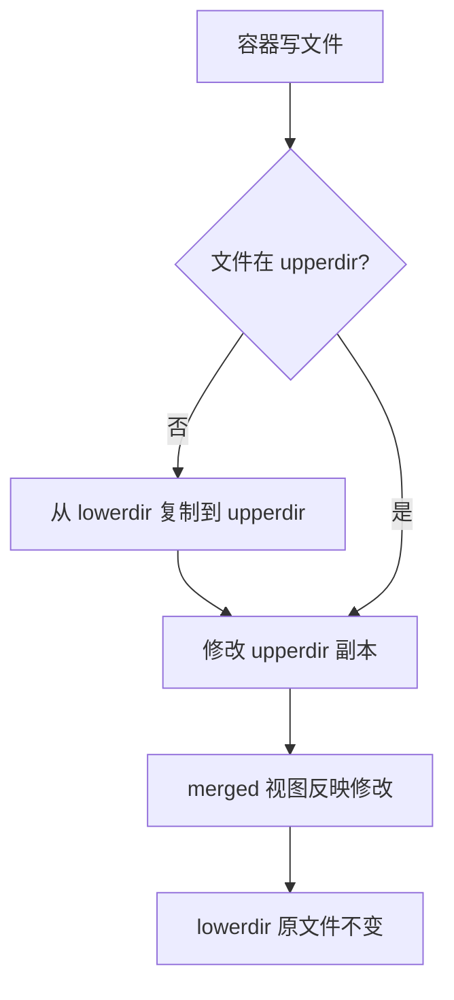

# Docker 存储模型

> **一句话定位**：容器可写层随删除消失，volume/bind/tmpfs 三种挂载与 whiteout 陷阱是生产事故高频根因。
> **面试热度**：⭐⭐⭐
> **返回**：[Docker 知识图谱](../README.md)

---

## 一、概念定义

### 1.1 容器存储的两层结构

Docker 容器看到的文件系统不是一块裸磁盘，而是由 **OverlayFS 联合挂载** 出来的"分身"。从存储视角看，容器存储由两层叠加而成：

```
┌─────────────────────────────────────────────────┐
│  merged 视图（容器内 / 看到的统一文件系统）     │  ← 容器进程读写这里
├─────────────────────────────────────────────────┤
│  upperdir（可写容器层，容器修改写在这里）       │  ← 每个容器独有，随 rm 消失
├─────────────────────────────────────────────────┤
│  lowerdir（只读镜像层，可多层叠加）             │  ← 镜像分层，多容器共享
└─────────────────────────────────────────────────┘
```

- **lowerdir（只读镜像层）**：Dockerfile 的每条 `FROM`/`RUN`/`COPY`/`ADD` 指令产生一层，存放在 `/var/lib/docker/overlay2/<hash>/diff/` 下。同一镜像启动的 100 个容器，lowerdir 只占一份磁盘空间——这是镜像"模板复用"的物理基础。
- **upperdir（可写容器层）**：容器运行时所有写操作（新建文件、修改文件、删除文件）都落在这层，位于 `/var/lib/docker/overlay2/<id>/diff/`。**upperdir 与容器生命周期绑定**：`docker rm` 后 upperdir 被清理，里面的数据永久丢失。

> **关键认知**：`docker stop` 只是停进程，upperdir 仍在；`docker rm` 才会清掉 upperdir。容器"重启数据还在"是因为容器没被 rm，不是数据被持久化了——这是最常见的存储误解。

### 1.2 存储持久化的本质

容器可写层**天然不持久化**——它随 `docker rm` 消失。若要数据跨容器生命周期存活，必须把写操作**绕开 upperdir**，挂载外部存储到容器内：

| 数据去向 | 是否随 `docker rm` 消失 | 持久化手段 |
|---------|----------------------|-----------|
| upperdir（默认可写层） | ✅ 消失 | 无（需挂载外部存储） |
| volume（dockerd 管理的命名目录） | ❌ 保留 | `docker volume` 命令管理 |
| bind mount（宿主绝对路径） | ❌ 保留（在宿主磁盘） | 宿主文件系统直接管理 |
| tmpfs（内存） | ✅ 消失（容器停止即丢） | 不持久化，只做临时存储 |

**一句话**：Docker 存储持久化的本质 = 把"需要留存的数据"从 CoW 可写层移走，挂到 volume / bind mount 这类独立于容器生命周期的存储上。

### 1.3 Docker 存储驱动一览

存储驱动（storage driver）负责管理 lowerdir + upperdir 的联合挂载与 CoW。Docker 历史上支持多种驱动，但生产环境已收敛到 overlay2 一家：

| 驱动 | 上游状态 | 性能 | 稳定性 | 适用场景 | 现状 |
|------|---------|------|--------|---------|------|
| **overlay2** | Linux mainline（4.0+） | 优（VFS cache） | 高 | ext4/xfs 主流文件系统 | ✅ 默认推荐 |
| overlay（旧版） | Linux mainline（3.18+） | 中 | 中（单 lowerdir 限制） | 早期内核兼容 | ⛔ 已弃用 |
| aufs | 不在主线（Ubuntu 私有） | 慢（多层查找 O(n)） | 中 | Docker 早期默认 | ⛔ 已弃用 |
| devicemapper | LVM/thin-pool | 中 | 低（loop-lvm 易坏） | 历史遗留（RHEL 6 时代） | ⛔ 不推荐 |
| btrfs | mainline | 优（快照原生） | 中（稳定性争议） | btrfs 文件系统 | ⚠️ 少见 |
| zfs | mainline（OpenZFS） | 优（ARC + 快照） | 高 | Solaris/FreeBSD 血统 | ⚠️ 少见 |
| vfs | 无 CoW | 差（全量复制） | 最高（纯 POSIX） | 测试/兼容性兜底 | ⚠️ 仅测试 |

> **记忆口诀**：生产只认 **overlay2**。其余驱动要么已弃用（aufs/旧 overlay），要么有稳定性包袱（devicemapper 的 loop-lvm），要么要求特定文件系统（btrfs/zfs），要么性能太差只能测试（vfs）。

> **关联**：[容器本质与底层原理](../01-foundation/container-principle.md) §2.3 UnionFS / OverlayFS——OverlayFS 的四层结构与 CoW 原理在此处从存储视角展开。

### 1.4 三种数据挂载方式对比

Docker 提供三种挂载方式把外部存储接入容器，区别在于"谁管理路径"与"数据落在哪里"：

| 维度 | volume | bind mount | tmpfs |
|------|--------|-----------|-------|
| **管理方** | dockerd（`/var/lib/docker/volumes/`） | 用户（宿主任意绝对路径） | 内核内存 |
| **生命周期** | 独立于容器，需 `docker volume rm` 显式删 | 跟随宿主文件系统 | 容器停止即消失 |
| **性能** | 接近宿主磁盘（无 CoW 开销） | 接近宿主磁盘 | 内存速度（最快） |
| **跨主机** | ✅ 支持 volume driver（NFS/云盘/Ceph RBD） | ❌ 宿主路径强绑定 | ❌ 仅本机内存 |
| **权限隔离** | dockerd 管理，路径隔离宿主系统 | 容器内 root 可直改宿主文件 | 容器内独享 |
| **初始化行为** | 空 volume 首次挂载自动复制镜像内容 | 直接覆盖镜像同名路径 | 不复制 |
| **典型场景** | 数据库数据、应用日志、生产持久化 | 开发挂源码、挂配置文件、挂 docker.sock | 密钥、临时缓存、敏感中间数据 |

```bash
# volume（推荐生产）
docker run -v myvol:/data myapp

# bind mount（开发/配置注入）
docker run -v /host/path/to/config.yml:/app/config.yml myapp

# tmpfs（内存临时存储）
docker run --tmpfs /run/secrets:rw,size=64m myapp
```

> **选型口诀**：生产用 volume（管理规范、可跨主机、权限隔离），开发挂源码/配置用 bind mount（灵活），临时敏感数据用 tmpfs（快、不留痕）。

---

## 二、原理与流程

### 2.1 OverlayFS 详解（存储视角）

[容器本质与底层原理](../01-foundation/container-principle.md) §2.3 从 unionfs 概念视角介绍过 OverlayFS，这里从存储驱动落地视角展开四个核心机制。

#### 2.1.1 四层结构

OverlayFS 的挂载由四个目录协同构成，`mount` 命令把它们组合成容器看到的统一视图：

```bash
mount -t overlay overlay \
  -o lowerdir=/lower1:/lower2:/lower3,upperdir=/upper,workdir=/work \
  /merged
```

| 目录 | 角色 | 数量 | 读写 | 存放位置 |
|------|------|------|------|---------|
| **lowerdir** | 只读镜像层 | 可多个（`:` 分隔） | 只读 | `/var/lib/docker/overlay2/<hash>/diff/` |
| **upperdir** | 可写容器层 | 1 个 | 读写 | `/var/lib/docker/overlay2/<id>/diff/` |
| **workdir** | OverlayFS 内部工作目录（用于 CoW 的临时副本） | 1 个 | 内部使用 | `/var/lib/docker/overlay2/<id>/work/` |
| **merged** | 挂载点，容器进程看到的统一视图 | 1 个 | 读写 | 容器 rootfs 根目录 |

**层叠顺序**：lowerdir 按 `:` 从左到右是**从上到下**的层叠顺序——`/lower1` 在最上层，遮挡 `/lower2` 的同名文件。upperdir 在所有 lowerdir 之上，是最优先的读写层。

**验证容器的 OverlayFS 挂载**：

```bash
# 容器内看到的根目录就是 merged
$ docker exec demo ls /
bin  boot  dev  etc  home  ...

# 宿主查看容器的挂载信息
$ docker inspect demo --format '{{json .GraphDriver.Data}}' | jq
{
  "LowerDir": "/var/lib/docker/overlay2/.../diff:/var/lib/docker/overlay2/.../diff",
  "UpperDir": "/var/lib/docker/overlay2/.../diff",
  "WorkDir": "/var/lib/docker/overlay2/.../work",
  "MergedDir": "/var/lib/docker/overlay2/.../merged"
}

# 宿主查看 mount 表
$ mount | grep overlay
overlay on /var/lib/docker/overlay2/.../merged type overlay (
  lowerdir=...,upperdir=...,workdir=...
)
```

#### 2.1.2 写时复制（Copy-On-Write）流程

容器修改文件时，OverlayFS 不会直接改 lowerdir（只读），而是把文件**整个复制**到 upperdir 再改副本——这就是写时复制。CoW 是 **file-level**（整文件复制），不是 block-level（块级复制），所以修改一个 1GB 文件的一个字节也会占 1GB 的 upperdir 空间。



**逐步解读**：

1. **容器写文件**（如 `echo "hello" > /etc/config`）：进程发起 `write()` syscall。
2. **判断 upperdir 是否已有该文件**：
   - **否（首次写）**：OverlayFS 从 lowerdir 找到原文件，**整个复制**到 upperdir（这就是 CoW 的"复制"动作），然后写 upperdir 副本。
   - **是（已写过）**：直接改 upperdir 副本，不碰 lowerdir。
3. **merged 视图反映修改**：容器内 `cat /etc/config` 看到 upperdir 的新内容——OverlayFS 查找时 upperdir 优先级高于 lowerdir。
4. **lowerdir 原文件不变**：镜像层始终只读，多个容器共享同一 lowerdir 不受影响。

**性能代价**：首次修改大文件会触发整文件复制，磁盘 IO 与空间占用双涨。例如在 500MB 的 jar 包上改一个配置，upperdir 会多占 500MB——这是容器内改大文件的隐藏成本。

#### 2.1.3 删除文件机制：whiteout

容器内 `rm /etc/unused.conf` 删文件，OverlayFS 不会真的从 lowerdir 删（lowerdir 只读），而是在 upperdir 创建一个 **whiteout 文件**——一个**字符设备 0/0**（主设备号 0，次设备号 0），告诉 merged 视图"这个文件被删了"。

```bash
# 容器内删文件
$ docker exec demo rm /etc/unused.conf

# 宿主查看 upperdir，会看到 whiteout 文件
$ ls -l /var/lib/docker/overlay2/<id>/diff/etc/unused.conf
c--------- 1 root root 0, 0 Aug  9 10:00 unused.conf
#                                                            ↑ 字符设备 0/0
```

**whiteout 的语义**：merged 视图查找文件时，若 upperdir 有同名 whiteout 文件，就"假装"该文件不存在——lowerdir 的原文件仍保留，只是被遮挡。

**目录删除**：删目录用 **opaque xattr**（扩展属性 `trusted.overlay.opaque=y`），标记 upperdir 的同名目录为"不透明"，merged 视图不再合并 lowerdir 的同名目录内容。

#### 2.1.4 whiteout 陷阱：删文件不会减小镜像

这是面试与生产事故的双重高频点：**在 Dockerfile 的中间层删文件，镜像不但不会变小，反而可能变大**。

**原因**：Dockerfile 每条指令产生一层，删除动作本身也是一个新层——这个新层里有一个 whiteout 文件，遮蔽了下面层的原文件，但**下面层的原文件还在**。最终镜像大小 = 所有层大小之和，删文件的 whiteout 层只增加了几字节，原文件那层一字节没少。

```dockerfile
# 反例：删大文件反而镜像变大
FROM alpine
COPY big.tar.gz /tmp/           # 第 2 层：+500MB（big.tar.gz 在这层）
RUN tar -xzf /tmp/big.tar.gz    # 第 3 层：+解压后内容
RUN rm /tmp/big.tar.gz          # 第 4 层：+whiteout 几字节，但第 2 层的 500MB 仍在！
# 最终镜像 ≈ alpine + 500MB + 解压内容 + 几字节 whiteout
```

**解法**：把"复制 + 解压 + 删除"合并到**同一层**，或用**多阶段构建**：

```dockerfile
# 正解 1：合并到同一层（&& 链）
FROM alpine
COPY big.tar.gz /tmp/
RUN tar -xzf /tmp/big.tar.gz && rm /tmp/big.tar.gz   # 同一层内删，不产生 whiteout 残留

# 正解 2：多阶段构建（推荐）
FROM alpine AS extract
COPY big.tar.gz /tmp/
RUN tar -xzf /tmp/big.tar.gz           # 解压在 builder 层
FROM alpine
COPY --from=extract /tmp/extracted /app # 只复制解压后的内容，big.tar.gz 不会进入最终镜像
```

> **记忆**：Dockerfile 删文件要"同层删"或"多阶段构建"，别在中间层删——whiteout 只是遮挡，不是删除。

#### 2.1.5 overlay2 vs overlay 的区别

Docker 历史上有两个 OverlayFS 驱动：`overlay`（旧）与 `overlay2`（新）。两者核心差异在 lowerdir 的组织方式：

| 维度 | overlay（旧） | overlay2（新） |
|------|---------------|----------------|
| **lowerdir 组织** | 把所有镜像层合并成**单个** lowerdir | 保留镜像层结构，lowerdir **多个**原生挂载 |
| **镜像层数与 lowerdir 数** | 1:1（无论镜像多少层，lowerdir 只有 1 个） | 1:N（镜像 N 层 → lowerdir N 个） |
| **性能** | 差（合并需额外 IO，缓存命中率低） | 优（VFS page cache 直接命中各层） |
| **稳定性** | 低（层间合并有竞态） | 高（内核原生多层支持） |
| **Docker 版本** | 1.12-（早期） | 1.12+ 默认，18.06+ 唯一推荐 |
| **内核要求** | 3.18+ | 4.0+ |

**为什么 overlay2 更快**：overlay 的"合并成单 lowerdir"需要在 dockerd 层做一次额外的目录合并 IO；overlay2 直接利用内核 4.0+ 的多层 OverlayFS 支持，lowerdir 原生按镜像层挂载，VFS 的 page cache 能直接缓存每一层，重复读命中率高。

> **结论**：现代 Docker 只用 `overlay2`，`overlay` 与 `aufs` 都已弃用，无需深究旧版差异。

### 2.2 Volume（推荐方式）

#### 2.2.1 本质与生命周期

volume 是 dockerd 在 `/var/lib/docker/volumes/<name>/_data/` 下管理的命名目录，**独立于容器生命周期**：

```bash
# 创建命名 volume
$ docker volume create myvol
myvol

# 查看存放位置
$ docker volume inspect myvol
[
  {
    "Name": "myvol",
    "Mountpoint": "/var/lib/docker/volumes/myvol/_data",
    "Driver": "local"
  }
]

# 挂载到容器
$ docker run -v myvol:/data myapp
# 容器内 /data 实际指向 /var/lib/docker/volumes/myvol/_data
```

- **生命周期独立**：`docker rm` 容器后，volume 仍在；需 `docker volume rm myvol` 显式删除。未挂载的 dangling volume 可用 `docker volume prune` 批量清理。
- **路径隔离**：volume 在 dockerd 管理的目录下，不暴露宿主系统任意路径，容器内 root 也无法通过 volume 访问 `/etc/passwd` 这类宿主敏感文件。
- **driver 扩展**：`-v myvol:/data:driver=...` 可指定第三方驱动，如 `local`（默认）、`nfs`、`cifs`、`cloud`（EBS/云盘）、`ceph-rbd`，实现跨主机持久化。

#### 2.2.2 named volume vs anonymous volume

| 类型 | 创建方式 | 典型命令 | 引用方式 |
|------|---------|---------|---------|
| **named volume** | 显式命名 | `docker volume create myvol` | `-v myvol:/data` |
| **anonymous volume** | Docker 自动生成随机名 | `docker run -v /data myapp`（只写容器内路径） | 每次启动生成新 volume，容器删后留 dangling |

**陷阱**：`docker run -v /data myapp`（只写容器路径，不写宿主路径）创建的是 anonymous volume，容器删除后 volume 仍残留，长期累积磁盘膨胀。生产应始终用 named volume。

#### 2.2.3 初始化行为：空 volume 自动复制镜像内容

挂载一个**空 volume**到容器内某路径时，dockerd 会先把镜像里该路径的内容**复制到 volume**，再挂载——这样首次启动就能拿到镜像自带的初始数据（如默认配置文件）。

```bash
# 镜像里 /etc/nginx/conf.d/ 有 default.conf
$ docker run -v nginx-conf:/etc/nginx/conf.d nginx:alpine
# 启动后 nginx-conf volume 里已有 default.conf（从镜像复制来的）
```

**关键**：若 volume **非空**（已有数据），则**不会**复制镜像内容，直接用 volume 现有数据挂载——这是"覆盖镜像内容"的另一种形式，配置升级时需注意旧 volume 不会自动更新镜像里的新默认配置。

### 2.3 bind mount

#### 2.3.1 本质与典型场景

bind mount 是把**宿主文件系统的绝对路径**直接挂载到容器内某路径，绕过 dockerd 的 volume 管理：

```bash
# 挂载宿主目录到容器
docker run -v /host/path:/container/path myapp

# 挂载单个文件（如配置文件）
docker run -v /host/app.yml:/app/config/app.yml myapp

# 只读挂载
docker run -v /host/app.yml:/app/config/app.yml:ro myapp
```

**典型场景**：

- 开发期挂源码做热重载：`-v ./src:/app/src`，本地改代码容器内立即生效。
- 挂配置文件：`-v /etc/myapp/config.yml:/app/config.yml`，配置外部化。
- 挂 docker.sock 让容器内能调用 dockerd API：`-v /var/run/docker.sock:/var/run/docker.sock`（CI/CD、Portainer 这类管理工具常用）。

#### 2.3.2 bind mount 的三大陷阱

bind mount 灵活但坑多，以下三类是生产事故高频根因：

**陷阱 1：挂载点不存在时 Docker 自动创建目录（而非文件）**

```bash
# 想挂载配置文件，但宿主路径不存在
$ docker run -v /host/missing.yml:/app/config.yml myapp
# Docker 自动在宿主创建 /host/missing.yml，但它是个【目录】不是文件！
# 容器内 /app/config.yml 也是目录，应用读配置报错
```

**根因**：Docker 发现宿主路径不存在时，默认创建**目录**（mkdir），不会创建文件。若挂载目标是文件（如 `config.yml`），宿主却生成了同名目录，容器内应用 `cat /app/config.yml` 会报 "Is a directory"。

**复现与修复**：

```bash
# 复现
$ ls /host/missing.yml 2>/dev/null  # 宿主没有这个文件
$ docker run --rm -v /host/missing.yml:/app/config.yml alpine ls -l /app/config.yml
drwxr-xr-x 2 root root 4096 ... /app/config.yml   # 是目录！

# 修复：启动前先在宿主创建文件
$ touch /host/config.yml
$ docker run -v /host/config.yml:/app/config.yml myapp  # 现在是文件挂载
```

**陷阱 2：宿主文件 owner/uid 与容器内不一致，权限报错**

```bash
# 宿主以普通用户 zihao (uid=1000) 创建配置文件
$ ls -l /host/app.yml
-rw-r--r-- 1 zihao zihao 1024 ... /host/app.yml

# 容器内进程以 root (uid=0) 运行，能读写
# 但若容器以 --user 1000 运行，且宿主文件是 root 拥有的：
$ docker run --user 1000:1000 -v /root-owned.yml:/app/config.yml myapp
# 容器内 uid=1000 的进程读 /app/config.yml → Permission denied
```

**根因**：bind mount 保留宿主文件的 uid/gid，容器内进程的 uid 必须与宿主文件 uid 匹配才能读写。容器内 `root (uid=0)` 就是宿主 `root`，但容器内 `app (uid=1000)` 不一定等于宿主 `uid=1000` 的用户——uid 是数字匹配，不认用户名。

**解法**：① 统一 uid（构建镜像时 `useradd -u 1000 app`）；② 用 `--user` 显式指定容器 uid；③ 挂载时 `:ro` 只读避免写权限问题。

**陷阱 3：覆盖镜像内容——挂载点遮蔽镜像里同名路径**

```bash
# 镜像里 /app/templates/ 有 50 个模板文件
$ docker run myapp ls /app/templates/
header.tpl  footer.tpl  ... (50 个文件)

# bind mount 一个空目录到 /app/templates/
$ docker run -v /host/empty:/app/templates/ myapp ls /app/templates/
# 输出为空！/app/templates/ 被 /host/empty 完全遮蔽
```

**根因**：bind mount 是**整路径替换**，容器内 `/app/templates/` 整个被宿主 `/host/empty` 替换，镜像里原来的 50 个模板文件"消失"了——不是被删，是被挂载点遮挡，merged 视图看不到。

**与 volume 的差异**：volume 首次挂载空 volume 会**复制**镜像内容（§2.2.3），bind mount **不会**复制，直接覆盖。这是 volume 比 bind mount 更"安全"的一个原因。

**解法**：① 挂载前先把宿主路径填上镜像内容（`docker cp myapp:/app/templates/. /host/empty/`）；② 用 volume 代替 bind mount（空 volume 会自动复制镜像内容）；③ 改挂载策略，只挂需要外部化的子路径。

### 2.4 tmpfs mount

tmpfs 把挂载点放在**内核内存**，不落磁盘，速度最快但容量受限：

```bash
# 挂载 tmpfs，限 64MB
$ docker run --tmpfs /run/secrets:rw,size=64m myapp

# 或用 -v 语法
$ docker run -v /run/secrets:tmpfs:size=64m myapp
```

**特点**：

| 维度 | 表现 |
|------|------|
| 速度 | 内存速度（最快，无磁盘 IO） |
| 容量 | 受 `size` 参数限制，默认 50% 系统内存 |
| 持久化 | ❌ 容器停止即丢 |
| 跨主机 | ❌ 仅本机内存 |
| 平台 | ⚠️ 仅 Linux（macOS/Windows Docker Desktop 不支持） |

**典型场景**：

- **密钥/令牌**：API token、JWT 签名密钥挂到 tmpfs，进程退出即消失，不留磁盘痕迹。
- **临时缓存**：编译中间产物、session 缓存，频繁读写又不需持久化。
- **敏感中间数据**：加解密的临时明文，避免落盘后被取证。

> **注意**：tmpfs 受容器内存 cgroup 限制，size 过大会挤占应用堆内存。生产场景优先用 volume + 文件权限控制，tmpfs 仅用于"绝不能落盘"的少量数据。

### 2.5 存储驱动选型与生产实践

#### 2.5.1 overlay2 几乎是唯一推荐

生产环境 99% 的场景都该用 overlay2，理由如下：

| 驱动 | 为何不推荐 |
|------|-----------|
| aufs | 不在内核主线，仅 Ubuntu 私有，已弃用 |
| devicemapper | loop-lvm 模式在生产易损坏（thin-pool 元数据 corruption），direct-lvm 需独立块设备配置复杂 |
| btrfs | 文件系统本身稳定性有争议（RAID5/6 write-hole bug），且 Docker 支持投入不足 |
| zfs | 授权协议问题（CDDL vs GPL），且需额外内存（ARC），Linux 发行版默认不带 |
| vfs | 无 CoW，每次写全量复制，性能灾难，仅用于测试 |

**唯一例外**：某些历史 RHEL 6 系统（内核 < 4.0）不支持 overlay2，只能退回 devicemapper direct-lvm——但这类系统早该升级了。

#### 2.5.2 devicemapper 的 loop-lvm 是历史包袱

devicemapper 有两种模式：

- **loop-lvm**（默认）：用一个稀疏文件模拟块设备，**生产不可用**——元数据易 corruption，性能差（多一层 loop 转换）。
- **direct-lvm**：直接用 LVM thin-pool 块设备，性能与稳定性可接受，但需预先规划 LVM 卷，配置繁琐。

> **警示**：若 `docker info` 看到 `Storage Driver: devicemapper` 且 `Backing Filesystem: xfs` 且有 `Data loop file` 字样，说明在用 loop-lvm，**生产必出事**——要么升级内核换 overlay2，要么配 direct-lvm。

#### 2.5.3 镜像层与容器层的 GC

Docker 的存储占用会随镜像/容器累积膨胀，需定期 GC：

| 命令 | 清理对象 | 风险 |
|------|---------|------|
| `docker image prune` | dangling 镜像（无 tag 的中间层） | 低 |
| `docker image prune -a` | 所有未被容器使用的镜像 | 中（可能删掉想保留的镜像） |
| `docker container prune` | 已停止的容器 | 中（upperdir 会一起清掉） |
| `docker volume prune` | dangling volume（无容器引用） | 高（可能删掉想保留的数据） |
| `docker system prune` | 上面所有 + 构建缓存 | 高 |
| `docker system prune -a --volumes` | 所有未被使用的镜像/容器/网络/构建缓存/volume | 极高（数据可能丢失） |

> **生产建议**：volume 的 prune 需额外审批，避免误删数据。可加 `--filter "until=24h"` 只清 24 小时前的，或用 `label` 标记保留的 volume。

### 2.6 数据持久化模式

按业务类型，数据持久化的典型模式如下：

| 业务类型 | 推荐方案 | 关键点 |
|---------|---------|--------|
| **数据库容器**（MySQL/PostgreSQL/Redis） | named volume + 定期备份 | 数据目录挂 volume，初始化脚本放 `/docker-entrypoint-initdb.d/` |
| **日志收集** | volume 或 bind mount + 日志采集 agent | 应用日志写文件到 volume，Filebeat/Fluentd 采集 |
| **配置注入** | bind mount 单文件 / 环境变量 / `--env-file` | 配置外部化，镜像与配置解耦 |
| **上传文件/对象存储** | volume + 定期归档到对象存储 | 不落容器可写层，volume 做缓冲 |
| **密钥/证书** | tmpfs / Docker Secret（Swarm）| 不落盘，容器停即消失 |
| **构建缓存** | BuildKit cache mount（`--mount=type=cache`） | 跨构建复用，不进镜像层 |

> **关联**：[Docker Compose 多容器编排](../06-compose/docker-compose.md)——Compose 的 `volumes` 字段把上述模式声明式化，生产拓扑用 YAML 描述。

---

## 三、高频追问与面试题

### Q1：容器删除后数据还在吗？

**参考答案**：取决于数据写在哪儿：

| 数据位置 | `docker rm` 后是否保留 |
|---------|----------------------|
| upperdir（默认可写层） | ❌ 消失（upperdir 随容器删除清理） |
| volume（named/anonymous） | ✅ 保留（需 `docker volume rm` 显式删） |
| bind mount（宿主路径） | ✅ 保留（在宿主磁盘，容器删了文件还在） |
| tmpfs（内存） | ❌ 消失（容器停止即丢） |

**关键**：`docker stop` / `docker restart` 不删 upperdir，数据还在；只有 `docker rm` 才清 upperdir。"容器重启数据还在"不等于"数据持久化"——重启没删容器，upperdir 还在而已。

### Q2：volume 和 bind mount 该用哪个？

**参考答案**：

| 场景 | 推荐 | 理由 |
|------|------|------|
| 生产持久化（数据库/日志/上传文件） | volume | dockerd 管理、路径隔离、可跨主机、有备份命令 |
| 开发挂源码热重载 | bind mount | 灵活、直接映射宿主路径、改即生效 |
| 挂配置文件 | bind mount（单文件） | 精准挂载，不污染其他路径 |
| 挂 docker.sock（管理工具） | bind mount | 唯一选择，sock 是宿主文件 |
| 跨主机分布式存储 | volume + driver | volume driver 支持 NFS/云盘/Ceph，bind mount 不支持 |

**口诀**：生产用 volume（规范、隔离、可迁移），开发挂源码/配置用 bind mount（灵活），密钥用 tmpfs（不落盘）。

### Q3：在容器里删了文件，镜像会变小吗？

**参考答案**：**不会，反而可能变大**——这是 whiteout 陷阱。

**原因**：Dockerfile 每条指令产生一层，删除动作本身也是一个新层。这个新层里是 whiteout 文件（字符设备 0/0），遮蔽了下面层的原文件，但**下面层的原文件还在**。最终镜像大小 = 所有层之和，whiteout 层只增加几字节，原文件那层一字节没少。

**解法**：

```dockerfile
# 反例：中间层删大文件，镜像仍含 500MB
COPY big.tar.gz /tmp/         # 第 2 层 +500MB
RUN rm /tmp/big.tar.gz        # 第 3 层 +whiteout 几字节，第 2 层 500MB 仍在

# 正解 1：同层删（&& 链）
RUN tar -xzf /tmp/big.tar.gz && rm /tmp/big.tar.gz

# 正解 2：多阶段构建（推荐）
FROM alpine AS extract
COPY big.tar.gz /tmp/
RUN tar -xzf /tmp/big.tar.gz
FROM alpine
COPY --from=extract /tmp/extracted /app  # 只复制解压内容，tar.gz 不进最终镜像
```

> **关联**：[镜像构建与分发](../02-image/dockerfile-and-image.md) §多阶段构建——用 builder 中间镜像分离"构建产物"与"运行依赖"。

### Q4：`docker volume rm` 删不掉怎么办？

**参考答案**：删不掉通常有三种原因：

```bash
$ docker volume rm myvol
Error response from daemon: unable to remove volume: remove myvol: volume is in use

# 原因 1：有容器正在使用
$ docker ps -a --filter volume=myvol
# 若有容器引用，需先 docker rm 容器

# 原因 2：容器已删但 volume 仍标记为 in-use（dangling）
$ docker volume ls -f dangling=true
# 用 prune 清理
$ docker volume prune

# 原因 3：volume driver 异常（如 NFS 挂载点失效）
$ docker volume inspect myvol  # 看 Driver 与 Mountpoint
# 若是第三方 driver，需重启 dockerd 或手动清理 /var/lib/docker/volumes/
```

**强制清理**：确认无容器引用后，可直接删 `/var/lib/docker/volumes/<name>/` 目录（需停 dockerd）。

### Q5：bind mount 挂载点变空了是什么原因？

**参考答案**：两种常见根因：

**根因 1：宿主路径不存在，Docker 自动创建目录**

```bash
$ docker run -v /host/missing:/app/templates myapp
# /host/missing 不存在 → Docker 创建空目录 → 容器内 /app/templates 是空目录
# 镜像里 /app/templates 原有的 50 个文件"消失"了
```

**根因 2：bind mount 覆盖镜像内容**

bind mount 是**整路径替换**，容器内挂载点被宿主路径完全遮蔽，镜像里同名路径的原内容看不到。这与 volume 不同——空 volume 首次挂载会**复制**镜像内容，bind mount **不会**复制。

**解法**：① 挂载前先把镜像内容复制到宿主路径（`docker cp myapp:/app/templates/. /host/empty/`）；② 改用 volume（空 volume 自动复制镜像内容）；③ 只挂需要外部化的子路径，不挂整个目录。

### Q6：overlay2 和 overlay 有什么区别？

**参考答案**：核心差异在 lowerdir 的组织方式：

| 维度 | overlay（旧） | overlay2（新） |
|------|---------------|----------------|
| lowerdir 组织 | 镜像多层合并成**单个** lowerdir | 保留镜像层结构，**多个** lowerdir 原生挂载 |
| 性能 | 差（合并需额外 IO，cache 命中率低） | 优（VFS page cache 直接缓存各层） |
| 稳定性 | 低（层间合并有竞态） | 高（内核 4.0+ 原生多层支持） |
| Docker 版本 | 1.12- | 1.12+ 默认，18.06+ 唯一推荐 |

**为什么 overlay2 更快**：overlay 要在 dockerd 层把镜像多层合并成一个目录，多一次 IO；overlay2 直接利用内核 4.0+ 的多层 OverlayFS 支持，lowerdir 按镜像层原生挂载，VFS page cache 能直接缓存每一层，重复读命中率高。

**结论**：现代 Docker 只用 overlay2，overlay 已弃用。

### Q7：怎么备份数据库容器的数据？

**参考答案**：三种主流方案，按可靠性递增：

**方案 1：volume 快照（文件级复制）**

```bash
# 停容器保证一致性
$ docker stop mysql
# 复制 volume 目录
$ tar -czf mysql-backup.tar.gz /var/lib/docker/volumes/mysql-data/_data
# 或用 docker run --volumes-from
$ docker run --rm -v mysql-data:/data -v $(pwd):/backup alpine \
    tar -czf /backup/mysql-backup.tar.gz /data
```

**方案 2：`docker run --volumes-from`（共享 volume）**

```bash
# 启动一个临时容器，共享 mysql 容器的所有 volume
$ docker run --rm --volumes-from mysql -v $(pwd):/backup alpine \
    tar -czf /backup/mysql-backup.tar.gz /var/lib/mysql
# --volumes-from 让临时容器看到 mysql 容器挂载的所有 volume，可读取数据打包
```

**方案 3：物理备份（应用层导出）**

```bash
# MySQL 的 mysqldump（逻辑备份，跨版本兼容）
$ docker exec mysql mysqldump -u root -p$PASSWORD --all-databases > backup.sql

# PostgreSQL 的 pg_dump
$ docker exec postgres pg_dump -U postgres mydb > backup.sql
```

**生产建议**：逻辑备份（mysqldump/pg_dump）跨版本兼容、可单库恢复，是首选；volume 快照是物理备份，恢复快但依赖同版本镜像。两者结合：日常逻辑备份，重大变更前 volume 快照。

### Q8：容器写大文件性能为什么突然变差？

**参考答案**：CoW 的 file-level 复制是根因。

容器**首次修改**一个 N MB 的文件，OverlayFS 会把整个文件从 lowerdir 复制到 upperdir，再写副本——这一瞬间的磁盘 IO 是 2N（读 N + 写 N），upperdir 空间涨 N MB。

**典型踩坑**：日志直接写容器可写层（没挂 volume），单个日志文件到 GB 级，每次 append 都触发 CoW 副本更新（虽然首次复制后后续写都在 upperdir，但大文件的 CoW 副本本身占空间且 IO 集中）。

**解法**：① 日志、临时大文件、编译产物一律挂 volume 或 bind mount，绕开 CoW；② 用 `fallocate` 预分配 volume 空间，避免碎片；③ 监控 upperdir 大小（`du -sh /var/lib/docker/overlay2/<id>/diff/`），超阈值告警。

---

## 四、实战关联（Java 后端视角）

### 4.1 Spring Boot 应用的配置注入与数据持久化

#### 4.1.1 配置外部化的三种方式

Spring Boot 容器化部署时，`application.yml` 通常需要外部化（不打包进镜像），主流有三种方案：

| 方式 | 命令 | 优点 | 缺点 |
|------|------|------|------|
| **bind mount 配置文件** | `-v /host/app.yml:/app/config/app.yml` | 改文件即生效（配合 `spring.config.location`），无需重启容器 | 路径强绑定宿主，跨环境迁移需同步路径 |
| **环境变量** | `-e SPRING_DATASOURCE_URL=jdbc:mysql://db:3306/mydb` | 跨平台、Compose/K8s 友好、12-factor 标准 | 复杂配置（YAML 嵌套）用环境变量表达别扭 |
| **`--env-file`** | `--env-file /host/env.list` | 多环境批量注入、文件管理 | 需维护 env 文件，敏感信息明文 |

**bind mount 配置文件陷阱**：宿主路径不存在时 Docker 自动创建**目录**（§2.3.2 陷阱 1），`/app/config/app.yml` 变成目录后 Spring Boot 读取报错：

```bash
# 反例：宿主没有 app.yml，Docker 自动创建目录
$ docker run -v /host/app.yml:/app/config/app.yml myapp
# Spring Boot 启动报错：无法读取目录形式的配置文件

# 正解：启动前先在宿主创建文件
$ touch /host/app.yml && echo "server.port: 8080" > /host/app.yml
$ docker run -v /host/app.yml:/app/config/app.yml myapp
```

#### 4.1.2 `spring.config.import` 与 `SPRING_APPLICATION_JSON`

Spring Boot 2.4+ 引入 `spring.config.import`，支持从外部源（文件、consul、vault）导入配置，在容器内尤其灵活：

```yaml
# application.yml（镜像内）
spring:
  config:
    import:
      - optional:file:./config/override.yml   # 可选，挂载覆盖
      - optional:env:SPRING_APPLICATION_JSON  # 从环境变量导入 JSON 配置
```

**`SPRING_APPLICATION_JSON`**：把整段 JSON 配置塞进环境变量，Spring Boot 解析后合并到 Environment：

```bash
$ docker run -e SPRING_APPLICATION_JSON='{"server":{"port":9090},"spring":{"datasource":{"url":"jdbc:mysql://db:3306/mydb"}}}' myapp
# 等价于在 application.yml 里写 server.port=9090 与 spring.datasource.url=...
```

**优势**：JSON 能表达嵌套结构（比扁平环境变量强），且可整段加密注入，适合敏感配置。

#### 4.1.3 `@Value` 与配置优先级在容器化下的行为

Spring Boot 的配置优先级（高到低）：

```
1. 命令行参数 (--server.port=9090)
2. 环境变量 (SPRING_DATASOURCE_URL)
3. SPRING_APPLICATION_JSON
4. bind mount 的 application.yml (spring.config.location 指定)
5. 镜像内 application.yml (class path)
6. 默认值 (application.yml 里的默认)
```

容器化下，`docker run -e` 的环境变量优先级高于镜像内的 `application.yml`——这是"配置外部化"能生效的底层保障。`@Value("${server.port}")` 注入的是 Environment 里最高优先级的值，bind mount 的配置文件覆盖镜像内默认值，环境变量又覆盖 bind mount 的配置文件。

**关联 `framework/spring-framework` 模块**：该模块有 `@Value` 与 `ProfileConfig` 的配置实例（`com.yintp.spring.framework.annotation.config.ProfileConfig`），对照理解 Spring 的 `@Value` 字面值、SpEL（`#{}`）、属性占位符（`${}`）三种注入方式在容器化部署下的行为差异——`-e` 环境变量注入的是 `${}` 占位符的值，SpEL `#{}` 表达式在容器内外行为一致。

### 4.2 日志持久化：Spring Boot 默认 console 与文件日志的取舍

#### 4.2.1 默认 console 输出 + docker json-file driver

Spring Boot 默认日志输出到 stdout/stderr，Docker 的 `json-file` driver 接管，落盘到 `/var/lib/docker/containers/<id>/<id>-json.log`：

```bash
# 查看 json-file 日志
$ docker logs app

# 日志文件位置
$ ls /var/lib/docker/containers/<id>/
<id>-json.log

# 配置轮转（防止单容器日志撑爆磁盘）
$ dockerd --log-driver=json-file --log-opt max-size=10m --log-opt max-file=3
```

**陷阱**：`json-file` 默认**不轮转**，长时间运行的容器日志会无限增长撑爆磁盘。生产必加 `max-size` + `max-file`，或改用 `journald`/`fluentd` driver。

#### 4.2.2 文件日志 + bind mount 方案

某些场景（如审计日志、合规要求落文件）需要 Spring Boot 输出文件日志，这时用 bind mount 把日志目录挂出来：

```bash
$ docker run -v /host/logs:/app/logs myapp
# Spring Boot 配置 logging.file.name=/app/logs/app.log
```

**取舍**：

| 方案 | 优点 | 缺点 |
|------|------|------|
| console + json-file | Docker 原生、`docker logs` 统一查看、轮转靠 driver | 单机日志，跨节点聚合需额外采集 |
| 文件日志 + bind mount | 可用 logback 滚动策略、兼容传统运维 | 路径强绑定、跨节点迁移需同步目录、易触发 bind mount 三大陷阱 |

**生产推荐**：console + json-file + `max-size` 轮转 + Filebeat/Fluentd 采集到 ELK/Loki，不在容器内写文件日志。

**关联 `framework/valid` 模块**：该模块有 actuator 健康检查端点设计，对照理解"日志聚合 + 健康检查"的服务质量监控分工——日志聚合做问题定位（事后），健康检查做存活探测（事前），两者互补保障服务可观测性。

### 4.3 数据库容器化

#### 4.3.1 MySQL/PostgreSQL 容器的 volume 挂载

```bash
# MySQL：数据目录挂 volume，初始化脚本挂 bind mount
$ docker run -d \
    -v mysql-data:/var/lib/mysql \                          # 数据目录（volume）
    -v /host/init:/docker-entrypoint-initdb.d \            # 初始化脚本（bind mount）
    -e MYSQL_ROOT_PASSWORD=secret \
    mysql:8

# PostgreSQL
$ docker run -d \
    -v pg-data:/var/lib/postgresql/data \
    -v /host/init:/docker-entrypoint-initdb.d \
    -e POSTGRES_PASSWORD=secret \
    postgres:15
```

**`/docker-entrypoint-initdb.d`**：MySQL/PostgreSQL 官方镜像的入口脚本约定，首次启动（数据目录为空）时执行该目录下的 `.sql`/`.sh`/`.sql.gz` 文件，用于建库建表初始化。volume 已有数据时**不会**重复执行——这是"初始化只在首次"的语义。

#### 4.3.2 生产数据库该不该容器化（权衡表）

| 维度 | 容器化 MySQL | 托管 RDS / 物理机 |
|------|-------------|------------------|
| **运维成本** | 低（docker run 起来） | 高（需 DBA） |
| **高可用** | 难（主从复制需自己搭，跨主机 volume 迁移难） | RDS 自带高可用（多 AZ 故障切换） |
| **备份恢复** | 需自己跑 mysqldump/volume 快照 | RDS 自动快照 + 时间点恢复 |
| **性能** | 受容器 IO 隔离影响，大查询可能触发 cgroup 限流 | 物理机直连存储，性能可预测 |
| **版本升级** | 换镜像 tag，但数据迁移需自己处理 | RDS 一键升级，自动处理数据迁移 |
| **适用场景** | 开发/测试/中小项目/CI | 生产核心业务 |

**结论**：开发与测试用容器化 MySQL 没问题；生产核心数据库优先用托管 RDS（AWS RDS / 阿里云 RDS），或物理机自建。容器化数据库的痛点在**跨主机 volume 迁移**与**高可用主从切换**——Docker 自身不解决，需上 Swarm/K8s + 持久化卷编排，复杂度反而高于直接用 RDS。

> **关联**：[Docker Compose 多容器编排](../06-compose/docker-compose.md) §depends_on 陷阱——MySQL 容器启动≠就绪，需 healthcheck 等待就绪后再起 app。

### 4.4 关联 java-core/jvm：JVM 堆外内存与容器可写层

JVM 的堆外内存（DirectBuffer / Metaspace / 线程栈 / Code Cache）不归 `-Xmx` 管，但都落在容器进程的内存 cgroup 内。与存储模型的交集在**堆外内存的临时文件落盘**：

- **DirectBuffer**：在堆外分配的 Bytebuffer，本身在内存，不落盘。但若 DirectBuffer 溢出触发 `OutOfMemoryError: Direct buffer memory`，JVM 可能 dump 堆到 `/tmp/` 或工作目录——dump 文件落 upperdir，瞬间撑爆可写层。
- **Metaspace**：JVM 元空间，在堆外，不落盘。但 `-XX:+HeapDumpOnOutOfMemoryError` 的 dump 路径若指向容器内路径，会写 upperdir。
- **临时文件**：`File.createTempFile()` 默认写 `/tmp/`，容器内 `/tmp` 在 upperdir（除非 tmpfs 挂载），大量临时文件会撑爆可写层。

**陷阱案例**：

```bash
# JVM OOM dump 到 /app/heapdump.hprof
$ docker run -e JAVA_OPTS="-XX:+HeapDumpOnOutOfMemoryError -XX:HeapDumpPath=/app/heapdump.hprof" myapp
# OOM 触发后，3GB 的 heapdump.hprof 写到 upperdir
# upperdir 撑爆 → 容器磁盘满 → 后续写操作全失败
```

**解法**：① dump 路径指向挂载的 volume：`-XX:HeapDumpPath=/data/heapdump.hprof`，`-v heap-dumps:/data`；② `/tmp` 用 tmpfs 挂载，限制大小：`--tmpfs /tmp:size=256m`；③ 监控 upperdir 大小，超阈值告警。

**关联 `java-core/jvm` 模块**：该模块有 JVM 内存模型与堆外内存的源码/测试用例，对照理解 JVM 堆外内存预算与容器存储的边界——堆内（`-Xmx`）受 cgroup memory limit 约束，堆外（DirectBuffer/Metaspace）不受 `-Xmx` 约束但受 cgroup 约束，dump 文件落盘则受容器存储可写层容量约束，三者层级不同。

---

## 五、面试案例

### 5.1 "Docker 的存储模型是什么？"——3 分钟标准答法

**3 分钟结构**（约 600 字口述）：

> Docker 容器存储基于 **OverlayFS 联合挂载**，分两层：**lowerdir** 是只读镜像层，Dockerfile 每条指令产生一层，多容器共享；**upperdir** 是可写容器层，容器所有写操作落这里，**随 `docker rm` 消失**。merged 视图把两层叠加，容器进程看到统一文件系统。
>
> 写操作走**写时复制（CoW）**：首次改文件时，OverlayFS 把文件从 lowerdir **整文件复制**到 upperdir 再改副本，lowerdir 原文件不变。CoW 是 file-level，改一个字节也复制整个文件。删除文件用 **whiteout**——在 upperdir 创建字符设备 0/0，遮蔽 lowerdir 同名文件，所以**在 Dockerfile 中间层删文件不会减小镜像**，原文件那层还在，需用同层删（`&&` 链）或多阶段构建。
>
> 可写层不持久化，需挂载外部存储。Docker 提供三种挂载：**volume**（dockerd 管理的命名目录，独立生命周期，生产推荐）、**bind mount**（宿主绝对路径，灵活但有三大陷阱：路径不存在自动建目录、uid 权限不匹配、覆盖镜像内容）、**tmpfs**（内存挂载，最快但不持久）。
>
> 存储驱动方面，**overlay2 是唯一推荐**——它在内核 4.0+ 原生支持多层 lowerdir，性能与稳定性都优于旧 overlay（合并单 lowerdir）与已弃用的 aufs。devicemapper 的 loop-lvm 模式生产易损坏，btrfs/zfs 需特定文件系统，vfs 无 CoW 只能测试。
>
> 生产实践：数据持久化用 named volume（数据库数据、日志、上传文件），配置注入用 bind mount 单文件，密钥用 tmpfs。镜像 GC 用 `docker system prune`，volume prune 需谨慎避免误删数据。

**结构要点**：两层结构（lowerdir/upperdir）→ CoW + whiteout → 三种挂载（volume/bind/tmpfs）→ 存储驱动（overlay2 唯一推荐）→ 生产实践。

### 5.2 "容器删除后数据还在吗？怎么保证数据不丢？"——CoW 层与挂载

**参考答法**：

默认情况下**数据不在**——容器可写层（upperdir）随 `docker rm` 清理，里面的写操作结果全丢。`docker stop` / `restart` 不删 upperdir，数据还在，但这不叫"持久化"，只是"容器没被删"。

**保证数据不丢的三种手段**：

1. **volume**（推荐）：`docker run -v myvol:/data myapp`，数据写在 dockerd 管理的 `/var/lib/docker/volumes/myvol/_data`，独立于容器生命周期，`docker rm` 后 volume 仍在，需 `docker volume rm` 显式删。生产数据库、日志、上传文件都该用 volume。
2. **bind mount**：`docker run -v /host/path:/data myapp`，数据写在宿主文件系统，容器删了文件还在。适合开发挂源码、挂配置文件，生产慎用（路径强绑定、权限陷阱）。
3. **应用层持久化**：数据库容器用 `mysqldump` 定期逻辑备份，或 `docker run --volumes-from` 共享 volume 做物理备份。

**口诀**：默认 upperdir 随 rm 消失 → volume 绕开 CoW 独立存活 → bind mount 落宿主磁盘 → 数据库额外做逻辑备份。

### 5.3 "为什么挂载配置文件后容器内变空目录了？"——bind mount 三大陷阱之一

**参考答法**：

这是 bind mount 的**陷阱 1：挂载点不存在时 Docker 自动创建目录**。

**复现**：

```bash
# 想挂载配置文件 app.yml，但宿主路径不存在
$ ls /host/app.yml 2>/dev/null  # 不存在
$ docker run -v /host/app.yml:/app/config/app.yml myapp
# Docker 在宿主创建 /host/app.yml，但它是【目录】不是文件
# 容器内 /app/config/app.yml 也是目录，Spring Boot 读取报 "Is a directory"
```

**根因**：Docker 发现宿主路径不存在时，默认 `mkdir` 创建目录，不会 `touch` 创建文件。挂载目标是文件（`config.yml`），宿主却生成了同名目录，容器内挂载点也是目录。

**解法**：

1. **启动前先在宿主创建文件**：`touch /host/app.yml` 再挂载。
2. **改用 volume**：空 volume 首次挂载会自动复制镜像内容，不会创建空目录。
3. **只挂目录不挂单文件**：`-v /host/config/:/app/config/`，宿主目录提前放好 `app.yml`。

**延伸**：bind mount 还有两大陷阱——② uid 权限不匹配（容器内 `--user 1000` 读宿主 root 拥有的文件报 Permission denied）；③ 覆盖镜像内容（挂载点遮蔽镜像里同名路径，原内容"消失"）。生产优先用 volume 避免这些陷阱。

### 5.4 "镜像里删了文件，为什么镜像还变大？"——whiteout 陷阱

**参考答法**：

这是 **whiteout 陷阱**。Dockerfile 每条指令产生一层，删除动作本身也是一个新层——这个新层里是 whiteout 文件（字符设备 0/0），遮蔽了下面层的原文件，但**下面层的原文件还在**。

**反例**：

```dockerfile
FROM alpine
COPY big.tar.gz /tmp/        # 第 2 层 +500MB（big.tar.gz 在这层）
RUN tar -xzf /tmp/big.tar.gz # 第 3 层 +解压内容
RUN rm /tmp/big.tar.gz       # 第 4 层 +whiteout 几字节，但第 2 层 500MB 仍在
# 最终镜像 ≈ alpine + 500MB + 解压内容 + 几字节 whiteout
```

第 4 层的 whiteout 只是"告诉 merged 视图 big.tar.gz 不存在了"，但第 2 层的 big.tar.gz 物理上还在镜像里——镜像大小是所有层之和，所以 500MB 一字节没少。

**正解**：

```dockerfile
# 方案 1：同层删（&& 链）
RUN tar -xzf /tmp/big.tar.gz && rm /tmp/big.tar.gz

# 方案 2：多阶段构建（推荐）
FROM alpine AS extract
COPY big.tar.gz /tmp/
RUN tar -xzf /tmp/big.tar.gz
FROM alpine
COPY --from=extract /tmp/extracted /app  # 只复制解压内容，tar.gz 不进最终镜像
```

**底层机制**：whiteout 是 OverlayFS 的删除语义——upperdir 的字符设备 0/0 遮蔽 lowerdir 同名文件，merged 视图"假装"文件不存在，但 lowerdir 原文件物理保留。镜像构建时每条指令都是一层 lowerdir，删文件只在最上层加 whiteout，下面层不变。

> **关联**：[镜像构建与分发](../02-image/dockerfile-and-image.md) §多阶段构建——builder 中间镜像的产物用 `COPY --from` 复制到最终镜像，构建依赖不进最终镜像层。

---

## 六、参考与延伸

- **内核文档**：`Documentation/filesystems/overlayfs.rst`、`Documentation/filesystems/tmpfs.rst`
- **man 手册**：`mount(8)`（overlay 选项）、`tmpfs(5)`、`docker-volume(8)`
- **Docker 官方文档**：Manage data in Docker、Use volumes、Storage drivers overview、OverlayFS driver
- **延伸阅读**：
  - [容器本质与底层原理](../01-foundation/container-principle.md) §2.3 UnionFS / OverlayFS——unionfs 概念与 OverlayFS 四层结构的基础介绍
  - [镜像构建与分发](../02-image/dockerfile-and-image.md)——Dockerfile 分层、多阶段构建、镜像瘦身（whiteout 陷阱的解法）
  - [容器运行时与生命周期](../03-container/container-runtime.md) §1.2 容器与镜像的关系——可写层 upperdir 与容器生命周期绑定
  - [Docker 网络模型](../04-network/docker-network.md)——存储与网络的交叉点（如 macvlan 容器的持久化配置）
  - [Docker Compose 多容器编排](../06-compose/docker-compose.md)——`volumes` 字段声明式描述挂载、`depends_on` 与 volume 就绪
  - [Docker 安全模型](../07-security/docker-security.md)——bind mount 的安全风险（挂 `/etc` 可逃逸）、userns-remap 与 volume 权限
- **ops/network 模块交叉引用**：
  - [云原生网络](../../network/05-system-design/cloud-native.md) §K8s CNI 与 PV/PVC——K8s PersistentVolume 与 Docker volume 的边界（CSI driver 复用 Docker volume driver 思路）
- **仓库内关联**：
  - `framework/spring-framework`——`@Value` 与配置优先级在容器化下的行为、`spring.config.import` 外部化配置
  - `framework/valid`——actuator 健康检查端点 + 日志聚合的服务质量监控
  - `java-core/jvm`——JVM 堆外内存（DirectBuffer/Metaspace）与容器可写层的边界、OOM dump 落盘陷阱

> **返回**：[Docker 知识图谱](../README.md)
