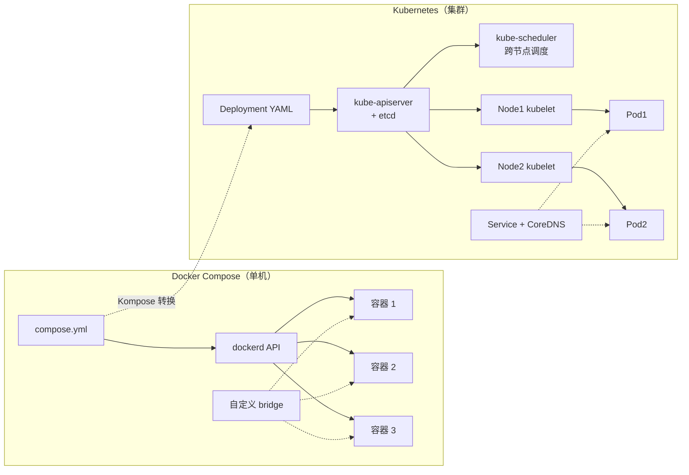
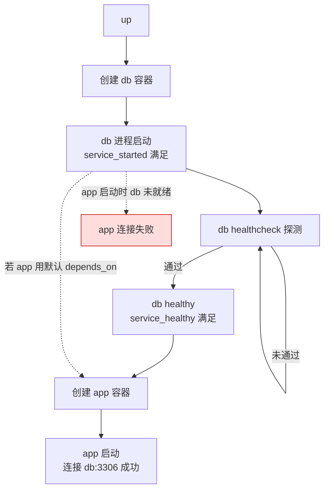
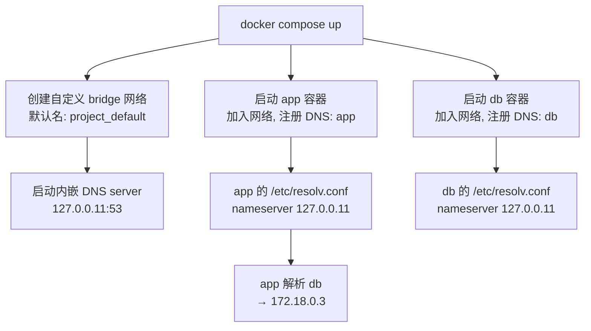

# Docker Compose 多容器编排

> **一句话定位**：Compose 是单机多容器声明式编排工具，depends_on 陷阱与 healthcheck 配合是实操题考点。
> **面试热度**：⭐⭐⭐
> **返回**：[Docker 知识图谱](../README.md)

---

## 一、概念定义

### 1.1 Compose 的定位

Docker Compose 是**单机多容器声明式编排工具**——用一个 `compose.yml` 描述"应用栈 = 服务 + 网络 + 卷"，一条命令拉起整套环境。它解决的核心问题是：当应用由多个容器（Web + DB + Cache）组成时，手动 `docker run` 逐个起、配网络、挂卷、设环境变量，命令冗长易错且不可复现；Compose 把这套拓扑声明式化，版本化管理。

```yaml
# 一个最小的 compose.yml：三条命令拉起 app + db + redis
# docker compose up -d
services:
  app:
    build: .
    ports: ["8080:8080"]
    depends_on: [db, redis]
  db:
    image: mysql:8.0
    volumes: ["db_data:/var/lib/mysql"]
  redis:
    image: redis:7-alpine
volumes:
  db_data:
```

**关键认知**：Compose 不是"容器管理工具"（那是 dockerd 的活），而是"拓扑描述工具"——它把 `docker run` 的几十个参数折叠成 YAML，底层仍调用 dockerd API 逐个创建容器、网络、卷。理解这点就能解释为什么 Compose 能做的 dockerd 都能做，Compose 只是"批处理 + 声明式"。

### 1.2 Compose 的适用边界

Compose 的能力边界由"单机"二字决定——它只在**一台 Docker 宿主**上编排容器，不跨节点调度、不提供高可用、不做滚动升级。这决定了它的适用场景：

| 场景 | 是否适用 Compose | 原因 |
|------|-----------------|------|
| 本地开发环境（Spring Boot + MySQL + Redis） | ✅ 首选 | 一条命令起全套依赖，开发者体验最佳 |
| CI 流水线（跑集成测试） | ✅ 常用 | 声明式环境，测试结束 `down` 清理，可复现 |
| 自动化测试（起依赖容器跑用例） | ✅ 常用 | 测试隔离、环境一致 |
| 演示/PoC（快速拉起原型） | ✅ 合适 | 最低成本展示完整应用栈 |
| 小规模单机生产（单节点、可接受停机） | ⚠️ 可用但非最佳 | 无自愈、无滚动升级，停机维护需人工介入 |
| 多节点生产集群 | ❌ 不适用 | 跨机调度需上 K8s/Swarm |
| 需要高可用/故障自愈的生产 | ❌ 不适用 | Compose 不感知节点故障、不重调度 |
| 需要滚动升级/灰度发布 | ❌ 不适用 | Compose 无工作负载管理能力 |

> **生产建议**：Compose 的"舒适区"是开发/测试/CI。生产环境若已上 K8s，直接用 K8s 的 Deployment + Service + ConfigMap；若没上 K8s 且规模小，Compose + 单机也能扛（很多小团队就是这么做的），但要清醒知道它没有自愈与滚动升级，停机维护需人工兜底。Docker Swarm 曾是 Compose 的"生产延伸"（同一套 YAML 上 `docker stack deploy` 进 Swarm），但 Swarm 已退场，生产编排的终点是 K8s。

### 1.3 Compose 与 K8s 的本质差异

Compose 与 Kubernetes 都做"容器编排"，但抽象层级与能力维度完全不同——Compose 是单机批处理工具，K8s 是集群级工作负载管理平台：

| 维度 | Docker Compose | Kubernetes |
|------|---------------|------------|
| **调度范围** | 单机（一台 Docker 宿主） | 集群（多节点，kube-scheduler 跨机调度） |
| **调度单位** | 容器（container） | Pod（一组共享网络的容器）+ 工作负载控制器 |
| **重调度/自愈** | ❌ 无（容器挂了不自动在别处拉起） | ✅ 有（Pod 挂了 controller 在其他节点重建） |
| **滚动升级** | ❌ 无（只能 down 旧起新，有停机窗口） | ✅ Deployment 原生支持滚动更新 + 回滚 |
| **灰度发布** | ❌ 无 | ✅ Canary/Blue-Green（Istio/Argo Rollouts） |
| **服务发现** | 自定义 bridge + 内嵌 DNS（单机） | CoreDNS + Service（集群级，ClusterIP/Headless） |
| **配置管理** | `environment` / `env_file` / `configs` | ConfigMap + Secret，支持热更新（挂载卷自动刷新） |
| **密钥管理** | `secrets`（单机当 bind mount 挂） | Secret（etcd 存储，Pod 挂载，RBAC 控制访问） |
| **存储** | `volumes`（单机命名卷） | PV/PVC（集群级持久化，StorageClass 动态供给） |
| **资源限制** | `deploy.resources`（单机生效，limits 按容器） | requests/limits（按 Pod，scheduler 据此调度） |
| **多租户** | ❌ 弱（共享 dockerd） | ✅ 强（Namespace + RBAC + NetworkPolicy） |
| **声明式 vs 命令式** | 半声明式（YAML 描述，但无 controller 持续调和） | 全声明式（controller 持续 watch 并调和到期望状态） |
| **生态** | Compose 规范 + Kompose（转 K8s） | Helm/Operator/CRD/Service Mesh，云原生事实标准 |

**本质差异一句话**：Compose 是"一次性拓扑描述"——`up` 时按 YAML 创建，之后不持续监控；K8s 是"持续调和系统"——controller 不断 watch 实际状态，偏离期望就自动修复。这就是为什么 K8s 能自愈、能滚动升级，而 Compose 不能。



### 1.4 Compose 规范（Compose Specification）

Compose 起源于 Docker 公司的 Fig 项目（2014 年收购后改名 docker-compose），但 YAML 结构已演变为**跨工具的开放规范**——[Compose Specification](https://github.com/compose-spec/compose-spec)。该规范由 Docker 维护但独立于 Docker 引擎，被多个工具实现：

| 实现工具 | 说明 |
|---------|------|
| **Docker Compose V2**（`docker compose`） | Docker 官方 Go 实现，作为 Docker CLI 的子命令，规范的主要参考实现 |
| **Kompose** | 把 compose.yml 转换为 K8s YAML（Deployment/Service/ConfigMap），是 Compose → K8s 的迁移桥梁（见 §4.4） |
| **Podman Compose** | RedHat 容器栈的 Compose 实现，兼容大部分规范 |
| **云平台** | AWS ECS、Azure Container Apps 等支持导入 compose.yml 部署 |

**关键变化**：规范层面，`version` 字段（V1 时代的 `version: "3.8"`）**已废弃**——现代 compose.yml 顶层直接写 `services`，不再声明 `version`。Docker Compose V2 会忽略 `version` 字段并告警，规范明确不再需要版本号，工具按规范自身的能力集判断。

> **关联**：[Docker 存储模型](../05-storage/docker-storage.md) §2.2 Volume——Compose 的 `volumes` 字段是声明式描述命名卷，底层复用 `docker volume create` 机制。

---

## 二、原理与流程

### 2.1 compose.yml 结构全解

compose.yml 的顶层键（top-level keys）组织为四大类，每类对应一类 Docker 资源：

```yaml
# compose.yml 顶层结构骨架（字段含义见下表）
services:        # 1. 服务定义（核心，必填）
  app:
    image: myapp:latest
    build: .
    ports: ["8080:8080"]
    volumes: ["data:/data"]
    environment:
      KEY: value
    depends_on:
      db:
        condition: service_healthy
    healthcheck:
      test: ["CMD", "curl", "-f", "http://localhost:8080/actuator/health"]
    networks: [appnet]
    secrets: [api_key]

networks:        # 2. 网络定义
  appnet:
    driver: bridge
    external: false

volumes:         # 3. 命名卷定义
  data:
    driver: local

configs:         # 4. 配置（Swarm 模式生效，单机当只读 bind mount）
  app_conf:
    file: ./config/app.yml

secrets:         # 5. 密钥（Swarm 模式生效，单机当 bind mount 挂 /run/secrets）
  api_key:
    file: ./secrets/api_key.txt
```

#### 2.1.1 services：服务定义

`services` 是必填顶层键，每个服务对应一个容器，字段分四类：

| 类别 | 字段 | 作用 |
|------|------|------|
| **镜像与构建** | `image` / `build` / `build.target` | 指定镜像或从 Dockerfile 构建；`target` 选择多阶段构建的某一阶段 |
| **运行时配置** | `environment` / `env_file` / `ports` / `expose` / `volumes` / `command` / `entrypoint` | 注入环境、映射端口、挂载卷、覆盖启动命令 |
| **依赖与编排** | `depends_on` / `healthcheck` / `restart` / `deploy` / `labels` | 控制启动顺序、健康探测、重启策略、Swarm 部署配置 |
| **网络与隔离** | `networks` / `user` / `cap_add` / `security_opt` | 加入网络、指定运行用户、加内核能力 |

#### 2.1.2 networks：网络定义

```yaml
networks:
  appnet:                    # 自定义 bridge（默认 driver: bridge）
    driver: bridge
  dbnet:
    driver: bridge
    internal: true           # 内部网络，不暴露给外部（无端口映射能力）
  external_net:              # 引用已存在的网络（跨 Compose 项目通信）
    external: true
    name: shared_net
  overlay_net:               # overlay 网络（仅 Swarm 模式生效）
    driver: overlay
```

| 字段 | 作用 | 单机/V2 行为 |
|------|------|-------------|
| `driver: bridge` | 创建自定义 bridge 网络 | ✅ 默认，单机主力 |
| `driver: overlay` | 创建 overlay 网络 | ⚠️ 仅 Swarm，单机 `docker compose up` 会忽略并降级或报错 |
| `external: true` | 不创建，引用已存在网络 | ✅ 用于跨 Compose 项目通信 |
| `internal: true` | 网络隔离，不允许端口映射 | ✅ 仅容器间通信 |
| `name:` | 网络的实际名字（默认 `<project>_<key>`） | ✅ 配合 `external` 引用精确名字 |

> **关联**：[Docker 网络模型](../04-network/docker-network.md) §2.6 自定义网络与 DNS 发现——Compose 的 `networks` 字段底层就是 `docker network create`，服务名即 DNS 名的核心机制在此处展开。

#### 2.1.3 volumes：命名卷定义

```yaml
volumes:
  db_data:                   # 默认 driver: local，命名规则 <project>_db_data
    driver: local
  nfs_data:
    driver: local
    driver_opts:             # 指定 NFS 后端
      type: nfs
      o: addr=10.0.0.1,rw
      device: ":/export/data"
  existing_vol:              # 引用已存在的卷
    external: true
    name: shared_volume
```

| 字段 | 作用 |
|------|------|
| `driver: local` | 本地卷（默认，存 `/var/lib/docker/volumes/`） |
| `driver_opts` | 指定第三方 driver 选项（NFS/CIFS 等） |
| `external: true` | 不创建，引用已存在卷 |
| `name:` | 卷的实际名字 |

> **关联**：[Docker 存储模型](../05-storage/docker-storage.md) §2.2 Volume——命名卷的生命周期、`external` 引用语义、driver 扩展（NFS/云盘）均在此处详解。

#### 2.1.4 configs / secrets：Swarm 专属陷阱

`configs` 与 `secrets` 是 Compose 规范的字段，但有个**关键陷阱**：它们**只在 Swarm 模式（`docker stack deploy`）下按规范语义生效**，单机 `docker compose up` 的处理方式不同：

| 字段 | Swarm 模式（`docker stack deploy`） | 单机模式（`docker compose up`） |
|------|-------------------------------------|------------------------------|
| `configs` | 创建 Config 资源（存于 Raft 日志），挂载为只读文件到容器 | 当作**只读 bind mount**，把 `file:` 指定的宿主文件挂载到容器指定路径 |
| `secrets` | 创建 Secret 资源（加密存于 Raft 日志），挂载到 `/run/secrets/<name>` | 当作 **bind mount**，把 `file:` 指定的宿主文件挂载到 `/run/secrets/<name>` |

**陷阱说明**：在单机模式下，`secrets` 字段并不会真的加密存储——它只是把 `file: ./secrets/api_key.txt` 这个宿主文件 bind mount 到容器内 `/run/secrets/api_key`。这与 Swarm 的"密钥加密存储于 Raft 日志、运行时才解密注入"语义完全不同。单机用 `secrets` 只是为了 YAML 兼容性，密钥仍以明文存在宿主文件里——生产密钥管理应上 K8s Secret 或 Vault，而非依赖 Compose 单机 `secrets`。

### 2.2 服务编排核心指令详解

#### 2.2.1 depends_on 与"启动顺序"陷阱（高频考点）

`depends_on` 是 Compose 控制服务启动顺序的字段，但它有一个**经典陷阱**：只保证**创建顺序**，不保证**就绪**。

```yaml
# 反例：depends_on 只保证 db 容器先创建，不保证 MySQL 已就绪
services:
  app:
    depends_on: [db]          # db 容器启动了，但 MySQL 进程可能还在初始化
    environment:
      SPRING_DATASOURCE_URL: jdbc:mysql://db:3306/app
  db:
    image: mysql:8.0
```

**陷阱表现**：`docker compose up` 时，db 容器先被创建并启动（dockerd 返回容器 ID），app 容器随后启动。但 MySQL 容器启动后需要数秒到数十秒完成初始化（加载 InnoDB、建库、执行 init 脚本），这段时间内 app 尝试连接 `db:3306` 会报 `Connection refused`——app 启动失败，即使配置了 `restart: on-failure` 也要等多次重试才连上。

**根因**：`depends_on` 的默认语义是 `service_started`——只要目标容器的**进程被启动**（dockerd 返回 running 状态），依赖方就启动。它不关心容器内应用是否真正就绪（监听端口、能响应请求）。这是"容器启动 ≠ 应用就绪"的经典区分点。

#### 2.2.2 depends_on 的 condition 形式（正解）

Compose 规范支持 `condition` 长格式，配合 `healthcheck` 实现"真正等就绪"：

```yaml
services:
  app:
    depends_on:
      db:
        condition: service_healthy    # 等 db 的 healthcheck 通过才启动 app
      redis:
        condition: service_started    # 等 redis 进程启动即可（默认语义）
  db:
    image: mysql:8.0
    healthcheck:                      # condition: service_healthy 的前提
      test: ["CMD", "mysqladmin", "ping", "-h", "localhost"]
      interval: 5s
      timeout: 3s
      retries: 10
      start_period: 10s
  redis:
    image: redis:7-alpine
```

三种 `condition` 取值：

| condition | 语义 | 适用场景 |
|-----------|------|---------|
| `service_started` | 目标容器进程启动（默认，等价于短格式 `depends_on: [db]`） | 无状态依赖、启动即就绪的服务（如 Redis） |
| `service_healthy` | 目标容器的 healthcheck 通过 | 数据库、消息队列等需等待初始化的服务 |
| `service_completed_successfully` | 目标容器**运行完毕且退出码为 0**（一次性任务） | 数据初始化脚本、数据库迁移容器 |

**关键配合**：`condition: service_healthy` 要求被依赖服务**必须配置 healthcheck**——没有 healthcheck 的服务，`service_healthy` 永远不会满足（会卡死或 fallback 到 `service_started`）。这是 `depends_on` + `healthcheck` 的标准配合模式。



> **长链依赖陷阱**：即使配了 `condition: service_healthy`，长依赖链（app → db → init-script）仍可能踩坑——`condition: service_completed_successfully` 的初始化容器若自身失败，整条链都会卡住。生产环境建议应用层加重试（如 Spring Boot 的 `spring.datasource.hikari.initialization-fail-timeout`），不要完全依赖 Compose 的启动顺序保证。

#### 2.2.3 healthcheck 在 Compose 中的角色

Compose 的 `healthcheck` 字段与 `docker run --healthcheck` 语义一致，但在 Compose 语境下承担双重角色：

1. **配合 depends_on condition: service_healthy**：作为"就绪等待"的信号源（见 §2.2.2）。
2. **标记容器健康状态**：`docker compose ps` 显示 health 列（healthy/unhealthy/starting），便于排查"容器在跑但服务不通"的问题。

```yaml
healthcheck:
  test: ["CMD", "curl", "-f", "http://localhost:8080/actuator/health"]
  interval: 10s         # 探测间隔
  timeout: 3s           # 单次探测超时
  retries: 3            # 连续失败次数后标记 unhealthy
  start_period: 30s     # 启动宽限期（此期间失败不计入 retries）
```

| 字段 | 作用 | 典型值 |
|------|------|--------|
| `test` | 探测命令（CMD/CMD-SHELL/NONE） | `["CMD", "curl", "-f", "..."]`、`["CMD", "mysqladmin", "ping"]` |
| `interval` | 探测间隔 | 5-30s |
| `timeout` | 单次探测超时 | 3-10s |
| `retries` | 连续失败几次判 unhealthy | 3 |
| `start_period` | 启动宽限期（期间失败不计入 retries） | 10-60s（慢启动应用如 JVM 需更长） |

> **关联**：[容器运行时与生命周期](../03-container/container-runtime.md) §2.6 健康检查 Healthcheck——healthcheck 的底层机制（状态机、unhealthy 不触发自动重启）在此处详解。Compose 只是把 `--health-*` 参数声明式化。

**陷阱：healthcheck 不触发自动重启**。Compose 单机模式下，容器变为 unhealthy 后**不会自动重启**——`restart` 策略基于"进程退出"，unhealthy 但进程未退出则不触发。需外部监听 `docker events` 或上 Swarm/K8s 才有自动重启 unhealthy 容器的能力。

#### 2.2.4 environment vs .env vs env_file 的优先级与安全陷阱

Compose 有三种注入环境变量的方式，优先级与安全语义不同：

```yaml
services:
  app:
    environment:                    # 1. 直接写在 YAML（明文）
      KEY1: value1
      KEY2: ${INTERP}                # 可插值，从 .env 读取
    env_file:                        # 2. 从文件批量注入
      - ./app.env
      - ./app.local.env
    # 3. .env 文件（项目根目录，自动加载，用于 ${VAR} 插值）
```

| 方式 | 作用域 | 优先级 | 安全性 | 适用 |
|------|--------|--------|--------|------|
| `environment`（YAML 内） | 当前服务 | 高（覆盖 env_file） | ⚠️ 明文进 YAML（若 YAML 入仓则泄露） | 非敏感配置 |
| `env_file` | 当前服务 | 中 | ⚠️ 明文文件（文件本身需 .gitignore） | 批量注入、多环境 |
| `.env`（项目根） | 全局插值源 | 提供插值变量，不直接注入容器 | ⚠️ 明文文件（必须 .gitignore） | `${VAR}` 插值、本地覆盖 |

**关键澄清**：`.env` 文件**不是直接注入容器的环境变量源**——它的作用是**为 compose.yml 中的 `${VAR}` 插值提供值**。只有 `environment` 和 `env_file` 的变量才真正进入容器环境。但实践中常把敏感变量放在 `.env`，然后在 `environment` 里用 `${VAR}` 引用，这样密钥不入 YAML（YAML 可入仓），但仍以明文存在于 `.env` 文件（需 `.gitignore`）。

**安全陷阱**：

```bash
# .env 文件（项目根目录，必须 .gitignore）
MYSQL_PASSWORD=s3cr3t           # 密钥明文，若误入仓则泄露
SPRING_DATASOURCE_PASSWORD=${MYSQL_PASSWORD}
```

```yaml
# compose.yml（可入仓，因为只引用不存储明文）
services:
  db:
    environment:
      MYSQL_ROOT_PASSWORD: ${MYSQL_PASSWORD}   # 从 .env 插值，YAML 里看不到明文
```

**生产建议**：① 密钥**绝不入仓**，`.env` 加入 `.gitignore`；② 用 `docker secret`（Swarm）或 K8s Secret 管理生产密钥；③ 开发环境的 `.env` 提供 dummy 值，真实密钥由 CI/CD 注入或本地手工填。

#### 2.2.5 ports vs expose

```yaml
services:
  app:
    ports:
      - "8080:8080"        # 宿主:容器，映射到宿主，外部可访问
      - "127.0.0.1:9090:9090"  # 限定宿主 IP（仅本机访问）
    expose:
      - "8081"             # 仅在 Compose 内部网络暴露，不映射到宿主
```

| 字段 | 作用 | 访问范围 |
|------|------|---------|
| `ports` | 端口映射（宿主:容器），底层 `docker run -p` | 宿主可访问，外部可访问（除非限定 127.0.0.1） |
| `expose` | 仅在 Compose 内部网络暴露端口 | 仅同 Compose 网络的容器可访问，宿主不可访问 |

**典型用法**：对外服务（Web API）用 `ports` 暴露，内部依赖（数据库、Redis）用 `expose` 或干脆不写（容器间通过服务名 DNS 直接访问端口，无需 expose）。`expose` 更多是**文档性**的——声明这个端口供内部使用，但不映射到宿主，避免数据库端口暴露到宿主被扫描。

#### 2.2.6 restart 策略与 deploy.restart_policy 陷阱

```yaml
services:
  app:
    restart: unless-stopped       # 单机生效，控制容器退出后是否重启
    deploy:                       # Swarm 模式字段
      restart_policy:
        condition: on-failure
        max_attempts: 3
```

| 字段 | 作用模式 | 是否单机生效 |
|------|---------|-------------|
| `restart` | 单机容器重启策略（`docker run --restart`） | ✅ `docker compose up` 生效 |
| `deploy.restart_policy` | Swarm 服务重启策略 | ❌ 单机 `docker compose up` **忽略**，仅 `docker stack deploy` 生效 |

**陷阱**：`deploy` 下的所有字段（`restart_policy`、`replicas`、`update_config`、`placement` 等）**只在 Swarm 模式下生效**，单机 `docker compose up` 会**静默忽略**它们。很多人写了 `deploy.replicas: 3` 期望单机起 3 副本，实际只起 1 个——这是 V2 与 Swarm 剥离后的语义差异（见 §2.4）。

> **关联**：[容器运行时与生命周期](../03-container/container-runtime.md) §2.5 重启策略——`restart` 的四种策略（no/always/unless-stopped/on-failure）与 daemon 重启行为在此处详解。

#### 2.2.7 build 与 image 组合

```yaml
services:
  app:
    image: myapp:1.0            # 构建后打这个标签
    build:
      context: ./               # 构建上下文
      dockerfile: Dockerfile    # Dockerfile 路径
      target: runtime           # 多阶段构建，指定某一阶段
      args:                     # 构建参数
        GIT_COMMIT: ${GIT_COMMIT}
      cache_from:               # 缓存来源（BuildKit）
        - myapp:cache
```

| 字段 | 作用 |
|------|------|
| `image` + `build` 同时存在 | 构建镜像并打上 `image` 指定的标签 |
| `build.target` | 选择多阶段构建的某一阶段（`FROM ... AS runtime`） |
| `build.args` | 构建期参数（对应 Dockerfile `ARG`） |
| `build.cache_from` | 复用已有镜像作缓存（BuildKit） |

> **关联**：[镜像构建与分发](../02-image/dockerfile-and-image.md) §2.4 多阶段构建——`build.target` 选择 builder/runtime 阶段的原理与镜像瘦身实践在此处展开。

### 2.3 服务发现机制

Compose 的服务发现**复用 Docker 自定义 bridge 网络的内嵌 DNS**——不引入额外服务发现组件。



**机制要点**：

1. **默认网络**：不显式声明 `networks` 时，Compose 自动创建一个自定义 bridge 网络，命名规则 `<project>_default`（project 默认是目录名）。所有服务默认加入该网络。
2. **服务名即 DNS**：服务名（`services` 下的键，如 `db`、`app`）自动成为 DNS 记录，其他容器用服务名解析。`jdbc:mysql://db:3306/app` 里的 `db` 就是服务名，由内嵌 DNS（127.0.0.11）解析为容器 IP。
3. **网络别名**：同一服务可加入多个网络，每个网络内可有别名（`networks: appnet: aliases: [api]`），其他容器可用服务名或别名解析。
4. **跨 Compose 项目通信**：用 `external` 网络引用已存在的共享网络，多个 Compose 项目的容器加入同一网络即可互访（服务名仍需唯一）。

> **关联**：[Docker 网络模型](../04-network/docker-network.md) §2.6.2 内嵌 DNS server——自定义 bridge 的内嵌 DNS（127.0.0.11）机制、容器名自动注册为 DNS 记录的原理在此处详解。Compose 只是把这些能力声明式化、批量化。

**与 K8s 服务发现的差异**：Compose 的服务发现是**单机、容器名级**的——DNS 记录随容器创建/销毁动态更新，但只在单机生效。K8s 的服务发现是**集群级、Service 抽象**的——Service 提供稳定的 ClusterIP/域名（不随 Pod 销毁变化），CoreDNS 集群级解析，跨节点可达。这是单机编排与集群编排的核心分水岭。

### 2.4 Compose V2 升级要点

Docker Compose 经历了 V1 → V2 的重大重构，从独立 Python 工具变为 Docker CLI 的 Go 子命令：

| 维度 | V1（docker-compose） | V2（docker compose） |
|------|----------------------|----------------------|
| **实现语言** | Python | Go |
| **安装形式** | 独立二进制 `docker-compose` | Docker CLI 插件 `docker compose`（子命令） |
| **与 dockerd 通信** | Python Docker SDK | Go，复用 Docker CLI 代码 |
| **性能** | 慢（Python 启动开销） | 快（Go 编译，原生 goroutine 并发） |
| **状态** | ⛔ 已 EOL（2023 年停止维护） | ✅ 唯一维护版本 |
| **命令形式** | `docker-compose up` | `docker compose up` |
| **version 字段** | 需要（`version: "3.8"`） | 废弃（规范层面不再需要，V2 会忽略并告警） |
| **命名规则** | `<dir>_<service>_<n>`（下划线） | `<dir>-<service>-<n>`（连字符，K8s 风格） |

**关键变化 1：命令前缀**。V1 是 `docker-compose`（连字符，独立命令），V2 是 `docker compose`（空格，Docker CLI 子命令）。两者 YAML 兼容，但 V1 已停止维护，现代环境应统一用 V2。

**关键变化 2：`version` 字段废弃**。V1 时代需在 compose.yml 顶部写 `version: "3.8"` 声明 schema 版本（对应不同的字段支持集）。V2 遵循新的 Compose Specification，不再需要版本号——工具按自身能力集判断字段是否支持。现代 compose.yml 顶层直接写 `services`，省略 `version`。

**关键变化 3：命名规则**。V1 创建的资源命名用下划线（`myapp_app_1`），V2 改用连字符（`myapp-app-1`，与 K8s 命名风格一致）。迁移时若脚本依赖资源名（如 `docker logs myapp_app_1`），需更新为连字符形式。

**关键变化 4：Compose 与 Swarm 剥离**。V1 时代，`deploy` 字段（`replicas`、`update_config`、`restart_policy`、`placement` 等）在 `docker-compose` 单机命令下会被部分解释（兼容历史）。V2 明确剥离：`docker compose up`（单机）**完全忽略** `deploy` 字段，只有 `docker stack deploy`（Swarm 模式）才解释 `deploy`。

```yaml
# 这段配置在 V2 单机模式下，deploy 部分被静默忽略
services:
  web:
    image: nginx
    deploy:                      # ← 单机 docker compose up 忽略这些字段
      replicas: 3               # 期望 3 副本，实际单机只起 1 个
      update_config:            # 期望滚动升级，单机无此能力
        parallelism: 1
      restart_policy:           # 期望 Swarm 重启策略，单机用顶层的 restart
        condition: on-failure
      placement:                # 期望节点亲和，单机无多节点概念
        constraints: [node.role == manager]
    restart: unless-stopped     # ← 单机生效的重启策略应写在这里
```

> **陷阱总结**：在 V2 单机模式下，`deploy` 字段是"装饰性"的——写了不报错，但不生效。若期望 `deploy.replicas` 在单机起多副本、`deploy.update_config` 实现滚动升级，都会落空。这些能力要么上 Swarm（`docker stack deploy`），要么上 K8s。

---

## 三、高频追问与面试题

### Q1：depends_on 能保证 MySQL 就绪吗？

**参考答案**：**不能**——这是 depends_on 最经典的陷阱。

**短格式** `depends_on: [db]` 只保证 db 容器**先被创建并启动进程**，不保证 MySQL 进程已完成初始化（加载 InnoDB、建库、执行 init 脚本）。MySQL 容器从"进程启动"到"能响应连接"通常需 5-30 秒，这段时间内 app 连接 `db:3306` 会报 `Connection refused`。

**正解**：用 `condition: service_healthy` + `healthcheck`：

```yaml
services:
  app:
    depends_on:
      db:
        condition: service_healthy    # 等 db healthcheck 通过
  db:
    image: mysql:8.0
    healthcheck:
      test: ["CMD", "mysqladmin", "ping", "-h", "localhost"]
      interval: 5s
      retries: 10
      start_period: 10s
```

**底层机制**：`condition: service_healthy` 要求被依赖服务配置 healthcheck，Compose 会轮询其 health 状态，变为 healthy 后才启动依赖方。`start_period` 给 MySQL 慢启动留宽限期（期间失败不计 retries）。

**生产加固**：应用层仍建议加连接重试（如 HikariCP 的 `initialization-fail-timeout`），不要把"就绪保证"全压在 Compose 上——网络抖动、healthcheck 间隔都可能让就绪窗口有缝隙。

### Q2：多个服务怎么通信？

**参考答案**：**服务名即 DNS**，默认通过 Compose 自动创建的自定义 bridge 网络。

```yaml
services:
  app:
    environment:
      SPRING_DATASOURCE_URL: jdbc:mysql://db:3306/app   # db 是服务名，内嵌 DNS 解析
  db:
    image: mysql:8.0
```

**机制**：

1. 不显式声明 `networks` 时，Compose 自动创建自定义 bridge 网络（命名 `<project>_default`），所有服务默认加入。
2. 自定义 bridge 网络自带内嵌 DNS server（127.0.0.11:53），容器创建时 `/etc/resolv.conf` 自动指向它。
3. 服务名（`services` 下的键）自动注册为 DNS 记录，其他容器用服务名解析为容器 IP。

**与默认 bridge 的差异**：Docker 的默认 bridge（docker0）**没有内嵌 DNS**，容器间只能用 IP 通信。这是为什么 Compose 不用默认 bridge 而是自动创建自定义网络的根因——它需要 DNS 发现能力。

> **关联**：[Docker 网络模型](../04-network/docker-network.md) §2.6 自定义网络与 DNS 发现——内嵌 DNS server 的原理与"容器名即域名"的机制在此处详解。

### Q3：`docker compose up` 和 `docker-compose up` 区别？

**参考答案**：**V2 vs V1** 的区别。

| 维度 | `docker-compose up`（V1） | `docker compose up`（V2） |
|------|---------------------------|---------------------------|
| 工具 | 独立 Python 二进制 | Docker CLI 的 Go 子命令 |
| 命令形式 | 连字符 | 空格（子命令） |
| 性能 | 慢（Python 启动开销） | 快（Go 编译，goroutine 并发） |
| 维护状态 | ⛔ 已 EOL（2023 停止维护） | ✅ 唯一维护版本 |
| 资源命名 | 下划线（`myapp_app_1`） | 连字符（`myapp-app-1`） |
| `deploy` 字段 | 部分兼容（历史行为） | 完全忽略（单机模式） |

**结论**：现代环境统一用 `docker compose`（V2）。V1 已停止维护，新功能只在 V2 提供。YAML 文件两者兼容，但 V2 会忽略 `version` 字段并告警（规范已废弃该字段）。

### Q4：修改 compose.yml 后 up 会重建容器吗？

**参考答案**：**会，基于配置 hash 判断**。

`docker compose up` 是**幂等**的——它对比当前运行容器的配置与 compose.yml 的期望配置，只有**配置变化**的服务才会重建容器：

- **重建**（容器被删除重建）：`image`、`build`、`environment`、`ports`、`volumes`、`command`、`entrypoint` 等影响容器运行时配置的字段变化。
- **重启**（容器保留，仅重启进程）：`healthcheck`、`labels` 等少数字段变化（具体取决于版本）。
- **不动**：配置完全没变的服务，容器保持运行。

**配置 hash 机制**：Compose 为每个服务计算一个配置 hash（基于上述字段的组合），标注在容器的 `com.docker.compose.config-hash` label 上。`up` 时重新计算 hash，与运行容器的 label 对比，不一致就重建。

**陷阱**：只改 `image` 的 tag（如 `myapp:1.0` → `myapp:1.1`）会触发重建，但若本地没有 `myapp:1.1` 镜像，Compose 会尝试 pull——若私有 registry 需认证而未配置，pull 失败导致 up 失败。生产建议用 `docker compose pull` 预先拉镜像，再 `up`。

### Q5：`docker compose down` 和 `stop` 区别？

**参考答案**：

| 命令 | 容器 | 网络 | 卷 | 镜像 |
|------|------|------|-----|------|
| `docker compose stop` | 停止（保留容器） | 保留 | 保留 | 保留 |
| `docker compose down` | **删除**容器 | **删除**网络 | 保留（除非 `-v`） | 保留（除非 `--rmi`） |
| `docker compose down -v` | 删除 | 删除 | **删除命名卷** | 保留 |
| `docker compose down --rmi all` | 删除 | 删除 | 保留 | 删除所有相关镜像 |

**关键区别**：`stop` 只是停进程，容器实体仍在（可 `start` 恢复，数据在 upperdir）；`down` 是**拆除整套环境**——删容器、删网络，但**默认保留卷**（数据不丢）。需 `-v` 才删卷。

**陷阱**：`down` 默认不删卷是好心设计（保护数据），但很多人误以为 down 是"彻底清理"，结果命名卷越积越多。需显式 `down -v` 才删卷，且删卷前应确认数据可弃。

### Q6：同一 compose.yml 跑多份怎么隔离？

**参考答案**：用 **project name** 隔离，`-p` 参数指定。

Compose 的资源命名规则是 `<project>_<service>_<n>`（V1 下划线）或 `<project>-<service>-<n>`（V2 连字符）。project 默认是**当前目录名**，用 `-p` 可覆盖：

```bash
# 跑两份独立环境（如 dev 和 test）
docker compose -p dev up -d    # 创建 dev_app_1, dev_db_1, dev_default 网络
docker compose -p test up -d   # 创建 test_app_1, test_db_1, test_default 网络

# 两份完全隔离：不同容器、不同网络、不同卷前缀
```

**典型场景**：

- CI 并行跑多个 PR 的集成测试，每个 PR 用 `-p pr${PR_ID}` 隔离。
- 同一台机器跑 dev 和 staging 两套环境。
- 一个开发同时调试多个分支，用 `-p branch-xxx` 区分。

**陷阱**：卷名也带 project 前缀（`dev_db_data` vs `test_db_data`），所以两份数据完全隔离。但若卷声明为 `external: true` 引用同名卷，则两份会共享——需避免。

### Q7：怎么把 compose.yml 转成 K8s YAML？

**参考答案**：用 **Kompose** 工具，但有迁移边界。

```bash
# 安装 Kompose
curl -L https://github.com/kubernetes/kompose/releases/download/v1.28.0/kompose-linux-amd64 -o kompose
chmod +x kompose && sudo mv kompose /usr/local/bin/

# 转换
kompose convert -f docker-compose.yml -o k8s/
# 生成 Deployment、Service、ConfigMap、VolumeClaim 等 YAML
```

**Kompose 能转什么**：

| Compose 字段 | 转成的 K8s 资源 |
|-------------|----------------|
| `services` | Deployment（每个服务一个） |
| `ports` | Service（ClusterIP/NodePort） |
| `volumes`（命名卷） | PersistentVolumeClaim（PVC） |
| `environment` / `env_file` | ConfigMap |
| `labels` | Kubernetes labels |
| `healthcheck` | liveness/readiness probe（部分） |

**Kompose 转不了的**（需手工补）：

| Compose 能力 | K8s 对应 | 为什么转不了 |
|-------------|---------|-------------|
| 无对应 | StatefulSet | Compose 无序数概念，MySQL 主从这类有状态应用需手工写 StatefulSet |
| 无对应 | PV 调度 | Compose 单机卷不需要调度，K8s 的 PVC 需 StorageClass 动态供给或手工绑 PV |
| 无对应 | HPA（水平扩缩容） | Compose 无 `deploy.replicas` 在单机生效，K8s 需补 HPA + metrics |
| 无对应 | 滚动升级/回滚 | Compose 单机无此能力，K8s 需 Deployment 的 rollingUpdate 策略 |
| 无对应 | Canary/Blue-Green | 需 Istio/Argo Rollouts，超出 Kompose 能力 |
| 无对应 | NetworkPolicy | Compose 的 `internal` 网络转不了 K8s 的 NetworkPolicy，需手工补 |

**结论**：Kompose 适合**从 Compose 起步快速生成 K8s 骨架**，但生产 K8s 部署仍需手工调整（StatefulSet、HPA、NetworkPolicy、探针等）。它不是"一键迁移"，而是"骨架生成器"。

---

## 四、实战关联（Java 后端视角）

### 4.1 Spring Boot + MySQL + Redis 本地开发栈

这是面试高频白板题，也是 Java 后端日常开发环境。完整 compose.yml 如下（关键点用注释说明设计意图，非字段级注释）：

```yaml
# compose.yml —— Spring Boot + MySQL + Redis 本地开发栈
# 启动：docker compose up -d
# 停止：docker compose down（卷保留，数据不丢）
# 彻底清理：docker compose down -v（删卷，数据丢失）

services:
  app:                                  # Spring Boot 应用服务
    build:
      context: .
      dockerfile: Dockerfile
      target: runtime                   # 多阶段构建的运行阶段（见 02-image §2.4）
    image: myapp:dev                    # 构建后打标签，便于复用
    depends_on:
      db:
        condition: service_healthy      # ← 关键：等 MySQL healthcheck 通过才起 app
      redis:
        condition: service_started      # Redis 启动即就绪，用默认语义
    environment:
      SPRING_PROFILES_ACTIVE: dev       # 激活 dev profile（见 framework/spring-framework）
      SPRING_DATASOURCE_URL: jdbc:mysql://db:3306/app     # ← db 是服务名，DNS 解析
      SPRING_DATASOURCE_USERNAME: root
      SPRING_DATASOURCE_PASSWORD: ${MYSQL_PASSWORD}       # ← 从 .env 插值，密钥不入 YAML
      SPRING_REDIS_HOST: redis          # ← redis 是服务名，DNS 解析
      SPRING_REDIS_PORT: 6379
      JAVA_OPTS: "-XX:MaxRAMPercentage=75.0 -XX:+UseG1GC"  # JVM 容器内存感知（见 08-performance）
    ports:
      - "8080:8080"                     # 对外暴露 API
    healthcheck:                        # app 自身健康检查，供其他服务 depends_on
      test: ["CMD", "curl", "-f", "http://localhost:8080/actuator/health"]
      interval: 10s
      timeout: 5s
      retries: 5
      start_period: 40s                 # JVM 慢启动，留足宽限期
    restart: unless-stopped             # 单机重启策略（deploy.restart_policy 不生效）
    networks: [appnet]

  db:                                    # MySQL 服务
    image: mysql:8.0
    environment:
      MYSQL_ROOT_PASSWORD: ${MYSQL_PASSWORD}    # ← 从 .env 插值
      MYSQL_DATABASE: app                       # 首次启动自动建库
      TZ: Asia/Shanghai                         # 时区
    volumes:
      - db_data:/var/lib/mysql                  # ← 命名卷持久化（见 05-storage §2.2）
      - ./init:/docker-entrypoint-initdb.d:ro   # ← 初始化 SQL 脚本（bind mount 只读）
    healthcheck:                                # ← depends_on condition: service_healthy 的前提
      test: ["CMD", "mysqladmin", "ping", "-h", "localhost"]
      interval: 5s
      timeout: 3s
      retries: 10
      start_period: 15s                         # MySQL 初始化宽限期
    ports:
      - "3306:3306"                    # 开发期暴露便于本地工具连接，生产应去掉
    restart: unless-stopped
    networks: [appnet]

  redis:                               # Redis 服务
    image: redis:7-alpine
    command: redis-server --appendonly yes    # 开启 AOF 持久化
    volumes:
      - redis_data:/data               # ← Redis 数据持久化
    ports:
      - "6379:6379"                    # 开发期暴露，生产应去掉
    restart: unless-stopped
    networks: [appnet]

volumes:                               # 命名卷声明
  db_data:                             # MySQL 数据
  redis_data:                          # Redis 数据

networks:                              # 网络声明
  appnet:                              # 自定义 bridge，服务名 DNS 自动生效
    driver: bridge
```

配套的 `.env` 文件（**必须加入 `.gitignore`**）：

```bash
# .env —— 本地开发密钥，绝不入仓
MYSQL_PASSWORD=dev_secret_123
```

**关键点解读**：

1. **`depends_on` + `condition`**：app 等 db healthcheck 通过才启动，避免 `Connection refused`。这是整个 YAML 最容易踩坑的点——默认 `depends_on: [db]` 只保证创建顺序。
2. **服务名 DNS**：`jdbc:mysql://db:3306/app` 与 `redis` 都是服务名，由 Compose 创建的自定义 bridge 网络的内嵌 DNS（127.0.0.11）解析。
3. **密钥外部化**：`${MYSQL_PASSWORD}` 从 `.env` 插值，YAML 入仓不含明文，符合"密钥不入仓"原则。
4. **命名卷持久化**：`db_data` 与 `redis_data` 独立于容器生命周期，`docker compose down` 不删卷，数据保留。
5. **多阶段构建**：`build.target: runtime` 选择 Dockerfile 的 runtime 阶段，构建产物与运行依赖分离（见关联）。
6. **JVM 慢启动宽限**：app 的 healthcheck `start_period: 40s`，给 JVM 预热留时间，避免误判 unhealthy。
7. **生产化差距**：开发期 `ports` 暴露 db/redis 便于本地工具连接，生产应去掉（仅 app 暴露），数据库用 `expose` 或不写端口。

### 4.2 关联 framework/spring-framework：多 profile 与配置优先级

Spring Boot 的多 profile 机制（`application-dev.yml` / `application-prod.yml`）与 Compose 的 `environment` 配合，实现"同一镜像跑不同环境"：

```yaml
# compose.yml（同一镜像，不同环境用不同 profile）
services:
  app:
    image: myapp:1.0
    environment:
      SPRING_PROFILES_ACTIVE: ${SPRING_PROFILE:-dev}   # 默认 dev，生产注入 prod
```

```bash
# 本地开发
SPRING_PROFILE=dev docker compose up -d

# 生产
SPRING_PROFILE=prod docker compose up -d
```

**配置优先级**（高到低，Spring Boot 规范）：

```
1. 命令行参数
2. 环境变量（SPRING_DATASOURCE_URL，由 Compose environment 注入）  ← Compose 注入点
3. SPRING_APPLICATION_JSON
4. 挂载的 application-{profile}.yml
5. 镜像内 application-{profile}.yml
6. 镜像内 application.yml
```

容器化下，Compose 的 `environment` 注入的变量**优先级高于镜像内 `application.yml`**——这是"配置外部化"能生效的底层保障。`@Value("${spring.datasource.url}")` 注入的是 Environment 里最高优先级的值，即 Compose 注入的环境变量覆盖镜像内默认值。

**关联 `framework/spring-framework` 模块**：该模块有 `ProfileConfig`（`com.yintp.spring.framework.annotation.config.ProfileConfig`）演示 `@Profile` 与 `@Value` 的用法——对照理解：`@Profile("dev")` 控制哪些 Bean 在 dev profile 下激活，而 Compose 的 `SPRING_PROFILES_ACTIVE: dev` 环境变量决定激活哪个 profile。两者配合：Compose 注入 profile 名 → Spring 激活对应 Bean → `@Value` 从对应 `application-{profile}.yml` 或环境变量取值。`@Value` 的 `${}` 占位符在容器化下会被 Compose 注入的环境变量覆盖，而 SpEL `#{}` 表达式在容器内外行为一致。

### 4.3 关联 framework/valid：actuator 健康检查端点作为 healthcheck

Spring Boot Actuator 的 `/actuator/health` 端点是 Compose healthcheck 的天然 test 目标：

```yaml
services:
  app:
    healthcheck:
      test: ["CMD", "curl", "-f", "http://localhost:8080/actuator/health"]
      # 或用 wget（镜像无 curl 时）
      # test: ["CMD-SHELL", "wget -qO- http://localhost:8080/actuator/health || exit 1"]
      interval: 10s
      timeout: 5s
      retries: 5
      start_period: 40s    # JVM 启动慢，留宽限
```

**设计要点**：

1. **`/actuator/health` 的语义**：它不仅返回 HTTP 200，还聚合了下游依赖的健康状态（数据库连接、Redis 连接、磁盘空间等）。若配置 `management.endpoint.health.show-details: always`，可看到各组件健康明细。这意味着 actuator health 通过 = 应用真正就绪（能连库、能连 Redis），比单纯 `curl localhost:8080` 探测端口可达更可靠。
2. **`start_period` 与 JVM 慢启动**：Spring Boot 启动需加载 ApplicationContext、初始化 DataSource 连接池、注册 Bean，通常 20-60 秒。`start_period` 应覆盖这段慢启动期，期间 healthcheck 失败不计入 retries，避免误判 unhealthy。
3. **与 depends_on 配合**：若其他服务 `depends_on: app: condition: service_healthy`，则 actuator health 通过才会触发依赖方启动，形成"app 就绪后才起依赖 app 的服务"的正确顺序。

**关联 `framework/valid` 模块**：该模块演示 Hibernate Validator 自定义校验器（`com.yintp.valid.hibernate`），对照理解"参数校验 + 健康检查"的服务质量保障分工——参数校验防非法输入（入口防护），健康检查防服务僵死（运行时探测），两者互补。生产 API 服务应同时具备：入口用 `@Valid` 校验请求体，运行时用 actuator health 暴露就绪状态供编排系统探测。

### 4.4 关联 ops/network：容器间互访的本质

Compose 的服务发现（服务名 DNS）**底层就是 Docker 自定义 bridge 网络的内嵌 DNS**——不引入额外服务发现组件。当 app 容器解析 `db` 时，流程是：

```
app 进程 → gethostbyname("db") → /etc/resolv.conf 查到 nameserver 127.0.0.11
         → 内嵌 DNS server 查容器名表 → 返回 db 容器 IP 172.18.0.3
         → app 通过自定义 bridge 网络的 veth pair 访问 172.18.0.3:3306
```

**关联 `ops/network` 模块**：

- [Docker 网络模型](../04-network/docker-network.md) §2.6 自定义网络与 DNS 发现——自定义 bridge 的内嵌 DNS（127.0.0.11）、容器名自动注册为 DNS 记录、veth pair 跨容器通信的内核机制在此处详解。Compose 只是把这套机制声明式化、批量化。
- [云原生网络](../../network/05-system-design/cloud-native.md) §2.3 K8s 网络与 CNI——对照理解 Compose 单机服务发现与 K8s 集群级服务发现（CoreDNS + Service + ClusterIP）的本质差异：Compose 的 DNS 记录随容器创建/销毁动态更新但只在单机生效，K8s 的 Service 提供稳定的虚拟 IP 与域名（不随 Pod 销毁变化），这是单机编排与集群编排在服务发现维度的核心分水岭。

### 4.5 从 Compose 到 K8s 的迁移边界

当应用从单机 Compose 迁移到 K8s 时，需认清"能转什么、转不了什么"的边界，避免对 Kompose 工具期望过高。

#### 4.5.1 Kompose 能转的资源

| Compose 字段 | K8s 资源 | 说明 |
|-------------|---------|------|
| `services`（无状态） | Deployment | 每个服务转一个 Deployment，默认 1 副本 |
| `ports` | Service | ClusterIP/NodePort，对应端口映射 |
| `volumes`（命名卷） | PersistentVolumeClaim | 请求动态供给 PV |
| `environment` / `env_file` | ConfigMap | 环境变量批量转 ConfigMap |
| `healthcheck` | livenessProbe / readinessProbe | 部分转换，需手工调整探针类型 |
| `labels` | labels | 直接映射 |

#### 4.5.2 Kompose 转不了的（需手工补）

| K8s 能力 | 为什么 Compose 转不了 | 手工补的方式 |
|---------|---------------------|------------|
| **StatefulSet** | Compose 无序数概念，MySQL/Redis 主从这类有状态应用需有序部署与稳定网络标识 | 手工写 StatefulSet + Headless Service |
| **PV 调度** | Compose 单机卷不需调度，K8s 的 PVC 需 StorageClass 动态供给或手工绑 PV | 配 StorageClass 或手工创建 PV |
| **HPA（水平扩缩容）** | Compose 单机无 `deploy.replicas` 生效能力 | 手工写 HPA + 部署 metrics-server/Prometheus Adapter |
| **滚动升级/回滚** | Compose 单机无此能力 | Deployment 原生 rollingUpdate，需调 `maxSurge`/`maxUnavailable` |
| **Canary/灰度** | Compose 无流量分割能力 | 上 Istio VirtualService 或 Argo Rollouts |
| **NetworkPolicy** | Compose 的 `internal: true` 网络转不了 K8s 的命名空间级网络策略 | 手工写 NetworkPolicy 限定 Pod 间通信 |
| **Secret 加密** | Compose 单机 `secrets` 是 bind mount 明文，K8s Secret 是 etcd 加密存储（base64） | 手工创建 Secret，改 Deployment 挂载 |
| **Init 容器** | Compose 的 `depends_on: condition: service_completed_successfully` 转不了 K8s initContainer | 手工改 initContainer |

#### 4.5.3 生产迁移信号

何时该从 Compose 迁到 K8s？以下信号出现任意 2 个以上就该考虑：

| 信号 | 说明 | K8s 的对应解法 |
|------|------|--------------|
| **多机部署** | 单机扛不住负载或需多机房高可用 | 多节点集群，kube-scheduler 跨机调度 |
| **滚动升级需求** | 发布新版本不能停机 | Deployment rollingUpdate，零停机发布 |
| **自愈需求** | 容器/节点挂了需自动恢复 | controller 监控 Pod 状态，挂了在其他节点重建 |
| **灰度发布** | 需按比例切流量验证新版本 | Canary（Istio/Argo Rollouts） |
| **多团队多租户** | 不同团队需隔离环境 | Namespace + RBAC + ResourceQuota |
| **配置热更新** | 改配置不想重启容器 | ConfigMap 挂载卷自动刷新（需应用支持 reload） |
| **弹性伸缩** | 流量高峰自动扩容 | HPA + metrics-server，基于 CPU/内存/自定义指标 |

**结论**：Kompose 是"骨架生成器"而非"一键迁移工具"——它能快速把无状态服务转成 Deployment 骨架，但有状态应用、网络策略、灰度发布等高级能力需手工补。迁移的真正难点不在 YAML 转换，而在从"单机思维"转向"集群思维"——理解 Pod 调度、Service 抽象、PV/PVC 解耦、controller 调和等 K8s 独有概念。

> **关联**：[云原生网络](../../network/05-system-design/cloud-native.md) §2.3 K8s 网络与 CNI——K8s 的 Pod 通信、Service 抽象、kube-proxy iptables/IPVS 等集群级网络机制在此处详解，是理解 Compose 单机服务发现 → K8s 集群服务发现迁移的关键。

---

## 五、面试案例

### 5.1 "写一个 Spring Boot + MySQL + Redis 的 compose.yml"——白板题

**考察点**：depends_on condition + healthcheck 配合、服务名 DNS、密钥外部化、命名卷持久化。

**3 分钟标准答法**（边写边讲）：

```yaml
services:
  app:
    build: .
    depends_on:
      db:
        condition: service_healthy    # ← 重点讲：等 MySQL healthcheck 通过
      redis:
        condition: service_started
    environment:
      SPRING_DATASOURCE_URL: jdbc:mysql://db:3306/app    # ← 讲：db 是服务名，DNS 解析
      SPRING_DATASOURCE_PASSWORD: ${MYSQL_PASSWORD}        # ← 讲：从 .env 插值，密钥不入 YAML
      SPRING_REDIS_HOST: redis
    ports: ["8080:8080"]
    healthcheck:
      test: ["CMD", "curl", "-f", "http://localhost:8080/actuator/health"]
      start_period: 40s
  db:
    image: mysql:8.0
    environment:
      MYSQL_ROOT_PASSWORD: ${MYSQL_PASSWORD}
    volumes: ["db_data:/var/lib/mysql"]
    healthcheck:                      # ← 重点讲：condition: service_healthy 的前提
      test: ["CMD", "mysqladmin", "ping", "-h", "localhost"]
      interval: 5s
      retries: 10
      start_period: 15s
  redis:
    image: redis:7-alpine
    volumes: ["redis_data:/data"]
volumes:
  db_data:
  redis_data:
```

**讲解要点**：

1. **depends_on condition 是核心**：默认 `depends_on: [db]` 只保证创建顺序，MySQL 未就绪 app 连接会失败。用 `condition: service_healthy` + healthcheck 才能真正等就绪。
2. **服务名 DNS**：`jdbc:mysql://db:3306` 的 `db` 是服务名，由 Compose 自定义 bridge 网络的内嵌 DNS（127.0.0.11）解析，不需写 IP。
3. **密钥不入 YAML**：`${MYSQL_PASSWORD}` 从 `.env` 插值，YAML 可入仓，密钥留 `.env`（`.gitignore`）。
4. **命名卷持久化**：`db_data` / `redis_data` 独立于容器生命周期，`down` 不删卷，数据保留。
5. **JVM 慢启动**：app 的 healthcheck `start_period: 40s`，给 Spring Boot 预热留时间。

### 5.2 "depends_on 能保证 MySQL 就绪吗？怎么解决？"——陷阱题

**参考答法**：

**不能**。`depends_on` 默认只保证**创建顺序**——db 容器先被创建并启动进程，但 MySQL 进程完成初始化（加载 InnoDB、建库）需数秒到数十秒，这段时间 app 连 `db:3306` 会报 `Connection refused`。

**根因**：`depends_on` 的默认语义是 `service_started`——只要目标容器的**进程被启动**（dockerd 返回 running 状态），依赖方就启动。它不关心应用是否真正就绪（监听端口、能响应请求）。这是"容器启动 ≠ 应用就绪"的经典区分点。

**正解**：用 `condition: service_healthy` + `healthcheck`：

```yaml
services:
  app:
    depends_on:
      db:
        condition: service_healthy    # 等 db healthcheck 通过
  db:
    image: mysql:8.0
    healthcheck:                      # service_healthy 的前提
      test: ["CMD", "mysqladmin", "ping", "-h", "localhost"]
      interval: 5s
      retries: 10
      start_period: 15s               # MySQL 慢启动宽限期
```

**三层防护**（生产加固）：

1. **Compose 层**：`depends_on` + `condition: service_healthy` + `healthcheck`——第一道防线。
2. **应用层**：HikariCP 配 `initialization-fail-timeout` 与重试，连接失败不立即崩溃——第二道防线，应对 healthcheck 窗口缝隙。
3. **编排层**：生产上 K8s 用 readinessProbe（探 `mysqladmin ping`）+ Pod 启动等待——第三道防线，集群级就绪保证。

**口诀**：默认只保创建顺序 → `condition: service_healthy` 等就绪 → 应用层仍加重试兜底。

### 5.3 "Compose 能用于生产吗？什么场景该换 K8s？"——边界题

**参考答法**：

**能用，但适用场景有限**。Compose 的舒适区是开发/测试/CI，生产用它要看规模与需求。

**Compose 适合的生产场景**：

- 单节点、规模小、可接受停机维护的应用（如内部工具、小项目、PoC 落地）。
- 团队无 K8s 运维能力，Compose 的 YAML 更易上手。

**Compose 不适合的生产场景**：

- 多节点、需高可用、需滚动升级/灰度发布——这些是 K8s 的主场。

**该换 K8s 的信号**（出现任意 2 个以上就该考虑）：

1. **多机部署**：单机扛不住负载或需多机房高可用——K8s 多节点调度。
2. **滚动升级需求**：发布新版本不能停机——Deployment rollingUpdate 零停机。
3. **自愈需求**：容器/节点挂了需自动恢复——K8s controller 自动重建 Pod。
4. **灰度发布**：按比例切流量验证新版本——Canary（Istio/Argo Rollouts）。
5. **多团队多租户**：不同团队需隔离——Namespace + RBAC + ResourceQuota。
6. **弹性伸缩**：流量高峰自动扩容——HPA + metrics-server。

**迁移路径**：用 Kompose 把 compose.yml 转 K8s Deployment/Service/ConfigMap 骨架，但有状态应用（MySQL/Redis）改用 StatefulSet、网络策略补 NetworkPolicy、灰度上 Istio——Kompose 是骨架生成器，不是一键迁移。

**Docker Swarm 的退场**：Swarm 曾是 Compose 的"生产延伸"（同一套 YAML 上 `docker stack deploy` 进 Swarm，`deploy` 字段才生效），但 Swarm 已退场，生产编排的终点是 K8s。现代 `docker compose up`（V2）明确剥离了 Swarm，单机模式完全忽略 `deploy` 字段。

**口诀**：开发测试用 Compose（简单），生产小规模可凑合（无自愈无滚动），上规模或要高可用就换 K8s（多节点 + 自愈 + 滚动 + 灰度）。

> **关联**：[云原生网络](../../network/05-system-design/cloud-native.md) §2.3 K8s 网络与 CNI——K8s 集群级网络（Pod 通信、Service、kube-proxy）是 Compose 单机网络向集群演进的下一站。

---

## 六、参考与延伸

- **官方文档**：Docker Compose overview、Compose Specification、docker compose CLI reference
- **工具**：Kompose（compose.yml → K8s YAML）、docker compose config（校验 YAML）
- **延伸阅读**：
  - [Docker 网络模型](../04-network/docker-network.md) §2.6 自定义网络与 DNS 发现——Compose 服务发现的底层机制（内嵌 DNS 127.0.0.11）
  - [容器运行时与生命周期](../03-container/container-runtime.md) §2.6 健康检查 Healthcheck——healthcheck 的状态机与 unhealthy 不触发重启的陷阱
  - [容器运行时与生命周期](../03-container/container-runtime.md) §2.5 重启策略——`restart` 的四种策略与 daemon 重启行为
  - [Docker 存储模型](../05-storage/docker-storage.md) §2.2 Volume——Compose `volumes` 字段的命名卷底层机制
  - [镜像构建与分发](../02-image/dockerfile-and-image.md) §2.4 多阶段构建——`build.target` 选择构建阶段的原理
  - [Docker 安全模型](../07-security/docker-security.md)——`secrets`/`configs` 的安全语义与单机 vs Swarm 的差异
- **ops/network 模块交叉引用**：
  - [云原生网络](../../network/05-system-design/cloud-native.md) §2.3 K8s 网络与 CNI——K8s 集群级服务发现与 Compose 单机服务发现的对比、PV/PVC 与 Docker volume 的边界
- **仓库内关联**：
  - `framework/spring-framework`——`ProfileConfig`（`com.yintp.spring.framework.annotation.config.ProfileConfig`）演示 `@Profile` 与 `@Value`，对照理解 Compose `SPRING_PROFILES_ACTIVE` 注入与 Spring profile 激活的配合
  - `framework/valid`——Hibernate Validator 自定义校验器，对照理解"参数校验 + 健康检查"的服务质量保障分工
  - `java-core/jvm`——JVM 慢启动与 healthcheck `start_period` 的配合、堆外内存预算与容器资源限制

> **返回**：[Docker 知识图谱](../README.md)
