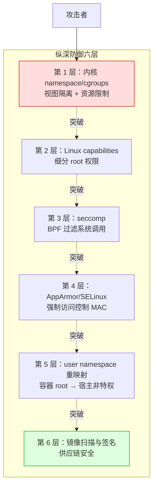
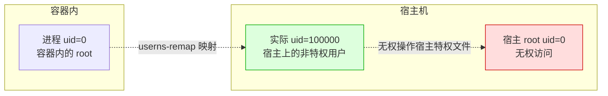
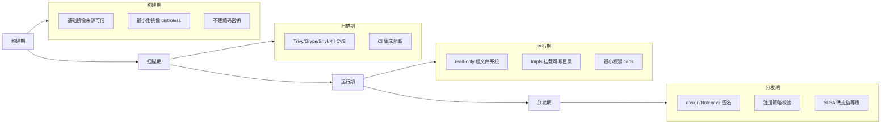

# Docker 安全模型

> **一句话定位**：容器共享内核隔离不彻底，纵深防御六层与密钥注入方案是高级岗位筛选题。
> **面试热度**：⭐⭐⭐
> **返回**：[Docker 知识图谱](../README.md)

---

## 一、概念定义

### 1.1 容器安全的本质：共享内核 → 隔离不彻底

容器的隔离机制建立在 Linux 内核的 namespace（视图隔离）与 cgroups（资源限制）之上，但**容器与宿主机共享同一个内核**——这是容器安全的根本约束。虚拟机通过 hypervisor 提供独立的虚拟硬件与完整内核，隔离边界在硬件层；容器的隔离边界在内核层（软件隔离），一旦内核存在可被利用的漏洞，容器内进程就有可能突破 namespace/cgroups 的隔离，获取宿主权限。

**关键认知**：容器的安全模型不是"隔离即安全"，而是"隔离 + 最小权限 + 多层纵深防御"——因为单一隔离层（namespace）可被内核漏洞或配置失误突破，必须叠加 capabilities、seccomp、MAC、userns-remap、镜像扫描等多层防线，任一层被突破还有下层兜底。这就是"纵深防御（Defense in Depth）"思想在容器场景的落地。

### 1.2 容器 vs VM 的安全边界

容器与虚拟机的安全边界存在本质差异，理解这一对比是回答"容器安全吗"这类面试题的起点：

| 维度 | 容器 | 虚拟机（VM） |
|------|------|--------------|
| **内核共享** | ✅ 容器与宿主共享同一内核 | ❌ 每个 VM 有独立内核 |
| **隔离边界** | 内核层（namespace/cgroups，软件隔离） | 硬件层（hypervisor 提供虚拟硬件，强隔离） |
| **逃逸难度** | 相对低（内核漏洞 + 配置失误可突破） | 相对高（需突破 hypervisor，攻击面小） |
| **攻击面** | 宿主内核全部 syscall 面向容器 | hypervisor 暴露的虚拟设备接口有限 |
| **资源开销** | 轻（共享内核，无 Guest OS） | 重（每 VM 一套完整 Guest OS） |
| **启动速度** | 秒级 | 分钟级 |
| **隔离强度** | 弱（进程级隔离） | 强（机器级隔离） |
| **适用场景** | 同信任域应用隔离、CI/CD、微服务 | 多租户、不可信代码运行、强隔离需求 |

**本质差异一句话**：VM 的隔离是"硬件级"的（hypervisor 模拟虚拟硬件，Guest OS 跑在虚拟硬件上），容器的隔离是"内核级"的（所有容器进程都是宿主内核上的普通进程，靠 namespace/cgroups 限制其视图与资源）。所以**容器永远没有 VM 安全**——但容器通过纵深防御可以把风险降到可接受范围，且资源效率远高于 VM，这是容器在云原生时代成为主流的权衡。

### 1.3 纵深防御六层模型

Docker 的安全防御不是单一机制，而是六层叠加的纵深防御体系，每一层针对不同的攻击面：



| 层次 | 机制 | 防护目标 | 默认是否开启 |
|------|------|---------|-------------|
| **第 1 层** | namespace / cgroups | 视图隔离（PID/网络/挂载等）+ 资源限制 | ✅ 默认开启 |
| **第 2 层** | Linux capabilities | 细分 root 权限，丢弃危险 caps | ✅ 默认丢弃部分 caps |
| **第 3 层** | seccomp | BPF 过滤器拦截危险 syscall | ✅ 默认开启（白名单） |
| **第 4 层** | AppArmor / SELinux | 强制访问控制（MAC），限制文件/能力访问 | ⚠️ AppArmor 默认开启（Ubuntu），SELinux 需手动配置 |
| **第 5 层** | user namespace 重映射 | 容器 root → 宿主非特权 uid | ❌ 默认关闭，需手动启用 |
| **第 6 层** | 镜像扫描与签名 | 供应链安全（CVE 扫描 + 镜像签名验证） | ❌ 需集成 CI/工具链 |

**纵深防御的意义**：任一层被突破，下层仍能兜底。例如即使容器内进程通过内核漏洞突破了 namespace 隔离（第 1 层失守），capabilities 已丢弃 `CAP_SYS_ADMIN`（第 2 层兜底）、seccomp 拦截了 `mount` 等关键 syscall（第 3 层兜底），攻击者仍难以直接获取宿主 root 权限。这是为什么生产环境强烈反对 `--privileged`——它一次性禁用了第 2～4 层所有防线。

### 1.4 容器逃逸（Container Escape）定义

**容器逃逸**指容器内进程突破 namespace/cgroups 的隔离边界，获取宿主机权限或访问宿主文件系统的行为。逃逸是容器安全最严重的后果——攻击者从"被限制的容器进程"变为"宿主上的特权进程"，可横向渗透其他容器或直接控制宿主。

容器逃逸的常见路径：

| 逃逸路径 | 原理 | 典型 CVE |
|---------|------|---------|
| **runc 漏洞** | 容器进程利用 runc 的文件描述符泄漏覆盖宿主 runc 二进制 | CVE-2019-5736 |
| **内核漏洞** | 容器进程（共享内核）直接利用内核提权漏洞 | dirty COW（CVE-2017-1000405）、DirtyPipe（CVE-2022-0847） |
| **CAP_SYS_ADMIN 滥用** | 拥有该 cap 的容器可挂载宿主文件系统、加载内核模块 | 配置失误（`--cap-add=SYS_ADMIN`） |
| **`--privileged` 模式** | 禁用所有隔离层，容器直接拥有宿主所有设备访问权 | 配置失误 |
| **Docker socket 挂载** | 把 `/var/run/docker.sock` 挂进容器，容器可调 dockerd 控制宿主 | 配置失误（CI/CD 工具常见陷阱） |

> **关联**：[容器本质与底层原理](../01-foundation/container-principle.md) §2.1 Namespace——namespace 是纵深防御第 1 层的底层机制，逃逸的本质是"突破 namespace 隔离边界"。

---

## 二、原理与流程

### 2.1 Linux Capabilities 机制（深度重点）

#### 2.1.1 传统 Unix 的 root / non-root 二分法问题

传统 Unix 权限模型只有两种状态：**root（uid=0，拥有所有权限）** 与 **non-root（普通用户，无特权）**。这种二分法的问题是：很多服务需要"绑定 80 端口"这一项特权，但传统模型下要么用 root（获得所有权限，过度授权），要么用普通用户（绑不了 80 端口）。`setuid` 程序（如 `ping`）是早期的妥协方案——把可执行文件设为 root 属主并设 setuid 位，任何用户执行它都以 root 身份运行，但 `ping` 本身只需 `CAP_NET_RAW`（发 ICMP 包），setuid 却给了它全部 root 权限，攻击面过大。

#### 2.1.2 capabilities 细分：37 个（kernel 5.x）

Linux 从 2.2 开始引入 capabilities 机制，把传统的 root 权限**细分为多个独立的特权单元**，进程可以只持有它需要的 caps，而非全有或全无。kernel 5.x 定义了约 37 个 capabilities，分 rootful（需 root 才能持有的）与 rootless（非 root 也可持有的）两类：

| 常见 capability | 作用 | 风险等级 |
|----------------|------|---------|
| `CAP_NET_BIND_SERVICE` | 绑定 <1024 端口 | 低（业务容器常需） |
| `CAP_NET_RAW` | 发原始网络包（ping/traceroute） | 中 |
| `CAP_CHOWN` | 修改文件属主 | 中 |
| `CAP_KILL` | 向非本用户进程发信号 | 中 |
| `CAP_SETUID` | 切换进程 uid | 高 |
| `CAP_SYS_PTRACE` | ptrace 附加到其他进程 | 高（可读取其他进程内存） |
| `CAP_NET_ADMIN` | 网络配置（改路由、iptables） | 高 |
| `CAP_SYS_ADMIN` | 系统管理（挂载、pivot_root、内核模块等） | ⛔ 极高（"新 root"） |

#### 2.1.3 Docker 默认丢弃的 caps 集合

Docker 默认**不授予容器全部 caps**，而是只授予一个有限的 caps 集合，丢弃了大部分危险 caps。默认授予集合包含约 14 个 caps（`CAP_CHOWN`、`CAP_NET_BIND_SERVICE`、`CAP_KILL`、`CAP_SETUID` 等），丢弃了 `CAP_SYS_ADMIN`、`CAP_NET_ADMIN`、`CAP_SYS_PTRACE` 等高危 caps。

**加固实践**：默认仍可能授予了业务不需要的 caps，最严格的实践是**先全部丢弃再按需添加**：

```bash
# 先全部丢弃，再按需添加
docker run --cap-drop=ALL --cap-add=NET_BIND_SERVICE myapp:1.0
```

这样容器只拥有 `CAP_NET_BIND_SERVICE`（绑定 <1024 端口），其余权限全部被丢弃，攻击面最小化。

#### 2.1.4 危险 caps 详解

- **`CAP_SYS_ADMIN`（"新 root"）**：这是最危险的 capability，它授予挂载文件系统、`pivot_root`、配置网络、访问内核模块等广泛的系统管理权限。拥有 `CAP_SYS_ADMIN` 的容器几乎等同于宿主 root——可挂载宿主磁盘、加载内核模块、修改 cgroup，逃逸门槛极低。生产环境应**绝不对业务容器授予** `CAP_SYS_ADMIN`。
- **`CAP_NET_ADMIN`**：授予修改网络配置的权限，包括修改路由表、iptables 规则、网卡配置。容器拥有此 cap 可实施网络中间人攻击或绕过网络策略。
- **`CAP_SYS_PTRACE`**：授予 ptrace 系统调用权限，可附加到其他进程并读写其内存。在共享内核的容器场景下，这意味着可窥探同宿主其他容器的进程内存（如读取 Java 进程的堆中的密钥）。

#### 2.1.5 Java 后端场景的 caps 需求

Java 后端业务容器通常**不需要任何特殊 capability**——因为：

1. Spring Boot 默认监听 8080 端口（>1024），不需要 `CAP_NET_BIND_SERVICE`。
2. JVM 不需要 ptrace、不需要配置网络、不需要挂载文件系统。
3. 业务逻辑所需的系统调用都是普通 syscall（文件 IO、网络 IO、线程操作），无需特权。

**唯一需要 caps 的场景**：若 Java 应用必须绑定 80/443 端口（<1024），需要 `CAP_NET_BIND_SERVICE`；但更推荐的做法是 `EXPOSE 8080` 然后用端口映射（`-p 80:8080`），避免给容器 caps。

> **关联**：[容器本质与底层原理](../01-foundation/container-principle.md) §2.2 Cgroups——capabilities 限制"能做什么操作"，cgroups 限制"能用多少资源"，两者正交，共同构成容器隔离的第 1～2 层。

### 2.2 seccomp（Secure Computing Mode）

seccomp 是 Linux 内核提供的**系统调用过滤机制**——它通过 BPF（Berkeley Packet Filter）字节码在内核态为进程挂载一个 syscall 过滤器，每次进程发起 syscall 时，过滤器判断是放行、拒绝还是终止进程。

**Docker 的默认 seccomp profile**：Docker 内置一份默认的 seccomp 白名单 profile（约 300 个 syscall 放行），拦截了 `ptrace`、`mount`、`keyctl`、`reboot`、`kexec_load` 等高危 syscall。这意味着即使容器内的进程（包括攻击者植入的恶意代码）尝试调用这些 syscall，会被内核直接拒绝（返回 `EPERM`）。

```bash
# 查看容器的 seccomp profile
docker info --format '{{.SecurityOptions}}'

# 默认应用 seccomp profile（默认行为）
docker run myapp:1.0

# 危险：禁用 seccomp（放开所有 syscall）——生产绝禁
docker run --security-opt seccomp=unconfined myapp:1.0
```

**`--security-opt seccomp=unconfined` 的危险**：它禁用了 seccomp 过滤器，容器内进程可调用**所有** syscall（包括 `ptrace`、`mount`）。这相当于撤掉纵深防御的第 3 层，一旦容器内有恶意代码，它可自由使用所有内核攻击面（如加载内核模块、挂载宿主磁盘）。生产环境应**绝禁** `seccomp=unconfined`。

**自定义 seccomp profile**：对安全要求极高的场景（如运行不可信代码），可自定义 seccomp profile，只白名单放行业务所需的 syscall 子集。例如 Java 应用所需的 syscall 是固定集合（文件 IO、网络 IO、线程、futex 等），可基于此定制极小权限 profile。但维护成本高，需随 JVM 版本更新。

### 2.3 AppArmor / SELinux

AppArmor 与 SELinux 是 Linux 的两种主流**强制访问控制（MAC）** 实现，它们在传统的 DAC（自主访问控制，即文件 rwx 权限）之上叠加了一层系统级访问策略，限制进程能访问哪些文件/路径/能力。

| 维度 | AppArmor | SELinux |
|------|----------|---------|
| **默认发行版** | Ubuntu / Debian | RHEL / CentOS / Fedora |
| **策略模型** | 基于路径（per-path rule） | 基于标签（type enforcement） |
| **配置粒度** | 路径级（如 `/etc/** r,` 允许读 /etc 下所有文件） | 标签级（文件的 type + 进程的 domain） |
| **学习曲线** | 较低（路径规则直观） | 较高（标签 + 策略语言） |
| **Docker 默认 profile** | `docker-default`（限制挂载、网络、capability） | 通常继承系统策略，Docker 不强制启用 |

**Docker 默认 AppArmor profile（`docker-default`）**：在启用 AppArmor 的宿主上，Docker 默认为每个容器挂载 `docker-default` profile，限制容器能访问的宿主路径与能执行的操作。它主要阻止容器访问 `/proc` 下的敏感子路径（如 `/proc/sys/kernel`）、阻止挂载宿主文件系统、阻止访问宿主设备文件。

**关键认知**：AppArmor/SELinux 是纵深防御的第 4 层，它独立于 namespace/capabilities/seccomp——即使前 3 层被突破，MAC 仍能阻止容器进程访问特定宿主路径。但它们配置复杂、调试困难（尤其是 SELinux），生产中常被关闭（`--security-opt apparmor=unconfined`），这是安全短板。

### 2.4 User Namespace 重映射（userns-remap）

#### 2.4.1 默认行为的缺陷

默认情况下，Docker 容器内的 root（uid=0）**就是宿主上的 root**——它们共享同一套 uid 映射。这意味着容器内 root 进程对宿主文件系统的操作（如果突破了 namespace 隔离）是以宿主 root 身份进行的，拥有完整宿主权限。这是容器逃逸之所以危险的根因：容器内 root = 宿主 root。

#### 2.4.2 userns-remap 机制

User Namespace 重映射（userns-remap）通过 Linux user namespace 的 uid/gid 映射机制，把**容器内的 root（uid=0）映射为宿主上的非特权用户**（如 uid=100000）。这样即使容器内进程突破了 namespace 隔离，它在宿主上的实际身份是 uid=100000 的普通用户，对宿主文件系统没有特权。



#### 2.4.3 启用方式

在 `/etc/docker/daemon.json` 配置 userns-remap：

```json
{
  "userns-remap": "default"
}
```

`default` 表示 Docker 自动创建一个名为 `dockremap` 的系统用户（默认 uid 范围 165536～231072），容器内 uid=0 映射到宿主 uid=165536。也可指定具体用户名。

配置后重启 dockerd，所有新建容器的 uid 都会被重映射。已有镜像与卷因权限属主不匹配需重新构建/迁移。

#### 2.4.4 启用陷阱

| 陷阱 | 说明 | 解决方案 |
|------|------|---------|
| **文件权限不匹配** | 已有镜像内文件属主是 uid=0，启用后容器内 uid=0 映射到宿主 uid=165536，文件属主变为 165536，读写需对应 | 重新构建镜像，或在 Dockerfile 用 `chown` 调整 |
| **bind mount 权限** | 挂载宿主目录到容器，宿主目录属主是宿主 uid=0，容器内 uid=0（映射到 165536）无权读写 | `chown -R 165536:165536` 宿主目录，或用 `--user` 指定容器内非 root 用户 |
| **已存在镜像兼容** | 镜像内假设 uid=0 是 root 的逻辑（如启动脚本），启用后可能行为异常 | 测试验证，必要时重建镜像 |

> **关联**：[容器本质与底层原理](../01-foundation/container-principle.md) §2.1 Namespace——user namespace 是 6+1 个 namespace 之一，userns-remap 是利用它实现"容器 root ≠ 宿主 root"的关键机制。

### 2.5 Rootless 模式（Docker 20.10+）

Rootless 模式指 **dockerd 本身以非 root 用户运行**——传统的 dockerd 需 root 启动（因为要创建 namespace、配置网络、挂载 overlayfs），而 Rootless 模式利用 Linux 的 user namespace 让 dockerd 在非特权用户下也能完成这些操作。

| 维度 | Rootful（传统） | Rootless |
|------|----------------|----------|
| **dockerd 运行身份** | root | 非特权用户（如 `dockerd-rootless`） |
| **容器内 root** | 默认是宿主 root（除非 userns-remap） | 自动映射为非特权 |
| **网络驱动** | 全部支持 | 部分受限（需 `slirp4netns`/`vpnkit` 用户态网络，性能略低） |
| **`--privileged`** | 支持（但危险） | ❌ 不支持（本身就是非特权，无特权可授） |
| **端口映射** | 任意端口 | 需 `rootlesskit` 转发，<1024 端口需额外配置 |
| **cgroups** | 完整支持 | v2 支持，v1 受限 |
| **安全收益** | 一般 | 高（即使 dockerd 被攻破也无 root 权限） |

**Rootless 的限制**：它牺牲了部分功能与性能换安全——`--privileged` 不可用、overlay 存储驱动需内核 5.11+ 才能非特权使用、cgroup v1 支持有限。但对开发环境与多租户场景（如共享 CI 机器），Rootless 的"dockerd 被攻破也不会立刻拿到宿主 root"这一安全收益显著。

**生产适用性**：Rootless 目前主要适合开发/CI 场景，生产环境因网络性能与功能限制，多数仍用 Rootful + userns-remap 的组合。

### 2.6 镜像安全生命周期

容器安全不止于运行时隔离，还贯穿镜像的**构建 → 扫描 → 运行 → 分发**全生命周期：



#### 2.6.1 构建期

- **基础镜像来源**：优先官方镜像（`eclipse-temurin`、`python`、`nginx`），避免来路不明的第三方镜像。官方镜像有 CVE 修复保障，第三方镜像可能植入后门。
- **最小化镜像**：用 `distroless`（Google）或 `alpine` 作为基础镜像，只包含运行时必需的库，不含 shell、包管理器等攻击面。Java 应用可用 `eclipse-temurin:17-jre-alpine` 或 distroless 变体。
- **不硬编码密钥**：Dockerfile 里绝不写 `ENV DB_PASSWORD=xxx` 或复制密钥文件——镜像层是可逆推的，任何拉取镜像的人都能 `docker history` 看到每一层指令，密钥会泄露。

#### 2.6.2 扫描期

- **CVE 扫描工具**：Trivy（开源、轻量）、Grype（Anchore）、Snyk（商业）。扫描镜像内的系统库（如 glibc、openssl）与应用依赖（如 Maven 的 jar 包）的已知 CVE。
- **CI 集成**：在 CI 流水线加扫描步骤，发现高危 CVE 则阻断构建（fail-fast）。典型流水线：Maven 构建 → 构建 Docker 镜像 → Trivy 扫描 → 扫描通过才推送 Registry。

#### 2.6.3 运行期

- **read-only 根文件系统**：`docker run --read-only` 把容器根文件系统挂载为只读，攻击者无法写入恶意脚本、无法篡改二进制。需配合 `--tmpfs` 挂载可写目录（如 `/tmp`、`/var/log`）供应用写入临时文件。
- **最小权限 caps**：`--cap-drop=ALL` 后按需 `--cap-add`，把 capabilities 降到最小。

```bash
# 只读根文件系统 + tmpfs 挂 /tmp（Spring Boot multipart 上传、Tomcat work 目录需要）
docker run --read-only --tmpfs /tmp:rw,size=64m myapp:1.0
```

#### 2.6.4 分发期

- **镜像签名**：用 cosign（Sigstore）或 Notary v2 对镜像签名，部署时校验签名，防止镜像被篡改（中间人攻击或 Registry 被入侵）。
- **注册策略**：在 Kubernetes 环境用 admission controller（如 Kyverno/OPA Gatekeeper）强制只允许部署已签名镜像。
- **SLSA（Supply-chain Levels for Software Artifacts）**：Google 提出的供应链安全等级框架，SLSA 1～4 级，4 级要求构建过程可审计、不可篡改、有隔离的构建平台。

> **关联**：[镜像构建与分发](../02-image/dockerfile-and-image.md) §2.4 多阶段构建——多阶段构建是"构建期最小化镜像"的核心手段，builder 阶段含编译工具与源码，runtime 阶段只复制产物，缩小运行期镜像攻击面。

---

## 三、高频追问与面试题

### Q1：容器和虚拟机哪个更安全？

**参考答案**：**VM 更安全，但容器通过纵深防御可把风险降到可接受范围**。

**根因**：VM 的隔离边界在硬件层（hypervisor 模拟虚拟硬件，Guest OS 跑在虚拟硬件上，强隔离）；容器的隔离边界在内核层（所有容器进程共享宿主内核，靠 namespace/cgroups 软件隔离，弱隔离）。VM 逃逸需突破 hypervisor（攻击面小、难度高），容器逃逸只需利用一个内核漏洞或配置失误（攻击面大、难度相对低）。

**但容器并非"不安全"**——通过纵深防御六层（namespace → capabilities → seccomp → AppArmor → userns-remap → 镜像扫描），任一层被突破仍有下层兜底。生产环境只要不开 `--privileged`、不开 `seccomp=unconfined`、启用 userns-remap，容器逃逸的门槛已足够高。

**权衡**：容器以"牺牲一部分隔离强度"换取"资源效率与启动速度"，在云原生场景这个权衡是值得的——多数业务对隔离强度的要求不是"防内核级攻击"，而是"防应用层越权"。极高安全需求场景（多租户、不可信代码运行）仍应选 VM 或 Kata Containers（VM 级隔离 + 容器接口）。

### Q2：`docker run --privileged` 危险在哪？

**参考答案**：**它一次性禁用了纵深防御第 2～4 层所有防线，容器几乎等同宿主 root**。

`--privileged` 的具体行为：

1. **授予所有 capabilities**：容器获得全部 37 个 caps，包括 `CAP_SYS_ADMIN`、`CAP_NET_ADMIN`、`CAP_SYS_PTRACE`。
2. **禁用 seccomp**：所有 syscall 放行，`ptrace`/`mount`/`keyctl` 都可调用。
3. **禁用 AppArmor**：MAC 策略不生效。
4. **访问宿主所有设备**：`/dev` 下所有设备挂载进容器，可读写宿主磁盘。
5. **不启用 userns-remap**：容器内 root 就是宿主 root。

**后果**：容器内进程可直接 `mount /dev/sda1 /mnt` 挂载宿主磁盘、可 `nsenter` 进入宿主 namespace、可加载内核模块——逃逸门槛几乎为零。

**何时用 `--privileged`**：理论上应**绝禁**于生产。若某些场景必须用（如容器内跑 Docker-in-Docker、某些设备直通），应改用更细粒度的 `--cap-add` + `--device` 只授予所需权限，而非一刀切 `--privileged`。

### Q3：容器逃逸怎么发生？

**参考答案**：容器逃逸有三条主要路径：**runc 漏斗、内核漏洞、配置失误**。

| 路径 | 原理 | 典型案例 |
|------|------|---------|
| **runc 漏洞** | 容器进程利用 runc 的文件描述符泄漏，覆盖宿主 runc 二进制，下次 `docker exec` 时执行被篡改的 runc | CVE-2019-5736（runc 文件描述符竞争） |
| **内核漏洞** | 容器进程（共享内核）直接利用内核提权漏洞获取宿主 root | dirty COW（CVE-2017-1000405）、DirtyPipe（CVE-2022-0847） |
| **CAP_SYS_ADMIN 滥用** | 拥有该 cap 的容器可 mount 宿主磁盘、加载内核模块 | 配置失误（`--cap-add=SYS_ADMIN`） |
| **Docker socket 挂载** | 把 `/var/run/docker.sock` 挂进容器，容器可调 dockerd 创建特权容器逃逸 | CI/CD 工具常见陷阱 |

**防御**：
- runc 漏洞：及时升级 runc/containerd 版本。
- 内核漏洞：及时打内核安全补丁。
- 配置失误：禁用 `--privileged`，最小 caps，启用 userns-remap。
- Docker socket：绝不把宿主 `docker.sock` 挂进容器，改用 TCP+TLS 远程 API 或 socket proxy。

### Q4：容器内 root 是真 root 吗？

**参考答案**：**默认是真 root（= 宿主 root），启用 userns-remap 后不是**。

- **默认行为**：Docker 不启用 user namespace 重映射时，容器内 uid=0 与宿主 uid=0 共享同一套 uid 映射，容器内 root 进程对宿主文件系统的操作（若突破 namespace 隔离）以宿主 root 身份进行，拥有完整宿主权限。
- **启用 userns-remap**：在 `/etc/docker/daemon.json` 配置 `"userns-remap": "default"` 后，容器内 uid=0 被映射到宿主 uid=165536（非特权用户）。此时容器内 root 进程即使在宿主上有突破，也只以普通用户身份操作，无法读写宿主特权文件。

**加固建议**：生产环境强烈建议启用 userns-remap——它是纵深防御第 5 层，把"容器内 root = 宿主 root"这一最危险的默认行为纠正为"容器内 root = 宿主非特权用户"。启用需注意文件权限迁移与 bind mount 属主调整。

### Q5：Java 应用需要什么 capabilities？

**参考答案**：**通常无需任何 capability，或最多只需 `CAP_NET_BIND_SERVICE`**。

Java 后端业务容器通常：
1. Spring Boot 默认监听 8080（>1024 端口），不需 `CAP_NET_BIND_SERVICE`。
2. JVM 不需 ptrace、不需配置网络、不需挂载文件系统。
3. 业务所需 syscall 都是普通 syscall（文件 IO、网络 IO、线程），无特权。

**唯一需要 caps 的场景**：若应用必须绑定 80/443（<1024 端口），需 `CAP_NET_BIND_SERVICE`。但更推荐 `EXPOSE 8080` + 端口映射（`-p 80:8080`），避免给容器 caps。

**最佳实践**：

```bash
# 全部丢弃，Java 应用不需要任何 caps
docker run --cap-drop=ALL myapp:1.0
```

若 Java agent 需在容器内 attach（如 Arthas、APM 探针），需注意 attach 机制依赖 ptrace 或 Unix socket，可能需 `CAP_SYS_PTRACE` + `--pid=container:host`（nsenter）——但这是高级运维场景，非业务常态。

### Q6：镜像怎么扫漏洞？CI 怎么集成？

**参考答案**：用 **Trivy/Grype/Snyk** 扫描 CVE，在 CI 流水线加扫描步骤阻断高危镜像。

**工具选型**：

| 工具 | 特点 | 适用 |
|------|------|------|
| **Trivy** | 开源、轻量、扫描系统库 + 应用依赖 + IaC 配置 | 通用首选，CI 集成简单 |
| **Grype** | Anchore 出品，与 Syft（SBOM 工具）配合 | 需 SBOM 场景 |
| **Snyk** | 商业、有 Web 控制台与 PR 集成 | 企业级、需漏洞管理流程 |

**CI 集成典型流水线**：

```bash
# .gitlab-ci.yml 或 Jenkinsfile 片段
mvn clean package -DskipTests
docker build -t myapp:${CI_COMMIT_SHA} .
# 扫描，发现 HIGH/CRITICAL CVE 则阻断
trivy image --exit-code 1 --severity HIGH,CRITICAL myapp:${CI_COMMIT_SHA}
# 扫描通过才推 Registry
docker push registry.example.com/myapp:${CI_COMMIT_SHA}
```

**关键点**：`--exit-code 1 --severity HIGH,CRITICAL` 让扫描发现高危 CVE 时 CI 失败，阻止漏洞镜像进入 Registry。可加 `--ignore-unfixed` 只阻断"已有修复版本"的 CVE，减少噪音。

### Q7：怎么防止镜像被篡改？

**参考答案**：用 **cosign 签名 + 注册策略校验**，部署时强制校验签名。

**签名（cosign）**：

```bash
# 用私钥对镜像签名（存于 OCI 镜像的附加层）
cosign sign --key cosign.key registry.example.com/myapp:${SHA}

# 部署方用公钥校验签名
cosign verify --key cosign.pub registry.example.com/myapp:${SHA}
```

**注册策略（K8s admission controller）**：用 Kyverno 或 OPA Gatekeeper 强制只允许部署已签名镜像：

```yaml
# Kyverno 策略：只允许 cosign 签名的镜像
apiVersion: kyverno.io/v1
kind: ClusterPolicy
metadata:
  name: verify-images
spec:
  rules:
    - name: verify-signature
      match:
        resources:
          kinds: [Pod]
      verifyImages:
        - imageReferences: ["registry.example.com/*"]
          attestors:
            - entries:
                - keys:
                    publicKeys: |
                      -----BEGIN PUBLIC KEY-----
                      ...cosign.pub 内容...
                      -----END PUBLIC KEY-----
```

**SLSA 等级**：供应链安全等级框架，SLSA 4 要求构建平台隔离、构建过程可审计、产物有签名验证。生产关键镜像应追求 SLSA 3+。

### Q8：`--read-only` 怎么用？Spring Boot 能跑吗？

**参考答案**：**能，但需配合 tmpfs 挂载可写目录**。

`--read-only` 把容器根文件系统挂为只读，攻击者无法写入恶意脚本。但 Spring Boot 运行需写一些临时文件——multipart 上传的临时缓存、Tomcat work 目录、日志文件。需用 `--tmpfs` 挂载这些可写点：

```bash
# 只读根文件系统 + tmpfs 挂 /tmp 与 /tmp/tomcat-work
docker run --read-only \
  --tmpfs /tmp:rw,size=64m \
  --tmpfs /tmp/tomcat-work:rw,size=64m \
  -e SERVER_TOMCAT_BASED_DIR=/tmp/tomcat-work \
  myapp:1.0
```

**日志处理**：只读文件系统下日志应走 stdout/stderr（`logging.file.name` 不指定，让 Spring Boot 默认输出到控制台），由 Docker 日志驱动收集。不要让应用写日志文件——容器内文件系统只读，且容器销毁后日志丢失，应统一走 stdout + 日志聚合（ELK/Loki）。

**Spring Boot 配置要点**：
1. multipart 上传的临时目录指向 tmpfs（`spring.servlet.multipart.location=/tmp`）。
2. Tomcat work 目录指向 tmpfs（`server.tomcat.based-dir=/tmp/tomcat-work`）。
3. 日志走 stdout（不配 `logging.file.name`）。
4. Actuator 的 `/tmp` 依赖（如 heapdump）需确保 tmpfs 足够大。

---

## 四、实战关联（Java 后端视角）

### 4.1 Spring Boot 容器的最小权限配置

最小权限不仅是 capabilities 的 `--cap-drop=ALL`，还包括运行用户、端口、文件系统权限的整体收敛。完整的最小权限 Spring Boot 容器配置：

```dockerfile
# Dockerfile —— 最小权限 Spring Boot 容器
FROM eclipse-temurin:17-jre-alpine AS runtime

# 创建非 root 用户与组（固定 uid/gid 便于宿主目录权限对齐）
RUN addgroup -S app && adduser -S app -G app -u 1000

# 复制 jar（属主设为 app）
COPY --chown=app:app target/*.jar /app/app.jar

# 切非 root 用户运行
USER 1000

# 暴露 8080（>1024，无需 CAP_NET_BIND_SERVICE）
EXPOSE 8080

# JVM 容器内存感知参数
ENV JAVA_OPTS="-XX:MaxRAMPercentage=75.0 -XX:+UseG1GC"

ENTRYPOINT ["sh", "-c", "java $JAVA_OPTS -jar /app/app.jar"]
```

```bash
# 启动命令：最小权限叠加
docker run -d \
  --name myapp \
  --cap-drop=ALL \                              # 丢弃所有 caps
  --read-only \                                 # 只读根文件系统
  --tmpfs /tmp:rw,size=64m \                    # tmpfs 挂可写目录
  --tmpfs /tmp/tomcat-work:rw,size=64m \        # Tomcat work 目录
  --memory=512m --cpus=1.0 \                    # 资源限制
  -e SPRING_PROFILES_ACTIVE=prod \
  -e SPRING_DATASOURCE_PASSWORD_FILE=/run/secrets/db_password \  # 密钥走文件注入
  -v db_password_secret:/run/secrets/db_password:ro \           # secret 只读挂载
  -p 8080:8080 \
  myapp:1.0
```

**最小权限的三层收敛**：

| 层次 | 措施 | 防护目标 |
|------|------|---------|
| **用户层** | `USER 1000` 切非 root | 即使容器内进程被攻破，也不是 root，降低逃逸后权限 |
| **权限层** | `--cap-drop=ALL` | 无任何 capability，攻击面最小 |
| **文件系统层** | `--read-only` + tmpfs | 攻击者无法写入恶意脚本、无法篡改二进制 |

**`EXPOSE 8080` 的设计**：故意避开 <1024 端口，避免给容器 `CAP_NET_BIND_SERVICE`。Docker 的端口映射（`-p 80:8080`）由 dockerd（root）执行，容器内进程监听 8080（非特权端口）即可，无需 caps。这是"权限收敛到最小"在端口设计上的体现。

### 4.2 密钥注入方案对比（深度重点）

密钥（数据库密码、API token、JWT 密钥）如何安全地传给容器，是容器化部署的核心安全设计点。方案分三档：

| 档次 | 方案 | 安全性 | 适用 | 陷阱 |
|------|------|--------|------|------|
| ⛔ **禁止** | 写进 Dockerfile `ENV` | ❌ 极低 | 无 | `docker history` 可看每一层指令，密钥泄露 |
| ⛔ **禁止** | 打包进镜像（COPY 密钥文件） | ❌ 极低 | 无 | 镜像分发即泄露，任何拉取者可得密钥 |
| ⛔ **禁止** | 提交到 Git | ❌ 极低 | 无 | 仓库历史永久留存，Git 历史不可彻底清除 |
| ⚠️ **可选** | `docker run -e PASSWORD=xxx` | ⚠️ 中低 | 本地开发、简单场景 | `docker inspect` 与 `ps` 可见环境变量 |
| ⚠️ **可选** | `docker run --env-file` | ⚠️ 中 | 多环境配置 | 文件明文，需 `.gitignore` |
| ✅ **推荐** | Docker Secrets（Swarm） | ✅ 高 | Swarm 集群 | 加密存 Raft，运行时才解密注入 `/run/secrets` |
| ✅ **推荐** | K8s Secret | ✅ 高 | K8s 生产 | etcd 加密存储（base64），RBAC 控制访问 |
| ✅ **推荐** | Vault / 云厂商 KMS | ✅ 极高 | 多云、强密钥轮转 | 引入额外组件，密钥动态短期凭证 |

#### 4.2.1 禁止方案的问题

```dockerfile
# 反例：密钥写进 Dockerfile ENV——docker history 可见
ENV DB_PASSWORD=s3cr3t
```

```bash
# 任何拉取镜像者都能看到密钥
docker history myapp:1.0
# ... ENV DB_PASSWORD=s3cr3t
```

镜像层是 append-only 的，`docker history` 显示每一层的指令。即使后续层删除了该 ENV，前面的层仍保留——密钥永久存在于镜像历史中。镜像一旦推送到 Registry，任何能拉取的人都可看到密钥。

#### 4.2.2 可选方案的限制

```bash
# docker run -e 注入——但 ps 与 docker inspect 可见
docker run -e DB_PASSWORD=s3cr3t myapp:1.0

# 同宿主的任何用户可看进程环境
ps auxe | grep java      # 可能看到 DB_PASSWORD
docker inspect myapp     # 环境变量在容器配置中可见
```

`-e` 注入的密钥存于容器进程的环境变量，宿主上任何能 `ps` 的用户可通过 `ps auxe` 看到所有进程的环境变量（含密钥）。`docker inspect` 也输出环境变量。所以 `-e` 只适合本地开发，不适合多用户共享宿主的生产。

#### 4.2.3 推荐方案：文件注入 + Spring Boot 配合

生产推荐用 **Docker Secrets / K8s Secret / Vault** 把密钥挂载为**只读文件**到容器内 `/run/secrets/<name>`，Spring Boot 通过 `_FILE` 后缀的环境变量读取文件内容：

```yaml
# compose.yml（单机 secrets 当 bind mount 挂载）
services:
  app:
    environment:
      # Spring Boot 支持读文件作为配置值（_FILE 后缀）
      SPRING_DATASOURCE_PASSWORD_FILE: /run/secrets/db_password
    secrets:
      - db_password
secrets:
  db_password:
    file: ./secrets/db_password.txt
```

**Spring Boot 的 `_FILE` 机制**：Spring Boot 支持给任意配置项加 `_FILE` 后缀，从文件读取值。如 `SPRING_DATASOURCE_PASSWORD_FILE=/run/secrets/db_password` 会让 Spring Boot 读取该文件内容作为 `spring.datasource.password` 的值。这样密钥不进环境变量（`ps` 看不到），只以只读文件形式存在于容器内（文件权限 0400），安全等级更高。

> **关联 `framework/spring-framework` 模块**：该模块有 `ProfileConfig`（`com.yintp.spring.framework.annotation.config.ProfileConfig`）演示 `@Profile` 与 `@Value` 的用法——对照理解：`@Value("${spring.datasource.password}")` 在容器化下会被外部注入的值（环境变量或 `_FILE` 机制）覆盖，而密钥的具体值由 secret 挂载决定，YAML 里只引用不存储明文。`@Profile("prod")` 控制哪些 Bean 激活，密钥注入与 profile 配合实现"同一镜像跑不同环境，密钥外部化"。

#### 4.2.4 关联 framework/valid：API 鉴权 token 的注入与轮转

API 鉴权 token（如 JWT 签名密钥、API key）在容器化部署下面临两个问题：注入与轮转。

- **注入**：用上述文件注入方案，token 作为只读 secret 挂载，应用启动时读取。避免镜像硬编码。
- **轮转**：生产 token 应定期轮转（如 30/90 天）。文件挂载方式下，更新 secret 文件后需重启容器才能加载新 token——不支持热轮转。需热轮转的场景应上 Vault（动态短期 token）或 Spring Cloud Config Server（配置热更新 + actuator refresh）。

**关联 `framework/valid` 模块**：该模块演示 Hibernate Validator 自定义校验器（`com.yintp.valid.hibernate`），对照理解"API 参数校验 + 密钥管理"的安全分工——参数校验防非法输入（入口防护），密钥安全防 token 泄露（凭证保护），两者互补。容器化下，`@Valid` 校验请求体的逻辑不变，但 JWT 签名密钥的来源从配置文件改为 secret 挂载文件，由部署侧而非应用侧管理。

### 4.3 关联 java-core/agent：Java agent 在容器内的 attach 陷阱

Java agent（如 Arthas、SkyWalking、APM 探针）在容器内 attach 到目标 JVM 时，依赖 JVM 的 attach 机制——通过 Unix socket 与目标 JVM 通信，或用 ptrace 附加到目标进程。这两种机制在容器隔离下都有陷阱：

| attach 方式 | 容器内陷阱 | 解决方案 |
|------------|-----------|---------|
| **Unix socket（JVM attach API）** | socket 在 `/tmp/.java_pid<pid>`，容器与宿主的 /tmp 不共享（namespace 隔离），attach 不上 | 在同一容器内执行 attach，或用 `nsenter` 进入容器 namespace |
| **ptrace** | 默认容器丢弃 `CAP_SYS_PTRACE`，无法 ptrace 附加到进程 | `--cap-add=SYS_PTRACE`（降低安全性，不推荐生产） |

**典型场景**：用 Arthas 诊断容器内的 Java 进程，需 `docker exec` 进入容器执行 Arthas（同一容器内 attach，socket 可达），或宿主用 `nsenter -t <pid> -m -u -i -n -p -- arthas` 进入容器 namespace 执行。

**安全权衡**：`--cap-add=SYS_PTRACE` 会赋予容器 ptrace 权限，可读取其他容器进程内存（密钥可能泄露），生产环境应避免。诊断场景应优先"容器内执行工具"而非"容器外 attach"。若必须容器外 attach，应诊断完成后立即移除 caps 重建容器。

**关联 `java-core/agent` 模块**：该模块的 `AgentMainAgent`（`com.yintp.agent.api.AgentMainAgent`）演示运行时 attach agent 的机制——`agentmain` 方法通过 JVM attach API 在运行时加载 agent 字节码。在容器化部署下，这个 attach 过程受 namespace 与 capabilities 隔离影响，需注意 attach 通道（Unix socket）的可达性与 caps（ptrace）的授予，是"容器安全 vs 运维便利"的典型权衡点。

### 4.4 镜像供应链安全实践

完整的 Java 应用镜像供应链安全流水线：

```bash
# 1. Maven 构建
mvn clean package -DskipTests

# 2. 构建镜像（多阶段，runtime 阶段最小化）
docker build -t myapp:${SHA} .

# 3. Trivy 扫描 CVE（阻断高危）
trivy image --exit-code 1 --severity HIGH,CRITICAL --ignore-unfixed myapp:${SHA}

# 4. cosign 签名
cosign sign --key cosign.key myapp:${SHA}

# 5. 推送 Registry
docker push registry.example.com/myapp:${SHA}
```

**基础镜像锁定 digest**：用 digest 而非 tag 引用基础镜像，防止 tag 被覆盖（如 `eclipse-temurin:17-jre` 被恶意覆盖）：

```dockerfile
# 锁定 digest，防止 tag 被覆盖
FROM eclipse-temurin:17-jre@sha256:abc123...def456
```

digest 是镜像内容的 SHA256 哈希，不可篡改——同一 digest 必是同一内容。tag 可被覆盖（`docker tag` 可重打），digest 不可变。锁定 digest 把基础镜像的"来源可信"从"信任 Registry 不会改 tag"升级为"信任内容哈希"。

**SBOM（软件物料清单）**：用 Syft 生成镜像内所有依赖的清单（系统库 + jar 包 + 版本），存档供漏洞追踪：

```bash
syft myapp:${SHA} -o json > sbom.json
```

当新 CVE 发布时，对照 SBOM 快速判断"我们是否受影响"，而不需重新扫描所有镜像。

> **关联**：[镜像构建与分发](../02-image/dockerfile-and-image.md) §2.5 镜像分发与 Registry——Registry 的 Manifest/Digest 机制是镜像签名与供应链安全的底层支撑。

---

## 五、面试案例

### 5.1 "Docker 容器安全吗？怎么加固？"——纵深防御 + Java 视角

**考察点**：容器安全本质认知、纵深防御六层、Java 后端加固实践。

**3 分钟标准答法**：

**第一句定调**：容器没有 VM 安全（共享内核，隔离弱），但通过纵深防御可把风险降到可接受范围。

**展开纵深防御六层**：

1. **namespace/cgroups**（第 1 层）：默认开启，视图隔离 + 资源限制。
2. **capabilities**（第 2 层）：`--cap-drop=ALL` 后按需 add，Java 应用通常无需任何 caps。
3. **seccomp**（第 3 层）：默认白名单约 300 个 syscall，拦截 ptrace/mount。
4. **AppArmor/SELinux**（第 4 层）：MAC，限制文件访问路径。
5. **userns-remap**（第 5 层）：容器 root 映射到宿主非特权 uid，纠正"容器 root=宿主 root"的默认行为。
6. **镜像扫描与签名**（第 6 层）：Trivy 扫 CVE、cosign 签名、CI 阻断高危。

**Java 视角加固**：

- Dockerfile 用 `USER 1000` 切非 root。
- `EXPOSE 8080` 避开 <1024 端口，无需 caps。
- `--read-only` + tmpfs 挂 `/tmp`（multipart 上传、Tomcat work）。
- 密钥用 secret 挂文件，Spring Boot `_FILE` 后缀读取，不进环境变量。
- 基础镜像锁定 digest，CI 加 Trivy 扫描 + cosign 签名。

**绝禁项**：`--privileged`、`seccomp=unconfined`、密钥写 Dockerfile、挂 `docker.sock`。

**口诀**：容器比 VM 弱（共享内核），但六层纵深兜底；Java 加固 = 非 root + 无 caps + 只读 FS + 密钥文件注入。

### 5.2 "容器内 root 和宿主 root 一样吗？"——userns-remap + capabilities

**考察点**：user namespace 重映射机制、capabilities 细分、默认行为认知。

**参考答法**：

**第一句**：默认一样，启用 userns-remap 后不一样。

**默认行为**：Docker 不启用 user namespace 重映射时，容器内 uid=0 与宿主 uid=0 共享同一套 uid 映射——容器内 root 就是宿主 root。这是容器逃逸之所以严重的根因：突破 namespace 隔离后，进程以宿主 root 身份操作，拥有完整宿主权限。

**但 capabilities 已收敛**：虽 uid=0，Docker 默认只授予容器约 14 个 caps，丢弃了 `CAP_SYS_ADMIN`、`CAP_NET_ADMIN` 等高危 caps。所以容器内 root 不是"完整 root"——它在 capabilities 层被收敛了。但仍比非 root 用户权限大。

**启用 userns-remap 后**：在 `/etc/docker/daemon.json` 配 `"userns-remap": "default"`，容器内 uid=0 映射到宿主 uid=165536（非特权）。此时容器内 root 进程即使在宿主有突破，也只以普通用户身份操作，无法读写宿主特权文件。这是把"容器 root=宿主 root"纠正为"容器 root=宿主非特权"的关键机制。

**三层关系**：

| 层次 | 默认行为 | 加固后 |
|------|---------|--------|
| uid 映射 | 容器 root=宿主 root | userns-remap → 容器 root=宿主非特权 |
| capabilities | 默认丢弃部分 caps | `--cap-drop=ALL` → 无任何 caps |
| 文件系统 | 可读写 | `--read-only` → 只读 |

**口诀**：默认 root=root（危险），capabilities 已收敛（部分缓解），userns-remap 彻底纠正（容器 root=宿主非特权）。

### 5.3 "数据库密码怎么传给容器？"——密钥注入方案矩阵

**考察点**：密钥安全、镜像层不可逆、Spring Boot `_FILE` 机制。

**参考答法**：

**第一句**：禁止入镜像/入仓，推荐 secret 文件注入 + Spring Boot `_FILE` 读取。

**三档方案矩阵**：

| 档次 | 方案 | 问题/优点 |
|------|------|----------|
| ⛔ 禁止 | Dockerfile `ENV` / 打包进镜像 / 入 Git | `docker history` 可见，镜像分发即泄露，Git 历史不可清 |
| ⚠️ 可选 | `docker run -e` / `--env-file` | `ps auxe` 与 `docker inspect` 可见环境变量 |
| ✅ 推荐 | Docker Secrets / K8s Secret / Vault | 加密存储，运行时挂载为只读文件 |

**推荐方案落地**：

```yaml
# compose.yml
services:
  app:
    environment:
      SPRING_DATASOURCE_PASSWORD_FILE: /run/secrets/db_password   # Spring Boot 读文件
    secrets:
      - db_password
secrets:
  db_password:
    file: ./secrets/db_password.txt   # 单机当 bind mount，生产用 K8s Secret/Vault
```

Spring Boot 的 `_FILE` 机制读取 `/run/secrets/db_password` 文件内容作为 `spring.datasource.password` 的值——密钥不进环境变量（`ps` 看不到），只以只读文件存在（权限 0400），安全等级最高。

**生产进阶**：上 K8s 用 Secret（etcd 加密 + RBAC），或上 Vault（动态短期 token，支持热轮转）。密钥文件方式需重启容器加载新密钥，不支持热轮转——这是其相对 Vault 的劣势。

**口诀**：禁止入镜像/入仓（history 可见），可选 -e（ps 可见），推荐 secret 文件 + Spring `_FILE`（只读挂载，ps 看不到）。

---

## 六、参考与延伸

- **官方文档**：Docker security overview、Linux capabilities man page、seccomp profiles、AppArmor docker-default、cosign / Notary v2、SLSA framework
- **工具**：Trivy（CVE 扫描）、cosign（镜像签名）、Syft（SBOM 生成）、Kyverno/OPA Gatekeeper（注册策略）
- **延伸阅读**：
  - [容器本质与底层原理](../01-foundation/container-principle.md) §2.1 Namespace——纵深防御第 1 层的底层隔离机制
  - [容器本质与底层原理](../01-foundation/container-principle.md) §2.2 Cgroups——资源限制与 capabilities 的正交关系
  - [镜像构建与分发](../02-image/dockerfile-and-image.md) §2.4 多阶段构建——最小化镜像攻击面的核心手段
  - [镜像构建与分发](../02-image/dockerfile-and-image.md) §2.5 镜像分发与 Registry——digest 与签名验证的底层支撑
  - [Docker 网络模型](../04-network/docker-network.md)——容器网络的攻击面与 `--network=host` 的安全风险
  - [Docker Compose 多容器编排](../06-compose/docker-compose.md) §2.1.4 secrets——Compose 单机 secrets 的 bind mount 语义与 Swarm 加密语义的差异
- **ops/network 模块交叉引用**：
  - [云原生网络](../../network/05-system-design/cloud-native.md) §2.5.2 零信任网络——容器安全与零信任网络的关联，mTLS 在 Service Mesh 下的全链路加密
- **仓库内关联**：
  - `framework/spring-framework`——`ProfileConfig`（`com.yintp.spring.framework.annotation.config.ProfileConfig`）演示 `@Profile` 与 `@Value`，对照理解密钥外部化注入与 Spring 配置优先级
  - `framework/valid`——Hibernate Validator 自定义校验器（`com.yintp.valid.hibernate`），对照理解"参数校验 + 密钥管理"的安全分工
  - `java-core/agent`——`AgentMainAgent`（`com.yintp.agent.api.AgentMainAgent`）演示运行时 attach agent，对照理解 Java agent 在容器内的 attach 陷阱（CAP_SYS_PTRACE 与 nsenter）

> **返回**：[Docker 知识图谱](../README.md)
